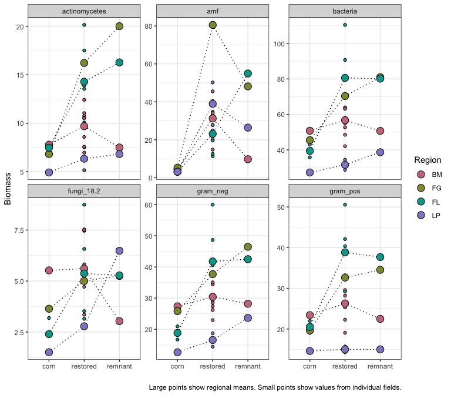
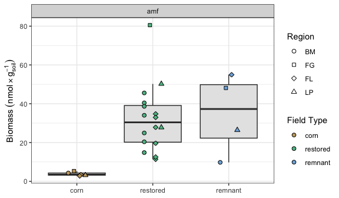

Microbial data: fatty acids (biomass)
================
Beau Larkin

Last updated: 15 December, 2023

- [Description](#description)
- [Packages and libraries](#packages-and-libraries)
- [Functions](#functions)
- [Data](#data)
- [Results](#results)
  - [Biomass in field types and
    regions](#biomass-in-field-types-and-regions)
  - [Ordination with PCA](#ordination-with-pca)
  - [Nutrients and microbial biomass](#nutrients-and-microbial-biomass)
  - [Biomass over field age](#biomass-over-field-age)

# Description

Microbial data include site-species tables derived from high-throughput
sequencing and PLFA/NLFA data which Ylva did.

This presents basic visualizations of microbial biomass inferred with
PLFA/NLFA quantification.

# Packages and libraries

``` r
packages_needed = c("GGally", "tidyverse", "vegan", "colorspace", "ggbeeswarm")
packages_installed = packages_needed %in% rownames(installed.packages())
```

``` r
if (any(!packages_installed)) {
    install.packages(packages_needed[!packages_installed])
}
```

``` r
for (i in 1:length(packages_needed)) {
    library(packages_needed[i], character.only = T)
}
```

# Functions

Cleanplot PCA produces informative visualizations of PCA ordinations
[(Borcard et
al. 2018)](http://link.springer.com/10.1007/978-3-319-71404-2)

``` r
source(paste0(getwd(), "/supporting_files/cleanplot_pca.txt"))
```

# Data

``` r
fa <- read_csv(paste0(getwd(), "/clean_data/plfa.csv"), show_col_types = FALSE)
```

``` r
sites <-
    read_csv(paste0(getwd(), "/clean_data/sites.csv"), show_col_types = FALSE) %>%
    mutate(
        field_type = factor(
            field_type,
            ordered = TRUE,
            levels = c("corn", "restored", "remnant")),
        yr_since = replace(yr_since, which(field_type == "remnant"), "+"),
        yr_since = replace(yr_since, which(field_type == "corn"), "-")) %>%
    select(-lat, -long, -yr_restore, -yr_rank) %>% 
    arrange(field_key)
```

``` r
fa_meta <- 
    sites %>% 
    left_join(fa, by = c("field_key", "field_name"))
fa_grp <- 
    fa_meta %>% 
    select(-starts_with("fa_")) %>% 
    pivot_longer(cols = gram_pos:nlfa_plfa_ratio, names_to = "group", values_to = "qty")
```

# Results

## Biomass in field types and regions

Let’s first visualize the data across regions and field types

``` r
ggplot(
    fa_grp %>% 
        group_by(field_type, region, group) %>% 
        summarize(qty_avg = mean(qty), .groups = "drop") %>% 
        filter(!(group %in% c("pseudo_amf", "nlfa_plfa_ratio"))),
    aes(x = field_type, y = qty_avg, group = region)) +
    facet_wrap(vars(group), scales = "free_y") +
    geom_point(data = fa_grp %>% filter(!(group %in% c("pseudo_amf", "nlfa_plfa_ratio"))), 
                                        aes(x = field_type, y = qty, fill = region), shape = 21) +
    geom_line(linetype = "dotted") +
    geom_point(aes(fill = region), shape = 21, size = 4) +
    scale_fill_discrete_qualitative(name = "Region", palette = "Dark2") +
    labs(x = "", y = "Biomass", 
         caption = "Large points show regional means. Small points show values from individual fields.") +
    theme_bw()
```



We see a variety of patterns across field types. Most often, biomass is
highest in restored fields, with notable exceptions for actionmycetes
and Fermilab. In Blue Mounds, the pattern is consistent across field
types, and the magnitude of difference isn’t large.

Let’s make a figure that can work in the summary.

``` r
ggplot(fa_grp %>% filter(group %in% c("amf", "fungi")), aes(x = field_type, y = qty)) +
    facet_wrap(vars(group), scales = "free_y") +
    geom_boxplot(fill = "gray90", varwidth = FALSE, outlier.shape = NA) +
    geom_beeswarm(aes(shape = region, fill = field_type), size = 2, dodge.width = 0.3) +
    labs(y = expression(Biomass~(nmol%*%g[soil]^-1))) +
    scale_fill_discrete_qualitative(name = "Field Type", palette = "Harmonic") +
    scale_shape_manual(name = "Region", values = c(21, 22, 23, 24)) +
    theme_bw() +
    theme(axis.title.x = element_blank()) +
    guides(fill = guide_legend(override.aes = list(shape = 21)))
```



And one that shows the correlation between AMF and time. Note: there is
no relationship between fungi and time.

``` r
fa_grp %>% 
    filter(group == "amf", field_type == "restored", region == "BM") %>% 
    lm(yr_since ~ qty, data = .) %>% 
    summary()
```

    ## 
    ## Call:
    ## lm(formula = yr_since ~ qty, data = .)
    ## 
    ## Residuals:
    ##      1      2      3      4      5      6      7 
    ## -2.990 -3.363 11.877 -4.477 -3.395 -1.155  3.503 
    ## 
    ## Coefficients:
    ##             Estimate Std. Error t value Pr(>|t|)   
    ## (Intercept)  31.7784     7.5854   4.189  0.00858 **
    ## qty          -0.6282     0.2299  -2.732  0.04116 * 
    ## ---
    ## Signif. codes:  0 '***' 0.001 '**' 0.01 '*' 0.05 '.' 0.1 ' ' 1
    ## 
    ## Residual standard error: 6.426 on 5 degrees of freedom
    ## Multiple R-squared:  0.5989, Adjusted R-squared:  0.5187 
    ## F-statistic: 7.466 on 1 and 5 DF,  p-value: 0.04116

``` r
fa_grp %>% 
    filter(group == "amf", field_type == "restored", region == "BM") %>% 
    ggplot(aes(x = as.numeric(yr_since), y = qty)) +
    geom_smooth(method = "lm", se = FALSE, color = "black", linewidth = 0.4) +
    geom_point(fill = "#5CBD92", shape = 21, size = 2.5) +
    labs(x = "Years since restoration", y = expression(Biomass~(nmol%*%g[soil]^-1))) +
    theme_bw()
```

    ## `geom_smooth()` using formula = 'y ~ x'


## Ordination with PCA

``` r
fa_z <- decostand(data.frame(fa_meta %>% select(field_name, starts_with("fa")), row.names = 1), "standardize")
fa_pca <- rda(fa_z)
fa_pca %>% summary(., display = NULL)
```

    ## 
    ## Call:
    ## rda(X = fa_z) 
    ## 
    ## Partitioning of variance:
    ##               Inertia Proportion
    ## Total              19          1
    ## Unconstrained      19          1
    ## 
    ## Eigenvalues, and their contribution to the variance 
    ## 
    ## Importance of components:
    ##                           PC1    PC2     PC3     PC4     PC5     PC6      PC7
    ## Eigenvalue            14.5776 1.4706 0.97294 0.76415 0.40242 0.21909 0.142786
    ## Proportion Explained   0.7672 0.0774 0.05121 0.04022 0.02118 0.01153 0.007515
    ## Cumulative Proportion  0.7672 0.8446 0.89585 0.93607 0.95725 0.96878 0.976295
    ##                            PC8      PC9     PC10     PC11     PC12     PC13
    ## Eigenvalue            0.134200 0.103824 0.060197 0.050567 0.029799 0.023543
    ## Proportion Explained  0.007063 0.005464 0.003168 0.002661 0.001568 0.001239
    ## Cumulative Proportion 0.983359 0.988823 0.991991 0.994653 0.996221 0.997460
    ##                            PC14      PC15      PC16     PC17      PC18
    ## Eigenvalue            0.0173321 0.0140465 0.0083020 0.004694 0.0033689
    ## Proportion Explained  0.0009122 0.0007393 0.0004369 0.000247 0.0001773
    ## Cumulative Proportion 0.9983724 0.9991117 0.9995487 0.999796 0.9999730
    ##                            PC19
    ## Eigenvalue            5.126e-04
    ## Proportion Explained  2.698e-05
    ## Cumulative Proportion 1.000e+00
    ## 
    ## Scaling 2 for species and site scores
    ## * Species are scaled proportional to eigenvalues
    ## * Sites are unscaled: weighted dispersion equal on all dimensions
    ## * General scaling constant of scores:

Axes 1 and 2 explain 85% of the variation in sites.

``` r
screeplot(fa_pca, bstick = TRUE)
```


Only the first eigenvalue exceeds the broken stick model, which is
unsurprising because Axis 1 explains 77% of the total variation. This
will make these data very easy to use if it holds up.

``` r
cleanplot.pca(fa_pca)
```


This shows that all the biomass indices increase along Axis 1.
Cornfields appear on the left with low biomass, but as biomass
increases, the signal is based on regions, with Blue Mounds, then
Faville Grove, and then Fermi fields appearing in order. Let’s look at
the summary fields to see if there’s anything interesting left.

``` r
fa_sum_z <- decostand(data.frame(fa_meta %>% 
                                 select(field_name, gram_pos, gram_neg, bacteria, fungi, actinomycetes, amf), 
                             row.names = 1), 
                  "standardize")
fa_sum_pca <- rda(fa_sum_z)
fa_sum_pca %>% summary(., display = NULL)
```

    ## 
    ## Call:
    ## rda(X = fa_sum_z) 
    ## 
    ## Partitioning of variance:
    ##               Inertia Proportion
    ## Total               6          1
    ## Unconstrained       6          1
    ## 
    ## Eigenvalues, and their contribution to the variance 
    ## 
    ## Importance of components:
    ##                          PC1    PC2     PC3      PC4      PC5
    ## Eigenvalue            4.8846 0.8460 0.19677 0.052786 0.019770
    ## Proportion Explained  0.8141 0.1410 0.03279 0.008798 0.003295
    ## Cumulative Proportion 0.8141 0.9551 0.98791 0.996705 1.000000
    ## 
    ## Scaling 2 for species and site scores
    ## * Species are scaled proportional to eigenvalues
    ## * Sites are unscaled: weighted dispersion equal on all dimensions
    ## * General scaling constant of scores:

Axes 1 and 2 explain 96% of the variation in sites.

``` r
screeplot(fa_sum_pca, bstick = TRUE)
```


Only the first eigenvalue exceeds the broken stick model, which is
unsurprising because Axis 1 explains 81% of the total variation. This
will make these data very easy to use if it holds up.

``` r
cleanplot.pca(fa_sum_pca)
```


AMF have a strong correlation on a weak axis. It appears that some of
the restored fields have the most AMF, which is what we saw in the
visualization earlier. In this PCA, columns were standardized to
highlight effect sizes and de-emphasize magnitudes. This could be argued
because gram_pos and gram_neg are derivatives of bacteria, for example.
This was run once with raw data (not shown), and the patterns were the
same. The second axis had more importance, showing that the signal with
AMF is probably worth holding on to.

## Nutrients and microbial biomass

See [Soil abiotic properties](soil_properties.md) for a basic comparison
and correlation.

## Biomass over field age

We can compare biomass with restoration age in Blue Mounds fields.

``` r
fa_meta %>% 
    filter(region == "BM", field_type == "restored") %>% 
    mutate(yr_since = as.numeric(yr_since)) %>% 
    select(field_name, yr_since, gram_pos, gram_neg, bacteria, fungi, actinomycetes, amf) %>% 
    ggpairs(columns = 2:ncol(.)) + theme_bw()
```


AMF decline with moderate strength as fields age.
