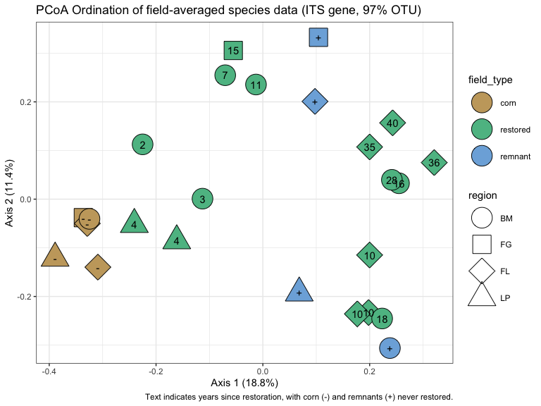
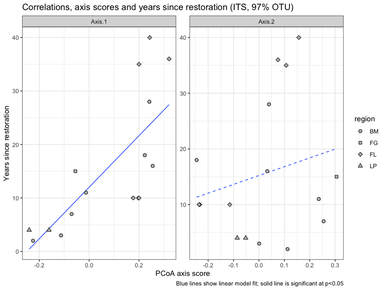
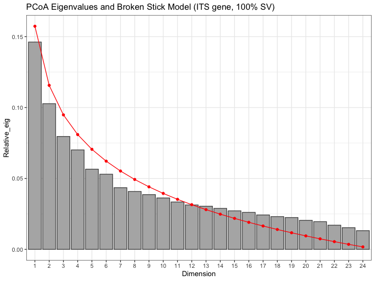
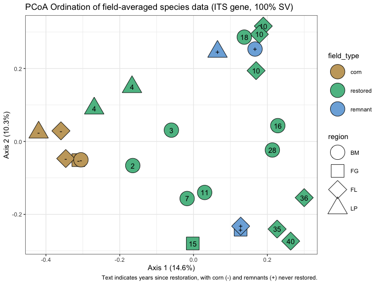
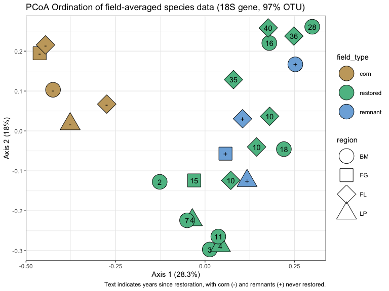
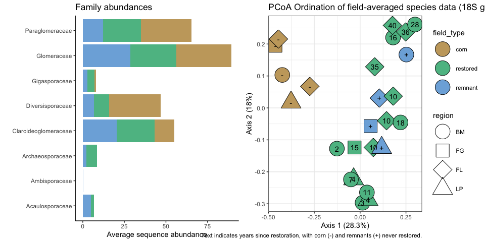
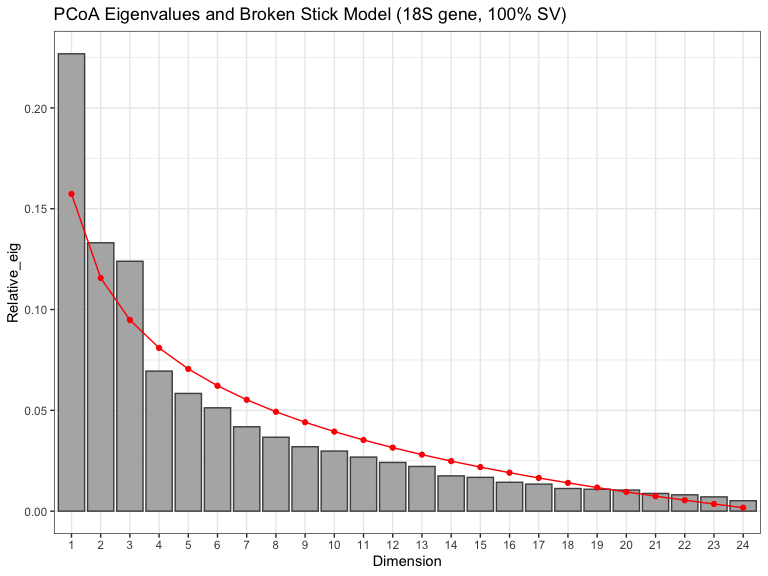
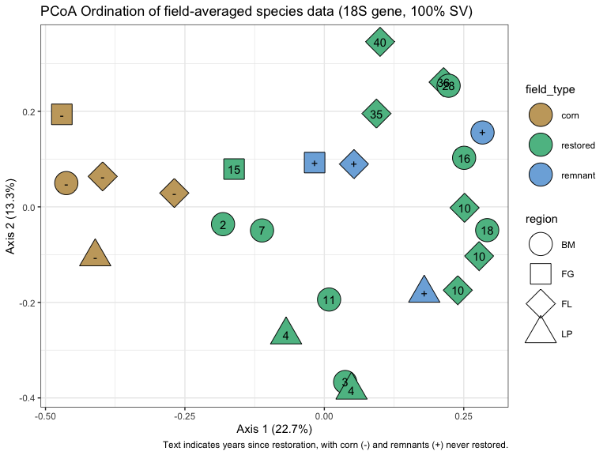

Microbial data: community differences
================
Beau Larkin

Last updated: 17 February, 2023

- <a href="#description" id="toc-description">Description</a>
- <a href="#packages-and-libraries"
  id="toc-packages-and-libraries">Packages and libraries</a>
- <a href="#data" id="toc-data">Data</a>
  - <a href="#sites-species-tables"
    id="toc-sites-species-tables">Sites-species tables</a>
  - <a href="#species-metadata" id="toc-species-metadata">Species
    metadata</a>
  - <a href="#site-metadata" id="toc-site-metadata">Site metadata</a>
  - <a href="#functions" id="toc-functions">Functions</a>
- <a href="#results" id="toc-results">Results</a>
  - <a href="#ordinations" id="toc-ordinations">Ordinations</a>
    - <a href="#pcoa-with-its-gene-otu-clusters"
      id="toc-pcoa-with-its-gene-otu-clusters">PCoA with ITS gene, OTU
      clusters</a>
    - <a href="#pcoa-with-its-gene-sv-clusters"
      id="toc-pcoa-with-its-gene-sv-clusters">PCoA with ITS gene, SV
      clusters</a>
    - <a href="#pcoa-with-18s-gene-otu-clusters"
      id="toc-pcoa-with-18s-gene-otu-clusters">PCoA with 18S gene, OTU
      clusters</a>
    - <a href="#pcoa-with-18s-gene-sv-clusters"
      id="toc-pcoa-with-18s-gene-sv-clusters">PCoA with 18S gene, SV
      clusters</a>

# Description

Microbial data include site-species tables derived from high-throughput
sequencing and clustering in QIIME by Lorinda Bullington and PLFA/NLFA
data which Ylva Lekberg did.

This presents basic visualizations of community differences among
sites/regions based on ITS data.

One goal here is to see whether choosing OTU or SV clusters presents
qualitatively different outcomes in ordinations. We will choose one
(OTUs) if they start to look similar, as they have so far.

Species distance matrices are resampled to the minimum number which
successfully amplified per field. This was done to equalize sampling
effort. This procedure can easily be undone in the [process_data
script](process_data.md)

# Packages and libraries

``` r
packages_needed = c("tidyverse", "vegan", "colorspace", "ape", "knitr", "gridExtra")
packages_installed = packages_needed %in% rownames(installed.packages())
```

``` r
if (any(!packages_installed)) {
    install.packages(packages_needed[!packages_installed])
}
```

``` r
for (i in 1:length(packages_needed)) {
    library(packages_needed[i], character.only = T)
}
```

# Data

## Sites-species tables

CSV files were produced in [process_data.R](process_data.md)

``` r
spe <- list(
    its_otu = read_csv(
        paste0(getwd(), "/clean_data/spe_ITS_otu_siteSpeMatrix_avg.csv"),
        show_col_types = FALSE
    ),
    its_sv  = read_csv(
        paste0(getwd(), "/clean_data/spe_ITS_sv_siteSpeMatrix_avg.csv"),
        show_col_types = FALSE
    ),
    amf_otu = read_csv(
        paste0(getwd(), "/clean_data/spe_18S_otu_siteSpeMatrix_avg.csv"),
        show_col_types = FALSE
    ),
    amf_sv  = read_csv(
        paste0(getwd(), "/clean_data/spe_18S_sv_siteSpeMatrix_avg.csv"),
        show_col_types = FALSE
    )
)
```

## Species metadata

Needed to make inset figures showing most important categories of
species. CSV files were produced in the [microbial diversity
script](microbial_diversity.md).

``` r
spe_meta <- list(
    its_otu =
        read_csv(
            paste0(getwd(), "/clean_data/speGuild_ITS_otu.csv"),
            show_col_types = FALSE
        ),
    its_sv  =
        read_csv(
            paste0(getwd(), "/clean_data/speGuild_ITS_sv.csv"),
            show_col_types = FALSE
        ),
    amf_otu = 
        read_csv(
            paste0(getwd(), "/clean_data/speTaxa_18S_otu.csv"),
            show_col_types = FALSE
        ),
    amf_sv = 
        read_csv(
            paste0(getwd(), "/clean_data/speTaxa_18S_sv.csv"),
            show_col_types = FALSE
        )
)
```

## Site metadata

Needed for figure interpretation and permanova designs.

``` r
sites <- read_csv(paste0(getwd(), "/clean_data/site.csv"), show_col_types = FALSE) %>% 
    mutate(field_type = factor(site_type, ordered = TRUE, levels = c("corn", "restored", "remnant")),
           yr_since = replace(yr_since, which(site_type == "remnant"), "+"),
           yr_since = replace(yr_since, which(site_type == "corn"), "-")) %>% 
    filter(site_type != "oldfield") %>% 
    select(-lat, -long, -yr_restore, -site_type)
```

## Functions

A function handles the Principal Components Analysis (PCoA) diagnostics,
with outputs and figures saved to a list for later use.

``` r
pcoa_fun <- function(data, env=sites, corr="none", d_method="bray", df_name, nperm=1999) {
    # Multivariate analysis
    d <- vegdist(data.frame(data, row.names = 1), d_method)
    p <- pcoa(d, correction = corr)
    p_vals <- data.frame(p$values) %>% 
        rownames_to_column(var = "Dim") %>% 
        mutate(Dim = as.integer(Dim))
    p_vec <- data.frame(p$vectors)
    # Permutation tests (PERMANOVA)
    glo_perm <-
        adonis2(
            data.frame(data, row.names = 1) ~ field_type + region,
            data = env,
            by = NULL,
            permutations = nperm,
            method = d_method
        )
    mar_perm <-
        adonis2(
            data.frame(data, row.names = 1) ~ field_type + region,
            data = env,
            by = "margin",
            permutations = nperm,
            method = d_method
        )
    int_perm <-
        adonis2(
            data.frame(data, row.names = 1) ~ field_type * region,
            data = env,
            by = "margin",
            permutations = nperm,
            method = d_method
        )
    # Diagnostic plots
    if(corr == "none" | ncol(p_vals) == 6) {
        p_bstick <- ggplot(p_vals, aes(x = factor(Dim), y = Relative_eig)) + 
            geom_col(fill = "gray70", color = "gray30") + 
            geom_line(aes(x = Dim, y = Broken_stick), color = "red") +
            geom_point(aes(x = Dim, y = Broken_stick), color = "red") +
            labs(x = "Dimension", 
                 title = paste0("PCoA Eigenvalues and Broken Stick Model (", df_name, ")")) +
            theme_bw()
        p_ncomp <- with(p_vals, which(Relative_eig < Broken_stick)[1]-1)
    } else {
        p_bstick <- ggplot(p_vals, aes(x = factor(Dim), y = Rel_corr_eig)) + 
            geom_col(fill = "gray70", color = "gray30") + 
            geom_line(aes(x = Dim, y = Broken_stick), color = "red") +
            geom_point(aes(x = Dim, y = Broken_stick), color = "red") +
            labs(x = "Dimension", 
                 title = paste0("PCoA Eigenvalues and Broken Stick Model (", df_name, ")")) +
            theme_bw()
        p_ncomp <- with(p_vals, which(Rel_corr_eig < Broken_stick)[1]-1)
    }
    ncomp <- if(p_ncomp <= 2) {2} else {p_ncomp}
    # Ordination plot
    scores <-
        p_vec[, 1:ncomp] %>%
        rownames_to_column(var = "site_key") %>%
        mutate(site_key = as.integer(site_key)) %>%
        left_join(sites, by = "site_key") %>% 
        select(-site_name, -yr_rank)
    eig <- round(p_vals$Relative_eig[1:2] * 100, 1)
    ord <- ggplot(scores, aes(x = Axis.1, y = Axis.2)) +
        geom_point(aes(fill = field_type, shape = region), size = 10) +
        geom_text(aes(label = yr_since)) +
        scale_fill_discrete_qualitative(palette = "harmonic") +
        scale_shape_manual(values = c(21, 22, 23, 24)) +
        labs(x = paste0("Axis 1 (", eig[1], "%)"), 
             y = paste0("Axis 2 (", eig[2], "%)"), 
             title = paste0("PCoA Ordination of field-averaged species data (", df_name, ")"),
             caption = "Text indicates years since restoration, with corn (-) and remnants (+) never restored.") +
        theme_bw() +
        guides(fill = guide_legend(override.aes = list(shape = 21)))
    # Output data
    output <- list(components_exceed_broken_stick = p_ncomp,
                   correction_note = p$note,
                   values = p_vals[1:(ncomp+1), ], 
                   site_vectors = scores,
                   broken_stick_plot = p_bstick,
                   global_permanova = glo_perm,
                   margin_terms_permanova = mar_perm,
                   interaction_terms_permanova = int_perm,
                   ordination_plot = ord)
    return(output)
}
```

# Results

## Ordinations

Bray-Curtis or Ruzicka distance are both appropriate, but Bray-Curtis
has produced axes with better explanatory power (Ruzicka is used with
method=“jaccard”)

In trial runs, no negative eigenvalues were observed (not shown). No
correction is needed for these ordinations.

### PCoA with ITS gene, OTU clusters

``` r
(pcoa_its_otu <- pcoa_fun(spe$its_otu, df_name = "ITS gene, 97% OTU"))
```

    ## $components_exceed_broken_stick
    ## [1] 1
    ## 
    ## $correction_note
    ## [1] "There were no negative eigenvalues. No correction was applied"
    ## 
    ## $values
    ##   Dim Eigenvalues Relative_eig Broken_stick Cumul_eig Cumul_br_stick
    ## 1   1   1.2960817   0.18766105   0.15733159 0.1876611      0.1573316
    ## 2   2   0.7858318   0.11378143   0.11566492 0.3014425      0.2729965
    ## 3   3   0.6014731   0.08708793   0.09483159 0.3885304      0.3678281
    ## 
    ## $site_vectors
    ##    site_key      Axis.1       Axis.2 region yr_since field_type
    ## 1         1  0.25490054  0.032664721     BM       16   restored
    ## 2         2 -0.11301047  0.001028409     BM        3   restored
    ## 3         3 -0.33618559 -0.038014719     FG        -       corn
    ## 4         4  0.10418242  0.332628400     FG        +    remnant
    ## 5         5 -0.05537505  0.305589143     FG       15   restored
    ## 6         6 -0.30889461 -0.139743092     FL        -       corn
    ## 7         7 -0.32867504 -0.050018535     FL        -       corn
    ## 8         8  0.09762778  0.200899274     FL        +    remnant
    ## 9         9  0.24304045  0.156845074     FL       40   restored
    ## 10       10  0.32087603  0.075166871     FL       36   restored
    ## 11       11  0.19999261  0.107291875     FL       35   restored
    ## 12       12  0.19792902 -0.233006248     FL       10   restored
    ## 13       13  0.19989439 -0.114820844     FL       10   restored
    ## 14       14  0.17685928 -0.235833846     FL       10   restored
    ## 15       15  0.24160038  0.039691445     BM       28   restored
    ## 16       16 -0.38898938 -0.121262047     LP        -       corn
    ## 17       17  0.06806734 -0.192814712     LP        +    remnant
    ## 18       18 -0.24069587 -0.051989592     LP        4   restored
    ## 19       19 -0.16126623 -0.085507699     LP        4   restored
    ## 20       20  0.23791412 -0.306044315     BM        +    remnant
    ## 21       21  0.22336297 -0.245273310     BM       18   restored
    ## 22       22 -0.07048459  0.254753127     BM        7   restored
    ## 23       23 -0.22515596  0.112645349     BM        2   restored
    ## 24       24 -0.32465333 -0.040508690     BM        -       corn
    ## 25       25 -0.01286119  0.235633964     BM       11   restored
    ## 
    ## $broken_stick_plot


    ## 
    ## $global_permanova
    ## Permutation test for adonis under reduced model
    ## Permutation: free
    ## Number of permutations: 1999
    ## 
    ## adonis2(formula = data.frame(data, row.names = 1) ~ field_type + region, data = env, permutations = nperm, method = d_method, by = NULL)
    ##          Df SumOfSqs      R2      F Pr(>F)    
    ## Model     5   2.4548 0.35543 2.0954  5e-04 ***
    ## Residual 19   4.4517 0.64457                  
    ## Total    24   6.9065 1.00000                  
    ## ---
    ## Signif. codes:  0 '***' 0.001 '**' 0.01 '*' 0.05 '.' 0.1 ' ' 1
    ## 
    ## $margin_terms_permanova
    ## Permutation test for adonis under reduced model
    ## Marginal effects of terms
    ## Permutation: free
    ## Number of permutations: 1999
    ## 
    ## adonis2(formula = data.frame(data, row.names = 1) ~ field_type + region, data = env, permutations = nperm, method = d_method, by = "margin")
    ##            Df SumOfSqs      R2      F Pr(>F)    
    ## field_type  2   1.1816 0.17108 2.5215  5e-04 ***
    ## region      3   1.2344 0.17872 1.7561  5e-04 ***
    ## Residual   19   4.4517 0.64457                  
    ## Total      24   6.9065 1.00000                  
    ## ---
    ## Signif. codes:  0 '***' 0.001 '**' 0.01 '*' 0.05 '.' 0.1 ' ' 1
    ## 
    ## $interaction_terms_permanova
    ## Permutation test for adonis under reduced model
    ## Marginal effects of terms
    ## Permutation: free
    ## Number of permutations: 1999
    ## 
    ## adonis2(formula = data.frame(data, row.names = 1) ~ field_type * region, data = env, permutations = nperm, method = d_method, by = "margin")
    ##                   Df SumOfSqs      R2      F Pr(>F)
    ## field_type:region  6   1.5247 0.22076 1.1286  0.154
    ## Residual          13   2.9270 0.42381              
    ## Total             24   6.9065 1.00000              
    ## 
    ## $ordination_plot



Axis 1 explains 19% of the variation and is the only eigenvalue that
exceeds a broken stick model. The most substantial variation here will
be on the first axis, although axis 2 explains 11% of the variation and
was very close to the broken stick value. Testing the design factors
*region* and *field_type* revealed a significant global ordination
($R^2=0.36, p<0.001$), with independent factors both significant
(*region:* $R^2=0.18, p<0.001$ and *field_type:* $R^2=0.17, p<0.001$).
An interaction between these factors was not supported.

Community trajectories revealed in the ordination depend on both region
and field type, so it’s not surprising that both were significant.
Faville Grove shows a linear progression from corn to remnant and Lake
Petite does as well, although with few sites and only single restoration
ages these are weak supports. With Blue Mounds sites, the general
progression along Axis 1 is to increase in age from left to right, but
the remnant doesn’t seem representative because it clusters far from
everything else and associates most strongly with the neighboring
restored field (both on Merel Black’s property). Restored fields at
Fermi separate well away from cornfields, but less age structure is
found. Instead, the old restorations in the ring most resemble the
Railroad Remnant (which is in a different soil…), the switchgrass
restored fields take a potentially novel path toward distant remnants.

Here we can also begin considering what an inset plot to display
metadata might look like. There isn’t much room for it…maybe it goes
along side.

``` r
grid.arrange(
    spe_meta$its_otu %>% 
        filter(guild %in% c("Undefined Saprotroph", "Wood Saprotroph", "Plant Pathogen", "Ectomycorrhizal", "Endophyte")) %>% 
        mutate(field_type = factor(field_type, ordered = TRUE, levels = c("corn", "restored", "remnant"))) %>% 
        group_by(guild, field_type) %>% 
        summarize(avg_seq_abund = mean(seq_abund), .groups = "drop") %>% 
        ggplot(aes(x = guild, y = avg_seq_abund)) +
        geom_col(aes(fill = field_type)) +
        labs(x = "",
             y = "Average sequence abundance",
             title = "Guild abundances") +
        scale_fill_discrete_qualitative(palette = "Harmonic") +
        coord_flip() +
        theme_classic() +
        theme(legend.position = "none"),
    pcoa_its_otu$ordination_plot,
    ncol = 2)
```


This is messy but a place to start thinking about Fig 1.

Let’s plot and test the relationship between age and community axis
scores with restored fields only.

``` r
its_yrs_scores <-
    pcoa_its_otu$site_vectors %>%
    filter(field_type == "restored") %>%
    mutate(yr_since = as.numeric(yr_since))
```

``` r
its_yrs_scores %>%
    pivot_longer(Axis.1:Axis.2, names_to = "axis", values_to = "score") %>%
    ggplot(aes(x = score, y = yr_since)) +
    facet_wrap(vars(axis), scales = "free") +
    geom_smooth(aes(linetype = axis), method = "lm", se = FALSE, linewidth = 0.5) +
    geom_point(aes(shape = region), fill = "grey", size = 2) +
    labs(x = "PCoA axis score",
         y = "Years since restoration",
         title = "Correlations, axis scores and years since restoration (ITS, 97% OTU)",
         caption = "Blue lines show linear model fit; solid line is significant at p<0.05") +
    scale_shape_manual(values = c(21, 22, 23, 24)) +
    scale_linetype_manual(values = c('solid', 'dashed'), guide = "none") +
    theme_bw()
```



``` r
summary(lm(
    yr_since ~ Axis.1,
    data = its_yrs_scores
))
```

    ## 
    ## Call:
    ## lm(formula = yr_since ~ Axis.1, data = its_yrs_scores)
    ## 
    ## Residuals:
    ##      Min       1Q   Median       3Q      Max 
    ## -11.6313  -5.6395  -0.3284   4.6838  16.2933 
    ## 
    ## Coefficients:
    ##             Estimate Std. Error t value Pr(>|t|)    
    ## (Intercept)   12.016      2.348   5.118 0.000156 ***
    ## Axis.1        48.101     11.728   4.101 0.001079 ** 
    ## ---
    ## Signif. codes:  0 '***' 0.001 '**' 0.01 '*' 0.05 '.' 0.1 ' ' 1
    ## 
    ## Residual standard error: 8.732 on 14 degrees of freedom
    ## Multiple R-squared:  0.5458, Adjusted R-squared:  0.5133 
    ## F-statistic: 16.82 on 1 and 14 DF,  p-value: 0.001079

Indeed, Axis 1 does correlate well with age ($R^2_{Adj}=0.51, p<0.005$).

### PCoA with ITS gene, SV clusters

``` r
(pcoa_its_sv <- pcoa_fun(spe$its_sv, df_name = "ITS gene, 100% SV"))
```

    ## $components_exceed_broken_stick
    ## [1] 0
    ## 
    ## $correction_note
    ## [1] "There were no negative eigenvalues. No correction was applied"
    ## 
    ## $values
    ##   Dim Eigenvalues Relative_eig Broken_stick Cumul_eig Cumul_br_stick
    ## 1   1   1.2364457    0.1461826   0.15733159 0.1461826      0.1573316
    ## 2   2   0.8688881    0.1027269   0.11566492 0.2489095      0.2729965
    ## 3   3   0.6732607    0.0795983   0.09483159 0.3285078      0.3678281
    ## 
    ## $site_vectors
    ##    site_key       Axis.1      Axis.2 region yr_since field_type
    ## 1         1  0.228372854  0.04324407     BM       16   restored
    ## 2         2 -0.060047395  0.03094817     BM        3   restored
    ## 3         3 -0.312148463 -0.05131920     FG        -       corn
    ## 4         4  0.127600193 -0.24207926     FG        +    remnant
    ## 5         5 -0.002052479 -0.27982650     FG       15   restored
    ## 6         6 -0.359415144  0.02894177     FL        -       corn
    ## 7         7 -0.346315485 -0.04694436     FL        -       corn
    ## 8         8  0.127791978 -0.23240718     FL        +    remnant
    ## 9         9  0.263271363 -0.27333537     FL       40   restored
    ## 10       10  0.299913299 -0.15421044     FL       36   restored
    ## 11       11  0.226499671 -0.24030247     FL       35   restored
    ## 12       12  0.189053479  0.31618201     FL       10   restored
    ## 13       13  0.169569336  0.19414150     FL       10   restored
    ## 14       14  0.178331017  0.29377414     FL       10   restored
    ## 15       15  0.213658408 -0.02353288     BM       28   restored
    ## 16       16 -0.419904114  0.02461810     LP        -       corn
    ## 17       17  0.064906143  0.24614409     LP        +    remnant
    ## 18       18 -0.269266434  0.09057551     LP        4   restored
    ## 19       19 -0.166780586  0.14919457     LP        4   restored
    ## 20       20  0.166614569  0.25332561     BM        +    remnant
    ## 21       21  0.137522349  0.28606425     BM       18   restored
    ## 22       22 -0.017397836 -0.15661180     BM        7   restored
    ## 23       23 -0.164699603 -0.06619936     BM        2   restored
    ## 24       24 -0.305202410 -0.05039218     BM        -       corn
    ## 25       25  0.030125291 -0.13999278     BM       11   restored
    ## 
    ## $broken_stick_plot



    ## 
    ## $global_permanova
    ## Permutation test for adonis under reduced model
    ## Permutation: free
    ## Number of permutations: 1999
    ## 
    ## adonis2(formula = data.frame(data, row.names = 1) ~ field_type + region, data = env, permutations = nperm, method = d_method, by = NULL)
    ##          Df SumOfSqs      R2      F Pr(>F)    
    ## Model     5   2.7841 0.32916 1.8645  5e-04 ***
    ## Residual 19   5.6741 0.67084                  
    ## Total    24   8.4582 1.00000                  
    ## ---
    ## Signif. codes:  0 '***' 0.001 '**' 0.01 '*' 0.05 '.' 0.1 ' ' 1
    ## 
    ## $margin_terms_permanova
    ## Permutation test for adonis under reduced model
    ## Marginal effects of terms
    ## Permutation: free
    ## Number of permutations: 1999
    ## 
    ## adonis2(formula = data.frame(data, row.names = 1) ~ field_type + region, data = env, permutations = nperm, method = d_method, by = "margin")
    ##            Df SumOfSqs      R2      F Pr(>F)    
    ## field_type  2   1.2479 0.14753 2.0893  5e-04 ***
    ## region      3   1.4860 0.17569 1.6586  1e-03 ***
    ## Residual   19   5.6741 0.67084                  
    ## Total      24   8.4582 1.00000                  
    ## ---
    ## Signif. codes:  0 '***' 0.001 '**' 0.01 '*' 0.05 '.' 0.1 ' ' 1
    ## 
    ## $interaction_terms_permanova
    ## Permutation test for adonis under reduced model
    ## Marginal effects of terms
    ## Permutation: free
    ## Number of permutations: 1999
    ## 
    ## adonis2(formula = data.frame(data, row.names = 1) ~ field_type * region, data = env, permutations = nperm, method = d_method, by = "margin")
    ##                   Df SumOfSqs      R2   F Pr(>F)
    ## field_type:region  6   1.9107 0.22590 1.1 0.1495
    ## Residual          13   3.7634 0.44494           
    ## Total             24   8.4582 1.00000           
    ## 
    ## $ordination_plot



No axes are justified by the broken stick model. Otherwise, the results
match what was found with OTU-based data with weaker support.

### PCoA with 18S gene, OTU clusters

``` r
(pcoa_amf_otu <- pcoa_fun(spe$amf_otu, df_name = "18S gene, 97% OTU"))
```

    ## $components_exceed_broken_stick
    ## [1] 4
    ## 
    ## $correction_note
    ## [1] "No correction was applied to the negative eigenvalues"
    ## 
    ## $values
    ##   Dim Eigenvalues Relative_eig Rel_corr_eig Broken_stick Cum_corr_eig
    ## 1   1   1.2533089   0.28307121   0.25486475   0.16236050    0.2548648
    ## 2   2   0.7966543   0.17993161   0.16377631   0.11888224    0.4186411
    ## 3   3   0.6181320   0.13961073   0.12816664   0.09714311    0.5468077
    ## 4   4   0.4345447   0.09814586   0.09154665   0.08265036    0.6383544
    ## 5   5   0.2899475   0.06548728   0.06270401   0.07178079    0.7010584
    ##   Cumul_br_stick
    ## 1      0.1623605
    ## 2      0.2812427
    ## 3      0.3783858
    ## 4      0.4610362
    ## 5      0.5328170
    ## 
    ## $site_vectors
    ##    site_key      Axis.1      Axis.2      Axis.3       Axis.4 region yr_since
    ## 1         1  0.17960251  0.22024798  0.16592760 -0.187634653     BM       16
    ## 2         2  0.01331246 -0.29685350  0.08283035 -0.275310244     BM        3
    ## 3         3 -0.46194691  0.19461878 -0.12470922 -0.099373406     FG        -
    ## 4         4  0.05717869 -0.05684856 -0.30666428 -0.027093205     FG        +
    ## 5         5 -0.03037600 -0.12382982 -0.23770107 -0.263216613     FG       15
    ## 6         6 -0.27451679  0.06729149  0.08818132  0.056165081     FL        -
    ## 7         7 -0.44548504  0.21561905  0.10777466 -0.226467210     FL        -
    ## 8         8  0.10490547  0.03068910 -0.18413380  0.025660578     FL        +
    ## 9         9  0.17651914  0.25823448 -0.18848226  0.058977247     FL       40
    ## 10       10  0.24826704  0.23779356 -0.09767402  0.099271839     FL       36
    ## 11       11  0.07957656  0.12872131 -0.09501942  0.172347075     FL       35
    ## 12       12  0.14405735 -0.04003275  0.18936046  0.113128053     FL       10
    ## 13       13  0.18045975  0.03671461  0.07691901  0.086296518     FL       10
    ## 14       14  0.07186550 -0.12372139  0.25245194  0.037130214     FL       10
    ## 15       15  0.29949203  0.26104775 -0.07327061 -0.018288130     BM       28
    ## 16       16 -0.37670797  0.01736850  0.17867309  0.114750870     LP        -
    ## 17       17  0.11744238 -0.12472557  0.15803931  0.022024012     LP        +
    ## 18       18 -0.03551381 -0.22308594  0.02107269  0.184120536     LP        4
    ## 19       19  0.04327353 -0.28791892  0.09686637  0.006663137     LP        4
    ## 20       20  0.25228475  0.16686884  0.22536601 -0.139829345     BM        +
    ## 21       21  0.22032284 -0.04546710  0.09533819 -0.023776713     BM       18
    ## 22       22 -0.05007588 -0.22392642 -0.12811692  0.095979882     BM        7
    ## 23       23 -0.12656929 -0.12742291 -0.16612786 -0.020905522     BM        2
    ## 24       24 -0.42453047  0.10312791  0.03000277  0.214850023     BM        -
    ## 25       25  0.03716218 -0.26451047 -0.16690428 -0.005470025     BM       11
    ##    field_type
    ## 1    restored
    ## 2    restored
    ## 3        corn
    ## 4     remnant
    ## 5    restored
    ## 6        corn
    ## 7        corn
    ## 8     remnant
    ## 9    restored
    ## 10   restored
    ## 11   restored
    ## 12   restored
    ## 13   restored
    ## 14   restored
    ## 15   restored
    ## 16       corn
    ## 17    remnant
    ## 18   restored
    ## 19   restored
    ## 20    remnant
    ## 21   restored
    ## 22   restored
    ## 23   restored
    ## 24       corn
    ## 25   restored
    ## 
    ## $broken_stick_plot


    ## 
    ## $global_permanova
    ## Permutation test for adonis under reduced model
    ## Permutation: free
    ## Number of permutations: 1999
    ## 
    ## adonis2(formula = data.frame(data, row.names = 1) ~ field_type + region, data = env, permutations = nperm, method = d_method, by = NULL)
    ##          Df SumOfSqs      R2      F Pr(>F)    
    ## Model     5   1.8673 0.42174 2.7714  5e-04 ***
    ## Residual 19   2.5603 0.57826                  
    ## Total    24   4.4275 1.00000                  
    ## ---
    ## Signif. codes:  0 '***' 0.001 '**' 0.01 '*' 0.05 '.' 0.1 ' ' 1
    ## 
    ## $margin_terms_permanova
    ## Permutation test for adonis under reduced model
    ## Marginal effects of terms
    ## Permutation: free
    ## Number of permutations: 1999
    ## 
    ## adonis2(formula = data.frame(data, row.names = 1) ~ field_type + region, data = env, permutations = nperm, method = d_method, by = "margin")
    ##            Df SumOfSqs      R2      F Pr(>F)    
    ## field_type  2   1.1242 0.25392 4.1715 0.0005 ***
    ## region      3   0.7074 0.15978 1.7499 0.0180 *  
    ## Residual   19   2.5603 0.57826                  
    ## Total      24   4.4275 1.00000                  
    ## ---
    ## Signif. codes:  0 '***' 0.001 '**' 0.01 '*' 0.05 '.' 0.1 ' ' 1
    ## 
    ## $interaction_terms_permanova
    ## Permutation test for adonis under reduced model
    ## Marginal effects of terms
    ## Permutation: free
    ## Number of permutations: 1999
    ## 
    ## adonis2(formula = data.frame(data, row.names = 1) ~ field_type * region, data = env, permutations = nperm, method = d_method, by = "margin")
    ##                   Df SumOfSqs      R2      F Pr(>F)
    ## field_type:region  6   0.8003 0.18075 0.9852 0.5125
    ## Residual          13   1.7600 0.39751              
    ## Total             24   4.4275 1.00000              
    ## 
    ## $ordination_plot



Four axes are significant by a broken stick model, between them
explaining 64% of the variation in AMF among fields. It may be
worthwhile to examine structure on Axes 3 and 4 sometime. The most
substantial variation here is on the first axis (28%) with Axis 2
explaining 18% of the variation in AMF abundances. Testing the design
factors *region* and *field_type* revealed a significant global
ordination ($R^2=0.42, p<0.001$), with independent factors both
significant (*region:* $R^2=0.16, p<0.05$ and *field_type:*
$R^2=0.25, p<0.001$). An interaction between these factors was not
supported.

Community trajectories revealed in the ordination depend on both region
and field type, so it’s not surprising that both were significant. Corn
fields stand well apart with AMF communities, with restored and remnant
fields clustering closer than we had seen with ITS-identified fungi.
Restoration age along Axis 1 follows a near-linear progression in Blue
Mounds fields; with Fermi, we see a weaker age progression and instead a
strong separation between “ring fields” and switchgrass plots as before.
Restored fields’ fidelity to remnants seems stronger with AMF than we
had seen with general fungi.

What’s becoming apparent here is that Axis 1 separates strongly on
*field_type* and years since restoration, and Axis 2 further separates
on years since restoration. A consistent signal of region isn’t obvious.

Here we can also begin considering what an inset plot to display
metadata might look like. There isn’t much room for it…maybe it goes
along side.

``` r
grid.arrange(
spe_meta$amf_otu %>% 
    mutate(field_type = factor(field_type, ordered = TRUE, levels = c("corn", "restored", "remnant"))) %>% 
    group_by(family, field_type) %>% 
    summarize(avg_seq_abund = mean(seq_abund), .groups = "drop") %>% 
    ggplot(aes(x = family, y = avg_seq_abund)) +
    geom_col(aes(fill = field_type)) +
    labs(x = "",
         y = "Average sequence abundance",
         title = "Family abundances") +
    scale_fill_discrete_qualitative(palette = "Harmonic") +
    coord_flip() +
    theme_classic() +
    theme(legend.position = "none"),
pcoa_amf_otu$ordination_plot,
ncol = 2)
```



Again, messy but useful.

Let’s test the relationship between age and community axis scores with
restored fields only.

``` r
amf_yrs_scores <-
    pcoa_amf_otu$site_vectors %>%
    filter(field_type == "restored") %>%
    mutate(yr_since = as.numeric(yr_since))
```

``` r
amf_yrs_scores %>%
    pivot_longer(Axis.1:Axis.2, names_to = "axis", values_to = "score") %>%
    ggplot(aes(x = score, y = yr_since)) +
    facet_wrap(vars(axis), scales = "free") +
    geom_smooth(method = "lm", se = FALSE, linewidth = 0.5) +
    geom_point(aes(shape = region), fill = "grey", size = 2) +
    labs(x = "PCoA axis score",
         y = "Years since restoration",
         title = "Correlations, axis scores and years since restoration (AMF, 97% OTU)",
         caption = "Blue lines show linear model fit; solid lines are significant at p<0.05") +
    scale_shape_manual(values = c(21, 22, 23, 24)) +
    theme_bw()
```


``` r
summary(lm(
    yr_since ~ Axis.1,
    data = amf_yrs_scores
))
```

    ## 
    ## Call:
    ## lm(formula = yr_since ~ Axis.1, data = amf_yrs_scores)
    ## 
    ## Residuals:
    ##     Min      1Q  Median      3Q     Max 
    ## -11.586  -6.538  -2.333   2.657  20.185 
    ## 
    ## Coefficients:
    ##             Estimate Std. Error t value Pr(>|t|)   
    ## (Intercept)    9.474      3.109   3.047  0.00870 **
    ## Axis.1        67.120     20.955   3.203  0.00638 **
    ## ---
    ## Signif. codes:  0 '***' 0.001 '**' 0.01 '*' 0.05 '.' 0.1 ' ' 1
    ## 
    ## Residual standard error: 9.842 on 14 degrees of freedom
    ## Multiple R-squared:  0.4229, Adjusted R-squared:  0.3817 
    ## F-statistic: 10.26 on 1 and 14 DF,  p-value: 0.006383

``` r
summary(lm(
    yr_since ~ Axis.2,
    data = amf_yrs_scores
))
```

    ## 
    ## Call:
    ## lm(formula = yr_since ~ Axis.2, data = amf_yrs_scores)
    ## 
    ## Residuals:
    ##     Min      1Q  Median      3Q     Max 
    ## -12.860  -3.588   0.853   4.433  10.846 
    ## 
    ## Coefficients:
    ##             Estimate Std. Error t value Pr(>|t|)    
    ## (Intercept)   17.536      1.795   9.768 1.25e-07 ***
    ## Axis.2        51.418      8.912   5.769 4.86e-05 ***
    ## ---
    ## Signif. codes:  0 '***' 0.001 '**' 0.01 '*' 0.05 '.' 0.1 ' ' 1
    ## 
    ## Residual standard error: 7.05 on 14 degrees of freedom
    ## Multiple R-squared:  0.7039, Adjusted R-squared:  0.6828 
    ## F-statistic: 33.29 on 1 and 14 DF,  p-value: 4.857e-05

Both axes correlate significantly and strongly with years since
restoration. Axis 2 shows a stronger relationship
($R^2_{Adj}=0.68, p<0.001), and Axis 1 shows a moderate relationship ($R^2\_{Adj}=0.38,
p\<0.01)

### PCoA with 18S gene, SV clusters

``` r
(pcoa_amf_sv <- pcoa_fun(spe$amf_sv, df_name = "18S gene, 100% SV"))
```

    ## $components_exceed_broken_stick
    ## [1] 3
    ## 
    ## $correction_note
    ## [1] "There were no negative eigenvalues. No correction was applied"
    ## 
    ## $values
    ##   Dim Eigenvalues Relative_eig Broken_stick Cumul_eig Cumul_br_stick
    ## 1   1   1.4904272   0.22684348   0.15733159 0.2268435      0.1573316
    ## 2   2   0.8745433   0.13310576   0.11566492 0.3599492      0.2729965
    ## 3   3   0.8142649   0.12393137   0.09483159 0.4838806      0.3678281
    ## 4   4   0.4563891   0.06946257   0.08094270 0.5533432      0.4487708
    ## 
    ## $site_vectors
    ##    site_key       Axis.1       Axis.2        Axis.3 region yr_since field_type
    ## 1         1  0.250677580  0.102690806  0.1701605300     BM       16   restored
    ## 2         2  0.037328589 -0.366736812 -0.1072372492     BM        3   restored
    ## 3         3 -0.470674383  0.193691622  0.0815349664     FG        -       corn
    ## 4         4 -0.017411126  0.092725342 -0.3049573525     FG        +    remnant
    ## 5         5 -0.161872435  0.079139555 -0.3305573555     FG       15   restored
    ## 6         6 -0.268980843  0.028961615  0.1208826487     FL        -       corn
    ## 7         7 -0.397472988  0.063728786  0.2734587918     FL        -       corn
    ## 8         8  0.053185893  0.089539929 -0.1121977129     FL        +    remnant
    ## 9         9  0.099979201  0.345501726 -0.0995884782     FL       40   restored
    ## 10       10  0.213848945  0.261083632  0.0296464886     FL       36   restored
    ## 11       11  0.093482563  0.195321607 -0.0664152413     FL       35   restored
    ## 12       12  0.277567682 -0.103056604  0.1370571071     FL       10   restored
    ## 13       13  0.251511094 -0.001919801  0.1308461477     FL       10   restored
    ## 14       14  0.239324318 -0.174549088  0.1295896039     FL       10   restored
    ## 15       15  0.222863061  0.253629504  0.0124649558     BM       28   restored
    ## 16       16 -0.410818073 -0.104482044  0.2872089453     LP        -       corn
    ## 17       17  0.179109167 -0.180728910  0.1143354606     LP        +    remnant
    ## 18       18 -0.068564508 -0.268175401  0.0009229837     LP        4   restored
    ## 19       19  0.048721801 -0.383559775  0.0307436805     LP        4   restored
    ## 20       20  0.283659834  0.155735161  0.1700423043     BM        +    remnant
    ## 21       21  0.292032148 -0.048759923  0.0623578961     BM       18   restored
    ## 22       22 -0.111736895 -0.049347351 -0.3361010480     BM        7   restored
    ## 23       23 -0.181643270 -0.036209921 -0.2566312533     BM        2   restored
    ## 24       24 -0.462659340  0.049764321  0.1277572543     BM        -       corn
    ## 25       25  0.008541984 -0.193987976 -0.2653240739     BM       11   restored
    ## 
    ## $broken_stick_plot



    ## 
    ## $global_permanova
    ## Permutation test for adonis under reduced model
    ## Permutation: free
    ## Number of permutations: 1999
    ## 
    ## adonis2(formula = data.frame(data, row.names = 1) ~ field_type + region, data = env, permutations = nperm, method = d_method, by = NULL)
    ##          Df SumOfSqs      R2      F Pr(>F)    
    ## Model     5   2.5647 0.39035 2.4331  5e-04 ***
    ## Residual 19   4.0056 0.60965                  
    ## Total    24   6.5703 1.00000                  
    ## ---
    ## Signif. codes:  0 '***' 0.001 '**' 0.01 '*' 0.05 '.' 0.1 ' ' 1
    ## 
    ## $margin_terms_permanova
    ## Permutation test for adonis under reduced model
    ## Marginal effects of terms
    ## Permutation: free
    ## Number of permutations: 1999
    ## 
    ## adonis2(formula = data.frame(data, row.names = 1) ~ field_type + region, data = env, permutations = nperm, method = d_method, by = "margin")
    ##            Df SumOfSqs      R2      F Pr(>F)    
    ## field_type  2   1.3395 0.20387 3.1769  5e-04 ***
    ## region      3   1.1714 0.17828 1.8521  3e-03 ** 
    ## Residual   19   4.0056 0.60965                  
    ## Total      24   6.5703 1.00000                  
    ## ---
    ## Signif. codes:  0 '***' 0.001 '**' 0.01 '*' 0.05 '.' 0.1 ' ' 1
    ## 
    ## $interaction_terms_permanova
    ## Permutation test for adonis under reduced model
    ## Marginal effects of terms
    ## Permutation: free
    ## Number of permutations: 1999
    ## 
    ## adonis2(formula = data.frame(data, row.names = 1) ~ field_type * region, data = env, permutations = nperm, method = d_method, by = "margin")
    ##                   Df SumOfSqs      R2      F Pr(>F)
    ## field_type:region  6   1.3329 0.20287 1.0806 0.2865
    ## Residual          13   2.6727 0.40678              
    ## Total             24   6.5703 1.00000              
    ## 
    ## $ordination_plot



These results align strongly with those obtained from OTU clusters, with
just slightly weaker support. Suggest that we continue with only OTUs
from here on out.
