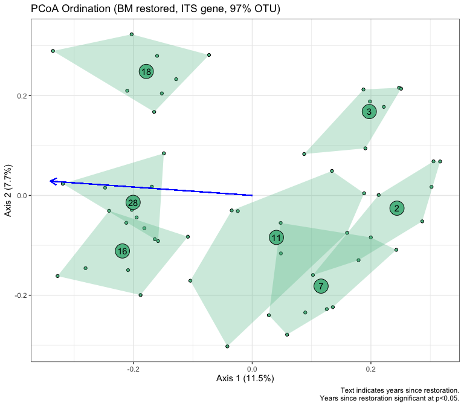
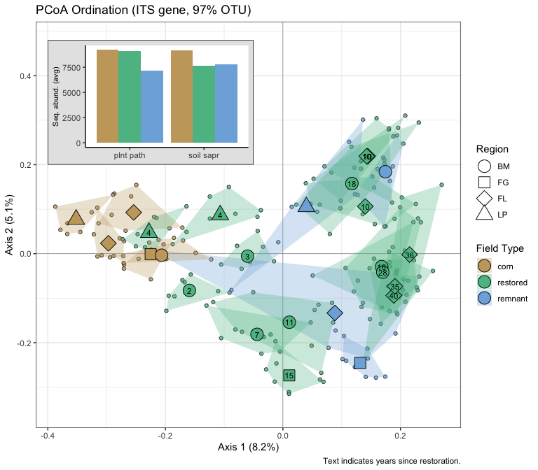
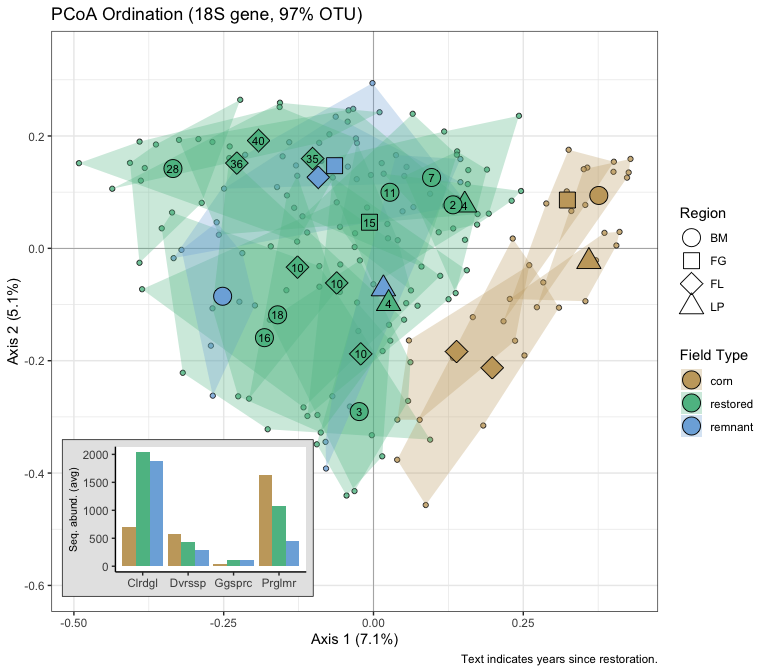
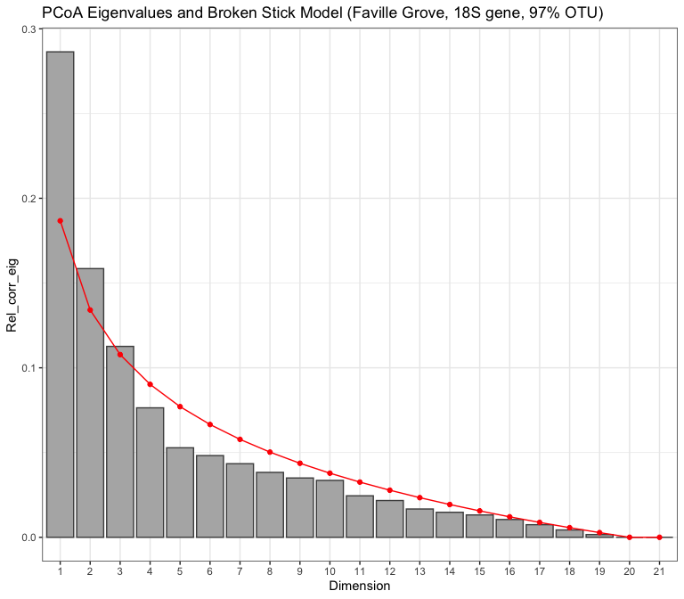

Microbial data: community differences
================
Beau Larkin

Last updated: 08 December, 2023

- [Description](#description)
- [Packages and libraries](#packages-and-libraries)
  - [Functions](#functions)
- [Data](#data)
  - [Site metadata](#site-metadata)
  - [Sites-species tables](#sites-species-tables)
  - [Species metadata](#species-metadata)
  - [Distance tables](#distance-tables)
- [Results](#results)
  - [ITS gene, OTU clustering](#its-gene-otu-clustering)
    - [PCoA with abundances summed in
      fields](#pcoa-with-abundances-summed-in-fields)
    - [PCoA with Blue Mounds restored fields, all
      subsamples](#pcoa-with-blue-mounds-restored-fields-all-subsamples)
    - [PCoA with all fields and regions, all
      subsamples](#pcoa-with-all-fields-and-regions-all-subsamples)
    - [PCoA in Faville Grove, all
      subsamples](#pcoa-in-faville-grove-all-subsamples)
    - [PCoA in Fermilab, all
      subsamples](#pcoa-in-fermilab-all-subsamples)
    - [PCoA in Lake Petite Prairie, all
      subsamples](#pcoa-in-lake-petite-prairie-all-subsamples)
    - [PCoA ordination, all regions, all
      subsamples](#pcoa-ordination-all-regions-all-subsamples)
  - [18S gene, OTU clustering](#18s-gene-otu-clustering)
    - [PCoA with abundances summed in fields, Bray-Curtis
      distance](#pcoa-with-abundances-summed-in-fields-bray-curtis-distance)
    - [PCoA with abundances summed in fields, UNIFRAC
      distance](#pcoa-with-abundances-summed-in-fields-unifrac-distance)
    - [PCoA with Blue Mounds restored fields, all
      subsamples](#pcoa-with-blue-mounds-restored-fields-all-subsamples-1)
    - [PCoA with all fields and regions, all
      subsamples](#pcoa-with-all-fields-and-regions-all-subsamples-1)
    - [PCoA in Blue Mounds, all
      subsamples](#pcoa-in-blue-mounds-all-subsamples-1)
    - [PCoA in Faville Grove, all
      subsamples](#pcoa-in-faville-grove-all-subsamples-1)
    - [PCoA in Fermilab, all
      subsamples](#pcoa-in-fermilab-all-subsamples-1)
    - [PCoA in Lake Petite Prairie, all
      subsamples](#pcoa-in-lake-petite-prairie-all-subsamples-1)
    - [PCoA ordination, all regions, all
      subsamples](#pcoa-ordination-all-regions-all-subsamples-1)

# Description

Microbial data include site-species tables derived from high-throughput
sequencing and clustering in QIIME by Lorinda Bullington and PLFA/NLFA
data which Ylva Lekberg did.

This presents basic visualizations of community differences among
sites/regions based on ITS and 18S data.

During data processing, not all subsamples were retained. Some had
failed to amplify and others had very few sequences, leading to the
potential for a loss of information during rarefication. With the loss
of some subsamples, all fields were resampled to the same lower number
of samples. This was done to equalize sampling effort (from a
statistical perspective). This procedure can easily be undone in the
[process_data script](process_data.md). Whether 9, 8, or 7 subsamples
are retained, the interpretation of analyses presented here would be the
same (not shown).

Pairwise contrasts in multivariate analysis were accomplished with a
custom function adapted from [O’Leary et
al. 2021](https://link.springer.com/article/10.1007/s12237-021-00917-2).

# Packages and libraries

``` r
packages_needed = c("tidyverse", "vegan", "colorspace", "ape", "knitr", "gridExtra")
packages_installed = packages_needed %in% rownames(installed.packages())
```

``` r
if (any(!packages_installed)) {
    install.packages(packages_needed[!packages_installed])
}
```

``` r
for (i in 1:length(packages_needed)) {
    library(packages_needed[i], character.only = T)
}
```

## Functions

Functions handle the Principal Components Analysis (PCoA) diagnostics,
with outputs and figures saved to a list for later use.

- `pcoa_fun()` is used with data where samples have been summed in
  fields.
- `pcoa_samps_fun()` is used with rarefied subsample data from all
  fields.
- `pcoa_samps_bm_fun()` is used for the subsample data from Blue Mounds
  restored fields. The variable **yr_since** is continuous with this
  dataset and is tested with `envfit()`.

**Functions are stored** in a separate
[script](supporting_files/microbial_communities_functions.md) to reduce
clutter here and allow for easier editing.

``` r
source("supporting_files/microbial_communities_functions.R")
```

# Data

## Site metadata

Needed for figure interpretation and permanova designs. The subset of
restored fields in Blue Mounds only will also be used and is parsed
here.

``` r
sites <-
    read_csv(paste0(getwd(), "/clean_data/sites.csv"), show_col_types = FALSE) %>%
    mutate(
        field_type = factor(
            field_type,
            ordered = TRUE,
            levels = c("corn", "restored", "remnant")),
        yr_since = replace(yr_since, which(field_type == "remnant"), NA),
        yr_since = replace(yr_since, which(field_type == "corn"), NA)) %>%
    select(-lat, -long, -yr_restore, -yr_rank) %>% 
    arrange(field_key)
sites_resto_bm <- 
    sites %>% 
    filter(field_type == "restored",
           region == "BM") %>% 
    select(-field_name, -region) %>% 
    mutate(yr_since = as.numeric(yr_since))   
```

## Sites-species tables

Sites-species tables with rarefied sequence abundances. This list
includes composition summarized by fields or unsummarized (all samples).
It also includes subsets by region. All subsets have zero sum columns
removed.  
CSV files were produced in [process_data.R](process_data.md)

``` r
spe <- list(
    its = read_csv(
        paste0(getwd(), "/clean_data/spe_ITS_rfy.csv"),
        show_col_types = FALSE
    ),
    its_samps = read_csv(
        paste0(getwd(), "/clean_data/spe_ITS_rfy_samples.csv"),
        show_col_types = FALSE
    ),
    its_samps_bm = read_csv(
        paste0(getwd(), "/clean_data/spe_ITS_rfy_samples.csv"),
        show_col_types = FALSE
    ) %>% 
        left_join(sites %>% select(field_key, region), by = join_by(field_key)) %>% 
        filter(region == "BM") %>% 
        select(-region),
    its_samps_fg = read_csv(
        paste0(getwd(), "/clean_data/spe_ITS_rfy_samples.csv"),
        show_col_types = FALSE
    ) %>% 
        left_join(sites %>% select(field_key, region), by = join_by(field_key)) %>% 
        filter(region == "FG") %>% 
        select(-region),
    its_samps_fl = read_csv(
        paste0(getwd(), "/clean_data/spe_ITS_rfy_samples.csv"),
        show_col_types = FALSE
    ) %>% 
        left_join(sites %>% select(field_key, region), by = join_by(field_key)) %>% 
        filter(region == "FL") %>% 
        select(-region),
    its_samps_lp = read_csv(
        paste0(getwd(), "/clean_data/spe_ITS_rfy_samples.csv"),
        show_col_types = FALSE
    ) %>% 
        left_join(sites %>% select(field_key, region), by = join_by(field_key)) %>% 
        filter(region == "LP") %>% 
        select(-region),
    amf = read_csv(
        paste0(getwd(), "/clean_data/spe_18S_rfy.csv"),
        show_col_types = FALSE
    ),
    amf_samps = read_csv(
        paste0(getwd(), "/clean_data/spe_18S_rfy_samples.csv"),
        show_col_types = FALSE
    ),
    amf_samps_bm = read_csv(
        paste0(getwd(), "/clean_data/spe_18S_rfy_samples.csv"),
        show_col_types = FALSE
    ) %>% 
        left_join(sites %>% select(field_key, region), by = join_by(field_key)) %>% 
        filter(region == "BM") %>% 
        select(-region),
    amf_samps_fg = read_csv(
        paste0(getwd(), "/clean_data/spe_18S_rfy_samples.csv"),
        show_col_types = FALSE
    ) %>% 
        left_join(sites %>% select(field_key, region), by = join_by(field_key)) %>% 
        filter(region == "FG") %>% 
        select(-region),
    amf_samps_fl = read_csv(
        paste0(getwd(), "/clean_data/spe_18S_rfy_samples.csv"),
        show_col_types = FALSE
    ) %>% 
        left_join(sites %>% select(field_key, region), by = join_by(field_key)) %>% 
        filter(region == "FL") %>% 
        select(-region),
    amf_samps_lp = read_csv(
        paste0(getwd(), "/clean_data/spe_18S_rfy_samples.csv"),
        show_col_types = FALSE
    ) %>% 
        left_join(sites %>% select(field_key, region), by = join_by(field_key)) %>% 
        filter(region == "LP") %>% 
        select(-region)
) %>% 
    map(. %>% select(where( ~ sum(.) != 0)))
```

## Species metadata

Needed to make inset figures showing most important categories of
species. The OTUs and sequence abundances in these files matches the
rarefied data in `spe$` above. CSV files were produced in the guild
taxonomy [script](microbial_guild_taxonomy.md).

``` r
spe_meta <- list(
    its =
        read_csv(
            paste0(getwd(), "/clean_data/speTaxa_ITS_rfy.csv"),
            show_col_types = FALSE
        ),
    amf = 
        read_csv(
            paste0(getwd(), "/clean_data/speTaxa_18S_rfy.csv"),
            show_col_types = FALSE
        )
)
```

## Distance tables

Creating distance objects from the samples-species tables is done with
the typical process of `vegdist()` in vegan. Bray-Curtis or Ruzicka
(used with method=“jaccard”) distance are both appropriate methods for
these data, but Bray-Curtis has produced axes with better explanatory
power. With the 18S data, we can take advantage of phylogenetic
relationships in a UNIFRAC distance matrix. The UNIFRAC distance was
produced in QIIME II and needs some wrangling to conform to the
standards of a distance object in R. The following list contains
vegdist-produced distance objects for ITS and 18S, and it includes
UNIFRAC distance for 18S.

**List of objects in `distab`**

- its: the rarefied data, summed from 8 samples in each field
- its_samps: rarefied data from 8 samples per field, all fields retained
- its_resto_bm: rarefied data, summed from 8 samples in each field,
  filtered to include Blue Mounds region only
- its_resto_samps_bm: rarefied data from 8 samples in each field, not
  summed, filtered to include Blue Mounds region only
- amf_bray: rarefied data, summed from 7 samples from each field,
  bray-curtis distance
- amf_uni: rarefied data, summed from 7 samples from each field, UNIFRAC
  distance
- *gene_samps_region*: objects are distances matrices taken from
  rarefied data, subsetted to region, with zero sum columns removed.
  Samples in each field depend on the gene-based dataset, see above.

``` r
distab <- list(
    its       = vegdist(data.frame(spe$its, row.names = 1), method = "bray"),
    its_samps = vegdist(
        data.frame(
            spe$its_samps %>% 
                mutate(field_sample = paste(field_key, sample, sep = "_")) %>% 
                column_to_rownames(var = "field_sample") %>% 
                select(-field_key, -sample)
        ) %>% select(where(~ sum(.) > 0)), method = "bray"),
    its_resto_bm = vegdist(
        data.frame(
            spe$its %>% 
                filter(field_key %in% sites_resto_bm$field_key), 
            row.names = 1
        ) %>% select(where(~ sum(.) > 0)), method = "bray"),
    its_resto_samps_bm = vegdist(
        data.frame(
            spe$its_samps %>% 
                filter(field_key %in% sites_resto_bm$field_key) %>% 
                mutate(field_sample = paste(field_key, sample, sep = "_")) %>% 
                column_to_rownames(var = "field_sample") %>% 
                select(-field_key, -sample)
        ) %>% select(where(~ sum(.) > 0)), method = "bray"),
    its_samps_bm = vegdist(
        data.frame(
            spe$its_samps_bm %>% 
                mutate(field_sample = paste(field_key, sample, sep = "_")) %>% 
                column_to_rownames(var = "field_sample") %>% 
                select(-field_key, -sample)
        ) # zero sum columns were already removed in the spe list
    ),
    its_samps_fg = vegdist(
        data.frame(
            spe$its_samps_fg %>% 
                mutate(field_sample = paste(field_key, sample, sep = "_")) %>% 
                column_to_rownames(var = "field_sample") %>% 
                select(-field_key, -sample)
        ) # zero sum columns were already removed in the spe list
    ),
    its_samps_fl = vegdist(
        data.frame(
            spe$its_samps_fl %>% 
                mutate(field_sample = paste(field_key, sample, sep = "_")) %>% 
                column_to_rownames(var = "field_sample") %>% 
                select(-field_key, -sample)
        ) # zero sum columns were already removed in the spe list
    ),
    its_samps_lp = vegdist(
        data.frame(
            spe$its_samps_lp %>% 
                mutate(field_sample = paste(field_key, sample, sep = "_")) %>% 
                column_to_rownames(var = "field_sample") %>% 
                select(-field_key, -sample)
        ) # zero sum columns were already removed in the spe list
    ),
    amf_bray  = vegdist(data.frame(spe$amf, row.names = 1), method = "bray"),
    amf_samps = vegdist(
        data.frame(
            spe$amf_samps %>% 
                mutate(field_sample = paste(field_key, sample, sep = "_")) %>% 
                column_to_rownames(var = "field_sample") %>% 
                select(-field_key, -sample)
        ) %>% select(where(~ sum(.) > 0)), method = "bray"),
    amf_resto_bm = vegdist(
        data.frame(
            spe$amf %>% 
                filter(field_key %in% sites_resto_bm$field_key), 
            row.names = 1
        ) %>% select(where(~ sum(.) > 0)), method = "bray"),
    amf_resto_samps_bm = vegdist(
        data.frame(
            spe$amf_samps %>% 
                filter(field_key %in% sites_resto_bm$field_key) %>% 
                mutate(field_sample = paste(field_key, sample, sep = "_")) %>% 
                column_to_rownames(var = "field_sample") %>% 
                select(-field_key, -sample)
        ) %>% select(where(~ sum(.) > 0)), method = "bray"),
    amf_samps_bm = vegdist(
        data.frame(
            spe$amf_samps_bm %>% 
                mutate(field_sample = paste(field_key, sample, sep = "_")) %>% 
                column_to_rownames(var = "field_sample") %>% 
                select(-field_key, -sample)
        ) # zero sum columns were already removed in the spe list
    ),
    amf_samps_fg = vegdist(
        data.frame(
            spe$amf_samps_fg %>% 
                mutate(field_sample = paste(field_key, sample, sep = "_")) %>% 
                column_to_rownames(var = "field_sample") %>% 
                select(-field_key, -sample)
        ) # zero sum columns were already removed in the spe list
    ),
    amf_samps_fl = vegdist(
        data.frame(
            spe$amf_samps_fl %>% 
                mutate(field_sample = paste(field_key, sample, sep = "_")) %>% 
                column_to_rownames(var = "field_sample") %>% 
                select(-field_key, -sample)
        ) # zero sum columns were already removed in the spe list
    ),
    amf_samps_lp = vegdist(
        data.frame(
            spe$amf_samps_lp %>% 
                mutate(field_sample = paste(field_key, sample, sep = "_")) %>% 
                column_to_rownames(var = "field_sample") %>% 
                select(-field_key, -sample)
        ) # zero sum columns were already removed in the spe list
    ),
    amf_uni   = sites %>%
        select(field_name, field_key) %>%
        left_join(
            read_delim(paste0(getwd(), "/otu_tables/18S/18S_weighted_Unifrac.tsv"), show_col_types = FALSE),
            by = join_by(field_name)) %>%
        select(field_key, everything(),-field_name) %>%
        data.frame(row.names = 1) %>%
        as.dist()
) 
```

# Results

#### Ordinations

Bray-Curtis or Ruzicka distance are both appropriate, but Bray-Curtis
has produced axes with better explanatory power.

## ITS gene, OTU clustering

### PCoA with abundances summed in fields

In trial runs, no negative eigenvalues were observed (not shown). No
correction is needed for these ordinations.

``` r
(pcoa_its <- pcoa_fun(spe$its, distab$its, df_name = "ITS gene, 97% OTU"))
```

    ## 'nperm' >= set of all permutations: complete enumeration.

    ## Set of permutations < 'minperm'. Generating entire set.

    ## $dataset
    ## [1] "ITS gene, 97% OTU"
    ## 
    ## $components_exceed_broken_stick
    ## [1] 1
    ## 
    ## $correction_note
    ## [1] "There were no negative eigenvalues. No correction was applied"
    ## 
    ## $values
    ##   Dim Eigenvalues Relative_eig Broken_stick Cumul_eig Cumul_br_stick
    ## 1   1   1.2818654   0.18671240   0.15733159 0.1867124      0.1573316
    ## 2   2   0.7882231   0.11481005   0.11566492 0.3015224      0.2729965
    ## 3   3   0.5913308   0.08613135   0.09483159 0.3876538      0.3678281
    ## 
    ## $eigenvalues
    ## [1] 18.7 11.5
    ## 
    ## $site_vectors
    ##    field_key      Axis.1      Axis.2 region field_type yr_since
    ## 1          1  0.22607677 -0.05401729     BM   restored       16
    ## 2          2 -0.10528413  0.00807968     BM   restored        3
    ## 3          3 -0.33104767  0.02349812     FG       corn       NA
    ## 4          4  0.10258413 -0.30097180     FG    remnant       NA
    ## 5          5 -0.05624169 -0.28778719     FG   restored       15
    ## 6          6 -0.29409258  0.12809316     FL       corn       NA
    ## 7          7 -0.32551703  0.02660515     FL       corn       NA
    ## 8          8  0.09462297 -0.22087154     FL    remnant       NA
    ## 9          9  0.24952110 -0.19256794     FL   restored       40
    ## 10        10  0.32349895 -0.07846786     FL   restored       36
    ## 11        11  0.22078865 -0.16689368     FL   restored       35
    ## 12        12  0.21459850  0.24030092     FL   restored       10
    ## 13        13  0.18470410  0.11598156     FL   restored       10
    ## 14        14  0.19516043  0.25477250     FL   restored       10
    ## 15        15  0.24532984 -0.05294369     BM   restored       28
    ## 16        16 -0.37695201  0.12192455     LP       corn       NA
    ## 17        17  0.07300567  0.18013874     LP    remnant       NA
    ## 18        18 -0.24415081  0.06569095     LP   restored        4
    ## 19        19 -0.14633045  0.09264854     LP   restored        4
    ## 20        20  0.24412444  0.31041894     BM    remnant       NA
    ## 21        21  0.19053903  0.27783460     BM   restored       18
    ## 22        22 -0.11003906 -0.21709580     BM   restored        7
    ## 23        23 -0.22242096 -0.09024545     BM   restored        2
    ## 24        24 -0.33877552  0.02915715     BM       corn       NA
    ## 25        25 -0.01370266 -0.21328232     BM   restored       11
    ## 
    ## $broken_stick_plot


    ## 
    ## $permanova
    ## Permutation test for adonis under reduced model
    ## Terms added sequentially (first to last)
    ## Blocks:  strata 
    ## Permutation: free
    ## Number of permutations: 1999
    ## 
    ## adonis2(formula = d ~ field_type, data = env, permutations = nperm, add = if (corr == "none") FALSE else "lingoes", strata = region)
    ##            Df SumOfSqs      R2     F Pr(>F)    
    ## field_type  2   1.2182 0.17744 2.373  5e-04 ***
    ## Residual   22   5.6472 0.82256                 
    ## Total      24   6.8655 1.00000                 
    ## ---
    ## Signif. codes:  0 '***' 0.001 '**' 0.01 '*' 0.05 '.' 0.1 ' ' 1
    ## 
    ## $pairwise_contrasts
    ## 
    ## 
    ## group1     group2        R2   F_value   df1   df2     p_value   p_value_adj
    ## ---------  --------  ------  --------  ----  ----  ----------  ------------
    ## restored   corn       0.156     3.518     1    19   0.0015000        0.0045
    ## restored   remnant    0.055     1.057     1    18   0.1225000        0.1225
    ## corn       remnant    0.289     2.846     1     7   0.0416667        0.0625

Axis 1 explains 18.7% of the variation and is the only eigenvalue that
exceeds a broken stick model. The most substantial variation here will
be on the first axis, although axis 2 explains 11.5% of the variation
and was very close to the broken stick value. Testing the design factor
*field_type* (with *region* treated as a block using the `strata`
argument of `adonis2`) revealed a significant clustering
$(R^2=0.18,~p=5\times 10^{-4})$.

Let’s view a plot with abundances of community subgroups inset.

``` r
pcoa_its$ord <-
    ggplot(pcoa_its$site_vectors, aes(x = Axis.1, y = Axis.2)) +
    geom_point(aes(fill = field_type, shape = region), size = 8) +
    geom_text(aes(label = yr_since), size = 4) +
    scale_fill_discrete_qualitative(palette = "harmonic") +
    scale_shape_manual(values = c(21, 22, 23, 24)) +
    labs(
        x = paste0("Axis 1 (", pcoa_its$eig[1], "%)"),
        y = paste0("Axis 2 (", pcoa_its$eig[2], "%)"),
        title = paste0(
            "PCoA Ordination of field-averaged species data (",
            pcoa_its$dataset,
            ")"
        ),
        caption = "Text in icons for restored fields indicates years since restoration."
    ) +
    lims(y = c(-0.35,0.44)) +
    theme_bw() +
    guides(fill = guide_legend(override.aes = list(shape = 21)))
pcoa_its$inset <-
    spe_meta$its %>%
    filter(primary_lifestyle %in% c("plant_pathogen", "soil_saprotroph")) %>%
    mutate(field_type = factor(field_type, ordered = TRUE, levels = c("corn", "restored", "remnant"))) %>%
    group_by(primary_lifestyle, field_type, field_name) %>%
    summarize(sum_seq_abund = sum(seq_abund), .groups = "drop_last") %>% 
    summarize(avg_seq_abund = mean(sum_seq_abund), .groups = "drop") %>%
    ggplot(aes(x = primary_lifestyle, y = avg_seq_abund, fill = field_type)) +
    geom_col(position = "dodge") +
    labs(y = "Seq. abund. (avg)") +
    scale_fill_discrete_qualitative(palette = "Harmonic") +
    scale_x_discrete(label = c("plnt path", "soil sapr")) +
    # coord_flip() +
    theme_classic() +
    theme(legend.position = "none", axis.title.x = element_blank())
```

``` r
pcoa_its$ord +
    annotation_custom(
        ggplotGrob(pcoa_its$inset + theme(
            plot.background = element_rect(colour = "black", fill = "gray90")
        )),
        xmin = -0.38,
        xmax = -0.05,
        ymin = 0.17,
        ymax = 0.46
    )
```

    ## Warning: Removed 9 rows containing missing values (`geom_text()`).


Community trajectories revealed in the ordination clearly depend on both
region and field type. Faville Grove shows a linear progression from
corn to remnant and Lake Petite does as well, although with few sites
and only single restoration ages these are weak supports. With Blue
Mounds sites, the general progression along Axis 1 is to increase in age
from left to right, but the remnant doesn’t seem representative because
it clusters far from everything else and associates most strongly with
the neighboring restored field (both on Merel Black’s property).
Restored fields at Fermi separate well away from cornfields, but less
age structure is found. Instead, the old restorations in the ring most
resemble the Railroad Remnant (which is in a different soil…), the
switchgrass restored fields take a potentially novel path toward distant
remnants.

On axis 1, four clusters are apparent in at least two partitioning
schemes. It will be interesting to see if we can pull those apart with
explanatory variables.

Restoration age will be explored in-depth with the subset of restoration
fields.

Here we can also begin considering what an inset plot to display
metadata might look like. Let’s plot and test the relationship between
age and community axis scores with restored fields only.

``` r
its_resto_scores <-
    pcoa_its$site_vectors %>%
    filter(field_type == "restored") %>%
    mutate(yr_since = as.numeric(yr_since))
```

``` r
summary(lm(Axis.1 ~ yr_since,
           data = its_resto_scores))
```

    ## 
    ## Call:
    ## lm(formula = Axis.1 ~ yr_since, data = its_resto_scores)
    ## 
    ## Residuals:
    ##      Min       1Q   Median       3Q      Max 
    ## -0.18232 -0.08971 -0.03239  0.10500  0.20698 
    ## 
    ## Coefficients:
    ##              Estimate Std. Error t value Pr(>|t|)    
    ## (Intercept) -0.108124   0.053362  -2.026 0.062234 .  
    ## yr_since     0.011574   0.002705   4.278 0.000765 ***
    ## ---
    ## Signif. codes:  0 '***' 0.001 '**' 0.01 '*' 0.05 '.' 0.1 ' ' 1
    ## 
    ## Residual standard error: 0.1311 on 14 degrees of freedom
    ## Multiple R-squared:  0.5666, Adjusted R-squared:  0.5357 
    ## F-statistic:  18.3 on 1 and 14 DF,  p-value: 0.000765

``` r
its_resto_scores %>%
    pivot_longer(Axis.1:Axis.2, names_to = "axis", values_to = "score") %>%
    ggplot(aes(x = yr_since, y = score)) +
    facet_wrap(vars(axis), scales = "free") +
    geom_smooth(aes(linetype = axis), method = "lm", se = FALSE, linewidth = 0.5) +
    geom_point(aes(shape = region), fill = "grey", size = 2) +
    labs(x = "Years since restoration",
         y = "PCoA axis score",
         title = "Correlations, axis scores and years since restoration (ITS, 97% OTU)",
         caption = "Blue lines show linear model fit; solid line is significant at p<0.05") +
    scale_shape_manual(values = c(21, 22, 23, 24)) +
    scale_linetype_manual(values = c('solid', 'dashed'), guide = "none") +
    theme_bw()
```


Indeed, Axis 1 does correlate well with age $(R^2_{Adj}=0.51,~p<0.005)$.
But it isn’t appropriate to use these scores for the correlation because
they were created with the corn and remnant fields in the ordination as
well.

The most appropriate way to look at communities vs. field age is with
the Blue Mounds restored fields. The function `pcoa_its_samps_bm()` will
take care of this. Field age will be fitted to the ordination and tested
using `envfit()`.

### PCoA with Blue Mounds restored fields, all subsamples

In trial runs, no negative eigenvalues were observed (not shown). No
correction is needed for these ordinations.

``` r
(pcoa_its_resto_samps_bm <- pcoa_samps_bm_fun(spe$its_samps, 
                                        distab$its_resto_samps_bm, 
                                        sites_resto_bm, 
                                        df_name="BM restored, ITS gene, 97% OTU"))
```

    ## Set of permutations < 'minperm'. Generating entire set.
    ## Set of permutations < 'minperm'. Generating entire set.

    ## $dataset
    ## [1] "BM restored, ITS gene, 97% OTU"
    ## 
    ## $components_exceed_broken_stick
    ## [1] 2
    ## 
    ## $correction_note
    ## [1] "There were no negative eigenvalues. No correction was applied"
    ## 
    ## $values
    ##   Dim Eigenvalues Relative_eig Broken_stick Cumul_eig Cumul_br_stick
    ## 1   1    2.142943   0.11527303   0.08352022 0.1152730     0.08352022
    ## 2   2    1.423869   0.07659266   0.06533840 0.1918657     0.14885863
    ## 3   3    1.026479   0.05521625   0.05624749 0.2470819     0.20510612
    ## 
    ## $eigenvalues
    ## [1] 11.5  7.7
    ## 
    ## $site_vectors
    ## # A tibble: 56 × 5
    ##    field_key sample_key  Axis.1  Axis.2 yr_since
    ##        <dbl> <chr>        <dbl>   <dbl>    <dbl>
    ##  1         1 1          -0.184  -0.203        16
    ##  2         1 2          -0.215  -0.0516       16
    ##  3         1 4          -0.180  -0.0711       16
    ##  4         1 5          -0.278  -0.139        16
    ##  5         1 6          -0.328  -0.168        16
    ##  6         1 7          -0.0975 -0.0780       16
    ##  7         1 9          -0.207  -0.154        16
    ##  8         1 10         -0.243  -0.0372       16
    ##  9         2 1           0.241   0.218         3
    ## 10         2 2           0.0900  0.0772        3
    ## # ℹ 46 more rows
    ## 
    ## $broken_stick_plot


    ## 
    ## $permanova
    ## Permutation test for adonis under reduced model
    ## Terms added sequentially (first to last)
    ## Permutation: free
    ## Number of permutations: 1999
    ## 
    ## adonis2(formula = d ~ field_key, data = env_w, permutations = nperm)
    ##           Df SumOfSqs      R2      F Pr(>F)    
    ## field_key  1   0.7818 0.04205 2.3706  5e-04 ***
    ## Residual  54  17.8084 0.95795                  
    ## Total     55  18.5902 1.00000                  
    ## ---
    ## Signif. codes:  0 '***' 0.001 '**' 0.01 '*' 0.05 '.' 0.1 ' ' 1
    ## 
    ## $vector_fit
    ## 
    ## ***VECTORS
    ## 
    ##             Axis.1    Axis.2     r2 Pr(>r)  
    ## yr_since -0.998110  0.061394 0.7267  0.024 *
    ## ---
    ## Signif. codes:  0 '***' 0.001 '**' 0.01 '*' 0.05 '.' 0.1 ' ' 1
    ## Plots: field_key, plot permutation: free
    ## Permutation: none
    ## Number of permutations: 5039
    ## 
    ## 
    ## 
    ## $vector_fit_scores
    ##              Axis.1     Axis.2
    ## yr_since -0.8508586 0.05233604

Axis 1 explains 11.5% and axis 2 explains 7.7% of the variation in the
community data. Both axes are important based on the broken stick model.
Indeed, the first four axes are borderline important. The relatively low
percent variation explained is partly due to the high number of
dimensions used when all samples from fields are included. The fidelity
of samples to fields was significant based on a permutation test
$(R^2=0.04,~p=5\times 10^{-4})$. In this case, the partial $R^2$ shows
the proportion of sum of squares from the total. It is a low number here
because so much unexplained variation exists, resulting in a high sum of
squares that is outside the assignment of subsamples to fields.

Years since restoration has a moderately strong correlation with
communities and was significant with a permutation test where samples
were constrained within fields to account for lack of independence \#’
$(R^2=0.73,~p=0.02)$.

Let’s view an ordination plot with hulls around subsamples and a fitted
vector for field age overlaid.

``` r
centroid_its_bm <- aggregate(cbind(Axis.1, Axis.2) ~ field_key, data = pcoa_its_resto_samps_bm$site_vectors, mean) %>% 
    left_join(sites %>% select(field_key, yr_since), by = join_by(field_key))
hull_its_bm <- pcoa_its_resto_samps_bm$site_vectors %>% 
    group_by(field_key) %>% 
    slice(chull(Axis.1, Axis.2))
```

``` r
ggplot(pcoa_its_resto_samps_bm$site_vectors, aes(x = Axis.1, y = Axis.2)) +
    geom_point(fill = "#5CBD92", shape = 21) +
    geom_polygon(data = hull_its_bm, aes(group = as.character(field_key)), fill = "#5CBD92", alpha = 0.3) +
    geom_point(data = centroid_its_bm, fill = "#5CBD92", size = 8, shape = 21) +
    geom_text(data = centroid_its_bm, aes(label = yr_since)) +
    geom_segment(aes(x = 0, 
                     y = 0, 
                     xend = pcoa_its_resto_samps_bm$vector_fit_scores[1] * 0.4, 
                     yend = pcoa_its_resto_samps_bm$vector_fit_scores[2] * 0.4),
                 color = "blue", 
                 arrow = arrow(length = unit(3, "mm"))) +
    labs(
        x = paste0("Axis 1 (", pcoa_its_resto_samps_bm$eigenvalues[1], "%)"),
        y = paste0("Axis 2 (", pcoa_its_resto_samps_bm$eigenvalues[2], "%)"),
        title = paste0(
            "PCoA Ordination (",
            pcoa_its_resto_samps_bm$dataset,
            ")"
        ),
        caption = "Text indicates years since restoration.\nYears since restoration significant at p<0.05."
    ) +
    theme_bw() +
    theme(legend.position = "none")
```



### PCoA with all fields and regions, all subsamples

This leverages the information from all subsamples. Modifications to
`how()` from package
[permute](https://cran.r-project.org/package=permute) allow for the more
complex design.

Negative eigenvalues were produced in trial runs (not shown). A Lingoes
correction was applied.

``` r
(pcoa_its_samps <- pcoa_samps_fun(spe$its_samps, 
                                  distab$its_samps, 
                                  corr="lingoes", 
                                  df_name = "ITS gene, 97% OTU"))
```

    ## 'nperm' >= set of all permutations: complete enumeration.

    ## Set of permutations < 'minperm'. Generating entire set.

    ## $dataset
    ## [1] "ITS gene, 97% OTU"
    ## 
    ## $components_exceed_broken_stick
    ## [1] 10
    ## 
    ## $correction_note
    ## [1] "Lingoes correction applied to negative eigenvalues: D' = -0.5*D^2 - 0.0603012878273266 , except diagonal elements"
    ## 
    ## $values
    ##    Dim Eigenvalues Corr_eig Rel_corr_eig Broken_stick Cum_corr_eig Cum_br_stick
    ## 1    1    6.657630 6.717932   0.08081338   0.02963639   0.08081338   0.02963639
    ## 2    2    4.149459 4.209760   0.05064133   0.02458589   0.13145471   0.05422228
    ## 3    3    3.303665 3.363966   0.04046684   0.02206064   0.17192155   0.07628292
    ## 4    4    2.632132 2.692434   0.03238864   0.02037713   0.20431019   0.09666005
    ## 5    5    2.141163 2.201464   0.02648252   0.01911451   0.23079272   0.11577456
    ## 6    6    2.023596 2.083898   0.02506825   0.01810441   0.25586097   0.13387896
    ## 7    7    1.700335 1.760636   0.02117958   0.01726266   0.27704055   0.15114162
    ## 8    8    1.478604 1.538905   0.01851226   0.01654115   0.29555281   0.16768277
    ## 9    9    1.348697 1.408998   0.01694955   0.01590984   0.31250236   0.18359262
    ## 10  10    1.294192 1.354493   0.01629388   0.01534867   0.32879625   0.19894129
    ## 11  11    1.163270 1.223571   0.01471895   0.01484362   0.34351520   0.21378492
    ## 
    ## $eigenvalues
    ## [1] 8.1 5.1
    ## 
    ## $site_vectors
    ## # A tibble: 200 × 16
    ##    field_key sample_key  Axis.1   Axis.2  Axis.3  Axis.4   Axis.5   Axis.6
    ##        <dbl> <chr>        <dbl>    <dbl>   <dbl>   <dbl>    <dbl>    <dbl>
    ##  1         1 1           0.179  -0.128   -0.0366  0.0725  0.0582  -0.107  
    ##  2         1 2           0.222   0.0754  -0.0252  0.0122 -0.00156 -0.215  
    ##  3         1 4           0.192  -0.0470  -0.0165 -0.0285 -0.0257  -0.122  
    ##  4         1 5           0.179  -0.00853 -0.121   0.202  -0.0281   0.0264 
    ##  5         1 6           0.210   0.0110  -0.120   0.173   0.0137  -0.171  
    ##  6         1 7           0.0485 -0.0482   0.0231  0.105  -0.0337   0.0281 
    ##  7         1 9           0.120  -0.0852  -0.0642  0.0959  0.0610  -0.0373 
    ##  8         1 10          0.186   0.0127  -0.0757  0.0363 -0.0222  -0.0186 
    ##  9         2 1          -0.0540 -0.00876  0.328  -0.0538 -0.0643   0.00992
    ## 10         2 2          -0.0424  0.0505   0.0910 -0.0177 -0.136   -0.122  
    ## # ℹ 190 more rows
    ## # ℹ 8 more variables: Axis.7 <dbl>, Axis.8 <dbl>, Axis.9 <dbl>, Axis.10 <dbl>,
    ## #   field_name <chr>, region <chr>, field_type <ord>, yr_since <dbl>
    ## 
    ## $broken_stick_plot


    ## 
    ## $permanova
    ## Permutation test for adonis under reduced model
    ## Terms added sequentially (first to last)
    ## Blocks:  region 
    ## Plots: field_key, plot permutation: free
    ## Permutation: none
    ## Number of permutations: 1999
    ## 
    ## adonis2(formula = d ~ field_type, data = env_w, permutations = gl_perm_design)
    ##             Df SumOfSqs      R2      F Pr(>F)    
    ## field_type   2    5.758 0.08095 8.6764  0.001 ***
    ## Residual   197   65.371 0.91905                  
    ## Total      199   71.129 1.00000                  
    ## ---
    ## Signif. codes:  0 '***' 0.001 '**' 0.01 '*' 0.05 '.' 0.1 ' ' 1
    ## 
    ## $pairwise_contrasts
    ##     group1  group2    R2 F_value df1 df2   p_value p_value_adj
    ## 1 restored    corn 0.066  11.692   1 166 0.0005000   0.0015000
    ## 2 restored remnant 0.018   2.827   1 158 0.2360000   0.2360000
    ## 3     corn remnant 0.134  10.854   1  70 0.1428571   0.2142857
    ## 
    ## $format
    ## [1] "pandoc"

``` r
write_delim(pcoa_its_samps$permanova, "microbial_communities_files/pcoa_its_samps_permanova.txt")
write_delim(pcoa_its_samps$pairwise_contrasts, "microbial_communities_files/pcoa_its_samps_pairwise.txt")
```

Axis 1 explains 8.1% and axis 2 explains 5.1% of the variation in the
community data. Both axes are important based on the broken stick model,
in fact, the broken stick model shows that 10 axes are important in
explaining variation with this dataset. The relatively low percent
variation explained on axes 1 and 2 is partly due to the high number of
dimensions used when all samples from fields are included. The fidelity
of samples to fields was strong based on a permutation test when
restricting permutations to fields (=plots in `how()`) within regions
(=blocks in `how()`) $(R^2=0.08,~p=0.001)$.

Let’s view an ordination plot with hulls around subsamples.

``` r
centroid_its <- aggregate(cbind(Axis.1, Axis.2) ~ field_key, data = pcoa_its_samps$site_vectors, mean) %>% 
    left_join(sites %>% select(field_key, yr_since, field_type, region), by = join_by(field_key))
hull_its <- pcoa_its_samps$site_vectors %>% 
    group_by(field_key) %>% 
    slice(chull(Axis.1, Axis.2))
```

``` r
its_samps_fig <- 
    ggplot(pcoa_its_samps$site_vectors, aes(x = Axis.1, y = Axis.2)) +
    geom_vline(xintercept = 0, linewidth = 0.1) +
    geom_hline(yintercept = 0, linewidth = 0.1) +
    geom_point(aes(fill = field_type), shape = 21, alpha = 0.8, color = "gray10") +
    geom_polygon(data = hull_its, aes(group = field_key, fill = field_type), alpha = 0.3) +
    geom_point(data = centroid_its, aes(fill = field_type, shape = region), size = 6) +
    geom_text(data = centroid_its, aes(label = yr_since), size = 3) +
    labs(
        x = paste0("Axis 1 (", pcoa_its_samps$eigenvalues[1], "%)"),
        y = paste0("Axis 2 (", pcoa_its_samps$eigenvalues[2], "%)"),
        title = paste0(
            "PCoA Ordination (",
            pcoa_its_samps$dataset,
            ")"
        ),
        caption = "Text indicates years since restoration."
    ) +
    lims(y = c(-0.35, 0.48)) +
    scale_fill_discrete_qualitative(name = "Field Type", palette = "Harmonic") +
    scale_shape_manual(name = "Region", values = c(21, 22, 23, 24)) +
    theme_bw() +
    guides(fill = guide_legend(override.aes = list(shape = 21)))
```

``` r
(its_samps_guilds_fig <- 
    its_samps_fig +
    annotation_custom(
        ggplotGrob(
            pcoa_its$inset + 
                theme(
            plot.background = element_rect(colour = "black", fill = "gray90"), 
            axis.title.y = element_text(size = 8)
        )),
        xmin = -0.40,
        xmax = -0.05,
        ymin = 0.20,
        ymax = 0.48
    ))
```

    ## Warning: Removed 9 rows containing missing values (`geom_text()`).



#### PCoA in Blue Mounds, all subsamples

This is as above with the diagnostics and permutation tests. Pairwise
contrasts among field types should be ignored here because there is no
replication.

``` r
(pcoa_its_samps_bm <- pcoa_samps_fun(
    s = spe$its_samps_bm,
    d = distab$its_samps_bm,
    env = sites %>% filter(region == "BM"),
    corr = "none",
    df_name = "Blue Mounds, ITS gene, 97% OTU"
))
```

    ## $dataset
    ## [1] "Blue Mounds, ITS gene, 97% OTU"
    ## 
    ## $components_exceed_broken_stick
    ## [1] 4
    ## 
    ## $correction_note
    ## [1] "There were no negative eigenvalues. No correction was applied"
    ## 
    ## $values
    ##   Dim Eigenvalues Relative_eig Broken_stick Cumul_eig Cumul_br_stick
    ## 1   1   2.9541148   0.11552694   0.06826650 0.1155269      0.0682665
    ## 2   2   1.8185997   0.07112021   0.05418199 0.1866471      0.1224485
    ## 3   3   1.6156387   0.06318298   0.04713974 0.2498301      0.1695882
    ## 4   4   1.1143923   0.04358068   0.04244490 0.2934108      0.2120331
    ## 5   5   0.9890762   0.03867993   0.03892377 0.3320907      0.2509569
    ## 
    ## $eigenvalues
    ## [1] 11.6  7.1
    ## 
    ## $site_vectors
    ## # A tibble: 72 × 10
    ##    field_key sample_key  Axis.1   Axis.2  Axis.3  Axis.4 field_name region
    ##        <dbl> <chr>        <dbl>    <dbl>   <dbl>   <dbl> <chr>      <chr> 
    ##  1         1 1           0.0757  0.129   -0.294  -0.0417 BBRP1      BM    
    ##  2         1 2           0.160   0.0934  -0.158   0.0317 BBRP1      BM    
    ##  3         1 4           0.0865  0.129   -0.202   0.0878 BBRP1      BM    
    ##  4         1 5           0.205  -0.00405 -0.217  -0.224  BBRP1      BM    
    ##  5         1 6           0.193   0.0398  -0.315  -0.0435 BBRP1      BM    
    ##  6         1 7           0.0295  0.0628  -0.135  -0.155  BBRP1      BM    
    ##  7         1 9           0.0987  0.0640  -0.254  -0.0830 BBRP1      BM    
    ##  8         1 10          0.163   0.0747  -0.168  -0.0494 BBRP1      BM    
    ##  9         2 1          -0.185   0.242    0.217   0.0877 ERRP1      BM    
    ## 10         2 2          -0.109   0.0241   0.0602  0.0456 ERRP1      BM    
    ## # ℹ 62 more rows
    ## # ℹ 2 more variables: field_type <ord>, yr_since <dbl>
    ## 
    ## $broken_stick_plot

<!-- -->

    ## 
    ## $permanova
    ## Permutation test for adonis under reduced model
    ## Terms added sequentially (first to last)
    ## Blocks:  region 
    ## Plots: field_key, plot permutation: free
    ## Permutation: none
    ## Number of permutations: 1999
    ## 
    ## adonis2(formula = d ~ field_type, data = env_w, permutations = gl_perm_design)
    ##            Df SumOfSqs      R2      F Pr(>F)  
    ## field_type  2   3.0581 0.11959 4.6865 0.0265 *
    ## Residual   69  22.5127 0.88041                
    ## Total      71  25.5708 1.00000                
    ## ---
    ## Signif. codes:  0 '***' 0.001 '**' 0.01 '*' 0.05 '.' 0.1 ' ' 1
    ## 
    ## $pairwise_contrasts
    ##     group1  group2    R2 F_value df1 df2 p_value p_value_adj
    ## 1 restored remnant 0.068   4.512   1  62  0.1370      0.2055
    ## 2 restored    corn 0.069   4.586   1  62  0.1265      0.2055
    ## 3  remnant    corn 0.301   6.023   1  14  1.0000      1.0000
    ## 
    ## $format
    ## [1] "pandoc"

Field type remains significant.

### PCoA in Faville Grove, all subsamples

This is as above with the diagnostics and permutation tests. Pairwise
contrasts among field types should be ignored here because there is no
replication.

``` r
(pcoa_its_samps_fg <- pcoa_samps_fun(
    s = spe$its_samps_fg,
    d = distab$its_samps_fg,
    env = sites %>% filter(region == "FG"),
    corr = "none",
    df_name = "Faville Grove, ITS gene, 97% OTU"
))
```

    ## $dataset
    ## [1] "Faville Grove, ITS gene, 97% OTU"
    ## 
    ## $components_exceed_broken_stick
    ## [1] 1
    ## 
    ## $correction_note
    ## [1] "There were no negative eigenvalues. No correction was applied"
    ## 
    ## $values
    ##   Dim Eigenvalues Relative_eig Broken_stick Cumul_eig Cumul_br_stick
    ## 1   1   1.9226663   0.26516351   0.16236050 0.2651635      0.1623605
    ## 2   2   0.8595520   0.11854466   0.11888224 0.3837082      0.2812427
    ## 3   3   0.4438625   0.06121506   0.09714311 0.4449232      0.3783858
    ## 
    ## $eigenvalues
    ## [1] 26.5 11.9
    ## 
    ## $site_vectors
    ## # A tibble: 24 × 8
    ##    field_key sample_key Axis.1  Axis.2 field_name region field_type yr_since
    ##        <dbl> <chr>       <dbl>   <dbl> <chr>      <chr>  <ord>         <dbl>
    ##  1         3 1          -0.371 -0.0108 FGC1       FG     corn             NA
    ##  2         3 2          -0.407 -0.0806 FGC1       FG     corn             NA
    ##  3         3 3          -0.423 -0.0577 FGC1       FG     corn             NA
    ##  4         3 5          -0.334 -0.0109 FGC1       FG     corn             NA
    ##  5         3 6          -0.409 -0.0397 FGC1       FG     corn             NA
    ##  6         3 7          -0.418  0.0103 FGC1       FG     corn             NA
    ##  7         3 9          -0.412 -0.0808 FGC1       FG     corn             NA
    ##  8         3 10         -0.385  0.0138 FGC1       FG     corn             NA
    ##  9         4 1           0.262 -0.265  FGREM1     FG     remnant          NA
    ## 10         4 2           0.289 -0.250  FGREM1     FG     remnant          NA
    ## # ℹ 14 more rows
    ## 
    ## $broken_stick_plot

<!-- -->

    ## 
    ## $permanova
    ## Permutation test for adonis under reduced model
    ## Terms added sequentially (first to last)
    ## Blocks:  region 
    ## Plots: field_key, plot permutation: free
    ## Permutation: none
    ## Number of permutations: 5
    ## 
    ## adonis2(formula = d ~ field_type, data = env_w, permutations = gl_perm_design)
    ##            Df SumOfSqs      R2      F Pr(>F)
    ## field_type  2   2.7117 0.37398 6.2728      1
    ## Residual   21   4.5392 0.62602              
    ## Total      23   7.2509 1.00000              
    ## 
    ## $pairwise_contrasts
    ##    group1   group2    R2 F_value df1 df2 p_value p_value_adj
    ## 1    corn  remnant 0.342   7.286   1  14       1           1
    ## 2    corn restored 0.339   7.195   1  14       1           1
    ## 3 remnant restored 0.227   4.108   1  14       1           1
    ## 
    ## $format
    ## [1] "pandoc"

Field type is not significant here.

### PCoA in Fermilab, all subsamples

This is as above with the diagnostics and permutation tests. Pairwise
contrasts among field types should be ignored here because there is no
replication.

``` r
(pcoa_its_samps_fl <- pcoa_samps_fun(
    s = spe$its_samps_fl,
    d = distab$its_samps_fl,
    env = sites %>% filter(region == "FL"),
    corr = "lingoes",
    df_name = "Fermilab, ITS gene, 97% OTU"
))
```

    ## $dataset
    ## [1] "Fermilab, ITS gene, 97% OTU"
    ## 
    ## $components_exceed_broken_stick
    ## [1] 2
    ## 
    ## $correction_note
    ## [1] "Lingoes correction applied to negative eigenvalues: D' = -0.5*D^2 - 0.0159461686453725 , except diagonal elements"
    ## 
    ## $values
    ##   Dim Eigenvalues Corr_eig Rel_corr_eig Broken_stick Cum_corr_eig Cum_br_stick
    ## 1   1    3.572948 3.588894   0.14477615   0.06904053    0.1447762   0.06904053
    ## 2   2    2.544513 2.560459   0.10328904   0.05475481    0.2480652   0.12379534
    ## 3   3    1.075471 1.091417   0.04402782   0.04761195    0.2920930   0.17140729
    ## 
    ## $eigenvalues
    ## [1] 14.5 10.3
    ## 
    ## $site_vectors
    ## # A tibble: 72 × 8
    ##    field_key sample_key Axis.1   Axis.2 field_name region field_type yr_since
    ##        <dbl> <chr>       <dbl>    <dbl> <chr>      <chr>  <ord>         <dbl>
    ##  1         6 1          -0.423  0.0218  FLC1       FL     corn             NA
    ##  2         6 2          -0.393 -0.00559 FLC1       FL     corn             NA
    ##  3         6 4          -0.427  0.0410  FLC1       FL     corn             NA
    ##  4         6 5          -0.417  0.0395  FLC1       FL     corn             NA
    ##  5         6 6          -0.309 -0.0141  FLC1       FL     corn             NA
    ##  6         6 7          -0.382  0.0430  FLC1       FL     corn             NA
    ##  7         6 9          -0.337  0.0571  FLC1       FL     corn             NA
    ##  8         6 10         -0.343 -0.0194  FLC1       FL     corn             NA
    ##  9         7 1          -0.426  0.107   FLC2       FL     corn             NA
    ## 10         7 3          -0.401  0.114   FLC2       FL     corn             NA
    ## # ℹ 62 more rows
    ## 
    ## $broken_stick_plot

<!-- -->

    ## 
    ## $permanova
    ## Permutation test for adonis under reduced model
    ## Terms added sequentially (first to last)
    ## Blocks:  region 
    ## Plots: field_key, plot permutation: free
    ## Permutation: none
    ## Number of permutations: 1999
    ## 
    ## adonis2(formula = d ~ field_type, data = env_w, permutations = gl_perm_design)
    ##            Df SumOfSqs      R2      F Pr(>F)  
    ## field_type  2   4.1687 0.17621 7.3798  0.018 *
    ## Residual   69  19.4884 0.82379                
    ## Total      71  23.6571 1.00000                
    ## ---
    ## Signif. codes:  0 '***' 0.001 '**' 0.01 '*' 0.05 '.' 0.1 ' ' 1
    ## 
    ## $pairwise_contrasts
    ##    group1   group2    R2 F_value df1 df2   p_value p_value_adj
    ## 1    corn  remnant 0.245   7.121   1  22 0.3333333      0.5000
    ## 2    corn restored 0.158  11.629   1  62 0.0270000      0.0810
    ## 3 remnant restored 0.047   2.648   1  54 0.5655000      0.5655
    ## 
    ## $format
    ## [1] "pandoc"

Field type is again significant by permutation test.

### PCoA in Lake Petite Prairie, all subsamples

This is as above with the diagnostics and permutation tests. Pairwise
contrasts among field types should be ignored here because there is no
replication.

``` r
(pcoa_its_samps_lp <- pcoa_samps_fun(
    s = spe$its_samps_lp,
    d = distab$its_samps_lp,
    env = sites %>% filter(region == "LP"),
    corr = "none",
    df_name = "Lake Petite Prairie, ITS gene, 97% OTU"
))
```

    ## $dataset
    ## [1] "Lake Petite Prairie, ITS gene, 97% OTU"
    ## 
    ## $components_exceed_broken_stick
    ## [1] 3
    ## 
    ## $correction_note
    ## [1] "There were no negative eigenvalues. No correction was applied"
    ## 
    ## $values
    ##   Dim Eigenvalues Relative_eig Broken_stick Cumul_eig Cumul_br_stick
    ## 1   1   1.3369520   0.15579221   0.12991114 0.1557922      0.1299111
    ## 2   2   0.9428980   0.10987392   0.09765307 0.2656661      0.2275642
    ## 3   3   0.7191852   0.08380514   0.08152404 0.3494713      0.3090882
    ## 4   4   0.4920923   0.05734248   0.07077135 0.4068137      0.3798596
    ## 
    ## $eigenvalues
    ## [1] 15.6 11.0
    ## 
    ## $site_vectors
    ## # A tibble: 32 × 9
    ##    field_key sample_key Axis.1 Axis.2  Axis.3 field_name region field_type
    ##        <dbl> <chr>       <dbl>  <dbl>   <dbl> <chr>      <chr>  <ord>     
    ##  1        16 1          -0.234 0.0855 -0.174  LPC1       LP     corn      
    ##  2        16 3          -0.231 0.117  -0.174  LPC1       LP     corn      
    ##  3        16 5          -0.257 0.0837 -0.173  LPC1       LP     corn      
    ##  4        16 6          -0.264 0.0914 -0.141  LPC1       LP     corn      
    ##  5        16 7          -0.247 0.0717 -0.144  LPC1       LP     corn      
    ##  6        16 8          -0.196 0.0307 -0.239  LPC1       LP     corn      
    ##  7        16 9          -0.253 0.0827 -0.128  LPC1       LP     corn      
    ##  8        16 10         -0.189 0.0410 -0.136  LPC1       LP     corn      
    ##  9        17 1           0.240 0.155   0.0921 LPREM1     LP     remnant   
    ## 10        17 2           0.287 0.206   0.0152 LPREM1     LP     remnant   
    ## # ℹ 22 more rows
    ## # ℹ 1 more variable: yr_since <dbl>
    ## 
    ## $broken_stick_plot

<!-- -->

    ## 
    ## $permanova
    ## Permutation test for adonis under reduced model
    ## Terms added sequentially (first to last)
    ## Blocks:  region 
    ## Plots: field_key, plot permutation: free
    ## Permutation: none
    ## Number of permutations: 23
    ## 
    ## adonis2(formula = d ~ field_type, data = env_w, permutations = gl_perm_design)
    ##            Df SumOfSqs      R2      F Pr(>F)
    ## field_type  2   1.9328 0.22523 4.2152 0.1667
    ## Residual   29   6.6488 0.77477              
    ## Total      31   8.5816 1.00000              
    ## 
    ## $pairwise_contrasts
    ##    group1   group2    R2 F_value df1 df2   p_value p_value_adj
    ## 1    corn  remnant 0.264   5.029   1  14 1.0000000         1.0
    ## 2    corn restored 0.160   4.200   1  22 0.3333333         0.5
    ## 3 remnant restored 0.145   3.743   1  22 0.3333333         0.5
    ## 
    ## $format
    ## [1] "pandoc"

Let’s view an ordination plot with hulls around subsamples for each
indidual region.

### PCoA ordination, all regions, all subsamples

``` r
pcoa_its_site_vectors <- bind_rows(
    list(
        `Blue Mounds`   = pcoa_its_samps_bm$site_vectors,
        `Faville Grove` = pcoa_its_samps_fg$site_vectors,
        `Fermilab`      = pcoa_its_samps_fl$site_vectors,
        `Lake Petite`   = pcoa_its_samps_lp$site_vectors
    ),
    .id = "place"
)
pcoa_its_eigenvalues <- bind_rows(
    list(
        `Blue Mounds`   = pcoa_its_samps_bm$eigenvalues,
        `Faville Grove` = pcoa_its_samps_fg$eigenvalues,
        `Fermilab`      = pcoa_its_samps_fl$eigenvalues,
        `Lake Petite`   = pcoa_its_samps_lp$eigenvalues
    ),
    .id = "place"
) %>% 
    mutate(axis = c(1,2)) %>% 
    pivot_longer(cols = 1:4, names_to = "place", values_to = "eigenvalue") %>% 
    select(place, axis, eigenvalue) %>% 
    arrange(place, axis) %>% 
    pivot_wider(names_from = axis, names_prefix = "axis_", values_from = eigenvalue)
centroid_regions_its <- aggregate(cbind(Axis.1, Axis.2) ~ place + field_key, data = pcoa_its_site_vectors, mean) %>% 
    left_join(sites %>% select(field_key, yr_since, field_type, region), by = join_by(field_key))
hull_regions_its <- pcoa_its_site_vectors %>% 
    group_by(place, field_key) %>% 
    slice(chull(Axis.1, Axis.2))
```

``` r
(its_samps_regions_fig <- 
    ggplot(pcoa_its_site_vectors, aes(x = Axis.1, y = Axis.2)) +
    facet_wrap(vars(place), scales = "free") +
    geom_vline(xintercept = 0, linewidth = 0.1) +
    geom_hline(yintercept = 0, linewidth = 0.1) +
    geom_point(aes(fill = field_type), shape = 21, alpha = 0.8, color = "gray10") +
    geom_polygon(data = hull_regions_its, aes(group = field_key, fill = field_type), alpha = 0.3) +
    geom_point(data = centroid_regions_its, aes(fill = field_type, shape = region), size = 5) +
    geom_text(data = centroid_regions_its, aes(label = yr_since), size = 2.5) +
    labs(
        x = paste0("Axis 1"),
        y = paste0("Axis 2"),
        caption = "ITS gene. Text indicates years since restoration."
    ) +
    scale_fill_discrete_qualitative(name = "Field Type", palette = "Harmonic") +
    scale_shape_manual(name = "Region", values = c(21, 22, 23, 24)) +
    theme_bw() +
    guides(fill = guide_legend(override.aes = list(shape = 21))))
```


The eigenvalues are shown below:

``` r
kable(pcoa_its_eigenvalues, format = "pandoc")
```

| place         | axis_1 | axis_2 |
|:--------------|-------:|-------:|
| Blue Mounds   |   11.6 |    7.1 |
| Faville Grove |   26.5 |   11.9 |
| Fermilab      |   14.5 |   10.3 |
| Lake Petite   |   15.6 |   11.0 |

``` r
write_csv(pcoa_its_eigenvalues, file = "microbial_communities_files/pcoa_its_eig.csv")
```

Let’s view and save a plot that shows all the data together and broken
out by regions.

``` r
grid.arrange(
    its_samps_guilds_fig + labs(caption = "") + theme(plot.title = element_blank()), 
    its_samps_regions_fig + labs(caption = "") + theme(legend.position = "none"), 
    ncol = 1,
    heights = c(1.1,0.9)
    )
```


Then, we’ll follow up with panels showing trends with the most abundant
guilds.

``` r
spe_meta$its %>%
    filter(primary_lifestyle %in% c("plant_pathogen", "soil_saprotroph")) %>%
    mutate(field_type = factor(field_type, ordered = TRUE, 
                               levels = c("corn", "restored", "remnant")),
           pl_labs = case_match(primary_lifestyle, "plant_pathogen" ~ "Plant Pathoghens", "soil_saprotroph" ~ "Soil Saprotrophs")) %>%
    group_by(region, primary_lifestyle, pl_labs, field_type, field_name) %>%
    summarize(sum_seq_abund = sum(seq_abund), .groups = "drop_last") %>% 
    summarize(avg_seq_abund = mean(sum_seq_abund), .groups = "drop") %>%
    ggplot(aes(x = region, y = avg_seq_abund, fill = field_type)) +
    facet_wrap(vars(pl_labs), scales = "free_y") +
    geom_col(position = position_dodge(width = 0.9), color = "black", linewidth = 0.2) +
    labs(y = "Sequence abundance (avg)") +
    scale_fill_discrete_qualitative(name = "Field Type", palette = "Harmonic") +
    theme_bw() +
    theme(axis.title.x = element_blank())
```


## 18S gene, OTU clustering

### PCoA with abundances summed in fields, Bray-Curtis distance

No negative eigenvalues produced, no correction applied.

``` r
(pcoa_amf_bray <- pcoa_fun(s = spe$amf, d = distab$amf_bray, df_name = "18S gene, 97% OTU, Bray-Curtis distance"))
```

    ## 'nperm' >= set of all permutations: complete enumeration.

    ## Set of permutations < 'minperm'. Generating entire set.

    ## $dataset
    ## [1] "18S gene, 97% OTU, Bray-Curtis distance"
    ## 
    ## $components_exceed_broken_stick
    ## [1] 4
    ## 
    ## $correction_note
    ## [1] "No correction was applied to the negative eigenvalues"
    ## 
    ## $values
    ##   Dim Eigenvalues Relative_eig Rel_corr_eig Broken_stick Cum_corr_eig
    ## 1   1   1.2062315   0.27441925   0.25183392   0.16236050    0.2518339
    ## 2   2   0.7875074   0.17915895   0.16581728   0.11888224    0.4176512
    ## 3   3   0.6183271   0.14067022   0.13106333   0.09714311    0.5487145
    ## 4   4   0.4064105   0.09245892   0.08753025   0.08265036    0.6362448
    ## 5   5   0.3071804   0.06988395   0.06714586   0.07178079    0.7033906
    ##   Cumul_br_stick
    ## 1      0.1623605
    ## 2      0.2812427
    ## 3      0.3783858
    ## 4      0.4610362
    ## 5      0.5328170
    ## 
    ## $eigenvalues
    ## [1] 27.4 17.9
    ## 
    ## $site_vectors
    ##    field_key       Axis.1      Axis.2      Axis.3       Axis.4 region
    ## 1          1  0.196373330  0.23039609 -0.19401379  0.101430458     BM
    ## 2          2 -0.003372565 -0.27896848 -0.20072450  0.228501647     BM
    ## 3          3 -0.411795987  0.22661232  0.14709365 -0.016627224     FG
    ## 4          4  0.060989226 -0.03260296  0.27662625  0.158661296     FG
    ## 5          5 -0.017373624 -0.07591671  0.16798948  0.352526202     FG
    ## 6          6 -0.200539174  0.02235319 -0.13585368 -0.046262616     FL
    ## 7          7 -0.419009211  0.25157765 -0.17543311  0.237411591     FL
    ## 8          8  0.119926660 -0.02421213  0.14062258  0.048682544     FL
    ## 9          9  0.218187332  0.23760021  0.19900910 -0.052604016     FL
    ## 10        10  0.252815462  0.16416124  0.08147851 -0.161431402     FL
    ## 11        11  0.140412257  0.11238026  0.15351433 -0.113070523     FL
    ## 12        12  0.113807796 -0.09474791 -0.15620370 -0.074191786     FL
    ## 13        13  0.156177078  0.04467692 -0.13909220 -0.095747132     FL
    ## 14        14  0.063476881 -0.04328108 -0.25950377 -0.060587829     FL
    ## 15        15  0.321667613  0.25999715  0.10246553  0.043706295     BM
    ## 16        16 -0.411255219  0.08998769 -0.07738718 -0.114116623     LP
    ## 17        17  0.025526811 -0.19174301 -0.07654215 -0.086565115     LP
    ## 18        18 -0.101737537 -0.23498348  0.04864001 -0.157936248     LP
    ## 19        19  0.036507277 -0.30201331 -0.06563454 -0.042860523     LP
    ## 20        20  0.258799156  0.17010731 -0.20533536  0.036299105     BM
    ## 21        21  0.183726261 -0.06329233 -0.13769726  0.007511866     BM
    ## 22        22 -0.034208369 -0.20104729  0.13966976 -0.040287000     BM
    ## 23        23 -0.129097484 -0.13986532  0.14739007 -0.017503675     BM
    ## 24        24 -0.433135512  0.11705503  0.04323517 -0.144086212     BM
    ## 25        25  0.013131544 -0.24423108  0.17568681  0.009146921     BM
    ##    field_type yr_since
    ## 1    restored       16
    ## 2    restored        3
    ## 3        corn       NA
    ## 4     remnant       NA
    ## 5    restored       15
    ## 6        corn       NA
    ## 7        corn       NA
    ## 8     remnant       NA
    ## 9    restored       40
    ## 10   restored       36
    ## 11   restored       35
    ## 12   restored       10
    ## 13   restored       10
    ## 14   restored       10
    ## 15   restored       28
    ## 16       corn       NA
    ## 17    remnant       NA
    ## 18   restored        4
    ## 19   restored        4
    ## 20    remnant       NA
    ## 21   restored       18
    ## 22   restored        7
    ## 23   restored        2
    ## 24       corn       NA
    ## 25   restored       11
    ## 
    ## $broken_stick_plot


    ## 
    ## $permanova
    ## Permutation test for adonis under reduced model
    ## Terms added sequentially (first to last)
    ## Blocks:  strata 
    ## Permutation: free
    ## Number of permutations: 1999
    ## 
    ## adonis2(formula = d ~ field_type, data = env, permutations = nperm, add = if (corr == "none") FALSE else "lingoes", strata = region)
    ##            Df SumOfSqs      R2      F Pr(>F)    
    ## field_type  2   1.0920 0.24843 3.6361  0.001 ***
    ## Residual   22   3.3036 0.75157                  
    ## Total      24   4.3956 1.00000                  
    ## ---
    ## Signif. codes:  0 '***' 0.001 '**' 0.01 '*' 0.05 '.' 0.1 ' ' 1
    ## 
    ## $pairwise_contrasts
    ## 
    ## 
    ## group1     group2        R2   F_value   df1   df2     p_value   p_value_adj
    ## ---------  --------  ------  --------  ----  ----  ----------  ------------
    ## restored   corn       0.254     6.457     1    19   0.0010000        0.0030
    ## restored   remnant    0.023     0.423     1    18   0.9765000        0.9765
    ## corn       remnant    0.383     4.347     1     7   0.0416667        0.0625

Four axes are significant by a broken stick model, between them
explaining 68.7% of the variation in AMF among fields. It may be
worthwhile to examine structure on Axes 3 and 4 sometime. The most
substantial variation here is on the first axis (27.4%) with Axis 2
explaining 17.9% of the variation in AMF abundances. Testing the design
factor *field_type* (with *region* treated as a block using the `strata`
argument of `adonis2`) revealed a significant clustering
$(R^2=0.25,~p=0.001)$.

Let’s view a plot with abundances of community subgroups inset.

``` r
pcoa_amf_bray$ord <- 
    ggplot(pcoa_amf_bray$site_vectors, aes(x = Axis.1, y = Axis.2)) +
    geom_point(aes(fill = field_type, shape = region), size = 10) +
    geom_text(aes(label = yr_since)) +
    scale_fill_discrete_qualitative(palette = "harmonic") +
    scale_shape_manual(values = c(21, 22, 23, 24)) +
    labs(x = paste0("Axis 1 (", pcoa_amf_bray$eig[1], "%)"), 
         y = paste0("Axis 2 (", pcoa_amf_bray$eig[2], "%)"), 
         title = paste0("PCoA Ordination of field-averaged species data (", pcoa_amf_bray$dataset, ")"),
         caption = "Text indicates years since restoration, with corn (-) and remnants (+) never restored.") +
    lims(x = c(-0.6,0.35)) +
    theme_bw() +
    guides(fill = guide_legend(override.aes = list(shape = 21)))
pcoa_amf_bray$inset <- 
    spe_meta$amf %>% 
    filter(family %in% c("Claroideoglomeraceae", "Paraglomeraceae", "Diversisporaceae", "Gigasporaceae")) %>% 
    mutate(field_type = factor(field_type, ordered = TRUE, levels = c("corn", "restored", "remnant"))) %>% 
    group_by(family, field_type, field_name) %>% 
    summarize(sum_seq_abund = sum(seq_abund), .groups = "drop_last") %>% 
    summarize(avg_seq_abund = mean(sum_seq_abund), .groups = "drop") %>%
    ggplot(aes(x = family, y = avg_seq_abund)) +
    geom_col(position = "dodge", aes(fill = field_type)) +
    labs(y = "Seq. abund. (avg)") +
    scale_fill_discrete_qualitative(palette = "Harmonic") +
    scale_x_discrete(label = function(x) abbreviate(x, minlength = 6)) +
    # coord_flip() +
    theme_classic() +
    theme(legend.position = "none", axis.title.x = element_blank())
```

``` r
(amf_families_fig <- 
    pcoa_amf_bray$ord +
    annotation_custom(
        ggplotGrob(
            pcoa_amf_bray$inset + 
                theme(
            plot.background = element_rect(colour = "black", fill = "gray90")
        )),
        xmin = -0.63,
        xmax = -0.2,
        ymin = -0.32,
        ymax = -0.10
    ))
```

    ## Warning: Removed 9 rows containing missing values (`geom_text()`).


Community trajectories revealed in the ordination correlate with field
type. Corn fields stand well apart with AMF communities, with restored
and remnant fields clustering closer than we had seen with
ITS-identified fungi. Restoration age along Axis 1 follows a near-linear
progression in Blue Mounds fields; with Fermi, we see a weaker age
progression and instead a strong separation between “ring fields” and
switchgrass plots as before. Restored fields’ fidelity to remnants seems
stronger with AMF than we had seen with general fungi.

What’s becoming apparent here is that Axis 1 separates strongly on
*field_type* and years since restoration, and Axis 2 further separates
on years since restoration. A consistent signal of region isn’t obvious.

Let’s test the relationship between age and community axis scores with
restored fields only.

``` r
amf_resto_scores <-
    pcoa_amf_bray$site_vectors %>%
    filter(field_type == "restored") %>%
    mutate(yr_since = as.numeric(yr_since))
```

``` r
summary(lm(Axis.1 ~ yr_since,
           data = amf_resto_scores))
```

    ## 
    ## Call:
    ## lm(formula = Axis.1 ~ yr_since, data = amf_resto_scores)
    ## 
    ## Residuals:
    ##       Min        1Q    Median        3Q       Max 
    ## -0.109339 -0.072783  0.005236  0.071478  0.134549 
    ## 
    ## Coefficients:
    ##              Estimate Std. Error t value Pr(>|t|)    
    ## (Intercept) -0.035672   0.035286  -1.011 0.329196    
    ## yr_since     0.007957   0.001789   4.448 0.000552 ***
    ## ---
    ## Signif. codes:  0 '***' 0.001 '**' 0.01 '*' 0.05 '.' 0.1 ' ' 1
    ## 
    ## Residual standard error: 0.08672 on 14 degrees of freedom
    ## Multiple R-squared:  0.5856, Adjusted R-squared:  0.556 
    ## F-statistic: 19.78 on 1 and 14 DF,  p-value: 0.0005517

``` r
summary(lm(Axis.2 ~ yr_since,
           data = amf_resto_scores))
```

    ## 
    ## Call:
    ## lm(formula = Axis.2 ~ yr_since, data = amf_resto_scores)
    ## 
    ## Residuals:
    ##      Min       1Q   Median       3Q      Max 
    ## -0.14757 -0.06139 -0.04028  0.06694  0.26422 
    ## 
    ## Coefficients:
    ##              Estimate Std. Error t value Pr(>|t|)    
    ## (Intercept) -0.234912   0.047062  -4.992 0.000198 ***
    ## yr_since     0.012568   0.002386   5.268 0.000119 ***
    ## ---
    ## Signif. codes:  0 '***' 0.001 '**' 0.01 '*' 0.05 '.' 0.1 ' ' 1
    ## 
    ## Residual standard error: 0.1157 on 14 degrees of freedom
    ## Multiple R-squared:  0.6646, Adjusted R-squared:  0.6407 
    ## F-statistic: 27.75 on 1 and 14 DF,  p-value: 0.000119

``` r
amf_resto_scores %>%
    pivot_longer(Axis.1:Axis.2, names_to = "axis", values_to = "score") %>%
    ggplot(aes(x = yr_since, y = score)) +
    facet_wrap(vars(axis), scales = "free") +
    geom_smooth(method = "lm", se = FALSE, linewidth = 0.5) +
    geom_point(aes(shape = region), fill = "grey", size = 2) +
    labs(x = "Years since restoration",
         y = "PCoA axis score",
         title = "Correlations, axis scores and years since restoration (18S gene, 97% OTU, Bray-Curtis distance)",
         caption = "Blue lines show linear model fit; solid line is significant at p<0.05") +
    scale_shape_manual(values = c(21, 22, 23, 24)) +
    theme_bw()
```


Both axes correlate significantly and strongly with years since
restoration. Axis 2 shows a stronger relationship
$(R^2_{Adj}=0.64,~p<0.001)$, and Axis 1 shows a moderately strong
relationship $(R^2_{Adj}=0.56,~p<0.005)$

### PCoA with abundances summed in fields, UNIFRAC distance

``` r
(pcoa_amf_uni <- pcoa_fun(s = spe$amf, d = distab$amf_uni, df_name = "18S gene, 97% OTU, UNIFRAC distance", corr = "lingoes"))
```

    ## 'nperm' >= set of all permutations: complete enumeration.

    ## Set of permutations < 'minperm'. Generating entire set.

    ## $dataset
    ## [1] "18S gene, 97% OTU, UNIFRAC distance"
    ## 
    ## $components_exceed_broken_stick
    ## [1] 3
    ## 
    ## $correction_note
    ## [1] "Lingoes correction applied to negative eigenvalues: D' = -0.5*D^2 - 0.00730538070686336 , except diagonal elements"
    ## 
    ## $values
    ##   Dim Eigenvalues   Corr_eig Rel_corr_eig Broken_stick Cum_corr_eig
    ## 1   1  0.08910476 0.09641014    0.2302806   0.16236050    0.2302806
    ## 2   2  0.05546845 0.06277383    0.1499385   0.11888224    0.3802192
    ## 3   3  0.03768300 0.04498838    0.1074571   0.09714311    0.4876762
    ## 4   4  0.02287671 0.03018210    0.0720915   0.08265036    0.5597677
    ##   Cum_br_stick
    ## 1    0.1623605
    ## 2    0.2812427
    ## 3    0.3783858
    ## 4    0.4610362
    ## 
    ## $eigenvalues
    ## [1] 23 15
    ## 
    ## $site_vectors
    ##    field_key       Axis.1       Axis.2       Axis.3 region field_type yr_since
    ## 1          1  0.005000811 -0.019022480 -0.075661370     BM   restored       16
    ## 2          2  0.184329497 -0.015254402 -0.007699769     BM   restored        3
    ## 3          3 -0.072487397  0.067424513  0.039009283     FG       corn       NA
    ## 4          4 -0.041221010 -0.036068309  0.021185618     FG    remnant       NA
    ## 5          5  0.024753793 -0.052063386  0.054757181     FG   restored       15
    ## 6          6  0.132027889  0.107077144  0.033575362     FL       corn       NA
    ## 7          7 -0.042177309  0.100432373 -0.083348303     FL       corn       NA
    ## 8          8  0.012829998 -0.029240145  0.019755980     FL    remnant       NA
    ## 9          9 -0.048029289 -0.037910042  0.024674421     FL   restored       40
    ## 10        10 -0.047531002 -0.032394265  0.016179264     FL   restored       36
    ## 11        11 -0.032019394 -0.015349526  0.017878940     FL   restored       35
    ## 12        12  0.070369149 -0.022703786 -0.026097774     FL   restored       10
    ## 13        13  0.014601133 -0.009117052 -0.041202654     FL   restored       10
    ## 14        14  0.027018121 -0.003352651 -0.048179202     FL   restored       10
    ## 15        15 -0.040888003 -0.041071752 -0.022777348     BM   restored       28
    ## 16        16 -0.029033616  0.101034837 -0.007893224     LP       corn       NA
    ## 17        17 -0.010295789 -0.010944908  0.003923329     LP    remnant       NA
    ## 18        18  0.001881795  0.008404165  0.035231885     LP   restored        4
    ## 19        19  0.066396377 -0.002797405  0.021616717     LP   restored        4
    ## 20        20 -0.045321553 -0.044288430 -0.057552793     BM    remnant       NA
    ## 21        21 -0.010605035 -0.038274923 -0.046884326     BM   restored       18
    ## 22        22 -0.024417886 -0.009405314  0.017526673     BM   restored        7
    ## 23        23 -0.029424159  0.005009133  0.025573301     BM   restored        2
    ## 24        24 -0.076762389  0.062360323  0.037484938     BM       corn       NA
    ## 25        25  0.011005267 -0.032483714  0.048923871     BM   restored       11
    ## 
    ## $broken_stick_plot


    ## 
    ## $permanova
    ## Permutation test for adonis under reduced model
    ## Terms added sequentially (first to last)
    ## Blocks:  strata 
    ## Permutation: free
    ## Number of permutations: 1999
    ## 
    ## adonis2(formula = d ~ field_type, data = env, permutations = nperm, add = if (corr == "none") FALSE else "lingoes", strata = region)
    ##            Df SumOfSqs     R2      F Pr(>F)   
    ## field_type  2  0.06937 0.1657 2.1847 0.0035 **
    ## Residual   22  0.34929 0.8343                 
    ## Total      24  0.41866 1.0000                 
    ## ---
    ## Signif. codes:  0 '***' 0.001 '**' 0.01 '*' 0.05 '.' 0.1 ' ' 1
    ## 
    ## $pairwise_contrasts
    ## 
    ## 
    ## group1     group2        R2   F_value   df1   df2     p_value   p_value_adj
    ## ---------  --------  ------  --------  ----  ----  ----------  ------------
    ## restored   corn       0.239     5.965     1    19   0.0010000        0.0030
    ## restored   remnant    0.026     0.477     1    18   0.9770000        0.9770
    ## corn       remnant    0.383     4.347     1     7   0.0416667        0.0625

Three axes are significant by a broken stick model, between them
explaining 48.8% of the variation in AMF among fields. The most
substantial variation here is on the first axis (23%) with Axis 2
explaining 15% of the variation in AMF abundances. Testing the design
factor *field_type* (with *region* treated as a block using the `strata`
argument of `adonis2`) revealed a significant clustering
$(R^2=0.17,~p=0.004)$.

Let’s view a plot with abundances of community subgroups inset.

``` r
pcoa_amf_uni$ord <- 
    ggplot(pcoa_amf_uni$site_vectors, aes(x = Axis.1, y = Axis.2)) +
    geom_point(aes(fill = field_type, shape = region), size = 10) +
    geom_text(aes(label = yr_since)) +
    scale_fill_discrete_qualitative(palette = "harmonic") +
    scale_shape_manual(values = c(21, 22, 23, 24)) +
    labs(x = paste0("Axis 1 (", pcoa_amf_uni$eig[1], "%)"), 
         y = paste0("Axis 2 (", pcoa_amf_uni$eig[2], "%)"), 
         title = paste0("PCoA Ordination of field-averaged species data (", pcoa_amf_uni$dataset, ")"),
         caption = "Text indicates years since restoration, with corn (-) and remnants (+) never restored.") +
    # lims(x = c(-0.6,0.35)) +
    theme_bw() +
    guides(fill = guide_legend(override.aes = list(shape = 21)))
```

``` r
# pcoa_amf_bray$inset reused here because it doesn't change
pcoa_amf_uni$ord +
    annotation_custom(
        ggplotGrob(pcoa_amf_bray$inset + theme(
            plot.background = element_rect(colour = "black", fill = "gray90")
        )),
        xmin = 0.07,
        xmax = 0.19,
        ymin = 0.015,
        ymax = 0.09
    )
```

    ## Warning: Removed 9 rows containing missing values (`geom_text()`).


Community trajectories revealed in the ordination separate cornfields
from everything else. Using UNIFRAC distance has really dissolved most
of what was apparent with the Bray-Curtis distance.  
Corn fields stand well apart with AMF communities, but no signal appears
for other field types or for years since restoration. I guess what this
shows is that for AMF, restored fields almost immediately resemble
remnants (but there must be some outlier taxa in Eric Rahnheim’s place).

What’s becoming apparent here is that Axis 1 separates strongly on
*field_type* and years since restoration, and Axis 2 further separates
on years since restoration. A consistent signal of region isn’t obvious.

Let’s test the relationship between age and community axis scores with
restored fields only. I don’t expect much.

``` r
amf_uni_resto_scores <-
    pcoa_amf_uni$site_vectors %>%
    filter(field_type == "restored") %>%
    mutate(yr_since = as.numeric(yr_since))
```

``` r
summary(lm(
    Axis.1 ~ yr_since,
    data = amf_uni_resto_scores
))
```

    ## 
    ## Call:
    ## lm(formula = Axis.1 ~ yr_since, data = amf_uni_resto_scores)
    ## 
    ## Residuals:
    ##       Min        1Q    Median        3Q       Max 
    ## -0.077622 -0.015330 -0.003244  0.011231  0.138891 
    ## 
    ## Coefficients:
    ##              Estimate Std. Error t value Pr(>|t|)  
    ## (Intercept)  0.053716   0.020091   2.674   0.0182 *
    ## yr_since    -0.002759   0.001019  -2.709   0.0170 *
    ## ---
    ## Signif. codes:  0 '***' 0.001 '**' 0.01 '*' 0.05 '.' 0.1 ' ' 1
    ## 
    ## Residual standard error: 0.04938 on 14 degrees of freedom
    ## Multiple R-squared:  0.3439, Adjusted R-squared:  0.297 
    ## F-statistic: 7.338 on 1 and 14 DF,  p-value: 0.01696

``` r
summary(lm(
    Axis.2 ~ yr_since,
    data = amf_uni_resto_scores
))
```

    ## 
    ## Call:
    ## lm(formula = Axis.2 ~ yr_since, data = amf_uni_resto_scores)
    ## 
    ## Residuals:
    ##       Min        1Q    Median        3Q       Max 
    ## -0.032677 -0.008332  0.002915  0.008418  0.020946 
    ## 
    ## Coefficients:
    ##               Estimate Std. Error t value Pr(>|t|)  
    ## (Intercept) -0.0067045  0.0060005  -1.117   0.2827  
    ## yr_since    -0.0008454  0.0003042  -2.779   0.0148 *
    ## ---
    ## Signif. codes:  0 '***' 0.001 '**' 0.01 '*' 0.05 '.' 0.1 ' ' 1
    ## 
    ## Residual standard error: 0.01475 on 14 degrees of freedom
    ## Multiple R-squared:  0.3555, Adjusted R-squared:  0.3095 
    ## F-statistic: 7.723 on 1 and 14 DF,  p-value: 0.01478

``` r
amf_uni_resto_scores %>%
    pivot_longer(Axis.1:Axis.2, names_to = "axis", values_to = "score") %>%
    ggplot(aes(x = yr_since, y = score)) +
    facet_wrap(vars(axis), scales = "free") +
    geom_smooth(method = "lm", se = FALSE, linewidth = 0.5) +
    geom_point(aes(shape = region), fill = "grey", size = 2) +
    labs(x = "Years since restoration",
         y = "PCoA axis score",
         title = "Correlations, axis scores and years since restoration (18S gene, 97% OTU, UNIFRAC distance)",
         caption = "Blue lines show linear model fit; solid line is significant at p<0.05") +
    scale_shape_manual(values = c(21, 22, 23, 24)) +
    theme_bw()
```


Both axes correlate significantly but with less than moderate strength
with years since restoration. Axis 2 again shows a stronger relationship
$(R^2_{Adj}=0.31,~p<0.05)$, and Axis 1 is close with
$(R^2_{Adj}=0.30,~p<0.05)$

Correlating age with axis scores isn’t appropriate because the axis
scores were produced with corn and remnant fields included. A better way
is to look at the Blue Mounds restored fields only. For now, we’ll
return to Bray-Curtis distance.

### PCoA with Blue Mounds restored fields, all subsamples

**Bray-Curtis distance used**. A Lingoes correction was applied to the
negative eigenvalues.

``` r
(pcoa_amf_resto_samps_bm <- pcoa_samps_bm_fun(spe$amf_samps, 
                                        distab$amf_resto_samps_bm, 
                                        sites_resto_bm, 
                                        corr="lingoes",
                                        df_name="BM restored, 18S gene, 97% OTU, BC dist."))
```

    ## Set of permutations < 'minperm'. Generating entire set.
    ## Set of permutations < 'minperm'. Generating entire set.

    ## $dataset
    ## [1] "BM restored, 18S gene, 97% OTU, BC dist."
    ## 
    ## $components_exceed_broken_stick
    ## [1] 5
    ## 
    ## $correction_note
    ## [1] "Lingoes correction applied to negative eigenvalues: D' = -0.5*D^2 - 0.120634247872117 , except diagonal elements"
    ## 
    ## $values
    ##   Dim Eigenvalues  Corr_eig Rel_corr_eig Broken_stick Cum_corr_eig Cum_br_stick
    ## 1   1   2.6890389 2.8096731   0.15793300   0.09442476    0.1579330   0.09442476
    ## 2   2   2.0292195 2.1498538   0.12084426   0.07314817    0.2787773   0.16757293
    ## 3   3   1.0163305 1.1369647   0.06390930   0.06250987    0.3426866   0.23008280
    ## 4   4   0.9214051 1.0420393   0.05857350   0.05541767    0.4012601   0.28550047
    ## 5   5   0.8228619 0.9434961   0.05303435   0.05009852    0.4542944   0.33559899
    ## 6   6   0.6015977 0.7222319   0.04059699   0.04584320    0.4948914   0.38144219
    ## 
    ## $eigenvalues
    ## [1] 15.8 12.1
    ## 
    ## $site_vectors
    ## # A tibble: 49 × 8
    ##    field_key sample_key  Axis.1  Axis.2  Axis.3  Axis.4  Axis.5 yr_since
    ##        <dbl> <chr>        <dbl>   <dbl>   <dbl>   <dbl>   <dbl>    <dbl>
    ##  1         1 1          -0.125  -0.0659  0.137  -0.0470 -0.101        16
    ##  2         1 2          -0.161  -0.312   0.148  -0.153  -0.0834       16
    ##  3         1 4          -0.472   0.182   0.118  -0.135   0.0700       16
    ##  4         1 5          -0.0753 -0.336   0.292  -0.0663  0.160        16
    ##  5         1 7          -0.257  -0.356   0.100  -0.135  -0.0710       16
    ##  6         1 8          -0.363   0.0732  0.0471  0.151  -0.119        16
    ##  7         1 10         -0.383  -0.201   0.0545 -0.120  -0.0475       16
    ##  8         2 1           0.0759 -0.279  -0.358   0.0752  0.0656        3
    ##  9         2 3           0.163  -0.131  -0.0701  0.135  -0.0497        3
    ## 10         2 5           0.0404 -0.410  -0.195  -0.0882  0.0834        3
    ## # ℹ 39 more rows
    ## 
    ## $broken_stick_plot


    ## 
    ## $permanova
    ## Permutation test for adonis under reduced model
    ## Terms added sequentially (first to last)
    ## Permutation: free
    ## Number of permutations: 1999
    ## 
    ## adonis2(formula = d ~ field_key, data = env_w, permutations = nperm)
    ##           Df SumOfSqs      R2      F Pr(>F)    
    ## field_key  1   1.4113 0.11761 6.2643  5e-04 ***
    ## Residual  47  10.5886 0.88239                  
    ## Total     48  11.9998 1.00000                  
    ## ---
    ## Signif. codes:  0 '***' 0.001 '**' 0.01 '*' 0.05 '.' 0.1 ' ' 1
    ## 
    ## $vector_fit
    ## 
    ## ***VECTORS
    ## 
    ##            Axis.1   Axis.2   Axis.3   Axis.4   Axis.5     r2 Pr(>r)  
    ## yr_since -0.85283  0.38420  0.13760  0.22685  0.23383 0.7792 0.0145 *
    ## ---
    ## Signif. codes:  0 '***' 0.001 '**' 0.01 '*' 0.05 '.' 0.1 ' ' 1
    ## Plots: field_key, plot permutation: free
    ## Permutation: none
    ## Number of permutations: 5039
    ## 
    ## 
    ## 
    ## $vector_fit_scores
    ##              Axis.1    Axis.2    Axis.3    Axis.4    Axis.5
    ## yr_since -0.7528254 0.3391489 0.1214605 0.2002457 0.2064134

Axis 1 explains 15.8% and axis 2 explains 12.1% of the variation in the
community data. Both axes are important based on the broken stick model
(5 relative corrected eigenvalues exceed the broken stick model). The
relatively low percent variation explained is partly due to the high
number of dimensions used when all samples from fields are included. The
fidelity of samples to fields was significant based on a permutation
test $(R^2=0.12,~p=5\times 10^{-4})$. In this case, the partial $R^2$
shows the proportion of sum of squares from the total. It is a low
number here because so much unexplained variation exists, resulting in a
high sum of squares that is outside the assignment of subsamples to
fields.

Years since restoration has a moderately strong correlation with
communities and was significant with a permutation test where samples
were constrained within fields to account for lack of independence
$(R^2=0.78,~p=0.01)$.

Let’s view an ordination plot with hulls around subsamples and a fitted
vector for field age overlaid.

``` r
centroid_amf_bm <- aggregate(cbind(Axis.1, Axis.2) ~ field_key, data = pcoa_amf_resto_samps_bm$site_vectors, mean) %>% 
    left_join(sites %>% select(field_key, yr_since), by = join_by(field_key))
hull_amf_bm <- pcoa_amf_resto_samps_bm$site_vectors %>% 
    group_by(field_key) %>% 
    slice(chull(Axis.1, Axis.2))
```

``` r
ggplot(pcoa_amf_resto_samps_bm$site_vectors, aes(x = Axis.1, y = Axis.2)) +
    geom_point(fill = "#5CBD92", shape = 21) +
    geom_polygon(data = hull_amf_bm, aes(group = as.character(field_key)), fill = "#5CBD92", alpha = 0.3) +
    geom_point(data = centroid_amf_bm, fill = "#5CBD92", size = 8, shape = 21) +
    geom_text(data = centroid_amf_bm, aes(label = yr_since)) +
    geom_segment(aes(x = 0, 
                     y = 0, 
                     xend = pcoa_amf_resto_samps_bm$vector_fit_scores[1] * 0.6, 
                     yend = pcoa_amf_resto_samps_bm$vector_fit_scores[2] * 0.6),
                 color = "blue", 
                 arrow = arrow(length = unit(3, "mm"))) +
    labs(
        x = paste0("Axis 1 (", pcoa_amf_resto_samps_bm$eigenvalues[1], "%)"),
        y = paste0("Axis 2 (", pcoa_amf_resto_samps_bm$eigenvalues[2], "%)"),
        title = paste0(
            "PCoA Ordination (",
            pcoa_amf_resto_samps_bm$dataset,
            ")"
        ),
        caption = "Text indicates years since restoration.\nYears since restoration significant at p<0.05."
    ) +
    theme_bw() +
    theme(legend.position = "none")
```


### PCoA with all fields and regions, all subsamples

**Bray-Curtis distance used.** This leverages the information from all
subsamples. Modifications to `how()` from package
[permute](https://cran.r-project.org/package=permute) allow for the more
complex design.

Negative eigenvalues were produced in trial runs (not shown). A Lingoes
correction was applied.

``` r
(pcoa_amf_samps <- pcoa_samps_fun(spe$amf_samps, 
                                  distab$amf_samps, 
                                  corr="lingoes", 
                                  df_name = "18S gene, 97% OTU"))
```

    ## 'nperm' >= set of all permutations: complete enumeration.

    ## Set of permutations < 'minperm'. Generating entire set.

    ## $dataset
    ## [1] "18S gene, 97% OTU"
    ## 
    ## $components_exceed_broken_stick
    ## [1] 10
    ## 
    ## $correction_note
    ## [1] "Lingoes correction applied to negative eigenvalues: D' = -0.5*D^2 - 0.356311063402843 , except diagonal elements"
    ## 
    ## $values
    ##    Dim Eigenvalues Corr_eig Rel_corr_eig Broken_stick Cum_corr_eig Cum_br_stick
    ## 1    1    7.648193 8.004504   0.07189984   0.03314101   0.07189984   0.03314101
    ## 2    2    5.313956 5.670267   0.05093274   0.02736066   0.12283258   0.06050167
    ## 3    3    5.267065 5.623376   0.05051155   0.02447049   0.17334413   0.08497216
    ## 4    4    4.241395 4.597706   0.04129854   0.02254371   0.21464267   0.10751587
    ## 5    5    3.054055 3.410366   0.03063335   0.02109862   0.24527602   0.12861449
    ## 6    6    2.428797 2.785108   0.02501702   0.01994255   0.27029304   0.14855704
    ## 7    7    2.271844 2.628155   0.02360720   0.01897916   0.29390024   0.16753620
    ## 8    8    1.989336 2.345647   0.02106959   0.01815340   0.31496983   0.18568960
    ## 9    9    1.789081 2.145392   0.01927082   0.01743085   0.33424065   0.20312045
    ## 10  10    1.648087 2.004398   0.01800435   0.01678859   0.35224500   0.21990904
    ## 11  11    1.408788 1.765099   0.01585487   0.01621056   0.36809987   0.23611960
    ## 
    ## $eigenvalues
    ## [1] 7.2 5.1
    ## 
    ## $site_vectors
    ## # A tibble: 175 × 16
    ##    field_key sample_key   Axis.1  Axis.2   Axis.3  Axis.4  Axis.5   Axis.6
    ##        <dbl> <chr>         <dbl>   <dbl>    <dbl>   <dbl>   <dbl>    <dbl>
    ##  1         1 1          -0.0956  -0.0447  0.00524 -0.0813 -0.183  -0.0309 
    ##  2         1 2          -0.0924  -0.321  -0.104    0.0296 -0.120  -0.131  
    ##  3         1 4          -0.368   -0.119   0.255   -0.134  -0.138   0.0588 
    ##  4         1 5           0.0848  -0.282  -0.191   -0.220  -0.0843 -0.0904 
    ##  5         1 7          -0.170   -0.354  -0.104    0.0340 -0.119  -0.00699
    ##  6         1 8          -0.346   -0.0561  0.114   -0.110  -0.0247  0.0228 
    ##  7         1 10         -0.331   -0.265  -0.0218   0.0156 -0.175   0.0205 
    ##  8         2 1          -0.0348  -0.0607 -0.339    0.144   0.248   0.193  
    ##  9         2 3          -0.00616  0.101  -0.238    0.168  -0.0320  0.0359 
    ## 10         2 5          -0.0440  -0.241  -0.383    0.179   0.0175  0.101  
    ## # ℹ 165 more rows
    ## # ℹ 8 more variables: Axis.7 <dbl>, Axis.8 <dbl>, Axis.9 <dbl>, Axis.10 <dbl>,
    ## #   field_name <chr>, region <chr>, field_type <ord>, yr_since <dbl>
    ## 
    ## $broken_stick_plot


    ## 
    ## $permanova
    ## Permutation test for adonis under reduced model
    ## Terms added sequentially (first to last)
    ## Blocks:  region 
    ## Plots: field_key, plot permutation: free
    ## Permutation: none
    ## Number of permutations: 1999
    ## 
    ## adonis2(formula = d ~ field_type, data = env_w, permutations = gl_perm_design)
    ##             Df SumOfSqs      R2      F Pr(>F)   
    ## field_type   2    5.400 0.10946 10.571 0.0035 **
    ## Residual   172   43.931 0.89054                 
    ## Total      174   49.330 1.00000                 
    ## ---
    ## Signif. codes:  0 '***' 0.001 '**' 0.01 '*' 0.05 '.' 0.1 ' ' 1
    ## 
    ## $pairwise_contrasts
    ##     group1  group2    R2 F_value df1 df2   p_value p_value_adj
    ## 1 restored    corn 0.057   8.787   1 145 0.0010000   0.0030000
    ## 2 restored remnant 0.008   1.072   1 138 0.9960000   0.9960000
    ## 3     corn remnant 0.111   7.616   1  61 0.1428571   0.2142857
    ## 
    ## $format
    ## [1] "pandoc"

``` r
write_delim(pcoa_amf_samps$permanova, "microbial_communities_files/pcoa_amf_samps_permanova.txt")
write_delim(pcoa_amf_samps$pairwise_contrasts, "microbial_communities_files/pcoa_amf_samps_pairwise.txt")
```

Axis 1 explains 7.2% and axis 2 explains 5.1% of the variation in the
community data. Both axes are important based on the broken stick model,
in fact, the broken stick model shows that 10 axes are important in
explaining variation with this dataset. The relatively low percent
variation explained on axes 1 and 2 is partly due to the high number of
dimensions used when all samples from fields are included. The fidelity
of samples to fields was strong based on a permutation test when
restricting permutations to fields (=plots in `how()`) within regions
(=blocks in `how()`) $(R^2=0.11,~p=0.0035)$.

Let’s view an ordination plot with hulls around subsamples.

``` r
centroid_amf <- aggregate(cbind(Axis.1, Axis.2) ~ field_key, data = pcoa_amf_samps$site_vectors, mean) %>% 
    left_join(sites %>% select(field_key, yr_since, field_type, region), by = join_by(field_key))
hull_amf <- pcoa_amf_samps$site_vectors %>% 
    group_by(field_key) %>% 
    slice(chull(Axis.1, Axis.2))
```

``` r
amf_samps_fig <- 
    ggplot(pcoa_amf_samps$site_vectors, aes(x = Axis.1, y = Axis.2)) +
    geom_vline(xintercept = 0, linewidth = 0.1) +
    geom_hline(yintercept = 0, linewidth = 0.1) +
    geom_point(aes(fill = field_type), shape = 21, alpha = 0.8, color = "gray10") +
    geom_polygon(data = hull_amf, aes(group = field_key, fill = field_type), alpha = 0.3) +
    geom_point(data = centroid_amf, aes(fill = field_type, shape = region), size = 6) +
    geom_text(data = centroid_amf, aes(label = yr_since), size = 3) +
    labs(
        x = paste0("Axis 1 (", pcoa_amf_samps$eigenvalues[1], "%)"),
        y = paste0("Axis 2 (", pcoa_amf_samps$eigenvalues[2], "%)"),
        title = paste0(
            "PCoA Ordination (",
            pcoa_amf_samps$dataset,
            ")"
        ),
        caption = "Text indicates years since restoration."
    ) +
    lims(y = c(-0.60,0.34)) +
    scale_fill_discrete_qualitative(name = "Field Type", palette = "Harmonic") +
    scale_shape_manual(name = "Region", values = c(21, 22, 23, 24)) +
    theme_bw() +
    guides(fill = guide_legend(override.aes = list(shape = 21)))
```

``` r
(amf_samps_families_fig <- 
        amf_samps_fig +
        annotation_custom(
            ggplotGrob(
                pcoa_amf_bray$inset + 
                    theme(
                        plot.background = element_rect(colour = "black", fill = "gray90"), 
                        axis.title.y = element_text(size = 8)
                    )),
            xmin = -0.52,
            xmax = -0.10,
            ymin = -0.62,
            ymax = -0.34
        ))
```

    ## Warning: Removed 9 rows containing missing values (`geom_text()`).



### PCoA in Blue Mounds, all subsamples

This is as above with the diagnostics and permutation tests. Pairwise
contrasts among field types should be ignored here because there is no
replication.

``` r
(pcoa_amf_samps_bm <- pcoa_samps_fun(
    s = spe$amf_samps_bm,
    d = distab$amf_samps_bm,
    env = sites %>% filter(region == "BM"),
    corr = "lingoes",
    df_name = "Blue Mounds, 18S gene, 97% OTU"
))
```

    ## $dataset
    ## [1] "Blue Mounds, 18S gene, 97% OTU"
    ## 
    ## $components_exceed_broken_stick
    ## [1] 4
    ## 
    ## $correction_note
    ## [1] "Lingoes correction applied to negative eigenvalues: D' = -0.5*D^2 - 0.152340795112376 , except diagonal elements"
    ## 
    ## $values
    ##   Dim Eigenvalues Corr_eig Rel_corr_eig Broken_stick Cum_corr_eig Cum_br_stick
    ## 1   1   3.7854266 3.937767   0.15144367   0.07698793    0.1514437   0.07698793
    ## 2   2   2.3334820 2.485823   0.09560293   0.06059449    0.2470466   0.13758242
    ## 3   3   1.8888553 2.041196   0.07850292   0.05239777    0.3255495   0.18998019
    ## 4   4   1.1485813 1.300922   0.05003252   0.04693329    0.3755820   0.23691348
    ## 5   5   0.9579575 1.110298   0.04270126   0.04283493    0.4182833   0.27974840
    ## 
    ## $eigenvalues
    ## [1] 15.1  9.6
    ## 
    ## $site_vectors
    ## # A tibble: 63 × 10
    ##    field_key sample_key  Axis.1   Axis.2  Axis.3  Axis.4 field_name region
    ##        <dbl> <chr>        <dbl>    <dbl>   <dbl>   <dbl> <chr>      <chr> 
    ##  1         1 1          -0.111  -0.00520 -0.0930 -0.0309 BBRP1      BM    
    ##  2         1 2          -0.197  -0.171   -0.272  -0.121  BBRP1      BM    
    ##  3         1 4          -0.382   0.279    0.0309 -0.155  BBRP1      BM    
    ##  4         1 5          -0.0853 -0.0967  -0.425   0.0450 BBRP1      BM    
    ##  5         1 7          -0.282  -0.197   -0.258  -0.143  BBRP1      BM    
    ##  6         1 8          -0.341   0.118    0.0900  0.0718 BBRP1      BM    
    ##  7         1 10         -0.390  -0.0992  -0.101  -0.160  BBRP1      BM    
    ##  8         2 1           0.0323 -0.392    0.113  -0.0675 ERRP1      BM    
    ##  9         2 3           0.0997 -0.250    0.0784  0.117  ERRP1      BM    
    ## 10         2 5          -0.0427 -0.457   -0.0781 -0.145  ERRP1      BM    
    ## # ℹ 53 more rows
    ## # ℹ 2 more variables: field_type <ord>, yr_since <dbl>
    ## 
    ## $broken_stick_plot

<!-- -->

    ## 
    ## $permanova
    ## Permutation test for adonis under reduced model
    ## Terms added sequentially (first to last)
    ## Blocks:  region 
    ## Plots: field_key, plot permutation: free
    ## Permutation: none
    ## Number of permutations: 1999
    ## 
    ## adonis2(formula = d ~ field_type, data = env_w, permutations = gl_perm_design)
    ##            Df SumOfSqs      R2     F Pr(>F)  
    ## field_type  2   2.8239 0.17056 6.169 0.0825 .
    ## Residual   60  13.7325 0.82944               
    ## Total      62  16.5564 1.00000               
    ## ---
    ## Signif. codes:  0 '***' 0.001 '**' 0.01 '*' 0.05 '.' 0.1 ' ' 1
    ## 
    ## $pairwise_contrasts
    ##     group1  group2    R2 F_value df1 df2 p_value p_value_adj
    ## 1 restored remnant 0.053   3.041   1  54  0.3525     0.52875
    ## 2 restored    corn 0.084   4.930   1  54  0.1315     0.39450
    ## 3  remnant    corn 0.477  10.929   1  12  1.0000     1.00000
    ## 
    ## $format
    ## [1] "pandoc"

Field type trends significant. Four axes significant.

### PCoA in Faville Grove, all subsamples

This is as above with the diagnostics and permutation tests. Pairwise
contrasts among field types should be ignored here because there is no
replication.

``` r
(pcoa_amf_samps_fg <- pcoa_samps_fun(
    s = spe$amf_samps_fg,
    d = distab$amf_samps_fg,
    env = sites %>% filter(region == "FG"),
    corr = "lingoes",
    df_name = "Faville Grove, 18S gene, 97% OTU"
))
```

    ## $dataset
    ## [1] "Faville Grove, 18S gene, 97% OTU"
    ## 
    ## $components_exceed_broken_stick
    ## [1] 2
    ## 
    ## $correction_note
    ## [1] "Lingoes correction applied to negative eigenvalues: D' = -0.5*D^2 - 0.0783326114643543 , except diagonal elements"
    ## 
    ## $values
    ##   Dim Eigenvalues  Corr_eig Rel_corr_eig Broken_stick Cum_corr_eig Cum_br_stick
    ## 1   1   1.8278033 1.9061359    0.2766687    0.1867231    0.2766687    0.1867231
    ## 2   2   0.9927191 1.0710517    0.1554593    0.1340916    0.4321280    0.3208147
    ## 3   3   0.6543799 0.7327125    0.1063506    0.1077758    0.5384786    0.4285905
    ## 
    ## $eigenvalues
    ## [1] 27.7 15.5
    ## 
    ## $site_vectors
    ## # A tibble: 21 × 8
    ##    field_key sample_key  Axis.1  Axis.2 field_name region field_type yr_since
    ##        <dbl> <chr>        <dbl>   <dbl> <chr>      <chr>  <ord>         <dbl>
    ##  1         3 1          -0.323  -0.0750 FGC1       FG     corn             NA
    ##  2         3 2          -0.430   0.0471 FGC1       FG     corn             NA
    ##  3         3 4          -0.385  -0.147  FGC1       FG     corn             NA
    ##  4         3 6          -0.378  -0.131  FGC1       FG     corn             NA
    ##  5         3 7          -0.407  -0.0614 FGC1       FG     corn             NA
    ##  6         3 8          -0.299  -0.124  FGC1       FG     corn             NA
    ##  7         3 9          -0.401  -0.0944 FGC1       FG     corn             NA
    ##  8         4 1          -0.152   0.152  FGREM1     FG     remnant          NA
    ##  9         4 2           0.0768  0.436  FGREM1     FG     remnant          NA
    ## 10         4 3           0.240   0.348  FGREM1     FG     remnant          NA
    ## # ℹ 11 more rows
    ## 
    ## $broken_stick_plot

<!-- -->

    ## 
    ## $permanova
    ## Permutation test for adonis under reduced model
    ## Terms added sequentially (first to last)
    ## Blocks:  region 
    ## Plots: field_key, plot permutation: free
    ## Permutation: none
    ## Number of permutations: 5
    ## 
    ## adonis2(formula = d ~ field_type, data = env_w, permutations = gl_perm_design)
    ##            Df SumOfSqs      R2      F Pr(>F)
    ## field_type  2   2.5359 0.47642 8.1892      1
    ## Residual   18   2.7870 0.52358              
    ## Total      20   5.3229 1.00000              
    ## 
    ## $pairwise_contrasts
    ##    group1   group2    R2 F_value df1 df2 p_value p_value_adj
    ## 1    corn  remnant 0.348   6.414   1  12       1           1
    ## 2    corn restored 0.435   9.223   1  12       1           1
    ## 3 remnant restored 0.339   6.163   1  12       1           1
    ## 
    ## $format
    ## [1] "pandoc"

Field type is not significant here. Three significant axes.

### PCoA in Fermilab, all subsamples

This is as above with the diagnostics and permutation tests. Pairwise
contrasts among field types should be ignored here because there is no
replication.

``` r
(pcoa_amf_samps_fl <- pcoa_samps_fun(
    s = spe$amf_samps_fl,
    d = distab$amf_samps_fl,
    env = sites %>% filter(region == "FL"),
    corr = "lingoes",
    df_name = "Fermilab, 18S gene, 97% OTU"
))
```

    ## $dataset
    ## [1] "Fermilab, 18S gene, 97% OTU"
    ## 
    ## $components_exceed_broken_stick
    ## [1] 5
    ## 
    ## $correction_note
    ## [1] "Lingoes correction applied to negative eigenvalues: D' = -0.5*D^2 - 0.169864156890254 , except diagonal elements"
    ## 
    ## $values
    ##   Dim Eigenvalues Corr_eig Rel_corr_eig Broken_stick Cum_corr_eig Cum_br_stick
    ## 1   1    3.269640 3.439504   0.12364138   0.07698793    0.1236414   0.07698793
    ## 2   2    2.312768 2.482632   0.08924428   0.06059449    0.2128857   0.13758242
    ## 3   3    1.702471 1.872335   0.06730566   0.05239777    0.2801913   0.18998019
    ## 4   4    1.370508 1.540372   0.05537245   0.04693329    0.3355638   0.23691348
    ## 5   5    1.148107 1.317971   0.04737770   0.04283493    0.3829415   0.27974840
    ## 6   6    0.924151 1.094015   0.03932705   0.03955624    0.4222685   0.31930464
    ## 
    ## $eigenvalues
    ## [1] 12.4  8.9
    ## 
    ## $site_vectors
    ## # A tibble: 63 × 11
    ##    field_key sample_key Axis.1   Axis.2  Axis.3  Axis.4  Axis.5 field_name
    ##        <dbl> <chr>       <dbl>    <dbl>   <dbl>   <dbl>   <dbl> <chr>     
    ##  1         6 2          -0.360  0.0325  -0.146   0.131   0.401  FLC1      
    ##  2         6 4          -0.300 -0.117    0.165   0.265   0.197  FLC1      
    ##  3         6 5          -0.241  0.107    0.363   0.329  -0.0325 FLC1      
    ##  4         6 6          -0.201 -0.152    0.0501  0.141   0.314  FLC1      
    ##  5         6 7          -0.260  0.146    0.270   0.350   0.130  FLC1      
    ##  6         6 8          -0.269 -0.00836  0.0206 -0.114  -0.0309 FLC1      
    ##  7         6 9          -0.416  0.122   -0.103  -0.0312  0.123  FLC1      
    ##  8         7 2          -0.269  0.425    0.234  -0.0993 -0.128  FLC2      
    ##  9         7 3          -0.320  0.352    0.0938 -0.191  -0.161  FLC2      
    ## 10         7 4          -0.365  0.201   -0.122  -0.0364 -0.0987 FLC2      
    ## # ℹ 53 more rows
    ## # ℹ 3 more variables: region <chr>, field_type <ord>, yr_since <dbl>
    ## 
    ## $broken_stick_plot

<!-- -->

    ## 
    ## $permanova
    ## Permutation test for adonis under reduced model
    ## Terms added sequentially (first to last)
    ## Blocks:  region 
    ## Plots: field_key, plot permutation: free
    ## Permutation: none
    ## Number of permutations: 1999
    ## 
    ## adonis2(formula = d ~ field_type, data = env_w, permutations = gl_perm_design)
    ##            Df SumOfSqs      R2      F Pr(>F)  
    ## field_type  2    2.840 0.16429 5.8975 0.0415 *
    ## Residual   60   14.447 0.83571                
    ## Total      62   17.287 1.00000                
    ## ---
    ## Signif. codes:  0 '***' 0.001 '**' 0.01 '*' 0.05 '.' 0.1 ' ' 1
    ## 
    ## $pairwise_contrasts
    ##    group1   group2    R2 F_value df1 df2   p_value p_value_adj
    ## 1    corn  remnant 0.189   4.441   1  19 0.3333333      0.5000
    ## 2    corn restored 0.102   6.158   1  54 0.0320000      0.0960
    ## 3 remnant restored 0.034   1.657   1  47 0.7345000      0.7345
    ## 
    ## $format
    ## [1] "pandoc"

Field type is again significant by permutation test. Six axes are
significant.

### PCoA in Lake Petite Prairie, all subsamples

This is as above with the diagnostics and permutation tests. Pairwise
contrasts among field types should be ignored here because there is no
replication.

``` r
(pcoa_amf_samps_lp <- pcoa_samps_fun(
    s = spe$amf_samps_lp,
    d = distab$amf_samps_lp,
    env = sites %>% filter(region == "LP"),
    corr = "lingoes",
    df_name = "Lake Petite Prairie, 18S gene, 97% OTU"
))
```

    ## $dataset
    ## [1] "Lake Petite Prairie, 18S gene, 97% OTU"
    ## 
    ## $components_exceed_broken_stick
    ## [1] 3
    ## 
    ## $correction_note
    ## [1] "Lingoes correction applied to negative eigenvalues: D' = -0.5*D^2 - 0.0644664282340539 , except diagonal elements"
    ## 
    ## $values
    ##   Dim Eigenvalues  Corr_eig Rel_corr_eig Broken_stick Cum_corr_eig Cum_br_stick
    ## 1   1   1.5799020 1.6443684   0.21634315   0.14824691    0.2163432    0.1482469
    ## 2   2   1.0895768 1.1540432   0.15183298   0.10978537    0.3681761    0.2580323
    ## 3   3   0.6960931 0.7605595   0.10006385   0.09055460    0.4682400    0.3485869
    ## 4   4   0.5214488 0.5859152   0.07708658   0.07773409    0.5453266    0.4263210
    ## 
    ## $eigenvalues
    ## [1] 21.6 15.2
    ## 
    ## $site_vectors
    ## # A tibble: 28 × 9
    ##    field_key sample_key  Axis.1  Axis.2  Axis.3 field_name region field_type
    ##        <dbl> <chr>        <dbl>   <dbl>   <dbl> <chr>      <chr>  <ord>     
    ##  1        16 1          -0.353   0.155  -0.0259 LPC1       LP     corn      
    ##  2        16 2          -0.145   0.226  -0.0714 LPC1       LP     corn      
    ##  3        16 4          -0.377   0.153  -0.0309 LPC1       LP     corn      
    ##  4        16 5          -0.259   0.118   0.0591 LPC1       LP     corn      
    ##  5        16 6          -0.364   0.165  -0.0667 LPC1       LP     corn      
    ##  6        16 7          -0.298   0.205  -0.0353 LPC1       LP     corn      
    ##  7        16 8          -0.320   0.180  -0.0207 LPC1       LP     corn      
    ##  8        17 1          -0.0889 -0.0945 -0.134  LPREM1     LP     remnant   
    ##  9        17 2           0.244   0.466   0.154  LPREM1     LP     remnant   
    ## 10        17 4           0.0133 -0.200  -0.0284 LPREM1     LP     remnant   
    ## # ℹ 18 more rows
    ## # ℹ 1 more variable: yr_since <dbl>
    ## 
    ## $broken_stick_plot

<!-- -->

    ## 
    ## $permanova
    ## Permutation test for adonis under reduced model
    ## Terms added sequentially (first to last)
    ## Blocks:  region 
    ## Plots: field_key, plot permutation: free
    ## Permutation: none
    ## Number of permutations: 23
    ## 
    ## adonis2(formula = d ~ field_type, data = env_w, permutations = gl_perm_design)
    ##            Df SumOfSqs      R2      F Pr(>F)
    ## field_type  2   1.5637 0.26683 4.5493    0.5
    ## Residual   25   4.2965 0.73317              
    ## Total      27   5.8601 1.00000              
    ## 
    ## $pairwise_contrasts
    ##    group1   group2    R2 F_value df1 df2   p_value p_value_adj
    ## 1    corn  remnant 0.289   4.874   1  12 1.0000000           1
    ## 2    corn restored 0.257   6.574   1  19 0.3333333           1
    ## 3 remnant restored 0.083   1.711   1  19 1.0000000           1
    ## 
    ## $format
    ## [1] "pandoc"

Field type not significant with three important axes.

Let’s view an ordination plot with hulls around subsamples for each
indidual region.

### PCoA ordination, all regions, all subsamples

``` r
pcoa_amf_site_vectors <- bind_rows(
    list(
        `Blue Mounds`   = pcoa_amf_samps_bm$site_vectors,
        `Faville Grove` = pcoa_amf_samps_fg$site_vectors,
        `Fermilab`      = pcoa_amf_samps_fl$site_vectors,
        `Lake Petite`   = pcoa_amf_samps_lp$site_vectors
    ),
    .id = "place"
)
pcoa_amf_eigenvalues <- bind_rows(
    list(
        `Blue Mounds`   = pcoa_amf_samps_bm$eigenvalues,
        `Faville Grove` = pcoa_amf_samps_fg$eigenvalues,
        `Fermilab`      = pcoa_amf_samps_fl$eigenvalues,
        `Lake Petite`   = pcoa_amf_samps_lp$eigenvalues
    ),
    .id = "place"
) %>% 
    mutate(axis = c(1,2)) %>% 
    pivot_longer(cols = 1:4, names_to = "place", values_to = "eigenvalue") %>% 
    select(place, axis, eigenvalue) %>% 
    arrange(place, axis) %>% 
    pivot_wider(names_from = axis, names_prefix = "axis_", values_from = eigenvalue)
centroid_regions_amf <- aggregate(cbind(Axis.1, Axis.2) ~ place + field_key, data = pcoa_amf_site_vectors, mean) %>% 
    left_join(sites %>% select(field_key, yr_since, field_type, region), by = join_by(field_key))
hull_regions_amf <- pcoa_amf_site_vectors %>% 
    group_by(place, field_key) %>% 
    slice(chull(Axis.1, Axis.2))
```

``` r
(amf_samps_regions_fig <- 
    ggplot(pcoa_amf_site_vectors, aes(x = Axis.1, y = Axis.2)) +
    facet_wrap(vars(place), scales = "free") +
    geom_vline(xintercept = 0, linewidth = 0.1) +
    geom_hline(yintercept = 0, linewidth = 0.1) +
    geom_point(aes(fill = field_type), shape = 21, alpha = 0.8, color = "gray10") +
    geom_polygon(data = hull_regions_amf, aes(group = field_key, fill = field_type), alpha = 0.3) +
    geom_point(data = centroid_regions_amf, aes(fill = field_type, shape = region), size = 5) +
    geom_text(data = centroid_regions_amf, aes(label = yr_since), size = 2.5) +
    labs(
        x = paste0("Axis 1"),
        y = paste0("Axis 2"),
        caption = "18S gene (AMF). Text indicates years since restoration."
    ) +
    scale_fill_discrete_qualitative(name = "Field Type", palette = "Harmonic") +
    scale_shape_manual(name = "Region", values = c(21, 22, 23, 24)) +
    theme_bw() +
    guides(fill = guide_legend(override.aes = list(shape = 21))))
```


The eigenvalues are shown below:

``` r
kable(pcoa_amf_eigenvalues, format = "pandoc")
```

| place         | axis_1 | axis_2 |
|:--------------|-------:|-------:|
| Blue Mounds   |   15.1 |    9.6 |
| Faville Grove |   27.7 |   15.5 |
| Fermilab      |   12.4 |    8.9 |
| Lake Petite   |   21.6 |   15.2 |

``` r
write_csv(pcoa_amf_eigenvalues, file = "microbial_communities_files/pcoa_amf_eig.csv")
```

Let’s view and save a plot that shows all the data together and broken
out by regions.

``` r
grid.arrange(
    amf_samps_families_fig + labs(caption = "") + theme(plot.title = element_blank()), 
    amf_samps_regions_fig + labs(caption = "") + theme(legend.position = "none"), 
    ncol = 1,
    heights = c(1.1,0.9)
)
```


Then, we’ll follow up with panels showing trends with the most abundant
guilds.

``` r
spe_meta$amf %>%
    filter(family %in% c("Claroideoglomeraceae", "Paraglomeraceae", "Diversisporaceae", "Gigasporaceae")) %>% 
    mutate(field_type = factor(field_type, ordered = TRUE, 
                               levels = c("corn", "restored", "remnant"))) %>%
    group_by(region, family, field_type, field_name) %>%
    summarize(sum_seq_abund = sum(seq_abund), .groups = "drop_last") %>% 
    summarize(avg_seq_abund = mean(sum_seq_abund), .groups = "drop") %>%
    ggplot(aes(x = region, y = avg_seq_abund, fill = field_type)) +
    facet_wrap(vars(family), scales = "free_y") +
    geom_col(position = "dodge") +
    labs(y = "Sequence abundance (avg)") +
    scale_fill_discrete_qualitative(name = "Field Type", palette = "Harmonic") +
    theme_bw() +
    theme(axis.title.x = element_blank())
```


