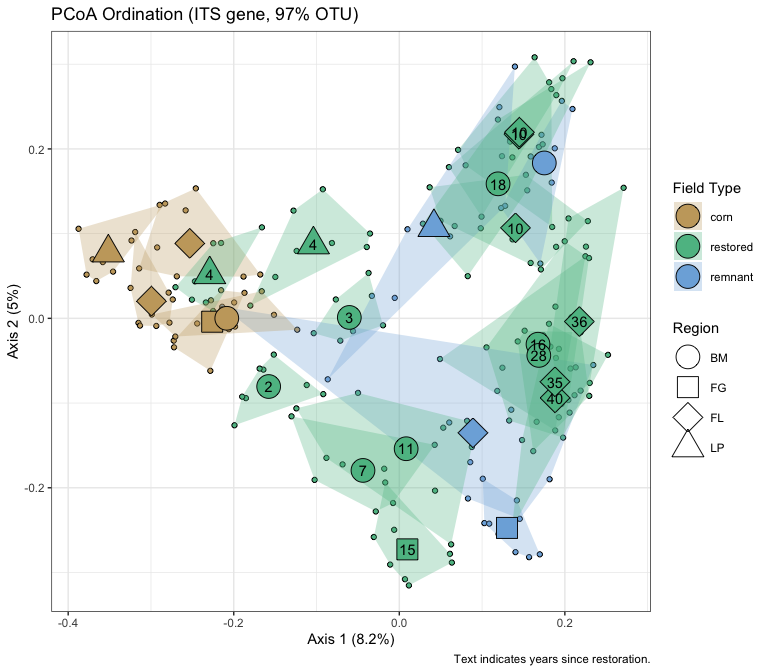

Microbial data: community differences
================
Beau Larkin

Last updated: 04 December, 2023

- [Description](#description)
- [Packages and libraries](#packages-and-libraries)
  - [Functions](#functions)
- [Data](#data)
  - [Site metadata](#site-metadata)
  - [Sites-species tables](#sites-species-tables)
  - [Species metadata](#species-metadata)
  - [Distance tables](#distance-tables)
- [Results](#results)
  - [ITS gene, OTU clustering](#its-gene-otu-clustering)
    - [PCoA with abundances summed in
      fields](#pcoa-with-abundances-summed-in-fields)
    - [PCoA with Blue Mounds restored fields, all
      subsamples](#pcoa-with-blue-mounds-restored-fields-all-subsamples)
    - [PCoA with all fields and regions, all
      subsamples](#pcoa-with-all-fields-and-regions-all-subsamples)
    - [PCoA in Faville Grove, all
      subsamples](#pcoa-in-faville-grove-all-subsamples)
    - [PCoA in Fermilab, all
      subsamples](#pcoa-in-fermilab-all-subsamples)
    - [PCoA in Lake Petite Prairie, all
      subsamples](#pcoa-in-lake-petite-prairie-all-subsamples)
    - [PCoA ordination, all regions, all
      subsamples.](#pcoa-ordination-all-regions-all-subsamples)
  - [18S gene, OTU clustering](#18s-gene-otu-clustering)
    - [PCoA with abundances summed in fields, Bray-Curtis
      distance](#pcoa-with-abundances-summed-in-fields-bray-curtis-distance)
    - [PCoA with abundances summed in fields, UNIFRAC
      distance](#pcoa-with-abundances-summed-in-fields-unifrac-distance)
    - [PCoA with Blue Mounds restored fields, all
      subsamples](#pcoa-with-blue-mounds-restored-fields-all-subsamples-1)
    - [PCoA with all fields and regions, all
      subsamples](#pcoa-with-all-fields-and-regions-all-subsamples-1)
    - [PCoA in Blue Mounds, all
      subsamples](#pcoa-in-blue-mounds-all-subsamples-1)
    - [PCoA in Faville Grove, all
      subsamples](#pcoa-in-faville-grove-all-subsamples-1)
    - [PCoA in Fermilab, all
      subsamples](#pcoa-in-fermilab-all-subsamples-1)
    - [PCoA in Lake Petite Prairie, all
      subsamples](#pcoa-in-lake-petite-prairie-all-subsamples-1)
    - [PCoA ordination, all regions, all
      subsamples.](#pcoa-ordination-all-regions-all-subsamples-1)

# Description

Microbial data include site-species tables derived from high-throughput
sequencing and clustering in QIIME by Lorinda Bullington and PLFA/NLFA
data which Ylva Lekberg did.

This presents basic visualizations of community differences among
sites/regions based on ITS and 18S data.

During data processing, not all subsamples were retained. Some had
failed to amplify and others had very few sequences, leading to the
potential for a loss of information during rarefication. With the loss
of some subsamples, all fields were resampled to the same lower number
of samples. This was done to equalize sampling effort (from a
statistical perspective). This procedure can easily be undone in the
[process_data script](process_data.md). Whether 9, 8, or 7 subsamples
are retained, the interpretation of analyses presented here would be the
same (not shown).

Pairwise contrasts in multivariate analysis were accomplished with a
custom function adapted from [O’Leary et
al. 2021](https://link.springer.com/article/10.1007/s12237-021-00917-2).

# Packages and libraries

``` r
packages_needed = c("tidyverse", "vegan", "colorspace", "ape", "knitr")
packages_installed = packages_needed %in% rownames(installed.packages())
```

``` r
if (any(!packages_installed)) {
    install.packages(packages_needed[!packages_installed])
}
```

``` r
for (i in 1:length(packages_needed)) {
    library(packages_needed[i], character.only = T)
}
```

## Functions

Functions handle the Principal Components Analysis (PCoA) diagnostics,
with outputs and figures saved to a list for later use.

- `pcoa_fun()` is used with data where samples have been summed in
  fields.
- `pcoa_samps_fun()` is used with rarefied subsample data from all
  fields.
- `pcoa_samps_bm_fun()` is used for the subsample data from Blue Mounds
  restored fields. The variable **yr_since** is continuous with this
  dataset and is tested with `envfit()`.

**Functions are stored** in a separate
[script](supporting_files/microbial_communities_functions.md) to reduce
clutter here and allow for easier editing.

``` r
source("supporting_files/microbial_communities_functions.R")
```

# Data

## Site metadata

Needed for figure interpretation and permanova designs. The subset of
restored fields in Blue Mounds only will also be used and is parsed
here.

``` r
sites <-
    read_csv(paste0(getwd(), "/clean_data/sites.csv"), show_col_types = FALSE) %>%
    mutate(
        field_type = factor(
            field_type,
            ordered = TRUE,
            levels = c("corn", "restored", "remnant")),
        yr_since = replace(yr_since, which(field_type == "remnant"), NA),
        yr_since = replace(yr_since, which(field_type == "corn"), NA)) %>%
    select(-lat, -long, -yr_restore, -yr_rank) %>% 
    arrange(field_key)
sites_resto_bm <- 
    sites %>% 
    filter(field_type == "restored",
           region == "BM") %>% 
    select(-field_name, -region) %>% 
    mutate(yr_since = as.numeric(yr_since))   
```

## Sites-species tables

Sites-species tables with rarefied sequence abundances. This list
includes composition summarized by fields or unsummarized (all samples).
It also includes subsets by region. All subsets have zero sum columns
removed.  
CSV files were produced in [process_data.R](process_data.md)

``` r
spe <- list(
    its = read_csv(
        paste0(getwd(), "/clean_data/spe_ITS_rfy.csv"),
        show_col_types = FALSE
    ),
    its_samps = read_csv(
        paste0(getwd(), "/clean_data/spe_ITS_rfy_samples.csv"),
        show_col_types = FALSE
    ),
    its_samps_bm = read_csv(
        paste0(getwd(), "/clean_data/spe_ITS_rfy_samples.csv"),
        show_col_types = FALSE
    ) %>% 
        left_join(sites %>% select(field_key, region), by = join_by(field_key)) %>% 
        filter(region == "BM") %>% 
        select(-region),
    its_samps_fg = read_csv(
        paste0(getwd(), "/clean_data/spe_ITS_rfy_samples.csv"),
        show_col_types = FALSE
    ) %>% 
        left_join(sites %>% select(field_key, region), by = join_by(field_key)) %>% 
        filter(region == "FG") %>% 
        select(-region),
    its_samps_fl = read_csv(
        paste0(getwd(), "/clean_data/spe_ITS_rfy_samples.csv"),
        show_col_types = FALSE
    ) %>% 
        left_join(sites %>% select(field_key, region), by = join_by(field_key)) %>% 
        filter(region == "FL") %>% 
        select(-region),
    its_samps_lp = read_csv(
        paste0(getwd(), "/clean_data/spe_ITS_rfy_samples.csv"),
        show_col_types = FALSE
    ) %>% 
        left_join(sites %>% select(field_key, region), by = join_by(field_key)) %>% 
        filter(region == "LP") %>% 
        select(-region),
    amf = read_csv(
        paste0(getwd(), "/clean_data/spe_18S_rfy.csv"),
        show_col_types = FALSE
    ),
    amf_samps = read_csv(
        paste0(getwd(), "/clean_data/spe_18S_rfy_samples.csv"),
        show_col_types = FALSE
    ),
    amf_samps_bm = read_csv(
        paste0(getwd(), "/clean_data/spe_18S_rfy_samples.csv"),
        show_col_types = FALSE
    ) %>% 
        left_join(sites %>% select(field_key, region), by = join_by(field_key)) %>% 
        filter(region == "BM") %>% 
        select(-region),
    amf_samps_fg = read_csv(
        paste0(getwd(), "/clean_data/spe_18S_rfy_samples.csv"),
        show_col_types = FALSE
    ) %>% 
        left_join(sites %>% select(field_key, region), by = join_by(field_key)) %>% 
        filter(region == "FG") %>% 
        select(-region),
    amf_samps_fl = read_csv(
        paste0(getwd(), "/clean_data/spe_18S_rfy_samples.csv"),
        show_col_types = FALSE
    ) %>% 
        left_join(sites %>% select(field_key, region), by = join_by(field_key)) %>% 
        filter(region == "FL") %>% 
        select(-region),
    amf_samps_lp = read_csv(
        paste0(getwd(), "/clean_data/spe_18S_rfy_samples.csv"),
        show_col_types = FALSE
    ) %>% 
        left_join(sites %>% select(field_key, region), by = join_by(field_key)) %>% 
        filter(region == "LP") %>% 
        select(-region)
) %>% 
    map(. %>% select(where( ~ sum(.) != 0)))
```

## Species metadata

Needed to make inset figures showing most important categories of
species. The OTUs and sequence abundances in these files matches the
rarefied data in `spe$` above. CSV files were produced in the [microbial
diversity script](microbial_diversity.md).

``` r
spe_meta <- list(
    its =
        read_csv(
            paste0(getwd(), "/clean_data/speTaxa_ITS_rfy.csv"),
            show_col_types = FALSE
        ),
    amf = 
        read_csv(
            paste0(getwd(), "/clean_data/speTaxa_18S_rfy.csv"),
            show_col_types = FALSE
        )
)
```

## Distance tables

Creating distance objects from the samples-species tables is done with
the typical process of `vegdist()` in vegan. Bray-Curtis or Ruzicka
(used with method=“jaccard”) distance are both appropriate methods for
these data, but Bray-Curtis has produced axes with better explanatory
power. With the 18S data, we can take advantage of phylogenetic
relationships in a UNIFRAC distance matrix. The UNIFRAC distance was
produced in QIIME II and needs some wrangling to conform to the
standards of a distance object in R. The following list contains
vegdist-produced distance objects for ITS and 18S, and it includes
UNIFRAC distance for 18S.

**List of objects in `distab`**

- its: the rarefied data, summed from 8 samples in each field
- its_samps: rarefied data from 8 samples per field, all fields retained
- its_resto_bm: rarefied data, summed from 8 samples in each field,
  filtered to include Blue Mounds region only
- its_resto_samps_bm: rarefied data from 8 samples in each field, not
  summed, filtered to include Blue Mounds region only
- amf_bray: rarefied data, summed from 7 samples from each field,
  bray-curtis distance
- amf_uni: rarefied data, summed from 7 samples from each field, UNIFRAC
  distance
- *gene_samps_region*: objects are distances matrices taken from
  rarefied data, subsetted to region, with zero sum columns removed.
  Samples in each field depend on the gene-based dataset, see above.

``` r
distab <- list(
    its       = vegdist(data.frame(spe$its, row.names = 1), method = "bray"),
    its_samps = vegdist(
        data.frame(
            spe$its_samps %>% 
                mutate(field_sample = paste(field_key, sample, sep = "_")) %>% 
                column_to_rownames(var = "field_sample") %>% 
                select(-field_key, -sample)
        ) %>% select(where(~ sum(.) > 0)), method = "bray"),
    its_resto_bm = vegdist(
        data.frame(
            spe$its %>% 
                filter(field_key %in% sites_resto_bm$field_key), 
            row.names = 1
        ) %>% select(where(~ sum(.) > 0)), method = "bray"),
    its_resto_samps_bm = vegdist(
        data.frame(
            spe$its_samps %>% 
                filter(field_key %in% sites_resto_bm$field_key) %>% 
                mutate(field_sample = paste(field_key, sample, sep = "_")) %>% 
                column_to_rownames(var = "field_sample") %>% 
                select(-field_key, -sample)
        ) %>% select(where(~ sum(.) > 0)), method = "bray"),
    its_samps_bm = vegdist(
        data.frame(
            spe$its_samps_bm %>% 
                mutate(field_sample = paste(field_key, sample, sep = "_")) %>% 
                column_to_rownames(var = "field_sample") %>% 
                select(-field_key, -sample)
        ) # zero sum columns were already removed in the spe list
    ),
    its_samps_fg = vegdist(
        data.frame(
            spe$its_samps_fg %>% 
                mutate(field_sample = paste(field_key, sample, sep = "_")) %>% 
                column_to_rownames(var = "field_sample") %>% 
                select(-field_key, -sample)
        ) # zero sum columns were already removed in the spe list
    ),
    its_samps_fl = vegdist(
        data.frame(
            spe$its_samps_fl %>% 
                mutate(field_sample = paste(field_key, sample, sep = "_")) %>% 
                column_to_rownames(var = "field_sample") %>% 
                select(-field_key, -sample)
        ) # zero sum columns were already removed in the spe list
    ),
    its_samps_lp = vegdist(
        data.frame(
            spe$its_samps_lp %>% 
                mutate(field_sample = paste(field_key, sample, sep = "_")) %>% 
                column_to_rownames(var = "field_sample") %>% 
                select(-field_key, -sample)
        ) # zero sum columns were already removed in the spe list
    ),
    amf_bray  = vegdist(data.frame(spe$amf, row.names = 1), method = "bray"),
    amf_samps = vegdist(
        data.frame(
            spe$amf_samps %>% 
                mutate(field_sample = paste(field_key, sample, sep = "_")) %>% 
                column_to_rownames(var = "field_sample") %>% 
                select(-field_key, -sample)
        ) %>% select(where(~ sum(.) > 0)), method = "bray"),
    amf_resto_bm = vegdist(
        data.frame(
            spe$amf %>% 
                filter(field_key %in% sites_resto_bm$field_key), 
            row.names = 1
        ) %>% select(where(~ sum(.) > 0)), method = "bray"),
    amf_resto_samps_bm = vegdist(
        data.frame(
            spe$amf_samps %>% 
                filter(field_key %in% sites_resto_bm$field_key) %>% 
                mutate(field_sample = paste(field_key, sample, sep = "_")) %>% 
                column_to_rownames(var = "field_sample") %>% 
                select(-field_key, -sample)
        ) %>% select(where(~ sum(.) > 0)), method = "bray"),
    amf_samps_bm = vegdist(
        data.frame(
            spe$amf_samps_bm %>% 
                mutate(field_sample = paste(field_key, sample, sep = "_")) %>% 
                column_to_rownames(var = "field_sample") %>% 
                select(-field_key, -sample)
        ) # zero sum columns were already removed in the spe list
    ),
    amf_samps_fg = vegdist(
        data.frame(
            spe$amf_samps_fg %>% 
                mutate(field_sample = paste(field_key, sample, sep = "_")) %>% 
                column_to_rownames(var = "field_sample") %>% 
                select(-field_key, -sample)
        ) # zero sum columns were already removed in the spe list
    ),
    amf_samps_fl = vegdist(
        data.frame(
            spe$amf_samps_fl %>% 
                mutate(field_sample = paste(field_key, sample, sep = "_")) %>% 
                column_to_rownames(var = "field_sample") %>% 
                select(-field_key, -sample)
        ) # zero sum columns were already removed in the spe list
    ),
    amf_samps_lp = vegdist(
        data.frame(
            spe$amf_samps_lp %>% 
                mutate(field_sample = paste(field_key, sample, sep = "_")) %>% 
                column_to_rownames(var = "field_sample") %>% 
                select(-field_key, -sample)
        ) # zero sum columns were already removed in the spe list
    ),
    amf_uni   = sites %>%
        select(field_name, field_key) %>%
        left_join(
            read_delim(paste0(getwd(), "/otu_tables/18S/18S_weighted_Unifrac.tsv"), show_col_types = FALSE),
            by = join_by(field_name)) %>%
        select(field_key, everything(),-field_name) %>%
        data.frame(row.names = 1) %>%
        as.dist()
) 
```

# Results

#### Ordinations

Bray-Curtis or Ruzicka distance are both appropriate, but Bray-Curtis
has produced axes with better explanatory power.

## ITS gene, OTU clustering

### PCoA with abundances summed in fields

In trial runs, no negative eigenvalues were observed (not shown). No
correction is needed for these ordinations.

``` r
(pcoa_its <- pcoa_fun(spe$its, distab$its, df_name = "ITS gene, 97% OTU"))
```

    ## 'nperm' >= set of all permutations: complete enumeration.

    ## Set of permutations < 'minperm'. Generating entire set.

    ## $dataset
    ## [1] "ITS gene, 97% OTU"
    ## 
    ## $components_exceed_broken_stick
    ## [1] 1
    ## 
    ## $correction_note
    ## [1] "There were no negative eigenvalues. No correction was applied"
    ## 
    ## $values
    ##   Dim Eigenvalues Relative_eig Broken_stick Cumul_eig Cumul_br_stick
    ## 1   1   1.2834456    0.1869538   0.15733159 0.1869538      0.1573316
    ## 2   2   0.7879419    0.1147760   0.11566492 0.3017298      0.2729965
    ## 3   3   0.5921461    0.0862553   0.09483159 0.3879851      0.3678281
    ## 
    ## $eigenvalues
    ## [1] 18.7 11.5
    ## 
    ## $site_vectors
    ##    field_key      Axis.1       Axis.2 region field_type yr_since
    ## 1          1  0.22563943 -0.054587755     BM   restored       16
    ## 2          2 -0.10488280  0.008348045     BM   restored        3
    ## 3          3 -0.33189964  0.027759105     FG       corn       NA
    ## 4          4  0.10116759 -0.301579753     FG    remnant       NA
    ## 5          5 -0.05887873 -0.286392697     FG   restored       15
    ## 6          6 -0.29321444  0.128642366     FL       corn       NA
    ## 7          7 -0.32685992  0.026366798     FL       corn       NA
    ## 8          8  0.09326448 -0.222702264     FL    remnant       NA
    ## 9          9  0.24766572 -0.193975913     FL   restored       40
    ## 10        10  0.32257590 -0.080874958     FL   restored       36
    ## 11        11  0.21951411 -0.169257727     FL   restored       35
    ## 12        12  0.21787652  0.237923283     FL   restored       10
    ## 13        13  0.18556203  0.116429173     FL   restored       10
    ## 14        14  0.19690381  0.252273095     FL   restored       10
    ## 15        15  0.24524736 -0.052426579     BM   restored       28
    ## 16        16 -0.37666184  0.120921164     LP       corn       NA
    ## 17        17  0.07502047  0.182578474     LP    remnant       NA
    ## 18        18 -0.24341577  0.066044296     LP   restored        4
    ## 19        19 -0.14509188  0.090630826     LP   restored        4
    ## 20        20  0.24511122  0.310100751     BM    remnant       NA
    ## 21        21  0.19223715  0.278603735     BM   restored       18
    ## 22        22 -0.11096005 -0.214825294     BM   restored        7
    ## 23        23 -0.22200138 -0.087725414     BM   restored        2
    ## 24        24 -0.33928037  0.031682044     BM       corn       NA
    ## 25        25 -0.01463895 -0.213954799     BM   restored       11
    ## 
    ## $broken_stick_plot


    ## 
    ## $permanova
    ## Permutation test for adonis under reduced model
    ## Terms added sequentially (first to last)
    ## Blocks:  strata 
    ## Permutation: free
    ## Number of permutations: 1999
    ## 
    ## adonis2(formula = d ~ field_type, data = env, permutations = nperm, add = if (corr == "none") FALSE else "lingoes", strata = region)
    ##            Df SumOfSqs      R2     F Pr(>F)    
    ## field_type  2   1.2186 0.17751 2.374  5e-04 ***
    ## Residual   22   5.6464 0.82249                 
    ## Total      24   6.8650 1.00000                 
    ## ---
    ## Signif. codes:  0 '***' 0.001 '**' 0.01 '*' 0.05 '.' 0.1 ' ' 1
    ## 
    ## $pairwise_contrasts
    ## 
    ## 
    ## group1     group2        R2   F_value   df1   df2     p_value   p_value_adj
    ## ---------  --------  ------  --------  ----  ----  ----------  ------------
    ## restored   corn       0.156     3.524     1    19   0.0005000        0.0015
    ## restored   remnant    0.055     1.052     1    18   0.1360000        0.1360
    ## corn       remnant    0.289     2.850     1     7   0.0416667        0.0625

Axis 1 explains 18.7% of the variation and is the only eigenvalue that
exceeds a broken stick model. The most substantial variation here will
be on the first axis, although axis 2 explains 11.5% of the variation
and was very close to the broken stick value. Testing the design factor
*field_type* (with *region* treated as a block using the `strata`
argument of `adonis2`) revealed a significant clustering
$(R^2=0.18,~p=5\times 10^{-4})$.

Let’s view a plot with abundances of community subgroups inset.

``` r
pcoa_its$ord <-
    ggplot(pcoa_its$site_vectors, aes(x = Axis.1, y = Axis.2)) +
    geom_point(aes(fill = field_type, shape = region), size = 10) +
    geom_text(aes(label = yr_since)) +
    scale_fill_discrete_qualitative(palette = "harmonic") +
    scale_shape_manual(values = c(21, 22, 23, 24)) +
    labs(
        x = paste0("Axis 1 (", pcoa_its$eig[1], "%)"),
        y = paste0("Axis 2 (", pcoa_its$eig[2], "%)"),
        title = paste0(
            "PCoA Ordination of field-averaged species data (",
            pcoa_its$dataset,
            ")"
        ),
        caption = "Text in icons for restored fields indicates years since restoration."
    ) +
    lims(y = c(-0.35,0.44)) +
    theme_bw() +
    guides(fill = guide_legend(override.aes = list(shape = 21)))
pcoa_its$inset <-
    spe_meta$its %>%
    filter(primary_lifestyle %in% c("soil_saprotroph", "plant_pathogen", "wood_saprotroph")) %>%
    mutate(field_type = factor(
        field_type,
        ordered = TRUE,
        levels = c("corn", "restored", "remnant")
    )) %>%
    group_by(primary_lifestyle, field_type) %>%
    summarize(avg_seq_abund = mean(seq_abund), .groups = "drop") %>%
    ggplot(aes(x = primary_lifestyle, y = avg_seq_abund, fill = field_type)) +
    geom_col(position = "dodge") +
    labs(x = "",
         y = "Seq. abund. (avg)") +
    scale_fill_discrete_qualitative(palette = "Harmonic") +
    scale_x_discrete(label = c("soil sapr", "wood sapr", "plnt path")) +
    # coord_flip() +
    theme_classic() +
    theme(legend.position = "none")
```

``` r
pcoa_its$ord +
    annotation_custom(
        ggplotGrob(pcoa_its$inset + theme(
            plot.background = element_rect(colour = "black", fill = "gray90")
        )),
        xmin = -0.38,
        xmax = -0.05,
        ymin = 0.17,
        ymax = 0.46
    )
```

    ## Warning: Removed 9 rows containing missing values (`geom_text()`).


Community trajectories revealed in the ordination clearly depend on both
region and field type. Faville Grove shows a linear progression from
corn to remnant and Lake Petite does as well, although with few sites
and only single restoration ages these are weak supports. With Blue
Mounds sites, the general progression along Axis 1 is to increase in age
from left to right, but the remnant doesn’t seem representative because
it clusters far from everything else and associates most strongly with
the neighboring restored field (both on Merel Black’s property).
Restored fields at Fermi separate well away from cornfields, but less
age structure is found. Instead, the old restorations in the ring most
resemble the Railroad Remnant (which is in a different soil…), the
switchgrass restored fields take a potentially novel path toward distant
remnants.

On axis 1, four clusters are apparent in at least two partitioning
schemes. It will be interesting to see if we can pull those apart with
explanatory variables.

Restoration age will be explored in-depth with the subset of restoration
fields.

Here we can also begin considering what an inset plot to display
metadata might look like. Let’s plot and test the relationship between
age and community axis scores with restored fields only.

``` r
its_resto_scores <-
    pcoa_its$site_vectors %>%
    filter(field_type == "restored") %>%
    mutate(yr_since = as.numeric(yr_since))
```

``` r
summary(lm(Axis.1 ~ yr_since,
           data = its_resto_scores))
```

    ## 
    ## Call:
    ## lm(formula = Axis.1 ~ yr_since, data = its_resto_scores)
    ## 
    ## Residuals:
    ##      Min       1Q   Median       3Q      Max 
    ## -0.18235 -0.08979 -0.03324  0.10619  0.20985 
    ## 
    ## Coefficients:
    ##              Estimate Std. Error t value Pr(>|t|)    
    ## (Intercept) -0.107124   0.053728  -1.994 0.066025 .  
    ## yr_since     0.011515   0.002724   4.228 0.000844 ***
    ## ---
    ## Signif. codes:  0 '***' 0.001 '**' 0.01 '*' 0.05 '.' 0.1 ' ' 1
    ## 
    ## Residual standard error: 0.132 on 14 degrees of freedom
    ## Multiple R-squared:  0.5607, Adjusted R-squared:  0.5294 
    ## F-statistic: 17.87 on 1 and 14 DF,  p-value: 0.0008441

``` r
its_resto_scores %>%
    pivot_longer(Axis.1:Axis.2, names_to = "axis", values_to = "score") %>%
    ggplot(aes(x = yr_since, y = score)) +
    facet_wrap(vars(axis), scales = "free") +
    geom_smooth(aes(linetype = axis), method = "lm", se = FALSE, linewidth = 0.5) +
    geom_point(aes(shape = region), fill = "grey", size = 2) +
    labs(x = "Years since restoration",
         y = "PCoA axis score",
         title = "Correlations, axis scores and years since restoration (ITS, 97% OTU)",
         caption = "Blue lines show linear model fit; solid line is significant at p<0.05") +
    scale_shape_manual(values = c(21, 22, 23, 24)) +
    scale_linetype_manual(values = c('solid', 'dashed'), guide = "none") +
    theme_bw()
```


Indeed, Axis 1 does correlate well with age $(R^2_{Adj}=0.51,~p<0.005)$.
But it isn’t appropriate to use these scores for the correlation because
they were created with the corn and remnant fields in the ordination as
well.

The most appropriate way to look at communities vs. field age is with
the Blue Mounds restored fields. The function `pcoa_its_samps_bm()` will
take care of this. Field age will be fitted to the ordination and tested
using `envfit()`.

### PCoA with Blue Mounds restored fields, all subsamples

In trial runs, no negative eigenvalues were observed (not shown). No
correction is needed for these ordinations.

``` r
(pcoa_its_resto_samps_bm <- pcoa_samps_bm_fun(spe$its_samps, 
                                        distab$its_resto_samps_bm, 
                                        sites_resto_bm, 
                                        df_name="BM restored, ITS gene, 97% OTU"))
```

    ## Set of permutations < 'minperm'. Generating entire set.
    ## Set of permutations < 'minperm'. Generating entire set.

    ## $dataset
    ## [1] "BM restored, ITS gene, 97% OTU"
    ## 
    ## $components_exceed_broken_stick
    ## [1] 2
    ## 
    ## $correction_note
    ## [1] "There were no negative eigenvalues. No correction was applied"
    ## 
    ## $values
    ##   Dim Eigenvalues Relative_eig Broken_stick Cumul_eig Cumul_br_stick
    ## 1   1    2.145014   0.11549072   0.08352022 0.1154907     0.08352022
    ## 2   2    1.424068   0.07667394   0.06533840 0.1921647     0.14885863
    ## 3   3    1.039610   0.05597414   0.05624749 0.2481388     0.20510612
    ## 
    ## $eigenvalues
    ## [1] 11.5  7.7
    ## 
    ## $site_vectors
    ## # A tibble: 56 × 5
    ##    field_key sample_key  Axis.1  Axis.2 yr_since
    ##        <dbl> <chr>        <dbl>   <dbl>    <dbl>
    ##  1         1 1          -0.198  -0.200        16
    ##  2         1 2          -0.216  -0.0485       16
    ##  3         1 4          -0.179  -0.0692       16
    ##  4         1 5          -0.276  -0.141        16
    ##  5         1 6          -0.327  -0.163        16
    ##  6         1 7          -0.105  -0.0826       16
    ##  7         1 9          -0.213  -0.149        16
    ##  8         1 10         -0.244  -0.0288       16
    ##  9         2 1           0.243   0.213         3
    ## 10         2 2           0.0824  0.0799        3
    ## # ℹ 46 more rows
    ## 
    ## $broken_stick_plot


    ## 
    ## $permanova
    ## Permutation test for adonis under reduced model
    ## Terms added sequentially (first to last)
    ## Permutation: free
    ## Number of permutations: 1999
    ## 
    ## adonis2(formula = d ~ field_key, data = env_w, permutations = nperm)
    ##           Df SumOfSqs      R2     F Pr(>F)    
    ## field_key  1   0.7897 0.04252 2.398  5e-04 ***
    ## Residual  54  17.7833 0.95748                 
    ## Total     55  18.5730 1.00000                 
    ## ---
    ## Signif. codes:  0 '***' 0.001 '**' 0.01 '*' 0.05 '.' 0.1 ' ' 1
    ## 
    ## $vector_fit
    ## 
    ## ***VECTORS
    ## 
    ##             Axis.1    Axis.2    r2 Pr(>r)  
    ## yr_since -0.997420  0.071762 0.725 0.0195 *
    ## ---
    ## Signif. codes:  0 '***' 0.001 '**' 0.01 '*' 0.05 '.' 0.1 ' ' 1
    ## Plots: field_key, plot permutation: free
    ## Permutation: none
    ## Number of permutations: 5039
    ## 
    ## 
    ## 
    ## $vector_fit_scores
    ##             Axis.1     Axis.2
    ## yr_since -0.849266 0.06110287

Axis 1 explains 11.5% and axis 2 explains 7.7% of the variation in the
community data. Both axes are important based on the broken stick model.
Indeed, the first four axes are borderline important. The relatively low
percent variation explained is partly due to the high number of
dimensions used when all samples from fields are included. The fidelity
of samples to fields was significant based on a permutation test
$(R^2=0.04,~p=5\times 10^{-4})$. In this case, the partial $R^2$ shows
the proportion of sum of squares from the total. It is a low number here
because so much unexplained variation exists, resulting in a high sum of
squares that is outside the assignment of subsamples to fields.

Years since restoration has a moderately strong correlation with
communities and was significant with a permutation test where samples
were constrained within fields to account for lack of independence \#’
$(R^2=0.72,~p=0.02)$.

Let’s view an ordination plot with hulls around subsamples and a fitted
vector for field age overlaid.

``` r
centroid_its_bm <- aggregate(cbind(Axis.1, Axis.2) ~ field_key, data = pcoa_its_resto_samps_bm$site_vectors, mean) %>% 
    left_join(sites %>% select(field_key, yr_since), by = join_by(field_key))
hull_its_bm <- pcoa_its_resto_samps_bm$site_vectors %>% 
    group_by(field_key) %>% 
    slice(chull(Axis.1, Axis.2))
```

``` r
ggplot(pcoa_its_resto_samps_bm$site_vectors, aes(x = Axis.1, y = Axis.2)) +
    geom_point(fill = "#5CBD92", shape = 21) +
    geom_polygon(data = hull_its_bm, aes(group = as.character(field_key)), fill = "#5CBD92", alpha = 0.3) +
    geom_point(data = centroid_its_bm, fill = "#5CBD92", size = 8, shape = 21) +
    geom_text(data = centroid_its_bm, aes(label = yr_since)) +
    geom_segment(aes(x = 0, 
                     y = 0, 
                     xend = pcoa_its_resto_samps_bm$vector_fit_scores[1] * 0.4, 
                     yend = pcoa_its_resto_samps_bm$vector_fit_scores[2] * 0.4),
                 color = "blue", 
                 arrow = arrow(length = unit(3, "mm"))) +
    labs(
        x = paste0("Axis 1 (", pcoa_its_resto_samps_bm$eigenvalues[1], "%)"),
        y = paste0("Axis 2 (", pcoa_its_resto_samps_bm$eigenvalues[2], "%)"),
        title = paste0(
            "PCoA Ordination (",
            pcoa_its_resto_samps_bm$dataset,
            ")"
        ),
        caption = "Text indicates years since restoration.\nYears since restoration significant at p<0.05."
    ) +
    theme_bw() +
    theme(legend.position = "none")
```


### PCoA with all fields and regions, all subsamples

This leverages the information from all subsamples. Modifications to
`how()` from package
[permute](https://cran.r-project.org/package=permute) allow for the more
complex design.

Negative eigenvalues were produced in trial runs (not shown). A Lingoes
correction was applied.

``` r
(pcoa_its_samps <- pcoa_samps_fun(spe$its_samps, 
                                  distab$its_samps, 
                                  corr="lingoes", 
                                  df_name = "ITS gene, 97% OTU"))
```

    ## 'nperm' >= set of all permutations: complete enumeration.

    ## Set of permutations < 'minperm'. Generating entire set.

    ## $dataset
    ## [1] "ITS gene, 97% OTU"
    ## 
    ## $components_exceed_broken_stick
    ## [1] 10
    ## 
    ## $correction_note
    ## [1] "Lingoes correction applied to negative eigenvalues: D' = -0.5*D^2 - 0.0593066709133758 , except diagonal elements"
    ## 
    ## $values
    ##    Dim Eigenvalues Corr_eig Rel_corr_eig Broken_stick Cum_corr_eig Cum_br_stick
    ## 1    1    6.706073 6.765380   0.08161325   0.02963639   0.08161325   0.02963639
    ## 2    2    4.118723 4.178029   0.05040109   0.02458589   0.13201435   0.05422228
    ## 3    3    3.329980 3.389287   0.04088621   0.02206064   0.17290055   0.07628292
    ## 4    4    2.641779 2.701085   0.03258418   0.02037713   0.20548473   0.09666005
    ## 5    5    2.119826 2.179132   0.02628767   0.01911451   0.23177240   0.11577456
    ## 6    6    2.032557 2.091864   0.02523492   0.01810441   0.25700732   0.13387896
    ## 7    7    1.696563 1.755869   0.02118169   0.01726266   0.27818902   0.15114162
    ## 8    8    1.496564 1.555870   0.01876903   0.01654115   0.29695805   0.16768277
    ## 9    9    1.341484 1.400790   0.01689825   0.01590984   0.31385630   0.18359262
    ## 10  10    1.295082 1.354389   0.01633849   0.01534867   0.33019478   0.19894129
    ## 11  11    1.164513 1.223820   0.01476339   0.01484362   0.34495817   0.21378492
    ## 
    ## $eigenvalues
    ## [1] 8.2 5.0
    ## 
    ## $site_vectors
    ## # A tibble: 200 × 16
    ##    field_key sample_key  Axis.1   Axis.2  Axis.3  Axis.4   Axis.5   Axis.6
    ##        <dbl> <chr>        <dbl>    <dbl>   <dbl>   <dbl>    <dbl>    <dbl>
    ##  1         1 1           0.188  -0.132   -0.0428 -0.0633  0.0617  -0.118  
    ##  2         1 2           0.225   0.0733  -0.0254 -0.0123  0.00909 -0.219  
    ##  3         1 4           0.189  -0.0468  -0.0129  0.0245 -0.0253  -0.127  
    ##  4         1 5           0.174  -0.0200  -0.120  -0.204  -0.0240   0.0269 
    ##  5         1 6           0.208   0.00138 -0.118  -0.168   0.0173  -0.179  
    ##  6         1 7           0.0492 -0.0480   0.0195 -0.106  -0.0339   0.0192 
    ##  7         1 9           0.118  -0.0857  -0.0620 -0.0960  0.0594  -0.0372 
    ##  8         1 10          0.189   0.0138  -0.0711 -0.0411 -0.0254  -0.0238 
    ##  9         2 1          -0.0564  0.00296  0.325   0.0570 -0.0677  -0.00108
    ## 10         2 2          -0.0371  0.0536   0.0926  0.0208 -0.130   -0.130  
    ## # ℹ 190 more rows
    ## # ℹ 8 more variables: Axis.7 <dbl>, Axis.8 <dbl>, Axis.9 <dbl>, Axis.10 <dbl>,
    ## #   field_name <chr>, region <chr>, field_type <ord>, yr_since <dbl>
    ## 
    ## $broken_stick_plot


    ## 
    ## $permanova
    ## Permutation test for adonis under reduced model
    ## Terms added sequentially (first to last)
    ## Blocks:  region 
    ## Plots: field_key, plot permutation: free
    ## Permutation: none
    ## Number of permutations: 1999
    ## 
    ## adonis2(formula = d ~ field_type, data = env_w, permutations = gl_perm_design)
    ##             Df SumOfSqs      R2      F Pr(>F)    
    ## field_type   2    5.790 0.08144 8.7335  5e-04 ***
    ## Residual   197   65.303 0.91856                  
    ## Total      199   71.094 1.00000                  
    ## ---
    ## Signif. codes:  0 '***' 0.001 '**' 0.01 '*' 0.05 '.' 0.1 ' ' 1
    ## 
    ## $pairwise_contrasts
    ## 
    ## 
    ## group1     group2        R2   F_value   df1   df2     p_value   p_value_adj
    ## ---------  --------  ------  --------  ----  ----  ----------  ------------
    ## restored   corn       0.066    11.791     1   166   0.0015000        0.0045
    ## restored   remnant    0.018     2.835     1   158   0.2085000        0.2085
    ## corn       remnant    0.135    10.946     1    70   0.1428571        0.2085

Axis 1 explains 8.2% and axis 2 explains 5% of the variation in the
community data. Both axes are important based on the broken stick model,
in fact, the broken stick model shows that 10 axes are important in
explaining variation with this dataset. The relatively low percent
variation explained on axes 1 and 2 is partly due to the high number of
dimensions used when all samples from fields are included. The fidelity
of samples to fields was strong based on a permutation test when
restricting permutations to fields (=plots in `how()`) within regions
(=blocks in `how()`) $(R^2=0.08,~p=5\times 10^{-4})$.

Let’s view an ordination plot with hulls around subsamples.

``` r
centroid_its <- aggregate(cbind(Axis.1, Axis.2) ~ field_key, data = pcoa_its_samps$site_vectors, mean) %>% 
    left_join(sites %>% select(field_key, yr_since, field_type, region), by = join_by(field_key))
hull_its <- pcoa_its_samps$site_vectors %>% 
    group_by(field_key) %>% 
    slice(chull(Axis.1, Axis.2))
```

``` r
ggplot(pcoa_its_samps$site_vectors, aes(x = Axis.1, y = Axis.2)) +
    geom_point(aes(fill = field_type), shape = 21) +
    geom_polygon(data = hull_its, aes(group = field_key, fill = field_type), alpha = 0.3) +
    geom_point(data = centroid_its, aes(fill = field_type, shape = region), size = 8) +
    geom_text(data = centroid_its, aes(label = yr_since)) +
    labs(
        x = paste0("Axis 1 (", pcoa_its_samps$eigenvalues[1], "%)"),
        y = paste0("Axis 2 (", pcoa_its_samps$eigenvalues[2], "%)"),
        title = paste0(
            "PCoA Ordination (",
            pcoa_its_samps$dataset,
            ")"
        ),
        caption = "Text indicates years since restoration."
    ) +
    scale_fill_discrete_qualitative(name = "Field Type", palette = "Harmonic") +
    scale_shape_manual(name = "Region", values = c(21, 22, 23, 24)) +
    theme_bw() +
    guides(fill = guide_legend(override.aes = list(shape = 21)))
```

    ## Warning: Removed 9 rows containing missing values (`geom_text()`).



#### PCoA in Blue Mounds, all subsamples

This is as above with the diagnostics and permutation tests. Pairwise
contrasts among field types should be ignored here because there is no
replication.

``` r
(pcoa_its_samps_bm <- pcoa_samps_fun(
    s = spe$its_samps_bm,
    d = distab$its_samps_bm,
    env = sites %>% filter(region == "BM"),
    corr = "none",
    df_name = "Blue Mounds, ITS gene, 97% OTU"
))
```

    ## $dataset
    ## [1] "Blue Mounds, ITS gene, 97% OTU"
    ## 
    ## $components_exceed_broken_stick
    ## [1] 5
    ## 
    ## $correction_note
    ## [1] "There were no negative eigenvalues. No correction was applied"
    ## 
    ## $values
    ##   Dim Eigenvalues Relative_eig Broken_stick Cumul_eig Cumul_br_stick
    ## 1   1   2.9566148   0.11570835   0.06826650 0.1157083      0.0682665
    ## 2   2   1.8256344   0.07144696   0.05418199 0.1871553      0.1224485
    ## 3   3   1.6176677   0.06330810   0.04713974 0.2504634      0.1695882
    ## 4   4   1.1114209   0.04349592   0.04244490 0.2939593      0.2120331
    ## 5   5   1.0014582   0.03919248   0.03892377 0.3331518      0.2509569
    ## 6   6   0.7555239   0.02956774   0.03610687 0.3627196      0.2870638
    ## 
    ## $eigenvalues
    ## [1] 11.6  7.1
    ## 
    ## $site_vectors
    ## # A tibble: 72 × 11
    ##    field_key sample_key  Axis.1   Axis.2  Axis.3  Axis.4  Axis.5 field_name
    ##        <dbl> <chr>        <dbl>    <dbl>   <dbl>   <dbl>   <dbl> <chr>     
    ##  1         1 1          -0.0870  0.129   -0.299   0.0302 -0.0480 BBRP1     
    ##  2         1 2          -0.162   0.0957  -0.157  -0.0305 -0.0713 BBRP1     
    ##  3         1 4          -0.0869  0.127   -0.199  -0.0832 -0.134  BBRP1     
    ##  4         1 5          -0.206  -0.00235 -0.216   0.242  -0.0764 BBRP1     
    ##  5         1 6          -0.192   0.0384  -0.313   0.0402 -0.107  BBRP1     
    ##  6         1 7          -0.0344  0.0561  -0.142   0.165  -0.152  BBRP1     
    ##  7         1 9          -0.104   0.0577  -0.252   0.0859 -0.139  BBRP1     
    ##  8         1 10         -0.168   0.0738  -0.161   0.0578 -0.151  BBRP1     
    ##  9         2 1           0.190   0.235    0.213  -0.0765 -0.135  ERRP1     
    ## 10         2 2           0.104   0.0270   0.0566 -0.0356 -0.246  ERRP1     
    ## # ℹ 62 more rows
    ## # ℹ 3 more variables: region <chr>, field_type <ord>, yr_since <dbl>
    ## 
    ## $broken_stick_plot

<!-- -->

    ## 
    ## $permanova
    ## Permutation test for adonis under reduced model
    ## Terms added sequentially (first to last)
    ## Blocks:  region 
    ## Plots: field_key, plot permutation: free
    ## Permutation: none
    ## Number of permutations: 1999
    ## 
    ## adonis2(formula = d ~ field_type, data = env_w, permutations = gl_perm_design)
    ##            Df SumOfSqs      R2      F Pr(>F)  
    ## field_type  2   3.0623 0.11984 4.6975   0.03 *
    ## Residual   69  22.4900 0.88016                
    ## Total      71  25.5523 1.00000                
    ## ---
    ## Signif. codes:  0 '***' 0.001 '**' 0.01 '*' 0.05 '.' 0.1 ' ' 1
    ## 
    ## $pairwise_contrasts
    ## 
    ## 
    ## group1     group2        R2   F_value   df1   df2   p_value   p_value_adj
    ## ---------  --------  ------  --------  ----  ----  --------  ------------
    ## restored   remnant    0.068     4.522     1    62    0.1395       0.20925
    ## restored   corn       0.069     4.602     1    62    0.1240       0.20925
    ## remnant    corn       0.301     6.016     1    14    1.0000       1.00000

Field type remains significant.

### PCoA in Faville Grove, all subsamples

This is as above with the diagnostics and permutation tests. Pairwise
contrasts among field types should be ignored here because there is no
replication.

``` r
(pcoa_its_samps_fg <- pcoa_samps_fun(
    s = spe$its_samps_fg,
    d = distab$its_samps_fg,
    env = sites %>% filter(region == "FG"),
    corr = "none",
    df_name = "Faville Grove, ITS gene, 97% OTU"
))
```

    ## $dataset
    ## [1] "Faville Grove, ITS gene, 97% OTU"
    ## 
    ## $components_exceed_broken_stick
    ## [1] 1
    ## 
    ## $correction_note
    ## [1] "There were no negative eigenvalues. No correction was applied"
    ## 
    ## $values
    ##   Dim Eigenvalues Relative_eig Broken_stick Cumul_eig Cumul_br_stick
    ## 1   1   1.9237070   0.26554336   0.16236050 0.2655434      0.1623605
    ## 2   2   0.8505218   0.11740375   0.11888224 0.3829471      0.2812427
    ## 3   3   0.4529752   0.06252748   0.09714311 0.4454746      0.3783858
    ## 
    ## $eigenvalues
    ## [1] 26.6 11.7
    ## 
    ## $site_vectors
    ## # A tibble: 24 × 8
    ##    field_key sample_key Axis.1   Axis.2 field_name region field_type yr_since
    ##        <dbl> <chr>       <dbl>    <dbl> <chr>      <chr>  <ord>         <dbl>
    ##  1         3 1          -0.367 -0.0106  FGC1       FG     corn             NA
    ##  2         3 2          -0.408 -0.0793  FGC1       FG     corn             NA
    ##  3         3 3          -0.429 -0.0569  FGC1       FG     corn             NA
    ##  4         3 5          -0.329 -0.0129  FGC1       FG     corn             NA
    ##  5         3 6          -0.412 -0.0459  FGC1       FG     corn             NA
    ##  6         3 7          -0.416  0.00818 FGC1       FG     corn             NA
    ##  7         3 9          -0.414 -0.0754  FGC1       FG     corn             NA
    ##  8         3 10         -0.384  0.0150  FGC1       FG     corn             NA
    ##  9         4 1           0.260 -0.263   FGREM1     FG     remnant          NA
    ## 10         4 2           0.291 -0.251   FGREM1     FG     remnant          NA
    ## # ℹ 14 more rows
    ## 
    ## $broken_stick_plot

<!-- -->

    ## 
    ## $permanova
    ## Permutation test for adonis under reduced model
    ## Terms added sequentially (first to last)
    ## Blocks:  region 
    ## Plots: field_key, plot permutation: free
    ## Permutation: none
    ## Number of permutations: 5
    ## 
    ## adonis2(formula = d ~ field_type, data = env_w, permutations = gl_perm_design)
    ##            Df SumOfSqs      R2      F Pr(>F)
    ## field_type  2   2.7037 0.37321 6.2521      1
    ## Residual   21   4.5407 0.62679              
    ## Total      23   7.2444 1.00000              
    ## 
    ## $pairwise_contrasts
    ## 
    ## 
    ## group1    group2         R2   F_value   df1   df2   p_value   p_value_adj
    ## --------  ---------  ------  --------  ----  ----  --------  ------------
    ## corn      remnant     0.342     7.283     1    14         1             1
    ## corn      restored    0.340     7.208     1    14         1             1
    ## remnant   restored    0.224     4.048     1    14         1             1

Field type is not significant here.

### PCoA in Fermilab, all subsamples

This is as above with the diagnostics and permutation tests. Pairwise
contrasts among field types should be ignored here because there is no
replication.

``` r
(pcoa_its_samps_fl <- pcoa_samps_fun(
    s = spe$its_samps_fl,
    d = distab$its_samps_fl,
    env = sites %>% filter(region == "FL"),
    corr = "lingoes",
    df_name = "Fermilab, ITS gene, 97% OTU"
))
```

    ## $dataset
    ## [1] "Fermilab, ITS gene, 97% OTU"
    ## 
    ## $components_exceed_broken_stick
    ## [1] 2
    ## 
    ## $correction_note
    ## [1] "Lingoes correction applied to negative eigenvalues: D' = -0.5*D^2 - 0.0168991562674868 , except diagonal elements"
    ## 
    ## $values
    ##   Dim Eigenvalues Corr_eig Rel_corr_eig Broken_stick Cum_corr_eig Cum_br_stick
    ## 1   1    3.582195 3.599094   0.14492545   0.06904053    0.1449255   0.06904053
    ## 2   2    2.539295 2.556194   0.10293077   0.05475481    0.2478562   0.12379534
    ## 3   3    1.068061 1.084960   0.04368831   0.04761195    0.2915445   0.17140729
    ## 
    ## $eigenvalues
    ## [1] 14.5 10.3
    ## 
    ## $site_vectors
    ## # A tibble: 72 × 8
    ##    field_key sample_key Axis.1   Axis.2 field_name region field_type yr_since
    ##        <dbl> <chr>       <dbl>    <dbl> <chr>      <chr>  <ord>         <dbl>
    ##  1         6 1          -0.430  0.0187  FLC1       FL     corn             NA
    ##  2         6 2          -0.394 -0.00741 FLC1       FL     corn             NA
    ##  3         6 4          -0.427  0.0370  FLC1       FL     corn             NA
    ##  4         6 5          -0.416  0.0367  FLC1       FL     corn             NA
    ##  5         6 6          -0.299 -0.0231  FLC1       FL     corn             NA
    ##  6         6 7          -0.382  0.0406  FLC1       FL     corn             NA
    ##  7         6 9          -0.338  0.0595  FLC1       FL     corn             NA
    ##  8         6 10         -0.339 -0.0232  FLC1       FL     corn             NA
    ##  9         7 1          -0.428  0.0967  FLC2       FL     corn             NA
    ## 10         7 3          -0.406  0.112   FLC2       FL     corn             NA
    ## # ℹ 62 more rows
    ## 
    ## $broken_stick_plot

<!-- -->

    ## 
    ## $permanova
    ## Permutation test for adonis under reduced model
    ## Terms added sequentially (first to last)
    ## Blocks:  region 
    ## Plots: field_key, plot permutation: free
    ## Permutation: none
    ## Number of permutations: 1999
    ## 
    ## adonis2(formula = d ~ field_type, data = env_w, permutations = gl_perm_design)
    ##            Df SumOfSqs      R2      F Pr(>F)  
    ## field_type  2   4.1654 0.17625 7.3814 0.0185 *
    ## Residual   69  19.4688 0.82375                
    ## Total      71  23.6343 1.00000                
    ## ---
    ## Signif. codes:  0 '***' 0.001 '**' 0.01 '*' 0.05 '.' 0.1 ' ' 1
    ## 
    ## $pairwise_contrasts
    ## 
    ## 
    ## group1    group2         R2   F_value   df1   df2     p_value   p_value_adj
    ## --------  ---------  ------  --------  ----  ----  ----------  ------------
    ## corn      remnant     0.244     7.092     1    22   0.3333333        0.5000
    ## corn      restored    0.158    11.665     1    62   0.0405000        0.1215
    ## remnant   restored    0.046     2.613     1    54   0.5690000        0.5690

Field type is again significant by permutation test.

### PCoA in Lake Petite Prairie, all subsamples

This is as above with the diagnostics and permutation tests. Pairwise
contrasts among field types should be ignored here because there is no
replication.

``` r
(pcoa_its_samps_lp <- pcoa_samps_fun(
    s = spe$its_samps_lp,
    d = distab$its_samps_lp,
    env = sites %>% filter(region == "LP"),
    corr = "none",
    df_name = "Lake Petite Prairie, ITS gene, 97% OTU"
))
```

    ## $dataset
    ## [1] "Lake Petite Prairie, ITS gene, 97% OTU"
    ## 
    ## $components_exceed_broken_stick
    ## [1] 3
    ## 
    ## $correction_note
    ## [1] "There were no negative eigenvalues. No correction was applied"
    ## 
    ## $values
    ##   Dim Eigenvalues Relative_eig Broken_stick Cumul_eig Cumul_br_stick
    ## 1   1   1.3447321   0.15665926   0.12991114 0.1566593      0.1299111
    ## 2   2   0.9265234   0.10793858   0.09765307 0.2645978      0.2275642
    ## 3   3   0.7007629   0.08163783   0.08152404 0.3462357      0.3090882
    ## 4   4   0.4978694   0.05800104   0.07077135 0.4042367      0.3798596
    ## 
    ## $eigenvalues
    ## [1] 15.7 10.8
    ## 
    ## $site_vectors
    ## # A tibble: 32 × 9
    ##    field_key sample_key Axis.1 Axis.2  Axis.3 field_name region field_type
    ##        <dbl> <chr>       <dbl>  <dbl>   <dbl> <chr>      <chr>  <ord>     
    ##  1        16 1          -0.239 0.0857  0.173  LPC1       LP     corn      
    ##  2        16 3          -0.225 0.118   0.173  LPC1       LP     corn      
    ##  3        16 5          -0.258 0.0873  0.168  LPC1       LP     corn      
    ##  4        16 6          -0.265 0.101   0.137  LPC1       LP     corn      
    ##  5        16 7          -0.245 0.0716  0.139  LPC1       LP     corn      
    ##  6        16 8          -0.199 0.0372  0.236  LPC1       LP     corn      
    ##  7        16 9          -0.253 0.0806  0.118  LPC1       LP     corn      
    ##  8        16 10         -0.180 0.0444  0.142  LPC1       LP     corn      
    ##  9        17 1           0.242 0.145  -0.108  LPREM1     LP     remnant   
    ## 10        17 2           0.281 0.210  -0.0269 LPREM1     LP     remnant   
    ## # ℹ 22 more rows
    ## # ℹ 1 more variable: yr_since <dbl>
    ## 
    ## $broken_stick_plot

<!-- -->

    ## 
    ## $permanova
    ## Permutation test for adonis under reduced model
    ## Terms added sequentially (first to last)
    ## Blocks:  region 
    ## Plots: field_key, plot permutation: free
    ## Permutation: none
    ## Number of permutations: 23
    ## 
    ## adonis2(formula = d ~ field_type, data = env_w, permutations = gl_perm_design)
    ##            Df SumOfSqs      R2      F Pr(>F)
    ## field_type  2   1.9200 0.22367 4.1777 0.1667
    ## Residual   29   6.6638 0.77633              
    ## Total      31   8.5838 1.00000              
    ## 
    ## $pairwise_contrasts
    ## 
    ## 
    ## group1    group2         R2   F_value   df1   df2     p_value   p_value_adj
    ## --------  ---------  ------  --------  ----  ----  ----------  ------------
    ## corn      remnant     0.263     4.997     1    14   1.0000000           1.0
    ## corn      restored    0.158     4.143     1    22   0.3333333           0.5
    ## remnant   restored    0.144     3.716     1    22   0.3333333           0.5

Let’s view an ordination plot with hulls around subsamples for each
indidual region.

### PCoA ordination, all regions, all subsamples.

``` r
pcoa_its_site_vectors <- bind_rows(
    list(
        `Blue Mounds`   = pcoa_its_samps_bm$site_vectors,
        `Faville Grove` = pcoa_its_samps_fg$site_vectors,
        `Fermilab`      = pcoa_its_samps_fl$site_vectors,
        `Lake Petite`   = pcoa_its_samps_lp$site_vectors
    ),
    .id = "place"
)
pcoa_its_eigenvalues <- bind_rows(
    list(
        `Blue Mounds`   = pcoa_its_samps_bm$eigenvalues,
        `Faville Grove` = pcoa_its_samps_fg$eigenvalues,
        `Fermilab`      = pcoa_its_samps_fl$eigenvalues,
        `Lake Petite`   = pcoa_its_samps_lp$eigenvalues
    ),
    .id = "place"
) %>% 
    mutate(axis = c(1,2)) %>% 
    pivot_longer(cols = 1:4, names_to = "place", values_to = "eigenvalue") %>% 
    select(place, axis, eigenvalue) %>% 
    arrange(place, axis) %>% 
    pivot_wider(names_from = axis, names_prefix = "axis_", values_from = eigenvalue)
centroid_regions_its <- aggregate(cbind(Axis.1, Axis.2) ~ place + field_key, data = pcoa_its_site_vectors, mean) %>% 
    left_join(sites %>% select(field_key, yr_since, field_type, region), by = join_by(field_key))
hull_regions_its <- pcoa_its_site_vectors %>% 
    group_by(place, field_key) %>% 
    slice(chull(Axis.1, Axis.2))
```

``` r
ggplot(pcoa_its_site_vectors, aes(x = Axis.1, y = Axis.2)) +
    facet_wrap(vars(place), scales = "free") +
    geom_point(aes(fill = field_type), shape = 21) +
    geom_polygon(data = hull_regions_its, aes(group = field_key, fill = field_type), alpha = 0.3) +
    geom_point(data = centroid_regions_its, aes(fill = field_type, shape = region), size = 6) +
    geom_text(data = centroid_regions_its, aes(label = yr_since), size = 2.5) +
    labs(
        x = paste0("Axis 1"),
        y = paste0("Axis 2"),
        caption = "ITS gene. Text indicates years since restoration."
    ) +
    scale_fill_discrete_qualitative(name = "Field Type", palette = "Harmonic") +
    scale_shape_manual(name = "Region", values = c(21, 22, 23, 24)) +
    theme_bw() +
    guides(fill = guide_legend(override.aes = list(shape = 21)))
```


The eigenvalues are shown below:

``` r
kable(pcoa_its_eigenvalues, format = "pandoc") 
```

| place         | axis_1 | axis_2 |
|:--------------|-------:|-------:|
| Blue Mounds   |   11.6 |    7.1 |
| Faville Grove |   26.6 |   11.7 |
| Fermilab      |   14.5 |   10.3 |
| Lake Petite   |   15.7 |   10.8 |

## 18S gene, OTU clustering

### PCoA with abundances summed in fields, Bray-Curtis distance

No negative eigenvalues produced, no correction applied.

``` r
(pcoa_amf_bray <- pcoa_fun(s = spe$amf, d = distab$amf_bray, df_name = "18S gene, 97% OTU, Bray-Curtis distance"))
```

    ## 'nperm' >= set of all permutations: complete enumeration.

    ## Set of permutations < 'minperm'. Generating entire set.

    ## $dataset
    ## [1] "18S gene, 97% OTU, Bray-Curtis distance"
    ## 
    ## $components_exceed_broken_stick
    ## [1] 4
    ## 
    ## $correction_note
    ## [1] "No correction was applied to the negative eigenvalues"
    ## 
    ## $values
    ##   Dim Eigenvalues Relative_eig Rel_corr_eig Broken_stick Cum_corr_eig
    ## 1   1   1.2124657   0.27525026   0.25375703   0.16236050    0.2537570
    ## 2   2   0.7850804   0.17822655   0.16566097   0.11888224    0.4194180
    ## 3   3   0.6163888   0.13993069   0.13088891   0.09714311    0.5503069
    ## 4   4   0.4134019   0.09384923   0.08904764   0.08265036    0.6393545
    ## 5   5   0.3148000   0.07146492   0.06872303   0.07178079    0.7080776
    ##   Cumul_br_stick
    ## 1      0.1623605
    ## 2      0.2812427
    ## 3      0.3783858
    ## 4      0.4610362
    ## 5      0.5328170
    ## 
    ## $eigenvalues
    ## [1] 27.5 17.8
    ## 
    ## $site_vectors
    ##    field_key       Axis.1      Axis.2      Axis.3       Axis.4 region
    ## 1          1  0.198319838  0.23354117 -0.19728567  0.098797921     BM
    ## 2          2 -0.004100724 -0.27991879 -0.21112859  0.220155273     BM
    ## 3          3 -0.411441722  0.22455020  0.14334941 -0.014082305     FG
    ## 4          4  0.065775832 -0.02251211  0.27090254  0.166873769     FG
    ## 5          5 -0.018903691 -0.07452240  0.15740706  0.360238462     FG
    ## 6          6 -0.198291193  0.01995955 -0.13262138 -0.066623911     FL
    ## 7          7 -0.419808036  0.25113797 -0.18894948  0.235111467     FL
    ## 8          8  0.118180284 -0.02369210  0.13547046  0.051946348     FL
    ## 9          9  0.220160747  0.23531717  0.19983783 -0.043876060     FL
    ## 10        10  0.251998031  0.16381562  0.08985158 -0.167724817     FL
    ## 11        11  0.142864540  0.11106046  0.15533724 -0.114287899     FL
    ## 12        12  0.111830090 -0.09053366 -0.15534975 -0.075773035     FL
    ## 13        13  0.157387450  0.04493534 -0.13555401 -0.098154107     FL
    ## 14        14  0.064541788 -0.04261813 -0.25582205 -0.060963470     FL
    ## 15        15  0.323433736  0.25336764  0.09781176  0.041929536     BM
    ## 16        16 -0.413043151  0.09520655 -0.06877814 -0.115577150     LP
    ## 17        17  0.021799316 -0.19080243 -0.07440384 -0.088690574     LP
    ## 18        18 -0.100647837 -0.23666854  0.05560912 -0.159027997     LP
    ## 19        19  0.035934036 -0.30192890 -0.06726690 -0.052052977     LP
    ## 20        20  0.258411452  0.16766621 -0.20229205  0.032796658     BM
    ## 21        21  0.184199506 -0.06415074 -0.13558297  0.008729219     BM
    ## 22        22 -0.036310126 -0.20456483  0.14207170 -0.027823703     BM
    ## 23        23 -0.127801961 -0.13847114  0.15307300 -0.009394009     BM
    ## 24        24 -0.436114095  0.11730842  0.05335974 -0.139455521     BM
    ## 25        25  0.011625890 -0.24748257  0.17095337  0.016928885     BM
    ##    field_type yr_since
    ## 1    restored       16
    ## 2    restored        3
    ## 3        corn       NA
    ## 4     remnant       NA
    ## 5    restored       15
    ## 6        corn       NA
    ## 7        corn       NA
    ## 8     remnant       NA
    ## 9    restored       40
    ## 10   restored       36
    ## 11   restored       35
    ## 12   restored       10
    ## 13   restored       10
    ## 14   restored       10
    ## 15   restored       28
    ## 16       corn       NA
    ## 17    remnant       NA
    ## 18   restored        4
    ## 19   restored        4
    ## 20    remnant       NA
    ## 21   restored       18
    ## 22   restored        7
    ## 23   restored        2
    ## 24       corn       NA
    ## 25   restored       11
    ## 
    ## $broken_stick_plot


    ## 
    ## $permanova
    ## Permutation test for adonis under reduced model
    ## Terms added sequentially (first to last)
    ## Blocks:  strata 
    ## Permutation: free
    ## Number of permutations: 1999
    ## 
    ## adonis2(formula = d ~ field_type, data = env, permutations = nperm, add = if (corr == "none") FALSE else "lingoes", strata = region)
    ##            Df SumOfSqs      R2      F Pr(>F)   
    ## field_type  2   1.0956 0.24872 3.6417 0.0025 **
    ## Residual   22   3.3094 0.75128                 
    ## Total      24   4.4050 1.00000                 
    ## ---
    ## Signif. codes:  0 '***' 0.001 '**' 0.01 '*' 0.05 '.' 0.1 ' ' 1
    ## 
    ## $pairwise_contrasts
    ## 
    ## 
    ## group1     group2        R2   F_value   df1   df2     p_value   p_value_adj
    ## ---------  --------  ------  --------  ----  ----  ----------  ------------
    ## restored   corn       0.254     6.474     1    19   0.0005000        0.0015
    ## restored   remnant    0.023     0.422     1    18   0.9715000        0.9715
    ## corn       remnant    0.382     4.324     1     7   0.0416667        0.0625

Four axes are significant by a broken stick model, between them
explaining 68.7% of the variation in AMF among fields. It may be
worthwhile to examine structure on Axes 3 and 4 sometime. The most
substantial variation here is on the first axis (27.5%) with Axis 2
explaining 17.8% of the variation in AMF abundances. Testing the design
factor *field_type* (with *region* treated as a block using the `strata`
argument of `adonis2`) revealed a significant clustering
$(R^2=0.25,~p=0.002)$.

Let’s view a plot with abundances of community subgroups inset.

``` r
pcoa_amf_bray$ord <- 
    ggplot(pcoa_amf_bray$site_vectors, aes(x = Axis.1, y = Axis.2)) +
    geom_point(aes(fill = field_type, shape = region), size = 10) +
    geom_text(aes(label = yr_since)) +
    scale_fill_discrete_qualitative(palette = "harmonic") +
    scale_shape_manual(values = c(21, 22, 23, 24)) +
    labs(x = paste0("Axis 1 (", pcoa_amf_bray$eig[1], "%)"), 
         y = paste0("Axis 2 (", pcoa_amf_bray$eig[2], "%)"), 
         title = paste0("PCoA Ordination of field-averaged species data (", pcoa_amf_bray$dataset, ")"),
         caption = "Text indicates years since restoration, with corn (-) and remnants (+) never restored.") +
    lims(x = c(-0.6,0.35)) +
    theme_bw() +
    guides(fill = guide_legend(override.aes = list(shape = 21)))
pcoa_amf_bray$inset <- 
    spe_meta$amf %>% 
    filter(family %in% c("Claroideoglomeraceae", "Paraglomeraceae", "Diversisporaceae", "Gigasporaceae")) %>% 
    mutate(field_type = factor(field_type, ordered = TRUE, levels = c("corn", "restored", "remnant"))) %>% 
    group_by(family, field_type) %>% 
    summarize(avg_seq_abund = mean(seq_abund), .groups = "drop") %>% 
    ggplot(aes(x = family, y = avg_seq_abund)) +
    geom_col(aes(fill = field_type)) +
    labs(x = "",
         y = "Seq. abundance (avg)") +
    scale_fill_discrete_qualitative(palette = "Harmonic") +
    scale_x_discrete(label = function(x) abbreviate(x, minlength = 6)) +
    # coord_flip() +
    theme_classic() +
    theme(legend.position = "none")
```

``` r
pcoa_amf_bray$ord +
    annotation_custom(
        ggplotGrob(pcoa_amf_bray$inset + theme(
            plot.background = element_rect(colour = "black", fill = "gray90")
        )),
        xmin = -0.63,
        xmax = -0.2,
        ymin = -0.32,
        ymax = -0.04
    )
```

    ## Warning: Removed 9 rows containing missing values (`geom_text()`).


Community trajectories revealed in the ordination correlate with field
type. Corn fields stand well apart with AMF communities, with restored
and remnant fields clustering closer than we had seen with
ITS-identified fungi. Restoration age along Axis 1 follows a near-linear
progression in Blue Mounds fields; with Fermi, we see a weaker age
progression and instead a strong separation between “ring fields” and
switchgrass plots as before. Restored fields’ fidelity to remnants seems
stronger with AMF than we had seen with general fungi.

What’s becoming apparent here is that Axis 1 separates strongly on
*field_type* and years since restoration, and Axis 2 further separates
on years since restoration. A consistent signal of region isn’t obvious.

Let’s test the relationship between age and community axis scores with
restored fields only.

``` r
amf_resto_scores <-
    pcoa_amf_bray$site_vectors %>%
    filter(field_type == "restored") %>%
    mutate(yr_since = as.numeric(yr_since))
```

``` r
summary(lm(Axis.1 ~ yr_since,
           data = amf_resto_scores))
```

    ## 
    ## Call:
    ## lm(formula = Axis.1 ~ yr_since, data = amf_resto_scores)
    ## 
    ## Residuals:
    ##       Min        1Q    Median        3Q       Max 
    ## -0.107645 -0.072024  0.004021  0.070031  0.135466 
    ## 
    ## Coefficients:
    ##              Estimate Std. Error t value Pr(>|t|)    
    ## (Intercept) -0.036167   0.035346  -1.023 0.323562    
    ## yr_since     0.008005   0.001792   4.467 0.000532 ***
    ## ---
    ## Signif. codes:  0 '***' 0.001 '**' 0.01 '*' 0.05 '.' 0.1 ' ' 1
    ## 
    ## Residual standard error: 0.08687 on 14 degrees of freedom
    ## Multiple R-squared:  0.5877, Adjusted R-squared:  0.5582 
    ## F-statistic: 19.95 on 1 and 14 DF,  p-value: 0.0005317

``` r
summary(lm(Axis.2 ~ yr_since,
           data = amf_resto_scores))
```

    ## 
    ## Call:
    ## lm(formula = Axis.2 ~ yr_since, data = amf_resto_scores)
    ## 
    ## Residuals:
    ##      Min       1Q   Median       3Q      Max 
    ## -0.15049 -0.06388 -0.04112  0.06793  0.26800 
    ## 
    ## Coefficients:
    ##              Estimate Std. Error t value Pr(>|t|)    
    ## (Intercept) -0.234560   0.047365  -4.952 0.000213 ***
    ## yr_since     0.012507   0.002401   5.208 0.000133 ***
    ## ---
    ## Signif. codes:  0 '***' 0.001 '**' 0.01 '*' 0.05 '.' 0.1 ' ' 1
    ## 
    ## Residual standard error: 0.1164 on 14 degrees of freedom
    ## Multiple R-squared:  0.6596, Adjusted R-squared:  0.6353 
    ## F-statistic: 27.13 on 1 and 14 DF,  p-value: 0.0001326

``` r
amf_resto_scores %>%
    pivot_longer(Axis.1:Axis.2, names_to = "axis", values_to = "score") %>%
    ggplot(aes(x = yr_since, y = score)) +
    facet_wrap(vars(axis), scales = "free") +
    geom_smooth(method = "lm", se = FALSE, linewidth = 0.5) +
    geom_point(aes(shape = region), fill = "grey", size = 2) +
    labs(x = "Years since restoration",
         y = "PCoA axis score",
         title = "Correlations, axis scores and years since restoration (18S gene, 97% OTU, Bray-Curtis distance)",
         caption = "Blue lines show linear model fit; solid line is significant at p<0.05") +
    scale_shape_manual(values = c(21, 22, 23, 24)) +
    theme_bw()
```


Both axes correlate significantly and strongly with years since
restoration. Axis 2 shows a stronger relationship
$(R^2_{Adj}=0.64,~p<0.001)$, and Axis 1 shows a moderately strong
relationship $(R^2_{Adj}=0.56,~p<0.005)$

### PCoA with abundances summed in fields, UNIFRAC distance

``` r
(pcoa_amf_uni <- pcoa_fun(s = spe$amf, d = distab$amf_uni, df_name = "18S gene, 97% OTU, UNIFRAC distance", corr = "lingoes"))
```

    ## 'nperm' >= set of all permutations: complete enumeration.

    ## Set of permutations < 'minperm'. Generating entire set.

    ## $dataset
    ## [1] "18S gene, 97% OTU, UNIFRAC distance"
    ## 
    ## $components_exceed_broken_stick
    ## [1] 3
    ## 
    ## $correction_note
    ## [1] "Lingoes correction applied to negative eigenvalues: D' = -0.5*D^2 - 0.00730538070686336 , except diagonal elements"
    ## 
    ## $values
    ##   Dim Eigenvalues   Corr_eig Rel_corr_eig Broken_stick Cum_corr_eig
    ## 1   1  0.08910476 0.09641014    0.2302806   0.16236050    0.2302806
    ## 2   2  0.05546845 0.06277383    0.1499385   0.11888224    0.3802192
    ## 3   3  0.03768300 0.04498838    0.1074571   0.09714311    0.4876762
    ## 4   4  0.02287671 0.03018210    0.0720915   0.08265036    0.5597677
    ##   Cum_br_stick
    ## 1    0.1623605
    ## 2    0.2812427
    ## 3    0.3783858
    ## 4    0.4610362
    ## 
    ## $eigenvalues
    ## [1] 23 15
    ## 
    ## $site_vectors
    ##    field_key       Axis.1       Axis.2       Axis.3 region field_type yr_since
    ## 1          1  0.005000811 -0.019022480 -0.075661370     BM   restored       16
    ## 2          2  0.184329497 -0.015254402 -0.007699769     BM   restored        3
    ## 3          3 -0.072487397  0.067424513  0.039009283     FG       corn       NA
    ## 4          4 -0.041221010 -0.036068309  0.021185618     FG    remnant       NA
    ## 5          5  0.024753793 -0.052063386  0.054757181     FG   restored       15
    ## 6          6  0.132027889  0.107077144  0.033575362     FL       corn       NA
    ## 7          7 -0.042177309  0.100432373 -0.083348303     FL       corn       NA
    ## 8          8  0.012829998 -0.029240145  0.019755980     FL    remnant       NA
    ## 9          9 -0.048029289 -0.037910042  0.024674421     FL   restored       40
    ## 10        10 -0.047531002 -0.032394265  0.016179264     FL   restored       36
    ## 11        11 -0.032019394 -0.015349526  0.017878940     FL   restored       35
    ## 12        12  0.070369149 -0.022703786 -0.026097774     FL   restored       10
    ## 13        13  0.014601133 -0.009117052 -0.041202654     FL   restored       10
    ## 14        14  0.027018121 -0.003352651 -0.048179202     FL   restored       10
    ## 15        15 -0.040888003 -0.041071752 -0.022777348     BM   restored       28
    ## 16        16 -0.029033616  0.101034837 -0.007893224     LP       corn       NA
    ## 17        17 -0.010295789 -0.010944908  0.003923329     LP    remnant       NA
    ## 18        18  0.001881795  0.008404165  0.035231885     LP   restored        4
    ## 19        19  0.066396377 -0.002797405  0.021616717     LP   restored        4
    ## 20        20 -0.045321553 -0.044288430 -0.057552793     BM    remnant       NA
    ## 21        21 -0.010605035 -0.038274923 -0.046884326     BM   restored       18
    ## 22        22 -0.024417886 -0.009405314  0.017526673     BM   restored        7
    ## 23        23 -0.029424159  0.005009133  0.025573301     BM   restored        2
    ## 24        24 -0.076762389  0.062360323  0.037484938     BM       corn       NA
    ## 25        25  0.011005267 -0.032483714  0.048923871     BM   restored       11
    ## 
    ## $broken_stick_plot


    ## 
    ## $permanova
    ## Permutation test for adonis under reduced model
    ## Terms added sequentially (first to last)
    ## Blocks:  strata 
    ## Permutation: free
    ## Number of permutations: 1999
    ## 
    ## adonis2(formula = d ~ field_type, data = env, permutations = nperm, add = if (corr == "none") FALSE else "lingoes", strata = region)
    ##            Df SumOfSqs     R2      F Pr(>F)   
    ## field_type  2  0.06937 0.1657 2.1847 0.0025 **
    ## Residual   22  0.34929 0.8343                 
    ## Total      24  0.41866 1.0000                 
    ## ---
    ## Signif. codes:  0 '***' 0.001 '**' 0.01 '*' 0.05 '.' 0.1 ' ' 1
    ## 
    ## $pairwise_contrasts
    ## 
    ## 
    ## group1     group2        R2   F_value   df1   df2     p_value   p_value_adj
    ## ---------  --------  ------  --------  ----  ----  ----------  ------------
    ## restored   corn       0.240     5.989     1    19   0.0015000        0.0045
    ## restored   remnant    0.025     0.467     1    18   0.9745000        0.9745
    ## corn       remnant    0.382     4.324     1     7   0.0416667        0.0625

Three axes are significant by a broken stick model, between them
explaining 48.8% of the variation in AMF among fields. The most
substantial variation here is on the first axis (23%) with Axis 2
explaining 15% of the variation in AMF abundances. Testing the design
factor *field_type* (with *region* treated as a block using the `strata`
argument of `adonis2`) revealed a significant clustering
$(R^2=0.17,~p=0.002)$.

Let’s view a plot with abundances of community subgroups inset.

``` r
pcoa_amf_uni$ord <- 
    ggplot(pcoa_amf_uni$site_vectors, aes(x = Axis.1, y = Axis.2)) +
    geom_point(aes(fill = field_type, shape = region), size = 10) +
    geom_text(aes(label = yr_since)) +
    scale_fill_discrete_qualitative(palette = "harmonic") +
    scale_shape_manual(values = c(21, 22, 23, 24)) +
    labs(x = paste0("Axis 1 (", pcoa_amf_uni$eig[1], "%)"), 
         y = paste0("Axis 2 (", pcoa_amf_uni$eig[2], "%)"), 
         title = paste0("PCoA Ordination of field-averaged species data (", pcoa_amf_uni$dataset, ")"),
         caption = "Text indicates years since restoration, with corn (-) and remnants (+) never restored.") +
    # lims(x = c(-0.6,0.35)) +
    theme_bw() +
    guides(fill = guide_legend(override.aes = list(shape = 21)))
```

``` r
# pcoa_amf_bray$inset reused here because it doesn't change
pcoa_amf_uni$ord +
    annotation_custom(
        ggplotGrob(pcoa_amf_bray$inset + theme(
            plot.background = element_rect(colour = "black", fill = "gray90")
        )),
        xmin = 0.07,
        xmax = 0.19,
        ymin = 0.015,
        ymax = 0.09
    )
```

    ## Warning: Removed 9 rows containing missing values (`geom_text()`).


Community trajectories revealed in the ordination separate cornfields
from everything else. Using UNIFRAC distance has really dissolved most
of what was apparent with the Bray-Curtis distance.  
Corn fields stand well apart with AMF communities, but no signal appears
for other field types or for years since restoration. I guess what this
shows is that for AMF, restored fields almost immediately resemble
remnants (but there must be some outlier taxa in Eric Rahnheim’s place).

What’s becoming apparent here is that Axis 1 separates strongly on
*field_type* and years since restoration, and Axis 2 further separates
on years since restoration. A consistent signal of region isn’t obvious.

Let’s test the relationship between age and community axis scores with
restored fields only. I don’t expect much.

``` r
amf_uni_resto_scores <-
    pcoa_amf_uni$site_vectors %>%
    filter(field_type == "restored") %>%
    mutate(yr_since = as.numeric(yr_since))
```

``` r
summary(lm(
    Axis.1 ~ yr_since,
    data = amf_uni_resto_scores
))
```

    ## 
    ## Call:
    ## lm(formula = Axis.1 ~ yr_since, data = amf_uni_resto_scores)
    ## 
    ## Residuals:
    ##       Min        1Q    Median        3Q       Max 
    ## -0.077622 -0.015330 -0.003244  0.011231  0.138891 
    ## 
    ## Coefficients:
    ##              Estimate Std. Error t value Pr(>|t|)  
    ## (Intercept)  0.053716   0.020091   2.674   0.0182 *
    ## yr_since    -0.002759   0.001019  -2.709   0.0170 *
    ## ---
    ## Signif. codes:  0 '***' 0.001 '**' 0.01 '*' 0.05 '.' 0.1 ' ' 1
    ## 
    ## Residual standard error: 0.04938 on 14 degrees of freedom
    ## Multiple R-squared:  0.3439, Adjusted R-squared:  0.297 
    ## F-statistic: 7.338 on 1 and 14 DF,  p-value: 0.01696

``` r
summary(lm(
    Axis.2 ~ yr_since,
    data = amf_uni_resto_scores
))
```

    ## 
    ## Call:
    ## lm(formula = Axis.2 ~ yr_since, data = amf_uni_resto_scores)
    ## 
    ## Residuals:
    ##       Min        1Q    Median        3Q       Max 
    ## -0.032677 -0.008332  0.002915  0.008418  0.020946 
    ## 
    ## Coefficients:
    ##               Estimate Std. Error t value Pr(>|t|)  
    ## (Intercept) -0.0067045  0.0060005  -1.117   0.2827  
    ## yr_since    -0.0008454  0.0003042  -2.779   0.0148 *
    ## ---
    ## Signif. codes:  0 '***' 0.001 '**' 0.01 '*' 0.05 '.' 0.1 ' ' 1
    ## 
    ## Residual standard error: 0.01475 on 14 degrees of freedom
    ## Multiple R-squared:  0.3555, Adjusted R-squared:  0.3095 
    ## F-statistic: 7.723 on 1 and 14 DF,  p-value: 0.01478

``` r
amf_uni_resto_scores %>%
    pivot_longer(Axis.1:Axis.2, names_to = "axis", values_to = "score") %>%
    ggplot(aes(x = yr_since, y = score)) +
    facet_wrap(vars(axis), scales = "free") +
    geom_smooth(method = "lm", se = FALSE, linewidth = 0.5) +
    geom_point(aes(shape = region), fill = "grey", size = 2) +
    labs(x = "Years since restoration",
         y = "PCoA axis score",
         title = "Correlations, axis scores and years since restoration (18S gene, 97% OTU, UNIFRAC distance)",
         caption = "Blue lines show linear model fit; solid line is significant at p<0.05") +
    scale_shape_manual(values = c(21, 22, 23, 24)) +
    theme_bw()
```


Both axes correlate significantly but with less than moderate strength
with years since restoration. Axis 2 again shows a stronger relationship
$(R^2_{Adj}=0.31,~p<0.05)$, and Axis 1 is close with
$(R^2_{Adj}=0.30,~p<0.05)$

Correlating age with axis scores isn’t appropriate because the axis
scores were produced with corn and remnant fields included. A better way
is to look at the Blue Mounds restored fields only. For now, we’ll
return to Bray-Curtis distance.

### PCoA with Blue Mounds restored fields, all subsamples

**Bray-Curtis distance used**. A Lingoes correction was applied to the
negative eigenvalues.

``` r
(pcoa_amf_resto_samps_bm <- pcoa_samps_bm_fun(spe$amf_samps, 
                                        distab$amf_resto_samps_bm, 
                                        sites_resto_bm, 
                                        corr="lingoes",
                                        df_name="BM restored, 18S gene, 97% OTU, BC dist."))
```

    ## Set of permutations < 'minperm'. Generating entire set.
    ## Set of permutations < 'minperm'. Generating entire set.

    ## $dataset
    ## [1] "BM restored, 18S gene, 97% OTU, BC dist."
    ## 
    ## $components_exceed_broken_stick
    ## [1] 5
    ## 
    ## $correction_note
    ## [1] "Lingoes correction applied to negative eigenvalues: D' = -0.5*D^2 - 0.118461986124928 , except diagonal elements"
    ## 
    ## $values
    ##   Dim Eigenvalues  Corr_eig Rel_corr_eig Broken_stick Cum_corr_eig Cum_br_stick
    ## 1   1   2.7147856 2.8332476   0.16059179   0.09442476    0.1605918   0.09442476
    ## 2   2   2.0384681 2.1569301   0.12225733   0.07314817    0.2828491   0.16757293
    ## 3   3   0.9970199 1.1154819   0.06322682   0.06250987    0.3460759   0.23008280
    ## 4   4   0.8933980 1.0118600   0.05735341   0.05541767    0.4034294   0.28550047
    ## 5   5   0.8078265 0.9262885   0.05250312   0.05009852    0.4559325   0.33559899
    ## 6   6   0.6244827 0.7429446   0.04211097   0.04584320    0.4980434   0.38144219
    ## 
    ## $eigenvalues
    ## [1] 16.1 12.2
    ## 
    ## $site_vectors
    ## # A tibble: 49 × 8
    ##    field_key sample_key  Axis.1  Axis.2  Axis.3  Axis.4  Axis.5 yr_since
    ##        <dbl> <chr>        <dbl>   <dbl>   <dbl>   <dbl>   <dbl>    <dbl>
    ##  1         1 1          -0.117  -0.0647 -0.151  -0.0587 -0.0934       16
    ##  2         1 2          -0.155  -0.296  -0.126  -0.161  -0.118        16
    ##  3         1 4          -0.471   0.188  -0.115  -0.146   0.0755       16
    ##  4         1 5          -0.0621 -0.352  -0.287  -0.0839  0.167        16
    ##  5         1 7          -0.263  -0.353  -0.0834 -0.143  -0.0648       16
    ##  6         1 8          -0.366   0.0809 -0.0579  0.165  -0.123        16
    ##  7         1 10         -0.386  -0.182  -0.0630 -0.131  -0.0348       16
    ##  8         2 1           0.0588 -0.284   0.350   0.0973  0.0737        3
    ##  9         2 3           0.170  -0.122   0.0879  0.148  -0.0368        3
    ## 10         2 5           0.0297 -0.419   0.200  -0.0979  0.0852        3
    ## # ℹ 39 more rows
    ## 
    ## $broken_stick_plot


    ## 
    ## $permanova
    ## Permutation test for adonis under reduced model
    ## Terms added sequentially (first to last)
    ## Permutation: free
    ## Number of permutations: 1999
    ## 
    ## adonis2(formula = d ~ field_key, data = env_w, permutations = nperm)
    ##           Df SumOfSqs     R2      F Pr(>F)    
    ## field_key  1   1.3894 0.1162 6.1796  5e-04 ***
    ## Residual  47  10.5670 0.8838                  
    ## Total     48  11.9564 1.0000                  
    ## ---
    ## Signif. codes:  0 '***' 0.001 '**' 0.01 '*' 0.05 '.' 0.1 ' ' 1
    ## 
    ## $vector_fit
    ## 
    ## ***VECTORS
    ## 
    ##            Axis.1   Axis.2   Axis.3   Axis.4   Axis.5     r2 Pr(>r)  
    ## yr_since -0.84928  0.37660 -0.19661  0.19812  0.24287 0.7715 0.0175 *
    ## ---
    ## Signif. codes:  0 '***' 0.001 '**' 0.01 '*' 0.05 '.' 0.1 ' ' 1
    ## Plots: field_key, plot permutation: free
    ## Permutation: none
    ## Number of permutations: 5039
    ## 
    ## 
    ## 
    ## $vector_fit_scores
    ##              Axis.1   Axis.2     Axis.3    Axis.4    Axis.5
    ## yr_since -0.7459905 0.330793 -0.1727015 0.1740235 0.2133327

Axis 1 explains 16.1% and axis 2 explains 12.2% of the variation in the
community data. Both axes are important based on the broken stick model
(5 relative corrected eigenvalues exceed the broken stick model). The
relatively low percent variation explained is partly due to the high
number of dimensions used when all samples from fields are included. The
fidelity of samples to fields was significant based on a permutation
test $(R^2=0.12,~p=5\times 10^{-4})$. In this case, the partial $R^2$
shows the proportion of sum of squares from the total. It is a low
number here because so much unexplained variation exists, resulting in a
high sum of squares that is outside the assignment of subsamples to
fields.

Years since restoration has a moderately strong correlation with
communities and was significant with a permutation test where samples
were constrained within fields to account for lack of independence
$(R^2=0.77,~p=0.02)$.

Let’s view an ordination plot with hulls around subsamples and a fitted
vector for field age overlaid.

``` r
centroid_amf_bm <- aggregate(cbind(Axis.1, Axis.2) ~ field_key, data = pcoa_amf_resto_samps_bm$site_vectors, mean) %>% 
    left_join(sites %>% select(field_key, yr_since), by = join_by(field_key))
hull_amf_bm <- pcoa_amf_resto_samps_bm$site_vectors %>% 
    group_by(field_key) %>% 
    slice(chull(Axis.1, Axis.2))
```

``` r
ggplot(pcoa_amf_resto_samps_bm$site_vectors, aes(x = Axis.1, y = Axis.2)) +
    geom_point(fill = "#5CBD92", shape = 21) +
    geom_polygon(data = hull_amf_bm, aes(group = as.character(field_key)), fill = "#5CBD92", alpha = 0.3) +
    geom_point(data = centroid_amf_bm, fill = "#5CBD92", size = 8, shape = 21) +
    geom_text(data = centroid_amf_bm, aes(label = yr_since)) +
    geom_segment(aes(x = 0, 
                     y = 0, 
                     xend = pcoa_amf_resto_samps_bm$vector_fit_scores[1] * 0.6, 
                     yend = pcoa_amf_resto_samps_bm$vector_fit_scores[2] * 0.6),
                 color = "blue", 
                 arrow = arrow(length = unit(3, "mm"))) +
    labs(
        x = paste0("Axis 1 (", pcoa_amf_resto_samps_bm$eigenvalues[1], "%)"),
        y = paste0("Axis 2 (", pcoa_amf_resto_samps_bm$eigenvalues[2], "%)"),
        title = paste0(
            "PCoA Ordination (",
            pcoa_amf_resto_samps_bm$dataset,
            ")"
        ),
        caption = "Text indicates years since restoration.\nYears since restoration significant at p<0.05."
    ) +
    theme_bw() +
    theme(legend.position = "none")
```


### PCoA with all fields and regions, all subsamples

**Bray-Curtis distance used.** This leverages the information from all
subsamples. Modifications to `how()` from package
[permute](https://cran.r-project.org/package=permute) allow for the more
complex design.

Negative eigenvalues were produced in trial runs (not shown). A Lingoes
correction was applied.

``` r
(pcoa_amf_samps <- pcoa_samps_fun(spe$amf_samps, 
                                  distab$amf_samps, 
                                  corr="lingoes", 
                                  df_name = "18S gene, 97% OTU"))
```

    ## 'nperm' >= set of all permutations: complete enumeration.

    ## Set of permutations < 'minperm'. Generating entire set.

    ## $dataset
    ## [1] "18S gene, 97% OTU"
    ## 
    ## $components_exceed_broken_stick
    ## [1] 10
    ## 
    ## $correction_note
    ## [1] "Lingoes correction applied to negative eigenvalues: D' = -0.5*D^2 - 0.365873210752633 , except diagonal elements"
    ## 
    ## $values
    ##    Dim Eigenvalues Corr_eig Rel_corr_eig Broken_stick Cum_corr_eig Cum_br_stick
    ## 1    1    7.675622 8.041495   0.07114237   0.03314101   0.07114237   0.03314101
    ## 2    2    5.335948 5.701821   0.05044349   0.02736066   0.12158586   0.06050167
    ## 3    3    5.249690 5.615564   0.04968038   0.02447049   0.17126624   0.08497216
    ## 4    4    4.198505 4.564378   0.04038064   0.02254371   0.21164688   0.10751587
    ## 5    5    3.121552 3.487426   0.03085293   0.02109862   0.24249981   0.12861449
    ## 6    6    2.469330 2.835203   0.02508278   0.01994255   0.26758259   0.14855704
    ## 7    7    2.248764 2.614637   0.02313145   0.01897916   0.29071404   0.16753620
    ## 8    8    2.047241 2.413114   0.02134860   0.01815340   0.31206264   0.18568960
    ## 9    9    1.766395 2.132269   0.01886399   0.01743085   0.33092663   0.20312045
    ## 10  10    1.621128 1.987001   0.01757882   0.01678859   0.34850544   0.21990904
    ## 11  11    1.421855 1.787728   0.01581586   0.01621056   0.36432131   0.23611960
    ## 
    ## $eigenvalues
    ## [1] 7.1 5.0
    ## 
    ## $site_vectors
    ## # A tibble: 175 × 16
    ##    field_key sample_key   Axis.1  Axis.2  Axis.3    Axis.4  Axis.5    Axis.6
    ##        <dbl> <chr>         <dbl>   <dbl>   <dbl>     <dbl>   <dbl>     <dbl>
    ##  1         1 1          -0.0838  -0.0456  0.0139 -0.0788   -0.187  -0.0384  
    ##  2         1 2          -0.0947  -0.323  -0.0487  0.0226   -0.110  -0.152   
    ##  3         1 4          -0.367   -0.0777  0.279  -0.140    -0.124   0.0617  
    ##  4         1 5           0.0909  -0.303  -0.158  -0.232    -0.0826 -0.0915  
    ##  5         1 7          -0.168   -0.363  -0.0498  0.0128   -0.106   0.000557
    ##  6         1 8          -0.358   -0.0291  0.120  -0.112    -0.0257  0.0340  
    ##  7         1 10         -0.325   -0.261   0.0323  0.000590 -0.192   0.0127  
    ##  8         2 1          -0.0353  -0.131  -0.329   0.137     0.241   0.196   
    ##  9         2 3          -0.00617  0.0745 -0.260   0.174    -0.0233  0.0334  
    ## 10         2 5          -0.0345  -0.316  -0.343   0.166     0.0102  0.0979  
    ## # ℹ 165 more rows
    ## # ℹ 8 more variables: Axis.7 <dbl>, Axis.8 <dbl>, Axis.9 <dbl>, Axis.10 <dbl>,
    ## #   field_name <chr>, region <chr>, field_type <ord>, yr_since <dbl>
    ## 
    ## $broken_stick_plot


    ## 
    ## $permanova
    ## Permutation test for adonis under reduced model
    ## Terms added sequentially (first to last)
    ## Blocks:  region 
    ## Plots: field_key, plot permutation: free
    ## Permutation: none
    ## Number of permutations: 1999
    ## 
    ## adonis2(formula = d ~ field_type, data = env_w, permutations = gl_perm_design)
    ##             Df SumOfSqs      R2     F Pr(>F)   
    ## field_type   2    5.367 0.10872 10.49 0.0025 **
    ## Residual   172   44.004 0.89128                
    ## Total      174   49.372 1.00000                
    ## ---
    ## Signif. codes:  0 '***' 0.001 '**' 0.01 '*' 0.05 '.' 0.1 ' ' 1
    ## 
    ## $pairwise_contrasts
    ## 
    ## 
    ## group1     group2        R2   F_value   df1   df2     p_value   p_value_adj
    ## ---------  --------  ------  --------  ----  ----  ----------  ------------
    ## restored   corn       0.056     8.657     1   145   0.0015000     0.0045000
    ## restored   remnant    0.008     1.052     1   138   0.9970000     0.9970000
    ## corn       remnant    0.111     7.636     1    61   0.1020408     0.1530612

Axis 1 explains 7.1% and axis 2 explains 5% of the variation in the
community data. Both axes are important based on the broken stick model,
in fact, the broken stick model shows that 10 axes are important in
explaining variation with this dataset. The relatively low percent
variation explained on axes 1 and 2 is partly due to the high number of
dimensions used when all samples from fields are included. The fidelity
of samples to fields was strong based on a permutation test when
restricting permutations to fields (=plots in `how()`) within regions
(=blocks in `how()`) $(R^2=0.11,~p=0.0025)$.

Let’s view an ordination plot with hulls around subsamples.

``` r
centroid_amf <- aggregate(cbind(Axis.1, Axis.2) ~ field_key, data = pcoa_amf_samps$site_vectors, mean) %>% 
    left_join(sites %>% select(field_key, yr_since, field_type, region), by = join_by(field_key))
hull_amf <- pcoa_amf_samps$site_vectors %>% 
    group_by(field_key) %>% 
    slice(chull(Axis.1, Axis.2))
```

``` r
ggplot(pcoa_amf_samps$site_vectors, aes(x = Axis.1, y = Axis.2)) +
    geom_point(aes(fill = field_type), shape = 21) +
    geom_polygon(data = hull_amf, aes(group = field_key, fill = field_type), alpha = 0.3) +
    geom_point(data = centroid_amf, aes(fill = field_type, shape = region), size = 8) +
    geom_text(data = centroid_amf, aes(label = yr_since)) +
    labs(
        x = paste0("Axis 1 (", pcoa_amf_samps$eigenvalues[1], "%)"),
        y = paste0("Axis 2 (", pcoa_amf_samps$eigenvalues[2], "%)"),
        title = paste0(
            "PCoA Ordination (",
            pcoa_amf_samps$dataset,
            ")"
        ),
        caption = "Text indicates years since restoration."
    ) +
    scale_fill_discrete_qualitative(name = "Field Type", palette = "Harmonic") +
    scale_shape_manual(name = "Region", values = c(21, 22, 23, 24)) +
    theme_bw() +
    guides(fill = guide_legend(override.aes = list(shape = 21)))
```

    ## Warning: Removed 9 rows containing missing values (`geom_text()`).


### PCoA in Blue Mounds, all subsamples

This is as above with the diagnostics and permutation tests. Pairwise
contrasts among field types should be ignored here because there is no
replication.

``` r
(pcoa_amf_samps_bm <- pcoa_samps_fun(
    s = spe$amf_samps_bm,
    d = distab$amf_samps_bm,
    env = sites %>% filter(region == "BM"),
    corr = "lingoes",
    df_name = "Blue Mounds, 18S gene, 97% OTU"
))
```

    ## $dataset
    ## [1] "Blue Mounds, 18S gene, 97% OTU"
    ## 
    ## $components_exceed_broken_stick
    ## [1] 4
    ## 
    ## $correction_note
    ## [1] "Lingoes correction applied to negative eigenvalues: D' = -0.5*D^2 - 0.156890864293408 , except diagonal elements"
    ## 
    ## $values
    ##   Dim Eigenvalues Corr_eig Rel_corr_eig Broken_stick Cum_corr_eig Cum_br_stick
    ## 1   1   3.8182310 3.975122   0.15105993   0.07698793    0.1510599   0.07698793
    ## 2   2   2.3110161 2.467907   0.09378375   0.06059449    0.2448437   0.13758242
    ## 3   3   1.8884114 2.045302   0.07772421   0.05239777    0.3225679   0.18998019
    ## 4   4   1.1725316 1.329422   0.05051983   0.04693329    0.3730877   0.23691348
    ## 5   5   0.9488616 1.105752   0.04202007   0.04283493    0.4151078   0.27974840
    ## 
    ## $eigenvalues
    ## [1] 15.1  9.4
    ## 
    ## $site_vectors
    ## # A tibble: 63 × 10
    ##    field_key sample_key  Axis.1   Axis.2  Axis.3  Axis.4 field_name region
    ##        <dbl> <chr>        <dbl>    <dbl>   <dbl>   <dbl> <chr>      <chr> 
    ##  1         1 1          -0.104  -0.00870 -0.0997 -0.0315 BBRP1      BM    
    ##  2         1 2          -0.189  -0.185   -0.240  -0.131  BBRP1      BM    
    ##  3         1 4          -0.382   0.282    0.0104 -0.151  BBRP1      BM    
    ##  4         1 5          -0.0815 -0.136   -0.421   0.0827 BBRP1      BM    
    ##  5         1 7          -0.282  -0.213   -0.243  -0.140  BBRP1      BM    
    ##  6         1 8          -0.350   0.125    0.0835  0.0663 BBRP1      BM    
    ##  7         1 10         -0.385  -0.0890  -0.101  -0.158  BBRP1      BM    
    ##  8         2 1           0.0214 -0.386    0.122  -0.0509 ERRP1      BM    
    ##  9         2 3           0.108  -0.246    0.113   0.114  ERRP1      BM    
    ## 10         2 5          -0.0419 -0.465   -0.0686 -0.139  ERRP1      BM    
    ## # ℹ 53 more rows
    ## # ℹ 2 more variables: field_type <ord>, yr_since <dbl>
    ## 
    ## $broken_stick_plot

<!-- -->

    ## 
    ## $permanova
    ## Permutation test for adonis under reduced model
    ## Terms added sequentially (first to last)
    ## Blocks:  region 
    ## Plots: field_key, plot permutation: free
    ## Permutation: none
    ## Number of permutations: 1999
    ## 
    ## adonis2(formula = d ~ field_type, data = env_w, permutations = gl_perm_design)
    ##            Df SumOfSqs      R2      F Pr(>F)  
    ## field_type  2   2.8261 0.17037 6.1608 0.0925 .
    ## Residual   60  13.7616 0.82963                
    ## Total      62  16.5876 1.00000                
    ## ---
    ## Signif. codes:  0 '***' 0.001 '**' 0.01 '*' 0.05 '.' 0.1 ' ' 1
    ## 
    ## $pairwise_contrasts
    ## 
    ## 
    ## group1     group2        R2   F_value   df1   df2   p_value   p_value_adj
    ## ---------  --------  ------  --------  ----  ----  --------  ------------
    ## restored   remnant    0.053     3.017     1    54    0.3695       0.55425
    ## restored   corn       0.085     5.001     1    54    0.1255       0.37650
    ## remnant    corn       0.466    10.454     1    12    1.0000       1.00000

Field type trends significant. Four axes significant.

### PCoA in Faville Grove, all subsamples

This is as above with the diagnostics and permutation tests. Pairwise
contrasts among field types should be ignored here because there is no
replication.

``` r
(pcoa_amf_samps_fg <- pcoa_samps_fun(
    s = spe$amf_samps_fg,
    d = distab$amf_samps_fg,
    env = sites %>% filter(region == "FG"),
    corr = "lingoes",
    df_name = "Faville Grove, 18S gene, 97% OTU"
))
```

    ## $dataset
    ## [1] "Faville Grove, 18S gene, 97% OTU"
    ## 
    ## $components_exceed_broken_stick
    ## [1] 3
    ## 
    ## $correction_note
    ## [1] "Lingoes correction applied to negative eigenvalues: D' = -0.5*D^2 - 0.072582499789195 , except diagonal elements"
    ## 
    ## $values
    ##   Dim Eigenvalues  Corr_eig Rel_corr_eig Broken_stick Cum_corr_eig Cum_br_stick
    ## 1   1   1.8313722 1.9039547   0.28165537   0.18672314    0.2816554    0.1867231
    ## 2   2   0.9801062 1.0526887   0.15572609   0.13409156    0.4373815    0.3208147
    ## 3   3   0.6790898 0.7516723   0.11119620   0.10777577    0.5485777    0.4285905
    ## 4   4   0.4495900 0.5221725   0.07724589   0.09023191    0.6258236    0.5188224
    ## 
    ## $eigenvalues
    ## [1] 28.2 15.6
    ## 
    ## $site_vectors
    ## # A tibble: 21 × 9
    ##    field_key sample_key Axis.1  Axis.2   Axis.3 field_name region field_type
    ##        <dbl> <chr>       <dbl>   <dbl>    <dbl> <chr>      <chr>  <ord>     
    ##  1         3 1           0.320 -0.0714  0.231   FGC1       FG     corn      
    ##  2         3 2           0.419  0.0681  0.208   FGC1       FG     corn      
    ##  3         3 4           0.388 -0.131   0.0223  FGC1       FG     corn      
    ##  4         3 6           0.371 -0.127  -0.129   FGC1       FG     corn      
    ##  5         3 7           0.410 -0.0548 -0.00536 FGC1       FG     corn      
    ##  6         3 8           0.325 -0.130  -0.0713  FGC1       FG     corn      
    ##  7         3 9           0.406 -0.0884 -0.0486  FGC1       FG     corn      
    ##  8         4 1           0.136  0.154  -0.288   FGREM1     FG     remnant   
    ##  9         4 2          -0.105  0.416   0.0809  FGREM1     FG     remnant   
    ## 10         4 3          -0.248  0.345   0.251   FGREM1     FG     remnant   
    ## # ℹ 11 more rows
    ## # ℹ 1 more variable: yr_since <dbl>
    ## 
    ## $broken_stick_plot

<!-- -->

    ## 
    ## $permanova
    ## Permutation test for adonis under reduced model
    ## Terms added sequentially (first to last)
    ## Blocks:  region 
    ## Plots: field_key, plot permutation: free
    ## Permutation: none
    ## Number of permutations: 5
    ## 
    ## adonis2(formula = d ~ field_type, data = env_w, permutations = gl_perm_design)
    ##            Df SumOfSqs      R2      F Pr(>F)
    ## field_type  2   2.5358 0.47771 8.2319      1
    ## Residual   18   2.7724 0.52229              
    ## Total      20   5.3082 1.00000              
    ## 
    ## $pairwise_contrasts
    ## 
    ## 
    ## group1    group2         R2   F_value   df1   df2   p_value   p_value_adj
    ## --------  ---------  ------  --------  ----  ----  --------  ------------
    ## corn      remnant     0.359     6.725     1    12         1             1
    ## corn      restored    0.436     9.281     1    12         1             1
    ## remnant   restored    0.326     5.798     1    12         1             1

Field type is not significant here. Three significant axes.

### PCoA in Fermilab, all subsamples

This is as above with the diagnostics and permutation tests. Pairwise
contrasts among field types should be ignored here because there is no
replication.

``` r
(pcoa_amf_samps_fl <- pcoa_samps_fun(
    s = spe$amf_samps_fl,
    d = distab$amf_samps_fl,
    env = sites %>% filter(region == "FL"),
    corr = "lingoes",
    df_name = "Fermilab, 18S gene, 97% OTU"
))
```

    ## $dataset
    ## [1] "Fermilab, 18S gene, 97% OTU"
    ## 
    ## $components_exceed_broken_stick
    ## [1] 6
    ## 
    ## $correction_note
    ## [1] "Lingoes correction applied to negative eigenvalues: D' = -0.5*D^2 - 0.173298308036628 , except diagonal elements"
    ## 
    ## $values
    ##   Dim Eigenvalues  Corr_eig Rel_corr_eig Broken_stick Cum_corr_eig Cum_br_stick
    ## 1   1   3.2356454 3.4089437   0.12145571   0.07698793    0.1214557   0.07698793
    ## 2   2   2.2668925 2.4401908   0.08694045   0.06059449    0.2083962   0.13758242
    ## 3   3   1.6955023 1.8688006   0.06658265   0.05239777    0.2749788   0.18998019
    ## 4   4   1.3777785 1.5510768   0.05526261   0.04693329    0.3302414   0.23691348
    ## 5   5   1.1819707 1.3552690   0.04828627   0.04283493    0.3785277   0.27974840
    ## 6   6   0.9574540 1.1307523   0.04028706   0.03955624    0.4188148   0.31930464
    ## 7   7   0.8013196 0.9746179   0.03472422   0.03682400    0.4535390   0.35612864
    ## 
    ## $eigenvalues
    ## [1] 12.1  8.7
    ## 
    ## $site_vectors
    ## # A tibble: 63 × 12
    ##    field_key sample_key Axis.1  Axis.2  Axis.3  Axis.4  Axis.5  Axis.6
    ##        <dbl> <chr>       <dbl>   <dbl>   <dbl>   <dbl>   <dbl>   <dbl>
    ##  1         6 2          -0.358  0.0293 -0.163   0.162   0.383   0.0120
    ##  2         6 4          -0.284 -0.111   0.152   0.281   0.199  -0.0238
    ##  3         6 5          -0.238  0.117   0.362   0.325  -0.0239  0.0802
    ##  4         6 6          -0.197 -0.110   0.0111  0.177   0.317  -0.0957
    ##  5         6 7          -0.255  0.133   0.266   0.336   0.118   0.101 
    ##  6         6 8          -0.266 -0.0329  0.0109 -0.104  -0.0103  0.0397
    ##  7         6 9          -0.409  0.110  -0.0797 -0.0243  0.0921  0.0434
    ##  8         7 2          -0.266  0.416   0.251  -0.113  -0.116  -0.114 
    ##  9         7 3          -0.323  0.322   0.0882 -0.211  -0.119  -0.232 
    ## 10         7 4          -0.376  0.206  -0.0958 -0.0578 -0.120   0.160 
    ## # ℹ 53 more rows
    ## # ℹ 4 more variables: field_name <chr>, region <chr>, field_type <ord>,
    ## #   yr_since <dbl>
    ## 
    ## $broken_stick_plot

<!-- -->

    ## 
    ## $permanova
    ## Permutation test for adonis under reduced model
    ## Terms added sequentially (first to last)
    ## Blocks:  region 
    ## Plots: field_key, plot permutation: free
    ## Permutation: none
    ## Number of permutations: 1999
    ## 
    ## adonis2(formula = d ~ field_type, data = env_w, permutations = gl_perm_design)
    ##            Df SumOfSqs      R2     F Pr(>F)  
    ## field_type  2   2.8077 0.16208 5.803  0.047 *
    ## Residual   60  14.5152 0.83792               
    ## Total      62  17.3229 1.00000               
    ## ---
    ## Signif. codes:  0 '***' 0.001 '**' 0.01 '*' 0.05 '.' 0.1 ' ' 1
    ## 
    ## $pairwise_contrasts
    ## 
    ## 
    ## group1    group2         R2   F_value   df1   df2     p_value   p_value_adj
    ## --------  ---------  ------  --------  ----  ----  ----------  ------------
    ## corn      remnant     0.191     4.495     1    19   0.3333333        0.5000
    ## corn      restored    0.101     6.039     1    54   0.0420000        0.1260
    ## remnant   restored    0.034     1.640     1    47   0.7355000        0.7355

Field type is again significant by permutation test. Six axes are
significant.

### PCoA in Lake Petite Prairie, all subsamples

This is as above with the diagnostics and permutation tests. Pairwise
contrasts among field types should be ignored here because there is no
replication.

``` r
(pcoa_amf_samps_lp <- pcoa_samps_fun(
    s = spe$amf_samps_lp,
    d = distab$amf_samps_lp,
    env = sites %>% filter(region == "LP"),
    corr = "lingoes",
    df_name = "Lake Petite Prairie, 18S gene, 97% OTU"
))
```

    ## $dataset
    ## [1] "Lake Petite Prairie, 18S gene, 97% OTU"
    ## 
    ## $components_exceed_broken_stick
    ## [1] 3
    ## 
    ## $correction_note
    ## [1] "Lingoes correction applied to negative eigenvalues: D' = -0.5*D^2 - 0.0758563012088952 , except diagonal elements"
    ## 
    ## $values
    ##   Dim Eigenvalues  Corr_eig Rel_corr_eig Broken_stick Cum_corr_eig Cum_br_stick
    ## 1   1   1.5755180 1.6513743   0.20781505   0.14824691    0.2078150    0.1482469
    ## 2   2   1.0897542 1.1656105   0.14668474   0.10978537    0.3544998    0.2580323
    ## 3   3   0.7207279 0.7965842   0.10024510   0.09055460    0.4547449    0.3485869
    ## 4   4   0.5350710 0.6109274   0.07688136   0.07773409    0.5316262    0.4263210
    ## 
    ## $eigenvalues
    ## [1] 20.8 14.7
    ## 
    ## $site_vectors
    ## # A tibble: 28 × 9
    ##    field_key sample_key  Axis.1  Axis.2  Axis.3 field_name region field_type
    ##        <dbl> <chr>        <dbl>   <dbl>   <dbl> <chr>      <chr>  <ord>     
    ##  1        16 1          -0.359   0.156   0.0245 LPC1       LP     corn      
    ##  2        16 2          -0.116   0.239   0.0962 LPC1       LP     corn      
    ##  3        16 4          -0.380   0.143   0.0358 LPC1       LP     corn      
    ##  4        16 5          -0.273   0.105  -0.0209 LPC1       LP     corn      
    ##  5        16 6          -0.342   0.189   0.0885 LPC1       LP     corn      
    ##  6        16 7          -0.301   0.203   0.0511 LPC1       LP     corn      
    ##  7        16 8          -0.311   0.171   0.0237 LPC1       LP     corn      
    ##  8        17 1          -0.0873 -0.0934  0.146  LPREM1     LP     remnant   
    ##  9        17 2           0.227   0.462  -0.175  LPREM1     LP     remnant   
    ## 10        17 4           0.0428 -0.188  -0.0284 LPREM1     LP     remnant   
    ## # ℹ 18 more rows
    ## # ℹ 1 more variable: yr_since <dbl>
    ## 
    ## $broken_stick_plot

<!-- -->

    ## 
    ## $permanova
    ## Permutation test for adonis under reduced model
    ## Terms added sequentially (first to last)
    ## Blocks:  region 
    ## Plots: field_key, plot permutation: free
    ## Permutation: none
    ## Number of permutations: 23
    ## 
    ## adonis2(formula = d ~ field_type, data = env_w, permutations = gl_perm_design)
    ##            Df SumOfSqs      R2     F Pr(>F)
    ## field_type  2   1.5554 0.26371 4.477    0.5
    ## Residual   25   4.3428 0.73629             
    ## Total      27   5.8982 1.00000             
    ## 
    ## $pairwise_contrasts
    ## 
    ## 
    ## group1    group2         R2   F_value   df1   df2     p_value   p_value_adj
    ## --------  ---------  ------  --------  ----  ----  ----------  ------------
    ## corn      remnant     0.286     4.805     1    12   1.0000000             1
    ## corn      restored    0.252     6.387     1    19   0.3333333             1
    ## remnant   restored    0.081     1.684     1    19   1.0000000             1

Field type not significant with three important axes.

Let’s view an ordination plot with hulls around subsamples for each
indidual region.

### PCoA ordination, all regions, all subsamples.

``` r
pcoa_amf_site_vectors <- bind_rows(
    list(
        `Blue Mounds`   = pcoa_amf_samps_bm$site_vectors,
        `Faville Grove` = pcoa_amf_samps_fg$site_vectors,
        `Fermilab`      = pcoa_amf_samps_fl$site_vectors,
        `Lake Petite`   = pcoa_amf_samps_lp$site_vectors
    ),
    .id = "place"
)
pcoa_amf_eigenvalues <- bind_rows(
    list(
        `Blue Mounds`   = pcoa_amf_samps_bm$eigenvalues,
        `Faville Grove` = pcoa_amf_samps_fg$eigenvalues,
        `Fermilab`      = pcoa_amf_samps_fl$eigenvalues,
        `Lake Petite`   = pcoa_amf_samps_lp$eigenvalues
    ),
    .id = "place"
) %>% 
    mutate(axis = c(1,2)) %>% 
    pivot_longer(cols = 1:4, names_to = "place", values_to = "eigenvalue") %>% 
    select(place, axis, eigenvalue) %>% 
    arrange(place, axis) %>% 
    pivot_wider(names_from = axis, names_prefix = "axis_", values_from = eigenvalue)
centroid_regions_amf <- aggregate(cbind(Axis.1, Axis.2) ~ place + field_key, data = pcoa_amf_site_vectors, mean) %>% 
    left_join(sites %>% select(field_key, yr_since, field_type, region), by = join_by(field_key))
hull_regions_amf <- pcoa_amf_site_vectors %>% 
    group_by(place, field_key) %>% 
    slice(chull(Axis.1, Axis.2))
```

``` r
ggplot(pcoa_amf_site_vectors, aes(x = Axis.1, y = Axis.2)) +
    facet_wrap(vars(place), scales = "free") +
    geom_point(aes(fill = field_type), shape = 21) +
    geom_polygon(data = hull_regions_amf, aes(group = field_key, fill = field_type), alpha = 0.3) +
    geom_point(data = centroid_regions_amf, aes(fill = field_type, shape = region), size = 6) +
    geom_text(data = centroid_regions_amf, aes(label = yr_since), size = 2.5) +
    labs(
        x = paste0("Axis 1"),
        y = paste0("Axis 2"),
        caption = "18S gene (AMF). Text indicates years since restoration."
    ) +
    scale_fill_discrete_qualitative(name = "Field Type", palette = "Harmonic") +
    scale_shape_manual(name = "Region", values = c(21, 22, 23, 24)) +
    theme_bw() +
    guides(fill = guide_legend(override.aes = list(shape = 21)))
```


The eigenvalues are shown below:

``` r
kable(pcoa_amf_eigenvalues, format = "pandoc")
```

| place         | axis_1 | axis_2 |
|:--------------|-------:|-------:|
| Blue Mounds   |   15.1 |    9.4 |
| Faville Grove |   28.2 |   15.6 |
| Fermilab      |   12.1 |    8.7 |
| Lake Petite   |   20.8 |   14.7 |
