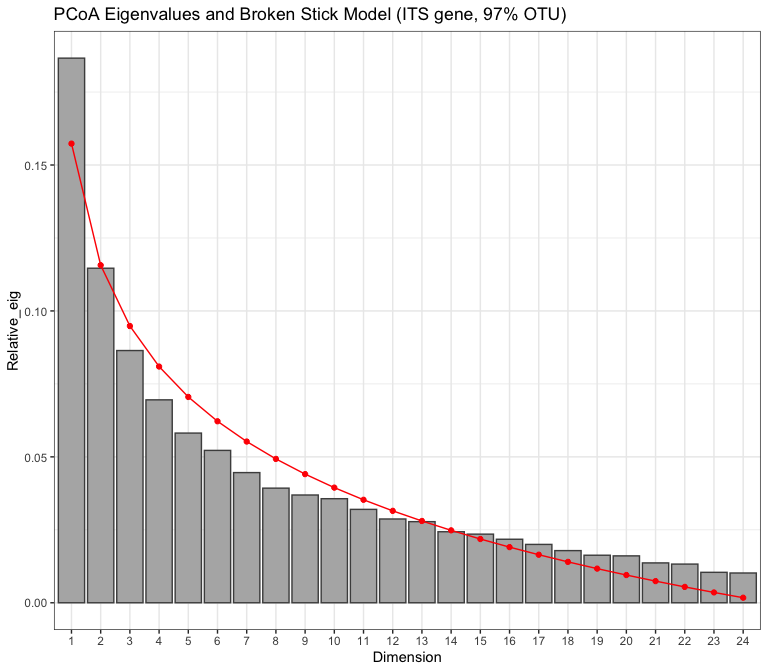

Microbial data: community differences
================
Beau Larkin

Last updated: 17 February, 2023

- <a href="#description" id="toc-description">Description</a>
- <a href="#packages-and-libraries"
  id="toc-packages-and-libraries">Packages and libraries</a>
- <a href="#data" id="toc-data">Data</a>
  - <a href="#sites-species-tables"
    id="toc-sites-species-tables">Sites-species tables</a>
  - <a href="#species-metadata" id="toc-species-metadata">Species
    metadata</a>
  - <a href="#site-metadata" id="toc-site-metadata">Site metadata</a>
  - <a href="#functions" id="toc-functions">Functions</a>
- <a href="#results" id="toc-results">Results</a>
  - <a href="#ordinations" id="toc-ordinations">Ordinations</a>
    - <a href="#pcoa-with-its-gene-otu-clusters"
      id="toc-pcoa-with-its-gene-otu-clusters">PCoA with ITS gene, OTU
      clusters</a>

# Description

Microbial data include site-species tables derived from high-throughput
sequencing and clustering in QIIME by Lorinda Bullington and PLFA/NLFA
data which Ylva Lekberg did.

This presents basic visualizations of community differences among
sites/regions based on ITS data.

One goal here is to see whether choosing OTU or SV clusters presents
qualitatively different outcomes in ordinations. We will choose one
(OTUs) if they start to look similar, as they have so far.

Multivariate analyses/visualizations proposed: - PCoA of species
abundances in fields - Explore/refine environment data (soilchem, site
metadata) - Possible constrained ordinations (LDA, db-RDA, etc.) -
RLQ/Fourth Corner of species, traits, and env - Variation Partitioning
of species vs. plants, and species vs. soilchem

Species distance matrices are resampled to the minimum number which
successfully amplified per field. This was done to equalize sampling
effort. This procedure can easily be undone in the [process_data
script](process_data.md)

# Packages and libraries

``` r
packages_needed = c("tidyverse", "vegan", "colorspace", "ape")
packages_installed = packages_needed %in% rownames(installed.packages())
```

``` r
if (any(!packages_installed)) {
    install.packages(packages_needed[!packages_installed])
}
```

``` r
for (i in 1:length(packages_needed)) {
    library(packages_needed[i], character.only = T)
}
```

# Data

## Sites-species tables

CSV files were produced in `process_data.R`

``` r
spe <- list(
    its_otu = read_csv(
        paste0(getwd(), "/clean_data/spe_ITS_otu_siteSpeMatrix_avg.csv"),
        show_col_types = FALSE
    ),
    its_sv  = read_csv(
        paste0(getwd(), "/clean_data/spe_ITS_sv_siteSpeMatrix_avg.csv"),
        show_col_types = FALSE
    ),
    amf_otu = read_csv(
        paste0(getwd(), "/clean_data/spe_18S_otu_siteSpeMatrix_avg.csv"),
        show_col_types = FALSE
    ),
    amf_sv  = read_csv(
        paste0(getwd(), "/clean_data/spe_18S_sv_siteSpeMatrix_avg.csv"),
        show_col_types = FALSE
    )
)
```

## Species metadata

Needed to make inset figures showing most important categories of
species. CSV files were produced in the [microbial diversity
script](microbial_diversity.md)

``` r
spe_meta <- list(
    its_otu =
        read_csv(
            paste0(getwd(), "/clean_data/speGuild_ITS_otu.csv"),
            show_col_types = FALSE
        ),
    its_sv  =
        read_csv(
            paste0(getwd(), "/clean_data/speGuild_ITS_sv.csv"),
            show_col_types = FALSE
        ),
    amf_otu = 
        read_csv(
            paste0(getwd(), "/clean_data/speTaxa_18S_otu.csv"),
            show_col_types = FALSE
        ),
    amf_sv = 
        read_csv(
            paste0(getwd(), "/clean_data/speTaxa_18S_sv.csv"),
            show_col_types = FALSE
        )
)
```

## Site metadata

Needed for figure interpretation and permanova designs.

``` r
sites <- read_csv(paste0(getwd(), "/clean_data/site.csv"), show_col_types = FALSE) %>% 
    mutate(field_type = factor(site_type, ordered = TRUE, levels = c("corn", "restored", "remnant"))) %>% 
    filter(site_type != "oldfield") %>% 
    select(-lat, -long, -yr_restore, -site_type)
```

## Functions

A function handles the Principal Components Analysis (PCoA) diagnostics,
with outputs and figures saved to a list for later use.

``` r
pcoa_fun <- function(data, env=sites, corr="none", d_method="bray", df_name, nperm=1999) {
    # Calculations for ordination
    d <- vegdist(data.frame(data, row.names = 1), d_method)
    p <- pcoa(d, correction = corr)
    p_vals <- data.frame(p$values) %>% 
        rownames_to_column(var = "Dim") %>% 
        mutate(Dim = as.integer(Dim))
    p_vec <- data.frame(p$vectors)
    # Permutation tests (PERMANOVA)
    glo_perm <-
        adonis2(
            data.frame(data, row.names = 1) ~ field_type + region,
            data = env,
            by = NULL,
            permutations = nperm,
            method = d_method
        )
    mar_perm <-
        adonis2(
            data.frame(data, row.names = 1) ~ field_type + region,
            data = env,
            by = "margin",
            permutations = nperm,
            method = d_method
        )
    int_perm <-
        adonis2(
            data.frame(data, row.names = 1) ~ field_type * region,
            data = env,
            by = "margin",
            permutations = nperm,
            method = d_method
        )
    # Diagnostic plots
    if(corr == "none" | ncol(p_vals) == 6) {
        p_bstick <- ggplot(p_vals, aes(x = factor(Dim), y = Relative_eig)) + 
            geom_col(fill = "gray70", color = "gray30") + 
            geom_line(aes(x = Dim, y = Broken_stick), color = "red") +
            geom_point(aes(x = Dim, y = Broken_stick), color = "red") +
            labs(x = "Dimension", 
                 title = paste0("PCoA Eigenvalues and Broken Stick Model (", df_name, ")")) +
            theme_bw()
        p_ncomp <- with(p_vals, which(Relative_eig < Broken_stick)[1]-1)
    } else {
        p_bstick <- ggplot(p_vals, aes(x = factor(Dim), y = Rel_corr_eig)) + 
            geom_col(fill = "gray70", color = "gray30") + 
            geom_line(aes(x = Dim, y = Broken_stick), color = "red") +
            geom_point(aes(x = Dim, y = Broken_stick), color = "red") +
            labs(x = "Dimension", 
                 title = paste0("PCoA Eigenvalues and Broken Stick Model (", df_name, ")")) +
            theme_bw()
        p_ncomp <- with(p_vals, which(Rel_corr_eig < Broken_stick)[1]-1)
    }
    # Output data
    ncomp <- if(p_ncomp <= 2) {2} else {p_ncomp}
    output <- list(components_exceed_broken_stick = p_ncomp,
                   values = p_vals[1:(ncomp+1), ], 
                   site_vectors = p_vec[, 1:ncomp],
                   broken_stick_plot = p_bstick,
                   global_permanova = glo_perm,
                   margin_terms_permanova = mar_perm,
                   interaction_terms_permanova = int_perm)
    return(output)
}
```

# Results

## Ordinations

Bray-Curtis or Ruzicka distance are both appropriate, but Bray-Curtis
has produced axes with better explanatory power (Ruzicka is used with
method=“jaccard”) In trial runs, no negative eigenvalues with these
matrices (not shown). No correction is needed for these ordinations.

### PCoA with ITS gene, OTU clusters

``` r
(pcoa_its_otu <- pcoa_fun(spe$its_otu, df_name = "ITS gene, 97% OTU"))
```

    ## $components_exceed_broken_stick
    ## [1] 1
    ## 
    ## $values
    ##   Dim Eigenvalues Relative_eig Broken_stick Cumul_eig Cumul_br_stick
    ## 1   1   1.2960817   0.18766105   0.15733159 0.1876611      0.1573316
    ## 2   2   0.7858318   0.11378143   0.11566492 0.3014425      0.2729965
    ## 3   3   0.6014731   0.08708793   0.09483159 0.3885304      0.3678281
    ## 
    ## $site_vectors
    ##         Axis.1       Axis.2
    ## 1   0.25490054  0.032664721
    ## 2  -0.11301047  0.001028409
    ## 3  -0.33618559 -0.038014719
    ## 4   0.10418242  0.332628400
    ## 5  -0.05537505  0.305589143
    ## 6  -0.30889461 -0.139743092
    ## 7  -0.32867504 -0.050018535
    ## 8   0.09762778  0.200899274
    ## 9   0.24304045  0.156845074
    ## 10  0.32087603  0.075166871
    ## 11  0.19999261  0.107291875
    ## 12  0.19792902 -0.233006248
    ## 13  0.19989439 -0.114820844
    ## 14  0.17685928 -0.235833846
    ## 15  0.24160038  0.039691445
    ## 16 -0.38898938 -0.121262047
    ## 17  0.06806734 -0.192814712
    ## 18 -0.24069587 -0.051989592
    ## 19 -0.16126623 -0.085507699
    ## 20  0.23791412 -0.306044315
    ## 21  0.22336297 -0.245273310
    ## 22 -0.07048459  0.254753127
    ## 23 -0.22515596  0.112645349
    ## 24 -0.32465333 -0.040508690
    ## 25 -0.01286119  0.235633964
    ## 
    ## $broken_stick_plot



    ## 
    ## $global_permanova
    ## Permutation test for adonis under reduced model
    ## Permutation: free
    ## Number of permutations: 1999
    ## 
    ## adonis2(formula = data.frame(data, row.names = 1) ~ field_type + region, data = env, permutations = nperm, method = d_method, by = NULL)
    ##          Df SumOfSqs      R2      F Pr(>F)    
    ## Model     5   2.4548 0.35543 2.0954  5e-04 ***
    ## Residual 19   4.4517 0.64457                  
    ## Total    24   6.9065 1.00000                  
    ## ---
    ## Signif. codes:  0 '***' 0.001 '**' 0.01 '*' 0.05 '.' 0.1 ' ' 1
    ## 
    ## $margin_terms_permanova
    ## Permutation test for adonis under reduced model
    ## Marginal effects of terms
    ## Permutation: free
    ## Number of permutations: 1999
    ## 
    ## adonis2(formula = data.frame(data, row.names = 1) ~ field_type + region, data = env, permutations = nperm, method = d_method, by = "margin")
    ##            Df SumOfSqs      R2      F Pr(>F)    
    ## field_type  2   1.1816 0.17108 2.5215  5e-04 ***
    ## region      3   1.2344 0.17872 1.7561  1e-03 ***
    ## Residual   19   4.4517 0.64457                  
    ## Total      24   6.9065 1.00000                  
    ## ---
    ## Signif. codes:  0 '***' 0.001 '**' 0.01 '*' 0.05 '.' 0.1 ' ' 1
    ## 
    ## $interaction_terms_permanova
    ## Permutation test for adonis under reduced model
    ## Marginal effects of terms
    ## Permutation: free
    ## Number of permutations: 1999
    ## 
    ## adonis2(formula = data.frame(data, row.names = 1) ~ field_type * region, data = env, permutations = nperm, method = d_method, by = "margin")
    ##                   Df SumOfSqs      R2      F Pr(>F)
    ## field_type:region  6   1.5247 0.22076 1.1286  0.136
    ## Residual          13   2.9270 0.42381              
    ## Total             24   6.9065 1.00000

``` r
# __Site-averaged abundances of 97% OTUs ----------------------
# Bray-Curtis used. Ruzicka may be more appropriate, but changed nothing except reducing
# the variance explained on axes. 


# #PCoA
# pcoa_otu_savg <- pcoa_fun(its_otu_savg_bc, ax = 2)
# pcoa_otu_savg
# pcoa_otu_savg_site <- 
#     pcoa_otu_savg$site_vectors %>% 
#     rownames_to_column(var = "site_key") %>% 
#     mutate(site_key = as.integer(site_key)) %>% 
#     left_join(sites, by = "site_key")
# ggplot(pcoa_otu_savg_site, aes(x = Axis.1, y = Axis.2)) +
#     geom_point(aes(fill = site_type, shape = region), size = 10) + 
#     geom_text(aes(label = yr_since)) +
#     scale_fill_discrete_qualitative(palette = "harmonic") +
#     scale_shape_manual(values = c(21, 22, 23, 24)) +
#     labs(x = "Axis 1 (18.9%)", y = "Axis 2 (11.6%)", title = "PCoA of site-averaged 97% OTUs", caption = "Text indicates years since restoration") +
#     theme_bw() +
#     guides(fill = guide_legend(override.aes = list(shape = 21)))
# 
# 
# # __Subsample abundances of 97% OTUs ----------------------
# its_otu_all_bc <- vegdist(data.frame(its_otu_all[, -c(1:2)], row.names = 1), method = d_method)
# 
# 
# # PCoA
# pcoa_otu_all <- pcoa_fun(its_otu_all_bc, ax = 2, corr = "lingoes")
# pcoa_otu_all
# pcoa_otu_all_site <- 
#     pcoa_otu_all$site_vectors %>% 
#     rownames_to_column(var = "sample_key") %>% 
#     separate(sample_key, into = c("site_key", "sample"), sep = "_", remove = FALSE) %>% 
#     mutate(site_key = as.numeric(site_key)) %>% 
#     left_join(sites %>% select(-lat, -long, -yr_restore), by = "site_key")
# ggplot(pcoa_otu_all_site, aes(x = Axis.1, y = Axis.2)) +
#     geom_point(aes(fill = site_type, shape = region), size = 5) + 
#     # geom_text(aes(label = yr_since)) +
#     scale_fill_discrete_qualitative(palette = "harmonic") +
#     scale_shape_manual(values = c(21, 22, 23, 24)) +
#     labs(x = "Axis 1 (7.7%)", y = "Axis 2 (4.7%)", title = "PCoA of 97% OTUs", caption = "Text indicates years since restoration") +
#     theme_bw() +
#     guides(fill = guide_legend(override.aes = list(shape = 21)))
# # Spiders for fun
# p_spid <- cmdscale(its_otu_all_bc, k = nrow(its_otu_all)-1, eig = FALSE, add = TRUE)
# plot(scores(p_spid, choices = c(1,2)), type = "n")
# ordispider(p_spid, groups = factor(pcoa_otu_all_site$site_key), spiders = "centroid", label = TRUE)
# points(scores(p_spid, choices = c(1,2)), col = as.numeric(factor(pcoa_otu_all_site$site_type)), pch = 16, cex = 1.3)
# 
# 
# 
# # Possibly show guild or taxononmy information on ordinations
```
