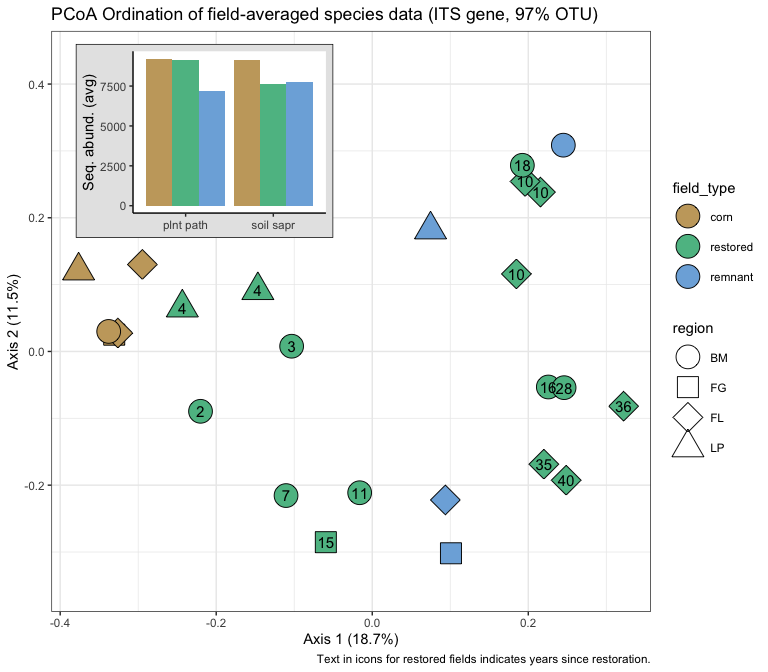

Microbial data: community differences
================
Beau Larkin

Last updated: 10 March, 2023

- <a href="#description" id="toc-description">Description</a>
- <a href="#packages-and-libraries"
  id="toc-packages-and-libraries">Packages and libraries</a>
- <a href="#data" id="toc-data">Data</a>
  - <a href="#sites-species-tables"
    id="toc-sites-species-tables">Sites-species tables</a>
  - <a href="#species-metadata" id="toc-species-metadata">Species
    metadata</a>
  - <a href="#site-metadata" id="toc-site-metadata">Site metadata</a>
  - <a href="#distance-tables" id="toc-distance-tables">Distance tables</a>
  - <a href="#functions" id="toc-functions">Functions</a>
- <a href="#results" id="toc-results">Results</a>
  - <a href="#ordinations" id="toc-ordinations">Ordinations</a>
    - <a href="#pcoa-with-its-gene-otu-clusters"
      id="toc-pcoa-with-its-gene-otu-clusters">PCoA with ITS gene, OTU
      clusters</a>
    - <a href="#pcoa-with-18s-gene-uninformed-distance"
      id="toc-pcoa-with-18s-gene-uninformed-distance">PCoA with 18S gene,
      uninformed distance</a>
    - <a href="#pcoa-with-18s-gene-unifrac-distance"
      id="toc-pcoa-with-18s-gene-unifrac-distance">PCoA with 18S gene, UNIFRAC
      distance</a>

# Description

Microbial data include site-species tables derived from high-throughput
sequencing and clustering in QIIME by Lorinda Bullington and PLFA/NLFA
data which Ylva Lekberg did.

This presents basic visualizations of community differences among
sites/regions based on ITS data.

One goal here is to see whether choosing OTU or SV clusters presents
qualitatively different outcomes in ordinations. We will choose one
(OTUs) if they start to look similar, as they have so far.

Species distance matrices are resampled to the minimum number which
successfully amplified per field. This was done to equalize sampling
effort. This procedure can easily be undone in the [process_data
script](process_data.md)

# Packages and libraries

``` r
packages_needed = c("tidyverse", "vegan", "colorspace", "ape", "knitr")
packages_installed = packages_needed %in% rownames(installed.packages())
```

``` r
if (any(!packages_installed)) {
    install.packages(packages_needed[!packages_installed])
}
```

``` r
for (i in 1:length(packages_needed)) {
    library(packages_needed[i], character.only = T)
}
```

# Data

## Sites-species tables

Samples-species tables with rarefied sequence abundances. CSV files were
produced in [process_data.R](process_data.md)

``` r
spe <- list(
    its = read_csv(
        paste0(getwd(), "/clean_data/spe_ITS_rfy.csv"),
        show_col_types = FALSE
    ),
    amf = read_csv(
        paste0(getwd(), "/clean_data/spe_18S_rfy.csv"),
        show_col_types = FALSE
    )
)
```

## Species metadata

Needed to make inset figures showing most important categories of
species. The OTUs and sequence abundances in these files matches the
rarefied data in `spe$` above. CSV files were produced in the [microbial
diversity script](microbial_diversity.md).

``` r
spe_meta <- list(
    its =
        read_csv(
            paste0(getwd(), "/clean_data/speTaxa_ITS_rfy.csv"),
            show_col_types = FALSE
        ),
    amf = 
        read_csv(
            paste0(getwd(), "/clean_data/speTaxa_18S_rfy.csv"),
            show_col_types = FALSE
        )
)
```

## Site metadata

Needed for figure interpretation and permanova designs.

``` r
sites <-
    read_csv(paste0(getwd(), "/clean_data/sites.csv"), show_col_types = FALSE) %>%
    mutate(
        field_type = factor(
            field_type,
            ordered = TRUE,
            levels = c("corn", "restored", "remnant")),
        yr_since = replace(yr_since, which(field_type == "remnant"), "+"),
        yr_since = replace(yr_since, which(field_type == "corn"), "-")) %>%
    select(-lat, -long, -yr_restore, -yr_rank) %>% 
    arrange(field_key)
```

## Distance tables

Creating distance objects from the samples-species tables is done with
the typical process of `vegdist()` in vegan. Bray-Curtis or Ruzicka
distance are both appropriate methods for these data, but Bray-Curtis
has produced axes with better explanatory power (Ruzicka is used with
method=“jaccard”) With the 18S data, we can take advantage of
phylogenetic relationships in a UNIFRAC distance matrix. The UNIFRAC
distance was produced in QIIME II and needs some wrangling to conform to
the standards of a distance object in R. The following list contains
vegdist-produced distance objects for ITS and 18S, and it includes
UNIFRAC distance for 18S.

``` r
distab <- list(
    its = vegdist(data.frame(spe$its, row.names = 1), method = "bray"),
    amf_bray = vegdist(data.frame(spe$amf, row.names = 1), method = "bray"),
    amf_uni = sites %>%
        select(field_name, field_key) %>%
        left_join(read_delim(
            paste0(getwd(), "/otu_tables/18S/18S_weighted_Unifrac.tsv"),
            show_col_types = FALSE
        ),
        by = join_by(field_name)) %>%
        select(field_key, everything(),-field_name) %>%
        data.frame(row.names = 1) %>%
        as.dist()
) 
```

## Functions

A function handles the Principal Components Analysis (PCoA) diagnostics,
with outputs and figures saved to a list for later use.

``` r
pcoa_fun <- function(d, env=sites, corr="none", df_name, nperm=1999) {
    # Multivariate analysis
    p <- pcoa(d, correction = corr)
    p_vals <- data.frame(p$values) %>% 
        rownames_to_column(var = "Dim") %>% 
        mutate(Dim = as.integer(Dim))
    p_vec <- data.frame(p$vectors)
    # Permutation tests (PERMANOVA)
    p_permtest <-
        with(env,
             adonis2(
                 d ~ field_type,
                 data = env,
                 permutations = nperm,
                 strata = region
             ))
    # Diagnostic plots
    if(corr == "none" | ncol(p_vals) == 6) {
        p_bstick <- ggplot(p_vals, aes(x = factor(Dim), y = Relative_eig)) + 
            geom_col(fill = "gray70", color = "gray30") + 
            geom_line(aes(x = Dim, y = Broken_stick), color = "red") +
            geom_point(aes(x = Dim, y = Broken_stick), color = "red") +
            labs(x = "Dimension", 
                 title = paste0("PCoA Eigenvalues and Broken Stick Model (", df_name, ")")) +
            theme_bw()
        p_ncomp <- with(p_vals, which(Relative_eig < Broken_stick)[1]-1)
        eig <- round(p_vals$Relative_eig[1:2] * 100, 1)
    } else {
        p_bstick <- ggplot(p_vals, aes(x = factor(Dim), y = Rel_corr_eig)) + 
            geom_col(fill = "gray70", color = "gray30") + 
            geom_line(aes(x = Dim, y = Broken_stick), color = "red") +
            geom_point(aes(x = Dim, y = Broken_stick), color = "red") +
            labs(x = "Dimension", 
                 title = paste0("PCoA Eigenvalues and Broken Stick Model (", df_name, ")")) +
            theme_bw()
        p_ncomp <- with(p_vals, which(Rel_corr_eig < Broken_stick)[1]-1)
        eig <- round(p_vals$Rel_corr_eig[1:2] * 100, 1)
    }
    ncomp <- if(p_ncomp <= 2) {2} else {p_ncomp}
    # Ordination plot
    scores <-
        p_vec[, 1:ncomp] %>%
        rownames_to_column(var = "field_key") %>%
        mutate(field_key = as.integer(field_key)) %>%
        left_join(sites, by = "field_key") %>% 
        select(-field_name)
    # Output data
    output <- list(dataset = df_name,
                   components_exceed_broken_stick = p_ncomp,
                   correction_note = p$note,
                   values = p_vals[1:(ncomp+1), ], 
                   eigenvalues = eig,
                   site_vectors = scores,
                   broken_stick_plot = p_bstick,
                   permanova = p_permtest)
    return(output)
}
```

# Results

## Ordinations

Bray-Curtis or Ruzicka distance are both appropriate, but Bray-Curtis
has produced axes with better explanatory power (Ruzicka is used with
method=“jaccard”)

In trial runs, no negative eigenvalues were observed (not shown). No
correction is needed for these ordinations.

### PCoA with ITS gene, OTU clusters

``` r
(pcoa_its <- pcoa_fun(distab$its, df_name = "ITS gene, 97% OTU"))
```

    ## $dataset
    ## [1] "ITS gene, 97% OTU"
    ## 
    ## $components_exceed_broken_stick
    ## [1] 1
    ## 
    ## $correction_note
    ## [1] "There were no negative eigenvalues. No correction was applied"
    ## 
    ## $values
    ##   Dim Eigenvalues Relative_eig Broken_stick Cumul_eig Cumul_br_stick
    ## 1   1   1.2539341   0.17873447   0.15733159 0.1787345      0.1573316
    ## 2   2   0.7681894   0.10949692   0.11566492 0.2882314      0.2729965
    ## 3   3   0.5914430   0.08430367   0.09483159 0.3725351      0.3678281
    ## 
    ## $eigenvalues
    ## [1] 17.9 10.9
    ## 
    ## $site_vectors
    ##    field_key      Axis.1        Axis.2 region field_type yr_since
    ## 1          1  0.22935748 -0.0634408714     BM   restored       16
    ## 2          2 -0.11199083  0.0306894389     BM   restored        3
    ## 3          3 -0.31781910 -0.0007177466     FG       corn        -
    ## 4          4  0.10896813 -0.2777347869     FG    remnant        +
    ## 5          5 -0.04825067 -0.2761955137     FG   restored       15
    ## 6          6 -0.28752911  0.1182930532     FL       corn        -
    ## 7          7 -0.32675257 -0.0045850430     FL       corn        -
    ## 8          8  0.07968936 -0.1796470633     FL    remnant        +
    ## 9          9  0.22820988 -0.2400602565     FL   restored       40
    ## 10        10  0.31786964 -0.1222147262     FL   restored       36
    ## 11        11  0.21518017 -0.2133356265     FL   restored       35
    ## 12        12  0.21895564  0.2094389531     FL   restored       10
    ## 13        13  0.17773715  0.1209411918     FL   restored       10
    ## 14        14  0.21796265  0.2701293406     FL   restored       10
    ## 15        15  0.25796612 -0.0363043767     BM   restored       28
    ## 16        16 -0.35980619  0.1204089283     LP       corn        -
    ## 17        17  0.06583982  0.1552296322     LP    remnant        +
    ## 18        18 -0.24348124  0.0605201752     LP   restored        4
    ## 19        19 -0.13952392  0.0915257331     LP   restored        4
    ## 20        20  0.23918815  0.3303887590     BM    remnant        +
    ## 21        21  0.18531310  0.2940759473     BM   restored       18
    ## 22        22 -0.11657833 -0.1884920889     BM   restored        7
    ## 23        23 -0.22074465 -0.0624883091     BM   restored        2
    ## 24        24 -0.34299159  0.0257186988     BM       corn        -
    ## 25        25 -0.02676908 -0.1621434428     BM   restored       11
    ## 
    ## $broken_stick_plot


    ## 
    ## $permanova
    ## Permutation test for adonis under reduced model
    ## Terms added sequentially (first to last)
    ## Blocks:  strata 
    ## Permutation: free
    ## Number of permutations: 1999
    ## 
    ## adonis2(formula = d ~ field_type, data = env, permutations = nperm, strata = region)
    ##            Df SumOfSqs      R2      F Pr(>F)    
    ## field_type  2   1.2003 0.17108 2.2703  0.001 ***
    ## Residual   22   5.8154 0.82892                  
    ## Total      24   7.0156 1.00000                  
    ## ---
    ## Signif. codes:  0 '***' 0.001 '**' 0.01 '*' 0.05 '.' 0.1 ' ' 1

Axis 1 explains 17.9% of the variation and is the only eigenvalue that
exceeds a broken stick model. The most substantial variation here will
be on the first axis, although axis 2 explains 10.9% of the variation
and was very close to the broken stick value. Testing the design factor
*field_type* (with *region* treated as a block using the `strata`
argument of `adonis2`) revealed a significant clustering
$(R^2=0.17, p<0.001)$.

Let’s view a plot with abundances of community subgroups inset.

``` r
pcoa_its$ord <-
    ggplot(pcoa_its$site_vectors, aes(x = Axis.1, y = Axis.2)) +
    geom_point(aes(fill = field_type, shape = region), size = 10) +
    geom_text(aes(label = yr_since)) +
    scale_fill_discrete_qualitative(palette = "harmonic") +
    scale_shape_manual(values = c(21, 22, 23, 24)) +
    labs(
        x = paste0("Axis 1 (", pcoa_its$eig[1], "%)"),
        y = paste0("Axis 2 (", pcoa_its$eig[2], "%)"),
        title = paste0(
            "PCoA Ordination of field-averaged species data (",
            pcoa_its$dataset,
            ")"
        ),
        caption = "Text indicates years since restoration, with corn (-) and remnants (+) never restored."
    ) +
    lims(y = c(-0.3,0.4)) +
    theme_bw() +
    guides(fill = guide_legend(override.aes = list(shape = 21)))
pcoa_its$inset <-
    spe_meta$its %>%
    filter(primary_lifestyle %in% c("soil_saprotroph", "wood_saprotroph", "plant_pathogen")) %>%
    mutate(field_type = factor(
        field_type,
        ordered = TRUE,
        levels = c("corn", "restored", "remnant")
    )) %>%
    group_by(primary_lifestyle, field_type) %>%
    summarize(avg_seq_abund = mean(seq_abund), .groups = "drop") %>%
    ggplot(aes(x = primary_lifestyle, y = avg_seq_abund)) +
    geom_col(aes(fill = field_type)) +
    labs(x = "",
         y = "Seq. abund. (avg)") +
    scale_fill_discrete_qualitative(palette = "Harmonic") +
    scale_x_discrete(label = c("soil sapr", "wood sapr", "plnt path")) +
    # coord_flip() +
    theme_classic() +
    theme(legend.position = "none")
```

``` r
pcoa_its$ord +
    annotation_custom(
        ggplotGrob(pcoa_its$inset + theme(
            plot.background = element_rect(colour = "black", fill = "gray90")
        )),
        xmin = -0.38,
        xmax = -0.05,
        ymin = 0.17,
        ymax = 0.42
    )
```



Community trajectories revealed in the ordination clearly depend on both
region and field type. Faville Grove shows a linear progression from
corn to remnant and Lake Petite does as well, although with few sites
and only single restoration ages these are weak supports. With Blue
Mounds sites, the general progression along Axis 1 is to increase in age
from left to right, but the remnant doesn’t seem representative because
it clusters far from everything else and associates most strongly with
the neighboring restored field (both on Merel Black’s property).
Restored fields at Fermi separate well away from cornfields, but less
age structure is found. Instead, the old restorations in the ring most
resemble the Railroad Remnant (which is in a different soil…), the
switchgrass restored fields take a potentially novel path toward distant
remnants.

On axis 1, four clusters are apparent in at least two partitioning
schemes. It will be interesting to see if we can pull those apart with
explanatory variables.

Restoration age will be explored in-depth with the subset of restoration
fields.

Here we can also begin considering what an inset plot to display
metadata might look like. Let’s plot and test the relationship between
age and community axis scores with restored fields only.

``` r
its_resto_scores <-
    pcoa_its$site_vectors %>%
    filter(field_type == "restored") %>%
    mutate(yr_since = as.numeric(yr_since))
```

``` r
summary(lm(
    Axis.1 ~ yr_since,
    data = its_resto_scores
))
```

    ## 
    ## Call:
    ## lm(formula = Axis.1 ~ yr_since, data = its_resto_scores)
    ## 
    ## Residuals:
    ##      Min       1Q   Median       3Q      Max 
    ## -0.18405 -0.09661 -0.04388  0.10309  0.21053 
    ## 
    ## Coefficients:
    ##              Estimate Std. Error t value Pr(>|t|)   
    ## (Intercept) -0.104662   0.054882  -1.907  0.07725 . 
    ## yr_since     0.011308   0.002782   4.064  0.00116 **
    ## ---
    ## Signif. codes:  0 '***' 0.001 '**' 0.01 '*' 0.05 '.' 0.1 ' ' 1
    ## 
    ## Residual standard error: 0.1349 on 14 degrees of freedom
    ## Multiple R-squared:  0.5413, Adjusted R-squared:  0.5085 
    ## F-statistic: 16.52 on 1 and 14 DF,  p-value: 0.00116

``` r
its_resto_scores %>%
    pivot_longer(Axis.1:Axis.2, names_to = "axis", values_to = "score") %>%
    ggplot(aes(x = yr_since, y = score)) +
    facet_wrap(vars(axis), scales = "free") +
    geom_smooth(aes(linetype = axis), method = "lm", se = FALSE, linewidth = 0.5) +
    geom_point(aes(shape = region), fill = "grey", size = 2) +
    labs(x = "Years since restoration",
         y = "PCoA axis score",
         title = "Correlations, axis scores and years since restoration (ITS, 97% OTU)",
         caption = "Blue lines show linear model fit; solid line is significant at p<0.05") +
    scale_shape_manual(values = c(21, 22, 23, 24)) +
    scale_linetype_manual(values = c('solid', 'dashed'), guide = "none") +
    theme_bw()
```


Indeed, Axis 1 does correlate well with age $(R^2_{Adj}=0.51, p<0.005)$.

It’s probably better to do with with a new ordination of just
restoration sites and a constrained ordination with years and other
environmental variables.

### PCoA with 18S gene, uninformed distance

“Uninformed” refers to Bray-Curtis or another distance informational
metric available in `vegdist()`. It is as opposed to UNIFRAC distance,
which is informed by phylogeny.

``` r
(pcoa_amf_bray <- pcoa_fun(distab$amf_bray, df_name = "18S gene, 97% OTU, Bray-Curtis distance"))
```

    ## $dataset
    ## [1] "18S gene, 97% OTU, Bray-Curtis distance"
    ## 
    ## $components_exceed_broken_stick
    ## [1] 4
    ## 
    ## $correction_note
    ## [1] "No correction was applied to the negative eigenvalues"
    ## 
    ## $values
    ##   Dim Eigenvalues Relative_eig Rel_corr_eig Broken_stick Cum_corr_eig
    ## 1   1   1.2089981   0.27137651   0.24540702   0.16236050    0.2454070
    ## 2   2   0.8141495   0.18274722   0.16679758   0.11888224    0.4122046
    ## 3   3   0.5831193   0.13088926   0.12080234   0.09714311    0.5330069
    ## 4   4   0.4108140   0.09221293   0.08649850   0.08265036    0.6195054
    ## 5   5   0.3089982   0.06935895   0.06622824   0.07178079    0.6857337
    ##   Cumul_br_stick
    ## 1      0.1623605
    ## 2      0.2812427
    ## 3      0.3783858
    ## 4      0.4610362
    ## 5      0.5328170
    ## 
    ## $eigenvalues
    ## [1] 27.1 18.3
    ## 
    ## $site_vectors
    ##    field_key      Axis.1       Axis.2      Axis.3       Axis.4 region
    ## 1          1  0.19205662  0.260955725 -0.19061514 -0.092900461     BM
    ## 2          2  0.01417715 -0.266401718 -0.20542208 -0.246134569     BM
    ## 3          3 -0.42814340  0.215074874  0.13301861  0.003742339     FG
    ## 4          4  0.04845387  0.025191501  0.25677704 -0.153832197     FG
    ## 5          5 -0.02166615 -0.049721877  0.19957967 -0.350084059     FG
    ## 6          6 -0.19169094 -0.006782546 -0.12542911  0.073156111     FL
    ## 7          7 -0.44193651  0.283436945 -0.18153557 -0.208280687     FL
    ## 8          8  0.10706891 -0.031917631  0.14137995 -0.017934723     FL
    ## 9          9  0.19336036  0.222973300  0.20871033  0.072255152     FL
    ## 10        10  0.25363196  0.129231704  0.07285234  0.183051294     FL
    ## 11        11  0.13033849  0.115641763  0.14173948  0.137120724     FL
    ## 12        12  0.14280101 -0.096662192 -0.15176884  0.025412030     FL
    ## 13        13  0.16328504  0.037487053 -0.15496809  0.087717598     FL
    ## 14        14  0.07737274 -0.052736101 -0.23052276  0.057257970     FL
    ## 15        15  0.31212163  0.303247801  0.08789612 -0.020697812     BM
    ## 16        16 -0.40655848  0.059953720 -0.08462888  0.132950332     LP
    ## 17        17  0.01340351 -0.213787917 -0.05409947  0.075137663     LP
    ## 18        18 -0.07978770 -0.253125905  0.04531857  0.151303554     LP
    ## 19        19  0.04987083 -0.301244234 -0.06587952  0.030162415     LP
    ## 20        20  0.24397080  0.179717606 -0.19172711 -0.040352576     BM
    ## 21        21  0.18390149 -0.056394946 -0.11855298 -0.028257156     BM
    ## 22        22 -0.01629393 -0.215461961  0.10636872  0.005813880     BM
    ## 23        23 -0.12559937 -0.136646487  0.15392567 -0.018251199     BM
    ## 24        24 -0.43471373  0.070246604  0.02721451  0.162426647     BM
    ## 25        25  0.02057578 -0.222275081  0.18036853 -0.020782271     BM
    ##    field_type yr_since
    ## 1    restored       16
    ## 2    restored        3
    ## 3        corn        -
    ## 4     remnant        +
    ## 5    restored       15
    ## 6        corn        -
    ## 7        corn        -
    ## 8     remnant        +
    ## 9    restored       40
    ## 10   restored       36
    ## 11   restored       35
    ## 12   restored       10
    ## 13   restored       10
    ## 14   restored       10
    ## 15   restored       28
    ## 16       corn        -
    ## 17    remnant        +
    ## 18   restored        4
    ## 19   restored        4
    ## 20    remnant        +
    ## 21   restored       18
    ## 22   restored        7
    ## 23   restored        2
    ## 24       corn        -
    ## 25   restored       11
    ## 
    ## $broken_stick_plot


    ## 
    ## $permanova
    ## Permutation test for adonis under reduced model
    ## Terms added sequentially (first to last)
    ## Blocks:  strata 
    ## Permutation: free
    ## Number of permutations: 1999
    ## 
    ## adonis2(formula = d ~ field_type, data = env, permutations = nperm, strata = region)
    ##            Df SumOfSqs      R2      F Pr(>F)   
    ## field_type  2   1.0890 0.24445 3.5589 0.0015 **
    ## Residual   22   3.3660 0.75555                 
    ## Total      24   4.4551 1.00000                 
    ## ---
    ## Signif. codes:  0 '***' 0.001 '**' 0.01 '*' 0.05 '.' 0.1 ' ' 1

Four axes are significant by a broken stick model, between them
explaining 67.7% of the variation in AMF among fields. It may be
worthwhile to examine structure on Axes 3 and 4 sometime. The most
substantial variation here is on the first axis (27.1%) with Axis 2
explaining 18.3% of the variation in AMF abundances. Testing the design
factor *field_type* (with *region* treated as a block using the `strata`
argument of `adonis2`) revealed a significant clustering
$(R^2=0.24, p<0.001)$.

Let’s view a plot with abundances of community subgroups inset.

``` r
pcoa_amf_bray$ord <- 
    ggplot(pcoa_amf_bray$site_vectors, aes(x = Axis.1, y = Axis.2)) +
    geom_point(aes(fill = field_type, shape = region), size = 10) +
    geom_text(aes(label = yr_since)) +
    scale_fill_discrete_qualitative(palette = "harmonic") +
    scale_shape_manual(values = c(21, 22, 23, 24)) +
    labs(x = paste0("Axis 1 (", pcoa_amf_bray$eig[1], "%)"), 
         y = paste0("Axis 2 (", pcoa_amf_bray$eig[2], "%)"), 
         title = paste0("PCoA Ordination of field-averaged species data (", pcoa_amf_bray$dataset, ")"),
         caption = "Text indicates years since restoration, with corn (-) and remnants (+) never restored.") +
    lims(x = c(-0.6,0.35)) +
    theme_bw() +
    guides(fill = guide_legend(override.aes = list(shape = 21)))
pcoa_amf_bray$inset <- 
    spe_meta$amf %>% 
    filter(family %in% c("Claroideoglomeraceae", "Paraglomeraceae", "Diversisporaceae", "Gigasporaceae")) %>% 
    mutate(field_type = factor(field_type, ordered = TRUE, levels = c("corn", "restored", "remnant"))) %>% 
    group_by(family, field_type) %>% 
    summarize(avg_seq_abund = mean(seq_abund), .groups = "drop") %>% 
    ggplot(aes(x = family, y = avg_seq_abund)) +
    geom_col(aes(fill = field_type)) +
    labs(x = "",
         y = "Seq. abundance (avg)") +
    scale_fill_discrete_qualitative(palette = "Harmonic") +
    scale_x_discrete(label = function(x) abbreviate(x, minlength = 6)) +
    # coord_flip() +
    theme_classic() +
    theme(legend.position = "none")
```

``` r
pcoa_amf_bray$ord +
    annotation_custom(
        ggplotGrob(pcoa_amf_bray$inset + theme(
            plot.background = element_rect(colour = "black", fill = "gray90")
        )),
        xmin = -0.63,
        xmax = -0.2,
        ymin = -0.32,
        ymax = -0.04
    )
```


Community trajectories revealed in the ordination correlate with field
type. Corn fields stand well apart with AMF communities, with restored
and remnant fields clustering closer than we had seen with
ITS-identified fungi. Restoration age along Axis 1 follows a near-linear
progression in Blue Mounds fields; with Fermi, we see a weaker age
progression and instead a strong separation between “ring fields” and
switchgrass plots as before. Restored fields’ fidelity to remnants seems
stronger with AMF than we had seen with general fungi.

What’s becoming apparent here is that Axis 1 separates strongly on
*field_type* and years since restoration, and Axis 2 further separates
on years since restoration. A consistent signal of region isn’t obvious.

Let’s test the relationship between age and community axis scores with
restored fields only.

``` r
amf_resto_scores <-
    pcoa_amf_bray$site_vectors %>%
    filter(field_type == "restored") %>%
    mutate(yr_since = as.numeric(yr_since))
```

``` r
summary(lm(
    Axis.1 ~ yr_since,
    data = amf_resto_scores
))
```

    ## 
    ## Call:
    ## lm(formula = Axis.1 ~ yr_since, data = amf_resto_scores)
    ## 
    ## Residuals:
    ##      Min       1Q   Median       3Q      Max 
    ## -0.12262 -0.07746  0.01287  0.07739  0.13085 
    ## 
    ## Coefficients:
    ##              Estimate Std. Error t value Pr(>|t|)   
    ## (Intercept) -0.017149   0.035914  -0.477  0.64038   
    ## yr_since     0.007086   0.001821   3.892  0.00163 **
    ## ---
    ## Signif. codes:  0 '***' 0.001 '**' 0.01 '*' 0.05 '.' 0.1 ' ' 1
    ## 
    ## Residual standard error: 0.08826 on 14 degrees of freedom
    ## Multiple R-squared:  0.5197, Adjusted R-squared:  0.4854 
    ## F-statistic: 15.15 on 1 and 14 DF,  p-value: 0.001627

``` r
summary(lm(
    Axis.2 ~ yr_since,
    data = amf_resto_scores
))
```

    ## 
    ## Call:
    ## lm(formula = Axis.2 ~ yr_since, data = amf_resto_scores)
    ## 
    ## Residuals:
    ##      Min       1Q   Median       3Q      Max 
    ## -0.12925 -0.07758 -0.04739  0.05660  0.29184 
    ## 
    ## Coefficients:
    ##              Estimate Std. Error t value Pr(>|t|)    
    ## (Intercept) -0.229735   0.050452  -4.554 0.000451 ***
    ## yr_since     0.012428   0.002558   4.859 0.000253 ***
    ## ---
    ## Signif. codes:  0 '***' 0.001 '**' 0.01 '*' 0.05 '.' 0.1 ' ' 1
    ## 
    ## Residual standard error: 0.124 on 14 degrees of freedom
    ## Multiple R-squared:  0.6277, Adjusted R-squared:  0.6012 
    ## F-statistic: 23.61 on 1 and 14 DF,  p-value: 0.000253

``` r
amf_resto_scores %>%
    pivot_longer(Axis.1:Axis.2, names_to = "axis", values_to = "score") %>%
    ggplot(aes(x = yr_since, y = score)) +
    facet_wrap(vars(axis), scales = "free") +
    geom_smooth(method = "lm", se = FALSE, linewidth = 0.5) +
    geom_point(aes(shape = region), fill = "grey", size = 2) +
    labs(x = "Years since restoration",
         y = "PCoA axis score",
         title = "Correlations, axis scores and years since restoration (18S gene, 97% OTU, Bray-Curtis distance)",
         caption = "Blue lines show linear model fit; solid line is significant at p<0.05") +
    scale_shape_manual(values = c(21, 22, 23, 24)) +
    theme_bw()
```


Both axes correlate significantly and strongly with years since
restoration. Axis 2 shows a stronger relationship
$(R^2_{Adj}=0.60, p<0.001)$, and Axis 1 shows a moderately strong
relationship $(R^2_{Adj}=0.49, p<0.005)$

### PCoA with 18S gene, UNIFRAC distance

``` r
(pcoa_amf_uni <- pcoa_fun(distab$amf_uni, df_name = "18S gene, 97% OTU, UNIFRAC distance", corr = "lingoes"))
```

    ## $dataset
    ## [1] "18S gene, 97% OTU, UNIFRAC distance"
    ## 
    ## $components_exceed_broken_stick
    ## [1] 3
    ## 
    ## $correction_note
    ## [1] "Lingoes correction applied to negative eigenvalues: D' = -0.5*D^2 - 0.00730538070686336 , except diagonal elements"
    ## 
    ## $values
    ##   Dim Eigenvalues   Corr_eig Rel_corr_eig Broken_stick Cum_corr_eig
    ## 1   1  0.08910476 0.09641014    0.2302806   0.16236050    0.2302806
    ## 2   2  0.05546845 0.06277383    0.1499385   0.11888224    0.3802192
    ## 3   3  0.03768300 0.04498838    0.1074571   0.09714311    0.4876762
    ## 4   4  0.02287671 0.03018210    0.0720915   0.08265036    0.5597677
    ##   Cum_br_stick
    ## 1    0.1623605
    ## 2    0.2812427
    ## 3    0.3783858
    ## 4    0.4610362
    ## 
    ## $eigenvalues
    ## [1] 23 15
    ## 
    ## $site_vectors
    ##    field_key       Axis.1       Axis.2       Axis.3 region field_type yr_since
    ## 1          1  0.005000811 -0.019022480 -0.075661370     BM   restored       16
    ## 2          2  0.184329497 -0.015254402 -0.007699769     BM   restored        3
    ## 3          3 -0.072487397  0.067424513  0.039009283     FG       corn        -
    ## 4          4 -0.041221010 -0.036068309  0.021185618     FG    remnant        +
    ## 5          5  0.024753793 -0.052063386  0.054757181     FG   restored       15
    ## 6          6  0.132027889  0.107077144  0.033575362     FL       corn        -
    ## 7          7 -0.042177309  0.100432373 -0.083348303     FL       corn        -
    ## 8          8  0.012829998 -0.029240145  0.019755980     FL    remnant        +
    ## 9          9 -0.048029289 -0.037910042  0.024674421     FL   restored       40
    ## 10        10 -0.047531002 -0.032394265  0.016179264     FL   restored       36
    ## 11        11 -0.032019394 -0.015349526  0.017878940     FL   restored       35
    ## 12        12  0.070369149 -0.022703786 -0.026097774     FL   restored       10
    ## 13        13  0.014601133 -0.009117052 -0.041202654     FL   restored       10
    ## 14        14  0.027018121 -0.003352651 -0.048179202     FL   restored       10
    ## 15        15 -0.040888003 -0.041071752 -0.022777348     BM   restored       28
    ## 16        16 -0.029033616  0.101034837 -0.007893224     LP       corn        -
    ## 17        17 -0.010295789 -0.010944908  0.003923329     LP    remnant        +
    ## 18        18  0.001881795  0.008404165  0.035231885     LP   restored        4
    ## 19        19  0.066396377 -0.002797405  0.021616717     LP   restored        4
    ## 20        20 -0.045321553 -0.044288430 -0.057552793     BM    remnant        +
    ## 21        21 -0.010605035 -0.038274923 -0.046884326     BM   restored       18
    ## 22        22 -0.024417886 -0.009405314  0.017526673     BM   restored        7
    ## 23        23 -0.029424159  0.005009133  0.025573301     BM   restored        2
    ## 24        24 -0.076762389  0.062360323  0.037484938     BM       corn        -
    ## 25        25  0.011005267 -0.032483714  0.048923871     BM   restored       11
    ## 
    ## $broken_stick_plot


    ## 
    ## $permanova
    ## Permutation test for adonis under reduced model
    ## Terms added sequentially (first to last)
    ## Blocks:  strata 
    ## Permutation: free
    ## Number of permutations: 1999
    ## 
    ## adonis2(formula = d ~ field_type, data = env, permutations = nperm, strata = region)
    ##            Df SumOfSqs      R2      F Pr(>F)   
    ## field_type  2 0.054762 0.22505 3.1945  0.003 **
    ## Residual   22 0.188572 0.77495                 
    ## Total      24 0.243335 1.00000                 
    ## ---
    ## Signif. codes:  0 '***' 0.001 '**' 0.01 '*' 0.05 '.' 0.1 ' ' 1

Three axes are significant by a broken stick model, between them
explaining 48.8% of the variation in AMF among fields. The most
substantial variation here is on the first axis (23%) with Axis 2
explaining 15% of the variation in AMF abundances. Testing the design
factor *field_type* (with *region* treated as a block using the `strata`
argument of `adonis2`) revealed a significant clustering
$(R^2=0.23, p<0.01)$.

Let’s view a plot with abundances of community subgroups inset.

``` r
pcoa_amf_uni$ord <- 
    ggplot(pcoa_amf_uni$site_vectors, aes(x = Axis.1, y = Axis.2)) +
    geom_point(aes(fill = field_type, shape = region), size = 10) +
    geom_text(aes(label = yr_since)) +
    scale_fill_discrete_qualitative(palette = "harmonic") +
    scale_shape_manual(values = c(21, 22, 23, 24)) +
    labs(x = paste0("Axis 1 (", pcoa_amf_uni$eig[1], "%)"), 
         y = paste0("Axis 2 (", pcoa_amf_uni$eig[2], "%)"), 
         title = paste0("PCoA Ordination of field-averaged species data (", pcoa_amf_uni$dataset, ")"),
         caption = "Text indicates years since restoration, with corn (-) and remnants (+) never restored.") +
    # lims(x = c(-0.6,0.35)) +
    theme_bw() +
    guides(fill = guide_legend(override.aes = list(shape = 21)))
```

``` r
# pcoa_amf_bray$inset reused here because it doesn't change
pcoa_amf_uni$ord +
    annotation_custom(
        ggplotGrob(pcoa_amf_bray$inset + theme(
            plot.background = element_rect(colour = "black", fill = "gray90")
        )),
        xmin = 0.07,
        xmax = 0.19,
        ymin = 0.015,
        ymax = 0.09
    )
```


Community trajectories revealed in the ordination separate cornfields
from everything else. Using UNIFRAC distance has really dissolved most
of what was apparent with the Bray-Curtis distance.  
Corn fields stand well apart with AMF communities, but no signal appears
for other field types or for years since restoration. I guess what this
shows is that for AMF, restored fields almost immediately resemble
remnants (but there must be some outlier taxa in Eric Rahnheim’s place).

What’s becoming apparent here is that Axis 1 separates strongly on
*field_type* and years since restoration, and Axis 2 further separates
on years since restoration. A consistent signal of region isn’t obvious.

Let’s test the relationship between age and community axis scores with
restored fields only. I don’t expect much.

``` r
amf_uni_resto_scores <-
    pcoa_amf_uni$site_vectors %>%
    filter(field_type == "restored") %>%
    mutate(yr_since = as.numeric(yr_since))
```

``` r
summary(lm(
    Axis.1 ~ yr_since,
    data = amf_uni_resto_scores
))
```

    ## 
    ## Call:
    ## lm(formula = Axis.1 ~ yr_since, data = amf_uni_resto_scores)
    ## 
    ## Residuals:
    ##       Min        1Q    Median        3Q       Max 
    ## -0.077622 -0.015330 -0.003244  0.011231  0.138891 
    ## 
    ## Coefficients:
    ##              Estimate Std. Error t value Pr(>|t|)  
    ## (Intercept)  0.053716   0.020091   2.674   0.0182 *
    ## yr_since    -0.002759   0.001019  -2.709   0.0170 *
    ## ---
    ## Signif. codes:  0 '***' 0.001 '**' 0.01 '*' 0.05 '.' 0.1 ' ' 1
    ## 
    ## Residual standard error: 0.04938 on 14 degrees of freedom
    ## Multiple R-squared:  0.3439, Adjusted R-squared:  0.297 
    ## F-statistic: 7.338 on 1 and 14 DF,  p-value: 0.01696

``` r
summary(lm(
    Axis.2 ~ yr_since,
    data = amf_uni_resto_scores
))
```

    ## 
    ## Call:
    ## lm(formula = Axis.2 ~ yr_since, data = amf_uni_resto_scores)
    ## 
    ## Residuals:
    ##       Min        1Q    Median        3Q       Max 
    ## -0.032677 -0.008332  0.002915  0.008418  0.020946 
    ## 
    ## Coefficients:
    ##               Estimate Std. Error t value Pr(>|t|)  
    ## (Intercept) -0.0067045  0.0060005  -1.117   0.2827  
    ## yr_since    -0.0008454  0.0003042  -2.779   0.0148 *
    ## ---
    ## Signif. codes:  0 '***' 0.001 '**' 0.01 '*' 0.05 '.' 0.1 ' ' 1
    ## 
    ## Residual standard error: 0.01475 on 14 degrees of freedom
    ## Multiple R-squared:  0.3555, Adjusted R-squared:  0.3095 
    ## F-statistic: 7.723 on 1 and 14 DF,  p-value: 0.01478

``` r
amf_uni_resto_scores %>%
    pivot_longer(Axis.1:Axis.2, names_to = "axis", values_to = "score") %>%
    ggplot(aes(x = yr_since, y = score)) +
    facet_wrap(vars(axis), scales = "free") +
    geom_smooth(method = "lm", se = FALSE, linewidth = 0.5) +
    geom_point(aes(shape = region), fill = "grey", size = 2) +
    labs(x = "Years since restoration",
         y = "PCoA axis score",
         title = "Correlations, axis scores and years since restoration (18S gene, 97% OTU, UNIFRAC distance)",
         caption = "Blue lines show linear model fit; solid line is significant at p<0.05") +
    scale_shape_manual(values = c(21, 22, 23, 24)) +
    theme_bw()
```


Both axes correlate significantly but with less than moderate strength
with years since restoration. Axis 2 again shows a stronger relationship
$(R^2_{Adj}=0.31, p<0.05)$, and Axis 1 is close with
$(R^2_{Adj}=0.30, p<0.05)$
