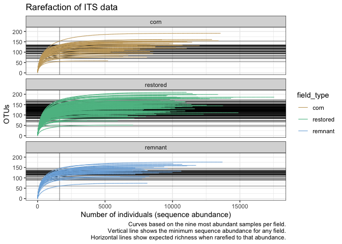
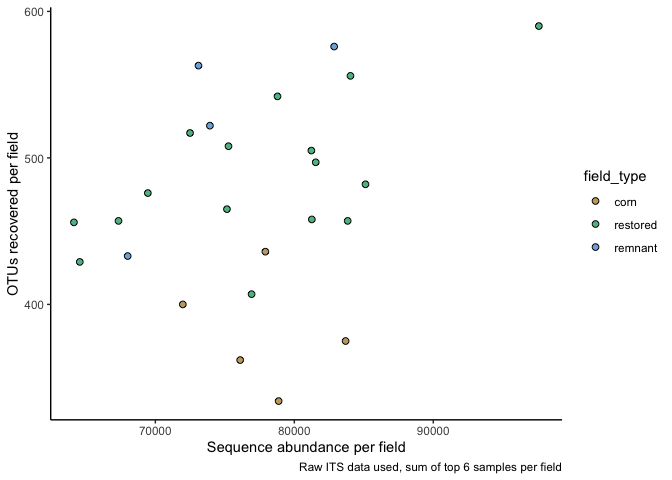
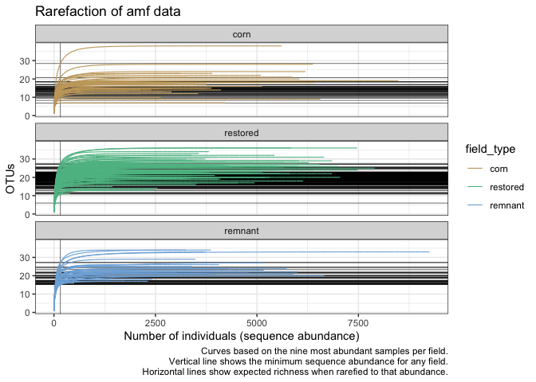
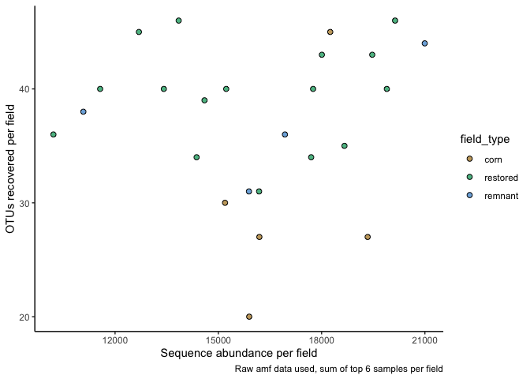
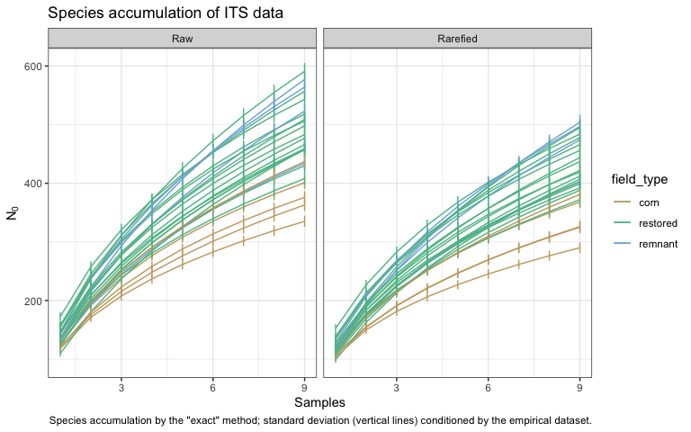

Microbial data: diagnostics of sequence data
================
Beau Larkin

Last updated: 06 October, 2023

- [Description](#description)
- [Packages and libraries](#packages-and-libraries)
- [Data](#data)
  - [Site metadata and design](#site-metadata-and-design)
  - [Sites-species tables](#sites-species-tables)
- [Functions](#functions)
  - [Species accumulation and
    rarefaction](#species-accumulation-and-rarefaction)
- [Analysis and Results](#analysis-and-results)
  - [Species accumulation and
    rarefaction](#species-accumulation-and-rarefaction-1)
    - [ITS dataset](#its-dataset)

# Description

Microbial data analyzed here include site-species tables derived from
high-throughput sequencing of ITS and 18S genes and clustering into 97%
similar OTUs. Before further analyses can be attempted, we need to know
if the data obtained are sufficient to characterize communities in
samples and fields. Decisions must be made about how to summarize the
species data for further analyses. The following actions are performed:

- Individual-based rarefaction at the sample level to determine the
  adequacy of sequence depth and justify rarefaction of sequence
  abundances.
- Species accumulation at the field level to determine the adequacy of
  sampling effort and justify characterization of alpha/beta diversity.

# Packages and libraries

``` r
packages_needed = c(
    "tidyverse",
    "vegan",
    "knitr",
    "colorspace"
)
packages_installed = packages_needed %in% rownames(installed.packages())
```

``` r
if (any(!packages_installed)) {
    install.packages(packages_needed[!packages_installed])
}
```

``` r
for (i in 1:length(packages_needed)) {
    library(packages_needed[i], character.only = T)
}
```

# Data

## Site metadata and design

``` r
sites <- read_csv(paste0(getwd(), "/clean_data/sites.csv"), show_col_types = FALSE) %>% 
    mutate(field_type = factor(field_type, ordered = TRUE, levels = c("corn", "restored", "remnant"))) %>% 
    select(-lat, -long, -yr_restore, -yr_rank)
```

Object *spe_samps* holds sequence abundances for each sample. Used here
for species accumulation.

``` r
spe_samps <- list(
    its_samps_raw = read_csv(paste0(getwd(), "/clean_data/spe_ITS_raw_samples.csv"),
                             show_col_types = FALSE),
    its_samps_rfy = read_csv(paste0(getwd(), "/clean_data/spe_ITS_rfy_samples.csv"),
                             show_col_types = FALSE),
    amf_samps_raw = read_csv(paste0(getwd(), "/clean_data/spe_18S_raw_samples.csv"),
                             show_col_types = FALSE),
    amf_samps_rfy = read_csv(paste0(getwd(), "/clean_data/spe_18S_rfy_samples.csv"),
                             show_col_types = FALSE)
)
```

## Sites-species tables

List *spe* holds average sequence abundances per field. Number of
samples per field which were retained is defined in `process_data.R`.
CSV files were produced in `process_data.R`

``` r
spe <- list(
    its_raw = read_csv(paste0(getwd(), "/clean_data/spe_ITS_raw.csv"), 
                       show_col_types = FALSE),
    its_rfy = read_csv(paste0(getwd(), "/clean_data/spe_ITS_rfy.csv"), 
                       show_col_types = FALSE),
    amf_raw = read_csv(paste0(getwd(), "/clean_data/spe_18S_raw.csv"), 
                       show_col_types = FALSE),
    amf_rfy = read_csv(paste0(getwd(), "/clean_data/spe_18S_rfy.csv"), 
                       show_col_types = FALSE)
)
```

# Functions

The following functions are used to streamline code and reduce errors:

## Species accumulation and rarefaction

Function `spe_accum()` uses vegan’s `specaccum()` to produce
accumulation curves with the raw, samples-based data.

``` r
spe_accum <- function(data) {
    df <- data.frame(
        samples = specaccum(data[, -1], conditioned = FALSE)$site,
        richness = specaccum(data[, -1], conditioned = FALSE)$richness,
        sd = specaccum(data[, -1], conditioned = FALSE)$sd
    )
    return(df)
}
```

# Analysis and Results

## Species accumulation and rarefaction

Species accumulation is performed using the “exact” method (Kindt, R.,
unpublished) to examine the adequacy of field sampling. Raw ITS and 18S
data with all samples is used and compared with the “topN” data sets.
Some samples didn’t amplify, so samples were dropped from some fields to
equalize sampling effort. As of 2023-03-13, six samples were retained
from each field, but nine would be possible to keep.

### ITS dataset

Individual-based rarefaction on samples

Rarefaction is performed to assess the relationship between sequence
abundance and species richness, and can help justify the decision to
rarefy to the minimum sequence depth obtained. Caution: function
`rarecurve()` takes some time to execute.

``` r
its_rc_data <- 
    spe_samps$its_samps_raw %>% 
    mutate(field_sample = paste(field_key, sample, sep = "_")) %>% 
    column_to_rownames(var = "field_sample") %>% 
    select(-field_key, -sample)
```

``` r
its_rc_tidy <- rarecurve(its_rc_data, step = 1, tidy = TRUE) 
its_rc <- 
    its_rc_tidy %>% 
    separate_wider_delim(Site, delim = "_", names = c("field_key", "sample_key"), cols_remove = FALSE) %>% 
    rename(seq_abund = Sample, otus = Species, field_sample = Site) %>% 
    left_join(sites %>% mutate(field_key = as.character(field_key)), by = join_by(field_key))
# Additional data and variables for plotting
its_depth <- 
    its_rc %>% 
    group_by(field_sample) %>% 
    slice_max(otus, n = 1) %>% 
    pull(seq_abund) %>% 
    min()
its_at_depth <- its_rc %>% filter(seq_abund == its_depth)
```

``` r
ggplot(its_rc, aes(x = seq_abund, y = otus, group = field_sample)) +
    facet_wrap(vars(field_type), ncol = 1) +
    geom_vline(xintercept = its_depth, linewidth = 0.2) +
    geom_hline(data = its_at_depth, aes(yintercept = otus), linewidth = 0.2) +
    geom_line(aes(color = field_type), linewidth = 0.4) +
    scale_color_discrete_qualitative(palette = "Harmonic") +
    labs(x = "Number of individuals (sequence abundance)",
         y = "OTUs",
         title = "Rarefaction of ITS data",
         caption = "Curves based on the nine most abundant samples per field.\nVertical line shows the minimum sequence abundance for any field.\nHorizontal lines show expected richness when rarefied to that abundance.") +
    theme_bw()
```



Minimum sequencing depth reached is 1628. Rarefying the data to this
depth would remove a great number of OTUs and leave nearly all samples
poorly characterized in richness and composition. It looks like
somewhere around 5000 sequences would be more appropriate. How many
samples would be lost at 5000 sequences?

``` r
its_rc %>% 
    group_by(field_sample) %>% 
    slice_max(otus, n = 1) %>% 
    slice_max(seq_abund, n = 1) %>% 
    arrange(seq_abund) %>% 
    kable(format = "pandoc", caption = "Samples sorted by sequence abundance")
```

| field_key | sample_key | field_sample | seq_abund | otus | field_name | region | field_type | yr_since |
|:----------|:-----------|:-------------|----------:|-----:|:-----------|:-------|:-----------|---------:|
| 9         | 8          | 9_8          |      1629 |   51 | FLRP1      | FL     | restored   |       40 |
| 14        | 4          | 14_4         |      3666 |   71 | FLRSP3     | FL     | restored   |       10 |
| 12        | 7          | 12_7         |      4198 |  108 | FLRSP1     | FL     | restored   |       10 |
| 19        | 10         | 19_10        |      4580 |  120 | LPRP2      | LP     | restored   |        4 |
| 23        | 2          | 23_2         |      4899 |   90 | MHRP2      | BM     | restored   |        2 |
| 18        | 10         | 18_10        |      4948 |  138 | LPRP1      | LP     | restored   |        4 |
| 6         | 3          | 6_3          |      5221 |   58 | FLC1       | FL     | corn       |        0 |
| 14        | 8          | 14_8         |      5321 |  117 | FLRSP3     | FL     | restored   |       10 |
| 15        | 8          | 15_8         |      5345 |   98 | KORP1      | BM     | restored   |       28 |
| 6         | 4          | 6_4          |      5405 |  101 | FLC1       | FL     | corn       |        0 |
| 15        | 2          | 15_2         |      5473 |  104 | KORP1      | BM     | restored   |       28 |
| 16        | 2          | 16_2         |      5541 |   97 | LPC1       | LP     | corn       |        0 |
| 22        | 4          | 22_4         |      5599 |  116 | MHRP1      | BM     | restored   |        7 |
| 8         | 4          | 8_4          |      5668 |  144 | FLREM1     | FL     | remnant    |       NA |
| 12        | 4          | 12_4         |      5789 |  127 | FLRSP1     | FL     | restored   |       10 |
| 14        | 2          | 14_2         |      5801 |  117 | FLRSP3     | FL     | restored   |       10 |
| 22        | 7          | 22_7         |      5853 |  134 | MHRP1      | BM     | restored   |        7 |
| 20        | 10         | 20_10        |      5858 |  131 | MBREM1     | BM     | remnant    |       NA |
| 1         | 3          | 1_3          |      5940 |   71 | BBRP1      | BM     | restored   |       16 |
| 5         | 4          | 5_4          |      5951 |  113 | FGRP1      | FG     | restored   |       15 |
| 24        | 9          | 24_9         |      6025 |   84 | PHC1       | BM     | corn       |        0 |
| 23        | 6          | 23_6         |      6054 |  139 | MHRP2      | BM     | restored   |        2 |
| 14        | 3          | 14_3         |      6068 |  130 | FLRSP3     | FL     | restored   |       10 |
| 1         | 9          | 1_9          |      6094 |  152 | BBRP1      | BM     | restored   |       16 |
| 8         | 1          | 8_1          |      6115 |  106 | FLREM1     | FL     | remnant    |       NA |
| 11        | 1          | 11_1         |      6184 |  130 | FLRP5      | FL     | restored   |       35 |
| 14        | 6          | 14_6         |      6199 |  134 | FLRSP3     | FL     | restored   |       10 |
| 13        | 8          | 13_8         |      6226 |  117 | FLRSP2     | FL     | restored   |       10 |
| 10        | 4          | 10_4         |      6287 |  115 | FLRP4      | FL     | restored   |       36 |
| 3         | 4          | 3_4          |      6296 |  144 | FGC1       | FG     | corn       |        0 |
| 24        | 8          | 24_8         |      6345 |   77 | PHC1       | BM     | corn       |        0 |
| 3         | 10         | 3_10         |      6346 |  140 | FGC1       | FG     | corn       |        0 |
| 4         | 9          | 4_9          |      6375 |  125 | FGREM1     | FG     | remnant    |       NA |
| 15        | 10         | 15_10        |      6382 |  152 | KORP1      | BM     | restored   |       28 |
| 3         | 2          | 3_2          |      6422 |  108 | FGC1       | FG     | corn       |        0 |
| 16        | 3          | 16_3         |      6425 |  110 | LPC1       | LP     | corn       |        0 |
| 12        | 10         | 12_10        |      6491 |  120 | FLRSP1     | FL     | restored   |       10 |
| 8         | 10         | 8_10         |      6508 |  134 | FLREM1     | FL     | remnant    |       NA |
| 24        | 6          | 24_6         |      6541 |   91 | PHC1       | BM     | corn       |        0 |
| 11        | 4          | 11_4         |      6561 |  130 | FLRP5      | FL     | restored   |       35 |
| 12        | 3          | 12_3         |      6577 |   97 | FLRSP1     | FL     | restored   |       10 |
| 1         | 2          | 1_2          |      6629 |   90 | BBRP1      | BM     | restored   |       16 |
| 2         | 8          | 2_8          |      6638 |  151 | ERRP1      | BM     | restored   |        3 |
| 25        | 7          | 25_7         |      6682 |   97 | PHRP1      | BM     | restored   |       11 |
| 17        | 7          | 17_7         |      6712 |  125 | LPREM1     | LP     | remnant    |       NA |
| 7         | 4          | 7_4          |      6722 |   84 | FLC2       | FL     | corn       |        0 |
| 21        | 10         | 21_10        |      6759 |   82 | MBRP1      | BM     | restored   |       18 |
| 22        | 10         | 22_10        |      6820 |  151 | MHRP1      | BM     | restored   |        7 |
| 13        | 3          | 13_3         |      6848 |  150 | FLRSP2     | FL     | restored   |       10 |
| 19        | 9          | 19_9         |      6853 |  145 | LPRP2      | LP     | restored   |        4 |
| 1         | 7          | 1_7          |      6880 |  135 | BBRP1      | BM     | restored   |       16 |
| 5         | 9          | 5_9          |      6899 |  139 | FGRP1      | FG     | restored   |       15 |
| 20        | 6          | 20_6         |      6914 |  142 | MBREM1     | BM     | remnant    |       NA |
| 4         | 6          | 4_6          |      6922 |  130 | FGREM1     | FG     | remnant    |       NA |
| 1         | 10         | 1_10         |      6960 |  150 | BBRP1      | BM     | restored   |       16 |
| 20        | 2          | 20_2         |      7009 |  136 | MBREM1     | BM     | remnant    |       NA |
| 25        | 1          | 25_1         |      7026 |  141 | PHRP1      | BM     | restored   |       11 |
| 6         | 7          | 6_7          |      7077 |  116 | FLC1       | FL     | corn       |        0 |
| 15        | 9          | 15_9         |      7078 |   51 | KORP1      | BM     | restored   |       28 |
| 1         | 4          | 1_4          |      7093 |  120 | BBRP1      | BM     | restored   |       16 |
| 23        | 10         | 23_10        |      7101 |  135 | MHRP2      | BM     | restored   |        2 |
| 4         | 3          | 4_3          |      7107 |  134 | FGREM1     | FG     | remnant    |       NA |
| 20        | 3          | 20_3         |      7114 |  135 | MBREM1     | BM     | remnant    |       NA |
| 2         | 4          | 2_4          |      7150 |  137 | ERRP1      | BM     | restored   |        3 |
| 19        | 6          | 19_6         |      7163 |  149 | LPRP2      | LP     | restored   |        4 |
| 25        | 10         | 25_10        |      7175 |   83 | PHRP1      | BM     | restored   |       11 |
| 12        | 2          | 12_2         |      7226 |  152 | FLRSP1     | FL     | restored   |       10 |
| 20        | 5          | 20_5         |      7235 |  148 | MBREM1     | BM     | remnant    |       NA |
| 8         | 3          | 8_3          |      7240 |  118 | FLREM1     | FL     | remnant    |       NA |
| 1         | 6          | 1_6          |      7242 |  107 | BBRP1      | BM     | restored   |       16 |
| 12        | 6          | 12_6         |      7334 |  111 | FLRSP1     | FL     | restored   |       10 |
| 18        | 9          | 18_9         |      7350 |  155 | LPRP1      | LP     | restored   |        4 |
| 22        | 6          | 22_6         |      7392 |  110 | MHRP1      | BM     | restored   |        7 |
| 3         | 1          | 3_1          |      7397 |  132 | FGC1       | FG     | corn       |        0 |
| 3         | 9          | 3_9          |      7399 |  106 | FGC1       | FG     | corn       |        0 |
| 2         | 3          | 2_3          |      7410 |  176 | ERRP1      | BM     | restored   |        3 |
| 15        | 3          | 15_3         |      7445 |   94 | KORP1      | BM     | restored   |       28 |
| 6         | 10         | 6_10         |      7449 |  128 | FLC1       | FL     | corn       |        0 |
| 10        | 6          | 10_6         |      7472 |  111 | FLRP4      | FL     | restored   |       36 |
| 2         | 7          | 2_7          |      7558 |  154 | ERRP1      | BM     | restored   |        3 |
| 16        | 9          | 16_9         |      7571 |  113 | LPC1       | LP     | corn       |        0 |
| 10        | 3          | 10_3         |      7588 |  176 | FLRP4      | FL     | restored   |       36 |
| 7         | 7          | 7_7          |      7589 |  114 | FLC2       | FL     | corn       |        0 |
| 17        | 2          | 17_2         |      7678 |  130 | LPREM1     | LP     | remnant    |       NA |
| 20        | 7          | 20_7         |      7686 |  143 | MBREM1     | BM     | remnant    |       NA |
| 4         | 5          | 4_5          |      7739 |   95 | FGREM1     | FG     | remnant    |       NA |
| 7         | 10         | 7_10         |      7749 |  148 | FLC2       | FL     | corn       |        0 |
| 4         | 7          | 4_7          |      7765 |  122 | FGREM1     | FG     | remnant    |       NA |
| 25        | 8          | 25_8         |      7770 |  130 | PHRP1      | BM     | restored   |       11 |
| 2         | 5          | 2_5          |      7773 |  155 | ERRP1      | BM     | restored   |        3 |
| 12        | 5          | 12_5         |      7794 |  152 | FLRSP1     | FL     | restored   |       10 |
| 4         | 4          | 4_4          |      7796 |  124 | FGREM1     | FG     | remnant    |       NA |
| 9         | 6          | 9_6          |      7799 |  112 | FLRP1      | FL     | restored   |       40 |
| 25        | 2          | 25_2         |      7804 |  122 | PHRP1      | BM     | restored   |       11 |
| 4         | 2          | 4_2          |      7845 |  144 | FGREM1     | FG     | remnant    |       NA |
| 5         | 10         | 5_10         |      7872 |  142 | FGRP1      | FG     | restored   |       15 |
| 1         | 5          | 1_5          |      7884 |  127 | BBRP1      | BM     | restored   |       16 |
| 10        | 5          | 10_5         |      7937 |  141 | FLRP4      | FL     | restored   |       36 |
| 8         | 7          | 8_7          |      7949 |  139 | FLREM1     | FL     | remnant    |       NA |
| 5         | 3          | 5_3          |      7973 |  132 | FGRP1      | FG     | restored   |       15 |
| 8         | 2          | 8_2          |      7983 |  103 | FLREM1     | FL     | remnant    |       NA |
| 16        | 1          | 16_1         |      7992 |  112 | LPC1       | LP     | corn       |        0 |
| 15        | 7          | 15_7         |      8034 |   92 | KORP1      | BM     | restored   |       28 |
| 2         | 1          | 2_1          |      8101 |  157 | ERRP1      | BM     | restored   |        3 |
| 6         | 9          | 6_9          |      8102 |   76 | FLC1       | FL     | corn       |        0 |
| 7         | 8          | 7_8          |      8106 |  139 | FLC2       | FL     | corn       |        0 |
| 13        | 2          | 13_2         |      8140 |  147 | FLRSP2     | FL     | restored   |       10 |
| 17        | 10         | 17_10        |      8142 |   74 | LPREM1     | LP     | remnant    |       NA |
| 18        | 2          | 18_2         |      8157 |  168 | LPRP1      | LP     | restored   |        4 |
| 4         | 1          | 4_1          |      8168 |  135 | FGREM1     | FG     | remnant    |       NA |
| 14        | 7          | 14_7         |      8184 |  115 | FLRSP3     | FL     | restored   |       10 |
| 4         | 8          | 4_8          |      8290 |  107 | FGREM1     | FG     | remnant    |       NA |
| 23        | 7          | 23_7         |      8303 |  132 | MHRP2      | BM     | restored   |        2 |
| 3         | 3          | 3_3          |      8333 |  103 | FGC1       | FG     | corn       |        0 |
| 7         | 5          | 7_5          |      8337 |   97 | FLC2       | FL     | corn       |        0 |
| 16        | 6          | 16_6         |      8347 |  138 | LPC1       | LP     | corn       |        0 |
| 18        | 7          | 18_7         |      8439 |  150 | LPRP1      | LP     | restored   |        4 |
| 9         | 7          | 9_7          |      8478 |  117 | FLRP1      | FL     | restored   |       40 |
| 9         | 2          | 9_2          |      8500 |  145 | FLRP1      | FL     | restored   |       40 |
| 18        | 6          | 18_6         |      8511 |  167 | LPRP1      | LP     | restored   |        4 |
| 10        | 2          | 10_2         |      8520 |  143 | FLRP4      | FL     | restored   |       36 |
| 11        | 10         | 11_10        |      8521 |  140 | FLRP5      | FL     | restored   |       35 |
| 2         | 2          | 2_2          |      8523 |  135 | ERRP1      | BM     | restored   |        3 |
| 24        | 7          | 24_7         |      8562 |   92 | PHC1       | BM     | corn       |        0 |
| 7         | 3          | 7_3          |      8579 |  105 | FLC2       | FL     | corn       |        0 |
| 10        | 9          | 10_9         |      8596 |  151 | FLRP4      | FL     | restored   |       36 |
| 21        | 4          | 21_4         |      8598 |  116 | MBRP1      | BM     | restored   |       18 |
| 17        | 9          | 17_9         |      8613 |  151 | LPREM1     | LP     | remnant    |       NA |
| 15        | 6          | 15_6         |      8638 |  108 | KORP1      | BM     | restored   |       28 |
| 3         | 5          | 3_5          |      8682 |  141 | FGC1       | FG     | corn       |        0 |
| 16        | 10         | 16_10        |      8713 |  125 | LPC1       | LP     | corn       |        0 |
| 7         | 6          | 7_6          |      8742 |  127 | FLC2       | FL     | corn       |        0 |
| 15        | 1          | 15_1         |      8752 |  143 | KORP1      | BM     | restored   |       28 |
| 2         | 9          | 2_9          |      8771 |  163 | ERRP1      | BM     | restored   |        3 |
| 11        | 2          | 11_2         |      8804 |  101 | FLRP5      | FL     | restored   |       35 |
| 10        | 7          | 10_7         |      8877 |  132 | FLRP4      | FL     | restored   |       36 |
| 25        | 6          | 25_6         |      8923 |  168 | PHRP1      | BM     | restored   |       11 |
| 22        | 3          | 22_3         |      8963 |  134 | MHRP1      | BM     | restored   |        7 |
| 25        | 5          | 25_5         |      8963 |  146 | PHRP1      | BM     | restored   |       11 |
| 17        | 1          | 17_1         |      8990 |  124 | LPREM1     | LP     | remnant    |       NA |
| 5         | 8          | 5_8          |      9055 |  143 | FGRP1      | FG     | restored   |       15 |
| 23        | 9          | 23_9         |      9063 |  112 | MHRP2      | BM     | restored   |        2 |
| 13        | 10         | 13_10        |      9108 |  168 | FLRSP2     | FL     | restored   |       10 |
| 11        | 5          | 11_5         |      9160 |  137 | FLRP5      | FL     | restored   |       35 |
| 19        | 2          | 19_2         |      9204 |  164 | LPRP2      | LP     | restored   |        4 |
| 16        | 7          | 16_7         |      9233 |  160 | LPC1       | LP     | corn       |        0 |
| 5         | 6          | 5_6          |      9352 |  117 | FGRP1      | FG     | restored   |       15 |
| 13        | 9          | 13_9         |      9376 |  146 | FLRSP2     | FL     | restored   |       10 |
| 17        | 5          | 17_5         |      9381 |  153 | LPREM1     | LP     | remnant    |       NA |
| 5         | 5          | 5_5          |      9402 |  144 | FGRP1      | FG     | restored   |       15 |
| 13        | 6          | 13_6         |      9415 |  139 | FLRSP2     | FL     | restored   |       10 |
| 1         | 1          | 1_1          |      9419 |  151 | BBRP1      | BM     | restored   |       16 |
| 14        | 1          | 14_1         |      9433 |  142 | FLRSP3     | FL     | restored   |       10 |
| 19        | 5          | 19_5         |      9473 |  156 | LPRP2      | LP     | restored   |        4 |
| 20        | 1          | 20_1         |      9485 |  159 | MBREM1     | BM     | remnant    |       NA |
| 5         | 2          | 5_2          |      9496 |  113 | FGRP1      | FG     | restored   |       15 |
| 18        | 5          | 18_5         |      9563 |  192 | LPRP1      | LP     | restored   |        4 |
| 13        | 7          | 13_7         |      9641 |  195 | FLRSP2     | FL     | restored   |       10 |
| 17        | 8          | 17_8         |      9645 |  145 | LPREM1     | LP     | remnant    |       NA |
| 12        | 9          | 12_9         |      9706 |  143 | FLRSP1     | FL     | restored   |       10 |
| 13        | 5          | 13_5         |      9714 |  144 | FLRSP2     | FL     | restored   |       10 |
| 24        | 1          | 24_1         |      9776 |  141 | PHC1       | BM     | corn       |        0 |
| 22        | 8          | 22_8         |      9811 |  176 | MHRP1      | BM     | restored   |        7 |
| 10        | 1          | 10_1         |      9822 |  116 | FLRP4      | FL     | restored   |       36 |
| 11        | 7          | 11_7         |      9838 |  132 | FLRP5      | FL     | restored   |       35 |
| 14        | 9          | 14_9         |      9852 |  132 | FLRSP3     | FL     | restored   |       10 |
| 25        | 4          | 25_4         |      9857 |  159 | PHRP1      | BM     | restored   |       11 |
| 21        | 7          | 21_7         |      9875 |  110 | MBRP1      | BM     | restored   |       18 |
| 17        | 3          | 17_3         |      9995 |  126 | LPREM1     | LP     | remnant    |       NA |
| 18        | 1          | 18_1         |      9995 |  182 | LPRP1      | LP     | restored   |        4 |
| 7         | 9          | 7_9          |     10031 |  153 | FLC2       | FL     | corn       |        0 |
| 23        | 4          | 23_4         |     10034 |  156 | MHRP2      | BM     | restored   |        2 |
| 14        | 5          | 14_5         |     10038 |  162 | FLRSP3     | FL     | restored   |       10 |
| 3         | 7          | 3_7          |     10041 |  141 | FGC1       | FG     | corn       |        0 |
| 24        | 3          | 24_3         |     10045 |  148 | PHC1       | BM     | corn       |        0 |
| 8         | 5          | 8_5          |     10059 |  168 | FLREM1     | FL     | remnant    |       NA |
| 10        | 10         | 10_10        |     10164 |  135 | FLRP4      | FL     | restored   |       36 |
| 11        | 3          | 11_3         |     10172 |  133 | FLRP5      | FL     | restored   |       35 |
| 19        | 8          | 19_8         |     10176 |  169 | LPRP2      | LP     | restored   |        4 |
| 9         | 10         | 9_10         |     10200 |  148 | FLRP1      | FL     | restored   |       40 |
| 15        | 5          | 15_5         |     10201 |  134 | KORP1      | BM     | restored   |       28 |
| 7         | 1          | 7_1          |     10249 |  121 | FLC2       | FL     | corn       |        0 |
| 19        | 7          | 19_7         |     10308 |  119 | LPRP2      | LP     | restored   |        4 |
| 18        | 3          | 18_3         |     10333 |  187 | LPRP1      | LP     | restored   |        4 |
| 6         | 1          | 6_1          |     10376 |  135 | FLC1       | FL     | corn       |        0 |
| 9         | 9          | 9_9          |     10450 |  155 | FLRP1      | FL     | restored   |       40 |
| 16        | 5          | 16_5         |     10530 |  153 | LPC1       | LP     | corn       |        0 |
| 2         | 6          | 2_6          |     10572 |  182 | ERRP1      | BM     | restored   |        3 |
| 21        | 3          | 21_3         |     10596 |  184 | MBRP1      | BM     | restored   |       18 |
| 8         | 6          | 8_6          |     10653 |  132 | FLREM1     | FL     | remnant    |       NA |
| 23        | 5          | 23_5         |     10691 |  159 | MHRP2      | BM     | restored   |        2 |
| 9         | 3          | 9_3          |     10716 |  141 | FLRP1      | FL     | restored   |       40 |
| 20        | 8          | 20_8         |     10722 |  165 | MBREM1     | BM     | remnant    |       NA |
| 6         | 2          | 6_2          |     10741 |  134 | FLC1       | FL     | corn       |        0 |
| 5         | 1          | 5_1          |     10924 |  163 | FGRP1      | FG     | restored   |       15 |
| 25        | 3          | 25_3         |     10952 |  120 | PHRP1      | BM     | restored   |       11 |
| 11        | 6          | 11_6         |     10972 |  165 | FLRP5      | FL     | restored   |       35 |
| 21        | 5          | 21_5         |     11040 |  210 | MBRP1      | BM     | restored   |       18 |
| 11        | 9          | 11_9         |     11048 |  157 | FLRP5      | FL     | restored   |       35 |
| 3         | 6          | 3_6          |     11060 |  119 | FGC1       | FG     | corn       |        0 |
| 20        | 9          | 20_9         |     11081 |  158 | MBREM1     | BM     | remnant    |       NA |
| 6         | 5          | 6_5          |     11085 |  151 | FLC1       | FL     | corn       |        0 |
| 21        | 9          | 21_9         |     11404 |  151 | MBRP1      | BM     | restored   |       18 |
| 24        | 5          | 24_5         |     11454 |  148 | PHC1       | BM     | corn       |        0 |
| 22        | 5          | 22_5         |     11485 |  140 | MHRP1      | BM     | restored   |        7 |
| 18        | 8          | 18_8         |     11494 |  204 | LPRP1      | LP     | restored   |        4 |
| 22        | 9          | 22_9         |     11654 |  130 | MHRP1      | BM     | restored   |        7 |
| 8         | 9          | 8_9          |     11750 |  160 | FLREM1     | FL     | remnant    |       NA |
| 19        | 1          | 19_1         |     11777 |  197 | LPRP2      | LP     | restored   |        4 |
| 21        | 8          | 21_8         |     11898 |  186 | MBRP1      | BM     | restored   |       18 |
| 23        | 8          | 23_8         |     12013 |  181 | MHRP2      | BM     | restored   |        2 |
| 24        | 2          | 24_2         |     12014 |  131 | PHC1       | BM     | corn       |        0 |
| 9         | 5          | 9_5          |     12315 |  104 | FLRP1      | FL     | restored   |       40 |
| 21        | 2          | 21_2         |     12533 |  147 | MBRP1      | BM     | restored   |       18 |
| 13        | 1          | 13_1         |     12759 |  178 | FLRSP2     | FL     | restored   |       10 |
| 24        | 4          | 24_4         |     12928 |  161 | PHC1       | BM     | corn       |        0 |
| 23        | 1          | 23_1         |     13382 |  199 | MHRP2      | BM     | restored   |        2 |
| 6         | 6          | 6_6          |     13415 |  155 | FLC1       | FL     | corn       |        0 |
| 16        | 8          | 16_8         |     13564 |  191 | LPC1       | LP     | corn       |        0 |
| 17        | 6          | 17_6         |     13710 |  176 | LPREM1     | LP     | remnant    |       NA |
| 9         | 1          | 9_1          |     13752 |  144 | FLRP1      | FL     | restored   |       40 |
| 12        | 1          | 12_1         |     14342 |  180 | FLRSP1     | FL     | restored   |       10 |
| 19        | 3          | 19_3         |     14505 |  185 | LPRP2      | LP     | restored   |        4 |
| 21        | 1          | 21_1         |     14893 |  111 | MBRP1      | BM     | restored   |       18 |
| 22        | 1          | 22_1         |     17545 |  186 | MHRP1      | BM     | restored   |        7 |

Samples sorted by sequence abundance

Six samples would be removed if we cut off the sequence depth at 5000.

Sequence abundance jumps from 4948 to 5221, which is a big jump compared
with the rest of the table. This makes 5000 look good as a cutoff. No
two samples below 5000 come from the same field, so the lost data
shouldn’t affect the overall analysis too much.

This result can be corroborated by comparing the total sequences
recovered per field vs. the richness recovered per field. A relationship
should not be evident, or fields with more sequences could have bias to
higher richness based on sequencing depth (or it could be real…there’s
no way to know). This can be examined visually. The raw ITS data are
used (these are sums of the top six samples per field as of 2023-03-13).

``` r
its_seqot <- 
    data.frame(
        field_key = spe$its_raw[, 1],
        seqs = apply(spe$its_raw[, -1], 1, sum),
        otus = apply(spe$its_raw[, -1] > 0, 1, sum)
    ) %>% left_join(sites, by = join_by(field_key))
```

``` r
ggplot(its_seqot, aes(x = seqs, y = otus)) +
    geom_point(aes(fill = field_type), shape = 21, size = 2) +
    scale_fill_discrete_qualitative(palette = "Harmonic") +
    labs(x = "Sequence abundance per field",
         y = "OTUs recovered per field",
         caption = "Raw ITS data used, sum of top 6 samples per field") +
    theme_classic()
```



``` r
summary(lm(otus ~ seqs, data = its_seqot))
```

    ## 
    ## Call:
    ## lm(formula = otus ~ seqs, data = its_seqot)
    ## 
    ## Residuals:
    ##     Min      1Q  Median      3Q     Max 
    ## -143.47  -34.73   11.87   57.84  102.09 
    ## 
    ## Coefficients:
    ##              Estimate Std. Error t value Pr(>|t|)  
    ## (Intercept) 2.510e+02  1.363e+02   1.841   0.0785 .
    ## seqs        2.871e-03  1.762e-03   1.629   0.1169  
    ## ---
    ## Signif. codes:  0 '***' 0.001 '**' 0.01 '*' 0.05 '.' 0.1 ' ' 1
    ## 
    ## Residual standard error: 64.95 on 23 degrees of freedom
    ## Multiple R-squared:  0.1035, Adjusted R-squared:  0.06448 
    ## F-statistic: 2.654 on 1 and 23 DF,  p-value: 0.1169

The relationship is poor and not significant. Richness is not related to
recovered sequence depth, suggesting that our methods are on track. \###
18S dataset

``` r
amf_rc_data <- 
    spe_samps$amf_samps_raw %>% 
    mutate(field_sample = paste(field_key, sample, sep = "_")) %>% 
    column_to_rownames(var = "field_sample") %>% 
    select(-field_key, -sample)
```

``` r
amf_rc_tidy <- rarecurve(amf_rc_data, step = 1, tidy = TRUE) 
amf_rc <- 
    amf_rc_tidy %>% 
    separate_wider_delim(Site, delim = "_", names = c("field_key", "sample_key"), cols_remove = FALSE) %>% 
    rename(seq_abund = Sample, otus = Species, field_sample = Site) %>% 
    left_join(sites %>% mutate(field_key = as.character(field_key)), by = join_by(field_key))


# Additional data and variables for plotting
amf_depth <- 
    amf_rc %>% 
    group_by(field_sample) %>% 
    slice_max(otus, n = 1) %>% 
    pull(seq_abund) %>% 
    min()
amf_at_depth <- amf_rc %>% filter(seq_abund == amf_depth)
```

``` r
ggplot(amf_rc, aes(x = seq_abund, y = otus, group = field_sample)) +
    facet_wrap(vars(field_type), ncol = 1) +
    geom_vline(xintercept = amf_depth, linewidth = 0.2) +
    geom_hline(data = amf_at_depth, aes(yintercept = otus), linewidth = 0.2) +
    geom_line(aes(color = field_type), linewidth = 0.4) +
    scale_color_discrete_qualitative(palette = "Harmonic") +
    labs(x = "Number of individuals (sequence abundance)",
         y = "OTUs",
         title = "Rarefaction of amf data",
         caption = "Curves based on the nine most abundant samples per field.\nVertical line shows the minimum sequence abundance for any field.\nHorizontal lines show expected richness when rarefied to that abundance.") +
    theme_bw()
```



Minimum sequencing depth reached is 1811. Rarefying the data to this
depth would remove a great number of OTUs and leave nearly all samples
poorly characterized in richness and composition. It looks like
somewhere around 1250 sequences would be more appropriate at bare
minimum. How many samples would be lost at this depth?

``` r
amf_rc %>% 
    group_by(field_sample) %>% 
    slice_max(otus, n = 1) %>% 
    slice_max(seq_abund, n = 1) %>% 
    arrange(seq_abund) %>% 
    kable(format = "pandoc", caption = "Samples sorted by sequence abundance")
```

| field_key | sample_key | field_sample | seq_abund | otus | field_name | region | field_type | yr_since |
|:----------|:-----------|:-------------|----------:|-----:|:-----------|:-------|:-----------|---------:|
| 20        | 4          | 20_4         |      3071 |   23 | MBREM1     | BM     | remnant    |       NA |
| 21        | 5          | 21_5         |      3312 |   24 | MBRP1      | BM     | restored   |       18 |
| 21        | 7          | 21_7         |      3402 |   25 | MBRP1      | BM     | restored   |       18 |
| 1         | 5          | 1_5          |      3434 |   22 | BBRP1      | BM     | restored   |       16 |
| 21        | 4          | 21_4         |      3495 |   16 | MBRP1      | BM     | restored   |       18 |
| 10        | 3          | 10_3         |      3608 |   27 | FLRP4      | FL     | restored   |       36 |
| 10        | 7          | 10_7         |      3653 |   28 | FLRP4      | FL     | restored   |       36 |
| 24        | 2          | 24_2         |      3731 |   18 | PHC1       | BM     | corn       |        0 |
| 11        | 8          | 11_8         |      3849 |   31 | FLRP5      | FL     | restored   |       35 |
| 1         | 4          | 1_4          |      3876 |   21 | BBRP1      | BM     | restored   |       16 |
| 12        | 5          | 12_5         |      3894 |   22 | FLRSP1     | FL     | restored   |       10 |
| 20        | 1          | 20_1         |      3939 |   20 | MBREM1     | BM     | remnant    |       NA |
| 11        | 6          | 11_6         |      3967 |   27 | FLRP5      | FL     | restored   |       35 |
| 14        | 5          | 14_5         |      4042 |   19 | FLRSP3     | FL     | restored   |       10 |
| 20        | 2          | 20_2         |      4069 |   26 | MBREM1     | BM     | remnant    |       NA |
| 12        | 8          | 12_8         |      4096 |   25 | FLRSP1     | FL     | restored   |       10 |
| 3         | 1          | 3_1          |      4115 |   14 | FGC1       | FG     | corn       |        0 |
| 13        | 4          | 13_4         |      4176 |   27 | FLRSP2     | FL     | restored   |       10 |
| 7         | 5          | 7_5          |      4207 |    7 | FLC2       | FL     | corn       |        0 |
| 1         | 2          | 1_2          |      4257 |   25 | BBRP1      | BM     | restored   |       16 |
| 19        | 8          | 19_8         |      4449 |   25 | LPRP2      | LP     | restored   |        4 |
| 19        | 2          | 19_2         |      4663 |   25 | LPRP2      | LP     | restored   |        4 |
| 17        | 4          | 17_4         |      4796 |   22 | LPREM1     | LP     | remnant    |       NA |
| 23        | 4          | 23_4         |      4900 |   27 | MHRP2      | BM     | restored   |        2 |
| 3         | 6          | 3_6          |      4918 |   19 | FGC1       | FG     | corn       |        0 |
| 15        | 1          | 15_1         |      4948 |   22 | KORP1      | BM     | restored   |       28 |
| 18        | 1          | 18_1         |      4951 |   24 | LPRP1      | LP     | restored   |        4 |
| 9         | 1          | 9_1          |      4969 |   26 | FLRP1      | FL     | restored   |       40 |
| 16        | 7          | 16_7         |      4978 |   21 | LPC1       | LP     | corn       |        0 |
| 4         | 7          | 4_7          |      5113 |   21 | FGREM1     | FG     | remnant    |       NA |
| 7         | 7          | 7_7          |      5127 |   16 | FLC2       | FL     | corn       |        0 |
| 25        | 4          | 25_4         |      5131 |   23 | PHRP1      | BM     | restored   |       11 |
| 4         | 5          | 4_5          |      5164 |   26 | FGREM1     | FG     | remnant    |       NA |
| 17        | 5          | 17_5         |      5194 |   18 | LPREM1     | LP     | remnant    |       NA |
| 13        | 1          | 13_1         |      5198 |   20 | FLRSP2     | FL     | restored   |       10 |
| 13        | 5          | 13_5         |      5225 |   26 | FLRSP2     | FL     | restored   |       10 |
| 19        | 5          | 19_5         |      5257 |   18 | LPRP2      | LP     | restored   |        4 |
| 18        | 5          | 18_5         |      5424 |   24 | LPRP1      | LP     | restored   |        4 |
| 12        | 6          | 12_6         |      5427 |   24 | FLRSP1     | FL     | restored   |       10 |
| 10        | 5          | 10_5         |      5432 |   32 | FLRP4      | FL     | restored   |       36 |
| 14        | 8          | 14_8         |      5498 |   27 | FLRSP3     | FL     | restored   |       10 |
| 9         | 6          | 9_6          |      5566 |   22 | FLRP1      | FL     | restored   |       40 |
| 6         | 8          | 6_8          |      5588 |   37 | FLC1       | FL     | corn       |        0 |
| 2         | 1          | 2_1          |      5679 |   25 | ERRP1      | BM     | restored   |        3 |
| 14        | 7          | 14_7         |      5689 |   24 | FLRSP3     | FL     | restored   |       10 |
| 8         | 6          | 8_6          |      5734 |   24 | FLREM1     | FL     | remnant    |       NA |
| 18        | 6          | 18_6         |      5809 |   22 | LPRP1      | LP     | restored   |        4 |
| 5         | 8          | 5_8          |      5822 |   35 | FGRP1      | FG     | restored   |       15 |
| 16        | 5          | 16_5         |      5878 |   21 | LPC1       | LP     | corn       |        0 |
| 17        | 6          | 17_6         |      5900 |   21 | LPREM1     | LP     | remnant    |       NA |
| 23        | 5          | 23_5         |      6004 |   26 | MHRP2      | BM     | restored   |        2 |
| 8         | 5          | 8_5          |      6010 |   22 | FLREM1     | FL     | remnant    |       NA |
| 11        | 7          | 11_7         |      6032 |   29 | FLRP5      | FL     | restored   |       35 |
| 25        | 5          | 25_5         |      6037 |   25 | PHRP1      | BM     | restored   |       11 |
| 24        | 6          | 24_6         |      6045 |   20 | PHC1       | BM     | corn       |        0 |
| 2         | 5          | 2_5          |      6136 |   18 | ERRP1      | BM     | restored   |        3 |
| 3         | 7          | 3_7          |      6162 |   23 | FGC1       | FG     | corn       |        0 |
| 22        | 6          | 22_6         |      6277 |   28 | MHRP1      | BM     | restored   |        7 |
| 6         | 7          | 6_7          |      6281 |   19 | FLC1       | FL     | corn       |        0 |
| 6         | 6          | 6_6          |      6382 |   28 | FLC1       | FL     | corn       |        0 |
| 22        | 5          | 22_5         |      6390 |   24 | MHRP1      | BM     | restored   |        7 |
| 24        | 5          | 24_5         |      6416 |   18 | PHC1       | BM     | corn       |        0 |
| 25        | 6          | 25_6         |      6529 |   26 | PHRP1      | BM     | restored   |       11 |
| 7         | 6          | 7_6          |      6563 |    9 | FLC2       | FL     | corn       |        0 |
| 5         | 6          | 5_6          |      6655 |   31 | FGRP1      | FG     | restored   |       15 |
| 4         | 6          | 4_6          |      6658 |   20 | FGREM1     | FG     | remnant    |       NA |
| 2         | 7          | 2_7          |      6849 |   22 | ERRP1      | BM     | restored   |        3 |
| 23        | 6          | 23_6         |      6849 |   29 | MHRP2      | BM     | restored   |        2 |
| 5         | 7          | 5_7          |      6994 |   26 | FGRP1      | FG     | restored   |       15 |
| 15        | 6          | 15_6         |      7048 |   20 | KORP1      | BM     | restored   |       28 |
| 22        | 10         | 22_10        |      7467 |   36 | MHRP1      | BM     | restored   |        7 |
| 9         | 5          | 9_5          |      7473 |   24 | FLRP1      | FL     | restored   |       40 |
| 15        | 7          | 15_7         |      7899 |   25 | KORP1      | BM     | restored   |       28 |
| 16        | 6          | 16_6         |      8482 |   19 | LPC1       | LP     | corn       |        0 |
| 8         | 7          | 8_7          |      9252 |   33 | FLREM1     | FL     | remnant    |       NA |

Samples sorted by sequence abundance

Rarefying at 1250 would compromise six samples, including two from
MBRP1.

This result can be corroborated by comparing the total sequences
recovered per field vs. the richness recovered per field. A relationship
should not be evident, or fields with more sequences could have bias to
higher richness based on sequencing depth (or it could be real…there’s
no way to know). This can be examined visually. The raw amf data are
used (these are sums of the top six samples per field as of 2023-03-13).

``` r
amf_seqot <- 
    data.frame(
        field_key = spe$amf_raw[, 1],
        seqs = apply(spe$amf_raw[, -1], 1, sum),
        otus = apply(spe$amf_raw[, -1] > 0, 1, sum)
    ) %>% left_join(sites, by = join_by(field_key))
```

``` r
ggplot(amf_seqot, aes(x = seqs, y = otus)) +
    geom_point(aes(fill = field_type), shape = 21, size = 2) +
    scale_fill_discrete_qualitative(palette = "Harmonic") +
    labs(x = "Sequence abundance per field",
         y = "OTUs recovered per field",
         caption = "Raw amf data used, sum of top 6 samples per field") +
    theme_classic()
```



``` r
summary(lm(otus ~ seqs, data = amf_seqot))
```

    ## 
    ## Call:
    ## lm(formula = otus ~ seqs, data = amf_seqot)
    ## 
    ## Residuals:
    ##     Min      1Q  Median      3Q     Max 
    ## -17.161  -3.449   2.047   5.267   9.167 
    ## 
    ## Coefficients:
    ##              Estimate Std. Error t value Pr(>|t|)    
    ## (Intercept) 3.462e+01  7.812e+00   4.432 0.000192 ***
    ## seqs        1.600e-04  4.764e-04   0.336 0.740041    
    ## ---
    ## Signif. codes:  0 '***' 0.001 '**' 0.01 '*' 0.05 '.' 0.1 ' ' 1
    ## 
    ## Residual standard error: 6.88 on 23 degrees of freedom
    ## Multiple R-squared:  0.00488,    Adjusted R-squared:  -0.03839 
    ## F-statistic: 0.1128 on 1 and 23 DF,  p-value: 0.74

The custom function `spe_accum()` is applied here.

``` r
its_accum <- bind_rows(
    list(
        Raw = bind_rows(
            split(spe_samps$its_samps_raw, ~ field_key) %>% 
                map(spe_accum),
            .id = "field_key"
        ),
        Rarefied = bind_rows(
            split(spe_samps$its_samps_rfy, ~ field_key) %>% 
                map(spe_accum),
            .id = "field_key"
        )
    ),
    .id = "dataset"
) %>% 
    mutate(dataset = factor(dataset, ordered = TRUE, levels = c("Raw", "Rarefied")),
           field_key = as.numeric(field_key)) %>% 
    left_join(sites, by = join_by(field_key))
```

``` r
ggplot(its_accum, aes(x = samples, y = richness, group = field_name)) +
    facet_wrap(vars(dataset), scales = "free_x") +
    geom_line(aes(color = field_type)) +
    geom_segment(aes(x = samples, y = richness-sd, xend = samples, yend = richness+sd, color = field_type)) +
    scale_color_discrete_qualitative(palette = "Harmonic") +
    labs(x = "Samples", y = expression(N[0]), 
         title = "Species accumulation of ITS data",
         caption = "Species accumulation by the \"exact\" method; standard deviation (vertical lines) conditioned by the empirical dataset.") +
    scale_x_continuous(breaks = c(0,3,6,9)) +
    theme_bw()
```



All fields continue to add species at the maximum available number of
samples. The only good news might be that they all add species at about
the same rate. But this plot is evidence of undersampling… With only six
samples retained per field, many OTUs are lost, but the curves look a
little flatter. It may be difficult to justify keeping only six samples;
keeping 9 may be smarter.
