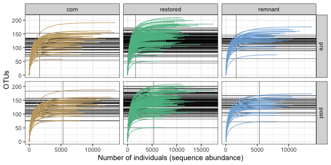
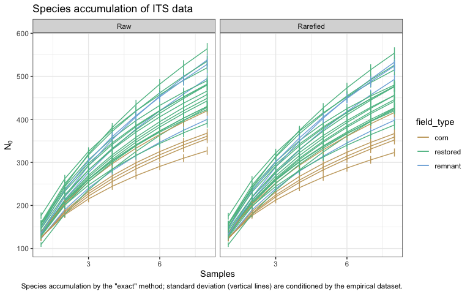
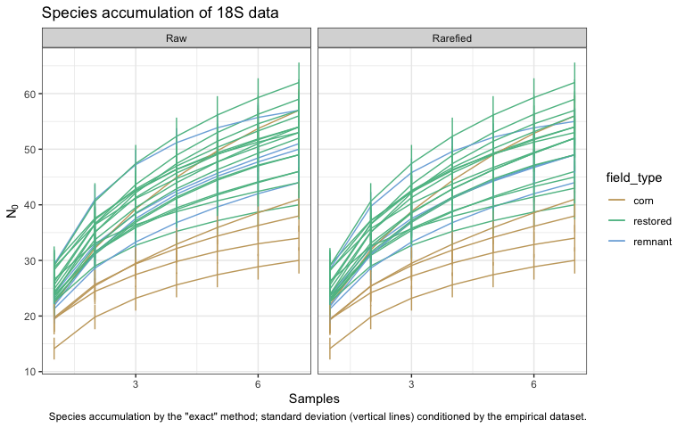

Microbial data: diagnostics of sequence data
================
Beau Larkin

Last updated: 06 December, 2023

- [Description](#description)
- [Packages and libraries](#packages-and-libraries)
- [Data](#data)
  - [Previous diagnostics objects](#previous-diagnostics-objects)
  - [Site metadata and design](#site-metadata-and-design)
  - [Sites-species tables](#sites-species-tables)
- [Functions](#functions)
  - [Species accumulation and
    rarefaction](#species-accumulation-and-rarefaction)
- [Analysis and Results](#analysis-and-results)
  - [Species accumulation and
    rarefaction](#species-accumulation-and-rarefaction-1)
    - [ITS](#its)
    - [18S](#18s)
  - [Samples-based species
    accumulation](#samples-based-species-accumulation)
    - [ITS](#its-1)
    - [18S](#18s-1)

# Description

Microbial data analyzed here include site-species tables derived from
high-throughput sequencing of ITS and 18S genes and clustering into 97%
similar OTUs. Before further analyses can be attempted, we need to know
if the data obtained are sufficient to characterize communities in
samples and fields. Decisions must be made about how to summarize the
species data for further analyses. The following actions are performed:

- Individual-based rarefaction at the sample level to determine the
  adequacy of sequence depth and justify rarefaction of sequence
  abundances.
- Species accumulation at the field level to determine the adequacy of
  sampling effort and justify characterization of alpha/beta diversity.

This script is run after `process_data.R` and
`microbial_diagnostics_pre.R` have been run, with the latter providing
recommendations and justification for further reduction of samples from
each field. As of 2023-10-11, the recommended number of samples to keep
from all fields is **8 from the ITS dataset** and **7 from the 18S
dataset.**

# Packages and libraries

``` r
packages_needed = c(
    "tidyverse",
    "vegan",
    "knitr",
    "colorspace"
)
packages_installed = packages_needed %in% rownames(installed.packages())
```

``` r
if (any(!packages_installed)) {
    install.packages(packages_needed[!packages_installed])
}
```

``` r
for (i in 1:length(packages_needed)) {
    library(packages_needed[i], character.only = T)
}
```

# Data

## Previous diagnostics objects

Named items from `microbial_diagnostics_pre.R` are needed in this file.
Execution will be slow.

``` r
source("microbial_diagnostics_pre.R")
```

    ## Warning in rarecurve(amf_rc_data_pre, step = 1, tidy = TRUE): most observed
    ## count data have counts 1, but smallest count is 2

## Site metadata and design

``` r
sites <- read_csv(paste0(getwd(), "/clean_data/sites.csv"), show_col_types = FALSE) %>% 
    mutate(field_type = factor(field_type, ordered = TRUE, levels = c("corn", "restored", "remnant"))) %>% 
    select(-lat, -long, -yr_restore, -yr_rank)
```

Object *spe_samps* holds sequence abundances for each sample. Used here
for species accumulation.

``` r
spe_samps <- list(
    its_samps_raw = read_csv(paste0(getwd(), "/clean_data/spe_ITS_raw_samples.csv"),
                             show_col_types = FALSE),
    its_samps_rfy = read_csv(paste0(getwd(), "/clean_data/spe_ITS_rfy_samples.csv"),
                             show_col_types = FALSE),
    amf_samps_raw = read_csv(paste0(getwd(), "/clean_data/spe_18S_raw_samples.csv"),
                             show_col_types = FALSE),
    amf_samps_rfy = read_csv(paste0(getwd(), "/clean_data/spe_18S_rfy_samples.csv"),
                             show_col_types = FALSE)
)
```

## Sites-species tables

List *spe* holds summed sequence abundances per field. Number of samples
per field which were retained is defined in `process_data.R`. CSV files
were produced in `process_data.R`

``` r
spe <- list(
    its_raw = read_csv(paste0(getwd(), "/clean_data/spe_ITS_raw.csv"), 
                       show_col_types = FALSE),
    its_rfy = read_csv(paste0(getwd(), "/clean_data/spe_ITS_rfy.csv"), 
                       show_col_types = FALSE),
    amf_raw = read_csv(paste0(getwd(), "/clean_data/spe_18S_raw.csv"), 
                       show_col_types = FALSE),
    amf_rfy = read_csv(paste0(getwd(), "/clean_data/spe_18S_rfy.csv"), 
                       show_col_types = FALSE)
)
```

# Functions

The following functions are used to streamline code and reduce errors:

## Species accumulation and rarefaction

Function `spe_accum()` uses vegan’s `specaccum()` to produce
accumulation curves with the raw, samples-based data.

``` r
spe_accum <- function(data) {
    df <- data.frame(
        samples = specaccum(data[, -1], conditioned = FALSE)$site,
        richness = specaccum(data[, -1], conditioned = FALSE)$richness,
        sd = specaccum(data[, -1], conditioned = FALSE)$sd
    )
    return(df)
}
```

# Analysis and Results

## Species accumulation and rarefaction

Species accumulation is performed using the “exact” method (Kindt, R.,
unpublished) to examine the adequacy of field sampling. Raw ITS and 18S
data with all samples is used and compared with the “topN” data sets.
After diagnostic analysis in `microbial_diagnostics_pre.R`, it was
determined to keep 8 samples per field for ITS and 7 for 18S.

### ITS

#### Individual-based rarefaction on samples

Rarefaction is performed to assess the relationship between sequence
abundance and species richness, and can help justify the decision to
rarefy to the minimum sequence depth obtained. Caution: function
`rarecurve()` takes some time to execute.

``` r
its_rc_data <- 
    spe_samps$its_samps_raw %>% 
    mutate(field_sample = paste(field_key, sample, sep = "_")) %>% 
    column_to_rownames(var = "field_sample") %>% 
    select(-field_key, -sample)
```

``` r
its_rc_tidy <- rarecurve(its_rc_data, step = 1, tidy = TRUE) 
its_rc <- 
    its_rc_tidy %>% 
    separate_wider_delim(Site, delim = "_", names = c("field_key", "sample_key"), cols_remove = FALSE) %>% 
    rename(seq_abund = Sample, otus = Species, field_sample = Site) %>% 
    left_join(sites %>% mutate(field_key = as.character(field_key)), by = join_by(field_key))
# Additional data and variables for plotting
its_depth <- 
    its_rc %>% 
    group_by(field_sample) %>% 
    slice_max(otus, n = 1) %>% 
    pull(seq_abund) %>% 
    min()
its_at_depth <- its_rc %>% filter(seq_abund == its_depth)
```

``` r
ggplot(its_rc, aes(x = seq_abund, y = otus, group = field_sample)) +
    facet_wrap(vars(field_type), ncol = 1) +
    geom_vline(xintercept = its_depth, linewidth = 0.2) +
    geom_hline(data = its_at_depth, aes(yintercept = otus), linewidth = 0.2) +
    geom_line(aes(color = field_type), linewidth = 0.4) +
    scale_color_discrete_qualitative(name = "Field Type", palette = "Harmonic") +
    labs(x = "Number of individuals (sequence abundance)",
         y = "OTUs",
         title = "Rarefaction of ITS data",
         caption = "Curves based on the nine most abundant samples per field.\nVertical line shows the minimum sequence abundance for any field.\nHorizontal lines show expected richness when rarefied to that abundance.") +
    theme_bw()
```


Minimum sequencing depth reached by `rarecurve()` is 5320. Rarefying the
data to this depth caused the removal of a few samples. In each field,
the top 8 samples (based on sequence abundance) were retained. **At this
new minimum sequencing depth, all samples retained are
well-characterized,** with the rarefication threshold (shown above by
the vertical line) lying on the flat part of all sample curves.

Rarefying the raw data to 8 samples per field in `process_data.R` used
`rrarefy()` from package Vegan, and resulted in a slightly different
sequencing depth per sample of **5321.**

This result can be corroborated by comparing the total sequences
recovered per field vs. the richness recovered per field. A relationship
should not be evident, or fields with more sequences could have bias to
higher richness based on sequencing depth (or it could be real…there’s
no way to know). This can be examined visually. The raw ITS data are
used (these are sums of the top eight samples per field as of
2023-03-13).

``` r
its_seqot <- 
    data.frame(
        field_key = spe$its_raw[, 1],
        seqs = apply(spe$its_raw[, -1], 1, sum),
        otus = apply(spe$its_raw[, -1] > 0, 1, sum)
    ) %>% left_join(sites, by = join_by(field_key))
```

``` r
ggplot(its_seqot, aes(x = seqs, y = otus)) +
    geom_point(aes(fill = field_type), shape = 21, size = 2) +
    scale_fill_discrete_qualitative(palette = "Harmonic") +
    labs(x = "Sequence abundance per field",
         y = "OTUs recovered per field",
         caption = "Raw ITS data used, sum of top 8 samples per field") +
    theme_classic()
```


``` r
summary(lm(otus ~ seqs, data = its_seqot))
```

    ## 
    ## Call:
    ## lm(formula = otus ~ seqs, data = its_seqot)
    ## 
    ## Residuals:
    ##      Min       1Q   Median       3Q      Max 
    ## -130.258  -32.622    4.095   45.126   90.832 
    ## 
    ## Coefficients:
    ##              Estimate Std. Error t value Pr(>|t|)  
    ## (Intercept) 2.469e+02  1.168e+02   2.115   0.0455 *
    ## seqs        2.843e-03  1.630e-03   1.744   0.0945 .
    ## ---
    ## Signif. codes:  0 '***' 0.001 '**' 0.01 '*' 0.05 '.' 0.1 ' ' 1
    ## 
    ## Residual standard error: 59.91 on 23 degrees of freedom
    ## Multiple R-squared:  0.1168, Adjusted R-squared:  0.07841 
    ## F-statistic: 3.042 on 1 and 23 DF,  p-value: 0.0945

The relationship is poor and not significant. Richness is not related to
recovered sequence depth, suggesting that our methods are on track.

**Limiting samples per field to 8 seems to make sense with the ITS
data.**

#### Compare rarefaction pre and post processing

These panels compare the OTUs obtained after rarefying data with 9
samples per field (pre processing) or 8 samples per field (post
processing).

``` r
its_rcurve_data <- 
    bind_rows(
        pre = its_rc_pre,
        post = its_rc,
        .id = "process_step") %>% 
    mutate(process_step = factor(process_step, ordered = TRUE, levels = c("pre", "post")))
its_rcurve_depth <- 
    tibble(
        process_step = c(rep("pre", 3), rep("post", 3)),
        field_type = factor(rep(c("corn", "restored", "remnant"), 2), ordered = TRUE, levels = c("corn", "restored", "remnant")),
        depth = c(rep(its_depth_pre, 3), rep(its_depth, 3))
    ) %>% 
    mutate(process_step = factor(process_step, ordered = TRUE, levels = c("pre", "post")))
its_otus_depth <- 
    bind_rows(
        pre = its_at_depth_pre,
        post = its_at_depth,
        .id = "process_step") %>% 
    mutate(process_step = factor(process_step, ordered = TRUE, levels = c("pre", "post")))
```

``` r
ggplot(its_rcurve_data, aes(x = seq_abund, y = otus, group = field_sample)) +
    facet_grid(rows = vars(process_step), cols = vars(field_type), as.table = FALSE, scales = "free") +
    geom_vline(data = its_rcurve_depth, aes(xintercept = depth), linewidth = 0.2) +
    geom_hline(data = its_otus_depth, aes(yintercept = otus), linewidth = 0.2) +
    geom_line(aes(color = field_type), linewidth = 0.4) +
    scale_color_discrete_qualitative(name = "Field Type", palette = "Harmonic") +
    labs(x = "Number of individuals (sequence abundance)",
         y = "OTUs") +
    theme_bw() +
    theme(legend.position = "none")
```



### 18S

Individual-based rarefaction

``` r
amf_rc_data <- 
    spe_samps$amf_samps_raw %>% 
    mutate(field_sample = paste(field_key, sample, sep = "_")) %>% 
    column_to_rownames(var = "field_sample") %>% 
    select(-field_key, -sample)
```

``` r
amf_rc_tidy <- rarecurve(amf_rc_data, step = 1, tidy = TRUE) 
amf_rc <- 
    amf_rc_tidy %>% 
    separate_wider_delim(Site, delim = "_", names = c("field_key", "sample_key"), cols_remove = FALSE) %>% 
    rename(seq_abund = Sample, otus = Species, field_sample = Site) %>% 
    left_join(sites %>% mutate(field_key = as.character(field_key)), by = join_by(field_key))
# Additional data and variables for plotting
amf_depth <- 
    amf_rc %>% 
    group_by(field_sample) %>% 
    slice_max(otus, n = 1) %>% 
    pull(seq_abund) %>% 
    min()
amf_at_depth <- amf_rc %>% filter(seq_abund == amf_depth)
```

``` r
ggplot(amf_rc, aes(x = seq_abund, y = otus, group = field_sample)) +
    facet_wrap(vars(field_type), ncol = 1) +
    geom_vline(xintercept = amf_depth, linewidth = 0.2) +
    geom_hline(data = amf_at_depth, aes(yintercept = otus), linewidth = 0.2) +
    geom_line(aes(color = field_type), linewidth = 0.4) +
    scale_color_discrete_qualitative(palette = "Harmonic") +
    labs(x = "Number of individuals (sequence abundance)",
         y = "OTUs",
         title = "Rarefaction of amf data",
         caption = "Curves based on the nine most abundant samples per field.\nVertical line shows the minimum sequence abundance for any field.\nHorizontal lines show expected richness when rarefied to that abundance.") +
    theme_bw()
```


Minimum sequencing depth reached is 1317. Rarefying the data to this
depth caused the removal of a few samples. In each field, the top 7
samples (based on sequence abundance) were retained. **At this new
minimum sequencing depth, all samples retained are well-characterized,**
with the rarefication threshold (shown above by the vertical line) lying
on the flat part of all sample curves.

Rarefying the raw data to 8 samples per field in `process_data.R` used
`rrarefy()` from package Vegan, and resulted in a slightly different
sequencing depth per sample of **1364.**

This result can be corroborated by comparing the total sequences
recovered per field vs. the richness recovered per field. A relationship
should not be evident, or fields with more sequences could have bias to
higher richness based on sequencing depth (or it could be real…there’s
no way to know). This can be examined visually. The raw amf data are
used (these are sums of the top seven samples per field as of
2023-03-13).

``` r
amf_seqot <- 
    data.frame(
        field_key = spe$amf_raw[, 1],
        seqs = apply(spe$amf_raw[, -1], 1, sum),
        otus = apply(spe$amf_raw[, -1] > 0, 1, sum)
    ) %>% left_join(sites, by = join_by(field_key))
```

``` r
ggplot(amf_seqot, aes(x = seqs, y = otus)) +
    geom_point(aes(fill = field_type), shape = 21, size = 2) +
    scale_fill_discrete_qualitative(palette = "Harmonic") +
    labs(x = "Sequence abundance per field",
         y = "OTUs recovered per field",
         caption = "Raw amf data used, sum of top 7 samples per field") +
    theme_classic()
```


``` r
summary(lm(otus ~ seqs, data = amf_seqot))
```

    ## 
    ## Call:
    ## lm(formula = otus ~ seqs, data = amf_seqot)
    ## 
    ## Residuals:
    ##     Min      1Q  Median      3Q     Max 
    ## -18.812  -4.132   1.428   5.402  13.148 
    ## 
    ## Coefficients:
    ##              Estimate Std. Error t value Pr(>|t|)    
    ## (Intercept) 4.461e+01  9.268e+00   4.814 7.41e-05 ***
    ## seqs        1.196e-04  3.042e-04   0.393    0.698    
    ## ---
    ## Signif. codes:  0 '***' 0.001 '**' 0.01 '*' 0.05 '.' 0.1 ' ' 1
    ## 
    ## Residual standard error: 8.182 on 23 degrees of freedom
    ## Multiple R-squared:  0.006676,   Adjusted R-squared:  -0.03651 
    ## F-statistic: 0.1546 on 1 and 23 DF,  p-value: 0.6978

The relationship is poor and not significant. Richness is not related to
recovered sequence depth, suggesting that our methods are on track.

**Limiting samples per field to 7 seems to make sense with the ITS
data.**

## Samples-based species accumulation

### ITS

The project results will compare communities among fields, not
individual samples. We need to know how severe community undersampling
is among fields.

The custom function `spe_accum()` is applied here.

``` r
its_accum <- bind_rows(
    list(
        Raw = bind_rows(
            split(spe_samps$its_samps_raw, ~ field_key) %>% 
                map(spe_accum),
            .id = "field_key"
        ),
        Rarefied = bind_rows(
            split(spe_samps$its_samps_rfy, ~ field_key) %>% 
                map(spe_accum),
            .id = "field_key"
        )
    ),
    .id = "dataset"
) %>% 
    mutate(dataset = factor(dataset, ordered = TRUE, levels = c("Raw", "Rarefied")),
           field_key = as.numeric(field_key)) %>% 
    left_join(sites, by = join_by(field_key))
```

``` r
ggplot(its_accum, aes(x = samples, y = richness, group = field_name)) +
    facet_wrap(vars(dataset), scales = "free_x") +
    geom_line(aes(color = field_type)) +
    geom_segment(aes(x = samples, y = richness-sd, xend = samples, yend = richness+sd, color = field_type)) +
    scale_color_discrete_qualitative(palette = "Harmonic") +
    labs(x = "Samples", y = expression(N[0]), 
         title = "Species accumulation of ITS data",
         caption = "Species accumulation by the \"exact\" method; standard deviation (vertical lines) are conditioned by the empirical dataset.") +
    scale_x_continuous(breaks = c(0,3,6,9)) +
    theme_bw()
```



All fields continue to add species at the maximum available number of
samples. The only good news might be that they all add species at about
the same rate. But this plot is evidence of undersampling… It’s evident
in `microbial_diagnostics_pre.R` that they are undersampled in any case.
Even using all available samples, these curves are still very steep.

### 18S

``` r
amf_accum <- bind_rows(
    list(
        Raw = bind_rows(
            split(spe_samps$amf_samps_raw, ~ field_key) %>% 
                map(spe_accum),
            .id = "field_key"
        ),
        Rarefied = bind_rows(
            split(spe_samps$amf_samps_rfy, ~ field_key) %>% 
                map(spe_accum),
            .id = "field_key"
        )
    ),
    .id = "dataset"
) %>% 
    mutate(dataset = factor(dataset, ordered = TRUE, levels = c("Raw", "Rarefied")),
           field_key = as.numeric(field_key)) %>% 
    left_join(sites, by = join_by(field_key))
```

``` r
ggplot(amf_accum, aes(x = samples, y = richness, group = field_name)) +
    facet_wrap(vars(dataset), scales = "free_x") +
    geom_line(aes(color = field_type)) +
    geom_segment(aes(x = samples, y = richness-sd, xend = samples, yend = richness+sd, color = field_type)) +
    scale_color_discrete_qualitative(palette = "Harmonic") +
    labs(x = "Samples", y = expression(N[0]), 
         title = "Species accumulation of 18S data",
         caption = "Species accumulation by the \"exact\" method; standard deviation (vertical lines) conditioned by the empirical dataset.") +
    scale_x_continuous(breaks = c(0,3,6,9)) +
    theme_bw()
```



All fields continue to add species at the maximum available number of
samples, but the curves aren’t very steep. It’s also good news that they
all add species at about the same rate. With samples limited to 7 per
field, the community is still characterized fairly well, and isn’t much
different from retaining all samples.

Finally, let’s show a plot of species accumulation contrasting ITS and
18S data, using only rarefied sequence abundances.

``` r
bind_rows(
    ITS = its_accum,
    AMF = amf_accum,
    .id = "gene"
) %>% 
    filter(dataset == "Rarefied") %>% 
    ggplot(aes(x = samples, y = richness, group = field_name)) +
    facet_wrap(vars(gene), scales = "free_y") +
    geom_line(aes(color = field_type)) +
    geom_segment(aes(x = samples, y = richness-sd, xend = samples, yend = richness+sd, color = field_type)) +
    scale_color_discrete_qualitative(name = "Field Type", palette = "Harmonic") +
    labs(x = "Samples", y = expression(N[0])) +
    scale_x_continuous(breaks = c(0,3,6,9)) +
    theme_bw()
```


