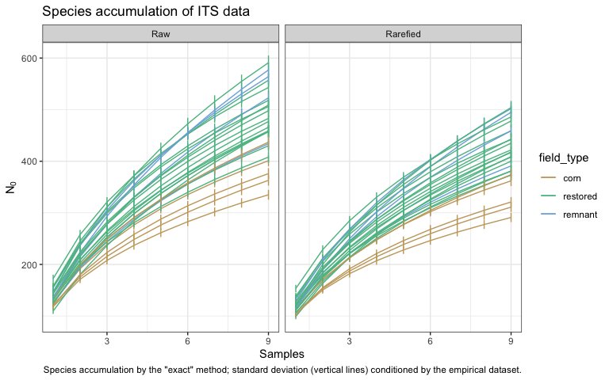
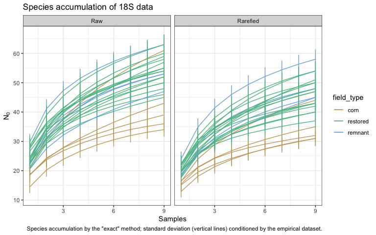

Microbial data: diagnostics of sequence data
================
Beau Larkin

Last updated: 11 October, 2023

- [Description](#description)
- [Clean the environment](#clean-the-environment)
- [Packages and libraries](#packages-and-libraries)
- [Data](#data)
  - [Site metadata and design](#site-metadata-and-design)
  - [Sites-species tables](#sites-species-tables)
- [Functions](#functions)
  - [Species accumulation and
    rarefaction](#species-accumulation-and-rarefaction)
- [Analysis and Results](#analysis-and-results)
  - [Species accumulation and
    rarefaction](#species-accumulation-and-rarefaction-1)
    - [ITS](#its)
    - [18S](#18s)
  - [Samples-based species
    accumulation](#samples-based-species-accumulation)
    - [ITS](#its-1)
    - [18S](#18s-1)

# Description

Microbial data analyzed here include site-species tables derived from
high-throughput sequencing of ITS and 18S genes and clustering into 97%
similar OTUs. Before further analyses can be attempted, we need to know
if the data obtained are sufficient to characterize communities in
samples and fields. Decisions must be made about how to summarize the
species data for further analyses. The following actions are performed:

- Individual-based rarefaction at the sample level to determine the
  adequacy of sequence depth and justify rarefaction of sequence
  abundances.
- Species accumulation at the field level to determine the adequacy of
  sampling effort and justify characterization of alpha/beta diversity.

This script is run after the first use of `process_data.R`. It uses the
top 9 samples by sequence abundance from each field. Some of these nine
still contain very few sequences, and this script will help determine
the consequence of that.

# Clean the environment

Because many names are shared between the `microbial_diagnostics_x.R`
scripts, it’s important to prevent confusion and clear the named
objects.

``` r
rm(list=ls())
```

# Packages and libraries

``` r
packages_needed = c(
    "tidyverse",
    "vegan",
    "knitr",
    "colorspace"
)
packages_installed = packages_needed %in% rownames(installed.packages())
```

``` r
if (any(!packages_installed)) {
    install.packages(packages_needed[!packages_installed])
}
```

``` r
for (i in 1:length(packages_needed)) {
    library(packages_needed[i], character.only = T)
}
```

# Data

## Site metadata and design

``` r
sites <- read_csv(paste0(getwd(), "/clean_data/sites.csv"), show_col_types = FALSE) %>% 
    mutate(field_type = factor(field_type, ordered = TRUE, levels = c("corn", "restored", "remnant"))) %>% 
    select(-lat, -long, -yr_restore, -yr_rank)
```

Object *spe_samps* holds sequence abundances for each sample. Used here
for species accumulation.

``` r
spe_samps <- list(
    its_samps_raw = read_csv(paste0(getwd(), "/clean_data/spe_ITS_raw_samples.csv"),
                             show_col_types = FALSE),
    its_samps_rfy = read_csv(paste0(getwd(), "/clean_data/spe_ITS_rfy_samples.csv"),
                             show_col_types = FALSE),
    amf_samps_raw = read_csv(paste0(getwd(), "/clean_data/spe_18S_raw_samples.csv"),
                             show_col_types = FALSE),
    amf_samps_rfy = read_csv(paste0(getwd(), "/clean_data/spe_18S_rfy_samples.csv"),
                             show_col_types = FALSE)
)
```

## Sites-species tables

List *spe* holds summed sequence abundances per field. Number of samples
per field which were retained is defined in `process_data.R`. CSV files
were produced in `process_data.R`

``` r
spe <- list(
    its_raw = read_csv(paste0(getwd(), "/clean_data/spe_ITS_raw.csv"), 
                       show_col_types = FALSE),
    its_rfy = read_csv(paste0(getwd(), "/clean_data/spe_ITS_rfy.csv"), 
                       show_col_types = FALSE),
    amf_raw = read_csv(paste0(getwd(), "/clean_data/spe_18S_raw.csv"), 
                       show_col_types = FALSE),
    amf_rfy = read_csv(paste0(getwd(), "/clean_data/spe_18S_rfy.csv"), 
                       show_col_types = FALSE)
)
```

# Functions

The following functions are used to streamline code and reduce errors:

## Species accumulation and rarefaction

Function `spe_accum()` uses vegan’s `specaccum()` to produce
accumulation curves with the raw, samples-based data.

``` r
spe_accum <- function(data) {
    df <- data.frame(
        samples = specaccum(data[, -1], conditioned = FALSE)$site,
        richness = specaccum(data[, -1], conditioned = FALSE)$richness,
        sd = specaccum(data[, -1], conditioned = FALSE)$sd
    )
    return(df)
}
```

# Analysis and Results

## Species accumulation and rarefaction

Species accumulation is performed using the “exact” method (Kindt, R.,
unpublished) to examine the adequacy of field sampling. Raw ITS and 18S
data with all samples is used and compared with the “topN” data sets.
Some samples didn’t amplify, so samples were dropped from some fields to
equalize sampling effort. As of 2023-03-13, six samples were retained
from each field, but nine would be possible to keep.

### ITS

Individual-based rarefaction on samples

Rarefaction is performed to assess the relationship between sequence
abundance and species richness, and can help justify the decision to
rarefy to the minimum sequence depth obtained. Caution: function
`rarecurve()` takes some time to execute.

``` r
its_rc_data <- 
    spe_samps$its_samps_raw %>% 
    mutate(field_sample = paste(field_key, sample, sep = "_")) %>% 
    column_to_rownames(var = "field_sample") %>% 
    select(-field_key, -sample)
```

``` r
its_rc_tidy <- rarecurve(its_rc_data, step = 1, tidy = TRUE) 
its_rc <- 
    its_rc_tidy %>% 
    separate_wider_delim(Site, delim = "_", names = c("field_key", "sample_key"), cols_remove = FALSE) %>% 
    rename(seq_abund = Sample, otus = Species, field_sample = Site) %>% 
    left_join(sites %>% mutate(field_key = as.character(field_key)), by = join_by(field_key))
# Additional data and variables for plotting
its_depth <- 
    its_rc %>% 
    group_by(field_sample) %>% 
    slice_max(otus, n = 1) %>% 
    pull(seq_abund) %>% 
    min()
its_at_depth <- its_rc %>% filter(seq_abund == its_depth)
```

``` r
ggplot(its_rc, aes(x = seq_abund, y = otus, group = field_sample)) +
    facet_wrap(vars(field_type), ncol = 1) +
    geom_vline(xintercept = its_depth, linewidth = 0.2) +
    geom_hline(data = its_at_depth, aes(yintercept = otus), linewidth = 0.2) +
    geom_line(aes(color = field_type), linewidth = 0.4) +
    scale_color_discrete_qualitative(palette = "Harmonic") +
    labs(x = "Number of individuals (sequence abundance)",
         y = "OTUs",
         title = "Rarefaction of ITS data",
         caption = "Curves based on the nine most abundant samples per field.\nVertical line shows the minimum sequence abundance for any field.\nHorizontal lines show expected richness when rarefied to that abundance.") +
    theme_bw()
```


Minimum sequencing depth reached is 1628. Rarefying the data to this
depth would remove a great number of OTUs and leave nearly all samples
poorly characterized in richness and composition. It looks like
somewhere around 5000 sequences would be more appropriate. How many
samples would be lost at 5000 sequences?

``` r
its_rc %>% 
    group_by(field_sample) %>% 
    slice_max(otus, n = 1) %>% 
    slice_max(seq_abund, n = 1) %>%
    ungroup() %>%
    arrange(seq_abund) %>% 
    slice_head(n = 20) %>%
    kable(format = "pandoc", caption = "ITS samples sorted by sequence abundance, lowest 20 shown")
```

| field_key | sample_key | field_sample | seq_abund | otus | field_name | region | field_type | yr_since |
|:----------|:-----------|:-------------|----------:|-----:|:-----------|:-------|:-----------|---------:|
| 9         | 8          | 9_8          |      1629 |   51 | FLRP1      | FL     | restored   |       40 |
| 14        | 4          | 14_4         |      3666 |   71 | FLRSP3     | FL     | restored   |       10 |
| 12        | 7          | 12_7         |      4198 |  108 | FLRSP1     | FL     | restored   |       10 |
| 19        | 10         | 19_10        |      4580 |  120 | LPRP2      | LP     | restored   |        4 |
| 23        | 2          | 23_2         |      4899 |   90 | MHRP2      | BM     | restored   |        2 |
| 18        | 10         | 18_10        |      4948 |  138 | LPRP1      | LP     | restored   |        4 |
| 6         | 3          | 6_3          |      5221 |   58 | FLC1       | FL     | corn       |        0 |
| 14        | 8          | 14_8         |      5321 |  117 | FLRSP3     | FL     | restored   |       10 |
| 15        | 8          | 15_8         |      5345 |   98 | KORP1      | BM     | restored   |       28 |
| 6         | 4          | 6_4          |      5405 |  101 | FLC1       | FL     | corn       |        0 |
| 15        | 2          | 15_2         |      5473 |  104 | KORP1      | BM     | restored   |       28 |
| 16        | 2          | 16_2         |      5541 |   97 | LPC1       | LP     | corn       |        0 |
| 22        | 4          | 22_4         |      5599 |  116 | MHRP1      | BM     | restored   |        7 |
| 8         | 4          | 8_4          |      5668 |  144 | FLREM1     | FL     | remnant    |       NA |
| 12        | 4          | 12_4         |      5789 |  127 | FLRSP1     | FL     | restored   |       10 |
| 14        | 2          | 14_2         |      5801 |  117 | FLRSP3     | FL     | restored   |       10 |
| 22        | 7          | 22_7         |      5853 |  134 | MHRP1      | BM     | restored   |        7 |
| 20        | 10         | 20_10        |      5858 |  131 | MBREM1     | BM     | remnant    |       NA |
| 1         | 3          | 1_3          |      5940 |   71 | BBRP1      | BM     | restored   |       16 |
| 5         | 4          | 5_4          |      5951 |  113 | FGRP1      | FG     | restored   |       15 |

ITS samples sorted by sequence abundance, lowest 20 shown

Six samples would be removed if we cut off the sequence depth at 5000.

Sequence abundance jumps from 4948 to 5221, which is a big jump compared
with the rest of the table. This makes 5000 look good as a cutoff. No
two samples below 5000 come from the same field, so the lost data
shouldn’t affect the overall analysis too much.

Looking back at `process_data.R`, we can compare the fields where we’d
lose a sample to the maximum number of samples available. - FLRP1
already had only 9 samples - FLRSP3 already had only 9 samples - FLRSP1
had 10 - LPRP2 had 10 - MHRP2 had 10 - LPRP1 had 10

If we cut these samples with fewer than 5000 sequences, we will have to
take the number of samples selected from each field down to 8. This
would be re-run in `process_data.R`.

This result can be corroborated by comparing the total sequences
recovered per field vs. the richness recovered per field. A relationship
should not be evident, or fields with more sequences could have bias to
higher richness based on sequencing depth (or it could be real…there’s
no way to know). This can be examined visually. The raw ITS data are
used (these are sums of the top nine samples per field as of
2023-03-13).

``` r
its_seqot <- 
    data.frame(
        field_key = spe$its_raw[, 1],
        seqs = apply(spe$its_raw[, -1], 1, sum),
        otus = apply(spe$its_raw[, -1] > 0, 1, sum)
    ) %>% left_join(sites, by = join_by(field_key))
```

``` r
ggplot(its_seqot, aes(x = seqs, y = otus)) +
    geom_point(aes(fill = field_type), shape = 21, size = 2) +
    scale_fill_discrete_qualitative(palette = "Harmonic") +
    labs(x = "Sequence abundance per field",
         y = "OTUs recovered per field",
         caption = "Raw ITS data used, sum of top 9 samples per field") +
    theme_classic()
```


``` r
summary(lm(otus ~ seqs, data = its_seqot))
```

    ## 
    ## Call:
    ## lm(formula = otus ~ seqs, data = its_seqot)
    ## 
    ## Residuals:
    ##     Min      1Q  Median      3Q     Max 
    ## -143.47  -34.73   11.87   57.84  102.09 
    ## 
    ## Coefficients:
    ##              Estimate Std. Error t value Pr(>|t|)  
    ## (Intercept) 2.510e+02  1.363e+02   1.841   0.0785 .
    ## seqs        2.871e-03  1.762e-03   1.629   0.1169  
    ## ---
    ## Signif. codes:  0 '***' 0.001 '**' 0.01 '*' 0.05 '.' 0.1 ' ' 1
    ## 
    ## Residual standard error: 64.95 on 23 degrees of freedom
    ## Multiple R-squared:  0.1035, Adjusted R-squared:  0.06448 
    ## F-statistic: 2.654 on 1 and 23 DF,  p-value: 0.1169

The relationship is poor and not significant. Richness is not related to
recovered sequence depth, suggesting that our methods are on track.

We have a choice to make. Limit samples per field to 8 or try to justify
keeping them. My call is to be conservative and limit samples to 8.

### 18S

Individual-based rarefaction

``` r
amf_rc_data <- 
    spe_samps$amf_samps_raw %>% 
    mutate(field_sample = paste(field_key, sample, sep = "_")) %>% 
    column_to_rownames(var = "field_sample") %>% 
    select(-field_key, -sample)
```

``` r
amf_rc_tidy <- rarecurve(amf_rc_data, step = 1, tidy = TRUE) 
amf_rc <- 
    amf_rc_tidy %>% 
    separate_wider_delim(Site, delim = "_", names = c("field_key", "sample_key"), cols_remove = FALSE) %>% 
    rename(seq_abund = Sample, otus = Species, field_sample = Site) %>% 
    left_join(sites %>% mutate(field_key = as.character(field_key)), by = join_by(field_key))
# Additional data and variables for plotting
amf_depth <- 
    amf_rc %>% 
    group_by(field_sample) %>% 
    slice_max(otus, n = 1) %>% 
    pull(seq_abund) %>% 
    min()
amf_at_depth <- amf_rc %>% filter(seq_abund == amf_depth)
```

``` r
ggplot(amf_rc, aes(x = seq_abund, y = otus, group = field_sample)) +
    facet_wrap(vars(field_type), ncol = 1) +
    geom_vline(xintercept = amf_depth, linewidth = 0.2) +
    geom_hline(data = amf_at_depth, aes(yintercept = otus), linewidth = 0.2) +
    geom_line(aes(color = field_type), linewidth = 0.4) +
    scale_color_discrete_qualitative(palette = "Harmonic") +
    labs(x = "Number of individuals (sequence abundance)",
         y = "OTUs",
         title = "Rarefaction of amf data",
         caption = "Curves based on the nine most abundant samples per field.\nVertical line shows the minimum sequence abundance for any field.\nHorizontal lines show expected richness when rarefied to that abundance.") +
    theme_bw()
```


Minimum sequencing depth reached is 160. Rarefying the data to this
depth would remove a great number of OTUs and leave nearly all samples
poorly characterized in richness and composition. It looks like
somewhere around 1250 sequences would be more appropriate at bare
minimum. How many samples would be lost at this depth?

``` r
amf_rc %>% 
    group_by(field_sample) %>% 
    slice_max(otus, n = 1) %>% 
    slice_max(seq_abund, n = 1) %>%
    ungroup() %>% 
    arrange(seq_abund) %>% 
    slice_head(n = 20) %>% 
    kable(format = "pandoc", caption = "AMF amples sorted by sequence abundance")
```

| field_key | sample_key | field_sample | seq_abund | otus | field_name | region | field_type | yr_since |
|:----------|:-----------|:-------------|----------:|-----:|:-----------|:-------|:-----------|---------:|
| 1         | 6          | 1_6          |       163 |    6 | BBRP1      | BM     | restored   |       16 |
| 21        | 8          | 21_8         |       395 |   11 | MBRP1      | BM     | restored   |       18 |
| 20        | 9          | 20_9         |       498 |   16 | MBREM1     | BM     | remnant    |       NA |
| 1         | 9          | 1_9          |       623 |   19 | BBRP1      | BM     | restored   |       16 |
| 12        | 4          | 12_4         |       713 |   19 | FLRSP1     | FL     | restored   |       10 |
| 21        | 1          | 21_1         |      1175 |   13 | MBRP1      | BM     | restored   |       18 |
| 20        | 6          | 20_6         |      1348 |   18 | MBREM1     | BM     | remnant    |       NA |
| 21        | 9          | 21_9         |      1364 |   14 | MBRP1      | BM     | restored   |       18 |
| 20        | 3          | 20_3         |      1372 |   17 | MBREM1     | BM     | remnant    |       NA |
| 19        | 7          | 19_7         |      1432 |   13 | LPRP2      | LP     | restored   |        4 |
| 9         | 9          | 9_9          |      1439 |   15 | FLRP1      | FL     | restored   |       40 |
| 21        | 3          | 21_3         |      1458 |   22 | MBRP1      | BM     | restored   |       18 |
| 10        | 2          | 10_2         |      1511 |   25 | FLRP4      | FL     | restored   |       36 |
| 14        | 6          | 14_6         |      1546 |   23 | FLRSP3     | FL     | restored   |       10 |
| 7         | 10         | 7_10         |      1579 |   16 | FLC2       | FL     | corn       |        0 |
| 20        | 7          | 20_7         |      1740 |   17 | MBREM1     | BM     | remnant    |       NA |
| 24        | 9          | 24_9         |      1741 |   13 | PHC1       | BM     | corn       |        0 |
| 10        | 6          | 10_6         |      1807 |   17 | FLRP4      | FL     | restored   |       36 |
| 7         | 9          | 7_9          |      1827 |   13 | FLC2       | FL     | corn       |        0 |
| 1         | 1          | 1_1          |      1828 |   27 | BBRP1      | BM     | restored   |       16 |

AMF amples sorted by sequence abundance

Rarefying at 1250 would compromise six samples, including two from
MBRP1. Let’s look back at the minimum number of samples available in
`process_data.R` to see how low we have to go. - BBRP1 already had 9,
we’d have to drop two more - MBRP1 already had 9, we’h have to drop two
more - MBREM1 had 10 - FLRSP1 had 10

This result can be corroborated by comparing the total sequences
recovered per field vs. the richness recovered per field. A relationship
should not be evident, or fields with more sequences could have bias to
higher richness based on sequencing depth (or it could be real…there’s
no way to know). This can be examined visually. The raw amf data are
used (these are sums of the top six samples per field as of 2023-03-13).

``` r
amf_seqot <- 
    data.frame(
        field_key = spe$amf_raw[, 1],
        seqs = apply(spe$amf_raw[, -1], 1, sum),
        otus = apply(spe$amf_raw[, -1] > 0, 1, sum)
    ) %>% left_join(sites, by = join_by(field_key))
```

``` r
ggplot(amf_seqot, aes(x = seqs, y = otus)) +
    geom_point(aes(fill = field_type), shape = 21, size = 2) +
    scale_fill_discrete_qualitative(palette = "Harmonic") +
    labs(x = "Sequence abundance per field",
         y = "OTUs recovered per field",
         caption = "Raw amf data used, sum of top 9 samples per field") +
    theme_classic()
```


``` r
summary(lm(otus ~ seqs, data = amf_seqot))
```

    ## 
    ## Call:
    ## lm(formula = otus ~ seqs, data = amf_seqot)
    ## 
    ## Residuals:
    ##     Min      1Q  Median      3Q     Max 
    ## -17.066  -3.499   1.117   6.036  11.744 
    ## 
    ## Coefficients:
    ##              Estimate Std. Error t value Pr(>|t|)    
    ## (Intercept) 4.731e+01  8.134e+00   5.816 6.31e-06 ***
    ## seqs        9.132e-05  2.299e-04   0.397    0.695    
    ## ---
    ## Signif. codes:  0 '***' 0.001 '**' 0.01 '*' 0.05 '.' 0.1 ' ' 1
    ## 
    ## Residual standard error: 8 on 23 degrees of freedom
    ## Multiple R-squared:  0.006811,   Adjusted R-squared:  -0.03637 
    ## F-statistic: 0.1577 on 1 and 23 DF,  p-value: 0.6949

The relationship is poor and not significant. Richness is not related to
recovered sequence depth, suggesting that our methods are on track.

We have a choice to make. Limit samples per field to 8 or try to justify
keeping them. My call is to be conservative and limit samples to 7.

## Samples-based species accumulation

### ITS

The project results will compare communities among fields, not
individual samples. We need to know how severe community undersampling
is among fields.

The custom function `spe_accum()` is applied here.

``` r
its_accum <- bind_rows(
    list(
        Raw = bind_rows(
            split(spe_samps$its_samps_raw, ~ field_key) %>% 
                map(spe_accum),
            .id = "field_key"
        ),
        Rarefied = bind_rows(
            split(spe_samps$its_samps_rfy, ~ field_key) %>% 
                map(spe_accum),
            .id = "field_key"
        )
    ),
    .id = "dataset"
) %>% 
    mutate(dataset = factor(dataset, ordered = TRUE, levels = c("Raw", "Rarefied")),
           field_key = as.numeric(field_key)) %>% 
    left_join(sites, by = join_by(field_key))
```

``` r
ggplot(its_accum, aes(x = samples, y = richness, group = field_name)) +
    facet_wrap(vars(dataset), scales = "free_x") +
    geom_line(aes(color = field_type)) +
    geom_segment(aes(x = samples, y = richness-sd, xend = samples, yend = richness+sd, color = field_type)) +
    scale_color_discrete_qualitative(palette = "Harmonic") +
    labs(x = "Samples", y = expression(N[0]), 
         title = "Species accumulation of ITS data",
         caption = "Species accumulation by the \"exact\" method; standard deviation (vertical lines) conditioned by the empirical dataset.") +
    scale_x_continuous(breaks = c(0,3,6,9)) +
    theme_bw()
```



All fields continue to add species at the maximum available number of
samples. The only good news might be that they all add species at about
the same rate. But this plot is evidence of undersampling… With only six
samples retained per field, many OTUs are lost, but the curves look a
little flatter (not shown). We will see how 8 looks in a separate
analysis. It’s possible that the rarefied curves will improve as the
lowest abundance samples are dropped…

### 18S

``` r
amf_accum <- bind_rows(
    list(
        Raw = bind_rows(
            split(spe_samps$amf_samps_raw, ~ field_key) %>% 
                map(spe_accum),
            .id = "field_key"
        ),
        Rarefied = bind_rows(
            split(spe_samps$amf_samps_rfy, ~ field_key) %>% 
                map(spe_accum),
            .id = "field_key"
        )
    ),
    .id = "dataset"
) %>% 
    mutate(dataset = factor(dataset, ordered = TRUE, levels = c("Raw", "Rarefied")),
           field_key = as.numeric(field_key)) %>% 
    left_join(sites, by = join_by(field_key))
```

``` r
ggplot(amf_accum, aes(x = samples, y = richness, group = field_name)) +
    facet_wrap(vars(dataset), scales = "free_x") +
    geom_line(aes(color = field_type)) +
    geom_segment(aes(x = samples, y = richness-sd, xend = samples, yend = richness+sd, color = field_type)) +
    scale_color_discrete_qualitative(palette = "Harmonic") +
    labs(x = "Samples", y = expression(N[0]), 
         title = "Species accumulation of 18S data",
         caption = "Species accumulation by the \"exact\" method; standard deviation (vertical lines) conditioned by the empirical dataset.") +
    scale_x_continuous(breaks = c(0,3,6,9)) +
    theme_bw()
```



All fields continue to add species at the maximum available number of
samples, but the curves aren’t very steep. It’s also good news that they
all add species at about the same rate. But this plot is evidence of
undersampling… With only six samples retained per field, many OTUs are
lost, but the curves look a little flatter (not shown). We will see how
7 looks in a separate analysis.
