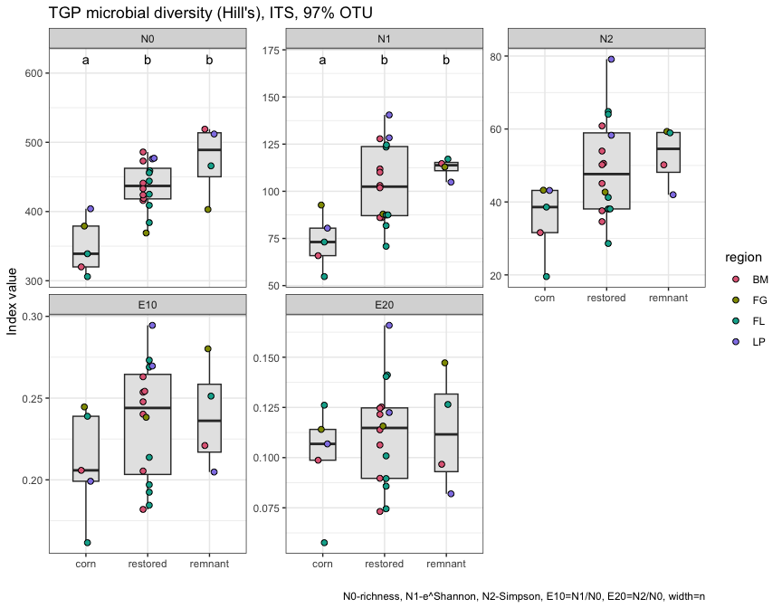
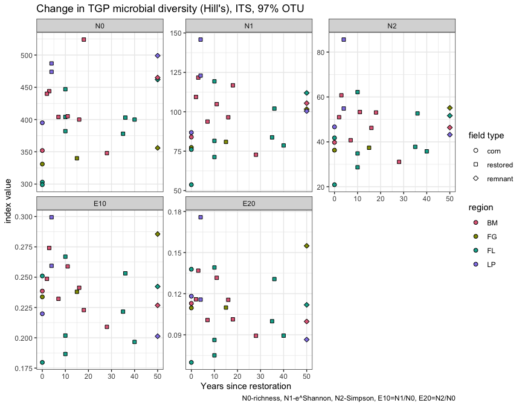
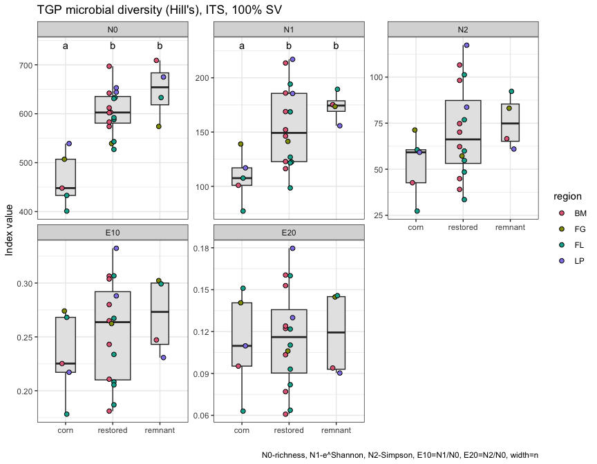
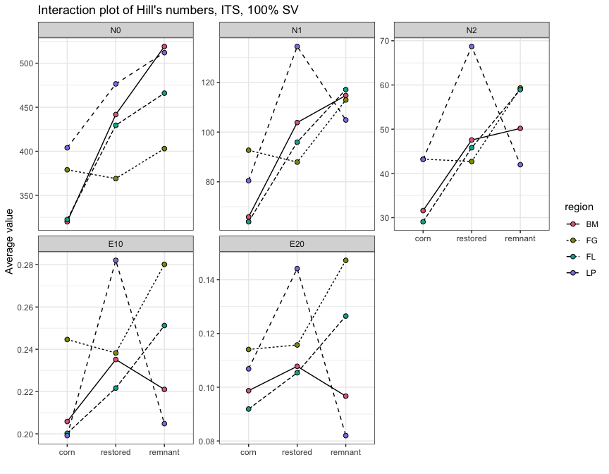
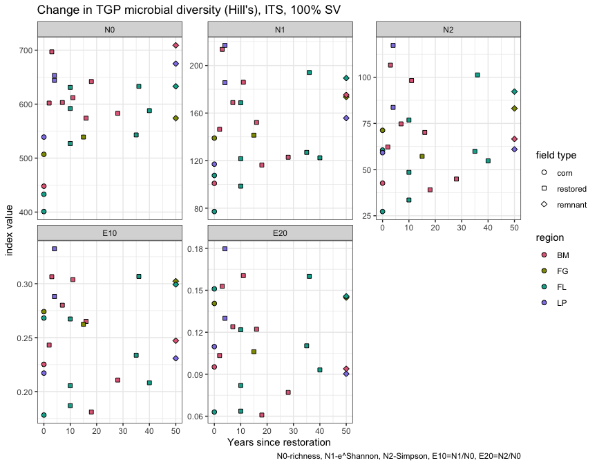
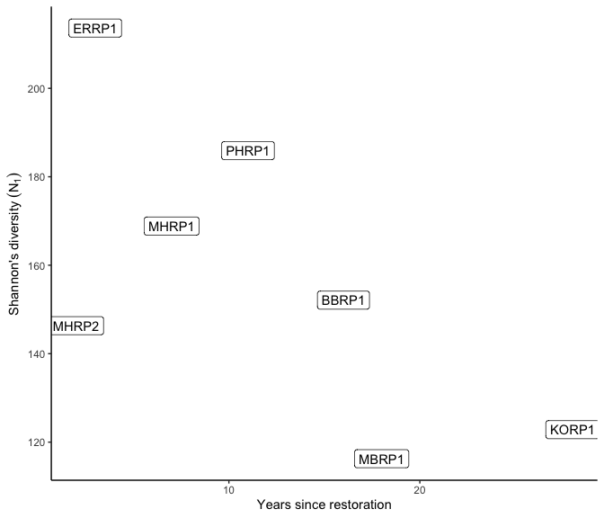
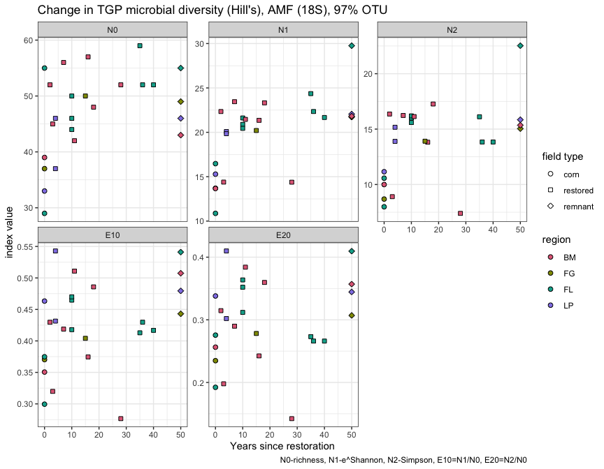
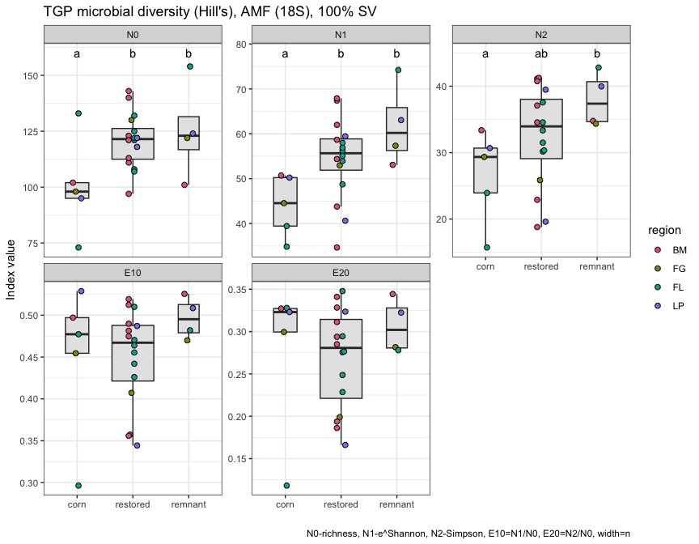
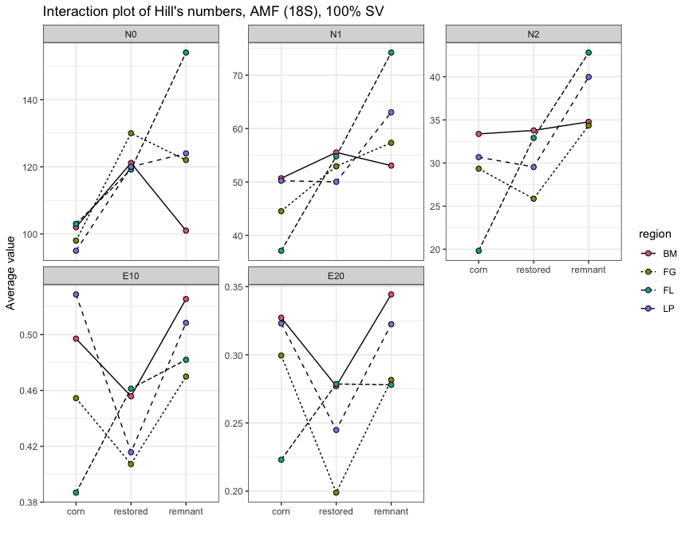
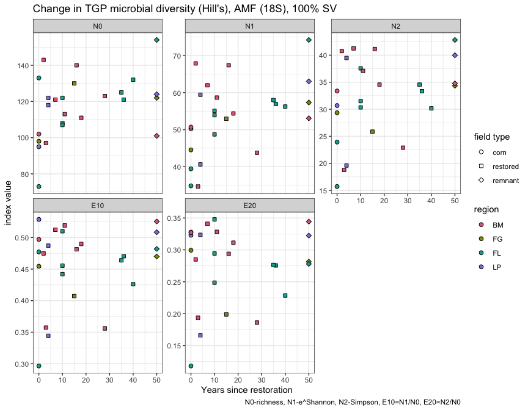

Microbial data: overview of data, diversity statistics
================
Beau Larkin

Last updated: 07 February, 2023

- <a href="#description" id="toc-description">Description</a>
- <a href="#packages-and-libraries"
  id="toc-packages-and-libraries">Packages and libraries</a>
- <a href="#data" id="toc-data">Data</a>
  - <a href="#sites-species-tables"
    id="toc-sites-species-tables">Sites-species tables</a>
  - <a href="#average-sequence-abundances-in-each-field"
    id="toc-average-sequence-abundances-in-each-field">Average sequence
    abundances in each field</a>
  - <a href="#site-metadata-and-design"
    id="toc-site-metadata-and-design">Site metadata and design</a>
- <a href="#analysis-and-results" id="toc-analysis-and-results">Analysis
  and Results</a>
  - <a href="#functions-and-variables"
    id="toc-functions-and-variables">Functions and variables</a>
    - <a href="#calculate-hills-series-on-a-samples-species-matrix"
      id="toc-calculate-hills-series-on-a-samples-species-matrix">Calculate
      Hill’s series on a samples-species matrix</a>
    - <a href="#test-diversity-measures-across-site-types-with-mixed-model"
      id="toc-test-diversity-measures-across-site-types-with-mixed-model">Test
      diversity measures across site types with mixed model</a>
    - <a href="#change-in-diversity-over-time"
      id="toc-change-in-diversity-over-time">Change in diversity over time</a>
    - <a href="#calculate-diversity-of-all-samples-species-matrices"
      id="toc-calculate-diversity-of-all-samples-species-matrices">Calculate
      diversity of all samples-species matrices</a>
  - <a
    href="#fungi-its-gene-in-otu-clusters-averaged-to-8-samples-per-field"
    id="toc-fungi-its-gene-in-otu-clusters-averaged-to-8-samples-per-field">Fungi
    (ITS gene) in OTU clusters, averaged to 8 samples per field.</a>
    - <a href="#diversity-across-field-types"
      id="toc-diversity-across-field-types">Diversity across field types</a>
    - <a href="#key-observations" id="toc-key-observations">Key
      observations:</a>
    - <a href="#diversity-over-time-its-based-otus"
      id="toc-diversity-over-time-its-based-otus">Diversity over time
      (ITS-based OTUs)</a>
    - <a href="#diversity-over-time-at-blue-mounds-its-based-otus"
      id="toc-diversity-over-time-at-blue-mounds-its-based-otus">Diversity
      over time at Blue Mounds (ITS-based OTUs)</a>
  - <a
    href="#fungi-its-gene-in-sequence-variant-sv-clusters-averaged-to-8-samples-per-field"
    id="toc-fungi-its-gene-in-sequence-variant-sv-clusters-averaged-to-8-samples-per-field">Fungi
    (ITS gene) in sequence-variant (SV) clusters, averaged to 8 samples per
    field.</a>
    - <a href="#key-observations-1" id="toc-key-observations-1">Key
      observations:</a>
    - <a href="#diversity-over-time-its-based-svs"
      id="toc-diversity-over-time-its-based-svs">Diversity over time
      (ITS-based SVs)</a>
    - <a href="#diversity-over-time-at-blue-mounds-its-based-svs"
      id="toc-diversity-over-time-at-blue-mounds-its-based-svs">Diversity over
      time at Blue Mounds (ITS-based SVs)</a>
  - <a
    href="#amf-18s-gene-in-operational-taxonomic-unit-97-similar-otus-clusters-averaged-to-7-samples-per-field"
    id="toc-amf-18s-gene-in-operational-taxonomic-unit-97-similar-otus-clusters-averaged-to-7-samples-per-field">AMF
    (18S gene) in operational taxonomic unit (97% similar OTUs) clusters,
    averaged to 7 samples per field.</a>
    - <a href="#key-observations-2" id="toc-key-observations-2">Key
      observations:</a>
    - <a href="#diversity-over-time-18s-based-otus"
      id="toc-diversity-over-time-18s-based-otus">Diversity over time
      (18S-based OTUs)</a>
    - <a href="#diversity-over-time-at-blue-mounds-its-based-svs-1"
      id="toc-diversity-over-time-at-blue-mounds-its-based-svs-1">Diversity
      over time at Blue Mounds (ITS-based SVs)</a>
  - <a
    href="#amf-18s-gene-in-sequence-variants-100-svs-clusters-averaged-to-7-samples-per-field"
    id="toc-amf-18s-gene-in-sequence-variants-100-svs-clusters-averaged-to-7-samples-per-field">AMF
    (18S gene) in sequence variants (100% SVs) clusters, averaged to 7
    samples per field.</a>
    - <a href="#key-observations-3" id="toc-key-observations-3">Key
      observations:</a>
    - <a href="#diversity-over-time-18s-based-otus-1"
      id="toc-diversity-over-time-18s-based-otus-1">Diversity over time
      (18S-based OTUs)</a>
    - <a href="#diversity-over-time-at-blue-mounds-its-based-svs-2"
      id="toc-diversity-over-time-at-blue-mounds-its-based-svs-2">Diversity
      over time at Blue Mounds (ITS-based SVs)</a>

# Description

Microbial data analyzed here include site-species tables derived from
high-throughput sequencing of ITS and 18S genes and clustering into 97%
similar OTUs and 100% similar SVs. This report presents basic statistics
and visualizations of species richness, Shannon’s diversity/evenness,
and Simpson’s diversity/evenness in the microbial species data across
field types.

- Diversity and evenness of microbial communities
- Interpretation of differences in diversity among regions and field
  types, and over years.

# Packages and libraries

``` r
packages_needed = c(
    "rsq",
    "lme4",
    "multcomp",
    "tidyverse",
    "vegan",
    "ggbeeswarm",
    "knitr",
    "conflicted",
    "colorspace"
)
packages_installed = packages_needed %in% rownames(installed.packages())
```

``` r
if (any(!packages_installed)) {
    install.packages(packages_needed[!packages_installed])
}
```

``` r
for (i in 1:length(packages_needed)) {
    library(packages_needed[i], character.only = T)
}
```

``` r
conflict_prefer("filter", "dplyr")
conflict_prefer("select", "dplyr")
```

# Data

## Sites-species tables

CSV files were produced in `process_data.R`

``` r
its_otu_all <- read_csv(paste0(getwd(), "/clean_data/spe_ITS_otu_siteSpeMatrix_allReps.csv"), 
                        show_col_types = FALSE)
its_sv_all  <- read_csv(paste0(getwd(), "/clean_data/spe_ITS_sv_siteSpeMatrix_allReps.csv"), 
                        show_col_types = FALSE)
amf_otu_all <- read_csv(paste0(getwd(), "/clean_data/spe_18S_otu_siteSpeMatrix_allReps.csv"), 
                        show_col_types = FALSE)
amf_sv_all  <- read_csv(paste0(getwd(), "/clean_data/spe_18S_sv_siteSpeMatrix_allReps.csv"), 
                        show_col_types = FALSE)
```

## Average sequence abundances in each field

We examine diversity at the field level, so diversity obtained at
samples should be averaged for each field. We collected ten samples from
each field, but processing failed for some samples at one step or
another in the pipeline. Samples must be randomly resampled to the
smallest number obtained in a series to produce comparable diversity
metrics. The following function will resample the site-species data to
the correct number of samples.

``` r
resample_fields <- function(data, min, cluster_type) {
    set.seed(482)
    data %>% 
        group_by(site_key) %>% 
        slice_sample(n = min) %>%
        summarize(across(starts_with(cluster_type), list(avg = mean)))
}
```

The minimum number of samples in a field for each gene is:

- ITS = 8 samples
- 18S = 7 samples

With this, we can run the function for each dataset:

``` r
its_otu_avg <- resample_fields(its_otu_all, 8, "otu")
its_sv_avg  <- resample_fields(its_sv_all,  8, "sv")
amf_otu_avg <- resample_fields(amf_otu_all, 7, "otu")
amf_sv_avg  <- resample_fields(amf_sv_all,  7, "sv")
```

## Site metadata and design

Set remnants to 50 years old as a placeholder. This number will not be
used in a quantitative sense, for example in models. Oldfields are
filtered out because they could not be replicated in regions.

``` r
rem_age <- 50
sites   <- read_csv(paste0(getwd(), "/clean_data/site.csv"), show_col_types = FALSE) %>% 
    mutate(site_type = factor(site_type, ordered = TRUE, levels = c("corn", "restored", "remnant")),
           yr_since = replace(yr_since, which(site_type == "remnant"), rem_age)) %>% 
    filter(site_type != "oldfield") %>% 
    rename(field_type = site_type)
```

# Analysis and Results

Microbial diversity is considered for each of four datasets: OTU or SV
clustering for 18S or ITS gene sequencing. For each set, Hill’s numbers
are produced ([Hill 1973](http://doi.wiley.com/10.2307/1934352),
[Borcard and Legendere 2018,
p. 373](http://link.springer.com/10.1007/978-3-319-71404-2)) and
plotted, with means differences tested using mixed-effects linear models
in `lmer` ([Bates et al. 2015](https://doi.org/10.18637/jss.v067.i01)).
Correlations are then produced to visualize change in diversity trends
over time, with similar mixed-effects tests performed.

Hill’s numbers, brief description:

- $N_{0}$ = species richness
- $N_{1}$ = Shannon’s diversity ($e^H$; excludes rarest species,
  considers the number of “functional” species)
- $N_{2}$ = Simpson’s diversity ($1 / \lambda$; number of “codominant”
  species)
- $E_{10}$ = Shannon’s evenness (Hill’s ratio $N_{1} / N_{0}$)
- $E_{20}$ = Simpson’s evenness (Hill’s ratio $N_{2} / N_{0}$)

## Functions and variables

The following functions are used to streamline code and reduce errors:

### Calculate Hill’s series on a samples-species matrix

``` r
calc_diversity <- function(spe) {
    spe_mat <- data.frame(spe, row.names = 1)
    
    N0  <- apply(spe_mat > 0, MARGIN = 1, FUN = sum)
    N1  <- exp(diversity(spe_mat))
    N2  <- diversity(spe_mat, "inv")
    E10 <- N1 / N0
    E20 <- N2 / N0
    
    return(
        data.frame(N0, N1, N2, E10, E20) %>%
            rownames_to_column(var = "site_key") %>%
            mutate(site_key = as.integer(site_key)) %>%
            left_join(
                sites %>% select(starts_with("site"), field_type, region, yr_rank, yr_since),
                by = "site_key"
            ) %>%
            pivot_longer(
                cols = N0:E20,
                names_to = "hill_index",
                values_to = "value"
            ) %>%
            mutate(hill_index = factor(
                hill_index,
                ordered = TRUE,
                levels = c("N0", "N1", "N2", "E10", "E20")
            ))
    )
}
```

### Test diversity measures across site types with mixed model

``` r
test_diversity <- function(data) {
    hills <- levels(data$hill_index)
    for(i in 1:length(hills)) {
        cat("---------------------------------\n")
        print(hills[i])
        cat("---------------------------------\n\n")
        mod_data <- data %>% 
            filter(hill_index == hills[i]) %>% 
            mutate(field_type = factor(field_type, ordered = FALSE))
        mmod <- lmer(value ~ field_type + (1 | region), data = mod_data, REML = FALSE)
        print(mmod)
        mmod_null <- lmer(value ~ 1 + (1 | region), data = mod_data, REML = FALSE)
        print(mmod_null)
        cat("\n---------------------------------\n\n")
        print(anova(mmod, mmod_null))
        mod_tuk <- glht(mmod, linfct = mcp(field_type = "Tukey"), test = adjusted("holm"))
        print(mod_tuk)
        print(cld(mod_tuk))
        cat("\n\n\n")
    }
}
```

### Change in diversity over time

Do Hill’s numbers correlate with years since restoration? This is only
appropriate to attempt in the Blue Mounds region, and even there, it
will be difficult to justify that the area meets the criteria for a
chronosequence.

``` r
test_age <- function(data, caption=NULL) {
    temp_df <-
        data %>%
        filter(field_type == "restored", region == "BM") %>%
        pivot_wider(names_from = hill_index, values_from = value) %>%
        select(-starts_with("site"),-field_type,-region,-yr_rank)
    lapply(temp_df %>% select(-yr_since), function(z) {
        test <-
            cor.test(temp_df$yr_since,
                     z,
                     alternative = "two.sided",
                     method = "pearson")
        return(data.frame(
            cor = round(test$estimate, 2),
            R2 = round(test$estimate^2, 2),
            pval = round(test$p.value, 3)
        ))
    }) %>%
        bind_rows(.id = "hill_num") %>%
        remove_rownames() %>%
        mutate(sig = case_when(pval <= 0.05 ~ "*", TRUE ~ "")) %>%
        kable(format = "pandoc", caption = caption)
}
```

### Calculate diversity of all samples-species matrices

Create list of matrices and process with `calc_diversity()`. Naming list
objects as their desired output names will enhance understanding later.

``` r
spe_list <- list(
    its_otu = its_otu_avg,
    its_sv = its_sv_avg,
    amf_otu = amf_otu_avg,
    amf_sv = amf_sv_avg
)
```

``` r
div <- lapply(spe_list, calc_diversity)
```

## Fungi (ITS gene) in OTU clusters, averaged to 8 samples per field.

### Diversity across field types

Run the linear model and test differences among field types for
diversity.

``` r
test_diversity(div$its_otu)
```

    ## ---------------------------------
    ## [1] "N0"
    ## ---------------------------------
    ## 
    ## Linear mixed model fit by maximum likelihood  ['lmerMod']
    ## Formula: value ~ field_type + (1 | region)
    ##    Data: mod_data
    ##       AIC       BIC    logLik  deviance  df.resid 
    ##  257.7778  263.8722 -123.8889  247.7778        20 
    ## Random effects:
    ##  Groups   Name        Std.Dev.
    ##  region   (Intercept) 22.38   
    ##  Residual             30.71   
    ## Number of obs: 25, groups:  region, 4
    ## Fixed Effects:
    ##        (Intercept)  field_typerestored   field_typeremnant  
    ##             351.63               85.04              123.37  
    ## Linear mixed model fit by maximum likelihood  ['lmerMod']
    ## Formula: value ~ 1 + (1 | region)
    ##    Data: mod_data
    ##       AIC       BIC    logLik  deviance  df.resid 
    ##  276.4366  280.0933 -135.2183  270.4366        22 
    ## Random effects:
    ##  Groups   Name        Std.Dev.
    ##  region   (Intercept)  3.478  
    ##  Residual             53.933  
    ## Number of obs: 25, groups:  region, 4
    ## Fixed Effects:
    ## (Intercept)  
    ##       425.6  
    ## 
    ## ---------------------------------
    ## 
    ## Data: mod_data
    ## Models:
    ## mmod_null: value ~ 1 + (1 | region)
    ## mmod: value ~ field_type + (1 | region)
    ##           npar    AIC    BIC  logLik deviance  Chisq Df Pr(>Chisq)    
    ## mmod_null    3 276.44 280.09 -135.22   270.44                         
    ## mmod         5 257.78 263.87 -123.89   247.78 22.659  2  1.201e-05 ***
    ## ---
    ## Signif. codes:  0 '***' 0.001 '**' 0.01 '*' 0.05 '.' 0.1 ' ' 1
    ## 
    ##   General Linear Hypotheses
    ## 
    ## Multiple Comparisons of Means: Tukey Contrasts
    ## 
    ## 
    ## Linear Hypotheses:
    ##                         Estimate
    ## restored - corn == 0       85.04
    ## remnant - corn == 0       123.37
    ## remnant - restored == 0    38.34
    ## 
    ##     corn restored  remnant 
    ##      "a"      "b"      "b" 
    ## 
    ## 
    ## 
    ## ---------------------------------
    ## [1] "N1"
    ## ---------------------------------
    ## 
    ## Linear mixed model fit by maximum likelihood  ['lmerMod']
    ## Formula: value ~ field_type + (1 | region)
    ##    Data: mod_data
    ##       AIC       BIC    logLik  deviance  df.resid 
    ##  223.0306  229.1249 -106.5153  213.0306        20 
    ## Random effects:
    ##  Groups   Name        Std.Dev.
    ##  region   (Intercept)  1.147  
    ##  Residual             17.107  
    ## Number of obs: 25, groups:  region, 4
    ## Fixed Effects:
    ##        (Intercept)  field_typerestored   field_typeremnant  
    ##              73.43               30.33               38.95

    ## boundary (singular) fit: see help('isSingular')

    ## Linear mixed model fit by maximum likelihood  ['lmerMod']
    ## Formula: value ~ 1 + (1 | region)
    ##    Data: mod_data
    ##       AIC       BIC    logLik  deviance  df.resid 
    ##  230.6573  234.3139 -112.3286  224.6573        22 
    ## Random effects:
    ##  Groups   Name        Std.Dev.
    ##  region   (Intercept)  0.00   
    ##  Residual             21.63   
    ## Number of obs: 25, groups:  region, 4
    ## Fixed Effects:
    ## (Intercept)  
    ##       99.02  
    ## optimizer (nloptwrap) convergence code: 0 (OK) ; 0 optimizer warnings; 1 lme4 warnings 
    ## 
    ## ---------------------------------
    ## 
    ## Data: mod_data
    ## Models:
    ## mmod_null: value ~ 1 + (1 | region)
    ## mmod: value ~ field_type + (1 | region)
    ##           npar    AIC    BIC  logLik deviance  Chisq Df Pr(>Chisq)   
    ## mmod_null    3 230.66 234.31 -112.33   224.66                        
    ## mmod         5 223.03 229.12 -106.52   213.03 11.627  2   0.002987 **
    ## ---
    ## Signif. codes:  0 '***' 0.001 '**' 0.01 '*' 0.05 '.' 0.1 ' ' 1
    ## 
    ##   General Linear Hypotheses
    ## 
    ## Multiple Comparisons of Means: Tukey Contrasts
    ## 
    ## 
    ## Linear Hypotheses:
    ##                         Estimate
    ## restored - corn == 0      30.332
    ## remnant - corn == 0       38.955
    ## remnant - restored == 0    8.623
    ## 
    ##     corn restored  remnant 
    ##      "a"      "b"      "b" 
    ## 
    ## 
    ## 
    ## ---------------------------------
    ## [1] "N2"
    ## ---------------------------------

    ## boundary (singular) fit: see help('isSingular')

    ## Linear mixed model fit by maximum likelihood  ['lmerMod']
    ## Formula: value ~ field_type + (1 | region)
    ##    Data: mod_data
    ##      AIC      BIC   logLik deviance df.resid 
    ## 203.3632 209.4576 -96.6816 193.3632       20 
    ## Random effects:
    ##  Groups   Name        Std.Dev.
    ##  region   (Intercept)  0.00   
    ##  Residual             11.57   
    ## Number of obs: 25, groups:  region, 4
    ## Fixed Effects:
    ##        (Intercept)  field_typerestored   field_typeremnant  
    ##              35.22               14.02               17.38  
    ## optimizer (nloptwrap) convergence code: 0 (OK) ; 0 optimizer warnings; 1 lme4 warnings

    ## boundary (singular) fit: see help('isSingular')

    ## Linear mixed model fit by maximum likelihood  ['lmerMod']
    ## Formula: value ~ 1 + (1 | region)
    ##    Data: mod_data
    ##      AIC      BIC   logLik deviance df.resid 
    ## 205.3155 208.9722 -99.6578 199.3155       22 
    ## Random effects:
    ##  Groups   Name        Std.Dev.
    ##  region   (Intercept)  0.00   
    ##  Residual             13.03   
    ## Number of obs: 25, groups:  region, 4
    ## Fixed Effects:
    ## (Intercept)  
    ##       46.97  
    ## optimizer (nloptwrap) convergence code: 0 (OK) ; 0 optimizer warnings; 1 lme4 warnings 
    ## 
    ## ---------------------------------
    ## 
    ## Data: mod_data
    ## Models:
    ## mmod_null: value ~ 1 + (1 | region)
    ## mmod: value ~ field_type + (1 | region)
    ##           npar    AIC    BIC  logLik deviance  Chisq Df Pr(>Chisq)  
    ## mmod_null    3 205.32 208.97 -99.658   199.32                       
    ## mmod         5 203.36 209.46 -96.682   193.36 5.9523  2    0.05099 .
    ## ---
    ## Signif. codes:  0 '***' 0.001 '**' 0.01 '*' 0.05 '.' 0.1 ' ' 1
    ## 
    ##   General Linear Hypotheses
    ## 
    ## Multiple Comparisons of Means: Tukey Contrasts
    ## 
    ## 
    ## Linear Hypotheses:
    ##                         Estimate
    ## restored - corn == 0      14.017
    ## remnant - corn == 0       17.384
    ## remnant - restored == 0    3.367
    ## 
    ##     corn restored  remnant 
    ##      "a"      "b"     "ab" 
    ## 
    ## 
    ## 
    ## ---------------------------------
    ## [1] "E10"
    ## ---------------------------------

    ## boundary (singular) fit: see help('isSingular')

    ## Linear mixed model fit by maximum likelihood  ['lmerMod']
    ## Formula: value ~ field_type + (1 | region)
    ##    Data: mod_data
    ##      AIC      BIC   logLik deviance df.resid 
    ## -89.9834 -83.8890  49.9917 -99.9834       20 
    ## Random effects:
    ##  Groups   Name        Std.Dev.
    ##  region   (Intercept) 0.00000 
    ##  Residual             0.03276 
    ## Number of obs: 25, groups:  region, 4
    ## Fixed Effects:
    ##        (Intercept)  field_typerestored   field_typeremnant  
    ##            0.21001             0.02614             0.02930  
    ## optimizer (nloptwrap) convergence code: 0 (OK) ; 0 optimizer warnings; 1 lme4 warnings

    ## boundary (singular) fit: see help('isSingular')

    ## Linear mixed model fit by maximum likelihood  ['lmerMod']
    ## Formula: value ~ 1 + (1 | region)
    ##    Data: mod_data
    ##      AIC      BIC   logLik deviance df.resid 
    ## -91.4189 -87.7622  48.7094 -97.4189       22 
    ## Random effects:
    ##  Groups   Name        Std.Dev.
    ##  region   (Intercept) 0.00000 
    ##  Residual             0.03448 
    ## Number of obs: 25, groups:  region, 4
    ## Fixed Effects:
    ## (Intercept)  
    ##      0.2314  
    ## optimizer (nloptwrap) convergence code: 0 (OK) ; 0 optimizer warnings; 1 lme4 warnings 
    ## 
    ## ---------------------------------
    ## 
    ## Data: mod_data
    ## Models:
    ## mmod_null: value ~ 1 + (1 | region)
    ## mmod: value ~ field_type + (1 | region)
    ##           npar     AIC     BIC logLik deviance  Chisq Df Pr(>Chisq)
    ## mmod_null    3 -91.419 -87.762 48.709  -97.419                     
    ## mmod         5 -89.983 -83.889 49.992  -99.983 2.5645  2     0.2774
    ## 
    ##   General Linear Hypotheses
    ## 
    ## Multiple Comparisons of Means: Tukey Contrasts
    ## 
    ## 
    ## Linear Hypotheses:
    ##                         Estimate
    ## restored - corn == 0     0.02614
    ## remnant - corn == 0      0.02930
    ## remnant - restored == 0  0.00316
    ## 
    ##     corn restored  remnant 
    ##      "a"      "a"      "a" 
    ## 
    ## 
    ## 
    ## ---------------------------------
    ## [1] "E20"
    ## ---------------------------------

    ## boundary (singular) fit: see help('isSingular')

    ## Linear mixed model fit by maximum likelihood  ['lmerMod']
    ## Formula: value ~ field_type + (1 | region)
    ##    Data: mod_data
    ##       AIC       BIC    logLik  deviance  df.resid 
    ## -104.2330  -98.1386   57.1165 -114.2330        20 
    ## Random effects:
    ##  Groups   Name        Std.Dev.
    ##  region   (Intercept) 0.00000 
    ##  Residual             0.02463 
    ## Number of obs: 25, groups:  region, 4
    ## Fixed Effects:
    ##        (Intercept)  field_typerestored   field_typeremnant  
    ##            0.10067             0.01125             0.01242  
    ## optimizer (nloptwrap) convergence code: 0 (OK) ; 0 optimizer warnings; 1 lme4 warnings

    ## boundary (singular) fit: see help('isSingular')

    ## Linear mixed model fit by maximum likelihood  ['lmerMod']
    ## Formula: value ~ 1 + (1 | region)
    ##    Data: mod_data
    ##       AIC       BIC    logLik  deviance  df.resid 
    ## -107.3713 -103.7147   56.6856 -113.3713        22 
    ## Random effects:
    ##  Groups   Name        Std.Dev.
    ##  region   (Intercept) 0.00000 
    ##  Residual             0.02506 
    ## Number of obs: 25, groups:  region, 4
    ## Fixed Effects:
    ## (Intercept)  
    ##      0.1099  
    ## optimizer (nloptwrap) convergence code: 0 (OK) ; 0 optimizer warnings; 1 lme4 warnings 
    ## 
    ## ---------------------------------
    ## 
    ## Data: mod_data
    ## Models:
    ## mmod_null: value ~ 1 + (1 | region)
    ## mmod: value ~ field_type + (1 | region)
    ##           npar     AIC      BIC logLik deviance  Chisq Df Pr(>Chisq)
    ## mmod_null    3 -107.37 -103.715 56.686  -113.37                     
    ## mmod         5 -104.23  -98.139 57.116  -114.23 0.8617  2       0.65
    ## 
    ##   General Linear Hypotheses
    ## 
    ## Multiple Comparisons of Means: Tukey Contrasts
    ## 
    ## 
    ## Linear Hypotheses:
    ##                         Estimate
    ## restored - corn == 0    0.011252
    ## remnant - corn == 0     0.012419
    ## remnant - restored == 0 0.001167
    ## 
    ##     corn restored  remnant 
    ##      "a"      "a"      "a"

Model results depend on which sites were sampled using
`resample_fields()` above. Changing the value of `set.seed()` in that
function may alter the results of this model.

- $N_{0}$: field type is significant by likelihood ratio test at
  p\<0.001 with region as a random effect. Species richness in corn
  fields was less than restored or remnants, which didn’t differ at
  p=0.05.
- $N_{1}$: model fit is questionable due to
  [singular](https://rdrr.io/cran/lme4/man/isSingular.html) fit, but
  field type is significant by likelihood ratio test at p\<0.01 with
  region as a random effect. Shannon’s diversity in corn fields was less
  than restored or remnants, which didn’t differ at p=0.05.
- $N_{2}$, $E_{10}$, and $E_{20}$: model fits for both null and full
  models were singular and NS at p\<0.05.

Figure labels are generated and the diversity data are plotted below. An
interaction plot follows, and is useful to consider what the model can
and cannot say about differences in regions and field types.

``` r
labs_its_otu <- data.frame(
    hill_index = factor(c(rep("N0", 3), rep("N1", 3)), ordered = TRUE, levels = c("N0", "N1", "N2", "E10", "E20")),
    lab = c("a", "b", "b", "a", "b", "b"),
    xpos = rep(c(1,2,3), 2),
    ypos = rep(c(620, 170), each = 3)
)
```

``` r
ggplot(div$its_otu, aes(x = field_type, y = value)) +
    facet_wrap(vars(hill_index), scales = "free_y") +
    geom_boxplot(varwidth = TRUE, fill = "gray90", outlier.shape = NA) +
    geom_beeswarm(aes(fill = region), shape = 21, size = 2, dodge.width = 0.2) +
    geom_text(data = labs_its_otu, aes(x = xpos, y = ypos, label = lab)) +
    labs(x = "", y = "Index value", title = "TGP microbial diversity (Hill's), ITS, 97% OTU",
         caption = "N0-richness, N1-e^Shannon, N2-Simpson, E10=N1/N0, E20=N2/N0, width=n") +
    scale_fill_discrete_qualitative(palette = "Dark3") +
    theme_bw()
```

<!-- -->

Richness and evenness parameters increase from corn, to restored, to
remnant fields, and some support exists for this pattern to occur across
regions.

``` r
ggplot(
    div$its_otu %>% 
        group_by(field_type, region, hill_index) %>% 
        summarize(avg_value = mean(value), .groups = "drop"),
    aes(x = field_type, y = avg_value, group = region)) +
    facet_wrap(vars(hill_index), scales = "free_y") +
    geom_line(aes(linetype = region)) +
    geom_point(aes(fill = region), size = 2, shape = 21) +
    labs(x = "", y = "Average value", title = "Interaction plot of Hill's numbers, ITS, 97% OTU") +
    scale_fill_discrete_qualitative(palette = "Dark3") +
    theme_bw()
```

<!-- -->

### Key observations:

- The restored field at LP contains very high diversity, co-dominance,
  and evenness of fungi.
- The restored field at FG contains low diversity, co-dominance, and
  evenness.
- Interactions are less an issue with $N_{0}$ and $N_{1}$

### Diversity over time (ITS-based OTUs)

Next, trends in diversity are correlated with years since restoration,
with 0 used for corn fields and 50 used for remnants. Statistical
testing of this relationship is not valid because the ages for corn and
remnant aren’t justified, and the fields aren’t justifiable as a
chronosequence.

``` r
ggplot(div$its_otu, aes(x = yr_since, y = value)) +
facet_wrap(vars(hill_index), scales = "free_y") +
    geom_point(aes(fill = region, shape = field_type), size = 2) +
    labs(x = "Years since restoration", y = "index value", title = "Change in TGP microbial diversity (Hill's), ITS, 97% OTU",
         caption = "N0-richness, N1-e^Shannon, N2-Simpson, E10=N1/N0, E20=N2/N0") +
    scale_shape_manual(name = "field type", values = c(21:23)) +
    scale_fill_discrete_qualitative(name = "region", palette = "Dark3") +
    guides(fill = guide_legend(override.aes = list(shape = 21)),
           shape = guide_legend(override.aes = list(fill = NA))) +
    theme_bw()
```

<!-- -->

### Diversity over time at Blue Mounds (ITS-based OTUs)

Possibly, it’s justified to correlate restoration age with diversity at
Blue Mounds only, and with restored fields only. A Pearson’s correlation
is used:

``` r
test_age(div$its_otu, caption = "Correlation between Hill's numbers and field age in the Blue Mounds region: ITS, 97% OTU")
```

| hill_num |   cor |   R2 |  pval | sig |
|:---------|------:|-----:|------:|:----|
| N0       | -0.32 | 0.10 | 0.484 |     |
| N1       | -0.77 | 0.60 | 0.041 | \*  |
| N2       | -0.66 | 0.44 | 0.103 |     |
| E10      | -0.70 | 0.48 | 0.083 |     |
| E20      | -0.58 | 0.33 | 0.177 |     |

Correlation between Hill’s numbers and field age in the Blue Mounds
region: ITS, 97% OTU

Hill’s $N_{1}$ decreases with age since restoration in the Blue Mounds
area ($R^2$=0.60, p\<0.05). This is odd and points to a confounding
effect driven by difference in restoration strategy over time. It’s
possible that site differences (soils, etc.) also confound this
relationship. It’s possible that we cannot attempt to present this as a
time-based result at all.

In any case, let’s take a look at Shannon’s diversity over time in Blue
Mounds’s restored fields.

``` r
div$its_otu %>% 
    filter(region == "BM", field_type == "restored", hill_index == "N1") %>% 
    ggplot(aes(x = yr_since, y = value)) +
    geom_smooth(method = "lm", se = TRUE, linewidth = 0.8, fill = "gray70") +
    geom_label(aes(label = site_name)) +
    labs(x = "Years since restoration", y = expression("Shannon's diversity"~(N[1]))) +
    theme_classic()
```

    ## `geom_smooth()` using formula = 'y ~ x'


Karla Ott’s field was almost exclusively dominated by big bluestem,
possibly leading to a simpler microbial community. Right now, my
interpretation is that restoration strategies changed over time and
although restored plant communities persisted, microbial communities
simplified over time. Immediately after restoration, microbial diversity
increased rapidly and was not sustained because the soil properties
ultimately didn’t change very much.

Site factors (soil type) are hard to tease out, but in later analyses we
will try using measured soil chemical properties.

## Fungi (ITS gene) in sequence-variant (SV) clusters, averaged to 8 samples per field.

Run the linear model and test differences among field types for
diversity.

``` r
test_diversity(div$its_sv)
```

    ## ---------------------------------
    ## [1] "N0"
    ## ---------------------------------
    ## 
    ## Linear mixed model fit by maximum likelihood  ['lmerMod']
    ## Formula: value ~ field_type + (1 | region)
    ##    Data: mod_data
    ##       AIC       BIC    logLik  deviance  df.resid 
    ##  270.8553  276.9497 -130.4277  260.8553        20 
    ## Random effects:
    ##  Groups   Name        Std.Dev.
    ##  region   (Intercept) 24.04   
    ##  Residual             40.85   
    ## Number of obs: 25, groups:  region, 4
    ## Fixed Effects:
    ##        (Intercept)  field_typerestored   field_typeremnant  
    ##              469.5               135.1               178.2  
    ## Linear mixed model fit by maximum likelihood  ['lmerMod']
    ## Formula: value ~ 1 + (1 | region)
    ##    Data: mod_data
    ##       AIC       BIC    logLik  deviance  df.resid 
    ##  293.8604  297.5170 -143.9302  287.8604        22 
    ## Random effects:
    ##  Groups   Name        Std.Dev.
    ##  region   (Intercept) 12.03   
    ##  Residual             75.69   
    ## Number of obs: 25, groups:  region, 4
    ## Fixed Effects:
    ## (Intercept)  
    ##       583.4  
    ## 
    ## ---------------------------------
    ## 
    ## Data: mod_data
    ## Models:
    ## mmod_null: value ~ 1 + (1 | region)
    ## mmod: value ~ field_type + (1 | region)
    ##           npar    AIC    BIC  logLik deviance  Chisq Df Pr(>Chisq)    
    ## mmod_null    3 293.86 297.52 -143.93   287.86                         
    ## mmod         5 270.86 276.95 -130.43   260.86 27.005  2  1.367e-06 ***
    ## ---
    ## Signif. codes:  0 '***' 0.001 '**' 0.01 '*' 0.05 '.' 0.1 ' ' 1
    ## 
    ##   General Linear Hypotheses
    ## 
    ## Multiple Comparisons of Means: Tukey Contrasts
    ## 
    ## 
    ## Linear Hypotheses:
    ##                         Estimate
    ## restored - corn == 0      135.07
    ## remnant - corn == 0       178.22
    ## remnant - restored == 0    43.16
    ## 
    ##     corn restored  remnant 
    ##      "a"      "b"      "b" 
    ## 
    ## 
    ## 
    ## ---------------------------------
    ## [1] "N1"
    ## ---------------------------------

    ## boundary (singular) fit: see help('isSingular')

    ## Linear mixed model fit by maximum likelihood  ['lmerMod']
    ## Formula: value ~ field_type + (1 | region)
    ##    Data: mod_data
    ##       AIC       BIC    logLik  deviance  df.resid 
    ##  251.1756  257.2700 -120.5878  241.1756        20 
    ## Random effects:
    ##  Groups   Name        Std.Dev.
    ##  region   (Intercept)  0.0    
    ##  Residual             30.1    
    ## Number of obs: 25, groups:  region, 4
    ## Fixed Effects:
    ##        (Intercept)  field_typerestored   field_typeremnant  
    ##             108.31               46.81               65.18  
    ## optimizer (nloptwrap) convergence code: 0 (OK) ; 0 optimizer warnings; 1 lme4 warnings

    ## boundary (singular) fit: see help('isSingular')

    ## Linear mixed model fit by maximum likelihood  ['lmerMod']
    ## Formula: value ~ 1 + (1 | region)
    ##    Data: mod_data
    ##       AIC       BIC    logLik  deviance  df.resid 
    ##  257.2736  260.9302 -125.6368  251.2736        22 
    ## Random effects:
    ##  Groups   Name        Std.Dev.
    ##  region   (Intercept)  0.00   
    ##  Residual             36.84   
    ## Number of obs: 25, groups:  region, 4
    ## Fixed Effects:
    ## (Intercept)  
    ##       148.7  
    ## optimizer (nloptwrap) convergence code: 0 (OK) ; 0 optimizer warnings; 1 lme4 warnings 
    ## 
    ## ---------------------------------
    ## 
    ## Data: mod_data
    ## Models:
    ## mmod_null: value ~ 1 + (1 | region)
    ## mmod: value ~ field_type + (1 | region)
    ##           npar    AIC    BIC  logLik deviance  Chisq Df Pr(>Chisq)   
    ## mmod_null    3 257.27 260.93 -125.64   251.27                        
    ## mmod         5 251.18 257.27 -120.59   241.18 10.098  2   0.006416 **
    ## ---
    ## Signif. codes:  0 '***' 0.001 '**' 0.01 '*' 0.05 '.' 0.1 ' ' 1
    ## 
    ##   General Linear Hypotheses
    ## 
    ## Multiple Comparisons of Means: Tukey Contrasts
    ## 
    ## 
    ## Linear Hypotheses:
    ##                         Estimate
    ## restored - corn == 0       46.81
    ## remnant - corn == 0        65.18
    ## remnant - restored == 0    18.37
    ## 
    ##     corn restored  remnant 
    ##      "a"      "b"      "b" 
    ## 
    ## 
    ## 
    ## ---------------------------------
    ## [1] "N2"
    ## ---------------------------------

    ## boundary (singular) fit: see help('isSingular')

    ## Linear mixed model fit by maximum likelihood  ['lmerMod']
    ## Formula: value ~ field_type + (1 | region)
    ##    Data: mod_data
    ##       AIC       BIC    logLik  deviance  df.resid 
    ##  233.9296  240.0240 -111.9648  223.9296        20 
    ## Random effects:
    ##  Groups   Name        Std.Dev.
    ##  region   (Intercept)  0.00   
    ##  Residual             21.32   
    ## Number of obs: 25, groups:  region, 4
    ## Fixed Effects:
    ##        (Intercept)  field_typerestored   field_typeremnant  
    ##              52.19               18.36               23.53  
    ## optimizer (nloptwrap) convergence code: 0 (OK) ; 0 optimizer warnings; 1 lme4 warnings

    ## boundary (singular) fit: see help('isSingular')

    ## Linear mixed model fit by maximum likelihood  ['lmerMod']
    ## Formula: value ~ 1 + (1 | region)
    ##    Data: mod_data
    ##       AIC       BIC    logLik  deviance  df.resid 
    ##  233.2030  236.8597 -113.6015  227.2030        22 
    ## Random effects:
    ##  Groups   Name        Std.Dev.
    ##  region   (Intercept)  0.00   
    ##  Residual             22.76   
    ## Number of obs: 25, groups:  region, 4
    ## Fixed Effects:
    ## (Intercept)  
    ##        67.7  
    ## optimizer (nloptwrap) convergence code: 0 (OK) ; 0 optimizer warnings; 1 lme4 warnings 
    ## 
    ## ---------------------------------
    ## 
    ## Data: mod_data
    ## Models:
    ## mmod_null: value ~ 1 + (1 | region)
    ## mmod: value ~ field_type + (1 | region)
    ##           npar    AIC    BIC  logLik deviance  Chisq Df Pr(>Chisq)
    ## mmod_null    3 233.20 236.86 -113.60   227.20                     
    ## mmod         5 233.93 240.02 -111.97   223.93 3.2734  2     0.1946
    ## 
    ##   General Linear Hypotheses
    ## 
    ## Multiple Comparisons of Means: Tukey Contrasts
    ## 
    ## 
    ## Linear Hypotheses:
    ##                         Estimate
    ## restored - corn == 0      18.357
    ## remnant - corn == 0       23.529
    ## remnant - restored == 0    5.172
    ## 
    ##     corn restored  remnant 
    ##      "a"      "a"      "a" 
    ## 
    ## 
    ## 
    ## ---------------------------------
    ## [1] "E10"
    ## ---------------------------------

    ## boundary (singular) fit: see help('isSingular')

    ## Linear mixed model fit by maximum likelihood  ['lmerMod']
    ## Formula: value ~ field_type + (1 | region)
    ##    Data: mod_data
    ##      AIC      BIC   logLik deviance df.resid 
    ## -78.0658 -71.9714  44.0329 -88.0658       20 
    ## Random effects:
    ##  Groups   Name        Std.Dev.
    ##  region   (Intercept) 0.00000 
    ##  Residual             0.04158 
    ## Number of obs: 25, groups:  region, 4
    ## Fixed Effects:
    ##        (Intercept)  field_typerestored   field_typeremnant  
    ##            0.23255             0.02251             0.03732  
    ## optimizer (nloptwrap) convergence code: 0 (OK) ; 0 optimizer warnings; 1 lme4 warnings

    ## boundary (singular) fit: see help('isSingular')

    ## Linear mixed model fit by maximum likelihood  ['lmerMod']
    ## Formula: value ~ 1 + (1 | region)
    ##    Data: mod_data
    ##      AIC      BIC   logLik deviance df.resid 
    ## -80.2277 -76.5711  43.1139 -86.2277       22 
    ## Random effects:
    ##  Groups   Name        Std.Dev.
    ##  region   (Intercept) 0.00000 
    ##  Residual             0.04313 
    ## Number of obs: 25, groups:  region, 4
    ## Fixed Effects:
    ## (Intercept)  
    ##      0.2529  
    ## optimizer (nloptwrap) convergence code: 0 (OK) ; 0 optimizer warnings; 1 lme4 warnings 
    ## 
    ## ---------------------------------
    ## 
    ## Data: mod_data
    ## Models:
    ## mmod_null: value ~ 1 + (1 | region)
    ## mmod: value ~ field_type + (1 | region)
    ##           npar     AIC     BIC logLik deviance  Chisq Df Pr(>Chisq)
    ## mmod_null    3 -80.228 -76.571 43.114  -86.228                     
    ## mmod         5 -78.066 -71.971 44.033  -88.066 1.8381  2     0.3989
    ## 
    ##   General Linear Hypotheses
    ## 
    ## Multiple Comparisons of Means: Tukey Contrasts
    ## 
    ## 
    ## Linear Hypotheses:
    ##                         Estimate
    ## restored - corn == 0     0.02251
    ## remnant - corn == 0      0.03732
    ## remnant - restored == 0  0.01481
    ## 
    ##     corn restored  remnant 
    ##      "a"      "a"      "a" 
    ## 
    ## 
    ## 
    ## ---------------------------------
    ## [1] "E20"
    ## ---------------------------------

    ## boundary (singular) fit: see help('isSingular')

    ## Linear mixed model fit by maximum likelihood  ['lmerMod']
    ## Formula: value ~ field_type + (1 | region)
    ##    Data: mod_data
    ##       AIC       BIC    logLik  deviance  df.resid 
    ##  -90.0177  -83.9233   50.0089 -100.0177        20 
    ## Random effects:
    ##  Groups   Name        Std.Dev.
    ##  region   (Intercept) 0.00000 
    ##  Residual             0.03274 
    ## Number of obs: 25, groups:  region, 4
    ## Fixed Effects:
    ##        (Intercept)  field_typerestored   field_typeremnant  
    ##           0.111919            0.003518            0.006754  
    ## optimizer (nloptwrap) convergence code: 0 (OK) ; 0 optimizer warnings; 1 lme4 warnings

    ## boundary (singular) fit: see help('isSingular')

    ## Linear mixed model fit by maximum likelihood  ['lmerMod']
    ## Formula: value ~ 1 + (1 | region)
    ##    Data: mod_data
    ##      AIC      BIC   logLik deviance df.resid 
    ## -93.9219 -90.2652  49.9609 -99.9219       22 
    ## Random effects:
    ##  Groups   Name        Std.Dev.
    ##  region   (Intercept) 0.0000  
    ##  Residual             0.0328  
    ## Number of obs: 25, groups:  region, 4
    ## Fixed Effects:
    ## (Intercept)  
    ##      0.1153  
    ## optimizer (nloptwrap) convergence code: 0 (OK) ; 0 optimizer warnings; 1 lme4 warnings 
    ## 
    ## ---------------------------------
    ## 
    ## Data: mod_data
    ## Models:
    ## mmod_null: value ~ 1 + (1 | region)
    ## mmod: value ~ field_type + (1 | region)
    ##           npar     AIC     BIC logLik deviance  Chisq Df Pr(>Chisq)
    ## mmod_null    3 -93.922 -90.265 49.961  -99.922                     
    ## mmod         5 -90.018 -83.923 50.009 -100.018 0.0959  2     0.9532
    ## 
    ##   General Linear Hypotheses
    ## 
    ## Multiple Comparisons of Means: Tukey Contrasts
    ## 
    ## 
    ## Linear Hypotheses:
    ##                         Estimate
    ## restored - corn == 0    0.003518
    ## remnant - corn == 0     0.006754
    ## remnant - restored == 0 0.003237
    ## 
    ##     corn restored  remnant 
    ##      "a"      "a"      "a"

Model results depend a little on which sites were sampled using
`resample_fields()` above. Changing the value of `set.seed()` in that
function may alter the results of this model.

- $N_{0}$: field type is significant by likelihood ratio test at
  p\<0.001 with region as a random effect. Species richness in corn
  fields was less than restored or remnants, which didn’t differ at
  p=0.05.
- $N_{1}$: model fit is questionable due to
  [singular](https://rdrr.io/cran/lme4/man/isSingular.html) fit, of both
  the null and parameterized models, but field type is significant by
  likelihood ratio test at p\<0.01 with region as a random effect.
  Shannon’s diversity in corn fields was less than restored or remnants,
  which didn’t differ at p=0.05.
- $N_{2}$, $E_{10}$, and $E_{20}$: model fits for both null and full
  models were singular and NS at p\<0.05.

Figure labels are generated and the diversity data are plotted below. An
interaction plot follows, and is useful to consider what the model can
and cannot say about differences in regions and field types.

``` r
labs_its_sv <- data.frame(
    hill_index = factor(c(rep("N0", 3), rep("N1", 3)), ordered = TRUE, levels = c("N0", "N1", "N2", "E10", "E20")),
    lab = c("a", "b", "b", "a", "b", "b"),
    xpos = rep(c(1,2,3), 2),
    ypos = rep(c(740, 230), each = 3)
)
```

``` r
ggplot(div$its_sv, aes(x = field_type, y = value)) +
    facet_wrap(vars(hill_index), scales = "free_y") +
    geom_boxplot(varwidth = TRUE, fill = "gray90", outlier.shape = NA) +
    geom_beeswarm(aes(fill = region), shape = 21, size = 2, dodge.width = 0.2) +
    geom_text(data = labs_its_sv, aes(x = xpos, y = ypos, label = lab)) +
    labs(x = "", y = "Index value", title = "TGP microbial diversity (Hill's), ITS, 100% SV",
         caption = "N0-richness, N1-e^Shannon, N2-Simpson, E10=N1/N0, E20=N2/N0, width=n") +
    scale_fill_discrete_qualitative(palette = "Dark3") +
    theme_bw()
```

<!-- -->

Richness increases from corn, to restored, to remnant fields, and some
support exists for this pattern to occur across regions. The trend
weakens with $N_{1}$ and $N_{2}$, suggesting that both restored and
remnant soils contain more rare species than are found in cornfields,
but both remnants and restored fields contain a similar amount of
“functionally abundant” and co-dominant species. The slight trend
detected in evenness suggests that the long tail of rare species in
remnants isn’t very abundant, and that co-dominant species are similarly
distributed in all field types.

``` r
ggplot(
    div$its_otu %>% 
        group_by(field_type, region, hill_index) %>% 
        summarize(avg_value = mean(value), .groups = "drop"),
    aes(x = field_type, y = avg_value, group = region)) +
    facet_wrap(vars(hill_index), scales = "free_y") +
    geom_line(aes(linetype = region)) +
    geom_point(aes(fill = region), size = 2, shape = 21) +
    labs(x = "", y = "Average value", title = "Interaction plot of Hill's numbers, ITS, 100% SV") +
    scale_fill_discrete_qualitative(palette = "Dark3") +
    theme_bw()
```

<!-- -->

### Key observations:

- The restored field at LP contains very high diversity, co-dominance,
  and evenness of fungi.
- The restored field at FG contains low diversity, co-dominance, and
  evenness.
- Interactions are less an issue with $N_{0}$ and $N_{1}$

### Diversity over time (ITS-based SVs)

Next, trends in diversity are correlated with years since restoration,
with 0 used for corn fields and 50 used for remnants. Statistical
testing of this relationship is not valid because the ages for corn and
remnant aren’t justified, and the fields aren’t justifiable as a
chronosequence.

``` r
ggplot(div$its_sv, aes(x = yr_since, y = value)) +
    facet_wrap(vars(hill_index), scales = "free_y") +
    geom_point(aes(fill = region, shape = field_type), size = 2) +
    labs(x = "Years since restoration", y = "index value", title = "Change in TGP microbial diversity (Hill's), ITS, 100% SV",
         caption = "N0-richness, N1-e^Shannon, N2-Simpson, E10=N1/N0, E20=N2/N0") +
    scale_shape_manual(name = "field type", values = c(21:23)) +
    scale_fill_discrete_qualitative(name = "region", palette = "Dark3") +
    guides(fill = guide_legend(override.aes = list(shape = 21)),
           shape = guide_legend(override.aes = list(fill = NA))) +
    theme_bw()
```

<!-- -->

### Diversity over time at Blue Mounds (ITS-based SVs)

Possibly, it’s justified to correlate restoration age with diversity at
Blue Mounds only, and with restored fields only. A Pearson’s correlation
is used:

``` r
test_age(div$its_sv, caption = "Correlation between Hill's numbers and field age in the Blue Mounds region: ITS, 100% SV")
```

| hill_num |   cor |   R2 |  pval | sig |
|:---------|------:|-----:|------:|:----|
| N0       | -0.46 | 0.21 | 0.303 |     |
| N1       | -0.68 | 0.46 | 0.093 |     |
| N2       | -0.64 | 0.41 | 0.124 |     |
| E10      | -0.62 | 0.39 | 0.135 |     |
| E20      | -0.60 | 0.35 | 0.158 |     |

Correlation between Hill’s numbers and field age in the Blue Mounds
region: ITS, 100% SV

Correlations are once again negative but none are significant. Negative
correlations are odd odd and point to a confounding effect driven by
difference in restoration strategy over time. It’s possible that site
differences (soils, etc.) also confound this relationship. It’s possible
that we cannot attempt to present this as a time-based result at all.

In any case, let’s take a look at Shannon’s diversity over time in Blue
Mounds’s restored fields.

``` r
div$its_sv %>% 
    filter(region == "BM", field_type == "restored", hill_index == "N1") %>% 
    ggplot(aes(x = yr_since, y = value)) +
    geom_label(aes(label = site_name)) +
    labs(x = "Years since restoration", y = expression("Shannon's diversity"~(N[1]))) +
    theme_classic()
```



The pattern and rank order of sites is the same as was seen with
ITS-based OTUs.

## AMF (18S gene) in operational taxonomic unit (97% similar OTUs) clusters, averaged to 7 samples per field.

Run the linear model and test differences among field types for
diversity.

``` r
test_diversity(div$amf_otu)
```

    ## ---------------------------------
    ## [1] "N0"
    ## ---------------------------------
    ## 
    ## Linear mixed model fit by maximum likelihood  ['lmerMod']
    ## Formula: value ~ field_type + (1 | region)
    ##    Data: mod_data
    ##      AIC      BIC   logLik deviance df.resid 
    ## 165.3191 171.4134 -77.6595 155.3191       20 
    ## Random effects:
    ##  Groups   Name        Std.Dev.
    ##  region   (Intercept) 0.5327  
    ##  Residual             5.3801  
    ## Number of obs: 25, groups:  region, 4
    ## Fixed Effects:
    ##        (Intercept)  field_typerestored   field_typeremnant  
    ##             38.364               9.778              10.136

    ## boundary (singular) fit: see help('isSingular')

    ## Linear mixed model fit by maximum likelihood  ['lmerMod']
    ## Formula: value ~ 1 + (1 | region)
    ##    Data: mod_data
    ##      AIC      BIC   logLik deviance df.resid 
    ## 171.9807 175.6373 -82.9903 165.9807       22 
    ## Random effects:
    ##  Groups   Name        Std.Dev.
    ##  region   (Intercept) 0.00    
    ##  Residual             6.69    
    ## Number of obs: 25, groups:  region, 4
    ## Fixed Effects:
    ## (Intercept)  
    ##       46.28  
    ## optimizer (nloptwrap) convergence code: 0 (OK) ; 0 optimizer warnings; 1 lme4 warnings 
    ## 
    ## ---------------------------------
    ## 
    ## Data: mod_data
    ## Models:
    ## mmod_null: value ~ 1 + (1 | region)
    ## mmod: value ~ field_type + (1 | region)
    ##           npar    AIC    BIC logLik deviance  Chisq Df Pr(>Chisq)   
    ## mmod_null    3 171.98 175.64 -82.99   165.98                        
    ## mmod         5 165.32 171.41 -77.66   155.32 10.662  2    0.00484 **
    ## ---
    ## Signif. codes:  0 '***' 0.001 '**' 0.01 '*' 0.05 '.' 0.1 ' ' 1
    ## 
    ##   General Linear Hypotheses
    ## 
    ## Multiple Comparisons of Means: Tukey Contrasts
    ## 
    ## 
    ## Linear Hypotheses:
    ##                         Estimate
    ## restored - corn == 0      9.7781
    ## remnant - corn == 0      10.1359
    ## remnant - restored == 0   0.3578
    ## 
    ##     corn restored  remnant 
    ##      "a"      "b"      "b" 
    ## 
    ## 
    ## 
    ## ---------------------------------
    ## [1] "N1"
    ## ---------------------------------

    ## boundary (singular) fit: see help('isSingular')

    ## Linear mixed model fit by maximum likelihood  ['lmerMod']
    ## Formula: value ~ field_type + (1 | region)
    ##    Data: mod_data
    ##      AIC      BIC   logLik deviance df.resid 
    ## 127.5622 133.6566 -58.7811 117.5622       20 
    ## Random effects:
    ##  Groups   Name        Std.Dev.
    ##  region   (Intercept) 0.00    
    ##  Residual             2.54    
    ## Number of obs: 25, groups:  region, 4
    ## Fixed Effects:
    ##        (Intercept)  field_typerestored   field_typeremnant  
    ##             13.942               7.041               9.370  
    ## optimizer (nloptwrap) convergence code: 0 (OK) ; 0 optimizer warnings; 1 lme4 warnings

    ## boundary (singular) fit: see help('isSingular')

    ## Linear mixed model fit by maximum likelihood  ['lmerMod']
    ## Formula: value ~ 1 + (1 | region)
    ##    Data: mod_data
    ##      AIC      BIC   logLik deviance df.resid 
    ## 146.5167 150.1733 -70.2583 140.5167       22 
    ## Random effects:
    ##  Groups   Name        Std.Dev.
    ##  region   (Intercept) 0.00    
    ##  Residual             4.02    
    ## Number of obs: 25, groups:  region, 4
    ## Fixed Effects:
    ## (Intercept)  
    ##       19.95  
    ## optimizer (nloptwrap) convergence code: 0 (OK) ; 0 optimizer warnings; 1 lme4 warnings 
    ## 
    ## ---------------------------------
    ## 
    ## Data: mod_data
    ## Models:
    ## mmod_null: value ~ 1 + (1 | region)
    ## mmod: value ~ field_type + (1 | region)
    ##           npar    AIC    BIC  logLik deviance  Chisq Df Pr(>Chisq)    
    ## mmod_null    3 146.52 150.17 -70.258   140.52                         
    ## mmod         5 127.56 133.66 -58.781   117.56 22.954  2  1.036e-05 ***
    ## ---
    ## Signif. codes:  0 '***' 0.001 '**' 0.01 '*' 0.05 '.' 0.1 ' ' 1
    ## 
    ##   General Linear Hypotheses
    ## 
    ## Multiple Comparisons of Means: Tukey Contrasts
    ## 
    ## 
    ## Linear Hypotheses:
    ##                         Estimate
    ## restored - corn == 0       7.041
    ## remnant - corn == 0        9.370
    ## remnant - restored == 0    2.328
    ## 
    ##     corn restored  remnant 
    ##      "a"      "b"      "b" 
    ## 
    ## 
    ## 
    ## ---------------------------------
    ## [1] "N2"
    ## ---------------------------------

    ## boundary (singular) fit: see help('isSingular')

    ## Linear mixed model fit by maximum likelihood  ['lmerMod']
    ## Formula: value ~ field_type + (1 | region)
    ##    Data: mod_data
    ##      AIC      BIC   logLik deviance df.resid 
    ## 123.6351 129.7294 -56.8175 113.6351       20 
    ## Random effects:
    ##  Groups   Name        Std.Dev.
    ##  region   (Intercept) 0.000   
    ##  Residual             2.348   
    ## Number of obs: 25, groups:  region, 4
    ## Fixed Effects:
    ##        (Intercept)  field_typerestored   field_typeremnant  
    ##              9.274               5.496               7.090  
    ## optimizer (nloptwrap) convergence code: 0 (OK) ; 0 optimizer warnings; 1 lme4 warnings

    ## boundary (singular) fit: see help('isSingular')

    ## Linear mixed model fit by maximum likelihood  ['lmerMod']
    ## Formula: value ~ 1 + (1 | region)
    ##    Data: mod_data
    ##      AIC      BIC   logLik deviance df.resid 
    ## 137.4565 141.1131 -65.7283 131.4565       22 
    ## Random effects:
    ##  Groups   Name        Std.Dev.
    ##  region   (Intercept) 0.000   
    ##  Residual             3.354   
    ## Number of obs: 25, groups:  region, 4
    ## Fixed Effects:
    ## (Intercept)  
    ##       13.93  
    ## optimizer (nloptwrap) convergence code: 0 (OK) ; 0 optimizer warnings; 1 lme4 warnings 
    ## 
    ## ---------------------------------
    ## 
    ## Data: mod_data
    ## Models:
    ## mmod_null: value ~ 1 + (1 | region)
    ## mmod: value ~ field_type + (1 | region)
    ##           npar    AIC    BIC  logLik deviance  Chisq Df Pr(>Chisq)    
    ## mmod_null    3 137.46 141.11 -65.728   131.46                         
    ## mmod         5 123.64 129.73 -56.818   113.64 17.822  2  0.0001349 ***
    ## ---
    ## Signif. codes:  0 '***' 0.001 '**' 0.01 '*' 0.05 '.' 0.1 ' ' 1
    ## 
    ##   General Linear Hypotheses
    ## 
    ## Multiple Comparisons of Means: Tukey Contrasts
    ## 
    ## 
    ## Linear Hypotheses:
    ##                         Estimate
    ## restored - corn == 0       5.496
    ## remnant - corn == 0        7.090
    ## remnant - restored == 0    1.593
    ## 
    ##     corn restored  remnant 
    ##      "a"      "b"      "b" 
    ## 
    ## 
    ## 
    ## ---------------------------------
    ## [1] "E10"
    ## ---------------------------------

    ## boundary (singular) fit: see help('isSingular')

    ## Linear mixed model fit by maximum likelihood  ['lmerMod']
    ## Formula: value ~ field_type + (1 | region)
    ##    Data: mod_data
    ##      AIC      BIC   logLik deviance df.resid 
    ## -64.4835 -58.3891  37.2417 -74.4835       20 
    ## Random effects:
    ##  Groups   Name        Std.Dev.
    ##  region   (Intercept) 0.00000 
    ##  Residual             0.05455 
    ## Number of obs: 25, groups:  region, 4
    ## Fixed Effects:
    ##        (Intercept)  field_typerestored   field_typeremnant  
    ##             0.3705              0.0678              0.1090  
    ## optimizer (nloptwrap) convergence code: 0 (OK) ; 0 optimizer warnings; 1 lme4 warnings

    ## boundary (singular) fit: see help('isSingular')

    ## Linear mixed model fit by maximum likelihood  ['lmerMod']
    ## Formula: value ~ 1 + (1 | region)
    ##    Data: mod_data
    ##      AIC      BIC   logLik deviance df.resid 
    ## -60.3610 -56.7044  33.1805 -66.3610       22 
    ## Random effects:
    ##  Groups   Name        Std.Dev.
    ##  region   (Intercept) 0.00000 
    ##  Residual             0.06417 
    ## Number of obs: 25, groups:  region, 4
    ## Fixed Effects:
    ## (Intercept)  
    ##      0.4313  
    ## optimizer (nloptwrap) convergence code: 0 (OK) ; 0 optimizer warnings; 1 lme4 warnings 
    ## 
    ## ---------------------------------
    ## 
    ## Data: mod_data
    ## Models:
    ## mmod_null: value ~ 1 + (1 | region)
    ## mmod: value ~ field_type + (1 | region)
    ##           npar     AIC     BIC logLik deviance  Chisq Df Pr(>Chisq)  
    ## mmod_null    3 -60.361 -56.704 33.180  -66.361                       
    ## mmod         5 -64.483 -58.389 37.242  -74.483 8.1225  2    0.01723 *
    ## ---
    ## Signif. codes:  0 '***' 0.001 '**' 0.01 '*' 0.05 '.' 0.1 ' ' 1
    ## 
    ##   General Linear Hypotheses
    ## 
    ## Multiple Comparisons of Means: Tukey Contrasts
    ## 
    ## 
    ## Linear Hypotheses:
    ##                         Estimate
    ## restored - corn == 0     0.06780
    ## remnant - corn == 0      0.10900
    ## remnant - restored == 0  0.04121
    ## 
    ##     corn restored  remnant 
    ##      "a"      "b"      "b" 
    ## 
    ## 
    ## 
    ## ---------------------------------
    ## [1] "E20"
    ## ---------------------------------

    ## boundary (singular) fit: see help('isSingular')

    ## Linear mixed model fit by maximum likelihood  ['lmerMod']
    ## Formula: value ~ field_type + (1 | region)
    ##    Data: mod_data
    ##      AIC      BIC   logLik deviance df.resid 
    ## -62.3461 -56.2517  36.1731 -72.3461       20 
    ## Random effects:
    ##  Groups   Name        Std.Dev.
    ##  region   (Intercept) 0.00000 
    ##  Residual             0.05693 
    ## Number of obs: 25, groups:  region, 4
    ## Fixed Effects:
    ##        (Intercept)  field_typerestored   field_typeremnant  
    ##            0.24761             0.06205             0.08978  
    ## optimizer (nloptwrap) convergence code: 0 (OK) ; 0 optimizer warnings; 1 lme4 warnings

    ## boundary (singular) fit: see help('isSingular')

    ## Linear mixed model fit by maximum likelihood  ['lmerMod']
    ## Formula: value ~ 1 + (1 | region)
    ##    Data: mod_data
    ##      AIC      BIC   logLik deviance df.resid 
    ## -60.6496 -56.9930  33.3248 -66.6496       22 
    ## Random effects:
    ##  Groups   Name        Std.Dev.
    ##  region   (Intercept) 0.0000  
    ##  Residual             0.0638  
    ## Number of obs: 25, groups:  region, 4
    ## Fixed Effects:
    ## (Intercept)  
    ##      0.3017  
    ## optimizer (nloptwrap) convergence code: 0 (OK) ; 0 optimizer warnings; 1 lme4 warnings 
    ## 
    ## ---------------------------------
    ## 
    ## Data: mod_data
    ## Models:
    ## mmod_null: value ~ 1 + (1 | region)
    ## mmod: value ~ field_type + (1 | region)
    ##           npar     AIC     BIC logLik deviance  Chisq Df Pr(>Chisq)  
    ## mmod_null    3 -60.650 -56.993 33.325  -66.650                       
    ## mmod         5 -62.346 -56.252 36.173  -72.346 5.6965  2    0.05795 .
    ## ---
    ## Signif. codes:  0 '***' 0.001 '**' 0.01 '*' 0.05 '.' 0.1 ' ' 1
    ## 
    ##   General Linear Hypotheses
    ## 
    ## Multiple Comparisons of Means: Tukey Contrasts
    ## 
    ## 
    ## Linear Hypotheses:
    ##                         Estimate
    ## restored - corn == 0     0.06205
    ## remnant - corn == 0      0.08978
    ## remnant - restored == 0  0.02773
    ## 
    ##     corn restored  remnant 
    ##      "a"     "ab"      "b"

Model results depend a little on which sites were sampled using
`resample_fields()` above. Changing the value of `set.seed()` in that
function may alter the results of this model.

Despite apparent trends across field types, variances are large and
interactions apparent. All model fits are questionable due to
[singularity](https://rdrr.io/cran/lme4/man/isSingular.html). The
following results and plots are provisional and included here for
consideration only.

- $N_{0}$: Species richness differences by field type are significant by
  likelihood ratio test at p\<0.005 with region as a random effect.
  Species richness in corn fields was less than restored or remnants,
  which didn’t differ at p=0.05.
- $N_{1}$: field type is significant by likelihood ratio test at
  p\<0.001 with region as a random effect. Shannon’s diversity in corn
  fields was less than restored or remnants, which didn’t differ at
  p=0.05.
- $N_{2}$: field type is significant by likelihood ratio test at
  p\<0.001 with region as a random effect. Restored and remnant fields
  host a larger group of co-dominant AMF than are found in cornfields
  (p=0.05).
- $E_{10}$: field type is significant by likelihood ratio test at
  p\<0.05 with region as a random effect. Weak support for higher
  evenness of functionally abundant species in restored and remnant
  fields was found (p=0.05).
- $E_{20}$: Similar trend as $E_{10}$ but NS (p\>0.05).

Figure labels are generated and the diversity data are plotted below. An
interaction plot follows, and is useful to consider what the model can
and cannot say about differences in regions and field types.

``` r
labs_amf_otu <- data.frame(
    hill_index = factor(c(rep("N0", 3), rep("N1", 3), rep("N2", 3), rep("E10", 3)), 
                        ordered = TRUE, 
                        levels = c("N0", "N1", "N2", "E10", "E20")),
    lab = rep(c("a", "b", "b"), 4),
    xpos = rep(c(1,2,3), 4),
    ypos = rep(c(60, 30, 20, 0.55), each = 3)
)
```

``` r
ggplot(div$amf_otu, aes(x = field_type, y = value)) +
    facet_wrap(vars(hill_index), scales = "free_y") +
    geom_boxplot(varwidth = TRUE, fill = "gray90", outlier.shape = NA) +
    geom_beeswarm(aes(fill = region), shape = 21, size = 2, dodge.width = 0.2) +
    geom_text(data = labs_amf_otu, aes(x = xpos, y = ypos, label = lab)) +
    labs(x = "", y = "Index value", title = "TGP microbial diversity (Hill's), AMF (18S), 97% OTU",
         caption = "N0-richness, N1-e^Shannon, N2-Simpson, E10=N1/N0, E20=N2/N0, width=n") +
    scale_fill_discrete_qualitative(palette = "Dark3") +
    theme_bw()
```

<!-- -->

Richness increases from corn, to restored, to remnant fields, and some
support exists for this pattern to occur across regions. The trend is
weakest with $N_{0}$, suggesting that both restored and remnant soils
contain more functionally abundant and co-dominant species than are
found in cornfields, but some cornfields have “long tails” of rare
species. Wide variances stifle inferences. The trend detected in
evenness suggests that a few weedy AMF species dominate cornfields but
most restored fields host more balanced communities that are more
similar to remnants.

``` r
ggplot(
    div$amf_otu %>% 
        group_by(field_type, region, hill_index) %>% 
        summarize(avg_value = mean(value), .groups = "drop"),
    aes(x = field_type, y = avg_value, group = region)) +
    facet_wrap(vars(hill_index), scales = "free_y") +
    geom_line(aes(linetype = region)) +
    geom_point(aes(fill = region), size = 2, shape = 21) +
    labs(x = "", y = "Average value", title = "Interaction plot of Hill's numbers, AMF (18S), 97% OTU") +
    scale_fill_discrete_qualitative(palette = "Dark3") +
    theme_bw()
```

<!-- -->

### Key observations:

- Cornfields differ from restored and remnant fields, with lower
  richness, fewer dominant species, and greater dominance of those
  species.
- Differences between restored and remnant fields change directions
  based on region, with FL and LP matching the hypothesized pattern but
  BM and FG reversing it.
- Particular species may be strong interactors here.

### Diversity over time (18S-based OTUs)

Next, trends in diversity are correlated with years since restoration,
with 0 used for corn fields and 50 used for remnants. Statistical
testing of this relationship is not valid because the ages for corn and
remnant aren’t justified, and the fields aren’t justifiable as a
chronosequence.

``` r
ggplot(div$amf_otu, aes(x = yr_since, y = value)) +
    facet_wrap(vars(hill_index), scales = "free_y") +
    geom_point(aes(fill = region, shape = field_type), size = 2) +
    labs(x = "Years since restoration", y = "index value", title = "Change in TGP microbial diversity (Hill's), AMF (18S), 97% OTU",
         caption = "N0-richness, N1-e^Shannon, N2-Simpson, E10=N1/N0, E20=N2/N0") +
    scale_shape_manual(name = "field type", values = c(21:23)) +
    scale_fill_discrete_qualitative(name = "region", palette = "Dark3") +
    guides(fill = guide_legend(override.aes = list(shape = 21)),
           shape = guide_legend(override.aes = list(fill = NA))) +
    theme_bw()
```

<!-- -->

### Diversity over time at Blue Mounds (ITS-based SVs)

Possibly, it’s justified to correlate restoration age with diversity at
Blue Mounds only, and with restored fields only. A Pearson’s correlation
is used:

``` r
test_age(div$amf_otu, caption = "Correlation between Hill's numbers and field age in the Blue Mounds region: AMF (18S), 97% OTU")
```

| hill_num |   cor |   R2 |  pval | sig |
|:---------|------:|-----:|------:|:----|
| N0       |  0.25 | 0.06 | 0.585 |     |
| N1       | -0.46 | 0.22 | 0.294 |     |
| N2       | -0.60 | 0.36 | 0.156 |     |
| E10      | -0.57 | 0.32 | 0.185 |     |
| E20      | -0.62 | 0.39 | 0.137 |     |

Correlation between Hill’s numbers and field age in the Blue Mounds
region: AMF (18S), 97% OTU

The relationships are too weak to examine further.

## AMF (18S gene) in sequence variants (100% SVs) clusters, averaged to 7 samples per field.

Run the linear model and test differences among field types for
diversity.

``` r
test_diversity(div$amf_sv)
```

    ## ---------------------------------
    ## [1] "N0"
    ## ---------------------------------

    ## boundary (singular) fit: see help('isSingular')

    ## Linear mixed model fit by maximum likelihood  ['lmerMod']
    ## Formula: value ~ field_type + (1 | region)
    ##    Data: mod_data
    ##       AIC       BIC    logLik  deviance  df.resid 
    ##  215.6051  221.6995 -102.8025  205.6051        20 
    ## Random effects:
    ##  Groups   Name        Std.Dev.
    ##  region   (Intercept)  0.00   
    ##  Residual             14.78   
    ## Number of obs: 25, groups:  region, 4
    ## Fixed Effects:
    ##        (Intercept)  field_typerestored   field_typeremnant  
    ##             100.20               20.61               25.05  
    ## optimizer (nloptwrap) convergence code: 0 (OK) ; 0 optimizer warnings; 1 lme4 warnings

    ## boundary (singular) fit: see help('isSingular')

    ## Linear mixed model fit by maximum likelihood  ['lmerMod']
    ## Formula: value ~ 1 + (1 | region)
    ##    Data: mod_data
    ##       AIC       BIC    logLik  deviance  df.resid 
    ##  219.1111  222.7678 -106.5556  213.1111        22 
    ## Random effects:
    ##  Groups   Name        Std.Dev.
    ##  region   (Intercept)  0.00   
    ##  Residual             17.17   
    ## Number of obs: 25, groups:  region, 4
    ## Fixed Effects:
    ## (Intercept)  
    ##       117.4  
    ## optimizer (nloptwrap) convergence code: 0 (OK) ; 0 optimizer warnings; 1 lme4 warnings 
    ## 
    ## ---------------------------------
    ## 
    ## Data: mod_data
    ## Models:
    ## mmod_null: value ~ 1 + (1 | region)
    ## mmod: value ~ field_type + (1 | region)
    ##           npar    AIC    BIC  logLik deviance  Chisq Df Pr(>Chisq)  
    ## mmod_null    3 219.11 222.77 -106.56   213.11                       
    ## mmod         5 215.60 221.70 -102.80   205.60 7.5061  2    0.02345 *
    ## ---
    ## Signif. codes:  0 '***' 0.001 '**' 0.01 '*' 0.05 '.' 0.1 ' ' 1
    ## 
    ##   General Linear Hypotheses
    ## 
    ## Multiple Comparisons of Means: Tukey Contrasts
    ## 
    ## 
    ## Linear Hypotheses:
    ##                         Estimate
    ## restored - corn == 0      20.612
    ## remnant - corn == 0       25.050
    ## remnant - restored == 0    4.437
    ## 
    ##     corn restored  remnant 
    ##      "a"      "b"      "b" 
    ## 
    ## 
    ## 
    ## ---------------------------------
    ## [1] "N1"
    ## ---------------------------------

    ## boundary (singular) fit: see help('isSingular')

    ## Linear mixed model fit by maximum likelihood  ['lmerMod']
    ## Formula: value ~ field_type + (1 | region)
    ##    Data: mod_data
    ##      AIC      BIC   logLik deviance df.resid 
    ## 185.5755 191.6699 -87.7877 175.5755       20 
    ## Random effects:
    ##  Groups   Name        Std.Dev.
    ##  region   (Intercept) 0.000   
    ##  Residual             8.106   
    ## Number of obs: 25, groups:  region, 4
    ## Fixed Effects:
    ##        (Intercept)  field_typerestored   field_typeremnant  
    ##              43.95               10.47               17.97  
    ## optimizer (nloptwrap) convergence code: 0 (OK) ; 0 optimizer warnings; 1 lme4 warnings

    ## boundary (singular) fit: see help('isSingular')

    ## Linear mixed model fit by maximum likelihood  ['lmerMod']
    ## Formula: value ~ 1 + (1 | region)
    ##    Data: mod_data
    ##      AIC      BIC   logLik deviance df.resid 
    ## 191.0092 194.6659 -92.5046 185.0092       22 
    ## Random effects:
    ##  Groups   Name        Std.Dev.
    ##  region   (Intercept) 0.000   
    ##  Residual             9.789   
    ## Number of obs: 25, groups:  region, 4
    ## Fixed Effects:
    ## (Intercept)  
    ##       53.52  
    ## optimizer (nloptwrap) convergence code: 0 (OK) ; 0 optimizer warnings; 1 lme4 warnings 
    ## 
    ## ---------------------------------
    ## 
    ## Data: mod_data
    ## Models:
    ## mmod_null: value ~ 1 + (1 | region)
    ## mmod: value ~ field_type + (1 | region)
    ##           npar    AIC    BIC  logLik deviance  Chisq Df Pr(>Chisq)   
    ## mmod_null    3 191.01 194.67 -92.505   185.01                        
    ## mmod         5 185.57 191.67 -87.788   175.57 9.4338  2   0.008943 **
    ## ---
    ## Signif. codes:  0 '***' 0.001 '**' 0.01 '*' 0.05 '.' 0.1 ' ' 1
    ## 
    ##   General Linear Hypotheses
    ## 
    ## Multiple Comparisons of Means: Tukey Contrasts
    ## 
    ## 
    ## Linear Hypotheses:
    ##                         Estimate
    ## restored - corn == 0      10.467
    ## remnant - corn == 0       17.969
    ## remnant - restored == 0    7.503
    ## 
    ##     corn restored  remnant 
    ##      "a"      "b"      "b" 
    ## 
    ## 
    ## 
    ## ---------------------------------
    ## [1] "N2"
    ## ---------------------------------

    ## boundary (singular) fit: see help('isSingular')

    ## Linear mixed model fit by maximum likelihood  ['lmerMod']
    ## Formula: value ~ field_type + (1 | region)
    ##    Data: mod_data
    ##      AIC      BIC   logLik deviance df.resid 
    ## 174.9089 181.0032 -82.4544 164.9089       20 
    ## Random effects:
    ##  Groups   Name        Std.Dev.
    ##  region   (Intercept) 0.000   
    ##  Residual             6.549   
    ## Number of obs: 25, groups:  region, 4
    ## Fixed Effects:
    ##        (Intercept)  field_typerestored   field_typeremnant  
    ##              26.61                5.82               11.37  
    ## optimizer (nloptwrap) convergence code: 0 (OK) ; 0 optimizer warnings; 1 lme4 warnings

    ## boundary (singular) fit: see help('isSingular')

    ## Linear mixed model fit by maximum likelihood  ['lmerMod']
    ## Formula: value ~ 1 + (1 | region)
    ##    Data: mod_data
    ##      AIC      BIC   logLik deviance df.resid 
    ## 176.9033 180.5599 -85.4517 170.9033       22 
    ## Random effects:
    ##  Groups   Name        Std.Dev.
    ##  region   (Intercept) 0.000   
    ##  Residual             7.383   
    ## Number of obs: 25, groups:  region, 4
    ## Fixed Effects:
    ## (Intercept)  
    ##       32.15  
    ## optimizer (nloptwrap) convergence code: 0 (OK) ; 0 optimizer warnings; 1 lme4 warnings 
    ## 
    ## ---------------------------------
    ## 
    ## Data: mod_data
    ## Models:
    ## mmod_null: value ~ 1 + (1 | region)
    ## mmod: value ~ field_type + (1 | region)
    ##           npar    AIC    BIC  logLik deviance  Chisq Df Pr(>Chisq)  
    ## mmod_null    3 176.90 180.56 -85.452   170.90                       
    ## mmod         5 174.91 181.00 -82.454   164.91 5.9945  2    0.04993 *
    ## ---
    ## Signif. codes:  0 '***' 0.001 '**' 0.01 '*' 0.05 '.' 0.1 ' ' 1
    ## 
    ##   General Linear Hypotheses
    ## 
    ## Multiple Comparisons of Means: Tukey Contrasts
    ## 
    ## 
    ## Linear Hypotheses:
    ##                         Estimate
    ## restored - corn == 0       5.820
    ## remnant - corn == 0       11.366
    ## remnant - restored == 0    5.547
    ## 
    ##     corn restored  remnant 
    ##      "a"     "ab"      "b" 
    ## 
    ## 
    ## 
    ## ---------------------------------
    ## [1] "E10"
    ## ---------------------------------

    ## boundary (singular) fit: see help('isSingular')

    ## Linear mixed model fit by maximum likelihood  ['lmerMod']
    ## Formula: value ~ field_type + (1 | region)
    ##    Data: mod_data
    ##      AIC      BIC   logLik deviance df.resid 
    ## -61.6918 -55.5974  35.8459 -71.6918       20 
    ## Random effects:
    ##  Groups   Name        Std.Dev.
    ##  region   (Intercept) 0.00000 
    ##  Residual             0.05768 
    ## Number of obs: 25, groups:  region, 4
    ## Fixed Effects:
    ##        (Intercept)  field_typerestored   field_typeremnant  
    ##          0.4508065          -0.0009788           0.0456422  
    ## optimizer (nloptwrap) convergence code: 0 (OK) ; 0 optimizer warnings; 1 lme4 warnings

    ## boundary (singular) fit: see help('isSingular')

    ## Linear mixed model fit by maximum likelihood  ['lmerMod']
    ## Formula: value ~ 1 + (1 | region)
    ##    Data: mod_data
    ##      AIC      BIC   logLik deviance df.resid 
    ## -63.6072 -59.9505  34.8036 -69.6072       22 
    ## Random effects:
    ##  Groups   Name        Std.Dev.
    ##  region   (Intercept) 0.00000 
    ##  Residual             0.06014 
    ## Number of obs: 25, groups:  region, 4
    ## Fixed Effects:
    ## (Intercept)  
    ##      0.4575  
    ## optimizer (nloptwrap) convergence code: 0 (OK) ; 0 optimizer warnings; 1 lme4 warnings 
    ## 
    ## ---------------------------------
    ## 
    ## Data: mod_data
    ## Models:
    ## mmod_null: value ~ 1 + (1 | region)
    ## mmod: value ~ field_type + (1 | region)
    ##           npar     AIC     BIC logLik deviance  Chisq Df Pr(>Chisq)
    ## mmod_null    3 -63.607 -59.951 34.804  -69.607                     
    ## mmod         5 -61.692 -55.597 35.846  -71.692 2.0846  2     0.3526
    ## 
    ##   General Linear Hypotheses
    ## 
    ## Multiple Comparisons of Means: Tukey Contrasts
    ## 
    ## 
    ## Linear Hypotheses:
    ##                           Estimate
    ## restored - corn == 0    -0.0009788
    ## remnant - corn == 0      0.0456422
    ## remnant - restored == 0  0.0466209
    ## 
    ##     corn restored  remnant 
    ##      "a"      "a"      "a" 
    ## 
    ## 
    ## 
    ## ---------------------------------
    ## [1] "E20"
    ## ---------------------------------

    ## boundary (singular) fit: see help('isSingular')

    ## Linear mixed model fit by maximum likelihood  ['lmerMod']
    ## Formula: value ~ field_type + (1 | region)
    ##    Data: mod_data
    ##      AIC      BIC   logLik deviance df.resid 
    ## -60.4560 -54.3616  35.2280 -70.4560       20 
    ## Random effects:
    ##  Groups   Name        Std.Dev.
    ##  region   (Intercept) 0.00000 
    ##  Residual             0.05913 
    ## Number of obs: 25, groups:  region, 4
    ## Fixed Effects:
    ##        (Intercept)  field_typerestored   field_typeremnant  
    ##            0.27913            -0.01043             0.02742  
    ## optimizer (nloptwrap) convergence code: 0 (OK) ; 0 optimizer warnings; 1 lme4 warnings

    ## boundary (singular) fit: see help('isSingular')

    ## Linear mixed model fit by maximum likelihood  ['lmerMod']
    ## Formula: value ~ 1 + (1 | region)
    ##    Data: mod_data
    ##      AIC      BIC   logLik deviance df.resid 
    ## -63.1689 -59.5123  34.5845 -69.1689       22 
    ## Random effects:
    ##  Groups   Name        Std.Dev.
    ##  region   (Intercept) 0.00000 
    ##  Residual             0.06067 
    ## Number of obs: 25, groups:  region, 4
    ## Fixed Effects:
    ## (Intercept)  
    ##      0.2768  
    ## optimizer (nloptwrap) convergence code: 0 (OK) ; 0 optimizer warnings; 1 lme4 warnings 
    ## 
    ## ---------------------------------
    ## 
    ## Data: mod_data
    ## Models:
    ## mmod_null: value ~ 1 + (1 | region)
    ## mmod: value ~ field_type + (1 | region)
    ##           npar     AIC     BIC logLik deviance  Chisq Df Pr(>Chisq)
    ## mmod_null    3 -63.169 -59.512 34.584  -69.169                     
    ## mmod         5 -60.456 -54.362 35.228  -70.456 1.2871  2     0.5254
    ## 
    ##   General Linear Hypotheses
    ## 
    ## Multiple Comparisons of Means: Tukey Contrasts
    ## 
    ## 
    ## Linear Hypotheses:
    ##                         Estimate
    ## restored - corn == 0    -0.01043
    ## remnant - corn == 0      0.02742
    ## remnant - restored == 0  0.03785
    ## 
    ##     corn restored  remnant 
    ##      "a"      "a"      "a"

Model results depend a little on which sites were sampled using
`resample_fields()` above. Changing the value of `set.seed()` in that
function may alter the results of this model.

Despite apparent trends across field types, variances are large and
interactions apparent. All model fits are questionable due to
[singularity](https://rdrr.io/cran/lme4/man/isSingular.html). The
following results and plots are provisional and included here for
consideration only.

- $N_{0}$: Species richness differences by field type are significant by
  likelihood ratio test at p\<0.05 with region as a random effect.
  Species richness in corn fields was less than restored or remnants,
  which didn’t differ at p=0.05. Weak result.
- $N_{1}$: field type is significant by likelihood ratio test at p\<0.01
  with region as a random effect. Shannon’s diversity in corn fields was
  less than restored or remnants, which didn’t differ at p=0.05. Weak
  result.
- $N_{2}$: field type is significant by likelihood ratio test at p\<0.05
  with region as a random effect. Restored and remnant fields host a
  larger group of co-dominant AMF than are found in cornfields (p=0.05).
  Weak result.
- $E_{10}$, $E_{20}$: No trend observed.

Figure labels are generated and the diversity data are plotted below. An
interaction plot follows, and is useful to consider what the model can
and cannot say about differences in regions and field types.

``` r
labs_amf_sv <- data.frame(
    hill_index = factor(c(rep("N0", 3), rep("N1", 3), rep("N2", 3)), 
                        ordered = TRUE, 
                        levels = c("N0", "N1", "N2", "E10", "E20")),
    lab = c(rep(c("a", "b", "b"), 2), "a", "ab", "b"),
    xpos = rep(c(1,2,3), 3),
    ypos = rep(c(160, 78, 45), each = 3)
)
```

``` r
ggplot(div$amf_sv, aes(x = field_type, y = value)) +
    facet_wrap(vars(hill_index), scales = "free_y") +
    geom_boxplot(varwidth = TRUE, fill = "gray90", outlier.shape = NA) +
    geom_beeswarm(aes(fill = region), shape = 21, size = 2, dodge.width = 0.2) +
    geom_text(data = labs_amf_sv, aes(x = xpos, y = ypos, label = lab)) +
    labs(x = "", y = "Index value", title = "TGP microbial diversity (Hill's), AMF (18S), 100% SV",
         caption = "N0-richness, N1-e^Shannon, N2-Simpson, E10=N1/N0, E20=N2/N0, width=n") +
    scale_fill_discrete_qualitative(palette = "Dark3") +
    theme_bw()
```

<!-- -->

Richness and diversity increase from corn, to restored, to remnant
fields, and some support exists for this pattern to occur across
regions. The trend is generally weak due to high variance among regions.

``` r
ggplot(
    div$amf_sv %>% 
        group_by(field_type, region, hill_index) %>% 
        summarize(avg_value = mean(value), .groups = "drop"),
    aes(x = field_type, y = avg_value, group = region)) +
    facet_wrap(vars(hill_index), scales = "free_y") +
    geom_line(aes(linetype = region)) +
    geom_point(aes(fill = region), size = 2, shape = 21) +
    labs(x = "", y = "Average value", title = "Interaction plot of Hill's numbers, AMF (18S), 100% SV") +
    scale_fill_discrete_qualitative(palette = "Dark3") +
    theme_bw()
```

<!-- -->

### Key observations:

- Cornfields differ from restored and remnant fields, with lower
  richness, fewer dominant species, and greater dominance of those
  species.
- Differences between restored and remnant fields change directions
  based on region, with FL and LP matching the hypothesized pattern but
  BM and FG reversing it.
- Particular species may be strong interactors here.

### Diversity over time (18S-based OTUs)

Next, trends in diversity are correlated with years since restoration,
with 0 used for corn fields and 50 used for remnants. Statistical
testing of this relationship is not valid because the ages for corn and
remnant aren’t justified, and the fields aren’t justifiable as a
chronosequence.

``` r
ggplot(div$amf_sv, aes(x = yr_since, y = value)) +
    facet_wrap(vars(hill_index), scales = "free_y") +
    geom_point(aes(fill = region, shape = field_type), size = 2) +
    labs(x = "Years since restoration", y = "index value", title = "Change in TGP microbial diversity (Hill's), AMF (18S), 100% SV",
         caption = "N0-richness, N1-e^Shannon, N2-Simpson, E10=N1/N0, E20=N2/N0") +
    scale_shape_manual(name = "field type", values = c(21:23)) +
    scale_fill_discrete_qualitative(name = "region", palette = "Dark3") +
    guides(fill = guide_legend(override.aes = list(shape = 21)),
           shape = guide_legend(override.aes = list(fill = NA))) +
    theme_bw()
```

<!-- -->

### Diversity over time at Blue Mounds (ITS-based SVs)

Possibly, it’s justified to correlate restoration age with diversity at
Blue Mounds only, and with restored fields only. A Pearson’s correlation
is used:

``` r
test_age(div$amf_sv, caption = "Correlation between Hill's numbers and field age in the Blue Mounds region: AMF (18S), 100% SV")
```

| hill_num |   cor |   R2 |  pval | sig |
|:---------|------:|-----:|------:|:----|
| N0       |  0.06 | 0.00 | 0.903 |     |
| N1       | -0.17 | 0.03 | 0.712 |     |
| N2       | -0.22 | 0.05 | 0.628 |     |
| E10      | -0.24 | 0.06 | 0.599 |     |
| E20      | -0.25 | 0.06 | 0.583 |     |

Correlation between Hill’s numbers and field age in the Blue Mounds
region: AMF (18S), 100% SV

The relationships are too weak to examine further.
