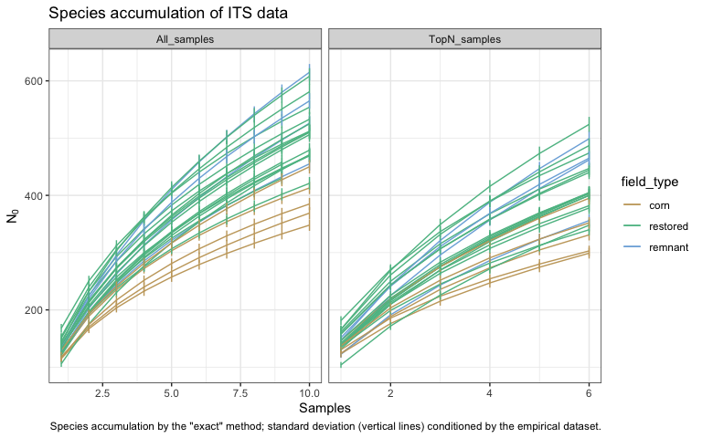
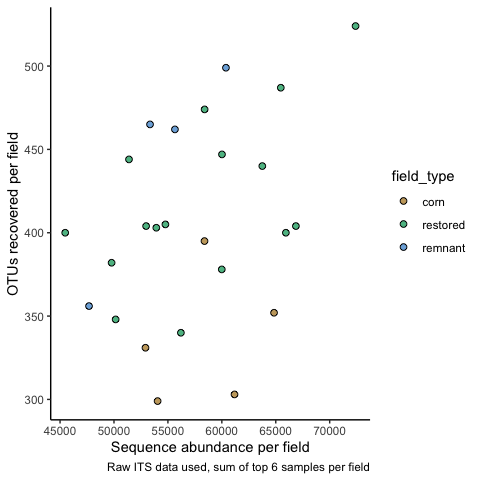
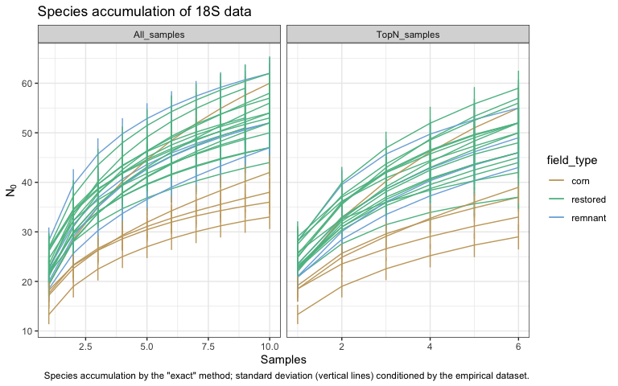
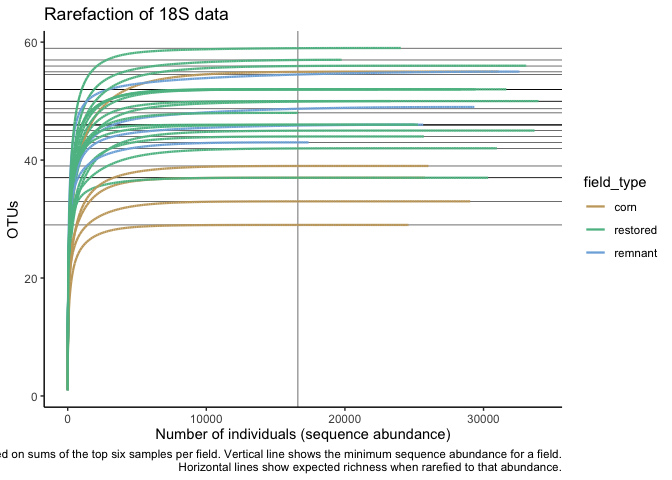

Microbial data: overview of data, diversity statistics
================
Beau Larkin

Last updated: 13 March, 2023

- <a href="#description" id="toc-description">Description</a>
- <a href="#packages-and-libraries"
  id="toc-packages-and-libraries">Packages and libraries</a>
- <a href="#data" id="toc-data">Data</a>
  - <a href="#sites-species-tables"
    id="toc-sites-species-tables">Sites-species tables</a>
  - <a href="#site-metadata-and-design"
    id="toc-site-metadata-and-design">Site metadata and design</a>
- <a href="#functions" id="toc-functions">Functions</a>
  - <a href="#species-accumulation-and-rarefaction"
    id="toc-species-accumulation-and-rarefaction">Species accumulation and
    rarefaction</a>
  - <a href="#calculate-hills-series-on-a-samples-species-matrix"
    id="toc-calculate-hills-series-on-a-samples-species-matrix">Calculate
    Hill’s series on a samples-species matrix</a>
  - <a href="#test-diversity-measures-across-site-types-with-mixed-model"
    id="toc-test-diversity-measures-across-site-types-with-mixed-model">Test
    diversity measures across site types with mixed model</a>
  - <a href="#change-in-diversity-over-time"
    id="toc-change-in-diversity-over-time">Change in diversity over time</a>
- <a href="#analysis-and-results" id="toc-analysis-and-results">Analysis
  and Results</a>
  - <a href="#species-accumulation-and-rarefaction-1"
    id="toc-species-accumulation-and-rarefaction-1">Species accumulation and
    rarefaction</a>
    - <a href="#its-dataset" id="toc-its-dataset">ITS dataset</a>
    - <a href="#amf-dataset" id="toc-amf-dataset">AMF dataset</a>
  - <a href="#otus-prepost-corrections"
    id="toc-otus-prepost-corrections">OTUs pre/post corrections</a>
  - <a href="#microbial-diversity" id="toc-microbial-diversity">Microbial
    diversity</a>
    - <a href="#fungi-its-gene" id="toc-fungi-its-gene">Fungi (ITS gene)</a>
    - <a href="#amf-18s-gene" id="toc-amf-18s-gene">AMF (18S gene)</a>

# Description

Microbial data analyzed here include site-species tables derived from
high-throughput sequencing of ITS and 18S genes and clustering into 97%
similar OTUs and 100% similar SVs. This report presents basic statistics
and visualizations of species accumulation, species richness, Shannon’s
diversity/evenness, and Simpson’s diversity/evenness in the microbial
species data across field types.

- Species accumulation at different sample effort levels
- Rarefaction to determine adequacy of sequencing depth and justify
  rarefication of sequence depth
- Diversity and evenness of microbial communities
- Interpretation of differences in diversity among regions and field
  types, and over years

# Packages and libraries

``` r
packages_needed = c(
    "rsq",
    "lme4",
    "multcomp",
    "tidyverse",
    "vegan",
    "ggbeeswarm",
    "knitr",
    "conflicted",
    "colorspace"
)
packages_installed = packages_needed %in% rownames(installed.packages())
```

``` r
if (any(!packages_installed)) {
    install.packages(packages_needed[!packages_installed])
}
```

``` r
for (i in 1:length(packages_needed)) {
    library(packages_needed[i], character.only = T)
}
```

``` r
conflict_prefer("filter", "dplyr")
conflict_prefer("select", "dplyr")
```

# Data

## Sites-species tables

List *spe* holds average sequence abundances for the top 6 samples per
field. CSV files were produced in `process_data.R`

``` r
spe <- list(
    its_raw = read_csv(paste0(getwd(), "/clean_data/spe_ITS_raw.csv"), 
                        show_col_types = FALSE),
    its_rfy = read_csv(paste0(getwd(), "/clean_data/spe_ITS_rfy.csv"), 
                       show_col_types = FALSE),
    amf_raw = read_csv(paste0(getwd(), "/clean_data/spe_18S_raw.csv"), 
                        show_col_types = FALSE),
    amf_rfy = read_csv(paste0(getwd(), "/clean_data/spe_18S_rfy.csv"), 
                       show_col_types = FALSE)
)
```

## Site metadata and design

``` r
sites <- read_csv(paste0(getwd(), "/clean_data/sites.csv"), show_col_types = FALSE) %>% 
    mutate(field_type = factor(field_type, ordered = TRUE, levels = c("corn", "restored", "remnant"))) %>% 
    select(-lat, -long, -yr_restore, -yr_rank)
```

Object *sac_data* holds raw sequence abundances for each sample. Used
here for species accumulation.

``` r
sac_data <- list(
    its_all = read_csv(paste0(getwd(), "/clean_data/spe_ITS_raw_samps_all.csv"),
                             show_col_types = FALSE),
    its_topn = read_csv(paste0(getwd(), "/clean_data/spe_ITS_raw_samps_topn.csv"),
                              show_col_types = FALSE),
    amf_all = read_csv(paste0(getwd(), "/clean_data/spe_18S_raw_samps_all.csv"),
                             show_col_types = FALSE),
    amf_topn = read_csv(paste0(getwd(), "/clean_data/spe_18S_raw_samps_topn.csv"),
                              show_col_types = FALSE)
) %>% 
    map(. %>% left_join(sites %>% select(field_key, field_name), by = join_by(field_key)) %>% 
            select(field_name, everything(), -field_key, -sample))
```

# Functions

The following functions are used to streamline code and reduce errors:

## Species accumulation and rarefaction

Function `spe_accum()` uses vegan’s `specaccum()` to produce
accumulation curves with the raw, samples-based data.

``` r
spe_accum <- function(data, n_samples=10) {
    samples <- specaccum(data[, -1], conditioned = FALSE)$site
    richness <- specaccum(data[, -1], conditioned = FALSE)$richness
    sd <- specaccum(data[, -1], conditioned = FALSE)$sd
    length(samples) <- n_samples
    length(richness) <- n_samples
    length(sd) <- n_samples
    return(data.frame(samples,richness,sd))
}
```

## Calculate Hill’s series on a samples-species matrix

``` r
calc_diversity <- function(spe) {
    spe_mat <- data.frame(spe, row.names = 1)
    
    N0  <- apply(spe_mat > 0, MARGIN = 1, FUN = sum)
    N1  <- exp(diversity(spe_mat))
    N2  <- diversity(spe_mat, "inv")
    E10 <- N1 / N0
    E20 <- N2 / N0
    
    return(
        data.frame(N0, N1, N2, E10, E20) %>%
            rownames_to_column(var = "field_key") %>%
            mutate(field_key = as.integer(field_key)) %>%
            left_join(sites, by = join_by(field_key)) %>%
            pivot_longer(
                cols = N0:E20,
                names_to = "hill_index",
                values_to = "value"
            ) %>%
            mutate(hill_index = factor(
                hill_index,
                ordered = TRUE,
                levels = c("N0", "N1", "N2", "E10", "E20")
            ))
    )
}
```

## Test diversity measures across site types with mixed model

``` r
test_diversity <- function(data) {
    hills <- levels(data$hill_index)
    for(i in 1:length(hills)) {
        cat("---------------------------------\n")
        print(hills[i])
        cat("---------------------------------\n\n")
        mod_data <- data %>% 
            filter(hill_index == hills[i]) %>% 
            mutate(field_type = factor(field_type, ordered = FALSE))
        mmod <- lmer(value ~ field_type + (1 | region), data = mod_data, REML = FALSE)
        print(mmod)
        cat("\n---------------------------------\n\n")
        mmod_null <- lmer(value ~ 1 + (1 | region), data = mod_data, REML = FALSE)
        print(mmod_null)
        cat("\n---------------------------------\n\n")
        print(anova(mmod, mmod_null))
        mod_tuk <- glht(mmod, linfct = mcp(field_type = "Tukey"), test = adjusted("holm"))
        print(mod_tuk)
        print(cld(mod_tuk))
        cat("\n\n\n")
    }
}
```

## Change in diversity over time

Do Hill’s numbers correlate with years since restoration? This is only
appropriate to attempt in the Blue Mounds region, and even there, it
will be difficult to justify that the area meets the criteria for a
chronosequence.

``` r
test_age <- function(data, caption=NULL) {
    temp_df <-
        data %>%
        filter(field_type == "restored", region == "BM") %>%
        pivot_wider(names_from = hill_index, values_from = value) %>%
        select(-starts_with("field"),-region)
    lapply(temp_df %>% select(-yr_since), function(z) {
        test <-
            cor.test(temp_df$yr_since,
                     z,
                     alternative = "two.sided",
                     method = "pearson")
        return(data.frame(
            cor = round(test$estimate, 2),
            R2 = round(test$estimate^2, 2),
            pval = round(test$p.value, 3)
        ))
    }) %>%
        bind_rows(.id = "hill_num") %>%
        remove_rownames() %>%
        mutate(sig = case_when(pval <= 0.05 ~ "*", TRUE ~ "")) %>%
        kable(format = "pandoc", caption = caption)
}
```

# Analysis and Results

## Species accumulation and rarefaction

Species accumulation is performed using the “exact” method (Kindt, R.,
unpublished) to examine the adequacy of field sampling. Raw ITS and 18S
data with all samples is used and compared with the “topN” data sets.
Some samples didn’t amplify, so samples were dropped from some fields to
equalize sampling effort. As of 2023-03-13, six samples were retained
from each field, but nine would be possible to keep.

### ITS dataset

The custom function `spe_accum()` is applied here.

``` r
its_accum <- bind_rows(
    list(
        All_samples = bind_rows(
            split(sac_data$its_all, ~ field_name) %>% 
                map(spe_accum),
            .id = "field_name"
        ),
        TopN_samples = bind_rows(
            split(sac_data$its_topn, ~ field_name) %>% 
                map(spe_accum, n_samples=6),
            .id = "field_name"
        )
    ),
    .id = "dataset"
) %>% left_join(sites, by = join_by(field_name))
```

``` r
ggplot(its_accum, aes(x = samples, y = richness, group = field_name)) +
    facet_wrap(vars(dataset), scales = "free_x") +
    geom_line(aes(color = field_type)) +
    geom_segment(aes(x = samples, y = richness-sd, xend = samples, yend = richness+sd, color = field_type)) +
    scale_color_discrete_qualitative(palette = "Harmonic") +
    labs(x = "Samples", y = expression(N[0]), 
         title = "Species accumulation of ITS data",
         caption = "Species accumulation by the \"exact\" method; standard deviation (vertical lines) conditioned by the empirical dataset.") +
    theme_bw()
```



All fields continue to add species at the maximum available number of
samples. The only good news might be that they all add species at about
the same rate. But this plot is evidence of undersampling… With only six
samples retained per field, many OTUs are lost, but the curves look a
little flatter. It may be difficult to justify keeping only six samples;
keeping 9 may be smarter.

Rarefaction is performed to assess the relationship between sequence
abundance and species richness, and can help justify the decision to
rarefy to the minimum sequence depth obtained. Caution: function
`rarecurve()` takes some time to execute.

``` r
its_rarecurve <- 
    rarecurve(
        data.frame(spe$its_raw,
                   row.names = 1),
        step = 1,
        tidy = TRUE
    ) %>% 
    mutate(Site = as.numeric(Site)) %>% 
    left_join(sites, by = join_by(Site == field_key))
# Additional data and variables for plotting
depth <- 
    its_rarecurve %>% 
    group_by(Site) %>% 
    slice_max(Species, n = 1) %>% 
    pull(Sample) %>% 
    min()
its_at_depth <- its_rarecurve %>% filter(Sample == depth)
```

``` r
ggplot(its_rarecurve, aes(x = Sample, y = Species, group = Site)) +
    geom_vline(xintercept = depth, linewidth = 0.2) +
    geom_hline(data = its_at_depth, aes(yintercept = Species), linewidth = 0.2) +
    geom_line(aes(color = field_type), linewidth = 0.8) +
    scale_color_discrete_qualitative(palette = "Harmonic") +
    labs(x = "Number of individuals (sequence abundance)",
         y = "OTUs",
         title = "Rarefaction of ITS data",
         caption = "Curves based on sums of the top six samples per field.\nVertical line shows the minimum sequence abundance for a field.\nHorizontal lines show expected richness when rarefied to that abundance.") +
    theme_classic()
```


At the minimum sequencing depth available, there is no consequential
relationship between sequence abundance and species accumulation.

This result can be corroborated by comparing the total sequences
recovered per field vs. the richness recovered per field. A relationship
should not be evident, or fields with more sequences could have bias to
higher richness based on sequencing depth (or it could be real…there’s
no way to know). This can be examined visually. The raw ITS data are
used (these are sums of the top six samples per field as of 2023-03-13).

``` r
its_seqot <- 
    data.frame(
        field_key = spe$its_raw[, 1],
        seqs = apply(spe$its_raw[, -1], 1, sum),
        otus = apply(spe$its_raw[, -1] > 0, 1, sum)
    ) %>% left_join(sites, by = join_by(field_key))
```

``` r
ggplot(its_seqot, aes(x = seqs, y = otus)) +
    geom_point(aes(fill = field_type), shape = 21, size = 2) +
    scale_fill_discrete_qualitative(palette = "Harmonic") +
    labs(x = "Sequence abundance per field",
         y = "OTUs recovered per field",
         caption = "Raw ITS data used, sum of top 6 samples per field") +
    theme_classic()
```



``` r
summary(lm(otus ~ seqs, data = its_seqot))
```

    ## 
    ## Call:
    ## lm(formula = otus ~ seqs, data = its_seqot)
    ## 
    ## Residuals:
    ##      Min       1Q   Median       3Q      Max 
    ## -115.147  -34.027    8.224   54.541   83.505 
    ## 
    ## Coefficients:
    ##              Estimate Std. Error t value Pr(>|t|)  
    ## (Intercept) 2.141e+02  1.015e+02   2.109   0.0460 *
    ## seqs        3.335e-03  1.756e-03   1.899   0.0701 .
    ## ---
    ## Signif. codes:  0 '***' 0.001 '**' 0.01 '*' 0.05 '.' 0.1 ' ' 1
    ## 
    ## Residual standard error: 57.2 on 23 degrees of freedom
    ## Multiple R-squared:  0.1356, Adjusted R-squared:  0.09801 
    ## F-statistic: 3.608 on 1 and 23 DF,  p-value: 0.07012

The relationship is poor and not significant.

### AMF dataset

The custom function `spe_accum()` is applied here.

``` r
amf_accum <- bind_rows(
    list(
        All_samples = bind_rows(
            split(sac_data$amf_all, ~ field_name) %>% 
                map(spe_accum),
            .id = "field_name"
        ),
        TopN_samples = bind_rows(
            split(sac_data$amf_topn, ~ field_name) %>% 
                map(spe_accum, n_samples=6),
            .id = "field_name"
        )
    ),
    .id = "dataset"
) %>% left_join(sites, by = join_by(field_name))
```

``` r
ggplot(amf_accum, aes(x = samples, y = richness, group = field_name)) +
    facet_wrap(vars(dataset), scales = "free_x") +
    geom_line(aes(color = field_type)) +
    geom_segment(aes(x = samples, y = richness-sd, xend = samples, yend = richness+sd, color = field_type)) +
    scale_color_discrete_qualitative(palette = "Harmonic") +
    labs(x = "Samples", y = expression(N[0]), 
         title = "Species accumulation of 18S data",
         caption = "Species accumulation by the \"exact\" method; standard deviation (vertical lines) conditioned by the empirical dataset.") +
    theme_bw()
```



Some fields show very steep curves, which is unexpected. Most fields
show flatter curves that were produced with the ITS data. Truncating the
analysis to six samples per field shows less effect with the 18S data,
but if nine are chosen for the ITS, the same should probably be done
here.

Rarefaction is performed to assess the relationship between sequence
abundance and species richness, and can help justify the decision to
rarefy to the minimum sequence depth obtained. Caution: function
`rarecurve()` takes some time to execute.

``` r
amf_rarecurve <- 
    rarecurve(
        data.frame(spe$amf_raw,
                   row.names = 1),
        step = 1,
        tidy = TRUE
    ) %>% 
    mutate(Site = as.numeric(Site)) %>% 
    left_join(sites, by = join_by(Site == field_key))
# Additional data and variables for plotting
depth <- 
    amf_rarecurve %>% 
    group_by(Site) %>% 
    slice_max(Species, n = 1) %>% 
    pull(Sample) %>% 
    min()
amf_at_depth <- amf_rarecurve %>% filter(Sample == depth)
```

``` r
ggplot(amf_rarecurve, aes(x = Sample, y = Species, group = Site)) +
    geom_vline(xintercept = depth, linewidth = 0.2) +
    geom_hline(data = amf_at_depth, aes(yintercept = Species), linewidth = 0.2) +
    geom_line(aes(color = field_type), linewidth = 0.8) +
    scale_color_discrete_qualitative(palette = "Harmonic") +
    labs(x = "Number of individuals (sequence abundance)",
         y = "OTUs",
         title = "Rarefaction of 18S data",
         caption = "Curves based on sums of the top six samples per field.\nVertical line shows the minimum sequence abundance for a field.\nHorizontal lines show expected richness when rarefied to that abundance.") +
    theme_classic()
```



As expected, at the minimum sequencing depth available, there is no
consequential relationship between sequence abundance and species
accumulation.

## OTUs pre/post corrections

Datasets were corrected for survey effort (min samples per field) and
sequencing depth (min sequences per field). What was the effect of these
actions on the number of OTUs recovered? After rarefying, zero-abundance
and singleton OTUs were removed.  
Few were lost due to rarefying, as we can see by counting columns (less
column 1 because it has field site keys):

``` r
Map(function(x) ncol(x)-1, spe) 
```

    ## $its_raw
    ## [1] 2795
    ## 
    ## $its_rfy
    ## [1] 2750
    ## 
    ## $amf_raw
    ## [1] 147
    ## 
    ## $amf_rfy
    ## [1] 143

It appears that little will be lost in terms of richness or diversity by
rarefying.

## Microbial diversity

Microbial diversity is considered for 18S or ITS gene datasets. For each
set, Hill’s numbers are produced ([Hill
1973](http://doi.wiley.com/10.2307/1934352), [Borcard and Legendere
2018, p. 373](http://link.springer.com/10.1007/978-3-319-71404-2)) and
plotted, with means differences tested using mixed-effects linear models
in `lmer` ([Bates et al. 2015](https://doi.org/10.18637/jss.v067.i01)).
Correlations are then produced to visualize change in diversity trends
over time, with similar mixed-effects tests performed.

The statistical tests are not valid due to pseudoreplication, but are
presented here as an attempt to at least explore some differences and
think more later about how we could present them in a valid way.

Hill’s numbers, brief description:

- $N_{0}$ = species richness
- $N_{1}$ = Shannon’s diversity ($e^H$; excludes rarest species,
  considers the number of “functional” species)
- $N_{2}$ = Simpson’s diversity ($1 / \lambda$; number of “codominant”
  species)
- $E_{10}$ = Shannon’s evenness (Hill’s ratio $N_{1} / N_{0}$)
- $E_{20}$ = Simpson’s evenness (Hill’s ratio $N_{2} / N_{0}$)

``` r
# Rarefied tables only
div <- Map(calc_diversity, spe[c(2,4)])
```

### Fungi (ITS gene)

#### Diversity across field types

Run the linear model and test differences among field types for
diversity.

``` r
test_diversity(div$its_rfy)
```

    ## ---------------------------------
    ## [1] "N0"
    ## ---------------------------------
    ## 
    ## Linear mixed model fit by maximum likelihood  ['lmerMod']
    ## Formula: value ~ field_type + (1 | region)
    ##    Data: mod_data
    ##       AIC       BIC    logLik  deviance  df.resid 
    ##  265.9659  272.0603 -127.9830  255.9659        20 
    ## Random effects:
    ##  Groups   Name        Std.Dev.
    ##  region   (Intercept) 35.95   
    ##  Residual             34.57   
    ## Number of obs: 25, groups:  region, 4
    ## Fixed Effects:
    ##        (Intercept)  field_typerestored   field_typeremnant  
    ##             336.53               76.69              105.47  
    ## 
    ## ---------------------------------
    ## 
    ## Linear mixed model fit by maximum likelihood  ['lmerMod']
    ## Formula: value ~ 1 + (1 | region)
    ##    Data: mod_data
    ##       AIC       BIC    logLik  deviance  df.resid 
    ##  278.3308  281.9874 -136.1654  272.3308        22 
    ## Random effects:
    ##  Groups   Name        Std.Dev.
    ##  region   (Intercept) 30.66   
    ##  Residual             51.31   
    ## Number of obs: 25, groups:  region, 4
    ## Fixed Effects:
    ## (Intercept)  
    ##       402.4  
    ## 
    ## ---------------------------------
    ## 
    ## Data: mod_data
    ## Models:
    ## mmod_null: value ~ 1 + (1 | region)
    ## mmod: value ~ field_type + (1 | region)
    ##           npar    AIC    BIC  logLik deviance  Chisq Df Pr(>Chisq)    
    ## mmod_null    3 278.33 281.99 -136.16   272.33                         
    ## mmod         5 265.97 272.06 -127.98   255.97 16.365  2  0.0002795 ***
    ## ---
    ## Signif. codes:  0 '***' 0.001 '**' 0.01 '*' 0.05 '.' 0.1 ' ' 1
    ## 
    ##   General Linear Hypotheses
    ## 
    ## Multiple Comparisons of Means: Tukey Contrasts
    ## 
    ## 
    ## Linear Hypotheses:
    ##                         Estimate
    ## restored - corn == 0       76.69
    ## remnant - corn == 0       105.47
    ## remnant - restored == 0    28.78
    ## 
    ##     corn restored  remnant 
    ##      "a"      "b"      "b" 
    ## 
    ## 
    ## 
    ## ---------------------------------
    ## [1] "N1"
    ## ---------------------------------
    ## 
    ## Linear mixed model fit by maximum likelihood  ['lmerMod']
    ## Formula: value ~ field_type + (1 | region)
    ##    Data: mod_data
    ##       AIC       BIC    logLik  deviance  df.resid 
    ##  223.0252  229.1195 -106.5126  213.0252        20 
    ## Random effects:
    ##  Groups   Name        Std.Dev.
    ##  region   (Intercept)  7.229  
    ##  Residual             16.101  
    ## Number of obs: 25, groups:  region, 4
    ## Fixed Effects:
    ##        (Intercept)  field_typerestored   field_typeremnant  
    ##              76.90               24.18               27.78  
    ## 
    ## ---------------------------------
    ## 
    ## Linear mixed model fit by maximum likelihood  ['lmerMod']
    ## Formula: value ~ 1 + (1 | region)
    ##    Data: mod_data
    ##       AIC       BIC    logLik  deviance  df.resid 
    ##  227.0132  230.6698 -110.5066  221.0132        22 
    ## Random effects:
    ##  Groups   Name        Std.Dev.
    ##  region   (Intercept)  6.204  
    ##  Residual             19.354  
    ## Number of obs: 25, groups:  region, 4
    ## Fixed Effects:
    ## (Intercept)  
    ##       96.38  
    ## 
    ## ---------------------------------
    ## 
    ## Data: mod_data
    ## Models:
    ## mmod_null: value ~ 1 + (1 | region)
    ## mmod: value ~ field_type + (1 | region)
    ##           npar    AIC    BIC  logLik deviance Chisq Df Pr(>Chisq)  
    ## mmod_null    3 227.01 230.67 -110.51   221.01                      
    ## mmod         5 223.03 229.12 -106.51   213.03 7.988  2    0.01843 *
    ## ---
    ## Signif. codes:  0 '***' 0.001 '**' 0.01 '*' 0.05 '.' 0.1 ' ' 1
    ## 
    ##   General Linear Hypotheses
    ## 
    ## Multiple Comparisons of Means: Tukey Contrasts
    ## 
    ## 
    ## Linear Hypotheses:
    ##                         Estimate
    ## restored - corn == 0      24.185
    ## remnant - corn == 0       27.776
    ## remnant - restored == 0    3.591
    ## 
    ##     corn restored  remnant 
    ##      "a"      "b"      "b" 
    ## 
    ## 
    ## 
    ## ---------------------------------
    ## [1] "N2"
    ## ---------------------------------
    ## 
    ## Linear mixed model fit by maximum likelihood  ['lmerMod']
    ## Formula: value ~ field_type + (1 | region)
    ##    Data: mod_data
    ##      AIC      BIC   logLik deviance df.resid 
    ## 205.2793 211.3737 -97.6397 195.2793       20 
    ## Random effects:
    ##  Groups   Name        Std.Dev.
    ##  region   (Intercept)  2.869  
    ##  Residual             11.726  
    ## Number of obs: 25, groups:  region, 4
    ## Fixed Effects:
    ##        (Intercept)  field_typerestored   field_typeremnant  
    ##              37.51               10.88               11.58  
    ## 
    ## ---------------------------------
    ## 
    ## Linear mixed model fit by maximum likelihood  ['lmerMod']
    ## Formula: value ~ 1 + (1 | region)
    ##    Data: mod_data
    ##      AIC      BIC   logLik deviance df.resid 
    ## 204.5284 208.1850 -99.2642 198.5284       22 
    ## Random effects:
    ##  Groups   Name        Std.Dev.
    ##  region   (Intercept)  1.968  
    ##  Residual             12.687  
    ## Number of obs: 25, groups:  region, 4
    ## Fixed Effects:
    ## (Intercept)  
    ##       46.09  
    ## 
    ## ---------------------------------
    ## 
    ## Data: mod_data
    ## Models:
    ## mmod_null: value ~ 1 + (1 | region)
    ## mmod: value ~ field_type + (1 | region)
    ##           npar    AIC    BIC  logLik deviance Chisq Df Pr(>Chisq)
    ## mmod_null    3 204.53 208.19 -99.264   198.53                    
    ## mmod         5 205.28 211.37 -97.640   195.28 3.249  2      0.197
    ## 
    ##   General Linear Hypotheses
    ## 
    ## Multiple Comparisons of Means: Tukey Contrasts
    ## 
    ## 
    ## Linear Hypotheses:
    ##                         Estimate
    ## restored - corn == 0     10.8772
    ## remnant - corn == 0      11.5756
    ## remnant - restored == 0   0.6984
    ## 
    ##     corn restored  remnant 
    ##      "a"      "a"      "a" 
    ## 
    ## 
    ## 
    ## ---------------------------------
    ## [1] "E10"
    ## ---------------------------------

    ## boundary (singular) fit: see help('isSingular')

    ## Linear mixed model fit by maximum likelihood  ['lmerMod']
    ## Formula: value ~ field_type + (1 | region)
    ##    Data: mod_data
    ##       AIC       BIC    logLik  deviance  df.resid 
    ##  -95.5896  -89.4952   52.7948 -105.5896        20 
    ## Random effects:
    ##  Groups   Name        Std.Dev.
    ##  region   (Intercept) 0.00000 
    ##  Residual             0.02928 
    ## Number of obs: 25, groups:  region, 4
    ## Fixed Effects:
    ##        (Intercept)  field_typerestored   field_typeremnant  
    ##            0.22624             0.01308             0.01418  
    ## optimizer (nloptwrap) convergence code: 0 (OK) ; 0 optimizer warnings; 1 lme4 warnings 
    ## 
    ## ---------------------------------

    ## boundary (singular) fit: see help('isSingular')

    ## Linear mixed model fit by maximum likelihood  ['lmerMod']
    ## Formula: value ~ 1 + (1 | region)
    ##    Data: mod_data
    ##       AIC       BIC    logLik  deviance  df.resid 
    ##  -98.7740  -95.1173   52.3870 -104.7740        22 
    ## Random effects:
    ##  Groups   Name        Std.Dev.
    ##  region   (Intercept) 0.00000 
    ##  Residual             0.02977 
    ## Number of obs: 25, groups:  region, 4
    ## Fixed Effects:
    ## (Intercept)  
    ##      0.2369  
    ## optimizer (nloptwrap) convergence code: 0 (OK) ; 0 optimizer warnings; 1 lme4 warnings 
    ## 
    ## ---------------------------------
    ## 
    ## Data: mod_data
    ## Models:
    ## mmod_null: value ~ 1 + (1 | region)
    ## mmod: value ~ field_type + (1 | region)
    ##           npar     AIC     BIC logLik deviance  Chisq Df Pr(>Chisq)
    ## mmod_null    3 -98.774 -95.117 52.387  -104.77                     
    ## mmod         5 -95.590 -89.495 52.795  -105.59 0.8156  2     0.6651
    ## 
    ##   General Linear Hypotheses
    ## 
    ## Multiple Comparisons of Means: Tukey Contrasts
    ## 
    ## 
    ## Linear Hypotheses:
    ##                         Estimate
    ## restored - corn == 0    0.013076
    ## remnant - corn == 0     0.014175
    ## remnant - restored == 0 0.001099
    ## 
    ##     corn restored  remnant 
    ##      "a"      "a"      "a" 
    ## 
    ## 
    ## 
    ## ---------------------------------
    ## [1] "E20"
    ## ---------------------------------

    ## boundary (singular) fit: see help('isSingular')

    ## Linear mixed model fit by maximum likelihood  ['lmerMod']
    ## Formula: value ~ field_type + (1 | region)
    ##    Data: mod_data
    ##       AIC       BIC    logLik  deviance  df.resid 
    ## -104.5845  -98.4901   57.2923 -114.5845        20 
    ## Random effects:
    ##  Groups   Name        Std.Dev.
    ##  region   (Intercept) 0.00000 
    ##  Residual             0.02446 
    ## Number of obs: 25, groups:  region, 4
    ## Fixed Effects:
    ##        (Intercept)  field_typerestored   field_typeremnant  
    ##           0.110581            0.003464            0.003535  
    ## optimizer (nloptwrap) convergence code: 0 (OK) ; 0 optimizer warnings; 1 lme4 warnings 
    ## 
    ## ---------------------------------

    ## boundary (singular) fit: see help('isSingular')

    ## Linear mixed model fit by maximum likelihood  ['lmerMod']
    ## Formula: value ~ 1 + (1 | region)
    ##    Data: mod_data
    ##       AIC       BIC    logLik  deviance  df.resid 
    ## -108.5038 -104.8471   57.2519 -114.5038        22 
    ## Random effects:
    ##  Groups   Name        Std.Dev.
    ##  region   (Intercept) 0.0000  
    ##  Residual             0.0245  
    ## Number of obs: 25, groups:  region, 4
    ## Fixed Effects:
    ## (Intercept)  
    ##      0.1134  
    ## optimizer (nloptwrap) convergence code: 0 (OK) ; 0 optimizer warnings; 1 lme4 warnings 
    ## 
    ## ---------------------------------
    ## 
    ## Data: mod_data
    ## Models:
    ## mmod_null: value ~ 1 + (1 | region)
    ## mmod: value ~ field_type + (1 | region)
    ##           npar     AIC     BIC logLik deviance  Chisq Df Pr(>Chisq)
    ## mmod_null    3 -108.50 -104.85 57.252  -114.50                     
    ## mmod         5 -104.58  -98.49 57.292  -114.58 0.0808  2     0.9604
    ## 
    ##   General Linear Hypotheses
    ## 
    ## Multiple Comparisons of Means: Tukey Contrasts
    ## 
    ## 
    ## Linear Hypotheses:
    ##                          Estimate
    ## restored - corn == 0    0.0034636
    ## remnant - corn == 0     0.0035352
    ## remnant - restored == 0 0.0000716
    ## 
    ##     corn restored  remnant 
    ##      "a"      "a"      "a"

#### Result: ITS diversity

- $N_{0}$: field type is significant by likelihood ratio test at
  p\<0.001 with region as a random effect. Species richness in corn
  fields was less than restored or remnants, which didn’t differ at
  p=0.05.
- $N_{1}$: field type is significant by likelihood ratio test at p\<0.05
  with region as a random effect. Shannon’s diversity in corn fields was
  less than restored or remnants, which didn’t differ at p=0.05.
- $N_{2}$, $E_{10}$, and $E_{20}$: model fits for both null and full
  models were singular and NS at p\<0.05.

Figure labels are generated and the diversity data are plotted below. An
interaction plot follows, and is useful to consider what the model can
and cannot say about differences in regions and field types.

``` r
labs_its <- data.frame(
    hill_index = factor(c(rep("N0", 3), rep("N1", 3)), 
                        ordered = TRUE, 
                        levels = c("N0", "N1", "N2", "E10", "E20")),
    lab = c("a", "b", "b", "a", "b", "b"),
    xpos = rep(c(1,2,3), 2),
    ypos = rep(c(560, 160), each = 3)
)
```

``` r
ggplot(div$its_rfy, aes(x = field_type, y = value)) +
    facet_wrap(vars(hill_index), scales = "free_y") +
    geom_boxplot(varwidth = TRUE, fill = "gray90", outlier.shape = NA) +
    geom_beeswarm(aes(fill = region), shape = 21, size = 2, dodge.width = 0.2) +
    geom_label(data = labs_its, aes(x = xpos, y = ypos, label = lab), label.size = NA) +
    labs(x = "", y = "Index value", title = "TGP microbial diversity (Hill's), ITS, 97% OTU",
         caption = "N0-richness, N1-e^Shannon, N2-Simpson, E10=N1/N0, E20=N2/N0, width=n,\nletters indicate significant differences at p<0.05") +
    scale_fill_discrete_qualitative(palette = "Dark3") +
    theme_bw()
```


Richness and evenness parameters increase from corn, to restored, to
remnant fields, and some support exists for this pattern to occur across
regions.

``` r
ggplot(
    div$its_rfy %>% 
        group_by(field_type, region, hill_index) %>% 
        summarize(avg_value = mean(value), .groups = "drop"),
    aes(x = field_type, y = avg_value, group = region)) +
    facet_wrap(vars(hill_index), scales = "free_y") +
    geom_line(aes(linetype = region)) +
    geom_point(aes(fill = region), size = 2, shape = 21) +
    labs(x = "", y = "Average value", title = "Interaction plot of Hill's numbers, ITS, 97% OTU") +
    scale_fill_discrete_qualitative(palette = "Dark3") +
    theme_bw()
```


#### Key observations:

- The restored field at LP contains very high diversity, co-dominance,
  and evenness of fungi.
- The restored field at FG contains low diversity, co-dominance, and
  evenness.
- Interactions are less an issue with $N_{0}$ and $N_{1}$

#### Diversity over time

Next, trends in diversity are correlated with years since restoration.
This can only be attempted with Fermi and Blue Mounds sites; elsewhere,
blocks cannot be statistically accounted for because treatments aren’t
replicated within them.

``` r
div$its_rfy %>% 
    filter(field_type == "restored", 
           hill_index %in% c("N0", "N1", "N2"),
           region %in% c("BM", "FL")) %>% 
    ggplot(aes(x = yr_since, y = value)) +
    facet_grid(cols = vars(region), rows = vars(hill_index), scales = "free_y") +
    geom_point(shape = 21, fill = "gray50", size = 2) +
    labs(x = "Years since restoration", y = "index value", title = "TGP microbial diversity (Hill's) over time, ITS, 97% OTU",
         caption = "N0-richness, N1-e^Shannon, N2-Simpson") +
    theme_bw()
```


If the relationship exists, it is in Blue Mounds only.

It’s probably justified to correlate diversity with field age in Blue
Mounds’s restored fields. A Pearson’s correlation is used:

``` r
test_age(div$its_rfy, 
         caption = "Correlation between Hill's numbers and field age in the Blue Mounds region: ITS, 97% OTU")
```

| hill_num |   cor |   R2 |  pval | sig |
|:---------|------:|-----:|------:|:----|
| N0       | -0.33 | 0.11 | 0.466 |     |
| N1       | -0.68 | 0.46 | 0.095 |     |
| N2       | -0.67 | 0.45 | 0.100 |     |
| E10      | -0.79 | 0.63 | 0.033 | \*  |
| E20      | -0.67 | 0.45 | 0.099 |     |

Correlation between Hill’s numbers and field age in the Blue Mounds
region: ITS, 97% OTU

Hill’s $N_{1}$ decreases with age since restoration in the Blue Mounds
area, but the decline isn’t significant ($R^2$=-0.67, p\>0.05). It’s
driven primarily by an old restored field, I’m guessing Karla Ott’s
grass plantation.  
This is odd and points to a confounding effect driven by difference in
restoration strategy over time. It’s possible that site differences
(soils, etc.) also confound this relationship. It’s possible that we
cannot attempt to present this as a time-based result at all. Or, maybe
the number of functionally dominant species slowly declines over time
due to lack of disturbance and substrate diversity.

That diversity metrics aren’t changing over time, or are possibly
declining over time after restoration is concerning and worth
mentioning.

In any case, let’s take a look at Shannon’s diversity over time in Blue
Mounds’ restored fields.

``` r
div$its_rfy %>% 
    filter(region == "BM", field_type == "restored", hill_index == "N1") %>% 
    ggplot(aes(x = yr_since, y = value)) +
    geom_smooth(method = "lm", se = TRUE, linewidth = 0.8, fill = "gray70") +
    geom_label(aes(label = field_name)) +
    labs(x = "Years since restoration", y = expression("Shannon's diversity"~(N[1]))) +
    theme_classic()
```


Karla Ott’s field was almost exclusively dominated by big bluestem,
possibly leading to a simpler microbial community. That field has too
much leverage on this plot.  
Right now, my interpretation is that restoration strategies changed over
time and although restored plant communities persisted, microbial
communities simplified over time. Immediately after restoration,
microbial diversity increased rapidly and was not sustained because the
soil properties ultimately didn’t change very much.

Site factors (soil type) are hard to tease out, but in later analyses we
will try using measured soil chemical properties.

### AMF (18S gene)

Run the linear model and test differences among field types for
diversity.

``` r
test_diversity(div$amf_rfy)
```

    ## ---------------------------------
    ## [1] "N0"
    ## ---------------------------------
    ## 
    ## Linear mixed model fit by maximum likelihood  ['lmerMod']
    ## Formula: value ~ field_type + (1 | region)
    ##    Data: mod_data
    ##      AIC      BIC   logLik deviance df.resid 
    ## 171.4885 177.5829 -80.7442 161.4885       20 
    ## Random effects:
    ##  Groups   Name        Std.Dev.
    ##  region   (Intercept) 0.7095  
    ##  Residual             6.0759  
    ## Number of obs: 25, groups:  region, 4
    ## Fixed Effects:
    ##        (Intercept)  field_typerestored   field_typeremnant  
    ##              38.35               10.82                9.15  
    ## 
    ## ---------------------------------

    ## boundary (singular) fit: see help('isSingular')

    ## Linear mixed model fit by maximum likelihood  ['lmerMod']
    ## Formula: value ~ 1 + (1 | region)
    ##    Data: mod_data
    ##      AIC      BIC   logLik deviance df.resid 
    ## 177.3295 180.9861 -85.6647 171.3295       22 
    ## Random effects:
    ##  Groups   Name        Std.Dev.
    ##  region   (Intercept) 0.000   
    ##  Residual             7.446   
    ## Number of obs: 25, groups:  region, 4
    ## Fixed Effects:
    ## (Intercept)  
    ##        46.8  
    ## optimizer (nloptwrap) convergence code: 0 (OK) ; 0 optimizer warnings; 1 lme4 warnings 
    ## 
    ## ---------------------------------
    ## 
    ## Data: mod_data
    ## Models:
    ## mmod_null: value ~ 1 + (1 | region)
    ## mmod: value ~ field_type + (1 | region)
    ##           npar    AIC    BIC  logLik deviance Chisq Df Pr(>Chisq)   
    ## mmod_null    3 177.33 180.99 -85.665   171.33                       
    ## mmod         5 171.49 177.58 -80.744   161.49 9.841  2   0.007296 **
    ## ---
    ## Signif. codes:  0 '***' 0.001 '**' 0.01 '*' 0.05 '.' 0.1 ' ' 1
    ## 
    ##   General Linear Hypotheses
    ## 
    ## Multiple Comparisons of Means: Tukey Contrasts
    ## 
    ## 
    ## Linear Hypotheses:
    ##                         Estimate
    ## restored - corn == 0      10.822
    ## remnant - corn == 0        9.150
    ## remnant - restored == 0   -1.672
    ## 
    ##     corn restored  remnant 
    ##      "a"      "b"     "ab" 
    ## 
    ## 
    ## 
    ## ---------------------------------
    ## [1] "N1"
    ## ---------------------------------
    ## 
    ## Linear mixed model fit by maximum likelihood  ['lmerMod']
    ## Formula: value ~ field_type + (1 | region)
    ##    Data: mod_data
    ##      AIC      BIC   logLik deviance df.resid 
    ## 130.0051 136.0995 -60.0026 120.0051       20 
    ## Random effects:
    ##  Groups   Name        Std.Dev.
    ##  region   (Intercept) 0.4095  
    ##  Residual             2.6381  
    ## Number of obs: 25, groups:  region, 4
    ## Fixed Effects:
    ##        (Intercept)  field_typerestored   field_typeremnant  
    ##             13.946               6.819               9.893  
    ## 
    ## ---------------------------------

    ## boundary (singular) fit: see help('isSingular')

    ## Linear mixed model fit by maximum likelihood  ['lmerMod']
    ## Formula: value ~ 1 + (1 | region)
    ##    Data: mod_data
    ##      AIC      BIC   logLik deviance df.resid 
    ## 147.9101 151.5667 -70.9550 141.9101       22 
    ## Random effects:
    ##  Groups   Name        Std.Dev.
    ##  region   (Intercept) 0.000   
    ##  Residual             4.134   
    ## Number of obs: 25, groups:  region, 4
    ## Fixed Effects:
    ## (Intercept)  
    ##       19.92  
    ## optimizer (nloptwrap) convergence code: 0 (OK) ; 0 optimizer warnings; 1 lme4 warnings 
    ## 
    ## ---------------------------------
    ## 
    ## Data: mod_data
    ## Models:
    ## mmod_null: value ~ 1 + (1 | region)
    ## mmod: value ~ field_type + (1 | region)
    ##           npar    AIC    BIC  logLik deviance  Chisq Df Pr(>Chisq)    
    ## mmod_null    3 147.91 151.57 -70.955   141.91                         
    ## mmod         5 130.00 136.10 -60.003   120.00 21.905  2  1.751e-05 ***
    ## ---
    ## Signif. codes:  0 '***' 0.001 '**' 0.01 '*' 0.05 '.' 0.1 ' ' 1
    ## 
    ##   General Linear Hypotheses
    ## 
    ## Multiple Comparisons of Means: Tukey Contrasts
    ## 
    ## 
    ## Linear Hypotheses:
    ##                         Estimate
    ## restored - corn == 0       6.819
    ## remnant - corn == 0        9.893
    ## remnant - restored == 0    3.074
    ## 
    ##     corn restored  remnant 
    ##      "a"      "b"      "b" 
    ## 
    ## 
    ## 
    ## ---------------------------------
    ## [1] "N2"
    ## ---------------------------------

    ## boundary (singular) fit: see help('isSingular')

    ## Linear mixed model fit by maximum likelihood  ['lmerMod']
    ## Formula: value ~ field_type + (1 | region)
    ##    Data: mod_data
    ##      AIC      BIC   logLik deviance df.resid 
    ## 126.1402 132.2345 -58.0701 116.1402       20 
    ## Random effects:
    ##  Groups   Name        Std.Dev.
    ##  region   (Intercept) 0.000   
    ##  Residual             2.469   
    ## Number of obs: 25, groups:  region, 4
    ## Fixed Effects:
    ##        (Intercept)  field_typerestored   field_typeremnant  
    ##              9.672               4.746               7.531  
    ## optimizer (nloptwrap) convergence code: 0 (OK) ; 0 optimizer warnings; 1 lme4 warnings 
    ## 
    ## ---------------------------------

    ## boundary (singular) fit: see help('isSingular')

    ## Linear mixed model fit by maximum likelihood  ['lmerMod']
    ## Formula: value ~ 1 + (1 | region)
    ##    Data: mod_data
    ##      AIC      BIC   logLik deviance df.resid 
    ## 138.1984 141.8550 -66.0992 132.1984       22 
    ## Random effects:
    ##  Groups   Name        Std.Dev.
    ##  region   (Intercept) 0.000   
    ##  Residual             3.404   
    ## Number of obs: 25, groups:  region, 4
    ## Fixed Effects:
    ## (Intercept)  
    ##       13.91  
    ## optimizer (nloptwrap) convergence code: 0 (OK) ; 0 optimizer warnings; 1 lme4 warnings 
    ## 
    ## ---------------------------------
    ## 
    ## Data: mod_data
    ## Models:
    ## mmod_null: value ~ 1 + (1 | region)
    ## mmod: value ~ field_type + (1 | region)
    ##           npar    AIC    BIC  logLik deviance  Chisq Df Pr(>Chisq)    
    ## mmod_null    3 138.20 141.85 -66.099   132.20                         
    ## mmod         5 126.14 132.24 -58.070   116.14 16.058  2  0.0003258 ***
    ## ---
    ## Signif. codes:  0 '***' 0.001 '**' 0.01 '*' 0.05 '.' 0.1 ' ' 1
    ## 
    ##   General Linear Hypotheses
    ## 
    ## Multiple Comparisons of Means: Tukey Contrasts
    ## 
    ## 
    ## Linear Hypotheses:
    ##                         Estimate
    ## restored - corn == 0       4.746
    ## remnant - corn == 0        7.531
    ## remnant - restored == 0    2.785
    ## 
    ##     corn restored  remnant 
    ##      "a"      "b"      "b" 
    ## 
    ## 
    ## 
    ## ---------------------------------
    ## [1] "E10"
    ## ---------------------------------

    ## boundary (singular) fit: see help('isSingular')

    ## Linear mixed model fit by maximum likelihood  ['lmerMod']
    ## Formula: value ~ field_type + (1 | region)
    ##    Data: mod_data
    ##      AIC      BIC   logLik deviance df.resid 
    ## -61.8442 -55.7499  35.9221 -71.8442       20 
    ## Random effects:
    ##  Groups   Name        Std.Dev.
    ##  region   (Intercept) 0.00000 
    ##  Residual             0.05751 
    ## Number of obs: 25, groups:  region, 4
    ## Fixed Effects:
    ##        (Intercept)  field_typerestored   field_typeremnant  
    ##            0.37258             0.05344             0.12780  
    ## optimizer (nloptwrap) convergence code: 0 (OK) ; 0 optimizer warnings; 1 lme4 warnings 
    ## 
    ## ---------------------------------

    ## boundary (singular) fit: see help('isSingular')

    ## Linear mixed model fit by maximum likelihood  ['lmerMod']
    ## Formula: value ~ 1 + (1 | region)
    ##    Data: mod_data
    ##      AIC      BIC   logLik deviance df.resid 
    ## -56.7326 -53.0759  31.3663 -62.7326       22 
    ## Random effects:
    ##  Groups   Name        Std.Dev.
    ##  region   (Intercept) 0.000   
    ##  Residual             0.069   
    ## Number of obs: 25, groups:  region, 4
    ## Fixed Effects:
    ## (Intercept)  
    ##      0.4272  
    ## optimizer (nloptwrap) convergence code: 0 (OK) ; 0 optimizer warnings; 1 lme4 warnings 
    ## 
    ## ---------------------------------
    ## 
    ## Data: mod_data
    ## Models:
    ## mmod_null: value ~ 1 + (1 | region)
    ## mmod: value ~ field_type + (1 | region)
    ##           npar     AIC     BIC logLik deviance  Chisq Df Pr(>Chisq)  
    ## mmod_null    3 -56.733 -53.076 31.366  -62.733                       
    ## mmod         5 -61.844 -55.750 35.922  -71.844 9.1117  2    0.01051 *
    ## ---
    ## Signif. codes:  0 '***' 0.001 '**' 0.01 '*' 0.05 '.' 0.1 ' ' 1
    ## 
    ##   General Linear Hypotheses
    ## 
    ## Multiple Comparisons of Means: Tukey Contrasts
    ## 
    ## 
    ## Linear Hypotheses:
    ##                         Estimate
    ## restored - corn == 0     0.05344
    ## remnant - corn == 0      0.12780
    ## remnant - restored == 0  0.07436
    ## 
    ##     corn restored  remnant 
    ##      "a"     "ab"      "b" 
    ## 
    ## 
    ## 
    ## ---------------------------------
    ## [1] "E20"
    ## ---------------------------------

    ## boundary (singular) fit: see help('isSingular')

    ## Linear mixed model fit by maximum likelihood  ['lmerMod']
    ## Formula: value ~ field_type + (1 | region)
    ##    Data: mod_data
    ##      AIC      BIC   logLik deviance df.resid 
    ## -60.2546 -54.1603  35.1273 -70.2546       20 
    ## Random effects:
    ##  Groups   Name        Std.Dev.
    ##  region   (Intercept) 0.00000 
    ##  Residual             0.05937 
    ## Number of obs: 25, groups:  region, 4
    ## Fixed Effects:
    ##        (Intercept)  field_typerestored   field_typeremnant  
    ##            0.25979             0.03741             0.10048  
    ## optimizer (nloptwrap) convergence code: 0 (OK) ; 0 optimizer warnings; 1 lme4 warnings 
    ## 
    ## ---------------------------------

    ## boundary (singular) fit: see help('isSingular')

    ## Linear mixed model fit by maximum likelihood  ['lmerMod']
    ## Formula: value ~ 1 + (1 | region)
    ##    Data: mod_data
    ##      AIC      BIC   logLik deviance df.resid 
    ## -58.5150 -54.8584  32.2575 -64.5150       22 
    ## Random effects:
    ##  Groups   Name        Std.Dev.
    ##  region   (Intercept) 0.00000 
    ##  Residual             0.06659 
    ## Number of obs: 25, groups:  region, 4
    ## Fixed Effects:
    ## (Intercept)  
    ##      0.2998  
    ## optimizer (nloptwrap) convergence code: 0 (OK) ; 0 optimizer warnings; 1 lme4 warnings 
    ## 
    ## ---------------------------------
    ## 
    ## Data: mod_data
    ## Models:
    ## mmod_null: value ~ 1 + (1 | region)
    ## mmod: value ~ field_type + (1 | region)
    ##           npar     AIC     BIC logLik deviance  Chisq Df Pr(>Chisq)  
    ## mmod_null    3 -58.515 -54.858 32.258  -64.515                       
    ## mmod         5 -60.255 -54.160 35.127  -70.255 5.7396  2    0.05671 .
    ## ---
    ## Signif. codes:  0 '***' 0.001 '**' 0.01 '*' 0.05 '.' 0.1 ' ' 1
    ## 
    ##   General Linear Hypotheses
    ## 
    ## Multiple Comparisons of Means: Tukey Contrasts
    ## 
    ## 
    ## Linear Hypotheses:
    ##                         Estimate
    ## restored - corn == 0     0.03741
    ## remnant - corn == 0      0.10048
    ## remnant - restored == 0  0.06307
    ## 
    ##     corn restored  remnant 
    ##      "a"     "ab"      "b"

#### Result: AMF diversity

Despite apparent trends across field types, variances are large and
interactions apparent. All model fits are questionable due to
[singularity](https://rdrr.io/cran/lme4/man/isSingular.html). The
following results and plots are provisional and included here for
consideration only.

- $N_{0}$: Species richness differences by field type are significant by
  likelihood ratio test at p\<0.005 with region as a random effect.
  Species richness in corn fields was less than restored, and neither
  differed from remnants at p=0.05.
- $N_{1}$: field type is significant by likelihood ratio test at
  p\<0.001 with region as a random effect. Shannon’s diversity in corn
  fields was less than restored or remnants, which didn’t differ at
  p=0.05.
- $N_{2}$: field type is significant by likelihood ratio test at
  p\<0.001 with region as a random effect. Restored and remnant fields
  host a larger group of co-dominant AMF than are found in cornfields
  (p=0.05).
- $E_{10}$: field type is significant by likelihood ratio test at
  p\<0.05 with region as a random effect. Weak support for higher
  evenness of functionally abundant species in remnant fields was found
  (p\<0.05).
- $E_{20}$: Similar trend as $E_{10}$ but NS (p\>0.05).

Figure labels are generated and the diversity data are plotted below. An
interaction plot follows, and is useful to consider what the model can
and cannot say about differences in regions and field types.

``` r
labs_amf <- data.frame(
    hill_index = factor(c(rep("N0", 3), rep("N1", 3), rep("N2", 3), rep("E10", 3)), 
                        ordered = TRUE, 
                        levels = c("N0", "N1", "N2", "E10", "E20")),
    lab = c("a", "b", "ab", "a", "b", "b", "a", "b", "b", "a", "ab", "b"),
    xpos = rep(c(1,2,3), 4),
    ypos = rep(c(64, 33, 25, 0.59), each = 3)
)
```

``` r
ggplot(div$amf_rfy, aes(x = field_type, y = value)) +
    facet_wrap(vars(hill_index), scales = "free_y") +
    geom_boxplot(varwidth = TRUE, fill = "gray90", outlier.shape = NA) +
    geom_beeswarm(aes(fill = region), shape = 21, size = 2, dodge.width = 0.2) +
    geom_label(data = labs_amf, aes(x = xpos, y = ypos, label = lab), label.size = NA) +
    labs(x = "", y = "Index value", title = "TGP microbial diversity (Hill's), AMF (18S), 97% OTU",
         caption = "N0-richness, N1-e^Shannon, N2-Simpson, E10=N1/N0, E20=N2/N0, width=n,\nletters indicate significant differences at p<0.05") +
    scale_fill_discrete_qualitative(palette = "Dark3") +
    theme_bw()
```


Richness increases from corn, to restored, to remnant fields, and some
support exists for this pattern to occur across regions. The trend is
weakest with $N_{0}$, suggesting that both restored and remnant soils
contain more functionally abundant and co-dominant species than are
found in cornfields, but some cornfields have “long tails” of rare
species. Wide variances stifle inferences. The trend detected in
evenness suggests that a few weedy AMF species dominate cornfields but
most restored fields host more balanced communities that are more
similar to remnants.

``` r
ggplot(
    div$amf_rfy %>% 
        group_by(field_type, region, hill_index) %>% 
        summarize(avg_value = mean(value), .groups = "drop"),
    aes(x = field_type, y = avg_value, group = region)) +
    facet_wrap(vars(hill_index), scales = "free_y") +
    geom_line(aes(linetype = region)) +
    geom_point(aes(fill = region), size = 2, shape = 21) +
    labs(x = "", y = "Average value", title = "Interaction plot of Hill's numbers, AMF (18S), 97% OTU") +
    scale_fill_discrete_qualitative(palette = "Dark3") +
    theme_bw()
```


#### Key observations:

- Cornfields differ from restored and remnant fields, with lower
  richness, fewer dominant species, and greater dominance of those
  species.
- Differences between restored and remnant fields change directions
  based on region, with FL and LP matching the hypothesized pattern but
  BM and FG reversing it.
- Particular species may be strong interactors here.

#### Diversity over time at Blue Mounds (AMF)

It’s probably justified to correlate diversity with field age in Blue
Mounds’s restored fields. A Pearson’s correlation is used:

``` r
test_age(div$amf_rfy, caption = "Correlation between Hill's numbers and field age in the Blue Mounds region: AMF (18S), 97% OTU")
```

| hill_num |   cor |   R2 |  pval | sig |
|:---------|------:|-----:|------:|:----|
| N0       |  0.16 | 0.03 | 0.725 |     |
| N1       | -0.25 | 0.06 | 0.593 |     |
| N2       | -0.34 | 0.12 | 0.449 |     |
| E10      | -0.28 | 0.08 | 0.546 |     |
| E20      | -0.33 | 0.11 | 0.468 |     |

Correlation between Hill’s numbers and field age in the Blue Mounds
region: AMF (18S), 97% OTU

The relationships are too weak to examine further.
