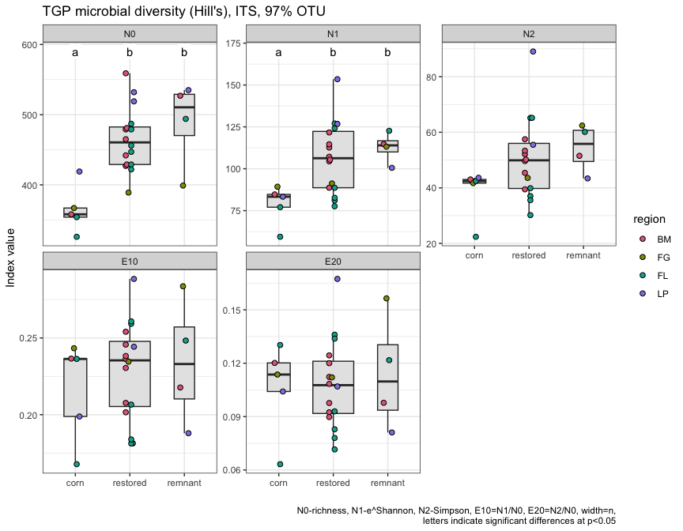
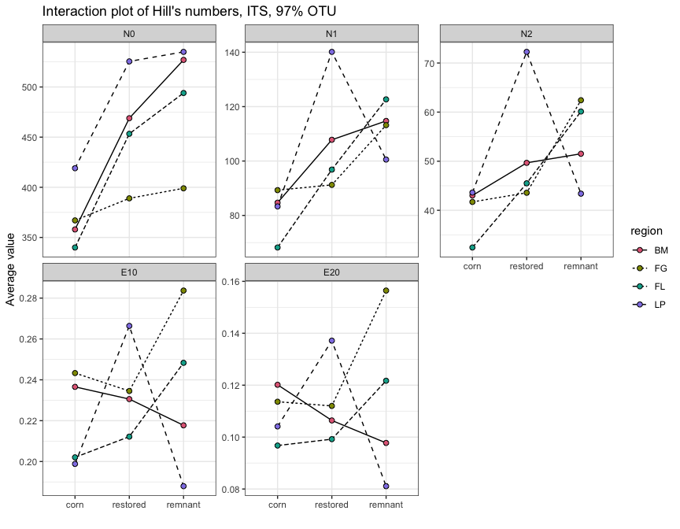
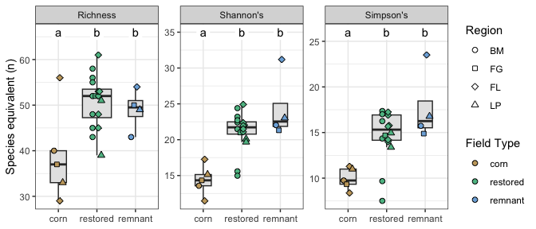

Microbial data: overview of data, diversity statistics
================
Beau Larkin

Last updated: 02 January, 2024

- [Description](#description)
- [Packages and libraries](#packages-and-libraries)
- [Data](#data)
  - [Sites-species tables](#sites-species-tables)
  - [Site metadata and design](#site-metadata-and-design)
- [Functions](#functions)
  - [Calculate Hill’s series on a samples-species
    matrix](#calculate-hills-series-on-a-samples-species-matrix)
  - [Test diversity measures across site types with mixed
    model](#test-diversity-measures-across-site-types-with-mixed-model)
  - [Change in diversity over time](#change-in-diversity-over-time)
- [Analysis and Results](#analysis-and-results)
  - [OTUs pre/post corrections](#otus-prepost-corrections)
  - [Microbial diversity](#microbial-diversity)
    - [Fungi (ITS gene)](#fungi-its-gene)
    - [AMF (18S gene)](#amf-18s-gene)

# Description

Microbial data analyzed here include site-species tables derived from
high-throughput sequencing of ITS and 18S genes and clustering into 97%
similar OTUs. This report presents basic statistics and visualizations
of species richness, Shannon’s diversity/evenness, and Simpson’s
diversity/evenness in the microbial species data across field types.

- Diversity and evenness of microbial communities
- Interpretation of differences in diversity among regions and field
  types, and over years

# Packages and libraries

``` r
packages_needed = c(
    "rsq",
    "lme4",
    "multcomp",
    "tidyverse",
    "vegan",
    "ggbeeswarm",
    "knitr",
    "conflicted",
    "colorspace"
)
packages_installed = packages_needed %in% rownames(installed.packages())
```

``` r
if (any(!packages_installed)) {
    install.packages(packages_needed[!packages_installed])
}
```

``` r
for (i in 1:length(packages_needed)) {
    library(packages_needed[i], character.only = T)
}
```

``` r
conflict_prefer("filter", "dplyr")
conflict_prefer("select", "dplyr")
```

# Data

## Sites-species tables

List *spe* holds average sequence abundances for the top 6 samples per
field. CSV files were produced in `process_data.R`

``` r
spe <- list(
    its_raw = read_csv(paste0(getwd(), "/clean_data/spe_ITS_raw.csv"), 
                        show_col_types = FALSE),
    its_rfy = read_csv(paste0(getwd(), "/clean_data/spe_ITS_rfy.csv"), 
                       show_col_types = FALSE),
    amf_raw = read_csv(paste0(getwd(), "/clean_data/spe_18S_raw.csv"), 
                        show_col_types = FALSE),
    amf_rfy = read_csv(paste0(getwd(), "/clean_data/spe_18S_rfy.csv"), 
                       show_col_types = FALSE)
)
```

## Site metadata and design

``` r
sites <- read_csv(paste0(getwd(), "/clean_data/sites.csv"), show_col_types = FALSE) %>% 
    mutate(field_type = factor(field_type, ordered = TRUE, levels = c("corn", "restored", "remnant"))) %>% 
    select(-lat, -long, -yr_restore, -yr_rank)
```

# Functions

The following functions are used to streamline code and reduce errors:

## Calculate Hill’s series on a samples-species matrix

``` r
calc_diversity <- function(spe) {
    spe_mat <- data.frame(spe, row.names = 1)
    
    N0  <- apply(spe_mat > 0, MARGIN = 1, FUN = sum)
    N1  <- exp(diversity(spe_mat))
    N2  <- diversity(spe_mat, "inv")
    E10 <- N1 / N0
    E20 <- N2 / N0
    
    return(
        data.frame(N0, N1, N2, E10, E20) %>%
            rownames_to_column(var = "field_key") %>%
            mutate(field_key = as.integer(field_key)) %>%
            left_join(sites, by = join_by(field_key)) %>%
            pivot_longer(
                cols = N0:E20,
                names_to = "hill_index",
                values_to = "value"
            ) %>%
            mutate(hill_index = factor(
                hill_index,
                ordered = TRUE,
                levels = c("N0", "N1", "N2", "E10", "E20")
            ))
    )
}
```

## Test diversity measures across site types with mixed model

``` r
test_diversity <- function(data) {
    hills <- levels(data$hill_index)
    for(i in 1:length(hills)) {
        cat("---------------------------------\n")
        print(hills[i])
        cat("---------------------------------\n\n")
        mod_data <- data %>% 
            filter(hill_index == hills[i]) %>% 
            mutate(field_type = factor(field_type, ordered = FALSE))
        mmod <- lmer(value ~ field_type + (1 | region), data = mod_data, REML = FALSE)
        print(mmod)
        cat("\n---------------------------------\n\n")
        mmod_null <- lmer(value ~ 1 + (1 | region), data = mod_data, REML = FALSE)
        print(mmod_null)
        cat("\n---------------------------------\n\n")
        print(anova(mmod, mmod_null))
        mod_tuk <- glht(mmod, linfct = mcp(field_type = "Tukey"), test = adjusted("holm"))
        print(mod_tuk)
        print(cld(mod_tuk))
        cat("\n\n\n")
    }
}
```

## Change in diversity over time

Do Hill’s numbers correlate with years since restoration? This may only
be appropriate to attempt in the Blue Mounds region, and even there, it
may be difficult to justify that the area meets the criteria for a
chronosequence.

``` r
test_age <- function(data, caption=NULL) {
    temp_df <-
        data %>%
        filter(field_type == "restored", region == "BM") %>%
        pivot_wider(names_from = hill_index, values_from = value) %>%
        select(-starts_with("field"),-region)
    lapply(temp_df %>% select(-yr_since), function(z) {
        test <-
            cor.test(temp_df$yr_since,
                     z,
                     alternative = "two.sided",
                     method = "pearson")
        return(data.frame(
            cor = round(test$estimate, 2),
            R2 = round(test$estimate^2, 2),
            pval = round(test$p.value, 3)
        ))
    }) %>%
        bind_rows(.id = "hill_num") %>%
        remove_rownames() %>%
        mutate(sig = case_when(pval <= 0.05 ~ "*", TRUE ~ "")) %>%
        kable(format = "pandoc", caption = caption)
}
```

# Analysis and Results

## OTUs pre/post corrections

Datasets were corrected for survey effort (min samples per field) and
sequencing depth (min sequences per field). What was the effect of these
actions on the number of OTUs recovered? After rarefying, zero-abundance
OTUs were removed.  
Few were lost due to rarefying, as we can see by counting columns (less
column 1 because it has field site keys):

``` r
Map(function(x) ncol(x)-1, spe) 
```

    ## $its_raw
    ## [1] 2895
    ## 
    ## $its_rfy
    ## [1] 2889
    ## 
    ## $amf_raw
    ## [1] 146
    ## 
    ## $amf_rfy
    ## [1] 145

It appears that little will be lost in terms of richness or diversity by
rarefying.

## Microbial diversity

Microbial diversity is considered for 18S or ITS gene datasets. For each
set, Hill’s numbers are produced ([Hill
1973](http://doi.wiley.com/10.2307/1934352), [Borcard and Legendere
2018, p. 373](http://link.springer.com/10.1007/978-3-319-71404-2)) and
plotted, with means differences tested using mixed-effects linear models
in `lmer` ([Bates et al. 2015](https://doi.org/10.18637/jss.v067.i01)).
Correlations are then produced to visualize change in diversity trends
over time, with similar mixed-effects tests performed.

The statistical tests are on shaky ground due to imbalance, but are
presented here as an attempt to at least explore some differences and
think more later about how we could present them in a more valid way.

Hill’s numbers, brief description:

- $N_{0}$ = species richness
- $N_{1}$ = Shannon’s diversity ($e^H$; excludes rarest species,
  considers the number of “functional” species)
- $N_{2}$ = Simpson’s diversity ($1 / \lambda$; number of “codominant”
  species)
- $E_{10}$ = Shannon’s evenness (Hill’s ratio $N_{1} / N_{0}$)
- $E_{20}$ = Simpson’s evenness (Hill’s ratio $N_{2} / N_{0}$)

``` r
# Rarefied tables only
div <- Map(calc_diversity, spe[c(2,4)])
```

### Fungi (ITS gene)

#### Diversity across field types

Run the linear model and test differences among field types for
diversity.

``` r
test_diversity(div$its_rfy)
```

    ## ---------------------------------
    ## [1] "N0"
    ## ---------------------------------
    ## 
    ## Linear mixed model fit by maximum likelihood  ['lmerMod']
    ## Formula: value ~ field_type + (1 | region)
    ##    Data: mod_data
    ##       AIC       BIC    logLik  deviance  df.resid 
    ##  264.5523  270.6467 -127.2761  254.5523        20 
    ## Random effects:
    ##  Groups   Name        Std.Dev.
    ##  region   (Intercept) 33.50   
    ##  Residual             33.83   
    ## Number of obs: 25, groups:  region, 4
    ## Fixed Effects:
    ##        (Intercept)  field_typerestored   field_typeremnant  
    ##             366.76               96.21              121.99  
    ## 
    ## ---------------------------------
    ## 
    ## Linear mixed model fit by maximum likelihood  ['lmerMod']
    ## Formula: value ~ 1 + (1 | region)
    ##    Data: mod_data
    ##       AIC       BIC    logLik  deviance  df.resid 
    ##  281.9877  285.6443 -137.9938  275.9877        22 
    ## Random effects:
    ##  Groups   Name        Std.Dev.
    ##  region   (Intercept) 23.20   
    ##  Residual             57.19   
    ## Number of obs: 25, groups:  region, 4
    ## Fixed Effects:
    ## (Intercept)  
    ##       447.9  
    ## 
    ## ---------------------------------
    ## 
    ## Data: mod_data
    ## Models:
    ## mmod_null: value ~ 1 + (1 | region)
    ## mmod: value ~ field_type + (1 | region)
    ##           npar    AIC    BIC  logLik deviance  Chisq Df Pr(>Chisq)    
    ## mmod_null    3 281.99 285.64 -137.99   275.99                         
    ## mmod         5 264.55 270.65 -127.28   254.55 21.435  2  2.215e-05 ***
    ## ---
    ## Signif. codes:  0 '***' 0.001 '**' 0.01 '*' 0.05 '.' 0.1 ' ' 1
    ## 
    ##   General Linear Hypotheses
    ## 
    ## Multiple Comparisons of Means: Tukey Contrasts
    ## 
    ## 
    ## Linear Hypotheses:
    ##                         Estimate
    ## restored - corn == 0       96.21
    ## remnant - corn == 0       121.99
    ## remnant - restored == 0    25.79
    ## 
    ##     corn restored  remnant 
    ##      "a"      "b"      "b" 
    ## 
    ## 
    ## 
    ## ---------------------------------
    ## [1] "N1"
    ## ---------------------------------
    ## 
    ## Linear mixed model fit by maximum likelihood  ['lmerMod']
    ## Formula: value ~ field_type + (1 | region)
    ##    Data: mod_data
    ##       AIC       BIC    logLik  deviance  df.resid 
    ##  223.4478  229.5422 -106.7239  213.4478        20 
    ## Random effects:
    ##  Groups   Name        Std.Dev.
    ##  region   (Intercept)  3.386  
    ##  Residual             16.990  
    ## Number of obs: 25, groups:  region, 4
    ## Fixed Effects:
    ##        (Intercept)  field_typerestored   field_typeremnant  
    ##              78.93               28.40               33.49  
    ## 
    ## ---------------------------------

    ## boundary (singular) fit: see help('isSingular')

    ## Linear mixed model fit by maximum likelihood  ['lmerMod']
    ## Formula: value ~ 1 + (1 | region)
    ##    Data: mod_data
    ##       AIC       BIC    logLik  deviance  df.resid 
    ##  229.2891  232.9457 -111.6446  223.2891        22 
    ## Random effects:
    ##  Groups   Name        Std.Dev.
    ##  region   (Intercept)  0.00   
    ##  Residual             21.05   
    ## Number of obs: 25, groups:  region, 4
    ## Fixed Effects:
    ## (Intercept)  
    ##       102.1  
    ## optimizer (nloptwrap) convergence code: 0 (OK) ; 0 optimizer warnings; 1 lme4 warnings 
    ## 
    ## ---------------------------------
    ## 
    ## Data: mod_data
    ## Models:
    ## mmod_null: value ~ 1 + (1 | region)
    ## mmod: value ~ field_type + (1 | region)
    ##           npar    AIC    BIC  logLik deviance  Chisq Df Pr(>Chisq)   
    ## mmod_null    3 229.29 232.95 -111.64   223.29                        
    ## mmod         5 223.45 229.54 -106.72   213.45 9.8413  2   0.007294 **
    ## ---
    ## Signif. codes:  0 '***' 0.001 '**' 0.01 '*' 0.05 '.' 0.1 ' ' 1
    ## 
    ##   General Linear Hypotheses
    ## 
    ## Multiple Comparisons of Means: Tukey Contrasts
    ## 
    ## 
    ## Linear Hypotheses:
    ##                         Estimate
    ## restored - corn == 0      28.396
    ## remnant - corn == 0       33.493
    ## remnant - restored == 0    5.097
    ## 
    ##     corn restored  remnant 
    ##      "a"      "b"      "b" 
    ## 
    ## 
    ## 
    ## ---------------------------------
    ## [1] "N2"
    ## ---------------------------------

    ## boundary (singular) fit: see help('isSingular')

    ## Linear mixed model fit by maximum likelihood  ['lmerMod']
    ## Formula: value ~ field_type + (1 | region)
    ##    Data: mod_data
    ##      AIC      BIC   logLik deviance df.resid 
    ## 206.1380 212.2323 -98.0690 196.1380       20 
    ## Random effects:
    ##  Groups   Name        Std.Dev.
    ##  region   (Intercept)  0.00   
    ##  Residual             12.23   
    ## Number of obs: 25, groups:  region, 4
    ## Fixed Effects:
    ##        (Intercept)  field_typerestored   field_typeremnant  
    ##              38.52               12.18               15.57  
    ## optimizer (nloptwrap) convergence code: 0 (OK) ; 0 optimizer warnings; 1 lme4 warnings 
    ## 
    ## ---------------------------------

    ## boundary (singular) fit: see help('isSingular')

    ## Linear mixed model fit by maximum likelihood  ['lmerMod']
    ## Formula: value ~ 1 + (1 | region)
    ##    Data: mod_data
    ##       AIC       BIC    logLik  deviance  df.resid 
    ##  206.4184  210.0751 -100.2092  200.4184        22 
    ## Random effects:
    ##  Groups   Name        Std.Dev.
    ##  region   (Intercept)  0.00   
    ##  Residual             13.32   
    ## Number of obs: 25, groups:  region, 4
    ## Fixed Effects:
    ## (Intercept)  
    ##       48.81  
    ## optimizer (nloptwrap) convergence code: 0 (OK) ; 0 optimizer warnings; 1 lme4 warnings 
    ## 
    ## ---------------------------------
    ## 
    ## Data: mod_data
    ## Models:
    ## mmod_null: value ~ 1 + (1 | region)
    ## mmod: value ~ field_type + (1 | region)
    ##           npar    AIC    BIC   logLik deviance  Chisq Df Pr(>Chisq)
    ## mmod_null    3 206.42 210.07 -100.209   200.42                     
    ## mmod         5 206.14 212.23  -98.069   196.14 4.2805  2     0.1176
    ## 
    ##   General Linear Hypotheses
    ## 
    ## Multiple Comparisons of Means: Tukey Contrasts
    ## 
    ## 
    ## Linear Hypotheses:
    ##                         Estimate
    ## restored - corn == 0      12.180
    ## remnant - corn == 0       15.573
    ## remnant - restored == 0    3.393
    ## 
    ##     corn restored  remnant 
    ##      "a"      "a"      "a" 
    ## 
    ## 
    ## 
    ## ---------------------------------
    ## [1] "E10"
    ## ---------------------------------

    ## boundary (singular) fit: see help('isSingular')

    ## Linear mixed model fit by maximum likelihood  ['lmerMod']
    ## Formula: value ~ field_type + (1 | region)
    ##    Data: mod_data
    ##       AIC       BIC    logLik  deviance  df.resid 
    ##  -92.1276  -86.0333   51.0638 -102.1276        20 
    ## Random effects:
    ##  Groups   Name        Std.Dev.
    ##  region   (Intercept) 0.00000 
    ##  Residual             0.03138 
    ## Number of obs: 25, groups:  region, 4
    ## Fixed Effects:
    ##        (Intercept)  field_typerestored   field_typeremnant  
    ##            0.21606             0.01281             0.01763  
    ## optimizer (nloptwrap) convergence code: 0 (OK) ; 0 optimizer warnings; 1 lme4 warnings 
    ## 
    ## ---------------------------------

    ## boundary (singular) fit: see help('isSingular')

    ## Linear mixed model fit by maximum likelihood  ['lmerMod']
    ## Formula: value ~ 1 + (1 | region)
    ##    Data: mod_data
    ##       AIC       BIC    logLik  deviance  df.resid 
    ##  -95.2956  -91.6390   50.6478 -101.2956        22 
    ## Random effects:
    ##  Groups   Name        Std.Dev.
    ##  region   (Intercept) 0.00000 
    ##  Residual             0.03191 
    ## Number of obs: 25, groups:  region, 4
    ## Fixed Effects:
    ## (Intercept)  
    ##      0.2271  
    ## optimizer (nloptwrap) convergence code: 0 (OK) ; 0 optimizer warnings; 1 lme4 warnings 
    ## 
    ## ---------------------------------
    ## 
    ## Data: mod_data
    ## Models:
    ## mmod_null: value ~ 1 + (1 | region)
    ## mmod: value ~ field_type + (1 | region)
    ##           npar     AIC     BIC logLik deviance Chisq Df Pr(>Chisq)
    ## mmod_null    3 -95.296 -91.639 50.648  -101.30                    
    ## mmod         5 -92.128 -86.033 51.064  -102.13 0.832  2     0.6597
    ## 
    ##   General Linear Hypotheses
    ## 
    ## Multiple Comparisons of Means: Tukey Contrasts
    ## 
    ## 
    ## Linear Hypotheses:
    ##                         Estimate
    ## restored - corn == 0    0.012810
    ## remnant - corn == 0     0.017630
    ## remnant - restored == 0 0.004821
    ## 
    ##     corn restored  remnant 
    ##      "a"      "a"      "a" 
    ## 
    ## 
    ## 
    ## ---------------------------------
    ## [1] "E20"
    ## ---------------------------------

    ## boundary (singular) fit: see help('isSingular')

    ## Linear mixed model fit by maximum likelihood  ['lmerMod']
    ## Formula: value ~ field_type + (1 | region)
    ##    Data: mod_data
    ##       AIC       BIC    logLik  deviance  df.resid 
    ## -104.1441  -98.0497   57.0720 -114.1441        20 
    ## Random effects:
    ##  Groups   Name        Std.Dev.
    ##  region   (Intercept) 0.00000 
    ##  Residual             0.02468 
    ## Number of obs: 25, groups:  region, 4
    ## Fixed Effects:
    ##        (Intercept)  field_typerestored   field_typeremnant  
    ##           0.106050            0.002184            0.007663  
    ## optimizer (nloptwrap) convergence code: 0 (OK) ; 0 optimizer warnings; 1 lme4 warnings 
    ## 
    ## ---------------------------------

    ## boundary (singular) fit: see help('isSingular')

    ## Linear mixed model fit by maximum likelihood  ['lmerMod']
    ## Formula: value ~ 1 + (1 | region)
    ##    Data: mod_data
    ##       AIC       BIC    logLik  deviance  df.resid 
    ## -107.9167 -104.2601   56.9584 -113.9167        22 
    ## Random effects:
    ##  Groups   Name        Std.Dev.
    ##  region   (Intercept) 0.00000 
    ##  Residual             0.02479 
    ## Number of obs: 25, groups:  region, 4
    ## Fixed Effects:
    ## (Intercept)  
    ##      0.1087  
    ## optimizer (nloptwrap) convergence code: 0 (OK) ; 0 optimizer warnings; 1 lme4 warnings 
    ## 
    ## ---------------------------------
    ## 
    ## Data: mod_data
    ## Models:
    ## mmod_null: value ~ 1 + (1 | region)
    ## mmod: value ~ field_type + (1 | region)
    ##           npar     AIC     BIC logLik deviance  Chisq Df Pr(>Chisq)
    ## mmod_null    3 -107.92 -104.26 56.958  -113.92                     
    ## mmod         5 -104.14  -98.05 57.072  -114.14 0.2274  2     0.8925
    ## 
    ##   General Linear Hypotheses
    ## 
    ## Multiple Comparisons of Means: Tukey Contrasts
    ## 
    ## 
    ## Linear Hypotheses:
    ##                         Estimate
    ## restored - corn == 0    0.002184
    ## remnant - corn == 0     0.007663
    ## remnant - restored == 0 0.005480
    ## 
    ##     corn restored  remnant 
    ##      "a"      "a"      "a"

#### Result: ITS diversity

- $N_{0}$: field type is significant by likelihood ratio test at
  p\<0.001 with region as a random effect. Species richness in corn
  fields was less than restored or remnants, which didn’t differ at
  p=0.05.
- $N_{1}$: field type is significant by likelihood ratio test at p\<0.05
  with region as a random effect. Shannon’s diversity in corn fields was
  less than restored or remnants, which didn’t differ at p=0.05.
- $N_{2}$, $E_{10}$, and $E_{20}$: model fits for both null and full
  models were singular and NS at p\<0.05.

Figure labels are generated and the diversity data are plotted below. An
interaction plot follows, and is useful to consider what the model can
and cannot say about differences in regions and field types.

``` r
labs_its <- data.frame(
    hill_index = factor(c(rep("N0", 3), rep("N1", 3)), 
                        ordered = TRUE, 
                        levels = c("N0", "N1", "N2", "E10", "E20")),
    lab = c("a", "b", "b", "a", "b", "b"),
    xpos = rep(c(1,2,3), 2),
    ypos = rep(c(590, 170), each = 3)
)
```

``` r
ggplot(div$its_rfy, aes(x = field_type, y = value)) +
    facet_wrap(vars(hill_index), scales = "free_y") +
    geom_boxplot(varwidth = TRUE, fill = "gray90", outlier.shape = NA) +
    geom_beeswarm(aes(fill = region), shape = 21, size = 2, dodge.width = 0.2) +
    geom_label(data = labs_its, aes(x = xpos, y = ypos, label = lab), label.size = NA) +
    labs(x = "", y = "Index value", title = "TGP microbial diversity (Hill's), ITS, 97% OTU",
         caption = "N0-richness, N1-e^Shannon, N2-Simpson, E10=N1/N0, E20=N2/N0, width=n,\nletters indicate significant differences at p<0.05") +
    scale_fill_discrete_qualitative(palette = "Dark3") +
    theme_bw()
```



Let’s also make a figure to show just the diversity measures, and with
better labels.

``` r
hill_labs <- c("Richness", "Shannon's", "Simpson's")
names(hill_labs) <- c("N0", "N1", "N2")
```

``` r
div$its_rfy %>% 
    filter(hill_index %in% c("N0", "N1", "N2")) %>% 
    ggplot(aes(x = field_type, y = value)) +
    facet_wrap(vars(hill_index), scales = "free_y", labeller = labeller(hill_index = hill_labs)) +
    geom_boxplot(varwidth = TRUE, fill = "gray90", outlier.shape = NA) +
    geom_beeswarm(aes(shape = region, fill = field_type), size = 2, dodge.width = 0.3) +
    geom_label(data = labs_its, aes(x = xpos, y = ypos, label = lab), label.size = NA) +
    labs(y = "Species equivalent (n)") +
    scale_fill_discrete_qualitative(name = "Field Type", palette = "Harmonic") +
    scale_shape_manual(name = "Region", values = c(21, 22, 23, 24)) +
    theme_bw() +
    theme(axis.title.x = element_blank()) +
    guides(fill = guide_legend(override.aes = list(shape = 21)))
```

<!-- -->

Richness and evenness parameters increase from corn, to restored, to
remnant fields, and some support exists for this pattern to occur across
regions.

``` r
ggplot(
    div$its_rfy %>% 
        group_by(field_type, region, hill_index) %>% 
        summarize(avg_value = mean(value), .groups = "drop"),
    aes(x = field_type, y = avg_value, group = region)) +
    facet_wrap(vars(hill_index), scales = "free_y") +
    geom_line(aes(linetype = region)) +
    geom_point(aes(fill = region), size = 2, shape = 21) +
    labs(x = "", y = "Average value", title = "Interaction plot of Hill's numbers, ITS, 97% OTU") +
    scale_fill_discrete_qualitative(palette = "Dark3") +
    theme_bw()
```



#### Key observations:

- The restored field at LP contains very high diversity, co-dominance,
  and evenness of fungi.
- The restored field at FG contains low diversity, co-dominance, and
  evenness.
- Interactions are less an issue with $N_{0}$ and $N_{1}$

#### Diversity over time

Next, trends in diversity are correlated with years since restoration.
This can only be attempted with Fermi and Blue Mounds sites; elsewhere,
blocks cannot be statistically accounted for because treatments aren’t
replicated within them.

``` r
div$its_rfy %>% 
    filter(field_type == "restored", 
           hill_index %in% c("N0", "N1", "N2"),
           region %in% c("BM", "FL")) %>% 
    ggplot(aes(x = yr_since, y = value)) +
    facet_grid(cols = vars(region), rows = vars(hill_index), scales = "free_y") +
    geom_point(shape = 21, fill = "gray50", size = 2) +
    labs(x = "Years since restoration", y = "index value", title = "TGP microbial diversity (Hill's) over time, ITS, 97% OTU",
         caption = "N0-richness, N1-e^Shannon, N2-Simpson") +
    theme_bw()
```


If the relationship exists, it is in Blue Mounds only.

It’s probably justified to correlate diversity with field age in Blue
Mounds’s restored fields. A Pearson’s correlation is used:

``` r
test_age(div$its_rfy, 
         caption = "Correlation between Hill's numbers and field age in the Blue Mounds region: ITS, 97% OTU")
```

| hill_num |   cor |   R2 |  pval | sig |
|:---------|------:|-----:|------:|:----|
| N0       | -0.15 | 0.02 | 0.753 |     |
| N1       | -0.83 | 0.69 | 0.021 | \*  |
| N2       | -0.75 | 0.56 | 0.054 |     |
| E10      | -0.78 | 0.61 | 0.039 | \*  |
| E20      | -0.58 | 0.34 | 0.170 |     |

Correlation between Hill’s numbers and field age in the Blue Mounds
region: ITS, 97% OTU

Hill’s $N_{1}$ decreases with age since restoration in the Blue Mounds
area ($R$=-0.84, p\<0.05). It’s driven primarily by Karla Ott’s older
restoration which differs in plant community. Removing this field, the
correlation is no longer significant, and it not even close.  
This is odd and points to a confounding effect driven by difference in
restoration strategy over time. Karla Ott’s field is heavily dominated
by a C4 grass and has relatively poor plant species diversity. It’s
possible that other site differences (soils, etc.) also confound this
relationship. It’s possible that we cannot attempt to present this as a
time-based result at all. Or, maybe the number of functionally dominant
species slowly declines over time due to lack of disturbance and
substrate diversity.

That diversity metrics aren’t changing over time, or are possibly
declining over time after restoration is concerning and worth
mentioning.

In any case, let’s take a look at Shannon’s diversity over time in Blue
Mounds’ restored fields.

``` r
div$its_rfy %>% 
    filter(region == "BM", field_type == "restored", hill_index == "N1") %>% 
    ggplot(aes(x = yr_since, y = value)) +
    geom_smooth(method = "lm", se = TRUE, linewidth = 0.8, fill = "gray70") +
    geom_label(aes(label = field_name)) +
    labs(x = "Years since restoration", y = expression("Shannon's diversity"~(N[1]))) +
    theme_classic()
```


Karla Ott’s field was almost exclusively dominated by big bluestem,
possibly leading to a simpler microbial community. That field has too
much leverage on this plot.  
Right now, my interpretation is that restoration strategies changed over
time and although restored plant communities persisted, microbial
communities simplified over time. Immediately after restoration,
microbial diversity increased rapidly and was not sustained because the
soil properties ultimately didn’t change very much.

Site factors (soil type) are hard to tease out, but in later analyses we
will try using measured soil chemical properties.

### AMF (18S gene)

Run the linear model and test differences among field types for
diversity.

``` r
test_diversity(div$amf_rfy)
```

    ## ---------------------------------
    ## [1] "N0"
    ## ---------------------------------

    ## boundary (singular) fit: see help('isSingular')

    ## Linear mixed model fit by maximum likelihood  ['lmerMod']
    ## Formula: value ~ field_type + (1 | region)
    ##    Data: mod_data
    ##      AIC      BIC   logLik deviance df.resid 
    ## 173.4779 179.5723 -81.7390 163.4779       20 
    ## Random effects:
    ##  Groups   Name        Std.Dev.
    ##  region   (Intercept) 0.000   
    ##  Residual             6.364   
    ## Number of obs: 25, groups:  region, 4
    ## Fixed Effects:
    ##        (Intercept)  field_typerestored   field_typeremnant  
    ##              39.00               11.69               10.50  
    ## optimizer (nloptwrap) convergence code: 0 (OK) ; 0 optimizer warnings; 1 lme4 warnings 
    ## 
    ## ---------------------------------

    ## boundary (singular) fit: see help('isSingular')

    ## Linear mixed model fit by maximum likelihood  ['lmerMod']
    ## Formula: value ~ 1 + (1 | region)
    ##    Data: mod_data
    ##      AIC      BIC   logLik deviance df.resid 
    ## 179.9855 183.6422 -86.9928 173.9855       22 
    ## Random effects:
    ##  Groups   Name        Std.Dev.
    ##  region   (Intercept) 0.000   
    ##  Residual             7.852   
    ## Number of obs: 25, groups:  region, 4
    ## Fixed Effects:
    ## (Intercept)  
    ##       48.16  
    ## optimizer (nloptwrap) convergence code: 0 (OK) ; 0 optimizer warnings; 1 lme4 warnings 
    ## 
    ## ---------------------------------
    ## 
    ## Data: mod_data
    ## Models:
    ## mmod_null: value ~ 1 + (1 | region)
    ## mmod: value ~ field_type + (1 | region)
    ##           npar    AIC    BIC  logLik deviance  Chisq Df Pr(>Chisq)   
    ## mmod_null    3 179.99 183.64 -86.993   173.99                        
    ## mmod         5 173.48 179.57 -81.739   163.48 10.508  2   0.005228 **
    ## ---
    ## Signif. codes:  0 '***' 0.001 '**' 0.01 '*' 0.05 '.' 0.1 ' ' 1
    ## 
    ##   General Linear Hypotheses
    ## 
    ## Multiple Comparisons of Means: Tukey Contrasts
    ## 
    ## 
    ## Linear Hypotheses:
    ##                         Estimate
    ## restored - corn == 0      11.687
    ## remnant - corn == 0       10.500
    ## remnant - restored == 0   -1.188
    ## 
    ##     corn restored  remnant 
    ##      "a"      "b"      "b" 
    ## 
    ## 
    ## 
    ## ---------------------------------
    ## [1] "N1"
    ## ---------------------------------
    ## 
    ## Linear mixed model fit by maximum likelihood  ['lmerMod']
    ## Formula: value ~ field_type + (1 | region)
    ##    Data: mod_data
    ##      AIC      BIC   logLik deviance df.resid 
    ## 131.8619 137.9563 -60.9310 121.8619       20 
    ## Random effects:
    ##  Groups   Name        Std.Dev.
    ##  region   (Intercept) 0.6096  
    ##  Residual             2.7095  
    ## Number of obs: 25, groups:  region, 4
    ## Fixed Effects:
    ##        (Intercept)  field_typerestored   field_typeremnant  
    ##             14.293               6.839              10.163  
    ## 
    ## ---------------------------------

    ## boundary (singular) fit: see help('isSingular')

    ## Linear mixed model fit by maximum likelihood  ['lmerMod']
    ## Formula: value ~ 1 + (1 | region)
    ##    Data: mod_data
    ##      AIC      BIC   logLik deviance df.resid 
    ## 149.1718 152.8284 -71.5859 143.1718       22 
    ## Random effects:
    ##  Groups   Name        Std.Dev.
    ##  region   (Intercept) 0.00    
    ##  Residual             4.24    
    ## Number of obs: 25, groups:  region, 4
    ## Fixed Effects:
    ## (Intercept)  
    ##       20.36  
    ## optimizer (nloptwrap) convergence code: 0 (OK) ; 0 optimizer warnings; 1 lme4 warnings 
    ## 
    ## ---------------------------------
    ## 
    ## Data: mod_data
    ## Models:
    ## mmod_null: value ~ 1 + (1 | region)
    ## mmod: value ~ field_type + (1 | region)
    ##           npar    AIC    BIC  logLik deviance Chisq Df Pr(>Chisq)    
    ## mmod_null    3 149.17 152.83 -71.586   143.17                        
    ## mmod         5 131.86 137.96 -60.931   121.86 21.31  2  2.358e-05 ***
    ## ---
    ## Signif. codes:  0 '***' 0.001 '**' 0.01 '*' 0.05 '.' 0.1 ' ' 1
    ## 
    ##   General Linear Hypotheses
    ## 
    ## Multiple Comparisons of Means: Tukey Contrasts
    ## 
    ## 
    ## Linear Hypotheses:
    ##                         Estimate
    ## restored - corn == 0       6.839
    ## remnant - corn == 0       10.163
    ## remnant - restored == 0    3.324
    ## 
    ##     corn restored  remnant 
    ##      "a"      "b"      "b" 
    ## 
    ## 
    ## 
    ## ---------------------------------
    ## [1] "N2"
    ## ---------------------------------
    ## 
    ## Linear mixed model fit by maximum likelihood  ['lmerMod']
    ## Formula: value ~ field_type + (1 | region)
    ##    Data: mod_data
    ##      AIC      BIC   logLik deviance df.resid 
    ## 128.8691 134.9634 -59.4345 118.8691       20 
    ## Random effects:
    ##  Groups   Name        Std.Dev.
    ##  region   (Intercept) 0.2599  
    ##  Residual             2.5951  
    ## Number of obs: 25, groups:  region, 4
    ## Fixed Effects:
    ##        (Intercept)  field_typerestored   field_typeremnant  
    ##              9.964               4.756               7.798  
    ## 
    ## ---------------------------------

    ## boundary (singular) fit: see help('isSingular')

    ## Linear mixed model fit by maximum likelihood  ['lmerMod']
    ## Formula: value ~ 1 + (1 | region)
    ##    Data: mod_data
    ##      AIC      BIC   logLik deviance df.resid 
    ## 140.2137 143.8703 -67.1068 134.2137       22 
    ## Random effects:
    ##  Groups   Name        Std.Dev.
    ##  region   (Intercept) 0.000   
    ##  Residual             3.544   
    ## Number of obs: 25, groups:  region, 4
    ## Fixed Effects:
    ## (Intercept)  
    ##       14.27  
    ## optimizer (nloptwrap) convergence code: 0 (OK) ; 0 optimizer warnings; 1 lme4 warnings 
    ## 
    ## ---------------------------------
    ## 
    ## Data: mod_data
    ## Models:
    ## mmod_null: value ~ 1 + (1 | region)
    ## mmod: value ~ field_type + (1 | region)
    ##           npar    AIC    BIC  logLik deviance  Chisq Df Pr(>Chisq)    
    ## mmod_null    3 140.21 143.87 -67.107   134.21                         
    ## mmod         5 128.87 134.96 -59.435   118.87 15.345  2  0.0004655 ***
    ## ---
    ## Signif. codes:  0 '***' 0.001 '**' 0.01 '*' 0.05 '.' 0.1 ' ' 1
    ## 
    ##   General Linear Hypotheses
    ## 
    ## Multiple Comparisons of Means: Tukey Contrasts
    ## 
    ## 
    ## Linear Hypotheses:
    ##                         Estimate
    ## restored - corn == 0       4.756
    ## remnant - corn == 0        7.798
    ## remnant - restored == 0    3.042
    ## 
    ##     corn restored  remnant 
    ##      "a"      "b"      "b" 
    ## 
    ## 
    ## 
    ## ---------------------------------
    ## [1] "E10"
    ## ---------------------------------

    ## boundary (singular) fit: see help('isSingular')

    ## Linear mixed model fit by maximum likelihood  ['lmerMod']
    ## Formula: value ~ field_type + (1 | region)
    ##    Data: mod_data
    ##      AIC      BIC   logLik deviance df.resid 
    ## -62.4665 -56.3721  36.2333 -72.4665       20 
    ## Random effects:
    ##  Groups   Name        Std.Dev.
    ##  region   (Intercept) 0.0000  
    ##  Residual             0.0568  
    ## Number of obs: 25, groups:  region, 4
    ## Fixed Effects:
    ##        (Intercept)  field_typerestored   field_typeremnant  
    ##            0.37875             0.04321             0.11392  
    ## optimizer (nloptwrap) convergence code: 0 (OK) ; 0 optimizer warnings; 1 lme4 warnings 
    ## 
    ## ---------------------------------

    ## boundary (singular) fit: see help('isSingular')

    ## Linear mixed model fit by maximum likelihood  ['lmerMod']
    ## Formula: value ~ 1 + (1 | region)
    ##    Data: mod_data
    ##      AIC      BIC   logLik deviance df.resid 
    ## -58.7514 -55.0947  32.3757 -64.7514       22 
    ## Random effects:
    ##  Groups   Name        Std.Dev.
    ##  region   (Intercept) 0.00000 
    ##  Residual             0.06627 
    ## Number of obs: 25, groups:  region, 4
    ## Fixed Effects:
    ## (Intercept)  
    ##      0.4246  
    ## optimizer (nloptwrap) convergence code: 0 (OK) ; 0 optimizer warnings; 1 lme4 warnings 
    ## 
    ## ---------------------------------
    ## 
    ## Data: mod_data
    ## Models:
    ## mmod_null: value ~ 1 + (1 | region)
    ## mmod: value ~ field_type + (1 | region)
    ##           npar     AIC     BIC logLik deviance  Chisq Df Pr(>Chisq)  
    ## mmod_null    3 -58.751 -55.095 32.376  -64.751                       
    ## mmod         5 -62.467 -56.372 36.233  -72.467 7.7152  2    0.02112 *
    ## ---
    ## Signif. codes:  0 '***' 0.001 '**' 0.01 '*' 0.05 '.' 0.1 ' ' 1
    ## 
    ##   General Linear Hypotheses
    ## 
    ## Multiple Comparisons of Means: Tukey Contrasts
    ## 
    ## 
    ## Linear Hypotheses:
    ##                         Estimate
    ## restored - corn == 0     0.04321
    ## remnant - corn == 0      0.11392
    ## remnant - restored == 0  0.07071
    ## 
    ##     corn restored  remnant 
    ##      "a"     "ab"      "b" 
    ## 
    ## 
    ## 
    ## ---------------------------------
    ## [1] "E20"
    ## ---------------------------------

    ## boundary (singular) fit: see help('isSingular')

    ## Linear mixed model fit by maximum likelihood  ['lmerMod']
    ## Formula: value ~ field_type + (1 | region)
    ##    Data: mod_data
    ##      AIC      BIC   logLik deviance df.resid 
    ## -61.3301 -55.2357  35.6650 -71.3301       20 
    ## Random effects:
    ##  Groups   Name        Std.Dev.
    ##  region   (Intercept) 0.0000  
    ##  Residual             0.0581  
    ## Number of obs: 25, groups:  region, 4
    ## Fixed Effects:
    ##        (Intercept)  field_typerestored   field_typeremnant  
    ##            0.26456             0.03017             0.09258  
    ## optimizer (nloptwrap) convergence code: 0 (OK) ; 0 optimizer warnings; 1 lme4 warnings 
    ## 
    ## ---------------------------------

    ## boundary (singular) fit: see help('isSingular')

    ## Linear mixed model fit by maximum likelihood  ['lmerMod']
    ## Formula: value ~ 1 + (1 | region)
    ##    Data: mod_data
    ##      AIC      BIC   logLik deviance df.resid 
    ## -60.0754 -56.4187  33.0377 -66.0754       22 
    ## Random effects:
    ##  Groups   Name        Std.Dev.
    ##  region   (Intercept) 0.00000 
    ##  Residual             0.06454 
    ## Number of obs: 25, groups:  region, 4
    ## Fixed Effects:
    ## (Intercept)  
    ##      0.2987  
    ## optimizer (nloptwrap) convergence code: 0 (OK) ; 0 optimizer warnings; 1 lme4 warnings 
    ## 
    ## ---------------------------------
    ## 
    ## Data: mod_data
    ## Models:
    ## mmod_null: value ~ 1 + (1 | region)
    ## mmod: value ~ field_type + (1 | region)
    ##           npar     AIC     BIC logLik deviance  Chisq Df Pr(>Chisq)  
    ## mmod_null    3 -60.075 -56.419 33.038  -66.075                       
    ## mmod         5 -61.330 -55.236 35.665  -71.330 5.2547  2    0.07227 .
    ## ---
    ## Signif. codes:  0 '***' 0.001 '**' 0.01 '*' 0.05 '.' 0.1 ' ' 1
    ## 
    ##   General Linear Hypotheses
    ## 
    ## Multiple Comparisons of Means: Tukey Contrasts
    ## 
    ## 
    ## Linear Hypotheses:
    ##                         Estimate
    ## restored - corn == 0     0.03017
    ## remnant - corn == 0      0.09258
    ## remnant - restored == 0  0.06241
    ## 
    ##     corn restored  remnant 
    ##      "a"     "ab"      "b"

#### Result: AMF diversity

Despite apparent trends across field types, variances are large and
interactions apparent. All model fits are questionable due to
[singularity](https://rdrr.io/cran/lme4/man/isSingular.html). The
following results and plots are provisional and included here for
consideration only.

- $N_{0}$: Species richness differences by field type are significant by
  likelihood ratio test at p\<0.005 with region as a random effect.
  Species richness in corn fields was less than restored, and neither
  differed from remnants at p=0.05.
- $N_{1}$: field type is significant by likelihood ratio test at
  p\<0.001 with region as a random effect. Shannon’s diversity in corn
  fields was less than restored or remnants, which didn’t differ at
  p=0.05.
- $N_{2}$: field type is significant by likelihood ratio test at
  p\<0.001 with region as a random effect. Restored and remnant fields
  host a larger group of co-dominant AMF than are found in cornfields
  (p=0.05).
- $E_{10}$: field type is significant by likelihood ratio test at
  p\<0.05 with region as a random effect. Weak support for higher
  evenness of functionally abundant species in remnant fields was found
  (p\<0.05).
- $E_{20}$: Similar trend as $E_{10}$ but NS (p\>0.05).

Figure labels are generated and the diversity data are plotted below. An
interaction plot follows, and is useful to consider what the model can
and cannot say about differences in regions and field types.

``` r
labs_amf <- data.frame(
    hill_index = factor(c(rep("N0", 3), rep("N1", 3), rep("N2", 3), rep("E10", 3)), 
                        ordered = TRUE, 
                        levels = c("N0", "N1", "N2", "E10", "E20")),
    lab = c("a", "b", "b", "a", "b", "b", "a", "b", "b", "a", "a", "b"),
    xpos = rep(c(1,2,3), 4),
    ypos = rep(c(66, 35, 26, 0.59), each = 3)
)
```

``` r
ggplot(div$amf_rfy, aes(x = field_type, y = value)) +
    facet_wrap(vars(hill_index), scales = "free_y") +
    geom_boxplot(varwidth = TRUE, fill = "gray90", outlier.shape = NA) +
    geom_beeswarm(aes(fill = region), shape = 21, size = 2, dodge.width = 0.2) +
    geom_label(data = labs_amf, aes(x = xpos, y = ypos, label = lab), label.size = NA) +
    labs(x = "", y = "Index value", title = "TGP microbial diversity (Hill's), AMF (18S), 97% OTU",
         caption = "N0-richness, N1-e^Shannon, N2-Simpson, E10=N1/N0, E20=N2/N0, width=n,\nletters indicate significant differences at p<0.05") +
    scale_fill_discrete_qualitative(palette = "Dark3") +
    theme_bw()
```


Let’s also make a figure to show just the diversity measures, and with
better labels.

``` r
div$amf_rfy %>% 
    filter(hill_index %in% c("N0", "N1", "N2")) %>% 
    ggplot(aes(x = field_type, y = value)) +
    facet_wrap(vars(hill_index), scales = "free_y", labeller = labeller(hill_index = hill_labs)) +
    geom_boxplot(varwidth = TRUE, fill = "gray90", outlier.shape = NA) +
    geom_beeswarm(aes(shape = region, fill = field_type), size = 2, dodge.width = 0.3) +
    geom_label(data = labs_amf %>% filter(hill_index != "E10"), aes(x = xpos, y = ypos, label = lab), label.size = NA) +
    labs(y = "Species equivalent (n)") +
    scale_fill_discrete_qualitative(name = "Field Type", palette = "Harmonic") +
    scale_shape_manual(name = "Region", values = c(21, 22, 23, 24)) +
    theme_bw() +
    theme(axis.title.x = element_blank()) +
    guides(fill = guide_legend(override.aes = list(shape = 21)))
```

<!-- -->

Richness increases from corn, to restored and remnant fields, and some
support exists for this pattern to occur across regions. The trend is
weakest with $N_{0}$, suggesting that both restored and remnant soils
contain more functionally abundant and co-dominant species than are
found in cornfields, but some cornfields have “long tails” of rare
species. Wide variances stifle inferences. The trend detected in
evenness suggests that a few weedy AMF species dominate cornfields but
most restored fields host more balanced communities that are more
similar to remnants.

``` r
ggplot(
    div$amf_rfy %>% 
        group_by(field_type, region, hill_index) %>% 
        summarize(avg_value = mean(value), .groups = "drop"),
    aes(x = field_type, y = avg_value, group = region)) +
    facet_wrap(vars(hill_index), scales = "free_y") +
    geom_line(aes(linetype = region)) +
    geom_point(aes(fill = region), size = 2, shape = 21) +
    labs(x = "", y = "Average value", title = "Interaction plot of Hill's numbers, AMF (18S), 97% OTU") +
    scale_fill_discrete_qualitative(palette = "Dark3") +
    theme_bw()
```


#### Key observations:

- Cornfields differ from restored and remnant fields, with lower
  richness, fewer dominant species, and greater dominance of those
  species.
- Differences between restored and remnant fields change directions
  based on region, with FL and LP matching the hypothesized pattern but
  BM and FG reversing it.
- Particular species may be strong interactors here.

#### Diversity over time at Blue Mounds (AMF)

It’s probably justified to correlate diversity with field age in Blue
Mounds’s restored fields. A Pearson’s correlation is used:

``` r
test_age(div$amf_rfy, caption = "Correlation between Hill's numbers and field age in the Blue Mounds region: AMF (18S), 97% OTU")
```

| hill_num |   cor |   R2 |  pval | sig |
|:---------|------:|-----:|------:|:----|
| N0       |  0.38 | 0.14 | 0.400 |     |
| N1       | -0.30 | 0.09 | 0.507 |     |
| N2       | -0.43 | 0.18 | 0.340 |     |
| E10      | -0.42 | 0.18 | 0.350 |     |
| E20      | -0.45 | 0.20 | 0.312 |     |

Correlation between Hill’s numbers and field age in the Blue Mounds
region: AMF (18S), 97% OTU

The relationships are too weak to examine further.
