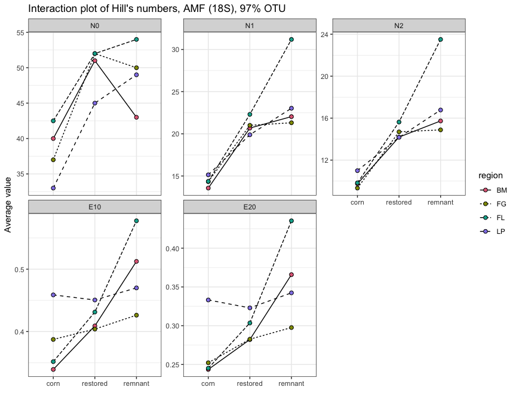

Microbial data: overview of data, diversity statistics
================
Beau Larkin

Last updated: 11 March, 2023

- <a href="#description" id="toc-description">Description</a>
- <a href="#packages-and-libraries"
  id="toc-packages-and-libraries">Packages and libraries</a>
- <a href="#data" id="toc-data">Data</a>
  - <a href="#sites-species-tables"
    id="toc-sites-species-tables">Sites-species tables</a>
  - <a href="#site-metadata-and-design"
    id="toc-site-metadata-and-design">Site metadata and design</a>
- <a href="#functions" id="toc-functions">Functions</a>
  - <a href="#calculate-hills-series-on-a-samples-species-matrix"
    id="toc-calculate-hills-series-on-a-samples-species-matrix">Calculate
    Hill’s series on a samples-species matrix</a>
  - <a href="#test-diversity-measures-across-site-types-with-mixed-model"
    id="toc-test-diversity-measures-across-site-types-with-mixed-model">Test
    diversity measures across site types with mixed model</a>
  - <a href="#change-in-diversity-over-time"
    id="toc-change-in-diversity-over-time">Change in diversity over time</a>
- <a href="#analysis-and-results" id="toc-analysis-and-results">Analysis
  and Results</a>
  - <a href="#microbial-diversity" id="toc-microbial-diversity">Microbial
    diversity</a>
  - <a href="#fungi-its-gene" id="toc-fungi-its-gene">Fungi (ITS gene)</a>
    - <a href="#diversity-across-field-types"
      id="toc-diversity-across-field-types">Diversity across field types</a>
    - <a href="#key-observations" id="toc-key-observations">Key
      observations:</a>
    - <a href="#diversity-over-time" id="toc-diversity-over-time">Diversity
      over time</a>
  - <a href="#amf-18s-gene" id="toc-amf-18s-gene">AMF (18S gene)</a>
    - <a href="#key-observations-1" id="toc-key-observations-1">Key
      observations:</a>
    - <a href="#diversity-over-time-at-blue-mounds-amf"
      id="toc-diversity-over-time-at-blue-mounds-amf">Diversity over time at
      Blue Mounds (AMF)</a>

# Description

Microbial data analyzed here include site-species tables derived from
high-throughput sequencing of ITS and 18S genes and clustering into 97%
similar OTUs and 100% similar SVs. This report presents basic statistics
and visualizations of species richness, Shannon’s diversity/evenness,
and Simpson’s diversity/evenness in the microbial species data across
field types.

- Diversity and evenness of microbial communities
- Interpretation of differences in diversity among regions and field
  types, and over years.

# Packages and libraries

``` r
packages_needed = c(
    "rsq",
    "lme4",
    "multcomp",
    "tidyverse",
    "vegan",
    "ggbeeswarm",
    "knitr",
    "conflicted",
    "colorspace"
)
packages_installed = packages_needed %in% rownames(installed.packages())
```

``` r
if (any(!packages_installed)) {
    install.packages(packages_needed[!packages_installed])
}
```

``` r
for (i in 1:length(packages_needed)) {
    library(packages_needed[i], character.only = T)
}
```

``` r
conflict_prefer("filter", "dplyr")
conflict_prefer("select", "dplyr")
```

# Data

## Sites-species tables

CSV files were produced in `process_data.R`

``` r
spe <- list(
    its_raw = read_csv(paste0(getwd(), "/clean_data/spe_ITS_raw.csv"), 
                        show_col_types = FALSE),
    its_rfy = read_csv(paste0(getwd(), "/clean_data/spe_ITS_rfy.csv"), 
                       show_col_types = FALSE),
    amf_raw = read_csv(paste0(getwd(), "/clean_data/spe_18S_raw.csv"), 
                        show_col_types = FALSE),
    amf_rfy = read_csv(paste0(getwd(), "/clean_data/spe_18S_rfy.csv"), 
                       show_col_types = FALSE)
)
```

## Site metadata and design

``` r
sites <- read_csv(paste0(getwd(), "/clean_data/sites.csv"), show_col_types = FALSE) %>% 
    mutate(field_type = factor(field_type, ordered = TRUE, levels = c("corn", "restored", "remnant"))) %>% 
    select(-lat, -long, -yr_restore, -yr_rank)
```

# Functions

The following functions are used to streamline code and reduce errors:

### Calculate Hill’s series on a samples-species matrix

``` r
calc_diversity <- function(spe) {
    spe_mat <- data.frame(spe, row.names = 1)
    
    N0  <- apply(spe_mat > 0, MARGIN = 1, FUN = sum)
    N1  <- exp(diversity(spe_mat))
    N2  <- diversity(spe_mat, "inv")
    E10 <- N1 / N0
    E20 <- N2 / N0
    
    return(
        data.frame(N0, N1, N2, E10, E20) %>%
            rownames_to_column(var = "field_key") %>%
            mutate(field_key = as.integer(field_key)) %>%
            left_join(sites, by = join_by(field_key)) %>%
            pivot_longer(
                cols = N0:E20,
                names_to = "hill_index",
                values_to = "value"
            ) %>%
            mutate(hill_index = factor(
                hill_index,
                ordered = TRUE,
                levels = c("N0", "N1", "N2", "E10", "E20")
            ))
    )
}
```

### Test diversity measures across site types with mixed model

``` r
test_diversity <- function(data) {
    hills <- levels(data$hill_index)
    for(i in 1:length(hills)) {
        cat("---------------------------------\n")
        print(hills[i])
        cat("---------------------------------\n\n")
        mod_data <- data %>% 
            filter(hill_index == hills[i]) %>% 
            mutate(field_type = factor(field_type, ordered = FALSE))
        mmod <- lmer(value ~ field_type + (1 | region), data = mod_data, REML = FALSE)
        print(mmod)
        cat("\n---------------------------------\n\n")
        mmod_null <- lmer(value ~ 1 + (1 | region), data = mod_data, REML = FALSE)
        print(mmod_null)
        cat("\n---------------------------------\n\n")
        print(anova(mmod, mmod_null))
        mod_tuk <- glht(mmod, linfct = mcp(field_type = "Tukey"), test = adjusted("holm"))
        print(mod_tuk)
        print(cld(mod_tuk))
        cat("\n\n\n")
    }
}
```

### Change in diversity over time

Do Hill’s numbers correlate with years since restoration? This is only
appropriate to attempt in the Blue Mounds region, and even there, it
will be difficult to justify that the area meets the criteria for a
chronosequence.

``` r
test_age <- function(data, caption=NULL) {
    temp_df <-
        data %>%
        filter(field_type == "restored", region == "BM") %>%
        pivot_wider(names_from = hill_index, values_from = value) %>%
        select(-starts_with("field"),-region)
    lapply(temp_df %>% select(-yr_since), function(z) {
        test <-
            cor.test(temp_df$yr_since,
                     z,
                     alternative = "two.sided",
                     method = "pearson")
        return(data.frame(
            cor = round(test$estimate, 2),
            R2 = round(test$estimate^2, 2),
            pval = round(test$p.value, 3)
        ))
    }) %>%
        bind_rows(.id = "hill_num") %>%
        remove_rownames() %>%
        mutate(sig = case_when(pval <= 0.05 ~ "*", TRUE ~ "")) %>%
        kable(format = "pandoc", caption = caption)
}
```

# Analysis and Results

What was the effect of rarefying the samples-species tables on the
number of OTUs recovered? After rarefying, zero-abundance and singleton
OTUs were removed.  
Few were lost due to rarefying, as we can see by counting columns (less
column 1 because it has field site keys):

``` r
Map(function(x) ncol(x)-1, spe) 
```

    ## $its_raw
    ## [1] 2795
    ## 
    ## $its_rfy
    ## [1] 2749
    ## 
    ## $amf_raw
    ## [1] 147
    ## 
    ## $amf_rfy
    ## [1] 145

It appears that little will be lost in terms of richness or diversity by
rarefying.

## Microbial diversity

Microbial diversity is considered for 18S or ITS gene datasets. For each
set, Hill’s numbers are produced ([Hill
1973](http://doi.wiley.com/10.2307/1934352), [Borcard and Legendere
2018, p. 373](http://link.springer.com/10.1007/978-3-319-71404-2)) and
plotted, with means differences tested using mixed-effects linear models
in `lmer` ([Bates et al. 2015](https://doi.org/10.18637/jss.v067.i01)).
Correlations are then produced to visualize change in diversity trends
over time, with similar mixed-effects tests performed.

The statistical tests are not valid due to pseudoreplication, but are
presented here as an attempt to at least explore some differences and
think more later about how we could present them in a valid way.

Hill’s numbers, brief description:

- $N_{0}$ = species richness
- $N_{1}$ = Shannon’s diversity ($e^H$; excludes rarest species,
  considers the number of “functional” species)
- $N_{2}$ = Simpson’s diversity ($1 / \lambda$; number of “codominant”
  species)
- $E_{10}$ = Shannon’s evenness (Hill’s ratio $N_{1} / N_{0}$)
- $E_{20}$ = Simpson’s evenness (Hill’s ratio $N_{2} / N_{0}$)

``` r
# Rarefied tables only
div <- Map(calc_diversity, spe[c(2,4)])
```

## Fungi (ITS gene)

### Diversity across field types

Run the linear model and test differences among field types for
diversity.

``` r
test_diversity(div$its_rfy)
```

    ## ---------------------------------
    ## [1] "N0"
    ## ---------------------------------
    ## 
    ## Linear mixed model fit by maximum likelihood  ['lmerMod']
    ## Formula: value ~ field_type + (1 | region)
    ##    Data: mod_data
    ##       AIC       BIC    logLik  deviance  df.resid 
    ##  265.4575  271.5519 -127.7288  255.4575        20 
    ## Random effects:
    ##  Groups   Name        Std.Dev.
    ##  region   (Intercept) 36.39   
    ##  Residual             34.10   
    ## Number of obs: 25, groups:  region, 4
    ## Fixed Effects:
    ##        (Intercept)  field_typerestored   field_typeremnant  
    ##             336.55               75.93              107.45  
    ## 
    ## ---------------------------------
    ## 
    ## Linear mixed model fit by maximum likelihood  ['lmerMod']
    ## Formula: value ~ 1 + (1 | region)
    ##    Data: mod_data
    ##       AIC       BIC    logLik  deviance  df.resid 
    ##  278.2817  281.9383 -136.1409  272.2817        22 
    ## Random effects:
    ##  Groups   Name        Std.Dev.
    ##  region   (Intercept) 30.92   
    ##  Residual             51.20   
    ## Number of obs: 25, groups:  region, 4
    ## Fixed Effects:
    ## (Intercept)  
    ##       402.3  
    ## 
    ## ---------------------------------
    ## 
    ## Data: mod_data
    ## Models:
    ## mmod_null: value ~ 1 + (1 | region)
    ## mmod: value ~ field_type + (1 | region)
    ##           npar    AIC    BIC  logLik deviance  Chisq Df Pr(>Chisq)    
    ## mmod_null    3 278.28 281.94 -136.14   272.28                         
    ## mmod         5 265.46 271.55 -127.73   255.46 16.824  2  0.0002222 ***
    ## ---
    ## Signif. codes:  0 '***' 0.001 '**' 0.01 '*' 0.05 '.' 0.1 ' ' 1
    ## 
    ##   General Linear Hypotheses
    ## 
    ## Multiple Comparisons of Means: Tukey Contrasts
    ## 
    ## 
    ## Linear Hypotheses:
    ##                         Estimate
    ## restored - corn == 0       75.93
    ## remnant - corn == 0       107.45
    ## remnant - restored == 0    31.52
    ## 
    ##     corn restored  remnant 
    ##      "a"      "b"      "b" 
    ## 
    ## 
    ## 
    ## ---------------------------------
    ## [1] "N1"
    ## ---------------------------------
    ## 
    ## Linear mixed model fit by maximum likelihood  ['lmerMod']
    ## Formula: value ~ field_type + (1 | region)
    ##    Data: mod_data
    ##       AIC       BIC    logLik  deviance  df.resid 
    ##  223.2787  229.3731 -106.6394  213.2787        20 
    ## Random effects:
    ##  Groups   Name        Std.Dev.
    ##  region   (Intercept)  7.574  
    ##  Residual             16.120  
    ## Number of obs: 25, groups:  region, 4
    ## Fixed Effects:
    ##        (Intercept)  field_typerestored   field_typeremnant  
    ##              76.85               24.37               28.01  
    ## 
    ## ---------------------------------
    ## 
    ## Linear mixed model fit by maximum likelihood  ['lmerMod']
    ## Formula: value ~ 1 + (1 | region)
    ##    Data: mod_data
    ##       AIC       BIC    logLik  deviance  df.resid 
    ##  227.3456  231.0023 -110.6728  221.3456        22 
    ## Random effects:
    ##  Groups   Name        Std.Dev.
    ##  region   (Intercept)  6.494  
    ##  Residual             19.433  
    ## Number of obs: 25, groups:  region, 4
    ## Fixed Effects:
    ## (Intercept)  
    ##       96.46  
    ## 
    ## ---------------------------------
    ## 
    ## Data: mod_data
    ## Models:
    ## mmod_null: value ~ 1 + (1 | region)
    ## mmod: value ~ field_type + (1 | region)
    ##           npar    AIC    BIC  logLik deviance  Chisq Df Pr(>Chisq)  
    ## mmod_null    3 227.35 231.00 -110.67   221.35                       
    ## mmod         5 223.28 229.37 -106.64   213.28 8.0669  2    0.01771 *
    ## ---
    ## Signif. codes:  0 '***' 0.001 '**' 0.01 '*' 0.05 '.' 0.1 ' ' 1
    ## 
    ##   General Linear Hypotheses
    ## 
    ## Multiple Comparisons of Means: Tukey Contrasts
    ## 
    ## 
    ## Linear Hypotheses:
    ##                         Estimate
    ## restored - corn == 0      24.373
    ## remnant - corn == 0       28.010
    ## remnant - restored == 0    3.637
    ## 
    ##     corn restored  remnant 
    ##      "a"      "b"      "b" 
    ## 
    ## 
    ## 
    ## ---------------------------------
    ## [1] "N2"
    ## ---------------------------------
    ## 
    ## Linear mixed model fit by maximum likelihood  ['lmerMod']
    ## Formula: value ~ field_type + (1 | region)
    ##    Data: mod_data
    ##      AIC      BIC   logLik deviance df.resid 
    ## 205.7571 211.8515 -97.8786 195.7571       20 
    ## Random effects:
    ##  Groups   Name        Std.Dev.
    ##  region   (Intercept)  3.221  
    ##  Residual             11.779  
    ## Number of obs: 25, groups:  region, 4
    ## Fixed Effects:
    ##        (Intercept)  field_typerestored   field_typeremnant  
    ##              37.53               11.00               11.58  
    ## 
    ## ---------------------------------
    ## 
    ## Linear mixed model fit by maximum likelihood  ['lmerMod']
    ## Formula: value ~ 1 + (1 | region)
    ##    Data: mod_data
    ##      AIC      BIC   logLik deviance df.resid 
    ## 205.0187 208.6753 -99.5093 199.0187       22 
    ## Random effects:
    ##  Groups   Name        Std.Dev.
    ##  region   (Intercept)  2.297  
    ##  Residual             12.768  
    ## Number of obs: 25, groups:  region, 4
    ## Fixed Effects:
    ## (Intercept)  
    ##       46.16  
    ## 
    ## ---------------------------------
    ## 
    ## Data: mod_data
    ## Models:
    ## mmod_null: value ~ 1 + (1 | region)
    ## mmod: value ~ field_type + (1 | region)
    ##           npar    AIC    BIC  logLik deviance  Chisq Df Pr(>Chisq)
    ## mmod_null    3 205.02 208.68 -99.509   199.02                     
    ## mmod         5 205.76 211.85 -97.879   195.76 3.2615  2     0.1958
    ## 
    ##   General Linear Hypotheses
    ## 
    ## Multiple Comparisons of Means: Tukey Contrasts
    ## 
    ## 
    ## Linear Hypotheses:
    ##                         Estimate
    ## restored - corn == 0     11.0036
    ## remnant - corn == 0      11.5774
    ## remnant - restored == 0   0.5738
    ## 
    ##     corn restored  remnant 
    ##      "a"      "a"      "a" 
    ## 
    ## 
    ## 
    ## ---------------------------------
    ## [1] "E10"
    ## ---------------------------------

    ## boundary (singular) fit: see help('isSingular')

    ## Linear mixed model fit by maximum likelihood  ['lmerMod']
    ## Formula: value ~ field_type + (1 | region)
    ##    Data: mod_data
    ##       AIC       BIC    logLik  deviance  df.resid 
    ##  -95.7293  -89.6349   52.8647 -105.7293        20 
    ## Random effects:
    ##  Groups   Name        Std.Dev.
    ##  region   (Intercept) 0.0000  
    ##  Residual             0.0292  
    ## Number of obs: 25, groups:  region, 4
    ## Fixed Effects:
    ##        (Intercept)  field_typerestored   field_typeremnant  
    ##            0.22595             0.01385             0.01369  
    ## optimizer (nloptwrap) convergence code: 0 (OK) ; 0 optimizer warnings; 1 lme4 warnings 
    ## 
    ## ---------------------------------

    ## boundary (singular) fit: see help('isSingular')

    ## Linear mixed model fit by maximum likelihood  ['lmerMod']
    ## Formula: value ~ 1 + (1 | region)
    ##    Data: mod_data
    ##       AIC       BIC    logLik  deviance  df.resid 
    ##  -98.8493  -95.1927   52.4247 -104.8493        22 
    ## Random effects:
    ##  Groups   Name        Std.Dev.
    ##  region   (Intercept) 0.00000 
    ##  Residual             0.02972 
    ## Number of obs: 25, groups:  region, 4
    ## Fixed Effects:
    ## (Intercept)  
    ##       0.237  
    ## optimizer (nloptwrap) convergence code: 0 (OK) ; 0 optimizer warnings; 1 lme4 warnings 
    ## 
    ## ---------------------------------
    ## 
    ## Data: mod_data
    ## Models:
    ## mmod_null: value ~ 1 + (1 | region)
    ## mmod: value ~ field_type + (1 | region)
    ##           npar     AIC     BIC logLik deviance Chisq Df Pr(>Chisq)
    ## mmod_null    3 -98.849 -95.193 52.425  -104.85                    
    ## mmod         5 -95.729 -89.635 52.865  -105.73  0.88  2      0.644
    ## 
    ##   General Linear Hypotheses
    ## 
    ## Multiple Comparisons of Means: Tukey Contrasts
    ## 
    ## 
    ## Linear Hypotheses:
    ##                           Estimate
    ## restored - corn == 0     0.0138495
    ## remnant - corn == 0      0.0136888
    ## remnant - restored == 0 -0.0001608
    ## 
    ##     corn restored  remnant 
    ##      "a"      "a"      "a" 
    ## 
    ## 
    ## 
    ## ---------------------------------
    ## [1] "E20"
    ## ---------------------------------

    ## boundary (singular) fit: see help('isSingular')

    ## Linear mixed model fit by maximum likelihood  ['lmerMod']
    ## Formula: value ~ field_type + (1 | region)
    ##    Data: mod_data
    ##       AIC       BIC    logLik  deviance  df.resid 
    ## -104.3718  -98.2775   57.1859 -114.3718        20 
    ## Random effects:
    ##  Groups   Name        Std.Dev.
    ##  region   (Intercept) 0.00000 
    ##  Residual             0.02457 
    ## Number of obs: 25, groups:  region, 4
    ## Fixed Effects:
    ##        (Intercept)  field_typerestored   field_typeremnant  
    ##           0.110470            0.003824            0.003136  
    ## optimizer (nloptwrap) convergence code: 0 (OK) ; 0 optimizer warnings; 1 lme4 warnings 
    ## 
    ## ---------------------------------

    ## boundary (singular) fit: see help('isSingular')

    ## Linear mixed model fit by maximum likelihood  ['lmerMod']
    ## Formula: value ~ 1 + (1 | region)
    ##    Data: mod_data
    ##       AIC       BIC    logLik  deviance  df.resid 
    ## -108.2795 -104.6228   57.1397 -114.2795        22 
    ## Random effects:
    ##  Groups   Name        Std.Dev.
    ##  region   (Intercept) 0.00000 
    ##  Residual             0.02461 
    ## Number of obs: 25, groups:  region, 4
    ## Fixed Effects:
    ## (Intercept)  
    ##      0.1134  
    ## optimizer (nloptwrap) convergence code: 0 (OK) ; 0 optimizer warnings; 1 lme4 warnings 
    ## 
    ## ---------------------------------
    ## 
    ## Data: mod_data
    ## Models:
    ## mmod_null: value ~ 1 + (1 | region)
    ## mmod: value ~ field_type + (1 | region)
    ##           npar     AIC      BIC logLik deviance  Chisq Df Pr(>Chisq)
    ## mmod_null    3 -108.28 -104.623 57.140  -114.28                     
    ## mmod         5 -104.37  -98.277 57.186  -114.37 0.0924  2     0.9549
    ## 
    ##   General Linear Hypotheses
    ## 
    ## Multiple Comparisons of Means: Tukey Contrasts
    ## 
    ## 
    ## Linear Hypotheses:
    ##                           Estimate
    ## restored - corn == 0     0.0038237
    ## remnant - corn == 0      0.0031362
    ## remnant - restored == 0 -0.0006876
    ## 
    ##     corn restored  remnant 
    ##      "a"      "a"      "a"

#### Result: ITS diversity

- $N_{0}$: field type is significant by likelihood ratio test at
  p\<0.001 with region as a random effect. Species richness in corn
  fields was less than restored or remnants, which didn’t differ at
  p=0.05.
- $N_{1}$: field type is significant by likelihood ratio test at p\<0.05
  with region as a random effect. Shannon’s diversity in corn fields was
  less than restored or remnants, which didn’t differ at p=0.05.
- $N_{2}$, $E_{10}$, and $E_{20}$: model fits for both null and full
  models were singular and NS at p\<0.05.

Figure labels are generated and the diversity data are plotted below. An
interaction plot follows, and is useful to consider what the model can
and cannot say about differences in regions and field types.

``` r
labs_its <- data.frame(
    hill_index = factor(c(rep("N0", 3), rep("N1", 3)), 
                        ordered = TRUE, 
                        levels = c("N0", "N1", "N2", "E10", "E20")),
    lab = c("a", "b", "b", "a", "b", "b"),
    xpos = rep(c(1,2,3), 2),
    ypos = rep(c(560, 160), each = 3)
)
```

``` r
ggplot(div$its_rfy, aes(x = field_type, y = value)) +
    facet_wrap(vars(hill_index), scales = "free_y") +
    geom_boxplot(varwidth = TRUE, fill = "gray90", outlier.shape = NA) +
    geom_beeswarm(aes(fill = region), shape = 21, size = 2, dodge.width = 0.2) +
    geom_label(data = labs_its, aes(x = xpos, y = ypos, label = lab), label.size = NA) +
    labs(x = "", y = "Index value", title = "TGP microbial diversity (Hill's), ITS, 97% OTU",
         caption = "N0-richness, N1-e^Shannon, N2-Simpson, E10=N1/N0, E20=N2/N0, width=n,\nletters indicate significant differences at p<0.05") +
    scale_fill_discrete_qualitative(palette = "Dark3") +
    theme_bw()
```


Richness and evenness parameters increase from corn, to restored, to
remnant fields, and some support exists for this pattern to occur across
regions.

``` r
ggplot(
    div$its_rfy %>% 
        group_by(field_type, region, hill_index) %>% 
        summarize(avg_value = mean(value), .groups = "drop"),
    aes(x = field_type, y = avg_value, group = region)) +
    facet_wrap(vars(hill_index), scales = "free_y") +
    geom_line(aes(linetype = region)) +
    geom_point(aes(fill = region), size = 2, shape = 21) +
    labs(x = "", y = "Average value", title = "Interaction plot of Hill's numbers, ITS, 97% OTU") +
    scale_fill_discrete_qualitative(palette = "Dark3") +
    theme_bw()
```


### Key observations:

- The restored field at LP contains very high diversity, co-dominance,
  and evenness of fungi.
- The restored field at FG contains low diversity, co-dominance, and
  evenness.
- Interactions are less an issue with $N_{0}$ and $N_{1}$

### Diversity over time

Next, trends in diversity are correlated with years since restoration.
This can only be attempted with Fermi and Blue Mounds sites; elsewhere,
blocks cannot be statistically accounted for because treatments aren’t
replicated within them.

``` r
div$its_rfy %>% 
    filter(field_type == "restored", 
           hill_index %in% c("N0", "N1", "N2"),
           region %in% c("BM", "FL")) %>% 
    ggplot(aes(x = yr_since, y = value)) +
    facet_grid(cols = vars(region), rows = vars(hill_index), scales = "free_y") +
    geom_point(shape = 21, fill = "gray50", size = 2) +
    labs(x = "Years since restoration", y = "index value", title = "TGP microbial diversity (Hill's) over time, ITS, 97% OTU",
         caption = "N0-richness, N1-e^Shannon, N2-Simpson") +
    theme_bw()
```


If the relationship exists, it is in Blue Mounds only.

It’s probably justified to correlate diversity with field age in Blue
Mounds’s restored fields. A Pearson’s correlation is used:

``` r
test_age(div$its_rfy, 
         caption = "Correlation between Hill's numbers and field age in the Blue Mounds region: ITS, 97% OTU")
```

| hill_num |   cor |   R2 |  pval | sig |
|:---------|------:|-----:|------:|:----|
| N0       | -0.35 | 0.12 | 0.445 |     |
| N1       | -0.66 | 0.43 | 0.107 |     |
| N2       | -0.65 | 0.42 | 0.115 |     |
| E10      | -0.78 | 0.61 | 0.037 | \*  |
| E20      | -0.66 | 0.43 | 0.110 |     |

Correlation between Hill’s numbers and field age in the Blue Mounds
region: ITS, 97% OTU

Hill’s $N_{1}$ decreases with age since restoration in the Blue Mounds
area, but the decline isn’t significant ($R^2$=-0.67, p\>0.05). It’s
driven primarily by an old restored field, I’m guessing Karla Ott’s
grass plantation.  
This is odd and points to a confounding effect driven by difference in
restoration strategy over time. It’s possible that site differences
(soils, etc.) also confound this relationship. It’s possible that we
cannot attempt to present this as a time-based result at all. Or, maybe
the number of functionally dominant species slowly declines over time
due to lack of disturbance and substrate diversity.

That diversity metrics aren’t changing over time, or are possibly
declining over time after restoration is concerning and worth
mentioning.

In any case, let’s take a look at Shannon’s diversity over time in Blue
Mounds’ restored fields.

``` r
div$its_rfy %>% 
    filter(region == "BM", field_type == "restored", hill_index == "N1") %>% 
    ggplot(aes(x = yr_since, y = value)) +
    geom_smooth(method = "lm", se = TRUE, linewidth = 0.8, fill = "gray70") +
    geom_label(aes(label = field_name)) +
    labs(x = "Years since restoration", y = expression("Shannon's diversity"~(N[1]))) +
    theme_classic()
```


Karla Ott’s field was almost exclusively dominated by big bluestem,
possibly leading to a simpler microbial community. That field has too
much leverage on this plot.  
Right now, my interpretation is that restoration strategies changed over
time and although restored plant communities persisted, microbial
communities simplified over time. Immediately after restoration,
microbial diversity increased rapidly and was not sustained because the
soil properties ultimately didn’t change very much.

Site factors (soil type) are hard to tease out, but in later analyses we
will try using measured soil chemical properties.

## AMF (18S gene)

Run the linear model and test differences among field types for
diversity.

``` r
test_diversity(div$amf_rfy)
```

    ## ---------------------------------
    ## [1] "N0"
    ## ---------------------------------
    ## 
    ## Linear mixed model fit by maximum likelihood  ['lmerMod']
    ## Formula: value ~ field_type + (1 | region)
    ##    Data: mod_data
    ##      AIC      BIC   logLik deviance df.resid 
    ## 171.8749 177.9693 -80.9374 161.8749       20 
    ## Random effects:
    ##  Groups   Name        Std.Dev.
    ##  region   (Intercept) 0.9406  
    ##  Residual             6.0958  
    ## Number of obs: 25, groups:  region, 4
    ## Fixed Effects:
    ##        (Intercept)  field_typerestored   field_typeremnant  
    ##             38.315              10.806               9.685  
    ## 
    ## ---------------------------------

    ## boundary (singular) fit: see help('isSingular')

    ## Linear mixed model fit by maximum likelihood  ['lmerMod']
    ## Formula: value ~ 1 + (1 | region)
    ##    Data: mod_data
    ##      AIC      BIC   logLik deviance df.resid 
    ## 177.6634 181.3201 -85.8317 171.6634       22 
    ## Random effects:
    ##  Groups   Name        Std.Dev.
    ##  region   (Intercept) 0.000   
    ##  Residual             7.496   
    ## Number of obs: 25, groups:  region, 4
    ## Fixed Effects:
    ## (Intercept)  
    ##       46.88  
    ## optimizer (nloptwrap) convergence code: 0 (OK) ; 0 optimizer warnings; 1 lme4 warnings 
    ## 
    ## ---------------------------------
    ## 
    ## Data: mod_data
    ## Models:
    ## mmod_null: value ~ 1 + (1 | region)
    ## mmod: value ~ field_type + (1 | region)
    ##           npar    AIC    BIC  logLik deviance  Chisq Df Pr(>Chisq)   
    ## mmod_null    3 177.66 181.32 -85.832   171.66                        
    ## mmod         5 171.88 177.97 -80.937   161.88 9.7886  2   0.007489 **
    ## ---
    ## Signif. codes:  0 '***' 0.001 '**' 0.01 '*' 0.05 '.' 0.1 ' ' 1
    ## 
    ##   General Linear Hypotheses
    ## 
    ## Multiple Comparisons of Means: Tukey Contrasts
    ## 
    ## 
    ## Linear Hypotheses:
    ##                         Estimate
    ## restored - corn == 0      10.806
    ## remnant - corn == 0        9.685
    ## remnant - restored == 0   -1.121
    ## 
    ##     corn restored  remnant 
    ##      "a"      "b"      "b" 
    ## 
    ## 
    ## 
    ## ---------------------------------
    ## [1] "N1"
    ## ---------------------------------
    ## 
    ## Linear mixed model fit by maximum likelihood  ['lmerMod']
    ## Formula: value ~ field_type + (1 | region)
    ##    Data: mod_data
    ##      AIC      BIC   logLik deviance df.resid 
    ## 129.9983 136.0927 -59.9992 119.9983       20 
    ## Random effects:
    ##  Groups   Name        Std.Dev.
    ##  region   (Intercept) 0.406   
    ##  Residual             2.638   
    ## Number of obs: 25, groups:  region, 4
    ## Fixed Effects:
    ##        (Intercept)  field_typerestored   field_typeremnant  
    ##             13.913               6.827               9.943  
    ## 
    ## ---------------------------------

    ## boundary (singular) fit: see help('isSingular')

    ## Linear mixed model fit by maximum likelihood  ['lmerMod']
    ## Formula: value ~ 1 + (1 | region)
    ##    Data: mod_data
    ##      AIC      BIC   logLik deviance df.resid 
    ## 148.0156 151.6722 -71.0078 142.0156       22 
    ## Random effects:
    ##  Groups   Name        Std.Dev.
    ##  region   (Intercept) 0.000   
    ##  Residual             4.143   
    ## Number of obs: 25, groups:  region, 4
    ## Fixed Effects:
    ## (Intercept)  
    ##        19.9  
    ## optimizer (nloptwrap) convergence code: 0 (OK) ; 0 optimizer warnings; 1 lme4 warnings 
    ## 
    ## ---------------------------------
    ## 
    ## Data: mod_data
    ## Models:
    ## mmod_null: value ~ 1 + (1 | region)
    ## mmod: value ~ field_type + (1 | region)
    ##           npar    AIC    BIC  logLik deviance  Chisq Df Pr(>Chisq)    
    ## mmod_null    3 148.02 151.67 -71.008   142.02                         
    ## mmod         5 130.00 136.09 -59.999   120.00 22.017  2  1.656e-05 ***
    ## ---
    ## Signif. codes:  0 '***' 0.001 '**' 0.01 '*' 0.05 '.' 0.1 ' ' 1
    ## 
    ##   General Linear Hypotheses
    ## 
    ## Multiple Comparisons of Means: Tukey Contrasts
    ## 
    ## 
    ## Linear Hypotheses:
    ##                         Estimate
    ## restored - corn == 0       6.827
    ## remnant - corn == 0        9.943
    ## remnant - restored == 0    3.116
    ## 
    ##     corn restored  remnant 
    ##      "a"      "b"      "b" 
    ## 
    ## 
    ## 
    ## ---------------------------------
    ## [1] "N2"
    ## ---------------------------------

    ## boundary (singular) fit: see help('isSingular')

    ## Linear mixed model fit by maximum likelihood  ['lmerMod']
    ## Formula: value ~ field_type + (1 | region)
    ##    Data: mod_data
    ##      AIC      BIC   logLik deviance df.resid 
    ## 126.0093 132.1037 -58.0047 116.0093       20 
    ## Random effects:
    ##  Groups   Name        Std.Dev.
    ##  region   (Intercept) 0.000   
    ##  Residual             2.463   
    ## Number of obs: 25, groups:  region, 4
    ## Fixed Effects:
    ##        (Intercept)  field_typerestored   field_typeremnant  
    ##              9.641               4.779               7.575  
    ## optimizer (nloptwrap) convergence code: 0 (OK) ; 0 optimizer warnings; 1 lme4 warnings 
    ## 
    ## ---------------------------------

    ## boundary (singular) fit: see help('isSingular')

    ## Linear mixed model fit by maximum likelihood  ['lmerMod']
    ## Formula: value ~ 1 + (1 | region)
    ##    Data: mod_data
    ##      AIC      BIC   logLik deviance df.resid 
    ## 138.2739 141.9305 -66.1370 132.2739       22 
    ## Random effects:
    ##  Groups   Name        Std.Dev.
    ##  region   (Intercept) 0.000   
    ##  Residual             3.409   
    ## Number of obs: 25, groups:  region, 4
    ## Fixed Effects:
    ## (Intercept)  
    ##       13.91  
    ## optimizer (nloptwrap) convergence code: 0 (OK) ; 0 optimizer warnings; 1 lme4 warnings 
    ## 
    ## ---------------------------------
    ## 
    ## Data: mod_data
    ## Models:
    ## mmod_null: value ~ 1 + (1 | region)
    ## mmod: value ~ field_type + (1 | region)
    ##           npar    AIC    BIC  logLik deviance  Chisq Df Pr(>Chisq)    
    ## mmod_null    3 138.27 141.93 -66.137   132.27                         
    ## mmod         5 126.01 132.10 -58.005   116.01 16.265  2  0.0002939 ***
    ## ---
    ## Signif. codes:  0 '***' 0.001 '**' 0.01 '*' 0.05 '.' 0.1 ' ' 1
    ## 
    ##   General Linear Hypotheses
    ## 
    ## Multiple Comparisons of Means: Tukey Contrasts
    ## 
    ## 
    ## Linear Hypotheses:
    ##                         Estimate
    ## restored - corn == 0       4.779
    ## remnant - corn == 0        7.575
    ## remnant - restored == 0    2.796
    ## 
    ##     corn restored  remnant 
    ##      "a"      "b"      "b" 
    ## 
    ## 
    ## 
    ## ---------------------------------
    ## [1] "E10"
    ## ---------------------------------
    ## 
    ## Linear mixed model fit by maximum likelihood  ['lmerMod']
    ## Formula: value ~ field_type + (1 | region)
    ##    Data: mod_data
    ##      AIC      BIC   logLik deviance df.resid 
    ## -62.1913 -56.0969  36.0956 -72.1913       20 
    ## Random effects:
    ##  Groups   Name        Std.Dev.
    ##  region   (Intercept) 0.001401
    ##  Residual             0.057094
    ## Number of obs: 25, groups:  region, 4
    ## Fixed Effects:
    ##        (Intercept)  field_typerestored   field_typeremnant  
    ##            0.37194             0.05352             0.12389  
    ## 
    ## ---------------------------------

    ## boundary (singular) fit: see help('isSingular')

    ## Linear mixed model fit by maximum likelihood  ['lmerMod']
    ## Formula: value ~ 1 + (1 | region)
    ##    Data: mod_data
    ##      AIC      BIC   logLik deviance df.resid 
    ## -57.4528 -53.7962  31.7264 -63.4528       22 
    ## Random effects:
    ##  Groups   Name        Std.Dev.
    ##  region   (Intercept) 0.00000 
    ##  Residual             0.06802 
    ## Number of obs: 25, groups:  region, 4
    ## Fixed Effects:
    ## (Intercept)  
    ##       0.426  
    ## optimizer (nloptwrap) convergence code: 0 (OK) ; 0 optimizer warnings; 1 lme4 warnings 
    ## 
    ## ---------------------------------
    ## 
    ## Data: mod_data
    ## Models:
    ## mmod_null: value ~ 1 + (1 | region)
    ## mmod: value ~ field_type + (1 | region)
    ##           npar     AIC     BIC logLik deviance  Chisq Df Pr(>Chisq)  
    ## mmod_null    3 -57.453 -53.796 31.726  -63.453                       
    ## mmod         5 -62.191 -56.097 36.096  -72.191 8.7385  2    0.01266 *
    ## ---
    ## Signif. codes:  0 '***' 0.001 '**' 0.01 '*' 0.05 '.' 0.1 ' ' 1
    ## 
    ##   General Linear Hypotheses
    ## 
    ## Multiple Comparisons of Means: Tukey Contrasts
    ## 
    ## 
    ## Linear Hypotheses:
    ##                         Estimate
    ## restored - corn == 0     0.05352
    ## remnant - corn == 0      0.12389
    ## remnant - restored == 0  0.07036
    ## 
    ##     corn restored  remnant 
    ##      "a"     "ab"      "b" 
    ## 
    ## 
    ## 
    ## ---------------------------------
    ## [1] "E20"
    ## ---------------------------------

    ## boundary (singular) fit: see help('isSingular')

    ## Linear mixed model fit by maximum likelihood  ['lmerMod']
    ## Formula: value ~ field_type + (1 | region)
    ##    Data: mod_data
    ##      AIC      BIC   logLik deviance df.resid 
    ## -60.4894 -54.3950  35.2447 -70.4894       20 
    ## Random effects:
    ##  Groups   Name        Std.Dev.
    ##  region   (Intercept) 0.00000 
    ##  Residual             0.05909 
    ## Number of obs: 25, groups:  region, 4
    ## Fixed Effects:
    ##        (Intercept)  field_typerestored   field_typeremnant  
    ##            0.25919             0.03800             0.09777  
    ## optimizer (nloptwrap) convergence code: 0 (OK) ; 0 optimizer warnings; 1 lme4 warnings 
    ## 
    ## ---------------------------------

    ## boundary (singular) fit: see help('isSingular')

    ## Linear mixed model fit by maximum likelihood  ['lmerMod']
    ## Formula: value ~ 1 + (1 | region)
    ##    Data: mod_data
    ##      AIC      BIC   logLik deviance df.resid 
    ## -59.0042 -55.3475  32.5021 -65.0042       22 
    ## Random effects:
    ##  Groups   Name        Std.Dev.
    ##  region   (Intercept) 0.00000 
    ##  Residual             0.06594 
    ## Number of obs: 25, groups:  region, 4
    ## Fixed Effects:
    ## (Intercept)  
    ##      0.2992  
    ## optimizer (nloptwrap) convergence code: 0 (OK) ; 0 optimizer warnings; 1 lme4 warnings 
    ## 
    ## ---------------------------------
    ## 
    ## Data: mod_data
    ## Models:
    ## mmod_null: value ~ 1 + (1 | region)
    ## mmod: value ~ field_type + (1 | region)
    ##           npar     AIC     BIC logLik deviance  Chisq Df Pr(>Chisq)  
    ## mmod_null    3 -59.004 -55.348 32.502  -65.004                       
    ## mmod         5 -60.489 -54.395 35.245  -70.489 5.4852  2     0.0644 .
    ## ---
    ## Signif. codes:  0 '***' 0.001 '**' 0.01 '*' 0.05 '.' 0.1 ' ' 1
    ## 
    ##   General Linear Hypotheses
    ## 
    ## Multiple Comparisons of Means: Tukey Contrasts
    ## 
    ## 
    ## Linear Hypotheses:
    ##                         Estimate
    ## restored - corn == 0     0.03800
    ## remnant - corn == 0      0.09777
    ## remnant - restored == 0  0.05977
    ## 
    ##     corn restored  remnant 
    ##      "a"     "ab"      "b"

#### Result: AMF diversity

Despite apparent trends across field types, variances are large and
interactions apparent. All model fits are questionable due to
[singularity](https://rdrr.io/cran/lme4/man/isSingular.html). The
following results and plots are provisional and included here for
consideration only.

- $N_{0}$: Species richness differences by field type are significant by
  likelihood ratio test at p\<0.005 with region as a random effect.
  Species richness in corn fields was less than restored, and neither
  differed from remnants at p=0.05.
- $N_{1}$: field type is significant by likelihood ratio test at
  p\<0.001 with region as a random effect. Shannon’s diversity in corn
  fields was less than restored or remnants, which didn’t differ at
  p=0.05.
- $N_{2}$: field type is significant by likelihood ratio test at
  p\<0.001 with region as a random effect. Restored and remnant fields
  host a larger group of co-dominant AMF than are found in cornfields
  (p=0.05).
- $E_{10}$: field type is significant by likelihood ratio test at
  p\<0.05 with region as a random effect. Weak support for higher
  evenness of functionally abundant species in remnant fields was found
  (p=0.05).
- $E_{20}$: Similar trend as $E_{10}$ but NS (p\>0.05).

Figure labels are generated and the diversity data are plotted below. An
interaction plot follows, and is useful to consider what the model can
and cannot say about differences in regions and field types.

``` r
labs_amf <- data.frame(
    hill_index = factor(c(rep("N0", 3), rep("N1", 3), rep("N2", 3), rep("E10", 3)), 
                        ordered = TRUE, 
                        levels = c("N0", "N1", "N2", "E10", "E20")),
    lab = c("a", "b", "ab", "a", "b", "b", "a", "b", "b", "a", "ab", "b"),
    xpos = rep(c(1,2,3), 4),
    ypos = rep(c(64, 33, 25, 0.59), each = 3)
)
```

``` r
ggplot(div$amf_rfy, aes(x = field_type, y = value)) +
    facet_wrap(vars(hill_index), scales = "free_y") +
    geom_boxplot(varwidth = TRUE, fill = "gray90", outlier.shape = NA) +
    geom_beeswarm(aes(fill = region), shape = 21, size = 2, dodge.width = 0.2) +
    geom_label(data = labs_amf, aes(x = xpos, y = ypos, label = lab), label.size = NA) +
    labs(x = "", y = "Index value", title = "TGP microbial diversity (Hill's), AMF (18S), 97% OTU",
         caption = "N0-richness, N1-e^Shannon, N2-Simpson, E10=N1/N0, E20=N2/N0, width=n,\nletters indicate significant differences at p<0.05") +
    scale_fill_discrete_qualitative(palette = "Dark3") +
    theme_bw()
```


Richness increases from corn, to restored, to remnant fields, and some
support exists for this pattern to occur across regions. The trend is
weakest with $N_{0}$, suggesting that both restored and remnant soils
contain more functionally abundant and co-dominant species than are
found in cornfields, but some cornfields have “long tails” of rare
species. Wide variances stifle inferences. The trend detected in
evenness suggests that a few weedy AMF species dominate cornfields but
most restored fields host more balanced communities that are more
similar to remnants.

``` r
ggplot(
    div$amf_rfy %>% 
        group_by(field_type, region, hill_index) %>% 
        summarize(avg_value = mean(value), .groups = "drop"),
    aes(x = field_type, y = avg_value, group = region)) +
    facet_wrap(vars(hill_index), scales = "free_y") +
    geom_line(aes(linetype = region)) +
    geom_point(aes(fill = region), size = 2, shape = 21) +
    labs(x = "", y = "Average value", title = "Interaction plot of Hill's numbers, AMF (18S), 97% OTU") +
    scale_fill_discrete_qualitative(palette = "Dark3") +
    theme_bw()
```



### Key observations:

- Cornfields differ from restored and remnant fields, with lower
  richness, fewer dominant species, and greater dominance of those
  species.
- Differences between restored and remnant fields change directions
  based on region, with FL and LP matching the hypothesized pattern but
  BM and FG reversing it.
- Particular species may be strong interactors here.

### Diversity over time at Blue Mounds (AMF)

It’s probably justified to correlate diversity with field age in Blue
Mounds’s restored fields. A Pearson’s correlation is used:

``` r
test_age(div$amf_rfy, caption = "Correlation between Hill's numbers and field age in the Blue Mounds region: AMF (18S), 97% OTU")
```

| hill_num |   cor |   R2 |  pval | sig |
|:---------|------:|-----:|------:|:----|
| N0       |  0.16 | 0.03 | 0.725 |     |
| N1       | -0.25 | 0.06 | 0.596 |     |
| N2       | -0.35 | 0.12 | 0.440 |     |
| E10      | -0.28 | 0.08 | 0.544 |     |
| E20      | -0.34 | 0.11 | 0.457 |     |

Correlation between Hill’s numbers and field age in the Blue Mounds
region: AMF (18S), 97% OTU

The relationships are too weak to examine further.
