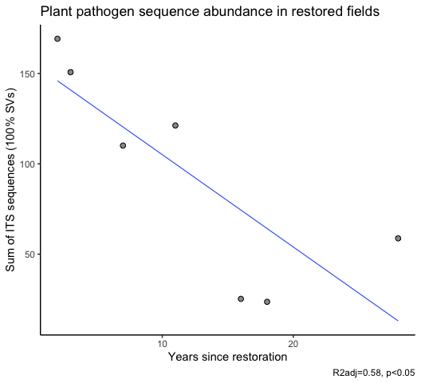
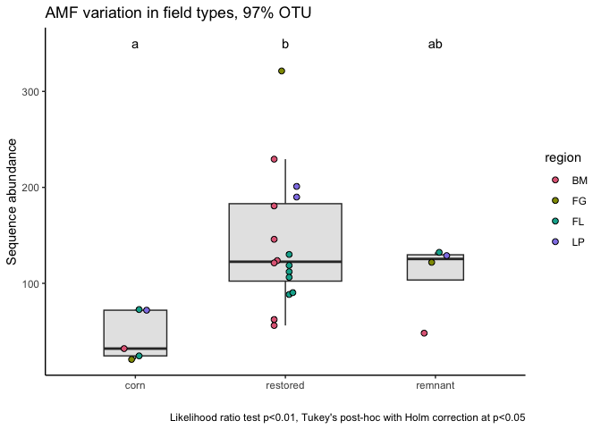
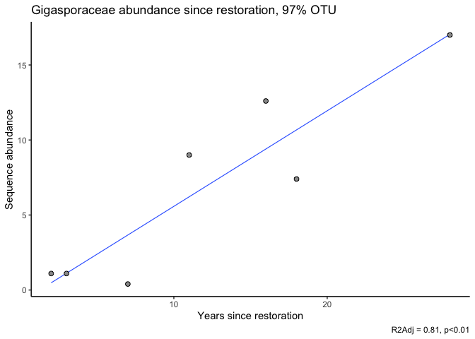
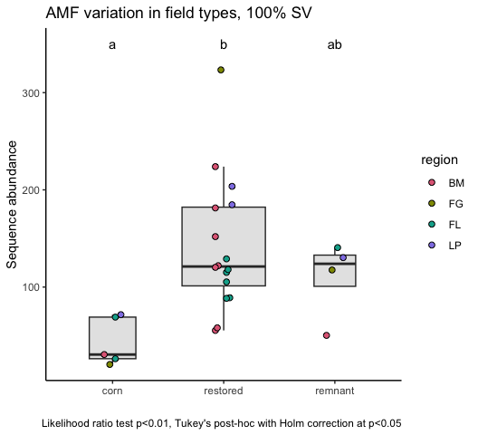
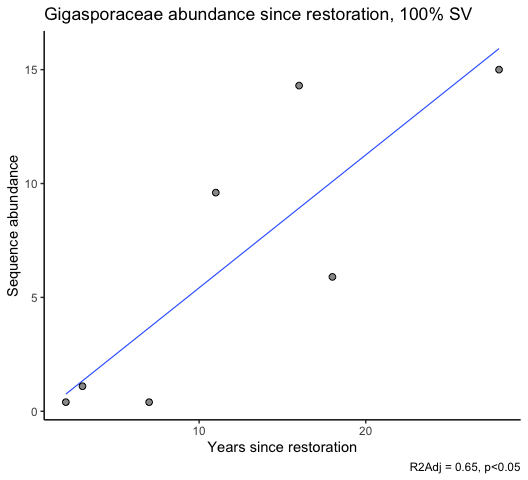

Microbial data: microbial guilds and taxonomy
================
Beau Larkin

Last updated: 10 February, 2023

- <a href="#description" id="toc-description">Description</a>
- <a href="#data" id="toc-data">Data</a>
  - <a href="#sites-species-tables"
    id="toc-sites-species-tables">Sites-species tables</a>
  - <a href="#species-metadata" id="toc-species-metadata">Species
    metadata</a>
  - <a href="#site-metadata-and-design"
    id="toc-site-metadata-and-design">Site metadata and design</a>
  - <a href="#joined-species-metadata-and-design-tables"
    id="toc-joined-species-metadata-and-design-tables">Joined species,
    metadata, and design tables</a>
- <a href="#analysis-and-results" id="toc-analysis-and-results">Analysis
  and Results</a>
  - <a href="#its-based-data" id="toc-its-based-data">ITS-based data</a>
    - <a href="#function-its-and-guilds"
      id="toc-function-its-and-guilds">Function: ITS and guilds</a>
    - <a href="#its-sequences-in-otu-clusters"
      id="toc-its-sequences-in-otu-clusters">ITS sequences in OTU clusters</a>
    - <a href="#its-sequences-in-sv-clusters"
      id="toc-its-sequences-in-sv-clusters">ITS sequences in SV clusters</a>
  - <a href="#18s-based-data-amf" id="toc-18s-based-data-amf">18S-based data
    (AMF)</a>
  - <a href="#amf-otus" id="toc-amf-otus">AMF OTUs</a>
- <a href="#conclusions" id="toc-conclusions">Conclusions</a>

# Description

Sequence clusters identified in QIIME are annotated with taxonomic
information and metadata from
[FunGuild](https://github.com/UMNFuN/FUNGuild). In this report, sequence
abundances in taxonomic groups or fungal guilds are compared across
field types and with time since restoration. \# Packages and libraries

``` r
packages_needed = c("tidyverse",
                    "knitr",
                    "conflicted",
                    "ggbeeswarm",
                    "colorspace",
                    "rsq",
                    "lme4",
                    "multcomp")
packages_installed = packages_needed %in% rownames(installed.packages())
```

``` r
if (any(!packages_installed)) {
    install.packages(packages_needed[!packages_installed])
}
```

``` r
for (i in 1:length(packages_needed)) {
    library(packages_needed[i], character.only = T)
}
```

``` r
conflict_prefer("filter", "dplyr")
conflict_prefer("select", "dplyr")
```

# Data

## Sites-species tables

CSV files were produced in `process_data.R`

``` r
spe <- list(
    its_otu = read_csv(
        paste0(getwd(), "/clean_data/spe_ITS_otu_siteSpeMatrix_avg.csv"),
        show_col_types = FALSE
    ),
    its_sv  = read_csv(
        paste0(getwd(), "/clean_data/spe_ITS_sv_siteSpeMatrix_avg.csv"),
        show_col_types = FALSE
    ),
    amf_otu = read_csv(
        paste0(getwd(), "/clean_data/spe_18S_otu_siteSpeMatrix_avg.csv"),
        show_col_types = FALSE
    ),
    amf_sv  = read_csv(
        paste0(getwd(), "/clean_data/spe_18S_sv_siteSpeMatrix_avg.csv"),
        show_col_types = FALSE
    )
)
```

## Species metadata

Load guild and taxonomy data (ITS sequences)

``` r
guild <- list(
    its_otu =
        read_csv(
            paste0(getwd(), "/clean_data/spe_ITS_otu_funGuild.csv"),
            show_col_types = FALSE
        ),
    its_sv  =
        read_csv(
            paste0(getwd(), "/clean_data/spe_ITS_sv_funGuild.csv"),
            show_col_types = FALSE
        )
)
```

Load taxonomy data (AMF/18S sequences)

``` r
taxonomy <- list(
    amf_otu =
        read_csv(
            paste0(getwd(), "/clean_data/spe_18S_otu_taxonomy.csv"),
            show_col_types = FALSE
        ),
    amf_sv  =
        read_csv(
            paste0(getwd(), "/clean_data/spe_18S_sv_taxonomy.csv"),
            show_col_types = FALSE
        )
)
```

## Site metadata and design

Oldfields are filtered out because they could not be replicated in
regions. Set remnants to 50 years old as a placeholder. This number will
not be used in a quantitative sense, for example in models.

``` r
rem_age <- 50
sites   <-
    read_csv(paste0(getwd(), "/clean_data/site.csv"), show_col_types = FALSE) %>%
    mutate(
        field_type = factor(
            site_type,
            ordered = TRUE,
            levels = c("corn", "restored", "remnant")
        ),
        yr_since = replace(yr_since, which(site_type == "remnant"), rem_age)
    ) %>%
    filter(field_type != "oldfield") %>% 
    select(-lat, -long, -yr_restore, -site_type)
```

## Joined species, metadata, and design tables

Functions streamline this process

``` r
join_spe_meta <-
    function(spe,
             meta,
             filter_char = "otu",
             clust_name = "otu_num",
             abund_name = "seq_abund") {
        spe %>%
            pivot_longer(starts_with(filter_char),
                         names_to = clust_name,
                         values_to = abund_name) %>%
            filter(seq_abund != 0) %>%
            left_join(meta, by = clust_name) %>%
            left_join(sites, by = "site_key")
    }
```

``` r
spe_meta <- list(
    its_otu =
        join_spe_meta(
            spe$its_otu,
            guild$its_otu,
            filter_char = "otu",
            clust_name = "otu_num"
        ) %>%
        select(-otu_ID,-trait,-notes,-citation) %>%
        write_csv(paste0(
            getwd(), "/clean_data/speGuild_ITS_otu.csv"
        )),
    its_sv =
        join_spe_meta(
            spe$its_sv,
            guild$its_sv,
            filter_char = "sv",
            clust_name = "sv_num"
        ) %>%
        select(-otu_ID,-trait,-notes,-citation) %>%
        write_csv(paste0(
            getwd(), "/clean_data/speGuild_ITS_sv.csv"
        )),
    amf_otu =
        join_spe_meta(
            spe$amf_otu,
            taxonomy$amf_otu,
            filter_char = "otu",
            clust_name = "otu_num"
        ) %>%
        select(-otu_ID,-accession) %>%
        write_csv(paste0(
            getwd(), "/clean_data/speTaxa_18S_otu.csv"
        )),
    amf_sv =
        join_spe_meta(
            spe$amf_sv,
            taxonomy$amf_sv,
            filter_char = "sv",
            clust_name = "sv_num"
        ) %>%
        select(-otu_ID,-accession) %>%
        write_csv(paste0(
            getwd(), "/clean_data/speTaxa_18S_sv.csv"
        ))
)
```

# Analysis and Results

## ITS-based data

Functions streamline data processing, model fitting, and results output.
\### Function: ITS taxonomy

``` r
its_tax_trophic <- function(data, taxon_level = 9, cluster_type) {
    # What is the distribution among site types at the class level?
    taxonomy_df <-
        data %>%
        filter(taxon_level >= taxon_level &
                   confidence %in% c("Highly Probable", "Probable")) %>%
        group_by(phylum, class, field_type, site_name) %>%
        summarize(abund = sum(seq_abund), .groups = "drop") %>%
        group_by(phylum, class, field_type) %>%
        summarize(mean = mean(abund) %>% round(., 2),
                  .groups = "drop") %>%
        pivot_wider(
            names_from = field_type,
            values_from = mean,
            values_fill = 0
        ) %>%
        select(phylum, class, corn, restored, remnant) %>%
        arrange(-remnant)
    print(kable(
        taxonomy_df,
        format = "pandoc",
        caption = paste(
            "Distribution of",
            cluster_type,
            "clusters in classes, mean sequence abundance by field type"
        )
    ))
    write_csv(taxonomy_df, 
              paste0(getwd(), "/microbial_diversity_files/its_", cluster_type, "_taxonomy.csv"))
    # What is the distribution of trophic modes among site types?
    trophic_df <-
        data %>%
        filter(taxon_level >= taxon_level &
                   confidence %in% c("Highly Probable", "Probable")) %>%
        group_by(trophic_mode, field_type, site_name) %>%
        summarize(abund = sum(seq_abund), .groups = "drop") %>%
        group_by(trophic_mode, field_type) %>%
        summarize(mean = round(mean(abund), 1), .groups = "drop") %>%
        pivot_wider(
            names_from = field_type,
            values_from = mean,
            values_fill = 0
        ) %>%
        select(trophic_mode, corn, restored, remnant) %>%
        arrange(-remnant)
    print(kable(
        trophic_df,
        format = "pandoc",
        caption = paste(
            "Distribution of",
            cluster_type,
            "clusters in classes, mean sequence abundance by field type"
        )
    ))
}
```

### Function: ITS and guilds

Sequence abundances are analyzed in the guilds “Arbuscular Mycorrhizal”,
“Plant Pathogen”, and “Undefined Saprotroph”. Other guilds are
inappropriate or contain few sequences.

FunGuild identifies the level of taxonomy assignment, the trophic mode,
and the confidence of assignment. View the
[README](https://github.com/UMNFuN/FUNGuild) on GitHub. Note on
confidence ranking: I don’t know what this refers to. Is it the
taxonomic assignment, guild/trophic mode, or all data? This is not
explained.

To conduct summaries of FunGuild metadata, it would seem appropriate to
choose OTUs with higher confidence rankings and more specific taxonomic
assignments.

``` r
its_guilds <- function(data) {
    guilds <-
        c("Arbuscular Mycorrhizal",
          "Plant Pathogen",
          "Undefined Saprotroph")
    df1 <- data.frame()
    for (i in 1:length(guilds)) {
        cat("---------------------------------\n")
        print(guilds[i])
        cat("---------------------------------\n")
        mod_data <- data %>%
            filter(
                taxon_level >= 9 &
                    confidence %in% c("Highly Probable", "Probable") &
                    guild == guilds[i]
            ) %>%
            group_by(field_type, region, site_name, yr_since, guild) %>%
            summarize(seq_sum = sum(seq_abund), .groups = "drop")
        print(kable(mod_data %>% arrange(-seq_sum), format = "pandoc"))
        cat("----------------------------------------------------\n\n")
        mmod <-
            lmer(seq_sum ~ field_type + (1 | region),
                 data = mod_data,
                 REML = FALSE)
        print(mmod)
        cat("----------------------------------------------------\n\n")
        mmod_null <-
            lmer(seq_sum ~ 1 + (1 | region),
                 data = mod_data,
                 REML = FALSE)
        print(mmod_null)
        cat("----------------------------------------------------\n\n")
        print(anova(mmod, mmod_null))
        cat("----------------------------------------------------\n\n")
        mod_tuk <-
            glht(mmod,
                 linfct = mcp(field_type = "Tukey"),
                 test = adjusted("holm"))
        print(summary(mod_tuk))
        print(cld(mod_tuk))
        cat("----------------------------------------------------\n\n")
        print(paste(
            "Years since restoration and",
            guilds[i],
            "sequence abundance"
        ))
        mod_data2 <- mod_data %>%
            filter(region == "BM", field_type == "restored")
        print(summary(lm(seq_sum ~ yr_since,
                         data = mod_data2)))
        cat("\n\n\n")
        df1 <- rbind(df1, mod_data)
    }
    return(df1)
}
```

### ITS sequences in OTU clusters

Function outputs are verbose, but details may be necessary later so they
are displayed here.

``` r
its_tax_trophic(spe_meta$its_otu, cluster_type = "OTU")
```

    ## 
    ## 
    ## Table: Distribution of OTU clusters in classes, mean sequence abundance by field type
    ## 
    ## phylum                   class                                  corn   restored   remnant
    ## -----------------------  ----------------------------------  -------  ---------  --------
    ## Basidiomycota            Agaricomycetes                       294.70     198.40    352.47
    ## Ascomycota               Eurotiomycetes                        44.55     324.21    282.69
    ## Ascomycota               Sordariomycetes                      687.45     325.82    280.38
    ## Ascomycota               Leotiomycetes                        141.95     172.67    222.53
    ## Ascomycota               Dothideomycetes                      301.18     197.87    179.84
    ## Mortierellomycota        Mortierellomycetes                   213.72     191.55    118.56
    ## Ascomycota               Geoglossomycetes                       0.22     105.14     98.84
    ## Glomeromycota            Glomeromycetes                         6.42      26.44     23.16
    ## Glomeromycota            NA                                     0.44       9.15      7.25
    ## Ascomycota               Pezizomycetes                         23.70      11.51      5.81
    ## Chytridiomycota          Spizellomycetes                       13.07       6.53      4.09
    ## Mucoromycota             Umbelopsidomycetes                     0.00       0.12      3.25
    ## Chytridiomycota          Rhizophlyctidomycetes                 12.20       6.96      2.81
    ## Basidiomycota            Ustilaginomycetes                      2.38       5.78      1.71
    ## Basidiomycota            Tremellomycetes                        2.15       0.91      1.56
    ## Basidiomycota            Cystobasidiomycetes                    2.33       1.25      1.12
    ## Chytridiomycota          Chytridiomycetes                       0.25       1.12      1.00
    ## Basidiomycota            Microbotryomycetes                     2.67       0.66      0.88
    ## Ascomycota               Orbiliomycetes                         0.25       2.76      0.83
    ## Glomeromycota            Archaeosporomycetes                    0.25       1.31      0.62
    ## Ascomycota               Lecanoromycetes                        0.00       3.44      0.50
    ## Basidiomycota            Geminibasidiomycetes                   1.88       3.97      0.50
    ## Basidiobolomycota        Basidiobolomycetes                     0.62       0.92      0.25
    ## Entorrhizomycota         Entorrhizomycetes                      0.00       0.00      0.25
    ## Mucoromycota             Mucoromycetes                          0.00       0.75      0.12
    ## Ascomycota               Arthoniomycetes                        0.00       0.50      0.00
    ## Ascomycota               Pezizomycotina_cls_Incertae_sedis      1.25       0.00      0.00
    ## Basidiomycota            Atractiellomycetes                     0.00       0.75      0.00
    ## Basidiomycota            Exobasidiomycetes                      0.50       1.21      0.00
    ## Basidiomycota            Pucciniomycetes                        0.00       1.88      0.00
    ## Calcarisporiellomycota   Calcarisporiellomycetes                0.00       0.38      0.00
    ## Glomeromycota            Paraglomeromycetes                     0.12       1.05      0.00
    ## Glomeromycota            unidentified                           0.25       1.19      0.00
    ## 
    ## 
    ## Table: Distribution of OTU clusters in classes, mean sequence abundance by field type
    ## 
    ## trophic_mode                           corn   restored   remnant
    ## ----------------------------------  -------  ---------  --------
    ## Saprotroph                           1063.0      660.0     678.6
    ## Pathotroph-Saprotroph                 170.2      413.6     356.1
    ## Saprotroph-Symbiotroph                220.1      252.9     251.7
    ## Symbiotroph                            10.2       54.2     108.1
    ## Pathotroph                            126.4      122.8     106.7
    ## Pathotroph-Symbiotroph                 84.5       28.8      46.6
    ## Pathotroph-Saprotroph-Symbiotroph      72.4       30.4      34.7
    ## Saportroph                              0.0        0.0       0.1

All comparisions across field types are non-significant

``` r
its_otu_guilds <- its_guilds(spe_meta$its_otu)
```

    ## ---------------------------------
    ## [1] "Arbuscular Mycorrhizal"
    ## ---------------------------------
    ## 
    ## 
    ## field_type   region   site_name    yr_since  guild                     seq_sum
    ## -----------  -------  ----------  ---------  -----------------------  --------
    ## restored     BM       ERRP1               3  Arbuscular Mycorrhizal     64.500
    ## restored     LP       LPRP1               4  Arbuscular Mycorrhizal     62.750
    ## restored     BM       PHRP1              11  Arbuscular Mycorrhizal     57.000
    ## remnant      FG       FGREM1             50  Arbuscular Mycorrhizal     49.500
    ## restored     FG       FGRP1              15  Arbuscular Mycorrhizal     44.875
    ## restored     BM       MHRP2               2  Arbuscular Mycorrhizal     43.625
    ## restored     LP       LPRP2               4  Arbuscular Mycorrhizal     38.000
    ## remnant      FL       FLREM1             50  Arbuscular Mycorrhizal     29.125
    ## restored     BM       MHRP1               7  Arbuscular Mycorrhizal     24.250
    ## restored     BM       KORP1              28  Arbuscular Mycorrhizal     17.625
    ## restored     FL       FLRP5              35  Arbuscular Mycorrhizal     14.250
    ## restored     FL       FLRP1              40  Arbuscular Mycorrhizal     12.500
    ## corn         FG       FGC1                0  Arbuscular Mycorrhizal     12.125
    ## corn         LP       LPC1                0  Arbuscular Mycorrhizal     11.375
    ## remnant      LP       LPREM1             50  Arbuscular Mycorrhizal     10.875
    ## restored     FL       FLRSP2             10  Arbuscular Mycorrhizal     10.250
    ## restored     FL       FLRSP1             10  Arbuscular Mycorrhizal      9.500
    ## restored     FL       FLRP4              36  Arbuscular Mycorrhizal      8.125
    ## restored     FL       FLRSP3             10  Arbuscular Mycorrhizal      6.000
    ## corn         FL       FLC1                0  Arbuscular Mycorrhizal      5.125
    ## restored     BM       BBRP1              16  Arbuscular Mycorrhizal      4.375
    ## restored     BM       MBRP1              18  Arbuscular Mycorrhizal      3.875
    ## remnant      BM       MBREM1             50  Arbuscular Mycorrhizal      2.750
    ## corn         FL       FLC2                0  Arbuscular Mycorrhizal      2.625
    ## corn         BM       PHC1                0  Arbuscular Mycorrhizal      0.250
    ## ----------------------------------------------------
    ## 
    ## Linear mixed model fit by maximum likelihood  ['lmerMod']
    ## Formula: seq_sum ~ field_type + (1 | region)
    ##    Data: mod_data
    ##       AIC       BIC    logLik  deviance  df.resid 
    ##  226.1782  232.2726 -108.0891  216.1782        20 
    ## Random effects:
    ##  Groups   Name        Std.Dev.
    ##  region   (Intercept)  7.229  
    ##  Residual             17.246  
    ## Number of obs: 25, groups:  region, 4
    ## Fixed Effects:
    ##  (Intercept)  field_type.L  field_type.Q  
    ##        19.97         10.74        -11.02  
    ## ----------------------------------------------------
    ## 
    ## Linear mixed model fit by maximum likelihood  ['lmerMod']
    ## Formula: seq_sum ~ 1 + (1 | region)
    ##    Data: mod_data
    ##       AIC       BIC    logLik  deviance  df.resid 
    ##  226.9092  230.5658 -110.4546  220.9092        22 
    ## Random effects:
    ##  Groups   Name        Std.Dev.
    ##  region   (Intercept)  4.644  
    ##  Residual             19.604  
    ## Number of obs: 25, groups:  region, 4
    ## Fixed Effects:
    ## (Intercept)  
    ##       22.56  
    ## ----------------------------------------------------
    ## 
    ## Data: mod_data
    ## Models:
    ## mmod_null: seq_sum ~ 1 + (1 | region)
    ## mmod: seq_sum ~ field_type + (1 | region)
    ##           npar    AIC    BIC  logLik deviance Chisq Df Pr(>Chisq)  
    ## mmod_null    3 226.91 230.57 -110.45   220.91                      
    ## mmod         5 226.18 232.27 -108.09   216.18 4.731  2     0.0939 .
    ## ---
    ## Signif. codes:  0 '***' 0.001 '**' 0.01 '*' 0.05 '.' 0.1 ' ' 1
    ## ----------------------------------------------------
    ## 
    ## 
    ##   Simultaneous Tests for General Linear Hypotheses
    ## 
    ## Multiple Comparisons of Means: Tukey Contrasts
    ## 
    ## 
    ## Fit: lmer(formula = seq_sum ~ field_type + (1 | region), data = mod_data, 
    ##     REML = FALSE)
    ## 
    ## Linear Hypotheses:
    ##                         Estimate Std. Error z value Pr(>|z|)  
    ## restored - corn == 0      21.099      8.956   2.356   0.0474 *
    ## remnant - corn == 0       15.196     11.599   1.310   0.3850  
    ## remnant - restored == 0   -5.903      9.794  -0.603   0.8162  
    ## ---
    ## Signif. codes:  0 '***' 0.001 '**' 0.01 '*' 0.05 '.' 0.1 ' ' 1
    ## (Adjusted p values reported -- single-step method)
    ## 
    ##     corn restored  remnant 
    ##      "a"      "b"     "ab" 
    ## ----------------------------------------------------
    ## 
    ## [1] "Years since restoration and Arbuscular Mycorrhizal sequence abundance"
    ## 
    ## Call:
    ## lm(formula = seq_sum ~ yr_since, data = mod_data2)
    ## 
    ## Residuals:
    ##       1       2       3       4       5       6       7 
    ## -19.610  17.714  14.687 -16.602 -15.520  -4.914  24.246 
    ## 
    ## Coefficients:
    ##             Estimate Std. Error t value Pr(>|t|)  
    ## (Intercept)  52.0472    13.2420   3.930   0.0111 *
    ## yr_since     -1.7539     0.8908  -1.969   0.1061  
    ## ---
    ## Signif. codes:  0 '***' 0.001 '**' 0.01 '*' 0.05 '.' 0.1 ' ' 1
    ## 
    ## Residual standard error: 20.21 on 5 degrees of freedom
    ## Multiple R-squared:  0.4367, Adjusted R-squared:  0.3241 
    ## F-statistic: 3.877 on 1 and 5 DF,  p-value: 0.1061
    ## 
    ## 
    ## 
    ## 
    ## ---------------------------------
    ## [1] "Plant Pathogen"
    ## ---------------------------------
    ## 
    ## 
    ## field_type   region   site_name    yr_since  guild             seq_sum
    ## -----------  -------  ----------  ---------  ---------------  --------
    ## corn         LP       LPC1                0  Plant Pathogen    214.125
    ## restored     LP       LPRP1               4  Plant Pathogen    207.125
    ## restored     BM       MHRP2               2  Plant Pathogen    174.625
    ## corn         FG       FGC1                0  Plant Pathogen    155.625
    ## restored     FG       FGRP1              15  Plant Pathogen    150.375
    ## restored     BM       ERRP1               3  Plant Pathogen    149.125
    ## restored     FL       FLRP5              35  Plant Pathogen    143.875
    ## remnant      LP       LPREM1             50  Plant Pathogen    138.625
    ## corn         FL       FLC2                0  Plant Pathogen    126.875
    ## restored     LP       LPRP2               4  Plant Pathogen    123.125
    ## remnant      FL       FLREM1             50  Plant Pathogen    118.750
    ## restored     BM       PHRP1              11  Plant Pathogen    117.875
    ## restored     BM       MHRP1               7  Plant Pathogen    114.250
    ## remnant      FG       FGREM1             50  Plant Pathogen    102.500
    ## restored     FL       FLRP1              40  Plant Pathogen     98.875
    ## corn         BM       PHC1                0  Plant Pathogen     71.750
    ## restored     BM       KORP1              28  Plant Pathogen     58.500
    ## restored     FL       FLRP4              36  Plant Pathogen     56.125
    ## restored     FL       FLRSP2             10  Plant Pathogen     41.125
    ## restored     FL       FLRSP1             10  Plant Pathogen     36.875
    ## restored     FL       FLRSP3             10  Plant Pathogen     34.000
    ## corn         FL       FLC1                0  Plant Pathogen     30.125
    ## restored     BM       BBRP1              16  Plant Pathogen     26.375
    ## remnant      BM       MBREM1             50  Plant Pathogen     25.125
    ## restored     BM       MBRP1              18  Plant Pathogen     23.500
    ## ----------------------------------------------------
    ## 
    ## Linear mixed model fit by maximum likelihood  ['lmerMod']
    ## Formula: seq_sum ~ field_type + (1 | region)
    ##    Data: mod_data
    ##       AIC       BIC    logLik  deviance  df.resid 
    ##  279.7626  285.8570 -134.8813  269.7626        20 
    ## Random effects:
    ##  Groups   Name        Std.Dev.
    ##  region   (Intercept) 33.05   
    ##  Residual             47.98   
    ## Number of obs: 25, groups:  region, 4
    ## Fixed Effects:
    ##  (Intercept)  field_type.L  field_type.Q  
    ##      111.607       -20.884        -1.444  
    ## ----------------------------------------------------
    ## 
    ## Linear mixed model fit by maximum likelihood  ['lmerMod']
    ## Formula: seq_sum ~ 1 + (1 | region)
    ##    Data: mod_data
    ##       AIC       BIC    logLik  deviance  df.resid 
    ##  276.5740  280.2306 -135.2870  270.5740        22 
    ## Random effects:
    ##  Groups   Name        Std.Dev.
    ##  region   (Intercept) 31.89   
    ##  Residual             49.09   
    ## Number of obs: 25, groups:  region, 4
    ## Fixed Effects:
    ## (Intercept)  
    ##       112.1  
    ## ----------------------------------------------------
    ## 
    ## Data: mod_data
    ## Models:
    ## mmod_null: seq_sum ~ 1 + (1 | region)
    ## mmod: seq_sum ~ field_type + (1 | region)
    ##           npar    AIC    BIC  logLik deviance  Chisq Df Pr(>Chisq)
    ## mmod_null    3 276.57 280.23 -135.29   270.57                     
    ## mmod         5 279.76 285.86 -134.88   269.76 0.8114  2     0.6665
    ## ----------------------------------------------------
    ## 
    ## 
    ##   Simultaneous Tests for General Linear Hypotheses
    ## 
    ## Multiple Comparisons of Means: Tukey Contrasts
    ## 
    ## 
    ## Fit: lmer(formula = seq_sum ~ field_type + (1 | region), data = mod_data, 
    ##     REML = FALSE)
    ## 
    ## Linear Hypotheses:
    ##                         Estimate Std. Error z value Pr(>|z|)
    ## restored - corn == 0      -13.00      25.08  -0.518    0.861
    ## remnant - corn == 0       -29.53      32.30  -0.914    0.628
    ## remnant - restored == 0   -16.54      27.49  -0.602    0.817
    ## (Adjusted p values reported -- single-step method)
    ## 
    ##     corn restored  remnant 
    ##      "a"      "a"      "a" 
    ## ----------------------------------------------------
    ## 
    ## [1] "Years since restoration and Plant Pathogen sequence abundance"
    ## 
    ## Call:
    ## lm(formula = seq_sum ~ yr_since, data = mod_data2)
    ## 
    ## Residuals:
    ##       1       2       3       4       5       6       7 
    ## -48.366   6.465  46.453 -40.792  -7.512  26.740  17.011 
    ## 
    ## Coefficients:
    ##             Estimate Std. Error t value Pr(>|t|)   
    ## (Intercept)  158.334     24.972    6.34  0.00144 **
    ## yr_since      -5.225      1.680   -3.11  0.02654 * 
    ## ---
    ## Signif. codes:  0 '***' 0.001 '**' 0.01 '*' 0.05 '.' 0.1 ' ' 1
    ## 
    ## Residual standard error: 38.12 on 5 degrees of freedom
    ## Multiple R-squared:  0.6593, Adjusted R-squared:  0.5911 
    ## F-statistic: 9.674 on 1 and 5 DF,  p-value: 0.02654
    ## 
    ## 
    ## 
    ## 
    ## ---------------------------------
    ## [1] "Undefined Saprotroph"
    ## ---------------------------------
    ## 
    ## 
    ## field_type   region   site_name    yr_since  guild                   seq_sum
    ## -----------  -------  ----------  ---------  ---------------------  --------
    ## restored     BM       MHRP2               2  Undefined Saprotroph    816.375
    ## corn         FL       FLC1                0  Undefined Saprotroph    815.625
    ## remnant      LP       LPREM1             50  Undefined Saprotroph    709.500
    ## corn         FG       FGC1                0  Undefined Saprotroph    675.875
    ## corn         FL       FLC2                0  Undefined Saprotroph    675.125
    ## restored     BM       KORP1              28  Undefined Saprotroph    665.250
    ## restored     BM       MHRP1               7  Undefined Saprotroph    606.750
    ## restored     FG       FGRP1              15  Undefined Saprotroph    595.375
    ## restored     BM       BBRP1              16  Undefined Saprotroph    591.625
    ## restored     FL       FLRSP2             10  Undefined Saprotroph    589.000
    ## restored     BM       MBRP1              18  Undefined Saprotroph    542.125
    ## remnant      BM       MBREM1             50  Undefined Saprotroph    540.625
    ## restored     LP       LPRP1               4  Undefined Saprotroph    530.125
    ## corn         BM       PHC1                0  Undefined Saprotroph    529.375
    ## corn         LP       LPC1                0  Undefined Saprotroph    522.125
    ## restored     FL       FLRP4              36  Undefined Saprotroph    517.125
    ## restored     FL       FLRP5              35  Undefined Saprotroph    489.375
    ## restored     FL       FLRP1              40  Undefined Saprotroph    485.250
    ## restored     BM       PHRP1              11  Undefined Saprotroph    484.125
    ## remnant      FG       FGREM1             50  Undefined Saprotroph    469.875
    ## remnant      FL       FLREM1             50  Undefined Saprotroph    431.250
    ## restored     BM       ERRP1               3  Undefined Saprotroph    418.125
    ## restored     LP       LPRP2               4  Undefined Saprotroph    362.500
    ## restored     FL       FLRSP1             10  Undefined Saprotroph    343.750
    ## restored     FL       FLRSP3             10  Undefined Saprotroph    319.875
    ## ----------------------------------------------------
    ## 
    ## Linear mixed model fit by maximum likelihood  ['lmerMod']
    ## Formula: seq_sum ~ field_type + (1 | region)
    ##    Data: mod_data
    ##       AIC       BIC    logLik  deviance  df.resid 
    ##  319.4141  325.5085 -154.7071  309.4141        20 
    ## Random effects:
    ##  Groups   Name        Std.Dev.
    ##  region   (Intercept)   0.0   
    ##  Residual             117.8   
    ## Number of obs: 25, groups:  region, 4
    ## Fixed Effects:
    ##  (Intercept)  field_type.L  field_type.Q  
    ##       567.91        -74.82         55.87  
    ## optimizer (nloptwrap) convergence code: 0 (OK) ; 0 optimizer warnings; 1 lme4 warnings 
    ## ----------------------------------------------------
    ## 
    ## Linear mixed model fit by maximum likelihood  ['lmerMod']
    ## Formula: seq_sum ~ 1 + (1 | region)
    ##    Data: mod_data
    ##       AIC       BIC    logLik  deviance  df.resid 
    ##  319.1948  322.8515 -156.5974  313.1948        22 
    ## Random effects:
    ##  Groups   Name        Std.Dev.
    ##  region   (Intercept)   0.0   
    ##  Residual             127.1   
    ## Number of obs: 25, groups:  region, 4
    ## Fixed Effects:
    ## (Intercept)  
    ##         549  
    ## optimizer (nloptwrap) convergence code: 0 (OK) ; 0 optimizer warnings; 1 lme4 warnings 
    ## ----------------------------------------------------
    ## 
    ## Data: mod_data
    ## Models:
    ## mmod_null: seq_sum ~ 1 + (1 | region)
    ## mmod: seq_sum ~ field_type + (1 | region)
    ##           npar    AIC    BIC  logLik deviance  Chisq Df Pr(>Chisq)
    ## mmod_null    3 319.19 322.85 -156.60   313.19                     
    ## mmod         5 319.41 325.51 -154.71   309.41 3.7807  2      0.151
    ## ----------------------------------------------------
    ## 
    ## 
    ##   Simultaneous Tests for General Linear Hypotheses
    ## 
    ## Multiple Comparisons of Means: Tukey Contrasts
    ## 
    ## 
    ## Fit: lmer(formula = seq_sum ~ field_type + (1 | region), data = mod_data, 
    ##     REML = FALSE)
    ## 
    ## Linear Hypotheses:
    ##                         Estimate Std. Error z value Pr(>|z|)
    ## restored - corn == 0     -121.33      60.38  -2.010    0.107
    ## remnant - corn == 0      -105.81      79.05  -1.339    0.369
    ## remnant - restored == 0    15.52      65.88   0.236    0.969
    ## (Adjusted p values reported -- single-step method)
    ## 
    ##     corn restored  remnant 
    ##      "a"      "a"      "a" 
    ## ----------------------------------------------------
    ## 
    ## [1] "Years since restoration and Undefined Saprotroph sequence abundance"
    ## 
    ## Call:
    ## lm(formula = seq_sum ~ yr_since, data = mod_data2)
    ## 
    ## Residuals:
    ##         1         2         3         4         5         6         7 
    ##    0.7107 -166.9994   68.9912  -49.6800   19.8441  231.6959 -104.5624 
    ## 
    ## Coefficients:
    ##             Estimate Std. Error t value Pr(>|t|)   
    ## (Intercept) 583.7883    92.7137   6.297  0.00149 **
    ## yr_since      0.4454     6.2366   0.071  0.94584   
    ## ---
    ## Signif. codes:  0 '***' 0.001 '**' 0.01 '*' 0.05 '.' 0.1 ' ' 1
    ## 
    ## Residual standard error: 141.5 on 5 degrees of freedom
    ## Multiple R-squared:  0.001019,   Adjusted R-squared:  -0.1988 
    ## F-statistic: 0.0051 on 1 and 5 DF,  p-value: 0.9458

Plant pathogens correlate with restoration age in Blue Mounds area.

``` r
its_otu_guilds %>% 
    filter(field_type == "restored", guild == "Plant Pathogen", region == "BM") %>% 
    ggplot(aes(x = yr_since, y = seq_sum)) +
    geom_smooth(method = "lm", linewidth = 0.4, se = FALSE) +
    geom_point(size = 2, shape = 21, fill = "gray60") +
    labs(x = "Years since restoration", y = "Sum of ITS sequences (97% OTUs)", caption = "R2adj=0.59, p<0.05", title = "Plant pathogen sequence abundance in restored fields") +
    theme_classic()
```


### ITS sequences in SV clusters

Function outputs are verbose, but details may be necessary later so they
are displayed here.

``` r
its_tax_trophic(spe_meta$its_sv, cluster_type = "SV")
```

    ## 
    ## 
    ## Table: Distribution of SV clusters in classes, mean sequence abundance by field type
    ## 
    ## phylum                   class                                  corn   restored   remnant
    ## -----------------------  ----------------------------------  -------  ---------  --------
    ## Basidiomycota            Agaricomycetes                       294.42     198.93    348.22
    ## Ascomycota               Eurotiomycetes                        44.33     324.76    296.72
    ## Ascomycota               Sordariomycetes                      683.85     327.27    272.72
    ## Ascomycota               Leotiomycetes                        151.93     173.24    214.84
    ## Ascomycota               Dothideomycetes                      306.60     196.48    179.88
    ## Mortierellomycota        Mortierellomycetes                   213.57     192.94    121.78
    ## Ascomycota               Geoglossomycetes                       0.22     103.25     95.88
    ## Glomeromycota            Glomeromycetes                         6.12      27.18     24.66
    ## Ascomycota               Pezizomycetes                         22.75      11.08      6.00
    ## Glomeromycota            NA                                     0.69       9.17      4.83
    ## Chytridiomycota          Spizellomycetes                       13.32       6.34      4.16
    ## Glomeromycota            unidentified                           0.62       1.91      3.19
    ## Chytridiomycota          Rhizophlyctidomycetes                 12.53       6.68      3.12
    ## Mucoromycota             Umbelopsidomycetes                     0.00       0.25      3.12
    ## Basidiomycota            Tremellomycetes                        1.85       0.84      1.81
    ## Basidiomycota            Ustilaginomycetes                      2.44       4.15      1.75
    ## Basidiomycota            Cystobasidiomycetes                    2.33       0.91      1.50
    ## Ascomycota               Pezizomycotina_cls_Incertae_sedis      1.38       0.38      1.38
    ## Ascomycota               Orbiliomycetes                         0.25       2.78      1.00
    ## Chytridiomycota          Chytridiomycetes                       0.25       1.09      0.81
    ## Basidiomycota            Microbotryomycetes                     2.75       0.75      0.62
    ## Glomeromycota            Archaeosporomycetes                    0.00       1.34      0.62
    ## Ascomycota               Lecanoromycetes                        0.00       2.88      0.44
    ## Basidiobolomycota        Basidiobolomycetes                     0.62       0.94      0.25
    ## Basidiomycota            Geminibasidiomycetes                   1.12       3.02      0.12
    ## Ascomycota               Arthoniomycetes                        0.00       0.38      0.00
    ## Basidiomycota            Atractiellomycetes                     0.00       0.50      0.00
    ## Basidiomycota            Exobasidiomycetes                      0.62       1.40      0.00
    ## Basidiomycota            Pucciniomycetes                        0.00       2.25      0.00
    ## Calcarisporiellomycota   Calcarisporiellomycetes                0.00       0.25      0.00
    ## Chytridiomycota          Rhizophydiomycetes                     0.00       0.25      0.00
    ## Glomeromycota            Paraglomeromycetes                     0.38       1.41      0.00
    ## Mucoromycota             Mucoromycetes                          0.00       0.56      0.00
    ## 
    ## 
    ## Table: Distribution of SV clusters in classes, mean sequence abundance by field type
    ## 
    ## trophic_mode                           corn   restored   remnant
    ## ----------------------------------  -------  ---------  --------
    ## Saprotroph                           1067.8      658.5     663.9
    ## Pathotroph-Saprotroph                 174.2      413.2     371.4
    ## Saprotroph-Symbiotroph                221.3      254.7     251.8
    ## Symbiotroph                            10.2       54.7     107.3
    ## Pathotroph                            126.8      122.8     104.1
    ## Pathotroph-Symbiotroph                 85.8       28.9      47.5
    ## Pathotroph-Saprotroph-Symbiotroph      71.0       31.4      33.2
    ## Saportroph                              0.0        0.0       0.2

All comparisions across field types are non-significant

``` r
its_sv_guilds <- its_guilds(spe_meta$its_sv)
```

    ## ---------------------------------
    ## [1] "Arbuscular Mycorrhizal"
    ## ---------------------------------
    ## 
    ## 
    ## field_type   region   site_name    yr_since  guild                     seq_sum
    ## -----------  -------  ----------  ---------  -----------------------  --------
    ## restored     LP       LPRP1               4  Arbuscular Mycorrhizal     70.250
    ## restored     BM       ERRP1               3  Arbuscular Mycorrhizal     63.250
    ## restored     BM       PHRP1              11  Arbuscular Mycorrhizal     56.750
    ## remnant      FG       FGREM1             50  Arbuscular Mycorrhizal     53.875
    ## restored     FG       FGRP1              15  Arbuscular Mycorrhizal     50.375
    ## restored     BM       MHRP2               2  Arbuscular Mycorrhizal     46.875
    ## restored     LP       LPRP2               4  Arbuscular Mycorrhizal     40.875
    ## remnant      FL       FLREM1             50  Arbuscular Mycorrhizal     29.625
    ## restored     BM       MHRP1               7  Arbuscular Mycorrhizal     23.000
    ## restored     BM       KORP1              28  Arbuscular Mycorrhizal     17.625
    ## restored     FL       FLRP5              35  Arbuscular Mycorrhizal     14.875
    ## restored     FL       FLRP1              40  Arbuscular Mycorrhizal     13.500
    ## corn         FG       FGC1                0  Arbuscular Mycorrhizal     11.500
    ## remnant      LP       LPREM1             50  Arbuscular Mycorrhizal     11.125
    ## restored     FL       FLRSP1             10  Arbuscular Mycorrhizal     10.000
    ## restored     FL       FLRP4              36  Arbuscular Mycorrhizal      9.750
    ## corn         LP       LPC1                0  Arbuscular Mycorrhizal      8.750
    ## restored     FL       FLRSP2             10  Arbuscular Mycorrhizal      8.250
    ## restored     FL       FLRSP3             10  Arbuscular Mycorrhizal      6.000
    ## corn         FL       FLC1                0  Arbuscular Mycorrhizal      5.000
    ## corn         FL       FLC2                0  Arbuscular Mycorrhizal      4.750
    ## restored     BM       BBRP1              16  Arbuscular Mycorrhizal      3.375
    ## restored     BM       MBRP1              18  Arbuscular Mycorrhizal      3.125
    ## remnant      BM       MBREM1             50  Arbuscular Mycorrhizal      3.000
    ## corn         BM       PHC1                0  Arbuscular Mycorrhizal      0.750
    ## ----------------------------------------------------
    ## 
    ## Linear mixed model fit by maximum likelihood  ['lmerMod']
    ## Formula: seq_sum ~ field_type + (1 | region)
    ##    Data: mod_data
    ##       AIC       BIC    logLik  deviance  df.resid 
    ##  229.1741  235.2685 -109.5870  219.1741        20 
    ## Random effects:
    ##  Groups   Name        Std.Dev.
    ##  region   (Intercept)  8.26   
    ##  Residual             18.19   
    ## Number of obs: 25, groups:  region, 4
    ## Fixed Effects:
    ##  (Intercept)  field_type.L  field_type.Q  
    ##        20.99         11.66        -11.83  
    ## ----------------------------------------------------
    ## 
    ## Linear mixed model fit by maximum likelihood  ['lmerMod']
    ## Formula: seq_sum ~ 1 + (1 | region)
    ##    Data: mod_data
    ##       AIC       BIC    logLik  deviance  df.resid 
    ##  230.0086  233.6653 -112.0043  224.0086        22 
    ## Random effects:
    ##  Groups   Name        Std.Dev.
    ##  region   (Intercept)  4.957  
    ##  Residual             20.855  
    ## Number of obs: 25, groups:  region, 4
    ## Fixed Effects:
    ## (Intercept)  
    ##       23.51  
    ## ----------------------------------------------------
    ## 
    ## Data: mod_data
    ## Models:
    ## mmod_null: seq_sum ~ 1 + (1 | region)
    ## mmod: seq_sum ~ field_type + (1 | region)
    ##           npar    AIC    BIC  logLik deviance  Chisq Df Pr(>Chisq)  
    ## mmod_null    3 230.01 233.66 -112.00   224.01                       
    ## mmod         5 229.17 235.27 -109.59   219.17 4.8346  2    0.08916 .
    ## ---
    ## Signif. codes:  0 '***' 0.001 '**' 0.01 '*' 0.05 '.' 0.1 ' ' 1
    ## ----------------------------------------------------
    ## 
    ## 
    ##   Simultaneous Tests for General Linear Hypotheses
    ## 
    ## Multiple Comparisons of Means: Tukey Contrasts
    ## 
    ## 
    ## Fit: lmer(formula = seq_sum ~ field_type + (1 | region), data = mod_data, 
    ##     REML = FALSE)
    ## 
    ## Linear Hypotheses:
    ##                         Estimate Std. Error z value Pr(>|z|)  
    ## restored - corn == 0      22.737      9.457   2.404    0.042 *
    ## remnant - corn == 0       16.488     12.236   1.347    0.365  
    ## remnant - restored == 0   -6.249     10.346  -0.604    0.816  
    ## ---
    ## Signif. codes:  0 '***' 0.001 '**' 0.01 '*' 0.05 '.' 0.1 ' ' 1
    ## (Adjusted p values reported -- single-step method)
    ## 
    ##     corn restored  remnant 
    ##      "a"      "b"     "ab" 
    ## ----------------------------------------------------
    ## 
    ## [1] "Years since restoration and Arbuscular Mycorrhizal sequence abundance"
    ## 
    ## Call:
    ## lm(formula = seq_sum ~ yr_since, data = mod_data2)
    ## 
    ## Residuals:
    ##      1      2      3      4      5      6      7 
    ## -20.26  16.23  15.58 -16.91 -16.82  -1.94  24.12 
    ## 
    ## Coefficients:
    ##             Estimate Std. Error t value Pr(>|t|)  
    ## (Intercept)   52.413     13.335   3.931   0.0111 *
    ## yr_since      -1.799      0.897  -2.005   0.1013  
    ## ---
    ## Signif. codes:  0 '***' 0.001 '**' 0.01 '*' 0.05 '.' 0.1 ' ' 1
    ## 
    ## Residual standard error: 20.35 on 5 degrees of freedom
    ## Multiple R-squared:  0.4457, Adjusted R-squared:  0.3349 
    ## F-statistic: 4.021 on 1 and 5 DF,  p-value: 0.1013
    ## 
    ## 
    ## 
    ## 
    ## ---------------------------------
    ## [1] "Plant Pathogen"
    ## ---------------------------------
    ## 
    ## 
    ## field_type   region   site_name    yr_since  guild             seq_sum
    ## -----------  -------  ----------  ---------  ---------------  --------
    ## corn         LP       LPC1                0  Plant Pathogen    215.250
    ## restored     LP       LPRP1               4  Plant Pathogen    207.125
    ## restored     BM       MHRP2               2  Plant Pathogen    169.250
    ## corn         FG       FGC1                0  Plant Pathogen    152.375
    ## restored     FG       FGRP1              15  Plant Pathogen    152.250
    ## restored     BM       ERRP1               3  Plant Pathogen    150.750
    ## restored     FL       FLRP5              35  Plant Pathogen    143.125
    ## remnant      LP       LPREM1             50  Plant Pathogen    127.750
    ## corn         FL       FLC2                0  Plant Pathogen    124.625
    ## restored     LP       LPRP2               4  Plant Pathogen    121.625
    ## restored     BM       PHRP1              11  Plant Pathogen    121.250
    ## remnant      FL       FLREM1             50  Plant Pathogen    114.875
    ## restored     BM       MHRP1               7  Plant Pathogen    110.125
    ## remnant      FG       FGREM1             50  Plant Pathogen    104.125
    ## restored     FL       FLRP1              40  Plant Pathogen     96.625
    ## corn         BM       PHC1                0  Plant Pathogen     71.875
    ## restored     BM       KORP1              28  Plant Pathogen     58.750
    ## restored     FL       FLRP4              36  Plant Pathogen     52.750
    ## restored     FL       FLRSP2             10  Plant Pathogen     41.125
    ## restored     FL       FLRSP1             10  Plant Pathogen     36.750
    ## restored     FL       FLRSP3             10  Plant Pathogen     35.625
    ## corn         FL       FLC1                0  Plant Pathogen     32.500
    ## remnant      BM       MBREM1             50  Plant Pathogen     26.125
    ## restored     BM       BBRP1              16  Plant Pathogen     25.250
    ## restored     BM       MBRP1              18  Plant Pathogen     23.625
    ## ----------------------------------------------------
    ## 
    ## Linear mixed model fit by maximum likelihood  ['lmerMod']
    ## Formula: seq_sum ~ field_type + (1 | region)
    ##    Data: mod_data
    ##       AIC       BIC    logLik  deviance  df.resid 
    ##  279.1229  285.2173 -134.5614  269.1229        20 
    ## Random effects:
    ##  Groups   Name        Std.Dev.
    ##  region   (Intercept) 32.74   
    ##  Residual             47.35   
    ## Number of obs: 25, groups:  region, 4
    ## Fixed Effects:
    ##  (Intercept)  field_type.L  field_type.Q  
    ##       110.28        -22.78         -2.33  
    ## ----------------------------------------------------
    ## 
    ## Linear mixed model fit by maximum likelihood  ['lmerMod']
    ## Formula: seq_sum ~ 1 + (1 | region)
    ##    Data: mod_data
    ##       AIC       BIC    logLik  deviance  df.resid 
    ##  276.1090  279.7657 -135.0545  270.1090        22 
    ## Random effects:
    ##  Groups   Name        Std.Dev.
    ##  region   (Intercept) 31.27   
    ##  Residual             48.70   
    ## Number of obs: 25, groups:  region, 4
    ## Fixed Effects:
    ## (Intercept)  
    ##         111  
    ## ----------------------------------------------------
    ## 
    ## Data: mod_data
    ## Models:
    ## mmod_null: seq_sum ~ 1 + (1 | region)
    ## mmod: seq_sum ~ field_type + (1 | region)
    ##           npar    AIC    BIC  logLik deviance  Chisq Df Pr(>Chisq)
    ## mmod_null    3 276.11 279.77 -135.06   270.11                     
    ## mmod         5 279.12 285.22 -134.56   269.12 0.9862  2     0.6107
    ## ----------------------------------------------------
    ## 
    ## 
    ##   Simultaneous Tests for General Linear Hypotheses
    ## 
    ## Multiple Comparisons of Means: Tukey Contrasts
    ## 
    ## 
    ## Fit: lmer(formula = seq_sum ~ field_type + (1 | region), data = mod_data, 
    ##     REML = FALSE)
    ## 
    ## Linear Hypotheses:
    ##                         Estimate Std. Error z value Pr(>|z|)
    ## restored - corn == 0      -13.26      24.75  -0.536    0.852
    ## remnant - corn == 0       -32.22      31.88  -1.011    0.566
    ## remnant - restored == 0   -18.96      27.13  -0.699    0.761
    ## (Adjusted p values reported -- single-step method)
    ## 
    ##     corn restored  remnant 
    ##      "a"      "a"      "a" 
    ## ----------------------------------------------------
    ## 
    ## [1] "Years since restoration and Plant Pathogen sequence abundance"
    ## 
    ## Call:
    ## lm(formula = seq_sum ~ yr_since, data = mod_data2)
    ## 
    ## Residuals:
    ##       1       2       3       4       5       6       7 
    ## -49.171   9.859  45.686 -40.570 -10.314  23.246  21.264 
    ## 
    ## Coefficients:
    ##             Estimate Std. Error t value Pr(>|t|)   
    ## (Intercept)  156.231     25.114   6.221  0.00157 **
    ## yr_since      -5.113      1.689  -3.027  0.02919 * 
    ## ---
    ## Signif. codes:  0 '***' 0.001 '**' 0.01 '*' 0.05 '.' 0.1 ' ' 1
    ## 
    ## Residual standard error: 38.33 on 5 degrees of freedom
    ## Multiple R-squared:  0.6469, Adjusted R-squared:  0.5763 
    ## F-statistic:  9.16 on 1 and 5 DF,  p-value: 0.02919
    ## 
    ## 
    ## 
    ## 
    ## ---------------------------------
    ## [1] "Undefined Saprotroph"
    ## ---------------------------------
    ## 
    ## 
    ## field_type   region   site_name    yr_since  guild                   seq_sum
    ## -----------  -------  ----------  ---------  ---------------------  --------
    ## restored     BM       MHRP2               2  Undefined Saprotroph    838.000
    ## corn         FL       FLC1                0  Undefined Saprotroph    816.375
    ## remnant      LP       LPREM1             50  Undefined Saprotroph    717.000
    ## corn         FL       FLC2                0  Undefined Saprotroph    673.250
    ## restored     BM       KORP1              28  Undefined Saprotroph    663.750
    ## corn         FG       FGC1                0  Undefined Saprotroph    645.375
    ## restored     FL       FLRSP2             10  Undefined Saprotroph    604.500
    ## restored     BM       MHRP1               7  Undefined Saprotroph    601.500
    ## restored     FG       FGRP1              15  Undefined Saprotroph    597.250
    ## restored     BM       BBRP1              16  Undefined Saprotroph    586.500
    ## restored     BM       MBRP1              18  Undefined Saprotroph    551.125
    ## corn         BM       PHC1                0  Undefined Saprotroph    551.000
    ## corn         LP       LPC1                0  Undefined Saprotroph    545.625
    ## remnant      BM       MBREM1             50  Undefined Saprotroph    542.500
    ## restored     FL       FLRP4              36  Undefined Saprotroph    516.625
    ## restored     LP       LPRP1               4  Undefined Saprotroph    516.000
    ## restored     FL       FLRP5              35  Undefined Saprotroph    485.375
    ## restored     FL       FLRP1              40  Undefined Saprotroph    483.000
    ## restored     BM       PHRP1              11  Undefined Saprotroph    477.125
    ## remnant      FG       FGREM1             50  Undefined Saprotroph    468.375
    ## restored     BM       ERRP1               3  Undefined Saprotroph    428.500
    ## remnant      FL       FLREM1             50  Undefined Saprotroph    407.000
    ## restored     LP       LPRP2               4  Undefined Saprotroph    370.625
    ## restored     FL       FLRSP1             10  Undefined Saprotroph    341.375
    ## restored     FL       FLRSP3             10  Undefined Saprotroph    324.250
    ## ----------------------------------------------------
    ## 
    ## Linear mixed model fit by maximum likelihood  ['lmerMod']
    ## Formula: seq_sum ~ field_type + (1 | region)
    ##    Data: mod_data
    ##       AIC       BIC    logLik  deviance  df.resid 
    ##  319.9628  326.0572 -154.9814  309.9628        20 
    ## Random effects:
    ##  Groups   Name        Std.Dev.
    ##  region   (Intercept)   0.0   
    ##  Residual             119.1   
    ## Number of obs: 25, groups:  region, 4
    ## Fixed Effects:
    ##  (Intercept)  field_type.L  field_type.Q  
    ##       568.05        -79.62         53.83  
    ## optimizer (nloptwrap) convergence code: 0 (OK) ; 0 optimizer warnings; 1 lme4 warnings 
    ## ----------------------------------------------------
    ## 
    ## Linear mixed model fit by maximum likelihood  ['lmerMod']
    ## Formula: seq_sum ~ 1 + (1 | region)
    ##    Data: mod_data
    ##       AIC       BIC    logLik  deviance  df.resid 
    ##  319.7589  323.4155 -156.8794  313.7589        22 
    ## Random effects:
    ##  Groups   Name        Std.Dev.
    ##  region   (Intercept)   0.0   
    ##  Residual             128.5   
    ## Number of obs: 25, groups:  region, 4
    ## Fixed Effects:
    ## (Intercept)  
    ##       550.1  
    ## optimizer (nloptwrap) convergence code: 0 (OK) ; 0 optimizer warnings; 1 lme4 warnings 
    ## ----------------------------------------------------
    ## 
    ## Data: mod_data
    ## Models:
    ## mmod_null: seq_sum ~ 1 + (1 | region)
    ## mmod: seq_sum ~ field_type + (1 | region)
    ##           npar    AIC    BIC  logLik deviance  Chisq Df Pr(>Chisq)
    ## mmod_null    3 319.76 323.42 -156.88   313.76                     
    ## mmod         5 319.96 326.06 -154.98   309.96 3.7961  2     0.1499
    ## ----------------------------------------------------
    ## 
    ## 
    ##   Simultaneous Tests for General Linear Hypotheses
    ## 
    ## Multiple Comparisons of Means: Tukey Contrasts
    ## 
    ## 
    ## Fit: lmer(formula = seq_sum ~ field_type + (1 | region), data = mod_data, 
    ##     REML = FALSE)
    ## 
    ## Linear Hypotheses:
    ##                         Estimate Std. Error z value Pr(>|z|)
    ## restored - corn == 0    -122.231     61.042  -2.002    0.109
    ## remnant - corn == 0     -112.606     79.923  -1.409    0.331
    ## remnant - restored == 0    9.625     66.602   0.145    0.988
    ## (Adjusted p values reported -- single-step method)
    ## 
    ##     corn restored  remnant 
    ##      "a"      "a"      "a" 
    ## ----------------------------------------------------
    ## 
    ## [1] "Years since restoration and Undefined Saprotroph sequence abundance"
    ## 
    ## Call:
    ## lm(formula = seq_sum ~ yr_since, data = mod_data2)
    ## 
    ## Residuals:
    ##        1        2        3        4        5        6        7 
    ##   -5.552 -164.580   72.647  -40.769    8.736  244.840 -115.323 
    ## 
    ## Coefficients:
    ##              Estimate Std. Error t value Pr(>|t|)   
    ## (Intercept) 593.31781   96.01275   6.180  0.00162 **
    ## yr_since     -0.07911    6.45852  -0.012  0.99070   
    ## ---
    ## Signif. codes:  0 '***' 0.001 '**' 0.01 '*' 0.05 '.' 0.1 ' ' 1
    ## 
    ## Residual standard error: 146.5 on 5 degrees of freedom
    ## Multiple R-squared:  3.001e-05,  Adjusted R-squared:   -0.2 
    ## F-statistic: 0.00015 on 1 and 5 DF,  p-value: 0.9907

Plant pathogens correlate with restoration age in Blue Mounds area.

``` r
its_sv_guilds %>% 
    filter(field_type == "restored", guild == "Plant Pathogen", region == "BM") %>% 
    ggplot(aes(x = yr_since, y = seq_sum)) +
    geom_smooth(method = "lm", linewidth = 0.4, se = FALSE) +
    geom_point(size = 2, shape = 21, fill = "gray60") +
    labs(x = "Years since restoration", y = "Sum of ITS sequences (100% SVs)", caption = "R2adj=0.58, p<0.05", title = "Plant pathogen sequence abundance in restored fields") +
    theme_classic()
```



## 18S-based data (AMF)

A function streamlines analysis and results output.

``` r
amf_tax <- function(data, cluster_type) {
    cat("---------------------------------\n")
    print(paste("AMF", cluster_type))
    cat("---------------------------------\n")
    amf_df <-
        data %>%
        group_by(family, field_type, region, site_name, yr_since) %>%
        summarize(seq_sum = sum(seq_abund) %>% round(., 1),
                  .groups = "drop")
    amf_df_summary <-
        amf_df %>%
        group_by(family, field_type) %>%
        summarize(seq_avg = mean(seq_sum) %>% round(., 1),
                  .groups = "drop") %>%
        pivot_wider(
            names_from = field_type,
            values_from = seq_avg,
            names_sort = TRUE,
            values_fill = 0
        ) %>%
        arrange(-remnant)
    print(kable(amf_df_summary, format = "pandoc"))
    write_csv(
        amf_df_summary,
        paste0(
            getwd(),
            "/microbial_diversity_files/amf_",
            cluster_type,
            "_taxonomy.csv"
        )
    )
    cat("\n---------------------------------\n")
    print("Compare abundances across field types with mixed model")
    cat("---------------------------------\n")
    test_families <-
        amf_df %>% 
        count(region, family, field_type) %>% 
        count(region, family) %>% 
        filter(n == 3) %>% 
        pull(family) %>% 
        unique()
    for (i in 1:length(test_families)) {
        cat("\n---------------------------------\n")
        print(test_families[i])
        cat("---------------------------------\n")
        mmod <-
            lmer(
                seq_sum ~ field_type + (1 | region),
                data = amf_df %>% filter(family == test_families[i]),
                REML = FALSE
            )
        print(mmod)
        cat("----------------------------------------------------\n\n")
        mmod_null <-
            lmer(
                seq_sum ~ 1 + (1 | region),
                data = amf_df %>% filter(family == test_families[i]),
                REML = FALSE
            )
        print(mmod_null)
        cat("----------------------------------------------------\n\n")
        print(anova(mmod, mmod_null))
        cat("----------------------------------------------------\n\n")
        mod_tuk <-
            glht(mmod,
                 linfct = mcp(field_type = "Tukey"),
                 test = adjusted("holm"))
        print(summary(mod_tuk))
        print(cld(mod_tuk))
        cat("\n")
    }
    cat("\n---------------------------------\n")
    print("Test abundances with years since restoration")
    cat("---------------------------------\n")
    all7 <-
        amf_df %>%
        filter(field_type == "restored", region == "BM") %>%
        count(family) %>%
        filter(n == 7) %>%
        pull(family)
    mod_data <-
        amf_df %>%
        filter(field_type == "restored", region == "BM", family %in% all7)
        for (i in 1:length(all7)) {
        print(all7[i])
        print(summary(lm(
            seq_sum ~ yr_since, data = mod_data %>% filter(family == all7[i])
        )))
    }
    return(amf_df)
}
```

## AMF OTUs

Function output is verbose but retained as explained previously.

``` r
amf_otu_summary <- amf_tax(spe_meta$amf_otu, "otu")
```

    ## ---------------------------------
    ## [1] "AMF otu"
    ## ---------------------------------
    ## 
    ## 
    ## family                   corn   restored   remnant
    ## ---------------------  ------  ---------  --------
    ## Glomeraceae             996.9      925.2    1006.7
    ## Claroideoglomeraceae     44.4      142.3     107.8
    ## Paraglomeraceae          85.1       62.1      27.6
    ## Diversisporaceae         54.1       28.1      19.9
    ## Acaulosporaceae           0.0        1.9       4.9
    ## Gigasporaceae             0.9        7.6       3.8
    ## Archaeosporaceae          0.0       10.5       3.1
    ## Ambisporaceae             0.0        0.0       0.1
    ## 
    ## ---------------------------------
    ## [1] "Compare abundances across field types with mixed model"
    ## ---------------------------------
    ## 
    ## ---------------------------------
    ## [1] "Claroideoglomeraceae"
    ## ---------------------------------
    ## Linear mixed model fit by maximum likelihood  ['lmerMod']
    ## Formula: seq_sum ~ field_type + (1 | region)
    ##    Data: amf_df %>% filter(family == test_families[i])
    ##       AIC       BIC    logLik  deviance  df.resid 
    ##  281.1819  287.2763 -135.5910  271.1819        20 
    ## Random effects:
    ##  Groups   Name        Std.Dev.
    ##  region   (Intercept) 24.26   
    ##  Residual             51.29   
    ## Number of obs: 25, groups:  region, 4
    ## Fixed Effects:
    ##  (Intercept)  field_type.L  field_type.Q  
    ##       103.18         42.23        -61.83  
    ## ----------------------------------------------------
    ## 
    ## Linear mixed model fit by maximum likelihood  ['lmerMod']
    ## Formula: seq_sum ~ 1 + (1 | region)
    ##    Data: amf_df %>% filter(family == test_families[i])
    ##       AIC       BIC    logLik  deviance  df.resid 
    ##  287.6724  291.3291 -140.8362  281.6724        22 
    ## Random effects:
    ##  Groups   Name        Std.Dev.
    ##  region   (Intercept)  0.00   
    ##  Residual             67.66   
    ## Number of obs: 25, groups:  region, 4
    ## Fixed Effects:
    ## (Intercept)  
    ##       117.2  
    ## optimizer (nloptwrap) convergence code: 0 (OK) ; 0 optimizer warnings; 1 lme4 warnings 
    ## ----------------------------------------------------
    ## 
    ## Data: amf_df %>% filter(family == test_families[i])
    ## Models:
    ## mmod_null: seq_sum ~ 1 + (1 | region)
    ## mmod: seq_sum ~ field_type + (1 | region)
    ##           npar    AIC    BIC  logLik deviance Chisq Df Pr(>Chisq)   
    ## mmod_null    3 287.67 291.33 -140.84   281.67                       
    ## mmod         5 281.18 287.28 -135.59   271.18 10.49  2   0.005272 **
    ## ---
    ## Signif. codes:  0 '***' 0.001 '**' 0.01 '*' 0.05 '.' 0.1 ' ' 1
    ## ----------------------------------------------------
    ## 
    ## 
    ##   Simultaneous Tests for General Linear Hypotheses
    ## 
    ## Multiple Comparisons of Means: Tukey Contrasts
    ## 
    ## 
    ## Fit: lmer(formula = seq_sum ~ field_type + (1 | region), data = amf_df %>% 
    ##     filter(family == test_families[i]), REML = FALSE)
    ## 
    ## Linear Hypotheses:
    ##                         Estimate Std. Error z value Pr(>|z|)    
    ## restored - corn == 0      105.59      26.68   3.958 0.000211 ***
    ## remnant - corn == 0        59.72      34.51   1.731 0.190568    
    ## remnant - restored == 0   -45.87      29.19  -1.571 0.254404    
    ## ---
    ## Signif. codes:  0 '***' 0.001 '**' 0.01 '*' 0.05 '.' 0.1 ' ' 1
    ## (Adjusted p values reported -- single-step method)
    ## 
    ##     corn restored  remnant 
    ##      "a"      "b"     "ab" 
    ## 
    ## 
    ## ---------------------------------
    ## [1] "Diversisporaceae"
    ## ---------------------------------
    ## Linear mixed model fit by maximum likelihood  ['lmerMod']
    ## Formula: seq_sum ~ field_type + (1 | region)
    ##    Data: amf_df %>% filter(family == test_families[i])
    ##       AIC       BIC    logLik  deviance  df.resid 
    ##  245.3522  251.2425 -117.6761  235.3522        19 
    ## Random effects:
    ##  Groups   Name        Std.Dev.
    ##  region   (Intercept)  7.356  
    ##  Residual             31.874  
    ## Number of obs: 24, groups:  region, 4
    ## Fixed Effects:
    ##  (Intercept)  field_type.L  field_type.Q  
    ##       33.594       -23.116         6.434  
    ## ----------------------------------------------------
    ## 
    ## Linear mixed model fit by maximum likelihood  ['lmerMod']
    ## Formula: seq_sum ~ 1 + (1 | region)
    ##    Data: amf_df %>% filter(family == test_families[i])
    ##       AIC       BIC    logLik  deviance  df.resid 
    ##  243.6255  247.1597 -118.8127  237.6255        21 
    ## Random effects:
    ##  Groups   Name        Std.Dev.
    ##  region   (Intercept)  9.099  
    ##  Residual             33.170  
    ## Number of obs: 24, groups:  region, 4
    ## Fixed Effects:
    ## (Intercept)  
    ##       30.75  
    ## ----------------------------------------------------
    ## 
    ## Data: amf_df %>% filter(family == test_families[i])
    ## Models:
    ## mmod_null: seq_sum ~ 1 + (1 | region)
    ## mmod: seq_sum ~ field_type + (1 | region)
    ##           npar    AIC    BIC  logLik deviance  Chisq Df Pr(>Chisq)
    ## mmod_null    3 243.62 247.16 -118.81   237.62                     
    ## mmod         5 245.35 251.24 -117.68   235.35 2.2732  2     0.3209
    ## ----------------------------------------------------
    ## 
    ## 
    ##   Simultaneous Tests for General Linear Hypotheses
    ## 
    ## Multiple Comparisons of Means: Tukey Contrasts
    ## 
    ## 
    ## Fit: lmer(formula = seq_sum ~ field_type + (1 | region), data = amf_df %>% 
    ##     filter(family == test_families[i]), REML = FALSE)
    ## 
    ## Linear Hypotheses:
    ##                         Estimate Std. Error z value Pr(>|z|)
    ## restored - corn == 0     -24.225     17.896  -1.354    0.360
    ## remnant - corn == 0      -32.690     22.662  -1.443    0.314
    ## remnant - restored == 0   -8.466     17.945  -0.472    0.883
    ## (Adjusted p values reported -- single-step method)
    ## 
    ##     corn restored  remnant 
    ##      "a"      "a"      "a" 
    ## 
    ## 
    ## ---------------------------------
    ## [1] "Glomeraceae"
    ## ---------------------------------
    ## Linear mixed model fit by maximum likelihood  ['lmerMod']
    ## Formula: seq_sum ~ field_type + (1 | region)
    ##    Data: amf_df %>% filter(family == test_families[i])
    ##       AIC       BIC    logLik  deviance  df.resid 
    ##  312.0390  318.1333 -151.0195  302.0390        20 
    ## Random effects:
    ##  Groups   Name        Std.Dev.
    ##  region   (Intercept)   0.0   
    ##  Residual             101.7   
    ## Number of obs: 25, groups:  region, 4
    ## Fixed Effects:
    ##  (Intercept)  field_type.L  field_type.Q  
    ##      976.298         6.933        62.521  
    ## optimizer (nloptwrap) convergence code: 0 (OK) ; 0 optimizer warnings; 1 lme4 warnings 
    ## ----------------------------------------------------
    ## 
    ## Linear mixed model fit by maximum likelihood  ['lmerMod']
    ## Formula: seq_sum ~ 1 + (1 | region)
    ##    Data: amf_df %>% filter(family == test_families[i])
    ##       AIC       BIC    logLik  deviance  df.resid 
    ##  311.0863  314.7430 -152.5432  305.0863        22 
    ## Random effects:
    ##  Groups   Name        Std.Dev.
    ##  region   (Intercept)   0.0   
    ##  Residual             108.1   
    ## Number of obs: 25, groups:  region, 4
    ## Fixed Effects:
    ## (Intercept)  
    ##       952.6  
    ## optimizer (nloptwrap) convergence code: 0 (OK) ; 0 optimizer warnings; 1 lme4 warnings 
    ## ----------------------------------------------------
    ## 
    ## Data: amf_df %>% filter(family == test_families[i])
    ## Models:
    ## mmod_null: seq_sum ~ 1 + (1 | region)
    ## mmod: seq_sum ~ field_type + (1 | region)
    ##           npar    AIC    BIC  logLik deviance  Chisq Df Pr(>Chisq)
    ## mmod_null    3 311.09 314.74 -152.54   305.09                     
    ## mmod         5 312.04 318.13 -151.02   302.04 3.0474  2     0.2179
    ## ----------------------------------------------------
    ## 
    ## 
    ##   Simultaneous Tests for General Linear Hypotheses
    ## 
    ## Multiple Comparisons of Means: Tukey Contrasts
    ## 
    ## 
    ## Fit: lmer(formula = seq_sum ~ field_type + (1 | region), data = amf_df %>% 
    ##     filter(family == test_families[i]), REML = FALSE)
    ## 
    ## Linear Hypotheses:
    ##                         Estimate Std. Error z value Pr(>|z|)
    ## restored - corn == 0     -71.670     52.096  -1.376    0.349
    ## remnant - corn == 0        9.805     68.210   0.144    0.988
    ## remnant - restored == 0   81.475     56.841   1.433    0.319
    ## (Adjusted p values reported -- single-step method)
    ## 
    ##     corn restored  remnant 
    ##      "a"      "a"      "a" 
    ## 
    ## 
    ## ---------------------------------
    ## [1] "Paraglomeraceae"
    ## ---------------------------------
    ## Linear mixed model fit by maximum likelihood  ['lmerMod']
    ## Formula: seq_sum ~ field_type + (1 | region)
    ##    Data: amf_df %>% filter(family == test_families[i])
    ##       AIC       BIC    logLik  deviance  df.resid 
    ##  287.2574  293.3518 -138.6287  277.2574        20 
    ## Random effects:
    ##  Groups   Name        Std.Dev.
    ##  region   (Intercept)  0.00   
    ##  Residual             61.94   
    ## Number of obs: 25, groups:  region, 4
    ## Fixed Effects:
    ##  (Intercept)  field_type.L  field_type.Q  
    ##       58.252       -40.662        -4.713  
    ## optimizer (nloptwrap) convergence code: 0 (OK) ; 0 optimizer warnings; 1 lme4 warnings 
    ## ----------------------------------------------------
    ## 
    ## Linear mixed model fit by maximum likelihood  ['lmerMod']
    ## Formula: seq_sum ~ 1 + (1 | region)
    ##    Data: amf_df %>% filter(family == test_families[i])
    ##       AIC       BIC    logLik  deviance  df.resid 
    ##  285.1121  288.7687 -139.5561  279.1121        22 
    ## Random effects:
    ##  Groups   Name        Std.Dev.
    ##  region   (Intercept)  0.00   
    ##  Residual             64.28   
    ## Number of obs: 25, groups:  region, 4
    ## Fixed Effects:
    ## (Intercept)  
    ##       61.17  
    ## optimizer (nloptwrap) convergence code: 0 (OK) ; 0 optimizer warnings; 1 lme4 warnings 
    ## ----------------------------------------------------
    ## 
    ## Data: amf_df %>% filter(family == test_families[i])
    ## Models:
    ## mmod_null: seq_sum ~ 1 + (1 | region)
    ## mmod: seq_sum ~ field_type + (1 | region)
    ##           npar    AIC    BIC  logLik deviance  Chisq Df Pr(>Chisq)
    ## mmod_null    3 285.11 288.77 -139.56   279.11                     
    ## mmod         5 287.26 293.35 -138.63   277.26 1.8547  2     0.3956
    ## ----------------------------------------------------
    ## 
    ## 
    ##   Simultaneous Tests for General Linear Hypotheses
    ## 
    ## Multiple Comparisons of Means: Tukey Contrasts
    ## 
    ## 
    ## Fit: lmer(formula = seq_sum ~ field_type + (1 | region), data = amf_df %>% 
    ##     filter(family == test_families[i]), REML = FALSE)
    ## 
    ## Linear Hypotheses:
    ##                         Estimate Std. Error z value Pr(>|z|)
    ## restored - corn == 0      -22.98      31.74  -0.724    0.746
    ## remnant - corn == 0       -57.50      41.55  -1.384    0.344
    ## remnant - restored == 0   -34.52      34.63  -0.997    0.574
    ## (Adjusted p values reported -- single-step method)
    ## 
    ##     corn restored  remnant 
    ##      "a"      "a"      "a" 
    ## 
    ## 
    ## ---------------------------------
    ## [1] "Gigasporaceae"
    ## ---------------------------------
    ## Linear mixed model fit by maximum likelihood  ['lmerMod']
    ## Formula: seq_sum ~ field_type + (1 | region)
    ##    Data: amf_df %>% filter(family == test_families[i])
    ##      AIC      BIC   logLik deviance df.resid 
    ## 135.9660 140.6882 -62.9830 125.9660       14 
    ## Random effects:
    ##  Groups   Name        Std.Dev.
    ##  region   (Intercept) 0.000   
    ##  Residual             6.659   
    ## Number of obs: 19, groups:  region, 3
    ## Fixed Effects:
    ##  (Intercept)  field_type.L  field_type.Q  
    ##        4.096         1.992        -4.256  
    ## optimizer (nloptwrap) convergence code: 0 (OK) ; 0 optimizer warnings; 1 lme4 warnings 
    ## ----------------------------------------------------
    ## 
    ## Linear mixed model fit by maximum likelihood  ['lmerMod']
    ## Formula: seq_sum ~ 1 + (1 | region)
    ##    Data: amf_df %>% filter(family == test_families[i])
    ##      AIC      BIC   logLik deviance df.resid 
    ## 134.0793 136.9126 -64.0396 128.0793       16 
    ## Random effects:
    ##  Groups   Name        Std.Dev.
    ##  region   (Intercept) 0.00    
    ##  Residual             7.04    
    ## Number of obs: 19, groups:  region, 3
    ## Fixed Effects:
    ## (Intercept)  
    ##       6.274  
    ## optimizer (nloptwrap) convergence code: 0 (OK) ; 0 optimizer warnings; 1 lme4 warnings 
    ## ----------------------------------------------------
    ## 
    ## Data: amf_df %>% filter(family == test_families[i])
    ## Models:
    ## mmod_null: seq_sum ~ 1 + (1 | region)
    ## mmod: seq_sum ~ field_type + (1 | region)
    ##           npar    AIC    BIC  logLik deviance  Chisq Df Pr(>Chisq)
    ## mmod_null    3 134.08 136.91 -64.040   128.08                     
    ## mmod         5 135.97 140.69 -62.983   125.97 2.1133  2     0.3476
    ## ----------------------------------------------------
    ## 
    ## 
    ##   Simultaneous Tests for General Linear Hypotheses
    ## 
    ## Multiple Comparisons of Means: Tukey Contrasts
    ## 
    ## 
    ## Fit: lmer(formula = seq_sum ~ field_type + (1 | region), data = amf_df %>% 
    ##     filter(family == test_families[i]), REML = FALSE)
    ## 
    ## Linear Hypotheses:
    ##                         Estimate Std. Error z value Pr(>|z|)
    ## restored - corn == 0       6.621      5.034   1.315    0.378
    ## remnant - corn == 0        2.817      6.079   0.463    0.886
    ## remnant - restored == 0   -3.805      4.236  -0.898    0.634
    ## (Adjusted p values reported -- single-step method)
    ## 
    ##     corn restored  remnant 
    ##      "a"      "a"      "a" 
    ## 
    ## 
    ## ---------------------------------
    ## [1] "Test abundances with years since restoration"
    ## ---------------------------------
    ## [1] "Claroideoglomeraceae"
    ## 
    ## Call:
    ## lm(formula = seq_sum ~ yr_since, data = mod_data %>% filter(family == 
    ##     all7[i]))
    ## 
    ## Residuals:
    ##       1       2       3       4       5       6       7 
    ## -59.592  12.258  -4.699  16.124 -30.911 -26.600  93.420 
    ## 
    ## Coefficients:
    ##             Estimate Std. Error t value Pr(>|t|)   
    ## (Intercept)  180.615     35.128   5.142  0.00364 **
    ## yr_since      -4.058      2.363  -1.717  0.14659   
    ## ---
    ## Signif. codes:  0 '***' 0.001 '**' 0.01 '*' 0.05 '.' 0.1 ' ' 1
    ## 
    ## Residual standard error: 53.62 on 5 degrees of freedom
    ## Multiple R-squared:  0.371,  Adjusted R-squared:  0.2452 
    ## F-statistic: 2.949 on 1 and 5 DF,  p-value: 0.1466
    ## 
    ## [1] "Diversisporaceae"
    ## 
    ## Call:
    ## lm(formula = seq_sum ~ yr_since, data = mod_data %>% filter(family == 
    ##     all7[i]))
    ## 
    ## Residuals:
    ##       1       2       3       4       5       6       7 
    ##  -1.669 -11.102  -4.785   5.728   4.293   2.449   5.087 
    ## 
    ## Coefficients:
    ##             Estimate Std. Error t value Pr(>|t|)  
    ## (Intercept)  14.2481     4.4634   3.192   0.0242 *
    ## yr_since      0.1513     0.3002   0.504   0.6357  
    ## ---
    ## Signif. codes:  0 '***' 0.001 '**' 0.01 '*' 0.05 '.' 0.1 ' ' 1
    ## 
    ## Residual standard error: 6.813 on 5 degrees of freedom
    ## Multiple R-squared:  0.04835,    Adjusted R-squared:  -0.142 
    ## F-statistic: 0.2541 on 1 and 5 DF,  p-value: 0.6357
    ## 
    ## [1] "Gigasporaceae"
    ## 
    ## Call:
    ## lm(formula = seq_sum ~ yr_since, data = mod_data %>% filter(family == 
    ##     all7[i]))
    ## 
    ## Residuals:
    ##        1        2        3        4        5        6        7 
    ##  3.20019 -0.01898 -0.04365 -3.27378 -3.26693  0.61801  2.78513 
    ## 
    ## Coefficients:
    ##             Estimate Std. Error t value Pr(>|t|)   
    ## (Intercept)  -0.7920     1.8478  -0.429  0.68605   
    ## yr_since      0.6370     0.1243   5.125  0.00369 **
    ## ---
    ## Signif. codes:  0 '***' 0.001 '**' 0.01 '*' 0.05 '.' 0.1 ' ' 1
    ## 
    ## Residual standard error: 2.82 on 5 degrees of freedom
    ## Multiple R-squared:  0.8401, Adjusted R-squared:  0.8081 
    ## F-statistic: 26.26 on 1 and 5 DF,  p-value: 0.003693
    ## 
    ## [1] "Glomeraceae"
    ## 
    ## Call:
    ## lm(formula = seq_sum ~ yr_since, data = mod_data %>% filter(family == 
    ##     all7[i]))
    ## 
    ## Residuals:
    ##        1        2        3        4        5        6        7 
    ##   21.793 -177.013   -4.639   -1.029   97.743  116.448  -53.302 
    ## 
    ## Coefficients:
    ##             Estimate Std. Error t value Pr(>|t|)    
    ## (Intercept)  868.530     70.433   12.33 6.21e-05 ***
    ## yr_since       6.161      4.738    1.30     0.25    
    ## ---
    ## Signif. codes:  0 '***' 0.001 '**' 0.01 '*' 0.05 '.' 0.1 ' ' 1
    ## 
    ## Residual standard error: 107.5 on 5 degrees of freedom
    ## Multiple R-squared:  0.2527, Adjusted R-squared:  0.1033 
    ## F-statistic: 1.691 on 1 and 5 DF,  p-value: 0.2502
    ## 
    ## [1] "Paraglomeraceae"
    ## 
    ## Call:
    ## lm(formula = seq_sum ~ yr_since, data = mod_data %>% filter(family == 
    ##     all7[i]))
    ## 
    ## Residuals:
    ##       1       2       3       4       5       6       7 
    ##  42.269 128.025   4.918 -15.739 -55.792 -68.471 -35.209 
    ## 
    ## Coefficients:
    ##             Estimate Std. Error t value Pr(>|t|)
    ## (Intercept)   80.363     48.579   1.654    0.159
    ## yr_since      -1.596      3.268  -0.488    0.646
    ## 
    ## Residual standard error: 74.15 on 5 degrees of freedom
    ## Multiple R-squared:  0.04552,    Adjusted R-squared:  -0.1454 
    ## F-statistic: 0.2385 on 1 and 5 DF,  p-value: 0.646

Claroideoglomeraceae differs across field types with a likelihood ratio
test result p\<0.01. Tukey’s post-hoc test with Holm correction
performed, letters on the figure show differences.

``` r
amf_otu_summary %>% 
    filter(family == "Claroideoglomeraceae") %>% 
    ggplot(aes(x = field_type, y = seq_sum)) +
    geom_boxplot(varwidth = TRUE, fill = "gray90", outlier.shape = NA) +
    geom_beeswarm(aes(fill = region), shape = 21, size = 2, dodge.width = 0.2) +
    annotate("text", label = c("a", "b", "ab"), x = c(1,2,3), y = rep(350, 3)) +
    labs(x = "", y = "Sequence abundance", title = "AMF variation in field types, 97% OTU",
         caption = "Likelihood ratio test p<0.01, Tukey's post-hoc with Holm correction at p<0.05") +
    scale_fill_discrete_qualitative(palette = "Dark3") +
    theme_classic()
```



Gigasporaceae increased with time since restoration by a simple linear
regression, $R^2_{adj}$ = 0.81, p \< 0.01

``` r
amf_otu_summary %>% 
    filter(field_type == "restored", region == "BM", family == "Gigasporaceae") %>% 
    ggplot(aes(x = yr_since, y = seq_sum)) +
    geom_smooth(method = "lm", linewidth = 0.4, se = FALSE) +
    geom_point(size = 2, shape = 21, fill = "gray60") +
    labs(x = "Years since restoration", y = "Sequence abundance", title = "Gigasporaceae abundance since restoration, 97% OTU",
         caption = "R2Adj = 0.81, p<0.01") +
    theme_classic()
```



``` r
amf_sv_summary  <- amf_tax(spe_meta$amf_sv,  "sv")
```

    ## ---------------------------------
    ## [1] "AMF sv"
    ## ---------------------------------
    ## 
    ## 
    ## family                   corn   restored   remnant
    ## ---------------------  ------  ---------  --------
    ## Glomeraceae             993.9      925.2    1007.3
    ## Claroideoglomeraceae     43.6      141.8     109.7
    ## Paraglomeraceae          87.5       62.3      27.0
    ## Diversisporaceae         55.7       28.0      18.4
    ## Acaulosporaceae           0.1        2.1       5.2
    ## Gigasporaceae             1.1        7.7       3.5
    ## Archaeosporaceae          0.0       11.0       2.5
    ## 
    ## ---------------------------------
    ## [1] "Compare abundances across field types with mixed model"
    ## ---------------------------------
    ## 
    ## ---------------------------------
    ## [1] "Claroideoglomeraceae"
    ## ---------------------------------
    ## Linear mixed model fit by maximum likelihood  ['lmerMod']
    ## Formula: seq_sum ~ field_type + (1 | region)
    ##    Data: amf_df %>% filter(family == test_families[i])
    ##       AIC       BIC    logLik  deviance  df.resid 
    ##  281.5932  287.6876 -135.7966  271.5932        20 
    ## Random effects:
    ##  Groups   Name        Std.Dev.
    ##  region   (Intercept) 22.81   
    ##  Residual             52.05   
    ## Number of obs: 25, groups:  region, 4
    ## Fixed Effects:
    ##  (Intercept)  field_type.L  field_type.Q  
    ##       102.93         44.39        -60.30  
    ## ----------------------------------------------------
    ## 
    ## Linear mixed model fit by maximum likelihood  ['lmerMod']
    ## Formula: seq_sum ~ 1 + (1 | region)
    ##    Data: amf_df %>% filter(family == test_families[i])
    ##       AIC       BIC    logLik  deviance  df.resid 
    ##  287.8412  291.4978 -140.9206  281.8412        22 
    ## Random effects:
    ##  Groups   Name        Std.Dev.
    ##  region   (Intercept)  0.00   
    ##  Residual             67.89   
    ## Number of obs: 25, groups:  region, 4
    ## Fixed Effects:
    ## (Intercept)  
    ##       117.1  
    ## optimizer (nloptwrap) convergence code: 0 (OK) ; 0 optimizer warnings; 1 lme4 warnings 
    ## ----------------------------------------------------
    ## 
    ## Data: amf_df %>% filter(family == test_families[i])
    ## Models:
    ## mmod_null: seq_sum ~ 1 + (1 | region)
    ## mmod: seq_sum ~ field_type + (1 | region)
    ##           npar    AIC    BIC  logLik deviance  Chisq Df Pr(>Chisq)   
    ## mmod_null    3 287.84 291.50 -140.92   281.84                        
    ## mmod         5 281.59 287.69 -135.80   271.59 10.248  2   0.005952 **
    ## ---
    ## Signif. codes:  0 '***' 0.001 '**' 0.01 '*' 0.05 '.' 0.1 ' ' 1
    ## ----------------------------------------------------
    ## 
    ## 
    ##   Simultaneous Tests for General Linear Hypotheses
    ## 
    ## Multiple Comparisons of Means: Tukey Contrasts
    ## 
    ## 
    ## Fit: lmer(formula = seq_sum ~ field_type + (1 | region), data = amf_df %>% 
    ##     filter(family == test_families[i]), REML = FALSE)
    ## 
    ## Linear Hypotheses:
    ##                         Estimate Std. Error z value Pr(>|z|)    
    ## restored - corn == 0      105.25      27.05   3.891 0.000307 ***
    ## remnant - corn == 0        62.78      35.01   1.793 0.168899    
    ## remnant - restored == 0   -42.46      29.59  -1.435 0.318533    
    ## ---
    ## Signif. codes:  0 '***' 0.001 '**' 0.01 '*' 0.05 '.' 0.1 ' ' 1
    ## (Adjusted p values reported -- single-step method)
    ## 
    ##     corn restored  remnant 
    ##      "a"      "b"     "ab" 
    ## 
    ## 
    ## ---------------------------------
    ## [1] "Diversisporaceae"
    ## ---------------------------------
    ## Linear mixed model fit by maximum likelihood  ['lmerMod']
    ## Formula: seq_sum ~ field_type + (1 | region)
    ##    Data: amf_df %>% filter(family == test_families[i])
    ##       AIC       BIC    logLik  deviance  df.resid 
    ##  245.0820  250.9723 -117.5410  235.0820        19 
    ## Random effects:
    ##  Groups   Name        Std.Dev.
    ##  region   (Intercept)  7.047  
    ##  Residual             31.741  
    ## Number of obs: 24, groups:  region, 4
    ## Fixed Effects:
    ##  (Intercept)  field_type.L  field_type.Q  
    ##       33.602       -25.405         6.643  
    ## ----------------------------------------------------
    ## 
    ## Linear mixed model fit by maximum likelihood  ['lmerMod']
    ## Formula: seq_sum ~ 1 + (1 | region)
    ##    Data: amf_df %>% filter(family == test_families[i])
    ##       AIC       BIC    logLik  deviance  df.resid 
    ##  243.7855  247.3196 -118.8927  237.7855        21 
    ## Random effects:
    ##  Groups   Name        Std.Dev.
    ##  region   (Intercept)  8.945  
    ##  Residual             33.315  
    ## Number of obs: 24, groups:  region, 4
    ## Fixed Effects:
    ## (Intercept)  
    ##       30.63  
    ## ----------------------------------------------------
    ## 
    ## Data: amf_df %>% filter(family == test_families[i])
    ## Models:
    ## mmod_null: seq_sum ~ 1 + (1 | region)
    ## mmod: seq_sum ~ field_type + (1 | region)
    ##           npar    AIC    BIC  logLik deviance  Chisq Df Pr(>Chisq)
    ## mmod_null    3 243.78 247.32 -118.89   237.78                     
    ## mmod         5 245.08 250.97 -117.54   235.08 2.7035  2     0.2588
    ## ----------------------------------------------------
    ## 
    ## 
    ##   Simultaneous Tests for General Linear Hypotheses
    ## 
    ## Multiple Comparisons of Means: Tukey Contrasts
    ## 
    ## 
    ## Fit: lmer(formula = seq_sum ~ field_type + (1 | region), data = amf_df %>% 
    ##     filter(family == test_families[i]), REML = FALSE)
    ## 
    ## Linear Hypotheses:
    ##                         Estimate Std. Error z value Pr(>|z|)
    ## restored - corn == 0     -26.100     17.816  -1.465    0.303
    ## remnant - corn == 0      -35.927     22.560  -1.593    0.244
    ## remnant - restored == 0   -9.828     17.862  -0.550    0.844
    ## (Adjusted p values reported -- single-step method)
    ## 
    ##     corn restored  remnant 
    ##      "a"      "a"      "a" 
    ## 
    ## 
    ## ---------------------------------
    ## [1] "Glomeraceae"
    ## ---------------------------------
    ## Linear mixed model fit by maximum likelihood  ['lmerMod']
    ## Formula: seq_sum ~ field_type + (1 | region)
    ##    Data: amf_df %>% filter(family == test_families[i])
    ##       AIC       BIC    logLik  deviance  df.resid 
    ##  312.7003  318.7947 -151.3502  302.7003        20 
    ## Random effects:
    ##  Groups   Name        Std.Dev. 
    ##  region   (Intercept) 5.499e-06
    ##  Residual             1.030e+02
    ## Number of obs: 25, groups:  region, 4
    ## Fixed Effects:
    ##  (Intercept)  field_type.L  field_type.Q  
    ##      975.447         9.486        61.532  
    ## optimizer (nloptwrap) convergence code: 0 (OK) ; 0 optimizer warnings; 1 lme4 warnings 
    ## ----------------------------------------------------
    ## 
    ## Linear mixed model fit by maximum likelihood  ['lmerMod']
    ## Formula: seq_sum ~ 1 + (1 | region)
    ##    Data: amf_df %>% filter(family == test_families[i])
    ##       AIC       BIC    logLik  deviance  df.resid 
    ##  311.5856  315.2423 -152.7928  305.5856        22 
    ## Random effects:
    ##  Groups   Name        Std.Dev.
    ##  region   (Intercept)   0.0   
    ##  Residual             109.2   
    ## Number of obs: 25, groups:  region, 4
    ## Fixed Effects:
    ## (Intercept)  
    ##       952.1  
    ## optimizer (nloptwrap) convergence code: 0 (OK) ; 0 optimizer warnings; 1 lme4 warnings 
    ## ----------------------------------------------------
    ## 
    ## Data: amf_df %>% filter(family == test_families[i])
    ## Models:
    ## mmod_null: seq_sum ~ 1 + (1 | region)
    ## mmod: seq_sum ~ field_type + (1 | region)
    ##           npar    AIC    BIC  logLik deviance  Chisq Df Pr(>Chisq)
    ## mmod_null    3 311.59 315.24 -152.79   305.59                     
    ## mmod         5 312.70 318.79 -151.35   302.70 2.8853  2     0.2363
    ## ----------------------------------------------------
    ## 
    ## 
    ##   Simultaneous Tests for General Linear Hypotheses
    ## 
    ## Multiple Comparisons of Means: Tukey Contrasts
    ## 
    ## 
    ## Fit: lmer(formula = seq_sum ~ field_type + (1 | region), data = amf_df %>% 
    ##     filter(family == test_families[i]), REML = FALSE)
    ## 
    ## Linear Hypotheses:
    ##                         Estimate Std. Error z value Pr(>|z|)
    ## restored - corn == 0      -68.65      52.79  -1.301    0.390
    ## remnant - corn == 0        13.41      69.12   0.194    0.979
    ## remnant - restored == 0    82.07      57.60   1.425    0.323
    ## (Adjusted p values reported -- single-step method)
    ## 
    ##     corn restored  remnant 
    ##      "a"      "a"      "a" 
    ## 
    ## 
    ## ---------------------------------
    ## [1] "Paraglomeraceae"
    ## ---------------------------------
    ## Linear mixed model fit by maximum likelihood  ['lmerMod']
    ## Formula: seq_sum ~ field_type + (1 | region)
    ##    Data: amf_df %>% filter(family == test_families[i])
    ##       AIC       BIC    logLik  deviance  df.resid 
    ##  288.9553  295.0497 -139.4776  278.9553        20 
    ## Random effects:
    ##  Groups   Name        Std.Dev.
    ##  region   (Intercept)  0.00   
    ##  Residual             64.08   
    ## Number of obs: 25, groups:  region, 4
    ## Fixed Effects:
    ##  (Intercept)  field_type.L  field_type.Q  
    ##       58.912       -42.801        -4.157  
    ## optimizer (nloptwrap) convergence code: 0 (OK) ; 0 optimizer warnings; 1 lme4 warnings 
    ## ----------------------------------------------------
    ## 
    ## Linear mixed model fit by maximum likelihood  ['lmerMod']
    ## Formula: seq_sum ~ 1 + (1 | region)
    ##    Data: amf_df %>% filter(family == test_families[i])
    ##       AIC       BIC    logLik  deviance  df.resid 
    ##  286.8672  290.5238 -140.4336  280.8672        22 
    ## Random effects:
    ##  Groups   Name        Std.Dev.
    ##  region   (Intercept)  0.00   
    ##  Residual             66.58   
    ## Number of obs: 25, groups:  region, 4
    ## Fixed Effects:
    ## (Intercept)  
    ##       61.68  
    ## optimizer (nloptwrap) convergence code: 0 (OK) ; 0 optimizer warnings; 1 lme4 warnings 
    ## ----------------------------------------------------
    ## 
    ## Data: amf_df %>% filter(family == test_families[i])
    ## Models:
    ## mmod_null: seq_sum ~ 1 + (1 | region)
    ## mmod: seq_sum ~ field_type + (1 | region)
    ##           npar    AIC    BIC  logLik deviance  Chisq Df Pr(>Chisq)
    ## mmod_null    3 286.87 290.52 -140.43   280.87                     
    ## mmod         5 288.95 295.05 -139.48   278.95 1.9119  2     0.3845
    ## ----------------------------------------------------
    ## 
    ## 
    ##   Simultaneous Tests for General Linear Hypotheses
    ## 
    ## Multiple Comparisons of Means: Tukey Contrasts
    ## 
    ## 
    ## Fit: lmer(formula = seq_sum ~ field_type + (1 | region), data = amf_df %>% 
    ##     filter(family == test_families[i]), REML = FALSE)
    ## 
    ## Linear Hypotheses:
    ##                         Estimate Std. Error z value Pr(>|z|)
    ## restored - corn == 0      -25.17      32.83  -0.767    0.720
    ## remnant - corn == 0       -60.53      42.99  -1.408    0.332
    ## remnant - restored == 0   -35.36      35.82  -0.987    0.580
    ## (Adjusted p values reported -- single-step method)
    ## 
    ##     corn restored  remnant 
    ##      "a"      "a"      "a" 
    ## 
    ## 
    ## ---------------------------------
    ## [1] "Acaulosporaceae"
    ## ---------------------------------
    ## Linear mixed model fit by maximum likelihood  ['lmerMod']
    ## Formula: seq_sum ~ field_type + (1 | region)
    ##    Data: amf_df %>% filter(family == test_families[i])
    ##      AIC      BIC   logLik deviance df.resid 
    ##  40.4566  40.1861 -15.2283  30.4566        2 
    ## Random effects:
    ##  Groups   Name        Std.Dev.
    ##  region   (Intercept) 4.2584  
    ##  Residual             0.9668  
    ## Number of obs: 7, groups:  region, 3
    ## Fixed Effects:
    ##  (Intercept)  field_type.L  field_type.Q  
    ##        4.334         1.660        -0.835  
    ## ----------------------------------------------------
    ## 
    ## Linear mixed model fit by maximum likelihood  ['lmerMod']
    ## Formula: seq_sum ~ 1 + (1 | region)
    ##    Data: amf_df %>% filter(family == test_families[i])
    ##      AIC      BIC   logLik deviance df.resid 
    ##  39.3725  39.2102 -16.6862  33.3725        4 
    ## Random effects:
    ##  Groups   Name        Std.Dev.
    ##  region   (Intercept) 4.326   
    ##  Residual             1.362   
    ## Number of obs: 7, groups:  region, 3
    ## Fixed Effects:
    ## (Intercept)  
    ##        4.86  
    ## ----------------------------------------------------
    ## 
    ## Data: amf_df %>% filter(family == test_families[i])
    ## Models:
    ## mmod_null: seq_sum ~ 1 + (1 | region)
    ## mmod: seq_sum ~ field_type + (1 | region)
    ##           npar    AIC    BIC  logLik deviance  Chisq Df Pr(>Chisq)
    ## mmod_null    3 39.372 39.210 -16.686   33.372                     
    ## mmod         5 40.457 40.186 -15.228   30.457 2.9159  2     0.2327
    ## ----------------------------------------------------
    ## 
    ## 
    ##   Simultaneous Tests for General Linear Hypotheses
    ## 
    ## Multiple Comparisons of Means: Tukey Contrasts
    ## 
    ## 
    ## Fit: lmer(formula = seq_sum ~ field_type + (1 | region), data = amf_df %>% 
    ##     filter(family == test_families[i]), REML = FALSE)
    ## 
    ## Linear Hypotheses:
    ##                         Estimate Std. Error z value Pr(>|z|)
    ## restored - corn == 0      2.1964     1.1547   1.902    0.135
    ## remnant - corn == 0       2.3474     1.2611   1.861    0.147
    ## remnant - restored == 0   0.1510     0.8906   0.170    0.984
    ## (Adjusted p values reported -- single-step method)
    ## 
    ##     corn restored  remnant 
    ##      "a"      "a"      "a" 
    ## 
    ## 
    ## ---------------------------------
    ## [1] "Gigasporaceae"
    ## ---------------------------------
    ## Linear mixed model fit by maximum likelihood  ['lmerMod']
    ## Formula: seq_sum ~ field_type + (1 | region)
    ##    Data: amf_df %>% filter(family == test_families[i])
    ##      AIC      BIC   logLik deviance df.resid 
    ## 134.9148 139.6370 -62.4574 124.9148       14 
    ## Random effects:
    ##  Groups   Name        Std.Dev.
    ##  region   (Intercept) 0.000   
    ##  Residual             6.477   
    ## Number of obs: 19, groups:  region, 3
    ## Fixed Effects:
    ##  (Intercept)  field_type.L  field_type.Q  
    ##        4.135         1.685        -4.393  
    ## optimizer (nloptwrap) convergence code: 0 (OK) ; 0 optimizer warnings; 1 lme4 warnings 
    ## ----------------------------------------------------
    ## 
    ## Linear mixed model fit by maximum likelihood  ['lmerMod']
    ## Formula: seq_sum ~ 1 + (1 | region)
    ##    Data: amf_df %>% filter(family == test_families[i])
    ##      AIC      BIC   logLik deviance df.resid 
    ## 133.2491 136.0824 -63.6246 127.2491       16 
    ## Random effects:
    ##  Groups   Name        Std.Dev.
    ##  region   (Intercept) 0.000   
    ##  Residual             6.888   
    ## Number of obs: 19, groups:  region, 3
    ## Fixed Effects:
    ## (Intercept)  
    ##       6.368  
    ## optimizer (nloptwrap) convergence code: 0 (OK) ; 0 optimizer warnings; 1 lme4 warnings 
    ## ----------------------------------------------------
    ## 
    ## Data: amf_df %>% filter(family == test_families[i])
    ## Models:
    ## mmod_null: seq_sum ~ 1 + (1 | region)
    ## mmod: seq_sum ~ field_type + (1 | region)
    ##           npar    AIC    BIC  logLik deviance  Chisq Df Pr(>Chisq)
    ## mmod_null    3 133.25 136.08 -63.625   127.25                     
    ## mmod         5 134.91 139.64 -62.457   124.92 2.3343  2     0.3112
    ## ----------------------------------------------------
    ## 
    ## 
    ##   Simultaneous Tests for General Linear Hypotheses
    ## 
    ## Multiple Comparisons of Means: Tukey Contrasts
    ## 
    ## 
    ## Fit: lmer(formula = seq_sum ~ field_type + (1 | region), data = amf_df %>% 
    ##     filter(family == test_families[i]), REML = FALSE)
    ## 
    ## Linear Hypotheses:
    ##                         Estimate Std. Error z value Pr(>|z|)
    ## restored - corn == 0       6.571      4.896   1.342    0.364
    ## remnant - corn == 0        2.383      5.913   0.403    0.912
    ## remnant - restored == 0   -4.188      4.121  -1.016    0.559
    ## (Adjusted p values reported -- single-step method)
    ## 
    ##     corn restored  remnant 
    ##      "a"      "a"      "a" 
    ## 
    ## 
    ## ---------------------------------
    ## [1] "Test abundances with years since restoration"
    ## ---------------------------------
    ## [1] "Claroideoglomeraceae"
    ## 
    ## Call:
    ## lm(formula = seq_sum ~ yr_since, data = mod_data %>% filter(family == 
    ##     all7[i]))
    ## 
    ## Residuals:
    ##       1       2       3       4       5       6       7 
    ## -58.365  11.473  -3.824  16.875 -32.346 -22.347  88.534 
    ## 
    ## Coefficients:
    ##             Estimate Std. Error t value Pr(>|t|)   
    ## (Intercept)  182.887     33.691   5.428  0.00288 **
    ## yr_since      -4.320      2.266  -1.906  0.11494   
    ## ---
    ## Signif. codes:  0 '***' 0.001 '**' 0.01 '*' 0.05 '.' 0.1 ' ' 1
    ## 
    ## Residual standard error: 51.42 on 5 degrees of freedom
    ## Multiple R-squared:  0.4209, Adjusted R-squared:  0.3051 
    ## F-statistic: 3.634 on 1 and 5 DF,  p-value: 0.1149
    ## 
    ## [1] "Diversisporaceae"
    ## 
    ## Call:
    ## lm(formula = seq_sum ~ yr_since, data = mod_data %>% filter(family == 
    ##     all7[i]))
    ## 
    ## Residuals:
    ##       1       2       3       4       5       6       7 
    ##  -3.298 -12.379  -3.368   3.807   6.530   2.868   5.840 
    ## 
    ## Coefficients:
    ##             Estimate Std. Error t value Pr(>|t|)  
    ## (Intercept)  14.0368     4.8584   2.889   0.0342 *
    ## yr_since      0.2476     0.3268   0.758   0.4829  
    ## ---
    ## Signif. codes:  0 '***' 0.001 '**' 0.01 '*' 0.05 '.' 0.1 ' ' 1
    ## 
    ## Residual standard error: 7.415 on 5 degrees of freedom
    ## Multiple R-squared:  0.1029, Adjusted R-squared:  -0.07646 
    ## F-statistic: 0.5738 on 1 and 5 DF,  p-value: 0.4829
    ## 
    ## [1] "Gigasporaceae"
    ## 
    ## Call:
    ## lm(formula = seq_sum ~ yr_since, data = mod_data %>% filter(family == 
    ##     all7[i]))
    ## 
    ## Residuals:
    ##       1       2       3       4       5       6       7 
    ##  5.3779 -0.2364 -0.9244 -4.1892 -3.2705 -0.3529  3.5954 
    ## 
    ## Coefficients:
    ##             Estimate Std. Error t value Pr(>|t|)  
    ## (Intercept)  -0.4142     2.4711  -0.168   0.8735  
    ## yr_since      0.5835     0.1662   3.510   0.0171 *
    ## ---
    ## Signif. codes:  0 '***' 0.001 '**' 0.01 '*' 0.05 '.' 0.1 ' ' 1
    ## 
    ## Residual standard error: 3.772 on 5 degrees of freedom
    ## Multiple R-squared:  0.7114, Adjusted R-squared:  0.6536 
    ## F-statistic: 12.32 on 1 and 5 DF,  p-value: 0.01709
    ## 
    ## [1] "Glomeraceae"
    ## 
    ## Call:
    ## lm(formula = seq_sum ~ yr_since, data = mod_data %>% filter(family == 
    ##     all7[i]))
    ## 
    ## Residuals:
    ##        1        2        3        4        5        6        7 
    ##   23.559 -178.457   -8.203    0.715   96.555  113.864  -48.032 
    ## 
    ## Coefficients:
    ##             Estimate Std. Error t value Pr(>|t|)    
    ## (Intercept)  863.192     69.993  12.333 6.21e-05 ***
    ## yr_since       6.522      4.708   1.385    0.225    
    ## ---
    ## Signif. codes:  0 '***' 0.001 '**' 0.01 '*' 0.05 '.' 0.1 ' ' 1
    ## 
    ## Residual standard error: 106.8 on 5 degrees of freedom
    ## Multiple R-squared:  0.2773, Adjusted R-squared:  0.1328 
    ## F-statistic: 1.919 on 1 and 5 DF,  p-value: 0.2246
    ## 
    ## [1] "Paraglomeraceae"
    ## 
    ## Call:
    ## lm(formula = seq_sum ~ yr_since, data = mod_data %>% filter(family == 
    ##     all7[i]))
    ## 
    ## Residuals:
    ##      1      2      3      4      5      6      7 
    ##  39.12 132.65   6.88 -15.17 -57.23 -69.55 -36.71 
    ## 
    ## Coefficients:
    ##             Estimate Std. Error t value Pr(>|t|)
    ## (Intercept)   82.561     49.779   1.659    0.158
    ## yr_since      -1.705      3.349  -0.509    0.632
    ## 
    ## Residual standard error: 75.98 on 5 degrees of freedom
    ## Multiple R-squared:  0.0493, Adjusted R-squared:  -0.1408 
    ## F-statistic: 0.2593 on 1 and 5 DF,  p-value: 0.6323

Claroideoglomeraceae differs across field types with a likelihood ratio
test result p\<0.01. Tukey’s post-hoc test with Holm correction
performed, letters on the figure show differences.

``` r
amf_sv_summary %>% 
    filter(family == "Claroideoglomeraceae") %>% 
    ggplot(aes(x = field_type, y = seq_sum)) +
    geom_boxplot(varwidth = TRUE, fill = "gray90", outlier.shape = NA) +
    geom_beeswarm(aes(fill = region), shape = 21, size = 2, dodge.width = 0.2) +
    annotate("text", label = c("a", "b", "ab"), x = c(1,2,3), y = rep(350, 3)) +
    labs(x = "", y = "Sequence abundance", title = "AMF variation in field types, 100% SV",
         caption = "Likelihood ratio test p<0.01, Tukey's post-hoc with Holm correction at p<0.05") +
    scale_fill_discrete_qualitative(palette = "Dark3") +
    theme_classic()
```



Gigasporaceae increased with time since restoration by a simple linear
regression, $R^2_{adj}$ = 0.65, p \< 0.05

``` r
amf_sv_summary %>% 
    filter(field_type == "restored", region == "BM", family == "Gigasporaceae") %>% 
    ggplot(aes(x = yr_since, y = seq_sum)) +
    geom_smooth(method = "lm", linewidth = 0.4, se = FALSE) +
    geom_point(size = 2, shape = 21, fill = "gray60") +
    labs(x = "Years since restoration", y = "Sequence abundance", title = "Gigasporaceae abundance since restoration, 100% SV",
         caption = "R2Adj = 0.65, p<0.05") +
    theme_classic()
```



# Conclusions

Little variation exists here for ITS or AMF sequences among field types,
although classes of fungi identified through ITS sequences remain to be
closely examined. It’s striking that plant pathogens decline as
restorations age while the AMF family *Gigasporaceae* increases, but
this contrast was not found in any other group of AMF and the
*Gigasporaceae* aren’t particularly abundant to begin with.
