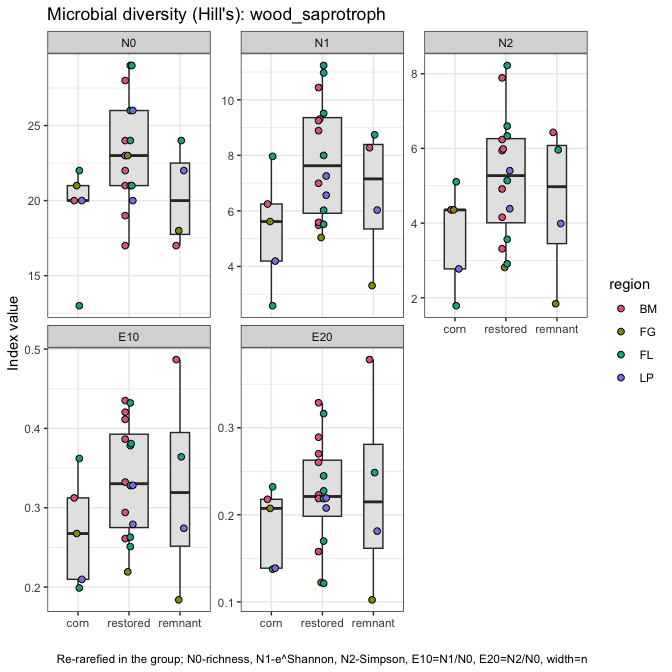

Microbial data: microbial guilds and taxonomy
================
Beau Larkin

Last updated: 07 March, 2023

- <a href="#description" id="toc-description">Description</a>
- <a href="#packages-and-libraries"
  id="toc-packages-and-libraries">Packages and libraries</a>
- <a href="#data" id="toc-data">Data</a>
  - <a href="#sites-species-tables"
    id="toc-sites-species-tables">Sites-species tables</a>
  - <a href="#species-metadata" id="toc-species-metadata">Species
    metadata</a>
  - <a href="#site-metadata-and-design"
    id="toc-site-metadata-and-design">Site metadata and design</a>
  - <a href="#joined-species-metadata-and-design-tables"
    id="toc-joined-species-metadata-and-design-tables">Joined species,
    metadata, and design tables</a>
- <a href="#functions" id="toc-functions">Functions</a>
  - <a href="#function-its-and-guilds"
    id="toc-function-its-and-guilds">Function: ITS and guilds</a>
  - <a href="#18s-based-data-amf" id="toc-18s-based-data-amf">18S-based data
    (AMF)</a>
  - <a href="#examine-change-over-time-in-guilds"
    id="toc-examine-change-over-time-in-guilds">Examine change over time in
    guilds</a>
  - <a href="#re-rarefy-in-guilds-or-groups"
    id="toc-re-rarefy-in-guilds-or-groups">Re-rarefy in guilds (or
    groups)</a>
    - <a href="#calculate-hills-series-on-a-samples-species-matrix"
      id="toc-calculate-hills-series-on-a-samples-species-matrix">Calculate
      Hill’s series on a samples-species matrix</a>
    - <a href="#results-from-re-rarefied-data"
      id="toc-results-from-re-rarefied-data">Results from re-rarefied data</a>
  - <a href="#perform-indicator-species-analysis"
    id="toc-perform-indicator-species-analysis">Perform Indicator Species
    Analysis</a>
- <a href="#analysis-and-results" id="toc-analysis-and-results">Analysis
  and Results</a>
  - <a href="#its-sequences" id="toc-its-sequences">ITS sequences</a>
    - <a href="#soil-saprotrophs" id="toc-soil-saprotrophs">Soil
      saprotrophs</a>
    - <a href="#plant-pathogens" id="toc-plant-pathogens">Plant pathogens</a>
    - <a href="#wood-saprotrophs" id="toc-wood-saprotrophs">Wood
      saprotrophs</a>
    - <a href="#litter-saprotrophs" id="toc-litter-saprotrophs">Litter
      saprotrophs</a>
  - <a href="#amf-otus" id="toc-amf-otus">AMF OTUs</a>
- <a href="#conclusions-taxa-and-guilds"
  id="toc-conclusions-taxa-and-guilds">Conclusions: taxa and guilds</a>

# Description

Sequence clusters identified in QIIME2 are annotated with taxonomic
information and metadata from [Fungal
traits](https://link.springer.com/article/10.1007/s13225-020-00466-2).
In this report, sequence abundances in taxonomic groups or fungal guilds
are compared across field types and with time since restoration.

The full sequence abundance tables were rarefied to make sequencing
depth equivalent across fields. This can result in lower-abundance OTUs
dropping to zero. Here, when richness and composition within guilds is
calculated, the raw abundances are used, filtered into particular
guilds, and then rarefied within those guilds to produce accurate
results.

# Packages and libraries

``` r
packages_needed = c("tidyverse",
                    "knitr",
                    "conflicted",
                    "ggbeeswarm",
                    "colorspace",
                    "rsq",
                    "lme4",
                    "multcomp",
                    "indicspecies",
                    "GUniFrac",
                    "vegan")
packages_installed = packages_needed %in% rownames(installed.packages())
```

``` r
if (any(!packages_installed)) {
    install.packages(packages_needed[!packages_installed])
}
```

``` r
for (i in 1:length(packages_needed)) {
    library(packages_needed[i], character.only = T)
}
```

``` r
conflict_prefer("filter", "dplyr")
conflict_prefer("select", "dplyr")
```

# Data

## Sites-species tables

CSV files were produced in `process_data.R`

``` r
spe <- list(
    its_raw = read_csv(
        paste0(getwd(), "/clean_data/spe_ITS_raw.csv"),
        show_col_types = FALSE
    ),
    its_rfy = read_csv(
        paste0(getwd(), "/clean_data/spe_ITS_rfy.csv"),
        show_col_types = FALSE
    ),
    amf_raw = read_csv(
        paste0(getwd(), "/clean_data/spe_18S_raw.csv"),
        show_col_types = FALSE
    ),
    amf_rfy = read_csv(
        paste0(getwd(), "/clean_data/spe_18S_rfy.csv"),
        show_col_types = FALSE
    )
)
```

## Species metadata

Load taxonomy for all and guilds (`primary_lifestyle` in Fungal Traits)
for ITS OTUs.

``` r
meta <- list(
    its_raw = 
        read_csv(
            paste0(getwd(), "/clean_data/spe_ITS_raw_taxonomy.csv"),
            show_col_types = FALSE
        ),
    its_rfy = 
        read_csv(
            paste0(getwd(), "/clean_data/spe_ITS_rfy_taxonomy.csv"),
            show_col_types = FALSE
        ),
    amf_raw = 
        read_csv(
            paste0(getwd(), "/clean_data/spe_18S_raw_taxonomy.csv"),
            show_col_types = FALSE
        ),
    amf_rfy = 
        read_csv(
            paste0(getwd(), "/clean_data/spe_18S_rfy_taxonomy.csv"),
            show_col_types = FALSE
        )
)
```

## Site metadata and design

``` r
sites   <-
    read_csv(paste0(getwd(), "/clean_data/sites.csv"), show_col_types = FALSE) %>%
    mutate(
        field_type = factor(
            field_type,
            ordered = TRUE,
            levels = c("corn", "restored", "remnant")
        )) %>%
    select(-lat, -long, -yr_restore, -yr_rank) %>% 
    arrange(field_key)
```

## Joined species, metadata, and design tables

Functions streamline this process

``` r
join_spe_meta <-
    function(spe, meta) {
        spe %>%
            pivot_longer(starts_with("otu"),
                         names_to = "otu_num",
                         values_to = "seq_abund") %>%
            filter(seq_abund != 0) %>%
            left_join(meta, by = join_by(otu_num)) %>%
            left_join(sites, by = join_by(field_key))
    }
```

``` r
spe_meta <- list(
    its_raw = 
        join_spe_meta(spe$its_raw, meta$its_raw) %>%
        write_csv(paste0(getwd(), "/clean_data/speTaxa_ITS_raw.csv")),
    its_rfy = 
        join_spe_meta(spe$its_rfy, meta$its_rfy) %>%
        write_csv(paste0(getwd(), "/clean_data/speTaxa_ITS_rfy.csv")),
    amf_raw = 
        join_spe_meta(spe$amf_raw, meta$amf_raw) %>%
        write_csv(paste0(getwd(), "/clean_data/speTaxa_18S_raw.csv")),
    amf_rfy = 
        join_spe_meta(spe$amf_rfy, meta$amf_rfy) %>%
        write_csv(paste0( getwd(), "/clean_data/speTaxa_18S_rfy.csv" ))
)
```

# Functions

Functions streamline data processing, model fitting, and results output.
\### Function: ITS taxonomy This function simplifies and displays the
sequence distribution among taxa and across primary lifestyles. Use the
argument `other_threshold` to choose a small (e.g., 2, the default)
cutoff, below which orders are relabeled as “other”.

``` r
its_taxaGuild <- function(data, other_threshold=2) {
    # What is the distribution among site types at the class level?
    taxonomy_df <-
        data %>%
        group_by(phylum, order, field_type, field_name) %>%
        summarize(abund = sum(seq_abund), .groups = "drop") %>%
        group_by(phylum, order, field_type) %>%
        summarize(mean = mean(abund) %>% round(., 2),
                  .groups = "drop") %>%
        pivot_wider(
            names_from = field_type,
            values_from = mean,
            values_fill = 0
        ) %>%
        select(phylum, order, corn, restored, remnant) %>%
        arrange(-remnant)
    print(kable(
        taxonomy_df,
        format = "pandoc",
        caption = "Distribution of ITS OTUs in classes; mean sequence abundance by field type"
    ))
    # What is the distribution of `primary_lifestyles` among site types?
    guild_df <-
        data %>%
        group_by(primary_lifestyle, field_type, field_name) %>%
        summarize(abund = sum(seq_abund), .groups = "drop") %>%
        group_by(primary_lifestyle, field_type) %>%
        summarize(mean = round(mean(abund), 1), .groups = "drop") %>%
        pivot_wider(
            names_from = field_type,
            values_from = mean,
            values_fill = 0
        ) %>%
        select(primary_lifestyle, corn, restored, remnant) %>%
        arrange(-remnant)
    # Create table
    table <- kable(guild_df, format = "pandoc",
        caption = "Distribution of ITS OTUs by Fungal Trait 'primary_lifestyle'; mean sequence abundance by field type")
    # Plot the most abundant orders across field types
    plot <- 
        data %>% 
        filter(order != is.na(order), order != "unidentified") %>% 
        group_by(field_type, order, field_key) %>% 
        summarize(seq_sum = sum(seq_abund), .groups = "drop_last") %>% 
        summarize(seq_avg = mean(seq_sum), .groups = "drop_last") %>% 
        mutate(seq_comp = (seq_avg / sum(seq_avg)) * 100,
               order = replace(order, which(seq_comp < 2), paste0("Other (OTU<", other_threshold, "%)"))) %>% 
        group_by(field_type, order) %>% 
        summarize(seq_comp = sum(seq_comp), .groups = "drop") %>% 
        ggplot(., aes(x = field_type, y = seq_comp)) +
        geom_col(aes(fill = order), color = "black") +
        labs(x = "", y = "Proportion of sequence abundance",
             title = "Composition of fungi") +
        scale_fill_discrete_sequential(name = "Order", palette = "Plasma") +
        theme_classic()
    
    print(list(table, plot))
    
}
```

### Function: ITS and guilds

Several primary lifestyles have been chosen from Fungal Traits for
further examination. These lifestyles were the largest by sequence
abundance and thought to be most informative given the habitat and
questions applied.

This function filters those groups and tests them among field types.
These tests aren’t technically valid due to pseudoreplication, but this
analysis can help us find trends worthy of further study.

``` r
its_test_taxaGuild <- function(data) {
    pl <- c("soil_saprotroph", "plant_pathogen", "ectomycorrhizal", "wood_saprotroph", "litter_saprotroph")
    df1 <- data.frame()
    for (i in 1:length(pl)) {
        cat("---------------------------------\n")
        print(pl[i])
        cat("---------------------------------\n")
        mod_data <- data %>%
            filter(primary_lifestyle == pl[i]) %>%
            group_by(field_type, region, field_name, yr_since, primary_lifestyle) %>%
            summarize(seq_sum = sum(seq_abund), .groups = "drop")
        print(kable(mod_data %>% arrange(-seq_sum), format = "pandoc"))
        cat("----------------------------------------------------\n\n")
        mmod <-
            lmer(seq_sum ~ field_type + (1 | region),
                 data = mod_data,
                 REML = FALSE)
        print(mmod)
        cat("----------------------------------------------------\n\n")
        mmod_null <-
            lmer(seq_sum ~ 1 + (1 | region),
                 data = mod_data,
                 REML = FALSE)
        print(mmod_null)
        cat("----------------------------------------------------\n\n")
        print(anova(mmod, mmod_null))
        cat("----------------------------------------------------\n\n")
        mod_tuk <-
            glht(mmod,
                 linfct = mcp(field_type = "Tukey"),
                 test = adjusted("holm"))
        print(summary(mod_tuk))
        print(cld(mod_tuk))
        cat("----------------------------------------------------\n\n")
        print(paste(
            "Years since restoration and",
            pl[i],
            "sequence abundance in Blue Mounds Area"
        ))
        mod_data2 <- mod_data %>%
            filter(region == "BM", field_type == "restored")
        print(summary(lm(seq_sum ~ yr_since,
                         data = mod_data2)))
        cat("\n\n\n")
        df1 <- rbind(df1, mod_data)
    }
    
    return(df1)
    
}
```

## 18S-based data (AMF)

This function simplifies and displays taxonomic information about the
AMF OTUs.

``` r
amf_tax <- function(data, cluster_type) {
    cat("---------------------------------\n")
    print(paste("AMF", cluster_type))
    cat("---------------------------------\n")
    amf_df <-
        data %>%
        group_by(family, field_type, region, site_name, yr_since) %>%
        summarize(seq_sum = sum(seq_abund) %>% round(., 1),
                  .groups = "drop")
    amf_df_summary <-
        amf_df %>%
        group_by(family, field_type) %>%
        summarize(seq_avg = mean(seq_sum) %>% round(., 1),
                  .groups = "drop") %>%
        pivot_wider(
            names_from = field_type,
            values_from = seq_avg,
            names_sort = TRUE,
            values_fill = 0
        ) %>%
        arrange(-remnant)
    print(kable(amf_df_summary, format = "pandoc"))
    write_csv(
        amf_df_summary,
        paste0(
            getwd(),
            "/microbial_guild_taxonomy_files/amf_",
            cluster_type,
            "_taxonomy.csv"
        )
    )
    cat("\n---------------------------------\n")
    print("Compare abundances across field types with mixed model")
    cat("---------------------------------\n")
    test_families <-
        amf_df %>% 
        count(region, family, field_type) %>% 
        count(region, family) %>% 
        filter(n == 3) %>% 
        pull(family) %>% 
        unique()
    for (i in 1:length(test_families)) {
        cat("\n---------------------------------\n")
        print(test_families[i])
        cat("---------------------------------\n")
        mmod <-
            lmer(
                seq_sum ~ field_type + (1 | region),
                data = amf_df %>% filter(family == test_families[i]),
                REML = FALSE
            )
        print(mmod)
        cat("----------------------------------------------------\n\n")
        mmod_null <-
            lmer(
                seq_sum ~ 1 + (1 | region),
                data = amf_df %>% filter(family == test_families[i]),
                REML = FALSE
            )
        print(mmod_null)
        cat("----------------------------------------------------\n\n")
        print(anova(mmod, mmod_null))
        cat("----------------------------------------------------\n\n")
        mod_tuk <-
            glht(mmod,
                 linfct = mcp(field_type = "Tukey"),
                 test = adjusted("holm"))
        print(summary(mod_tuk))
        print(cld(mod_tuk))
        cat("\n")
    }
    cat("\n---------------------------------\n")
    print("Test abundances with years since restoration")
    cat("---------------------------------\n")
    all7 <-
        amf_df %>%
        filter(field_type == "restored", region == "BM") %>%
        count(family) %>%
        filter(n == 7) %>%
        pull(family)
    mod_data <-
        amf_df %>%
        filter(field_type == "restored", region == "BM", family %in% all7)
    for (i in 1:length(all7)) {
        print(all7[i])
        print(summary(lm(
            seq_sum ~ yr_since, data = mod_data %>% filter(family == all7[i])
        )))
    }
    return(amf_df)
}
```

## Examine change over time in guilds

Function `guiltime()` filters ITS data to a user-specified guild and
produces linear models and plots of change in sequence abundance over
time since restoration in Blue Mounds and Fermilab.

``` r
guiltime <- function(pl) {
    d <- spe_meta$its_rfy %>%
        filter(
            primary_lifestyle == pl,
            region %in% c("BM", "FL"),
            field_type == "restored"
        ) %>% 
        group_by(field_key, field_name, region, yr_since) %>% 
        summarize(seq_sum = sum(seq_abund), .groups = "drop")
    
    bm <- summary(
        lm(seq_sum ~ yr_since, data = d %>% filter(region == "BM"))
    )
    fl <- summary(
        lm(seq_sum ~ yr_since, data = d %>% filter(region == "FL"))
    )
    
    fits <- data.frame(
        rbind(BM = c(coef(bm)[1,1], coef(bm)[2,1], coef(bm)[2,4]),
              FL = c(coef(fl)[1,1], coef(fl)[2,1], coef(fl)[2,4]))) %>% 
        mutate(lty = case_when(X3 < 0.05 ~ "a", TRUE ~ NA_character_)) %>% 
        rownames_to_column(var = "region")
    plot <- 
        ggplot(d, aes(x = yr_since, y = seq_sum)) +
        facet_wrap(vars(region), scales = "free_y") +
        geom_point() +
        geom_abline(data = fits, aes(slope = X2, intercept = X1, linetype = lty), color = "blue") +
        labs(x = "Years since restoration", 
             y = "Sum of ITS sequences",
             caption = "Solid line, if present, shows linear relationship at p<0.05") +
        theme_bw() +
        theme(legend.position = "none")
    
    out <- list(
        bm_summary = bm,
        fl_summary = fl,
        plot = plot
    )
    
    print(out)
    
}
```

## Re-rarefy in guilds (or groups)

To examine richness and composition within subgroups of OTUs, the raw
sequence data should be re-rarefied within those groups. Otherwise,
especially with low-abundance groups, data and sites may have been lost
when the entire species matrix was rarefied. This function automates the
process.

Outputs are:

1.  Sequencing depth used for the subset of OTUs
2.  Number of OTUs excluded by rarefying
3.  The re-rarefied samples-species matrix
4.  The OTU list in long form, with abundances, species, and site
    metadata

``` r
rerare <- function(spe, meta, grp_var, grp, site) {
    # spe       = species matrix with raw abundances
    # meta      = species metadata matching the OTU list with raw abundances
    # grp_var   = variable name from `meta` desired for grouping and filtering
    #             the OTUs (e.g., `primary_lifestyle`, `family`)
    # grp       = string or factor level name of the group desired from `grp_var`
    # site      = site metadata to combine with sequence abundance long-form
    #             output table
    
    grp_var <- enquo(grp_var)
    
    data <- 
        spe %>% 
        column_to_rownames(var = "field_key") %>% 
        t() %>% 
        as.data.frame() %>% 
        rownames_to_column(var = "otu_num") %>% 
        as_tibble() %>% 
        left_join(meta, by = join_by(otu_num)) %>% 
        filter(!!grp_var == grp) %>% 
        column_to_rownames(var = "otu_num") %>% 
        select(-colnames(meta)[-1]) %>% 
        t() %>% 
        as.data.frame()
    
    depth <- min(rowSums(data))
    rfy <- Rarefy(data)
    zero_otu <- which(apply(rfy$otu.tab.rff, 2, sum) == 0)
    rrfd <- data.frame(rfy$otu.tab.rff[, -zero_otu]) %>%
        rownames_to_column(var = "field_key") %>%
        mutate(field_key = as.numeric(field_key)) %>% 
        arrange(field_key) %>% 
        as_tibble()
    
    rrfd_speTaxa <- 
        rrfd %>% 
        pivot_longer(cols = starts_with("otu"), 
                     names_to = "otu_num", 
                     values_to = "seq_abund") %>% 
        filter(seq_abund > 0) %>% 
        left_join(meta, by = join_by(otu_num)) %>% 
        left_join(site, by = join_by(field_key)) %>% 
        select(-otu_ID)
    
    return(list(
        seq_depth = depth,
        zero_otu_num = length(zero_otu),
        rrfd = rrfd,
        rrfd_speTaxa = rrfd_speTaxa
    ))
    
}
```

### Calculate Hill’s series on a samples-species matrix

The object `$rrfd` from rerare() can be passed to this function

``` r
calc_diversity <- function(spe) {
    spe_mat <- data.frame(spe, row.names = 1)
    
    N0  <- apply(spe_mat > 0, MARGIN = 1, FUN = sum)
    N1  <- exp(diversity(spe_mat))
    N2  <- diversity(spe_mat, "inv")
    E10 <- N1 / N0
    E20 <- N2 / N0
    
    return(
        data.frame(N0, N1, N2, E10, E20) %>%
            rownames_to_column(var = "field_key") %>%
            mutate(field_key = as.integer(field_key)) %>%
            left_join(sites, by = join_by(field_key)) %>%
            pivot_longer(
                cols = N0:E20,
                names_to = "hill_index",
                values_to = "value"
            ) %>%
            mutate(hill_index = factor(
                hill_index,
                ordered = TRUE,
                levels = c("N0", "N1", "N2", "E10", "E20")
            ))
    )
}
```

### Results from re-rarefied data

After re-rarefying into a guild (or taxonomic group), produce diversity
statistics and calculate percent composition; display results. For
plotting, it’s convenient to limit the number of taxonomic orders
displayed. Use the argument `other_threshold` to choose a small (e.g.,
2, the default) cutoff, below which orders are relabeled as “other”.

``` r
gudicom <- function(div, rrfd, grp_var, other_threshold=2) {
    hillfield <-     
        ggplot(div, aes(x = field_type, y = value)) +
        facet_wrap(vars(hill_index), scales = "free_y") +
        geom_boxplot(varwidth = TRUE, fill = "gray90", outlier.shape = NA) +
        geom_beeswarm(aes(fill = region), shape = 21, size = 2, dodge.width = 0.2) +
        labs(x = "", y = "Index value", title = paste("Microbial diversity (Hill's):", grp_var),
             caption = "Re-rarefied in the group; N0-richness, N1-e^Shannon, N2-Simpson, E10=N1/N0, E20=N2/N0, width=n") +
        scale_fill_discrete_qualitative(palette = "Dark3") +
        theme_bw()
    hilltime <- 
        div %>% 
        filter(field_type == "restored", region %in% c("BM", "FL")) %>% 
        ggplot(aes(x = yr_since, y = value)) +
        facet_grid(rows = vars(hill_index), cols = vars(region), scales = "free") +
        geom_smooth(method = "lm") +
        geom_point() +
        labs(x = "Years since restoration", y = "Index value", title = paste("Microbial diversity (Hill's) in restored fields:", grp_var),
             caption = "Re-rarefied in the group; N0-richness, N1-e^Shannon, N2-Simpson, E10=N1/N0, E20=N2/N0, width=n") +
        theme_bw()
    comp <- 
        rrfd %>% 
        filter(order != is.na(order), order != "unidentified") %>% 
        group_by(field_type, order, field_key) %>% 
        summarize(seq_sum = sum(seq_abund), .groups = "drop_last") %>% 
        summarize(seq_avg = mean(seq_sum), .groups = "drop_last") %>% 
        mutate(seq_comp = (seq_avg / sum(seq_avg)) * 100,
               order = replace(order, which(seq_comp < other_threshold), paste0("Other (OTU<", other_threshold, "%)"))) %>% 
        group_by(field_type, order) %>% 
        summarize(seq_comp = sum(seq_comp), .groups = "drop")
    comp_plot <-
        ggplot(comp, aes(x = field_type, y = seq_comp)) +
        geom_col(aes(fill = order), color = "black") +
        labs(x = "", y = "Proportion of sequence abundance",
             title = paste("Composition of", grp_var)) +
        scale_fill_discrete_sequential(name = "Order", palette = "Plasma") +
        theme_classic()
    
    print(list(
        Hills_field_type = hillfield,
        Hills_yrs_since_restoration = hilltime,
        Composition = comp_plot
    ))
    
    return(comp)
    
}
```

## Perform Indicator Species Analysis

Function `inspan()` takes a combined species and sites data frame and
wrangles it through the analysis to filter OTUs for indicators of field
types. The output is top candidate OTUs joined with species metadata for
further analysis.

``` r
inspan <- function(data, np, meta) {
    # data is the samples-species matrix joined with the sites data frame
    # the join aligns the grouping vector with field numbers
    # np is the desired number of permutations
    # meta is the appropriate species metadata table for the original data
    spe <- data.frame(
        data %>% select(field_key, starts_with("otu")),
        row.names = 1
    )
    grp = data$field_type
    mp <- multipatt(
        spe, 
        grp, 
        max.order = 1, 
        control = how(nperm = np))
    si <- mp$sign %>% 
        select(index, stat, p.value) %>% 
        mutate(field_type = case_when(index == 1 ~ "corn", 
                                      index == 2 ~ "restored", 
                                      index == 3 ~ "remnant")) %>% 
        filter(p.value < 0.05) %>% 
        rownames_to_column(var = "otu_num") %>%
        select(-index) %>% 
        as_tibble()
    A  <- mp$A %>% 
        as.data.frame() %>% 
        rownames_to_column(var = "otu_num") %>% 
        pivot_longer(cols = corn:remnant, 
                     names_to = "field_type", 
                     values_to = "A")
    B <- mp$B %>% 
        as.data.frame() %>% 
        rownames_to_column(var = "otu_num") %>% 
        pivot_longer(cols = corn:remnant, 
                     names_to = "field_type", 
                     values_to = "B")
    out <- 
        si %>% 
        left_join(A, by = join_by(otu_num, field_type)) %>% 
        left_join(B, by = join_by(otu_num, field_type)) %>% 
        left_join(meta %>% select(-otu_ID), by = join_by(otu_num)) %>% 
        select(otu_num, A, B, stat, p.value, 
               field_type, primary_lifestyle, everything()) %>% 
        arrange(field_type, -stat)
    
    return(out)
    
}
```

# Analysis and Results

## ITS sequences

Function outputs are verbose, but details may be necessary later so they
are displayed here.

``` r
its_taxaGuild(spe_meta$its_rfy)
```

    ## 
    ## 
    ## Table: Distribution of ITS OTUs in classes; mean sequence abundance by field type
    ## 
    ## phylum                             order                                        corn   restored   remnant
    ## ---------------------------------  --------------------------------------  ---------  ---------  --------
    ## Ascomycota                         Hypocreales                               7295.00    6209.00   6917.25
    ## Ascomycota                         Chaetothyriales                            624.00    5573.44   5824.50
    ## Basidiomycota                      Agaricales                                2766.40    2082.00   5000.75
    ## Ascomycota                         Pleosporales                              6398.40    6405.56   4929.00
    ## Ascomycota                         Sordariales                              10384.80    4295.44   3317.25
    ## Ascomycota                         Helotiales                                2631.60    3266.38   3221.25
    ## Ascomycota                         NA                                        1267.80    2366.94   2874.25
    ## NA                                 NA                                        1215.00    1911.19   2318.00
    ## Ascomycota                         Onygenales                                  69.40    1267.56   2063.75
    ## Mortierellomycota                  Mortierellales                            3310.80    2572.88   1641.50
    ## Basidiomycota                      Thelephorales                                2.00      26.43   1041.75
    ## Ascomycota                         Geoglossales                                 5.67    1461.58    912.00
    ## Ascomycota                         GS34                                         0.00      72.00    692.00
    ## Ascomycota                         Glomerellales                             1740.00    1117.06    660.50
    ## Ascomycota                         unidentified                                 0.00     828.80    608.75
    ## Basidiomycota                      Cantharellales                             264.80     754.75    551.00
    ## Glomeromycota                      Glomerales                                  78.80     414.44    421.00
    ## Ascomycota                         Coniochaetales                             709.80     162.12    300.25
    ## Ascomycota                         Sordariomycetes_ord_Incertae_sedis          38.80      51.44    239.75
    ## Basidiomycota                      Russulales                                   4.00       3.50    182.33
    ## Ascomycota                         Xylariales                                  63.20     285.88    174.00
    ## Ascomycota                         Pezizales                                  927.60     311.31    168.00
    ## Basidiomycota                      NA                                          75.80     548.12    165.25
    ## Ascomycota                         Magnaporthales                              76.80     118.88    155.75
    ## Basidiomycota                      Sebacinales                                 27.20     621.31    155.50
    ## Ascomycota                         Capnodiales                                542.80     505.50    147.75
    ## Basidiomycota                      Boletales                                    5.00       8.00    143.00
    ## Glomeromycota                      NA                                           5.00     144.23    128.00
    ## Ascomycota                         Minutisphaerales                             0.00      58.00    106.50
    ## Ascomycota                         Chaetosphaeriales                          259.50     257.40    101.67
    ## Ascomycota                         Branch06                                    10.00     132.57     88.67
    ## Mucoromycota                       NA                                           0.00      24.00     83.00
    ## Ascomycota                         Mytilinidales                                0.00       0.00     82.00
    ## Basidiomycota                      Trichosporonales                           115.00      39.44     76.33
    ## Basidiomycota                      Auriculariales                             105.00     223.25     76.00
    ## Basidiomycota                      Tremellales                                 15.00      90.81     75.25
    ## Basidiomycota                      Filobasidiales                             809.50     292.21     71.67
    ## Chytridiomycota                    Spizellomycetales                          164.40      87.27     68.50
    ## Mucoromycota                       Umbelopsidales                               0.00       2.00     64.00
    ## Basidiomycota                      Cystofilobasidiales                       2273.80      84.15     62.50
    ## Ascomycota                         Mytilinidiales                               0.00      14.00     62.00
    ## Ascomycota                         Thelebolales                                90.75      35.69     62.00
    ## Basidiomycota                      Hymenochaetales                             11.80     179.43     60.50
    ## Ascomycota                         Dothideomycetes_ord_Incertae_sedis           0.00       0.00     52.00
    ## Chytridiomycota                    Rhizophlyctidales                          211.80     107.47     51.75
    ## Ascomycota                         Venturiales                                 31.00      72.92     45.67
    ## Basidiomycota                      Ustilaginales                                2.00      84.75     45.33
    ## Ascomycota                         Verrucariales                                0.00       0.00     45.00
    ## Ascomycota                         Orbiliales                                  22.67      81.29     31.33
    ## Basidiomycota                      Atheliales                                   0.00     148.50     30.00
    ## Basidiomycota                      Tremellodendropsidales                       9.00      28.08     30.00
    ## Basidiomycota                      Polyporales                                 19.80      28.00     28.25
    ## Basidiomycota                      Geminibasidiales                            63.00      76.75     28.00
    ## Ascomycota                         Tubeufiales                                 64.60     166.12     27.00
    ## Ascomycota                         Saccharomycetales                          263.50      38.10     26.00
    ## Basidiomycota                      Trechisporales                             118.40     364.69     24.67
    ## Ascomycota                         Myrmecridiales                               0.00      71.00     24.00
    ## Ascomycota                         Microascales                               108.00      72.45     23.00
    ## Chytridiomycota                    Chytridiales                                 5.00      85.25     21.00
    ## Rozellomycota                      GS11                                         0.00       2.00     20.00
    ## Basidiomycota                      Phallales                                  213.25      41.38     19.33
    ## Ascomycota                         GS32                                         0.00       0.00     19.00
    ## Basidiomycota                      Erythrobasidiales                            0.00       4.00     19.00
    ## Ascomycota                         Diaporthales                               124.00      10.43     14.50
    ## Chytridiomycota                    Rhizophydiales                              19.75      16.00     14.50
    ## Ascomycota                         Eurotiales                                 105.00      35.40     14.25
    ## Ascomycota                         Ostropales                                   0.00      52.00     13.00
    ## Basidiomycota                      Leucosporidiales                            33.33       8.57     12.50
    ## Ascomycota                         Savoryellales                               14.50      18.67     12.00
    ## Ascomycota                         Archaeorhizomycetales                        0.00      33.00     11.00
    ## Ascomycota                         Acrospermales                                0.00       8.00     10.00
    ## Glomeromycota                      Archaeosporales                              3.00       8.50      9.00
    ## Chlorophyta                        Chaetopeltidales                            11.50       5.50      7.50
    ## Mortierellomycota                  NA                                           0.00       4.50      7.00
    ## Ascomycota                         Rhytismatales                                0.00       1.00      6.00
    ## Basidiobolomycota                  Basidiobolales                               6.00      15.67      6.00
    ## Basidiomycota                      Agaricomycetes_ord_Incertae_sedis            0.00       0.00      6.00
    ## Ascomycota                         Dothideales                                  0.00      29.38      5.00
    ## Basidiomycota                      Geastrales                                  63.00      50.00      5.00
    ## Chlorophyta                        NA                                           9.00       7.50      5.00
    ## Anthophyta                         Poales                                       3.00       3.33      4.00
    ## Basidiomycota                      Microbotryomycetes_ord_Incertae_sedis        7.67      11.00      4.00
    ## Basidiomycota                      unidentified                                11.00     119.75      4.00
    ## Basidiomycota                      Atractiellales                              13.50       0.00      3.00
    ## Glomeromycota                      Diversisporales                              0.00       7.75      2.50
    ## Ichthyosporia_phy_Incertae_sedis   unidentified                                 0.00       0.00      2.00
    ## Mucoromycota                       Mucorales                                    0.00       5.83      2.00
    ## Ascomycota                         Candelariales                                0.00       4.00      1.00
    ## Entorrhizomycota                   Entorrhizales                                0.00       0.00      1.00
    ## Anthophyta                         Asterales                                    0.00       5.00      0.00
    ## Anthophyta                         Brassicales                                  8.00       5.00      0.00
    ## Anthophyta                         Commelinales                                 5.00     217.00      0.00
    ## Anthophyta                         Fabales                                      0.00      15.00      0.00
    ## Ascomycota                         Boliniales                                  38.50      44.50      0.00
    ## Ascomycota                         Botryosphaeriales                           13.50      19.80      0.00
    ## Ascomycota                         Jahnulales                                  11.00       0.00      0.00
    ## Ascomycota                         Pezizomycotina_ord_Incertae_sedis           32.50     489.00      0.00
    ## Ascomycota                         Phacidiales                                  0.00       5.50      0.00
    ## Ascomycota                         Phomatosporales                            665.00      10.67      0.00
    ## Ascomycota                         Trichosphaeriales                            5.00      19.50      0.00
    ## Basidiomycota                      Agaricostilbales                             2.00       2.00      0.00
    ## Basidiomycota                      Corticiales                                  0.00      43.43      0.00
    ## Basidiomycota                      Cystobasidiales                             32.50      11.67      0.00
    ## Basidiomycota                      Entylomatales                                0.00      11.20      0.00
    ## Basidiomycota                      Holtermanniales                              4.00      14.00      0.00
    ## Basidiomycota                      Kriegeriales                                 0.00       4.00      0.00
    ## Basidiomycota                      Platygloeales                                0.00      48.25      0.00
    ## Basidiomycota                      Pucciniales                                  0.00       9.00      0.00
    ## Basidiomycota                      Sporidiobolales                             44.00      16.25      0.00
    ## Basidiomycota                      Tilletiales                                  0.00      14.50      0.00
    ## Basidiomycota                      Urocystidales                               58.00       4.25      0.00
    ## Calcarisporiellomycota             Calcarisporiellales                          0.00       6.00      0.00
    ## Cercozoa                           unidentified                                 7.00       2.00      0.00
    ## Chlorophyta                        Chaetophorales                               0.00      23.00      0.00
    ## Chlorophyta                        Chlamydomonadales                            0.00       2.00      0.00
    ## Chlorophyta                        Chlorellales                                 0.00       6.00      0.00
    ## Chlorophyta                        Sphaeropleales                               0.00       5.00      0.00
    ## Chytridiomycota                    unidentified                                 8.00       2.00      0.00
    ## Chytridiomycota                    NA                                          14.00       8.00      0.00
    ## Glomeromycota                      Paraglomerales                               0.00      15.00      0.00
    ## Glomeromycota                      unidentified                                 2.00      20.40      0.00
    ## Haplosporidia                      Haplosporidia_ord_Incertae_sedis             3.00      10.00      0.00
    ## Mucoromycota                       GS22                                         0.00       4.00      0.00
    ## [[1]]
    ## 
    ## 
    ## Table: Distribution of ITS OTUs by Fungal Trait 'primary_lifestyle'; mean sequence abundance by field type
    ## 
    ## primary_lifestyle            corn   restored   remnant
    ## -----------------------  --------  ---------  --------
    ## NA                        20151.0    24785.1   27184.5
    ## soil_saprotroph            7123.4     5736.2    6067.2
    ## plant_pathogen             7068.4     7165.0    5622.2
    ## ectomycorrhizal              11.0      142.8    1979.2
    ## wood_saprotroph            2841.6     2290.1    1127.2
    ## litter_saprotroph          2063.2     1434.7    1124.2
    ## dung_saprotroph            2735.0     1559.6     936.0
    ## animal_parasite             660.6     1082.9     649.2
    ## mycoparasite               1820.2      598.2     213.2
    ## unspecified_saprotroph      773.0      159.0     175.8
    ## arbuscular_mycorrhizal       54.0      188.4     153.5
    ## root_endophyte               16.0      329.7     134.8
    ## pollen_saprotroph           152.4       75.6      52.5
    ## nectar/tap_saprotroph        37.5       36.0      26.0
    ## lichen_parasite              12.3       55.2      23.5
    ## epiphyte                      0.0        6.0      23.0
    ## lichenized                    0.0      100.0      13.0
    ## unspecified_pathotroph        0.0       13.2      10.5
    ## foliar_endophyte              3.0       31.5       4.0
    ## algal_parasite                2.0        4.2       0.0
    ## 
    ## [[2]]


``` r
its_rfy_guilds <- its_test_taxaGuild(spe_meta$its_rfy)
```

    ## ---------------------------------
    ## [1] "soil_saprotroph"
    ## ---------------------------------
    ## 
    ## 
    ## field_type   region   field_name    yr_since  primary_lifestyle    seq_sum
    ## -----------  -------  -----------  ---------  ------------------  --------
    ## corn         FL       FLC2                 0  soil_saprotroph        12046
    ## restored     BM       KORP1               28  soil_saprotroph        10616
    ## remnant      LP       LPREM1              NA  soil_saprotroph        10360
    ## restored     FL       FLRSP1              10  soil_saprotroph         9609
    ## restored     FL       FLRP5               35  soil_saprotroph         8813
    ## corn         FL       FLC1                 0  soil_saprotroph         7845
    ## corn         LP       LPC1                 0  soil_saprotroph         7329
    ## restored     BM       PHRP1               11  soil_saprotroph         7306
    ## restored     FL       FLRSP3              10  soil_saprotroph         7074
    ## remnant      BM       MBREM1              NA  soil_saprotroph         6558
    ## restored     BM       BBRP1               16  soil_saprotroph         6020
    ## corn         BM       PHC1                 0  soil_saprotroph         5167
    ## restored     FL       FLRP1               40  soil_saprotroph         5093
    ## restored     FL       FLRSP2              10  soil_saprotroph         4837
    ## restored     FL       FLRP4               36  soil_saprotroph         4550
    ## restored     BM       MBRP1               18  soil_saprotroph         4508
    ## remnant      FG       FGREM1              NA  soil_saprotroph         4427
    ## restored     LP       LPRP1                4  soil_saprotroph         4302
    ## restored     BM       ERRP1                3  soil_saprotroph         4171
    ## restored     BM       MHRP2                2  soil_saprotroph         4073
    ## restored     LP       LPRP2                4  soil_saprotroph         3956
    ## restored     BM       MHRP1                7  soil_saprotroph         3835
    ## corn         FG       FGC1                 0  soil_saprotroph         3230
    ## restored     FG       FGRP1               15  soil_saprotroph         3017
    ## remnant      FL       FLREM1              NA  soil_saprotroph         2924
    ## ----------------------------------------------------
    ## 
    ## Linear mixed model fit by maximum likelihood  ['lmerMod']
    ## Formula: seq_sum ~ field_type + (1 | region)
    ##    Data: mod_data
    ##       AIC       BIC    logLik  deviance  df.resid 
    ##  471.6598  477.7542 -230.8299  461.6598        20 
    ## Random effects:
    ##  Groups   Name        Std.Dev.
    ##  region   (Intercept)    0    
    ##  Residual             2476    
    ## Number of obs: 25, groups:  region, 4
    ## Fixed Effects:
    ##  (Intercept)  field_type.L  field_type.Q  
    ##       6309.0        -746.8         701.4  
    ## optimizer (nloptwrap) convergence code: 0 (OK) ; 0 optimizer warnings; 1 lme4 warnings 
    ## ----------------------------------------------------
    ## 
    ## Linear mixed model fit by maximum likelihood  ['lmerMod']
    ## Formula: seq_sum ~ 1 + (1 | region)
    ##    Data: mod_data
    ##       AIC       BIC    logLik  deviance  df.resid 
    ##  468.8281  472.4847 -231.4140  462.8281        22 
    ## Random effects:
    ##  Groups   Name        Std.Dev.
    ##  region   (Intercept)    0    
    ##  Residual             2534    
    ## Number of obs: 25, groups:  region, 4
    ## Fixed Effects:
    ## (Intercept)  
    ##        6067  
    ## optimizer (nloptwrap) convergence code: 0 (OK) ; 0 optimizer warnings; 1 lme4 warnings 
    ## ----------------------------------------------------
    ## 
    ## Data: mod_data
    ## Models:
    ## mmod_null: seq_sum ~ 1 + (1 | region)
    ## mmod: seq_sum ~ field_type + (1 | region)
    ##           npar    AIC    BIC  logLik deviance  Chisq Df Pr(>Chisq)
    ## mmod_null    3 468.83 472.48 -231.41   462.83                     
    ## mmod         5 471.66 477.75 -230.83   461.66 1.1683  2     0.5576
    ## ----------------------------------------------------
    ## 
    ## 
    ##   Simultaneous Tests for General Linear Hypotheses
    ## 
    ## Multiple Comparisons of Means: Tukey Contrasts
    ## 
    ## 
    ## Fit: lmer(formula = seq_sum ~ field_type + (1 | region), data = mod_data, 
    ##     REML = FALSE)
    ## 
    ## Linear Hypotheses:
    ##                         Estimate Std. Error z value Pr(>|z|)
    ## restored - corn == 0       -1387       1268  -1.094    0.513
    ## remnant - corn == 0        -1056       1661  -0.636    0.797
    ## remnant - restored == 0      331       1384   0.239    0.968
    ## (Adjusted p values reported -- single-step method)
    ## 
    ##     corn restored  remnant 
    ##      "a"      "a"      "a" 
    ## ----------------------------------------------------
    ## 
    ## [1] "Years since restoration and soil_saprotroph sequence abundance in Blue Mounds Area"
    ## 
    ## Call:
    ## lm(formula = seq_sum ~ yr_since, data = mod_data2)
    ## 
    ## Residuals:
    ##       1       2       3       4       5       6       7 
    ##  -597.3   342.4  1424.6 -2538.3  -851.6   458.9  1761.3 
    ## 
    ## Coefficients:
    ##             Estimate Std. Error t value Pr(>|t|)  
    ## (Intercept)  3185.04    1055.79   3.017   0.0295 *
    ## yr_since      214.51      71.02   3.020   0.0294 *
    ## ---
    ## Signif. codes:  0 '***' 0.001 '**' 0.01 '*' 0.05 '.' 0.1 ' ' 1
    ## 
    ## Residual standard error: 1611 on 5 degrees of freedom
    ## Multiple R-squared:  0.646,  Adjusted R-squared:  0.5752 
    ## F-statistic: 9.123 on 1 and 5 DF,  p-value: 0.0294
    ## 
    ## 
    ## 
    ## 
    ## ---------------------------------
    ## [1] "plant_pathogen"
    ## ---------------------------------
    ## 
    ## 
    ## field_type   region   field_name    yr_since  primary_lifestyle    seq_sum
    ## -----------  -------  -----------  ---------  ------------------  --------
    ## restored     BM       MHRP2                2  plant_pathogen         12342
    ## restored     BM       MHRP1                7  plant_pathogen         12155
    ## restored     LP       LPRP1                4  plant_pathogen         11571
    ## restored     BM       PHRP1               11  plant_pathogen         11314
    ## restored     FG       FGRP1               15  plant_pathogen         10631
    ## corn         LP       LPC1                 0  plant_pathogen         10322
    ## restored     BM       ERRP1                3  plant_pathogen          9998
    ## remnant      LP       LPREM1              NA  plant_pathogen          8111
    ## corn         FG       FGC1                 0  plant_pathogen          7598
    ## corn         FL       FLC2                 0  plant_pathogen          6751
    ## remnant      FG       FGREM1              NA  plant_pathogen          6293
    ## restored     BM       BBRP1               16  plant_pathogen          6215
    ## restored     LP       LPRP2                4  plant_pathogen          6111
    ## remnant      FL       FLREM1              NA  plant_pathogen          5713
    ## corn         FL       FLC1                 0  plant_pathogen          5469
    ## restored     FL       FLRP1               40  plant_pathogen          5444
    ## corn         BM       PHC1                 0  plant_pathogen          5202
    ## restored     FL       FLRSP2              10  plant_pathogen          5168
    ## restored     FL       FLRSP1              10  plant_pathogen          4884
    ## restored     BM       MBRP1               18  plant_pathogen          4364
    ## restored     FL       FLRP5               35  plant_pathogen          3994
    ## restored     FL       FLRP4               36  plant_pathogen          3797
    ## restored     BM       KORP1               28  plant_pathogen          3552
    ## restored     FL       FLRSP3              10  plant_pathogen          3100
    ## remnant      BM       MBREM1              NA  plant_pathogen          2372
    ## ----------------------------------------------------
    ## 
    ## Linear mixed model fit by maximum likelihood  ['lmerMod']
    ## Formula: seq_sum ~ field_type + (1 | region)
    ##    Data: mod_data
    ##       AIC       BIC    logLik  deviance  df.resid 
    ##  478.2810  484.3754 -234.1405  468.2810        20 
    ## Random effects:
    ##  Groups   Name        Std.Dev.
    ##  region   (Intercept) 1334    
    ##  Residual             2625    
    ## Number of obs: 25, groups:  region, 4
    ## Fixed Effects:
    ##  (Intercept)  field_type.L  field_type.Q  
    ##       6871.4       -1260.3        -876.9  
    ## ----------------------------------------------------
    ## 
    ## Linear mixed model fit by maximum likelihood  ['lmerMod']
    ## Formula: seq_sum ~ 1 + (1 | region)
    ##    Data: mod_data
    ##       AIC       BIC    logLik  deviance  df.resid 
    ##  475.8970  479.5537 -234.9485  469.8970        22 
    ## Random effects:
    ##  Groups   Name        Std.Dev.
    ##  region   (Intercept) 1146    
    ##  Residual             2759    
    ## Number of obs: 25, groups:  region, 4
    ## Fixed Effects:
    ## (Intercept)  
    ##        7138  
    ## ----------------------------------------------------
    ## 
    ## Data: mod_data
    ## Models:
    ## mmod_null: seq_sum ~ 1 + (1 | region)
    ## mmod: seq_sum ~ field_type + (1 | region)
    ##           npar    AIC    BIC  logLik deviance  Chisq Df Pr(>Chisq)
    ## mmod_null    3 475.90 479.55 -234.95   469.90                     
    ## mmod         5 478.28 484.38 -234.14   468.28 1.6161  2     0.4457
    ## ----------------------------------------------------
    ## 
    ## 
    ##   Simultaneous Tests for General Linear Hypotheses
    ## 
    ## Multiple Comparisons of Means: Tukey Contrasts
    ## 
    ## 
    ## Fit: lmer(formula = seq_sum ~ field_type + (1 | region), data = mod_data, 
    ##     REML = FALSE)
    ## 
    ## Linear Hypotheses:
    ##                         Estimate Std. Error z value Pr(>|z|)
    ## restored - corn == 0       182.8     1367.0   0.134    0.990
    ## remnant - corn == 0      -1782.3     1766.4  -1.009    0.567
    ## remnant - restored == 0  -1965.1     1496.1  -1.313    0.383
    ## (Adjusted p values reported -- single-step method)
    ## 
    ##     corn restored  remnant 
    ##      "a"      "a"      "a" 
    ## ----------------------------------------------------
    ## 
    ## [1] "Years since restoration and plant_pathogen sequence abundance in Blue Mounds Area"
    ## 
    ## Call:
    ## lm(formula = seq_sum ~ yr_since, data = mod_data2)
    ## 
    ## Residuals:
    ##       1       2       3       4       5       6       7 
    ##  -953.1 -1871.0   723.3 -2080.9  1732.4   111.4  2337.9 
    ## 
    ## Coefficients:
    ##             Estimate Std. Error t value Pr(>|t|)    
    ## (Intercept) 12953.84    1234.13  10.496 0.000135 ***
    ## yr_since     -361.61      83.02  -4.356 0.007319 ** 
    ## ---
    ## Signif. codes:  0 '***' 0.001 '**' 0.01 '*' 0.05 '.' 0.1 ' ' 1
    ## 
    ## Residual standard error: 1884 on 5 degrees of freedom
    ## Multiple R-squared:  0.7914, Adjusted R-squared:  0.7497 
    ## F-statistic: 18.97 on 1 and 5 DF,  p-value: 0.007319
    ## 
    ## 
    ## 
    ## 
    ## ---------------------------------
    ## [1] "ectomycorrhizal"
    ## ---------------------------------
    ## 
    ## 
    ## field_type   region   field_name    yr_since  primary_lifestyle    seq_sum
    ## -----------  -------  -----------  ---------  ------------------  --------
    ## remnant      FG       FGREM1              NA  ectomycorrhizal         3537
    ## remnant      FL       FLREM1              NA  ectomycorrhizal         2727
    ## remnant      BM       MBREM1              NA  ectomycorrhizal         1120
    ## restored     BM       MBRP1               18  ectomycorrhizal          543
    ## remnant      LP       LPREM1              NA  ectomycorrhizal          533
    ## restored     FL       FLRP1               40  ectomycorrhizal           14
    ## corn         LP       LPC1                 0  ectomycorrhizal           11
    ## restored     BM       MHRP2                2  ectomycorrhizal            8
    ## restored     FG       FGRP1               15  ectomycorrhizal            6
    ## ----------------------------------------------------
    ## 
    ## Linear mixed model fit by maximum likelihood  ['lmerMod']
    ## Formula: seq_sum ~ field_type + (1 | region)
    ##    Data: mod_data
    ##      AIC      BIC   logLik deviance df.resid 
    ## 156.2751 157.2613 -73.1376 146.2751        4 
    ## Random effects:
    ##  Groups   Name        Std.Dev.
    ##  region   (Intercept)   0.0   
    ##  Residual             818.5   
    ## Number of obs: 9, groups:  region, 4
    ## Fixed Effects:
    ##  (Intercept)  field_type.L  field_type.Q  
    ##          711          1392           696  
    ## optimizer (nloptwrap) convergence code: 0 (OK) ; 0 optimizer warnings; 1 lme4 warnings 
    ## ----------------------------------------------------
    ## 
    ## Linear mixed model fit by maximum likelihood  ['lmerMod']
    ## Formula: seq_sum ~ 1 + (1 | region)
    ##    Data: mod_data
    ##      AIC      BIC   logLik deviance df.resid 
    ## 159.6979 160.2896 -76.8490 153.6979        6 
    ## Random effects:
    ##  Groups   Name        Std.Dev.
    ##  region   (Intercept)    0    
    ##  Residual             1236    
    ## Number of obs: 9, groups:  region, 4
    ## Fixed Effects:
    ## (Intercept)  
    ##       944.3  
    ## optimizer (nloptwrap) convergence code: 0 (OK) ; 0 optimizer warnings; 1 lme4 warnings 
    ## ----------------------------------------------------
    ## 
    ## Data: mod_data
    ## Models:
    ## mmod_null: seq_sum ~ 1 + (1 | region)
    ## mmod: seq_sum ~ field_type + (1 | region)
    ##           npar    AIC    BIC  logLik deviance  Chisq Df Pr(>Chisq)  
    ## mmod_null    3 159.70 160.29 -76.849   153.70                       
    ## mmod         5 156.28 157.26 -73.138   146.28 7.4228  2    0.02444 *
    ## ---
    ## Signif. codes:  0 '***' 0.001 '**' 0.01 '*' 0.05 '.' 0.1 ' ' 1
    ## ----------------------------------------------------
    ## 
    ## 
    ##   Simultaneous Tests for General Linear Hypotheses
    ## 
    ## Multiple Comparisons of Means: Tukey Contrasts
    ## 
    ## 
    ## Fit: lmer(formula = seq_sum ~ field_type + (1 | region), data = mod_data, 
    ##     REML = FALSE)
    ## 
    ## Linear Hypotheses:
    ##                         Estimate Std. Error z value Pr(>|z|)   
    ## restored - corn == 0       131.7      915.1   0.144   0.9884   
    ## remnant - corn == 0       1968.2      915.1   2.151   0.0768 . 
    ## remnant - restored == 0   1836.5      578.8   3.173   0.0041 **
    ## ---
    ## Signif. codes:  0 '***' 0.001 '**' 0.01 '*' 0.05 '.' 0.1 ' ' 1
    ## (Adjusted p values reported -- single-step method)
    ## 
    ##     corn restored  remnant 
    ##     "ab"      "a"      "b" 
    ## ----------------------------------------------------
    ## 
    ## [1] "Years since restoration and ectomycorrhizal sequence abundance in Blue Mounds Area"
    ## 
    ## Call:
    ## lm(formula = seq_sum ~ yr_since, data = mod_data2)
    ## 
    ## Residuals:
    ## ALL 2 residuals are 0: no residual degrees of freedom!
    ## 
    ## Coefficients:
    ##             Estimate Std. Error t value Pr(>|t|)
    ## (Intercept)   -58.88        NaN     NaN      NaN
    ## yr_since       33.44        NaN     NaN      NaN
    ## 
    ## Residual standard error: NaN on 0 degrees of freedom
    ## Multiple R-squared:      1,  Adjusted R-squared:    NaN 
    ## F-statistic:   NaN on 1 and 0 DF,  p-value: NA
    ## 
    ## 
    ## 
    ## 
    ## ---------------------------------
    ## [1] "wood_saprotroph"
    ## ---------------------------------
    ## 
    ## 
    ## field_type   region   field_name    yr_since  primary_lifestyle    seq_sum
    ## -----------  -------  -----------  ---------  ------------------  --------
    ## restored     LP       LPRP2                4  wood_saprotroph         4706
    ## restored     FL       FLRSP2              10  wood_saprotroph         4056
    ## corn         LP       LPC1                 0  wood_saprotroph         3819
    ## restored     FG       FGRP1               15  wood_saprotroph         3783
    ## corn         FG       FGC1                 0  wood_saprotroph         3186
    ## corn         BM       PHC1                 0  wood_saprotroph         3065
    ## restored     BM       MHRP2                2  wood_saprotroph         2802
    ## corn         FL       FLC1                 0  wood_saprotroph         2789
    ## restored     BM       ERRP1                3  wood_saprotroph         2717
    ## restored     LP       LPRP1                4  wood_saprotroph         2532
    ## restored     BM       MHRP1                7  wood_saprotroph         2326
    ## restored     BM       PHRP1               11  wood_saprotroph         2233
    ## restored     FL       FLRP4               36  wood_saprotroph         2154
    ## remnant      FL       FLREM1              NA  wood_saprotroph         1992
    ## restored     FL       FLRSP1              10  wood_saprotroph         1909
    ## restored     BM       MBRP1               18  wood_saprotroph         1857
    ## restored     FL       FLRP5               35  wood_saprotroph         1528
    ## restored     FL       FLRP1               40  wood_saprotroph         1490
    ## corn         FL       FLC2                 0  wood_saprotroph         1349
    ## remnant      LP       LPREM1              NA  wood_saprotroph          965
    ## restored     FL       FLRSP3              10  wood_saprotroph          882
    ## remnant      BM       MBREM1              NA  wood_saprotroph          882
    ## restored     BM       KORP1               28  wood_saprotroph          855
    ## restored     BM       BBRP1               16  wood_saprotroph          812
    ## remnant      FG       FGREM1              NA  wood_saprotroph          670
    ## ----------------------------------------------------
    ## 
    ## Linear mixed model fit by maximum likelihood  ['lmerMod']
    ## Formula: seq_sum ~ field_type + (1 | region)
    ##    Data: mod_data
    ##       AIC       BIC    logLik  deviance  df.resid 
    ##  425.1543  431.2487 -207.5772  415.1543        20 
    ## Random effects:
    ##  Groups   Name        Std.Dev.
    ##  region   (Intercept) 206.4   
    ##  Residual             957.3   
    ## Number of obs: 25, groups:  region, 4
    ## Fixed Effects:
    ##  (Intercept)  field_type.L  field_type.Q  
    ##       2110.8       -1225.1        -287.3  
    ## ----------------------------------------------------
    ## 
    ## Linear mixed model fit by maximum likelihood  ['lmerMod']
    ## Formula: seq_sum ~ 1 + (1 | region)
    ##    Data: mod_data
    ##       AIC       BIC    logLik  deviance  df.resid 
    ##  427.4485  431.1052 -210.7243  421.4485        22 
    ## Random effects:
    ##  Groups   Name        Std.Dev.
    ##  region   (Intercept)    0    
    ##  Residual             1108    
    ## Number of obs: 25, groups:  region, 4
    ## Fixed Effects:
    ## (Intercept)  
    ##        2214  
    ## optimizer (nloptwrap) convergence code: 0 (OK) ; 0 optimizer warnings; 1 lme4 warnings 
    ## ----------------------------------------------------
    ## 
    ## Data: mod_data
    ## Models:
    ## mmod_null: seq_sum ~ 1 + (1 | region)
    ## mmod: seq_sum ~ field_type + (1 | region)
    ##           npar    AIC    BIC  logLik deviance  Chisq Df Pr(>Chisq)  
    ## mmod_null    3 427.45 431.11 -210.72   421.45                       
    ## mmod         5 425.15 431.25 -207.58   415.15 6.2942  2    0.04298 *
    ## ---
    ## Signif. codes:  0 '***' 0.001 '**' 0.01 '*' 0.05 '.' 0.1 ' ' 1
    ## ----------------------------------------------------
    ## 
    ## 
    ##   Simultaneous Tests for General Linear Hypotheses
    ## 
    ## Multiple Comparisons of Means: Tukey Contrasts
    ## 
    ## 
    ## Fit: lmer(formula = seq_sum ~ field_type + (1 | region), data = mod_data, 
    ##     REML = FALSE)
    ## 
    ## Linear Hypotheses:
    ##                         Estimate Std. Error z value Pr(>|z|)  
    ## restored - corn == 0      -514.4      493.3  -1.043   0.5451  
    ## remnant - corn == 0      -1732.5      642.9  -2.695   0.0186 *
    ## remnant - restored == 0  -1218.2      538.5  -2.262   0.0599 .
    ## ---
    ## Signif. codes:  0 '***' 0.001 '**' 0.01 '*' 0.05 '.' 0.1 ' ' 1
    ## (Adjusted p values reported -- single-step method)
    ## 
    ##     corn restored  remnant 
    ##      "a"     "ab"      "b" 
    ## ----------------------------------------------------
    ## 
    ## [1] "Years since restoration and wood_saprotroph sequence abundance in Blue Mounds Area"
    ## 
    ## Call:
    ## lm(formula = seq_sum ~ yr_since, data = mod_data2)
    ## 
    ## Residuals:
    ##       1       2       3       4       5       6       7 
    ## -829.91   59.82  150.26  371.29  -18.79   66.72  200.60 
    ## 
    ## Coefficients:
    ##             Estimate Std. Error t value Pr(>|t|)    
    ## (Intercept)  2891.47     277.63  10.415 0.000141 ***
    ## yr_since      -78.10      18.68  -4.182 0.008639 ** 
    ## ---
    ## Signif. codes:  0 '***' 0.001 '**' 0.01 '*' 0.05 '.' 0.1 ' ' 1
    ## 
    ## Residual standard error: 423.7 on 5 degrees of freedom
    ## Multiple R-squared:  0.7777, Adjusted R-squared:  0.7332 
    ## F-statistic: 17.49 on 1 and 5 DF,  p-value: 0.008639
    ## 
    ## 
    ## 
    ## 
    ## ---------------------------------
    ## [1] "litter_saprotroph"
    ## ---------------------------------
    ## 
    ## 
    ## field_type   region   field_name    yr_since  primary_lifestyle    seq_sum
    ## -----------  -------  -----------  ---------  ------------------  --------
    ## corn         FG       FGC1                 0  litter_saprotroph       4932
    ## restored     BM       ERRP1                3  litter_saprotroph       4833
    ## remnant      FL       FLREM1              NA  litter_saprotroph       2526
    ## corn         BM       PHC1                 0  litter_saprotroph       2349
    ## restored     BM       MBRP1               18  litter_saprotroph       2221
    ## restored     BM       BBRP1               16  litter_saprotroph       2076
    ## restored     LP       LPRP2                4  litter_saprotroph       2070
    ## restored     BM       MHRP1                7  litter_saprotroph       2017
    ## restored     LP       LPRP1                4  litter_saprotroph       1975
    ## restored     BM       MHRP2                2  litter_saprotroph       1749
    ## restored     FL       FLRSP2              10  litter_saprotroph       1497
    ## restored     BM       PHRP1               11  litter_saprotroph       1118
    ## corn         FL       FLC1                 0  litter_saprotroph       1116
    ## corn         FL       FLC2                 0  litter_saprotroph       1023
    ## corn         LP       LPC1                 0  litter_saprotroph        896
    ## restored     FL       FLRSP3              10  litter_saprotroph        828
    ## remnant      LP       LPREM1              NA  litter_saprotroph        820
    ## restored     BM       KORP1               28  litter_saprotroph        754
    ## remnant      FG       FGREM1              NA  litter_saprotroph        708
    ## remnant      BM       MBREM1              NA  litter_saprotroph        443
    ## restored     FL       FLRP4               36  litter_saprotroph        425
    ## restored     FL       FLRP5               35  litter_saprotroph        421
    ## restored     FL       FLRSP1              10  litter_saprotroph        396
    ## restored     FG       FGRP1               15  litter_saprotroph        369
    ## restored     FL       FLRP1               40  litter_saprotroph        206
    ## ----------------------------------------------------
    ## 
    ## Linear mixed model fit by maximum likelihood  ['lmerMod']
    ## Formula: seq_sum ~ field_type + (1 | region)
    ##    Data: mod_data
    ##       AIC       BIC    logLik  deviance  df.resid 
    ##  434.3499  440.4442 -212.1749  424.3499        20 
    ## Random effects:
    ##  Groups   Name        Std.Dev.
    ##  region   (Intercept)  263    
    ##  Residual             1148    
    ## Number of obs: 25, groups:  region, 4
    ## Fixed Effects:
    ##  (Intercept)  field_type.L  field_type.Q  
    ##       1555.8        -691.8         141.2  
    ## ----------------------------------------------------
    ## 
    ## Linear mixed model fit by maximum likelihood  ['lmerMod']
    ## Formula: seq_sum ~ 1 + (1 | region)
    ##    Data: mod_data
    ##       AIC       BIC    logLik  deviance  df.resid 
    ##  432.0696  435.7262 -213.0348  426.0696        22 
    ## Random effects:
    ##  Groups   Name        Std.Dev.
    ##  region   (Intercept)  185.5  
    ##  Residual             1201.7  
    ## Number of obs: 25, groups:  region, 4
    ## Fixed Effects:
    ## (Intercept)  
    ##        1517  
    ## ----------------------------------------------------
    ## 
    ## Data: mod_data
    ## Models:
    ## mmod_null: seq_sum ~ 1 + (1 | region)
    ## mmod: seq_sum ~ field_type + (1 | region)
    ##           npar    AIC    BIC  logLik deviance  Chisq Df Pr(>Chisq)
    ## mmod_null    3 432.07 435.73 -213.03   426.07                     
    ## mmod         5 434.35 440.44 -212.18   424.35 1.7197  2     0.4232
    ## ----------------------------------------------------
    ## 
    ## 
    ##   Simultaneous Tests for General Linear Hypotheses
    ## 
    ## Multiple Comparisons of Means: Tukey Contrasts
    ## 
    ## 
    ## Fit: lmer(formula = seq_sum ~ field_type + (1 | region), data = mod_data, 
    ##     REML = FALSE)
    ## 
    ## Linear Hypotheses:
    ##                         Estimate Std. Error z value Pr(>|z|)
    ## restored - corn == 0      -662.2      591.9  -1.119    0.498
    ## remnant - corn == 0       -978.4      771.1  -1.269    0.408
    ## remnant - restored == 0   -316.2      646.2  -0.489    0.875
    ## (Adjusted p values reported -- single-step method)
    ## 
    ##     corn restored  remnant 
    ##      "a"      "a"      "a" 
    ## ----------------------------------------------------
    ## 
    ## [1] "Years since restoration and litter_saprotroph sequence abundance in Blue Mounds Area"
    ## 
    ## Call:
    ## lm(formula = seq_sum ~ yr_since, data = mod_data2)
    ## 
    ## Residuals:
    ##       1       2       3       4       5       6       7 
    ##   270.5  2002.2  -105.1   573.2  -498.3 -1160.7 -1081.8 
    ## 
    ## Coefficients:
    ##             Estimate Std. Error t value Pr(>|t|)  
    ## (Intercept)  3067.40     785.52   3.905   0.0114 *
    ## yr_since      -78.87      52.84  -1.493   0.1958  
    ## ---
    ## Signif. codes:  0 '***' 0.001 '**' 0.01 '*' 0.05 '.' 0.1 ' ' 1
    ## 
    ## Residual standard error: 1199 on 5 degrees of freedom
    ## Multiple R-squared:  0.3082, Adjusted R-squared:  0.1699 
    ## F-statistic: 2.228 on 1 and 5 DF,  p-value: 0.1958

Model tests on `field_type` are technically invalid due to
pseudoreplication, but are included here to point out trends that we may
be able to present in some other valid way. Trends with restoration age
in Blue Mounds are clearly justified. Results are shown in descending
order based on sequence abundance in remnants:

- Soil saprotroph increases with years since
- Plant pathogens decrease with years since
- Ectomycorrhizal abundance is very low in corn/restored and with little
  replication; nothing can be said except that it’s relatively abundant
  in remnants.
- Wood saprotroph differs among field types (corn vs. remnant; restored
  intermediate) and decreases with years since
- Litter saprotroph is abundant everywhere, but differences over time or
  field type are weak.

#### ITS-based indicators

An indicator species analysis is warranted, identifying which species
correlate strongly with `field_type`. Performing this with all ITS data
may identify particular species to further examine, although it remains
a problem that we cannot distinguish field type from an individual field
due to pseudoreplication.

Following the indicator species analysis, richness and composition of
selected guilds is calculated. These calculations are done with data
re-rarefied into the guilds identified here, again to showcase
particular species which seem to drive differences among field types.
It’s also of value because this approach avoids the problem we have with
pseudoreplication.

With indicator species analysis performed using package
[indicspecies](http://sites.google.com/site/miqueldecaceres/), the index
values A and B show the specificity and fidelity components of the
IndVal combined index. The combined index value is noted as ‘stat’ in
the output table below.

``` r
its_inspan <- 
    spe$its_rfy %>% 
    left_join(sites, by = join_by(field_key)) %>% 
    inspan(., 1999, meta$its_rfy)
```

``` r
its_inspan %>%
    mutate(field_type = factor(
        field_type,
        ordered = TRUE,
        levels = c("corn", "restored", "remnant")
    )) %>%
    group_by(field_type) %>%
    summarize(
        n_otu = n(),
        stat_avg = mean(stat),
        stat_sd = sd(stat)
    ) %>% 
    kable(format = "pandoc", caption = "Indicator species stats of entire rarefied ITS table")
```

| field_type | n_otu |  stat_avg |   stat_sd |
|:-----------|------:|----------:|----------:|
| corn       |    92 | 0.8213678 | 0.1027331 |
| restored   |    10 | 0.8157168 | 0.0351250 |
| remnant    |    50 | 0.7408116 | 0.0800308 |

Indicator species stats of entire rarefied ITS table

Potential indicators were filtered to p.value\<0.05 before this summary
was produced. Cornfields are a restrictive habitat for soil microbes,
and that is reflected in the results here. More species have higher
specificity and fidelity to cornfields than the other field types. The
top ten indicators for each field type are printed here; the entire
table is available for further use.

``` r
its_inspan %>% 
    mutate(field_type = factor(
    field_type,
    ordered = TRUE,
    levels = c("corn", "restored", "remnant")
)) %>%
    group_by(field_type) %>% 
    slice_max(order_by = stat, n = 10) %>% 
    arrange(field_type, -stat) %>% 
    kable(format = "pandoc", caption = "Indicator species of ITS OTUs (top 10 per field type)")
```

| otu_num  |         A |      B |      stat | p.value | field_type | primary_lifestyle      | phylum            | class              | order                              | family                             | genus            | species                 |
|:---------|----------:|-------:|----------:|--------:|:-----------|:-----------------------|:------------------|:-------------------|:-----------------------------------|:-----------------------------------|:-----------------|:------------------------|
| otu_537  | 1.0000000 | 1.0000 | 1.0000000 |  0.0005 | corn       | soil_saprotroph        | Basidiomycota     | Agaricomycetes     | Agaricales                         | Bolbitiaceae                       | Conocybe         | Conocybe_apala          |
| otu_204  | 0.9937578 | 1.0000 | 0.9968740 |  0.0005 | corn       | NA                     | Mortierellomycota | Mortierellomycetes | Mortierellales                     | Mortierellaceae                    | NA               | NA                      |
| otu_172  | 0.9772048 | 1.0000 | 0.9885367 |  0.0005 | corn       | plant_pathogen         | Ascomycota        | Dothideomycetes    | Pleosporales                       | Corynesporascaceae                 | Corynespora      | Corynespora_cassiicola  |
| otu_188  | 0.9759492 | 1.0000 | 0.9879014 |  0.0005 | corn       | NA                     | NA                | NA                 | NA                                 | NA                                 | NA               | NA                      |
| otu_9    | 0.9753667 | 1.0000 | 0.9876066 |  0.0010 | corn       | soil_saprotroph        | Basidiomycota     | Tremellomycetes    | Cystofilobasidiales                | Mrakiaceae                         | Tausonia         | Tausonia_pullulans      |
| otu_200  | 0.9724757 | 1.0000 | 0.9861418 |  0.0005 | corn       | plant_pathogen         | Ascomycota        | Dothideomycetes    | Pleosporales                       | Phaeosphaeriaceae                  | Ophiosphaerella  | unidentified            |
| otu_59   | 0.9602305 | 1.0000 | 0.9799135 |  0.0005 | corn       | soil_saprotroph        | Mortierellomycota | Mortierellomycetes | Mortierellales                     | Mortierellaceae                    | Mortierella      | NA                      |
| otu_694  | 0.9400850 | 1.0000 | 0.9695798 |  0.0005 | corn       | NA                     | NA                | NA                 | NA                                 | NA                                 | NA               | NA                      |
| otu_553  | 0.9378783 | 1.0000 | 0.9684412 |  0.0025 | corn       | plant_pathogen         | Ascomycota        | Sordariomycetes    | Magnaporthales                     | Magnaporthaceae                    | Gaeumannomyces   | NA                      |
| otu_364  | 0.9318632 | 1.0000 | 0.9653306 |  0.0005 | corn       | NA                     | Ascomycota        | Sordariomycetes    | Sordariales                        | Lasiosphaeriaceae                  | Cladorrhinum     | NA                      |
| otu_332  | 0.9219288 | 0.8125 | 0.8654867 |  0.0400 | restored   | plant_pathogen         | Ascomycota        | Sordariomycetes    | Glomerellales                      | Plectosphaerellaceae               | Plectosphaerella | NA                      |
| otu_177  | 0.9809886 | 0.7500 | 0.8577537 |  0.0155 | restored   | NA                     | Ascomycota        | Dothideomycetes    | Pleosporales                       | NA                                 | NA               | NA                      |
| otu_817  | 1.0000000 | 0.6875 | 0.8291562 |  0.0235 | restored   | NA                     | Ascomycota        | NA                 | NA                                 | NA                                 | NA               | NA                      |
| otu_461  | 0.8351648 | 0.8125 | 0.8237545 |  0.0265 | restored   | NA                     | Ascomycota        | Dothideomycetes    | Pleosporales                       | Phaeosphaeriaceae                  | NA               | NA                      |
| otu_35   | 0.7234228 | 0.9375 | 0.8235344 |  0.0405 | restored   | animal_parasite        | Ascomycota        | Sordariomycetes    | Hypocreales                        | Clavicipitaceae                    | Metarhizium      | NA                      |
| otu_193  | 0.8307978 | 0.8125 | 0.8215979 |  0.0395 | restored   | NA                     | Basidiomycota     | Agaricomycetes     | Sebacinales                        | unidentified                       | unidentified     | unidentified            |
| otu_107  | 0.8061297 | 0.8125 | 0.8093086 |  0.0245 | restored   | NA                     | Ascomycota        | Dothideomycetes    | Pleosporales                       | NA                                 | NA               | NA                      |
| otu_114  | 0.6963432 | 0.9375 | 0.8079739 |  0.0015 | restored   | soil_saprotroph        | Mortierellomycota | Mortierellomycetes | Mortierellales                     | Mortierellaceae                    | Mortierella      | unidentified            |
| otu_33   | 0.5843320 | 1.0000 | 0.7644161 |  0.0440 | restored   | plant_pathogen         | Ascomycota        | Sordariomycetes    | Hypocreales                        | Nectriaceae                        | Fusarium         | NA                      |
| otu_10   | 0.5687968 | 1.0000 | 0.7541862 |  0.0150 | restored   | NA                     | Ascomycota        | NA                 | NA                                 | NA                                 | NA               | NA                      |
| otu_772  | 0.9272420 | 1.0000 | 0.9629340 |  0.0010 | remnant    | NA                     | Ascomycota        | Sordariomycetes    | NA                                 | NA                                 | NA               | NA                      |
| otu_629  | 0.9159892 | 1.0000 | 0.9570732 |  0.0010 | remnant    | NA                     | Ascomycota        | Leotiomycetes      | Helotiales                         | Hyaloscyphaceae                    | Microscypha      | unidentified            |
| otu_159  | 0.8185686 | 1.0000 | 0.9047478 |  0.0015 | remnant    | NA                     | Ascomycota        | Sordariomycetes    | Sordariomycetes_ord_Incertae_sedis | Sordariomycetes_fam_Incertae_sedis | Pleurophragmium  | unidentified            |
| otu_135  | 0.7768230 | 1.0000 | 0.8813757 |  0.0060 | remnant    | plant_pathogen         | Ascomycota        | Sordariomycetes    | Hypocreales                        | Nectriaceae                        | Ilyonectria      | NA                      |
| otu_854  | 1.0000000 | 0.7500 | 0.8660254 |  0.0025 | remnant    | NA                     | Ascomycota        | NA                 | NA                                 | NA                                 | NA               | NA                      |
| otu_1740 | 1.0000000 | 0.7500 | 0.8660254 |  0.0025 | remnant    | NA                     | Glomeromycota     | Glomeromycetes     | Glomerales                         | Glomeraceae                        | NA               | NA                      |
| otu_1098 | 0.9716841 | 0.7500 | 0.8536762 |  0.0050 | remnant    | NA                     | NA                | NA                 | NA                                 | NA                                 | NA               | NA                      |
| otu_1468 | 0.9332261 | 0.7500 | 0.8366119 |  0.0035 | remnant    | NA                     | Ascomycota        | Sordariomycetes    | NA                                 | NA                                 | NA               | NA                      |
| otu_140  | 0.9276552 | 0.7500 | 0.8341111 |  0.0355 | remnant    | soil_saprotroph        | Ascomycota        | Sordariomycetes    | Hypocreales                        | Stachybotryaceae                   | Striaticonidium  | Striaticonidium_cinctum |
| otu_369  | 0.6807314 | 1.0000 | 0.8250645 |  0.0085 | remnant    | unspecified_saprotroph | Ascomycota        | Sordariomycetes    | Hypocreales                        | Bionectriaceae                     | Gliomastix       | Gliomastix_roseogrisea  |

Indicator species of ITS OTUs (top 10 per field type)

### Soil saprotrophs

#### Trends over time

``` r
guiltime("soil_saprotroph")
```

    ## $bm_summary
    ## 
    ## Call:
    ## lm(formula = seq_sum ~ yr_since, data = d %>% filter(region == 
    ##     "BM"))
    ## 
    ## Residuals:
    ##       1       2       3       4       5       6       7 
    ##  -597.3   342.4  1424.6 -2538.3  -851.6   458.9  1761.3 
    ## 
    ## Coefficients:
    ##             Estimate Std. Error t value Pr(>|t|)  
    ## (Intercept)  3185.04    1055.79   3.017   0.0295 *
    ## yr_since      214.51      71.02   3.020   0.0294 *
    ## ---
    ## Signif. codes:  0 '***' 0.001 '**' 0.01 '*' 0.05 '.' 0.1 ' ' 1
    ## 
    ## Residual standard error: 1611 on 5 degrees of freedom
    ## Multiple R-squared:  0.646,  Adjusted R-squared:  0.5752 
    ## F-statistic: 9.123 on 1 and 5 DF,  p-value: 0.0294
    ## 
    ## 
    ## $fl_summary
    ## 
    ## Call:
    ## lm(formula = seq_sum ~ yr_since, data = d %>% filter(region == 
    ##     "FL"))
    ## 
    ## Residuals:
    ##       1       2       3       4       5       6 
    ##  -850.7 -1568.0  2651.5  2358.1 -2413.9  -176.9 
    ## 
    ## Coefficients:
    ##             Estimate Std. Error t value Pr(>|t|)  
    ## (Intercept)  7686.71    1896.81   4.052   0.0154 *
    ## yr_since      -43.58      69.88  -0.624   0.5667  
    ## ---
    ## Signif. codes:  0 '***' 0.001 '**' 0.01 '*' 0.05 '.' 0.1 ' ' 1
    ## 
    ## Residual standard error: 2325 on 4 degrees of freedom
    ## Multiple R-squared:  0.08861,    Adjusted R-squared:  -0.1392 
    ## F-statistic: 0.3889 on 1 and 4 DF,  p-value: 0.5667
    ## 
    ## 
    ## $plot


Sequence abundance of soil saprotrophs increases over time in the Blue
Mounds area ($R^2_{Adj}=0.58, p<0.05$), but this appears to be leveraged
by Karla Ott’s property, though. With all that big bluestem…maybe there
is more litter and soil carbon? It will be good to look at trends in
soil chemistry.

#### Diversity

``` r
(ssap <- rerare(spe$its_raw, meta$its_raw, primary_lifestyle, "soil_saprotroph", sites))
```

    ## $seq_depth
    ## [1] 3586
    ## 
    ## $zero_otu_num
    ## [1] 4
    ## 
    ## $rrfd
    ## # A tibble: 25 × 247
    ##    field_key otu_2 otu_9 otu_14 otu_27 otu_37 otu_41 otu_47 otu_49 otu_55 otu_59
    ##        <dbl> <dbl> <dbl>  <dbl>  <dbl>  <dbl>  <dbl>  <dbl>  <dbl>  <dbl>  <dbl>
    ##  1         1   751     0     92      2    174     18    863      0    610      0
    ##  2         2  1469     0    443      4    158     67      0      0      0      0
    ##  3         3     7    29    410      0    245    460      0      0      0    286
    ##  4         4     0     0      0      0    278    215     24      0     21      0
    ##  5         5   118    49      0      0    121     35      0      0      0    218
    ##  6         6   138  1282    393    162     27    248      0      0      0     62
    ##  7         7   344  2228     49     27    100     55      0      3      0    256
    ##  8         8   601    38    373     71    219     62     19      0      0     25
    ##  9         9   724     0    299      1    136     47    957      0    721      8
    ## 10        10   566     0    345      0     46     69    359      0   1234      0
    ## # … with 15 more rows, and 236 more variables: otu_61 <dbl>, otu_66 <dbl>,
    ## #   otu_70 <dbl>, otu_75 <dbl>, otu_79 <dbl>, otu_88 <dbl>, otu_89 <dbl>,
    ## #   otu_100 <dbl>, otu_102 <dbl>, otu_106 <dbl>, otu_114 <dbl>, otu_132 <dbl>,
    ## #   otu_134 <dbl>, otu_140 <dbl>, otu_144 <dbl>, otu_154 <dbl>, otu_168 <dbl>,
    ## #   otu_170 <dbl>, otu_180 <dbl>, otu_182 <dbl>, otu_192 <dbl>, otu_195 <dbl>,
    ## #   otu_209 <dbl>, otu_216 <dbl>, otu_221 <dbl>, otu_223 <dbl>, otu_224 <dbl>,
    ## #   otu_234 <dbl>, otu_276 <dbl>, otu_280 <dbl>, otu_283 <dbl>, …
    ## 
    ## $rrfd_speTaxa
    ## # A tibble: 940 × 14
    ##    field_key otu_num seq_abund phylum   class order family genus species prima…¹
    ##        <dbl> <chr>       <dbl> <chr>    <chr> <chr> <chr>  <chr> <chr>   <chr>  
    ##  1         1 otu_2         751 Mortier… Mort… Mort… Morti… Mort… Mortie… soil_s…
    ##  2         1 otu_14         92 Mortier… Mort… Mort… Morti… Mort… <NA>    soil_s…
    ##  3         1 otu_27          2 Basidio… Trem… Filo… Pisku… Soli… <NA>    soil_s…
    ##  4         1 otu_37        174 Mortier… Mort… Mort… Morti… Mort… <NA>    soil_s…
    ##  5         1 otu_41         18 Mortier… Mort… Mort… Morti… Mort… Mortie… soil_s…
    ##  6         1 otu_47        863 Ascomyc… Geog… Geog… Geogl… Geog… uniden… soil_s…
    ##  7         1 otu_55        610 Basidio… Agar… Agar… Hygro… Hygr… <NA>    soil_s…
    ##  8         1 otu_75          4 Basidio… Trem… Filo… Pisku… Soli… Solico… soil_s…
    ##  9         1 otu_79         48 Mortier… Mort… Mort… Morti… Mort… <NA>    soil_s…
    ## 10         1 otu_114        73 Mortier… Mort… Mort… Morti… Mort… uniden… soil_s…
    ## # … with 930 more rows, 4 more variables: field_name <chr>, region <chr>,
    ## #   field_type <ord>, yr_since <dbl>, and abbreviated variable name
    ## #   ¹​primary_lifestyle

``` r
ssap_div <- calc_diversity(ssap$rrfd)
```

Diversity measures are stored in this data frame for further use…

``` r
(ssap_comp <- gudicom(ssap_div, ssap$rrfd_speTaxa, "soil_saprotroph"))
```

    ## $Hills_field_type


    ## 
    ## $Hills_yrs_since_restoration


    ## 
    ## $Composition


<div data-pagedtable="false">

<script data-pagedtable-source type="application/json">
{"columns":[{"label":["field_type"],"name":[1],"type":["ord"],"align":["right"]},{"label":["order"],"name":[2],"type":["chr"],"align":["left"]},{"label":["seq_comp"],"name":[3],"type":["dbl"],"align":["right"]}],"data":[{"1":"corn","2":"Agaricales","3":"11.163677"},{"1":"corn","2":"Cystofilobasidiales","3":"20.375033"},{"1":"corn","2":"Filobasidiales","3":"10.151803"},{"1":"corn","2":"Mortierellales","3":"47.342454"},{"1":"corn","2":"Other (OTU<2%)","3":"4.620669"},{"1":"corn","2":"Pezizales","3":"2.550186"},{"1":"corn","2":"Phallales","3":"3.796179"},{"1":"restored","2":"Agaricales","3":"20.980928"},{"1":"restored","2":"Filobasidiales","3":"6.021423"},{"1":"restored","2":"Geoglossales","3":"16.203688"},{"1":"restored","2":"Hypocreales","3":"4.430061"},{"1":"restored","2":"Mortierellales","3":"38.767564"},{"1":"restored","2":"Other (OTU<2%)","3":"9.939916"},{"1":"restored","2":"Pezizales","3":"3.656419"},{"1":"remnant","2":"Agaricales","3":"40.662749"},{"1":"remnant","2":"Geoglossales","3":"8.964809"},{"1":"remnant","2":"Helotiales","3":"4.351340"},{"1":"remnant","2":"Hypocreales","3":"10.517923"},{"1":"remnant","2":"Mortierellales","3":"28.493414"},{"1":"remnant","2":"Other (OTU<2%)","3":"7.009764"}],"options":{"columns":{"min":{},"max":[10]},"rows":{"min":[10],"max":[10]},"pages":{}}}
  </script>

</div>

Richness increases from corn to remnant, but within-group variability is
high. Diversity indices look muddy. Diversity indices increase with
years since restoration, but the significance of this remains to be
seen.

Composition of soil saprotrophs by order can be modified somewhat by
choosing the threshold for lumping rare orders into an “other” category.
Leaving this at the default of \<2%, nine named orders are left. Agarics
increase strongly from corn to remnant; Cystofilobasidiales and
Filobasidiales aren’t found outside of cornfields. Generally, cornfield
composition looks different than the other two, but remnants do appear
somewhat intermediate.

#### Indicators

``` r
ssap_inspan <- 
    ssap$rrfd %>% 
    left_join(sites, by = join_by(field_key)) %>% 
    inspan(., 1999, meta$its_raw)
```

``` r
ssap_inspan %>%
    mutate(field_type = factor(
        field_type,
        ordered = TRUE,
        levels = c("corn", "restored", "remnant")
    )) %>%
    group_by(field_type) %>%
    summarize(
        n_otu = n(),
        stat_avg = mean(stat),
        stat_sd = sd(stat)
    ) %>% 
    kable(format = "pandoc", caption = "Indicator species stats: soil saprotrophs")
```

| field_type | n_otu |  stat_avg |   stat_sd |
|:-----------|------:|----------:|----------:|
| corn       |     6 | 0.9002764 | 0.0627945 |
| restored   |     2 | 0.7828571 | 0.0046584 |
| remnant    |     2 | 0.6849543 | 0.0313283 |

Indicator species stats: soil saprotrophs

We see the same trend as before, where more indicators are found in
cornfields, and their indicator stats are stronger.

``` r
ssap_inspan %>% 
    mutate(field_type = factor(
        field_type,
        ordered = TRUE,
        levels = c("corn", "restored", "remnant")
    )) %>%
    arrange(field_type, -stat) %>% 
    kable(format = "pandoc", caption = "Indicator species of soil saprotrophs")
```

| otu_num  |         A |      B |      stat | p.value | field_type | primary_lifestyle | phylum            | class              | order               | family           | genus              | species                 |
|:---------|----------:|-------:|----------:|--------:|:-----------|:------------------|:------------------|:-------------------|:--------------------|:-----------------|:-------------------|:------------------------|
| otu_9    | 0.9421983 | 1.0000 | 0.9706690 |  0.0020 | corn       | soil_saprotroph   | Basidiomycota     | Tremellomycetes    | Cystofilobasidiales | Mrakiaceae       | Tausonia           | Tausonia_pullulans      |
| otu_59   | 0.9327003 | 1.0000 | 0.9657641 |  0.0005 | corn       | soil_saprotroph   | Mortierellomycota | Mortierellomycetes | Mortierellales      | Mortierellaceae  | Mortierella        | NA                      |
| otu_134  | 0.8330147 | 1.0000 | 0.9126964 |  0.0030 | corn       | soil_saprotroph   | Mortierellomycota | Mortierellomycetes | Mortierellales      | Mortierellaceae  | Mortierella        | NA                      |
| otu_537  | 1.0000000 | 0.8000 | 0.8944272 |  0.0015 | corn       | soil_saprotroph   | Basidiomycota     | Agaricomycetes     | Agaricales          | Bolbitiaceae     | Conocybe           | Conocybe_apala          |
| otu_61   | 0.8764195 | 0.8000 | 0.8373384 |  0.0455 | corn       | soil_saprotroph   | Basidiomycota     | Agaricomycetes     | Phallales           | Phallaceae       | Phallus            | Phallus_rugulosus       |
| otu_41   | 0.6736523 | 1.0000 | 0.8207633 |  0.0150 | corn       | soil_saprotroph   | Mortierellomycota | Mortierellomycetes | Mortierellales      | Mortierellaceae  | Mortierella        | Mortierella_minutissima |
| otu_114  | 0.6592357 | 0.9375 | 0.7861510 |  0.0145 | restored   | soil_saprotroph   | Mortierellomycota | Mortierellomycetes | Mortierellales      | Mortierellaceae  | Mortierella        | unidentified            |
| otu_2    | 0.6077186 | 1.0000 | 0.7795631 |  0.0290 | restored   | soil_saprotroph   | Mortierellomycota | Mortierellomycetes | Mortierellales      | Mortierellaceae  | Mortierella        | Mortierella_exigua      |
| otu_2138 | 1.0000000 | 0.5000 | 0.7071068 |  0.0180 | remnant    | soil_saprotroph   | Ascomycota        | Leotiomycetes      | Thelebolales        | Pseudeurotiaceae | Gymnostellatospora | NA                      |
| otu_1192 | 0.8786127 | 0.5000 | 0.6628019 |  0.0490 | remnant    | soil_saprotroph   | Basidiomycota     | Agaricomycetes     | Agaricales          | Clavariaceae     | Clavaria           | unidentified            |

Indicator species of soil saprotrophs

A later task will be to comb these tables for species with good stories…

### Plant pathogens

#### Trends over time

``` r
guiltime("plant_pathogen")
```

    ## $bm_summary
    ## 
    ## Call:
    ## lm(formula = seq_sum ~ yr_since, data = d %>% filter(region == 
    ##     "BM"))
    ## 
    ## Residuals:
    ##       1       2       3       4       5       6       7 
    ##  -953.1 -1871.0   723.3 -2080.9  1732.4   111.4  2337.9 
    ## 
    ## Coefficients:
    ##             Estimate Std. Error t value Pr(>|t|)    
    ## (Intercept) 12953.84    1234.13  10.496 0.000135 ***
    ## yr_since     -361.61      83.02  -4.356 0.007319 ** 
    ## ---
    ## Signif. codes:  0 '***' 0.001 '**' 0.01 '*' 0.05 '.' 0.1 ' ' 1
    ## 
    ## Residual standard error: 1884 on 5 degrees of freedom
    ## Multiple R-squared:  0.7914, Adjusted R-squared:  0.7497 
    ## F-statistic: 18.97 on 1 and 5 DF,  p-value: 0.007319
    ## 
    ## 
    ## $fl_summary
    ## 
    ## Call:
    ## lm(formula = seq_sum ~ yr_since, data = d %>% filter(region == 
    ##     "FL"))
    ## 
    ## Residuals:
    ##       1       2       3       4       5       6 
    ##   961.7  -664.8  -462.7   555.3   839.3 -1228.7 
    ## 
    ## Coefficients:
    ##             Estimate Std. Error t value Pr(>|t|)   
    ## (Intercept) 4277.575    826.145   5.178  0.00662 **
    ## yr_since       5.117     30.435   0.168  0.87463   
    ## ---
    ## Signif. codes:  0 '***' 0.001 '**' 0.01 '*' 0.05 '.' 0.1 ' ' 1
    ## 
    ## Residual standard error: 1013 on 4 degrees of freedom
    ## Multiple R-squared:  0.007018,   Adjusted R-squared:  -0.2412 
    ## F-statistic: 0.02827 on 1 and 4 DF,  p-value: 0.8746
    ## 
    ## 
    ## $plot


A strong decline in pathogens is seen in Blue Mounds’ restored fields
($R^2_{Adj}=0.75, p<0.01$), and although two distinct groups are
apparent, no single site displays undue leverage. It’s possible that a
signal like this will be found in soil chemistry or plant data and can
help explain what we are seeing here. Recall also that AMF were
previously found to increase along this same sequence…maybe that will
still hold up.

#### Diversity

``` r
(ppat <- rerare(spe$its_raw, meta$its_raw, primary_lifestyle, "plant_pathogen", sites))
```

    ## $seq_depth
    ## [1] 2786
    ## 
    ## $zero_otu_num
    ## [1] 6
    ## 
    ## $rrfd
    ## # A tibble: 25 × 155
    ##    field_key otu_1 otu_3 otu_7 otu_13 otu_16 otu_21 otu_23 otu_28 otu_33 otu_43
    ##        <dbl> <dbl> <dbl> <dbl>  <dbl>  <dbl>  <dbl>  <dbl>  <dbl>  <dbl>  <dbl>
    ##  1         1   449    31  1596     10     42      0    169      0     41      9
    ##  2         2   782   226   131    219     73      4     80      4    240     27
    ##  3         3   134   100    58    748    187    779     75     67     29     52
    ##  4         4   741     3   667      0      0      0     57      0     45      0
    ##  5         5   119   111  1185     46    116     27     36     33     40     65
    ##  6         6   496   107   503      6    263    492    134     40     16    120
    ##  7         7   433   443    42    239    295    190     94    202     92     81
    ##  8         8   692   291   580     60     47     44     29     62    158     42
    ##  9         9   787   408   377    102     17      0    296      0    107      5
    ## 10        10   539   590   695     55      9      1     24      0    142      0
    ## # … with 15 more rows, and 144 more variables: otu_53 <dbl>, otu_58 <dbl>,
    ## #   otu_65 <dbl>, otu_68 <dbl>, otu_87 <dbl>, otu_99 <dbl>, otu_135 <dbl>,
    ## #   otu_137 <dbl>, otu_153 <dbl>, otu_172 <dbl>, otu_179 <dbl>, otu_200 <dbl>,
    ## #   otu_212 <dbl>, otu_279 <dbl>, otu_285 <dbl>, otu_289 <dbl>, otu_294 <dbl>,
    ## #   otu_304 <dbl>, otu_315 <dbl>, otu_319 <dbl>, otu_325 <dbl>, otu_332 <dbl>,
    ## #   otu_383 <dbl>, otu_391 <dbl>, otu_408 <dbl>, otu_416 <dbl>, otu_425 <dbl>,
    ## #   otu_432 <dbl>, otu_504 <dbl>, otu_511 <dbl>, otu_521 <dbl>, …
    ## 
    ## $rrfd_speTaxa
    ## # A tibble: 835 × 14
    ##    field_key otu_num seq_abund phylum   class order family genus species prima…¹
    ##        <dbl> <chr>       <dbl> <chr>    <chr> <chr> <chr>  <chr> <chr>   <chr>  
    ##  1         1 otu_1         449 Ascomyc… Sord… Hypo… Nectr… Fusa… Fusari… plant_…
    ##  2         1 otu_3          31 Ascomyc… Sord… Glom… Plect… Gibe… <NA>    plant_…
    ##  3         1 otu_7        1596 Ascomyc… Doth… Pleo… Peric… Peri… <NA>    plant_…
    ##  4         1 otu_13         10 Ascomyc… Sord… Glom… Plect… Plec… Plecto… plant_…
    ##  5         1 otu_16         42 Ascomyc… Sord… Hypo… Nectr… Nect… Nectri… plant_…
    ##  6         1 otu_23        169 Ascomyc… Doth… Pleo… Pleos… Alte… <NA>    plant_…
    ##  7         1 otu_33         41 Ascomyc… Sord… Hypo… Nectr… Fusa… <NA>    plant_…
    ##  8         1 otu_43          9 Ascomyc… Sord… Hypo… Nectr… Fusa… Fusari… plant_…
    ##  9         1 otu_58         20 Ascomyc… Doth… Pleo… Phaeo… Para… <NA>    plant_…
    ## 10         1 otu_65          7 Ascomyc… Sord… Hypo… Nectr… Gibb… Gibber… plant_…
    ## # … with 825 more rows, 4 more variables: field_name <chr>, region <chr>,
    ## #   field_type <ord>, yr_since <dbl>, and abbreviated variable name
    ## #   ¹​primary_lifestyle

``` r
ppat_div <- calc_diversity(ppat$rrfd)
```

``` r
(ppat_comp <- gudicom(ppat_div, ppat$rrfd_speTaxa, "plant_pathogen", other_threshold = 1))
```

    ## $Hills_field_type


    ## 
    ## $Hills_yrs_since_restoration


    ## 
    ## $Composition


<div data-pagedtable="false">

<script data-pagedtable-source type="application/json">
{"columns":[{"label":["field_type"],"name":[1],"type":["ord"],"align":["right"]},{"label":["order"],"name":[2],"type":["chr"],"align":["left"]},{"label":["seq_comp"],"name":[3],"type":["dbl"],"align":["right"]}],"data":[{"1":"corn","2":"Diaporthales","3":"1.294106"},{"1":"corn","2":"Glomerellales","3":"22.720304"},{"1":"corn","2":"Hypocreales","3":"36.556745"},{"1":"corn","2":"Magnaporthales","3":"1.182183"},{"1":"corn","2":"Other (OTU<1%)","3":"2.200563"},{"1":"corn","2":"Pleosporales","3":"34.926871"},{"1":"corn","2":"Urocystidales","3":"1.119227"},{"1":"restored","2":"Cantharellales","3":"2.598802"},{"1":"restored","2":"Capnodiales","3":"1.743785"},{"1":"restored","2":"Glomerellales","3":"13.700662"},{"1":"restored","2":"Hypocreales","3":"43.150231"},{"1":"restored","2":"Other (OTU<1%)","3":"3.601759"},{"1":"restored","2":"Pleosporales","3":"32.527208"},{"1":"restored","2":"Ustilaginales","3":"1.147523"},{"1":"restored","2":"Xylariales","3":"1.530030"},{"1":"remnant","2":"Cantharellales","3":"3.446295"},{"1":"remnant","2":"Glomerellales","3":"8.710511"},{"1":"remnant","2":"Hypocreales","3":"54.873636"},{"1":"remnant","2":"Other (OTU<1%)","3":"2.280299"},{"1":"remnant","2":"Pezizales","3":"1.723148"},{"1":"remnant","2":"Pleosporales","3":"28.966111"}],"options":{"columns":{"min":{},"max":[10]},"rows":{"min":[10],"max":[10]},"pages":{}}}
  </script>

</div>

Richness and diversity look flat or declining from corn to remnants and
evenness takes a hit in restored and remnant fields. It looks like we
have fewer pathogens, but more dominant individual taxa become
established. Pathogen diversity decreases with years since restoration
in Blue Mounds, but if the dumbbell plots can be believed, the opposite
appears true in Fermi.

Many pathogen orders are rare, so the argument `other_threshold` was
adjusted to show more diversity. Shifts don’t appear pronounced.
*Diaporthales* decreases in composition from corn to remnant while
*Hypocreales* pathogens increase. *Cantharellales* appear a small
component but are possibly “late successional” pathogens, possibly
associated with some native plant in a plant-soil feedback.

#### Indicators

``` r
ppat_inspan <- 
    ppat$rrfd %>% 
    left_join(sites, by = join_by(field_key)) %>% 
    inspan(., 1999, meta$its_raw)
```

``` r
ppat_inspan %>%
    mutate(field_type = factor(
        field_type,
        ordered = TRUE,
        levels = c("corn", "restored", "remnant")
    )) %>%
    group_by(field_type) %>%
    summarize(
        n_otu = n(),
        stat_avg = mean(stat),
        stat_sd = sd(stat)
    ) %>% 
    kable(format = "pandoc", caption = "Indicator species stats: plant pathogens")
```

| field_type | n_otu |  stat_avg |   stat_sd |
|:-----------|------:|----------:|----------:|
| corn       |    12 | 0.8699759 | 0.0842613 |
| restored   |     1 | 0.8776629 |        NA |
| remnant    |     5 | 0.7346977 | 0.0710710 |

Indicator species stats: plant pathogens

We see the same trend as before, where more indicators are found in
cornfields, and their indicator stats are stronger. Composition at the
level of taxonomic order isn’t telling the whole story.

Plant pathogen indicators are nearly all in *Ascomycota.*

``` r
ppat_inspan %>% 
    mutate(field_type = factor(
        field_type,
        ordered = TRUE,
        levels = c("corn", "restored", "remnant")
    )) %>%
    arrange(field_type, -stat) %>% 
    kable(format = "pandoc", caption = "Indicator species of plant pathogens")
```

| otu_num  |         A |      B |      stat | p.value | field_type | primary_lifestyle | phylum        | class             | order          | family               | genus            | species                     |
|:---------|----------:|-------:|----------:|--------:|:-----------|:------------------|:--------------|:------------------|:---------------|:---------------------|:-----------------|:----------------------------|
| otu_200  | 0.9496845 | 1.0000 | 0.9745176 |  0.0015 | corn       | plant_pathogen    | Ascomycota    | Dothideomycetes   | Pleosporales   | Phaeosphaeriaceae    | Ophiosphaerella  | unidentified                |
| otu_553  | 0.9441341 | 1.0000 | 0.9716656 |  0.0020 | corn       | plant_pathogen    | Ascomycota    | Sordariomycetes   | Magnaporthales | Magnaporthaceae      | Gaeumannomyces   | NA                          |
| otu_21   | 0.9229596 | 1.0000 | 0.9607079 |  0.0005 | corn       | plant_pathogen    | Ascomycota    | Dothideomycetes   | Pleosporales   | Phaeosphaeriaceae    | Setophoma        | Setophoma_terrestris        |
| otu_391  | 0.8275862 | 1.0000 | 0.9097177 |  0.0010 | corn       | plant_pathogen    | Ascomycota    | Dothideomycetes   | Pleosporales   | Torulaceae           | Dendryphion      | NA                          |
| otu_1841 | 1.0000000 | 0.8000 | 0.8944272 |  0.0005 | corn       | plant_pathogen    | Ascomycota    | Dothideomycetes   | Pleosporales   | Pleosporaceae        | Curvularia       | NA                          |
| otu_432  | 0.9921834 | 0.8000 | 0.8909247 |  0.0010 | corn       | plant_pathogen    | Ascomycota    | Sordariomycetes   | Glomerellales  | Glomerellaceae       | Colletotrichum   | NA                          |
| otu_172  | 0.9820106 | 0.8000 | 0.8863456 |  0.0010 | corn       | plant_pathogen    | Ascomycota    | Dothideomycetes   | Pleosporales   | Corynesporascaceae   | Corynespora      | Corynespora_cassiicola      |
| otu_13   | 0.7385764 | 1.0000 | 0.8594047 |  0.0060 | corn       | plant_pathogen    | Ascomycota    | Sordariomycetes   | Glomerellales  | Plectosphaerellaceae | Plectosphaerella | Plectosphaerella_cucumerina |
| otu_796  | 0.8918469 | 0.8000 | 0.8446760 |  0.0060 | corn       | plant_pathogen    | Ascomycota    | Dothideomycetes   | Capnodiales    | Mycosphaerellaceae   | Cercospora       | NA                          |
| otu_325  | 1.0000000 | 0.6000 | 0.7745967 |  0.0045 | corn       | plant_pathogen    | Ascomycota    | Sordariomycetes   | Diaporthales   | Diaporthaceae        | Diaporthe        | NA                          |
| otu_521  | 0.9258160 | 0.6000 | 0.7453118 |  0.0265 | corn       | plant_pathogen    | Ascomycota    | Sordariomycetes   | Glomerellales  | Plectosphaerellaceae | Lectera          | NA                          |
| otu_1013 | 0.8818898 | 0.6000 | 0.7274159 |  0.0360 | corn       | plant_pathogen    | Ascomycota    | Sordariomycetes   | Xylariales     | Microdochiaceae      | Microdochium     | Microdochium_colombiense    |
| otu_332  | 0.9480519 | 0.8125 | 0.8776629 |  0.0165 | restored   | plant_pathogen    | Ascomycota    | Sordariomycetes   | Glomerellales  | Plectosphaerellaceae | Plectosphaerella | NA                          |
| otu_135  | 0.7352190 | 1.0000 | 0.8574491 |  0.0110 | remnant    | plant_pathogen    | Ascomycota    | Sordariomycetes   | Hypocreales    | Nectriaceae          | Ilyonectria      | NA                          |
| otu_319  | 0.7041454 | 0.7500 | 0.7267111 |  0.0235 | remnant    | plant_pathogen    | Basidiomycota | Ustilaginomycetes | Ustilaginales  | Ustilaginaceae       | Ustilago         | Ustilago_nunavutica         |
| otu_942  | 1.0000000 | 0.5000 | 0.7071068 |  0.0220 | remnant    | plant_pathogen    | Ascomycota    | Dothideomycetes   | Pleosporales   | Pleosporaceae        | Curvularia       | NA                          |
| otu_1716 | 1.0000000 | 0.5000 | 0.7071068 |  0.0205 | remnant    | plant_pathogen    | Ascomycota    | Sordariomycetes   | Hypocreales    | Nectriaceae          | Volutella        | NA                          |
| otu_1    | 0.4557800 | 1.0000 | 0.6751148 |  0.0490 | remnant    | plant_pathogen    | Ascomycota    | Sordariomycetes   | Hypocreales    | Nectriaceae          | Fusarium         | Fusarium_oxysporum          |

Indicator species of plant pathogens

### Wood saprotrophs

#### Trends over time

``` r
guiltime("wood_saprotroph") 
```

    ## $bm_summary
    ## 
    ## Call:
    ## lm(formula = seq_sum ~ yr_since, data = d %>% filter(region == 
    ##     "BM"))
    ## 
    ## Residuals:
    ##       1       2       3       4       5       6       7 
    ## -829.91   59.82  150.26  371.29  -18.79   66.72  200.60 
    ## 
    ## Coefficients:
    ##             Estimate Std. Error t value Pr(>|t|)    
    ## (Intercept)  2891.47     277.63  10.415 0.000141 ***
    ## yr_since      -78.10      18.68  -4.182 0.008639 ** 
    ## ---
    ## Signif. codes:  0 '***' 0.001 '**' 0.01 '*' 0.05 '.' 0.1 ' ' 1
    ## 
    ## Residual standard error: 423.7 on 5 degrees of freedom
    ## Multiple R-squared:  0.7777, Adjusted R-squared:  0.7332 
    ## F-statistic: 17.49 on 1 and 5 DF,  p-value: 0.008639
    ## 
    ## 
    ## $fl_summary
    ## 
    ## Call:
    ## lm(formula = seq_sum ~ yr_since, data = d %>% filter(region == 
    ##     "FL"))
    ## 
    ## Residuals:
    ##       1       2       3       4       5       6 
    ##  -165.3   414.4  -232.7  -378.8  1768.2 -1405.8 
    ## 
    ## Coefficients:
    ##             Estimate Std. Error t value Pr(>|t|)  
    ## (Intercept)  2498.68     956.41   2.613   0.0593 .
    ## yr_since      -21.09      35.23  -0.598   0.5818  
    ## ---
    ## Signif. codes:  0 '***' 0.001 '**' 0.01 '*' 0.05 '.' 0.1 ' ' 1
    ## 
    ## Residual standard error: 1173 on 4 degrees of freedom
    ## Multiple R-squared:  0.08218,    Adjusted R-squared:  -0.1473 
    ## F-statistic: 0.3581 on 1 and 4 DF,  p-value: 0.5818
    ## 
    ## 
    ## $plot


Interestingly a strong negative relationship over time since restoration
($R^2_{Adj}=0.73, p<0.01$) in sharp contrast to the increasing
relationship found with soil saprotrophs. Apparently many wood
saprotrophs live in cornfield soil…let’s see:

#### Diversity

``` r
(wsap <- rerare(spe$its_raw, meta$its_raw, primary_lifestyle, "wood_saprotroph", sites))
```

    ## $seq_depth
    ## [1] 701
    ## 
    ## $zero_otu_num
    ## [1] 7
    ## 
    ## $rrfd
    ## # A tibble: 25 × 118
    ##    field_key otu_11 otu_20 otu_29 otu_39 otu_76 otu_117 otu_120 otu_130 otu_169
    ##        <dbl>  <dbl>  <dbl>  <dbl>  <dbl>  <dbl>   <dbl>   <dbl>   <dbl>   <dbl>
    ##  1         1      0     41    230    182      0      10       0     121       0
    ##  2         2     22    192      9    154    147       8       5       0       2
    ##  3         3     93    231      0      3      5       0       0       0       0
    ##  4         4      0     71     47    302      0       0       0       0       0
    ##  5         5     19     35      0    398      0       0       0      78      42
    ##  6         6    502      5    126     15      0      17       0       0       0
    ##  7         7    132    288     46     17      9       0       0       0       0
    ##  8         8     39     69     42    213      0      12       0       0       0
    ##  9         9     37     15    153    197      0       0       7      69       0
    ## 10        10      4     45     78    164      4       3     102     146       0
    ## # … with 15 more rows, and 108 more variables: otu_202 <dbl>, otu_252 <dbl>,
    ## #   otu_266 <dbl>, otu_287 <dbl>, otu_322 <dbl>, otu_329 <dbl>, otu_331 <dbl>,
    ## #   otu_333 <dbl>, otu_341 <dbl>, otu_365 <dbl>, otu_370 <dbl>, otu_397 <dbl>,
    ## #   otu_415 <dbl>, otu_437 <dbl>, otu_438 <dbl>, otu_487 <dbl>, otu_508 <dbl>,
    ## #   otu_589 <dbl>, otu_599 <dbl>, otu_606 <dbl>, otu_632 <dbl>, otu_633 <dbl>,
    ## #   otu_634 <dbl>, otu_703 <dbl>, otu_770 <dbl>, otu_786 <dbl>, otu_790 <dbl>,
    ## #   otu_793 <dbl>, otu_818 <dbl>, otu_852 <dbl>, otu_853 <dbl>, …
    ## 
    ## $rrfd_speTaxa
    ## # A tibble: 475 × 14
    ##    field_key otu_num seq_abund phylum   class order family genus species prima…¹
    ##        <dbl> <chr>       <dbl> <chr>    <chr> <chr> <chr>  <chr> <chr>   <chr>  
    ##  1         1 otu_20         41 Ascomyc… Sord… Hypo… Bione… Clon… <NA>    wood_s…
    ##  2         1 otu_29        230 Ascomyc… Sord… Hypo… Nectr… Mari… Marian… wood_s…
    ##  3         1 otu_39        182 Ascomyc… Doth… Pleo… Cucur… Pyre… uniden… wood_s…
    ##  4         1 otu_117        10 Ascomyc… Doth… Pleo… Lindg… Cloh… Clohes… wood_s…
    ##  5         1 otu_130       121 Basidio… Agar… Trec… Hydno… Subu… <NA>    wood_s…
    ##  6         1 otu_333         3 Ascomyc… Leot… Helo… Helot… Scyt… uniden… wood_s…
    ##  7         1 otu_415        29 Ascomyc… Leot… Helo… Helot… Scyt… Scytal… wood_s…
    ##  8         1 otu_508        14 Ascomyc… Doth… Pleo… Lenti… Keis… Keissl… wood_s…
    ##  9         1 otu_599         3 Ascomyc… Doth… Pleo… Didym… Para… Paraph… wood_s…
    ## 10         1 otu_633         4 Ascomyc… Doth… Pleo… Lenti… Keis… Keissl… wood_s…
    ## # … with 465 more rows, 4 more variables: field_name <chr>, region <chr>,
    ## #   field_type <ord>, yr_since <dbl>, and abbreviated variable name
    ## #   ¹​primary_lifestyle

Sequence depth is low; these aren’t abundant taxa.

``` r
wsap_div <- calc_diversity(wsap$rrfd)
```

``` r
(wasp_comp <- gudicom(wsap_div, wsap$rrfd_speTaxa, "wood_saprotroph"))
```

    ## $Hills_field_type



    ## 
    ## $Hills_yrs_since_restoration


    ## 
    ## $Composition


<div data-pagedtable="false">

<script data-pagedtable-source type="application/json">
{"columns":[{"label":["field_type"],"name":[1],"type":["ord"],"align":["right"]},{"label":["order"],"name":[2],"type":["chr"],"align":["left"]},{"label":["seq_comp"],"name":[3],"type":["dbl"],"align":["right"]}],"data":[{"1":"corn","2":"Agaricales","3":"13.603069"},{"1":"corn","2":"Hypocreales","3":"24.694803"},{"1":"corn","2":"Other (OTU<2%)","3":"7.202651"},{"1":"corn","2":"Pezizales","3":"2.092780"},{"1":"corn","2":"Phomatosporales","3":"16.974770"},{"1":"corn","2":"Sordariales","3":"31.275433"},{"1":"corn","2":"Trechisporales","3":"4.156493"},{"1":"restored","2":"Agaricales","3":"2.291383"},{"1":"restored","2":"Auriculariales","3":"2.315760"},{"1":"restored","2":"Chaetothyriales","3":"3.339569"},{"1":"restored","2":"Helotiales","3":"3.756184"},{"1":"restored","2":"Hymenochaetales","3":"4.753401"},{"1":"restored","2":"Hypocreales","3":"20.978953"},{"1":"restored","2":"Minutisphaerales","3":"3.168934"},{"1":"restored","2":"Other (OTU<2%)","3":"5.890967"},{"1":"restored","2":"Pezizales","3":"2.603844"},{"1":"restored","2":"Pleosporales","3":"29.327876"},{"1":"restored","2":"Sordariales","3":"8.385487"},{"1":"restored","2":"Trechisporales","3":"13.187641"},{"1":"remnant","2":"Chaetothyriales","3":"12.781756"},{"1":"remnant","2":"Helotiales","3":"8.326704"},{"1":"remnant","2":"Hymenochaetales","3":"2.439671"},{"1":"remnant","2":"Hypocreales","3":"20.657650"},{"1":"remnant","2":"Minutisphaerales","3":"8.750994"},{"1":"remnant","2":"Other (OTU<2%)","3":"7.973128"},{"1":"remnant","2":"Pezizales","3":"7.743304"},{"1":"remnant","2":"Pleosporales","3":"24.714930"},{"1":"remnant","2":"Sordariales","3":"6.611862"}],"options":{"columns":{"min":{},"max":[10]},"rows":{"min":[10],"max":[10]},"pages":{}}}
  </script>

</div>

With diversity, not much jumps out.

Diversity appears high across fields and years compared with other
guilds. While *Agaric* soil saprotrophs increased strongly from corn to
remnants, they declined when characterized as wood saprotrophs.

#### Indicators

``` r
wsap_inspan <- 
    wsap$rrfd %>% 
    left_join(sites, by = join_by(field_key)) %>% 
    inspan(., 1999, meta$its_raw)
```

``` r
wsap_inspan %>%
    mutate(field_type = factor(
        field_type,
        ordered = TRUE,
        levels = c("corn", "restored", "remnant")
    )) %>%
    group_by(field_type) %>%
    summarize(
        n_otu = n(),
        stat_avg = mean(stat),
        stat_sd = sd(stat)
    ) %>% 
    kable(format = "pandoc", caption = "Indicator species stats: wood saprotrophs")
```

| field_type | n_otu |  stat_avg |   stat_sd |
|:-----------|------:|----------:|----------:|
| corn       |     4 | 0.7686415 | 0.1157425 |
| restored   |     1 | 0.7071068 |        NA |
| remnant    |     2 | 0.7344317 | 0.0486268 |

Indicator species stats: wood saprotrophs

Few species show specificity or fidelity. Corn fields have a few unusual
taxa, though. Less so with remnants, and none with restored fields.

``` r
wsap_inspan %>% 
    mutate(field_type = factor(
        field_type,
        ordered = TRUE,
        levels = c("corn", "restored", "remnant")
    )) %>%
    arrange(field_type, -stat) %>% 
    kable(format = "pandoc", caption = "Indicator species of wood saprotrophs")
```

| otu_num |         A |    B |      stat | p.value | field_type | primary_lifestyle | phylum        | class           | order           | family              | genus             | species                    |
|:--------|----------:|-----:|----------:|--------:|:-----------|:------------------|:--------------|:----------------|:----------------|:--------------------|:------------------|:---------------------------|
| otu_589 | 0.9795918 | 0.80 | 0.8852533 |  0.0025 | corn       | wood_saprotroph   | Ascomycota    | Sordariomycetes | Hypocreales     | Stachybotryaceae    | Stachybotrys      | Stachybotrys_limonispora   |
| otu_11  | 0.7074293 | 1.00 | 0.8410882 |  0.0030 | corn       | wood_saprotroph   | Ascomycota    | Sordariomycetes | Sordariales     | Chaetomiaceae       | Humicola          | Humicola_grisea            |
| otu_341 | 0.8538755 | 0.60 | 0.7157690 |  0.0200 | corn       | wood_saprotroph   | Basidiomycota | Agaricomycetes  | Agaricales      | Psathyrellaceae     | Psathyrella       | NA                         |
| otu_266 | 1.0000000 | 0.40 | 0.6324555 |  0.0475 | corn       | wood_saprotroph   | Basidiomycota | Agaricomycetes  | Agaricales      | Psathyrellaceae     | Psathyrella       | NA                         |
| otu_130 | 1.0000000 | 0.50 | 0.7071068 |  0.0495 | restored   | wood_saprotroph   | Basidiomycota | Agaricomycetes  | Trechisporales  | Hydnodontaceae      | Subulicystidium   | NA                         |
| otu_599 | 0.7881041 | 0.75 | 0.7688160 |  0.0420 | remnant    | wood_saprotroph   | Ascomycota    | Dothideomycetes | Pleosporales    | Didymosphaeriaceae  | Paraphaeosphaeria | Paraphaeosphaeria_michotii |
| otu_881 | 0.9801325 | 0.50 | 0.7000473 |  0.0135 | remnant    | wood_saprotroph   | Ascomycota    | Eurotiomycetes  | Chaetothyriales | Herpotrichiellaceae | Minimelanolocus   | Minimelanolocus_asiaticus  |

Indicator species of wood saprotrophs

### Litter saprotrophs

#### Trends over time

``` r
guiltime("litter_saprotroph") 
```

    ## $bm_summary
    ## 
    ## Call:
    ## lm(formula = seq_sum ~ yr_since, data = d %>% filter(region == 
    ##     "BM"))
    ## 
    ## Residuals:
    ##       1       2       3       4       5       6       7 
    ##   270.5  2002.2  -105.1   573.2  -498.3 -1160.7 -1081.8 
    ## 
    ## Coefficients:
    ##             Estimate Std. Error t value Pr(>|t|)  
    ## (Intercept)  3067.40     785.52   3.905   0.0114 *
    ## yr_since      -78.87      52.84  -1.493   0.1958  
    ## ---
    ## Signif. codes:  0 '***' 0.001 '**' 0.01 '*' 0.05 '.' 0.1 ' ' 1
    ## 
    ## Residual standard error: 1199 on 5 degrees of freedom
    ## Multiple R-squared:  0.3082, Adjusted R-squared:  0.1699 
    ## F-statistic: 2.228 on 1 and 5 DF,  p-value: 0.1958
    ## 
    ## 
    ## $fl_summary
    ## 
    ## Call:
    ## lm(formula = seq_sum ~ yr_since, data = d %>% filter(region == 
    ##     "FL"))
    ## 
    ## Residuals:
    ##       1       2       3       4       5       6 
    ##  -77.48   57.80   32.87 -515.39  585.61  -83.39 
    ## 
    ## Coefficients:
    ##             Estimate Std. Error t value Pr(>|t|)  
    ## (Intercept)  1120.70     322.66   3.473   0.0255 *
    ## yr_since      -20.93      11.89  -1.761   0.1531  
    ## ---
    ## Signif. codes:  0 '***' 0.001 '**' 0.01 '*' 0.05 '.' 0.1 ' ' 1
    ## 
    ## Residual standard error: 395.6 on 4 degrees of freedom
    ## Multiple R-squared:  0.4367, Adjusted R-squared:  0.2958 
    ## F-statistic:   3.1 on 1 and 4 DF,  p-value: 0.1531
    ## 
    ## 
    ## $plot


#### Diversity

``` r
(lsap <- rerare(spe$its_raw, meta$its_raw, primary_lifestyle, "litter_saprotroph", sites))
```

    ## $seq_depth
    ## [1] 297
    ## 
    ## $zero_otu_num
    ## [1] 22
    ## 
    ## $rrfd
    ## # A tibble: 25 × 120
    ##    field_key otu_18 otu_105 otu_126 otu_133 otu_147 otu_151 otu_164 otu_225
    ##        <dbl>  <dbl>   <dbl>   <dbl>   <dbl>   <dbl>   <dbl>   <dbl>   <dbl>
    ##  1         1    105       0      11       0       0     107       0       3
    ##  2         2    102     103       7       0      11       0       0       2
    ##  3         3     47      30     180       0       0       0       0      13
    ##  4         4     30       0       0       0       0       0       0       0
    ##  5         5     28       0      54       0       0       0       0      18
    ##  6         6     94       0     105       0      18       0       0      39
    ##  7         7     69       0     119       0      39       0       0       0
    ##  8         8      7       0      17     203       8       0       0       2
    ##  9         9     60       0       0       0       0       0       0       0
    ## 10        10     56      31       0       0       0      66       0       0
    ## # … with 15 more rows, and 111 more variables: otu_226 <dbl>, otu_265 <dbl>,
    ## #   otu_267 <dbl>, otu_272 <dbl>, otu_286 <dbl>, otu_302 <dbl>, otu_326 <dbl>,
    ## #   otu_358 <dbl>, otu_393 <dbl>, otu_414 <dbl>, otu_445 <dbl>, otu_448 <dbl>,
    ## #   otu_457 <dbl>, otu_484 <dbl>, otu_503 <dbl>, otu_542 <dbl>, otu_551 <dbl>,
    ## #   otu_560 <dbl>, otu_574 <dbl>, otu_608 <dbl>, otu_618 <dbl>, otu_623 <dbl>,
    ## #   otu_653 <dbl>, otu_660 <dbl>, otu_698 <dbl>, otu_707 <dbl>, otu_729 <dbl>,
    ## #   otu_732 <dbl>, otu_761 <dbl>, otu_766 <dbl>, otu_789 <dbl>, …
    ## 
    ## $rrfd_speTaxa
    ## # A tibble: 432 × 14
    ##    field_key otu_num seq_abund phylum   class order family genus species prima…¹
    ##        <dbl> <chr>       <dbl> <chr>    <chr> <chr> <chr>  <chr> <chr>   <chr>  
    ##  1         1 otu_18        105 Ascomyc… Doth… Capn… Clado… Clad… <NA>    litter…
    ##  2         1 otu_126        11 Ascomyc… Sord… Sord… Chaet… Chae… <NA>    litter…
    ##  3         1 otu_151       107 Basidio… Agar… Agar… Entol… Clit… uniden… litter…
    ##  4         1 otu_225         3 Chytrid… Rhiz… Rhiz… Rhizo… Rhiz… Rhizop… litter…
    ##  5         1 otu_226         3 Ascomyc… Leot… Helo… Hyalo… Clat… Clathr… litter…
    ##  6         1 otu_265         4 Chytrid… Rhiz… Rhiz… Rhizo… Rhiz… uniden… litter…
    ##  7         1 otu_272        22 Ascomyc… Doth… Pleo… Phaeo… Neos… <NA>    litter…
    ##  8         1 otu_286         4 Ascomyc… Doth… Pleo… Phaeo… Neos… <NA>    litter…
    ##  9         1 otu_326         5 Ascomyc… Doth… Pleo… Dicty… Dict… Dictyo… litter…
    ## 10         1 otu_414         3 Ascomyc… Euro… Chae… Cyphe… Cyph… <NA>    litter…
    ## # … with 422 more rows, 4 more variables: field_name <chr>, region <chr>,
    ## #   field_type <ord>, yr_since <dbl>, and abbreviated variable name
    ## #   ¹​primary_lifestyle

Sequencing depth of 297, perhaps too rare to justify examination.

``` r
lsap_div <- calc_diversity(lsap$rrfd)
```

``` r
(lsap_comp <- gudicom(lsap_div, lsap$rrfd_speTaxa, "litter_saprotroph"))
```

    ## $Hills_field_type


    ## 
    ## $Hills_yrs_since_restoration


    ## 
    ## $Composition


<div data-pagedtable="false">

<script data-pagedtable-source type="application/json">
{"columns":[{"label":["field_type"],"name":[1],"type":["ord"],"align":["right"]},{"label":["order"],"name":[2],"type":["chr"],"align":["left"]},{"label":["seq_comp"],"name":[3],"type":["dbl"],"align":["right"]}],"data":[{"1":"corn","2":"Agaricales","3":"5.855786"},{"1":"corn","2":"Capnodiales","3":"18.937860"},{"1":"corn","2":"Chaetosphaeriales","3":"14.873073"},{"1":"corn","2":"Chaetothyriales","3":"5.606603"},{"1":"corn","2":"Hypocreales","3":"2.284172"},{"1":"corn","2":"Other (OTU<2%)","3":"1.453564"},{"1":"corn","2":"Pezizales","3":"3.893475"},{"1":"corn","2":"Pleosporales","3":"7.911540"},{"1":"corn","2":"Rhizophlyctidales","3":"10.216477"},{"1":"corn","2":"Sordariales","3":"28.967451"},{"1":"restored","2":"Agaricales","3":"16.720613"},{"1":"restored","2":"Capnodiales","3":"22.557966"},{"1":"restored","2":"Chaetosphaeriales","3":"9.646508"},{"1":"restored","2":"Chaetothyriales","3":"7.001521"},{"1":"restored","2":"Glomerellales","3":"2.642083"},{"1":"restored","2":"Helotiales","3":"6.617003"},{"1":"restored","2":"Hypocreales","3":"4.616387"},{"1":"restored","2":"Other (OTU<2%)","3":"1.604122"},{"1":"restored","2":"Pezizales","3":"2.058766"},{"1":"restored","2":"Pleosporales","3":"8.014713"},{"1":"restored","2":"Rhizophlyctidales","3":"6.775057"},{"1":"restored","2":"Sebacinales","3":"3.793277"},{"1":"restored","2":"Sordariales","3":"7.951985"},{"1":"remnant","2":"Agaricales","3":"7.583920"},{"1":"remnant","2":"Cantharellales","3":"10.443431"},{"1":"remnant","2":"Capnodiales","3":"11.438044"},{"1":"remnant","2":"Chaetosphaeriales","3":"5.801906"},{"1":"remnant","2":"Chaetothyriales","3":"9.324492"},{"1":"remnant","2":"Helotiales","3":"9.697472"},{"1":"remnant","2":"Hypocreales","3":"17.592209"},{"1":"remnant","2":"Other (OTU<2%)","3":"2.113552"},{"1":"remnant","2":"Pleosporales","3":"8.702860"},{"1":"remnant","2":"Rhizophlyctidales","3":"4.289266"},{"1":"remnant","2":"Sebacinales","3":"4.475756"},{"1":"remnant","2":"Sordariales","3":"3.066722"},{"1":"remnant","2":"Xylariales","3":"5.470369"}],"options":{"columns":{"min":{},"max":[10]},"rows":{"min":[10],"max":[10]},"pages":{}}}
  </script>

</div>

With no litter in cornfields, it’s perhaps not surprising to see
increasing trends across field types with this guild. Trends over time
aren’t convincing, except possibly in Fermi.

#### Indicators

``` r
lsap_inspan <- 
    lsap$rrfd %>% 
    left_join(sites, by = join_by(field_key)) %>% 
    inspan(., 1999, meta$its_raw)
```

``` r
lsap_inspan %>%
    mutate(field_type = factor(
        field_type,
        ordered = TRUE,
        levels = c("corn", "restored", "remnant")
    )) %>%
    group_by(field_type) %>%
    summarize(
        n_otu = n(),
        stat_avg = mean(stat),
        stat_sd = sd(stat)
    ) %>% 
    kable(format = "pandoc", caption = "Indicator species stats: litter saprotrophs")
```

| field_type | n_otu |  stat_avg |   stat_sd |
|:-----------|------:|----------:|----------:|
| corn       |     3 | 0.8011214 | 0.0763339 |
| remnant    |     2 | 0.7093130 | 0.0721707 |

Indicator species stats: litter saprotrophs

``` r
lsap_inspan %>% 
    mutate(field_type = factor(
        field_type,
        ordered = TRUE,
        levels = c("corn", "restored", "remnant")
    )) %>%
    arrange(field_type, -stat) %>% 
    kable(format = "pandoc", caption = "Indicator species of litter saprotrophs")
```

| otu_num  |         A |    B |      stat | p.value | field_type | primary_lifestyle | phylum          | class                 | order             | family             | genus              | species                     |
|:---------|----------:|-----:|----------:|--------:|:-----------|:------------------|:----------------|:----------------------|:------------------|:-------------------|:-------------------|:----------------------------|
| otu_126  | 0.7907429 | 1.00 | 0.8892373 |  0.0030 | corn       | litter_saprotroph | Ascomycota      | Sordariomycetes       | Sordariales       | Chaetomiaceae      | Chaetomium         | NA                          |
| otu_1009 | 0.9600000 | 0.60 | 0.7589466 |  0.0140 | corn       | litter_saprotroph | Ascomycota      | Pezizomycetes         | Pezizales         | Pyronemataceae     | Cheilymenia        | Cheilymenia_stercorea       |
| otu_358  | 0.9504950 | 0.60 | 0.7551801 |  0.0225 | corn       | litter_saprotroph | Ascomycota      | Eurotiomycetes        | Chaetothyriales   | Cyphellophoraceae  | Cyphellophora      | Cyphellophora_suttonii      |
| otu_608  | 0.7708333 | 0.75 | 0.7603453 |  0.0445 | remnant    | litter_saprotroph | Ascomycota      | Sordariomycetes       | Hypocreales       | Bionectriaceae     | Paracylindrocarpon | Paracylindrocarpon_aloicola |
| otu_1302 | 0.8666667 | 0.50 | 0.6582806 |  0.0355 | remnant    | litter_saprotroph | Chytridiomycota | Rhizophlyctidomycetes | Rhizophlyctidales | Rhizophlyctidaceae | Rhizophlyctis      | unidentified                |

Indicator species of litter saprotrophs

## AMF OTUs

Function output is verbose but retained as explained previously.

``` r
# amf_otu_summary <- amf_tax(spe_meta$amf_otu, "otu")
```

Claroideoglomeraceae differs across field types with a likelihood ratio
test result p\<0.01. Tukey’s post-hoc test with Holm correction
performed, letters on the figure show differences.

``` r
# amf_otu_summary %>% 
#     filter(family == "Claroideoglomeraceae") %>% 
#     ggplot(aes(x = field_type, y = seq_sum)) +
#     geom_boxplot(varwidth = TRUE, fill = "gray90", outlier.shape = NA) +
#     geom_beeswarm(aes(fill = region), shape = 21, size = 2, dodge.width = 0.2) +
#     annotate("text", label = c("a", "b", "ab"), x = c(1,2,3), y = rep(350, 3)) +
#     labs(x = "", y = "Sequence abundance", title = "AMF variation in field types, 97% OTU",
#          caption = "Likelihood ratio test p<0.01, Tukey's post-hoc with Holm correction at p<0.05") +
#     scale_fill_discrete_qualitative(palette = "Dark3") +
#     theme_classic()
```

Gigasporaceae increased with time since restoration by a simple linear
regression, $R^2_{adj}$ = 0.81, p \< 0.01

``` r
# amf_otu_summary %>% 
#     filter(field_type == "restored", region == "BM", family == "Gigasporaceae") %>% 
#     ggplot(aes(x = yr_since, y = seq_sum)) +
#     geom_smooth(method = "lm", linewidth = 0.4, se = FALSE) +
#     geom_point(size = 2, shape = 21, fill = "gray60") +
#     labs(x = "Years since restoration", 
#          y = "Sequence abundance", 
#          title = "Gigasporaceae abundance since restoration, 97% OTU",
#          caption = "R2Adj = 0.81, p<0.01") +
#     theme_classic()
```

# Conclusions: taxa and guilds

Little variation exists here for ITS or AMF sequences among field types,
although classes of fungi identified through ITS sequences remain to be
closely examined. It’s striking that plant pathogens decline as
restorations age while the AMF family *Gigasporaceae* increases, but
this contrast was not found in any other group of AMF and the
*Gigasporaceae* aren’t particularly abundant to begin with.
