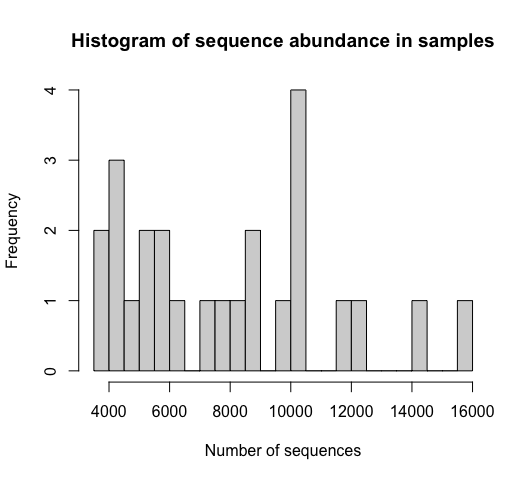
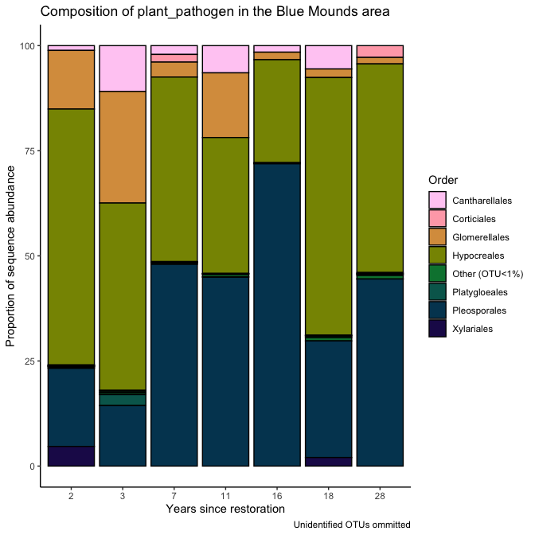

Microbial data: microbial guilds and taxonomy
================
Beau Larkin

Last updated: 11 October, 2023

- [Description](#description)
- [Packages and libraries](#packages-and-libraries)
- [Data](#data)
  - [Sites-species tables](#sites-species-tables)
  - [Species metadata](#species-metadata)
  - [Site metadata and design](#site-metadata-and-design)
  - [Joined species, metadata, and design
    tables](#joined-species-metadata-and-design-tables)
- [Functions](#functions)
  - [Function: ITS and guilds](#function-its-and-guilds)
  - [18S-based data (AMF)](#18s-based-data-amf)
  - [Examine change over time in
    guilds](#examine-change-over-time-in-guilds)
  - [Re-rarefy in guilds (or groups)](#re-rarefy-in-guilds-or-groups)
  - [Filter to guilds or taxonomic
    groups](#filter-to-guilds-or-taxonomic-groups)
    - [Calculate Hill’s series on a samples-species
      matrix](#calculate-hills-series-on-a-samples-species-matrix)
    - [Results from re-rarefied data](#results-from-re-rarefied-data)
  - [Perform Indicator Species
    Analysis](#perform-indicator-species-analysis)
- [Analysis and Results](#analysis-and-results)
  - [ITS sequences](#its-sequences)
    - [Composition in field types](#composition-in-field-types)
    - [Soil saprotrophs](#soil-saprotrophs)
    - [Plant pathogens](#plant-pathogens)
    - [Wood saprotrophs](#wood-saprotrophs)
    - [Litter saprotrophs](#litter-saprotrophs)
  - [AMF](#amf)
    - [Claroideoglomeraceae](#claroideoglomeraceae)
    - [Paraglomeraceae](#paraglomeraceae)
    - [Diversisporaceae](#diversisporaceae)
    - [Gigasporaceae](#gigasporaceae)
- [Conclusions: taxa and guilds](#conclusions-taxa-and-guilds)
- [Appendix: Rarefy in guilds?](#appendix-rarefy-in-guilds)
  - [Diversity with ITS sequences](#diversity-with-its-sequences)

# Description

Sequence clusters identified in QIIME2 are annotated with taxonomic
information and metadata from [Fungal
traits](https://link.springer.com/article/10.1007/s13225-020-00466-2).
In this report, sequence abundances in taxonomic groups or fungal guilds
are compared across field types and with time since restoration.

The full sequence abundance tables were rarefied to make sequencing
depth equivalent across fields. This can result in lower-abundance OTUs
dropping to zero. Within guilds, loss of OTUs could change or bias
interpretations of richness, diversity, and composition. We tried using
raw sequence data and rarefying within guilds to address this problem,
but in each case the sequence depth was so small that additional OTUs
were lost and abundances were significantly lowered.

We may try a different approach which is described in [Semchenko et
al. 2018](https://www.science.org/doi/10.1126/sciadv.aau4578), but for
now, the analysis uses data from the entire rarefied tables for ITS and
18S sequences.

# Packages and libraries

``` r
packages_needed = c("tidyverse",
                    "knitr",
                    "conflicted",
                    "ggbeeswarm",
                    "colorspace",
                    "rsq",
                    "lme4",
                    "multcomp",
                    "indicspecies",
                    "GUniFrac",
                    "vegan")
packages_installed = packages_needed %in% rownames(installed.packages())
```

``` r
if (any(!packages_installed)) {
    install.packages(packages_needed[!packages_installed])
}
```

``` r
for (i in 1:length(packages_needed)) {
    library(packages_needed[i], character.only = T)
}
```

``` r
conflict_prefer("filter", "dplyr")
conflict_prefer("select", "dplyr")
```

# Data

## Sites-species tables

CSV files were produced in `process_data.R`

``` r
spe <- list(
    its_raw = read_csv(
        paste0(getwd(), "/clean_data/spe_ITS_raw.csv"),
        show_col_types = FALSE
    ),
    its_rfy = read_csv(
        paste0(getwd(), "/clean_data/spe_ITS_rfy.csv"),
        show_col_types = FALSE
    ),
    amf_raw = read_csv(
        paste0(getwd(), "/clean_data/spe_18S_raw.csv"),
        show_col_types = FALSE
    ),
    amf_rfy = read_csv(
        paste0(getwd(), "/clean_data/spe_18S_rfy.csv"),
        show_col_types = FALSE
    )
)
```

## Species metadata

Load taxonomy for all and guilds (called *primary lifestyle* in Fungal
Traits) for ITS OTUs.

``` r
meta <- list(
    its = read_csv(
        paste0(getwd(), "/clean_data/spe_ITS_metadata.csv"),
        show_col_types = FALSE
    ),
    amf = read_csv(
        paste0(getwd(), "/clean_data/spe_18S_metadata.csv"),
        show_col_types = FALSE
    )
)
```

## Site metadata and design

``` r
sites   <-
    read_csv(paste0(getwd(), "/clean_data/sites.csv"), show_col_types = FALSE) %>%
    mutate(
        field_type = factor(
            field_type,
            ordered = TRUE,
            levels = c("corn", "restored", "remnant")
        )) %>%
    select(-lat, -long, -yr_restore, -yr_rank) %>% 
    arrange(field_key)
```

## Joined species, metadata, and design tables

Functions streamline this process

``` r
join_spe_meta <-
    function(spe, meta) {
        spe %>%
            pivot_longer(starts_with("otu"),
                         names_to = "otu_num",
                         values_to = "seq_abund") %>%
            filter(seq_abund != 0) %>%
            left_join(meta, by = join_by(otu_num)) %>%
            left_join(sites, by = join_by(field_key))
    }
```

``` r
spe_meta <- list(
    its_raw = 
        join_spe_meta(spe$its_raw, meta$its) %>%
        write_csv(paste0(getwd(), "/clean_data/speTaxa_ITS_raw.csv")),
    its_rfy = 
        join_spe_meta(spe$its_rfy, meta$its) %>%
        write_csv(paste0(getwd(), "/clean_data/speTaxa_ITS_rfy.csv")),
    amf_raw = 
        join_spe_meta(spe$amf_raw, meta$amf) %>%
        write_csv(paste0(getwd(), "/clean_data/speTaxa_18S_raw.csv")),
    amf_rfy = 
        join_spe_meta(spe$amf_rfy, meta$amf) %>%
        write_csv(paste0( getwd(), "/clean_data/speTaxa_18S_rfy.csv" ))
)
```

# Functions

Functions streamline data processing, model fitting, and results output.
\### Function: ITS taxonomy This function simplifies and displays the
sequence distribution among taxa and across primary lifestyles. Use the
argument `other_threshold` to choose a small (e.g., 2, the default)
cutoff, below which orders are relabeled as “other”.

``` r
its_taxaGuild <- function(data, other_threshold=2) {
    # What is the distribution among site types at the class level?
    taxonomy_df <-
        data %>%
        group_by(phylum, order, field_type, field_name) %>%
        summarize(abund = sum(seq_abund), .groups = "drop") %>%
        group_by(phylum, order, field_type) %>%
        summarize(mean = mean(abund) %>% round(., 2),
                  .groups = "drop") %>%
        pivot_wider(
            names_from = field_type,
            values_from = mean,
            values_fill = 0
        ) %>%
        select(phylum, order, corn, restored, remnant) %>%
        arrange(-remnant)
    print(kable(
        taxonomy_df,
        format = "pandoc",
        caption = "Distribution of ITS OTUs in classes; mean sequence abundance by field type"
    ))
    # What is the distribution of `primary_lifestyles` among site types?
    guild_df <-
        data %>%
        group_by(primary_lifestyle, field_type, field_name) %>%
        summarize(abund = sum(seq_abund), .groups = "drop") %>%
        group_by(primary_lifestyle, field_type) %>%
        summarize(mean = round(mean(abund), 1), .groups = "drop") %>%
        pivot_wider(
            names_from = field_type,
            values_from = mean,
            values_fill = 0
        ) %>%
        select(primary_lifestyle, corn, restored, remnant) %>%
        mutate(total = corn+restored+remnant) %>% 
        arrange(-total)
    # Create table
    table <- kable(guild_df, format = "pandoc",
        caption = "Distribution of ITS OTUs by Fungal Trait 'primary_lifestyle'; mean sequence abundance by field type")
    # Plot the most abundant orders across field types
    plot_orders <- 
        data %>% 
        filter(order != is.na(order), order != "unidentified") %>% 
        group_by(field_type, order, field_key) %>% 
        summarize(seq_sum = sum(seq_abund), .groups = "drop_last") %>% 
        summarize(seq_avg = mean(seq_sum), .groups = "drop_last") %>% 
        mutate(seq_comp = (seq_avg / sum(seq_avg)) * 100,
               order = replace(order, which(seq_comp < 2), paste0("Other (OTU<", other_threshold, "%)"))) %>% 
        group_by(field_type, order) %>% 
        summarize(seq_comp = sum(seq_comp), .groups = "drop") %>% 
        ggplot(., aes(x = field_type, y = seq_comp)) +
        geom_col(aes(fill = order), color = "black") +
        labs(x = "", y = "Proportion of sequence abundance",
             title = "Composition of fungi by order") +
        scale_fill_discrete_sequential(name = "Order", palette = "Plasma") +
        theme_classic()
    # Plot the composition of primary lifestyles
    plot_guilds <- 
        data %>% 
        filter(primary_lifestyle != is.na(primary_lifestyle)) %>% 
        group_by(field_type, primary_lifestyle, field_key) %>% 
        summarize(seq_sum = sum(seq_abund), .groups = "drop_last") %>% 
        summarize(seq_avg = mean(seq_sum), .groups = "drop_last") %>% 
        mutate(seq_comp = (seq_avg / sum(seq_avg)) * 100,
               primary_lifestyle = replace(primary_lifestyle, which(seq_comp < 2), paste0("Other (OTU<", other_threshold, "%)"))) %>% 
        group_by(field_type, primary_lifestyle) %>% 
        summarize(seq_comp = sum(seq_comp), .groups = "drop") %>% 
        ggplot(., aes(x = field_type, y = seq_comp)) +
        geom_col(aes(fill = primary_lifestyle), color = "black") +
        labs(x = "", y = "Proportion of sequence abundance",
             title = "Composition of fungi by primary lifestyle") +
        scale_fill_discrete_sequential(name = "Primary lifestyle", palette = "Inferno") +
        theme_classic()
    
    print(list(table,
               plot_orders,
               plot_guilds))
    
}
```

### Function: ITS and guilds

Several primary lifestyles have been chosen from Fungal Traits for
further examination. These lifestyles were the largest by sequence
abundance and thought to be most informative given the habitat and
questions applied.

This function filters those groups and tests them among field types.
These tests aren’t technically valid due to pseudoreplication, but this
analysis can help us find trends worthy of further study.

``` r
its_test_taxaGuild <- function(data) {
    pl <- c("soil_saprotroph", "plant_pathogen", "ectomycorrhizal", "wood_saprotroph", "litter_saprotroph")
    df1 <- data.frame()
    for (i in 1:length(pl)) {
        cat("---------------------------------\n")
        print(pl[i])
        cat("---------------------------------\n")
        mod_data <- data %>%
            filter(primary_lifestyle == pl[i]) %>%
            group_by(field_type, region, field_name, yr_since, primary_lifestyle) %>%
            summarize(seq_sum = sum(seq_abund), .groups = "drop")
        print(kable(mod_data %>% arrange(-seq_sum), format = "pandoc"))
        cat("----------------------------------------------------\n\n")
        mmod <-
            lmer(seq_sum ~ field_type + (1 | region),
                 data = mod_data,
                 REML = FALSE)
        print(mmod)
        cat("----------------------------------------------------\n\n")
        mmod_null <-
            lmer(seq_sum ~ 1 + (1 | region),
                 data = mod_data,
                 REML = FALSE)
        print(mmod_null)
        cat("----------------------------------------------------\n\n")
        print(anova(mmod, mmod_null))
        cat("----------------------------------------------------\n\n")
        mod_tuk <-
            glht(mmod,
                 linfct = mcp(field_type = "Tukey"),
                 test = adjusted("holm"))
        print(summary(mod_tuk))
        print(cld(mod_tuk))
        cat("----------------------------------------------------\n\n")
        print(paste(
            "Years since restoration and",
            pl[i],
            "sequence abundance in Blue Mounds Area"
        ))
        mod_data2 <- mod_data %>%
            filter(region == "BM", field_type == "restored")
        print(summary(lm(seq_sum ~ yr_since,
                         data = mod_data2)))
        cat("\n\n\n")
        df1 <- rbind(df1, mod_data)
    }
    
    return(df1)
    
}
```

## 18S-based data (AMF)

This function simplifies and displays taxonomic information about the
AMF OTUs.

``` r
amf_tax <- function(data) {
    cat("---------------------------------\n")
    print(paste("AMF"))
    cat("---------------------------------\n")
    amf_df <-
        data %>%
        group_by(family, field_type, region, field_name, yr_since) %>%
        summarize(seq_sum = sum(seq_abund) %>% round(., 1),
                  .groups = "drop")
    amf_df_summary <-
        amf_df %>%
        group_by(family, field_type) %>%
        summarize(seq_avg = mean(seq_sum) %>% round(., 1),
                  .groups = "drop") %>%
        pivot_wider(
            names_from = field_type,
            values_from = seq_avg,
            names_sort = TRUE,
            values_fill = 0
        ) %>%
        arrange(-remnant)
    
    print(kable(amf_df_summary, format = "pandoc"))
    
    cat("\n---------------------------------\n")
    print("Compare abundances across field types with mixed model")
    cat("---------------------------------\n")
    test_families <-
        amf_df %>% 
        count(region, family, field_type) %>% 
        count(region, family) %>% 
        filter(n == 3) %>% 
        pull(family) %>% 
        unique()
    for (i in 1:length(test_families)) {
        cat("\n---------------------------------\n")
        print(test_families[i])
        cat("---------------------------------\n")
        mmod <-
            lmer(
                seq_sum ~ field_type + (1 | region),
                data = amf_df %>% filter(family == test_families[i]),
                REML = FALSE
            )
        print(mmod)
        cat("----------------------------------------------------\n\n")
        mmod_null <-
            lmer(
                seq_sum ~ 1 + (1 | region),
                data = amf_df %>% filter(family == test_families[i]),
                REML = FALSE
            )
        print(mmod_null)
        cat("----------------------------------------------------\n\n")
        print(anova(mmod, mmod_null))
        cat("----------------------------------------------------\n\n")
        mod_tuk <-
            glht(mmod,
                 linfct = mcp(field_type = "Tukey"),
                 test = adjusted("holm"))
        print(summary(mod_tuk))
        print(cld(mod_tuk))
        cat("\n")
    }
    cat("\n---------------------------------\n")
    print("Test abundances with years since restoration")
    cat("---------------------------------\n")
    all7 <-
        amf_df %>%
        filter(field_type == "restored", region == "BM") %>%
        count(family) %>%
        filter(n == 7) %>%
        pull(family)
    mod_data <-
        amf_df %>%
        filter(field_type == "restored", region == "BM", family %in% all7)
    for (i in 1:length(all7)) {
        print(all7[i])
        print(summary(lm(
            seq_sum ~ yr_since, data = mod_data %>% filter(family == all7[i])
        )))
    }
    return(amf_df)
}
```

## Examine change over time in guilds

Function `guiltime()` filters ITS data to a user-specified guild and
produces linear models and plots of change in sequence abundance over
time since restoration in Blue Mounds and Fermilab.

``` r
guiltime <- function(pl) {
    d <- spe_meta$its_rfy %>%
        filter(
            primary_lifestyle == pl,
            region %in% c("BM", "FL"),
            field_type == "restored"
        ) %>% 
        group_by(field_key, field_name, region, yr_since) %>% 
        summarize(seq_sum = sum(seq_abund), .groups = "drop")
    
    bm <- summary(
        lm(seq_sum ~ yr_since, data = d %>% filter(region == "BM"))
    )
    fl <- summary(
        lm(seq_sum ~ yr_since, data = d %>% filter(region == "FL"))
    )
    
    fits <- data.frame(
        rbind(BM = c(coef(bm)[1,1], coef(bm)[2,1], coef(bm)[2,4]),
              FL = c(coef(fl)[1,1], coef(fl)[2,1], coef(fl)[2,4]))) %>% 
        mutate(lty = case_when(X3 < 0.05 ~ "a", TRUE ~ NA_character_)) %>% 
        rownames_to_column(var = "region")
    plot <- 
        ggplot(d, aes(x = yr_since, y = seq_sum)) +
        facet_wrap(vars(region), scales = "free_y") +
        geom_point() +
        geom_abline(data = fits, aes(slope = X2, intercept = X1, linetype = lty), color = "blue") +
        labs(x = "Years since restoration", 
             y = "Sum of ITS sequences",
             caption = "Solid line, if present, shows linear relationship at p<0.05") +
        theme_bw() +
        theme(legend.position = "none")
    
    out <- list(
        bm_summary = bm,
        fl_summary = fl,
        plot = plot
    )
    
    print(out)
    
}
```

## Re-rarefy in guilds (or groups)

To examine richness and composition within subgroups of OTUs, the raw
sequence data should be re-rarefied within those groups. Otherwise,
especially with low-abundance groups, data and sites may have been lost
when the entire species matrix was rarefied. This function automates the
process.

Outputs are:

1.  Sequencing depth used for the subset of OTUs
2.  Number of OTUs excluded by rarefying
3.  The re-rarefied samples-species matrix
4.  The OTU list in long form, with abundances, species, and site
    metadata

``` r
rerare <- function(spe, meta, grp_var, grp, site) {
    # spe       = species matrix with raw abundances
    # meta      = species metadata matching the OTU list with raw abundances
    # grp_var   = variable name from `meta` desired for grouping and filtering
    #             the OTUs (e.g., `primary_lifestyle`, `family`)
    # grp       = string or factor level name of the group desired from `grp_var`
    # site      = site metadata to combine with sequence abundance long-form
    #             output table
    
    grp_var <- enquo(grp_var)
    
    data <- 
        spe %>% 
        column_to_rownames(var = "field_key") %>% 
        t() %>% 
        as.data.frame() %>% 
        rownames_to_column(var = "otu_num") %>% 
        as_tibble() %>% 
        left_join(meta, by = join_by(otu_num)) %>% 
        filter(!!grp_var == grp) %>% 
        column_to_rownames(var = "otu_num") %>% 
        select(-colnames(meta)[-1]) %>% 
        t() %>% 
        as.data.frame()
    
    depth <- min(rowSums(data))
    rfy <- Rarefy(data)
    zero_otu <- which(apply(rfy$otu.tab.rff, 2, sum) == 0)
    rrfd <- data.frame(rfy$otu.tab.rff[, -zero_otu]) %>%
        rownames_to_column(var = "field_key") %>%
        mutate(field_key = as.numeric(field_key)) %>% 
        arrange(field_key) %>% 
        as_tibble()
    
    rrfd_speTaxa <- 
        rrfd %>% 
        pivot_longer(cols = starts_with("otu"), 
                     names_to = "otu_num", 
                     values_to = "seq_abund") %>% 
        filter(seq_abund > 0) %>% 
        left_join(meta, by = join_by(otu_num)) %>% 
        left_join(site, by = join_by(field_key)) %>% 
        select(-otu_ID)
    
    return(list(
        seq_depth = depth,
        zero_otu_num = length(zero_otu),
        rrfd = rrfd,
        rrfd_speTaxa = rrfd_speTaxa
    ))
    
}
```

## Filter to guilds or taxonomic groups

To examine richness and composition within subgroups of OTUs, the
rarefied table must be transposed, filtered, and transposed back. The
function `filgu()` or “filter guilds” automates this process.

Outputs are:

1.  The resulting samples-species matrix
2.  Sequence abundances in long-form, with site and species metadata

Note that this function isn’t necessary. Everything produced here can be
done with the `spe_meta$..._rfy` tables. But I’m keeping this path going
for now in case we need to switch back to rarefying within groups again.

``` r
filgu <- function(spe, meta, grp_var, grp, site) {
    # spe       = species matrix with raw abundances
    # meta      = species metadata matching the OTU list with raw abundances
    # grp_var   = variable name from `meta` desired for grouping and filtering
    #             the OTUs (e.g., `primary_lifestyle`, `family`)
    # grp       = string or factor level name of the group desired from `grp_var`
    # site      = site metadata to combine with sequence abundance long-form
    #             output table
    
    grp_var <- enquo(grp_var)
    
    filspe <- 
        spe %>% 
        column_to_rownames(var = "field_key") %>% 
        t() %>% 
        as.data.frame() %>% 
        rownames_to_column(var = "otu_num") %>% 
        as_tibble() %>% 
        left_join(meta, by = join_by(otu_num)) %>% 
        filter(!!grp_var == grp) %>% 
        column_to_rownames(var = "otu_num") %>% 
        select(-colnames(meta)[-1]) %>% 
        t() %>% 
        as.data.frame() %>%
        rownames_to_column(var = "field_key") %>%
        mutate(field_key = as.numeric(field_key)) %>% 
        arrange(field_key) %>% 
        as_tibble()
    
    cs <- colSums(filspe %>% select(-field_key))
    rs <- rowSums(filspe %>% select(-field_key))
    
    hist(cs,
         breaks = length(cs),
         main = "Histogram of OTU sequence sums",
         xlab = "Number of sequences")
    
    hist(rs,
         breaks = length(rs),
         main = "Histogram of sequence abundance in samples",
         xlab = "Number of sequences")
    
    filspeTaxa <- 
        filspe %>% 
        pivot_longer(cols = starts_with("otu"), 
                     names_to = "otu_num", 
                     values_to = "seq_abund") %>% 
        filter(seq_abund > 0) %>% 
        left_join(meta, by = join_by(otu_num)) %>% 
        left_join(site, by = join_by(field_key)) %>% 
        select(-otu_ID)
    
    print(list(
        OTUs_n = length(cs),
        Sites_n = length(which(rs > 0))
    ))
    
    return(list(
        filspe = filspe,
        filspeTaxa = filspeTaxa
    ))
    
}
```

### Calculate Hill’s series on a samples-species matrix

The objects `$rrfd` from **rerare()** or `$filspe` from **filgu()** can
be passed to this function

``` r
calc_diversity <- function(spe) {
    spe_mat <- data.frame(spe, row.names = 1)
    
    N0  <- apply(spe_mat > 0, MARGIN = 1, FUN = sum)
    N1  <- exp(diversity(spe_mat))
    N2  <- diversity(spe_mat, "inv")
    E10 <- N1 / N0
    E20 <- N2 / N0
    
    return(
        data.frame(N0, N1, N2, E10, E20) %>%
            rownames_to_column(var = "field_key") %>%
            mutate(field_key = as.integer(field_key)) %>%
            left_join(sites, by = join_by(field_key)) %>%
            pivot_longer(
                cols = N0:E20,
                names_to = "hill_index",
                values_to = "value"
            ) %>%
            mutate(hill_index = factor(
                hill_index,
                ordered = TRUE,
                levels = c("N0", "N1", "N2", "E10", "E20")
            ))
    )
}
```

### Results from re-rarefied data

After re-rarefying into a guild (or taxonomic group), produce diversity
statistics and calculate percent composition; display results. For
plotting, it’s convenient to limit the number of taxonomic orders
displayed. Use the argument `other_threshold` to choose a small (e.g.,
2, the default) cutoff, below which orders are relabeled as “other”.

``` r
gudicom <- function(div, rrfd, grp_var, gene="its", other_threshold=2) {
    hillfield <-     
        ggplot(div, aes(x = field_type, y = value)) +
        facet_wrap(vars(hill_index), scales = "free_y") +
        geom_boxplot(varwidth = TRUE, fill = "gray90", outlier.shape = NA) +
        geom_beeswarm(aes(fill = region), shape = 21, size = 2, dodge.width = 0.2) +
        labs(x = "", y = "Index value", title = paste("Microbial diversity (Hill's):", grp_var),
             caption = "Re-rarefied in the group; N0-richness, N1-e^Shannon, N2-Simpson, E10=N1/N0, E20=N2/N0, width=n") +
        scale_fill_discrete_qualitative(palette = "Dark3") +
        theme_bw()
    hilltime <- 
        div %>% 
        filter(field_type == "restored", region %in% c("BM", "FL")) %>% 
        ggplot(aes(x = yr_since, y = value)) +
        facet_grid(rows = vars(hill_index), cols = vars(region), scales = "free") +
        geom_smooth(method = "lm") +
        geom_point() +
        labs(x = "Years since restoration", y = "Index value", title = paste("Microbial diversity (Hill's) in restored fields:", grp_var),
             caption = "Re-rarefied in the group; N0-richness, N1-e^Shannon, N2-Simpson, E10=N1/N0, E20=N2/N0, width=n") +
        theme_bw()
    if(gene == "its") {
        comp_ft <- 
            rrfd %>% 
            filter(order != is.na(order), order != "unidentified") %>% 
            group_by(field_type, order, field_key) %>% 
            summarize(seq_sum = sum(seq_abund), .groups = "drop_last") %>% 
            summarize(seq_avg = mean(seq_sum), .groups = "drop_last") %>% 
            mutate(seq_comp = (seq_avg / sum(seq_avg)) * 100,
                   order = replace(order, which(seq_comp < other_threshold), paste0("Other (OTU<", other_threshold, "%)"))) %>% 
            group_by(field_type, order) %>% 
            summarize(seq_comp = sum(seq_comp), .groups = "drop")
        comp_ft_plot <-
            ggplot(comp_ft, aes(x = field_type, y = seq_comp)) +
            geom_col(aes(fill = order), color = "black") +
            labs(x = "", y = "Proportion of sequence abundance",
                 title = paste("Composition of", grp_var)) +
            scale_fill_discrete_sequential(name = "Order", palette = "Plasma") +
            theme_classic()
        
        yr_fct <- 
            sites %>% 
            filter(field_type == "restored") %>% 
            select(field_key, yr_since) %>% 
            arrange(yr_since) %>% 
            mutate(yr_fct = factor(yr_since, ordered = TRUE))
        comp_yr <- 
            rrfd %>% 
            filter(order != is.na(order), 
                   order != "unidentified",
                   field_type == "restored",
                   region == "BM") %>% 
            group_by(field_key, order) %>% 
            summarize(seq_sum = sum(seq_abund), .groups = "drop_last") %>% 
            mutate(seq_comp = (seq_sum / sum(seq_sum)) * 100,
                   order = replace(order, which(seq_comp < other_threshold), paste0("Other (OTU<", other_threshold, "%)"))) %>% 
            left_join(yr_fct, by = join_by(field_key))
        comp_yr_plot <-
            ggplot(comp_yr, aes(x = yr_fct, y = seq_comp)) +
            geom_col(aes(fill = order), color = "black") +
            labs(x = "Years since restoration", y = "Proportion of sequence abundance",
                 title = paste("Composition of", grp_var, "in the Blue Mounds area")) +
            scale_fill_discrete_sequential(name = "Order", palette = "Plasma") +
            theme_classic()
        
        print(list(
            Hills_field_type = hillfield,
            Hills_yrs_since_restoration = hilltime,
            Composition_field_type = comp_ft_plot,
            Composition_yr_since = comp_yr_plot
        ))
        
        return(list(comp_ft, comp_yr))
        
    } else {
        print(list(
            Hills_field_type = hillfield,
            Hills_yrs_since_restoration = hilltime
        ))
    }
    
}
```

## Perform Indicator Species Analysis

Function `inspan()` takes a combined species and sites data frame and
wrangles it through the analysis to filter OTUs for indicators of field
types. The output is top candidate OTUs joined with species metadata for
further analysis.

``` r
inspan <- function(data, np, meta) {
    # data is the samples-species matrix joined with the sites data frame
    # the join aligns the grouping vector with field numbers
    # np is the desired number of permutations
    # meta is the appropriate species metadata table for the original data
    spe <- data.frame(
        data %>% select(field_key, starts_with("otu")),
        row.names = 1
    )
    grp = data$field_type
    mp <- multipatt(
        spe, 
        grp, 
        max.order = 1, 
        control = how(nperm = np))
    si <- mp$sign %>% 
        select(index, stat, p.value) %>% 
        mutate(field_type = case_when(index == 1 ~ "corn", 
                                      index == 2 ~ "restored", 
                                      index == 3 ~ "remnant")) %>% 
        filter(p.value < 0.05) %>% 
        rownames_to_column(var = "otu_num") %>%
        select(-index) %>% 
        as_tibble()
    A  <- mp$A %>% 
        as.data.frame() %>% 
        rownames_to_column(var = "otu_num") %>% 
        pivot_longer(cols = corn:remnant, 
                     names_to = "field_type", 
                     values_to = "A")
    B <- mp$B %>% 
        as.data.frame() %>% 
        rownames_to_column(var = "otu_num") %>% 
        pivot_longer(cols = corn:remnant, 
                     names_to = "field_type", 
                     values_to = "B")
    out <- 
        si %>% 
        left_join(A, by = join_by(otu_num, field_type)) %>% 
        left_join(B, by = join_by(otu_num, field_type)) %>% 
        left_join(meta %>% select(-otu_ID), by = join_by(otu_num)) %>% 
        select(otu_num, A, B, stat, p.value, 
               field_type, primary_lifestyle, everything()) %>% 
        arrange(field_type, -stat)
    
    return(out)
    
}
```

# Analysis and Results

## ITS sequences

Recall the number of OTUs recovered in each dataset. The effect of
rarefying did not change richness or diversity very much.

``` r
# Number of OTUs in raw and rarefied datasets
Map(function(x) ncol(x)-1, spe[1:2])
```

    ## $its_raw
    ## [1] 2895
    ## 
    ## $its_rfy
    ## [1] 2889

### Composition in field types

Function outputs are verbose, but details may be necessary later so they
are displayed here.

``` r
its_taxaGuild(spe_meta$its_rfy)
```

    ## 
    ## 
    ## Table: Distribution of ITS OTUs in classes; mean sequence abundance by field type
    ## 
    ## phylum                             order                                        corn   restored   remnant
    ## ---------------------------------  --------------------------------------  ---------  ---------  --------
    ## Ascomycota                         Hypocreales                               8993.60    7896.31   8459.50
    ## Ascomycota                         Pleosporales                              8080.00    8126.31   6744.50
    ## Ascomycota                         Chaetothyriales                            759.60    7134.06   6436.00
    ## Basidiomycota                      Agaricales                                3724.20    2727.75   5764.25
    ## Ascomycota                         Helotiales                                3291.40    4090.44   4602.00
    ## Ascomycota                         Sordariales                              13443.60    5468.88   4123.75
    ## Ascomycota                         NA                                        1585.40    2910.69   3740.50
    ## NA                                 NA                                        1427.20    2438.06   3174.75
    ## Ascomycota                         Onygenales                                  82.00    1606.50   2499.00
    ## Mortierellomycota                  Mortierellales                            4413.20    3558.44   2036.00
    ## Basidiomycota                      Geastrales                                 913.00      53.17   1832.50
    ## Ascomycota                         Geoglossales                                 5.00    1930.75   1788.00
    ## Basidiomycota                      Thelephorales                                4.50      23.00   1053.00
    ## Ascomycota                         Glomerellales                             2322.40    1310.56    845.75
    ## Basidiomycota                      Cantharellales                             501.60     952.25    741.00
    ## Ascomycota                         unidentified                                 4.00    1040.07    674.25
    ## Glomeromycota                      Glomerales                                 110.60     548.25    493.25
    ## Ascomycota                         GS34                                         0.00     114.33    490.50
    ## Ascomycota                         Xylariales                                  74.80     354.00    372.00
    ## Ascomycota                         Coniochaetales                             878.40     215.25    355.00
    ## Ascomycota                         Sordariomycetes_ord_Incertae_sedis          46.80     157.12    282.00
    ## Ascomycota                         Magnaporthales                              99.40     196.00    237.25
    ## Ascomycota                         Pezizales                                 1217.40     430.31    197.50
    ## Ascomycota                         Capnodiales                                678.40     658.00    193.25
    ## Basidiomycota                      NA                                         100.00     645.38    186.50
    ## Basidiomycota                      Russulales                                   3.00       8.00    182.00
    ## Basidiomycota                      Sebacinales                                 30.60     793.50    172.25
    ## Glomeromycota                      NA                                           8.75     181.93    158.00
    ## Basidiomycota                      Boletales                                    4.50       7.00    148.00
    ## Ascomycota                         Chaetosphaeriales                          318.75     282.81    137.00
    ## Ascomycota                         Branch06                                    15.00     179.64    123.00
    ## Ascomycota                         Minutisphaerales                             0.00      59.00    116.50
    ## Ascomycota                         Thelebolales                               120.50      44.57    109.50
    ## Basidiomycota                      Auriculariales                             119.00     326.25    105.50
    ## Basidiomycota                      Tremellales                                 16.00     109.12     99.25
    ## Mucoromycota                       NA                                           0.00      13.00     90.50
    ## Ascomycota                         Mytilinidales                                0.00       0.00     82.00
    ## Chytridiomycota                    Spizellomycetales                          191.20     123.40     78.25
    ## Basidiomycota                      Trichosporonales                            61.50      37.00     77.75
    ## Basidiomycota                      Filobasidiales                            1104.75     357.93     71.33
    ## Chytridiomycota                    Rhizophlyctidales                          271.60     136.33     70.75
    ## Basidiomycota                      Cystofilobasidiales                       2774.80      92.36     67.67
    ## Mucoromycota                       Umbelopsidales                               0.00       2.00     67.00
    ## Basidiomycota                      Trechisporales                             151.00     506.19     65.33
    ## Ascomycota                         Venturiales                                 28.33      90.77     62.33
    ## Basidiomycota                      Ustilaginales                                3.00     143.00     50.33
    ## Basidiomycota                      Tremellodendropsidales                       7.00      49.08     49.00
    ## Ascomycota                         Verrucariales                                0.00      64.00     48.00
    ## Basidiomycota                      Hymenochaetales                             17.00     191.36     44.67
    ## Ascomycota                         Mytilinidiales                               0.00      16.33     42.67
    ## Ascomycota                         Orbiliales                                  19.00      89.14     42.33
    ## Basidiomycota                      Polyporales                                 20.20      32.47     38.25
    ## Basidiomycota                      Geminibasidiales                            36.50      57.17     31.50
    ## Ascomycota                         Tubeufiales                                 74.60     214.19     30.00
    ## Basidiomycota                      Atheliales                                   0.00     147.50     28.50
    ## Ascomycota                         Saccharomycetales                          280.00      42.50     27.00
    ## Ascomycota                         Microascales                               132.40      87.50     26.00
    ## Basidiomycota                      Phallales                                  235.25      43.89     25.67
    ## Chytridiomycota                    Chytridiales                                 0.00      95.50     24.00
    ## Ascomycota                         Myrmecridiales                               0.00      78.62     22.50
    ## Rozellomycota                      GS11                                         0.00       2.00     22.00
    ## Basidiomycota                      Erythrobasidiales                            0.00       4.40     21.00
    ## Ascomycota                         GS32                                         0.00       0.00     18.00
    ## Ascomycota                         Eurotiales                                 118.40      41.31     17.25
    ## Ascomycota                         Diaporthales                               218.25      15.14     15.00
    ## Chytridiomycota                    Rhizophydiales                              29.33      23.10     14.00
    ## Ascomycota                         Savoryellales                               15.00      13.80     12.33
    ## Ascomycota                         Acrospermales                                0.00       6.00     12.00
    ## Ascomycota                         Ostropales                                   0.00      52.50     12.00
    ## Glomeromycota                      Archaeosporales                              3.00      12.00     12.00
    ## Basidiomycota                      Leucosporidiales                            39.67       9.86     11.00
    ## Ascomycota                         Archaeorhizomycetales                        0.00      35.29     10.00
    ## Basidiomycota                      Microbotryomycetes_ord_Incertae_sedis       10.33      17.17      8.50
    ## Chlorophyta                        Chaetopeltidales                            12.00       6.90      8.50
    ## Mortierellomycota                  NA                                           0.00       4.00      8.00
    ## Ascomycota                         Dothideales                                  0.00      33.38      6.00
    ## Ascomycota                         Rhytismatales                                0.00       3.00      6.00
    ## Basidiobolomycota                  Basidiobolales                               0.00      15.67      6.00
    ## Basidiomycota                      Agaricomycetes_ord_Incertae_sedis            0.00       0.00      6.00
    ## Chlorophyta                        NA                                           7.00       8.67      5.00
    ## Glomeromycota                      Diversisporales                              0.00       7.40      5.00
    ## Basidiomycota                      unidentified                                12.00     144.75      4.50
    ## Basidiomycota                      Atractiellales                              14.75       9.00      4.00
    ## Ascomycota                         Candelariales                                0.00       3.00      3.00
    ## Mucoromycota                       GS22                                         0.00       3.00      3.00
    ## Entorrhizomycota                   Entorrhizales                                0.00       0.00      2.00
    ## Ichthyosporia_phy_Incertae_sedis   unidentified                                 0.00       0.00      2.00
    ## Mucoromycota                       Mucorales                                    0.00       6.50      1.50
    ## Anthophyta                         Asterales                                    0.00       5.00      0.00
    ## Anthophyta                         Brassicales                                  9.00       4.50      0.00
    ## Anthophyta                         Commelinales                                 3.00     230.00      0.00
    ## Anthophyta                         Fabales                                      0.00      11.00      0.00
    ## Anthophyta                         Poales                                       2.50       2.00      0.00
    ## Ascomycota                         Boliniales                                  44.33      51.00      0.00
    ## Ascomycota                         Botryosphaeriales                           21.75      21.50      0.00
    ## Ascomycota                         Jahnulales                                  10.00       0.00      0.00
    ## Ascomycota                         Lichenostigmatales                           0.00       4.00      0.00
    ## Ascomycota                         Microthyriales                               0.00      19.00      0.00
    ## Ascomycota                         Pezizomycotina_ord_Incertae_sedis           35.00     514.00      0.00
    ## Ascomycota                         Phacidiales                                  0.00       8.00      0.00
    ## Ascomycota                         Phomatosporales                            703.00      10.75      0.00
    ## Ascomycota                         Trichosphaeriales                            3.00      25.09      0.00
    ## Basidiomycota                      Agaricostilbales                             1.00       2.00      0.00
    ## Basidiomycota                      Corticiales                                  0.00      68.43      0.00
    ## Basidiomycota                      Cystobasidiales                             43.00      12.33      0.00
    ## Basidiomycota                      Entylomatales                                0.00      10.40      0.00
    ## Basidiomycota                      Holtermanniales                              6.00      15.33      0.00
    ## Basidiomycota                      Kriegeriales                                 3.00       9.00      0.00
    ## Basidiomycota                      Platygloeales                                0.00      82.60      0.00
    ## Basidiomycota                      Pucciniales                                  0.00       4.00      0.00
    ## Basidiomycota                      Sporidiobolales                             49.00       8.00      0.00
    ## Basidiomycota                      Tilletiales                                 12.00      26.25      0.00
    ## Basidiomycota                      Urocystidales                               79.00       5.50      0.00
    ## Calcarisporiellomycota             Calcarisporiellales                          0.00       4.00      0.00
    ## Cercozoa                           unidentified                                 7.00       3.00      0.00
    ## Chlorophyta                        Chaetophorales                               0.00      22.33      0.00
    ## Chlorophyta                        Chlorellales                                 0.00       4.00      0.00
    ## Chlorophyta                        Sphaeropleales                               0.00       5.00      0.00
    ## Chytridiomycota                    unidentified                                 8.00       0.00      0.00
    ## Chytridiomycota                    NA                                          14.00       9.00      0.00
    ## Glomeromycota                      Paraglomerales                               5.00      13.00      0.00
    ## Glomeromycota                      unidentified                                 7.00      23.60      0.00
    ## Haplosporidia                      Haplosporidia_ord_Incertae_sedis             3.33      12.00      0.00
    ## Monoblepharomycota                 Monoblepharidales                            2.00       0.00      0.00
    ## [[1]]
    ## 
    ## 
    ## Table: Distribution of ITS OTUs by Fungal Trait 'primary_lifestyle'; mean sequence abundance by field type
    ## 
    ## primary_lifestyle            corn   restored   remnant     total
    ## -----------------------  --------  ---------  --------  --------
    ## NA                        25975.8    31587.7   34901.8   92465.3
    ## plant_pathogen             9222.2     9098.8    7142.8   25463.8
    ## soil_saprotroph            9144.6     7632.5    7776.0   24553.1
    ## wood_saprotroph            3720.8     2879.4    1778.0    8378.2
    ## dung_saprotroph            3454.6     1992.9    1139.8    6587.3
    ## litter_saprotroph          2503.8     1763.4    1324.5    5591.7
    ## mycoparasite               2144.6      727.0     343.8    3215.4
    ## animal_parasite             786.8     1332.5     845.5    2964.8
    ## ectomycorrhizal              14.0      153.0    2149.8    2316.8
    ## unspecified_saprotroph      930.2      211.0     211.0    1352.2
    ## root_endophyte               14.7      482.5     231.8     729.0
    ## arbuscular_mycorrhizal       77.8      245.5     185.5     508.8
    ## pollen_saprotroph           171.6      110.5      61.5     343.6
    ## lichenized                    0.0      101.0      12.0     113.0
    ## lichen_parasite              15.0       46.4      45.2     106.6
    ## nectar/tap_saprotroph        35.0       40.9      27.0     102.9
    ## foliar_endophyte              3.7       32.5       7.0      43.2
    ## epiphyte                      0.0        4.0      23.0      27.0
    ## unspecified_pathotroph        0.0       13.8      10.0      23.8
    ## algal_parasite                2.0        3.2       0.0       5.2
    ## 
    ## [[2]]


    ## 
    ## [[3]]


The top guilds are:

1.  NA
2.  plant pathogens
3.  soil saprotrophs
4.  wood saprotrophs
5.  dung saprotrophs
6.  litter saprotrophs

Compared with the sequence abundance in the NA group, plant pathogens
and soil saprotrophs are abundant enough to feel somewhat confident
about in terms of coverage.

``` r
its_rfy_guilds <- its_test_taxaGuild(spe_meta$its_rfy)
```

    ## ---------------------------------
    ## [1] "soil_saprotroph"
    ## ---------------------------------
    ## 
    ## 
    ## field_type   region   field_name    yr_since  primary_lifestyle    seq_sum
    ## -----------  -------  -----------  ---------  ------------------  --------
    ## corn         FL       FLC2                 0  soil_saprotroph        15724
    ## restored     BM       KORP1               28  soil_saprotroph        14116
    ## remnant      LP       LPREM1              NA  soil_saprotroph        12340
    ## restored     FL       FLRSP1              10  soil_saprotroph        11618
    ## corn         LP       LPC1                 0  soil_saprotroph        10196
    ## restored     FL       FLRSP3              10  soil_saprotroph        10091
    ## remnant      BM       MBREM1              NA  soil_saprotroph        10076
    ## restored     FL       FLRP5               35  soil_saprotroph        10060
    ## corn         FL       FLC1                 0  soil_saprotroph         9590
    ## restored     BM       BBRP1               16  soil_saprotroph         8987
    ## restored     FL       FLRP1               40  soil_saprotroph         8840
    ## restored     BM       PHRP1               11  soil_saprotroph         8339
    ## restored     FL       FLRSP2              10  soil_saprotroph         7670
    ## restored     BM       ERRP1                3  soil_saprotroph         7367
    ## restored     BM       MBRP1               18  soil_saprotroph         5970
    ## corn         BM       PHC1                 0  soil_saprotroph         5907
    ## restored     FL       FLRP4               36  soil_saprotroph         5562
    ## restored     LP       LPRP1                4  soil_saprotroph         5417
    ## restored     BM       MHRP2                2  soil_saprotroph         5178
    ## remnant      FG       FGREM1              NA  soil_saprotroph         4901
    ## restored     BM       MHRP1                7  soil_saprotroph         4534
    ## restored     LP       LPRP2                4  soil_saprotroph         4481
    ## corn         FG       FGC1                 0  soil_saprotroph         4306
    ## restored     FG       FGRP1               15  soil_saprotroph         3890
    ## remnant      FL       FLREM1              NA  soil_saprotroph         3787
    ## ----------------------------------------------------
    ## 
    ## Linear mixed model fit by maximum likelihood  ['lmerMod']
    ## Formula: seq_sum ~ field_type + (1 | region)
    ##    Data: mod_data
    ##       AIC       BIC    logLik  deviance  df.resid 
    ##  484.2989  490.3933 -237.1494  474.2989        20 
    ## Random effects:
    ##  Groups   Name        Std.Dev.
    ##  region   (Intercept)   50.77 
    ##  Residual             3187.25 
    ## Number of obs: 25, groups:  region, 4
    ## Fixed Effects:
    ##  (Intercept)  field_type.L  field_type.Q  
    ##       8183.9        -967.3         676.4  
    ## ----------------------------------------------------
    ## 
    ## Linear mixed model fit by maximum likelihood  ['lmerMod']
    ## Formula: seq_sum ~ 1 + (1 | region)
    ##    Data: mod_data
    ##       AIC       BIC    logLik  deviance  df.resid 
    ##  481.1567  484.8134 -237.5784  475.1567        22 
    ## Random effects:
    ##  Groups   Name        Std.Dev.
    ##  region   (Intercept)    0    
    ##  Residual             3243    
    ## Number of obs: 25, groups:  region, 4
    ## Fixed Effects:
    ## (Intercept)  
    ##        7958  
    ## optimizer (nloptwrap) convergence code: 0 (OK) ; 0 optimizer warnings; 1 lme4 warnings 
    ## ----------------------------------------------------
    ## 
    ## Data: mod_data
    ## Models:
    ## mmod_null: seq_sum ~ 1 + (1 | region)
    ## mmod: seq_sum ~ field_type + (1 | region)
    ##           npar    AIC    BIC  logLik deviance  Chisq Df Pr(>Chisq)
    ## mmod_null    3 481.16 484.81 -237.58   475.16                     
    ## mmod         5 484.30 490.39 -237.15   474.30 0.8578  2     0.6512
    ## ----------------------------------------------------
    ## 
    ## 
    ##   Simultaneous Tests for General Linear Hypotheses
    ## 
    ## Multiple Comparisons of Means: Tukey Contrasts
    ## 
    ## 
    ## Fit: lmer(formula = seq_sum ~ field_type + (1 | region), data = mod_data, 
    ##     REML = FALSE)
    ## 
    ## Linear Hypotheses:
    ##                         Estimate Std. Error z value Pr(>|z|)
    ## restored - corn == 0     -1512.4     1633.0  -0.926    0.619
    ## remnant - corn == 0      -1368.0     2138.1  -0.640    0.795
    ## remnant - restored == 0    144.4     1781.8   0.081    0.996
    ## (Adjusted p values reported -- single-step method)
    ## 
    ##     corn restored  remnant 
    ##      "a"      "a"      "a" 
    ## ----------------------------------------------------
    ## 
    ## [1] "Years since restoration and soil_saprotroph sequence abundance in Blue Mounds Area"
    ## 
    ## Call:
    ## lm(formula = seq_sum ~ yr_since, data = mod_data2)
    ## 
    ## Residuals:
    ##       1       2       3       4       5       6       7 
    ##   148.1  2082.0  1996.7 -3415.6 -1844.5   166.3   867.0 
    ## 
    ## Coefficients:
    ##             Estimate Std. Error t value Pr(>|t|)  
    ## (Intercept)  4464.91    1441.11   3.098   0.0269 *
    ## yr_since      273.37      96.94   2.820   0.0371 *
    ## ---
    ## Signif. codes:  0 '***' 0.001 '**' 0.01 '*' 0.05 '.' 0.1 ' ' 1
    ## 
    ## Residual standard error: 2200 on 5 degrees of freedom
    ## Multiple R-squared:  0.614,  Adjusted R-squared:  0.5368 
    ## F-statistic: 7.953 on 1 and 5 DF,  p-value: 0.03711
    ## 
    ## 
    ## 
    ## 
    ## ---------------------------------
    ## [1] "plant_pathogen"
    ## ---------------------------------
    ## 
    ## 
    ## field_type   region   field_name    yr_since  primary_lifestyle    seq_sum
    ## -----------  -------  -----------  ---------  ------------------  --------
    ## restored     BM       MHRP2                2  plant_pathogen         16077
    ## restored     BM       MHRP1                7  plant_pathogen         15448
    ## restored     LP       LPRP1                4  plant_pathogen         15097
    ## restored     BM       PHRP1               11  plant_pathogen         14510
    ## corn         LP       LPC1                 0  plant_pathogen         13982
    ## restored     FG       FGRP1               15  plant_pathogen         12296
    ## restored     BM       ERRP1                3  plant_pathogen         12274
    ## corn         FG       FGC1                 0  plant_pathogen          9794
    ## remnant      LP       LPREM1              NA  plant_pathogen          9389
    ## corn         FL       FLC2                 0  plant_pathogen          9058
    ## remnant      FG       FGREM1              NA  plant_pathogen          8459
    ## restored     LP       LPRP2                4  plant_pathogen          7681
    ## restored     BM       BBRP1               16  plant_pathogen          7654
    ## remnant      FL       FLREM1              NA  plant_pathogen          7579
    ## corn         FL       FLC1                 0  plant_pathogen          7393
    ## restored     FL       FLRP1               40  plant_pathogen          6803
    ## restored     FL       FLRSP2              10  plant_pathogen          6493
    ## restored     FL       FLRSP1              10  plant_pathogen          6140
    ## corn         BM       PHC1                 0  plant_pathogen          5884
    ## restored     BM       MBRP1               18  plant_pathogen          5302
    ## restored     BM       KORP1               28  plant_pathogen          5220
    ## restored     FL       FLRP5               35  plant_pathogen          5003
    ## restored     FL       FLRP4               36  plant_pathogen          4853
    ## restored     FL       FLRSP3              10  plant_pathogen          4729
    ## remnant      BM       MBREM1              NA  plant_pathogen          3144
    ## ----------------------------------------------------
    ## 
    ## Linear mixed model fit by maximum likelihood  ['lmerMod']
    ## Formula: seq_sum ~ field_type + (1 | region)
    ##    Data: mod_data
    ##       AIC       BIC    logLik  deviance  df.resid 
    ##  490.3920  496.4864 -240.1960  480.3920        20 
    ## Random effects:
    ##  Groups   Name        Std.Dev.
    ##  region   (Intercept) 1552    
    ##  Residual             3375    
    ## Number of obs: 25, groups:  region, 4
    ## Fixed Effects:
    ##  (Intercept)  field_type.L  field_type.Q  
    ##         8765         -1734          -970  
    ## ----------------------------------------------------
    ## 
    ## Linear mixed model fit by maximum likelihood  ['lmerMod']
    ## Formula: seq_sum ~ 1 + (1 | region)
    ##    Data: mod_data
    ##       AIC       BIC    logLik  deviance  df.resid 
    ##  487.9496  491.6062 -240.9748  481.9496        22 
    ## Random effects:
    ##  Groups   Name        Std.Dev.
    ##  region   (Intercept) 1315    
    ##  Residual             3541    
    ## Number of obs: 25, groups:  region, 4
    ## Fixed Effects:
    ## (Intercept)  
    ##        9065  
    ## ----------------------------------------------------
    ## 
    ## Data: mod_data
    ## Models:
    ## mmod_null: seq_sum ~ 1 + (1 | region)
    ## mmod: seq_sum ~ field_type + (1 | region)
    ##           npar    AIC    BIC  logLik deviance  Chisq Df Pr(>Chisq)
    ## mmod_null    3 487.95 491.61 -240.97   481.95                     
    ## mmod         5 490.39 496.49 -240.20   480.39 1.5576  2      0.459
    ## ----------------------------------------------------
    ## 
    ## 
    ##   Simultaneous Tests for General Linear Hypotheses
    ## 
    ## Multiple Comparisons of Means: Tukey Contrasts
    ## 
    ## 
    ## Fit: lmer(formula = seq_sum ~ field_type + (1 | region), data = mod_data, 
    ##     REML = FALSE)
    ## 
    ## Linear Hypotheses:
    ##                         Estimate Std. Error z value Pr(>|z|)
    ## restored - corn == 0      -38.42    1754.93  -0.022    1.000
    ## remnant - corn == 0     -2452.74    2270.41  -1.080    0.522
    ## remnant - restored == 0 -2414.32    1919.97  -1.257    0.415
    ## (Adjusted p values reported -- single-step method)
    ## 
    ##     corn restored  remnant 
    ##      "a"      "a"      "a" 
    ## ----------------------------------------------------
    ## 
    ## [1] "Years since restoration and plant_pathogen sequence abundance in Blue Mounds Area"
    ## 
    ## Call:
    ## lm(formula = seq_sum ~ yr_since, data = mod_data2)
    ## 
    ## Residuals:
    ##       1       2       3       4       5       6       7 
    ## -1564.6 -2700.6  1314.7 -3031.0  2244.5   659.6  3077.5 
    ## 
    ## Coefficients:
    ##             Estimate Std. Error t value Pr(>|t|)    
    ## (Intercept)  16302.9     1748.2   9.325 0.000239 ***
    ## yr_since      -442.8      117.6  -3.765 0.013088 *  
    ## ---
    ## Signif. codes:  0 '***' 0.001 '**' 0.01 '*' 0.05 '.' 0.1 ' ' 1
    ## 
    ## Residual standard error: 2668 on 5 degrees of freedom
    ## Multiple R-squared:  0.7393, Adjusted R-squared:  0.6871 
    ## F-statistic: 14.18 on 1 and 5 DF,  p-value: 0.01309
    ## 
    ## 
    ## 
    ## 
    ## ---------------------------------
    ## [1] "ectomycorrhizal"
    ## ---------------------------------
    ## 
    ## 
    ## field_type   region   field_name    yr_since  primary_lifestyle    seq_sum
    ## -----------  -------  -----------  ---------  ------------------  --------
    ## remnant      FG       FGREM1              NA  ectomycorrhizal         3490
    ## remnant      FL       FLREM1              NA  ectomycorrhizal         3408
    ## remnant      BM       MBREM1              NA  ectomycorrhizal         1142
    ## restored     BM       MBRP1               18  ectomycorrhizal          583
    ## remnant      LP       LPREM1              NA  ectomycorrhizal          559
    ## restored     FL       FLRP1               40  ectomycorrhizal           17
    ## corn         LP       LPC1                 0  ectomycorrhizal           14
    ## restored     BM       MHRP2                2  ectomycorrhizal            7
    ## restored     FG       FGRP1               15  ectomycorrhizal            5
    ## ----------------------------------------------------
    ## 
    ## Linear mixed model fit by maximum likelihood  ['lmerMod']
    ## Formula: seq_sum ~ field_type + (1 | region)
    ##    Data: mod_data
    ##      AIC      BIC   logLik deviance df.resid 
    ## 157.8373 158.8234 -73.9186 147.8373        4 
    ## Random effects:
    ##  Groups   Name        Std.Dev.
    ##  region   (Intercept)   0.0   
    ##  Residual             892.7   
    ## Number of obs: 9, groups:  region, 4
    ## Fixed Effects:
    ##  (Intercept)  field_type.L  field_type.Q  
    ##        772.2        1510.2         758.4  
    ## optimizer (nloptwrap) convergence code: 0 (OK) ; 0 optimizer warnings; 1 lme4 warnings 
    ## ----------------------------------------------------
    ## 
    ## Linear mixed model fit by maximum likelihood  ['lmerMod']
    ## Formula: seq_sum ~ 1 + (1 | region)
    ##    Data: mod_data
    ##      AIC      BIC   logLik deviance df.resid 
    ## 161.2238 161.8154 -77.6119 155.2238        6 
    ## Random effects:
    ##  Groups   Name        Std.Dev.
    ##  region   (Intercept)    0    
    ##  Residual             1346    
    ## Number of obs: 9, groups:  region, 4
    ## Fixed Effects:
    ## (Intercept)  
    ##        1025  
    ## optimizer (nloptwrap) convergence code: 0 (OK) ; 0 optimizer warnings; 1 lme4 warnings 
    ## ----------------------------------------------------
    ## 
    ## Data: mod_data
    ## Models:
    ## mmod_null: seq_sum ~ 1 + (1 | region)
    ## mmod: seq_sum ~ field_type + (1 | region)
    ##           npar    AIC    BIC  logLik deviance  Chisq Df Pr(>Chisq)  
    ## mmod_null    3 161.22 161.81 -77.612   155.22                       
    ## mmod         5 157.84 158.82 -73.919   147.84 7.3865  2    0.02489 *
    ## ---
    ## Signif. codes:  0 '***' 0.001 '**' 0.01 '*' 0.05 '.' 0.1 ' ' 1
    ## ----------------------------------------------------
    ## 
    ## 
    ##   Simultaneous Tests for General Linear Hypotheses
    ## 
    ## Multiple Comparisons of Means: Tukey Contrasts
    ## 
    ## 
    ## Fit: lmer(formula = seq_sum ~ field_type + (1 | region), data = mod_data, 
    ##     REML = FALSE)
    ## 
    ## Linear Hypotheses:
    ##                         Estimate Std. Error z value Pr(>|z|)   
    ## restored - corn == 0       139.0      998.1   0.139  0.98910   
    ## remnant - corn == 0       2135.8      998.1   2.140  0.07882 . 
    ## remnant - restored == 0   1996.8      631.2   3.163  0.00424 **
    ## ---
    ## Signif. codes:  0 '***' 0.001 '**' 0.01 '*' 0.05 '.' 0.1 ' ' 1
    ## (Adjusted p values reported -- single-step method)
    ## 
    ##     corn restored  remnant 
    ##     "ab"      "a"      "b" 
    ## ----------------------------------------------------
    ## 
    ## [1] "Years since restoration and ectomycorrhizal sequence abundance in Blue Mounds Area"
    ## 
    ## Call:
    ## lm(formula = seq_sum ~ yr_since, data = mod_data2)
    ## 
    ## Residuals:
    ## ALL 2 residuals are 0: no residual degrees of freedom!
    ## 
    ## Coefficients:
    ##             Estimate Std. Error t value Pr(>|t|)
    ## (Intercept)      -65        NaN     NaN      NaN
    ## yr_since          36        NaN     NaN      NaN
    ## 
    ## Residual standard error: NaN on 0 degrees of freedom
    ## Multiple R-squared:      1,  Adjusted R-squared:    NaN 
    ## F-statistic:   NaN on 1 and 0 DF,  p-value: NA
    ## 
    ## 
    ## 
    ## 
    ## ---------------------------------
    ## [1] "wood_saprotroph"
    ## ---------------------------------
    ## 
    ## 
    ## field_type   region   field_name    yr_since  primary_lifestyle    seq_sum
    ## -----------  -------  -----------  ---------  ------------------  --------
    ## restored     LP       LPRP2                4  wood_saprotroph         5954
    ## corn         LP       LPC1                 0  wood_saprotroph         4689
    ## corn         FG       FGC1                 0  wood_saprotroph         4573
    ## restored     FL       FLRSP2              10  wood_saprotroph         4388
    ## restored     FG       FGRP1               15  wood_saprotroph         4365
    ## corn         FL       FLC1                 0  wood_saprotroph         4169
    ## restored     BM       PHRP1               11  wood_saprotroph         3926
    ## corn         BM       PHC1                 0  wood_saprotroph         3509
    ## restored     LP       LPRP1                4  wood_saprotroph         3274
    ## restored     BM       MHRP2                2  wood_saprotroph         3260
    ## restored     BM       ERRP1                3  wood_saprotroph         3172
    ## restored     BM       MHRP1                7  wood_saprotroph         2926
    ## remnant      FL       FLREM1              NA  wood_saprotroph         2855
    ## restored     FL       FLRP4               36  wood_saprotroph         2743
    ## restored     BM       MBRP1               18  wood_saprotroph         2585
    ## restored     FL       FLRSP1              10  wood_saprotroph         2282
    ## restored     FL       FLRP5               35  wood_saprotroph         2021
    ## restored     FL       FLRP1               40  wood_saprotroph         1802
    ## corn         FL       FLC2                 0  wood_saprotroph         1664
    ## remnant      LP       LPREM1              NA  wood_saprotroph         1634
    ## remnant      FG       FGREM1              NA  wood_saprotroph         1565
    ## restored     FL       FLRSP3              10  wood_saprotroph         1432
    ## remnant      BM       MBREM1              NA  wood_saprotroph         1058
    ## restored     BM       KORP1               28  wood_saprotroph          995
    ## restored     BM       BBRP1               16  wood_saprotroph          946
    ## ----------------------------------------------------
    ## 
    ## Linear mixed model fit by maximum likelihood  ['lmerMod']
    ## Formula: seq_sum ~ field_type + (1 | region)
    ##    Data: mod_data
    ##       AIC       BIC    logLik  deviance  df.resid 
    ##  434.4641  440.5585 -212.2320  424.4641        20 
    ## Random effects:
    ##  Groups   Name        Std.Dev.
    ##  region   (Intercept)  402.1  
    ##  Residual             1124.3  
    ## Number of obs: 25, groups:  region, 4
    ## Fixed Effects:
    ##  (Intercept)  field_type.L  field_type.Q  
    ##       2861.0       -1408.8        -212.5  
    ## ----------------------------------------------------
    ## 
    ## Linear mixed model fit by maximum likelihood  ['lmerMod']
    ## Formula: seq_sum ~ 1 + (1 | region)
    ##    Data: mod_data
    ##       AIC       BIC    logLik  deviance  df.resid 
    ##  436.1463  439.8030 -215.0732  430.1463        22 
    ## Random effects:
    ##  Groups   Name        Std.Dev.
    ##  region   (Intercept)    0    
    ##  Residual             1318    
    ## Number of obs: 25, groups:  region, 4
    ## Fixed Effects:
    ## (Intercept)  
    ##        2871  
    ## optimizer (nloptwrap) convergence code: 0 (OK) ; 0 optimizer warnings; 1 lme4 warnings 
    ## ----------------------------------------------------
    ## 
    ## Data: mod_data
    ## Models:
    ## mmod_null: seq_sum ~ 1 + (1 | region)
    ## mmod: seq_sum ~ field_type + (1 | region)
    ##           npar    AIC    BIC  logLik deviance  Chisq Df Pr(>Chisq)  
    ## mmod_null    3 436.15 439.80 -215.07   430.15                       
    ## mmod         5 434.46 440.56 -212.23   424.46 5.6823  2    0.05836 .
    ## ---
    ## Signif. codes:  0 '***' 0.001 '**' 0.01 '*' 0.05 '.' 0.1 ' ' 1
    ## ----------------------------------------------------
    ## 
    ## 
    ##   Simultaneous Tests for General Linear Hypotheses
    ## 
    ## Multiple Comparisons of Means: Tukey Contrasts
    ## 
    ## 
    ## Fit: lmer(formula = seq_sum ~ field_type + (1 | region), data = mod_data, 
    ##     REML = FALSE)
    ## 
    ## Linear Hypotheses:
    ##                         Estimate Std. Error z value Pr(>|z|)  
    ## restored - corn == 0      -735.9      582.6  -1.263   0.4116  
    ## remnant - corn == 0      -1992.4      755.9  -2.636   0.0224 *
    ## remnant - restored == 0  -1256.5      636.8  -1.973   0.1165  
    ## ---
    ## Signif. codes:  0 '***' 0.001 '**' 0.01 '*' 0.05 '.' 0.1 ' ' 1
    ## (Adjusted p values reported -- single-step method)
    ## 
    ##     corn restored  remnant 
    ##      "a"     "ab"      "b" 
    ## ----------------------------------------------------
    ## 
    ## [1] "Years since restoration and wood_saprotroph sequence abundance in Blue Mounds Area"
    ## 
    ## Call:
    ## lm(formula = seq_sum ~ yr_since, data = mod_data2)
    ## 
    ## Residuals:
    ##        1        2        3        4        5        6        7 
    ## -1245.92  -207.52  -100.67   575.79   -88.11  -210.88  1277.31 
    ## 
    ## Coefficients:
    ##             Estimate Std. Error t value Pr(>|t|)   
    ## (Intercept)  3653.58     557.53   6.553  0.00124 **
    ## yr_since      -91.35      37.50  -2.436  0.05895 . 
    ## ---
    ## Signif. codes:  0 '***' 0.001 '**' 0.01 '*' 0.05 '.' 0.1 ' ' 1
    ## 
    ## Residual standard error: 851 on 5 degrees of freedom
    ## Multiple R-squared:  0.5427, Adjusted R-squared:  0.4512 
    ## F-statistic: 5.933 on 1 and 5 DF,  p-value: 0.05895
    ## 
    ## 
    ## 
    ## 
    ## ---------------------------------
    ## [1] "litter_saprotroph"
    ## ---------------------------------
    ## 
    ## 
    ## field_type   region   field_name    yr_since  primary_lifestyle    seq_sum
    ## -----------  -------  -----------  ---------  ------------------  --------
    ## corn         FG       FGC1                 0  litter_saprotroph       5657
    ## restored     BM       ERRP1                3  litter_saprotroph       5091
    ## restored     LP       LPRP1                4  litter_saprotroph       2951
    ## restored     BM       MHRP1                7  litter_saprotroph       2909
    ## corn         BM       PHC1                 0  litter_saprotroph       2879
    ## remnant      FL       FLREM1              NA  litter_saprotroph       2767
    ## restored     LP       LPRP2                4  litter_saprotroph       2508
    ## restored     BM       BBRP1               16  litter_saprotroph       2422
    ## restored     BM       MBRP1               18  litter_saprotroph       2421
    ## restored     BM       MHRP2                2  litter_saprotroph       2177
    ## restored     FL       FLRSP2              10  litter_saprotroph       1889
    ## restored     BM       PHRP1               11  litter_saprotroph       1500
    ## corn         FL       FLC1                 0  litter_saprotroph       1418
    ## corn         FL       FLC2                 0  litter_saprotroph       1383
    ## corn         LP       LPC1                 0  litter_saprotroph       1182
    ## restored     FL       FLRSP3              10  litter_saprotroph        986
    ## restored     BM       KORP1               28  litter_saprotroph        923
    ## remnant      FG       FGREM1              NA  litter_saprotroph        922
    ## remnant      LP       LPREM1              NA  litter_saprotroph        922
    ## remnant      BM       MBREM1              NA  litter_saprotroph        687
    ## restored     FL       FLRP4               36  litter_saprotroph        564
    ## restored     FG       FGRP1               15  litter_saprotroph        541
    ## restored     FL       FLRP5               35  litter_saprotroph        530
    ## restored     FL       FLRSP1              10  litter_saprotroph        464
    ## restored     FL       FLRP1               40  litter_saprotroph        338
    ## ----------------------------------------------------
    ## 
    ## Linear mixed model fit by maximum likelihood  ['lmerMod']
    ## Formula: seq_sum ~ field_type + (1 | region)
    ##    Data: mod_data
    ##       AIC       BIC    logLik  deviance  df.resid 
    ##  438.8768  444.9712 -214.4384  428.8768        20 
    ## Random effects:
    ##  Groups   Name        Std.Dev.
    ##  region   (Intercept)  346.4  
    ##  Residual             1246.3  
    ## Number of obs: 25, groups:  region, 4
    ## Fixed Effects:
    ##  (Intercept)  field_type.L  field_type.Q  
    ##       1890.1        -877.7         134.7  
    ## ----------------------------------------------------
    ## 
    ## Linear mixed model fit by maximum likelihood  ['lmerMod']
    ## Formula: seq_sum ~ 1 + (1 | region)
    ##    Data: mod_data
    ##       AIC       BIC    logLik  deviance  df.resid 
    ##  437.1025  440.7591 -215.5512  431.1025        22 
    ## Random effects:
    ##  Groups   Name        Std.Dev.
    ##  region   (Intercept)  265.6  
    ##  Residual             1320.0  
    ## Number of obs: 25, groups:  region, 4
    ## Fixed Effects:
    ## (Intercept)  
    ##        1856  
    ## ----------------------------------------------------
    ## 
    ## Data: mod_data
    ## Models:
    ## mmod_null: seq_sum ~ 1 + (1 | region)
    ## mmod: seq_sum ~ field_type + (1 | region)
    ##           npar    AIC    BIC  logLik deviance  Chisq Df Pr(>Chisq)
    ## mmod_null    3 437.10 440.76 -215.55   431.10                     
    ## mmod         5 438.88 444.97 -214.44   428.88 2.2257  2     0.3286
    ## ----------------------------------------------------
    ## 
    ## 
    ##   Simultaneous Tests for General Linear Hypotheses
    ## 
    ## Multiple Comparisons of Means: Tukey Contrasts
    ## 
    ## 
    ## Fit: lmer(formula = seq_sum ~ field_type + (1 | region), data = mod_data, 
    ##     REML = FALSE)
    ## 
    ## Linear Hypotheses:
    ##                         Estimate Std. Error z value Pr(>|z|)
    ## restored - corn == 0      -785.6      643.8  -1.220    0.436
    ## remnant - corn == 0      -1241.3      837.4  -1.482    0.295
    ## remnant - restored == 0   -455.7      703.2  -0.648    0.791
    ## (Adjusted p values reported -- single-step method)
    ## 
    ##     corn restored  remnant 
    ##      "a"      "a"      "a" 
    ## ----------------------------------------------------
    ## 
    ## [1] "Years since restoration and litter_saprotroph sequence abundance in Blue Mounds Area"
    ## 
    ## Call:
    ## lm(formula = seq_sum ~ yr_since, data = mod_data2)
    ## 
    ## Residuals:
    ##        1        2        3        4        5        6        7 
    ##   283.33  1761.96  -116.87   465.46   -53.77 -1243.61 -1096.50 
    ## 
    ## Coefficients:
    ##             Estimate Std. Error t value Pr(>|t|)   
    ## (Intercept)  3603.74     727.61   4.953  0.00427 **
    ## yr_since      -91.57      48.94  -1.871  0.12029   
    ## ---
    ## Signif. codes:  0 '***' 0.001 '**' 0.01 '*' 0.05 '.' 0.1 ' ' 1
    ## 
    ## Residual standard error: 1111 on 5 degrees of freedom
    ## Multiple R-squared:  0.4118, Adjusted R-squared:  0.2941 
    ## F-statistic:   3.5 on 1 and 5 DF,  p-value: 0.1203

Model tests on `field_type` are shaky due to unbalance, but are included
here to point out trends that we may be able to present in some better
way. Trends with restoration age in Blue Mounds are clearly justified.
Results are shown in descending order based on sequence abundance in
remnants:

- Soil saprotroph increases with years since
- Plant pathogens decrease with years since
- Ectomycorrhizal abundance is very low in corn/restored and with little
  replication; nothing can be said except that it’s relatively abundant
  in remnants.
- Wood saprotroph differs among field types (corn vs. remnant; restored
  intermediate) and decreases with years since
- Litter saprotroph is abundant everywhere, but differences over time or
  field type are weak.

#### ITS-based indicators

An indicator species analysis is warranted, identifying which species
correlate strongly with `field_type`. Performing this with all ITS data
may identify particular species to further examine, although it remains
a weakness that we lack replication within blocks for `field_type` in
some regions.

Following the indicator species analysis, richness and composition of
selected guilds is calculated. These calculations are done with data
re-rarefied into the guilds identified here, again to showcase
particular species which seem to drive differences among field types.
It’s also of value because this approach avoids the problem we have with
pseudoreplication.

With indicator species analysis performed using package
[indicspecies](http://sites.google.com/site/miqueldecaceres/), the index
values A and B show the specificity and fidelity components of the
IndVal combined index. The combined index value is noted as ‘stat’ in
the output table below.

``` r
its_inspan <- 
    spe$its_rfy %>% 
    left_join(sites, by = join_by(field_key)) %>% 
    inspan(., 1999, meta$its)
```

``` r
its_inspan %>%
    mutate(field_type = factor(
        field_type,
        ordered = TRUE,
        levels = c("corn", "restored", "remnant")
    )) %>%
    group_by(field_type) %>%
    summarize(
        n_otu = n(),
        stat_avg = mean(stat),
        stat_sd = sd(stat)
    ) %>% 
    kable(format = "pandoc", caption = "Indicator species stats of entire rarefied ITS table")
```

| field_type | n_otu |  stat_avg |   stat_sd |
|:-----------|------:|----------:|----------:|
| corn       |    97 | 0.8363273 | 0.0830440 |
| restored   |    17 | 0.8047946 | 0.0415097 |
| remnant    |    60 | 0.7405303 | 0.0714899 |

Indicator species stats of entire rarefied ITS table

Potential indicators were filtered to p.value\<0.05 before this summary
was produced. Cornfields are a restrictive habitat for soil microbes,
and that is reflected in the results here. More species have higher
specificity and fidelity to cornfields than to the other field types.
The top ten indicators for each field type are printed here; the entire
table is available for further use.

``` r
its_inspan %>% 
    mutate(field_type = factor(
    field_type,
    ordered = TRUE,
    levels = c("corn", "restored", "remnant")
)) %>%
    group_by(field_type) %>% 
    slice_max(order_by = stat, n = 10) %>% 
    arrange(field_type, -stat) %>% 
    kable(format = "pandoc", caption = "Indicator species of ITS OTUs (top 10 per field type)")
```

| otu_num  |         A |      B |      stat | p.value | field_type | primary_lifestyle | phylum            | class              | order               | family                            | genus                   | species                 |
|:---------|----------:|-------:|----------:|--------:|:-----------|:------------------|:------------------|:-------------------|:--------------------|:----------------------------------|:------------------------|:------------------------|
| otu_537  | 1.0000000 | 1.0000 | 1.0000000 |  0.0005 | corn       | soil_saprotroph   | Basidiomycota     | Agaricomycetes     | Agaricales          | Bolbitiaceae                      | Conocybe                | Conocybe_apala          |
| otu_204  | 0.9910472 | 1.0000 | 0.9955135 |  0.0005 | corn       | NA                | Mortierellomycota | Mortierellomycetes | Mortierellales      | Mortierellaceae                   | NA                      | NA                      |
| otu_172  | 0.9815133 | 1.0000 | 0.9907135 |  0.0005 | corn       | plant_pathogen    | Ascomycota        | Dothideomycetes    | Pleosporales        | Corynesporascaceae                | Corynespora             | Corynespora_cassiicola  |
| otu_9    | 0.9707557 | 1.0000 | 0.9852694 |  0.0040 | corn       | soil_saprotroph   | Basidiomycota     | Tremellomycetes    | Cystofilobasidiales | Mrakiaceae                        | Tausonia                | Tausonia_pullulans      |
| otu_188  | 0.9627080 | 1.0000 | 0.9811768 |  0.0005 | corn       | NA                | NA                | NA                 | NA                  | NA                                | NA                      | NA                      |
| otu_200  | 0.9619079 | 1.0000 | 0.9807690 |  0.0005 | corn       | plant_pathogen    | Ascomycota        | Dothideomycetes    | Pleosporales        | Phaeosphaeriaceae                 | Ophiosphaerella         | unidentified            |
| otu_59   | 0.9588572 | 1.0000 | 0.9792125 |  0.0005 | corn       | soil_saprotroph   | Mortierellomycota | Mortierellomycetes | Mortierellales      | Mortierellaceae                   | Mortierella             | NA                      |
| otu_694  | 0.9525453 | 1.0000 | 0.9759843 |  0.0005 | corn       | NA                | NA                | NA                 | NA                  | NA                                | NA                      | NA                      |
| otu_103  | 0.9152901 | 1.0000 | 0.9567080 |  0.0065 | corn       | NA                | Ascomycota        | Sordariomycetes    | Sordariales         | NA                                | NA                      | NA                      |
| otu_364  | 0.9150780 | 1.0000 | 0.9565971 |  0.0005 | corn       | NA                | Ascomycota        | Sordariomycetes    | Sordariales         | Lasiosphaeriaceae                 | Cladorrhinum            | NA                      |
| otu_461  | 0.8742633 | 0.8750 | 0.8746316 |  0.0095 | restored   | NA                | Ascomycota        | Dothideomycetes    | Pleosporales        | Phaeosphaeriaceae                 | NA                      | NA                      |
| otu_177  | 0.9691358 | 0.7500 | 0.8525561 |  0.0280 | restored   | NA                | Ascomycota        | Dothideomycetes    | Pleosporales        | NA                                | NA                      | NA                      |
| otu_229  | 0.8866888 | 0.8125 | 0.8487842 |  0.0275 | restored   | NA                | Ascomycota        | Dothideomycetes    | Tubeufiales         | Tubeufiaceae                      | unidentified            | unidentified            |
| otu_193  | 0.8071334 | 0.8750 | 0.8403819 |  0.0450 | restored   | NA                | Basidiomycota     | Agaricomycetes     | Sebacinales         | unidentified                      | unidentified            | unidentified            |
| otu_114  | 0.7523740 | 0.9375 | 0.8398515 |  0.0010 | restored   | soil_saprotroph   | Mortierellomycota | Mortierellomycetes | Mortierellales      | Mortierellaceae                   | Mortierella             | unidentified            |
| otu_35   | 0.7002982 | 1.0000 | 0.8368382 |  0.0195 | restored   | animal_parasite   | Ascomycota        | Sordariomycetes    | Hypocreales         | Clavicipitaceae                   | Metarhizium             | NA                      |
| otu_32   | 0.6962614 | 1.0000 | 0.8344228 |  0.0360 | restored   | NA                | Ascomycota        | Sordariomycetes    | Sordariales         | Chaetomiaceae                     | unidentified            | unidentified            |
| otu_817  | 0.9701493 | 0.6875 | 0.8166870 |  0.0260 | restored   | NA                | Ascomycota        | NA                 | NA                  | NA                                | NA                      | NA                      |
| otu_318  | 0.8640967 | 0.7500 | 0.8050295 |  0.0460 | restored   | NA                | Ascomycota        | Dothideomycetes    | Tubeufiales         | unidentified                      | unidentified            | unidentified            |
| otu_194  | 0.9051213 | 0.6875 | 0.7888415 |  0.0390 | restored   | NA                | Ascomycota        | Leotiomycetes      | Helotiales          | NA                                | NA                      | NA                      |
| otu_772  | 0.8427673 | 1.0000 | 0.9180236 |  0.0025 | remnant    | NA                | Ascomycota        | Sordariomycetes    | NA                  | NA                                | NA                      | NA                      |
| otu_504  | 0.8369624 | 1.0000 | 0.9148565 |  0.0130 | remnant    | plant_pathogen    | Ascomycota        | Dothideomycetes    | Pleosporales        | Massarinaceae                     | Stagonospora            | NA                      |
| otu_629  | 0.8259259 | 1.0000 | 0.9088047 |  0.0035 | remnant    | NA                | Ascomycota        | Leotiomycetes      | Helotiales          | Hyaloscyphaceae                   | Microscypha             | unidentified            |
| otu_135  | 0.7835999 | 1.0000 | 0.8852118 |  0.0030 | remnant    | plant_pathogen    | Ascomycota        | Sordariomycetes    | Hypocreales         | Nectriaceae                       | Ilyonectria             | NA                      |
| otu_854  | 1.0000000 | 0.7500 | 0.8660254 |  0.0015 | remnant    | NA                | Ascomycota        | NA                 | NA                  | NA                                | NA                      | NA                      |
| otu_1740 | 0.9341317 | 0.7500 | 0.8370178 |  0.0045 | remnant    | NA                | Glomeromycota     | Glomeromycetes     | Glomerales          | Glomeraceae                       | NA                      | NA                      |
| otu_1195 | 0.9340102 | 0.7500 | 0.8369633 |  0.0050 | remnant    | NA                | NA                | NA                 | NA                  | NA                                | NA                      | NA                      |
| otu_140  | 0.9257232 | 0.7500 | 0.8332421 |  0.0400 | remnant    | soil_saprotroph   | Ascomycota        | Sordariomycetes    | Hypocreales         | Stachybotryaceae                  | Striaticonidium         | Striaticonidium_cinctum |
| otu_785  | 0.9126560 | 0.7500 | 0.8273403 |  0.0135 | remnant    | NA                | Ascomycota        | Dothideomycetes    | Mytilinidiales      | Mytilinidiales_fam_Incertae_sedis | Halokirschsteiniothelia | unidentified            |
| otu_372  | 0.6795235 | 1.0000 | 0.8243322 |  0.0260 | remnant    | soil_saprotroph   | Basidiomycota     | Agaricomycetes     | Agaricales          | Clavariaceae                      | Clavaria                | unidentified            |

Indicator species of ITS OTUs (top 10 per field type)

### Soil saprotrophs

#### Trends over time

``` r
guiltime("soil_saprotroph")
```

    ## $bm_summary
    ## 
    ## Call:
    ## lm(formula = seq_sum ~ yr_since, data = d %>% filter(region == 
    ##     "BM"))
    ## 
    ## Residuals:
    ##       1       2       3       4       5       6       7 
    ##   148.1  2082.0  1996.7 -3415.6 -1844.5   166.3   867.0 
    ## 
    ## Coefficients:
    ##             Estimate Std. Error t value Pr(>|t|)  
    ## (Intercept)  4464.91    1441.11   3.098   0.0269 *
    ## yr_since      273.37      96.94   2.820   0.0371 *
    ## ---
    ## Signif. codes:  0 '***' 0.001 '**' 0.01 '*' 0.05 '.' 0.1 ' ' 1
    ## 
    ## Residual standard error: 2200 on 5 degrees of freedom
    ## Multiple R-squared:  0.614,  Adjusted R-squared:  0.5368 
    ## F-statistic: 7.953 on 1 and 5 DF,  p-value: 0.03711
    ## 
    ## 
    ## $fl_summary
    ## 
    ## Call:
    ## lm(formula = seq_sum ~ yr_since, data = d %>% filter(region == 
    ##     "FL"))
    ## 
    ## Residuals:
    ##       1       2       3       4       5       6 
    ##   843.0 -2671.8  1767.1  1845.6 -2102.4   318.6 
    ## 
    ## Coefficients:
    ##             Estimate Std. Error t value Pr(>|t|)   
    ## (Intercept) 10364.22    1772.98   5.846  0.00427 **
    ## yr_since      -59.18      65.32  -0.906  0.41615   
    ## ---
    ## Signif. codes:  0 '***' 0.001 '**' 0.01 '*' 0.05 '.' 0.1 ' ' 1
    ## 
    ## Residual standard error: 2174 on 4 degrees of freedom
    ## Multiple R-squared:  0.1703, Adjusted R-squared:  -0.03714 
    ## F-statistic: 0.8209 on 1 and 4 DF,  p-value: 0.4162
    ## 
    ## 
    ## $plot


Sequence abundance of soil saprotrophs increases over time in the Blue
Mounds area ($R^2_{Adj}=0.56, p<0.05$), but this appears to be leveraged
by Karla Ott’s property, though. With all that big bluestem…maybe there
is more litter and soil carbon? It will be good to look at trends in
soil chemistry.

#### Diversity

``` r
ssap <- filgu(spe$its_rfy, meta$its, primary_lifestyle, "soil_saprotroph", sites)
```

<!-- --><!-- -->

    ## $OTUs_n
    ## [1] 260
    ## 
    ## $Sites_n
    ## [1] 25

Out of 2889 OTUs, 260 are in this group. Most OTUs contain few
sequences, but several range from hundreds to 25,000 sequences. The 25
samples are all retained, and vary from 4000 to 16000 sequences. None
are so small that results would be biased by poor representation bias
from being rarefied.

``` r
ssap_div <- calc_diversity(ssap$filspe)
```

Diversity measures are stored in this data frame for further use…

``` r
ssap_comp <- gudicom(ssap_div, ssap$filspeTaxa, "soil_saprotroph")
```

    ## $Hills_field_type


    ## 
    ## $Hills_yrs_since_restoration


    ## 
    ## $Composition_field_type


    ## 
    ## $Composition_yr_since


Richness increases from corn to remnant, but within-group variability is
high. Diversity indices look muddy. Diversity indices increase with
years since restoration, but the significance of this remains to be
seen.

Composition of soil saprotrophs by order can be modified somewhat by
choosing the threshold for lumping rare orders into an “other” category.
Leaving this at the default of \<2%, nine named orders are left.
*Agarics* increase strongly from corn to remnant; *Cystofilobasidiales*
and *Filobasidiales* aren’t found outside of cornfields. Generally,
cornfield composition looks different than the other two, but remnants
do appear somewhat intermediate. *Mortierellales* appear less in
remnants than corn or former corn fields.

*Agarics* generally decrease over time and *Geoglossales* increase.

Soil saprotrophs remain an interesting guild.

#### Indicators

``` r
ssap_inspan <- 
    ssap$filspe %>% 
    left_join(sites, by = join_by(field_key)) %>% 
    inspan(., 1999, meta$its)
```

``` r
ssap_inspan %>%
    mutate(field_type = factor(
        field_type,
        ordered = TRUE,
        levels = c("corn", "restored", "remnant")
    )) %>%
    group_by(field_type) %>%
    summarize(
        n_otu = n(),
        stat_avg = mean(stat),
        stat_sd = sd(stat)
    ) %>% 
    kable(format = "pandoc", caption = "Indicator species stats: soil saprotrophs")
```

| field_type | n_otu |  stat_avg |   stat_sd |
|:-----------|------:|----------:|----------:|
| corn       |    10 | 0.8762032 | 0.0994888 |
| restored   |     1 | 0.8398515 |        NA |
| remnant    |     3 | 0.7882270 | 0.0703933 |

Indicator species stats: soil saprotrophs

We see the same trend as before, where more indicators are found in
cornfields, and their indicator stats are stronger.

``` r
ssap_inspan %>% 
    mutate(field_type = factor(
        field_type,
        ordered = TRUE,
        levels = c("corn", "restored", "remnant")
    )) %>%
    arrange(field_type, -stat) %>% 
    kable(format = "pandoc", caption = "Indicator species of soil saprotrophs")
```

| otu_num  |         A |      B |      stat | p.value | field_type | primary_lifestyle | phylum            | class              | order               | family           | genus              | species                 |
|:---------|----------:|-------:|----------:|--------:|:-----------|:------------------|:------------------|:-------------------|:--------------------|:-----------------|:-------------------|:------------------------|
| otu_537  | 1.0000000 | 1.0000 | 1.0000000 |  0.0005 | corn       | soil_saprotroph   | Basidiomycota     | Agaricomycetes     | Agaricales          | Bolbitiaceae     | Conocybe           | Conocybe_apala          |
| otu_9    | 0.9707557 | 1.0000 | 0.9852694 |  0.0030 | corn       | soil_saprotroph   | Basidiomycota     | Tremellomycetes    | Cystofilobasidiales | Mrakiaceae       | Tausonia           | Tausonia_pullulans      |
| otu_59   | 0.9588572 | 1.0000 | 0.9792125 |  0.0005 | corn       | soil_saprotroph   | Mortierellomycota | Mortierellomycetes | Mortierellales      | Mortierellaceae  | Mortierella        | NA                      |
| otu_134  | 0.9101251 | 1.0000 | 0.9540048 |  0.0015 | corn       | soil_saprotroph   | Mortierellomycota | Mortierellomycetes | Mortierellales      | Mortierellaceae  | Mortierella        | NA                      |
| otu_89   | 0.9889704 | 0.8000 | 0.8894809 |  0.0055 | corn       | soil_saprotroph   | Mortierellomycota | Mortierellomycetes | Mortierellales      | Mortierellaceae  | Mortierella        | NA                      |
| otu_61   | 0.9020430 | 0.8000 | 0.8494907 |  0.0370 | corn       | soil_saprotroph   | Basidiomycota     | Agaricomycetes     | Phallales           | Phallaceae       | Phallus            | Phallus_rugulosus       |
| otu_41   | 0.6730135 | 1.0000 | 0.8203740 |  0.0055 | corn       | soil_saprotroph   | Mortierellomycota | Mortierellomycetes | Mortierellales      | Mortierellaceae  | Mortierella        | Mortierella_minutissima |
| otu_1053 | 0.7817590 | 0.8000 | 0.7908269 |  0.0150 | corn       | soil_saprotroph   | Mortierellomycota | Mortierellomycetes | Mortierellales      | Mortierellaceae  | Mortierella        | NA                      |
| otu_346  | 0.7219153 | 0.8000 | 0.7599554 |  0.0360 | corn       | soil_saprotroph   | Ascomycota        | Pezizomycetes      | Pezizales           | Ascodesmidaceae  | Cephaliophora      | unidentified            |
| otu_534  | 0.8965025 | 0.6000 | 0.7334177 |  0.0175 | corn       | soil_saprotroph   | Ascomycota        | Pezizomycetes      | Pezizales           | Pyronemataceae   | Pseudaleuria       | unidentified            |
| otu_114  | 0.7523740 | 0.9375 | 0.8398515 |  0.0010 | restored   | soil_saprotroph   | Mortierellomycota | Mortierellomycetes | Mortierellales      | Mortierellaceae  | Mortierella        | unidentified            |
| otu_140  | 0.9257232 | 0.7500 | 0.8332421 |  0.0340 | remnant    | soil_saprotroph   | Ascomycota        | Sordariomycetes    | Hypocreales         | Stachybotryaceae | Striaticonidium    | Striaticonidium_cinctum |
| otu_372  | 0.6795235 | 1.0000 | 0.8243322 |  0.0225 | remnant    | soil_saprotroph   | Basidiomycota     | Agaricomycetes     | Agaricales          | Clavariaceae     | Clavaria           | unidentified            |
| otu_2138 | 1.0000000 | 0.5000 | 0.7071068 |  0.0240 | remnant    | soil_saprotroph   | Ascomycota        | Leotiomycetes      | Thelebolales        | Pseudeurotiaceae | Gymnostellatospora | NA                      |

Indicator species of soil saprotrophs

A later task will be to comb these tables for species with good stories…

### Plant pathogens

#### Trends over time

``` r
guiltime("plant_pathogen")
```

    ## $bm_summary
    ## 
    ## Call:
    ## lm(formula = seq_sum ~ yr_since, data = d %>% filter(region == 
    ##     "BM"))
    ## 
    ## Residuals:
    ##       1       2       3       4       5       6       7 
    ## -1564.6 -2700.6  1314.7 -3031.0  2244.5   659.6  3077.5 
    ## 
    ## Coefficients:
    ##             Estimate Std. Error t value Pr(>|t|)    
    ## (Intercept)  16302.9     1748.2   9.325 0.000239 ***
    ## yr_since      -442.8      117.6  -3.765 0.013088 *  
    ## ---
    ## Signif. codes:  0 '***' 0.001 '**' 0.01 '*' 0.05 '.' 0.1 ' ' 1
    ## 
    ## Residual standard error: 2668 on 5 degrees of freedom
    ## Multiple R-squared:  0.7393, Adjusted R-squared:  0.6871 
    ## F-statistic: 14.18 on 1 and 5 DF,  p-value: 0.01309
    ## 
    ## 
    ## $fl_summary
    ## 
    ## Call:
    ## lm(formula = seq_sum ~ yr_since, data = d %>% filter(region == 
    ##     "FL"))
    ## 
    ## Residuals:
    ##      1      2      3      4      5      6 
    ## 1191.5 -772.7 -626.2  421.8  774.8 -989.2 
    ## 
    ## Coefficients:
    ##             Estimate Std. Error t value Pr(>|t|)   
    ## (Intercept) 5753.780    832.395   6.912   0.0023 **
    ## yr_since      -3.558     30.665  -0.116   0.9132   
    ## ---
    ## Signif. codes:  0 '***' 0.001 '**' 0.01 '*' 0.05 '.' 0.1 ' ' 1
    ## 
    ## Residual standard error: 1021 on 4 degrees of freedom
    ## Multiple R-squared:  0.003354,   Adjusted R-squared:  -0.2458 
    ## F-statistic: 0.01346 on 1 and 4 DF,  p-value: 0.9132
    ## 
    ## 
    ## $plot


A strong decline in pathogens is seen in Blue Mounds’ restored fields
($R^2_{Adj}=0.75, p<0.01$), and although two distinct groups are
apparent, no single site displays undue leverage. It’s possible that a
signal like this will be found in soil chemistry or plant data and can
help explain what we are seeing here. Recall also that AMF were
previously found to increase along this same sequence…maybe that will
still hold up.

#### Diversity

``` r
ppat <- filgu(spe$its_rfy, meta$its, primary_lifestyle, "plant_pathogen", sites)
```

<!-- --><!-- -->

    ## $OTUs_n
    ## [1] 166
    ## 
    ## $Sites_n
    ## [1] 25

Out of 2889 OTUs, 159 are in this group. All samples are retained and
contain 3000-16000 sequences, so none are so limited as to bias results.

``` r
ppat_div <- calc_diversity(ppat$filspe)
```

``` r
ppat_comp <- gudicom(ppat_div, ppat$filspeTaxa, "plant_pathogen", other_threshold = 1)
```

    ## $Hills_field_type


    ## 
    ## $Hills_yrs_since_restoration


    ## 
    ## $Composition_field_type


    ## 
    ## $Composition_yr_since



Richness and diversity look flat or declining from corn to remnants and
evenness takes a hit in restored and remnant fields. It looks like we
have fewer pathogens, but more dominant individual taxa become
established. Pathogen diversity decreases with years since restoration
in Blue Mounds, but if the dumbbell plots can be believed, the opposite
appears true in Fermi.

Many pathogen orders are rare, so the argument `other_threshold` was
adjusted to show more diversity. Shifts don’t appear pronounced.
*Diaporthales* decreases in composition from corn to remnant while
*Hypocreales* pathogens increase. *Cantharellales* appear a small
component but are possibly “late successional” pathogens, possibly
associated with some native plant in a plant-soil feedback.

In the Blue Mounds area, trends in pathogen composition over time aren’t
obvious. Possibly *Glomerales* pathogens decrease over time and
*Pleosporales* increase.

#### Indicators

``` r
ppat_inspan <- 
    ppat$filspe %>% 
    left_join(sites, by = join_by(field_key)) %>% 
    inspan(., 1999, meta$its)
```

``` r
ppat_inspan %>%
    mutate(field_type = factor(
        field_type,
        ordered = TRUE,
        levels = c("corn", "restored", "remnant")
    )) %>%
    group_by(field_type) %>%
    summarize(
        n_otu = n(),
        stat_avg = mean(stat),
        stat_sd = sd(stat)
    ) %>% 
    kable(format = "pandoc", caption = "Indicator species stats: plant pathogens")
```

| field_type | n_otu |  stat_avg |   stat_sd |
|:-----------|------:|----------:|----------:|
| corn       |    15 | 0.8505859 | 0.0914259 |
| restored   |     2 | 0.7691354 | 0.0187660 |
| remnant    |     4 | 0.7960666 | 0.1211069 |

Indicator species stats: plant pathogens

We see the same trend as before, where more indicators are found in
cornfields, and their indicator stats are stronger. Composition at the
level of taxonomic order isn’t telling the whole story.

Plant pathogen indicators are nearly all in *Ascomycota.*

``` r
ppat_inspan %>% 
    mutate(field_type = factor(
        field_type,
        ordered = TRUE,
        levels = c("corn", "restored", "remnant")
    )) %>%
    arrange(field_type, -stat) %>% 
    kable(format = "pandoc", caption = "Indicator species of plant pathogens")
```

| otu_num  |         A |      B |      stat | p.value | field_type | primary_lifestyle | phylum     | class           | order           | family               | genus            | species                       |
|:---------|----------:|-------:|----------:|--------:|:-----------|:------------------|:-----------|:----------------|:----------------|:---------------------|:-----------------|:------------------------------|
| otu_172  | 0.9815133 | 1.0000 | 0.9907135 |  0.0005 | corn       | plant_pathogen    | Ascomycota | Dothideomycetes | Pleosporales    | Corynesporascaceae   | Corynespora      | Corynespora_cassiicola        |
| otu_200  | 0.9619079 | 1.0000 | 0.9807690 |  0.0005 | corn       | plant_pathogen    | Ascomycota | Dothideomycetes | Pleosporales    | Phaeosphaeriaceae    | Ophiosphaerella  | unidentified                  |
| otu_21   | 0.9121296 | 1.0000 | 0.9550548 |  0.0005 | corn       | plant_pathogen    | Ascomycota | Dothideomycetes | Pleosporales    | Phaeosphaeriaceae    | Setophoma        | Setophoma_terrestris          |
| otu_553  | 0.8997336 | 1.0000 | 0.9485429 |  0.0045 | corn       | plant_pathogen    | Ascomycota | Sordariomycetes | Magnaporthales  | Magnaporthaceae      | Gaeumannomyces   | NA                            |
| otu_1841 | 1.0000000 | 0.8000 | 0.8944272 |  0.0010 | corn       | plant_pathogen    | Ascomycota | Dothideomycetes | Pleosporales    | Pleosporaceae        | Curvularia       | NA                            |
| otu_432  | 0.9912332 | 0.8000 | 0.8904979 |  0.0035 | corn       | plant_pathogen    | Ascomycota | Sordariomycetes | Glomerellales   | Glomerellaceae       | Colletotrichum   | NA                            |
| otu_13   | 0.7451911 | 1.0000 | 0.8632445 |  0.0100 | corn       | plant_pathogen    | Ascomycota | Sordariomycetes | Glomerellales   | Plectosphaerellaceae | Plectosphaerella | Plectosphaerella_cucumerina   |
| otu_391  | 0.7259290 | 1.0000 | 0.8520147 |  0.0140 | corn       | plant_pathogen    | Ascomycota | Dothideomycetes | Pleosporales    | Torulaceae           | Dendryphion      | NA                            |
| otu_796  | 0.8972342 | 0.8000 | 0.8472233 |  0.0075 | corn       | plant_pathogen    | Ascomycota | Dothideomycetes | Capnodiales     | Mycosphaerellaceae   | Cercospora       | NA                            |
| otu_325  | 1.0000000 | 0.6000 | 0.7745967 |  0.0060 | corn       | plant_pathogen    | Ascomycota | Sordariomycetes | Diaporthales    | Diaporthaceae        | Diaporthe        | NA                            |
| otu_758  | 1.0000000 | 0.6000 | 0.7745967 |  0.0030 | corn       | plant_pathogen    | Ascomycota | Dothideomycetes | Pleosporales    | Dictyosporiaceae     | Pseudocoleophoma | Pseudocoleophoma_polygonicola |
| otu_1159 | 1.0000000 | 0.6000 | 0.7745967 |  0.0060 | corn       | plant_pathogen    | Ascomycota | Sordariomycetes | Glomerellales   | Plectosphaerellaceae | Plectosphaerella | NA                            |
| otu_521  | 0.9537289 | 0.6000 | 0.7564637 |  0.0225 | corn       | plant_pathogen    | Ascomycota | Sordariomycetes | Glomerellales   | Plectosphaerellaceae | Lectera          | NA                            |
| otu_1013 | 0.8900388 | 0.6000 | 0.7307690 |  0.0315 | corn       | plant_pathogen    | Ascomycota | Sordariomycetes | Xylariales      | Microdochiaceae      | Microdochium     | Microdochium_colombiense      |
| otu_797  | 0.6575342 | 0.8000 | 0.7252775 |  0.0335 | corn       | plant_pathogen    | Ascomycota | Eurotiomycetes  | Chaetothyriales | Herpotrichiellaceae  | Veronaea         | unidentified                  |
| otu_607  | 0.8904110 | 0.6875 | 0.7824050 |  0.0300 | restored   | plant_pathogen    | Ascomycota | Dothideomycetes | Pleosporales    | Didymosphaeriaceae   | Pseudopithomyces | NA                            |
| otu_33   | 0.5713332 | 1.0000 | 0.7558658 |  0.0440 | restored   | plant_pathogen    | Ascomycota | Sordariomycetes | Hypocreales     | Nectriaceae          | Fusarium         | NA                            |
| otu_504  | 0.8369624 | 1.0000 | 0.9148565 |  0.0100 | remnant    | plant_pathogen    | Ascomycota | Dothideomycetes | Pleosporales    | Massarinaceae        | Stagonospora     | NA                            |
| otu_135  | 0.7835999 | 1.0000 | 0.8852118 |  0.0030 | remnant    | plant_pathogen    | Ascomycota | Sordariomycetes | Hypocreales     | Nectriaceae          | Ilyonectria      | NA                            |
| otu_942  | 0.9935760 | 0.5000 | 0.7048319 |  0.0190 | remnant    | plant_pathogen    | Ascomycota | Dothideomycetes | Pleosporales    | Pleosporaceae        | Curvularia       | NA                            |
| otu_2354 | 0.9230769 | 0.5000 | 0.6793662 |  0.0320 | remnant    | plant_pathogen    | Ascomycota | Sordariomycetes | Xylariales      | Diatrypaceae         | Monosporascus    | Monosporascus_eutypoides      |

Indicator species of plant pathogens

### Wood saprotrophs

#### Trends over time

``` r
guiltime("wood_saprotroph") 
```

    ## $bm_summary
    ## 
    ## Call:
    ## lm(formula = seq_sum ~ yr_since, data = d %>% filter(region == 
    ##     "BM"))
    ## 
    ## Residuals:
    ##        1        2        3        4        5        6        7 
    ## -1245.92  -207.52  -100.67   575.79   -88.11  -210.88  1277.31 
    ## 
    ## Coefficients:
    ##             Estimate Std. Error t value Pr(>|t|)   
    ## (Intercept)  3653.58     557.53   6.553  0.00124 **
    ## yr_since      -91.35      37.50  -2.436  0.05895 . 
    ## ---
    ## Signif. codes:  0 '***' 0.001 '**' 0.01 '*' 0.05 '.' 0.1 ' ' 1
    ## 
    ## Residual standard error: 851 on 5 degrees of freedom
    ## Multiple R-squared:  0.5427, Adjusted R-squared:  0.4512 
    ## F-statistic: 5.933 on 1 and 5 DF,  p-value: 0.05895
    ## 
    ## 
    ## $fl_summary
    ## 
    ## Call:
    ## lm(formula = seq_sum ~ yr_since, data = d %>% filter(region == 
    ##     "FL"))
    ## 
    ## Residuals:
    ##       1       2       3       4       5       6 
    ##  -313.2   547.9  -194.0  -432.2  1673.8 -1282.2 
    ## 
    ## Coefficients:
    ##             Estimate Std. Error t value Pr(>|t|)  
    ## (Intercept)  2913.92     918.16   3.174   0.0337 *
    ## yr_since      -19.97      33.82  -0.590   0.5867  
    ## ---
    ## Signif. codes:  0 '***' 0.001 '**' 0.01 '*' 0.05 '.' 0.1 ' ' 1
    ## 
    ## Residual standard error: 1126 on 4 degrees of freedom
    ## Multiple R-squared:  0.08015,    Adjusted R-squared:  -0.1498 
    ## F-statistic: 0.3485 on 1 and 4 DF,  p-value: 0.5867
    ## 
    ## 
    ## $plot


Interestingly a strong negative relationship over time since restoration
($R^2_{Adj}=0.72, p<0.01$) in sharp contrast to the increasing
relationship found with soil saprotrophs. Apparently many wood
saprotrophs live in cornfield soil…let’s see:

#### Diversity

``` r
wsap <- filgu(spe$its_rfy, meta$its, primary_lifestyle, "wood_saprotroph", sites)
```

<!-- --><!-- -->

    ## $OTUs_n
    ## [1] 126
    ## 
    ## $Sites_n
    ## [1] 25

Out of 2889 OTUs, 120 are in this group. Samples contain 800-4400
sequences. Sequence depth is low; these aren’t abundant or numerous
taxa. Only 123 OTUs comprise this group.

``` r
wsap_div <- calc_diversity(wsap$filspe)
```

``` r
wasp_comp <- gudicom(wsap_div, wsap$filspeTaxa, "wood_saprotroph", other_threshold = 3)
```

    ## $Hills_field_type


    ## 
    ## $Hills_yrs_since_restoration


    ## 
    ## $Composition_field_type


    ## 
    ## $Composition_yr_since


With diversity, not much jumps out.

Diversity appears high across fields and years compared with other
guilds. While *Agaric* soil saprotrophs increased strongly from corn to
remnants, they declined when characterized as wood saprotrophs.

Notable changes in composition are evident over time. *Tubeufiales*
declines with time since restoration; *Hypocreales* increases.
*Pleosporales* also appear to increase, but the colors are difficult to
discern. Remember to look at tabular data.

#### Indicators

``` r
wsap_inspan <- 
    wsap$filspe %>% 
    left_join(sites, by = join_by(field_key)) %>% 
    inspan(., 1999, meta$its)
```

``` r
wsap_inspan %>%
    mutate(field_type = factor(
        field_type,
        ordered = TRUE,
        levels = c("corn", "restored", "remnant")
    )) %>%
    group_by(field_type) %>%
    summarize(
        n_otu = n(),
        stat_avg = mean(stat),
        stat_sd = sd(stat)
    ) %>% 
    kable(format = "pandoc", caption = "Indicator species stats: wood saprotrophs")
```

| field_type | n_otu |  stat_avg |   stat_sd |
|:-----------|------:|----------:|----------:|
| corn       |     4 | 0.8219827 | 0.0700590 |
| restored   |     1 | 0.7500000 |        NA |
| remnant    |     2 | 0.6883204 | 0.0265679 |

Indicator species stats: wood saprotrophs

Few species show specificity or fidelity. Corn fields have a few unusual
taxa, though. Less so with remnants, and none with restored fields.

``` r
wsap_inspan %>% 
    mutate(field_type = factor(
        field_type,
        ordered = TRUE,
        levels = c("corn", "restored", "remnant")
    )) %>%
    arrange(field_type, -stat) %>% 
    kable(format = "pandoc", caption = "Indicator species of wood saprotrophs")
```

| otu_num  |         A |      B |      stat | p.value | field_type | primary_lifestyle | phylum        | class           | order           | family              | genus           | species                   |
|:---------|----------:|-------:|----------:|--------:|:-----------|:------------------|:--------------|:----------------|:----------------|:--------------------|:----------------|:--------------------------|
| otu_11   | 0.7947815 | 1.0000 | 0.8915052 |  0.0060 | corn       | wood_saprotroph   | Ascomycota    | Sordariomycetes | Sordariales     | Chaetomiaceae       | Humicola        | Humicola_grisea           |
| otu_589  | 0.9528429 | 0.8000 | 0.8730832 |  0.0040 | corn       | wood_saprotroph   | Ascomycota    | Sordariomycetes | Hypocreales     | Stachybotryaceae    | Stachybotrys    | Stachybotrys_limonispora  |
| otu_20   | 0.5825978 | 1.0000 | 0.7632810 |  0.0305 | corn       | wood_saprotroph   | Ascomycota    | Sordariomycetes | Hypocreales     | Bionectriaceae      | Clonostachys    | NA                        |
| otu_341  | 0.9628221 | 0.6000 | 0.7600613 |  0.0130 | corn       | wood_saprotroph   | Basidiomycota | Agaricomycetes  | Agaricales      | Psathyrellaceae     | Psathyrella     | NA                        |
| otu_130  | 1.0000000 | 0.5625 | 0.7500000 |  0.0440 | restored   | wood_saprotroph   | Basidiomycota | Agaricomycetes  | Trechisporales  | Hydnodontaceae      | Subulicystidium | NA                        |
| otu_1978 | 1.0000000 | 0.5000 | 0.7071068 |  0.0205 | remnant    | wood_saprotroph   | Ascomycota    | Sordariomycetes | Savoryellales   | Savoryellaceae      | Savoryella      | Savoryella_paucispora     |
| otu_881  | 0.8965517 | 0.5000 | 0.6695341 |  0.0410 | remnant    | wood_saprotroph   | Ascomycota    | Eurotiomycetes  | Chaetothyriales | Herpotrichiellaceae | Minimelanolocus | Minimelanolocus_asiaticus |

Indicator species of wood saprotrophs

### Litter saprotrophs

#### Trends over time

``` r
guiltime("litter_saprotroph") 
```

    ## $bm_summary
    ## 
    ## Call:
    ## lm(formula = seq_sum ~ yr_since, data = d %>% filter(region == 
    ##     "BM"))
    ## 
    ## Residuals:
    ##        1        2        3        4        5        6        7 
    ##   283.33  1761.96  -116.87   465.46   -53.77 -1243.61 -1096.50 
    ## 
    ## Coefficients:
    ##             Estimate Std. Error t value Pr(>|t|)   
    ## (Intercept)  3603.74     727.61   4.953  0.00427 **
    ## yr_since      -91.57      48.94  -1.871  0.12029   
    ## ---
    ## Signif. codes:  0 '***' 0.001 '**' 0.01 '*' 0.05 '.' 0.1 ' ' 1
    ## 
    ## Residual standard error: 1111 on 5 degrees of freedom
    ## Multiple R-squared:  0.4118, Adjusted R-squared:  0.2941 
    ## F-statistic:   3.5 on 1 and 5 DF,  p-value: 0.1203
    ## 
    ## 
    ## $fl_summary
    ## 
    ## Call:
    ## lm(formula = seq_sum ~ yr_since, data = d %>% filter(region == 
    ##     "FL"))
    ## 
    ## Residuals:
    ##        1        2        3        4        5        6 
    ##  -64.526   66.288    8.492 -652.418  772.582 -130.418 
    ## 
    ## Coefficients:
    ##             Estimate Std. Error t value Pr(>|t|)  
    ## (Intercept)  1354.38     417.54   3.244   0.0316 *
    ## yr_since      -23.80      15.38  -1.547   0.1968  
    ## ---
    ## Signif. codes:  0 '***' 0.001 '**' 0.01 '*' 0.05 '.' 0.1 ' ' 1
    ## 
    ## Residual standard error: 511.9 on 4 degrees of freedom
    ## Multiple R-squared:  0.3743, Adjusted R-squared:  0.2179 
    ## F-statistic: 2.393 on 1 and 4 DF,  p-value: 0.1968
    ## 
    ## 
    ## $plot


#### Diversity

``` r
lsap <- filgu(spe$its_rfy, meta$its, primary_lifestyle, "litter_saprotroph", sites)
```

<!-- --><!-- -->

    ## $OTUs_n
    ## [1] 140
    ## 
    ## $Sites_n
    ## [1] 25

Out of 2889 OTUs, 139 are in this group. Slightly more numerous than the
wood saprotrophs, but similarly not abundant or numerous. Recall that
when this group was rarefied in the guild, sampling depth was 297, or an
order of magnitude less than what we have here. Several OTUs were lost.

``` r
lsap_div <- calc_diversity(lsap$filspe)
```

``` r
lsap_comp <- gudicom(lsap_div, lsap$filspeTaxa, "litter_saprotroph")
```

    ## $Hills_field_type


    ## 
    ## $Hills_yrs_since_restoration


    ## 
    ## $Composition_field_type


    ## 
    ## $Composition_yr_since


With no litter in cornfields, it’s perhaps not surprising to see
increasing trends across field types with this guild. Trends over time
aren’t convincing, except possibly in Fermi.

#### Indicators

``` r
lsap_inspan <- 
    lsap$filspe %>% 
    left_join(sites, by = join_by(field_key)) %>% 
    inspan(., 1999, meta$its)
```

``` r
lsap_inspan %>%
    mutate(field_type = factor(
        field_type,
        ordered = TRUE,
        levels = c("corn", "restored", "remnant")
    )) %>%
    group_by(field_type) %>%
    summarize(
        n_otu = n(),
        stat_avg = mean(stat),
        stat_sd = sd(stat)
    ) %>% 
    kable(format = "pandoc", caption = "Indicator species stats: litter saprotrophs")
```

| field_type | n_otu |  stat_avg |   stat_sd |
|:-----------|------:|----------:|----------:|
| corn       |     3 | 0.8152362 | 0.0901346 |
| remnant    |     2 | 0.6997845 | 0.0172998 |

Indicator species stats: litter saprotrophs

``` r
lsap_inspan %>% 
    mutate(field_type = factor(
        field_type,
        ordered = TRUE,
        levels = c("corn", "restored", "remnant")
    )) %>%
    arrange(field_type, -stat) %>% 
    kable(format = "pandoc", caption = "Indicator species of litter saprotrophs")
```

| otu_num  |         A |    B |      stat | p.value | field_type | primary_lifestyle | phylum          | class                 | order             | family             | genus         | species                   |
|:---------|----------:|-----:|----------:|--------:|:-----------|:------------------|:----------------|:----------------------|:------------------|:-------------------|:--------------|:--------------------------|
| otu_126  | 0.8447494 | 1.00 | 0.9191025 |  0.0155 | corn       | litter_saprotroph | Ascomycota      | Sordariomycetes       | Sordariales       | Chaetomiaceae      | Chaetomium    | NA                        |
| otu_358  | 0.9857444 | 0.60 | 0.7690557 |  0.0215 | corn       | litter_saprotroph | Ascomycota      | Eurotiomycetes        | Chaetothyriales   | Cyphellophoraceae  | Cyphellophora | Cyphellophora_suttonii    |
| otu_1009 | 0.9564713 | 0.60 | 0.7575505 |  0.0100 | corn       | litter_saprotroph | Ascomycota      | Pezizomycetes         | Pezizales         | Pyronemataceae     | Cheilymenia   | Cheilymenia_stercorea     |
| otu_326  | 0.6759582 | 0.75 | 0.7120173 |  0.0460 | remnant    | litter_saprotroph | Ascomycota      | Dothideomycetes       | Pleosporales      | Dictyosporiaceae   | Dictyosporium | Dictyosporium_heptasporum |
| otu_1302 | 0.9454545 | 0.50 | 0.6875517 |  0.0420 | remnant    | litter_saprotroph | Chytridiomycota | Rhizophlyctidomycetes | Rhizophlyctidales | Rhizophlyctidaceae | Rhizophlyctis | unidentified              |

Indicator species of litter saprotrophs

## AMF

Recall the number of OTUs recovered in each dataset. The effect of
rarefying did not change richness or diversity very much.

``` r
Map(function(x) ncol(x)-1, spe[3:4])
```

    ## $amf_raw
    ## [1] 146
    ## 
    ## $amf_rfy
    ## [1] 144

Function output is verbose but retained as explained previously.

``` r
amf_summary <- amf_tax(spe_meta$amf_rfy)
```

    ## ---------------------------------
    ## [1] "AMF"
    ## ---------------------------------
    ## 
    ## 
    ## family                     corn   restored   remnant
    ## ---------------------  --------  ---------  --------
    ## Glomeraceae             15037.0    14227.4   15250.8
    ## Claroideoglomeraceae      706.2     2046.8    1901.5
    ## Paraglomeraceae          1634.2     1078.3     438.8
    ## Diversisporaceae          577.2      442.9     283.5
    ## Gigasporaceae              33.3      106.9     104.0
    ## Acaulosporaceae             2.0       24.7      80.0
    ## Archaeosporaceae            0.0      130.3      17.0
    ## 
    ## ---------------------------------
    ## [1] "Compare abundances across field types with mixed model"
    ## ---------------------------------
    ## 
    ## ---------------------------------
    ## [1] "Claroideoglomeraceae"
    ## ---------------------------------
    ## Linear mixed model fit by maximum likelihood  ['lmerMod']
    ## Formula: seq_sum ~ field_type + (1 | region)
    ##    Data: amf_df %>% filter(family == test_families[i])
    ##       AIC       BIC    logLik  deviance  df.resid 
    ##  422.5296  428.6240 -206.2648  412.5296        20 
    ## Random effects:
    ##  Groups   Name        Std.Dev.
    ##  region   (Intercept)   0.0   
    ##  Residual             926.7   
    ## Number of obs: 25, groups:  region, 4
    ## Fixed Effects:
    ##  (Intercept)  field_type.L  field_type.Q  
    ##       1551.5         845.2        -606.6  
    ## optimizer (nloptwrap) convergence code: 0 (OK) ; 0 optimizer warnings; 1 lme4 warnings 
    ## ----------------------------------------------------
    ## 
    ## Linear mixed model fit by maximum likelihood  ['lmerMod']
    ## Formula: seq_sum ~ 1 + (1 | region)
    ##    Data: amf_df %>% filter(family == test_families[i])
    ##       AIC       BIC    logLik  deviance  df.resid 
    ##  425.5389  429.1955 -209.7694  419.5389        22 
    ## Random effects:
    ##  Groups   Name        Std.Dev.
    ##  region   (Intercept)    0    
    ##  Residual             1066    
    ## Number of obs: 25, groups:  region, 4
    ## Fixed Effects:
    ## (Intercept)  
    ##        1755  
    ## optimizer (nloptwrap) convergence code: 0 (OK) ; 0 optimizer warnings; 1 lme4 warnings 
    ## ----------------------------------------------------
    ## 
    ## Data: amf_df %>% filter(family == test_families[i])
    ## Models:
    ## mmod_null: seq_sum ~ 1 + (1 | region)
    ## mmod: seq_sum ~ field_type + (1 | region)
    ##           npar    AIC    BIC  logLik deviance  Chisq Df Pr(>Chisq)  
    ## mmod_null    3 425.54 429.20 -209.77   419.54                       
    ## mmod         5 422.53 428.62 -206.26   412.53 7.0093  2    0.03006 *
    ## ---
    ## Signif. codes:  0 '***' 0.001 '**' 0.01 '*' 0.05 '.' 0.1 ' ' 1
    ## ----------------------------------------------------
    ## 
    ## 
    ##   Simultaneous Tests for General Linear Hypotheses
    ## 
    ## Multiple Comparisons of Means: Tukey Contrasts
    ## 
    ## 
    ## Fit: lmer(formula = seq_sum ~ field_type + (1 | region), data = amf_df %>% 
    ##     filter(family == test_families[i]), REML = FALSE)
    ## 
    ## Linear Hypotheses:
    ##                         Estimate Std. Error z value Pr(>|z|)  
    ## restored - corn == 0      1340.6      474.8   2.824   0.0129 *
    ## remnant - corn == 0       1195.3      621.7   1.923   0.1295  
    ## remnant - restored == 0   -145.3      518.1  -0.280   0.9568  
    ## ---
    ## Signif. codes:  0 '***' 0.001 '**' 0.01 '*' 0.05 '.' 0.1 ' ' 1
    ## (Adjusted p values reported -- single-step method)
    ## 
    ##     corn restored  remnant 
    ##      "a"      "b"     "ab" 
    ## 
    ## 
    ## ---------------------------------
    ## [1] "Diversisporaceae"
    ## ---------------------------------
    ## Linear mixed model fit by maximum likelihood  ['lmerMod']
    ## Formula: seq_sum ~ field_type + (1 | region)
    ##    Data: amf_df %>% filter(family == test_families[i])
    ##       AIC       BIC    logLik  deviance  df.resid 
    ##  388.1395  394.2339 -189.0698  378.1395        20 
    ## Random effects:
    ##  Groups   Name        Std.Dev.
    ##  region   (Intercept) 117.1   
    ##  Residual             453.3   
    ## Number of obs: 25, groups:  region, 4
    ## Fixed Effects:
    ##  (Intercept)  field_type.L  field_type.Q  
    ##       424.60       -193.58        -10.33  
    ## ----------------------------------------------------
    ## 
    ## Linear mixed model fit by maximum likelihood  ['lmerMod']
    ## Formula: seq_sum ~ 1 + (1 | region)
    ##    Data: amf_df %>% filter(family == test_families[i])
    ##       AIC       BIC    logLik  deviance  df.resid 
    ##  384.9327  388.5894 -189.4664  378.9327        22 
    ## Random effects:
    ##  Groups   Name        Std.Dev.
    ##  region   (Intercept) 125.2   
    ##  Residual             459.4   
    ## Number of obs: 25, groups:  region, 4
    ## Fixed Effects:
    ## (Intercept)  
    ##       432.4  
    ## ----------------------------------------------------
    ## 
    ## Data: amf_df %>% filter(family == test_families[i])
    ## Models:
    ## mmod_null: seq_sum ~ 1 + (1 | region)
    ## mmod: seq_sum ~ field_type + (1 | region)
    ##           npar    AIC    BIC  logLik deviance  Chisq Df Pr(>Chisq)
    ## mmod_null    3 384.93 388.59 -189.47   378.93                     
    ## mmod         5 388.14 394.23 -189.07   378.14 0.7932  2     0.6726
    ## ----------------------------------------------------
    ## 
    ## 
    ##   Simultaneous Tests for General Linear Hypotheses
    ## 
    ## Multiple Comparisons of Means: Tukey Contrasts
    ## 
    ## 
    ## Fit: lmer(formula = seq_sum ~ field_type + (1 | region), data = amf_df %>% 
    ##     filter(family == test_families[i]), REML = FALSE)
    ## 
    ## Linear Hypotheses:
    ##                         Estimate Std. Error z value Pr(>|z|)
    ## restored - corn == 0      -124.2      234.0  -0.531    0.854
    ## remnant - corn == 0       -273.8      304.6  -0.899    0.637
    ## remnant - restored == 0   -149.5      255.5  -0.585    0.826
    ## (Adjusted p values reported -- single-step method)
    ## 
    ##     corn restored  remnant 
    ##      "a"      "a"      "a" 
    ## 
    ## 
    ## ---------------------------------
    ## [1] "Glomeraceae"
    ## ---------------------------------
    ## Linear mixed model fit by maximum likelihood  ['lmerMod']
    ## Formula: seq_sum ~ field_type + (1 | region)
    ##    Data: amf_df %>% filter(family == test_families[i])
    ##       AIC       BIC    logLik  deviance  df.resid 
    ##  455.0065  461.1008 -222.5032  445.0065        20 
    ## Random effects:
    ##  Groups   Name        Std.Dev.
    ##  region   (Intercept)    0    
    ##  Residual             1774    
    ## Number of obs: 25, groups:  region, 4
    ## Fixed Effects:
    ##  (Intercept)  field_type.L  field_type.Q  
    ##      14838.4         151.1         748.3  
    ## optimizer (nloptwrap) convergence code: 0 (OK) ; 0 optimizer warnings; 1 lme4 warnings 
    ## ----------------------------------------------------
    ## 
    ## Linear mixed model fit by maximum likelihood  ['lmerMod']
    ## Formula: seq_sum ~ 1 + (1 | region)
    ##    Data: amf_df %>% filter(family == test_families[i])
    ##       AIC       BIC    logLik  deviance  df.resid 
    ##  452.4908  456.1474 -223.2454  446.4908        22 
    ## Random effects:
    ##  Groups   Name        Std.Dev.
    ##  region   (Intercept)    0    
    ##  Residual             1828    
    ## Number of obs: 25, groups:  region, 4
    ## Fixed Effects:
    ## (Intercept)  
    ##       14553  
    ## optimizer (nloptwrap) convergence code: 0 (OK) ; 0 optimizer warnings; 1 lme4 warnings 
    ## ----------------------------------------------------
    ## 
    ## Data: amf_df %>% filter(family == test_families[i])
    ## Models:
    ## mmod_null: seq_sum ~ 1 + (1 | region)
    ## mmod: seq_sum ~ field_type + (1 | region)
    ##           npar    AIC    BIC  logLik deviance  Chisq Df Pr(>Chisq)
    ## mmod_null    3 452.49 456.15 -223.25   446.49                     
    ## mmod         5 455.01 461.10 -222.50   445.01 1.4843  2     0.4761
    ## ----------------------------------------------------
    ## 
    ## 
    ##   Simultaneous Tests for General Linear Hypotheses
    ## 
    ## Multiple Comparisons of Means: Tukey Contrasts
    ## 
    ## 
    ## Fit: lmer(formula = seq_sum ~ field_type + (1 | region), data = amf_df %>% 
    ##     filter(family == test_families[i]), REML = FALSE)
    ## 
    ## Linear Hypotheses:
    ##                         Estimate Std. Error z value Pr(>|z|)
    ## restored - corn == 0      -809.6      909.1  -0.891    0.642
    ## remnant - corn == 0        213.7     1190.3   0.180    0.982
    ## remnant - restored == 0   1023.3      991.9   1.032    0.552
    ## (Adjusted p values reported -- single-step method)
    ## 
    ##     corn restored  remnant 
    ##      "a"      "a"      "a" 
    ## 
    ## 
    ## ---------------------------------
    ## [1] "Paraglomeraceae"
    ## ---------------------------------
    ## Linear mixed model fit by maximum likelihood  ['lmerMod']
    ## Formula: seq_sum ~ field_type + (1 | region)
    ##    Data: amf_df %>% filter(family == test_families[i])
    ##       AIC       BIC    logLik  deviance  df.resid 
    ##  434.4972  440.5915 -212.2486  424.4972        20 
    ## Random effects:
    ##  Groups   Name        Std.Dev.
    ##  region   (Intercept)    0    
    ##  Residual             1177    
    ## Number of obs: 25, groups:  region, 4
    ## Fixed Effects:
    ##  (Intercept)  field_type.L  field_type.Q  
    ##      1050.42       -845.31        -34.16  
    ## optimizer (nloptwrap) convergence code: 0 (OK) ; 0 optimizer warnings; 1 lme4 warnings 
    ## ----------------------------------------------------
    ## 
    ## Linear mixed model fit by maximum likelihood  ['lmerMod']
    ## Formula: seq_sum ~ 1 + (1 | region)
    ##    Data: amf_df %>% filter(family == test_families[i])
    ##       AIC       BIC    logLik  deviance  df.resid 
    ##  432.6916  436.3482 -213.3458  426.6916        22 
    ## Random effects:
    ##  Groups   Name        Std.Dev.
    ##  region   (Intercept)    0    
    ##  Residual             1230    
    ## Number of obs: 25, groups:  region, 4
    ## Fixed Effects:
    ## (Intercept)  
    ##        1087  
    ## optimizer (nloptwrap) convergence code: 0 (OK) ; 0 optimizer warnings; 1 lme4 warnings 
    ## ----------------------------------------------------
    ## 
    ## Data: amf_df %>% filter(family == test_families[i])
    ## Models:
    ## mmod_null: seq_sum ~ 1 + (1 | region)
    ## mmod: seq_sum ~ field_type + (1 | region)
    ##           npar    AIC    BIC  logLik deviance  Chisq Df Pr(>Chisq)
    ## mmod_null    3 432.69 436.35 -213.35   426.69                     
    ## mmod         5 434.50 440.59 -212.25   424.50 2.1945  2     0.3338
    ## ----------------------------------------------------
    ## 
    ## 
    ##   Simultaneous Tests for General Linear Hypotheses
    ## 
    ## Multiple Comparisons of Means: Tukey Contrasts
    ## 
    ## 
    ## Fit: lmer(formula = seq_sum ~ field_type + (1 | region), data = amf_df %>% 
    ##     filter(family == test_families[i]), REML = FALSE)
    ## 
    ## Linear Hypotheses:
    ##                         Estimate Std. Error z value Pr(>|z|)
    ## restored - corn == 0      -555.9      603.2  -0.922    0.622
    ## remnant - corn == 0      -1195.4      789.8  -1.514    0.280
    ## remnant - restored == 0   -639.6      658.1  -0.972    0.590
    ## (Adjusted p values reported -- single-step method)
    ## 
    ##     corn restored  remnant 
    ##      "a"      "a"      "a" 
    ## 
    ## 
    ## ---------------------------------
    ## [1] "Gigasporaceae"
    ## ---------------------------------
    ## Linear mixed model fit by maximum likelihood  ['lmerMod']
    ## Formula: seq_sum ~ field_type + (1 | region)
    ##    Data: amf_df %>% filter(family == test_families[i])
    ##       AIC       BIC    logLik  deviance  df.resid 
    ##  244.3573  249.0794 -117.1786  234.3573        14 
    ## Random effects:
    ##  Groups   Name        Std.Dev.
    ##  region   (Intercept)   0.0   
    ##  Residual             115.4   
    ## Number of obs: 19, groups:  region, 3
    ## Fixed Effects:
    ##  (Intercept)  field_type.L  field_type.Q  
    ##        81.40         49.97        -31.18  
    ## optimizer (nloptwrap) convergence code: 0 (OK) ; 0 optimizer warnings; 1 lme4 warnings 
    ## ----------------------------------------------------
    ## 
    ## Linear mixed model fit by maximum likelihood  ['lmerMod']
    ## Formula: seq_sum ~ 1 + (1 | region)
    ##    Data: amf_df %>% filter(family == test_families[i])
    ##       AIC       BIC    logLik  deviance  df.resid 
    ##  241.3477  244.1810 -117.6739  235.3477        16 
    ## Random effects:
    ##  Groups   Name        Std.Dev.
    ##  region   (Intercept)   0.0   
    ##  Residual             118.4   
    ## Number of obs: 19, groups:  region, 3
    ## Fixed Effects:
    ## (Intercept)  
    ##       94.95  
    ## optimizer (nloptwrap) convergence code: 0 (OK) ; 0 optimizer warnings; 1 lme4 warnings 
    ## ----------------------------------------------------
    ## 
    ## Data: amf_df %>% filter(family == test_families[i])
    ## Models:
    ## mmod_null: seq_sum ~ 1 + (1 | region)
    ## mmod: seq_sum ~ field_type + (1 | region)
    ##           npar    AIC    BIC  logLik deviance  Chisq Df Pr(>Chisq)
    ## mmod_null    3 241.35 244.18 -117.67   235.35                     
    ## mmod         5 244.36 249.08 -117.18   234.36 0.9905  2     0.6094
    ## ----------------------------------------------------
    ## 
    ## 
    ##   Simultaneous Tests for General Linear Hypotheses
    ## 
    ## Multiple Comparisons of Means: Tukey Contrasts
    ## 
    ## 
    ## Fit: lmer(formula = seq_sum ~ field_type + (1 | region), data = amf_df %>% 
    ##     filter(family == test_families[i]), REML = FALSE)
    ## 
    ## Linear Hypotheses:
    ##                         Estimate Std. Error z value Pr(>|z|)
    ## restored - corn == 0      73.524     73.415   1.001    0.568
    ## remnant - corn == 0       70.667    105.340   0.671    0.775
    ## remnant - restored == 0   -2.857     87.230  -0.033    0.999
    ## (Adjusted p values reported -- single-step method)
    ## 
    ##     corn restored  remnant 
    ##      "a"      "a"      "a" 
    ## 
    ## 
    ## ---------------------------------
    ## [1] "Test abundances with years since restoration"
    ## ---------------------------------
    ## [1] "Claroideoglomeraceae"
    ## 
    ## Call:
    ## lm(formula = seq_sum ~ yr_since, data = mod_data %>% filter(family == 
    ##     all7[i]))
    ## 
    ## Residuals:
    ##        1        2        3        4        5        6        7 
    ## -810.872   -5.785 -261.030  300.268 -454.504 -502.855 1734.777 
    ## 
    ## Coefficients:
    ##             Estimate Std. Error t value Pr(>|t|)   
    ## (Intercept)  2633.00     606.50   4.341  0.00742 **
    ## yr_since      -61.07      40.80  -1.497  0.19467   
    ## ---
    ## Signif. codes:  0 '***' 0.001 '**' 0.01 '*' 0.05 '.' 0.1 ' ' 1
    ## 
    ## Residual standard error: 925.7 on 5 degrees of freedom
    ## Multiple R-squared:  0.3095, Adjusted R-squared:  0.1714 
    ## F-statistic: 2.241 on 1 and 5 DF,  p-value: 0.1947
    ## 
    ## [1] "Diversisporaceae"
    ## 
    ## Call:
    ## lm(formula = seq_sum ~ yr_since, data = mod_data %>% filter(family == 
    ##     all7[i]))
    ## 
    ## Residuals:
    ##       1       2       3       4       5       6       7 
    ## -121.03 -183.45  -89.57  189.88   44.37   54.60  105.19 
    ## 
    ## Coefficients:
    ##             Estimate Std. Error t value Pr(>|t|)  
    ## (Intercept)  197.311     96.465   2.045   0.0962 .
    ## yr_since       8.045      6.489   1.240   0.2701  
    ## ---
    ## Signif. codes:  0 '***' 0.001 '**' 0.01 '*' 0.05 '.' 0.1 ' ' 1
    ## 
    ## Residual standard error: 147.2 on 5 degrees of freedom
    ## Multiple R-squared:  0.2351, Adjusted R-squared:  0.08216 
    ## F-statistic: 1.537 on 1 and 5 DF,  p-value: 0.2701
    ## 
    ## [1] "Gigasporaceae"
    ## 
    ## Call:
    ## lm(formula = seq_sum ~ yr_since, data = mod_data %>% filter(family == 
    ##     all7[i]))
    ## 
    ## Residuals:
    ##       1       2       3       4       5       6       7 
    ## 103.424   6.143 -19.701 -28.764 -32.232   6.737 -35.607 
    ## 
    ## Coefficients:
    ##             Estimate Std. Error t value Pr(>|t|)  
    ## (Intercept)  -16.925     35.040  -0.483   0.6495  
    ## yr_since       7.594      2.357   3.222   0.0234 *
    ## ---
    ## Signif. codes:  0 '***' 0.001 '**' 0.01 '*' 0.05 '.' 0.1 ' ' 1
    ## 
    ## Residual standard error: 53.48 on 5 degrees of freedom
    ## Multiple R-squared:  0.6749, Adjusted R-squared:  0.6099 
    ## F-statistic: 10.38 on 1 and 5 DF,  p-value: 0.02342
    ## 
    ## [1] "Glomeraceae"
    ## 
    ## Call:
    ## lm(formula = seq_sum ~ yr_since, data = mod_data %>% filter(family == 
    ##     all7[i]))
    ## 
    ## Residuals:
    ##       1       2       3       4       5       6       7 
    ##   391.1 -3325.1    70.2  -331.7  1689.2  2296.8  -790.4 
    ## 
    ## Coefficients:
    ##             Estimate Std. Error t value Pr(>|t|)    
    ## (Intercept) 13059.42    1312.88   9.947 0.000175 ***
    ## yr_since      110.91      88.31   1.256 0.264670    
    ## ---
    ## Signif. codes:  0 '***' 0.001 '**' 0.01 '*' 0.05 '.' 0.1 ' ' 1
    ## 
    ## Residual standard error: 2004 on 5 degrees of freedom
    ## Multiple R-squared:  0.2398, Adjusted R-squared:  0.08774 
    ## F-statistic: 1.577 on 1 and 5 DF,  p-value: 0.2647
    ## 
    ## [1] "Paraglomeraceae"
    ## 
    ## Call:
    ## lm(formula = seq_sum ~ yr_since, data = mod_data %>% filter(family == 
    ##     all7[i]))
    ## 
    ## Residuals:
    ##        1        2        3        4        5        6        7 
    ##   528.64  2781.66   154.09   -91.28 -1064.19 -1485.87  -823.04 
    ## 
    ## Coefficients:
    ##             Estimate Std. Error t value Pr(>|t|)
    ## (Intercept)  1689.95    1017.81   1.660    0.158
    ## yr_since      -45.54      68.47  -0.665    0.535
    ## 
    ## Residual standard error: 1554 on 5 degrees of freedom
    ## Multiple R-squared:  0.08128,    Adjusted R-squared:  -0.1025 
    ## F-statistic: 0.4424 on 1 and 5 DF,  p-value: 0.5354

Let’s look at abundances across field types in four families:

``` r
amf_summary %>% 
    filter(family %in% c("Claroideoglomeraceae", "Paraglomeraceae", "Diversisporaceae", "Gigasporaceae")) %>% 
    ggplot(aes(x = field_type, y = seq_sum)) +
    facet_wrap(vars(family), scales = "free_y") +
    geom_boxplot(varwidth = TRUE, fill = "gray90", outlier.shape = NA) +
    geom_beeswarm(aes(fill = region), shape = 21, size = 2, dodge.width = 0.2) +
    labs(x = "", y = "Sum of sequence abundance", title = "AMF abundance in families and field types") +
    scale_fill_discrete_qualitative(palette = "Dark3") +
    theme_bw()
```


Let’s also look at change over time in Fermi and Blue Mounds:

``` r
amf_summary %>% 
    filter(family %in% c("Claroideoglomeraceae", "Paraglomeraceae", "Diversisporaceae", "Gigasporaceae"),
           region %in% c("BM", "FL"),
           field_type == "restored") %>% 
    ggplot(aes(x = yr_since, y = seq_sum)) +
    facet_grid(rows = vars(family), cols = vars(region), scales = "free") +
    geom_smooth(method = "lm") +
    geom_point() +
    labs(x = "", y = "Sum of sequences abundances") +
    theme_bw()
```


And finally composition at the family level. *Glomeraceae* truly
dominates.

``` r
amf_summary %>% 
    group_by(field_type, family) %>% 
    summarize(seq_avg = mean(seq_sum), .groups = "drop_last") %>% 
    mutate(seq_comp = (seq_avg / sum(seq_avg)) * 100,
           order = replace(family, which(seq_comp < 0), "Other")) %>% 
    group_by(field_type, order) %>% 
    summarize(seq_comp = sum(seq_comp), .groups = "drop") %>% 
    ggplot(aes(x = field_type, y = seq_comp)) +
    geom_col(aes(fill = order), color = "black") +
    labs(x = "", y = "Proportion of sequence abundance",
         title = "Composition of AMF by order") +
    scale_fill_discrete_sequential(name = "Order", palette = "Plasma") +
    theme_classic()
```


From the mean sequence abundances in field types and trends over time,
the following families look interesting:

- *Claroideoglomeraceae:* low in corn; significantly by likelihood ratio
  test. Declines with time in BM, but this was not significant.
- *Paraglomeraceae:* highest in corn, declines through restoration and
  remnant, declines in BM and FL but likely not a significant trend
- *Diversisporaceae:* highest in corn, declines through restoration and
  remnant
- *Gigasporaceae:* low in corn, and also the only one with a significant
  change with years since restoration, and this only in Blue Mounds.
  Gigasporaceae increase over time ($R^2_{Adj}=0.66, p<0.05$). These are
  rare taxa though, and I’m not sure we can really say much about them.

In the next section, we will examine these families more closely.

### Claroideoglomeraceae

``` r
claroid <- filgu(spe$amf_rfy, meta$amf, family, "Claroideoglomeraceae", sites)
```

<!-- --><!-- -->

    ## $OTUs_n
    ## [1] 17
    ## 
    ## $Sites_n
    ## [1] 25

Out of 144 AMF OTUs, 17 map to this family. Most are low abundance
across sites, but all samples are retained and contain sufficient
sequences to draw meaningful conclusions.

``` r
claroid_div <- calc_diversity(claroid$filspe)
```

``` r
gudicom(claroid_div, claroid$filspeTaxa, "Claroideoglomeraceae", gene = "amf")
```


Little change over time, but alpha diversity in cornfields is low
compared with restored and remnant fields.

### Paraglomeraceae

``` r
para <- filgu(spe$amf_rfy, meta$amf, family, "Paraglomeraceae", sites)
```

<!-- --><!-- -->

    ## $OTUs_n
    ## [1] 6
    ## 
    ## $Sites_n
    ## [1] 25

Out of 144 AMF OTUs, only 6 map to this family. Most are low abundance
across sites, but all samples are retained. Any interpretation here is
likely to be dominated by a couple high-abundance OTUs, and a couple of
samples have close to zero detections. Is this real?

``` r
para_div <- calc_diversity(para$filspe)
```

``` r
gudicom(para_div, para$filspeTaxa, "Paraglomeraceae", gene = "amf")
```


Richness declines with time since restoration in the Blue Mounds, but
with few sequences and likely non-significant correlations, I don’t see
doing much more with this group.

### Diversisporaceae

``` r
diver <- filgu(spe$amf_rfy, meta$amf, family, "Diversisporaceae", sites)
```

<!-- --><!-- -->

    ## $OTUs_n
    ## [1] 8
    ## 
    ## $Sites_n
    ## [1] 25

Out of 144 AMF OTUs, only 8 map to this family. Most are low abundance
across sites, but all samples are retained. Any interpretation here is
likely to be dominated by a couple high-abundance OTUs, and a couple of
samples have close to zero detections. Is this real?

``` r
diver_div <- calc_diversity(diver$filspe)
```

``` r
gudicom(diver_div, diver$filspeTaxa, "Diversisporaceae", gene = "amf")
```


Richness declines with time since restoration in the Blue Mounds. Few
sequences and likely non-significant correlations, but these taxa
definitely don’t like cornfields.

### Gigasporaceae

``` r
giga <- filgu(spe$amf_rfy, meta$amf, family, "Gigasporaceae", sites)
```

<!-- --><!-- -->

    ## $OTUs_n
    ## [1] 4
    ## 
    ## $Sites_n
    ## [1] 19

Out of 144 AMF OTUs, only 4 map to this family. Most are low abundance
across sites, and only 19 samples contain these taxa. Any interpretation
here is likely to be dominated by a couple high-abundance OTUs, and a
couple of samples have close to zero detections. Is this real?

These OTUs all dropped with previous attempts to re-rarefy in the guild.
Perhaps that also supports that these are just too low abundance to work
more with.

``` r
giga_div <- calc_diversity(giga$filspe)
```

``` r
giga$filspeTaxa %>% 
    filter(field_type == "restored", region %in% c("BM", "FL")) %>% 
    group_by(region, field_type, field_key, yr_since) %>% 
    summarize(seq_sum = sum(seq_abund), .groups = "drop") %>% 
    ggplot(aes(x = yr_since, y = seq_sum)) +
    facet_wrap(vars(region), scales = "free") +
    geom_smooth(aes(linetype = region), method = "lm", se = FALSE) +
    geom_point() +
    scale_linetype_manual(values = c("solid", NA), guide = "none") +
    labs(x = "Years since restoration", y = "Sum of sequences", title = "Gigasporaceae") +
    theme_bw()
```


Pity that there are so few of these AMF. It’s a nice relationship. Maybe
there is a natural history angle here, like an interaction between
Gigasporaceae and plant pathogens, but it will be hard to argue that it
matters much given the low abundance observed.

# Conclusions: taxa and guilds

1.  Much work remains researching the natural history of taxa identified
    through indicator species analysis and changes in composition across
    field types.
2.  Cornfields are weird. They harbor more and stronger indicator
    species, differ obviously in composition, diversity, and richness.
    This is not a surprise, but it is obvious.
3.  Soil saprotrophs remain interesing.
    1.  Soil saprotrophs increase with years since restoration in the
        Blue Mounds.
    2.  Richness increases from corn to restored to remnant, and
        sequence abundance increases with restoration age in the Blue
        Mounds. *Agarics* increase strongly from corn to remnant;
        *Cystofilobasidiales* and *Filobasidiales* aren’t found outside
        of cornfields. Generally, cornfield composition looks different
        than the other two, but remnants do appear somewhat
        intermediate. *Mortierellales* appear less . in remnants than
        corn or former corn fields.
    3.  *Agarics* generally decrease over time and *Geminibasidiales*
        increase in composition at Blue Mounds
4.  A strong decline in pathogens is seen in Blue Mounds’ restored
    fields. Declines are noticeable in abundance, richness, Shannon’s,
    and Simpson’s diversity (although the latter three need tests for
    significance of correlations).
    1.  Changes in composition across field types are subtle but
        present, and would benefit from additional natural history work.
        Composition over time in Blue Mounds doesn’t change in obvious
        linear progressions.
5.  Wood saprotrophs decline across years in Blue Mounds in a trend that
    is nearly reciprocal to that seen with soil saprotrophs. Possibly a
    natural history angle there.
    1.  Diversity appears high across fields and years compared with
        other guilds. While *Agaric* soil saprotrophs increased strongly
        from corn to remnants, they declined when characterized as wood
        saprotrophs.
    2.  Notable changes in composition are evident over time.
        *Tubeufiales* declines with time since restoration;
        *Hypocreales* increases.
6.  AMF generate less interest, mostly because fewer species and smaller
    sequence abundances prevent development of nice relationships.
    1.  *Claroideoglomeraceae* is probably the strongest family, with
        substantial differences across field types in sequence
        abundance.
    2.  *Gigasporaceae* significantly increases across the Blue Mounds
        series, but sequence abundances and richness are so small in
        this family that further discussion may be inappropriate or
        irrelevant.

# Appendix: Rarefy in guilds?

One practice that’s becoming popular is to take the raw sequence
abundance data, filter it to a guild or taxonomic group, and then rarefy
in that group. I did that with these guilds and families, and the action
reduced sequence abundances greatly without affecting what we would
interpret from the data. This appendix shows some diagnostics on that
process.

## Diversity with ITS sequences

Let’s graphically compare diversity metrics between datasets.
*Pre-rarefied* data are rarefied as a full set (all samples and OTUs),
then filtered to subsets of guilds. *Post-rarefied* data are filtered to
subsets of guilds from raw ITS sequence abundances and then rarefied
within the subset.

First, post-rarefied datasets are produced for the guilds of interest in
this report. Then, the Hill’s series of diversity metrics are
calculated.

``` r
ssap_rrfd <- rerare(spe$its_raw, meta$its, primary_lifestyle, "soil_saprotroph", sites)
ppat_rrfd <- rerare(spe$its_raw, meta$its, primary_lifestyle, "plant_pathogen", sites)
wsap_rrfd <- rerare(spe$its_raw, meta$its, primary_lifestyle, "wood_saprotroph", sites)
lsap_rrfd <- rerare(spe$its_raw, meta$its, primary_lifestyle, "litter_saprotroph", sites)
```

The diversity metrics are bound to the pre-rarefied sets produced
earlier in this report. These data are wrangled to facilitate plotting.

``` r
rrfd_compare <- 
    bind_rows(
        list(
            ssap_postrare = calc_diversity(ssap_rrfd$rrfd),
            ppat_postrare = calc_diversity(ppat_rrfd$rrfd),
            wsap_postrare = calc_diversity(wsap_rrfd$rrfd),
            lsap_postrare = calc_diversity(lsap_rrfd$rrfd),
            ssap_prerare = ssap_div,
            ppat_prerare = ppat_div,
            wsap_prerare = wsap_div,
            lsap_prerare = lsap_div
        ),
        .id = "guild_rrfd_key"
    ) %>% separate_wider_delim(guild_rrfd_key, "_", names = c("guild", "rrfd_step")) %>% 
    pivot_wider(names_from = rrfd_step, values_from = value)
```

Results are plottted.

``` r
ggplot(rrfd_compare %>% filter(hill_index %in% c("N0", "N1", "N2")), aes(x = prerare, y = postrare)) +
    facet_wrap(vars(hill_index, guild), scales = "free", ncol = 4) +
    geom_abline(intercept = 0, slope = 1) +
    geom_point(aes(fill = field_type), size = 2, shape = 21) +
    labs(x = "Index value from pre-rarefied abundances", y = "Index value from post-rarefied abundances",
         caption = "N0 = richness, N1 = Shannon's Diversity, N2 = Simpson's Diversity\nlsap = litter saprotrophs, ppat = plant pathogens, ssap = soil saprotrophs, wsap = wood saprotrophs") +
    scale_fill_discrete_qualitative(palette = "Harmonic") +
    theme_bw()
```


``` r
# Dont do amf
# x axis sequence abundance, y axis richness
```
