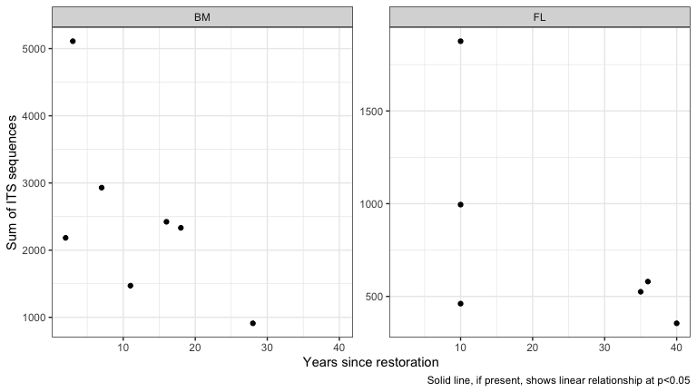
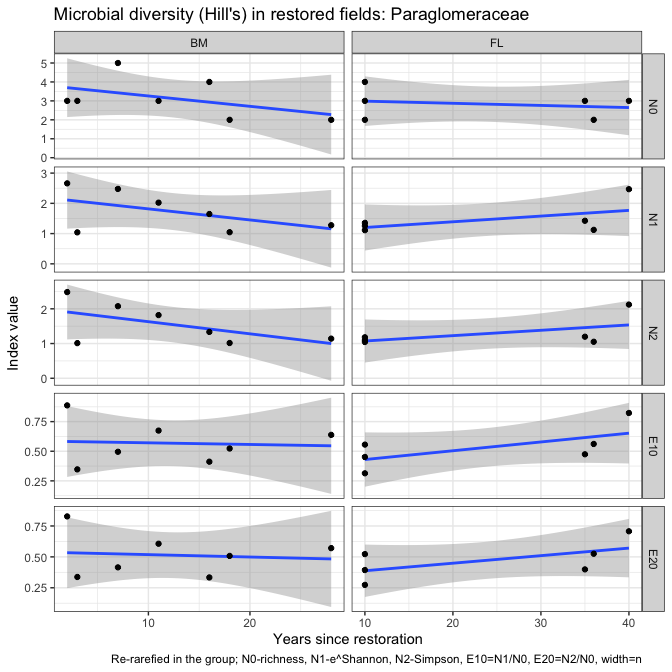
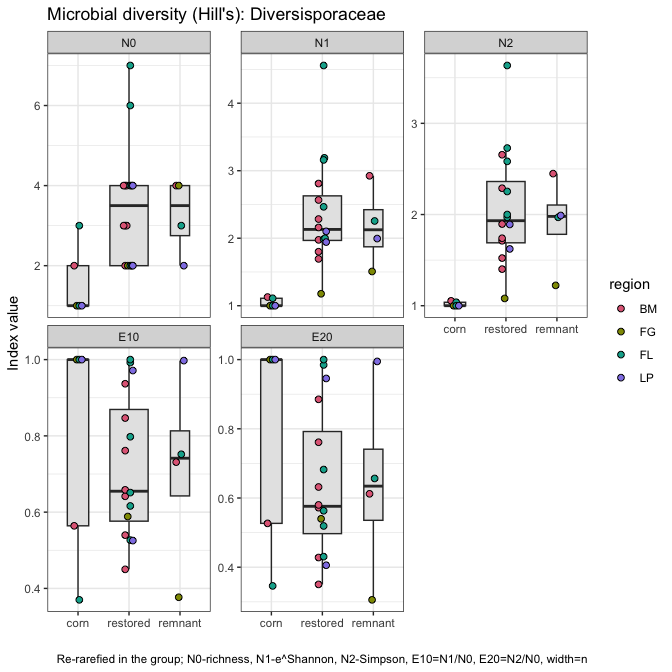

Microbial data: microbial guilds and taxonomy
================
Beau Larkin

Last updated: 09 March, 2023

- <a href="#description" id="toc-description">Description</a>
- <a href="#packages-and-libraries"
  id="toc-packages-and-libraries">Packages and libraries</a>
- <a href="#data" id="toc-data">Data</a>
  - <a href="#sites-species-tables"
    id="toc-sites-species-tables">Sites-species tables</a>
  - <a href="#species-metadata" id="toc-species-metadata">Species
    metadata</a>
  - <a href="#site-metadata-and-design"
    id="toc-site-metadata-and-design">Site metadata and design</a>
  - <a href="#joined-species-metadata-and-design-tables"
    id="toc-joined-species-metadata-and-design-tables">Joined species,
    metadata, and design tables</a>
- <a href="#functions" id="toc-functions">Functions</a>
  - <a href="#function-its-and-guilds"
    id="toc-function-its-and-guilds">Function: ITS and guilds</a>
  - <a href="#18s-based-data-amf" id="toc-18s-based-data-amf">18S-based data
    (AMF)</a>
  - <a href="#examine-change-over-time-in-guilds"
    id="toc-examine-change-over-time-in-guilds">Examine change over time in
    guilds</a>
  - <a href="#re-rarefy-in-guilds-or-groups"
    id="toc-re-rarefy-in-guilds-or-groups">Re-rarefy in guilds (or
    groups)</a>
  - <a href="#filter-to-guilds-or-taxonomic-groups"
    id="toc-filter-to-guilds-or-taxonomic-groups">Filter to guilds or
    taxonomic groups</a>
    - <a href="#calculate-hills-series-on-a-samples-species-matrix"
      id="toc-calculate-hills-series-on-a-samples-species-matrix">Calculate
      Hill’s series on a samples-species matrix</a>
    - <a href="#results-from-re-rarefied-data"
      id="toc-results-from-re-rarefied-data">Results from re-rarefied data</a>
  - <a href="#perform-indicator-species-analysis"
    id="toc-perform-indicator-species-analysis">Perform Indicator Species
    Analysis</a>
- <a href="#analysis-and-results" id="toc-analysis-and-results">Analysis
  and Results</a>
  - <a href="#its-sequences" id="toc-its-sequences">ITS sequences</a>
    - <a href="#composition-in-field-types"
      id="toc-composition-in-field-types">Composition in field types</a>
    - <a href="#soil-saprotrophs" id="toc-soil-saprotrophs">Soil
      saprotrophs</a>
    - <a href="#plant-pathogens" id="toc-plant-pathogens">Plant pathogens</a>
    - <a href="#wood-saprotrophs" id="toc-wood-saprotrophs">Wood
      saprotrophs</a>
    - <a href="#litter-saprotrophs" id="toc-litter-saprotrophs">Litter
      saprotrophs</a>
  - <a href="#amf" id="toc-amf">AMF</a>
    - <a href="#claroideoglomeraceae"
      id="toc-claroideoglomeraceae">Claroideoglomeraceae</a>
    - <a href="#paraglomeraceae" id="toc-paraglomeraceae">Paraglomeraceae</a>
    - <a href="#diversisporaceae"
      id="toc-diversisporaceae">Diversisporaceae</a>
    - <a href="#gigasporaceae" id="toc-gigasporaceae">Gigasporaceae</a>
- <a href="#conclusions-taxa-and-guilds"
  id="toc-conclusions-taxa-and-guilds">Conclusions: taxa and guilds</a>

# Description

Sequence clusters identified in QIIME2 are annotated with taxonomic
information and metadata from [Fungal
traits](https://link.springer.com/article/10.1007/s13225-020-00466-2).
In this report, sequence abundances in taxonomic groups or fungal guilds
are compared across field types and with time since restoration.

The full sequence abundance tables were rarefied to make sequencing
depth equivalent across fields. This can result in lower-abundance OTUs
dropping to zero. Within guilds, loss of OTUs could change or bias
interpretations of richness, diversity, and composition. We tried using
raw sequence data and rarefying within guilds to address this problem,
but in each case the sequence depth was so small that additional OTUs
were lost and abundances were significantly lowered.

We may try a different approach which is described in [Semchenko et
al. 2018](https://www.science.org/doi/10.1126/sciadv.aau4578), but for
now, the analysis uses data from the entire rarefied tables for ITS and
18S sequences.

# Packages and libraries

``` r
packages_needed = c("tidyverse",
                    "knitr",
                    "conflicted",
                    "ggbeeswarm",
                    "colorspace",
                    "rsq",
                    "lme4",
                    "multcomp",
                    "indicspecies",
                    "GUniFrac",
                    "vegan")
packages_installed = packages_needed %in% rownames(installed.packages())
```

``` r
if (any(!packages_installed)) {
    install.packages(packages_needed[!packages_installed])
}
```

``` r
for (i in 1:length(packages_needed)) {
    library(packages_needed[i], character.only = T)
}
```

``` r
conflict_prefer("filter", "dplyr")
conflict_prefer("select", "dplyr")
```

# Data

## Sites-species tables

CSV files were produced in `process_data.R`

``` r
spe <- list(
    its_raw = read_csv(
        paste0(getwd(), "/clean_data/spe_ITS_raw.csv"),
        show_col_types = FALSE
    ),
    its_rfy = read_csv(
        paste0(getwd(), "/clean_data/spe_ITS_rfy.csv"),
        show_col_types = FALSE
    ),
    amf_raw = read_csv(
        paste0(getwd(), "/clean_data/spe_18S_raw.csv"),
        show_col_types = FALSE
    ),
    amf_rfy = read_csv(
        paste0(getwd(), "/clean_data/spe_18S_rfy.csv"),
        show_col_types = FALSE
    )
)
```

## Species metadata

Load taxonomy for all and guilds (`primary_lifestyle` in Fungal Traits)
for ITS OTUs.

``` r
meta <- list(
    its_raw = 
        read_csv(
            paste0(getwd(), "/clean_data/spe_ITS_raw_taxonomy.csv"),
            show_col_types = FALSE
        ),
    its_rfy = 
        read_csv(
            paste0(getwd(), "/clean_data/spe_ITS_rfy_taxonomy.csv"),
            show_col_types = FALSE
        ),
    amf_raw = 
        read_csv(
            paste0(getwd(), "/clean_data/spe_18S_raw_taxonomy.csv"),
            show_col_types = FALSE
        ),
    amf_rfy = 
        read_csv(
            paste0(getwd(), "/clean_data/spe_18S_rfy_taxonomy.csv"),
            show_col_types = FALSE
        )
)
```

## Site metadata and design

``` r
sites   <-
    read_csv(paste0(getwd(), "/clean_data/sites.csv"), show_col_types = FALSE) %>%
    mutate(
        field_type = factor(
            field_type,
            ordered = TRUE,
            levels = c("corn", "restored", "remnant")
        )) %>%
    select(-lat, -long, -yr_restore, -yr_rank) %>% 
    arrange(field_key)
```

## Joined species, metadata, and design tables

Functions streamline this process

``` r
join_spe_meta <-
    function(spe, meta) {
        spe %>%
            pivot_longer(starts_with("otu"),
                         names_to = "otu_num",
                         values_to = "seq_abund") %>%
            filter(seq_abund != 0) %>%
            left_join(meta, by = join_by(otu_num)) %>%
            left_join(sites, by = join_by(field_key))
    }
```

``` r
spe_meta <- list(
    its_raw = 
        join_spe_meta(spe$its_raw, meta$its_raw) %>%
        write_csv(paste0(getwd(), "/clean_data/speTaxa_ITS_raw.csv")),
    its_rfy = 
        join_spe_meta(spe$its_rfy, meta$its_rfy) %>%
        write_csv(paste0(getwd(), "/clean_data/speTaxa_ITS_rfy.csv")),
    amf_raw = 
        join_spe_meta(spe$amf_raw, meta$amf_raw) %>%
        write_csv(paste0(getwd(), "/clean_data/speTaxa_18S_raw.csv")),
    amf_rfy = 
        join_spe_meta(spe$amf_rfy, meta$amf_rfy) %>%
        write_csv(paste0( getwd(), "/clean_data/speTaxa_18S_rfy.csv" ))
)
```

# Functions

Functions streamline data processing, model fitting, and results output.
\### Function: ITS taxonomy This function simplifies and displays the
sequence distribution among taxa and across primary lifestyles. Use the
argument `other_threshold` to choose a small (e.g., 2, the default)
cutoff, below which orders are relabeled as “other”.

``` r
its_taxaGuild <- function(data, other_threshold=2) {
    # What is the distribution among site types at the class level?
    taxonomy_df <-
        data %>%
        group_by(phylum, order, field_type, field_name) %>%
        summarize(abund = sum(seq_abund), .groups = "drop") %>%
        group_by(phylum, order, field_type) %>%
        summarize(mean = mean(abund) %>% round(., 2),
                  .groups = "drop") %>%
        pivot_wider(
            names_from = field_type,
            values_from = mean,
            values_fill = 0
        ) %>%
        select(phylum, order, corn, restored, remnant) %>%
        arrange(-remnant)
    print(kable(
        taxonomy_df,
        format = "pandoc",
        caption = "Distribution of ITS OTUs in classes; mean sequence abundance by field type"
    ))
    # What is the distribution of `primary_lifestyles` among site types?
    guild_df <-
        data %>%
        group_by(primary_lifestyle, field_type, field_name) %>%
        summarize(abund = sum(seq_abund), .groups = "drop") %>%
        group_by(primary_lifestyle, field_type) %>%
        summarize(mean = round(mean(abund), 1), .groups = "drop") %>%
        pivot_wider(
            names_from = field_type,
            values_from = mean,
            values_fill = 0
        ) %>%
        select(primary_lifestyle, corn, restored, remnant) %>%
        arrange(-remnant)
    # Create table
    table <- kable(guild_df, format = "pandoc",
        caption = "Distribution of ITS OTUs by Fungal Trait 'primary_lifestyle'; mean sequence abundance by field type")
    # Plot the most abundant orders across field types
    plot_orders <- 
        data %>% 
        filter(order != is.na(order), order != "unidentified") %>% 
        group_by(field_type, order, field_key) %>% 
        summarize(seq_sum = sum(seq_abund), .groups = "drop_last") %>% 
        summarize(seq_avg = mean(seq_sum), .groups = "drop_last") %>% 
        mutate(seq_comp = (seq_avg / sum(seq_avg)) * 100,
               order = replace(order, which(seq_comp < 2), paste0("Other (OTU<", other_threshold, "%)"))) %>% 
        group_by(field_type, order) %>% 
        summarize(seq_comp = sum(seq_comp), .groups = "drop") %>% 
        ggplot(., aes(x = field_type, y = seq_comp)) +
        geom_col(aes(fill = order), color = "black") +
        labs(x = "", y = "Proportion of sequence abundance",
             title = "Composition of fungi by order") +
        scale_fill_discrete_sequential(name = "Order", palette = "Plasma") +
        theme_classic()
    # Plot the composition of primary lifestyles
    plot_guilds <- 
        data %>% 
        filter(primary_lifestyle != is.na(primary_lifestyle)) %>% 
        group_by(field_type, primary_lifestyle, field_key) %>% 
        summarize(seq_sum = sum(seq_abund), .groups = "drop_last") %>% 
        summarize(seq_avg = mean(seq_sum), .groups = "drop_last") %>% 
        mutate(seq_comp = (seq_avg / sum(seq_avg)) * 100,
               primary_lifestyle = replace(primary_lifestyle, which(seq_comp < 2), paste0("Other (OTU<", other_threshold, "%)"))) %>% 
        group_by(field_type, primary_lifestyle) %>% 
        summarize(seq_comp = sum(seq_comp), .groups = "drop") %>% 
        ggplot(., aes(x = field_type, y = seq_comp)) +
        geom_col(aes(fill = primary_lifestyle), color = "black") +
        labs(x = "", y = "Proportion of sequence abundance",
             title = "Composition of fungi by primary lifestyle") +
        scale_fill_discrete_sequential(name = "Primary lifestyle", palette = "Inferno") +
        theme_classic()
    
    print(list(table,
               plot_orders,
               plot_guilds))
    
}
```

### Function: ITS and guilds

Several primary lifestyles have been chosen from Fungal Traits for
further examination. These lifestyles were the largest by sequence
abundance and thought to be most informative given the habitat and
questions applied.

This function filters those groups and tests them among field types.
These tests aren’t technically valid due to pseudoreplication, but this
analysis can help us find trends worthy of further study.

``` r
its_test_taxaGuild <- function(data) {
    pl <- c("soil_saprotroph", "plant_pathogen", "ectomycorrhizal", "wood_saprotroph", "litter_saprotroph")
    df1 <- data.frame()
    for (i in 1:length(pl)) {
        cat("---------------------------------\n")
        print(pl[i])
        cat("---------------------------------\n")
        mod_data <- data %>%
            filter(primary_lifestyle == pl[i]) %>%
            group_by(field_type, region, field_name, yr_since, primary_lifestyle) %>%
            summarize(seq_sum = sum(seq_abund), .groups = "drop")
        print(kable(mod_data %>% arrange(-seq_sum), format = "pandoc"))
        cat("----------------------------------------------------\n\n")
        mmod <-
            lmer(seq_sum ~ field_type + (1 | region),
                 data = mod_data,
                 REML = FALSE)
        print(mmod)
        cat("----------------------------------------------------\n\n")
        mmod_null <-
            lmer(seq_sum ~ 1 + (1 | region),
                 data = mod_data,
                 REML = FALSE)
        print(mmod_null)
        cat("----------------------------------------------------\n\n")
        print(anova(mmod, mmod_null))
        cat("----------------------------------------------------\n\n")
        mod_tuk <-
            glht(mmod,
                 linfct = mcp(field_type = "Tukey"),
                 test = adjusted("holm"))
        print(summary(mod_tuk))
        print(cld(mod_tuk))
        cat("----------------------------------------------------\n\n")
        print(paste(
            "Years since restoration and",
            pl[i],
            "sequence abundance in Blue Mounds Area"
        ))
        mod_data2 <- mod_data %>%
            filter(region == "BM", field_type == "restored")
        print(summary(lm(seq_sum ~ yr_since,
                         data = mod_data2)))
        cat("\n\n\n")
        df1 <- rbind(df1, mod_data)
    }
    
    return(df1)
    
}
```

## 18S-based data (AMF)

This function simplifies and displays taxonomic information about the
AMF OTUs.

``` r
amf_tax <- function(data) {
    cat("---------------------------------\n")
    print(paste("AMF"))
    cat("---------------------------------\n")
    amf_df <-
        data %>%
        group_by(family, field_type, region, field_name, yr_since) %>%
        summarize(seq_sum = sum(seq_abund) %>% round(., 1),
                  .groups = "drop")
    amf_df_summary <-
        amf_df %>%
        group_by(family, field_type) %>%
        summarize(seq_avg = mean(seq_sum) %>% round(., 1),
                  .groups = "drop") %>%
        pivot_wider(
            names_from = field_type,
            values_from = seq_avg,
            names_sort = TRUE,
            values_fill = 0
        ) %>%
        arrange(-remnant)
    
    print(kable(amf_df_summary, format = "pandoc"))
    
    cat("\n---------------------------------\n")
    print("Compare abundances across field types with mixed model")
    cat("---------------------------------\n")
    test_families <-
        amf_df %>% 
        count(region, family, field_type) %>% 
        count(region, family) %>% 
        filter(n == 3) %>% 
        pull(family) %>% 
        unique()
    for (i in 1:length(test_families)) {
        cat("\n---------------------------------\n")
        print(test_families[i])
        cat("---------------------------------\n")
        mmod <-
            lmer(
                seq_sum ~ field_type + (1 | region),
                data = amf_df %>% filter(family == test_families[i]),
                REML = FALSE
            )
        print(mmod)
        cat("----------------------------------------------------\n\n")
        mmod_null <-
            lmer(
                seq_sum ~ 1 + (1 | region),
                data = amf_df %>% filter(family == test_families[i]),
                REML = FALSE
            )
        print(mmod_null)
        cat("----------------------------------------------------\n\n")
        print(anova(mmod, mmod_null))
        cat("----------------------------------------------------\n\n")
        mod_tuk <-
            glht(mmod,
                 linfct = mcp(field_type = "Tukey"),
                 test = adjusted("holm"))
        print(summary(mod_tuk))
        print(cld(mod_tuk))
        cat("\n")
    }
    cat("\n---------------------------------\n")
    print("Test abundances with years since restoration")
    cat("---------------------------------\n")
    all7 <-
        amf_df %>%
        filter(field_type == "restored", region == "BM") %>%
        count(family) %>%
        filter(n == 7) %>%
        pull(family)
    mod_data <-
        amf_df %>%
        filter(field_type == "restored", region == "BM", family %in% all7)
    for (i in 1:length(all7)) {
        print(all7[i])
        print(summary(lm(
            seq_sum ~ yr_since, data = mod_data %>% filter(family == all7[i])
        )))
    }
    return(amf_df)
}
```

## Examine change over time in guilds

Function `guiltime()` filters ITS data to a user-specified guild and
produces linear models and plots of change in sequence abundance over
time since restoration in Blue Mounds and Fermilab.

``` r
guiltime <- function(pl) {
    d <- spe_meta$its_rfy %>%
        filter(
            primary_lifestyle == pl,
            region %in% c("BM", "FL"),
            field_type == "restored"
        ) %>% 
        group_by(field_key, field_name, region, yr_since) %>% 
        summarize(seq_sum = sum(seq_abund), .groups = "drop")
    
    bm <- summary(
        lm(seq_sum ~ yr_since, data = d %>% filter(region == "BM"))
    )
    fl <- summary(
        lm(seq_sum ~ yr_since, data = d %>% filter(region == "FL"))
    )
    
    fits <- data.frame(
        rbind(BM = c(coef(bm)[1,1], coef(bm)[2,1], coef(bm)[2,4]),
              FL = c(coef(fl)[1,1], coef(fl)[2,1], coef(fl)[2,4]))) %>% 
        mutate(lty = case_when(X3 < 0.05 ~ "a", TRUE ~ NA_character_)) %>% 
        rownames_to_column(var = "region")
    plot <- 
        ggplot(d, aes(x = yr_since, y = seq_sum)) +
        facet_wrap(vars(region), scales = "free_y") +
        geom_point() +
        geom_abline(data = fits, aes(slope = X2, intercept = X1, linetype = lty), color = "blue") +
        labs(x = "Years since restoration", 
             y = "Sum of ITS sequences",
             caption = "Solid line, if present, shows linear relationship at p<0.05") +
        theme_bw() +
        theme(legend.position = "none")
    
    out <- list(
        bm_summary = bm,
        fl_summary = fl,
        plot = plot
    )
    
    print(out)
    
}
```

## Re-rarefy in guilds (or groups)

To examine richness and composition within subgroups of OTUs, the raw
sequence data should be re-rarefied within those groups. Otherwise,
especially with low-abundance groups, data and sites may have been lost
when the entire species matrix was rarefied. This function automates the
process.

Outputs are:

1.  Sequencing depth used for the subset of OTUs
2.  Number of OTUs excluded by rarefying
3.  The re-rarefied samples-species matrix
4.  The OTU list in long form, with abundances, species, and site
    metadata

``` r
rerare <- function(spe, meta, grp_var, grp, site) {
    # spe       = species matrix with raw abundances
    # meta      = species metadata matching the OTU list with raw abundances
    # grp_var   = variable name from `meta` desired for grouping and filtering
    #             the OTUs (e.g., `primary_lifestyle`, `family`)
    # grp       = string or factor level name of the group desired from `grp_var`
    # site      = site metadata to combine with sequence abundance long-form
    #             output table
    
    grp_var <- enquo(grp_var)
    
    data <- 
        spe %>% 
        column_to_rownames(var = "field_key") %>% 
        t() %>% 
        as.data.frame() %>% 
        rownames_to_column(var = "otu_num") %>% 
        as_tibble() %>% 
        left_join(meta, by = join_by(otu_num)) %>% 
        filter(!!grp_var == grp) %>% 
        column_to_rownames(var = "otu_num") %>% 
        select(-colnames(meta)[-1]) %>% 
        t() %>% 
        as.data.frame()
    
    depth <- min(rowSums(data))
    rfy <- Rarefy(data)
    zero_otu <- which(apply(rfy$otu.tab.rff, 2, sum) == 0)
    rrfd <- data.frame(rfy$otu.tab.rff[, -zero_otu]) %>%
        rownames_to_column(var = "field_key") %>%
        mutate(field_key = as.numeric(field_key)) %>% 
        arrange(field_key) %>% 
        as_tibble()
    
    rrfd_speTaxa <- 
        rrfd %>% 
        pivot_longer(cols = starts_with("otu"), 
                     names_to = "otu_num", 
                     values_to = "seq_abund") %>% 
        filter(seq_abund > 0) %>% 
        left_join(meta, by = join_by(otu_num)) %>% 
        left_join(site, by = join_by(field_key)) %>% 
        select(-otu_ID)
    
    return(list(
        seq_depth = depth,
        zero_otu_num = length(zero_otu),
        rrfd = rrfd,
        rrfd_speTaxa = rrfd_speTaxa
    ))
    
}
```

## Filter to guilds or taxonomic groups

To examine richness and composition within subgroups of OTUs, the
rarefied table must be transposed, filtered, and transposed back. The
function `filgu()` or “filter guilds” automates this process.

Outputs are:

1.  The resulting samples-species matrix
2.  Sequence abundances in long-form, with site and species metadata

Note that this function isn’t necessary. Everything produced here can be
done with the `spe_meta$..._rfy` tables. But I’m keeping this path going
for now in case we need to switch back to rarefying within groups again.

``` r
filgu <- function(spe, meta, grp_var, grp, site) {
    # spe       = species matrix with raw abundances
    # meta      = species metadata matching the OTU list with raw abundances
    # grp_var   = variable name from `meta` desired for grouping and filtering
    #             the OTUs (e.g., `primary_lifestyle`, `family`)
    # grp       = string or factor level name of the group desired from `grp_var`
    # site      = site metadata to combine with sequence abundance long-form
    #             output table
    
    grp_var <- enquo(grp_var)
    
    filspe <- 
        spe %>% 
        column_to_rownames(var = "field_key") %>% 
        t() %>% 
        as.data.frame() %>% 
        rownames_to_column(var = "otu_num") %>% 
        as_tibble() %>% 
        left_join(meta, by = join_by(otu_num)) %>% 
        filter(!!grp_var == grp) %>% 
        column_to_rownames(var = "otu_num") %>% 
        select(-colnames(meta)[-1]) %>% 
        t() %>% 
        as.data.frame() %>%
        rownames_to_column(var = "field_key") %>%
        mutate(field_key = as.numeric(field_key)) %>% 
        arrange(field_key) %>% 
        as_tibble()
    
    cs <- colSums(filspe %>% select(-field_key))
    rs <- rowSums(filspe %>% select(-field_key))
    
    hist(cs,
         breaks = length(cs),
         main = "Histogram of OTU sequence sums",
         xlab = "Number of sequences")
    
    hist(rs,
         breaks = length(rs),
         main = "Histogram of sequence abundance in samples",
         xlab = "Number of sequences")
    
    filspeTaxa <- 
        filspe %>% 
        pivot_longer(cols = starts_with("otu"), 
                     names_to = "otu_num", 
                     values_to = "seq_abund") %>% 
        filter(seq_abund > 0) %>% 
        left_join(meta, by = join_by(otu_num)) %>% 
        left_join(site, by = join_by(field_key)) %>% 
        select(-otu_ID)
    
    print(list(
        OTUs_n = length(cs),
        Sites_n = length(which(rs > 0))
    ))
    
    return(list(
        filspe = filspe,
        filspeTaxa = filspeTaxa
    ))
    
}
```

### Calculate Hill’s series on a samples-species matrix

The objects `$rrfd` from **rerare()** or `$filspe` from **filgu()** can
be passed to this function

``` r
calc_diversity <- function(spe) {
    spe_mat <- data.frame(spe, row.names = 1)
    
    N0  <- apply(spe_mat > 0, MARGIN = 1, FUN = sum)
    N1  <- exp(diversity(spe_mat))
    N2  <- diversity(spe_mat, "inv")
    E10 <- N1 / N0
    E20 <- N2 / N0
    
    return(
        data.frame(N0, N1, N2, E10, E20) %>%
            rownames_to_column(var = "field_key") %>%
            mutate(field_key = as.integer(field_key)) %>%
            left_join(sites, by = join_by(field_key)) %>%
            pivot_longer(
                cols = N0:E20,
                names_to = "hill_index",
                values_to = "value"
            ) %>%
            mutate(hill_index = factor(
                hill_index,
                ordered = TRUE,
                levels = c("N0", "N1", "N2", "E10", "E20")
            ))
    )
}
```

### Results from re-rarefied data

After re-rarefying into a guild (or taxonomic group), produce diversity
statistics and calculate percent composition; display results. For
plotting, it’s convenient to limit the number of taxonomic orders
displayed. Use the argument `other_threshold` to choose a small (e.g.,
2, the default) cutoff, below which orders are relabeled as “other”.

``` r
gudicom <- function(div, rrfd, grp_var, gene="its", other_threshold=2) {
    hillfield <-     
        ggplot(div, aes(x = field_type, y = value)) +
        facet_wrap(vars(hill_index), scales = "free_y") +
        geom_boxplot(varwidth = TRUE, fill = "gray90", outlier.shape = NA) +
        geom_beeswarm(aes(fill = region), shape = 21, size = 2, dodge.width = 0.2) +
        labs(x = "", y = "Index value", title = paste("Microbial diversity (Hill's):", grp_var),
             caption = "Re-rarefied in the group; N0-richness, N1-e^Shannon, N2-Simpson, E10=N1/N0, E20=N2/N0, width=n") +
        scale_fill_discrete_qualitative(palette = "Dark3") +
        theme_bw()
    hilltime <- 
        div %>% 
        filter(field_type == "restored", region %in% c("BM", "FL")) %>% 
        ggplot(aes(x = yr_since, y = value)) +
        facet_grid(rows = vars(hill_index), cols = vars(region), scales = "free") +
        geom_smooth(method = "lm") +
        geom_point() +
        labs(x = "Years since restoration", y = "Index value", title = paste("Microbial diversity (Hill's) in restored fields:", grp_var),
             caption = "Re-rarefied in the group; N0-richness, N1-e^Shannon, N2-Simpson, E10=N1/N0, E20=N2/N0, width=n") +
        theme_bw()
    if(gene == "its") {
        comp_ft <- 
            rrfd %>% 
            filter(order != is.na(order), order != "unidentified") %>% 
            group_by(field_type, order, field_key) %>% 
            summarize(seq_sum = sum(seq_abund), .groups = "drop_last") %>% 
            summarize(seq_avg = mean(seq_sum), .groups = "drop_last") %>% 
            mutate(seq_comp = (seq_avg / sum(seq_avg)) * 100,
                   order = replace(order, which(seq_comp < other_threshold), paste0("Other (OTU<", other_threshold, "%)"))) %>% 
            group_by(field_type, order) %>% 
            summarize(seq_comp = sum(seq_comp), .groups = "drop")
        comp_ft_plot <-
            ggplot(comp_ft, aes(x = field_type, y = seq_comp)) +
            geom_col(aes(fill = order), color = "black") +
            labs(x = "", y = "Proportion of sequence abundance",
                 title = paste("Composition of", grp_var)) +
            scale_fill_discrete_sequential(name = "Order", palette = "Plasma") +
            theme_classic()
        
        yr_fct <- 
            sites %>% 
            filter(field_type == "restored") %>% 
            select(field_key, yr_since) %>% 
            arrange(yr_since) %>% 
            mutate(yr_fct = factor(yr_since, ordered = TRUE))
        comp_yr <- 
            rrfd %>% 
            filter(order != is.na(order), 
                   order != "unidentified",
                   field_type == "restored",
                   region == "BM") %>% 
            group_by(field_key, order) %>% 
            summarize(seq_sum = sum(seq_abund), .groups = "drop_last") %>% 
            mutate(seq_comp = (seq_sum / sum(seq_sum)) * 100,
                   order = replace(order, which(seq_comp < other_threshold), paste0("Other (OTU<", other_threshold, "%)"))) %>% 
            left_join(yr_fct, by = join_by(field_key))
        comp_yr_plot <-
            ggplot(comp_yr, aes(x = yr_fct, y = seq_comp)) +
            geom_col(aes(fill = order), color = "black") +
            labs(x = "Years since restoration", y = "Proportion of sequence abundance",
                 title = paste("Composition of", grp_var, "in the Blue Mounds area")) +
            scale_fill_discrete_sequential(name = "Order", palette = "Plasma") +
            theme_classic()
        
        print(list(
            Hills_field_type = hillfield,
            Hills_yrs_since_restoration = hilltime,
            Composition_field_type = comp_ft_plot,
            Composition_yr_since = comp_yr_plot
        ))
        
        return(list(comp_ft, comp_yr))
        
    } else {
        print(list(
            Hills_field_type = hillfield,
            Hills_yrs_since_restoration = hilltime
        ))
    }
    
}
```

## Perform Indicator Species Analysis

Function `inspan()` takes a combined species and sites data frame and
wrangles it through the analysis to filter OTUs for indicators of field
types. The output is top candidate OTUs joined with species metadata for
further analysis.

``` r
inspan <- function(data, np, meta) {
    # data is the samples-species matrix joined with the sites data frame
    # the join aligns the grouping vector with field numbers
    # np is the desired number of permutations
    # meta is the appropriate species metadata table for the original data
    spe <- data.frame(
        data %>% select(field_key, starts_with("otu")),
        row.names = 1
    )
    grp = data$field_type
    mp <- multipatt(
        spe, 
        grp, 
        max.order = 1, 
        control = how(nperm = np))
    si <- mp$sign %>% 
        select(index, stat, p.value) %>% 
        mutate(field_type = case_when(index == 1 ~ "corn", 
                                      index == 2 ~ "restored", 
                                      index == 3 ~ "remnant")) %>% 
        filter(p.value < 0.05) %>% 
        rownames_to_column(var = "otu_num") %>%
        select(-index) %>% 
        as_tibble()
    A  <- mp$A %>% 
        as.data.frame() %>% 
        rownames_to_column(var = "otu_num") %>% 
        pivot_longer(cols = corn:remnant, 
                     names_to = "field_type", 
                     values_to = "A")
    B <- mp$B %>% 
        as.data.frame() %>% 
        rownames_to_column(var = "otu_num") %>% 
        pivot_longer(cols = corn:remnant, 
                     names_to = "field_type", 
                     values_to = "B")
    out <- 
        si %>% 
        left_join(A, by = join_by(otu_num, field_type)) %>% 
        left_join(B, by = join_by(otu_num, field_type)) %>% 
        left_join(meta %>% select(-otu_ID), by = join_by(otu_num)) %>% 
        select(otu_num, A, B, stat, p.value, 
               field_type, primary_lifestyle, everything()) %>% 
        arrange(field_type, -stat)
    
    return(out)
    
}
```

# Analysis and Results

## ITS sequences

Recall the number of OTUs recovered in each dataset. The effect of
rarefying did not change richness or diversity very much.

``` r
# Number of OTUs in raw and rarefied datasets
Map(function(x) ncol(x)-1, spe[1:2])
```

    ## $its_raw
    ## [1] 2795
    ## 
    ## $its_rfy
    ## [1] 2785

### Composition in field types

Function outputs are verbose, but details may be necessary later so they
are displayed here.

``` r
its_taxaGuild(spe_meta$its_rfy)
```

    ## 
    ## 
    ## Table: Distribution of ITS OTUs in classes; mean sequence abundance by field type
    ## 
    ## phylum                             order                                        corn   restored   remnant
    ## ---------------------------------  --------------------------------------  ---------  ---------  --------
    ## Ascomycota                         Hypocreales                               7313.40    6209.50   6936.50
    ## Ascomycota                         Chaetothyriales                            617.40    5584.19   5809.00
    ## Basidiomycota                      Agaricales                                2776.60    2085.38   4974.25
    ## Ascomycota                         Pleosporales                              6417.40    6411.88   4933.75
    ## Ascomycota                         Sordariales                              10383.80    4293.31   3319.25
    ## Ascomycota                         Helotiales                                2650.40    3264.62   3208.50
    ## Ascomycota                         NA                                        1264.20    2363.31   2891.50
    ## NA                                 NA                                        1222.60    1908.62   2324.25
    ## Ascomycota                         Onygenales                                  71.40    1267.19   2047.00
    ## Mortierellomycota                  Mortierellales                            3290.40    2573.62   1644.25
    ## Basidiomycota                      Thelephorales                                1.00      27.00   1033.25
    ## Ascomycota                         Geoglossales                                 5.67    1465.08    905.25
    ## Ascomycota                         GS34                                         0.00      69.33    695.00
    ## Ascomycota                         Glomerellales                             1757.40    1103.31    660.00
    ## Ascomycota                         unidentified                                 0.00     828.80    611.00
    ## Basidiomycota                      Cantharellales                             268.20     753.06    560.00
    ## Glomeromycota                      Glomerales                                  81.40     414.88    432.75
    ## Ascomycota                         Coniochaetales                             696.80     162.69    302.00
    ## Ascomycota                         Sordariomycetes_ord_Incertae_sedis          37.00      52.56    238.00
    ## Ascomycota                         Xylariales                                  64.80     284.94    177.25
    ## Basidiomycota                      Russulales                                   3.00       3.50    176.67
    ## Basidiomycota                      NA                                          73.60     553.75    170.75
    ## Ascomycota                         Pezizales                                  916.00     313.62    166.50
    ## Ascomycota                         Capnodiales                                541.80     509.00    159.25
    ## Basidiomycota                      Sebacinales                                 26.80     627.12    158.00
    ## Ascomycota                         Magnaporthales                              75.20     118.00    149.25
    ## Basidiomycota                      Boletales                                    5.50      11.00    144.50
    ## Glomeromycota                      NA                                           4.67     147.69    129.67
    ## Ascomycota                         Minutisphaerales                             0.00      57.00    108.00
    ## Ascomycota                         Chaetosphaeriales                          260.50     259.00     99.33
    ## Mucoromycota                       NA                                           0.00      20.50     89.50
    ## Ascomycota                         Branch06                                    13.50     132.36     85.00
    ## Ascomycota                         Mytilinidales                                0.00       0.00     80.00
    ## Basidiomycota                      Trichosporonales                           113.00      40.33     76.67
    ## Basidiomycota                      Tremellales                                 16.00      89.69     75.75
    ## Basidiomycota                      Auriculariales                             108.50     216.81     75.50
    ## Chytridiomycota                    Spizellomycetales                          159.40      86.93     72.25
    ## Basidiomycota                      Filobasidiales                             805.00     289.57     71.67
    ## Basidiomycota                      Cystofilobasidiales                       2246.80      83.15     64.50
    ## Mucoromycota                       Umbelopsidales                               0.00       2.00     64.00
    ## Ascomycota                         Mytilinidiales                               0.00      13.33     63.00
    ## Ascomycota                         Thelebolales                                93.25      35.08     62.25
    ## Basidiomycota                      Hymenochaetales                             12.80     178.07     60.00
    ## Chytridiomycota                    Rhizophlyctidales                          209.80     106.87     53.25
    ## Ascomycota                         Dothideomycetes_ord_Incertae_sedis           0.00       0.00     52.00
    ## Ascomycota                         Venturiales                                 29.00      71.38     47.00
    ## Ascomycota                         Verrucariales                                0.00       0.00     46.00
    ## Basidiomycota                      Ustilaginales                                2.00      81.25     42.33
    ## Basidiomycota                      Tremellodendropsidales                       7.00      27.46     31.00
    ## Ascomycota                         Orbiliales                                  21.67      80.79     29.67
    ## Basidiomycota                      Atheliales                                   0.00     140.00     29.00
    ## Basidiomycota                      Geminibasidiales                            33.00      83.50     28.50
    ## Basidiomycota                      Polyporales                                 19.80      28.13     28.25
    ## Ascomycota                         Tubeufiales                                 68.40     164.88     27.50
    ## Ascomycota                         Saccharomycetales                          261.25      39.20     26.67
    ## Basidiomycota                      Trechisporales                             122.20     361.81     22.67
    ## Ascomycota                         Myrmecridiales                               0.00      71.12     22.50
    ## Basidiomycota                      Phallales                                  207.25      41.50     22.33
    ## Basidiomycota                      Erythrobasidiales                            0.00       3.80     21.50
    ## Chytridiomycota                    Chytridiales                                 5.00      86.50     20.50
    ## Ascomycota                         GS32                                         0.00       0.00     20.00
    ## Rozellomycota                      GS11                                         0.00       3.00     20.00
    ## Ascomycota                         Microascales                               107.40      71.73     19.00
    ## Ascomycota                         Diaporthales                               122.25      11.00     15.50
    ## Ascomycota                         Savoryellales                               14.50      17.00     13.50
    ## Chytridiomycota                    Rhizophydiales                              18.25      16.20     13.50
    ## Ascomycota                         Eurotiales                                 105.60      34.80     12.75
    ## Ascomycota                         Archaeorhizomycetales                        0.00      32.43     11.00
    ## Ascomycota                         Ostropales                                   0.00      48.50     11.00
    ## Glomeromycota                      Archaeosporales                              2.00       9.25     10.00
    ## Basidiomycota                      Leucosporidiales                            32.33       8.71      9.00
    ## Mortierellomycota                  NA                                           0.00       3.00      9.00
    ## Basidiomycota                      Geastrales                                  50.00      48.67      8.00
    ## Chlorophyta                        Chaetopeltidales                            12.00       5.70      7.00
    ## Ascomycota                         Acrospermales                                0.00       8.00      6.00
    ## Ascomycota                         Rhytismatales                                0.00       2.00      6.00
    ## Basidiobolomycota                  Basidiobolales                               7.00      16.33      6.00
    ## Basidiomycota                      Agaricomycetes_ord_Incertae_sedis            0.00       0.00      5.00
    ## Chlorophyta                        NA                                           9.00       7.00      5.00
    ## Anthophyta                         Poales                                       3.50       3.33      4.00
    ## Basidiomycota                      Microbotryomycetes_ord_Incertae_sedis        9.00      10.33      4.00
    ## Ascomycota                         Dothideales                                  0.00      27.75      3.50
    ## Ascomycota                         Candelariales                                0.00       2.00      3.00
    ## Basidiomycota                      Atractiellales                              13.00       0.00      3.00
    ## Glomeromycota                      Diversisporales                              0.00       8.00      3.00
    ## Basidiomycota                      unidentified                                11.00     118.50      2.50
    ## Ichthyosporia_phy_Incertae_sedis   unidentified                                 0.00       0.00      2.00
    ## Mucoromycota                       Mucorales                                    0.00       5.83      2.00
    ## Anthophyta                         Asterales                                    0.00       6.00      0.00
    ## Anthophyta                         Brassicales                                 10.00       6.00      0.00
    ## Anthophyta                         Commelinales                                 4.00     229.00      0.00
    ## Anthophyta                         Fabales                                      0.00      15.00      0.00
    ## Ascomycota                         Boliniales                                  32.00      45.50      0.00
    ## Ascomycota                         Botryosphaeriales                           16.00      22.40      0.00
    ## Ascomycota                         Jahnulales                                  11.00       0.00      0.00
    ## Ascomycota                         Pezizomycotina_ord_Incertae_sedis           30.50     490.00      0.00
    ## Ascomycota                         Phacidiales                                  0.00       6.50      0.00
    ## Ascomycota                         Phomatosporales                            673.00       9.00      0.00
    ## Ascomycota                         Trichosphaeriales                            5.00      20.80      0.00
    ## Basidiomycota                      Agaricostilbales                             2.00       2.00      0.00
    ## Basidiomycota                      Corticiales                                  0.00      42.29      0.00
    ## Basidiomycota                      Cystobasidiales                             32.00      10.33      0.00
    ## Basidiomycota                      Entylomatales                                0.00      10.40      0.00
    ## Basidiomycota                      Holtermanniales                              3.67      15.00      0.00
    ## Basidiomycota                      Kriegeriales                                 1.00       2.00      0.00
    ## Basidiomycota                      Platygloeales                                0.00      47.75      0.00
    ## Basidiomycota                      Pucciniales                                  0.00       6.00      0.00
    ## Basidiomycota                      Sporidiobolales                             43.00      14.50      0.00
    ## Basidiomycota                      Tilletiales                                  0.00      16.25      0.00
    ## Basidiomycota                      Urocystidales                               59.00       5.00      0.00
    ## Calcarisporiellomycota             Calcarisporiellales                          0.00       4.00      0.00
    ## Cercozoa                           unidentified                                 6.00       3.00      0.00
    ## Chlorophyta                        Chaetophorales                               0.00      25.00      0.00
    ## Chlorophyta                        Chlamydomonadales                            0.00       2.00      0.00
    ## Chlorophyta                        Chlorellales                                 0.00       6.00      0.00
    ## Chlorophyta                        Sphaeropleales                               0.00       5.00      0.00
    ## Chytridiomycota                    unidentified                                 7.00       0.00      0.00
    ## Chytridiomycota                    NA                                          14.00       9.00      0.00
    ## Glomeromycota                      Paraglomerales                               0.00      14.67      0.00
    ## Glomeromycota                      unidentified                                 3.00      20.40      0.00
    ## Haplosporidia                      Haplosporidia_ord_Incertae_sedis             3.00      15.00      0.00
    ## Mucoromycota                       GS22                                         0.00       2.00      0.00
    ## [[1]]
    ## 
    ## 
    ## Table: Distribution of ITS OTUs by Fungal Trait 'primary_lifestyle'; mean sequence abundance by field type
    ## 
    ## primary_lifestyle            corn   restored   remnant
    ## -----------------------  --------  ---------  --------
    ## NA                        20165.8    24796.6   27189.2
    ## soil_saprotroph            7051.0     5741.4    6046.2
    ## plant_pathogen             7077.2     7148.4    5637.8
    ## ectomycorrhizal              13.0      144.0    1959.8
    ## litter_saprotroph          2068.0     1434.8    1134.8
    ## wood_saprotroph            2860.6     2290.5    1122.8
    ## dung_saprotroph            2746.8     1564.8     936.5
    ## animal_parasite             660.4     1079.3     651.5
    ## mycoparasite               1843.2      595.1     210.5
    ## unspecified_saprotroph      769.8      157.3     171.8
    ## arbuscular_mycorrhizal       54.4      185.8     164.0
    ## root_endophyte               13.7      336.9     138.5
    ## pollen_saprotroph           145.6       74.8      55.0
    ## epiphyte                      0.0        7.0      31.0
    ## nectar/tap_saprotroph        35.0       37.1      26.7
    ## lichen_parasite              14.7       52.9      22.8
    ## lichenized                    0.0       93.0      11.0
    ## unspecified_pathotroph        0.0       12.2      10.0
    ## foliar_endophyte              3.5       34.5       6.0
    ## algal_parasite                1.0        4.0       0.0
    ## 
    ## [[2]]


    ## 
    ## [[3]]


``` r
its_rfy_guilds <- its_test_taxaGuild(spe_meta$its_rfy)
```

    ## ---------------------------------
    ## [1] "soil_saprotroph"
    ## ---------------------------------
    ## 
    ## 
    ## field_type   region   field_name    yr_since  primary_lifestyle    seq_sum
    ## -----------  -------  -----------  ---------  ------------------  --------
    ## corn         FL       FLC2                 0  soil_saprotroph        11971
    ## restored     BM       KORP1               28  soil_saprotroph        10651
    ## remnant      LP       LPREM1              NA  soil_saprotroph        10310
    ## restored     FL       FLRSP1              10  soil_saprotroph         9587
    ## restored     FL       FLRP5               35  soil_saprotroph         8867
    ## corn         FL       FLC1                 0  soil_saprotroph         7692
    ## restored     BM       PHRP1               11  soil_saprotroph         7314
    ## corn         LP       LPC1                 0  soil_saprotroph         7258
    ## restored     FL       FLRSP3              10  soil_saprotroph         7089
    ## remnant      BM       MBREM1              NA  soil_saprotroph         6516
    ## restored     BM       BBRP1               16  soil_saprotroph         6020
    ## corn         BM       PHC1                 0  soil_saprotroph         5120
    ## restored     FL       FLRP1               40  soil_saprotroph         5078
    ## restored     FL       FLRSP2              10  soil_saprotroph         4842
    ## restored     FL       FLRP4               36  soil_saprotroph         4575
    ## restored     BM       MBRP1               18  soil_saprotroph         4506
    ## remnant      FG       FGREM1              NA  soil_saprotroph         4431
    ## restored     LP       LPRP1                4  soil_saprotroph         4209
    ## restored     BM       ERRP1                3  soil_saprotroph         4179
    ## restored     BM       MHRP2                2  soil_saprotroph         4159
    ## restored     LP       LPRP2                4  soil_saprotroph         3920
    ## restored     BM       MHRP1                7  soil_saprotroph         3822
    ## corn         FG       FGC1                 0  soil_saprotroph         3214
    ## restored     FG       FGRP1               15  soil_saprotroph         3044
    ## remnant      FL       FLREM1              NA  soil_saprotroph         2928
    ## ----------------------------------------------------
    ## 
    ## Linear mixed model fit by maximum likelihood  ['lmerMod']
    ## Formula: seq_sum ~ field_type + (1 | region)
    ##    Data: mod_data
    ##       AIC       BIC    logLik  deviance  df.resid 
    ##  471.5550  477.6494 -230.7775  461.5550        20 
    ## Random effects:
    ##  Groups   Name        Std.Dev.
    ##  region   (Intercept)    0    
    ##  Residual             2470    
    ## Number of obs: 25, groups:  region, 4
    ## Fixed Effects:
    ##  (Intercept)  field_type.L  field_type.Q  
    ##       6279.5        -710.5         659.1  
    ## optimizer (nloptwrap) convergence code: 0 (OK) ; 0 optimizer warnings; 1 lme4 warnings 
    ## ----------------------------------------------------
    ## 
    ## Linear mixed model fit by maximum likelihood  ['lmerMod']
    ## Formula: seq_sum ~ 1 + (1 | region)
    ##    Data: mod_data
    ##       AIC       BIC    logLik  deviance  df.resid 
    ##  468.6033  472.2599 -231.3016  462.6033        22 
    ## Random effects:
    ##  Groups   Name        Std.Dev.
    ##  region   (Intercept)    0    
    ##  Residual             2523    
    ## Number of obs: 25, groups:  region, 4
    ## Fixed Effects:
    ## (Intercept)  
    ##        6052  
    ## optimizer (nloptwrap) convergence code: 0 (OK) ; 0 optimizer warnings; 1 lme4 warnings 
    ## ----------------------------------------------------
    ## 
    ## Data: mod_data
    ## Models:
    ## mmod_null: seq_sum ~ 1 + (1 | region)
    ## mmod: seq_sum ~ field_type + (1 | region)
    ##           npar    AIC    BIC  logLik deviance  Chisq Df Pr(>Chisq)
    ## mmod_null    3 468.60 472.26 -231.30   462.60                     
    ## mmod         5 471.55 477.65 -230.78   461.55 1.0483  2     0.5921
    ## ----------------------------------------------------
    ## 
    ## 
    ##   Simultaneous Tests for General Linear Hypotheses
    ## 
    ## Multiple Comparisons of Means: Tukey Contrasts
    ## 
    ## 
    ## Fit: lmer(formula = seq_sum ~ field_type + (1 | region), data = mod_data, 
    ##     REML = FALSE)
    ## 
    ## Linear Hypotheses:
    ##                         Estimate Std. Error z value Pr(>|z|)
    ## restored - corn == 0     -1309.6     1265.7  -1.035    0.550
    ## remnant - corn == 0      -1004.7     1657.2  -0.606    0.814
    ## remnant - restored == 0    304.9     1381.0   0.221    0.973
    ## (Adjusted p values reported -- single-step method)
    ## 
    ##     corn restored  remnant 
    ##      "a"      "a"      "a" 
    ## ----------------------------------------------------
    ## 
    ## [1] "Years since restoration and soil_saprotroph sequence abundance in Blue Mounds Area"
    ## 
    ## Call:
    ## lm(formula = seq_sum ~ yr_since, data = mod_data2)
    ## 
    ## Residuals:
    ##       1       2       3       4       5       6       7 
    ##  -612.1   326.9  1452.7 -2553.8  -885.5   520.7  1751.1 
    ## 
    ## Coefficients:
    ##             Estimate Std. Error t value Pr(>|t|)  
    ## (Intercept)   3210.6     1066.0   3.012   0.0297 *
    ## yr_since       213.8       71.7   2.982   0.0307 *
    ## ---
    ## Signif. codes:  0 '***' 0.001 '**' 0.01 '*' 0.05 '.' 0.1 ' ' 1
    ## 
    ## Residual standard error: 1627 on 5 degrees of freedom
    ## Multiple R-squared:  0.6401, Adjusted R-squared:  0.5682 
    ## F-statistic: 8.894 on 1 and 5 DF,  p-value: 0.03072
    ## 
    ## 
    ## 
    ## 
    ## ---------------------------------
    ## [1] "plant_pathogen"
    ## ---------------------------------
    ## 
    ## 
    ## field_type   region   field_name    yr_since  primary_lifestyle    seq_sum
    ## -----------  -------  -----------  ---------  ------------------  --------
    ## restored     BM       MHRP1                7  plant_pathogen         12193
    ## restored     BM       MHRP2                2  plant_pathogen         12175
    ## restored     LP       LPRP1                4  plant_pathogen         11640
    ## restored     BM       PHRP1               11  plant_pathogen         11239
    ## restored     FG       FGRP1               15  plant_pathogen         10689
    ## corn         LP       LPC1                 0  plant_pathogen         10340
    ## restored     BM       ERRP1                3  plant_pathogen          9945
    ## remnant      LP       LPREM1              NA  plant_pathogen          8112
    ## corn         FG       FGC1                 0  plant_pathogen          7594
    ## corn         FL       FLC2                 0  plant_pathogen          6783
    ## remnant      FG       FGREM1              NA  plant_pathogen          6315
    ## restored     BM       BBRP1               16  plant_pathogen          6215
    ## restored     LP       LPRP2                4  plant_pathogen          6070
    ## remnant      FL       FLREM1              NA  plant_pathogen          5753
    ## corn         FL       FLC1                 0  plant_pathogen          5484
    ## restored     FL       FLRP1               40  plant_pathogen          5362
    ## corn         BM       PHC1                 0  plant_pathogen          5185
    ## restored     FL       FLRSP2              10  plant_pathogen          5160
    ## restored     FL       FLRSP1              10  plant_pathogen          4899
    ## restored     BM       MBRP1               18  plant_pathogen          4426
    ## restored     FL       FLRP5               35  plant_pathogen          3934
    ## restored     FL       FLRP4               36  plant_pathogen          3754
    ## restored     BM       KORP1               28  plant_pathogen          3596
    ## restored     FL       FLRSP3              10  plant_pathogen          3077
    ## remnant      BM       MBREM1              NA  plant_pathogen          2371
    ## ----------------------------------------------------
    ## 
    ## Linear mixed model fit by maximum likelihood  ['lmerMod']
    ## Formula: seq_sum ~ field_type + (1 | region)
    ##    Data: mod_data
    ##       AIC       BIC    logLik  deviance  df.resid 
    ##  478.1565  484.2509 -234.0783  468.1565        20 
    ## Random effects:
    ##  Groups   Name        Std.Dev.
    ##  region   (Intercept) 1348    
    ##  Residual             2615    
    ## Number of obs: 25, groups:  region, 4
    ## Fixed Effects:
    ##  (Intercept)  field_type.L  field_type.Q  
    ##       6879.0       -1258.8        -859.9  
    ## ----------------------------------------------------
    ## 
    ## Linear mixed model fit by maximum likelihood  ['lmerMod']
    ## Formula: seq_sum ~ 1 + (1 | region)
    ##    Data: mod_data
    ##       AIC       BIC    logLik  deviance  df.resid 
    ##  475.7539  479.4105 -234.8769  469.7539        22 
    ## Random effects:
    ##  Groups   Name        Std.Dev.
    ##  region   (Intercept) 1161    
    ##  Residual             2747    
    ## Number of obs: 25, groups:  region, 4
    ## Fixed Effects:
    ## (Intercept)  
    ##        7140  
    ## ----------------------------------------------------
    ## 
    ## Data: mod_data
    ## Models:
    ## mmod_null: seq_sum ~ 1 + (1 | region)
    ## mmod: seq_sum ~ field_type + (1 | region)
    ##           npar    AIC    BIC  logLik deviance  Chisq Df Pr(>Chisq)
    ## mmod_null    3 475.75 479.41 -234.88   469.75                     
    ## mmod         5 478.16 484.25 -234.08   468.16 1.5973  2     0.4499
    ## ----------------------------------------------------
    ## 
    ## 
    ##   Simultaneous Tests for General Linear Hypotheses
    ## 
    ## Multiple Comparisons of Means: Tukey Contrasts
    ## 
    ## 
    ## Fit: lmer(formula = seq_sum ~ field_type + (1 | region), data = mod_data, 
    ##     REML = FALSE)
    ## 
    ## Linear Hypotheses:
    ##                         Estimate Std. Error z value Pr(>|z|)
    ## restored - corn == 0       163.1     1362.0   0.120    0.992
    ## remnant - corn == 0      -1780.3     1759.8  -1.012    0.565
    ## remnant - restored == 0  -1943.4     1490.8  -1.304    0.389
    ## (Adjusted p values reported -- single-step method)
    ## 
    ##     corn restored  remnant 
    ##      "a"      "a"      "a" 
    ## ----------------------------------------------------
    ## 
    ## [1] "Years since restoration and plant_pathogen sequence abundance in Blue Mounds Area"
    ## 
    ## Call:
    ## lm(formula = seq_sum ~ yr_since, data = mod_data2)
    ## 
    ## Residuals:
    ##       1       2       3       4       5       6       7 
    ##  -954.9 -1846.9   692.4 -2032.9  1823.3    27.6  2291.4 
    ## 
    ## Coefficients:
    ##             Estimate Std. Error t value Pr(>|t|)    
    ## (Intercept) 12858.46    1226.07  10.488 0.000136 ***
    ## yr_since     -355.53      82.47  -4.311 0.007637 ** 
    ## ---
    ## Signif. codes:  0 '***' 0.001 '**' 0.01 '*' 0.05 '.' 0.1 ' ' 1
    ## 
    ## Residual standard error: 1871 on 5 degrees of freedom
    ## Multiple R-squared:  0.788,  Adjusted R-squared:  0.7456 
    ## F-statistic: 18.58 on 1 and 5 DF,  p-value: 0.007637
    ## 
    ## 
    ## 
    ## 
    ## ---------------------------------
    ## [1] "ectomycorrhizal"
    ## ---------------------------------
    ## 
    ## 
    ## field_type   region   field_name    yr_since  primary_lifestyle    seq_sum
    ## -----------  -------  -----------  ---------  ------------------  --------
    ## remnant      FG       FGREM1              NA  ectomycorrhizal         3532
    ## remnant      FL       FLREM1              NA  ectomycorrhizal         2697
    ## remnant      BM       MBREM1              NA  ectomycorrhizal         1095
    ## restored     BM       MBRP1               18  ectomycorrhizal          545
    ## remnant      LP       LPREM1              NA  ectomycorrhizal          515
    ## restored     FL       FLRP1               40  ectomycorrhizal           17
    ## corn         LP       LPC1                 0  ectomycorrhizal           13
    ## restored     BM       MHRP2                2  ectomycorrhizal           11
    ## restored     FG       FGRP1               15  ectomycorrhizal            3
    ## ----------------------------------------------------
    ## 
    ## Linear mixed model fit by maximum likelihood  ['lmerMod']
    ## Formula: seq_sum ~ field_type + (1 | region)
    ##    Data: mod_data
    ##      AIC      BIC   logLik deviance df.resid 
    ## 156.3284 157.3146 -73.1642 146.3284        4 
    ## Random effects:
    ##  Groups   Name        Std.Dev.
    ##  region   (Intercept)   0.0   
    ##  Residual             820.9   
    ## Number of obs: 9, groups:  region, 4
    ## Fixed Effects:
    ##  (Intercept)  field_type.L  field_type.Q  
    ##        705.6        1376.6         687.8  
    ## optimizer (nloptwrap) convergence code: 0 (OK) ; 0 optimizer warnings; 1 lme4 warnings 
    ## ----------------------------------------------------
    ## 
    ## Linear mixed model fit by maximum likelihood  ['lmerMod']
    ## Formula: seq_sum ~ 1 + (1 | region)
    ##    Data: mod_data
    ##      AIC      BIC   logLik deviance df.resid 
    ## 159.6082 160.1999 -76.8041 153.6082        6 
    ## Random effects:
    ##  Groups   Name        Std.Dev.
    ##  region   (Intercept)    0    
    ##  Residual             1230    
    ## Number of obs: 9, groups:  region, 4
    ## Fixed Effects:
    ## (Intercept)  
    ##       936.4  
    ## optimizer (nloptwrap) convergence code: 0 (OK) ; 0 optimizer warnings; 1 lme4 warnings 
    ## ----------------------------------------------------
    ## 
    ## Data: mod_data
    ## Models:
    ## mmod_null: seq_sum ~ 1 + (1 | region)
    ## mmod: seq_sum ~ field_type + (1 | region)
    ##           npar    AIC    BIC  logLik deviance  Chisq Df Pr(>Chisq)  
    ## mmod_null    3 159.61 160.20 -76.804   153.61                       
    ## mmod         5 156.33 157.31 -73.164   146.33 7.2798  2    0.02626 *
    ## ---
    ## Signif. codes:  0 '***' 0.001 '**' 0.01 '*' 0.05 '.' 0.1 ' ' 1
    ## ----------------------------------------------------
    ## 
    ## 
    ##   Simultaneous Tests for General Linear Hypotheses
    ## 
    ## Multiple Comparisons of Means: Tukey Contrasts
    ## 
    ## 
    ## Fit: lmer(formula = seq_sum ~ field_type + (1 | region), data = mod_data, 
    ##     REML = FALSE)
    ## 
    ## Linear Hypotheses:
    ##                         Estimate Std. Error z value Pr(>|z|)   
    ## restored - corn == 0       131.0      917.8   0.143  0.98856   
    ## remnant - corn == 0       1946.7      917.8   2.121  0.08234 . 
    ## remnant - restored == 0   1815.8      580.5   3.128  0.00474 **
    ## ---
    ## Signif. codes:  0 '***' 0.001 '**' 0.01 '*' 0.05 '.' 0.1 ' ' 1
    ## (Adjusted p values reported -- single-step method)
    ## 
    ##     corn restored  remnant 
    ##     "ab"      "a"      "b" 
    ## ----------------------------------------------------
    ## 
    ## [1] "Years since restoration and ectomycorrhizal sequence abundance in Blue Mounds Area"
    ## 
    ## Call:
    ## lm(formula = seq_sum ~ yr_since, data = mod_data2)
    ## 
    ## Residuals:
    ## ALL 2 residuals are 0: no residual degrees of freedom!
    ## 
    ## Coefficients:
    ##             Estimate Std. Error t value Pr(>|t|)
    ## (Intercept)   -55.75        NaN     NaN      NaN
    ## yr_since       33.37        NaN     NaN      NaN
    ## 
    ## Residual standard error: NaN on 0 degrees of freedom
    ## Multiple R-squared:      1,  Adjusted R-squared:    NaN 
    ## F-statistic:   NaN on 1 and 0 DF,  p-value: NA
    ## 
    ## 
    ## 
    ## 
    ## ---------------------------------
    ## [1] "wood_saprotroph"
    ## ---------------------------------
    ## 
    ## 
    ## field_type   region   field_name    yr_since  primary_lifestyle    seq_sum
    ## -----------  -------  -----------  ---------  ------------------  --------
    ## restored     LP       LPRP2                4  wood_saprotroph         4690
    ## restored     FL       FLRSP2              10  wood_saprotroph         4057
    ## corn         LP       LPC1                 0  wood_saprotroph         3869
    ## restored     FG       FGRP1               15  wood_saprotroph         3758
    ## corn         FG       FGC1                 0  wood_saprotroph         3166
    ## corn         BM       PHC1                 0  wood_saprotroph         3089
    ## restored     BM       MHRP2                2  wood_saprotroph         2879
    ## corn         FL       FLC1                 0  wood_saprotroph         2810
    ## restored     BM       ERRP1                3  wood_saprotroph         2747
    ## restored     LP       LPRP1                4  wood_saprotroph         2485
    ## restored     BM       MHRP1                7  wood_saprotroph         2350
    ## restored     BM       PHRP1               11  wood_saprotroph         2215
    ## restored     FL       FLRP4               36  wood_saprotroph         2136
    ## remnant      FL       FLREM1              NA  wood_saprotroph         1959
    ## restored     FL       FLRSP1              10  wood_saprotroph         1916
    ## restored     BM       MBRP1               18  wood_saprotroph         1817
    ## restored     FL       FLRP5               35  wood_saprotroph         1545
    ## restored     FL       FLRP1               40  wood_saprotroph         1502
    ## corn         FL       FLC2                 0  wood_saprotroph         1369
    ## remnant      LP       LPREM1              NA  wood_saprotroph          960
    ## remnant      BM       MBREM1              NA  wood_saprotroph          899
    ## restored     FL       FLRSP3              10  wood_saprotroph          877
    ## restored     BM       KORP1               28  wood_saprotroph          862
    ## restored     BM       BBRP1               16  wood_saprotroph          812
    ## remnant      FG       FGREM1              NA  wood_saprotroph          673
    ## ----------------------------------------------------
    ## 
    ## Linear mixed model fit by maximum likelihood  ['lmerMod']
    ## Formula: seq_sum ~ field_type + (1 | region)
    ##    Data: mod_data
    ##       AIC       BIC    logLik  deviance  df.resid 
    ##  425.0785  431.1729 -207.5392  415.0785        20 
    ## Random effects:
    ##  Groups   Name        Std.Dev.
    ##  region   (Intercept) 167.7   
    ##  Residual             961.9   
    ## Number of obs: 25, groups:  region, 4
    ## Fixed Effects:
    ##  (Intercept)  field_type.L  field_type.Q  
    ##       2108.1       -1237.8        -269.6  
    ## ----------------------------------------------------
    ## 
    ## Linear mixed model fit by maximum likelihood  ['lmerMod']
    ## Formula: seq_sum ~ 1 + (1 | region)
    ##    Data: mod_data
    ##       AIC       BIC    logLik  deviance  df.resid 
    ##  427.5009  431.1576 -210.7505  421.5009        22 
    ## Random effects:
    ##  Groups   Name        Std.Dev.
    ##  region   (Intercept)    0    
    ##  Residual             1109    
    ## Number of obs: 25, groups:  region, 4
    ## Fixed Effects:
    ## (Intercept)  
    ##        2218  
    ## optimizer (nloptwrap) convergence code: 0 (OK) ; 0 optimizer warnings; 1 lme4 warnings 
    ## ----------------------------------------------------
    ## 
    ## Data: mod_data
    ## Models:
    ## mmod_null: seq_sum ~ 1 + (1 | region)
    ## mmod: seq_sum ~ field_type + (1 | region)
    ##           npar    AIC    BIC  logLik deviance  Chisq Df Pr(>Chisq)  
    ## mmod_null    3 427.50 431.16 -210.75   421.50                       
    ## mmod         5 425.08 431.17 -207.54   415.08 6.4225  2    0.04031 *
    ## ---
    ## Signif. codes:  0 '***' 0.001 '**' 0.01 '*' 0.05 '.' 0.1 ' ' 1
    ## ----------------------------------------------------
    ## 
    ## 
    ##   Simultaneous Tests for General Linear Hypotheses
    ## 
    ## Multiple Comparisons of Means: Tukey Contrasts
    ## 
    ## 
    ## Fit: lmer(formula = seq_sum ~ field_type + (1 | region), data = mod_data, 
    ##     REML = FALSE)
    ## 
    ## Linear Hypotheses:
    ##                         Estimate Std. Error z value Pr(>|z|)  
    ## restored - corn == 0      -545.1      494.8  -1.102   0.5081  
    ## remnant - corn == 0      -1750.6      645.8  -2.711   0.0179 *
    ## remnant - restored == 0  -1205.4      540.1  -2.232   0.0645 .
    ## ---
    ## Signif. codes:  0 '***' 0.001 '**' 0.01 '*' 0.05 '.' 0.1 ' ' 1
    ## (Adjusted p values reported -- single-step method)
    ## 
    ##     corn restored  remnant 
    ##      "a"     "ab"      "b" 
    ## ----------------------------------------------------
    ## 
    ## [1] "Years since restoration and wood_saprotroph sequence abundance in Blue Mounds Area"
    ## 
    ## Call:
    ## lm(formula = seq_sum ~ yr_since, data = mod_data2)
    ## 
    ## Residuals:
    ##       1       2       3       4       5       6       7 
    ## -831.74   55.64  185.30  334.44  -19.02  107.05  168.33 
    ## 
    ## Coefficients:
    ##             Estimate Std. Error t value Pr(>|t|)    
    ## (Intercept)  2933.12     275.05  10.664 0.000125 ***
    ## yr_since      -80.59      18.50  -4.356 0.007320 ** 
    ## ---
    ## Signif. codes:  0 '***' 0.001 '**' 0.01 '*' 0.05 '.' 0.1 ' ' 1
    ## 
    ## Residual standard error: 419.8 on 5 degrees of freedom
    ## Multiple R-squared:  0.7914, Adjusted R-squared:  0.7497 
    ## F-statistic: 18.97 on 1 and 5 DF,  p-value: 0.00732
    ## 
    ## 
    ## 
    ## 
    ## ---------------------------------
    ## [1] "litter_saprotroph"
    ## ---------------------------------
    ## 
    ## 
    ## field_type   region   field_name    yr_since  primary_lifestyle    seq_sum
    ## -----------  -------  -----------  ---------  ------------------  --------
    ## corn         FG       FGC1                 0  litter_saprotroph       4917
    ## restored     BM       ERRP1                3  litter_saprotroph       4823
    ## remnant      FL       FLREM1              NA  litter_saprotroph       2521
    ## corn         BM       PHC1                 0  litter_saprotroph       2347
    ## restored     BM       MBRP1               18  litter_saprotroph       2234
    ## restored     BM       BBRP1               16  litter_saprotroph       2076
    ## restored     LP       LPRP2                4  litter_saprotroph       2064
    ## restored     BM       MHRP1                7  litter_saprotroph       2025
    ## restored     LP       LPRP1                4  litter_saprotroph       1967
    ## restored     BM       MHRP2                2  litter_saprotroph       1738
    ## restored     FL       FLRSP2              10  litter_saprotroph       1546
    ## corn         FL       FLC1                 0  litter_saprotroph       1126
    ## restored     BM       PHRP1               11  litter_saprotroph       1124
    ## corn         FL       FLC2                 0  litter_saprotroph       1034
    ## corn         LP       LPC1                 0  litter_saprotroph        916
    ## remnant      LP       LPREM1              NA  litter_saprotroph        868
    ## restored     FL       FLRSP3              10  litter_saprotroph        833
    ## restored     BM       KORP1               28  litter_saprotroph        733
    ## remnant      FG       FGREM1              NA  litter_saprotroph        714
    ## restored     FL       FLRP5               35  litter_saprotroph        436
    ## remnant      BM       MBREM1              NA  litter_saprotroph        436
    ## restored     FL       FLRP4               36  litter_saprotroph        415
    ## restored     FL       FLRSP1              10  litter_saprotroph        387
    ## restored     FG       FGRP1               15  litter_saprotroph        363
    ## restored     FL       FLRP1               40  litter_saprotroph        192
    ## ----------------------------------------------------
    ## 
    ## Linear mixed model fit by maximum likelihood  ['lmerMod']
    ## Formula: seq_sum ~ field_type + (1 | region)
    ##    Data: mod_data
    ##       AIC       BIC    logLik  deviance  df.resid 
    ##  434.2285  440.3228 -212.1142  424.2285        20 
    ## Random effects:
    ##  Groups   Name        Std.Dev.
    ##  region   (Intercept)  257.5  
    ##  Residual             1146.1  
    ## Number of obs: 25, groups:  region, 4
    ## Fixed Effects:
    ##  (Intercept)  field_type.L  field_type.Q  
    ##       1560.4        -686.9         147.0  
    ## ----------------------------------------------------
    ## 
    ## Linear mixed model fit by maximum likelihood  ['lmerMod']
    ## Formula: seq_sum ~ 1 + (1 | region)
    ##    Data: mod_data
    ##       AIC       BIC    logLik  deviance  df.resid 
    ##  431.9450  435.6016 -212.9725  425.9450        22 
    ## Random effects:
    ##  Groups   Name        Std.Dev.
    ##  region   (Intercept)  178.4  
    ##  Residual             1199.6  
    ## Number of obs: 25, groups:  region, 4
    ## Fixed Effects:
    ## (Intercept)  
    ##        1519  
    ## ----------------------------------------------------
    ## 
    ## Data: mod_data
    ## Models:
    ## mmod_null: seq_sum ~ 1 + (1 | region)
    ## mmod: seq_sum ~ field_type + (1 | region)
    ##           npar    AIC    BIC  logLik deviance  Chisq Df Pr(>Chisq)
    ## mmod_null    3 431.94 435.60 -212.97   425.94                     
    ## mmod         5 434.23 440.32 -212.11   424.23 1.7165  2     0.4239
    ## ----------------------------------------------------
    ## 
    ## 
    ##   Simultaneous Tests for General Linear Hypotheses
    ## 
    ## Multiple Comparisons of Means: Tukey Contrasts
    ## 
    ## 
    ## Fit: lmer(formula = seq_sum ~ field_type + (1 | region), data = mod_data, 
    ##     REML = FALSE)
    ## 
    ## Linear Hypotheses:
    ##                         Estimate Std. Error z value Pr(>|z|)
    ## restored - corn == 0      -665.8      590.8  -1.127    0.493
    ## remnant - corn == 0       -971.4      769.8  -1.262    0.412
    ## remnant - restored == 0   -305.6      645.0  -0.474    0.882
    ## (Adjusted p values reported -- single-step method)
    ## 
    ##     corn restored  remnant 
    ##      "a"      "a"      "a" 
    ## ----------------------------------------------------
    ## 
    ## [1] "Years since restoration and litter_saprotroph sequence abundance in Blue Mounds Area"
    ## 
    ## Call:
    ## lm(formula = seq_sum ~ yr_since, data = mod_data2)
    ## 
    ## Residuals:
    ##       1       2       3       4       5       6       7 
    ##   273.4  1992.5  -120.8   589.5  -489.2 -1171.5 -1073.9 
    ## 
    ## Coefficients:
    ##             Estimate Std. Error t value Pr(>|t|)  
    ## (Intercept)  3067.66     784.68   3.909   0.0113 *
    ## yr_since      -79.07      52.78  -1.498   0.1944  
    ## ---
    ## Signif. codes:  0 '***' 0.001 '**' 0.01 '*' 0.05 '.' 0.1 ' ' 1
    ## 
    ## Residual standard error: 1198 on 5 degrees of freedom
    ## Multiple R-squared:  0.3098, Adjusted R-squared:  0.1717 
    ## F-statistic: 2.244 on 1 and 5 DF,  p-value: 0.1944

Model tests on `field_type` are technically invalid due to
pseudoreplication, but are included here to point out trends that we may
be able to present in some other valid way. Trends with restoration age
in Blue Mounds are clearly justified. Results are shown in descending
order based on sequence abundance in remnants:

- Soil saprotroph increases with years since
- Plant pathogens decrease with years since
- Ectomycorrhizal abundance is very low in corn/restored and with little
  replication; nothing can be said except that it’s relatively abundant
  in remnants.
- Wood saprotroph differs among field types (corn vs. remnant; restored
  intermediate) and decreases with years since
- Litter saprotroph is abundant everywhere, but differences over time or
  field type are weak.

#### ITS-based indicators

An indicator species analysis is warranted, identifying which species
correlate strongly with `field_type`. Performing this with all ITS data
may identify particular species to further examine, although it remains
a problem that we cannot distinguish field type from an individual field
due to pseudoreplication.

Following the indicator species analysis, richness and composition of
selected guilds is calculated. These calculations are done with data
re-rarefied into the guilds identified here, again to showcase
particular species which seem to drive differences among field types.
It’s also of value because this approach avoids the problem we have with
pseudoreplication.

With indicator species analysis performed using package
[indicspecies](http://sites.google.com/site/miqueldecaceres/), the index
values A and B show the specificity and fidelity components of the
IndVal combined index. The combined index value is noted as ‘stat’ in
the output table below.

``` r
its_inspan <- 
    spe$its_rfy %>% 
    left_join(sites, by = join_by(field_key)) %>% 
    inspan(., 1999, meta$its_rfy)
```

``` r
its_inspan %>%
    mutate(field_type = factor(
        field_type,
        ordered = TRUE,
        levels = c("corn", "restored", "remnant")
    )) %>%
    group_by(field_type) %>%
    summarize(
        n_otu = n(),
        stat_avg = mean(stat),
        stat_sd = sd(stat)
    ) %>% 
    kable(format = "pandoc", caption = "Indicator species stats of entire rarefied ITS table")
```

| field_type | n_otu |  stat_avg |   stat_sd |
|:-----------|------:|----------:|----------:|
| corn       |    94 | 0.8193243 | 0.1027152 |
| restored   |    10 | 0.8081729 | 0.0390797 |
| remnant    |    50 | 0.7425501 | 0.0816309 |

Indicator species stats of entire rarefied ITS table

Potential indicators were filtered to p.value\<0.05 before this summary
was produced. Cornfields are a restrictive habitat for soil microbes,
and that is reflected in the results here. More species have higher
specificity and fidelity to cornfields than the other field types. The
top ten indicators for each field type are printed here; the entire
table is available for further use.

``` r
its_inspan %>% 
    mutate(field_type = factor(
    field_type,
    ordered = TRUE,
    levels = c("corn", "restored", "remnant")
)) %>%
    group_by(field_type) %>% 
    slice_max(order_by = stat, n = 10) %>% 
    arrange(field_type, -stat) %>% 
    kable(format = "pandoc", caption = "Indicator species of ITS OTUs (top 10 per field type)")
```

| otu_num  |         A |      B |      stat | p.value | field_type | primary_lifestyle | phylum            | class              | order                              | family                             | genus            | species                 |
|:---------|----------:|-------:|----------:|--------:|:-----------|:------------------|:------------------|:-------------------|:-----------------------------------|:-----------------------------------|:-----------------|:------------------------|
| otu_537  | 1.0000000 | 1.0000 | 1.0000000 |  0.0005 | corn       | soil_saprotroph   | Basidiomycota     | Agaricomycetes     | Agaricales                         | Bolbitiaceae                       | Conocybe         | Conocybe_apala          |
| otu_204  | 0.9942179 | 1.0000 | 0.9971047 |  0.0005 | corn       | NA                | Mortierellomycota | Mortierellomycetes | Mortierellales                     | Mortierellaceae                    | NA               | NA                      |
| otu_172  | 0.9778341 | 1.0000 | 0.9888549 |  0.0005 | corn       | plant_pathogen    | Ascomycota        | Dothideomycetes    | Pleosporales                       | Corynesporascaceae                 | Corynespora      | Corynespora_cassiicola  |
| otu_188  | 0.9776205 | 1.0000 | 0.9887469 |  0.0005 | corn       | NA                | NA                | NA                 | NA                                 | NA                                 | NA               | NA                      |
| otu_200  | 0.9752289 | 1.0000 | 0.9875368 |  0.0005 | corn       | plant_pathogen    | Ascomycota        | Dothideomycetes    | Pleosporales                       | Phaeosphaeriaceae                  | Ophiosphaerella  | unidentified            |
| otu_9    | 0.9752083 | 1.0000 | 0.9875263 |  0.0015 | corn       | soil_saprotroph   | Basidiomycota     | Tremellomycetes    | Cystofilobasidiales                | Mrakiaceae                         | Tausonia         | Tausonia_pullulans      |
| otu_59   | 0.9601674 | 1.0000 | 0.9798813 |  0.0005 | corn       | soil_saprotroph   | Mortierellomycota | Mortierellomycetes | Mortierellales                     | Mortierellaceae                    | Mortierella      | NA                      |
| otu_694  | 0.9532710 | 1.0000 | 0.9763560 |  0.0005 | corn       | NA                | NA                | NA                 | NA                                 | NA                                 | NA               | NA                      |
| otu_553  | 0.9349815 | 1.0000 | 0.9669444 |  0.0030 | corn       | plant_pathogen    | Ascomycota        | Sordariomycetes    | Magnaporthales                     | Magnaporthaceae                    | Gaeumannomyces   | NA                      |
| otu_364  | 0.9308362 | 1.0000 | 0.9647985 |  0.0010 | corn       | NA                | Ascomycota        | Sordariomycetes    | Sordariales                        | Lasiosphaeriaceae                  | Cladorrhinum     | NA                      |
| otu_332  | 0.9139034 | 0.8125 | 0.8617114 |  0.0415 | restored   | plant_pathogen    | Ascomycota        | Sordariomycetes    | Glomerellales                      | Plectosphaerellaceae               | Plectosphaerella | NA                      |
| otu_177  | 0.9810606 | 0.7500 | 0.8577852 |  0.0270 | restored   | NA                | Ascomycota        | Dothideomycetes    | Pleosporales                       | NA                                 | NA               | NA                      |
| otu_817  | 1.0000000 | 0.6875 | 0.8291562 |  0.0210 | restored   | NA                | Ascomycota        | NA                 | NA                                 | NA                                 | NA               | NA                      |
| otu_35   | 0.7257544 | 0.9375 | 0.8248604 |  0.0475 | restored   | animal_parasite   | Ascomycota        | Sordariomycetes    | Hypocreales                        | Clavicipitaceae                    | Metarhizium      | NA                      |
| otu_461  | 0.8309859 | 0.8125 | 0.8216910 |  0.0320 | restored   | NA                | Ascomycota        | Dothideomycetes    | Pleosporales                       | Phaeosphaeriaceae                  | NA               | NA                      |
| otu_114  | 0.6938929 | 0.9375 | 0.8065510 |  0.0045 | restored   | soil_saprotroph   | Mortierellomycota | Mortierellomycetes | Mortierellales                     | Mortierellaceae                    | Mortierella      | unidentified            |
| otu_107  | 0.7976107 | 0.8125 | 0.8050209 |  0.0375 | restored   | NA                | Ascomycota        | Dothideomycetes    | Pleosporales                       | NA                                 | NA               | NA                      |
| otu_33   | 0.5827370 | 1.0000 | 0.7633721 |  0.0470 | restored   | plant_pathogen    | Ascomycota        | Sordariomycetes    | Hypocreales                        | Nectriaceae                        | Fusarium         | NA                      |
| otu_238  | 0.9188544 | 0.6250 | 0.7578153 |  0.0480 | restored   | NA                | Ascomycota        | Leotiomycetes      | NA                                 | NA                                 | NA               | NA                      |
| otu_10   | 0.5681624 | 1.0000 | 0.7537655 |  0.0160 | restored   | NA                | Ascomycota        | NA                 | NA                                 | NA                                 | NA               | NA                      |
| otu_772  | 0.9252669 | 1.0000 | 0.9619079 |  0.0015 | remnant    | NA                | Ascomycota        | Sordariomycetes    | NA                                 | NA                                 | NA               | NA                      |
| otu_629  | 0.9175824 | 1.0000 | 0.9579052 |  0.0005 | remnant    | NA                | Ascomycota        | Leotiomycetes      | Helotiales                         | Hyaloscyphaceae                    | Microscypha      | unidentified            |
| otu_159  | 0.8184882 | 1.0000 | 0.9047034 |  0.0030 | remnant    | NA                | Ascomycota        | Sordariomycetes    | Sordariomycetes_ord_Incertae_sedis | Sordariomycetes_fam_Incertae_sedis | Pleurophragmium  | unidentified            |
| otu_135  | 0.7790828 | 1.0000 | 0.8826567 |  0.0050 | remnant    | plant_pathogen    | Ascomycota        | Sordariomycetes    | Hypocreales                        | Nectriaceae                        | Ilyonectria      | NA                      |
| otu_854  | 1.0000000 | 0.7500 | 0.8660254 |  0.0010 | remnant    | NA                | Ascomycota        | NA                 | NA                                 | NA                                 | NA               | NA                      |
| otu_1740 | 1.0000000 | 0.7500 | 0.8660254 |  0.0020 | remnant    | NA                | Glomeromycota     | Glomeromycetes     | Glomerales                         | Glomeraceae                        | NA               | NA                      |
| otu_1098 | 0.9726444 | 0.7500 | 0.8540979 |  0.0025 | remnant    | NA                | NA                | NA                 | NA                                 | NA                                 | NA               | NA                      |
| otu_235  | 0.7263578 | 1.0000 | 0.8522663 |  0.0390 | remnant    | NA                | Ascomycota        | Leotiomycetes      | Helotiales                         | Hyaloscyphaceae                    | NA               | NA                      |
| otu_140  | 0.9278851 | 0.7500 | 0.8342145 |  0.0350 | remnant    | soil_saprotroph   | Ascomycota        | Sordariomycetes    | Hypocreales                        | Stachybotryaceae                   | Striaticonidium  | Striaticonidium_cinctum |
| otu_1468 | 0.9237875 | 0.7500 | 0.8323705 |  0.0025 | remnant    | NA                | Ascomycota        | Sordariomycetes    | NA                                 | NA                                 | NA               | NA                      |

Indicator species of ITS OTUs (top 10 per field type)

### Soil saprotrophs

#### Trends over time

``` r
guiltime("soil_saprotroph")
```

    ## $bm_summary
    ## 
    ## Call:
    ## lm(formula = seq_sum ~ yr_since, data = d %>% filter(region == 
    ##     "BM"))
    ## 
    ## Residuals:
    ##       1       2       3       4       5       6       7 
    ##  -612.1   326.9  1452.7 -2553.8  -885.5   520.7  1751.1 
    ## 
    ## Coefficients:
    ##             Estimate Std. Error t value Pr(>|t|)  
    ## (Intercept)   3210.6     1066.0   3.012   0.0297 *
    ## yr_since       213.8       71.7   2.982   0.0307 *
    ## ---
    ## Signif. codes:  0 '***' 0.001 '**' 0.01 '*' 0.05 '.' 0.1 ' ' 1
    ## 
    ## Residual standard error: 1627 on 5 degrees of freedom
    ## Multiple R-squared:  0.6401, Adjusted R-squared:  0.5682 
    ## F-statistic: 8.894 on 1 and 5 DF,  p-value: 0.03072
    ## 
    ## 
    ## $fl_summary
    ## 
    ## Call:
    ## lm(formula = seq_sum ~ yr_since, data = d %>% filter(region == 
    ##     "FL"))
    ## 
    ## Residuals:
    ##       1       2       3       4       5       6 
    ##  -886.6 -1561.3  2687.7  2334.4 -2410.6  -163.6 
    ## 
    ## Coefficients:
    ##             Estimate Std. Error t value Pr(>|t|)  
    ## (Intercept)  7681.92    1901.35   4.040   0.0156 *
    ## yr_since      -42.93      70.04  -0.613   0.5731  
    ## ---
    ## Signif. codes:  0 '***' 0.001 '**' 0.01 '*' 0.05 '.' 0.1 ' ' 1
    ## 
    ## Residual standard error: 2331 on 4 degrees of freedom
    ## Multiple R-squared:  0.08586,    Adjusted R-squared:  -0.1427 
    ## F-statistic: 0.3757 on 1 and 4 DF,  p-value: 0.5731
    ## 
    ## 
    ## $plot


Sequence abundance of soil saprotrophs increases over time in the Blue
Mounds area ($R^2_{Adj}=0.58, p<0.05$), but this appears to be leveraged
by Karla Ott’s property, though. With all that big bluestem…maybe there
is more litter and soil carbon? It will be good to look at trends in
soil chemistry.

#### Diversity

``` r
ssap <- filgu(spe$its_rfy, meta$its_rfy, primary_lifestyle, "soil_saprotroph", sites)
```

<!-- --><!-- -->

    ## $OTUs_n
    ## [1] 249
    ## 
    ## $Sites_n
    ## [1] 25

Most OTUs contain few sequences, but several range from hundreds to
25,000 sequences. The 25 samples are all retained, and vary from 4000 to
14000 sequences. None are so small that results would be biased by poor
representation bias from being rarefied.

``` r
ssap_div <- calc_diversity(ssap$filspe)
```

Diversity measures are stored in this data frame for further use…

``` r
ssap_comp <- gudicom(ssap_div, ssap$filspeTaxa, "soil_saprotroph")
```

    ## $Hills_field_type


    ## 
    ## $Hills_yrs_since_restoration


    ## 
    ## $Composition_field_type


    ## 
    ## $Composition_yr_since


Richness increases from corn to remnant, but within-group variability is
high. Diversity indices look muddy. Diversity indices increase with
years since restoration, but the significance of this remains to be
seen.

Composition of soil saprotrophs by order can be modified somewhat by
choosing the threshold for lumping rare orders into an “other” category.
Leaving this at the default of \<2%, nine named orders are left.
*Agarics* increase strongly from corn to remnant; *Cystofilobasidiales*
and *Filobasidiales* aren’t found outside of cornfields. Generally,
cornfield composition looks different than the other two, but remnants
do appear somewhat intermediate. *Mortierellales* appear less in
remnants than corn or former corn fields.

*Agarics* generally decrease over time and *Geminibasidiales* increase.

Soil saprotrophs remain an interesting guild.

#### Indicators

``` r
ssap_inspan <- 
    ssap$filspe %>% 
    left_join(sites, by = join_by(field_key)) %>% 
    inspan(., 1999, meta$its_raw)
```

``` r
ssap_inspan %>%
    mutate(field_type = factor(
        field_type,
        ordered = TRUE,
        levels = c("corn", "restored", "remnant")
    )) %>%
    group_by(field_type) %>%
    summarize(
        n_otu = n(),
        stat_avg = mean(stat),
        stat_sd = sd(stat)
    ) %>% 
    kable(format = "pandoc", caption = "Indicator species stats: soil saprotrophs")
```

| field_type | n_otu |  stat_avg |   stat_sd |
|:-----------|------:|----------:|----------:|
| corn       |     7 | 0.8901818 | 0.1334270 |
| restored   |     1 | 0.8065510 |        NA |
| remnant    |     3 | 0.7354240 | 0.0881133 |

Indicator species stats: soil saprotrophs

We see the same trend as before, where more indicators are found in
cornfields, and their indicator stats are stronger.

``` r
ssap_inspan %>% 
    mutate(field_type = factor(
        field_type,
        ordered = TRUE,
        levels = c("corn", "restored", "remnant")
    )) %>%
    arrange(field_type, -stat) %>% 
    kable(format = "pandoc", caption = "Indicator species of soil saprotrophs")
```

| otu_num  |         A |      B |      stat | p.value | field_type | primary_lifestyle | phylum            | class              | order               | family           | genus              | species                  |
|:---------|----------:|-------:|----------:|--------:|:-----------|:------------------|:------------------|:-------------------|:--------------------|:-----------------|:-------------------|:-------------------------|
| otu_537  | 1.0000000 | 1.0000 | 1.0000000 |  0.0010 | corn       | soil_saprotroph   | Basidiomycota     | Agaricomycetes     | Agaricales          | Bolbitiaceae     | Conocybe           | Conocybe_apala           |
| otu_9    | 0.9752083 | 1.0000 | 0.9875263 |  0.0010 | corn       | soil_saprotroph   | Basidiomycota     | Tremellomycetes    | Cystofilobasidiales | Mrakiaceae       | Tausonia           | Tausonia_pullulans       |
| otu_59   | 0.9601674 | 1.0000 | 0.9798813 |  0.0010 | corn       | soil_saprotroph   | Mortierellomycota | Mortierellomycetes | Mortierellales      | Mortierellaceae  | Mortierella        | NA                       |
| otu_134  | 0.9203110 | 1.0000 | 0.9593284 |  0.0010 | corn       | soil_saprotroph   | Mortierellomycota | Mortierellomycetes | Mortierellales      | Mortierellaceae  | Mortierella        | NA                       |
| otu_61   | 0.8929581 | 0.8000 | 0.8452020 |  0.0430 | corn       | soil_saprotroph   | Basidiomycota     | Agaricomycetes     | Phallales           | Phallaceae       | Phallus            | Phallus_rugulosus        |
| otu_41   | 0.6837289 | 1.0000 | 0.8268790 |  0.0110 | corn       | soil_saprotroph   | Mortierellomycota | Mortierellomycetes | Mortierellales      | Mortierellaceae  | Mortierella        | Mortierella_minutissima  |
| otu_2812 | 1.0000000 | 0.4000 | 0.6324555 |  0.0480 | corn       | soil_saprotroph   | Basidiomycota     | Agaricomycetes     | Agaricales          | Entolomataceae   | Entoloma           | Entoloma_brunneosericeum |
| otu_114  | 0.6938929 | 0.9375 | 0.8065510 |  0.0035 | restored   | soil_saprotroph   | Mortierellomycota | Mortierellomycetes | Mortierellales      | Mortierellaceae  | Mortierella        | unidentified             |
| otu_140  | 0.9278851 | 0.7500 | 0.8342145 |  0.0290 | remnant    | soil_saprotroph   | Ascomycota        | Sordariomycetes    | Hypocreales         | Stachybotryaceae | Striaticonidium    | Striaticonidium_cinctum  |
| otu_2138 | 1.0000000 | 0.5000 | 0.7071068 |  0.0220 | remnant    | soil_saprotroph   | Ascomycota        | Leotiomycetes      | Thelebolales        | Pseudeurotiaceae | Gymnostellatospora | NA                       |
| otu_1192 | 0.8843188 | 0.5000 | 0.6649507 |  0.0400 | remnant    | soil_saprotroph   | Basidiomycota     | Agaricomycetes     | Agaricales          | Clavariaceae     | Clavaria           | unidentified             |

Indicator species of soil saprotrophs

A later task will be to comb these tables for species with good stories…

### Plant pathogens

#### Trends over time

``` r
guiltime("plant_pathogen")
```

    ## $bm_summary
    ## 
    ## Call:
    ## lm(formula = seq_sum ~ yr_since, data = d %>% filter(region == 
    ##     "BM"))
    ## 
    ## Residuals:
    ##       1       2       3       4       5       6       7 
    ##  -954.9 -1846.9   692.4 -2032.9  1823.3    27.6  2291.4 
    ## 
    ## Coefficients:
    ##             Estimate Std. Error t value Pr(>|t|)    
    ## (Intercept) 12858.46    1226.07  10.488 0.000136 ***
    ## yr_since     -355.53      82.47  -4.311 0.007637 ** 
    ## ---
    ## Signif. codes:  0 '***' 0.001 '**' 0.01 '*' 0.05 '.' 0.1 ' ' 1
    ## 
    ## Residual standard error: 1871 on 5 degrees of freedom
    ## Multiple R-squared:  0.788,  Adjusted R-squared:  0.7456 
    ## F-statistic: 18.58 on 1 and 5 DF,  p-value: 0.007637
    ## 
    ## 
    ## $fl_summary
    ## 
    ## Call:
    ## lm(formula = seq_sum ~ yr_since, data = d %>% filter(region == 
    ##     "FL"))
    ## 
    ## Residuals:
    ##       1       2       3       4       5       6 
    ##   948.5  -647.6  -464.6   574.9   835.9 -1247.1 
    ## 
    ## Coefficients:
    ##             Estimate Std. Error t value Pr(>|t|)   
    ## (Intercept) 4294.247    827.747   5.188  0.00657 **
    ## yr_since       2.982     30.494   0.098  0.92679   
    ## ---
    ## Signif. codes:  0 '***' 0.001 '**' 0.01 '*' 0.05 '.' 0.1 ' ' 1
    ## 
    ## Residual standard error: 1015 on 4 degrees of freedom
    ## Multiple R-squared:  0.002386,   Adjusted R-squared:  -0.247 
    ## F-statistic: 0.009565 on 1 and 4 DF,  p-value: 0.9268
    ## 
    ## 
    ## $plot


A strong decline in pathogens is seen in Blue Mounds’ restored fields
($R^2_{Adj}=0.75, p<0.01$), and although two distinct groups are
apparent, no single site displays undue leverage. It’s possible that a
signal like this will be found in soil chemistry or plant data and can
help explain what we are seeing here. Recall also that AMF were
previously found to increase along this same sequence…maybe that will
still hold up.

#### Diversity

``` r
ppat <- filgu(spe$its_rfy, meta$its_rfy, primary_lifestyle, "plant_pathogen", sites)
```

<!-- --><!-- -->

    ## $OTUs_n
    ## [1] 159
    ## 
    ## $Sites_n
    ## [1] 25

All samples are retained and contain 2000-12000 sequences, so none are
so limited as to bias results.

``` r
ppat_div <- calc_diversity(ppat$filspe)
```

``` r
ppat_comp <- gudicom(ppat_div, ppat$filspeTaxa, "plant_pathogen", other_threshold = 1)
```

    ## $Hills_field_type


    ## 
    ## $Hills_yrs_since_restoration


    ## 
    ## $Composition_field_type


    ## 
    ## $Composition_yr_since


Richness and diversity look flat or declining from corn to remnants and
evenness takes a hit in restored and remnant fields. It looks like we
have fewer pathogens, but more dominant individual taxa become
established. Pathogen diversity decreases with years since restoration
in Blue Mounds, but if the dumbbell plots can be believed, the opposite
appears true in Fermi.

Many pathogen orders are rare, so the argument `other_threshold` was
adjusted to show more diversity. Shifts don’t appear pronounced.
*Diaporthales* decreases in composition from corn to remnant while
*Hypocreales* pathogens increase. *Cantharellales* appear a small
component but are possibly “late successional” pathogens, possibly
associated with some native plant in a plant-soil feedback.

In the Blue Mounds area, trends in pathogen composition over time aren’t
obvious. Possibly *Glomerales* pathogens decrease over time and
*Pleosporales* increase.

#### Indicators

``` r
ppat_inspan <- 
    ppat$filspe %>% 
    left_join(sites, by = join_by(field_key)) %>% 
    inspan(., 1999, meta$its_raw)
```

``` r
ppat_inspan %>%
    mutate(field_type = factor(
        field_type,
        ordered = TRUE,
        levels = c("corn", "restored", "remnant")
    )) %>%
    group_by(field_type) %>%
    summarize(
        n_otu = n(),
        stat_avg = mean(stat),
        stat_sd = sd(stat)
    ) %>% 
    kable(format = "pandoc", caption = "Indicator species stats: plant pathogens")
```

| field_type | n_otu |  stat_avg |   stat_sd |
|:-----------|------:|----------:|----------:|
| corn       |    13 | 0.8559219 | 0.1088272 |
| restored   |     2 | 0.8125418 | 0.0695364 |
| remnant    |     4 | 0.7787763 | 0.0882001 |

Indicator species stats: plant pathogens

We see the same trend as before, where more indicators are found in
cornfields, and their indicator stats are stronger. Composition at the
level of taxonomic order isn’t telling the whole story.

Plant pathogen indicators are nearly all in *Ascomycota.*

``` r
ppat_inspan %>% 
    mutate(field_type = factor(
        field_type,
        ordered = TRUE,
        levels = c("corn", "restored", "remnant")
    )) %>%
    arrange(field_type, -stat) %>% 
    kable(format = "pandoc", caption = "Indicator species of plant pathogens")
```

| otu_num  |         A |      B |      stat | p.value | field_type | primary_lifestyle | phylum     | class           | order          | family               | genus            | species                       |
|:---------|----------:|-------:|----------:|--------:|:-----------|:------------------|:-----------|:----------------|:---------------|:---------------------|:-----------------|:------------------------------|
| otu_172  | 0.9778341 | 1.0000 | 0.9888549 |  0.0005 | corn       | plant_pathogen    | Ascomycota | Dothideomycetes | Pleosporales   | Corynesporascaceae   | Corynespora      | Corynespora_cassiicola        |
| otu_200  | 0.9752289 | 1.0000 | 0.9875368 |  0.0005 | corn       | plant_pathogen    | Ascomycota | Dothideomycetes | Pleosporales   | Phaeosphaeriaceae    | Ophiosphaerella  | unidentified                  |
| otu_553  | 0.9349815 | 1.0000 | 0.9669444 |  0.0015 | corn       | plant_pathogen    | Ascomycota | Sordariomycetes | Magnaporthales | Magnaporthaceae      | Gaeumannomyces   | NA                            |
| otu_21   | 0.9095433 | 1.0000 | 0.9536998 |  0.0005 | corn       | plant_pathogen    | Ascomycota | Dothideomycetes | Pleosporales   | Phaeosphaeriaceae    | Setophoma        | Setophoma_terrestris          |
| otu_1841 | 1.0000000 | 0.8000 | 0.8944272 |  0.0010 | corn       | plant_pathogen    | Ascomycota | Dothideomycetes | Pleosporales   | Pleosporaceae        | Curvularia       | NA                            |
| otu_432  | 0.9898430 | 0.8000 | 0.8898733 |  0.0020 | corn       | plant_pathogen    | Ascomycota | Sordariomycetes | Glomerellales  | Glomerellaceae       | Colletotrichum   | NA                            |
| otu_13   | 0.7361669 | 1.0000 | 0.8580017 |  0.0080 | corn       | plant_pathogen    | Ascomycota | Sordariomycetes | Glomerellales  | Plectosphaerellaceae | Plectosphaerella | Plectosphaerella_cucumerina   |
| otu_391  | 0.7317676 | 1.0000 | 0.8554342 |  0.0150 | corn       | plant_pathogen    | Ascomycota | Dothideomycetes | Pleosporales   | Torulaceae           | Dendryphion      | NA                            |
| otu_796  | 0.8806515 | 0.8000 | 0.8393576 |  0.0065 | corn       | plant_pathogen    | Ascomycota | Dothideomycetes | Capnodiales    | Mycosphaerellaceae   | Cercospora       | NA                            |
| otu_325  | 1.0000000 | 0.6000 | 0.7745967 |  0.0085 | corn       | plant_pathogen    | Ascomycota | Sordariomycetes | Diaporthales   | Diaporthaceae        | Diaporthe        | NA                            |
| otu_521  | 0.9464369 | 0.6000 | 0.7535663 |  0.0205 | corn       | plant_pathogen    | Ascomycota | Sordariomycetes | Glomerellales  | Plectosphaerellaceae | Lectera          | NA                            |
| otu_1013 | 0.8936170 | 0.6000 | 0.7322364 |  0.0355 | corn       | plant_pathogen    | Ascomycota | Sordariomycetes | Xylariales     | Microdochiaceae      | Microdochium     | Microdochium_colombiense      |
| otu_758  | 1.0000000 | 0.4000 | 0.6324555 |  0.0455 | corn       | plant_pathogen    | Ascomycota | Dothideomycetes | Pleosporales   | Dictyosporiaceae     | Pseudocoleophoma | Pseudocoleophoma_polygonicola |
| otu_332  | 0.9139034 | 0.8125 | 0.8617114 |  0.0410 | restored   | plant_pathogen    | Ascomycota | Sordariomycetes | Glomerellales  | Plectosphaerellaceae | Plectosphaerella | NA                            |
| otu_33   | 0.5827370 | 1.0000 | 0.7633721 |  0.0455 | restored   | plant_pathogen    | Ascomycota | Sordariomycetes | Hypocreales    | Nectriaceae          | Fusarium         | NA                            |
| otu_135  | 0.7790828 | 1.0000 | 0.8826567 |  0.0040 | remnant    | plant_pathogen    | Ascomycota | Sordariomycetes | Hypocreales    | Nectriaceae          | Ilyonectria      | NA                            |
| otu_504  | 0.6746495 | 1.0000 | 0.8213705 |  0.0235 | remnant    | plant_pathogen    | Ascomycota | Dothideomycetes | Pleosporales   | Massarinaceae        | Stagonospora     | NA                            |
| otu_1716 | 1.0000000 | 0.5000 | 0.7071068 |  0.0185 | remnant    | plant_pathogen    | Ascomycota | Sordariomycetes | Hypocreales    | Nectriaceae          | Volutella        | NA                            |
| otu_942  | 0.9911504 | 0.5000 | 0.7039710 |  0.0155 | remnant    | plant_pathogen    | Ascomycota | Dothideomycetes | Pleosporales   | Pleosporaceae        | Curvularia       | NA                            |

Indicator species of plant pathogens

### Wood saprotrophs

#### Trends over time

``` r
guiltime("wood_saprotroph") 
```

    ## $bm_summary
    ## 
    ## Call:
    ## lm(formula = seq_sum ~ yr_since, data = d %>% filter(region == 
    ##     "BM"))
    ## 
    ## Residuals:
    ##       1       2       3       4       5       6       7 
    ## -831.74   55.64  185.30  334.44  -19.02  107.05  168.33 
    ## 
    ## Coefficients:
    ##             Estimate Std. Error t value Pr(>|t|)    
    ## (Intercept)  2933.12     275.05  10.664 0.000125 ***
    ## yr_since      -80.59      18.50  -4.356 0.007320 ** 
    ## ---
    ## Signif. codes:  0 '***' 0.001 '**' 0.01 '*' 0.05 '.' 0.1 ' ' 1
    ## 
    ## Residual standard error: 419.8 on 5 degrees of freedom
    ## Multiple R-squared:  0.7914, Adjusted R-squared:  0.7497 
    ## F-statistic: 18.97 on 1 and 5 DF,  p-value: 0.00732
    ## 
    ## 
    ## $fl_summary
    ## 
    ## Call:
    ## lm(formula = seq_sum ~ yr_since, data = d %>% filter(region == 
    ##     "FL"))
    ## 
    ## Residuals:
    ##       1       2       3       4       5       6 
    ##  -157.5   392.6  -219.3  -372.6  1768.4 -1411.6 
    ## 
    ## Coefficients:
    ##             Estimate Std. Error t value Pr(>|t|)  
    ## (Intercept)  2498.30     955.21   2.615   0.0591 .
    ## yr_since      -20.97      35.19  -0.596   0.5833  
    ## ---
    ## Signif. codes:  0 '***' 0.001 '**' 0.01 '*' 0.05 '.' 0.1 ' ' 1
    ## 
    ## Residual standard error: 1171 on 4 degrees of freedom
    ## Multiple R-squared:  0.08154,    Adjusted R-squared:  -0.1481 
    ## F-statistic: 0.3551 on 1 and 4 DF,  p-value: 0.5833
    ## 
    ## 
    ## $plot


Interestingly a strong negative relationship over time since restoration
($R^2_{Adj}=0.73, p<0.01$) in sharp contrast to the increasing
relationship found with soil saprotrophs. Apparently many wood
saprotrophs live in cornfield soil…let’s see:

#### Diversity

``` r
wsap <- filgu(spe$its_rfy, meta$its_rfy, primary_lifestyle, "wood_saprotroph", sites)
```

<!-- --><!-- -->

    ## $OTUs_n
    ## [1] 122
    ## 
    ## $Sites_n
    ## [1] 25

Samples contain 800-4400 sequences. Sequence depth is low; these aren’t
abundant or numerous taxa. Only 123 OTUs comprise this group.

``` r
wsap_div <- calc_diversity(wsap$filspe)
```

``` r
wasp_comp <- gudicom(wsap_div, wsap$filspeTaxa, "wood_saprotroph", other_threshold = 3)
```

    ## $Hills_field_type


    ## 
    ## $Hills_yrs_since_restoration


    ## 
    ## $Composition_field_type


    ## 
    ## $Composition_yr_since


With diversity, not much jumps out.

Diversity appears high across fields and years compared with other
guilds. While *Agaric* soil saprotrophs increased strongly from corn to
remnants, they declined when characterized as wood saprotrophs.

Notable changes in composition are evident over time. *Tubeufiales*
declines with time since restoration; *Hypocreales* increases.

#### Indicators

``` r
wsap_inspan <- 
    wsap$filspe %>% 
    left_join(sites, by = join_by(field_key)) %>% 
    inspan(., 1999, meta$its_raw)
```

``` r
wsap_inspan %>%
    mutate(field_type = factor(
        field_type,
        ordered = TRUE,
        levels = c("corn", "restored", "remnant")
    )) %>%
    group_by(field_type) %>%
    summarize(
        n_otu = n(),
        stat_avg = mean(stat),
        stat_sd = sd(stat)
    ) %>% 
    kable(format = "pandoc", caption = "Indicator species stats: wood saprotrophs")
```

| field_type | n_otu |  stat_avg |   stat_sd |
|:-----------|------:|----------:|----------:|
| corn       |     4 | 0.8175313 | 0.0753788 |
| remnant    |     1 | 0.7008766 |        NA |

Indicator species stats: wood saprotrophs

Few species show specificity or fidelity. Corn fields have a few unusual
taxa, though. Less so with remnants, and none with restored fields.

``` r
wsap_inspan %>% 
    mutate(field_type = factor(
        field_type,
        ordered = TRUE,
        levels = c("corn", "restored", "remnant")
    )) %>%
    arrange(field_type, -stat) %>% 
    kable(format = "pandoc", caption = "Indicator species of wood saprotrophs")
```

| otu_num |         A |   B |      stat | p.value | field_type | primary_lifestyle | phylum        | class           | order           | family              | genus           | species                   |
|:--------|----------:|----:|----------:|--------:|:-----------|:------------------|:--------------|:----------------|:----------------|:--------------------|:----------------|:--------------------------|
| otu_11  | 0.7833697 | 1.0 | 0.8850818 |  0.0055 | corn       | wood_saprotroph   | Ascomycota    | Sordariomycetes | Sordariales     | Chaetomiaceae       | Humicola        | Humicola_grisea           |
| otu_589 | 0.9667674 | 0.8 | 0.8794395 |  0.0030 | corn       | wood_saprotroph   | Ascomycota    | Sordariomycetes | Hypocreales     | Stachybotryaceae    | Stachybotrys    | Stachybotrys_limonispora  |
| otu_20  | 0.5843535 | 1.0 | 0.7644302 |  0.0350 | corn       | wood_saprotroph   | Ascomycota    | Sordariomycetes | Hypocreales     | Bionectriaceae      | Clonostachys    | NA                        |
| otu_341 | 0.9155642 | 0.6 | 0.7411737 |  0.0215 | corn       | wood_saprotroph   | Basidiomycota | Agaricomycetes  | Agaricales      | Psathyrellaceae     | Psathyrella     | NA                        |
| otu_881 | 0.9824561 | 0.5 | 0.7008766 |  0.0210 | remnant    | wood_saprotroph   | Ascomycota    | Eurotiomycetes  | Chaetothyriales | Herpotrichiellaceae | Minimelanolocus | Minimelanolocus_asiaticus |

Indicator species of wood saprotrophs

### Litter saprotrophs

#### Trends over time

``` r
guiltime("litter_saprotroph") 
```

    ## $bm_summary
    ## 
    ## Call:
    ## lm(formula = seq_sum ~ yr_since, data = d %>% filter(region == 
    ##     "BM"))
    ## 
    ## Residuals:
    ##       1       2       3       4       5       6       7 
    ##   273.4  1992.5  -120.8   589.5  -489.2 -1171.5 -1073.9 
    ## 
    ## Coefficients:
    ##             Estimate Std. Error t value Pr(>|t|)  
    ## (Intercept)  3067.66     784.68   3.909   0.0113 *
    ## yr_since      -79.07      52.78  -1.498   0.1944  
    ## ---
    ## Signif. codes:  0 '***' 0.001 '**' 0.01 '*' 0.05 '.' 0.1 ' ' 1
    ## 
    ## Residual standard error: 1198 on 5 degrees of freedom
    ## Multiple R-squared:  0.3098, Adjusted R-squared:  0.1717 
    ## F-statistic: 2.244 on 1 and 5 DF,  p-value: 0.1944
    ## 
    ## 
    ## $fl_summary
    ## 
    ## Call:
    ## lm(formula = seq_sum ~ yr_since, data = d %>% filter(region == 
    ##     "FL"))
    ## 
    ## Residuals:
    ##       1       2       3       4       5       6 
    ##  -85.70   50.73   50.08 -540.04  618.96  -94.04 
    ## 
    ## Coefficients:
    ##             Estimate Std. Error t value Pr(>|t|)  
    ## (Intercept)  1143.48     340.25   3.361   0.0283 *
    ## yr_since      -21.64      12.53  -1.727   0.1593  
    ## ---
    ## Signif. codes:  0 '***' 0.001 '**' 0.01 '*' 0.05 '.' 0.1 ' ' 1
    ## 
    ## Residual standard error: 417.1 on 4 degrees of freedom
    ## Multiple R-squared:  0.4271, Adjusted R-squared:  0.2839 
    ## F-statistic: 2.982 on 1 and 4 DF,  p-value: 0.1593
    ## 
    ## 
    ## $plot



#### Diversity

``` r
lsap <- filgu(spe$its_rfy, meta$its_rfy, primary_lifestyle, "litter_saprotroph", sites)
```

<!-- --><!-- -->

    ## $OTUs_n
    ## [1] 141
    ## 
    ## $Sites_n
    ## [1] 25

Slightly more numerous than the wood saprotrophs, but similarly not
abundant or numerous. Recall that when this group was rarefied in the
guild, sampling depth was 297, or an order of magnitude less than what
we have here. Several OTUs were lost.

``` r
lsap_div <- calc_diversity(lsap$filspe)
```

``` r
lsap_comp <- gudicom(lsap_div, lsap$filspeTaxa, "litter_saprotroph")
```

    ## $Hills_field_type


    ## 
    ## $Hills_yrs_since_restoration


    ## 
    ## $Composition_field_type


    ## 
    ## $Composition_yr_since


With no litter in cornfields, it’s perhaps not surprising to see
increasing trends across field types with this guild. Trends over time
aren’t convincing, except possibly in Fermi.

#### Indicators

``` r
lsap_inspan <- 
    lsap$filspe %>% 
    left_join(sites, by = join_by(field_key)) %>% 
    inspan(., 1999, meta$its_raw)
```

``` r
lsap_inspan %>%
    mutate(field_type = factor(
        field_type,
        ordered = TRUE,
        levels = c("corn", "restored", "remnant")
    )) %>%
    group_by(field_type) %>%
    summarize(
        n_otu = n(),
        stat_avg = mean(stat),
        stat_sd = sd(stat)
    ) %>% 
    kable(format = "pandoc", caption = "Indicator species stats: litter saprotrophs")
```

| field_type | n_otu |  stat_avg |   stat_sd |
|:-----------|------:|----------:|----------:|
| corn       |     3 | 0.8168378 | 0.0975479 |
| remnant    |     2 | 0.7007960 | 0.0317244 |

Indicator species stats: litter saprotrophs

``` r
lsap_inspan %>% 
    mutate(field_type = factor(
        field_type,
        ordered = TRUE,
        levels = c("corn", "restored", "remnant")
    )) %>%
    arrange(field_type, -stat) %>% 
    kable(format = "pandoc", caption = "Indicator species of litter saprotrophs")
```

| otu_num  |         A |    B |      stat | p.value | field_type | primary_lifestyle | phylum          | class                 | order             | family             | genus         | species                   |
|:---------|----------:|-----:|----------:|--------:|:-----------|:------------------|:----------------|:----------------------|:------------------|:-------------------|:--------------|:--------------------------|
| otu_126  | 0.8632039 | 1.00 | 0.9290876 |  0.0120 | corn       | litter_saprotroph | Ascomycota      | Sordariomycetes       | Sordariales       | Chaetomiaceae      | Chaetomium    | NA                        |
| otu_358  | 0.9851167 | 0.60 | 0.7688108 |  0.0210 | corn       | litter_saprotroph | Ascomycota      | Eurotiomycetes        | Chaetothyriales   | Cyphellophoraceae  | Cyphellophora | Cyphellophora_suttonii    |
| otu_1009 | 0.9440488 | 0.60 | 0.7526150 |  0.0105 | corn       | litter_saprotroph | Ascomycota      | Pezizomycetes         | Pezizales         | Pyronemataceae     | Cheilymenia   | Cheilymenia_stercorea     |
| otu_326  | 0.6974128 | 0.75 | 0.7232286 |  0.0455 | remnant    | litter_saprotroph | Ascomycota      | Dothideomycetes       | Pleosporales      | Dictyosporiaceae   | Dictyosporium | Dictyosporium_heptasporum |
| otu_1302 | 0.9203540 | 0.50 | 0.6783635 |  0.0300 | remnant    | litter_saprotroph | Chytridiomycota | Rhizophlyctidomycetes | Rhizophlyctidales | Rhizophlyctidaceae | Rhizophlyctis | unidentified              |

Indicator species of litter saprotrophs

## AMF

Recall the number of OTUs recovered in each dataset. The effect of
rarefying did not change richness or diversity very much.

``` r
Map(function(x) ncol(x)-1, spe[3:4])
```

    ## $amf_raw
    ## [1] 147
    ## 
    ## $amf_rfy
    ## [1] 146

Function output is verbose but retained as explained previously.

``` r
amf_summary <- amf_tax(spe_meta$amf_rfy)
```

    ## ---------------------------------
    ## [1] "AMF"
    ## ---------------------------------
    ## 
    ## 
    ## family                     corn   restored   remnant
    ## ---------------------  --------  ---------  --------
    ## Glomeraceae             13996.4    13180.7   14129.2
    ## Claroideoglomeraceae      458.8     1850.1    1707.0
    ## Paraglomeraceae          1577.6     1011.7     417.0
    ## Diversisporaceae          557.8      389.1     275.2
    ## Gigasporaceae              33.0      102.0     101.5
    ## Acaulosporaceae             3.0       24.3      49.0
    ## Archaeosporaceae            0.0      137.1      14.0
    ## Ambisporaceae               0.0        0.0       1.0
    ## 
    ## ---------------------------------
    ## [1] "Compare abundances across field types with mixed model"
    ## ---------------------------------
    ## 
    ## ---------------------------------
    ## [1] "Claroideoglomeraceae"
    ## ---------------------------------
    ## Linear mixed model fit by maximum likelihood  ['lmerMod']
    ## Formula: seq_sum ~ field_type + (1 | region)
    ##    Data: amf_df %>% filter(family == test_families[i])
    ##       AIC       BIC    logLik  deviance  df.resid 
    ##  419.0447  425.1391 -204.5224  409.0447        20 
    ## Random effects:
    ##  Groups   Name        Std.Dev.
    ##  region   (Intercept)   0.0   
    ##  Residual             864.3   
    ## Number of obs: 25, groups:  region, 4
    ## Fixed Effects:
    ##  (Intercept)  field_type.L  field_type.Q  
    ##       1338.6         882.6        -626.4  
    ## optimizer (nloptwrap) convergence code: 0 (OK) ; 0 optimizer warnings; 1 lme4 warnings 
    ## ----------------------------------------------------
    ## 
    ## Linear mixed model fit by maximum likelihood  ['lmerMod']
    ## Formula: seq_sum ~ 1 + (1 | region)
    ##    Data: amf_df %>% filter(family == test_families[i])
    ##       AIC       BIC    logLik  deviance  df.resid 
    ##  423.4776  427.1342 -208.7388  417.4776        22 
    ## Random effects:
    ##  Groups   Name        Std.Dev.
    ##  region   (Intercept)    0    
    ##  Residual             1023    
    ## Number of obs: 25, groups:  region, 4
    ## Fixed Effects:
    ## (Intercept)  
    ##        1549  
    ## optimizer (nloptwrap) convergence code: 0 (OK) ; 0 optimizer warnings; 1 lme4 warnings 
    ## ----------------------------------------------------
    ## 
    ## Data: amf_df %>% filter(family == test_families[i])
    ## Models:
    ## mmod_null: seq_sum ~ 1 + (1 | region)
    ## mmod: seq_sum ~ field_type + (1 | region)
    ##           npar    AIC    BIC  logLik deviance  Chisq Df Pr(>Chisq)  
    ## mmod_null    3 423.48 427.13 -208.74   417.48                       
    ## mmod         5 419.04 425.14 -204.52   409.04 8.4329  2    0.01475 *
    ## ---
    ## Signif. codes:  0 '***' 0.001 '**' 0.01 '*' 0.05 '.' 0.1 ' ' 1
    ## ----------------------------------------------------
    ## 
    ## 
    ##   Simultaneous Tests for General Linear Hypotheses
    ## 
    ## Multiple Comparisons of Means: Tukey Contrasts
    ## 
    ## 
    ## Fit: lmer(formula = seq_sum ~ field_type + (1 | region), data = amf_df %>% 
    ##     filter(family == test_families[i]), REML = FALSE)
    ## 
    ## Linear Hypotheses:
    ##                         Estimate Std. Error z value Pr(>|z|)   
    ## restored - corn == 0      1391.3      442.8   3.142   0.0046 **
    ## remnant - corn == 0       1248.2      579.8   2.153   0.0778 . 
    ## remnant - restored == 0   -143.1      483.2  -0.296   0.9520   
    ## ---
    ## Signif. codes:  0 '***' 0.001 '**' 0.01 '*' 0.05 '.' 0.1 ' ' 1
    ## (Adjusted p values reported -- single-step method)
    ## 
    ##     corn restored  remnant 
    ##      "a"      "b"     "ab" 
    ## 
    ## 
    ## ---------------------------------
    ## [1] "Diversisporaceae"
    ## ---------------------------------
    ## Linear mixed model fit by maximum likelihood  ['lmerMod']
    ## Formula: seq_sum ~ field_type + (1 | region)
    ##    Data: amf_df %>% filter(family == test_families[i])
    ##       AIC       BIC    logLik  deviance  df.resid 
    ##  381.5443  387.6387 -185.7722  371.5443        20 
    ## Random effects:
    ##  Groups   Name        Std.Dev.
    ##  region   (Intercept) 116.0   
    ##  Residual             394.8   
    ## Number of obs: 25, groups:  region, 4
    ## Fixed Effects:
    ##  (Intercept)  field_type.L  field_type.Q  
    ##       396.41       -184.67         23.07  
    ## ----------------------------------------------------
    ## 
    ## Linear mixed model fit by maximum likelihood  ['lmerMod']
    ## Formula: seq_sum ~ 1 + (1 | region)
    ##    Data: amf_df %>% filter(family == test_families[i])
    ##       AIC       BIC    logLik  deviance  df.resid 
    ##  378.5583  382.2149 -186.2791  372.5583        22 
    ## Random effects:
    ##  Groups   Name        Std.Dev.
    ##  region   (Intercept) 122.2   
    ##  Residual             402.2   
    ## Number of obs: 25, groups:  region, 4
    ## Fixed Effects:
    ## (Intercept)  
    ##       392.5  
    ## ----------------------------------------------------
    ## 
    ## Data: amf_df %>% filter(family == test_families[i])
    ## Models:
    ## mmod_null: seq_sum ~ 1 + (1 | region)
    ## mmod: seq_sum ~ field_type + (1 | region)
    ##           npar    AIC    BIC  logLik deviance Chisq Df Pr(>Chisq)
    ## mmod_null    3 378.56 382.21 -186.28   372.56                    
    ## mmod         5 381.54 387.64 -185.77   371.54 1.014  2     0.6023
    ## ----------------------------------------------------
    ## 
    ## 
    ##   Simultaneous Tests for General Linear Hypotheses
    ## 
    ## Multiple Comparisons of Means: Tukey Contrasts
    ## 
    ## 
    ## Fit: lmer(formula = seq_sum ~ field_type + (1 | region), data = amf_df %>% 
    ##     filter(family == test_families[i]), REML = FALSE)
    ## 
    ## Linear Hypotheses:
    ##                         Estimate Std. Error z value Pr(>|z|)
    ## restored - corn == 0      -158.8      204.1  -0.778    0.713
    ## remnant - corn == 0       -261.2      265.3  -0.984    0.582
    ## remnant - restored == 0   -102.3      222.9  -0.459    0.889
    ## (Adjusted p values reported -- single-step method)
    ## 
    ##     corn restored  remnant 
    ##      "a"      "a"      "a" 
    ## 
    ## 
    ## ---------------------------------
    ## [1] "Glomeraceae"
    ## ---------------------------------
    ## Linear mixed model fit by maximum likelihood  ['lmerMod']
    ## Formula: seq_sum ~ field_type + (1 | region)
    ##    Data: amf_df %>% filter(family == test_families[i])
    ##       AIC       BIC    logLik  deviance  df.resid 
    ##  451.4095  457.5039 -220.7048  441.4095        20 
    ## Random effects:
    ##  Groups   Name        Std.Dev.
    ##  region   (Intercept)    0    
    ##  Residual             1651    
    ## Number of obs: 25, groups:  region, 4
    ## Fixed Effects:
    ##  (Intercept)  field_type.L  field_type.Q  
    ##     13768.78         93.94        720.26  
    ## optimizer (nloptwrap) convergence code: 0 (OK) ; 0 optimizer warnings; 1 lme4 warnings 
    ## ----------------------------------------------------
    ## 
    ## Linear mixed model fit by maximum likelihood  ['lmerMod']
    ## Formula: seq_sum ~ 1 + (1 | region)
    ##    Data: amf_df %>% filter(family == test_families[i])
    ##       AIC       BIC    logLik  deviance  df.resid 
    ##  448.9895  452.6461 -221.4948  442.9895        22 
    ## Random effects:
    ##  Groups   Name        Std.Dev.
    ##  region   (Intercept)    0    
    ##  Residual             1704    
    ## Number of obs: 25, groups:  region, 4
    ## Fixed Effects:
    ## (Intercept)  
    ##       13496  
    ## optimizer (nloptwrap) convergence code: 0 (OK) ; 0 optimizer warnings; 1 lme4 warnings 
    ## ----------------------------------------------------
    ## 
    ## Data: amf_df %>% filter(family == test_families[i])
    ## Models:
    ## mmod_null: seq_sum ~ 1 + (1 | region)
    ## mmod: seq_sum ~ field_type + (1 | region)
    ##           npar    AIC    BIC logLik deviance Chisq Df Pr(>Chisq)
    ## mmod_null    3 448.99 452.65 -221.5   442.99                    
    ## mmod         5 451.41 457.50 -220.7   441.41  1.58  2     0.4538
    ## ----------------------------------------------------
    ## 
    ## 
    ##   Simultaneous Tests for General Linear Hypotheses
    ## 
    ## Multiple Comparisons of Means: Tukey Contrasts
    ## 
    ## 
    ## Fit: lmer(formula = seq_sum ~ field_type + (1 | region), data = amf_df %>% 
    ##     filter(family == test_families[i]), REML = FALSE)
    ## 
    ## Linear Hypotheses:
    ##                         Estimate Std. Error z value Pr(>|z|)
    ## restored - corn == 0      -815.7      846.0  -0.964    0.595
    ## remnant - corn == 0        132.9     1107.7   0.120    0.992
    ## remnant - restored == 0    948.6      923.0   1.028    0.554
    ## (Adjusted p values reported -- single-step method)
    ## 
    ##     corn restored  remnant 
    ##      "a"      "a"      "a" 
    ## 
    ## 
    ## ---------------------------------
    ## [1] "Paraglomeraceae"
    ## ---------------------------------
    ## Linear mixed model fit by maximum likelihood  ['lmerMod']
    ## Formula: seq_sum ~ field_type + (1 | region)
    ##    Data: amf_df %>% filter(family == test_families[i])
    ##       AIC       BIC    logLik  deviance  df.resid 
    ##  432.5964  438.6908 -211.2982  422.5964        20 
    ## Random effects:
    ##  Groups   Name        Std.Dev.
    ##  region   (Intercept)    0    
    ##  Residual             1133    
    ## Number of obs: 25, groups:  region, 4
    ## Fixed Effects:
    ##  (Intercept)  field_type.L  field_type.Q  
    ##      1002.10       -820.67        -11.75  
    ## optimizer (nloptwrap) convergence code: 0 (OK) ; 0 optimizer warnings; 1 lme4 warnings 
    ## ----------------------------------------------------
    ## 
    ## Linear mixed model fit by maximum likelihood  ['lmerMod']
    ## Formula: seq_sum ~ 1 + (1 | region)
    ##    Data: amf_df %>% filter(family == test_families[i])
    ##       AIC       BIC    logLik  deviance  df.resid 
    ##  430.8345  434.4911 -212.4172  424.8345        22 
    ## Random effects:
    ##  Groups   Name        Std.Dev.
    ##  region   (Intercept)    0    
    ##  Residual             1185    
    ## Number of obs: 25, groups:  region, 4
    ## Fixed Effects:
    ## (Intercept)  
    ##        1030  
    ## optimizer (nloptwrap) convergence code: 0 (OK) ; 0 optimizer warnings; 1 lme4 warnings 
    ## ----------------------------------------------------
    ## 
    ## Data: amf_df %>% filter(family == test_families[i])
    ## Models:
    ## mmod_null: seq_sum ~ 1 + (1 | region)
    ## mmod: seq_sum ~ field_type + (1 | region)
    ##           npar    AIC    BIC  logLik deviance  Chisq Df Pr(>Chisq)
    ## mmod_null    3 430.83 434.49 -212.42   424.83                     
    ## mmod         5 432.60 438.69 -211.30   422.60 2.2381  2     0.3266
    ## ----------------------------------------------------
    ## 
    ## 
    ##   Simultaneous Tests for General Linear Hypotheses
    ## 
    ## Multiple Comparisons of Means: Tukey Contrasts
    ## 
    ## 
    ## Fit: lmer(formula = seq_sum ~ field_type + (1 | region), data = amf_df %>% 
    ##     filter(family == test_families[i]), REML = FALSE)
    ## 
    ## Linear Hypotheses:
    ##                         Estimate Std. Error z value Pr(>|z|)
    ## restored - corn == 0      -565.9      580.7  -0.975    0.588
    ## remnant - corn == 0      -1160.6      760.3  -1.526    0.274
    ## remnant - restored == 0   -594.7      633.6  -0.939    0.611
    ## (Adjusted p values reported -- single-step method)
    ## 
    ##     corn restored  remnant 
    ##      "a"      "a"      "a" 
    ## 
    ## 
    ## ---------------------------------
    ## [1] "Gigasporaceae"
    ## ---------------------------------
    ## Linear mixed model fit by maximum likelihood  ['lmerMod']
    ## Formula: seq_sum ~ field_type + (1 | region)
    ##    Data: amf_df %>% filter(family == test_families[i])
    ##       AIC       BIC    logLik  deviance  df.resid 
    ##  240.4870  245.2092 -115.2435  230.4870        14 
    ## Random effects:
    ##  Groups   Name        Std.Dev.
    ##  region   (Intercept)   0.0   
    ##  Residual             104.2   
    ## Number of obs: 19, groups:  region, 3
    ## Fixed Effects:
    ##  (Intercept)  field_type.L  field_type.Q  
    ##        78.83         48.44        -28.37  
    ## optimizer (nloptwrap) convergence code: 0 (OK) ; 0 optimizer warnings; 1 lme4 warnings 
    ## ----------------------------------------------------
    ## 
    ## Linear mixed model fit by maximum likelihood  ['lmerMod']
    ## Formula: seq_sum ~ 1 + (1 | region)
    ##    Data: amf_df %>% filter(family == test_families[i])
    ##       AIC       BIC    logLik  deviance  df.resid 
    ##  237.5614  240.3947 -115.7807  231.5614        16 
    ## Random effects:
    ##  Groups   Name        Std.Dev.
    ##  region   (Intercept)   0.0   
    ##  Residual             107.2   
    ## Number of obs: 19, groups:  region, 3
    ## Fixed Effects:
    ## (Intercept)  
    ##       91.05  
    ## optimizer (nloptwrap) convergence code: 0 (OK) ; 0 optimizer warnings; 1 lme4 warnings 
    ## ----------------------------------------------------
    ## 
    ## Data: amf_df %>% filter(family == test_families[i])
    ## Models:
    ## mmod_null: seq_sum ~ 1 + (1 | region)
    ## mmod: seq_sum ~ field_type + (1 | region)
    ##           npar    AIC    BIC  logLik deviance  Chisq Df Pr(>Chisq)
    ## mmod_null    3 237.56 240.40 -115.78   231.56                     
    ## mmod         5 240.49 245.21 -115.24   230.49 1.0744  2     0.5844
    ## ----------------------------------------------------
    ## 
    ## 
    ##   Simultaneous Tests for General Linear Hypotheses
    ## 
    ## Multiple Comparisons of Means: Tukey Contrasts
    ## 
    ## 
    ## Fit: lmer(formula = seq_sum ~ field_type + (1 | region), data = amf_df %>% 
    ##     filter(family == test_families[i]), REML = FALSE)
    ## 
    ## Linear Hypotheses:
    ##                         Estimate Std. Error z value Pr(>|z|)
    ## restored - corn == 0       69.00      66.31   1.041    0.543
    ## remnant - corn == 0        68.50      95.14   0.720    0.746
    ## remnant - restored == 0    -0.50      78.78  -0.006    1.000
    ## (Adjusted p values reported -- single-step method)
    ## 
    ##     corn restored  remnant 
    ##      "a"      "a"      "a" 
    ## 
    ## 
    ## ---------------------------------
    ## [1] "Test abundances with years since restoration"
    ## ---------------------------------
    ## [1] "Claroideoglomeraceae"
    ## 
    ## Call:
    ## lm(formula = seq_sum ~ yr_since, data = mod_data %>% filter(family == 
    ##     all7[i]))
    ## 
    ## Residuals:
    ##       1       2       3       4       5       6       7 
    ## -768.44  -51.88 -172.03  123.63 -615.75 -335.92 1820.39 
    ## 
    ## Coefficients:
    ##             Estimate Std. Error t value Pr(>|t|)  
    ## (Intercept)  2442.99     617.66   3.955   0.0108 *
    ## yr_since      -59.03      41.55  -1.421   0.2146  
    ## ---
    ## Signif. codes:  0 '***' 0.001 '**' 0.01 '*' 0.05 '.' 0.1 ' ' 1
    ## 
    ## Residual standard error: 942.7 on 5 degrees of freedom
    ## Multiple R-squared:  0.2876, Adjusted R-squared:  0.1452 
    ## F-statistic: 2.019 on 1 and 5 DF,  p-value: 0.2146
    ## 
    ## [1] "Diversisporaceae"
    ## 
    ## Call:
    ## lm(formula = seq_sum ~ yr_since, data = mod_data %>% filter(family == 
    ##     all7[i]))
    ## 
    ## Residuals:
    ##       1       2       3       4       5       6       7 
    ##  -67.92 -159.78  -56.89  110.75   48.56   61.38   63.90 
    ## 
    ## Coefficients:
    ##             Estimate Std. Error t value Pr(>|t|)  
    ## (Intercept)  181.288     69.247   2.618   0.0472 *
    ## yr_since       6.165      4.658   1.323   0.2430  
    ## ---
    ## Signif. codes:  0 '***' 0.001 '**' 0.01 '*' 0.05 '.' 0.1 ' ' 1
    ## 
    ## Residual standard error: 105.7 on 5 degrees of freedom
    ## Multiple R-squared:  0.2594, Adjusted R-squared:  0.1113 
    ## F-statistic: 1.751 on 1 and 5 DF,  p-value: 0.243
    ## 
    ## [1] "Gigasporaceae"
    ## 
    ## Call:
    ## lm(formula = seq_sum ~ yr_since, data = mod_data %>% filter(family == 
    ##     all7[i]))
    ## 
    ## Residuals:
    ##       1       2       3       4       5       6       7 
    ## 108.744   9.311 -17.164 -31.574 -33.325   9.970 -45.961 
    ## 
    ## Coefficients:
    ##             Estimate Std. Error t value Pr(>|t|)  
    ## (Intercept)  -15.288     37.666  -0.406   0.7016  
    ## yr_since       7.659      2.534   3.023   0.0293 *
    ## ---
    ## Signif. codes:  0 '***' 0.001 '**' 0.01 '*' 0.05 '.' 0.1 ' ' 1
    ## 
    ## Residual standard error: 57.49 on 5 degrees of freedom
    ## Multiple R-squared:  0.6463, Adjusted R-squared:  0.5756 
    ## F-statistic: 9.138 on 1 and 5 DF,  p-value: 0.02932
    ## 
    ## [1] "Glomeraceae"
    ## 
    ## Call:
    ## lm(formula = seq_sum ~ yr_since, data = mod_data %>% filter(family == 
    ##     all7[i]))
    ## 
    ## Residuals:
    ##        1        2        3        4        5        6        7 
    ##   303.70 -3300.91   -88.36   -22.98  1830.74  2104.43  -826.61 
    ## 
    ## Coefficients:
    ##             Estimate Std. Error t value Pr(>|t|)    
    ## (Intercept) 11888.90    1292.53   9.198 0.000255 ***
    ## yr_since      113.34      86.94   1.304 0.249174    
    ## ---
    ## Signif. codes:  0 '***' 0.001 '**' 0.01 '*' 0.05 '.' 0.1 ' ' 1
    ## 
    ## Residual standard error: 1973 on 5 degrees of freedom
    ## Multiple R-squared:  0.2537, Adjusted R-squared:  0.1044 
    ## F-statistic: 1.699 on 1 and 5 DF,  p-value: 0.2492
    ## 
    ## [1] "Paraglomeraceae"
    ## 
    ## Call:
    ## lm(formula = seq_sum ~ yr_since, data = mod_data %>% filter(family == 
    ##     all7[i]))
    ## 
    ## Residuals:
    ##       1       2       3       4       5       6       7 
    ##   520.7  2743.9   180.3  -138.2 -1042.9 -1453.2  -810.6 
    ## 
    ## Coefficients:
    ##             Estimate Std. Error t value Pr(>|t|)
    ## (Intercept)  1677.27    1002.56   1.673    0.155
    ## yr_since      -47.06      67.44  -0.698    0.516
    ## 
    ## Residual standard error: 1530 on 5 degrees of freedom
    ## Multiple R-squared:  0.08874,    Adjusted R-squared:  -0.09352 
    ## F-statistic: 0.4869 on 1 and 5 DF,  p-value: 0.5164

Let’s look at abundances across field types in four families:

``` r
amf_summary %>% 
    filter(family %in% c("Claroideoglomeraceae", "Paraglomeraceae", "Diversisporaceae", "Gigasporaceae")) %>% 
    ggplot(aes(x = field_type, y = seq_sum)) +
    facet_wrap(vars(family), scales = "free_y") +
    geom_boxplot(varwidth = TRUE, fill = "gray90", outlier.shape = NA) +
    geom_beeswarm(aes(fill = region), shape = 21, size = 2, dodge.width = 0.2) +
    labs(x = "", y = "Sum of sequence abundance", title = "AMF abundance in families and field types") +
    scale_fill_discrete_qualitative(palette = "Dark3") +
    theme_bw()
```


Let’s also look at change over time in Fermi and Blue Mounds:

``` r
amf_summary %>% 
    filter(family %in% c("Claroideoglomeraceae", "Paraglomeraceae", "Diversisporaceae", "Gigasporaceae"),
           region %in% c("BM", "FL"),
           field_type == "restored") %>% 
    ggplot(aes(x = yr_since, y = seq_sum)) +
    facet_grid(rows = vars(family), cols = vars(region), scales = "free") +
    geom_smooth(method = "lm") +
    geom_point() +
    labs(x = "", y = "Sum of sequences abundances") +
    theme_bw()
```


And finally composition at the family level. *Glomeraceae* truly
dominates.

``` r
amf_summary %>% 
    group_by(field_type, family) %>% 
    summarize(seq_avg = mean(seq_sum), .groups = "drop_last") %>% 
    mutate(seq_comp = (seq_avg / sum(seq_avg)) * 100,
           order = replace(family, which(seq_comp < 0), "Other")) %>% 
    group_by(field_type, order) %>% 
    summarize(seq_comp = sum(seq_comp), .groups = "drop") %>% 
    ggplot(aes(x = field_type, y = seq_comp)) +
    geom_col(aes(fill = order), color = "black") +
    labs(x = "", y = "Proportion of sequence abundance",
         title = "Composition of AMF by order") +
    scale_fill_discrete_sequential(name = "Order", palette = "Plasma") +
    theme_classic()
```


From the mean sequence abundances in field types and trends over time,
the following families look interesting:

- *Claroideoglomeraceae:* low in corn; significantly by likelihood ratio
  test. Declines with time in BM, but this was not significant.
- *Paraglomeraceae:* highest in corn, declines through restoration and
  remnant, declines in BM and FL but likely not a significant trend
- *Diversisporaceae:* highest in corn, declines through restoration and
  remnant
- *Gigasporaceae:* low in corn, and also the only one with a significant
  change with years since restoration, and this only in Blue Mounds.
  Gigasporaceae increase over time ($R^2_{Adj}=0.66, p<0.05$). These are
  rare taxa though, and I’m not sure we can really say much about them.

In the next section, we will examine these families more closely.

### Claroideoglomeraceae

``` r
claroid <- filgu(spe$amf_rfy, meta$amf_rfy, family, "Claroideoglomeraceae", sites)
```

<!-- --><!-- -->

    ## $OTUs_n
    ## [1] 17
    ## 
    ## $Sites_n
    ## [1] 25

Out of 146 AMF OTUs, 17 map to this family. Most are low abundance
across sites, but all samples are retained and contain sufficient
sequences to draw meaningful conclusions.

``` r
claroid_div <- calc_diversity(claroid$filspe)
```

``` r
gudicom(claroid_div, claroid$filspeTaxa, "Claroideoglomeraceae", gene = "amf")
```


Little change over time, but alpha diversity in cornfields is low
compared with restored and remnant fields.

### Paraglomeraceae

``` r
para <- filgu(spe$amf_rfy, meta$amf_rfy, family, "Paraglomeraceae", sites)
```

<!-- --><!-- -->

    ## $OTUs_n
    ## [1] 6
    ## 
    ## $Sites_n
    ## [1] 25

Out of 146 AMF OTUs, only 6 map to this family. Most are low abundance
across sites, but all samples are retained. Any interpretation here is
likely to be dominated by a couple high-abundance OTUs, and a couple of
samples have close to zero detections. Is this real?

``` r
para_div <- calc_diversity(para$filspe)
```

``` r
gudicom(para_div, para$filspeTaxa, "Paraglomeraceae", gene = "amf")
```



Richness declines with time since restoration in the Blue Mounds, but
with few sequences and likely non-significant correlations, I don’t see
doing much more with this group.

### Diversisporaceae

``` r
diver <- filgu(spe$amf_rfy, meta$amf_rfy, family, "Diversisporaceae", sites)
```

<!-- --><!-- -->

    ## $OTUs_n
    ## [1] 8
    ## 
    ## $Sites_n
    ## [1] 25

Out of 146 AMF OTUs, only 8 map to this family. Most are low abundance
across sites, but all samples are retained. Any interpretation here is
likely to be dominated by a couple high-abundance OTUs, and a couple of
samples have close to zero detections. Is this real?

``` r
diver_div <- calc_diversity(diver$filspe)
```

``` r
gudicom(diver_div, diver$filspeTaxa, "Diversisporaceae", gene = "amf")
```



Richness declines with time since restoration in the Blue Mounds. Few
sequences and likely non-significant correlations, but these taxa
definitely don’t like cornfields.

### Gigasporaceae

``` r
giga <- filgu(spe$amf_rfy, meta$amf_rfy, family, "Gigasporaceae", sites)
```

<!-- --><!-- -->

    ## $OTUs_n
    ## [1] 4
    ## 
    ## $Sites_n
    ## [1] 19

Out of 146 AMF OTUs, only 4 map to this family. Most are low abundance
across sites, and only 19 samples contain these taxa. Any interpretation
here is likely to be dominated by a couple high-abundance OTUs, and a
couple of samples have close to zero detections. Is this real?

These OTUs all dropped with previous attempts to re-rarefy in the guild.
Perhaps that also supports that these are just too low abundance to work
more with.

``` r
giga_div <- calc_diversity(giga$filspe)
```

``` r
giga$filspeTaxa %>% 
    filter(field_type == "restored", region %in% c("BM", "FL")) %>% 
    group_by(region, field_type, field_key, yr_since) %>% 
    summarize(seq_sum = sum(seq_abund), .groups = "drop") %>% 
    ggplot(aes(x = yr_since, y = seq_sum)) +
    facet_wrap(vars(region), scales = "free") +
    geom_smooth(aes(linetype = region), method = "lm", se = FALSE) +
    geom_point() +
    scale_linetype_manual(values = c("solid", NA), guide = "none") +
    labs(x = "Years since restoration", y = "Sum of sequences", title = "Gigasporaceae") +
    theme_bw()
```


Pity that there are so few of these AMF. It’s a nice relationship. Maybe
there is a natural history angle here, like an interaction between
Gigasporaceae and plant pathogens, but it will be hard to argue that it
matters much given the low abundance observed.

# Conclusions: taxa and guilds

1.  Much work remains researching the natural history of taxa identified
    through indicator species analysis and changes in composition across
    field types.
2.  Cornfields are weird. They harbor more and stronger indicator
    species, differ obviously in composition, diversity, and richness.
    This is not a surprise, but it is obvious.
3.  Soil saprotrophs remain interesing.
    1.  Soil saprotrophs increase with years since restoration in the
        Blue Mounds.
    2.  Richness increases from corn to restored to remnant, and
        sequence abundance increases with restoration age in the Blue
        Mounds. *Agarics* increase strongly from corn to remnant;
        *Cystofilobasidiales* and *Filobasidiales* aren’t found outside
        of cornfields. Generally, cornfield composition looks different
        than the other two, but remnants do appear somewhat
        intermediate. *Mortierellales* appear less . in remnants than
        corn or former corn fields.
    3.  *Agarics* generally decrease over time and *Geminibasidiales*
        increase in composition at Blue Mounds
4.  A strong decline in pathogens is seen in Blue Mounds’ restored
    fields. Declines are noticeable in abundance, richness, Shannon’s,
    and Simpson’s diversity (although the latter three need tests for
    significance of correlations).
    1.  Changes in composition across field types are subtle but
        present, and would benefit from additional natural history work.
        Composition over time in Blue Mounds doesn’t change in obvious
        linear progressions.
5.  Wood saprotrophs decline across years in Blue Mounds in a trend that
    is nearly reciprocal to that seen with soil saprotrophs. Possibly a
    natural history angle there.
    1.  Diversity appears high across fields and years compared with
        other guilds. While *Agaric* soil saprotrophs increased strongly
        from corn to remnants, they declined when characterized as wood
        saprotrophs.
    2.  Notable changes in composition are evident over time.
        *Tubeufiales* declines with time since restoration;
        *Hypocreales* increases.
6.  AMF generate less interest, mostly because fewer species and smaller
    sequence abundances prevent development of nice relationships.
    1.  *Claroideoglomeraceae* is probably the strongest family, with
        substantial differences across field types in sequence
        abundance.
    2.  *Gigasporaceae* significantly increases across the Blue Mounds
        series, but sequence abundances and richness are so small in
        this family that further discussion may be inappropriate or
        irrelevant.
