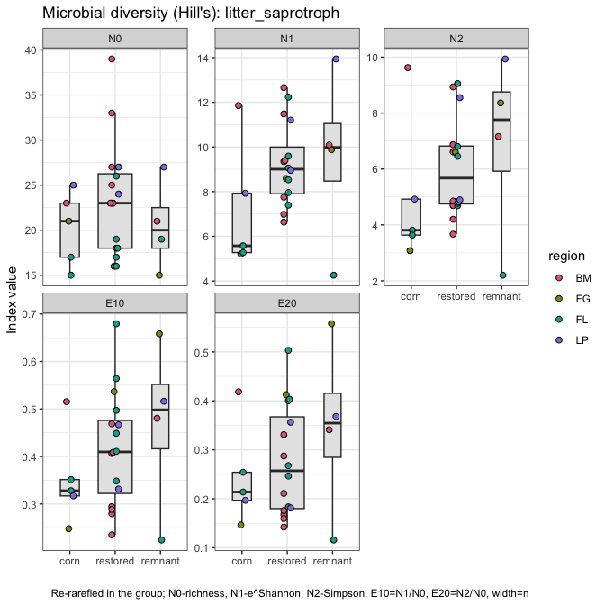
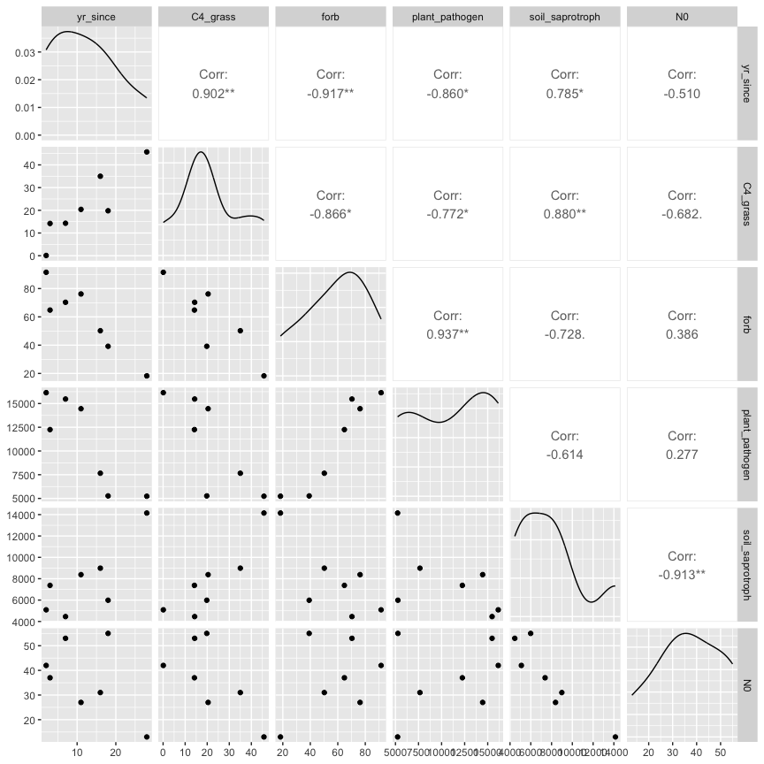
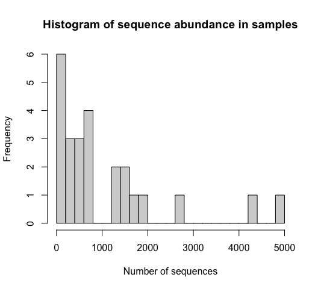
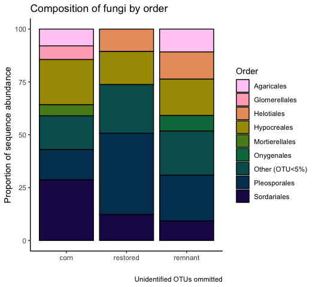

Microbial data: microbial guilds and taxonomy
================
Beau Larkin

Last updated: 11 September, 2024

- [Description](#description)
- [Packages and libraries](#packages-and-libraries)
- [Functions](#functions)
- [Data](#data)
  - [Sites-species tables](#sites-species-tables)
  - [Species metadata](#species-metadata)
  - [Site metadata and design](#site-metadata-and-design)
  - [Joined species, metadata, and design
    tables](#joined-species-metadata-and-design-tables)
  - [Plant traits data](#plant-traits-data)
  - [Plant species data](#plant-species-data)
- [Analysis and Results](#analysis-and-results)
  - [ITS sequences](#its-sequences)
    - [Unassigned taxa](#unassigned-taxa)
    - [Composition in field types](#composition-in-field-types)
    - [Soil saprotrophs](#soil-saprotrophs)
    - [Plant pathogens](#plant-pathogens)
    - [Wood saprotrophs](#wood-saprotrophs)
    - [Litter saprotrophs](#litter-saprotrophs)
    - [Plant functional groups and
      guilds](#plant-functional-groups-and-guilds)
  - [AMF](#amf)
    - [Claroideoglomeraceae](#claroideoglomeraceae)
    - [Paraglomeraceae](#paraglomeraceae)
    - [Diversisporaceae](#diversisporaceae)
    - [Gigasporaceae](#gigasporaceae)
    - [Plant functional groups and AMF
      families](#plant-functional-groups-and-amf-families)
- [Conclusions: taxa and guilds](#conclusions-taxa-and-guilds)
- [Appendix: Rarefy in guilds?](#appendix-rarefy-in-guilds)
  - [Diversity with ITS sequences](#diversity-with-its-sequences)
- [Appendix: Composition in regions](#appendix-composition-in-regions)
  - [Blue Mounds](#blue-mounds)
  - [Faville Grove](#faville-grove)
  - [Fermi](#fermi)
  - [Lake Petite](#lake-petite)
- [Appendix: Plots for final report](#appendix-plots-for-final-report)

# Description

Sequence clusters identified in QIIME2 are annotated with taxonomic
information and metadata from [Fungal
traits](https://link.springer.com/article/10.1007/s13225-020-00466-2).
In this report, sequence abundances in taxonomic groups or fungal guilds
are compared across field types and with time since restoration.

The full sequence abundance tables were rarefied to make sequencing
depth equivalent across fields. This can result in lower-abundance OTUs
dropping to zero. Within guilds, loss of OTUs could change or bias
interpretations of richness, diversity, and composition. We tried using
raw sequence data and rarefying within guilds to address this problem,
but in each case the sequence depth was so small that additional OTUs
were lost and abundances were significantly lowered.

We may try a different approach which is described in [Semchenko et
al. 2018](https://www.science.org/doi/10.1126/sciadv.aau4578), but for
now, the analysis uses data from the entire rarefied tables for ITS and
18S sequences.

# Packages and libraries

First, deal with the trouble caused by package Matrix. Calls to package
dependencies and installation should not be run unless package Matrix
gets overwritten somehow. Installing lme4 from source will require R to
be restarted.

``` r
# tools::package_dependencies("Matrix", which = "LinkingTo", reverse = TRUE)[[1L]]
# install.packages("lme4", type = "source")
library("lme4")
```

    ## Loading required package: Matrix

Other packages

``` r
packages_needed = c("tidyverse",
                    "knitr",
                    "conflicted",
                    "ggbeeswarm",
                    "colorspace",
                    "rsq",
                    "multcomp",
                    "indicspecies",
                    "GUniFrac",
                    "vegan",
                    "GGally",
                    "car")
packages_installed = packages_needed %in% rownames(installed.packages())
```

``` r
if (any(!packages_installed)) {
    install.packages(packages_needed[!packages_installed])
}
```

``` r
for (i in 1:length(packages_needed)) {
    library(packages_needed[i], character.only = T)
}
```

``` r
conflict_prefer("filter", "dplyr")
conflict_prefer("select", "dplyr")
```

# Functions

Functions streamline data processing, model fitting, and results output.
Functions for this script are found in a [supplemental
script](supporting_files/microbial_guild_taxonomy_functions.R) and are
loaded here for convenience.

``` r
source("supporting_files/microbial_guild_taxonomy_functions.R")
```

# Data

## Sites-species tables

CSV files were produced in `process_data.R`

``` r
spe <- list(
    its_raw = read_csv(
        paste0(getwd(), "/clean_data/spe_ITS_raw.csv"),
        show_col_types = FALSE
    ),
    its_rfy = read_csv(
        paste0(getwd(), "/clean_data/spe_ITS_rfy.csv"),
        show_col_types = FALSE
    ),
    amf_raw = read_csv(
        paste0(getwd(), "/clean_data/spe_18S_raw.csv"),
        show_col_types = FALSE
    ),
    amf_rfy = read_csv(
        paste0(getwd(), "/clean_data/spe_18S_rfy.csv"),
        show_col_types = FALSE
    )
)
```

## Species metadata

Load taxonomy for all and guilds (called *primary lifestyle* in Fungal
Traits) for ITS OTUs. Replace NA values with “unidentified” to show
complete numbers of unidentified groups.

``` r
meta <- list(
    its = read_csv(
        paste0(getwd(), "/clean_data/spe_ITS_metadata.csv"),
        show_col_types = FALSE
    ),
    amf = read_csv(
        paste0(getwd(), "/clean_data/spe_18S_metadata.csv"),
        show_col_types = FALSE
    )
) %>% 
    map(. %>% mutate(across(everything(), ~ replace_na(., "unidentified"))))
```

## Site metadata and design

``` r
sites   <-
    read_csv(paste0(getwd(), "/clean_data/sites.csv"), show_col_types = FALSE) %>%
    mutate(
        field_type = factor(
            field_type,
            ordered = TRUE,
            levels = c("corn", "restored", "remnant")
        )) %>%
    select(-lat, -long, -yr_restore, -yr_rank) %>% 
    arrange(field_key)
```

## Joined species, metadata, and design tables

Functions streamline this process

``` r
join_spe_meta <-
    function(spe, meta) {
        spe %>%
            pivot_longer(starts_with("otu"),
                         names_to = "otu_num",
                         values_to = "seq_abund") %>%
            filter(seq_abund != 0) %>%
            left_join(meta, by = join_by(otu_num)) %>%
            left_join(sites, by = join_by(field_key))
    }
```

``` r
spe_meta <- list(
    its_raw = 
        join_spe_meta(spe$its_raw, meta$its) %>%
        write_csv(paste0(getwd(), "/clean_data/speTaxa_ITS_raw.csv")),
    its_rfy = 
        join_spe_meta(spe$its_rfy, meta$its) %>%
        write_csv(paste0(getwd(), "/clean_data/speTaxa_ITS_rfy.csv")),
    amf_raw = 
        join_spe_meta(spe$amf_raw, meta$amf) %>%
        write_csv(paste0(getwd(), "/clean_data/speTaxa_18S_raw.csv")),
    amf_rfy = 
        join_spe_meta(spe$amf_rfy, meta$amf) %>%
        write_csv(paste0( getwd(), "/clean_data/speTaxa_18S_rfy.csv" ))
)
```

## Plant traits data

Used for correlations with guild abundances

``` r
ptr_gld <- read_csv("microbial_guild_taxonomy_files/plant_traits_fungal_guilds.csv", show_col_types = FALSE) 
```

## Plant species data

Used for comparisons of plant diversity with guild abundances

``` r
pl_ab <- read_csv(paste0(getwd(), "/clean_data/spe_plant_abund.csv"), show_col_types = FALSE) %>% 
    rename(field_name = SITE) %>% select(-BARESOIL, -LITTER) %>% 
    left_join(sites %>% select(field_name, region, field_type), by = join_by(field_name)) %>% 
    select(field_name, region, field_type, everything())
```

# Analysis and Results

## ITS sequences

Recall the number of OTUs recovered in each dataset. The effect of
rarefying did not change richness or diversity very much.

``` r
# Number of OTUs in raw and rarefied datasets
Map(function(x) ncol(x)-1, spe[1:2])
```

    ## $its_raw
    ## [1] 2895
    ## 
    ## $its_rfy
    ## [1] 2892

### Unassigned taxa

Only 21.8 percent of the ITS sequences were assigned to species. In
terms of the analysis done here, its possibly more alarming that only 36
percent were assigned to primary lifestyles or guilds. This suggests
that when we see guilds concentrating in certain habitats, it’s possible
that the difference doesn’t exist. This is particularly possible because
we have one habitat, cornfields, which has probably been studied more
than the others.

``` r
meta$its %>% 
    select(-otu_num, -otu_ID) %>% 
    map(\(x) round(length(which(x == "unidentified")) / length(x) * 100, 1)) %>% 
    bind_rows() %>% 
    kable(format = "pandoc", caption = "Percent unidentified OTUs in each taxonomic group or guild")
```

| phylum | class | order | family | genus | species | primary_lifestyle |
|-------:|------:|------:|-------:|------:|--------:|------------------:|
|   12.2 |  18.4 |  23.8 |   39.4 |  53.9 |    78.2 |                64 |

Percent unidentified OTUs in each taxonomic group or guild

### Composition in field types

Function outputs are verbose, but details may be necessary later so they
are displayed here.

``` r
its_taxaGuild(spe_meta$its_rfy)
```

    ## 
    ## 
    ## Table: Distribution of ITS OTUs in classes; mean sequence abundance by field type
    ## 
    ## phylum                             order                                        corn   restored   remnant
    ## ---------------------------------  --------------------------------------  ---------  ---------  --------
    ## Ascomycota                         Hypocreales                               8979.00    7904.19   8448.25
    ## Ascomycota                         Pleosporales                              8083.40    8117.06   6741.50
    ## Ascomycota                         Chaetothyriales                            756.80    7136.44   6412.25
    ## Basidiomycota                      Agaricales                                3740.00    2717.88   5772.00
    ## Ascomycota                         Helotiales                                3300.00    4090.38   4621.50
    ## Ascomycota                         unidentified                              1580.40    3890.94   4421.00
    ## Ascomycota                         Sordariales                              13452.20    5462.88   4095.75
    ## unidentified                       unidentified                              1418.20    2433.62   3171.00
    ## Ascomycota                         Onygenales                                  80.20    1611.25   2503.75
    ## Mortierellomycota                  Mortierellales                            4412.60    3574.56   2056.25
    ## Basidiomycota                      Geastrales                                 907.00      52.83   1838.00
    ## Ascomycota                         Geoglossales                                 5.50    1920.75   1782.25
    ## Basidiomycota                      Thelephorales                                4.00      23.60   1046.50
    ## Ascomycota                         Glomerellales                             2329.00    1308.38    850.25
    ## Basidiomycota                      Cantharellales                             505.80     958.69    746.75
    ## Ascomycota                         GS34                                         0.00     115.67    497.50
    ## Glomeromycota                      Glomerales                                 113.40     541.44    493.00
    ## Ascomycota                         Xylariales                                  72.00     353.25    381.00
    ## Ascomycota                         Coniochaetales                             871.00     216.19    355.25
    ## Ascomycota                         Sordariomycetes_ord_Incertae_sedis          46.20     157.75    276.75
    ## Ascomycota                         Magnaporthales                              98.80     196.75    238.25
    ## Ascomycota                         Capnodiales                                680.00     661.12    193.00
    ## Ascomycota                         Pezizales                                 1222.80     427.75    192.50
    ## Basidiomycota                      unidentified                               102.60     684.25    188.25
    ## Basidiomycota                      Russulales                                   4.00       8.50    183.00
    ## Basidiomycota                      Sebacinales                                 29.80     790.94    169.50
    ## Glomeromycota                      unidentified                                 9.00     188.71    151.00
    ## Basidiomycota                      Boletales                                    3.00       8.00    149.00
    ## Ascomycota                         Chaetosphaeriales                          314.75     283.25    141.00
    ## Ascomycota                         Branch06                                    15.25     175.86    120.00
    ## Ascomycota                         Minutisphaerales                             0.00      47.00    115.00
    ## Ascomycota                         Thelebolales                               110.75      43.57    109.00
    ## Basidiomycota                      Auriculariales                             120.25     326.75    106.50
    ## Basidiomycota                      Tremellales                                 16.60     107.75    100.25
    ## Mucoromycota                       unidentified                                 0.00      14.00     91.50
    ## Chytridiomycota                    Spizellomycetales                          191.80     125.07     82.50
    ## Basidiomycota                      Trichosporonales                            69.50      36.55     80.75
    ## Ascomycota                         Mytilinidales                                0.00       0.00     76.00
    ## Basidiomycota                      Filobasidiales                            1111.25     359.14     75.00
    ## Basidiomycota                      Cystofilobasidiales                       2769.60      93.07     70.00
    ## Basidiomycota                      Trechisporales                             151.60     511.69     68.00
    ## Chytridiomycota                    Rhizophlyctidales                          268.00     137.87     67.25
    ## Ascomycota                         Venturiales                                 32.33      91.08     63.33
    ## Mucoromycota                       Umbelopsidales                               0.00       2.00     58.00
    ## Basidiomycota                      Ustilaginales                                3.00     148.00     53.33
    ## Basidiomycota                      Tremellodendropsidales                       9.00      48.92     51.00
    ## Ascomycota                         Mytilinidiales                               0.00      14.33     45.00
    ## Ascomycota                         Orbiliales                                  20.00      88.43     44.33
    ## Ascomycota                         Verrucariales                                0.00      73.00     42.00
    ## Basidiomycota                      Hymenochaetales                             16.40     193.93     42.00
    ## Basidiomycota                      Polyporales                                 20.40      32.40     39.00
    ## Ascomycota                         Tubeufiales                                 72.20     212.94     33.00
    ## Basidiomycota                      Geminibasidiales                            33.50      58.83     29.00
    ## Ascomycota                         Saccharomycetales                          280.50      43.00     28.67
    ## Basidiomycota                      Atheliales                                   0.00     155.00     28.50
    ## Chytridiomycota                    Chytridiales                                 0.00      90.00     25.50
    ## Basidiomycota                      Phallales                                  236.50      42.67     24.67
    ## Ascomycota                         Microascales                               135.00      86.00     23.67
    ## Basidiomycota                      Erythrobasidiales                            0.00       5.20     23.50
    ## Ascomycota                         Myrmecridiales                               0.00      73.62     20.50
    ## Ascomycota                         GS32                                         0.00       0.00     20.00
    ## Rozellomycota                      GS11                                         0.00       2.00     20.00
    ## Ascomycota                         Diaporthales                               217.00      15.14     17.00
    ## Ascomycota                         Eurotiales                                 113.20      41.06     16.75
    ## Ascomycota                         Ostropales                                   0.00      49.00     15.00
    ## Basidiomycota                      Leucosporidiales                            38.33      10.00     14.50
    ## Chytridiomycota                    Rhizophydiales                              30.67      24.40     13.50
    ## Ascomycota                         Savoryellales                               14.00      13.80     13.33
    ## Ascomycota                         Acrospermales                                0.00       6.50     12.00
    ## Ascomycota                         Archaeorhizomycetales                        0.00      34.57     10.00
    ## Glomeromycota                      Archaeosporales                              1.00      13.33     10.00
    ## Mortierellomycota                  unidentified                                 0.00       5.00     10.00
    ## Basidiobolomycota                  Basidiobolales                               0.00      15.33      8.00
    ## Chlorophyta                        Chaetopeltidales                            12.00       7.90      7.50
    ## Basidiomycota                      Microbotryomycetes_ord_Incertae_sedis       11.33      17.50      7.00
    ## Ascomycota                         Dothideales                                  0.00      31.67      6.00
    ## Basidiomycota                      Agaricomycetes_ord_Incertae_sedis            0.00       0.00      6.00
    ## Ascomycota                         Rhytismatales                                0.00       3.00      5.00
    ## Chlorophyta                        unidentified                                 8.00       9.67      5.00
    ## Glomeromycota                      Diversisporales                              0.00       7.40      5.00
    ## Ascomycota                         Candelariales                                0.00       4.00      3.00
    ## Basidiomycota                      Atractiellales                              15.25      11.00      3.00
    ## Mucoromycota                       GS22                                         0.00       0.00      3.00
    ## Entorrhizomycota                   Entorrhizales                                0.00       0.00      2.00
    ## Mucoromycota                       Mucorales                                    0.00       5.67      2.00
    ## Ichthyosporia_phy_Incertae_sedis   unidentified                                 0.00       0.00      1.00
    ## Anthophyta                         Asterales                                    0.00       4.00      0.00
    ## Anthophyta                         Brassicales                                  8.00       4.50      0.00
    ## Anthophyta                         Commelinales                                 5.00     209.00      0.00
    ## Anthophyta                         Fabales                                      0.00      11.00      0.00
    ## Anthophyta                         Poales                                       4.00       3.50      0.00
    ## Ascomycota                         Boliniales                                  44.67      51.75      0.00
    ## Ascomycota                         Botryosphaeriales                           20.50      19.83      0.00
    ## Ascomycota                         Jahnulales                                  12.00       0.00      0.00
    ## Ascomycota                         Lichenostigmatales                           0.00       3.00      0.00
    ## Ascomycota                         Microthyriales                               0.00      12.00      0.00
    ## Ascomycota                         Pezizomycotina_ord_Incertae_sedis           35.00     496.00      0.00
    ## Ascomycota                         Phacidiales                                  0.00       5.50      0.00
    ## Ascomycota                         Phomatosporales                            728.00       8.50      0.00
    ## Ascomycota                         Trichosphaeriales                            5.00      24.73      0.00
    ## Basidiomycota                      Agaricostilbales                             2.00       1.00      0.00
    ## Basidiomycota                      Corticiales                                  0.00      70.86      0.00
    ## Basidiomycota                      Cystobasidiales                             42.50      10.33      0.00
    ## Basidiomycota                      Entylomatales                                0.00      10.60      0.00
    ## Basidiomycota                      Holtermanniales                              4.25      15.67      0.00
    ## Basidiomycota                      Kriegeriales                                 2.50      12.00      0.00
    ## Basidiomycota                      Platygloeales                                0.00      82.40      0.00
    ## Basidiomycota                      Pucciniales                                  0.00       4.00      0.00
    ## Basidiomycota                      Sporidiobolales                             46.00       7.75      0.00
    ## Basidiomycota                      Tilletiales                                 11.00      26.50      0.00
    ## Basidiomycota                      Urocystidales                               75.00       5.33      0.00
    ## Calcarisporiellomycota             Calcarisporiellales                          0.00       3.00      0.00
    ## Cercozoa                           unidentified                                 5.00       4.00      0.00
    ## Chlorophyta                        Chaetophorales                               0.00      23.67      0.00
    ## Chlorophyta                        Chlorellales                                 0.00       5.00      0.00
    ## Chlorophyta                        Sphaeropleales                               0.00       4.00      0.00
    ## Chytridiomycota                    unidentified                                23.00       9.00      0.00
    ## Glomeromycota                      Paraglomerales                               3.00      12.00      0.00
    ## Haplosporidia                      Haplosporidia_ord_Incertae_sedis             3.00      12.00      0.00
    ## Monoblepharomycota                 Monoblepharidales                            2.00       0.00      0.00
    ## [[1]]
    ## 
    ## 
    ## Table: Distribution of ITS OTUs by Fungal Trait 'primary_lifestyle'; mean sequence abundance by field type
    ## 
    ## primary_lifestyle            corn   restored   remnant     total
    ## -----------------------  --------  ---------  --------  --------
    ## unidentified              25958.2    31570.9   34910.8   92439.9
    ## plant_pathogen             9220.8     9105.1    7168.5   25494.4
    ## soil_saprotroph            9162.0     7645.1    7780.8   24587.9
    ## wood_saprotroph            3726.4     2868.6    1768.8    8363.8
    ## dung_saprotroph            3440.6     1997.2    1124.8    6562.6
    ## litter_saprotroph          2512.6     1760.4    1310.0    5583.0
    ## mycoparasite               2147.2      726.6     343.5    3217.3
    ## animal_parasite             790.0     1339.4     851.8    2981.2
    ## ectomycorrhizal               9.0      148.2    2149.2    2306.4
    ## unspecified_saprotroph      922.4      210.8     204.8    1338.0
    ## root_endophyte               16.3      485.6     228.2     730.1
    ## arbuscular_mycorrhizal       76.6      240.4     185.0     502.0
    ## pollen_saprotroph           172.8      112.4      62.5     347.7
    ## lichen_parasite              17.0       48.5      45.2     110.7
    ## lichenized                    0.0       94.0      15.0     109.0
    ## nectar/tap_saprotroph        38.5       41.2      28.7     108.4
    ## foliar_endophyte              4.7       33.5       7.0      45.2
    ## epiphyte                      0.0       10.0      28.0      38.0
    ## unspecified_pathotroph        0.0       15.8       9.0      24.8
    ## algal_parasite                2.0        3.6       0.0       5.6
    ## 
    ## [[2]]


    ## 
    ## [[3]]


The top guilds are:

1.  Unidentified (not shown on column charts)
2.  plant pathogens
3.  soil saprotrophs
4.  wood saprotrophs
5.  dung saprotrophs
6.  litter saprotrophs

Compared with the sequence abundance in the NA group, plant pathogens
and soil saprotrophs are abundant enough to feel somewhat confident
about in terms of coverage.

``` r
its_rfy_guilds <- its_test_taxaGuild(spe_meta$its_rfy)
```

    ## ---------------------------------
    ## [1] "soil_saprotroph"
    ## ---------------------------------
    ## 
    ## 
    ## field_type   region   field_name    yr_since  primary_lifestyle    seq_sum
    ## -----------  -------  -----------  ---------  ------------------  --------
    ## corn         FL       FLC2                 0  soil_saprotroph        15651
    ## restored     BM       KORP1               28  soil_saprotroph        14080
    ## remnant      LP       LPREM1              NA  soil_saprotroph        12417
    ## restored     FL       FLRSP1              10  soil_saprotroph        11644
    ## corn         LP       LPC1                 0  soil_saprotroph        10255
    ## restored     FL       FLRSP3              10  soil_saprotroph        10088
    ## restored     FL       FLRP5               35  soil_saprotroph        10055
    ## remnant      BM       MBREM1              NA  soil_saprotroph        10030
    ## corn         FL       FLC1                 0  soil_saprotroph         9599
    ## restored     BM       BBRP1               16  soil_saprotroph         8987
    ## restored     FL       FLRP1               40  soil_saprotroph         8902
    ## restored     BM       PHRP1               11  soil_saprotroph         8346
    ## restored     FL       FLRSP2              10  soil_saprotroph         7755
    ## restored     BM       ERRP1                3  soil_saprotroph         7419
    ## restored     BM       MBRP1               18  soil_saprotroph         6009
    ## corn         BM       PHC1                 0  soil_saprotroph         5975
    ## restored     FL       FLRP4               36  soil_saprotroph         5581
    ## restored     LP       LPRP1                4  soil_saprotroph         5400
    ## restored     BM       MHRP2                2  soil_saprotroph         5155
    ## remnant      FG       FGREM1              NA  soil_saprotroph         4880
    ## restored     LP       LPRP2                4  soil_saprotroph         4491
    ## restored     BM       MHRP1                7  soil_saprotroph         4488
    ## corn         FG       FGC1                 0  soil_saprotroph         4330
    ## restored     FG       FGRP1               15  soil_saprotroph         3922
    ## remnant      FL       FLREM1              NA  soil_saprotroph         3796
    ## ----------------------------------------------------
    ## 
    ## Linear mixed model fit by maximum likelihood  ['lmerMod']
    ## Formula: seq_sum ~ field_type + (1 | region)
    ##    Data: mod_data
    ##       AIC       BIC    logLik  deviance  df.resid 
    ##  484.1883  490.2827 -237.0941  474.1883        20 
    ## Random effects:
    ##  Groups   Name        Std.Dev.
    ##  region   (Intercept)  197.8  
    ##  Residual             3174.5  
    ## Number of obs: 25, groups:  region, 4
    ## Fixed Effects:
    ##  (Intercept)  field_type.L  field_type.Q  
    ##       8188.7        -970.8         682.1  
    ## ----------------------------------------------------
    ## 
    ## Linear mixed model fit by maximum likelihood  ['lmerMod']
    ## Formula: seq_sum ~ 1 + (1 | region)
    ##    Data: mod_data
    ##       AIC       BIC    logLik  deviance  df.resid 
    ##  481.0567  484.7133 -237.5283  475.0567        22 
    ## Random effects:
    ##  Groups   Name        Std.Dev.
    ##  region   (Intercept)    0    
    ##  Residual             3236    
    ## Number of obs: 25, groups:  region, 4
    ## Fixed Effects:
    ## (Intercept)  
    ##        7970  
    ## optimizer (nloptwrap) convergence code: 0 (OK) ; 0 optimizer warnings; 1 lme4 warnings 
    ## ----------------------------------------------------
    ## 
    ## Data: mod_data
    ## Models:
    ## mmod_null: seq_sum ~ 1 + (1 | region)
    ## mmod: seq_sum ~ field_type + (1 | region)
    ##           npar    AIC    BIC  logLik deviance  Chisq Df Pr(>Chisq)
    ## mmod_null    3 481.06 484.71 -237.53   475.06                     
    ## mmod         5 484.19 490.28 -237.09   474.19 0.8684  2     0.6478
    ## ----------------------------------------------------
    ## 
    ## 
    ##   Simultaneous Tests for General Linear Hypotheses
    ## 
    ## Multiple Comparisons of Means: Tukey Contrasts
    ## 
    ## 
    ## Fit: lmer(formula = seq_sum ~ field_type + (1 | region), data = mod_data, 
    ##     REML = FALSE)
    ## 
    ## Linear Hypotheses:
    ##                         Estimate Std. Error z value Pr(>|z|)
    ## restored - corn == 0       -1522       1627  -0.935    0.613
    ## remnant - corn == 0        -1373       2130  -0.645    0.792
    ## remnant - restored == 0      149       1776   0.084    0.996
    ## (Adjusted p values reported -- single-step method)
    ## 
    ##     corn restored  remnant 
    ##      "a"      "a"      "a" 
    ## ----------------------------------------------------
    ## 
    ## [1] "Years since restoration and soil_saprotroph sequence abundance in Blue Mounds Area"
    ## 
    ## Call:
    ## lm(formula = seq_sum ~ yr_since, data = mod_data2)
    ## 
    ## Residuals:
    ##       1       2       3       4       5       6       7 
    ##   151.8  2128.7  1972.6 -3371.6 -1893.1   137.3   874.2 
    ## 
    ## Coefficients:
    ##             Estimate Std. Error t value Pr(>|t|)  
    ## (Intercept)  4472.31    1440.77   3.104   0.0267 *
    ## yr_since      272.68      96.92   2.814   0.0374 *
    ## ---
    ## Signif. codes:  0 '***' 0.001 '**' 0.01 '*' 0.05 '.' 0.1 ' ' 1
    ## 
    ## Residual standard error: 2199 on 5 degrees of freedom
    ## Multiple R-squared:  0.6129, Adjusted R-squared:  0.5355 
    ## F-statistic: 7.916 on 1 and 5 DF,  p-value: 0.03739
    ## 
    ## 
    ## 
    ## 
    ## ---------------------------------
    ## [1] "plant_pathogen"
    ## ---------------------------------
    ## 
    ## 
    ## field_type   region   field_name    yr_since  primary_lifestyle    seq_sum
    ## -----------  -------  -----------  ---------  ------------------  --------
    ## restored     BM       MHRP2                2  plant_pathogen         16160
    ## restored     BM       MHRP1                7  plant_pathogen         15502
    ## restored     LP       LPRP1                4  plant_pathogen         15211
    ## restored     BM       PHRP1               11  plant_pathogen         14491
    ## corn         LP       LPC1                 0  plant_pathogen         13945
    ## restored     BM       ERRP1                3  plant_pathogen         12277
    ## restored     FG       FGRP1               15  plant_pathogen         12253
    ## corn         FG       FGC1                 0  plant_pathogen          9826
    ## remnant      LP       LPREM1              NA  plant_pathogen          9469
    ## corn         FL       FLC2                 0  plant_pathogen          9057
    ## remnant      FG       FGREM1              NA  plant_pathogen          8423
    ## restored     LP       LPRP2                4  plant_pathogen          7764
    ## restored     BM       BBRP1               16  plant_pathogen          7654
    ## remnant      FL       FLREM1              NA  plant_pathogen          7604
    ## corn         FL       FLC1                 0  plant_pathogen          7388
    ## restored     FL       FLRP1               40  plant_pathogen          6737
    ## restored     FL       FLRSP2              10  plant_pathogen          6457
    ## restored     FL       FLRSP1              10  plant_pathogen          6147
    ## corn         BM       PHC1                 0  plant_pathogen          5888
    ## restored     BM       MBRP1               18  plant_pathogen          5299
    ## restored     BM       KORP1               28  plant_pathogen          5250
    ## restored     FL       FLRP5               35  plant_pathogen          4982
    ## restored     FL       FLRP4               36  plant_pathogen          4789
    ## restored     FL       FLRSP3              10  plant_pathogen          4708
    ## remnant      BM       MBREM1              NA  plant_pathogen          3178
    ## ----------------------------------------------------
    ## 
    ## Linear mixed model fit by maximum likelihood  ['lmerMod']
    ## Formula: seq_sum ~ field_type + (1 | region)
    ##    Data: mod_data
    ##       AIC       BIC    logLik  deviance  df.resid 
    ##  490.5711  496.6655 -240.2855  480.5711        20 
    ## Random effects:
    ##  Groups   Name        Std.Dev.
    ##  region   (Intercept) 1579    
    ##  Residual             3383    
    ## Number of obs: 25, groups:  region, 4
    ## Fixed Effects:
    ##  (Intercept)  field_type.L  field_type.Q  
    ##         8781         -1721          -969  
    ## ----------------------------------------------------
    ## 
    ## Linear mixed model fit by maximum likelihood  ['lmerMod']
    ## Formula: seq_sum ~ 1 + (1 | region)
    ##    Data: mod_data
    ##       AIC       BIC    logLik  deviance  df.resid 
    ##  488.1070  491.7636 -241.0535  482.1070        22 
    ## Random effects:
    ##  Groups   Name        Std.Dev.
    ##  region   (Intercept) 1347    
    ##  Residual             3546    
    ## Number of obs: 25, groups:  region, 4
    ## Fixed Effects:
    ## (Intercept)  
    ##        9081  
    ## ----------------------------------------------------
    ## 
    ## Data: mod_data
    ## Models:
    ## mmod_null: seq_sum ~ 1 + (1 | region)
    ## mmod: seq_sum ~ field_type + (1 | region)
    ##           npar    AIC    BIC  logLik deviance  Chisq Df Pr(>Chisq)
    ## mmod_null    3 488.11 491.76 -241.05   482.11                     
    ## mmod         5 490.57 496.67 -240.29   480.57 1.5359  2      0.464
    ## ----------------------------------------------------
    ## 
    ## 
    ##   Simultaneous Tests for General Linear Hypotheses
    ## 
    ## Multiple Comparisons of Means: Tukey Contrasts
    ## 
    ## 
    ## Fit: lmer(formula = seq_sum ~ field_type + (1 | region), data = mod_data, 
    ##     REML = FALSE)
    ## 
    ## Linear Hypotheses:
    ##                         Estimate Std. Error z value Pr(>|z|)
    ## restored - corn == 0      -30.23    1759.28  -0.017    1.000
    ## remnant - corn == 0     -2434.08    2275.64  -1.070    0.529
    ## remnant - restored == 0 -2403.85    1924.84  -1.249    0.420
    ## (Adjusted p values reported -- single-step method)
    ## 
    ##     corn restored  remnant 
    ##      "a"      "a"      "a" 
    ## ----------------------------------------------------
    ## 
    ## [1] "Years since restoration and plant_pathogen sequence abundance in Blue Mounds Area"
    ## 
    ## Call:
    ## lm(formula = seq_sum ~ yr_since, data = mod_data2)
    ## 
    ## Residuals:
    ##       1       2       3       4       5       6       7 
    ## -1580.7 -2730.6  1344.1 -3047.6  2270.7   708.3  3035.9 
    ## 
    ## Coefficients:
    ##             Estimate Std. Error t value Pr(>|t|)    
    ## (Intercept)  16339.8     1756.1   9.304 0.000241 ***
    ## yr_since      -444.1      118.1  -3.759 0.013169 *  
    ## ---
    ## Signif. codes:  0 '***' 0.001 '**' 0.01 '*' 0.05 '.' 0.1 ' ' 1
    ## 
    ## Residual standard error: 2680 on 5 degrees of freedom
    ## Multiple R-squared:  0.7386, Adjusted R-squared:  0.6864 
    ## F-statistic: 14.13 on 1 and 5 DF,  p-value: 0.01317
    ## 
    ## 
    ## 
    ## 
    ## ---------------------------------
    ## [1] "ectomycorrhizal"
    ## ---------------------------------
    ## 
    ## 
    ## field_type   region   field_name    yr_since  primary_lifestyle    seq_sum
    ## -----------  -------  -----------  ---------  ------------------  --------
    ## remnant      FG       FGREM1              NA  ectomycorrhizal         3471
    ## remnant      FL       FLREM1              NA  ectomycorrhizal         3443
    ## remnant      BM       MBREM1              NA  ectomycorrhizal         1136
    ## restored     BM       MBRP1               18  ectomycorrhizal          568
    ## remnant      LP       LPREM1              NA  ectomycorrhizal          547
    ## restored     FL       FLRP1               40  ectomycorrhizal           13
    ## corn         LP       LPC1                 0  ectomycorrhizal            9
    ## restored     BM       MHRP2                2  ectomycorrhizal            8
    ## restored     FG       FGRP1               15  ectomycorrhizal            4
    ## ----------------------------------------------------
    ## 
    ## Linear mixed model fit by maximum likelihood  ['lmerMod']
    ## Formula: seq_sum ~ field_type + (1 | region)
    ##    Data: mod_data
    ##      AIC      BIC   logLik deviance df.resid 
    ## 157.9341 158.9202 -73.9670 147.9341        4 
    ## Random effects:
    ##  Groups   Name        Std.Dev.
    ##  region   (Intercept)   0.0   
    ##  Residual             897.5   
    ## Number of obs: 9, groups:  region, 4
    ## Fixed Effects:
    ##  (Intercept)  field_type.L  field_type.Q  
    ##        768.8        1513.4         760.1  
    ## optimizer (nloptwrap) convergence code: 0 (OK) ; 0 optimizer warnings; 1 lme4 warnings 
    ## ----------------------------------------------------
    ## 
    ## Linear mixed model fit by maximum likelihood  ['lmerMod']
    ## Formula: seq_sum ~ 1 + (1 | region)
    ##    Data: mod_data
    ##      AIC      BIC   logLik deviance df.resid 
    ## 161.2878 161.8794 -77.6439 155.2878        6 
    ## Random effects:
    ##  Groups   Name        Std.Dev.
    ##  region   (Intercept)    0    
    ##  Residual             1350    
    ## Number of obs: 9, groups:  region, 4
    ## Fixed Effects:
    ## (Intercept)  
    ##        1022  
    ## optimizer (nloptwrap) convergence code: 0 (OK) ; 0 optimizer warnings; 1 lme4 warnings 
    ## ----------------------------------------------------
    ## 
    ## Data: mod_data
    ## Models:
    ## mmod_null: seq_sum ~ 1 + (1 | region)
    ## mmod: seq_sum ~ field_type + (1 | region)
    ##           npar    AIC    BIC  logLik deviance  Chisq Df Pr(>Chisq)  
    ## mmod_null    3 161.29 161.88 -77.644   155.29                       
    ## mmod         5 157.93 158.92 -73.967   147.93 7.3537  2     0.0253 *
    ## ---
    ## Signif. codes:  0 '***' 0.001 '**' 0.01 '*' 0.05 '.' 0.1 ' ' 1
    ## ----------------------------------------------------
    ## 
    ## 
    ##   Simultaneous Tests for General Linear Hypotheses
    ## 
    ## Multiple Comparisons of Means: Tukey Contrasts
    ## 
    ## 
    ## Fit: lmer(formula = seq_sum ~ field_type + (1 | region), data = mod_data, 
    ##     REML = FALSE)
    ## 
    ## Linear Hypotheses:
    ##                         Estimate Std. Error z value Pr(>|z|)   
    ## restored - corn == 0       139.2     1003.4   0.139  0.98918   
    ## remnant - corn == 0       2140.2     1003.4   2.133  0.08007 . 
    ## remnant - restored == 0   2001.0      634.6   3.153  0.00437 **
    ## ---
    ## Signif. codes:  0 '***' 0.001 '**' 0.01 '*' 0.05 '.' 0.1 ' ' 1
    ## (Adjusted p values reported -- single-step method)
    ## 
    ##     corn restored  remnant 
    ##     "ab"      "a"      "b" 
    ## ----------------------------------------------------
    ## 
    ## [1] "Years since restoration and ectomycorrhizal sequence abundance in Blue Mounds Area"
    ## 
    ## Call:
    ## lm(formula = seq_sum ~ yr_since, data = mod_data2)
    ## 
    ## Residuals:
    ## ALL 2 residuals are 0: no residual degrees of freedom!
    ## 
    ## Coefficients:
    ##             Estimate Std. Error t value Pr(>|t|)
    ## (Intercept)      -62        NaN     NaN      NaN
    ## yr_since          35        NaN     NaN      NaN
    ## 
    ## Residual standard error: NaN on 0 degrees of freedom
    ## Multiple R-squared:      1,  Adjusted R-squared:    NaN 
    ## F-statistic:   NaN on 1 and 0 DF,  p-value: NA
    ## 
    ## 
    ## 
    ## 
    ## ---------------------------------
    ## [1] "wood_saprotroph"
    ## ---------------------------------
    ## 
    ## 
    ## field_type   region   field_name    yr_since  primary_lifestyle    seq_sum
    ## -----------  -------  -----------  ---------  ------------------  --------
    ## restored     LP       LPRP2                4  wood_saprotroph         5903
    ## corn         LP       LPC1                 0  wood_saprotroph         4709
    ## corn         FG       FGC1                 0  wood_saprotroph         4553
    ## restored     FL       FLRSP2              10  wood_saprotroph         4468
    ## restored     FG       FGRP1               15  wood_saprotroph         4326
    ## corn         FL       FLC1                 0  wood_saprotroph         4173
    ## restored     BM       PHRP1               11  wood_saprotroph         3898
    ## corn         BM       PHC1                 0  wood_saprotroph         3520
    ## restored     BM       MHRP2                2  wood_saprotroph         3255
    ## restored     LP       LPRP1                4  wood_saprotroph         3222
    ## restored     BM       ERRP1                3  wood_saprotroph         3141
    ## restored     BM       MHRP1                7  wood_saprotroph         2991
    ## remnant      FL       FLREM1              NA  wood_saprotroph         2858
    ## restored     FL       FLRP4               36  wood_saprotroph         2727
    ## restored     BM       MBRP1               18  wood_saprotroph         2569
    ## restored     FL       FLRSP1              10  wood_saprotroph         2279
    ## restored     FL       FLRP5               35  wood_saprotroph         2022
    ## restored     FL       FLRP1               40  wood_saprotroph         1757
    ## corn         FL       FLC2                 0  wood_saprotroph         1677
    ## remnant      LP       LPREM1              NA  wood_saprotroph         1619
    ## remnant      FG       FGREM1              NA  wood_saprotroph         1578
    ## restored     FL       FLRSP3              10  wood_saprotroph         1411
    ## remnant      BM       MBREM1              NA  wood_saprotroph         1020
    ## restored     BM       KORP1               28  wood_saprotroph          982
    ## restored     BM       BBRP1               16  wood_saprotroph          946
    ## ----------------------------------------------------
    ## 
    ## Linear mixed model fit by maximum likelihood  ['lmerMod']
    ## Formula: seq_sum ~ field_type + (1 | region)
    ##    Data: mod_data
    ##       AIC       BIC    logLik  deviance  df.resid 
    ##  434.5094  440.6037 -212.2547  424.5094        20 
    ## Random effects:
    ##  Groups   Name        Std.Dev.
    ##  region   (Intercept)  374.7  
    ##  Residual             1130.9  
    ## Number of obs: 25, groups:  region, 4
    ## Fixed Effects:
    ##  (Intercept)  field_type.L  field_type.Q  
    ##       2848.7       -1415.3        -193.9  
    ## ----------------------------------------------------
    ## 
    ## Linear mixed model fit by maximum likelihood  ['lmerMod']
    ## Formula: seq_sum ~ 1 + (1 | region)
    ##    Data: mod_data
    ##       AIC       BIC    logLik  deviance  df.resid 
    ##  436.1915  439.8481 -215.0958  430.1915        22 
    ## Random effects:
    ##  Groups   Name        Std.Dev.
    ##  region   (Intercept)    0    
    ##  Residual             1319    
    ## Number of obs: 25, groups:  region, 4
    ## Fixed Effects:
    ## (Intercept)  
    ##        2864  
    ## optimizer (nloptwrap) convergence code: 0 (OK) ; 0 optimizer warnings; 1 lme4 warnings 
    ## ----------------------------------------------------
    ## 
    ## Data: mod_data
    ## Models:
    ## mmod_null: seq_sum ~ 1 + (1 | region)
    ## mmod: seq_sum ~ field_type + (1 | region)
    ##           npar    AIC    BIC  logLik deviance  Chisq Df Pr(>Chisq)  
    ## mmod_null    3 436.19 439.85 -215.10   430.19                       
    ## mmod         5 434.51 440.60 -212.25   424.51 5.6821  2    0.05836 .
    ## ---
    ## Signif. codes:  0 '***' 0.001 '**' 0.01 '*' 0.05 '.' 0.1 ' ' 1
    ## ----------------------------------------------------
    ## 
    ## 
    ##   Simultaneous Tests for General Linear Hypotheses
    ## 
    ## Multiple Comparisons of Means: Tukey Contrasts
    ## 
    ## 
    ## Fit: lmer(formula = seq_sum ~ field_type + (1 | region), data = mod_data, 
    ##     REML = FALSE)
    ## 
    ## Linear Hypotheses:
    ##                         Estimate Std. Error z value Pr(>|z|)  
    ## restored - corn == 0      -763.4      585.4  -1.304   0.3883  
    ## remnant - corn == 0      -2001.6      760.2  -2.633   0.0224 *
    ## remnant - restored == 0  -1238.2      639.7  -1.936   0.1263  
    ## ---
    ## Signif. codes:  0 '***' 0.001 '**' 0.01 '*' 0.05 '.' 0.1 ' ' 1
    ## (Adjusted p values reported -- single-step method)
    ## 
    ##     corn restored  remnant 
    ##      "a"     "ab"      "b" 
    ## ----------------------------------------------------
    ## 
    ## [1] "Years since restoration and wood_saprotroph sequence abundance in Blue Mounds Area"
    ## 
    ## Call:
    ## lm(formula = seq_sum ~ yr_since, data = mod_data2)
    ## 
    ## Residuals:
    ##        1        2        3        4        5        6        7 
    ## -1239.91  -239.28  -101.42   566.84   -21.78  -217.16  1252.71 
    ## 
    ## Coefficients:
    ##             Estimate Std. Error t value Pr(>|t|)   
    ## (Intercept)  3655.91     551.52   6.629  0.00118 **
    ## yr_since      -91.87      37.10  -2.476  0.05608 . 
    ## ---
    ## Signif. codes:  0 '***' 0.001 '**' 0.01 '*' 0.05 '.' 0.1 ' ' 1
    ## 
    ## Residual standard error: 841.8 on 5 degrees of freedom
    ## Multiple R-squared:  0.5509, Adjusted R-squared:  0.4611 
    ## F-statistic: 6.133 on 1 and 5 DF,  p-value: 0.05608
    ## 
    ## 
    ## 
    ## 
    ## ---------------------------------
    ## [1] "litter_saprotroph"
    ## ---------------------------------
    ## 
    ## 
    ## field_type   region   field_name    yr_since  primary_lifestyle    seq_sum
    ## -----------  -------  -----------  ---------  ------------------  --------
    ## corn         FG       FGC1                 0  litter_saprotroph       5663
    ## restored     BM       ERRP1                3  litter_saprotroph       5110
    ## restored     BM       MHRP1                7  litter_saprotroph       2930
    ## restored     LP       LPRP1                4  litter_saprotroph       2923
    ## corn         BM       PHC1                 0  litter_saprotroph       2881
    ## remnant      FL       FLREM1              NA  litter_saprotroph       2690
    ## restored     LP       LPRP2                4  litter_saprotroph       2551
    ## restored     BM       BBRP1               16  litter_saprotroph       2422
    ## restored     BM       MBRP1               18  litter_saprotroph       2332
    ## restored     BM       MHRP2                2  litter_saprotroph       2183
    ## restored     FL       FLRSP2              10  litter_saprotroph       1876
    ## restored     BM       PHRP1               11  litter_saprotroph       1471
    ## corn         FL       FLC1                 0  litter_saprotroph       1420
    ## corn         FL       FLC2                 0  litter_saprotroph       1374
    ## corn         LP       LPC1                 0  litter_saprotroph       1225
    ## restored     FL       FLRSP3              10  litter_saprotroph        995
    ## remnant      LP       LPREM1              NA  litter_saprotroph        931
    ## remnant      FG       FGREM1              NA  litter_saprotroph        928
    ## restored     BM       KORP1               28  litter_saprotroph        911
    ## remnant      BM       MBREM1              NA  litter_saprotroph        691
    ## restored     FL       FLRP4               36  litter_saprotroph        580
    ## restored     FG       FGRP1               15  litter_saprotroph        542
    ## restored     FL       FLRP5               35  litter_saprotroph        525
    ## restored     FL       FLRSP1              10  litter_saprotroph        461
    ## restored     FL       FLRP1               40  litter_saprotroph        355
    ## ----------------------------------------------------
    ## 
    ## Linear mixed model fit by maximum likelihood  ['lmerMod']
    ## Formula: seq_sum ~ field_type + (1 | region)
    ##    Data: mod_data
    ##       AIC       BIC    logLik  deviance  df.resid 
    ##  438.6939  444.7883 -214.3470  428.6939        20 
    ## Random effects:
    ##  Groups   Name        Std.Dev.
    ##  region   (Intercept)  350.3  
    ##  Residual             1240.8  
    ## Number of obs: 25, groups:  region, 4
    ## Fixed Effects:
    ##  (Intercept)  field_type.L  field_type.Q  
    ##       1888.6        -895.4         133.7  
    ## ----------------------------------------------------
    ## 
    ## Linear mixed model fit by maximum likelihood  ['lmerMod']
    ## Formula: seq_sum ~ 1 + (1 | region)
    ##    Data: mod_data
    ##       AIC       BIC    logLik  deviance  df.resid 
    ##  437.0181  440.6747 -215.5090  431.0181        22 
    ## Random effects:
    ##  Groups   Name        Std.Dev.
    ##  region   (Intercept)  268.3  
    ##  Residual             1317.3  
    ## Number of obs: 25, groups:  region, 4
    ## Fixed Effects:
    ## (Intercept)  
    ##        1854  
    ## ----------------------------------------------------
    ## 
    ## Data: mod_data
    ## Models:
    ## mmod_null: seq_sum ~ 1 + (1 | region)
    ## mmod: seq_sum ~ field_type + (1 | region)
    ##           npar    AIC    BIC  logLik deviance  Chisq Df Pr(>Chisq)
    ## mmod_null    3 437.02 440.67 -215.51   431.02                     
    ## mmod         5 438.69 444.79 -214.35   428.69 2.3242  2     0.3128
    ## ----------------------------------------------------
    ## 
    ## 
    ##   Simultaneous Tests for General Linear Hypotheses
    ## 
    ## Multiple Comparisons of Means: Tukey Contrasts
    ## 
    ## 
    ## Fit: lmer(formula = seq_sum ~ field_type + (1 | region), data = mod_data, 
    ##     REML = FALSE)
    ## 
    ## Linear Hypotheses:
    ##                         Estimate Std. Error z value Pr(>|z|)
    ## restored - corn == 0      -796.9      641.1  -1.243    0.423
    ## remnant - corn == 0      -1266.3      833.7  -1.519    0.278
    ## remnant - restored == 0   -469.4      700.2  -0.670    0.778
    ## (Adjusted p values reported -- single-step method)
    ## 
    ##     corn restored  remnant 
    ##      "a"      "a"      "a" 
    ## ----------------------------------------------------
    ## 
    ## [1] "Years since restoration and litter_saprotroph sequence abundance in Blue Mounds Area"
    ## 
    ## Call:
    ## lm(formula = seq_sum ~ yr_since, data = mod_data2)
    ## 
    ## Residuals:
    ##        1        2        3        4        5        6        7 
    ##   302.98  1774.83   -85.42   400.08   -30.97 -1245.72 -1115.77 
    ## 
    ## Coefficients:
    ##             Estimate Std. Error t value Pr(>|t|)   
    ## (Intercept)  3615.82     729.97   4.953  0.00427 **
    ## yr_since      -93.55      49.10  -1.905  0.11510   
    ## ---
    ## Signif. codes:  0 '***' 0.001 '**' 0.01 '*' 0.05 '.' 0.1 ' ' 1
    ## 
    ## Residual standard error: 1114 on 5 degrees of freedom
    ## Multiple R-squared:  0.4206, Adjusted R-squared:  0.3047 
    ## F-statistic:  3.63 on 1 and 5 DF,  p-value: 0.1151

Model tests on `field_type` are shaky due to unbalance, but are included
here to point out trends that we may be able to present in some better
way. Trends with restoration age in Blue Mounds are clearly justified.
Results are shown in descending order based on sequence abundance in
remnants:

- Soil saprotroph increases with years since
- Plant pathogens decrease with years since
- Ectomycorrhizal abundance is very low in corn/restored and with little
  replication; nothing can be said except that it’s relatively abundant
  in remnants.
- Wood saprotroph differs among field types (corn vs. remnant; restored
  intermediate) and decreases with years since
- Litter saprotroph is abundant everywhere, but differences over time or
  field type are weak.

#### ITS-based indicators

An indicator species analysis is warranted, identifying which species
correlate strongly with `field_type`. Performing this with all ITS data
may identify particular species to further examine, although it remains
a weakness that we lack replication within blocks for `field_type` in
some regions.

Following the indicator species analysis, richness and composition of
selected guilds is calculated. These calculations are done with data
re-rarefied into the guilds identified here, again to showcase
particular species which seem to drive differences among field types.
It’s also of value because this approach avoids the problem we have with
pseudoreplication.

With indicator species analysis performed using package
[indicspecies](http://sites.google.com/site/miqueldecaceres/), the index
values A and B show the specificity and fidelity components of the
IndVal combined index. The combined index value is noted as ‘stat’ in
the output table below.

``` r
its_inspan <- 
    spe$its_rfy %>% 
    left_join(sites, by = join_by(field_key)) %>% 
    inspan(., 1999, meta$its)
```

``` r
its_inspan %>%
    mutate(field_type = factor(
        field_type,
        ordered = TRUE,
        levels = c("corn", "restored", "remnant")
    )) %>%
    group_by(field_type) %>%
    summarize(
        n_otu = n(),
        stat_avg = mean(stat),
        stat_sd = sd(stat)
    ) %>% 
    kable(format = "pandoc", caption = "Indicator species stats of entire rarefied ITS table")
```

| field_type | n_otu |  stat_avg |   stat_sd |
|:-----------|------:|----------:|----------:|
| corn       |   115 | 0.8050982 | 0.1057870 |
| restored   |    16 | 0.8025670 | 0.0414202 |
| remnant    |    59 | 0.7460496 | 0.0719741 |

Indicator species stats of entire rarefied ITS table

Potential indicators were filtered to p.value\<0.05 before this summary
was produced. Cornfields are a restrictive habitat for soil microbes,
and that is reflected in the results here. More species have higher
specificity and fidelity to cornfields than to the other field types.
The top ten indicators for each field type are printed here; the entire
table is available for further use.

``` r
its_inspan %>% 
    mutate(field_type = factor(
    field_type,
    ordered = TRUE,
    levels = c("corn", "restored", "remnant")
)) %>%
    group_by(field_type) %>% 
    slice_max(order_by = stat, n = 10) %>% 
    arrange(field_type, -stat) %>% 
    write_csv(., paste0(getwd(), "/microbial_guild_taxonomy_files/its_inspan.csv")) %>% 
    kable(format = "pandoc", caption = "Indicator species of ITS OTUs (top 10 per field type)")
```

| otu_num  |         A |      B |      stat | p.value | field_type | primary_lifestyle | phylum            | class              | order               | family                            | genus                   | species                 |
|:---------|----------:|-------:|----------:|--------:|:-----------|:------------------|:------------------|:-------------------|:--------------------|:----------------------------------|:------------------------|:------------------------|
| otu_537  | 1.0000000 | 1.0000 | 1.0000000 |  0.0005 | corn       | soil_saprotroph   | Basidiomycota     | Agaricomycetes     | Agaricales          | Bolbitiaceae                      | Conocybe                | Conocybe_apala          |
| otu_204  | 0.9918092 | 1.0000 | 0.9958962 |  0.0005 | corn       | unidentified      | Mortierellomycota | Mortierellomycetes | Mortierellales      | Mortierellaceae                   | unidentified            | unidentified            |
| otu_172  | 0.9822213 | 1.0000 | 0.9910708 |  0.0005 | corn       | plant_pathogen    | Ascomycota        | Dothideomycetes    | Pleosporales        | Corynesporascaceae                | Corynespora             | Corynespora_cassiicola  |
| otu_9    | 0.9701880 | 1.0000 | 0.9849812 |  0.0055 | corn       | soil_saprotroph   | Basidiomycota     | Tremellomycetes    | Cystofilobasidiales | Mrakiaceae                        | Tausonia                | Tausonia_pullulans      |
| otu_188  | 0.9663669 | 1.0000 | 0.9830396 |  0.0010 | corn       | unidentified      | unidentified      | unidentified       | unidentified        | unidentified                      | unidentified            | unidentified            |
| otu_694  | 0.9600946 | 1.0000 | 0.9798442 |  0.0005 | corn       | unidentified      | unidentified      | unidentified       | unidentified        | unidentified                      | unidentified            | unidentified            |
| otu_59   | 0.9588093 | 1.0000 | 0.9791881 |  0.0005 | corn       | soil_saprotroph   | Mortierellomycota | Mortierellomycetes | Mortierellales      | Mortierellaceae                   | Mortierella             | unidentified            |
| otu_200  | 0.9558033 | 1.0000 | 0.9776520 |  0.0005 | corn       | plant_pathogen    | Ascomycota        | Dothideomycetes    | Pleosporales        | Phaeosphaeriaceae                 | Ophiosphaerella         | unidentified            |
| otu_627  | 0.9212260 | 1.0000 | 0.9598052 |  0.0005 | corn       | unidentified      | unidentified      | unidentified       | unidentified        | unidentified                      | unidentified            | unidentified            |
| otu_364  | 0.9201645 | 1.0000 | 0.9592520 |  0.0005 | corn       | unidentified      | Ascomycota        | Sordariomycetes    | Sordariales         | Lasiosphaeriaceae                 | Cladorrhinum            | unidentified            |
| otu_461  | 0.8425348 | 0.8750 | 0.8586140 |  0.0125 | restored   | unidentified      | Ascomycota        | Dothideomycetes    | Pleosporales        | Phaeosphaeriaceae                 | unidentified            | unidentified            |
| otu_177  | 0.9669670 | 0.7500 | 0.8516016 |  0.0255 | restored   | unidentified      | Ascomycota        | Dothideomycetes    | Pleosporales        | unidentified                      | unidentified            | unidentified            |
| otu_229  | 0.8803516 | 0.8125 | 0.8457456 |  0.0250 | restored   | unidentified      | Ascomycota        | Dothideomycetes    | Tubeufiales         | Tubeufiaceae                      | unidentified            | unidentified            |
| otu_32   | 0.7104110 | 1.0000 | 0.8428588 |  0.0425 | restored   | unidentified      | Ascomycota        | Sordariomycetes    | Sordariales         | Chaetomiaceae                     | unidentified            | unidentified            |
| otu_193  | 0.8035833 | 0.8750 | 0.8385317 |  0.0435 | restored   | unidentified      | Basidiomycota     | Agaricomycetes     | Sebacinales         | unidentified                      | unidentified            | unidentified            |
| otu_35   | 0.7029556 | 1.0000 | 0.8384245 |  0.0250 | restored   | animal_parasite   | Ascomycota        | Sordariomycetes    | Hypocreales         | Clavicipitaceae                   | Metarhizium             | unidentified            |
| otu_114  | 0.7380867 | 0.9375 | 0.8318391 |  0.0025 | restored   | soil_saprotroph   | Mortierellomycota | Mortierellomycetes | Mortierellales      | Mortierellaceae                   | Mortierella             | unidentified            |
| otu_817  | 0.9560440 | 0.6875 | 0.8107282 |  0.0345 | restored   | unidentified      | Ascomycota        | unidentified       | unidentified        | unidentified                      | unidentified            | unidentified            |
| otu_194  | 0.9107240 | 0.6875 | 0.7912792 |  0.0370 | restored   | unidentified      | Ascomycota        | Leotiomycetes      | Helotiales          | unidentified                      | unidentified            | unidentified            |
| otu_218  | 0.7143620 | 0.8750 | 0.7906116 |  0.0290 | restored   | unidentified      | Basidiomycota     | Agaricomycetes     | Cantharellales      | Ceratobasidiaceae                 | unidentified            | unidentified            |
| otu_772  | 0.8388106 | 1.0000 | 0.9158661 |  0.0015 | remnant    | unidentified      | Ascomycota        | Sordariomycetes    | unidentified        | unidentified                      | unidentified            | unidentified            |
| otu_504  | 0.8355905 | 1.0000 | 0.9141064 |  0.0095 | remnant    | plant_pathogen    | Ascomycota        | Dothideomycetes    | Pleosporales        | Massarinaceae                     | Stagonospora            | unidentified            |
| otu_629  | 0.8288622 | 1.0000 | 0.9104187 |  0.0030 | remnant    | unidentified      | Ascomycota        | Leotiomycetes      | Helotiales          | Hyaloscyphaceae                   | Microscypha             | unidentified            |
| otu_135  | 0.7848658 | 1.0000 | 0.8859265 |  0.0025 | remnant    | plant_pathogen    | Ascomycota        | Sordariomycetes    | Hypocreales         | Nectriaceae                       | Ilyonectria             | unidentified            |
| otu_854  | 1.0000000 | 0.7500 | 0.8660254 |  0.0030 | remnant    | unidentified      | Ascomycota        | unidentified       | unidentified        | unidentified                      | unidentified            | unidentified            |
| otu_235  | 0.7413726 | 1.0000 | 0.8610300 |  0.0445 | remnant    | unidentified      | Ascomycota        | Leotiomycetes      | Helotiales          | Hyaloscyphaceae                   | unidentified            | unidentified            |
| otu_1740 | 0.9361702 | 0.7500 | 0.8379306 |  0.0050 | remnant    | unidentified      | Glomeromycota     | Glomeromycetes     | Glomerales          | Glomeraceae                       | unidentified            | unidentified            |
| otu_785  | 0.9262436 | 0.7500 | 0.8334763 |  0.0165 | remnant    | unidentified      | Ascomycota        | Dothideomycetes    | Mytilinidiales      | Mytilinidiales_fam_Incertae_sedis | Halokirschsteiniothelia | unidentified            |
| otu_140  | 0.9234714 | 0.7500 | 0.8322281 |  0.0400 | remnant    | soil_saprotroph   | Ascomycota        | Sordariomycetes    | Hypocreales         | Stachybotryaceae                  | Striaticonidium         | Striaticonidium_cinctum |
| otu_372  | 0.6865248 | 1.0000 | 0.8285679 |  0.0290 | remnant    | soil_saprotroph   | Basidiomycota     | Agaricomycetes     | Agaricales          | Clavariaceae                      | Clavaria                | unidentified            |

Indicator species of ITS OTUs (top 10 per field type)

### Soil saprotrophs

#### Trends over time

``` r
guiltime("soil_saprotroph")
```

    ## $bm_summary
    ## 
    ## Call:
    ## lm(formula = seq_sum ~ yr_since, data = d %>% filter(region == 
    ##     "BM"))
    ## 
    ## Residuals:
    ##       1       2       3       4       5       6       7 
    ##   151.8  2128.7  1972.6 -3371.6 -1893.1   137.3   874.2 
    ## 
    ## Coefficients:
    ##             Estimate Std. Error t value Pr(>|t|)  
    ## (Intercept)  4472.31    1440.77   3.104   0.0267 *
    ## yr_since      272.68      96.92   2.814   0.0374 *
    ## ---
    ## Signif. codes:  0 '***' 0.001 '**' 0.01 '*' 0.05 '.' 0.1 ' ' 1
    ## 
    ## Residual standard error: 2199 on 5 degrees of freedom
    ## Multiple R-squared:  0.6129, Adjusted R-squared:  0.5355 
    ## F-statistic: 7.916 on 1 and 5 DF,  p-value: 0.03739
    ## 
    ## 
    ## $fl_summary
    ## 
    ## Call:
    ## lm(formula = seq_sum ~ yr_since, data = d %>% filter(region == 
    ##     "FL"))
    ## 
    ## Residuals:
    ##       1       2       3       4       5       6 
    ##   878.1 -2680.5  1734.0  1837.8 -2051.2   281.8 
    ## 
    ## Coefficients:
    ##             Estimate Std. Error t value Pr(>|t|)   
    ## (Intercept) 10400.30    1760.20   5.909  0.00411 **
    ## yr_since      -59.41      64.85  -0.916  0.41141   
    ## ---
    ## Signif. codes:  0 '***' 0.001 '**' 0.01 '*' 0.05 '.' 0.1 ' ' 1
    ## 
    ## Residual standard error: 2158 on 4 degrees of freedom
    ## Multiple R-squared:  0.1734, Adjusted R-squared:  -0.03319 
    ## F-statistic: 0.8394 on 1 and 4 DF,  p-value: 0.4114
    ## 
    ## 
    ## $plot


Sequence abundance of soil saprotrophs increases over time in the Blue
Mounds area ($R^2_{Adj}=0.56, p<0.05$), but this appears to be leveraged
by Karla Ott’s property, though. With all that big bluestem…maybe there
is more litter and soil carbon? It will be good to look at trends in
soil chemistry.

#### Diversity

``` r
ssap <- filgu(spe$its_rfy, meta$its, primary_lifestyle, "soil_saprotroph", sites)
```

<!-- --><!-- -->

    ## $OTUs_n
    ## [1] 259
    ## 
    ## $Sites_n
    ## [1] 25

Out of 2889 OTUs, 260 are in this group. Most OTUs contain few
sequences, but several range from hundreds to 25,000 sequences. The 25
samples are all retained, and vary from 4000 to 16000 sequences. None
are so small that results would be biased by poor representation bias
from being rarefied.

``` r
ssap_div <- calc_diversity(ssap$filspe)
```

Diversity measures are stored in this data frame for further use…

``` r
ssap_comp <- gudicom(ssap_div, ssap$filspeTaxa, "soil_saprotroph", other_threshold = 5)
```

    ## $Hills_field_type


    ## 
    ## $Hills_yrs_since_restoration


    ## 
    ## $Composition_field_type


    ## 
    ## $Composition_yr_since


Richness increases from corn to remnant, but within-group variability is
high. Diversity indices look muddy. Diversity indices increase with
years since restoration, but the significance of this remains to be
seen.

Composition of soil saprotrophs by order can be modified somewhat by
choosing the threshold for lumping rare orders into an “other” category.
Leaving this at the default of \<2%, nine named orders are left.
*Agarics* increase strongly from corn to remnant; *Cystofilobasidiales*
and *Filobasidiales* aren’t found outside of cornfields. Generally,
cornfield composition looks different than the other two, but remnants
do appear somewhat intermediate. *Mortierellales* appear less in
remnants than corn or former corn fields.

*Agarics* generally decrease over time and *Geoglossales* increase.

Soil saprotrophs remain an interesting guild.

#### Indicators

``` r
ssap_inspan <- 
    ssap$filspe %>% 
    left_join(sites, by = join_by(field_key)) %>% 
    inspan(., 1999, meta$its)
```

``` r
ssap_inspan %>%
    mutate(field_type = factor(
        field_type,
        ordered = TRUE,
        levels = c("corn", "restored", "remnant")
    )) %>%
    group_by(field_type) %>%
    summarize(
        n_otu = n(),
        stat_avg = mean(stat),
        stat_sd = sd(stat)
    ) %>% 
    kable(format = "pandoc", caption = "Indicator species stats: soil saprotrophs")
```

| field_type | n_otu |  stat_avg |   stat_sd |
|:-----------|------:|----------:|----------:|
| corn       |    12 | 0.8345625 | 0.1313044 |
| restored   |     1 | 0.8318391 |        NA |
| remnant    |     3 | 0.7893009 | 0.0712057 |

Indicator species stats: soil saprotrophs

We see the same trend as before, where more indicators are found in
cornfields, and their indicator stats are stronger.

``` r
ssap_inspan %>% 
    mutate(field_type = factor(
        field_type,
        ordered = TRUE,
        levels = c("corn", "restored", "remnant")
    )) %>%
    arrange(field_type, -stat) %>% 
    write_csv(., paste0(getwd(), "/microbial_guild_taxonomy_files/ssap_inspan.csv")) %>% 
    kable(format = "pandoc", caption = "Indicator species of soil saprotrophs")
```

| otu_num  |         A |      B |      stat | p.value | field_type | primary_lifestyle | phylum            | class              | order               | family           | genus              | species                  |
|:---------|----------:|-------:|----------:|--------:|:-----------|:------------------|:------------------|:-------------------|:--------------------|:-----------------|:-------------------|:-------------------------|
| otu_537  | 1.0000000 | 1.0000 | 1.0000000 |  0.0005 | corn       | soil_saprotroph   | Basidiomycota     | Agaricomycetes     | Agaricales          | Bolbitiaceae     | Conocybe           | Conocybe_apala           |
| otu_9    | 0.9701880 | 1.0000 | 0.9849812 |  0.0035 | corn       | soil_saprotroph   | Basidiomycota     | Tremellomycetes    | Cystofilobasidiales | Mrakiaceae       | Tausonia           | Tausonia_pullulans       |
| otu_59   | 0.9588093 | 1.0000 | 0.9791881 |  0.0005 | corn       | soil_saprotroph   | Mortierellomycota | Mortierellomycetes | Mortierellales      | Mortierellaceae  | Mortierella        | unidentified             |
| otu_134  | 0.9098577 | 1.0000 | 0.9538646 |  0.0020 | corn       | soil_saprotroph   | Mortierellomycota | Mortierellomycetes | Mortierellales      | Mortierellaceae  | Mortierella        | unidentified             |
| otu_89   | 0.9905346 | 0.8000 | 0.8901841 |  0.0045 | corn       | soil_saprotroph   | Mortierellomycota | Mortierellomycetes | Mortierellales      | Mortierellaceae  | Mortierella        | unidentified             |
| otu_61   | 0.9008988 | 0.8000 | 0.8489517 |  0.0340 | corn       | soil_saprotroph   | Basidiomycota     | Agaricomycetes     | Phallales           | Phallaceae       | Phallus            | Phallus_rugulosus        |
| otu_41   | 0.6732160 | 1.0000 | 0.8204974 |  0.0125 | corn       | soil_saprotroph   | Mortierellomycota | Mortierellomycetes | Mortierellales      | Mortierellaceae  | Mortierella        | Mortierella_minutissima  |
| otu_1053 | 0.7702958 | 0.8000 | 0.7850074 |  0.0130 | corn       | soil_saprotroph   | Mortierellomycota | Mortierellomycetes | Mortierellales      | Mortierellaceae  | Mortierella        | unidentified             |
| otu_346  | 0.7141276 | 0.8000 | 0.7558453 |  0.0385 | corn       | soil_saprotroph   | Ascomycota        | Pezizomycetes      | Pezizales           | Ascodesmidaceae  | Cephaliophora      | unidentified             |
| otu_534  | 0.8913805 | 0.6000 | 0.7313196 |  0.0230 | corn       | soil_saprotroph   | Ascomycota        | Pezizomycetes      | Pezizales           | Pyronemataceae   | Pseudaleuria       | unidentified             |
| otu_1341 | 1.0000000 | 0.4000 | 0.6324555 |  0.0485 | corn       | soil_saprotroph   | Basidiomycota     | Agaricomycetes     | Agaricales          | Entolomataceae   | Entoloma           | unidentified             |
| otu_2812 | 1.0000000 | 0.4000 | 0.6324555 |  0.0445 | corn       | soil_saprotroph   | Basidiomycota     | Agaricomycetes     | Agaricales          | Entolomataceae   | Entoloma           | Entoloma_brunneosericeum |
| otu_114  | 0.7380867 | 0.9375 | 0.8318391 |  0.0030 | restored   | soil_saprotroph   | Mortierellomycota | Mortierellomycetes | Mortierellales      | Mortierellaceae  | Mortierella        | unidentified             |
| otu_140  | 0.9234714 | 0.7500 | 0.8322281 |  0.0405 | remnant    | soil_saprotroph   | Ascomycota        | Sordariomycetes    | Hypocreales         | Stachybotryaceae | Striaticonidium    | Striaticonidium_cinctum  |
| otu_372  | 0.6865248 | 1.0000 | 0.8285679 |  0.0260 | remnant    | soil_saprotroph   | Basidiomycota     | Agaricomycetes     | Agaricales          | Clavariaceae     | Clavaria           | unidentified             |
| otu_2138 | 1.0000000 | 0.5000 | 0.7071068 |  0.0210 | remnant    | soil_saprotroph   | Ascomycota        | Leotiomycetes      | Thelebolales        | Pseudeurotiaceae | Gymnostellatospora | unidentified             |

Indicator species of soil saprotrophs

A later task will be to comb these tables for species with good stories…

### Plant pathogens

#### Trends over time

``` r
guiltime("plant_pathogen")
```

    ## $bm_summary
    ## 
    ## Call:
    ## lm(formula = seq_sum ~ yr_since, data = d %>% filter(region == 
    ##     "BM"))
    ## 
    ## Residuals:
    ##       1       2       3       4       5       6       7 
    ## -1580.7 -2730.6  1344.1 -3047.6  2270.7   708.3  3035.9 
    ## 
    ## Coefficients:
    ##             Estimate Std. Error t value Pr(>|t|)    
    ## (Intercept)  16339.8     1756.1   9.304 0.000241 ***
    ## yr_since      -444.1      118.1  -3.759 0.013169 *  
    ## ---
    ## Signif. codes:  0 '***' 0.001 '**' 0.01 '*' 0.05 '.' 0.1 ' ' 1
    ## 
    ## Residual standard error: 2680 on 5 degrees of freedom
    ## Multiple R-squared:  0.7386, Adjusted R-squared:  0.6864 
    ## F-statistic: 14.13 on 1 and 5 DF,  p-value: 0.01317
    ## 
    ## 
    ## $fl_summary
    ## 
    ## Call:
    ## lm(formula = seq_sum ~ yr_since, data = d %>% filter(region == 
    ##     "FL"))
    ## 
    ## Residuals:
    ##      1      2      3      4      5      6 
    ## 1180.7 -786.8 -598.6  444.6  754.6 -994.4 
    ## 
    ## Coefficients:
    ##             Estimate Std. Error t value Pr(>|t|)   
    ## (Intercept) 5751.164    828.552   6.941  0.00226 **
    ## yr_since      -4.872     30.524  -0.160  0.88091   
    ## ---
    ## Signif. codes:  0 '***' 0.001 '**' 0.01 '*' 0.05 '.' 0.1 ' ' 1
    ## 
    ## Residual standard error: 1016 on 4 degrees of freedom
    ## Multiple R-squared:  0.006329,   Adjusted R-squared:  -0.2421 
    ## F-statistic: 0.02548 on 1 and 4 DF,  p-value: 0.8809
    ## 
    ## 
    ## $plot


A strong decline in pathogens is seen in Blue Mounds’ restored fields
($R^2_{Adj}=0.75, p<0.01$), and although two distinct groups are
apparent, no single site displays undue leverage. It’s possible that a
signal like this will be found in soil chemistry or plant data and can
help explain what we are seeing here. Recall also that AMF were
previously found to increase along this same sequence…maybe that will
still hold up.

#### Diversity

``` r
ppat <- filgu(spe$its_rfy, meta$its, primary_lifestyle, "plant_pathogen", sites)
```

<!-- --><!-- -->

    ## $OTUs_n
    ## [1] 166
    ## 
    ## $Sites_n
    ## [1] 25

Out of 2889 OTUs, 159 are in this group. All samples are retained and
contain 3000-16000 sequences, so none are so limited as to bias results.

``` r
ppat_div <- calc_diversity(ppat$filspe)
```

``` r
ppat_comp <- gudicom(ppat_div, ppat$filspeTaxa, "plant_pathogen", other_threshold = 1)
```

    ## $Hills_field_type


    ## 
    ## $Hills_yrs_since_restoration


    ## 
    ## $Composition_field_type


    ## 
    ## $Composition_yr_since


Richness and diversity look flat or declining from corn to remnants and
evenness takes a hit in restored and remnant fields. It looks like we
have fewer pathogens, but more dominant individual taxa become
established. Pathogen diversity decreases with years since restoration
in Blue Mounds, but if the dumbbell plots can be believed, the opposite
appears true in Fermi.

Many pathogen orders are rare, so the argument `other_threshold` was
adjusted to show more diversity. Shifts don’t appear pronounced.
*Diaporthales* decreases in composition from corn to remnant while
*Hypocreales* pathogens increase. *Cantharellales* appear a small
component but are possibly “late successional” pathogens, possibly
associated with some native plant in a plant-soil feedback.

In the Blue Mounds area, trends in pathogen composition over time aren’t
obvious. Possibly *Glomerales* pathogens decrease over time and
*Pleosporales* increase.

#### Indicators

``` r
ppat_inspan <- 
    ppat$filspe %>% 
    left_join(sites, by = join_by(field_key)) %>% 
    inspan(., 1999, meta$its)
```

``` r
ppat_inspan %>%
    mutate(field_type = factor(
        field_type,
        ordered = TRUE,
        levels = c("corn", "restored", "remnant")
    )) %>%
    group_by(field_type) %>%
    summarize(
        n_otu = n(),
        stat_avg = mean(stat),
        stat_sd = sd(stat)
    ) %>% 
    kable(format = "pandoc", caption = "Indicator species stats: plant pathogens")
```

| field_type | n_otu |  stat_avg |   stat_sd |
|:-----------|------:|----------:|----------:|
| corn       |    16 | 0.8428480 | 0.0913293 |
| restored   |     2 | 0.7618684 | 0.0048924 |
| remnant    |     4 | 0.7965721 | 0.1203824 |

Indicator species stats: plant pathogens

We see the same trend as before, where more indicators are found in
cornfields, and their indicator stats are stronger. Composition at the
level of taxonomic order isn’t telling the whole story.

Plant pathogen indicators are nearly all in *Ascomycota.*

``` r
ppat_inspan %>% 
    mutate(field_type = factor(
        field_type,
        ordered = TRUE,
        levels = c("corn", "restored", "remnant")
    )) %>%
    arrange(field_type, -stat) %>% 
    write_csv(., paste0(getwd(), "/microbial_guild_taxonomy_files/ppat_inspan.csv")) %>% 
    kable(format = "pandoc", caption = "Indicator species of plant pathogens")
```

| otu_num  |         A |      B |      stat | p.value | field_type | primary_lifestyle | phylum     | class           | order           | family               | genus            | species                       |
|:---------|----------:|-------:|----------:|--------:|:-----------|:------------------|:-----------|:----------------|:----------------|:---------------------|:-----------------|:------------------------------|
| otu_172  | 0.9822213 | 1.0000 | 0.9910708 |  0.0005 | corn       | plant_pathogen    | Ascomycota | Dothideomycetes | Pleosporales    | Corynesporascaceae   | Corynespora      | Corynespora_cassiicola        |
| otu_200  | 0.9558033 | 1.0000 | 0.9776520 |  0.0005 | corn       | plant_pathogen    | Ascomycota | Dothideomycetes | Pleosporales    | Phaeosphaeriaceae    | Ophiosphaerella  | unidentified                  |
| otu_21   | 0.9101645 | 1.0000 | 0.9540254 |  0.0005 | corn       | plant_pathogen    | Ascomycota | Dothideomycetes | Pleosporales    | Phaeosphaeriaceae    | Setophoma        | Setophoma_terrestris          |
| otu_553  | 0.8832984 | 1.0000 | 0.9398396 |  0.0045 | corn       | plant_pathogen    | Ascomycota | Sordariomycetes | Magnaporthales  | Magnaporthaceae      | Gaeumannomyces   | unidentified                  |
| otu_1841 | 1.0000000 | 0.8000 | 0.8944272 |  0.0015 | corn       | plant_pathogen    | Ascomycota | Dothideomycetes | Pleosporales    | Pleosporaceae        | Curvularia       | unidentified                  |
| otu_432  | 0.9909256 | 0.8000 | 0.8903597 |  0.0030 | corn       | plant_pathogen    | Ascomycota | Sordariomycetes | Glomerellales   | Glomerellaceae       | Colletotrichum   | unidentified                  |
| otu_13   | 0.7449969 | 1.0000 | 0.8631320 |  0.0070 | corn       | plant_pathogen    | Ascomycota | Sordariomycetes | Glomerellales   | Plectosphaerellaceae | Plectosphaerella | Plectosphaerella_cucumerina   |
| otu_391  | 0.7252306 | 1.0000 | 0.8516047 |  0.0205 | corn       | plant_pathogen    | Ascomycota | Dothideomycetes | Pleosporales    | Torulaceae           | Dendryphion      | unidentified                  |
| otu_796  | 0.8917641 | 0.8000 | 0.8446368 |  0.0070 | corn       | plant_pathogen    | Ascomycota | Dothideomycetes | Capnodiales     | Mycosphaerellaceae   | Cercospora       | unidentified                  |
| otu_325  | 1.0000000 | 0.6000 | 0.7745967 |  0.0080 | corn       | plant_pathogen    | Ascomycota | Sordariomycetes | Diaporthales    | Diaporthaceae        | Diaporthe        | unidentified                  |
| otu_758  | 1.0000000 | 0.6000 | 0.7745967 |  0.0065 | corn       | plant_pathogen    | Ascomycota | Dothideomycetes | Pleosporales    | Dictyosporiaceae     | Pseudocoleophoma | Pseudocoleophoma_polygonicola |
| otu_1159 | 1.0000000 | 0.6000 | 0.7745967 |  0.0080 | corn       | plant_pathogen    | Ascomycota | Sordariomycetes | Glomerellales   | Plectosphaerellaceae | Plectosphaerella | unidentified                  |
| otu_521  | 0.9566918 | 0.6000 | 0.7576378 |  0.0220 | corn       | plant_pathogen    | Ascomycota | Sordariomycetes | Glomerellales   | Plectosphaerellaceae | Lectera          | unidentified                  |
| otu_797  | 0.6734398 | 0.8000 | 0.7339971 |  0.0375 | corn       | plant_pathogen    | Ascomycota | Eurotiomycetes  | Chaetothyriales | Herpotrichiellaceae  | Veronaea         | unidentified                  |
| otu_740  | 0.6717918 | 0.8000 | 0.7330985 |  0.0375 | corn       | plant_pathogen    | Ascomycota | Sordariomycetes | Hypocreales     | Nectriaceae          | Fusarium         | unidentified                  |
| otu_1013 | 0.8888889 | 0.6000 | 0.7302967 |  0.0340 | corn       | plant_pathogen    | Ascomycota | Sordariomycetes | Xylariales      | Microdochiaceae      | Microdochium     | Microdochium_colombiense      |
| otu_607  | 0.8519661 | 0.6875 | 0.7653278 |  0.0350 | restored   | plant_pathogen    | Ascomycota | Dothideomycetes | Pleosporales    | Didymosphaeriaceae   | Pseudopithomyces | unidentified                  |
| otu_33   | 0.5751841 | 1.0000 | 0.7584089 |  0.0400 | restored   | plant_pathogen    | Ascomycota | Sordariomycetes | Hypocreales     | Nectriaceae          | Fusarium         | unidentified                  |
| otu_504  | 0.8355905 | 1.0000 | 0.9141064 |  0.0080 | remnant    | plant_pathogen    | Ascomycota | Dothideomycetes | Pleosporales    | Massarinaceae        | Stagonospora     | unidentified                  |
| otu_135  | 0.7848658 | 1.0000 | 0.8859265 |  0.0040 | remnant    | plant_pathogen    | Ascomycota | Sordariomycetes | Hypocreales     | Nectriaceae          | Ilyonectria      | unidentified                  |
| otu_942  | 0.9936842 | 0.5000 | 0.7048703 |  0.0125 | remnant    | plant_pathogen    | Ascomycota | Dothideomycetes | Pleosporales    | Pleosporaceae        | Curvularia       | unidentified                  |
| otu_2354 | 0.9285714 | 0.5000 | 0.6813851 |  0.0315 | remnant    | plant_pathogen    | Ascomycota | Sordariomycetes | Xylariales      | Diatrypaceae         | Monosporascus    | Monosporascus_eutypoides      |

Indicator species of plant pathogens

### Wood saprotrophs

#### Trends over time

``` r
guiltime("wood_saprotroph") 
```

    ## $bm_summary
    ## 
    ## Call:
    ## lm(formula = seq_sum ~ yr_since, data = d %>% filter(region == 
    ##     "BM"))
    ## 
    ## Residuals:
    ##        1        2        3        4        5        6        7 
    ## -1239.91  -239.28  -101.42   566.84   -21.78  -217.16  1252.71 
    ## 
    ## Coefficients:
    ##             Estimate Std. Error t value Pr(>|t|)   
    ## (Intercept)  3655.91     551.52   6.629  0.00118 **
    ## yr_since      -91.87      37.10  -2.476  0.05608 . 
    ## ---
    ## Signif. codes:  0 '***' 0.001 '**' 0.01 '*' 0.05 '.' 0.1 ' ' 1
    ## 
    ## Residual standard error: 841.8 on 5 degrees of freedom
    ## Multiple R-squared:  0.5509, Adjusted R-squared:  0.4611 
    ## F-statistic: 6.133 on 1 and 5 DF,  p-value: 0.05608
    ## 
    ## 
    ## $fl_summary
    ## 
    ## Call:
    ## lm(formula = seq_sum ~ yr_since, data = d %>% filter(region == 
    ##     "FL"))
    ## 
    ## Residuals:
    ##       1       2       3       4       5       6 
    ##  -332.4   551.6  -174.8  -455.1  1733.9 -1323.1 
    ## 
    ## Coefficients:
    ##             Estimate Std. Error t value Pr(>|t|)  
    ## (Intercept)  2949.05     948.55   3.109   0.0359 *
    ## yr_since      -21.49      34.94  -0.615   0.5718  
    ## ---
    ## Signif. codes:  0 '***' 0.001 '**' 0.01 '*' 0.05 '.' 0.1 ' ' 1
    ## 
    ## Residual standard error: 1163 on 4 degrees of freedom
    ## Multiple R-squared:  0.08639,    Adjusted R-squared:  -0.142 
    ## F-statistic: 0.3783 on 1 and 4 DF,  p-value: 0.5718
    ## 
    ## 
    ## $plot


Interestingly a strong negative relationship over time since restoration
($R^2_{Adj}=0.72, p<0.01$) in sharp contrast to the increasing
relationship found with soil saprotrophs. Apparently many wood
saprotrophs live in cornfield soil…let’s see:

#### Diversity

``` r
wsap <- filgu(spe$its_rfy, meta$its, primary_lifestyle, "wood_saprotroph", sites)
```

<!-- --><!-- -->

    ## $OTUs_n
    ## [1] 126
    ## 
    ## $Sites_n
    ## [1] 25

Out of 2889 OTUs, 120 are in this group. Samples contain 800-4400
sequences. Sequence depth is low; these aren’t abundant or numerous
taxa. Only 123 OTUs comprise this group.

``` r
wsap_div <- calc_diversity(wsap$filspe)
```

``` r
wasp_comp <- gudicom(wsap_div, wsap$filspeTaxa, "wood_saprotroph", other_threshold = 3)
```

    ## $Hills_field_type


    ## 
    ## $Hills_yrs_since_restoration


    ## 
    ## $Composition_field_type


    ## 
    ## $Composition_yr_since


With diversity, not much jumps out.

Diversity appears high across fields and years compared with other
guilds. While *Agaric* soil saprotrophs increased strongly from corn to
remnants, they declined when characterized as wood saprotrophs.

Notable changes in composition are evident over time. *Tubeufiales*
declines with time since restoration; *Hypocreales* increases.
*Pleosporales* also appear to increase, but the colors are difficult to
discern. Remember to look at tabular data.

#### Indicators

``` r
wsap_inspan <- 
    wsap$filspe %>% 
    left_join(sites, by = join_by(field_key)) %>% 
    inspan(., 1999, meta$its)
```

``` r
wsap_inspan %>%
    mutate(field_type = factor(
        field_type,
        ordered = TRUE,
        levels = c("corn", "restored", "remnant")
    )) %>%
    group_by(field_type) %>%
    summarize(
        n_otu = n(),
        stat_avg = mean(stat),
        stat_sd = sd(stat)
    ) %>% 
    kable(format = "pandoc", caption = "Indicator species stats: wood saprotrophs")
```

| field_type | n_otu |  stat_avg |   stat_sd |
|:-----------|------:|----------:|----------:|
| corn       |     6 | 0.7591989 | 0.1120290 |
| restored   |     1 | 0.7500000 |        NA |
| remnant    |     2 | 0.6871339 | 0.0282459 |

Indicator species stats: wood saprotrophs

Few species show specificity or fidelity. Corn fields have a few unusual
taxa, though. Less so with remnants, and none with restored fields.

``` r
wsap_inspan %>% 
    mutate(field_type = factor(
        field_type,
        ordered = TRUE,
        levels = c("corn", "restored", "remnant")
    )) %>%
    arrange(field_type, -stat) %>% 
    kable(format = "pandoc", caption = "Indicator species of wood saprotrophs")
```

| otu_num  |         A |      B |      stat | p.value | field_type | primary_lifestyle | phylum        | class           | order           | family              | genus           | species                   |
|:---------|----------:|-------:|----------:|--------:|:-----------|:------------------|:--------------|:----------------|:----------------|:--------------------|:----------------|:--------------------------|
| otu_11   | 0.7947914 | 1.0000 | 0.8915107 |  0.0050 | corn       | wood_saprotroph   | Ascomycota    | Sordariomycetes | Sordariales     | Chaetomiaceae       | Humicola        | Humicola_grisea           |
| otu_589  | 0.9540320 | 0.8000 | 0.8736279 |  0.0030 | corn       | wood_saprotroph   | Ascomycota    | Sordariomycetes | Hypocreales     | Stachybotryaceae    | Stachybotrys    | Stachybotrys_limonispora  |
| otu_20   | 0.5828713 | 1.0000 | 0.7634601 |  0.0310 | corn       | wood_saprotroph   | Ascomycota    | Sordariomycetes | Hypocreales     | Bionectriaceae      | Clonostachys    | unidentified              |
| otu_341  | 0.9669367 | 0.6000 | 0.7616837 |  0.0110 | corn       | wood_saprotroph   | Basidiomycota | Agaricomycetes  | Agaricales      | Psathyrellaceae     | Psathyrella     | unidentified              |
| otu_266  | 1.0000000 | 0.4000 | 0.6324555 |  0.0495 | corn       | wood_saprotroph   | Basidiomycota | Agaricomycetes  | Agaricales      | Psathyrellaceae     | Psathyrella     | unidentified              |
| otu_1449 | 1.0000000 | 0.4000 | 0.6324555 |  0.0475 | corn       | wood_saprotroph   | Ascomycota    | Dothideomycetes | Tubeufiales     | Tubeufiaceae        | Helicosporium   | unidentified              |
| otu_130  | 1.0000000 | 0.5625 | 0.7500000 |  0.0455 | restored   | wood_saprotroph   | Basidiomycota | Agaricomycetes  | Trechisporales  | Hydnodontaceae      | Subulicystidium | unidentified              |
| otu_1978 | 1.0000000 | 0.5000 | 0.7071068 |  0.0215 | remnant    | wood_saprotroph   | Ascomycota    | Sordariomycetes | Savoryellales   | Savoryellaceae      | Savoryella      | Savoryella_paucispora     |
| otu_881  | 0.8902077 | 0.5000 | 0.6671610 |  0.0350 | remnant    | wood_saprotroph   | Ascomycota    | Eurotiomycetes  | Chaetothyriales | Herpotrichiellaceae | Minimelanolocus | Minimelanolocus_asiaticus |

Indicator species of wood saprotrophs

### Litter saprotrophs

#### Trends over time

``` r
guiltime("litter_saprotroph") 
```

    ## $bm_summary
    ## 
    ## Call:
    ## lm(formula = seq_sum ~ yr_since, data = d %>% filter(region == 
    ##     "BM"))
    ## 
    ## Residuals:
    ##        1        2        3        4        5        6        7 
    ##   302.98  1774.83   -85.42   400.08   -30.97 -1245.72 -1115.77 
    ## 
    ## Coefficients:
    ##             Estimate Std. Error t value Pr(>|t|)   
    ## (Intercept)  3615.82     729.97   4.953  0.00427 **
    ## yr_since      -93.55      49.10  -1.905  0.11510   
    ## ---
    ## Signif. codes:  0 '***' 0.001 '**' 0.01 '*' 0.05 '.' 0.1 ' ' 1
    ## 
    ## Residual standard error: 1114 on 5 degrees of freedom
    ## Multiple R-squared:  0.4206, Adjusted R-squared:  0.3047 
    ## F-statistic:  3.63 on 1 and 5 DF,  p-value: 0.1151
    ## 
    ## 
    ## $fl_summary
    ## 
    ## Call:
    ## lm(formula = seq_sum ~ yr_since, data = d %>% filter(region == 
    ##     "FL"))
    ## 
    ## Residuals:
    ##        1        2        3        4        5        6 
    ##  -58.736   72.947   -5.382 -652.610  762.390 -118.610 
    ## 
    ## Coefficients:
    ##             Estimate Std. Error t value Pr(>|t|)  
    ## (Intercept)  1346.90     413.91   3.254   0.0313 *
    ## yr_since      -23.33      15.25  -1.530   0.2008  
    ## ---
    ## Signif. codes:  0 '***' 0.001 '**' 0.01 '*' 0.05 '.' 0.1 ' ' 1
    ## 
    ## Residual standard error: 507.4 on 4 degrees of freedom
    ## Multiple R-squared:  0.3692, Adjusted R-squared:  0.2115 
    ## F-statistic: 2.341 on 1 and 4 DF,  p-value: 0.2008
    ## 
    ## 
    ## $plot


#### Diversity

``` r
lsap <- filgu(spe$its_rfy, meta$its, primary_lifestyle, "litter_saprotroph", sites)
```

<!-- --><!-- -->

    ## $OTUs_n
    ## [1] 141
    ## 
    ## $Sites_n
    ## [1] 25

Out of 2889 OTUs, 139 are in this group. Slightly more numerous than the
wood saprotrophs, but similarly not abundant or numerous. Recall that
when this group was rarefied in the guild, sampling depth was 297, or an
order of magnitude less than what we have here. Several OTUs were lost.

``` r
lsap_div <- calc_diversity(lsap$filspe)
```

``` r
lsap_comp <- gudicom(lsap_div, lsap$filspeTaxa, "litter_saprotroph")
```

    ## $Hills_field_type



    ## 
    ## $Hills_yrs_since_restoration


    ## 
    ## $Composition_field_type


    ## 
    ## $Composition_yr_since


With no litter in cornfields, it’s perhaps not surprising to see
increasing trends across field types with this guild. Trends over time
aren’t convincing, except possibly in Fermi.

#### Indicators

``` r
lsap_inspan <- 
    lsap$filspe %>% 
    left_join(sites, by = join_by(field_key)) %>% 
    inspan(., 1999, meta$its)
```

``` r
lsap_inspan %>%
    mutate(field_type = factor(
        field_type,
        ordered = TRUE,
        levels = c("corn", "restored", "remnant")
    )) %>%
    group_by(field_type) %>%
    summarize(
        n_otu = n(),
        stat_avg = mean(stat),
        stat_sd = sd(stat)
    ) %>% 
    kable(format = "pandoc", caption = "Indicator species stats: litter saprotrophs")
```

| field_type | n_otu |  stat_avg | stat_sd |
|:-----------|------:|----------:|--------:|
| corn       |     3 | 0.8166131 | 0.09052 |
| remnant    |     1 | 0.6942101 |      NA |

Indicator species stats: litter saprotrophs

``` r
lsap_inspan %>% 
    mutate(field_type = factor(
        field_type,
        ordered = TRUE,
        levels = c("corn", "restored", "remnant")
    )) %>%
    arrange(field_type, -stat) %>% 
    kable(format = "pandoc", caption = "Indicator species of litter saprotrophs")
```

| otu_num  |         A |   B |      stat | p.value | field_type | primary_lifestyle | phylum          | class                 | order             | family             | genus         | species                |
|:---------|----------:|----:|----------:|--------:|:-----------|:------------------|:----------------|:----------------------|:------------------|:-------------------|:--------------|:-----------------------|
| otu_126  | 0.8481857 | 1.0 | 0.9209700 |  0.0110 | corn       | litter_saprotroph | Ascomycota      | Sordariomycetes       | Sordariales       | Chaetomiaceae      | Chaetomium    | unidentified           |
| otu_358  | 0.9869937 | 0.6 | 0.7695429 |  0.0175 | corn       | litter_saprotroph | Ascomycota      | Eurotiomycetes        | Chaetothyriales   | Cyphellophoraceae  | Cyphellophora | Cyphellophora_suttonii |
| otu_1009 | 0.9609610 | 0.6 | 0.7593264 |  0.0105 | corn       | litter_saprotroph | Ascomycota      | Pezizomycetes         | Pezizales         | Pyronemataceae     | Cheilymenia   | Cheilymenia_stercorea  |
| otu_1302 | 0.9638554 | 0.5 | 0.6942101 |  0.0360 | remnant    | litter_saprotroph | Chytridiomycota | Rhizophlyctidomycetes | Rhizophlyctidales | Rhizophlyctidaceae | Rhizophlyctis | unidentified           |

Indicator species of litter saprotrophs

### Plant functional groups and guilds

Soil saprotrophs and pathogens are the most abundant guilds, and they
vary with years since restoration. Do they track plant traits? What are
the most important plant traits to look at? C4_grass, forb, and let’s
look at baresoil and litter because they track C4 grass pretty well.

``` r
ptr_gld %>% 
    filter(field_type == "restored", region == "BM") %>% 
    select(plant_pathogen, soil_saprotroph, C4_grass, forb, BARESOIL, LITTER) %>% 
    ggpairs()
```

<!-- -->

Litter relationship are driven entirely by Karla Ott’s property. Let’s
zoom in on just the guilds with C4_grasses and forbs. Let’s look at just
the relevant relationships: guilds with C4 grasses and forbs.

``` r
by_patho <- 
    ptr_gld %>% 
    filter(field_type == "restored", region == "BM") %>% 
    select(field_name, plant_pathogen, C4_grass, forb) %>% 
    pivot_longer(cols = C4_grass:forb, names_to = "fgrp", values_to = "pct_cvr") %>% 
    left_join(sites %>% select(field_name, yr_since), by = join_by(field_name)) %>% 
    mutate(guild = "plant_pathogen")
spl_patho <- by_patho %>%  split(by_patho$fgrp)
mod_patho <- spl_patho %>% map(\(df) summary(lm(plant_pathogen ~ pct_cvr, data = df)))
```

``` r
mod_patho %>% map(\(x) x$coefficients)
```

    ## $C4_grass
    ##               Estimate Std. Error   t value     Pr(>|t|)
    ## (Intercept) 16209.6982 2320.33737  6.985923 0.0009252782
    ## pct_cvr      -247.4307   91.23366 -2.712055 0.0421726514
    ## 
    ## $forb
    ##             Estimate Std. Error  t value    Pr(>|t|)
    ## (Intercept) 256.6707 1915.53808 0.133994 0.898633665
    ## pct_cvr     181.9252   30.44463 5.975610 0.001880085

``` r
mod_patho %>% map(\(x) x$adj.r.squared)
```

    ## $C4_grass
    ## [1] 0.5143761
    ## 
    ## $forb
    ## [1] 0.8526085

Saprotrophs

``` r
by_sapro <- 
    ptr_gld %>% 
    filter(field_type == "restored", region == "BM") %>% 
    select(field_name, soil_saprotroph, C4_grass, forb) %>% 
    pivot_longer(cols = C4_grass:forb, names_to = "fgrp", values_to = "pct_cvr") %>% 
    left_join(sites %>% select(field_name, yr_since), by = join_by(field_name)) %>% 
    mutate(guild = "soil_saprotroph")
spl_sapro <- by_sapro %>%  split(by_sapro$fgrp)
mod_sapro <- spl_sapro %>% map(\(df) summary(lm(soil_saprotroph ~ pct_cvr, data = df)))
```

``` r
mod_sapro %>% map(\(x) x$coefficients)
```

    ## $C4_grass
    ##              Estimate Std. Error  t value    Pr(>|t|)
    ## (Intercept) 3660.1679 1183.92038 3.091566 0.027111229
    ## pct_cvr      192.6677   46.55073 4.138877 0.009006866
    ## 
    ## $forb
    ##                Estimate Std. Error   t value    Pr(>|t|)
    ## (Intercept) 13435.62369 2559.96750  5.248357 0.003330744
    ## pct_cvr       -96.52708   40.68687 -2.372438 0.063759671

``` r
mod_sapro %>% map(\(x) x$adj.r.squared)
```

    ## $C4_grass
    ## [1] 0.7288785
    ## 
    ## $forb
    ## [1] 0.435478

``` r
(fgrp_guild_corr_plot <-
        bind_rows(
            by_patho %>% rename(seq_abund = plant_pathogen),
            by_sapro %>% rename(seq_abund = soil_saprotroph)
        ) %>% 
    mutate(sig = case_when(fgrp %in% "forb" & guild %in% "soil_saprotroph" ~ "2", .default = "1")) %>% 
    ggplot(aes(x = pct_cvr, y = seq_abund)) +
    facet_grid(cols = vars(fgrp), rows = vars(guild), scales = "free") +
    geom_smooth(aes(linetype = sig), color = "black", linewidth = 0.6, method = "lm", se = FALSE) +
    # geom_point(fill = "#5CBD92", size = 3, shape = 21) +
    geom_point(aes(fill = yr_since), size = 3, shape = 21) +
    labs(x = "Percent cover", y = "Sequence abundance") +
    scale_linetype_manual(values = c("solid", "blank"), guide = "none") +
    scale_fill_continuous_sequential(name = "Years since\nrestoration", palette = "Greens") +
    theme_bw())
```


We see the strong relationships. Theory would predict that plant
diversity has something to do with this, particularly with pathogens, so
let’s have a look at that. Years since restoration appears to be a
strong confounding element, so we will also check that out.

``` r
pldiv_gld_pfc <-
    pl_ab %>% 
    filter(region == "BM", field_type == "restored") %>% 
    rowwise() %>% 
    mutate(N0 = sum(c_across(-c(1:3)) > 0)) %>% 
    select(field_name, N0) %>% 
    left_join(ptr_gld, by = join_by(field_name)) %>% 
    left_join(sites %>% select(field_name, yr_since), by = join_by(field_name)) %>% 
    select(field_name, region, yr_since, C4_grass, forb, plant_pathogen, soil_saprotroph, N0)
```

``` r
ggpairs(pldiv_gld_pfc, columns = 3:8)
```

<!-- -->

Plant species richness is negatively related to saprotrophs, but not to
pathogens. Since these variables are all related, let’s see which ones
are stronger against the residuals of the others.

``` r
mod_div_patho <- lm(plant_pathogen ~ N0 + C4_grass + forb, data = pldiv_gld_pfc)
summary(mod_div_patho)
```

    ## 
    ## Call:
    ## lm(formula = plant_pathogen ~ N0 + C4_grass + forb, data = pldiv_gld_pfc)
    ## 
    ## Residuals:
    ##       1       2       3       4       5       6       7 
    ## -1978.9   236.9  1230.4 -1365.3  2783.6  -758.2  -148.5 
    ## 
    ## Coefficients:
    ##             Estimate Std. Error t value Pr(>|t|)
    ## (Intercept)    24.14   12090.29   0.002    0.999
    ## N0            -25.29     103.92  -0.243    0.823
    ## C4_grass       15.74     190.43   0.083    0.939
    ## forb          196.05      91.48   2.143    0.121
    ## 
    ## Residual standard error: 2287 on 3 degrees of freedom
    ## Multiple R-squared:  0.8857, Adjusted R-squared:  0.7713 
    ## F-statistic: 7.747 on 3 and 3 DF,  p-value: 0.06333

No individual variable is significant with pathogens. Looking back at
the pairs plot, C4 grasses and forbs, as direct effects, are the most
valuable. The AV Plots, below, reveal that forbs have the strongest
relationship.

``` r
avPlots(mod_div_patho)
```

<!-- -->

``` r
mod_div_sapro <- lm(soil_saprotroph ~ N0 + C4_grass + forb, data = pldiv_gld_pfc)
summary(mod_div_sapro)
```

    ## 
    ## Call:
    ## lm(formula = soil_saprotroph ~ N0 + C4_grass + forb, data = pldiv_gld_pfc)
    ## 
    ## Residuals:
    ##         1         2         3         4         5         6         7 
    ## -110.1187  -91.8019   56.8405    0.4858   85.8749   -6.1392   64.8587 
    ## 
    ## Coefficients:
    ##              Estimate Std. Error t value Pr(>|t|)    
    ## (Intercept) 18303.237    574.208  31.876 6.79e-05 ***
    ## N0           -170.770      4.935 -34.601 5.31e-05 ***
    ## C4_grass      -17.209      9.044  -1.903 0.153210    
    ## forb          -65.935      4.344 -15.177 0.000621 ***
    ## ---
    ## Signif. codes:  0 '***' 0.001 '**' 0.01 '*' 0.05 '.' 0.1 ' ' 1
    ## 
    ## Residual standard error: 108.6 on 3 degrees of freedom
    ## Multiple R-squared:  0.9994, Adjusted R-squared:  0.9989 
    ## F-statistic:  1807 on 3 and 3 DF,  p-value: 2.207e-05

Plant species richness and forbs are heavily related to saprotrophs. As
richness increases, saprotrophs plummet. But this is likely still
mediated by C4 grasses (or forbs), despite how the numbers here work
out.

``` r
avPlots(mod_div_sapro)
```

<!-- -->

Plant richness and forb cover are better predictors of saprotrophs than
C4 grasses are.

#### Years since restoration in multiple regression

It was perhaps hasty to test plant species richness before isolating the
effect of years since restoration. Let’s do that here.

``` r
mod_time_patho <- lm(plant_pathogen ~ yr_since + C4_grass + forb, data = pldiv_gld_pfc)
summary(mod_time_patho)
```

    ## 
    ## Call:
    ## lm(formula = plant_pathogen ~ yr_since + C4_grass + forb, data = pldiv_gld_pfc)
    ## 
    ## Residuals:
    ##        1        2        3        4        5        6        7 
    ## -2323.65   -70.66  1572.56 -1344.51  2407.35  -373.38   132.29 
    ## 
    ## Coefficients:
    ##             Estimate Std. Error t value Pr(>|t|)
    ## (Intercept)  -908.43    8881.40  -0.102    0.925
    ## yr_since      -79.96     300.81  -0.266    0.808
    ## C4_grass       72.04     148.60   0.485    0.661
    ## forb          192.12      97.61   1.968    0.144
    ## 
    ## Residual standard error: 2283 on 3 degrees of freedom
    ## Multiple R-squared:  0.8861, Adjusted R-squared:  0.7722 
    ## F-statistic: 7.779 on 3 and 3 DF,  p-value: 0.06298

``` r
avPlots(mod_time_patho)
```

<!-- -->

No individual variable is significant with pathogens. These variables
are so highly collinear that they negate each other in the model.
Statistically speaking, this model is overfitted with predictors that
cancel each other out. Let’s still compare their individual strengths
with AV plots.

None of these fits are good, but years since restoration is the weakest
signal in explaining total model residuals. I also ran this without
yr_since in the model mod_time_patho, and in the AVplots it was clear
that after years since restoration was partialled out from C4 grasses,
they no longer had any explanatory power over pathogen abundance. **The
take home message is that forb cover is the strongest predictor of
pathogens,** but there’s little statistical support for that statement.

``` r
mod_time_sapro <- lm(soil_saprotroph ~ yr_since + C4_grass + forb, data = pldiv_gld_pfc)
summary(mod_time_sapro)
```

    ## 
    ## Call:
    ## lm(formula = soil_saprotroph ~ yr_since + C4_grass + forb, data = pldiv_gld_pfc)
    ## 
    ## Residuals:
    ##       1       2       3       4       5       6       7 
    ## -1570.6  1236.9  1749.2 -1166.2 -1960.1  1296.1   414.6 
    ## 
    ## Coefficients:
    ##             Estimate Std. Error t value Pr(>|t|)
    ## (Intercept)  1476.70    8436.64   0.175    0.872
    ## yr_since       30.67     285.74   0.107    0.921
    ## C4_grass      210.40     141.16   1.490    0.233
    ## forb           24.42      92.72   0.263    0.809
    ## 
    ## Residual standard error: 2169 on 3 degrees of freedom
    ## Multiple R-squared:  0.7796, Adjusted R-squared:  0.5592 
    ## F-statistic: 3.537 on 3 and 3 DF,  p-value: 0.1636

``` r
avPlots(mod_time_sapro)
```

<!-- -->

Again, these variables tend to cancel each other out and each have a
slightly different rank order of sites. **C4 grass cover is the
strongest predictor of saprotrophs,** but again, support is weak in a
multiple linear regression.

## AMF

Recall the number of OTUs recovered in each dataset. The effect of
rarefying did not change richness or diversity very much.

``` r
Map(function(x) ncol(x)-1, spe[3:4])
```

    ## $amf_raw
    ## [1] 146
    ## 
    ## $amf_rfy
    ## [1] 144

Function output is verbose but retained as explained previously.

``` r
amf_summary <- amf_tax(spe_meta$amf_rfy)
```

    ## ---------------------------------
    ## [1] "AMF"
    ## ---------------------------------
    ## 
    ## 
    ## family                     corn   restored   remnant
    ## ---------------------  --------  ---------  --------
    ## Glomeraceae             15041.4    14239.5   15247.8
    ## Claroideoglomeraceae      702.8     2036.2    1887.5
    ## Paraglomeraceae          1628.6     1084.9     448.0
    ## Diversisporaceae          582.8      435.4     289.2
    ## Gigasporaceae              31.3      106.6     105.0
    ## Acaulosporaceae             3.0       23.3      83.5
    ## Archaeosporaceae            0.0      130.0      16.0
    ## Ambisporaceae               0.0        0.0       1.0
    ## 
    ## ---------------------------------
    ## [1] "Compare abundances across field types with mixed model"
    ## ---------------------------------
    ## 
    ## ---------------------------------
    ## [1] "Claroideoglomeraceae"
    ## ---------------------------------
    ## Linear mixed model fit by maximum likelihood  ['lmerMod']
    ## Formula: seq_sum ~ field_type + (1 | region)
    ##    Data: amf_df %>% filter(family == test_families[i])
    ##       AIC       BIC    logLik  deviance  df.resid 
    ##  421.6508  427.7451 -205.8254  411.6508        20 
    ## Random effects:
    ##  Groups   Name        Std.Dev.
    ##  region   (Intercept)   0.0   
    ##  Residual             910.6   
    ## Number of obs: 25, groups:  region, 4
    ## Fixed Effects:
    ##  (Intercept)  field_type.L  field_type.Q  
    ##       1542.2         837.7        -605.1  
    ## optimizer (nloptwrap) convergence code: 0 (OK) ; 0 optimizer warnings; 1 lme4 warnings 
    ## ----------------------------------------------------
    ## 
    ## Linear mixed model fit by maximum likelihood  ['lmerMod']
    ## Formula: seq_sum ~ 1 + (1 | region)
    ##    Data: amf_df %>% filter(family == test_families[i])
    ##       AIC       BIC    logLik  deviance  df.resid 
    ##  424.8059  428.4625 -209.4029  418.8059        22 
    ## Random effects:
    ##  Groups   Name        Std.Dev.
    ##  region   (Intercept)    0    
    ##  Residual             1051    
    ## Number of obs: 25, groups:  region, 4
    ## Fixed Effects:
    ## (Intercept)  
    ##        1746  
    ## optimizer (nloptwrap) convergence code: 0 (OK) ; 0 optimizer warnings; 1 lme4 warnings 
    ## ----------------------------------------------------
    ## 
    ## Data: amf_df %>% filter(family == test_families[i])
    ## Models:
    ## mmod_null: seq_sum ~ 1 + (1 | region)
    ## mmod: seq_sum ~ field_type + (1 | region)
    ##           npar    AIC    BIC  logLik deviance  Chisq Df Pr(>Chisq)  
    ## mmod_null    3 424.81 428.46 -209.40   418.81                       
    ## mmod         5 421.65 427.75 -205.82   411.65 7.1551  2    0.02794 *
    ## ---
    ## Signif. codes:  0 '***' 0.001 '**' 0.01 '*' 0.05 '.' 0.1 ' ' 1
    ## ----------------------------------------------------
    ## 
    ## 
    ##   Simultaneous Tests for General Linear Hypotheses
    ## 
    ## Multiple Comparisons of Means: Tukey Contrasts
    ## 
    ## 
    ## Fit: lmer(formula = seq_sum ~ field_type + (1 | region), data = amf_df %>% 
    ##     filter(family == test_families[i]), REML = FALSE)
    ## 
    ## Linear Hypotheses:
    ##                         Estimate Std. Error z value Pr(>|z|)  
    ## restored - corn == 0      1333.4      466.5   2.858   0.0116 *
    ## remnant - corn == 0       1184.7      610.8   1.939   0.1251  
    ## remnant - restored == 0   -148.7      509.0  -0.292   0.9533  
    ## ---
    ## Signif. codes:  0 '***' 0.001 '**' 0.01 '*' 0.05 '.' 0.1 ' ' 1
    ## (Adjusted p values reported -- single-step method)
    ## 
    ##     corn restored  remnant 
    ##      "a"      "b"     "ab" 
    ## 
    ## 
    ## ---------------------------------
    ## [1] "Diversisporaceae"
    ## ---------------------------------
    ## Linear mixed model fit by maximum likelihood  ['lmerMod']
    ## Formula: seq_sum ~ field_type + (1 | region)
    ##    Data: amf_df %>% filter(family == test_families[i])
    ##       AIC       BIC    logLik  deviance  df.resid 
    ##  387.9549  394.0493 -188.9775  377.9549        20 
    ## Random effects:
    ##  Groups   Name        Std.Dev.
    ##  region   (Intercept) 117.2   
    ##  Residual             451.6   
    ## Number of obs: 25, groups:  region, 4
    ## Fixed Effects:
    ##  (Intercept)  field_type.L  field_type.Q  
    ##     425.9768     -193.4895        0.2228  
    ## ----------------------------------------------------
    ## 
    ## Linear mixed model fit by maximum likelihood  ['lmerMod']
    ## Formula: seq_sum ~ 1 + (1 | region)
    ##    Data: amf_df %>% filter(family == test_families[i])
    ##       AIC       BIC    logLik  deviance  df.resid 
    ##  384.7601  388.4167 -189.3800  378.7601        22 
    ## Random effects:
    ##  Groups   Name        Std.Dev.
    ##  region   (Intercept) 125.1   
    ##  Residual             457.8   
    ## Number of obs: 25, groups:  region, 4
    ## Fixed Effects:
    ## (Intercept)  
    ##       430.1  
    ## ----------------------------------------------------
    ## 
    ## Data: amf_df %>% filter(family == test_families[i])
    ## Models:
    ## mmod_null: seq_sum ~ 1 + (1 | region)
    ## mmod: seq_sum ~ field_type + (1 | region)
    ##           npar    AIC    BIC  logLik deviance  Chisq Df Pr(>Chisq)
    ## mmod_null    3 384.76 388.42 -189.38   378.76                     
    ## mmod         5 387.95 394.05 -188.98   377.95 0.8052  2     0.6686
    ## ----------------------------------------------------
    ## 
    ## 
    ##   Simultaneous Tests for General Linear Hypotheses
    ## 
    ## Multiple Comparisons of Means: Tukey Contrasts
    ## 
    ## 
    ## Fit: lmer(formula = seq_sum ~ field_type + (1 | region), data = amf_df %>% 
    ##     filter(family == test_families[i]), REML = FALSE)
    ## 
    ## Linear Hypotheses:
    ##                         Estimate Std. Error z value Pr(>|z|)
    ## restored - corn == 0      -137.1      233.1  -0.588    0.824
    ## remnant - corn == 0       -273.6      303.4  -0.902    0.635
    ## remnant - restored == 0   -136.5      254.6  -0.536    0.851
    ## (Adjusted p values reported -- single-step method)
    ## 
    ##     corn restored  remnant 
    ##      "a"      "a"      "a" 
    ## 
    ## 
    ## ---------------------------------
    ## [1] "Glomeraceae"
    ## ---------------------------------
    ## Linear mixed model fit by maximum likelihood  ['lmerMod']
    ## Formula: seq_sum ~ field_type + (1 | region)
    ##    Data: amf_df %>% filter(family == test_families[i])
    ##       AIC       BIC    logLik  deviance  df.resid 
    ##  454.8183  460.9127 -222.4092  444.8183        20 
    ## Random effects:
    ##  Groups   Name        Std.Dev.
    ##  region   (Intercept)    0    
    ##  Residual             1768    
    ## Number of obs: 25, groups:  region, 4
    ## Fixed Effects:
    ##  (Intercept)  field_type.L  field_type.Q  
    ##      14842.9         145.9         739.0  
    ## optimizer (nloptwrap) convergence code: 0 (OK) ; 0 optimizer warnings; 1 lme4 warnings 
    ## ----------------------------------------------------
    ## 
    ## Linear mixed model fit by maximum likelihood  ['lmerMod']
    ## Formula: seq_sum ~ 1 + (1 | region)
    ##    Data: amf_df %>% filter(family == test_families[i])
    ##       AIC       BIC    logLik  deviance  df.resid 
    ##  452.2772  455.9338 -223.1386  446.2772        22 
    ## Random effects:
    ##  Groups   Name        Std.Dev.
    ##  region   (Intercept)    0    
    ##  Residual             1820    
    ## Number of obs: 25, groups:  region, 4
    ## Fixed Effects:
    ## (Intercept)  
    ##       14561  
    ## optimizer (nloptwrap) convergence code: 0 (OK) ; 0 optimizer warnings; 1 lme4 warnings 
    ## ----------------------------------------------------
    ## 
    ## Data: amf_df %>% filter(family == test_families[i])
    ## Models:
    ## mmod_null: seq_sum ~ 1 + (1 | region)
    ## mmod: seq_sum ~ field_type + (1 | region)
    ##           npar    AIC    BIC  logLik deviance  Chisq Df Pr(>Chisq)
    ## mmod_null    3 452.28 455.93 -223.14   446.28                     
    ## mmod         5 454.82 460.91 -222.41   444.82 1.4589  2     0.4822
    ## ----------------------------------------------------
    ## 
    ## 
    ##   Simultaneous Tests for General Linear Hypotheses
    ## 
    ## Multiple Comparisons of Means: Tukey Contrasts
    ## 
    ## 
    ## Fit: lmer(formula = seq_sum ~ field_type + (1 | region), data = amf_df %>% 
    ##     filter(family == test_families[i]), REML = FALSE)
    ## 
    ## Linear Hypotheses:
    ##                         Estimate Std. Error z value Pr(>|z|)
    ## restored - corn == 0      -801.9      905.7  -0.885    0.645
    ## remnant - corn == 0        206.4     1185.8   0.174    0.983
    ## remnant - restored == 0   1008.3      988.2   1.020    0.559
    ## (Adjusted p values reported -- single-step method)
    ## 
    ##     corn restored  remnant 
    ##      "a"      "a"      "a" 
    ## 
    ## 
    ## ---------------------------------
    ## [1] "Paraglomeraceae"
    ## ---------------------------------
    ## Linear mixed model fit by maximum likelihood  ['lmerMod']
    ## Formula: seq_sum ~ field_type + (1 | region)
    ##    Data: amf_df %>% filter(family == test_families[i])
    ##       AIC       BIC    logLik  deviance  df.resid 
    ##  434.4644  440.5588 -212.2322  424.4644        20 
    ## Random effects:
    ##  Groups   Name        Std.Dev.
    ##  region   (Intercept)    0    
    ##  Residual             1177    
    ## Number of obs: 25, groups:  region, 4
    ## Fixed Effects:
    ##  (Intercept)  field_type.L  field_type.Q  
    ##      1053.85       -834.81        -38.08  
    ## optimizer (nloptwrap) convergence code: 0 (OK) ; 0 optimizer warnings; 1 lme4 warnings 
    ## ----------------------------------------------------
    ## 
    ## Linear mixed model fit by maximum likelihood  ['lmerMod']
    ## Formula: seq_sum ~ 1 + (1 | region)
    ##    Data: amf_df %>% filter(family == test_families[i])
    ##       AIC       BIC    logLik  deviance  df.resid 
    ##  432.6088  436.2654 -213.3044  426.6088        22 
    ## Random effects:
    ##  Groups   Name        Std.Dev.
    ##  region   (Intercept)    0    
    ##  Residual             1228    
    ## Number of obs: 25, groups:  region, 4
    ## Fixed Effects:
    ## (Intercept)  
    ##        1092  
    ## optimizer (nloptwrap) convergence code: 0 (OK) ; 0 optimizer warnings; 1 lme4 warnings 
    ## ----------------------------------------------------
    ## 
    ## Data: amf_df %>% filter(family == test_families[i])
    ## Models:
    ## mmod_null: seq_sum ~ 1 + (1 | region)
    ## mmod: seq_sum ~ field_type + (1 | region)
    ##           npar    AIC    BIC  logLik deviance  Chisq Df Pr(>Chisq)
    ## mmod_null    3 432.61 436.27 -213.30   426.61                     
    ## mmod         5 434.46 440.56 -212.23   424.46 2.1444  2     0.3423
    ## ----------------------------------------------------
    ## 
    ## 
    ##   Simultaneous Tests for General Linear Hypotheses
    ## 
    ## Multiple Comparisons of Means: Tukey Contrasts
    ## 
    ## 
    ## Fit: lmer(formula = seq_sum ~ field_type + (1 | region), data = amf_df %>% 
    ##     filter(family == test_families[i]), REML = FALSE)
    ## 
    ## Linear Hypotheses:
    ##                         Estimate Std. Error z value Pr(>|z|)
    ## restored - corn == 0      -543.7      602.8  -0.902    0.635
    ## remnant - corn == 0      -1180.6      789.3  -1.496    0.288
    ## remnant - restored == 0   -636.9      657.7  -0.968    0.592
    ## (Adjusted p values reported -- single-step method)
    ## 
    ##     corn restored  remnant 
    ##      "a"      "a"      "a" 
    ## 
    ## 
    ## ---------------------------------
    ## [1] "Gigasporaceae"
    ## ---------------------------------
    ## Linear mixed model fit by maximum likelihood  ['lmerMod']
    ## Formula: seq_sum ~ field_type + (1 | region)
    ##    Data: amf_df %>% filter(family == test_families[i])
    ##       AIC       BIC    logLik  deviance  df.resid 
    ##  245.7973  250.5195 -117.8987  235.7973        14 
    ## Random effects:
    ##  Groups   Name        Std.Dev.
    ##  region   (Intercept)   0.0   
    ##  Residual             119.9   
    ## Number of obs: 19, groups:  region, 3
    ## Fixed Effects:
    ##  (Intercept)  field_type.L  field_type.Q  
    ##        80.99         52.09        -31.42  
    ## optimizer (nloptwrap) convergence code: 0 (OK) ; 0 optimizer warnings; 1 lme4 warnings 
    ## ----------------------------------------------------
    ## 
    ## Linear mixed model fit by maximum likelihood  ['lmerMod']
    ## Formula: seq_sum ~ 1 + (1 | region)
    ##    Data: amf_df %>% filter(family == test_families[i])
    ##       AIC       BIC    logLik  deviance  df.resid 
    ##  242.7647  245.5980 -118.3823  236.7647        16 
    ## Random effects:
    ##  Groups   Name        Std.Dev.
    ##  region   (Intercept)   0.0   
    ##  Residual             122.9   
    ## Number of obs: 19, groups:  region, 3
    ## Fixed Effects:
    ## (Intercept)  
    ##       94.58  
    ## optimizer (nloptwrap) convergence code: 0 (OK) ; 0 optimizer warnings; 1 lme4 warnings 
    ## ----------------------------------------------------
    ## 
    ## Data: amf_df %>% filter(family == test_families[i])
    ## Models:
    ## mmod_null: seq_sum ~ 1 + (1 | region)
    ## mmod: seq_sum ~ field_type + (1 | region)
    ##           npar    AIC    BIC  logLik deviance  Chisq Df Pr(>Chisq)
    ## mmod_null    3 242.76 245.60 -118.38   236.76                     
    ## mmod         5 245.80 250.52 -117.90   235.80 0.9673  2     0.6165
    ## ----------------------------------------------------
    ## 
    ## 
    ##   Simultaneous Tests for General Linear Hypotheses
    ## 
    ## Multiple Comparisons of Means: Tukey Contrasts
    ## 
    ## 
    ## Fit: lmer(formula = seq_sum ~ field_type + (1 | region), data = amf_df %>% 
    ##     filter(family == test_families[i]), REML = FALSE)
    ## 
    ## Linear Hypotheses:
    ##                         Estimate Std. Error z value Pr(>|z|)
    ## restored - corn == 0      75.310     76.251   0.988    0.577
    ## remnant - corn == 0       73.667    109.409   0.673    0.774
    ## remnant - restored == 0   -1.643     90.599  -0.018    1.000
    ## (Adjusted p values reported -- single-step method)
    ## 
    ##     corn restored  remnant 
    ##      "a"      "a"      "a" 
    ## 
    ## 
    ## ---------------------------------
    ## [1] "Test abundances with years since restoration"
    ## ---------------------------------
    ## [1] "Claroideoglomeraceae"
    ## 
    ## Call:
    ## lm(formula = seq_sum ~ yr_since, data = mod_data %>% filter(family == 
    ##     all7[i]))
    ## 
    ## Residuals:
    ##       1       2       3       4       5       6       7 
    ## -782.94  -20.99 -251.21  298.68 -443.74 -461.30 1661.50 
    ## 
    ## Coefficients:
    ##             Estimate Std. Error t value Pr(>|t|)   
    ## (Intercept)  2620.92     581.30   4.509  0.00635 **
    ## yr_since      -60.31      39.10  -1.542  0.18362   
    ## ---
    ## Signif. codes:  0 '***' 0.001 '**' 0.01 '*' 0.05 '.' 0.1 ' ' 1
    ## 
    ## Residual standard error: 887.2 on 5 degrees of freedom
    ## Multiple R-squared:  0.3224, Adjusted R-squared:  0.1869 
    ## F-statistic: 2.379 on 1 and 5 DF,  p-value: 0.1836
    ## 
    ## [1] "Diversisporaceae"
    ## 
    ## Call:
    ## lm(formula = seq_sum ~ yr_since, data = mod_data %>% filter(family == 
    ##     all7[i]))
    ## 
    ## Residuals:
    ##       1       2       3       4       5       6       7 
    ## -111.51 -182.17  -99.97  205.75   39.34   53.70   94.85 
    ## 
    ## Coefficients:
    ##             Estimate Std. Error t value Pr(>|t|)  
    ## (Intercept)  202.557     97.783   2.071   0.0931 .
    ## yr_since       6.872      6.578   1.045   0.3440  
    ## ---
    ## Signif. codes:  0 '***' 0.001 '**' 0.01 '*' 0.05 '.' 0.1 ' ' 1
    ## 
    ## Residual standard error: 149.2 on 5 degrees of freedom
    ## Multiple R-squared:  0.1792, Adjusted R-squared:  0.01501 
    ## F-statistic: 1.091 on 1 and 5 DF,  p-value: 0.344
    ## 
    ## [1] "Gigasporaceae"
    ## 
    ## Call:
    ## lm(formula = seq_sum ~ yr_since, data = mod_data %>% filter(family == 
    ##     all7[i]))
    ## 
    ## Residuals:
    ##       1       2       3       4       5       6       7 
    ## 106.972   6.881 -20.560 -27.783 -34.629   8.259 -39.140 
    ## 
    ## Coefficients:
    ##             Estimate Std. Error t value Pr(>|t|)  
    ## (Intercept)  -14.014     36.460  -0.384   0.7165  
    ## yr_since       7.378      2.453   3.008   0.0298 *
    ## ---
    ## Signif. codes:  0 '***' 0.001 '**' 0.01 '*' 0.05 '.' 0.1 ' ' 1
    ## 
    ## Residual standard error: 55.65 on 5 degrees of freedom
    ## Multiple R-squared:  0.6441, Adjusted R-squared:  0.5729 
    ## F-statistic: 9.049 on 1 and 5 DF,  p-value: 0.02982
    ## 
    ## [1] "Glomeraceae"
    ## 
    ## Call:
    ## lm(formula = seq_sum ~ yr_since, data = mod_data %>% filter(family == 
    ##     all7[i]))
    ## 
    ## Residuals:
    ##        1        2        3        4        5        6        7 
    ##   329.76 -3276.07    92.92  -343.88  1669.65  2261.25  -733.63 
    ## 
    ## Coefficients:
    ##             Estimate Std. Error t value Pr(>|t|)    
    ## (Intercept) 13046.11    1290.78  10.107 0.000162 ***
    ## yr_since      112.32      86.83   1.294 0.252334    
    ## ---
    ## Signif. codes:  0 '***' 0.001 '**' 0.01 '*' 0.05 '.' 0.1 ' ' 1
    ## 
    ## Residual standard error: 1970 on 5 degrees of freedom
    ## Multiple R-squared:  0.2508, Adjusted R-squared:  0.1009 
    ## F-statistic: 1.673 on 1 and 5 DF,  p-value: 0.2523
    ## 
    ## [1] "Paraglomeraceae"
    ## 
    ## Call:
    ## lm(formula = seq_sum ~ yr_since, data = mod_data %>% filter(family == 
    ##     all7[i]))
    ## 
    ## Residuals:
    ##        1        2        3        4        5        6        7 
    ##   548.57  2754.79   133.91   -94.54 -1050.43 -1497.66  -794.65 
    ## 
    ## Coefficients:
    ##             Estimate Std. Error t value Pr(>|t|)
    ## (Intercept)  1709.55    1010.51   1.692    0.151
    ## yr_since      -46.45      67.97  -0.683    0.525
    ## 
    ## Residual standard error: 1542 on 5 degrees of freedom
    ## Multiple R-squared:  0.0854, Adjusted R-squared:  -0.09752 
    ## F-statistic: 0.4669 on 1 and 5 DF,  p-value: 0.5248

Let’s look at abundances across field types in four families:

``` r
amf_summary %>% 
    filter(family %in% c("Claroideoglomeraceae", "Paraglomeraceae", "Diversisporaceae", "Gigasporaceae")) %>% 
    ggplot(aes(x = field_type, y = seq_sum)) +
    facet_wrap(vars(family), scales = "free_y") +
    geom_boxplot(varwidth = TRUE, fill = "gray90", outlier.shape = NA) +
    geom_beeswarm(aes(fill = region), shape = 21, size = 2, dodge.width = 0.2) +
    labs(x = "", y = "Sum of sequence abundance", title = "AMF abundance in families and field types") +
    scale_fill_discrete_qualitative(palette = "Dark3") +
    theme_bw()
```


Let’s also look at change over time in Fermi and Blue Mounds:

``` r
amf_summary %>% 
    filter(family %in% c("Claroideoglomeraceae", "Paraglomeraceae", "Diversisporaceae", "Gigasporaceae"),
           region %in% c("BM", "FL"),
           field_type == "restored") %>% 
    ggplot(aes(x = yr_since, y = seq_sum)) +
    facet_grid(rows = vars(family), cols = vars(region), scales = "free") +
    geom_smooth(method = "lm") +
    geom_point() +
    labs(x = "", y = "Sum of sequences abundances") +
    theme_bw()
```


And finally composition at the family level. *Glomeraceae* truly
dominates.

``` r
amf_summary %>% 
    group_by(field_type, family) %>% 
    summarize(seq_avg = mean(seq_sum), .groups = "drop_last") %>% 
    mutate(seq_comp = (seq_avg / sum(seq_avg)) * 100,
           order = replace(family, which(seq_comp < 0), "Other")) %>% 
    group_by(field_type, order) %>% 
    summarize(seq_comp = sum(seq_comp), .groups = "drop") %>% 
    ggplot(aes(x = field_type, y = seq_comp)) +
    geom_col(aes(fill = order), color = "black") +
    labs(x = "", y = "Proportion of sequence abundance",
         title = "Composition of AMF by order") +
    scale_fill_discrete_sequential(name = "Order", palette = "Plasma") +
    theme_classic()
```


From the mean sequence abundances in field types and trends over time,
the following families look interesting:

- *Claroideoglomeraceae:* low in corn; significantly by likelihood ratio
  test. Declines with time in BM, but this was not significant.
- *Paraglomeraceae:* highest in corn, declines through restoration and
  remnant, declines in BM and FL but likely not a significant trend
- *Diversisporaceae:* highest in corn, declines through restoration and
  remnant
- *Gigasporaceae:* low in corn, and also the only one with a significant
  change with years since restoration, and this only in Blue Mounds.
  Gigasporaceae increase over time ($R^2_{Adj}=0.66, p<0.05$). These are
  rare taxa though, and I’m not sure we can really say much about them.

In the next section, we will examine these families more closely.

### Claroideoglomeraceae

``` r
claroid <- filgu(spe$amf_rfy, meta$amf, family, "Claroideoglomeraceae", sites)
```

<!-- --><!-- -->

    ## $OTUs_n
    ## [1] 17
    ## 
    ## $Sites_n
    ## [1] 25

Out of 144 AMF OTUs, 17 map to this family. Most are low abundance
across sites, but all samples are retained and contain sufficient
sequences to draw meaningful conclusions.

``` r
claroid_div <- calc_diversity(claroid$filspe)
```

``` r
gudicom(claroid_div, claroid$filspeTaxa, "Claroideoglomeraceae", gene = "amf")
```


Little change over time, but alpha diversity in cornfields is low
compared with restored and remnant fields.

### Paraglomeraceae

``` r
para <- filgu(spe$amf_rfy, meta$amf, family, "Paraglomeraceae", sites)
```

<!-- --><!-- -->

    ## $OTUs_n
    ## [1] 6
    ## 
    ## $Sites_n
    ## [1] 25

Out of 144 AMF OTUs, only 6 map to this family. Most are low abundance
across sites, but all samples are retained. Any interpretation here is
likely to be dominated by a couple high-abundance OTUs, and a couple of
samples have close to zero detections. Is this real?

``` r
para_div <- calc_diversity(para$filspe)
```

``` r
gudicom(para_div, para$filspeTaxa, "Paraglomeraceae", gene = "amf")
```


Richness declines with time since restoration in the Blue Mounds, but
with few sequences and likely non-significant correlations, I don’t see
doing much more with this group.

### Diversisporaceae

``` r
diver <- filgu(spe$amf_rfy, meta$amf, family, "Diversisporaceae", sites)
```

<!-- --><!-- -->

    ## $OTUs_n
    ## [1] 8
    ## 
    ## $Sites_n
    ## [1] 25

Out of 144 AMF OTUs, only 8 map to this family. Most are low abundance
across sites, but all samples are retained. Any interpretation here is
likely to be dominated by a couple high-abundance OTUs, and a couple of
samples have close to zero detections. Is this real?

``` r
diver_div <- calc_diversity(diver$filspe)
```

``` r
gudicom(diver_div, diver$filspeTaxa, "Diversisporaceae", gene = "amf")
```


Richness declines with time since restoration in the Blue Mounds. Few
sequences and likely non-significant correlations, but these taxa
definitely don’t like cornfields.

### Gigasporaceae

``` r
giga <- filgu(spe$amf_rfy, meta$amf, family, "Gigasporaceae", sites)
```

<!-- --><!-- -->

    ## $OTUs_n
    ## [1] 4
    ## 
    ## $Sites_n
    ## [1] 19

Out of 144 AMF OTUs, only 4 map to this family. Most are low abundance
across sites, and only 19 samples contain these taxa. Any interpretation
here is likely to be dominated by a couple high-abundance OTUs, and a
couple of samples have close to zero detections. Is this real?

These OTUs all dropped with previous attempts to re-rarefy in the guild.
Perhaps that also supports that these are just too low abundance to work
more with.

``` r
giga_div <- calc_diversity(giga$filspe)
```

``` r
giga$filspeTaxa %>% 
    filter(field_type == "restored", region == "BM") %>% 
    group_by(field_type, field_key, yr_since) %>% 
    summarize(seq_sum = sum(seq_abund), .groups = "drop") %>% 
    ggplot(aes(x = yr_since, y = seq_sum)) +
    geom_smooth(method = "lm", se = FALSE, color = "black", linewidth = 0.4) +
    geom_point(fill = "#5CBD92", shape = 21, size = 2.5) +
    labs(x = "Years since restoration", y = expression(italic(Gigasporaceae)~sequences~(sum))) +
    theme_bw()
```


Pity that there are so few of these AMF. It’s a nice relationship. Maybe
there is a natural history angle here, like an interaction between
Gigasporaceae and plant pathogens, but it will be hard to argue that it
matters much given the low abundance observed.

### Plant functional groups and AMF families

``` r
fgrp_amf <- 
    bind_rows(
        claroid$filspeTaxa,
        diver$filspeTaxa,
        giga$filspeTaxa,
        para$filspeTaxa,
    ) %>% 
    filter(region == "BM", field_type == "restored") %>% 
    group_by(field_name, family) %>% 
    summarize(seq_abund = sum(seq_abund), .groups = "drop") %>% 
    pivot_wider(names_from = family, values_from = seq_abund) %>% 
    left_join(ptr_gld %>% select(field_name, C4_grass, forb), by = join_by(field_name))
fgrp_amf %>% 
    ggpairs(columns = 2:7)
```

<!-- -->

Gigasporaceae is the only one with a relationship here

``` r
by_giga <- 
    fgrp_amf %>% 
    select(Gigasporaceae, C4_grass, forb) %>% 
    pivot_longer(cols = C4_grass:forb, names_to = "fgrp", values_to = "pct_cvr")
spl_giga <- by_giga %>% split(by_giga$fgrp)
mod_giga <- spl_giga %>% map(\(df) summary(lm(Gigasporaceae ~ pct_cvr, data = df)))
```

``` r
mod_giga %>% map(\(x) x$coefficients)
```

    ## $C4_grass
    ##               Estimate Std. Error    t value   Pr(>|t|)
    ## (Intercept) -29.655792   32.79955 -0.9041523 0.40736582
    ## pct_cvr       4.927027    1.28965  3.8204371 0.01236762
    ## 
    ## $forb
    ##               Estimate Std. Error   t value   Pr(>|t|)
    ## (Intercept) 229.896009  63.121556  3.642116 0.01487049
    ## pct_cvr      -2.631601   1.003223 -2.623146 0.04691938

``` r
mod_giga %>% map(\(x) x$adj.r.squared)
```

    ## $C4_grass
    ## [1] 0.693811
    ## 
    ## $forb
    ## [1] 0.4949875

``` r
by_giga %>% 
    ggplot(aes(x = pct_cvr, y = Gigasporaceae)) +
    facet_grid(cols = vars(fgrp), scales = "free") +
    geom_smooth(color = "black", linewidth = 0.6, method = "lm", se = FALSE) +
    geom_point(fill = "#5CBD92", size = 3, shape = 21) +
    labs(x = "Percent cover", y = "Sequence abundance") +
    theme_bw()
```


# Conclusions: taxa and guilds

1.  Much work remains researching the natural history of taxa identified
    through indicator species analysis and changes in composition across
    field types.
2.  Cornfields are weird. They harbor more and stronger indicator
    species, differ obviously in composition, diversity, and richness.
    This is not a surprise, but it is obvious.
3.  Soil saprotrophs remain interesing.
    1.  Soil saprotrophs increase with years since restoration in the
        Blue Mounds.
    2.  Richness increases from corn to restored to remnant, and
        sequence abundance increases with restoration age in the Blue
        Mounds. *Agarics* increase strongly from corn to remnant;
        *Cystofilobasidiales* and *Filobasidiales* aren’t found outside
        of cornfields. Generally, cornfield composition looks different
        than the other two, but remnants do appear somewhat
        intermediate. *Mortierellales* appear less . in remnants than
        corn or former corn fields.
    3.  *Agarics* generally decrease over time and *Geminibasidiales*
        increase in composition at Blue Mounds
4.  A strong decline in pathogens is seen in Blue Mounds’ restored
    fields. Declines are noticeable in abundance, richness, Shannon’s,
    and Simpson’s diversity (although the latter three need tests for
    significance of correlations).
    1.  Changes in composition across field types are subtle but
        present, and would benefit from additional natural history work.
        Composition over time in Blue Mounds doesn’t change in obvious
        linear progressions.
5.  Wood saprotrophs decline across years in Blue Mounds in a trend that
    is nearly reciprocal to that seen with soil saprotrophs. Possibly a
    natural history angle there.
    1.  Diversity appears high across fields and years compared with
        other guilds. While *Agaric* soil saprotrophs increased strongly
        from corn to remnants, they declined when characterized as wood
        saprotrophs.
    2.  Notable changes in composition are evident over time.
        *Tubeufiales* declines with time since restoration;
        *Hypocreales* increases.
6.  AMF generate less interest, mostly because fewer species and smaller
    sequence abundances prevent development of nice relationships.
    1.  *Claroideoglomeraceae* is probably the strongest family, with
        substantial differences across field types in sequence
        abundance.
    2.  *Gigasporaceae* significantly increases across the Blue Mounds
        series, but sequence abundances and richness are so small in
        this family that further discussion may be inappropriate or
        irrelevant.

# Appendix: Rarefy in guilds?

One practice that’s becoming popular is to take the raw sequence
abundance data, filter it to a guild or taxonomic group, and then rarefy
in that group. I did that with these guilds and families, and the action
reduced sequence abundances greatly without affecting what we would
interpret from the data. This appendix shows some diagnostics on that
process.

## Diversity with ITS sequences

Let’s graphically compare diversity metrics between datasets.
*Pre-rarefied* data are rarefied as a full set (all samples and OTUs),
then filtered to subsets of guilds. *Post-rarefied* data are filtered to
subsets of guilds from raw ITS sequence abundances and then rarefied
within the subset.

First, post-rarefied datasets are produced for the guilds of interest in
this report. Then, the Hill’s series of diversity metrics are
calculated.

``` r
ssap_rrfd <- rerare(spe$its_raw, meta$its, primary_lifestyle, "soil_saprotroph", sites)
ppat_rrfd <- rerare(spe$its_raw, meta$its, primary_lifestyle, "plant_pathogen", sites)
wsap_rrfd <- rerare(spe$its_raw, meta$its, primary_lifestyle, "wood_saprotroph", sites)
lsap_rrfd <- rerare(spe$its_raw, meta$its, primary_lifestyle, "litter_saprotroph", sites)
```

The diversity metrics are bound to the pre-rarefied sets produced
earlier in this report. These data are wrangled to facilitate plotting.

``` r
rrfd_compare <- 
    bind_rows(
        list(
            ssap_postrare = calc_diversity(ssap_rrfd$rrfd),
            ppat_postrare = calc_diversity(ppat_rrfd$rrfd),
            wsap_postrare = calc_diversity(wsap_rrfd$rrfd),
            lsap_postrare = calc_diversity(lsap_rrfd$rrfd),
            ssap_prerare = ssap_div,
            ppat_prerare = ppat_div,
            wsap_prerare = wsap_div,
            lsap_prerare = lsap_div
        ),
        .id = "guild_rrfd_key"
    ) %>% separate_wider_delim(guild_rrfd_key, "_", names = c("guild", "rrfd_step")) %>% 
    pivot_wider(names_from = rrfd_step, values_from = value)
```

Results are plottted.

``` r
ggplot(rrfd_compare %>% filter(hill_index %in% c("N0", "N1", "N2")), aes(x = prerare, y = postrare)) +
    facet_wrap(vars(hill_index, guild), scales = "free", ncol = 4) +
    geom_abline(intercept = 0, slope = 1) +
    geom_point(aes(fill = field_type), size = 2, shape = 21) +
    labs(x = "Index value from pre-rarefied abundances", y = "Index value from post-rarefied abundances",
         caption = "N0 = richness, N1 = Shannon's Diversity, N2 = Simpson's Diversity\nlsap = litter saprotrophs, ppat = plant pathogens, ssap = soil saprotrophs, wsap = wood saprotrophs") +
    scale_fill_discrete_qualitative(palette = "Harmonic") +
    theme_bw()
```


Repeating this with AMF is unnecessary…

# Appendix: Composition in regions

## Blue Mounds

``` r
its_taxaGuild(spe_meta$its_rfy %>% filter(region == "BM"), other_threshold = 5)
```

    ## 
    ## 
    ## Table: Distribution of ITS OTUs in classes; mean sequence abundance by field type
    ## 
    ## phylum                   order                                  corn   restored   remnant
    ## -----------------------  -----------------------------------  ------  ---------  --------
    ## Ascomycota               Chaetothyriales                        1042    5062.14     14398
    ## Basidiomycota            Agaricales                             8984    3189.00      6605
    ## Ascomycota               Geoglossales                              7    3597.75      5154
    ## Ascomycota               Pleosporales                          11711    9425.00      5071
    ## unidentified             unidentified                            973    2763.14      4936
    ## Ascomycota               Helotiales                             1853    4424.14      4017
    ## Ascomycota               Hypocreales                            4048    8640.86      3763
    ## Ascomycota               unidentified                           1803    2914.71      3363
    ## Ascomycota               Sordariales                           15104    4607.14      2540
    ## Basidiomycota            Thelephorales                             0      14.00      1662
    ## Mortierellomycota        Mortierellales                         3768    3203.43      1488
    ## Ascomycota               Onygenales                               58    1155.71       814
    ## Ascomycota               GS34                                      0     113.00       803
    ## Basidiomycota            Russulales                                0       6.00       542
    ## Basidiomycota            Tremellales                               6     187.57       222
    ## Ascomycota               Capnodiales                             334     899.71       221
    ## Ascomycota               Minutisphaerales                          0       0.00       208
    ## Basidiomycota            unidentified                             36    1266.43       206
    ## Ascomycota               Chaetosphaeriales                       297     293.14       180
    ## Ascomycota               Thelebolales                            169      48.50       171
    ## Mucoromycota             unidentified                              0      19.50       161
    ## Basidiomycota            Boletales                                 0       8.00       157
    ## Ascomycota               Pezizales                               491     314.00       151
    ## Chytridiomycota          Spizellomycetales                        26      59.57       103
    ## Basidiomycota            Sebacinales                              11     766.71        99
    ## Basidiomycota            Cantharellales                          653    1245.86        88
    ## Ascomycota               Mytilinidales                             0       0.00        76
    ## Ascomycota               Magnaporthales                           21     153.43        71
    ## Basidiomycota            Filobasidiales                           44     123.00        71
    ## Basidiomycota            Trichosporonales                        135      28.67        70
    ## Basidiomycota            Trechisporales                          556     784.71        65
    ## Ascomycota               Xylariales                              195     479.29        61
    ## Glomeromycota            Glomerales                               38     564.00        58
    ## Mucoromycota             Umbelopsidales                            0       2.00        58
    ## Ascomycota               Glomerellales                          1375    1289.57        54
    ## Ascomycota               Coniochaetales                          539     224.29        46
    ## Ascomycota               Microascales                            267     104.00        43
    ## Ascomycota               Verrucariales                             0      73.00        42
    ## Basidiomycota            Polyporales                              12      31.00        42
    ## Basidiomycota            Geminibasidiales                          0      69.40        41
    ## Ascomycota               Tubeufiales                             188     137.14        38
    ## Basidiomycota            Auriculariales                           14     239.71        33
    ## Ascomycota               Diaporthales                             90      14.75        32
    ## Ascomycota               GS32                                      0       0.00        20
    ## Rozellomycota            GS11                                      0       2.00        20
    ## Ascomycota               Ostropales                                0      49.00        15
    ## Ascomycota               Sordariomycetes_ord_Incertae_sedis       15     217.71        15
    ## Basidiomycota            Erythrobasidiales                         0       2.50        12
    ## Basidiomycota            Hymenochaetales                           8      45.17        11
    ## Ascomycota               Orbiliales                                4      90.80        10
    ## Ascomycota               Eurotiales                               46      25.57         9
    ## Basidiomycota            Atheliales                                0       5.00         9
    ## Basidiomycota            Geastrales                              907      14.67         8
    ## Ascomycota               Myrmecridiales                            0      15.00         5
    ## Basidiomycota            Leucosporidiales                         13       8.67         5
    ## Mucoromycota             GS22                                      0       0.00         3
    ## Basidiomycota            Ustilaginales                             0       0.00         2
    ## Chytridiomycota          Rhizophlyctidales                       262     208.33         2
    ## Anthophyta               Brassicales                               0       6.00         0
    ## Anthophyta               Fabales                                   0      14.00         0
    ## Anthophyta               Poales                                    0       2.00         0
    ## Ascomycota               Archaeorhizomycetales                     0      41.00         0
    ## Ascomycota               Botryosphaeriales                         3      23.60         0
    ## Ascomycota               Branch06                                 19     268.40         0
    ## Ascomycota               Candelariales                             0       4.00         0
    ## Ascomycota               Dothideales                               0      37.67         0
    ## Ascomycota               Microthyriales                            0       2.00         0
    ## Ascomycota               Pezizomycotina_ord_Incertae_sedis        47       0.00         0
    ## Ascomycota               Phacidiales                               0       6.00         0
    ## Ascomycota               Phomatosporales                         728       7.33         0
    ## Ascomycota               Saccharomycetales                       123       6.67         0
    ## Ascomycota               Savoryellales                             0      13.50         0
    ## Ascomycota               Trichosphaeriales                         0       6.25         0
    ## Ascomycota               Venturiales                               0     174.20         0
    ## Basidiobolomycota        Basidiobolales                            0      41.00         0
    ## Basidiomycota            Agaricostilbales                          0       1.00         0
    ## Basidiomycota            Atractiellales                            8       0.00         0
    ## Basidiomycota            Corticiales                               0     144.67         0
    ## Basidiomycota            Cystobasidiales                          41      14.00         0
    ## Basidiomycota            Cystofilobasidiales                     203      55.67         0
    ## Basidiomycota            Entylomatales                             0      21.50         0
    ## Basidiomycota            Holtermanniales                           2      15.67         0
    ## Basidiomycota            Kriegeriales                              2       0.00         0
    ## Basidiomycota            Phallales                               879      24.60         0
    ## Basidiomycota            Platygloeales                             0     163.50         0
    ## Basidiomycota            Pucciniales                               0       6.00         0
    ## Basidiomycota            Sporidiobolales                           0       7.75         0
    ## Basidiomycota            Tremellodendropsidales                    0      77.00         0
    ## Basidiomycota            Urocystidales                             0       5.80         0
    ## Calcarisporiellomycota   Calcarisporiellales                       0       3.00         0
    ## Cercozoa                 unidentified                              0       4.00         0
    ## Chlorophyta              Chaetopeltidales                          6       8.25         0
    ## Chlorophyta              Chaetophorales                            0      20.50         0
    ## Chlorophyta              Chlorellales                              0       5.00         0
    ## Chytridiomycota          Chytridiales                              0     119.00         0
    ## Chytridiomycota          Rhizophydiales                            0      18.00         0
    ## Chytridiomycota          unidentified                              0       9.00         0
    ## Glomeromycota            Archaeosporales                           0      16.00         0
    ## Glomeromycota            Diversisporales                           0       9.00         0
    ## Glomeromycota            Paraglomerales                            0      45.00         0
    ## Glomeromycota            unidentified                              2     196.60         0
    ## Haplosporidia            Haplosporidia_ord_Incertae_sedis          2       0.00         0
    ## Monoblepharomycota       Monoblepharidales                         2       0.00         0
    ## Mortierellomycota        unidentified                              0       4.00         0
    ## Mucoromycota             Mucorales                                 0       8.00         0
    ## [[1]]
    ## 
    ## 
    ## Table: Distribution of ITS OTUs by Fungal Trait 'primary_lifestyle'; mean sequence abundance by field type
    ## 
    ## primary_lifestyle          corn   restored   remnant     total
    ## -----------------------  ------  ---------  --------  --------
    ## unidentified              29569    29195.4     40246   99010.4
    ## soil_saprotroph            5975     7783.4     10030   23788.4
    ## plant_pathogen             5888    10947.6      3178   20013.6
    ## dung_saprotroph            8638     1999.0       744   11381.0
    ## wood_saprotroph            3520     2540.3      1020    7080.3
    ## litter_saprotroph          2881     2479.9       691    6051.9
    ## animal_parasite             796     1542.0       335    2673.0
    ## mycoparasite                661      755.7       352    1768.7
    ## ectomycorrhizal               0      288.0      1136    1424.0
    ## root_endophyte                0      340.3       117     457.3
    ## unspecified_saprotroph      185      177.7        75     437.7
    ## arbuscular_mycorrhizal       25      258.3        13     296.3
    ## pollen_saprotroph            19       27.4       103     149.4
    ## lichen_parasite              13       16.6       108     137.6
    ## lichenized                    0       94.0        15     109.0
    ## foliar_endophyte              0       53.0         7      60.0
    ## unspecified_pathotroph        0       21.0         0      21.0
    ## epiphyte                      0       10.0         0      10.0
    ## nectar/tap_saprotroph         0        6.7         0       6.7
    ## algal_parasite                0        4.0         0       4.0
    ## 
    ## [[2]]


    ## 
    ## [[3]]


Soil saprotrophs increase from corn to remnant. Pathogens spike in
restored fields. Dung saprotrophs disappear from corn to remnant; likely
because these species are adapted to labile/high nutrient environments.
Litter and wood saprotrophs decrease from corn to remnant…this seems
odd.

## Faville Grove

``` r
its_taxaGuild(spe_meta$its_rfy %>% filter(region == "FG"), other_threshold = 5)
```

    ## 
    ## 
    ## Table: Distribution of ITS OTUs in classes; mean sequence abundance by field type
    ## 
    ## phylum              order                                     corn   restored   remnant
    ## ------------------  --------------------------------------  ------  ---------  --------
    ## Ascomycota          Pleosporales                              7657      19474     10394
    ## Ascomycota          Hypocreales                              11440       7910      8278
    ## Ascomycota          Helotiales                                2008       5374      6194
    ## Basidiomycota       Agaricales                                4244        847      5195
    ## unidentified        unidentified                              2061       3843      4853
    ## Ascomycota          unidentified                              2420       3509      4738
    ## Ascomycota          Sordariales                              15309       6200      4427
    ## Ascomycota          Onygenales                                  24        591      3537
    ## Basidiomycota       Thelephorales                                7          0      2023
    ## Ascomycota          Chaetothyriales                            824        628      1066
    ## Mortierellomycota   Mortierellales                            2777       1212      1065
    ## Ascomycota          Xylariales                                  67        159       932
    ## Ascomycota          Geoglossales                                 0         12       801
    ## Glomeromycota       Glomerales                                  93       1038       788
    ## Basidiomycota       Cantharellales                            1039        236       731
    ## Ascomycota          Coniochaetales                             373         86       397
    ## Ascomycota          Magnaporthales                             173       1547       361
    ## Ascomycota          Capnodiales                               1312        110       274
    ## Basidiomycota       unidentified                               253         66       268
    ## Glomeromycota       unidentified                                 0        155       245
    ## Basidiomycota       Auriculariales                             337        295       184
    ## Ascomycota          Pezizales                                  393       1543       181
    ## Ascomycota          Sordariomycetes_ord_Incertae_sedis          25        514       136
    ## Basidiomycota       Sebacinales                                 46        249       133
    ## Ascomycota          Venturiales                                 25         45       128
    ## Ascomycota          Mytilinidiales                               0          0       122
    ## Ascomycota          Branch06                                    11        238       119
    ## Basidiomycota       Polyporales                                 26         67        94
    ## Ascomycota          Glomerellales                             3456        815        92
    ## Basidiomycota       Cystofilobasidiales                         43         85        80
    ## Chytridiomycota     Spizellomycetales                          522         60        50
    ## Basidiomycota       Atheliales                                   0          0        48
    ## Basidiomycota       Tremellales                                  2         20        45
    ## Chytridiomycota     Rhizophlyctidales                          436         25        38
    ## Ascomycota          Saccharomycetales                            0        125        34
    ## Ascomycota          Minutisphaerales                             0          0        22
    ## Basidiomycota       Trichosporonales                             0          0        21
    ## Ascomycota          Savoryellales                                0          0        13
    ## Chytridiomycota     Chytridiales                                 0          0        11
    ## Ascomycota          Archaeorhizomycetales                        0          0        10
    ## Glomeromycota       Diversisporales                              0          0         8
    ## Ascomycota          Eurotiales                                   3          7         7
    ## Basidiomycota       Phallales                                    0          0         6
    ## Ascomycota          Rhytismatales                                0          0         5
    ## Chlorophyta         Chaetopeltidales                             4         12         5
    ## Chlorophyta         unidentified                                 0          0         5
    ## Ascomycota          Thelebolales                                52         42         4
    ## Ascomycota          Diaporthales                               444          0         2
    ## Anthophyta          Commelinales                                 5          0         0
    ## Anthophyta          Fabales                                      0          5         0
    ## Anthophyta          Poales                                       4          0         0
    ## Ascomycota          Boliniales                                   0        108         0
    ## Ascomycota          Botryosphaeriales                            8          0         0
    ## Ascomycota          Chaetosphaeriales                            0          3         0
    ## Ascomycota          Jahnulales                                  12          0         0
    ## Ascomycota          Microascales                                69         91         0
    ## Ascomycota          Orbiliales                                   0         24         0
    ## Ascomycota          Trichosphaeriales                            5         96         0
    ## Ascomycota          Tubeufiales                                  6         21         0
    ## Basidiobolomycota   Basidiobolales                               0          4         0
    ## Basidiomycota       Agaricostilbales                             2          0         0
    ## Basidiomycota       Atractiellales                              10          0         0
    ## Basidiomycota       Boletales                                    5          0         0
    ## Basidiomycota       Cystobasidiales                             44          0         0
    ## Basidiomycota       Hymenochaetales                              2          0         0
    ## Basidiomycota       Kriegeriales                                 3         12         0
    ## Basidiomycota       Microbotryomycetes_ord_Incertae_sedis        0         13         0
    ## Basidiomycota       Platygloeales                                0         10         0
    ## Basidiomycota       Pucciniales                                  0          2         0
    ## Basidiomycota       Trechisporales                              35        637         0
    ## Basidiomycota       Tremellodendropsidales                       9          0         0
    ## Basidiomycota       Urocystidales                                0          3         0
    ## Chytridiomycota     Rhizophydiales                              45          0         0
    ## Glomeromycota       Paraglomerales                               0          2         0
    ## [[1]]
    ## 
    ## 
    ## Table: Distribution of ITS OTUs by Fungal Trait 'primary_lifestyle'; mean sequence abundance by field type
    ## 
    ## primary_lifestyle          corn   restored   remnant   total
    ## -----------------------  ------  ---------  --------  ------
    ## unidentified              29630      29508     36441   95579
    ## plant_pathogen             9826      12253      8423   30502
    ## soil_saprotroph            4330       3922      4880   13132
    ## wood_saprotroph            4553       4326      1578   10457
    ## litter_saprotroph          5663        542       928    7133
    ## dung_saprotroph             386       2899       626    3911
    ## mycoparasite               2510        890       124    3524
    ## ectomycorrhizal               0          4      3471    3475
    ## animal_parasite             617       1246       800    2663
    ## root_endophyte               20       2087       295    2402
    ## pollen_saprotroph           467         60        21     548
    ## arbuscular_mycorrhizal       39        232       240     511
    ## unspecified_saprotroph      125         60       278     463
    ## nectar/tap_saprotroph         0        121        34     155
    ## lichen_parasite               0          0        31      31
    ## unspecified_pathotroph        0         20         0      20
    ## foliar_endophyte              4          0         0       4
    ## 
    ## [[2]]



    ## 
    ## [[3]]


Weak trends are apparent. From corn to remnant, soil saprotrophs
increase and pathogens maybe spike again in restored.

## Fermi

``` r
its_taxaGuild(spe_meta$its_rfy %>% filter(region == "FL"), other_threshold = 5)
```

    ## 
    ## 
    ## Table: Distribution of ITS OTUs in classes; mean sequence abundance by field type
    ## 
    ## phylum                             order                                       corn   restored   remnant
    ## ---------------------------------  --------------------------------------  --------  ---------  --------
    ## Ascomycota                         Pleosporales                              7438.0    5223.50      7799
    ## Ascomycota                         Hypocreales                               8736.0    5955.33      7786
    ## Ascomycota                         unidentified                              1301.5    5302.00      7243
    ## Basidiomycota                      Agaricales                                2260.5    2979.00      5805
    ## Ascomycota                         Onygenales                                 134.0    2789.33      5400
    ## Ascomycota                         Sordariales                              12810.5    5191.00      5119
    ## Ascomycota                         Helotiales                                4382.0    3344.00      4229
    ## Ascomycota                         Chaetothyriales                            563.0   12620.00      3372
    ## Mortierellomycota                  Mortierellales                            5152.5    4953.83      1931
    ## Basidiomycota                      Cantharellales                             301.5     694.83      1716
    ## unidentified                       unidentified                              1222.5    2042.67      1233
    ## Ascomycota                         Glomerellales                             1427.5     960.00      1176
    ## Glomeromycota                      Glomerales                                  93.0     193.83       824
    ## Ascomycota                         Sordariomycetes_ord_Incertae_sedis          65.5      50.50       478
    ## Basidiomycota                      Thelephorales                                1.0      31.17       461
    ## Ascomycota                         Magnaporthales                             137.0      72.67       457
    ## Basidiomycota                      Sebacinales                                 21.5     237.83       370
    ## Ascomycota                         Coniochaetales                            1474.0      80.83       337
    ## Ascomycota                         Pezizales                                 1383.5     349.00       293
    ## Ascomycota                         Xylariales                                  21.5     300.83       217
    ## Basidiomycota                      unidentified                                65.0     307.67       189
    ## Ascomycota                         Branch06                                    13.0     115.33       183
    ## Ascomycota                         Geoglossales                                 4.5    1440.33       152
    ## Basidiomycota                      Auriculariales                              28.0     375.33       136
    ## Ascomycota                         Chaetosphaeriales                          192.5     123.67       134
    ## Basidiomycota                      Trechisporales                              12.0     266.00       122
    ## Ascomycota                         Capnodiales                                643.5     339.67        93
    ## Basidiomycota                      Filobasidiales                             357.5     174.17        88
    ## Basidiomycota                      Hymenochaetales                             17.0     400.83        76
    ## Chytridiomycota                    Spizellomycetales                          128.0     156.00        69
    ## Basidiomycota                      Ustilaginales                                0.0       5.00        63
    ## Basidiomycota                      Trichosporonales                             4.0      56.25        62
    ## Basidiomycota                      Phallales                                   26.5       3.00        61
    ## Basidiomycota                      Cystofilobasidiales                       6419.0      19.20        56
    ## Glomeromycota                      unidentified                                11.5      26.17        53
    ## Ascomycota                         Venturiales                                 20.0      43.83        51
    ## Basidiomycota                      Tremellales                                 28.0      45.83        44
    ## Ascomycota                         Eurotiales                                 198.0      28.50        42
    ## Chytridiomycota                    Chytridiales                                 0.0       3.00        40
    ## Chytridiomycota                    Rhizophlyctidales                          209.5      63.67        40
    ## Ascomycota                         Saccharomycetales                          496.5      57.67        36
    ## Ascomycota                         Orbiliales                                  36.0     115.50        32
    ## Ascomycota                         Microascales                                27.5      27.25        23
    ## Ascomycota                         Savoryellales                                6.0      14.00        12
    ## Ascomycota                         Thelebolales                                61.0      43.20        12
    ## Basidiomycota                      Polyporales                                 11.5      38.60        12
    ## Mortierellomycota                  unidentified                                 0.0       6.00        10
    ## Ascomycota                         Mytilinidiales                               0.0      14.33         7
    ## Ascomycota                         Dothideales                                  0.0       3.00         6
    ## Basidiomycota                      Agaricomycetes_ord_Incertae_sedis            0.0       0.00         6
    ## Chytridiomycota                    Rhizophydiales                              15.0      16.00         4
    ## Ascomycota                         Candelariales                                0.0       0.00         3
    ## Basidiomycota                      Russulales                                   0.0       2.00         3
    ## Mucoromycota                       Mucorales                                    0.0       2.00         2
    ## Basidiomycota                      Microbotryomycetes_ord_Incertae_sedis       13.0       4.67         1
    ## Ichthyosporia_phy_Incertae_sedis   unidentified                                 0.0       0.00         1
    ## Anthophyta                         Brassicales                                  8.0       3.00         0
    ## Anthophyta                         Commelinales                                 0.0     209.00         0
    ## Anthophyta                         Poales                                       0.0       5.00         0
    ## Ascomycota                         Acrospermales                                0.0       3.00         0
    ## Ascomycota                         Archaeorhizomycetales                        0.0      33.50         0
    ## Ascomycota                         Boliniales                                  44.5      24.00         0
    ## Ascomycota                         Botryosphaeriales                           16.0       1.00         0
    ## Ascomycota                         Diaporthales                                85.0      15.67         0
    ## Ascomycota                         GS34                                         0.0     117.00         0
    ## Ascomycota                         Microthyriales                               0.0      22.00         0
    ## Ascomycota                         Minutisphaerales                             0.0      47.00         0
    ## Ascomycota                         Myrmecridiales                               0.0     110.60         0
    ## Ascomycota                         Rhytismatales                                0.0       3.00         0
    ## Ascomycota                         Trichosphaeriales                            0.0      25.17         0
    ## Ascomycota                         Tubeufiales                                 58.0     190.83         0
    ## Basidiomycota                      Atractiellales                               7.0      11.00         0
    ## Basidiomycota                      Corticiales                                  0.0      19.33         0
    ## Basidiomycota                      Entylomatales                                0.0       4.50         0
    ## Basidiomycota                      Erythrobasidiales                            0.0       8.50         0
    ## Basidiomycota                      Geastrales                                   0.0      91.00         0
    ## Basidiomycota                      Geminibasidiales                             1.0       0.00         0
    ## Basidiomycota                      Holtermanniales                              5.0       0.00         0
    ## Basidiomycota                      Leucosporidiales                            51.0      11.00         0
    ## Basidiomycota                      Sporidiobolales                             46.0       0.00         0
    ## Basidiomycota                      Tilletiales                                 11.0      26.50         0
    ## Basidiomycota                      Tremellodendropsidales                       0.0      29.80         0
    ## Basidiomycota                      Urocystidales                               75.0       0.00         0
    ## Chlorophyta                        Chaetopeltidales                             4.0       7.75         0
    ## Chlorophyta                        Chaetophorales                               0.0      30.00         0
    ## Chlorophyta                        Sphaeropleales                               0.0       4.00         0
    ## Chlorophyta                        unidentified                                 8.0       9.67         0
    ## Glomeromycota                      Archaeosporales                              0.0       7.00         0
    ## Glomeromycota                      Diversisporales                              0.0       5.00         0
    ## Glomeromycota                      Paraglomerales                               3.0       3.00         0
    ## Haplosporidia                      Haplosporidia_ord_Incertae_sedis             2.0       0.00         0
    ## [[1]]
    ## 
    ## 
    ## Table: Distribution of ITS OTUs by Fungal Trait 'primary_lifestyle'; mean sequence abundance by field type
    ## 
    ## primary_lifestyle            corn   restored   remnant     total
    ## -----------------------  --------  ---------  --------  --------
    ## unidentified              24468.0    36844.0     33084   94396.0
    ## soil_saprotroph           12625.0     9004.2      3796   25425.2
    ## plant_pathogen             8222.5     5636.7      7604   21463.2
    ## wood_saprotroph            2925.0     2444.0      2858    8227.0
    ## dung_saprotroph            2811.0     1555.5      1800    6166.5
    ## litter_saprotroph          1397.0      798.7      2690    4885.7
    ## mycoparasite               2919.5      344.5       296    3560.0
    ## ectomycorrhizal               0.0       13.0      3443    3456.0
    ## animal_parasite             649.5     1081.8      1526    3257.3
    ## unspecified_saprotroph     1903.0      122.0       264    2289.0
    ## root_endophyte               25.0       70.2       455     550.2
    ## arbuscular_mycorrhizal       73.5       71.8       275     420.3
    ## pollen_saprotroph           119.0      155.6         2     276.6
    ## nectar/tap_saprotroph        38.5       51.2        36     125.7
    ## lichen_parasite               9.0       12.2        32      53.2
    ## unspecified_pathotroph        0.0       11.0         9      20.0
    ## algal_parasite                0.0        3.7         0       3.7
    ## foliar_endophyte              3.0        0.0         0       3.0
    ## 
    ## [[2]]


    ## 
    ## [[3]]


Soil saprotrophs decrease in this case, which is interesting. The
remnant fields aroud Fermi weren’t a carbon-rich as the restored fields,
maybe.

## Lake Petite

``` r
its_taxaGuild(spe_meta$its_rfy %>% filter(region == "LP"), other_threshold = 5)
```

    ## 
    ## 
    ## Table: Distribution of ITS OTUs in classes; mean sequence abundance by field type
    ## 
    ## phylum              order                                     corn   restored   remnant
    ## ------------------  --------------------------------------  ------  ---------  --------
    ## Ascomycota          Hypocreales                              11935    11169.5     13966
    ## Ascomycota          Chaetothyriales                            792     1200.0      6813
    ## Basidiomycota       Agaricales                                 951     1221.0      5483
    ## Ascomycota          Sordariales                              11227     8905.0      4297
    ## Ascomycota          Helotiales                                3875     4519.5      4046
    ## Mortierellomycota   Mortierellales                            5213     1917.0      3741
    ## Ascomycota          Pleosporales                              6173     6541.5      3702
    ## Basidiomycota       Geastrales                                   0        0.0      3668
    ## Ascomycota          unidentified                              1076     3265.5      2340
    ## Ascomycota          Glomerellales                             3959     2666.0      2079
    ## unidentified        unidentified                              1612     1748.5      1662
    ## Ascomycota          Geoglossales                                 6        4.0      1022
    ## Ascomycota          Coniochaetales                             495      659.0       641
    ## Ascomycota          Sordariomycetes_ord_Incertae_sedis          60       91.5       478
    ## Basidiomycota       Cantharellales                             234     1106.5       452
    ## Ascomycota          Xylariales                                  55      166.5       314
    ## Glomeromycota       Glomerales                                 250     1257.0       302
    ## Ascomycota          Onygenales                                  51      181.5       264
    ## Ascomycota          Thelebolales                               161       30.5       249
    ## Ascomycota          GS34                                         0        0.0       192
    ## Chytridiomycota     Rhizophlyctidales                          223      205.5       189
    ## Ascomycota          Capnodiales                                467     1066.0       184
    ## Basidiomycota       Trichosporonales                             0        5.0       170
    ## Glomeromycota       unidentified                                11      673.5       155
    ## Ascomycota          Pezizales                                 2463      504.5       145
    ## Basidiomycota       Boletales                                    1        0.0       141
    ## Ascomycota          Chaetosphaeriales                          577      867.5       109
    ## Chytridiomycota     Spizellomycetales                          155      309.5       108
    ## Basidiomycota       Ustilaginales                                3      219.5        95
    ## Ascomycota          Orbiliales                                  20       33.5        91
    ## Basidiomycota       Tremellales                                 19       58.0        90
    ## Basidiomycota       unidentified                                94       85.5        90
    ## Basidiomycota       Sebacinales                                 49     2806.0        76
    ## Basidiomycota       Cystofilobasidiales                        764      394.0        74
    ## Basidiomycota       Auriculariales                             102      501.5        73
    ## Basidiomycota       Filobasidiales                            3686     1622.5        66
    ## Ascomycota          Magnaporthales                              26       45.5        64
    ## Ascomycota          Branch06                                    18       95.0        58
    ## Basidiomycota       Tremellodendropsidales                       0       12.5        51
    ## Basidiomycota       Thelephorales                                0        7.0        40
    ## Basidiomycota       Hymenochaetales                             38       19.5        39
    ## Ascomycota          Myrmecridiales                               0        6.0        36
    ## Basidiomycota       Erythrobasidiales                            0        4.0        35
    ## Ascomycota          Tubeufiales                                 51      640.5        28
    ## Basidiomycota       Leucosporidiales                             0        0.0        24
    ## Chytridiomycota     Rhizophydiales                              32       55.0        23
    ## Mucoromycota        unidentified                                 0        3.0        22
    ## Basidiomycota       Geminibasidiales                            66        6.0        17
    ## Basidiomycota       Trechisporales                             143      230.5        17
    ## Ascomycota          Saccharomycetales                            6       12.5        16
    ## Ascomycota          Savoryellales                               22       14.0        15
    ## Basidiomycota       Microbotryomycetes_ord_Incertae_sedis        8       39.0        13
    ## Ascomycota          Acrospermales                                0       10.0        12
    ## Ascomycota          Venturiales                                 52        5.0        11
    ## Chlorophyta         Chaetopeltidales                            34        3.0        10
    ## Glomeromycota       Archaeosporales                              1       17.0        10
    ## Ascomycota          Eurotiales                                 121      150.0         9
    ## Basidiobolomycota   Basidiobolales                               0        1.0         8
    ## Basidiomycota       Polyporales                                 41        4.5         8
    ## Basidiomycota       Phallales                                   14      127.5         7
    ## Ascomycota          Dothideales                                  0       28.0         6
    ## Ascomycota          Mytilinidiales                               0        0.0         6
    ## Ascomycota          Microascales                               284      156.0         5
    ## Basidiomycota       Russulales                                   4       13.0         4
    ## Basidiomycota       Atractiellales                              36        0.0         3
    ## Entorrhizomycota    Entorrhizales                                0        0.0         2
    ## Glomeromycota       Diversisporales                              0        0.0         2
    ## Mucoromycota        Mucorales                                    0        6.0         2
    ## Anthophyta          Asterales                                    0        4.0         0
    ## Anthophyta          Poales                                       4        0.0         0
    ## Ascomycota          Boliniales                                  45       37.5         0
    ## Ascomycota          Botryosphaeriales                           55        0.0         0
    ## Ascomycota          Diaporthales                               249        0.0         0
    ## Ascomycota          Lichenostigmatales                           0        3.0         0
    ## Ascomycota          Pezizomycotina_ord_Incertae_sedis           23      496.0         0
    ## Ascomycota          Phacidiales                                  0        5.0         0
    ## Ascomycota          Phomatosporales                              0       12.0         0
    ## Basidiomycota       Atheliales                                   0      305.0         0
    ## Basidiomycota       Corticiales                                  0        4.0         0
    ## Basidiomycota       Cystobasidiales                              0        3.0         0
    ## Basidiomycota       Entylomatales                                0        1.0         0
    ## Basidiomycota       Holtermanniales                              5        0.0         0
    ## Basidiomycota       Platygloeales                                0       37.5         0
    ## Cercozoa            unidentified                                 5        0.0         0
    ## Chytridiomycota     unidentified                                23        0.0         0
    ## Glomeromycota       Paraglomerales                               0        5.0         0
    ## Haplosporidia       Haplosporidia_ord_Incertae_sedis             5       12.0         0
    ## [[1]]
    ## 
    ## 
    ## Table: Distribution of ITS OTUs by Fungal Trait 'primary_lifestyle'; mean sequence abundance by field type
    ## 
    ## primary_lifestyle          corn   restored   remnant     total
    ## -----------------------  ------  ---------  --------  --------
    ## unidentified              21656    25097.5     29872   76625.5
    ## plant_pathogen            13945    11487.5      9469   34901.5
    ## soil_saprotroph           10255     4945.5     12417   27617.5
    ## wood_saprotroph            4709     4562.5      1619   10890.5
    ## dung_saprotroph            2557     2865.5      1329    6751.5
    ## litter_saprotroph          1225     2737.0       931    4893.0
    ## mycoparasite               1726     1689.5       602    4017.5
    ## animal_parasite            1238     1449.5       746    3433.5
    ## root_endophyte                4     1440.0        46    1490.0
    ## unspecified_saprotroph      496      668.0       202    1366.0
    ## arbuscular_mycorrhizal      172      688.0       212    1072.0
    ## pollen_saprotroph           140      328.0       124     592.0
    ## ectomycorrhizal               9        0.0       547     556.0
    ## lichen_parasite              29      200.5        10     239.5
    ## epiphyte                      0        0.0        28      28.0
    ## foliar_endophyte              7       14.0         0      21.0
    ## nectar/tap_saprotroph         0        5.0        16      21.0
    ## algal_parasite                2        3.0         0       5.0
    ## 
    ## [[2]]


    ## 
    ## [[3]]


Soil saprotrophs highest in remnants, but lowest in restored. Pathogens
flat. Again, wood and litter saprotrophs lowest in remnant, although
also missing from corn in this case.

# Appendix: Plots for final report

``` r
ggplot(ssap_comp$comp_ft, aes(x = field_type, y = seq_comp)) +
    geom_col(aes(fill = order), color = "black") +
    labs(x = "", y = "Proportion of sequence abundance", title = "Soil Saprotroph") +
    scale_fill_discrete_sequential(name = "Order", palette = "Batlow") +
    theme_classic()
```

<!-- -->

``` r
ggplot(ppat_comp$comp_ft, aes(x = field_type, y = seq_comp)) +
    geom_col(aes(fill = order), color = "black") +
    labs(x = "", y = "Proportion of sequence abundance", title = "Plant Pathogen") +
    scale_fill_discrete_sequential(name = "Order", palette = "Batlow") +
    theme_classic()
```

<!-- -->

``` r
spe_meta$its_rfy %>% 
    filter(primary_lifestyle %in% c("plant_pathogen", "soil_saprotroph"),
           region == "BM", field_type == "restored") %>% 
    mutate(pl_labs = case_match(primary_lifestyle, "plant_pathogen" ~ "Plant Pathogens", "soil_saprotroph" ~ "Soil Saprotrophs")) %>% 
    group_by(primary_lifestyle, pl_labs, field_name, yr_since) %>% 
    summarize(sum_seq = sum(seq_abund), .groups = "drop") %>% 
    ggplot(aes(x = yr_since, y = sum_seq)) +
    facet_wrap(vars(pl_labs), scales = "free_y") +
    geom_smooth(method = "lm", se = FALSE, color = "black", linewidth = 0.4) +
    geom_point(fill = "#5CBD92", shape = 21, size = 2.5) +
    labs(x = "Years since restoration", y = "Sum of ITS sequences") +
    theme_bw()
```

    ## `geom_smooth()` using formula = 'y ~ x'

<!-- -->

Comparisons of PFG, guilds, and time. See section **Plant Functional
Groups and Guilds** above. Pathogen model results

``` r
mod_patho %>% map(\(x) x$coefficients)
```

    ## $C4_grass
    ##               Estimate Std. Error   t value     Pr(>|t|)
    ## (Intercept) 16209.6982 2320.33737  6.985923 0.0009252782
    ## pct_cvr      -247.4307   91.23366 -2.712055 0.0421726514
    ## 
    ## $forb
    ##             Estimate Std. Error  t value    Pr(>|t|)
    ## (Intercept) 256.6707 1915.53808 0.133994 0.898633665
    ## pct_cvr     181.9252   30.44463 5.975610 0.001880085

``` r
mod_patho %>% map(\(x) x$adj.r.squared)
```

    ## $C4_grass
    ## [1] 0.5143761
    ## 
    ## $forb
    ## [1] 0.8526085

Saprotroph model results

``` r
mod_sapro %>% map(\(x) x$coefficients)
```

    ## $C4_grass
    ##              Estimate Std. Error  t value    Pr(>|t|)
    ## (Intercept) 3660.1679 1183.92038 3.091566 0.027111229
    ## pct_cvr      192.6677   46.55073 4.138877 0.009006866
    ## 
    ## $forb
    ##                Estimate Std. Error   t value    Pr(>|t|)
    ## (Intercept) 13435.62369 2559.96750  5.248357 0.003330744
    ## pct_cvr       -96.52708   40.68687 -2.372438 0.063759671

``` r
mod_sapro %>% map(\(x) x$adj.r.squared)
```

    ## $C4_grass
    ## [1] 0.7288785
    ## 
    ## $forb
    ## [1] 0.435478

Combined plot

``` r
fgrp_guild_corr_plot
```

    ## `geom_smooth()` using formula = 'y ~ x'

<!-- -->

Models Pathogens and plant richness

``` r
mod_div_patho <- lm(plant_pathogen ~ N0 + C4_grass + forb, data = pldiv_gld_pfc)
summary(mod_div_patho)
```

    ## 
    ## Call:
    ## lm(formula = plant_pathogen ~ N0 + C4_grass + forb, data = pldiv_gld_pfc)
    ## 
    ## Residuals:
    ##       1       2       3       4       5       6       7 
    ## -1978.9   236.9  1230.4 -1365.3  2783.6  -758.2  -148.5 
    ## 
    ## Coefficients:
    ##             Estimate Std. Error t value Pr(>|t|)
    ## (Intercept)    24.14   12090.29   0.002    0.999
    ## N0            -25.29     103.92  -0.243    0.823
    ## C4_grass       15.74     190.43   0.083    0.939
    ## forb          196.05      91.48   2.143    0.121
    ## 
    ## Residual standard error: 2287 on 3 degrees of freedom
    ## Multiple R-squared:  0.8857, Adjusted R-squared:  0.7713 
    ## F-statistic: 7.747 on 3 and 3 DF,  p-value: 0.06333

``` r
avPlots(mod_div_patho)
```

<!-- -->

Saprotrophs and plant richness

``` r
mod_div_sapro <- lm(soil_saprotroph ~ N0 + C4_grass + forb, data = pldiv_gld_pfc)
summary(mod_div_sapro)
```

    ## 
    ## Call:
    ## lm(formula = soil_saprotroph ~ N0 + C4_grass + forb, data = pldiv_gld_pfc)
    ## 
    ## Residuals:
    ##         1         2         3         4         5         6         7 
    ## -110.1187  -91.8019   56.8405    0.4858   85.8749   -6.1392   64.8587 
    ## 
    ## Coefficients:
    ##              Estimate Std. Error t value Pr(>|t|)    
    ## (Intercept) 18303.237    574.208  31.876 6.79e-05 ***
    ## N0           -170.770      4.935 -34.601 5.31e-05 ***
    ## C4_grass      -17.209      9.044  -1.903 0.153210    
    ## forb          -65.935      4.344 -15.177 0.000621 ***
    ## ---
    ## Signif. codes:  0 '***' 0.001 '**' 0.01 '*' 0.05 '.' 0.1 ' ' 1
    ## 
    ## Residual standard error: 108.6 on 3 degrees of freedom
    ## Multiple R-squared:  0.9994, Adjusted R-squared:  0.9989 
    ## F-statistic:  1807 on 3 and 3 DF,  p-value: 2.207e-05

``` r
avPlots(mod_div_sapro)
```

<!-- -->

Pathogens and time

``` r
mod_time_patho <- lm(plant_pathogen ~ yr_since + C4_grass + forb, data = pldiv_gld_pfc)
summary(mod_time_patho)
```

    ## 
    ## Call:
    ## lm(formula = plant_pathogen ~ yr_since + C4_grass + forb, data = pldiv_gld_pfc)
    ## 
    ## Residuals:
    ##        1        2        3        4        5        6        7 
    ## -2323.65   -70.66  1572.56 -1344.51  2407.35  -373.38   132.29 
    ## 
    ## Coefficients:
    ##             Estimate Std. Error t value Pr(>|t|)
    ## (Intercept)  -908.43    8881.40  -0.102    0.925
    ## yr_since      -79.96     300.81  -0.266    0.808
    ## C4_grass       72.04     148.60   0.485    0.661
    ## forb          192.12      97.61   1.968    0.144
    ## 
    ## Residual standard error: 2283 on 3 degrees of freedom
    ## Multiple R-squared:  0.8861, Adjusted R-squared:  0.7722 
    ## F-statistic: 7.779 on 3 and 3 DF,  p-value: 0.06298

``` r
avPlots(mod_time_patho)
```

<!-- -->

Saprotrophs and time

``` r
mod_time_sapro <- lm(soil_saprotroph ~ yr_since + C4_grass + forb, data = pldiv_gld_pfc)
summary(mod_time_sapro)
```

    ## 
    ## Call:
    ## lm(formula = soil_saprotroph ~ yr_since + C4_grass + forb, data = pldiv_gld_pfc)
    ## 
    ## Residuals:
    ##       1       2       3       4       5       6       7 
    ## -1570.6  1236.9  1749.2 -1166.2 -1960.1  1296.1   414.6 
    ## 
    ## Coefficients:
    ##             Estimate Std. Error t value Pr(>|t|)
    ## (Intercept)  1476.70    8436.64   0.175    0.872
    ## yr_since       30.67     285.74   0.107    0.921
    ## C4_grass      210.40     141.16   1.490    0.233
    ## forb           24.42      92.72   0.263    0.809
    ## 
    ## Residual standard error: 2169 on 3 degrees of freedom
    ## Multiple R-squared:  0.7796, Adjusted R-squared:  0.5592 
    ## F-statistic: 3.537 on 3 and 3 DF,  p-value: 0.1636

``` r
avPlots(mod_time_sapro)
```

<!-- -->
