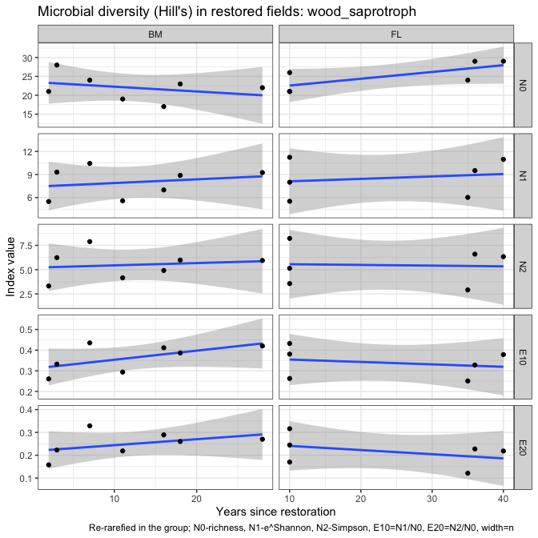
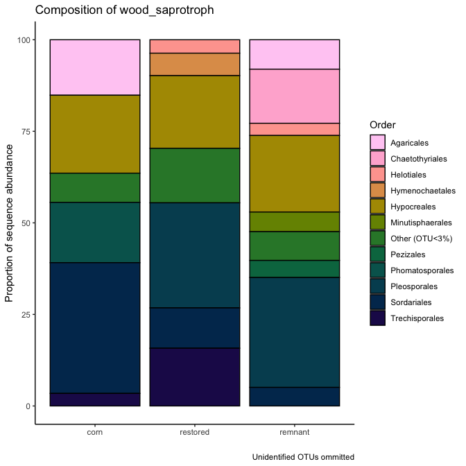

Microbial data: microbial guilds and taxonomy
================
Beau Larkin

Last updated: 04 December, 2023

- [Description](#description)
- [Packages and libraries](#packages-and-libraries)
- [Functions](#functions)
- [Data](#data)
  - [Sites-species tables](#sites-species-tables)
  - [Species metadata](#species-metadata)
  - [Site metadata and design](#site-metadata-and-design)
  - [Joined species, metadata, and design
    tables](#joined-species-metadata-and-design-tables)
- [Analysis and Results](#analysis-and-results)
  - [ITS sequences](#its-sequences)
    - [Unassigned taxa](#unassigned-taxa)
    - [Composition in field types](#composition-in-field-types)
    - [Soil saprotrophs](#soil-saprotrophs)
    - [Plant pathogens](#plant-pathogens)
    - [Wood saprotrophs](#wood-saprotrophs)
    - [Litter saprotrophs](#litter-saprotrophs)
  - [AMF](#amf)
    - [Claroideoglomeraceae](#claroideoglomeraceae)
    - [Paraglomeraceae](#paraglomeraceae)
    - [Diversisporaceae](#diversisporaceae)
    - [Gigasporaceae](#gigasporaceae)
- [Conclusions: taxa and guilds](#conclusions-taxa-and-guilds)
- [Appendix: Rarefy in guilds?](#appendix-rarefy-in-guilds)
  - [Diversity with ITS sequences](#diversity-with-its-sequences)
- [Appendix: Composition in regions](#appendix-composition-in-regions)
  - [Blue Mounds](#blue-mounds)
  - [Faville Grove](#faville-grove)
  - [Fermi](#fermi)
  - [Lake Petite](#lake-petite)

# Description

Sequence clusters identified in QIIME2 are annotated with taxonomic
information and metadata from [Fungal
traits](https://link.springer.com/article/10.1007/s13225-020-00466-2).
In this report, sequence abundances in taxonomic groups or fungal guilds
are compared across field types and with time since restoration.

The full sequence abundance tables were rarefied to make sequencing
depth equivalent across fields. This can result in lower-abundance OTUs
dropping to zero. Within guilds, loss of OTUs could change or bias
interpretations of richness, diversity, and composition. We tried using
raw sequence data and rarefying within guilds to address this problem,
but in each case the sequence depth was so small that additional OTUs
were lost and abundances were significantly lowered.

We may try a different approach which is described in [Semchenko et
al. 2018](https://www.science.org/doi/10.1126/sciadv.aau4578), but for
now, the analysis uses data from the entire rarefied tables for ITS and
18S sequences.

# Packages and libraries

``` r
packages_needed = c("tidyverse",
                    "knitr",
                    "conflicted",
                    "ggbeeswarm",
                    "colorspace",
                    "rsq",
                    "lme4",
                    "multcomp",
                    "indicspecies",
                    "GUniFrac",
                    "vegan")
packages_installed = packages_needed %in% rownames(installed.packages())
```

``` r
if (any(!packages_installed)) {
    install.packages(packages_needed[!packages_installed])
}
```

``` r
for (i in 1:length(packages_needed)) {
    library(packages_needed[i], character.only = T)
}
```

``` r
conflict_prefer("filter", "dplyr")
conflict_prefer("select", "dplyr")
```

# Functions

Functions streamline data processing, model fitting, and results output.
Functions for this script are found in a [supplemental
script](supporting_files/microbial_guild_taxonomy_functions.R) and are
loaded here for convenience.

``` r
source("supporting_files/microbial_guild_taxonomy_functions.R")
```

# Data

## Sites-species tables

CSV files were produced in `process_data.R`

``` r
spe <- list(
    its_raw = read_csv(
        paste0(getwd(), "/clean_data/spe_ITS_raw.csv"),
        show_col_types = FALSE
    ),
    its_rfy = read_csv(
        paste0(getwd(), "/clean_data/spe_ITS_rfy.csv"),
        show_col_types = FALSE
    ),
    amf_raw = read_csv(
        paste0(getwd(), "/clean_data/spe_18S_raw.csv"),
        show_col_types = FALSE
    ),
    amf_rfy = read_csv(
        paste0(getwd(), "/clean_data/spe_18S_rfy.csv"),
        show_col_types = FALSE
    )
)
```

## Species metadata

Load taxonomy for all and guilds (called *primary lifestyle* in Fungal
Traits) for ITS OTUs. Replace NA values with “unidentified” to show
complete numbers of unidentified groups.

``` r
meta <- list(
    its = read_csv(
        paste0(getwd(), "/clean_data/spe_ITS_metadata.csv"),
        show_col_types = FALSE
    ),
    amf = read_csv(
        paste0(getwd(), "/clean_data/spe_18S_metadata.csv"),
        show_col_types = FALSE
    )
) %>% 
    map(. %>% mutate(across(everything(), ~ replace_na(., "unidentified"))))
```

## Site metadata and design

``` r
sites   <-
    read_csv(paste0(getwd(), "/clean_data/sites.csv"), show_col_types = FALSE) %>%
    mutate(
        field_type = factor(
            field_type,
            ordered = TRUE,
            levels = c("corn", "restored", "remnant")
        )) %>%
    select(-lat, -long, -yr_restore, -yr_rank) %>% 
    arrange(field_key)
```

## Joined species, metadata, and design tables

Functions streamline this process

``` r
join_spe_meta <-
    function(spe, meta) {
        spe %>%
            pivot_longer(starts_with("otu"),
                         names_to = "otu_num",
                         values_to = "seq_abund") %>%
            filter(seq_abund != 0) %>%
            left_join(meta, by = join_by(otu_num)) %>%
            left_join(sites, by = join_by(field_key))
    }
```

``` r
spe_meta <- list(
    its_raw = 
        join_spe_meta(spe$its_raw, meta$its) %>%
        write_csv(paste0(getwd(), "/clean_data/speTaxa_ITS_raw.csv")),
    its_rfy = 
        join_spe_meta(spe$its_rfy, meta$its) %>%
        write_csv(paste0(getwd(), "/clean_data/speTaxa_ITS_rfy.csv")),
    amf_raw = 
        join_spe_meta(spe$amf_raw, meta$amf) %>%
        write_csv(paste0(getwd(), "/clean_data/speTaxa_18S_raw.csv")),
    amf_rfy = 
        join_spe_meta(spe$amf_rfy, meta$amf) %>%
        write_csv(paste0( getwd(), "/clean_data/speTaxa_18S_rfy.csv" ))
)
```

# Analysis and Results

## ITS sequences

Recall the number of OTUs recovered in each dataset. The effect of
rarefying did not change richness or diversity very much.

``` r
# Number of OTUs in raw and rarefied datasets
Map(function(x) ncol(x)-1, spe[1:2])
```

    ## $its_raw
    ## [1] 2895
    ## 
    ## $its_rfy
    ## [1] 2888

### Unassigned taxa

Only 21.8 percent of the ITS sequences were assigned to species. In
terms of the analysis done here, its possibly more alarming that only 36
percent were assigned to primary lifestyles or guilds. This suggests
that when we see guilds concentrating in certain habitats, it’s possible
that the difference doesn’t exist. This is particularly possible because
we have one habitat, cornfields, which has probably been studied more
than the others.

``` r
meta$its %>% 
    select(-otu_num, -otu_ID) %>% 
    map(\(x) round(length(which(x == "unidentified")) / length(x) * 100, 1)) %>% 
    bind_rows() %>% 
    kable(format = "pandoc", caption = "Percent unidentified OTUs in each taxonomic group or guild")
```

| phylum | class | order | family | genus | species | primary_lifestyle |
|-------:|------:|------:|-------:|------:|--------:|------------------:|
|   12.2 |  18.4 |  23.8 |   39.4 |  53.9 |    78.2 |                64 |

Percent unidentified OTUs in each taxonomic group or guild

### Composition in field types

Function outputs are verbose, but details may be necessary later so they
are displayed here.

``` r
its_taxaGuild(spe_meta$its_rfy)
```

    ## 
    ## 
    ## Table: Distribution of ITS OTUs in classes; mean sequence abundance by field type
    ## 
    ## phylum                             order                                        corn   restored   remnant
    ## ---------------------------------  --------------------------------------  ---------  ---------  --------
    ## Ascomycota                         Hypocreales                               9004.60    7913.19   8440.00
    ## Ascomycota                         Pleosporales                              8083.40    8125.06   6743.75
    ## Ascomycota                         Chaetothyriales                            748.20    7123.38   6449.25
    ## Basidiomycota                      Agaricales                                3710.00    2717.94   5759.75
    ## Ascomycota                         Helotiales                                3306.40    4069.94   4618.75
    ## Ascomycota                         unidentified                              1592.00    3904.25   4421.25
    ## Ascomycota                         Sordariales                              13480.20    5465.12   4109.25
    ## unidentified                       unidentified                              1424.80    2430.12   3194.75
    ## Ascomycota                         Onygenales                                  80.00    1618.06   2480.25
    ## Mortierellomycota                  Mortierellales                            4396.80    3557.25   2058.25
    ## Basidiomycota                      Geastrales                                 906.00      55.00   1852.00
    ## Ascomycota                         Geoglossales                                 5.00    1922.67   1798.00
    ## Basidiomycota                      Thelephorales                                4.50      23.10   1045.50
    ## Ascomycota                         Glomerellales                             2312.60    1312.12    847.75
    ## Basidiomycota                      Cantharellales                             511.00     957.00    739.00
    ## Glomeromycota                      Glomerales                                 109.00     543.19    491.25
    ## Ascomycota                         GS34                                         0.00     116.33    486.50
    ## Ascomycota                         Xylariales                                  73.60     357.88    375.50
    ## Ascomycota                         Coniochaetales                             878.40     214.62    353.00
    ## Ascomycota                         Sordariomycetes_ord_Incertae_sedis          47.40     156.56    273.00
    ## Ascomycota                         Magnaporthales                             101.00     194.00    233.00
    ## Ascomycota                         Pezizales                                 1216.20     433.75    193.75
    ## Ascomycota                         Capnodiales                                673.20     655.19    189.75
    ## Basidiomycota                      unidentified                               103.00     684.38    188.25
    ## Basidiomycota                      Russulales                                   2.00       9.00    179.67
    ## Basidiomycota                      Sebacinales                                 29.00     794.12    169.50
    ## Basidiomycota                      Boletales                                    6.00       9.00    150.00
    ## Glomeromycota                      unidentified                                10.50     186.86    148.67
    ## Ascomycota                         Chaetosphaeriales                          316.25     281.81    135.33
    ## Ascomycota                         Branch06                                    15.25     180.14    121.33
    ## Ascomycota                         Minutisphaerales                             0.00      63.00    116.00
    ## Ascomycota                         Thelebolales                               116.50      42.86    109.75
    ## Basidiomycota                      Auriculariales                             119.50     325.88    104.25
    ## Basidiomycota                      Tremellales                                 17.40     110.56    100.00
    ## Mucoromycota                       unidentified                                 0.00      17.67     92.50
    ## Ascomycota                         Mytilinidales                                0.00       0.00     83.00
    ## Chytridiomycota                    Spizellomycetales                          190.60     122.80     78.00
    ## Basidiomycota                      Trichosporonales                            61.50      36.82     76.75
    ## Chytridiomycota                    Rhizophlyctidales                          273.00     135.27     72.25
    ## Basidiomycota                      Cystofilobasidiales                       2772.00      95.43     69.33
    ## Basidiomycota                      Filobasidiales                            1117.75     387.62     69.33
    ## Basidiomycota                      Trechisporales                             148.60     512.06     68.00
    ## Mucoromycota                       Umbelopsidales                               0.00       2.00     64.00
    ## Ascomycota                         Venturiales                                 31.00      91.08     62.67
    ## Basidiomycota                      Ustilaginales                                3.00     144.33     51.67
    ## Basidiomycota                      Tremellodendropsidales                       8.00      48.46     48.00
    ## Ascomycota                         Orbiliales                                  17.00      88.93     45.33
    ## Basidiomycota                      Hymenochaetales                             16.00     193.36     45.33
    ## Ascomycota                         Mytilinidiales                               0.00      14.67     42.67
    ## Ascomycota                         Verrucariales                                0.00      71.00     41.00
    ## Basidiomycota                      Polyporales                                 21.20      32.47     36.25
    ## Ascomycota                         Tubeufiales                                 69.00     215.31     32.50
    ## Basidiomycota                      Geminibasidiales                            35.50      56.33     31.00
    ## Ascomycota                         Saccharomycetales                          276.25      42.83     27.67
    ## Basidiomycota                      Atheliales                                   0.00     148.00     27.50
    ## Chytridiomycota                    Chytridiales                                 0.00      91.00     26.00
    ## Basidiomycota                      Phallales                                  230.25      41.67     25.67
    ## Ascomycota                         Microascales                               131.20      84.92     25.00
    ## Ascomycota                         Myrmecridiales                               0.00      78.12     22.50
    ## Basidiomycota                      Erythrobasidiales                            0.00       5.60     22.50
    ## Rozellomycota                      GS11                                         0.00       4.00     22.00
    ## Ascomycota                         GS32                                         0.00       0.00     20.00
    ## Ascomycota                         Eurotiales                                 115.00      40.81     16.00
    ## Chytridiomycota                    Rhizophydiales                              32.67      24.90     15.50
    ## Ascomycota                         Diaporthales                               214.50      13.57     14.50
    ## Ascomycota                         Ostropales                                   0.00      49.00     14.00
    ## Basidiomycota                      Leucosporidiales                            37.67       9.14     13.50
    ## Ascomycota                         Savoryellales                               14.00      14.60     13.33
    ## Ascomycota                         Archaeorhizomycetales                        0.00      36.43     10.00
    ## Glomeromycota                      Archaeosporales                              2.00      13.67     10.00
    ## Chlorophyta                        Chaetopeltidales                            12.25       7.60      9.00
    ## Mortierellomycota                  unidentified                                 0.00       4.50      9.00
    ## Ascomycota                         Acrospermales                                0.00       6.50      7.00
    ## Basidiomycota                      Microbotryomycetes_ord_Incertae_sedis       10.75      18.83      7.00
    ## Ascomycota                         Rhytismatales                                0.00       2.00      6.00
    ## Basidiobolomycota                  Basidiobolales                               0.00      16.33      6.00
    ## Basidiomycota                      Agaricomycetes_ord_Incertae_sedis            0.00       0.00      6.00
    ## Ascomycota                         Dothideales                                  0.00      32.00      5.50
    ## Chlorophyta                        unidentified                                 8.00       8.67      5.00
    ## Glomeromycota                      Diversisporales                              0.00       6.20      5.00
    ## Basidiomycota                      Atractiellales                              14.75      10.00      4.00
    ## Ascomycota                         Candelariales                                0.00       3.00      3.00
    ## Entorrhizomycota                   Entorrhizales                                0.00       0.00      2.00
    ## Ichthyosporia_phy_Incertae_sedis   unidentified                                 0.00       0.00      2.00
    ## Mucoromycota                       GS22                                         0.00       4.00      2.00
    ## Mucoromycota                       Mucorales                                    0.00       5.83      1.00
    ## Anthophyta                         Asterales                                    0.00       5.00      0.00
    ## Anthophyta                         Brassicales                                 10.00       5.00      0.00
    ## Anthophyta                         Commelinales                                 3.00     232.00      0.00
    ## Anthophyta                         Fabales                                      0.00      10.33      0.00
    ## Anthophyta                         Poales                                       4.50       3.00      0.00
    ## Ascomycota                         Boliniales                                  43.00      53.50      0.00
    ## Ascomycota                         Botryosphaeriales                           22.00      21.50      0.00
    ## Ascomycota                         Jahnulales                                  11.00       0.00      0.00
    ## Ascomycota                         Lichenostigmatales                           0.00       4.00      0.00
    ## Ascomycota                         Microthyriales                               0.00      11.50      0.00
    ## Ascomycota                         Pezizomycotina_ord_Incertae_sedis           34.50     508.00      0.00
    ## Ascomycota                         Phacidiales                                  0.00       8.00      0.00
    ## Ascomycota                         Phomatosporales                            696.00       9.50      0.00
    ## Ascomycota                         Trichosphaeriales                            5.00      24.82      0.00
    ## Basidiomycota                      Agaricostilbales                             2.00       2.00      0.00
    ## Basidiomycota                      Corticiales                                  0.00      69.43      0.00
    ## Basidiomycota                      Cystobasidiales                             44.00      11.00      0.00
    ## Basidiomycota                      Entylomatales                                0.00      12.60      0.00
    ## Basidiomycota                      Holtermanniales                              4.50      13.67      0.00
    ## Basidiomycota                      Kriegeriales                                 3.00      11.00      0.00
    ## Basidiomycota                      Platygloeales                                0.00      81.80      0.00
    ## Basidiomycota                      Pucciniales                                  0.00       6.00      0.00
    ## Basidiomycota                      Sporidiobolales                             51.00       8.25      0.00
    ## Basidiomycota                      Tilletiales                                 11.00      25.00      0.00
    ## Basidiomycota                      Urocystidales                               76.00       5.17      0.00
    ## Calcarisporiellomycota             Calcarisporiellales                          0.00       4.00      0.00
    ## Cercozoa                           unidentified                                 5.00       3.00      0.00
    ## Chlorophyta                        Chaetophorales                               0.00      24.33      0.00
    ## Chlorophyta                        Chlorellales                                 0.00       6.00      0.00
    ## Chlorophyta                        Sphaeropleales                               0.00       5.00      0.00
    ## Chytridiomycota                    unidentified                                22.00       9.00      0.00
    ## Glomeromycota                      Paraglomerales                               4.00      11.40      0.00
    ## Haplosporidia                      Haplosporidia_ord_Incertae_sedis             2.33      10.00      0.00
    ## Monoblepharomycota                 Monoblepharidales                            1.00       0.00      0.00
    ## [[1]]
    ## 
    ## 
    ## Table: Distribution of ITS OTUs by Fungal Trait 'primary_lifestyle'; mean sequence abundance by field type
    ## 
    ## primary_lifestyle            corn   restored   remnant     total
    ## -----------------------  --------  ---------  --------  --------
    ## unidentified              26016.2    31596.5   34920.8   92533.5
    ## plant_pathogen             9212.2     9096.0    7162.8   25471.0
    ## soil_saprotroph            9138.8     7632.6    7767.0   24538.4
    ## wood_saprotroph            3698.0     2878.5    1776.2    8352.7
    ## dung_saprotroph            3432.4     1991.6    1119.0    6543.0
    ## litter_saprotroph          2505.8     1756.9    1310.8    5573.5
    ## mycoparasite               2162.2      729.8     346.8    3238.8
    ## animal_parasite             785.2     1339.2     856.5    2980.9
    ## ectomycorrhizal              14.0      140.0    2153.2    2307.2
    ## unspecified_saprotroph      931.2      209.5     208.5    1349.2
    ## root_endophyte               17.0      484.6     225.8     727.4
    ## arbuscular_mycorrhizal       76.0      243.2     183.5     502.7
    ## pollen_saprotroph           171.2      109.3      60.8     341.3
    ## lichenized                    0.0       94.0      14.0     108.0
    ## lichen_parasite              17.3       44.9      44.5     106.7
    ## nectar/tap_saprotroph        37.0       40.9      27.7     105.6
    ## foliar_endophyte              3.7       33.5       5.0      42.2
    ## epiphyte                      0.0        9.0      25.0      34.0
    ## unspecified_pathotroph        0.0       14.0       9.0      23.0
    ## algal_parasite                2.0        4.0       0.0       6.0
    ## 
    ## [[2]]


    ## 
    ## [[3]]


The top guilds are:

1.  Unidentified (not shown on column charts)
2.  plant pathogens
3.  soil saprotrophs
4.  wood saprotrophs
5.  dung saprotrophs
6.  litter saprotrophs

Compared with the sequence abundance in the NA group, plant pathogens
and soil saprotrophs are abundant enough to feel somewhat confident
about in terms of coverage.

``` r
its_rfy_guilds <- its_test_taxaGuild(spe_meta$its_rfy)
```

    ## ---------------------------------
    ## [1] "soil_saprotroph"
    ## ---------------------------------
    ## 
    ## 
    ## field_type   region   field_name    yr_since  primary_lifestyle    seq_sum
    ## -----------  -------  -----------  ---------  ------------------  --------
    ## corn         FL       FLC2                 0  soil_saprotroph        15654
    ## restored     BM       KORP1               28  soil_saprotroph        14082
    ## remnant      LP       LPREM1              NA  soil_saprotroph        12337
    ## restored     FL       FLRSP1              10  soil_saprotroph        11679
    ## corn         LP       LPC1                 0  soil_saprotroph        10203
    ## restored     FL       FLRSP3              10  soil_saprotroph        10118
    ## remnant      BM       MBREM1              NA  soil_saprotroph        10065
    ## restored     FL       FLRP5               35  soil_saprotroph         9978
    ## corn         FL       FLC1                 0  soil_saprotroph         9645
    ## restored     BM       BBRP1               16  soil_saprotroph         8987
    ## restored     FL       FLRP1               40  soil_saprotroph         8841
    ## restored     BM       PHRP1               11  soil_saprotroph         8380
    ## restored     FL       FLRSP2              10  soil_saprotroph         7602
    ## restored     BM       ERRP1                3  soil_saprotroph         7378
    ## restored     BM       MBRP1               18  soil_saprotroph         6045
    ## corn         BM       PHC1                 0  soil_saprotroph         5911
    ## restored     FL       FLRP4               36  soil_saprotroph         5552
    ## restored     LP       LPRP1                4  soil_saprotroph         5396
    ## restored     BM       MHRP2                2  soil_saprotroph         5123
    ## remnant      FG       FGREM1              NA  soil_saprotroph         4908
    ## restored     BM       MHRP1                7  soil_saprotroph         4498
    ## restored     LP       LPRP2                4  soil_saprotroph         4493
    ## corn         FG       FGC1                 0  soil_saprotroph         4281
    ## restored     FG       FGRP1               15  soil_saprotroph         3970
    ## remnant      FL       FLREM1              NA  soil_saprotroph         3758
    ## ----------------------------------------------------
    ## 
    ## Linear mixed model fit by maximum likelihood  ['lmerMod']
    ## Formula: seq_sum ~ field_type + (1 | region)
    ##    Data: mod_data
    ##       AIC       BIC    logLik  deviance  df.resid 
    ##  484.2052  490.2996 -237.1026  474.2052        20 
    ## Random effects:
    ##  Groups   Name        Std.Dev.
    ##  region   (Intercept)    0    
    ##  Residual             3182    
    ## Number of obs: 25, groups:  region, 4
    ## Fixed Effects:
    ##  (Intercept)  field_type.L  field_type.Q  
    ##       8179.5        -970.0         669.8  
    ## optimizer (nloptwrap) convergence code: 0 (OK) ; 0 optimizer warnings; 1 lme4 warnings 
    ## ----------------------------------------------------
    ## 
    ## Linear mixed model fit by maximum likelihood  ['lmerMod']
    ## Formula: seq_sum ~ 1 + (1 | region)
    ##    Data: mod_data
    ##       AIC       BIC    logLik  deviance  df.resid 
    ##  481.0608  484.7174 -237.5304  475.0608        22 
    ## Random effects:
    ##  Groups   Name        Std.Dev.
    ##  region   (Intercept)    0    
    ##  Residual             3237    
    ## Number of obs: 25, groups:  region, 4
    ## Fixed Effects:
    ## (Intercept)  
    ##        7955  
    ## optimizer (nloptwrap) convergence code: 0 (OK) ; 0 optimizer warnings; 1 lme4 warnings 
    ## ----------------------------------------------------
    ## 
    ## Data: mod_data
    ## Models:
    ## mmod_null: seq_sum ~ 1 + (1 | region)
    ## mmod: seq_sum ~ field_type + (1 | region)
    ##           npar    AIC    BIC  logLik deviance  Chisq Df Pr(>Chisq)
    ## mmod_null    3 481.06 484.72 -237.53   475.06                     
    ## mmod         5 484.21 490.30 -237.10   474.21 0.8556  2     0.6519
    ## ----------------------------------------------------
    ## 
    ## 
    ##   Simultaneous Tests for General Linear Hypotheses
    ## 
    ## Multiple Comparisons of Means: Tukey Contrasts
    ## 
    ## 
    ## Fit: lmer(formula = seq_sum ~ field_type + (1 | region), data = mod_data, 
    ##     REML = FALSE)
    ## 
    ## Linear Hypotheses:
    ##                         Estimate Std. Error z value Pr(>|z|)
    ## restored - corn == 0     -1506.2     1630.1  -0.924    0.621
    ## remnant - corn == 0      -1371.8     2134.3  -0.643    0.793
    ## remnant - restored == 0    134.4     1778.6   0.076    0.997
    ## (Adjusted p values reported -- single-step method)
    ## 
    ##     corn restored  remnant 
    ##      "a"      "a"      "a" 
    ## ----------------------------------------------------
    ## 
    ## [1] "Years since restoration and soil_saprotroph sequence abundance in Blue Mounds Area"
    ## 
    ## Call:
    ## lm(formula = seq_sum ~ yr_since, data = mod_data2)
    ## 
    ## Residuals:
    ##       1       2       3       4       5       6       7 
    ##   144.1  2101.5  1947.1 -3346.5 -1875.8   120.8   908.8 
    ## 
    ## Coefficients:
    ##             Estimate Std. Error t value Pr(>|t|)  
    ## (Intercept)  4453.50    1429.02   3.116   0.0264 *
    ## yr_since      274.33      96.13   2.854   0.0357 *
    ## ---
    ## Signif. codes:  0 '***' 0.001 '**' 0.01 '*' 0.05 '.' 0.1 ' ' 1
    ## 
    ## Residual standard error: 2181 on 5 degrees of freedom
    ## Multiple R-squared:  0.6196, Adjusted R-squared:  0.5435 
    ## F-statistic: 8.145 on 1 and 5 DF,  p-value: 0.03566
    ## 
    ## 
    ## 
    ## 
    ## ---------------------------------
    ## [1] "plant_pathogen"
    ## ---------------------------------
    ## 
    ## 
    ## field_type   region   field_name    yr_since  primary_lifestyle    seq_sum
    ## -----------  -------  -----------  ---------  ------------------  --------
    ## restored     BM       MHRP2                2  plant_pathogen         16137
    ## restored     BM       MHRP1                7  plant_pathogen         15451
    ## restored     LP       LPRP1                4  plant_pathogen         15124
    ## restored     BM       PHRP1               11  plant_pathogen         14470
    ## corn         LP       LPC1                 0  plant_pathogen         14037
    ## restored     FG       FGRP1               15  plant_pathogen         12308
    ## restored     BM       ERRP1                3  plant_pathogen         12267
    ## corn         FG       FGC1                 0  plant_pathogen          9678
    ## remnant      LP       LPREM1              NA  plant_pathogen          9437
    ## corn         FL       FLC2                 0  plant_pathogen          9089
    ## remnant      FG       FGREM1              NA  plant_pathogen          8456
    ## restored     LP       LPRP2                4  plant_pathogen          7719
    ## restored     BM       BBRP1               16  plant_pathogen          7654
    ## remnant      FL       FLREM1              NA  plant_pathogen          7591
    ## corn         FL       FLC1                 0  plant_pathogen          7405
    ## restored     FL       FLRP1               40  plant_pathogen          6818
    ## restored     FL       FLRSP2              10  plant_pathogen          6404
    ## restored     FL       FLRSP1              10  plant_pathogen          6100
    ## corn         BM       PHC1                 0  plant_pathogen          5852
    ## restored     BM       MBRP1               18  plant_pathogen          5347
    ## restored     BM       KORP1               28  plant_pathogen          5212
    ## restored     FL       FLRP5               35  plant_pathogen          5004
    ## restored     FL       FLRP4               36  plant_pathogen          4812
    ## restored     FL       FLRSP3              10  plant_pathogen          4709
    ## remnant      BM       MBREM1              NA  plant_pathogen          3167
    ## ----------------------------------------------------
    ## 
    ## Linear mixed model fit by maximum likelihood  ['lmerMod']
    ## Formula: seq_sum ~ field_type + (1 | region)
    ##    Data: mod_data
    ##       AIC       BIC    logLik  deviance  df.resid 
    ##  490.5250  496.6194 -240.2625  480.5250        20 
    ## Random effects:
    ##  Groups   Name        Std.Dev.
    ##  region   (Intercept) 1564    
    ##  Residual             3382    
    ## Number of obs: 25, groups:  region, 4
    ## Fixed Effects:
    ##  (Intercept)  field_type.L  field_type.Q  
    ##       8769.5       -1715.5        -964.3  
    ## ----------------------------------------------------
    ## 
    ## Linear mixed model fit by maximum likelihood  ['lmerMod']
    ## Formula: seq_sum ~ 1 + (1 | region)
    ##    Data: mod_data
    ##       AIC       BIC    logLik  deviance  df.resid 
    ##  488.0500  491.7066 -241.0250  482.0500        22 
    ## Random effects:
    ##  Groups   Name        Std.Dev.
    ##  region   (Intercept) 1332    
    ##  Residual             3545    
    ## Number of obs: 25, groups:  region, 4
    ## Fixed Effects:
    ## (Intercept)  
    ##        9068  
    ## ----------------------------------------------------
    ## 
    ## Data: mod_data
    ## Models:
    ## mmod_null: seq_sum ~ 1 + (1 | region)
    ## mmod: seq_sum ~ field_type + (1 | region)
    ##           npar    AIC    BIC  logLik deviance  Chisq Df Pr(>Chisq)
    ## mmod_null    3 488.05 491.71 -241.03   482.05                     
    ## mmod         5 490.53 496.62 -240.26   480.53 1.5249  2     0.4665
    ## ----------------------------------------------------
    ## 
    ## 
    ##   Simultaneous Tests for General Linear Hypotheses
    ## 
    ## Multiple Comparisons of Means: Tukey Contrasts
    ## 
    ## 
    ## Fit: lmer(formula = seq_sum ~ field_type + (1 | region), data = mod_data, 
    ##     REML = FALSE)
    ## 
    ## Linear Hypotheses:
    ##                         Estimate Std. Error z value Pr(>|z|)
    ## restored - corn == 0      -31.98    1758.86  -0.018    1.000
    ## remnant - corn == 0     -2426.06    2275.34  -1.066    0.531
    ## remnant - restored == 0 -2394.08    1924.31  -1.244    0.423
    ## (Adjusted p values reported -- single-step method)
    ## 
    ##     corn restored  remnant 
    ##      "a"      "a"      "a" 
    ## ----------------------------------------------------
    ## 
    ## [1] "Years since restoration and plant_pathogen sequence abundance in Blue Mounds Area"
    ## 
    ## Call:
    ## lm(formula = seq_sum ~ yr_since, data = mod_data2)
    ## 
    ## Residuals:
    ##       1       2       3       4       5       6       7 
    ## -1569.3 -2721.9  1310.7 -2989.3  2236.1   704.6  3029.1 
    ## 
    ## Coefficients:
    ##             Estimate Std. Error t value Pr(>|t|)    
    ## (Intercept)  16319.4     1738.3   9.388 0.000231 ***
    ## yr_since      -443.5      116.9  -3.793 0.012721 *  
    ## ---
    ## Signif. codes:  0 '***' 0.001 '**' 0.01 '*' 0.05 '.' 0.1 ' ' 1
    ## 
    ## Residual standard error: 2653 on 5 degrees of freedom
    ## Multiple R-squared:  0.7421, Adjusted R-squared:  0.6905 
    ## F-statistic: 14.39 on 1 and 5 DF,  p-value: 0.01272
    ## 
    ## 
    ## 
    ## 
    ## ---------------------------------
    ## [1] "ectomycorrhizal"
    ## ---------------------------------
    ## 
    ## 
    ## field_type   region   field_name    yr_since  primary_lifestyle    seq_sum
    ## -----------  -------  -----------  ---------  ------------------  --------
    ## remnant      FG       FGREM1              NA  ectomycorrhizal         3491
    ## remnant      FL       FLREM1              NA  ectomycorrhizal         3440
    ## remnant      BM       MBREM1              NA  ectomycorrhizal         1126
    ## remnant      LP       LPREM1              NA  ectomycorrhizal          556
    ## restored     BM       MBRP1               18  ectomycorrhizal          536
    ## corn         LP       LPC1                 0  ectomycorrhizal           14
    ## restored     FL       FLRP1               40  ectomycorrhizal           13
    ## restored     BM       MHRP2                2  ectomycorrhizal            9
    ## restored     FG       FGRP1               15  ectomycorrhizal            2
    ## ----------------------------------------------------
    ## 
    ## Linear mixed model fit by maximum likelihood  ['lmerMod']
    ## Formula: seq_sum ~ field_type + (1 | region)
    ##    Data: mod_data
    ##      AIC      BIC   logLik deviance df.resid 
    ## 157.9480 158.9341 -73.9740 147.9480        4 
    ## Random effects:
    ##  Groups   Name        Std.Dev.
    ##  region   (Intercept)   0.0   
    ##  Residual             898.2   
    ## Number of obs: 9, groups:  region, 4
    ## Fixed Effects:
    ##  (Intercept)  field_type.L  field_type.Q  
    ##        769.1        1512.7         770.5  
    ## optimizer (nloptwrap) convergence code: 0 (OK) ; 0 optimizer warnings; 1 lme4 warnings 
    ## ----------------------------------------------------
    ## 
    ## Linear mixed model fit by maximum likelihood  ['lmerMod']
    ## Formula: seq_sum ~ 1 + (1 | region)
    ##    Data: mod_data
    ##      AIC      BIC   logLik deviance df.resid 
    ## 161.3398 161.9315 -77.6699 155.3398        6 
    ## Random effects:
    ##  Groups   Name        Std.Dev.
    ##  region   (Intercept)    0    
    ##  Residual             1354    
    ## Number of obs: 9, groups:  region, 4
    ## Fixed Effects:
    ## (Intercept)  
    ##        1021  
    ## optimizer (nloptwrap) convergence code: 0 (OK) ; 0 optimizer warnings; 1 lme4 warnings 
    ## ----------------------------------------------------
    ## 
    ## Data: mod_data
    ## Models:
    ## mmod_null: seq_sum ~ 1 + (1 | region)
    ## mmod: seq_sum ~ field_type + (1 | region)
    ##           npar    AIC    BIC  logLik deviance  Chisq Df Pr(>Chisq)  
    ## mmod_null    3 161.34 161.93 -77.670   155.34                       
    ## mmod         5 157.95 158.93 -73.974   147.95 7.3918  2    0.02482 *
    ## ---
    ## Signif. codes:  0 '***' 0.001 '**' 0.01 '*' 0.05 '.' 0.1 ' ' 1
    ## ----------------------------------------------------
    ## 
    ## 
    ##   Simultaneous Tests for General Linear Hypotheses
    ## 
    ## Multiple Comparisons of Means: Tukey Contrasts
    ## 
    ## 
    ## Fit: lmer(formula = seq_sum ~ field_type + (1 | region), data = mod_data, 
    ##     REML = FALSE)
    ## 
    ## Linear Hypotheses:
    ##                         Estimate Std. Error z value Pr(>|z|)   
    ## restored - corn == 0       126.0     1004.2   0.125  0.99115   
    ## remnant - corn == 0       2139.2     1004.2   2.130  0.08063 . 
    ## remnant - restored == 0   2013.3      635.1   3.170  0.00416 **
    ## ---
    ## Signif. codes:  0 '***' 0.001 '**' 0.01 '*' 0.05 '.' 0.1 ' ' 1
    ## (Adjusted p values reported -- single-step method)
    ## 
    ##     corn restored  remnant 
    ##     "ab"      "a"      "b" 
    ## ----------------------------------------------------
    ## 
    ## [1] "Years since restoration and ectomycorrhizal sequence abundance in Blue Mounds Area"
    ## 
    ## Call:
    ## lm(formula = seq_sum ~ yr_since, data = mod_data2)
    ## 
    ## Residuals:
    ## ALL 2 residuals are 0: no residual degrees of freedom!
    ## 
    ## Coefficients:
    ##             Estimate Std. Error t value Pr(>|t|)
    ## (Intercept)   -56.88        NaN     NaN      NaN
    ## yr_since       32.94        NaN     NaN      NaN
    ## 
    ## Residual standard error: NaN on 0 degrees of freedom
    ## Multiple R-squared:      1,  Adjusted R-squared:    NaN 
    ## F-statistic:   NaN on 1 and 0 DF,  p-value: NA
    ## 
    ## 
    ## 
    ## 
    ## ---------------------------------
    ## [1] "wood_saprotroph"
    ## ---------------------------------
    ## 
    ## 
    ## field_type   region   field_name    yr_since  primary_lifestyle    seq_sum
    ## -----------  -------  -----------  ---------  ------------------  --------
    ## restored     LP       LPRP2                4  wood_saprotroph         5944
    ## corn         LP       LPC1                 0  wood_saprotroph         4665
    ## corn         FG       FGC1                 0  wood_saprotroph         4533
    ## restored     FL       FLRSP2              10  wood_saprotroph         4433
    ## restored     FG       FGRP1               15  wood_saprotroph         4304
    ## corn         FL       FLC1                 0  wood_saprotroph         4188
    ## restored     BM       PHRP1               11  wood_saprotroph         3896
    ## corn         BM       PHC1                 0  wood_saprotroph         3451
    ## restored     LP       LPRP1                4  wood_saprotroph         3261
    ## restored     BM       MHRP2                2  wood_saprotroph         3236
    ## restored     BM       ERRP1                3  wood_saprotroph         3204
    ## restored     BM       MHRP1                7  wood_saprotroph         2906
    ## remnant      FL       FLREM1              NA  wood_saprotroph         2886
    ## restored     FL       FLRP4               36  wood_saprotroph         2755
    ## restored     BM       MBRP1               18  wood_saprotroph         2640
    ## restored     FL       FLRSP1              10  wood_saprotroph         2293
    ## restored     FL       FLRP5               35  wood_saprotroph         2054
    ## restored     FL       FLRP1               40  wood_saprotroph         1776
    ## corn         FL       FLC2                 0  wood_saprotroph         1653
    ## remnant      LP       LPREM1              NA  wood_saprotroph         1602
    ## remnant      FG       FGREM1              NA  wood_saprotroph         1579
    ## restored     FL       FLRSP3              10  wood_saprotroph         1412
    ## remnant      BM       MBREM1              NA  wood_saprotroph         1038
    ## restored     BM       KORP1               28  wood_saprotroph          996
    ## restored     BM       BBRP1               16  wood_saprotroph          946
    ## ----------------------------------------------------
    ## 
    ## Linear mixed model fit by maximum likelihood  ['lmerMod']
    ## Formula: seq_sum ~ field_type + (1 | region)
    ##    Data: mod_data
    ##       AIC       BIC    logLik  deviance  df.resid 
    ##  434.4800  440.5744 -212.2400  424.4800        20 
    ## Random effects:
    ##  Groups   Name        Std.Dev.
    ##  region   (Intercept)  375.4  
    ##  Residual             1130.1  
    ## Number of obs: 25, groups:  region, 4
    ## Fixed Effects:
    ##  (Intercept)  field_type.L  field_type.Q  
    ##         2845         -1390          -211  
    ## ----------------------------------------------------
    ## 
    ## Linear mixed model fit by maximum likelihood  ['lmerMod']
    ## Formula: seq_sum ~ 1 + (1 | region)
    ##    Data: mod_data
    ##       AIC       BIC    logLik  deviance  df.resid 
    ##  435.9951  439.6517 -214.9975  429.9951        22 
    ## Random effects:
    ##  Groups   Name        Std.Dev.
    ##  region   (Intercept)    0    
    ##  Residual             1314    
    ## Number of obs: 25, groups:  region, 4
    ## Fixed Effects:
    ## (Intercept)  
    ##        2866  
    ## optimizer (nloptwrap) convergence code: 0 (OK) ; 0 optimizer warnings; 1 lme4 warnings 
    ## ----------------------------------------------------
    ## 
    ## Data: mod_data
    ## Models:
    ## mmod_null: seq_sum ~ 1 + (1 | region)
    ## mmod: seq_sum ~ field_type + (1 | region)
    ##           npar    AIC    BIC  logLik deviance  Chisq Df Pr(>Chisq)  
    ## mmod_null    3 436.00 439.65 -215.00   430.00                       
    ## mmod         5 434.48 440.57 -212.24   424.48 5.5151  2    0.06345 .
    ## ---
    ## Signif. codes:  0 '***' 0.001 '**' 0.01 '*' 0.05 '.' 0.1 ' ' 1
    ## ----------------------------------------------------
    ## 
    ## 
    ##   Simultaneous Tests for General Linear Hypotheses
    ## 
    ## Multiple Comparisons of Means: Tukey Contrasts
    ## 
    ## 
    ## Fit: lmer(formula = seq_sum ~ field_type + (1 | region), data = mod_data, 
    ##     REML = FALSE)
    ## 
    ## Linear Hypotheses:
    ##                         Estimate Std. Error z value Pr(>|z|)  
    ## restored - corn == 0      -724.1      585.0  -1.238   0.4262  
    ## remnant - corn == 0      -1965.1      759.6  -2.587   0.0254 *
    ## remnant - restored == 0  -1241.0      639.3  -1.941   0.1248  
    ## ---
    ## Signif. codes:  0 '***' 0.001 '**' 0.01 '*' 0.05 '.' 0.1 ' ' 1
    ## (Adjusted p values reported -- single-step method)
    ## 
    ##     corn restored  remnant 
    ##      "a"     "ab"      "b" 
    ## ----------------------------------------------------
    ## 
    ## [1] "Years since restoration and wood_saprotroph sequence abundance in Blue Mounds Area"
    ## 
    ## Call:
    ## lm(formula = seq_sum ~ yr_since, data = mod_data2)
    ## 
    ## Residuals:
    ##       1       2       3       4       5       6       7 
    ## -1251.1  -170.0  -114.8   623.9  -105.9  -228.5  1246.3 
    ## 
    ## Coefficients:
    ##             Estimate Std. Error t value Pr(>|t|)   
    ## (Intercept)  3645.54     556.95   6.546  0.00125 **
    ## yr_since      -90.53      37.46  -2.416  0.06039 . 
    ## ---
    ## Signif. codes:  0 '***' 0.001 '**' 0.01 '*' 0.05 '.' 0.1 ' ' 1
    ## 
    ## Residual standard error: 850.1 on 5 degrees of freedom
    ## Multiple R-squared:  0.5387, Adjusted R-squared:  0.4464 
    ## F-statistic: 5.839 on 1 and 5 DF,  p-value: 0.06039
    ## 
    ## 
    ## 
    ## 
    ## ---------------------------------
    ## [1] "litter_saprotroph"
    ## ---------------------------------
    ## 
    ## 
    ## field_type   region   field_name    yr_since  primary_lifestyle    seq_sum
    ## -----------  -------  -----------  ---------  ------------------  --------
    ## corn         FG       FGC1                 0  litter_saprotroph       5682
    ## restored     BM       ERRP1                3  litter_saprotroph       5088
    ## restored     LP       LPRP1                4  litter_saprotroph       2930
    ## restored     BM       MHRP1                7  litter_saprotroph       2892
    ## corn         BM       PHC1                 0  litter_saprotroph       2840
    ## remnant      FL       FLREM1              NA  litter_saprotroph       2710
    ## restored     LP       LPRP2                4  litter_saprotroph       2558
    ## restored     BM       BBRP1               16  litter_saprotroph       2422
    ## restored     BM       MBRP1               18  litter_saprotroph       2335
    ## restored     BM       MHRP2                2  litter_saprotroph       2175
    ## restored     FL       FLRSP2              10  litter_saprotroph       1868
    ## restored     BM       PHRP1               11  litter_saprotroph       1490
    ## corn         FL       FLC1                 0  litter_saprotroph       1416
    ## corn         FL       FLC2                 0  litter_saprotroph       1377
    ## corn         LP       LPC1                 0  litter_saprotroph       1214
    ## restored     FL       FLRSP3              10  litter_saprotroph       1003
    ## remnant      FG       FGREM1              NA  litter_saprotroph        941
    ## restored     BM       KORP1               28  litter_saprotroph        919
    ## remnant      LP       LPREM1              NA  litter_saprotroph        909
    ## remnant      BM       MBREM1              NA  litter_saprotroph        683
    ## restored     FG       FGRP1               15  litter_saprotroph        558
    ## restored     FL       FLRP4               36  litter_saprotroph        557
    ## restored     FL       FLRP5               35  litter_saprotroph        529
    ## restored     FL       FLRSP1              10  litter_saprotroph        452
    ## restored     FL       FLRP1               40  litter_saprotroph        334
    ## ----------------------------------------------------
    ## 
    ## Linear mixed model fit by maximum likelihood  ['lmerMod']
    ## Formula: seq_sum ~ field_type + (1 | region)
    ##    Data: mod_data
    ##       AIC       BIC    logLik  deviance  df.resid 
    ##  438.7269  444.8212 -214.3634  428.7269        20 
    ## Random effects:
    ##  Groups   Name        Std.Dev.
    ##  region   (Intercept)  348.7  
    ##  Residual             1241.9  
    ## Number of obs: 25, groups:  region, 4
    ## Fixed Effects:
    ##  (Intercept)  field_type.L  field_type.Q  
    ##       1885.6        -889.8         133.1  
    ## ----------------------------------------------------
    ## 
    ## Linear mixed model fit by maximum likelihood  ['lmerMod']
    ## Formula: seq_sum ~ 1 + (1 | region)
    ##    Data: mod_data
    ##       AIC       BIC    logLik  deviance  df.resid 
    ##  437.0200  440.6766 -215.5100  431.0200        22 
    ## Random effects:
    ##  Groups   Name        Std.Dev.
    ##  region   (Intercept)  266.7  
    ##  Residual             1317.6  
    ## Number of obs: 25, groups:  region, 4
    ## Fixed Effects:
    ## (Intercept)  
    ##        1851  
    ## ----------------------------------------------------
    ## 
    ## Data: mod_data
    ## Models:
    ## mmod_null: seq_sum ~ 1 + (1 | region)
    ## mmod: seq_sum ~ field_type + (1 | region)
    ##           npar    AIC    BIC  logLik deviance  Chisq Df Pr(>Chisq)
    ## mmod_null    3 437.02 440.68 -215.51   431.02                     
    ## mmod         5 438.73 444.82 -214.36   428.73 2.2931  2     0.3177
    ## ----------------------------------------------------
    ## 
    ## 
    ##   Simultaneous Tests for General Linear Hypotheses
    ## 
    ## Multiple Comparisons of Means: Tukey Contrasts
    ## 
    ## 
    ## Fit: lmer(formula = seq_sum ~ field_type + (1 | region), data = mod_data, 
    ##     REML = FALSE)
    ## 
    ## Linear Hypotheses:
    ##                         Estimate Std. Error z value Pr(>|z|)
    ## restored - corn == 0      -792.2      641.6  -1.235    0.428
    ## remnant - corn == 0      -1258.3      834.5  -1.508    0.283
    ## remnant - restored == 0   -466.1      700.8  -0.665    0.781
    ## (Adjusted p values reported -- single-step method)
    ## 
    ##     corn restored  remnant 
    ##      "a"      "a"      "a" 
    ## ----------------------------------------------------
    ## 
    ## [1] "Years since restoration and litter_saprotroph sequence abundance in Blue Mounds Area"
    ## 
    ## Call:
    ## lm(formula = seq_sum ~ yr_since, data = mod_data2)
    ## 
    ## Residuals:
    ##        1        2        3        4        5        6        7 
    ##   303.91  1768.92   -90.49   401.68   -57.54 -1236.46 -1090.01 
    ## 
    ## Coefficients:
    ##             Estimate Std. Error t value Pr(>|t|)   
    ## (Intercept)  3596.23     724.32   4.965  0.00423 **
    ## yr_since      -92.38      48.72  -1.896  0.11645   
    ## ---
    ## Signif. codes:  0 '***' 0.001 '**' 0.01 '*' 0.05 '.' 0.1 ' ' 1
    ## 
    ## Residual standard error: 1106 on 5 degrees of freedom
    ## Multiple R-squared:  0.4183, Adjusted R-squared:  0.3019 
    ## F-statistic: 3.595 on 1 and 5 DF,  p-value: 0.1164

Model tests on `field_type` are shaky due to unbalance, but are included
here to point out trends that we may be able to present in some better
way. Trends with restoration age in Blue Mounds are clearly justified.
Results are shown in descending order based on sequence abundance in
remnants:

- Soil saprotroph increases with years since
- Plant pathogens decrease with years since
- Ectomycorrhizal abundance is very low in corn/restored and with little
  replication; nothing can be said except that it’s relatively abundant
  in remnants.
- Wood saprotroph differs among field types (corn vs. remnant; restored
  intermediate) and decreases with years since
- Litter saprotroph is abundant everywhere, but differences over time or
  field type are weak.

#### ITS-based indicators

An indicator species analysis is warranted, identifying which species
correlate strongly with `field_type`. Performing this with all ITS data
may identify particular species to further examine, although it remains
a weakness that we lack replication within blocks for `field_type` in
some regions.

Following the indicator species analysis, richness and composition of
selected guilds is calculated. These calculations are done with data
re-rarefied into the guilds identified here, again to showcase
particular species which seem to drive differences among field types.
It’s also of value because this approach avoids the problem we have with
pseudoreplication.

With indicator species analysis performed using package
[indicspecies](http://sites.google.com/site/miqueldecaceres/), the index
values A and B show the specificity and fidelity components of the
IndVal combined index. The combined index value is noted as ‘stat’ in
the output table below.

``` r
its_inspan <- 
    spe$its_rfy %>% 
    left_join(sites, by = join_by(field_key)) %>% 
    inspan(., 1999, meta$its)
```

``` r
its_inspan %>%
    mutate(field_type = factor(
        field_type,
        ordered = TRUE,
        levels = c("corn", "restored", "remnant")
    )) %>%
    group_by(field_type) %>%
    summarize(
        n_otu = n(),
        stat_avg = mean(stat),
        stat_sd = sd(stat)
    ) %>% 
    kable(format = "pandoc", caption = "Indicator species stats of entire rarefied ITS table")
```

| field_type | n_otu |  stat_avg |   stat_sd |
|:-----------|------:|----------:|----------:|
| corn       |   111 | 0.8082008 | 0.1056399 |
| restored   |    14 | 0.8016857 | 0.0405196 |
| remnant    |    59 | 0.7465031 | 0.0720444 |

Indicator species stats of entire rarefied ITS table

Potential indicators were filtered to p.value\<0.05 before this summary
was produced. Cornfields are a restrictive habitat for soil microbes,
and that is reflected in the results here. More species have higher
specificity and fidelity to cornfields than to the other field types.
The top ten indicators for each field type are printed here; the entire
table is available for further use.

``` r
its_inspan %>% 
    mutate(field_type = factor(
    field_type,
    ordered = TRUE,
    levels = c("corn", "restored", "remnant")
)) %>%
    group_by(field_type) %>% 
    slice_max(order_by = stat, n = 10) %>% 
    arrange(field_type, -stat) %>% 
    write_csv(., paste0(getwd(), "/microbial_guild_taxonomy_files/its_inspan.csv")) %>% 
    kable(format = "pandoc", caption = "Indicator species of ITS OTUs (top 10 per field type)")
```

| otu_num  |         A |      B |      stat | p.value | field_type | primary_lifestyle      | phylum            | class              | order               | family               | genus           | species                    |
|:---------|----------:|-------:|----------:|--------:|:-----------|:-----------------------|:------------------|:-------------------|:--------------------|:---------------------|:----------------|:---------------------------|
| otu_537  | 1.0000000 | 1.0000 | 1.0000000 |  0.0005 | corn       | soil_saprotroph        | Basidiomycota     | Agaricomycetes     | Agaricales          | Bolbitiaceae         | Conocybe        | Conocybe_apala             |
| otu_204  | 0.9902769 | 1.0000 | 0.9951266 |  0.0005 | corn       | unidentified           | Mortierellomycota | Mortierellomycetes | Mortierellales      | Mortierellaceae      | unidentified    | unidentified               |
| otu_172  | 0.9830752 | 1.0000 | 0.9915015 |  0.0005 | corn       | plant_pathogen         | Ascomycota        | Dothideomycetes    | Pleosporales        | Corynesporascaceae   | Corynespora     | Corynespora_cassiicola     |
| otu_9    | 0.9696970 | 1.0000 | 0.9847319 |  0.0030 | corn       | soil_saprotroph        | Basidiomycota     | Tremellomycetes    | Cystofilobasidiales | Mrakiaceae           | Tausonia        | Tausonia_pullulans         |
| otu_188  | 0.9616440 | 1.0000 | 0.9806345 |  0.0005 | corn       | unidentified           | unidentified      | unidentified       | unidentified        | unidentified         | unidentified    | unidentified               |
| otu_200  | 0.9590302 | 1.0000 | 0.9793009 |  0.0005 | corn       | plant_pathogen         | Ascomycota        | Dothideomycetes    | Pleosporales        | Phaeosphaeriaceae    | Ophiosphaerella | unidentified               |
| otu_59   | 0.9582200 | 1.0000 | 0.9788871 |  0.0005 | corn       | soil_saprotroph        | Mortierellomycota | Mortierellomycetes | Mortierellales      | Mortierellaceae      | Mortierella     | unidentified               |
| otu_694  | 0.9523810 | 1.0000 | 0.9759001 |  0.0005 | corn       | unidentified           | unidentified      | unidentified       | unidentified        | unidentified         | unidentified    | unidentified               |
| otu_364  | 0.9183906 | 1.0000 | 0.9583270 |  0.0010 | corn       | unidentified           | Ascomycota        | Sordariomycetes    | Sordariales         | Lasiosphaeriaceae    | Cladorrhinum    | unidentified               |
| otu_103  | 0.9122992 | 1.0000 | 0.9551435 |  0.0055 | corn       | unidentified           | Ascomycota        | Sordariomycetes    | Sordariales         | unidentified         | unidentified    | unidentified               |
| otu_177  | 0.9728916 | 0.7500 | 0.8542065 |  0.0265 | restored   | unidentified           | Ascomycota        | Dothideomycetes    | Pleosporales        | unidentified         | unidentified    | unidentified               |
| otu_461  | 0.8290757 | 0.8750 | 0.8517284 |  0.0220 | restored   | unidentified           | Ascomycota        | Dothideomycetes    | Pleosporales        | Phaeosphaeriaceae    | unidentified    | unidentified               |
| otu_229  | 0.8770190 | 0.8125 | 0.8441433 |  0.0270 | restored   | unidentified           | Ascomycota        | Dothideomycetes    | Tubeufiales         | Tubeufiaceae         | unidentified    | unidentified               |
| otu_114  | 0.7455702 | 0.9375 | 0.8360455 |  0.0015 | restored   | soil_saprotroph        | Mortierellomycota | Mortierellomycetes | Mortierellales      | Mortierellaceae      | Mortierella     | unidentified               |
| otu_32   | 0.6987970 | 1.0000 | 0.8359408 |  0.0385 | restored   | unidentified           | Ascomycota        | Sordariomycetes    | Sordariales         | Chaetomiaceae        | unidentified    | unidentified               |
| otu_35   | 0.6915946 | 1.0000 | 0.8316217 |  0.0255 | restored   | animal_parasite        | Ascomycota        | Sordariomycetes    | Hypocreales         | Clavicipitaceae      | Metarhizium     | unidentified               |
| otu_817  | 0.9558824 | 0.6875 | 0.8106597 |  0.0255 | restored   | unidentified           | Ascomycota        | unidentified       | unidentified        | unidentified         | unidentified    | unidentified               |
| otu_218  | 0.7138257 | 0.8750 | 0.7903148 |  0.0315 | restored   | unidentified           | Basidiomycota     | Agaricomycetes     | Cantharellales      | Ceratobasidiaceae    | unidentified    | unidentified               |
| otu_194  | 0.9071730 | 0.6875 | 0.7897350 |  0.0410 | restored   | unidentified           | Ascomycota        | Leotiomycetes      | Helotiales          | unidentified         | unidentified    | unidentified               |
| otu_1058 | 0.9342105 | 0.6250 | 0.7641214 |  0.0375 | restored   | arbuscular_mycorrhizal | Glomeromycota     | Glomeromycetes     | Glomerales          | Claroideoglomeraceae | Claroideoglomus | Claroideoglomus_claroideum |
| otu_772  | 0.8486842 | 1.0000 | 0.9212406 |  0.0020 | remnant    | unidentified           | Ascomycota        | Sordariomycetes    | unidentified        | unidentified         | unidentified    | unidentified               |
| otu_504  | 0.8295117 | 1.0000 | 0.9107753 |  0.0150 | remnant    | plant_pathogen         | Ascomycota        | Dothideomycetes    | Pleosporales        | Massarinaceae        | Stagonospora    | unidentified               |
| otu_629  | 0.8282266 | 1.0000 | 0.9100695 |  0.0025 | remnant    | unidentified           | Ascomycota        | Leotiomycetes      | Helotiales          | Hyaloscyphaceae      | Microscypha     | unidentified               |
| otu_135  | 0.7885179 | 1.0000 | 0.8879853 |  0.0065 | remnant    | plant_pathogen         | Ascomycota        | Sordariomycetes    | Hypocreales         | Nectriaceae          | Ilyonectria     | unidentified               |
| otu_854  | 1.0000000 | 0.7500 | 0.8660254 |  0.0030 | remnant    | unidentified           | Ascomycota        | unidentified       | unidentified        | unidentified         | unidentified    | unidentified               |
| otu_235  | 0.7449350 | 1.0000 | 0.8630962 |  0.0490 | remnant    | unidentified           | Ascomycota        | Leotiomycetes      | Helotiales          | Hyaloscyphaceae      | unidentified    | unidentified               |
| otu_1740 | 0.9250000 | 0.7500 | 0.8329166 |  0.0035 | remnant    | unidentified           | Glomeromycota     | Glomeromycetes     | Glomerales          | Glomeraceae          | unidentified    | unidentified               |
| otu_140  | 0.9235010 | 0.7500 | 0.8322414 |  0.0410 | remnant    | soil_saprotroph        | Ascomycota        | Sordariomycetes    | Hypocreales         | Stachybotryaceae     | Striaticonidium | Striaticonidium_cinctum    |
| otu_1468 | 0.9228442 | 0.7500 | 0.8319454 |  0.0060 | remnant    | unidentified           | Ascomycota        | Sordariomycetes    | unidentified        | unidentified         | unidentified    | unidentified               |
| otu_1195 | 0.9215686 | 0.7500 | 0.8313702 |  0.0095 | remnant    | unidentified           | unidentified      | unidentified       | unidentified        | unidentified         | unidentified    | unidentified               |

Indicator species of ITS OTUs (top 10 per field type)

### Soil saprotrophs

#### Trends over time

``` r
guiltime("soil_saprotroph")
```

    ## $bm_summary
    ## 
    ## Call:
    ## lm(formula = seq_sum ~ yr_since, data = d %>% filter(region == 
    ##     "BM"))
    ## 
    ## Residuals:
    ##       1       2       3       4       5       6       7 
    ##   144.1  2101.5  1947.1 -3346.5 -1875.8   120.8   908.8 
    ## 
    ## Coefficients:
    ##             Estimate Std. Error t value Pr(>|t|)  
    ## (Intercept)  4453.50    1429.02   3.116   0.0264 *
    ## yr_since      274.33      96.13   2.854   0.0357 *
    ## ---
    ## Signif. codes:  0 '***' 0.001 '**' 0.01 '*' 0.05 '.' 0.1 ' ' 1
    ## 
    ## Residual standard error: 2181 on 5 degrees of freedom
    ## Multiple R-squared:  0.6196, Adjusted R-squared:  0.5435 
    ## F-statistic: 8.145 on 1 and 5 DF,  p-value: 0.03566
    ## 
    ## 
    ## $fl_summary
    ## 
    ## Call:
    ## lm(formula = seq_sum ~ yr_since, data = d %>% filter(region == 
    ##     "FL"))
    ## 
    ## Residuals:
    ##       1       2       3       4       5       6 
    ##   875.5 -2655.0  1710.6  1902.3 -2174.7   341.3 
    ## 
    ## Coefficients:
    ##             Estimate Std. Error t value Pr(>|t|)   
    ## (Intercept) 10380.43    1787.33   5.808  0.00437 **
    ## yr_since      -60.37      65.84  -0.917  0.41108   
    ## ---
    ## Signif. codes:  0 '***' 0.001 '**' 0.01 '*' 0.05 '.' 0.1 ' ' 1
    ## 
    ## Residual standard error: 2191 on 4 degrees of freedom
    ## Multiple R-squared:  0.1737, Adjusted R-squared:  -0.03291 
    ## F-statistic: 0.8407 on 1 and 4 DF,  p-value: 0.4111
    ## 
    ## 
    ## $plot


Sequence abundance of soil saprotrophs increases over time in the Blue
Mounds area ($R^2_{Adj}=0.56, p<0.05$), but this appears to be leveraged
by Karla Ott’s property, though. With all that big bluestem…maybe there
is more litter and soil carbon? It will be good to look at trends in
soil chemistry.

#### Diversity

``` r
ssap <- filgu(spe$its_rfy, meta$its, primary_lifestyle, "soil_saprotroph", sites)
```

<!-- --><!-- -->

    ## $OTUs_n
    ## [1] 260
    ## 
    ## $Sites_n
    ## [1] 25

Out of 2889 OTUs, 260 are in this group. Most OTUs contain few
sequences, but several range from hundreds to 25,000 sequences. The 25
samples are all retained, and vary from 4000 to 16000 sequences. None
are so small that results would be biased by poor representation bias
from being rarefied.

``` r
ssap_div <- calc_diversity(ssap$filspe)
```

Diversity measures are stored in this data frame for further use…

``` r
ssap_comp <- gudicom(ssap_div, ssap$filspeTaxa, "soil_saprotroph")
```

    ## $Hills_field_type


    ## 
    ## $Hills_yrs_since_restoration


    ## 
    ## $Composition_field_type


    ## 
    ## $Composition_yr_since


Richness increases from corn to remnant, but within-group variability is
high. Diversity indices look muddy. Diversity indices increase with
years since restoration, but the significance of this remains to be
seen.

Composition of soil saprotrophs by order can be modified somewhat by
choosing the threshold for lumping rare orders into an “other” category.
Leaving this at the default of \<2%, nine named orders are left.
*Agarics* increase strongly from corn to remnant; *Cystofilobasidiales*
and *Filobasidiales* aren’t found outside of cornfields. Generally,
cornfield composition looks different than the other two, but remnants
do appear somewhat intermediate. *Mortierellales* appear less in
remnants than corn or former corn fields.

*Agarics* generally decrease over time and *Geoglossales* increase.

Soil saprotrophs remain an interesting guild.

#### Indicators

``` r
ssap_inspan <- 
    ssap$filspe %>% 
    left_join(sites, by = join_by(field_key)) %>% 
    inspan(., 1999, meta$its)
```

``` r
ssap_inspan %>%
    mutate(field_type = factor(
        field_type,
        ordered = TRUE,
        levels = c("corn", "restored", "remnant")
    )) %>%
    group_by(field_type) %>%
    summarize(
        n_otu = n(),
        stat_avg = mean(stat),
        stat_sd = sd(stat)
    ) %>% 
    kable(format = "pandoc", caption = "Indicator species stats: soil saprotrophs")
```

| field_type | n_otu |  stat_avg |   stat_sd |
|:-----------|------:|----------:|----------:|
| corn       |    11 | 0.8535974 | 0.1196248 |
| restored   |     1 | 0.8360455 |        NA |
| remnant    |     3 | 0.7880079 | 0.0701644 |

Indicator species stats: soil saprotrophs

We see the same trend as before, where more indicators are found in
cornfields, and their indicator stats are stronger.

``` r
ssap_inspan %>% 
    mutate(field_type = factor(
        field_type,
        ordered = TRUE,
        levels = c("corn", "restored", "remnant")
    )) %>%
    arrange(field_type, -stat) %>% 
    write_csv(., paste0(getwd(), "/microbial_guild_taxonomy_files/ssap_inspan.csv")) %>% 
    kable(format = "pandoc", caption = "Indicator species of soil saprotrophs")
```

| otu_num  |         A |      B |      stat | p.value | field_type | primary_lifestyle | phylum            | class              | order               | family           | genus              | species                 |
|:---------|----------:|-------:|----------:|--------:|:-----------|:------------------|:------------------|:-------------------|:--------------------|:-----------------|:-------------------|:------------------------|
| otu_537  | 1.0000000 | 1.0000 | 1.0000000 |  0.0005 | corn       | soil_saprotroph   | Basidiomycota     | Agaricomycetes     | Agaricales          | Bolbitiaceae     | Conocybe           | Conocybe_apala          |
| otu_9    | 0.9696970 | 1.0000 | 0.9847319 |  0.0025 | corn       | soil_saprotroph   | Basidiomycota     | Tremellomycetes    | Cystofilobasidiales | Mrakiaceae       | Tausonia           | Tausonia_pullulans      |
| otu_59   | 0.9582200 | 1.0000 | 0.9788871 |  0.0005 | corn       | soil_saprotroph   | Mortierellomycota | Mortierellomycetes | Mortierellales      | Mortierellaceae  | Mortierella        | unidentified            |
| otu_134  | 0.9079362 | 1.0000 | 0.9528569 |  0.0030 | corn       | soil_saprotroph   | Mortierellomycota | Mortierellomycetes | Mortierellales      | Mortierellaceae  | Mortierella        | unidentified            |
| otu_89   | 0.9880543 | 0.8000 | 0.8890689 |  0.0095 | corn       | soil_saprotroph   | Mortierellomycota | Mortierellomycetes | Mortierellales      | Mortierellaceae  | Mortierella        | unidentified            |
| otu_61   | 0.9017808 | 0.8000 | 0.8493672 |  0.0390 | corn       | soil_saprotroph   | Basidiomycota     | Agaricomycetes     | Phallales           | Phallaceae       | Phallus            | Phallus_rugulosus       |
| otu_41   | 0.6685879 | 1.0000 | 0.8176722 |  0.0075 | corn       | soil_saprotroph   | Mortierellomycota | Mortierellomycetes | Mortierellales      | Mortierellaceae  | Mortierella        | Mortierella_minutissima |
| otu_1053 | 0.7894406 | 0.8000 | 0.7947028 |  0.0175 | corn       | soil_saprotroph   | Mortierellomycota | Mortierellomycetes | Mortierellales      | Mortierellaceae  | Mortierella        | unidentified            |
| otu_346  | 0.7187618 | 0.8000 | 0.7582938 |  0.0315 | corn       | soil_saprotroph   | Ascomycota        | Pezizomycetes      | Pezizales           | Ascodesmidaceae  | Cephaliophora      | unidentified            |
| otu_534  | 0.8919064 | 0.6000 | 0.7315353 |  0.0235 | corn       | soil_saprotroph   | Ascomycota        | Pezizomycetes      | Pezizales           | Pyronemataceae   | Pseudaleuria       | unidentified            |
| otu_1341 | 1.0000000 | 0.4000 | 0.6324555 |  0.0440 | corn       | soil_saprotroph   | Basidiomycota     | Agaricomycetes     | Agaricales          | Entolomataceae   | Entoloma           | unidentified            |
| otu_114  | 0.7455702 | 0.9375 | 0.8360455 |  0.0005 | restored   | soil_saprotroph   | Mortierellomycota | Mortierellomycetes | Mortierellales      | Mortierellaceae  | Mortierella        | unidentified            |
| otu_140  | 0.9235010 | 0.7500 | 0.8322414 |  0.0475 | remnant    | soil_saprotroph   | Ascomycota        | Sordariomycetes    | Hypocreales         | Stachybotryaceae | Striaticonidium    | Striaticonidium_cinctum |
| otu_372  | 0.6800895 | 1.0000 | 0.8246754 |  0.0215 | remnant    | soil_saprotroph   | Basidiomycota     | Agaricomycetes     | Agaricales          | Clavariaceae     | Clavaria           | unidentified            |
| otu_2138 | 1.0000000 | 0.5000 | 0.7071068 |  0.0225 | remnant    | soil_saprotroph   | Ascomycota        | Leotiomycetes      | Thelebolales        | Pseudeurotiaceae | Gymnostellatospora | unidentified            |

Indicator species of soil saprotrophs

A later task will be to comb these tables for species with good stories…

### Plant pathogens

#### Trends over time

``` r
guiltime("plant_pathogen")
```

    ## $bm_summary
    ## 
    ## Call:
    ## lm(formula = seq_sum ~ yr_since, data = d %>% filter(region == 
    ##     "BM"))
    ## 
    ## Residuals:
    ##       1       2       3       4       5       6       7 
    ## -1569.3 -2721.9  1310.7 -2989.3  2236.1   704.6  3029.1 
    ## 
    ## Coefficients:
    ##             Estimate Std. Error t value Pr(>|t|)    
    ## (Intercept)  16319.4     1738.3   9.388 0.000231 ***
    ## yr_since      -443.5      116.9  -3.793 0.012721 *  
    ## ---
    ## Signif. codes:  0 '***' 0.001 '**' 0.01 '*' 0.05 '.' 0.1 ' ' 1
    ## 
    ## Residual standard error: 2653 on 5 degrees of freedom
    ## Multiple R-squared:  0.7421, Adjusted R-squared:  0.6905 
    ## F-statistic: 14.39 on 1 and 5 DF,  p-value: 0.01272
    ## 
    ## 
    ## $fl_summary
    ## 
    ## Call:
    ## lm(formula = seq_sum ~ yr_since, data = d %>% filter(region == 
    ##     "FL"))
    ## 
    ## Residuals:
    ##      1      2      3      4      5      6 
    ## 1209.3 -804.5 -614.5  432.2  736.2 -958.8 
    ## 
    ## Coefficients:
    ##             Estimate Std. Error t value Pr(>|t|)   
    ## (Intercept) 5687.477    829.368   6.858  0.00237 **
    ## yr_since      -1.971     30.554  -0.064  0.95167   
    ## ---
    ## Signif. codes:  0 '***' 0.001 '**' 0.01 '*' 0.05 '.' 0.1 ' ' 1
    ## 
    ## Residual standard error: 1017 on 4 degrees of freedom
    ## Multiple R-squared:  0.001039,   Adjusted R-squared:  -0.2487 
    ## F-statistic: 0.00416 on 1 and 4 DF,  p-value: 0.9517
    ## 
    ## 
    ## $plot


A strong decline in pathogens is seen in Blue Mounds’ restored fields
($R^2_{Adj}=0.75, p<0.01$), and although two distinct groups are
apparent, no single site displays undue leverage. It’s possible that a
signal like this will be found in soil chemistry or plant data and can
help explain what we are seeing here. Recall also that AMF were
previously found to increase along this same sequence…maybe that will
still hold up.

#### Diversity

``` r
ppat <- filgu(spe$its_rfy, meta$its, primary_lifestyle, "plant_pathogen", sites)
```

<!-- --><!-- -->

    ## $OTUs_n
    ## [1] 164
    ## 
    ## $Sites_n
    ## [1] 25

Out of 2889 OTUs, 159 are in this group. All samples are retained and
contain 3000-16000 sequences, so none are so limited as to bias results.

``` r
ppat_div <- calc_diversity(ppat$filspe)
```

``` r
ppat_comp <- gudicom(ppat_div, ppat$filspeTaxa, "plant_pathogen", other_threshold = 1)
```

    ## $Hills_field_type


    ## 
    ## $Hills_yrs_since_restoration


    ## 
    ## $Composition_field_type


    ## 
    ## $Composition_yr_since


Richness and diversity look flat or declining from corn to remnants and
evenness takes a hit in restored and remnant fields. It looks like we
have fewer pathogens, but more dominant individual taxa become
established. Pathogen diversity decreases with years since restoration
in Blue Mounds, but if the dumbbell plots can be believed, the opposite
appears true in Fermi.

Many pathogen orders are rare, so the argument `other_threshold` was
adjusted to show more diversity. Shifts don’t appear pronounced.
*Diaporthales* decreases in composition from corn to remnant while
*Hypocreales* pathogens increase. *Cantharellales* appear a small
component but are possibly “late successional” pathogens, possibly
associated with some native plant in a plant-soil feedback.

In the Blue Mounds area, trends in pathogen composition over time aren’t
obvious. Possibly *Glomerales* pathogens decrease over time and
*Pleosporales* increase.

#### Indicators

``` r
ppat_inspan <- 
    ppat$filspe %>% 
    left_join(sites, by = join_by(field_key)) %>% 
    inspan(., 1999, meta$its)
```

``` r
ppat_inspan %>%
    mutate(field_type = factor(
        field_type,
        ordered = TRUE,
        levels = c("corn", "restored", "remnant")
    )) %>%
    group_by(field_type) %>%
    summarize(
        n_otu = n(),
        stat_avg = mean(stat),
        stat_sd = sd(stat)
    ) %>% 
    kable(format = "pandoc", caption = "Indicator species stats: plant pathogens")
```

| field_type | n_otu |  stat_avg |   stat_sd |
|:-----------|------:|----------:|----------:|
| corn       |    15 | 0.8517283 | 0.0889883 |
| restored   |     2 | 0.7580889 | 0.0024519 |
| remnant    |     3 | 0.8342621 | 0.1133622 |

Indicator species stats: plant pathogens

We see the same trend as before, where more indicators are found in
cornfields, and their indicator stats are stronger. Composition at the
level of taxonomic order isn’t telling the whole story.

Plant pathogen indicators are nearly all in *Ascomycota.*

``` r
ppat_inspan %>% 
    mutate(field_type = factor(
        field_type,
        ordered = TRUE,
        levels = c("corn", "restored", "remnant")
    )) %>%
    arrange(field_type, -stat) %>% 
    write_csv(., paste0(getwd(), "/microbial_guild_taxonomy_files/ppat_inspan.csv")) %>% 
    kable(format = "pandoc", caption = "Indicator species of plant pathogens")
```

| otu_num  |         A |      B |      stat | p.value | field_type | primary_lifestyle | phylum     | class           | order           | family               | genus            | species                       |
|:---------|----------:|-------:|----------:|--------:|:-----------|:------------------|:-----------|:----------------|:----------------|:---------------------|:-----------------|:------------------------------|
| otu_172  | 0.9830752 | 1.0000 | 0.9915015 |  0.0005 | corn       | plant_pathogen    | Ascomycota | Dothideomycetes | Pleosporales    | Corynesporascaceae   | Corynespora      | Corynespora_cassiicola        |
| otu_200  | 0.9590302 | 1.0000 | 0.9793009 |  0.0005 | corn       | plant_pathogen    | Ascomycota | Dothideomycetes | Pleosporales    | Phaeosphaeriaceae    | Ophiosphaerella  | unidentified                  |
| otu_21   | 0.9096106 | 1.0000 | 0.9537351 |  0.0005 | corn       | plant_pathogen    | Ascomycota | Dothideomycetes | Pleosporales    | Phaeosphaeriaceae    | Setophoma        | Setophoma_terrestris          |
| otu_553  | 0.8981289 | 1.0000 | 0.9476966 |  0.0060 | corn       | plant_pathogen    | Ascomycota | Sordariomycetes | Magnaporthales  | Magnaporthaceae      | Gaeumannomyces   | unidentified                  |
| otu_1841 | 1.0000000 | 0.8000 | 0.8944272 |  0.0015 | corn       | plant_pathogen    | Ascomycota | Dothideomycetes | Pleosporales    | Pleosporaceae        | Curvularia       | unidentified                  |
| otu_432  | 0.9929345 | 0.8000 | 0.8912618 |  0.0020 | corn       | plant_pathogen    | Ascomycota | Sordariomycetes | Glomerellales   | Glomerellaceae       | Colletotrichum   | unidentified                  |
| otu_13   | 0.7426101 | 1.0000 | 0.8617483 |  0.0055 | corn       | plant_pathogen    | Ascomycota | Sordariomycetes | Glomerellales   | Plectosphaerellaceae | Plectosphaerella | Plectosphaerella_cucumerina   |
| otu_391  | 0.7244767 | 1.0000 | 0.8511620 |  0.0155 | corn       | plant_pathogen    | Ascomycota | Dothideomycetes | Pleosporales    | Torulaceae           | Dendryphion      | unidentified                  |
| otu_796  | 0.8905302 | 0.8000 | 0.8440522 |  0.0085 | corn       | plant_pathogen    | Ascomycota | Dothideomycetes | Capnodiales     | Mycosphaerellaceae   | Cercospora       | unidentified                  |
| otu_325  | 1.0000000 | 0.6000 | 0.7745967 |  0.0060 | corn       | plant_pathogen    | Ascomycota | Sordariomycetes | Diaporthales    | Diaporthaceae        | Diaporthe        | unidentified                  |
| otu_758  | 1.0000000 | 0.6000 | 0.7745967 |  0.0085 | corn       | plant_pathogen    | Ascomycota | Dothideomycetes | Pleosporales    | Dictyosporiaceae     | Pseudocoleophoma | Pseudocoleophoma_polygonicola |
| otu_1159 | 1.0000000 | 0.6000 | 0.7745967 |  0.0060 | corn       | plant_pathogen    | Ascomycota | Sordariomycetes | Glomerellales   | Plectosphaerellaceae | Plectosphaerella | unidentified                  |
| otu_521  | 0.9629019 | 0.6000 | 0.7600928 |  0.0195 | corn       | plant_pathogen    | Ascomycota | Sordariomycetes | Glomerellales   | Plectosphaerellaceae | Lectera          | unidentified                  |
| otu_797  | 0.6903271 | 0.8000 | 0.7431431 |  0.0285 | corn       | plant_pathogen    | Ascomycota | Eurotiomycetes  | Chaetothyriales | Herpotrichiellaceae  | Veronaea         | unidentified                  |
| otu_1013 | 0.8979592 | 0.6000 | 0.7340133 |  0.0390 | corn       | plant_pathogen    | Ascomycota | Sordariomycetes | Xylariales      | Microdochiaceae      | Microdochium     | Microdochium_colombiense      |
| otu_607  | 0.8397535 | 0.6875 | 0.7598227 |  0.0345 | restored   | plant_pathogen    | Ascomycota | Dothideomycetes | Pleosporales    | Didymosphaeriaceae   | Pseudopithomyces | unidentified                  |
| otu_33   | 0.5720731 | 1.0000 | 0.7563551 |  0.0360 | restored   | plant_pathogen    | Ascomycota | Sordariomycetes | Hypocreales     | Nectriaceae          | Fusarium         | unidentified                  |
| otu_504  | 0.8295117 | 1.0000 | 0.9107753 |  0.0110 | remnant    | plant_pathogen    | Ascomycota | Dothideomycetes | Pleosporales    | Massarinaceae        | Stagonospora     | unidentified                  |
| otu_135  | 0.7885179 | 1.0000 | 0.8879853 |  0.0035 | remnant    | plant_pathogen    | Ascomycota | Sordariomycetes | Hypocreales     | Nectriaceae          | Ilyonectria      | unidentified                  |
| otu_942  | 0.9913043 | 0.5000 | 0.7040257 |  0.0375 | remnant    | plant_pathogen    | Ascomycota | Dothideomycetes | Pleosporales    | Pleosporaceae        | Curvularia       | unidentified                  |

Indicator species of plant pathogens

### Wood saprotrophs

#### Trends over time

``` r
guiltime("wood_saprotroph") 
```

    ## $bm_summary
    ## 
    ## Call:
    ## lm(formula = seq_sum ~ yr_since, data = d %>% filter(region == 
    ##     "BM"))
    ## 
    ## Residuals:
    ##       1       2       3       4       5       6       7 
    ## -1251.1  -170.0  -114.8   623.9  -105.9  -228.5  1246.3 
    ## 
    ## Coefficients:
    ##             Estimate Std. Error t value Pr(>|t|)   
    ## (Intercept)  3645.54     556.95   6.546  0.00125 **
    ## yr_since      -90.53      37.46  -2.416  0.06039 . 
    ## ---
    ## Signif. codes:  0 '***' 0.001 '**' 0.01 '*' 0.05 '.' 0.1 ' ' 1
    ## 
    ## Residual standard error: 850.1 on 5 degrees of freedom
    ## Multiple R-squared:  0.5387, Adjusted R-squared:  0.4464 
    ## F-statistic: 5.839 on 1 and 5 DF,  p-value: 0.06039
    ## 
    ## 
    ## $fl_summary
    ## 
    ## Call:
    ## lm(formula = seq_sum ~ yr_since, data = d %>% filter(region == 
    ##     "FL"))
    ## 
    ## Residuals:
    ##       1       2       3       4       5       6 
    ##  -342.6   555.1  -166.2  -435.1  1704.9 -1316.1 
    ## 
    ## Coefficients:
    ##             Estimate Std. Error t value Pr(>|t|)  
    ## (Intercept)  2931.27     937.24   3.128   0.0353 *
    ## yr_since      -20.32      34.53  -0.588   0.5879  
    ## ---
    ## Signif. codes:  0 '***' 0.001 '**' 0.01 '*' 0.05 '.' 0.1 ' ' 1
    ## 
    ## Residual standard error: 1149 on 4 degrees of freedom
    ## Multiple R-squared:  0.07966,    Adjusted R-squared:  -0.1504 
    ## F-statistic: 0.3462 on 1 and 4 DF,  p-value: 0.5879
    ## 
    ## 
    ## $plot


Interestingly a strong negative relationship over time since restoration
($R^2_{Adj}=0.72, p<0.01$) in sharp contrast to the increasing
relationship found with soil saprotrophs. Apparently many wood
saprotrophs live in cornfield soil…let’s see:

#### Diversity

``` r
wsap <- filgu(spe$its_rfy, meta$its, primary_lifestyle, "wood_saprotroph", sites)
```

<!-- --><!-- -->

    ## $OTUs_n
    ## [1] 126
    ## 
    ## $Sites_n
    ## [1] 25

Out of 2889 OTUs, 120 are in this group. Samples contain 800-4400
sequences. Sequence depth is low; these aren’t abundant or numerous
taxa. Only 123 OTUs comprise this group.

``` r
wsap_div <- calc_diversity(wsap$filspe)
```

``` r
wasp_comp <- gudicom(wsap_div, wsap$filspeTaxa, "wood_saprotroph", other_threshold = 3)
```

    ## $Hills_field_type


    ## 
    ## $Hills_yrs_since_restoration



    ## 
    ## $Composition_field_type



    ## 
    ## $Composition_yr_since


With diversity, not much jumps out.

Diversity appears high across fields and years compared with other
guilds. While *Agaric* soil saprotrophs increased strongly from corn to
remnants, they declined when characterized as wood saprotrophs.

Notable changes in composition are evident over time. *Tubeufiales*
declines with time since restoration; *Hypocreales* increases.
*Pleosporales* also appear to increase, but the colors are difficult to
discern. Remember to look at tabular data.

#### Indicators

``` r
wsap_inspan <- 
    wsap$filspe %>% 
    left_join(sites, by = join_by(field_key)) %>% 
    inspan(., 1999, meta$its)
```

``` r
wsap_inspan %>%
    mutate(field_type = factor(
        field_type,
        ordered = TRUE,
        levels = c("corn", "restored", "remnant")
    )) %>%
    group_by(field_type) %>%
    summarize(
        n_otu = n(),
        stat_avg = mean(stat),
        stat_sd = sd(stat)
    ) %>% 
    kable(format = "pandoc", caption = "Indicator species stats: wood saprotrophs")
```

| field_type | n_otu |  stat_avg |   stat_sd |
|:-----------|------:|----------:|----------:|
| corn       |     5 | 0.7846507 | 0.1047629 |
| restored   |     1 | 0.7500000 |        NA |
| remnant    |     2 | 0.6878165 | 0.0272805 |

Indicator species stats: wood saprotrophs

Few species show specificity or fidelity. Corn fields have a few unusual
taxa, though. Less so with remnants, and none with restored fields.

``` r
wsap_inspan %>% 
    mutate(field_type = factor(
        field_type,
        ordered = TRUE,
        levels = c("corn", "restored", "remnant")
    )) %>%
    arrange(field_type, -stat) %>% 
    kable(format = "pandoc", caption = "Indicator species of wood saprotrophs")
```

| otu_num  |         A |      B |      stat | p.value | field_type | primary_lifestyle | phylum        | class           | order           | family              | genus           | species                   |
|:---------|----------:|-------:|----------:|--------:|:-----------|:------------------|:--------------|:----------------|:----------------|:--------------------|:----------------|:--------------------------|
| otu_11   | 0.7940037 | 1.0000 | 0.8910689 |  0.0090 | corn       | wood_saprotroph   | Ascomycota    | Sordariomycetes | Sordariales     | Chaetomiaceae       | Humicola        | Humicola_grisea           |
| otu_589  | 0.9594814 | 0.8000 | 0.8761193 |  0.0025 | corn       | wood_saprotroph   | Ascomycota    | Sordariomycetes | Hypocreales     | Stachybotryaceae    | Stachybotrys    | Stachybotrys_limonispora  |
| otu_20   | 0.5820393 | 1.0000 | 0.7629150 |  0.0315 | corn       | wood_saprotroph   | Ascomycota    | Sordariomycetes | Hypocreales     | Bionectriaceae      | Clonostachys    | unidentified              |
| otu_341  | 0.9644276 | 0.6000 | 0.7606948 |  0.0110 | corn       | wood_saprotroph   | Basidiomycota | Agaricomycetes  | Agaricales      | Psathyrellaceae     | Psathyrella     | unidentified              |
| otu_1780 | 1.0000000 | 0.4000 | 0.6324555 |  0.0435 | corn       | wood_saprotroph   | Ascomycota    | Eurotiomycetes  | Chaetothyriales | Herpotrichiellaceae | Minimelanolocus | Minimelanolocus_obscurus  |
| otu_130  | 1.0000000 | 0.5625 | 0.7500000 |  0.0415 | restored   | wood_saprotroph   | Basidiomycota | Agaricomycetes  | Trechisporales  | Hydnodontaceae      | Subulicystidium | unidentified              |
| otu_1978 | 1.0000000 | 0.5000 | 0.7071068 |  0.0175 | remnant    | wood_saprotroph   | Ascomycota    | Sordariomycetes | Savoryellales   | Savoryellaceae      | Savoryella      | Savoryella_paucispora     |
| otu_881  | 0.8938547 | 0.5000 | 0.6685263 |  0.0340 | remnant    | wood_saprotroph   | Ascomycota    | Eurotiomycetes  | Chaetothyriales | Herpotrichiellaceae | Minimelanolocus | Minimelanolocus_asiaticus |

Indicator species of wood saprotrophs

### Litter saprotrophs

#### Trends over time

``` r
guiltime("litter_saprotroph") 
```

    ## $bm_summary
    ## 
    ## Call:
    ## lm(formula = seq_sum ~ yr_since, data = d %>% filter(region == 
    ##     "BM"))
    ## 
    ## Residuals:
    ##        1        2        3        4        5        6        7 
    ##   303.91  1768.92   -90.49   401.68   -57.54 -1236.46 -1090.01 
    ## 
    ## Coefficients:
    ##             Estimate Std. Error t value Pr(>|t|)   
    ## (Intercept)  3596.23     724.32   4.965  0.00423 **
    ## yr_since      -92.38      48.72  -1.896  0.11645   
    ## ---
    ## Signif. codes:  0 '***' 0.001 '**' 0.01 '*' 0.05 '.' 0.1 ' ' 1
    ## 
    ## Residual standard error: 1106 on 5 degrees of freedom
    ## Multiple R-squared:  0.4183, Adjusted R-squared:  0.3019 
    ## F-statistic: 3.595 on 1 and 5 DF,  p-value: 0.1164
    ## 
    ## 
    ## $fl_summary
    ## 
    ## Call:
    ## lm(formula = seq_sum ~ yr_since, data = d %>% filter(region == 
    ##     "FL"))
    ## 
    ## Residuals:
    ##       1       2       3       4       5       6 
    ##  -64.62   63.38   11.63 -659.13  756.87 -108.13 
    ## 
    ## Coefficients:
    ##             Estimate Std. Error t value Pr(>|t|)  
    ## (Intercept)  1348.63     413.37   3.263    0.031 *
    ## yr_since      -23.75      15.23  -1.560    0.194  
    ## ---
    ## Signif. codes:  0 '***' 0.001 '**' 0.01 '*' 0.05 '.' 0.1 ' ' 1
    ## 
    ## Residual standard error: 506.8 on 4 degrees of freedom
    ## Multiple R-squared:  0.3781, Adjusted R-squared:  0.2227 
    ## F-statistic: 2.432 on 1 and 4 DF,  p-value: 0.1939
    ## 
    ## 
    ## $plot


#### Diversity

``` r
lsap <- filgu(spe$its_rfy, meta$its, primary_lifestyle, "litter_saprotroph", sites)
```

<!-- --><!-- -->

    ## $OTUs_n
    ## [1] 141
    ## 
    ## $Sites_n
    ## [1] 25

Out of 2889 OTUs, 139 are in this group. Slightly more numerous than the
wood saprotrophs, but similarly not abundant or numerous. Recall that
when this group was rarefied in the guild, sampling depth was 297, or an
order of magnitude less than what we have here. Several OTUs were lost.

``` r
lsap_div <- calc_diversity(lsap$filspe)
```

``` r
lsap_comp <- gudicom(lsap_div, lsap$filspeTaxa, "litter_saprotroph")
```

    ## $Hills_field_type


    ## 
    ## $Hills_yrs_since_restoration


    ## 
    ## $Composition_field_type


    ## 
    ## $Composition_yr_since


With no litter in cornfields, it’s perhaps not surprising to see
increasing trends across field types with this guild. Trends over time
aren’t convincing, except possibly in Fermi.

#### Indicators

``` r
lsap_inspan <- 
    lsap$filspe %>% 
    left_join(sites, by = join_by(field_key)) %>% 
    inspan(., 1999, meta$its)
```

``` r
lsap_inspan %>%
    mutate(field_type = factor(
        field_type,
        ordered = TRUE,
        levels = c("corn", "restored", "remnant")
    )) %>%
    group_by(field_type) %>%
    summarize(
        n_otu = n(),
        stat_avg = mean(stat),
        stat_sd = sd(stat)
    ) %>% 
    kable(format = "pandoc", caption = "Indicator species stats: litter saprotrophs")
```

| field_type | n_otu |  stat_avg |   stat_sd |
|:-----------|------:|----------:|----------:|
| corn       |     3 | 0.8160925 | 0.0912072 |
| remnant    |     2 | 0.7025790 | 0.0205883 |

Indicator species stats: litter saprotrophs

``` r
lsap_inspan %>% 
    mutate(field_type = factor(
        field_type,
        ordered = TRUE,
        levels = c("corn", "restored", "remnant")
    )) %>%
    arrange(field_type, -stat) %>% 
    kable(format = "pandoc", caption = "Indicator species of litter saprotrophs")
```

| otu_num  |         A |    B |      stat | p.value | field_type | primary_lifestyle | phylum          | class                 | order             | family             | genus         | species                   |
|:---------|----------:|-----:|----------:|--------:|:-----------|:------------------|:----------------|:----------------------|:------------------|:-------------------|:--------------|:--------------------------|
| otu_126  | 0.8485265 | 1.00 | 0.9211550 |  0.0120 | corn       | litter_saprotroph | Ascomycota      | Sordariomycetes       | Sordariales       | Chaetomiaceae      | Chaetomium    | unidentified              |
| otu_358  | 0.9879058 | 0.60 | 0.7698984 |  0.0190 | corn       | litter_saprotroph | Ascomycota      | Eurotiomycetes        | Chaetothyriales   | Cyphellophoraceae  | Cyphellophora | Cyphellophora_suttonii    |
| otu_1009 | 0.9556475 | 0.60 | 0.7572242 |  0.0065 | corn       | litter_saprotroph | Ascomycota      | Pezizomycetes         | Pezizales         | Pyronemataceae     | Cheilymenia   | Cheilymenia_stercorea     |
| otu_326  | 0.6857143 | 0.75 | 0.7171372 |  0.0460 | remnant    | litter_saprotroph | Ascomycota      | Dothideomycetes       | Pleosporales      | Dictyosporiaceae   | Dictyosporium | Dictyosporium_heptasporum |
| otu_1302 | 0.9467456 | 0.50 | 0.6880209 |  0.0375 | remnant    | litter_saprotroph | Chytridiomycota | Rhizophlyctidomycetes | Rhizophlyctidales | Rhizophlyctidaceae | Rhizophlyctis | unidentified              |

Indicator species of litter saprotrophs

## AMF

Recall the number of OTUs recovered in each dataset. The effect of
rarefying did not change richness or diversity very much.

``` r
Map(function(x) ncol(x)-1, spe[3:4])
```

    ## $amf_raw
    ## [1] 146
    ## 
    ## $amf_rfy
    ## [1] 145

Function output is verbose but retained as explained previously.

``` r
amf_summary <- amf_tax(spe_meta$amf_rfy)
```

    ## ---------------------------------
    ## [1] "AMF"
    ## ---------------------------------
    ## 
    ## 
    ## family                     corn   restored   remnant
    ## ---------------------  --------  ---------  --------
    ## Glomeraceae             15034.6    14243.7   15252.8
    ## Claroideoglomeraceae      708.4     2042.3    1892.8
    ## Paraglomeraceae          1634.0     1066.8     436.0
    ## Diversisporaceae          580.8      439.7     293.8
    ## Gigasporaceae              28.0      108.4     103.5
    ## Acaulosporaceae             2.0       22.3      80.0
    ## Archaeosporaceae            0.0      133.6      15.5
    ## Ambisporaceae               0.0        0.0       1.0
    ## 
    ## ---------------------------------
    ## [1] "Compare abundances across field types with mixed model"
    ## ---------------------------------
    ## 
    ## ---------------------------------
    ## [1] "Claroideoglomeraceae"
    ## ---------------------------------
    ## Linear mixed model fit by maximum likelihood  ['lmerMod']
    ## Formula: seq_sum ~ field_type + (1 | region)
    ##    Data: amf_df %>% filter(family == test_families[i])
    ##       AIC       BIC    logLik  deviance  df.resid 
    ##  422.1547  428.2491 -206.0774  412.1547        20 
    ## Random effects:
    ##  Groups   Name        Std.Dev.
    ##  region   (Intercept)   0.0   
    ##  Residual             919.8   
    ## Number of obs: 25, groups:  region, 4
    ## Fixed Effects:
    ##  (Intercept)  field_type.L  field_type.Q  
    ##       1547.8         837.5        -605.6  
    ## optimizer (nloptwrap) convergence code: 0 (OK) ; 0 optimizer warnings; 1 lme4 warnings 
    ## ----------------------------------------------------
    ## 
    ## Linear mixed model fit by maximum likelihood  ['lmerMod']
    ## Formula: seq_sum ~ 1 + (1 | region)
    ##    Data: amf_df %>% filter(family == test_families[i])
    ##       AIC       BIC    logLik  deviance  df.resid 
    ##  425.1894  428.8460 -209.5947  419.1894        22 
    ## Random effects:
    ##  Groups   Name        Std.Dev.
    ##  region   (Intercept)    0    
    ##  Residual             1059    
    ## Number of obs: 25, groups:  region, 4
    ## Fixed Effects:
    ## (Intercept)  
    ##        1752  
    ## optimizer (nloptwrap) convergence code: 0 (OK) ; 0 optimizer warnings; 1 lme4 warnings 
    ## ----------------------------------------------------
    ## 
    ## Data: amf_df %>% filter(family == test_families[i])
    ## Models:
    ## mmod_null: seq_sum ~ 1 + (1 | region)
    ## mmod: seq_sum ~ field_type + (1 | region)
    ##           npar    AIC    BIC  logLik deviance  Chisq Df Pr(>Chisq)  
    ## mmod_null    3 425.19 428.85 -209.59   419.19                       
    ## mmod         5 422.15 428.25 -206.08   412.15 7.0346  2    0.02968 *
    ## ---
    ## Signif. codes:  0 '***' 0.001 '**' 0.01 '*' 0.05 '.' 0.1 ' ' 1
    ## ----------------------------------------------------
    ## 
    ## 
    ##   Simultaneous Tests for General Linear Hypotheses
    ## 
    ## Multiple Comparisons of Means: Tukey Contrasts
    ## 
    ## 
    ## Fit: lmer(formula = seq_sum ~ field_type + (1 | region), data = amf_df %>% 
    ##     filter(family == test_families[i]), REML = FALSE)
    ## 
    ## Linear Hypotheses:
    ##                         Estimate Std. Error z value Pr(>|z|)  
    ## restored - corn == 0      1333.9      471.3   2.831   0.0126 *
    ## remnant - corn == 0       1184.3      617.0   1.919   0.1304  
    ## remnant - restored == 0   -149.6      514.2  -0.291   0.9537  
    ## ---
    ## Signif. codes:  0 '***' 0.001 '**' 0.01 '*' 0.05 '.' 0.1 ' ' 1
    ## (Adjusted p values reported -- single-step method)
    ## 
    ##     corn restored  remnant 
    ##      "a"      "b"     "ab" 
    ## 
    ## 
    ## ---------------------------------
    ## [1] "Diversisporaceae"
    ## ---------------------------------
    ## Linear mixed model fit by maximum likelihood  ['lmerMod']
    ## Formula: seq_sum ~ field_type + (1 | region)
    ##    Data: amf_df %>% filter(family == test_families[i])
    ##       AIC       BIC    logLik  deviance  df.resid 
    ##  387.8101  393.9044 -188.9050  377.8101        20 
    ## Random effects:
    ##  Groups   Name        Std.Dev.
    ##  region   (Intercept) 125.0   
    ##  Residual             448.8   
    ## Number of obs: 25, groups:  region, 4
    ## Fixed Effects:
    ##  (Intercept)  field_type.L  field_type.Q  
    ##      427.080      -187.302        -2.174  
    ## ----------------------------------------------------
    ## 
    ## Linear mixed model fit by maximum likelihood  ['lmerMod']
    ## Formula: seq_sum ~ 1 + (1 | region)
    ##    Data: amf_df %>% filter(family == test_families[i])
    ##       AIC       BIC    logLik  deviance  df.resid 
    ##  384.5724  388.2290 -189.2862  378.5724        22 
    ## Random effects:
    ##  Groups   Name        Std.Dev.
    ##  region   (Intercept) 132.4   
    ##  Residual             454.6   
    ## Number of obs: 25, groups:  region, 4
    ## Fixed Effects:
    ## (Intercept)  
    ##       431.9  
    ## ----------------------------------------------------
    ## 
    ## Data: amf_df %>% filter(family == test_families[i])
    ## Models:
    ## mmod_null: seq_sum ~ 1 + (1 | region)
    ## mmod: seq_sum ~ field_type + (1 | region)
    ##           npar    AIC    BIC  logLik deviance  Chisq Df Pr(>Chisq)
    ## mmod_null    3 384.57 388.23 -189.29   378.57                     
    ## mmod         5 387.81 393.90 -188.91   377.81 0.7623  2     0.6831
    ## ----------------------------------------------------
    ## 
    ## 
    ##   Simultaneous Tests for General Linear Hypotheses
    ## 
    ## Multiple Comparisons of Means: Tukey Contrasts
    ## 
    ## 
    ## Fit: lmer(formula = seq_sum ~ field_type + (1 | region), data = amf_df %>% 
    ##     filter(family == test_families[i]), REML = FALSE)
    ## 
    ## Linear Hypotheses:
    ##                         Estimate Std. Error z value Pr(>|z|)
    ## restored - corn == 0      -129.8      231.8  -0.560    0.839
    ## remnant - corn == 0       -264.9      301.5  -0.878    0.650
    ## remnant - restored == 0   -135.1      253.2  -0.534    0.853
    ## (Adjusted p values reported -- single-step method)
    ## 
    ##     corn restored  remnant 
    ##      "a"      "a"      "a" 
    ## 
    ## 
    ## ---------------------------------
    ## [1] "Glomeraceae"
    ## ---------------------------------
    ## Linear mixed model fit by maximum likelihood  ['lmerMod']
    ## Formula: seq_sum ~ field_type + (1 | region)
    ##    Data: amf_df %>% filter(family == test_families[i])
    ##       AIC       BIC    logLik  deviance  df.resid 
    ##  454.5651  460.6595 -222.2826  444.5651        20 
    ## Random effects:
    ##  Groups   Name        Std.Dev.
    ##  region   (Intercept)    0    
    ##  Residual             1759    
    ## Number of obs: 25, groups:  region, 4
    ## Fixed Effects:
    ##  (Intercept)  field_type.L  field_type.Q  
    ##      14843.7         154.3         734.8  
    ## optimizer (nloptwrap) convergence code: 0 (OK) ; 0 optimizer warnings; 1 lme4 warnings 
    ## ----------------------------------------------------
    ## 
    ## Linear mixed model fit by maximum likelihood  ['lmerMod']
    ## Formula: seq_sum ~ 1 + (1 | region)
    ##    Data: amf_df %>% filter(family == test_families[i])
    ##       AIC       BIC    logLik  deviance  df.resid 
    ##  452.0239  455.6805 -223.0119  446.0239        22 
    ## Random effects:
    ##  Groups   Name        Std.Dev.
    ##  region   (Intercept)    0    
    ##  Residual             1811    
    ## Number of obs: 25, groups:  region, 4
    ## Fixed Effects:
    ## (Intercept)  
    ##       14563  
    ## optimizer (nloptwrap) convergence code: 0 (OK) ; 0 optimizer warnings; 1 lme4 warnings 
    ## ----------------------------------------------------
    ## 
    ## Data: amf_df %>% filter(family == test_families[i])
    ## Models:
    ## mmod_null: seq_sum ~ 1 + (1 | region)
    ## mmod: seq_sum ~ field_type + (1 | region)
    ##           npar    AIC    BIC  logLik deviance  Chisq Df Pr(>Chisq)
    ## mmod_null    3 452.02 455.68 -223.01   446.02                     
    ## mmod         5 454.57 460.66 -222.28   444.57 1.4587  2     0.4822
    ## ----------------------------------------------------
    ## 
    ## 
    ##   Simultaneous Tests for General Linear Hypotheses
    ## 
    ## Multiple Comparisons of Means: Tukey Contrasts
    ## 
    ## 
    ## Fit: lmer(formula = seq_sum ~ field_type + (1 | region), data = amf_df %>% 
    ##     filter(family == test_families[i]), REML = FALSE)
    ## 
    ## Linear Hypotheses:
    ##                         Estimate Std. Error z value Pr(>|z|)
    ## restored - corn == 0      -790.9      901.1  -0.878    0.650
    ## remnant - corn == 0        218.2     1179.8   0.185    0.981
    ## remnant - restored == 0   1009.1      983.2   1.026    0.555
    ## (Adjusted p values reported -- single-step method)
    ## 
    ##     corn restored  remnant 
    ##      "a"      "a"      "a" 
    ## 
    ## 
    ## ---------------------------------
    ## [1] "Paraglomeraceae"
    ## ---------------------------------
    ## Linear mixed model fit by maximum likelihood  ['lmerMod']
    ## Formula: seq_sum ~ field_type + (1 | region)
    ##    Data: amf_df %>% filter(family == test_families[i])
    ##       AIC       BIC    logLik  deviance  df.resid 
    ##  433.9654  440.0598 -211.9827  423.9654        20 
    ## Random effects:
    ##  Groups   Name        Std.Dev.
    ##  region   (Intercept)    0    
    ##  Residual             1165    
    ## Number of obs: 25, groups:  region, 4
    ## Fixed Effects:
    ##  (Intercept)  field_type.L  field_type.Q  
    ##      1045.58       -847.11        -25.92  
    ## optimizer (nloptwrap) convergence code: 0 (OK) ; 0 optimizer warnings; 1 lme4 warnings 
    ## ----------------------------------------------------
    ## 
    ## Linear mixed model fit by maximum likelihood  ['lmerMod']
    ## Formula: seq_sum ~ 1 + (1 | region)
    ##    Data: amf_df %>% filter(family == test_families[i])
    ##       AIC       BIC    logLik  deviance  df.resid 
    ##  432.2165  435.8731 -213.1082  426.2165        22 
    ## Random effects:
    ##  Groups   Name        Std.Dev.
    ##  region   (Intercept)    0    
    ##  Residual             1219    
    ## Number of obs: 25, groups:  region, 4
    ## Fixed Effects:
    ## (Intercept)  
    ##        1079  
    ## optimizer (nloptwrap) convergence code: 0 (OK) ; 0 optimizer warnings; 1 lme4 warnings 
    ## ----------------------------------------------------
    ## 
    ## Data: amf_df %>% filter(family == test_families[i])
    ## Models:
    ## mmod_null: seq_sum ~ 1 + (1 | region)
    ## mmod: seq_sum ~ field_type + (1 | region)
    ##           npar    AIC    BIC  logLik deviance  Chisq Df Pr(>Chisq)
    ## mmod_null    3 432.22 435.87 -213.11   426.22                     
    ## mmod         5 433.97 440.06 -211.98   423.97 2.2511  2     0.3245
    ## ----------------------------------------------------
    ## 
    ## 
    ##   Simultaneous Tests for General Linear Hypotheses
    ## 
    ## Multiple Comparisons of Means: Tukey Contrasts
    ## 
    ## 
    ## Fit: lmer(formula = seq_sum ~ field_type + (1 | region), data = amf_df %>% 
    ##     filter(family == test_families[i]), REML = FALSE)
    ## 
    ## Linear Hypotheses:
    ##                         Estimate Std. Error z value Pr(>|z|)
    ## restored - corn == 0      -567.3      596.8  -0.950    0.604
    ## remnant - corn == 0      -1198.0      781.4  -1.533    0.271
    ## remnant - restored == 0   -630.8      651.2  -0.969    0.592
    ## (Adjusted p values reported -- single-step method)
    ## 
    ##     corn restored  remnant 
    ##      "a"      "a"      "a" 
    ## 
    ## 
    ## ---------------------------------
    ## [1] "Gigasporaceae"
    ## ---------------------------------
    ## Linear mixed model fit by maximum likelihood  ['lmerMod']
    ## Formula: seq_sum ~ field_type + (1 | region)
    ##    Data: amf_df %>% filter(family == test_families[i])
    ##       AIC       BIC    logLik  deviance  df.resid 
    ##  244.6180  249.3402 -117.3090  234.6180        14 
    ## Random effects:
    ##  Groups   Name        Std.Dev.
    ##  region   (Intercept)   0.0   
    ##  Residual             116.2   
    ## Number of obs: 19, groups:  region, 3
    ## Fixed Effects:
    ##  (Intercept)  field_type.L  field_type.Q  
    ##        79.98         53.39        -34.85  
    ## optimizer (nloptwrap) convergence code: 0 (OK) ; 0 optimizer warnings; 1 lme4 warnings 
    ## ----------------------------------------------------
    ## 
    ## Linear mixed model fit by maximum likelihood  ['lmerMod']
    ## Formula: seq_sum ~ 1 + (1 | region)
    ##    Data: amf_df %>% filter(family == test_families[i])
    ##       AIC       BIC    logLik  deviance  df.resid 
    ##  241.7771  244.6104 -117.8885  235.7771        16 
    ## Random effects:
    ##  Groups   Name        Std.Dev.
    ##  region   (Intercept)   0.0   
    ##  Residual             119.8   
    ## Number of obs: 19, groups:  region, 3
    ## Fixed Effects:
    ## (Intercept)  
    ##       95.21  
    ## optimizer (nloptwrap) convergence code: 0 (OK) ; 0 optimizer warnings; 1 lme4 warnings 
    ## ----------------------------------------------------
    ## 
    ## Data: amf_df %>% filter(family == test_families[i])
    ## Models:
    ## mmod_null: seq_sum ~ 1 + (1 | region)
    ## mmod: seq_sum ~ field_type + (1 | region)
    ##           npar    AIC    BIC  logLik deviance  Chisq Df Pr(>Chisq)
    ## mmod_null    3 241.78 244.61 -117.89   235.78                     
    ## mmod         5 244.62 249.34 -117.31   234.62 1.1591  2     0.5601
    ## ----------------------------------------------------
    ## 
    ## 
    ##   Simultaneous Tests for General Linear Hypotheses
    ## 
    ## Multiple Comparisons of Means: Tukey Contrasts
    ## 
    ## 
    ## Fit: lmer(formula = seq_sum ~ field_type + (1 | region), data = amf_df %>% 
    ##     filter(family == test_families[i]), REML = FALSE)
    ## 
    ## Linear Hypotheses:
    ##                         Estimate Std. Error z value Pr(>|z|)
    ## restored - corn == 0      80.429     73.921   1.088    0.513
    ## remnant - corn == 0       75.500    106.066   0.712    0.751
    ## remnant - restored == 0   -4.929     87.831  -0.056    0.998
    ## (Adjusted p values reported -- single-step method)
    ## 
    ##     corn restored  remnant 
    ##      "a"      "a"      "a" 
    ## 
    ## 
    ## ---------------------------------
    ## [1] "Test abundances with years since restoration"
    ## ---------------------------------
    ## [1] "Claroideoglomeraceae"
    ## 
    ## Call:
    ## lm(formula = seq_sum ~ yr_since, data = mod_data %>% filter(family == 
    ##     all7[i]))
    ## 
    ## Residuals:
    ##       1       2       3       4       5       6       7 
    ## -794.87  -13.84 -264.89  299.13 -445.85 -498.83 1719.15 
    ## 
    ## Coefficients:
    ##             Estimate Std. Error t value Pr(>|t|)   
    ## (Intercept)  2650.83     600.09   4.417  0.00691 **
    ## yr_since      -62.00      40.37  -1.536  0.18517   
    ## ---
    ## Signif. codes:  0 '***' 0.001 '**' 0.01 '*' 0.05 '.' 0.1 ' ' 1
    ## 
    ## Residual standard error: 915.9 on 5 degrees of freedom
    ## Multiple R-squared:  0.3205, Adjusted R-squared:  0.1847 
    ## F-statistic: 2.359 on 1 and 5 DF,  p-value: 0.1852
    ## 
    ## [1] "Diversisporaceae"
    ## 
    ## Call:
    ## lm(formula = seq_sum ~ yr_since, data = mod_data %>% filter(family == 
    ##     all7[i]))
    ## 
    ## Residuals:
    ##       1       2       3       4       5       6       7 
    ## -106.50 -167.65  -95.52  201.83   14.01   60.18   93.67 
    ## 
    ## Coefficients:
    ##             Estimate Std. Error t value Pr(>|t|)  
    ## (Intercept)  189.151     93.531   2.022   0.0991 .
    ## yr_since       7.835      6.292   1.245   0.2682  
    ## ---
    ## Signif. codes:  0 '***' 0.001 '**' 0.01 '*' 0.05 '.' 0.1 ' ' 1
    ## 
    ## Residual standard error: 142.8 on 5 degrees of freedom
    ## Multiple R-squared:  0.2367, Adjusted R-squared:  0.08406 
    ## F-statistic: 1.551 on 1 and 5 DF,  p-value: 0.2682
    ## 
    ## [1] "Gigasporaceae"
    ## 
    ## Call:
    ## lm(formula = seq_sum ~ yr_since, data = mod_data %>% filter(family == 
    ##     all7[i]))
    ## 
    ## Residuals:
    ##       1       2       3       4       5       6       7 
    ## 105.232   6.932 -16.492 -35.722 -34.976   8.909 -33.883 
    ## 
    ## Coefficients:
    ##             Estimate Std. Error t value Pr(>|t|)  
    ## (Intercept)  -16.863     36.029  -0.468   0.6594  
    ## yr_since       7.977      2.424   3.291   0.0217 *
    ## ---
    ## Signif. codes:  0 '***' 0.001 '**' 0.01 '*' 0.05 '.' 0.1 ' ' 1
    ## 
    ## Residual standard error: 54.99 on 5 degrees of freedom
    ## Multiple R-squared:  0.6842, Adjusted R-squared:  0.6211 
    ## F-statistic: 10.83 on 1 and 5 DF,  p-value: 0.02168
    ## 
    ## [1] "Glomeraceae"
    ## 
    ## Call:
    ## lm(formula = seq_sum ~ yr_since, data = mod_data %>% filter(family == 
    ##     all7[i]))
    ## 
    ## Residuals:
    ##       1       2       3       4       5       6       7 
    ##   332.2 -3253.2   102.9  -339.5  1695.4  2253.2  -791.0 
    ## 
    ## Coefficients:
    ##             Estimate Std. Error t value Pr(>|t|)    
    ## (Intercept)  13077.1     1290.4  10.134  0.00016 ***
    ## yr_since       110.3       86.8   1.271  0.25954    
    ## ---
    ## Signif. codes:  0 '***' 0.001 '**' 0.01 '*' 0.05 '.' 0.1 ' ' 1
    ## 
    ## Residual standard error: 1970 on 5 degrees of freedom
    ## Multiple R-squared:  0.2443, Adjusted R-squared:  0.09315 
    ## F-statistic: 1.616 on 1 and 5 DF,  p-value: 0.2595
    ## 
    ## [1] "Paraglomeraceae"
    ## 
    ## Call:
    ## lm(formula = seq_sum ~ yr_since, data = mod_data %>% filter(family == 
    ##     all7[i]))
    ## 
    ## Residuals:
    ##        1        2        3        4        5        6        7 
    ##   557.55  2677.91   122.61   -86.27 -1033.74 -1446.68  -791.39 
    ## 
    ## Coefficients:
    ##             Estimate Std. Error t value Pr(>|t|)
    ## (Intercept)  1649.85     984.60   1.676    0.155
    ## yr_since      -43.59      66.23  -0.658    0.540
    ## 
    ## Residual standard error: 1503 on 5 degrees of freedom
    ## Multiple R-squared:  0.07972,    Adjusted R-squared:  -0.1043 
    ## F-statistic: 0.4331 on 1 and 5 DF,  p-value: 0.5396

Let’s look at abundances across field types in four families:

``` r
amf_summary %>% 
    filter(family %in% c("Claroideoglomeraceae", "Paraglomeraceae", "Diversisporaceae", "Gigasporaceae")) %>% 
    ggplot(aes(x = field_type, y = seq_sum)) +
    facet_wrap(vars(family), scales = "free_y") +
    geom_boxplot(varwidth = TRUE, fill = "gray90", outlier.shape = NA) +
    geom_beeswarm(aes(fill = region), shape = 21, size = 2, dodge.width = 0.2) +
    labs(x = "", y = "Sum of sequence abundance", title = "AMF abundance in families and field types") +
    scale_fill_discrete_qualitative(palette = "Dark3") +
    theme_bw()
```


Let’s also look at change over time in Fermi and Blue Mounds:

``` r
amf_summary %>% 
    filter(family %in% c("Claroideoglomeraceae", "Paraglomeraceae", "Diversisporaceae", "Gigasporaceae"),
           region %in% c("BM", "FL"),
           field_type == "restored") %>% 
    ggplot(aes(x = yr_since, y = seq_sum)) +
    facet_grid(rows = vars(family), cols = vars(region), scales = "free") +
    geom_smooth(method = "lm") +
    geom_point() +
    labs(x = "", y = "Sum of sequences abundances") +
    theme_bw()
```


And finally composition at the family level. *Glomeraceae* truly
dominates.

``` r
amf_summary %>% 
    group_by(field_type, family) %>% 
    summarize(seq_avg = mean(seq_sum), .groups = "drop_last") %>% 
    mutate(seq_comp = (seq_avg / sum(seq_avg)) * 100,
           order = replace(family, which(seq_comp < 0), "Other")) %>% 
    group_by(field_type, order) %>% 
    summarize(seq_comp = sum(seq_comp), .groups = "drop") %>% 
    ggplot(aes(x = field_type, y = seq_comp)) +
    geom_col(aes(fill = order), color = "black") +
    labs(x = "", y = "Proportion of sequence abundance",
         title = "Composition of AMF by order") +
    scale_fill_discrete_sequential(name = "Order", palette = "Plasma") +
    theme_classic()
```


From the mean sequence abundances in field types and trends over time,
the following families look interesting:

- *Claroideoglomeraceae:* low in corn; significantly by likelihood ratio
  test. Declines with time in BM, but this was not significant.
- *Paraglomeraceae:* highest in corn, declines through restoration and
  remnant, declines in BM and FL but likely not a significant trend
- *Diversisporaceae:* highest in corn, declines through restoration and
  remnant
- *Gigasporaceae:* low in corn, and also the only one with a significant
  change with years since restoration, and this only in Blue Mounds.
  Gigasporaceae increase over time ($R^2_{Adj}=0.66, p<0.05$). These are
  rare taxa though, and I’m not sure we can really say much about them.

In the next section, we will examine these families more closely.

### Claroideoglomeraceae

``` r
claroid <- filgu(spe$amf_rfy, meta$amf, family, "Claroideoglomeraceae", sites)
```

<!-- --><!-- -->

    ## $OTUs_n
    ## [1] 17
    ## 
    ## $Sites_n
    ## [1] 25

Out of 144 AMF OTUs, 17 map to this family. Most are low abundance
across sites, but all samples are retained and contain sufficient
sequences to draw meaningful conclusions.

``` r
claroid_div <- calc_diversity(claroid$filspe)
```

``` r
gudicom(claroid_div, claroid$filspeTaxa, "Claroideoglomeraceae", gene = "amf")
```


Little change over time, but alpha diversity in cornfields is low
compared with restored and remnant fields.

### Paraglomeraceae

``` r
para <- filgu(spe$amf_rfy, meta$amf, family, "Paraglomeraceae", sites)
```

<!-- --><!-- -->

    ## $OTUs_n
    ## [1] 6
    ## 
    ## $Sites_n
    ## [1] 25

Out of 144 AMF OTUs, only 6 map to this family. Most are low abundance
across sites, but all samples are retained. Any interpretation here is
likely to be dominated by a couple high-abundance OTUs, and a couple of
samples have close to zero detections. Is this real?

``` r
para_div <- calc_diversity(para$filspe)
```

``` r
gudicom(para_div, para$filspeTaxa, "Paraglomeraceae", gene = "amf")
```


Richness declines with time since restoration in the Blue Mounds, but
with few sequences and likely non-significant correlations, I don’t see
doing much more with this group.

### Diversisporaceae

``` r
diver <- filgu(spe$amf_rfy, meta$amf, family, "Diversisporaceae", sites)
```

<!-- --><!-- -->

    ## $OTUs_n
    ## [1] 8
    ## 
    ## $Sites_n
    ## [1] 25

Out of 144 AMF OTUs, only 8 map to this family. Most are low abundance
across sites, but all samples are retained. Any interpretation here is
likely to be dominated by a couple high-abundance OTUs, and a couple of
samples have close to zero detections. Is this real?

``` r
diver_div <- calc_diversity(diver$filspe)
```

``` r
gudicom(diver_div, diver$filspeTaxa, "Diversisporaceae", gene = "amf")
```


Richness declines with time since restoration in the Blue Mounds. Few
sequences and likely non-significant correlations, but these taxa
definitely don’t like cornfields.

### Gigasporaceae

``` r
giga <- filgu(spe$amf_rfy, meta$amf, family, "Gigasporaceae", sites)
```

<!-- --><!-- -->

    ## $OTUs_n
    ## [1] 4
    ## 
    ## $Sites_n
    ## [1] 19

Out of 144 AMF OTUs, only 4 map to this family. Most are low abundance
across sites, and only 19 samples contain these taxa. Any interpretation
here is likely to be dominated by a couple high-abundance OTUs, and a
couple of samples have close to zero detections. Is this real?

These OTUs all dropped with previous attempts to re-rarefy in the guild.
Perhaps that also supports that these are just too low abundance to work
more with.

``` r
giga_div <- calc_diversity(giga$filspe)
```

``` r
giga$filspeTaxa %>% 
    filter(field_type == "restored", region %in% c("BM", "FL")) %>% 
    group_by(region, field_type, field_key, yr_since) %>% 
    summarize(seq_sum = sum(seq_abund), .groups = "drop") %>% 
    ggplot(aes(x = yr_since, y = seq_sum)) +
    facet_wrap(vars(region), scales = "free") +
    geom_smooth(aes(linetype = region), method = "lm", se = FALSE) +
    geom_point() +
    scale_linetype_manual(values = c("solid", NA), guide = "none") +
    labs(x = "Years since restoration", y = "Sum of sequences", title = "Gigasporaceae") +
    theme_bw()
```


Pity that there are so few of these AMF. It’s a nice relationship. Maybe
there is a natural history angle here, like an interaction between
Gigasporaceae and plant pathogens, but it will be hard to argue that it
matters much given the low abundance observed.

# Conclusions: taxa and guilds

1.  Much work remains researching the natural history of taxa identified
    through indicator species analysis and changes in composition across
    field types.
2.  Cornfields are weird. They harbor more and stronger indicator
    species, differ obviously in composition, diversity, and richness.
    This is not a surprise, but it is obvious.
3.  Soil saprotrophs remain interesing.
    1.  Soil saprotrophs increase with years since restoration in the
        Blue Mounds.
    2.  Richness increases from corn to restored to remnant, and
        sequence abundance increases with restoration age in the Blue
        Mounds. *Agarics* increase strongly from corn to remnant;
        *Cystofilobasidiales* and *Filobasidiales* aren’t found outside
        of cornfields. Generally, cornfield composition looks different
        than the other two, but remnants do appear somewhat
        intermediate. *Mortierellales* appear less . in remnants than
        corn or former corn fields.
    3.  *Agarics* generally decrease over time and *Geminibasidiales*
        increase in composition at Blue Mounds
4.  A strong decline in pathogens is seen in Blue Mounds’ restored
    fields. Declines are noticeable in abundance, richness, Shannon’s,
    and Simpson’s diversity (although the latter three need tests for
    significance of correlations).
    1.  Changes in composition across field types are subtle but
        present, and would benefit from additional natural history work.
        Composition over time in Blue Mounds doesn’t change in obvious
        linear progressions.
5.  Wood saprotrophs decline across years in Blue Mounds in a trend that
    is nearly reciprocal to that seen with soil saprotrophs. Possibly a
    natural history angle there.
    1.  Diversity appears high across fields and years compared with
        other guilds. While *Agaric* soil saprotrophs increased strongly
        from corn to remnants, they declined when characterized as wood
        saprotrophs.
    2.  Notable changes in composition are evident over time.
        *Tubeufiales* declines with time since restoration;
        *Hypocreales* increases.
6.  AMF generate less interest, mostly because fewer species and smaller
    sequence abundances prevent development of nice relationships.
    1.  *Claroideoglomeraceae* is probably the strongest family, with
        substantial differences across field types in sequence
        abundance.
    2.  *Gigasporaceae* significantly increases across the Blue Mounds
        series, but sequence abundances and richness are so small in
        this family that further discussion may be inappropriate or
        irrelevant.

# Appendix: Rarefy in guilds?

One practice that’s becoming popular is to take the raw sequence
abundance data, filter it to a guild or taxonomic group, and then rarefy
in that group. I did that with these guilds and families, and the action
reduced sequence abundances greatly without affecting what we would
interpret from the data. This appendix shows some diagnostics on that
process.

## Diversity with ITS sequences

Let’s graphically compare diversity metrics between datasets.
*Pre-rarefied* data are rarefied as a full set (all samples and OTUs),
then filtered to subsets of guilds. *Post-rarefied* data are filtered to
subsets of guilds from raw ITS sequence abundances and then rarefied
within the subset.

First, post-rarefied datasets are produced for the guilds of interest in
this report. Then, the Hill’s series of diversity metrics are
calculated.

``` r
ssap_rrfd <- rerare(spe$its_raw, meta$its, primary_lifestyle, "soil_saprotroph", sites)
ppat_rrfd <- rerare(spe$its_raw, meta$its, primary_lifestyle, "plant_pathogen", sites)
wsap_rrfd <- rerare(spe$its_raw, meta$its, primary_lifestyle, "wood_saprotroph", sites)
lsap_rrfd <- rerare(spe$its_raw, meta$its, primary_lifestyle, "litter_saprotroph", sites)
```

The diversity metrics are bound to the pre-rarefied sets produced
earlier in this report. These data are wrangled to facilitate plotting.

``` r
rrfd_compare <- 
    bind_rows(
        list(
            ssap_postrare = calc_diversity(ssap_rrfd$rrfd),
            ppat_postrare = calc_diversity(ppat_rrfd$rrfd),
            wsap_postrare = calc_diversity(wsap_rrfd$rrfd),
            lsap_postrare = calc_diversity(lsap_rrfd$rrfd),
            ssap_prerare = ssap_div,
            ppat_prerare = ppat_div,
            wsap_prerare = wsap_div,
            lsap_prerare = lsap_div
        ),
        .id = "guild_rrfd_key"
    ) %>% separate_wider_delim(guild_rrfd_key, "_", names = c("guild", "rrfd_step")) %>% 
    pivot_wider(names_from = rrfd_step, values_from = value)
```

Results are plottted.

``` r
ggplot(rrfd_compare %>% filter(hill_index %in% c("N0", "N1", "N2")), aes(x = prerare, y = postrare)) +
    facet_wrap(vars(hill_index, guild), scales = "free", ncol = 4) +
    geom_abline(intercept = 0, slope = 1) +
    geom_point(aes(fill = field_type), size = 2, shape = 21) +
    labs(x = "Index value from pre-rarefied abundances", y = "Index value from post-rarefied abundances",
         caption = "N0 = richness, N1 = Shannon's Diversity, N2 = Simpson's Diversity\nlsap = litter saprotrophs, ppat = plant pathogens, ssap = soil saprotrophs, wsap = wood saprotrophs") +
    scale_fill_discrete_qualitative(palette = "Harmonic") +
    theme_bw()
```


Repeating this with AMF is unnecessary…

# Appendix: Composition in regions

## Blue Mounds

``` r
its_taxaGuild(spe_meta$its_rfy %>% filter(region == "BM"), other_threshold = 5)
```

    ## 
    ## 
    ## Table: Distribution of ITS OTUs in classes; mean sequence abundance by field type
    ## 
    ## phylum                   order                                     corn   restored   remnant
    ## -----------------------  --------------------------------------  ------  ---------  --------
    ## Ascomycota               Chaetothyriales                           1008    5049.43     14449
    ## Basidiomycota            Agaricales                                8900    3200.57      6585
    ## Ascomycota               Geoglossales                                 6    3599.25      5179
    ## Ascomycota               Pleosporales                             11758    9432.14      5055
    ## unidentified             unidentified                               972    2757.29      4957
    ## Ascomycota               Helotiales                                1883    4393.00      3996
    ## Ascomycota               Hypocreales                               3997    8642.00      3758
    ## Ascomycota               unidentified                              1842    2937.71      3356
    ## Ascomycota               Sordariales                              15209    4617.71      2566
    ## Basidiomycota            Thelephorales                                0      13.33      1655
    ## Mortierellomycota        Mortierellales                            3724    3187.43      1502
    ## Ascomycota               Onygenales                                  65    1154.57       800
    ## Ascomycota               GS34                                         0     110.00       778
    ## Basidiomycota            Russulales                                   0       5.00       529
    ## Basidiomycota            Tremellales                                  6     194.43       218
    ## Ascomycota               Capnodiales                                334     893.00       211
    ## Ascomycota               Minutisphaerales                             0       0.00       208
    ## Basidiomycota            unidentified                                32    1266.86       203
    ## Ascomycota               Chaetosphaeriales                          312     287.71       170
    ## Ascomycota               Thelebolales                               175      48.17       167
    ## Mucoromycota             unidentified                                 0      26.00       165
    ## Basidiomycota            Boletales                                    0       9.00       159
    ## Ascomycota               Pezizales                                  486     317.71       147
    ## Basidiomycota            Sebacinales                                  9     760.86       106
    ## Chytridiomycota          Spizellomycetales                           26      60.29       100
    ## Ascomycota               Mytilinidales                                0       0.00        83
    ## Basidiomycota            Cantharellales                             651    1245.14        83
    ## Basidiomycota            Filobasidiales                              50     146.20        72
    ## Basidiomycota            Trichosporonales                           120      28.67        70
    ## Ascomycota               Xylariales                                 199     490.29        66
    ## Basidiomycota            Trechisporales                             541     784.00        66
    ## Ascomycota               Magnaporthales                              19     156.86        65
    ## Mucoromycota             Umbelopsidales                               0       2.00        64
    ## Glomeromycota            Glomerales                                  42     567.43        63
    ## Ascomycota               Glomerellales                             1390    1303.00        54
    ## Ascomycota               Coniochaetales                             562     220.71        45
    ## Basidiomycota            Geminibasidiales                             0      66.80        44
    ## Ascomycota               Microascales                               245     100.60        43
    ## Ascomycota               Verrucariales                                0      71.00        41
    ## Ascomycota               Tubeufiales                                186     140.57        40
    ## Basidiomycota            Polyporales                                 13      31.00        38
    ## Basidiomycota            Auriculariales                              10     233.57        36
    ## Ascomycota               Diaporthales                                97      11.75        28
    ## Rozellomycota            GS11                                         0       4.00        22
    ## Ascomycota               GS32                                         0       0.00        20
    ## Ascomycota               Sordariomycetes_ord_Incertae_sedis          19     214.71        18
    ## Ascomycota               Ostropales                                   0      49.00        14
    ## Basidiomycota            Erythrobasidiales                            0       2.50        12
    ## Basidiomycota            Hymenochaetales                              7      45.67        12
    ## Ascomycota               Orbiliales                                   4      91.20        11
    ## Basidiomycota            Atheliales                                   0       5.00        11
    ## Ascomycota               Eurotiales                                  47      25.00         8
    ## Basidiomycota            Geastrales                                 906      14.00         8
    ## Basidiomycota            Leucosporidiales                            12       7.67         5
    ## Ascomycota               Myrmecridiales                               0      17.50         4
    ## Chytridiomycota          Rhizophlyctidales                          271     207.67         2
    ## Mucoromycota             GS22                                         0       4.00         2
    ## Basidiomycota            Ustilaginales                                0       0.00         1
    ## Anthophyta               Brassicales                                  0       7.00         0
    ## Anthophyta               Fabales                                      0      12.50         0
    ## Anthophyta               Poales                                       0       2.00         0
    ## Ascomycota               Archaeorhizomycetales                        0      42.00         0
    ## Ascomycota               Botryosphaeriales                            3      25.20         0
    ## Ascomycota               Branch06                                    21     274.60         0
    ## Ascomycota               Candelariales                                0       3.00         0
    ## Ascomycota               Dothideales                                  0      38.33         0
    ## Ascomycota               Microthyriales                               0       1.00         0
    ## Ascomycota               Pezizomycotina_ord_Incertae_sedis           47       0.00         0
    ## Ascomycota               Phacidiales                                  0      12.00         0
    ## Ascomycota               Phomatosporales                            696       8.67         0
    ## Ascomycota               Saccharomycetales                          122       5.67         0
    ## Ascomycota               Savoryellales                                0      13.50         0
    ## Ascomycota               Trichosphaeriales                            0       6.25         0
    ## Ascomycota               Venturiales                                  0     174.00         0
    ## Basidiobolomycota        Basidiobolales                               0      41.00         0
    ## Basidiomycota            Agaricostilbales                             0       2.00         0
    ## Basidiomycota            Atractiellales                               6       0.00         0
    ## Basidiomycota            Corticiales                                  0     142.33         0
    ## Basidiomycota            Cystobasidiales                             39      15.00         0
    ## Basidiomycota            Cystofilobasidiales                        228      56.50         0
    ## Basidiomycota            Entylomatales                                0      25.50         0
    ## Basidiomycota            Holtermanniales                              3      13.67         0
    ## Basidiomycota            Kriegeriales                                 2       0.00         0
    ## Basidiomycota            Microbotryomycetes_ord_Incertae_sedis        2       0.00         0
    ## Basidiomycota            Phallales                                  854      24.80         0
    ## Basidiomycota            Platygloeales                                0     159.00         0
    ## Basidiomycota            Pucciniales                                  0       6.00         0
    ## Basidiomycota            Sporidiobolales                              0       8.25         0
    ## Basidiomycota            Tremellodendropsidales                       0      76.50         0
    ## Basidiomycota            Urocystidales                                0       5.40         0
    ## Calcarisporiellomycota   Calcarisporiellales                          0       4.00         0
    ## Cercozoa                 unidentified                                 0       3.00         0
    ## Chlorophyta              Chaetopeltidales                             5       7.00         0
    ## Chlorophyta              Chaetophorales                               0      19.00         0
    ## Chlorophyta              Chlorellales                                 0       6.00         0
    ## Chytridiomycota          Chytridiales                                 0     119.67         0
    ## Chytridiomycota          Rhizophydiales                               0      19.00         0
    ## Chytridiomycota          unidentified                                 0       9.00         0
    ## Glomeromycota            Archaeosporales                              0      14.00         0
    ## Glomeromycota            Diversisporales                              0       7.67         0
    ## Glomeromycota            Paraglomerales                               0      43.00         0
    ## Glomeromycota            unidentified                                 5     197.20         0
    ## Haplosporidia            Haplosporidia_ord_Incertae_sedis             1       0.00         0
    ## Monoblepharomycota       Monoblepharidales                            1       0.00         0
    ## Mortierellomycota        unidentified                                 0       3.00         0
    ## Mucoromycota             Mucorales                                    0       8.00         0
    ## [[1]]
    ## 
    ## 
    ## Table: Distribution of ITS OTUs by Fungal Trait 'primary_lifestyle'; mean sequence abundance by field type
    ## 
    ## primary_lifestyle          corn   restored   remnant     total
    ## -----------------------  ------  ---------  --------  --------
    ## unidentified              29684    29209.4     40220   99113.4
    ## soil_saprotroph            5911     7784.7     10065   23760.7
    ## plant_pathogen             5852    10934.0      3167   19953.0
    ## dung_saprotroph            8698     1992.7       738   11428.7
    ## wood_saprotroph            3451     2546.3      1038    7035.3
    ## litter_saprotroph          2840     2474.4       683    5997.4
    ## animal_parasite             769     1544.9       334    2647.9
    ## mycoparasite                696      761.7       356    1813.7
    ## ectomycorrhizal               0      272.5      1126    1398.5
    ## unspecified_saprotroph      207      177.0        84     468.0
    ## root_endophyte                0      341.4       120     461.4
    ## arbuscular_mycorrhizal       29      261.7        13     303.7
    ## pollen_saprotroph            17       26.6       100     143.6
    ## lichen_parasite              16       14.4       107     137.4
    ## lichenized                    0       94.0        14     108.0
    ## foliar_endophyte              0       52.0         5      57.0
    ## unspecified_pathotroph        0       17.0         0      17.0
    ## epiphyte                      0        9.0         0       9.0
    ## nectar/tap_saprotroph         0        5.7         0       5.7
    ## 
    ## [[2]]


    ## 
    ## [[3]]


Soil saprotrophs increase from corn to remnant. Pathogens spike in
restored fields. Dung saprotrophs disappear from corn to remnant; likely
because these species are adapted to labile/high nutrient environments.
Litter and wood saprotrophs decrease from corn to remnant…this seems
odd.

## Faville Grove

``` r
its_taxaGuild(spe_meta$its_rfy %>% filter(region == "FG"), other_threshold = 5)
```

    ## 
    ## 
    ## Table: Distribution of ITS OTUs in classes; mean sequence abundance by field type
    ## 
    ## phylum              order                                     corn   restored   remnant
    ## ------------------  --------------------------------------  ------  ---------  --------
    ## Ascomycota          Pleosporales                              7567      19438     10410
    ## Ascomycota          Hypocreales                              11437       7921      8275
    ## Ascomycota          Helotiales                                2019       5439      6175
    ## Basidiomycota       Agaricales                                4226        872      5246
    ## unidentified        unidentified                              2081       3803      4862
    ## Ascomycota          unidentified                              2449       3461      4715
    ## Ascomycota          Sordariales                              15455       6203      4448
    ## Ascomycota          Onygenales                                  25        596      3518
    ## Basidiomycota       Thelephorales                                7          0      2012
    ## Ascomycota          Chaetothyriales                            808        643      1074
    ## Mortierellomycota   Mortierellales                            2742       1213      1068
    ## Ascomycota          Xylariales                                  74        157       917
    ## Ascomycota          Geoglossales                                 0         11       811
    ## Glomeromycota       Glomerales                                  87       1019       786
    ## Basidiomycota       Cantharellales                            1056        228       730
    ## Ascomycota          Coniochaetales                             376         76       393
    ## Ascomycota          Magnaporthales                             173       1490       364
    ## Ascomycota          Capnodiales                               1322        110       281
    ## Basidiomycota       unidentified                               253         70       268
    ## Glomeromycota       unidentified                                 0        156       238
    ## Basidiomycota       Auriculariales                             340        306       184
    ## Ascomycota          Pezizales                                  391       1553       180
    ## Ascomycota          Sordariomycetes_ord_Incertae_sedis          24        519       134
    ## Ascomycota          Venturiales                                 25         41       127
    ## Basidiomycota       Sebacinales                                 46        257       127
    ## Ascomycota          Branch06                                    10        234       121
    ## Ascomycota          Mytilinidiales                               0          0       116
    ## Basidiomycota       Polyporales                                 25         66        91
    ## Ascomycota          Glomerellales                             3403        852        88
    ## Basidiomycota       Cystofilobasidiales                         41         90        80
    ## Chytridiomycota     Spizellomycetales                          513         62        48
    ## Basidiomycota       Tremellales                                  2         19        45
    ## Basidiomycota       Atheliales                                   0          0        44
    ## Chytridiomycota     Rhizophlyctidales                          436         29        38
    ## Ascomycota          Saccharomycetales                            0        130        34
    ## Ascomycota          Minutisphaerales                             0          0        24
    ## Basidiomycota       Trichosporonales                             0          0        20
    ## Ascomycota          Savoryellales                                0          0        13
    ## Chytridiomycota     Chytridiales                                 0          0        12
    ## Ascomycota          Archaeorhizomycetales                        0          0        10
    ## Ascomycota          Eurotiales                                   5          3         8
    ## Glomeromycota       Diversisporales                              0          0         8
    ## Basidiomycota       Phallales                                    0          0         7
    ## Ascomycota          Rhytismatales                                0          0         6
    ## Chlorophyta         Chaetopeltidales                             4         13         5
    ## Chlorophyta         unidentified                                 0          0         5
    ## Ascomycota          Thelebolales                                53         39         3
    ## Ascomycota          Diaporthales                               424          0         1
    ## Anthophyta          Commelinales                                 3          0         0
    ## Anthophyta          Fabales                                      0          6         0
    ## Anthophyta          Poales                                       5          0         0
    ## Ascomycota          Boliniales                                   0        109         0
    ## Ascomycota          Botryosphaeriales                            7          0         0
    ## Ascomycota          Chaetosphaeriales                            0          4         0
    ## Ascomycota          Jahnulales                                  11          0         0
    ## Ascomycota          Microascales                                68         92         0
    ## Ascomycota          Orbiliales                                   0         23         0
    ## Ascomycota          Trichosphaeriales                            5        106         0
    ## Ascomycota          Tubeufiales                                  6         24         0
    ## Basidiobolomycota   Basidiobolales                               0          5         0
    ## Basidiomycota       Agaricostilbales                             2          0         0
    ## Basidiomycota       Atractiellales                               9          0         0
    ## Basidiomycota       Boletales                                    7          0         0
    ## Basidiomycota       Cystobasidiales                             49          0         0
    ## Basidiomycota       Hymenochaetales                              2          0         0
    ## Basidiomycota       Kriegeriales                                 4         11         0
    ## Basidiomycota       Microbotryomycetes_ord_Incertae_sedis        0         15         0
    ## Basidiomycota       Platygloeales                                0         13         0
    ## Basidiomycota       Trechisporales                              34        637         0
    ## Basidiomycota       Tremellodendropsidales                       8          0         0
    ## Basidiomycota       Urocystidales                                0          4         0
    ## Chytridiomycota     Rhizophydiales                              51          0         0
    ## Glomeromycota       Paraglomerales                               0          2         0
    ## [[1]]
    ## 
    ## 
    ## Table: Distribution of ITS OTUs by Fungal Trait 'primary_lifestyle'; mean sequence abundance by field type
    ## 
    ## primary_lifestyle          corn   restored   remnant   total
    ## -----------------------  ------  ---------  --------  ------
    ## unidentified              29839      29486     36360   95685
    ## plant_pathogen             9678      12308      8456   30442
    ## soil_saprotroph            4281       3970      4908   13159
    ## wood_saprotroph            4533       4304      1579   10416
    ## litter_saprotroph          5682        558       941    7181
    ## dung_saprotroph             382       2872       624    3878
    ## mycoparasite               2524        880       118    3522
    ## ectomycorrhizal               0          2      3491    3493
    ## animal_parasite             600       1246       809    2655
    ## root_endophyte               19       2056       294    2369
    ## pollen_saprotroph           458         62        19     539
    ## arbuscular_mycorrhizal       38        231       238     507
    ## unspecified_saprotroph      133         49       271     453
    ## nectar/tap_saprotroph         0        127        34     161
    ## lichen_parasite               0          0        28      28
    ## unspecified_pathotroph        0         19         0      19
    ## foliar_endophyte              3          0         0       3
    ## 
    ## [[2]]


    ## 
    ## [[3]]


Weak trends are apparent. From corn to remnant, soil saprotrophs
increase and pathogens maybe spike again in restored.

## Fermi

``` r
its_taxaGuild(spe_meta$its_rfy %>% filter(region == "FL"), other_threshold = 5)
```

    ## 
    ## 
    ## Table: Distribution of ITS OTUs in classes; mean sequence abundance by field type
    ## 
    ## phylum                             order                                       corn   restored   remnant
    ## ---------------------------------  --------------------------------------  --------  ---------  --------
    ## Ascomycota                         Hypocreales                               8752.0    5967.00      7811
    ## Ascomycota                         Pleosporales                              7456.5    5232.50      7810
    ## Ascomycota                         unidentified                              1299.5    5314.00      7253
    ## Basidiomycota                      Agaricales                                2237.0    2963.33      5775
    ## Ascomycota                         Onygenales                                 132.5    2805.67      5357
    ## Ascomycota                         Sordariales                              12770.0    5177.50      5130
    ## Ascomycota                         Helotiales                                4399.5    3333.33      4231
    ## Ascomycota                         Chaetothyriales                            561.5   12599.50      3416
    ## Mortierellomycota                  Mortierellales                            5177.5    4927.67      1929
    ## Basidiomycota                      Cantharellales                             303.5     694.00      1696
    ## unidentified                       unidentified                              1218.5    2050.50      1242
    ## Ascomycota                         Glomerellales                             1412.5     966.67      1173
    ## Glomeromycota                      Glomerales                                  88.5     194.83       822
    ## Basidiomycota                      Thelephorales                                2.0      31.00       475
    ## Ascomycota                         Sordariomycetes_ord_Incertae_sedis          64.5      48.17       473
    ## Ascomycota                         Magnaporthales                             143.5      71.83       445
    ## Basidiomycota                      Sebacinales                                 23.5     235.50       372
    ## Ascomycota                         Coniochaetales                            1480.0      80.83       342
    ## Ascomycota                         Pezizales                                 1388.0     353.67       290
    ## Ascomycota                         Xylariales                                  21.0     303.33       225
    ## Basidiomycota                      unidentified                                64.5     306.83       189
    ## Ascomycota                         Branch06                                    14.0     118.50       177
    ## Ascomycota                         Geoglossales                                 4.5    1443.50       152
    ## Ascomycota                         Chaetosphaeriales                          187.0     123.33       138
    ## Basidiomycota                      Auriculariales                              29.0     374.50       124
    ## Basidiomycota                      Trechisporales                              12.5     269.33       123
    ## Ascomycota                         Capnodiales                                631.5     337.00        91
    ## Basidiomycota                      Hymenochaetales                             16.0     398.50        75
    ## Basidiomycota                      Filobasidiales                             357.0     176.83        74
    ## Basidiomycota                      Phallales                                   27.0       3.00        65
    ## Chytridiomycota                    Spizellomycetales                          133.5     155.40        64
    ## Basidiomycota                      Ustilaginales                                0.0       4.00        63
    ## Glomeromycota                      unidentified                                13.0      25.83        60
    ## Basidiomycota                      Trichosporonales                             3.0      57.00        58
    ## Basidiomycota                      Cystofilobasidiales                       6421.5      19.80        56
    ## Ascomycota                         Venturiales                                 19.0      44.67        49
    ## Basidiomycota                      Tremellales                                 31.0      46.33        49
    ## Chytridiomycota                    Rhizophlyctidales                          209.5      60.17        43
    ## Ascomycota                         Eurotiales                                 203.5      27.83        42
    ## Chytridiomycota                    Chytridiales                                 0.0       5.00        40
    ## Ascomycota                         Saccharomycetales                          488.5      56.83        34
    ## Ascomycota                         Orbiliales                                  32.0     117.33        33
    ## Ascomycota                         Microascales                                30.5      28.50        26
    ## Ascomycota                         Thelebolales                                62.0      42.60        15
    ## Ascomycota                         Savoryellales                                5.0      16.00        11
    ## Ascomycota                         Mytilinidiales                               0.0      14.67         9
    ## Basidiomycota                      Polyporales                                 12.5      38.60         9
    ## Mortierellomycota                  unidentified                                 0.0       6.00         9
    ## Basidiomycota                      Agaricomycetes_ord_Incertae_sedis            0.0       0.00         6
    ## Ascomycota                         Dothideales                                  0.0       3.00         5
    ## Chytridiomycota                    Rhizophydiales                              13.0      16.40         4
    ## Ascomycota                         Candelariales                                0.0       0.00         3
    ## Basidiomycota                      Microbotryomycetes_ord_Incertae_sedis       16.0       4.33         2
    ## Basidiomycota                      Russulales                                   0.0       1.00         2
    ## Ichthyosporia_phy_Incertae_sedis   unidentified                                 0.0       0.00         2
    ## Mucoromycota                       Mucorales                                    0.0       2.50         1
    ## Anthophyta                         Brassicales                                 10.0       3.00         0
    ## Anthophyta                         Commelinales                                 0.0     232.00         0
    ## Anthophyta                         Poales                                       0.0       4.00         0
    ## Ascomycota                         Acrospermales                                0.0       3.00         0
    ## Ascomycota                         Archaeorhizomycetales                        0.0      35.50         0
    ## Ascomycota                         Boliniales                                  42.5      27.00         0
    ## Ascomycota                         Botryosphaeriales                           22.0       3.00         0
    ## Ascomycota                         Diaporthales                                82.0      16.00         0
    ## Ascomycota                         GS34                                         0.0     119.50         0
    ## Ascomycota                         Microthyriales                               0.0      22.00         0
    ## Ascomycota                         Minutisphaerales                             0.0      63.00         0
    ## Ascomycota                         Myrmecridiales                               0.0     116.60         0
    ## Ascomycota                         Rhytismatales                                0.0       2.00         0
    ## Ascomycota                         Trichosphaeriales                            0.0      23.67         0
    ## Ascomycota                         Tubeufiales                                 53.5     193.00         0
    ## Basidiomycota                      Atractiellales                               8.0      10.00         0
    ## Basidiomycota                      Corticiales                                  0.0      18.67         0
    ## Basidiomycota                      Entylomatales                                0.0       4.50         0
    ## Basidiomycota                      Erythrobasidiales                            0.0       9.00         0
    ## Basidiomycota                      Geastrales                                   0.0      96.00         0
    ## Basidiomycota                      Geminibasidiales                             1.0       0.00         0
    ## Basidiomycota                      Holtermanniales                              5.5       0.00         0
    ## Basidiomycota                      Leucosporidiales                            50.5      10.25         0
    ## Basidiomycota                      Sporidiobolales                             51.0       0.00         0
    ## Basidiomycota                      Tilletiales                                 11.0      25.00         0
    ## Basidiomycota                      Tremellodendropsidales                       0.0      29.20         0
    ## Basidiomycota                      Urocystidales                               76.0       0.00         0
    ## Chlorophyta                        Chaetopeltidales                             4.0       8.00         0
    ## Chlorophyta                        Chaetophorales                               0.0      35.00         0
    ## Chlorophyta                        Sphaeropleales                               0.0       5.00         0
    ## Chlorophyta                        unidentified                                 8.0       8.67         0
    ## Glomeromycota                      Archaeosporales                              0.0       8.00         0
    ## Glomeromycota                      Diversisporales                              0.0       4.00         0
    ## Glomeromycota                      Paraglomerales                               4.0       2.00         0
    ## Haplosporidia                      Haplosporidia_ord_Incertae_sedis             2.0       0.00         0
    ## [[1]]
    ## 
    ## 
    ## Table: Distribution of ITS OTUs by Fungal Trait 'primary_lifestyle'; mean sequence abundance by field type
    ## 
    ## primary_lifestyle            corn   restored   remnant     total
    ## -----------------------  --------  ---------  --------  --------
    ## unidentified              24461.0    36895.8     33104   94460.8
    ## soil_saprotroph           12649.5     8961.7      3758   25369.2
    ## plant_pathogen             8247.0     5641.2      7591   21479.2
    ## wood_saprotroph            2920.5     2453.8      2886    8260.3
    ## dung_saprotroph            2770.5     1547.8      1778    6096.3
    ## litter_saprotroph          1396.5      790.5      2710    4897.0
    ## mycoparasite               2914.5      348.0       289    3551.5
    ## ectomycorrhizal               0.0       13.0      3440    3453.0
    ## animal_parasite             645.0     1079.7      1546    3270.7
    ## unspecified_saprotroph     1914.0      118.8       270    2302.8
    ## root_endophyte               29.0       68.2       449     546.2
    ## arbuscular_mycorrhizal       70.5       68.2       275     413.7
    ## pollen_saprotroph           123.5      155.8         3     282.3
    ## nectar/tap_saprotroph        37.0       50.2        34     121.2
    ## lichen_parasite               9.0       13.0        28      50.0
    ## unspecified_pathotroph        0.0       10.0         9      19.0
    ## algal_parasite                0.0        4.3         0       4.3
    ## foliar_endophyte              3.0        0.0         0       3.0
    ## 
    ## [[2]]


    ## 
    ## [[3]]


Soil saprotrophs decrease in this case, which is interesting. The
remnant fields aroud Fermi weren’t a carbon-rich as the restored fields,
maybe.

## Lake Petite

``` r
its_taxaGuild(spe_meta$its_rfy %>% filter(region == "LP"), other_threshold = 5)
```

    ## 
    ## 
    ## Table: Distribution of ITS OTUs in classes; mean sequence abundance by field type
    ## 
    ## phylum              order                                     corn   restored   remnant
    ## ------------------  --------------------------------------  ------  ---------  --------
    ## Ascomycota          Hypocreales                              12085    11197.0     13916
    ## Ascomycota          Chaetothyriales                            802     1194.0      6858
    ## Basidiomycota       Agaricales                                 950     1215.5      5433
    ## Ascomycota          Sordariales                              11197     8925.0      4293
    ## Ascomycota          Helotiales                                3831     4464.5      4073
    ## Mortierellomycota   Mortierellales                            5163     1912.5      3734
    ## Ascomycota          Pleosporales                              6179     6571.5      3700
    ## Basidiomycota       Geastrales                                   0        0.0      3696
    ## Ascomycota          unidentified                              1070     3279.5      2361
    ## Ascomycota          Glomerellales                             3945     2610.5      2076
    ## unidentified        unidentified                              1634     1737.5      1718
    ## Ascomycota          Geoglossales                                 5        3.0      1050
    ## Ascomycota          Coniochaetales                             494      664.0       632
    ## Ascomycota          Sordariomycetes_ord_Incertae_sedis          65       97.0       467
    ## Basidiomycota       Cantharellales                             241     1102.0       447
    ## Ascomycota          Xylariales                                  53      158.5       294
    ## Glomeromycota       Glomerales                                 239     1265.5       294
    ## Ascomycota          Thelebolales                               176       29.5       254
    ## Ascomycota          Onygenales                                  45      188.5       246
    ## Chytridiomycota     Rhizophlyctidales                          239      196.5       206
    ## Ascomycota          GS34                                         0        0.0       195
    ## Ascomycota          Capnodiales                                447     1050.0       176
    ## Basidiomycota       Trichosporonales                             0        5.0       159
    ## Ascomycota          Pezizales                                 2428      520.5       158
    ## Glomeromycota       unidentified                                11      659.5       148
    ## Basidiomycota       Boletales                                    5        0.0       141
    ## Chytridiomycota     Spizellomycetales                          147      290.5       100
    ## Ascomycota          Chaetosphaeriales                          579      875.5        98
    ## Basidiomycota       unidentified                               101       85.5        93
    ## Ascomycota          Orbiliales                                  15       31.0        92
    ## Basidiomycota       Ustilaginales                                3      214.5        91
    ## Basidiomycota       Tremellales                                 17       55.5        88
    ## Basidiomycota       Auriculariales                              99      513.0        73
    ## Basidiomycota       Sebacinales                                 43     2855.0        73
    ## Basidiomycota       Cystofilobasidiales                        748      404.0        72
    ## Ascomycota          Branch06                                    16      102.0        66
    ## Basidiomycota       Filobasidiales                            3707     1623.5        62
    ## Ascomycota          Magnaporthales                              26       42.5        58
    ## Basidiomycota       Hymenochaetales                             39       21.0        49
    ## Basidiomycota       Tremellodendropsidales                       0       12.5        48
    ## Ascomycota          Myrmecridiales                               0        7.0        41
    ## Basidiomycota       Thelephorales                                0        5.0        40
    ## Basidiomycota       Erythrobasidiales                            0        5.0        33
    ## Chytridiomycota     Rhizophydiales                              34       55.0        27
    ## Ascomycota          Tubeufiales                                 46      639.5        25
    ## Basidiomycota       Leucosporidiales                             0        0.0        22
    ## Mucoromycota        unidentified                                 0        1.0        20
    ## Basidiomycota       Geminibasidiales                            70        4.0        18
    ## Ascomycota          Savoryellales                               23       14.0        16
    ## Ascomycota          Saccharomycetales                            6       13.0        15
    ## Basidiomycota       Trechisporales                             143      226.0        15
    ## Chlorophyta         Chaetopeltidales                            36        3.0        13
    ## Ascomycota          Venturiales                                 49        5.0        12
    ## Basidiomycota       Microbotryomycetes_ord_Incertae_sedis        9       42.5        12
    ## Glomeromycota       Archaeosporales                              2       19.0        10
    ## Basidiomycota       Russulales                                   2       15.0         8
    ## Ascomycota          Acrospermales                                0       10.0         7
    ## Basidiomycota       Polyporales                                 43        5.5         7
    ## Ascomycota          Dothideales                                  0       27.5         6
    ## Ascomycota          Eurotiales                                 116      154.0         6
    ## Ascomycota          Microascales                               282      155.0         6
    ## Basidiobolomycota   Basidiobolales                               0        3.0         6
    ## Basidiomycota       Phallales                                   13      122.5         5
    ## Basidiomycota       Atractiellales                              36        0.0         4
    ## Ascomycota          Mytilinidiales                               0        0.0         3
    ## Entorrhizomycota    Entorrhizales                                0        0.0         2
    ## Glomeromycota       Diversisporales                              0        0.0         2
    ## Mucoromycota        Mucorales                                    0        6.0         1
    ## Anthophyta          Asterales                                    0        5.0         0
    ## Anthophyta          Poales                                       4        0.0         0
    ## Ascomycota          Boliniales                                  44       39.0         0
    ## Ascomycota          Botryosphaeriales                           56        0.0         0
    ## Ascomycota          Diaporthales                               255        0.0         0
    ## Ascomycota          Lichenostigmatales                           0        4.0         0
    ## Ascomycota          Pezizomycotina_ord_Incertae_sedis           22      508.0         0
    ## Ascomycota          Phacidiales                                  0        4.0         0
    ## Ascomycota          Phomatosporales                              0       12.0         0
    ## Basidiomycota       Atheliales                                   0      291.0         0
    ## Basidiomycota       Corticiales                                  0        3.0         0
    ## Basidiomycota       Cystobasidiales                              0        3.0         0
    ## Basidiomycota       Entylomatales                                0        3.0         0
    ## Basidiomycota       Holtermanniales                              4        0.0         0
    ## Basidiomycota       Platygloeales                                0       39.0         0
    ## Cercozoa            unidentified                                 5        0.0         0
    ## Chytridiomycota     unidentified                                22        0.0         0
    ## Glomeromycota       Paraglomerales                               0        5.0         0
    ## Haplosporidia       Haplosporidia_ord_Incertae_sedis             4       10.0         0
    ## [[1]]
    ## 
    ## 
    ## Table: Distribution of ITS OTUs by Fungal Trait 'primary_lifestyle'; mean sequence abundance by field type
    ## 
    ## primary_lifestyle          corn   restored   remnant     total
    ## -----------------------  ------  ---------  --------  --------
    ## unidentified              21636    25108.5     29999   76743.5
    ## plant_pathogen            14037    11421.5      9437   34895.5
    ## soil_saprotroph           10203     4944.5     12337   27484.5
    ## wood_saprotroph            4665     4602.5      1602   10869.5
    ## dung_saprotroph            2541     2878.5      1336    6755.5
    ## litter_saprotroph          1214     2744.0       909    4867.0
    ## mycoparasite               1762     1688.5       624    4074.5
    ## animal_parasite            1267     1444.5       737    3448.5
    ## root_endophyte                3     1449.5        40    1492.5
    ## unspecified_saprotroph      488      675.5       209    1372.5
    ## arbuscular_mycorrhizal      172      709.5       208    1089.5
    ## ectomycorrhizal              14        0.0       556     570.0
    ## pollen_saprotroph           134      306.5       121     561.5
    ## lichen_parasite              27      185.0        15     227.0
    ## epiphyte                      0        0.0        25      25.0
    ## foliar_endophyte              5       15.0         0      20.0
    ## nectar/tap_saprotroph         0        5.0        15      20.0
    ## algal_parasite                2        3.0         0       5.0
    ## 
    ## [[2]]


    ## 
    ## [[3]]


Soil saprotrophs highest in remnants, but lowest in restored. Pathogens
flat. Again, wood and litter saprotrophs lowest in remnant, although
also missing from corn in this case.
