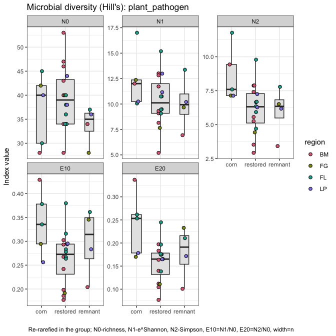
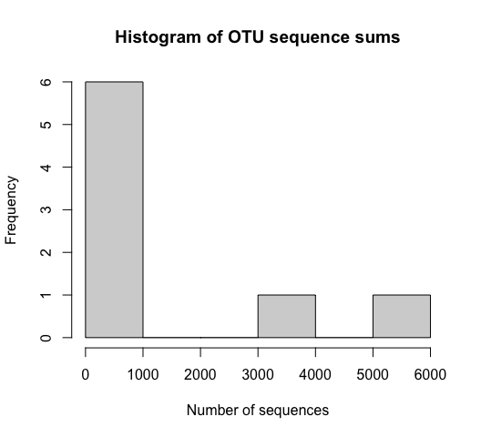

Microbial data: microbial guilds and taxonomy
================
Beau Larkin

Last updated: 12 March, 2023

- <a href="#description" id="toc-description">Description</a>
- <a href="#packages-and-libraries"
  id="toc-packages-and-libraries">Packages and libraries</a>
- <a href="#data" id="toc-data">Data</a>
  - <a href="#sites-species-tables"
    id="toc-sites-species-tables">Sites-species tables</a>
  - <a href="#species-metadata" id="toc-species-metadata">Species
    metadata</a>
  - <a href="#site-metadata-and-design"
    id="toc-site-metadata-and-design">Site metadata and design</a>
  - <a href="#joined-species-metadata-and-design-tables"
    id="toc-joined-species-metadata-and-design-tables">Joined species,
    metadata, and design tables</a>
- <a href="#functions" id="toc-functions">Functions</a>
  - <a href="#function-its-and-guilds"
    id="toc-function-its-and-guilds">Function: ITS and guilds</a>
  - <a href="#18s-based-data-amf" id="toc-18s-based-data-amf">18S-based data
    (AMF)</a>
  - <a href="#examine-change-over-time-in-guilds"
    id="toc-examine-change-over-time-in-guilds">Examine change over time in
    guilds</a>
  - <a href="#re-rarefy-in-guilds-or-groups"
    id="toc-re-rarefy-in-guilds-or-groups">Re-rarefy in guilds (or
    groups)</a>
  - <a href="#filter-to-guilds-or-taxonomic-groups"
    id="toc-filter-to-guilds-or-taxonomic-groups">Filter to guilds or
    taxonomic groups</a>
    - <a href="#calculate-hills-series-on-a-samples-species-matrix"
      id="toc-calculate-hills-series-on-a-samples-species-matrix">Calculate
      Hill’s series on a samples-species matrix</a>
    - <a href="#results-from-re-rarefied-data"
      id="toc-results-from-re-rarefied-data">Results from re-rarefied data</a>
  - <a href="#perform-indicator-species-analysis"
    id="toc-perform-indicator-species-analysis">Perform Indicator Species
    Analysis</a>
- <a href="#analysis-and-results" id="toc-analysis-and-results">Analysis
  and Results</a>
  - <a href="#its-sequences" id="toc-its-sequences">ITS sequences</a>
    - <a href="#composition-in-field-types"
      id="toc-composition-in-field-types">Composition in field types</a>
    - <a href="#soil-saprotrophs" id="toc-soil-saprotrophs">Soil
      saprotrophs</a>
    - <a href="#plant-pathogens" id="toc-plant-pathogens">Plant pathogens</a>
    - <a href="#wood-saprotrophs" id="toc-wood-saprotrophs">Wood
      saprotrophs</a>
    - <a href="#litter-saprotrophs" id="toc-litter-saprotrophs">Litter
      saprotrophs</a>
  - <a href="#amf" id="toc-amf">AMF</a>
    - <a href="#claroideoglomeraceae"
      id="toc-claroideoglomeraceae">Claroideoglomeraceae</a>
    - <a href="#paraglomeraceae" id="toc-paraglomeraceae">Paraglomeraceae</a>
    - <a href="#diversisporaceae"
      id="toc-diversisporaceae">Diversisporaceae</a>
    - <a href="#gigasporaceae" id="toc-gigasporaceae">Gigasporaceae</a>
- <a href="#conclusions-taxa-and-guilds"
  id="toc-conclusions-taxa-and-guilds">Conclusions: taxa and guilds</a>
- <a href="#appendix-rarefy-in-guilds"
  id="toc-appendix-rarefy-in-guilds">Appendix: Rarefy in guilds?</a>
  - <a href="#diversity-with-its-sequences"
    id="toc-diversity-with-its-sequences">Diversity with ITS sequences</a>

# Description

Sequence clusters identified in QIIME2 are annotated with taxonomic
information and metadata from [Fungal
traits](https://link.springer.com/article/10.1007/s13225-020-00466-2).
In this report, sequence abundances in taxonomic groups or fungal guilds
are compared across field types and with time since restoration.

The full sequence abundance tables were rarefied to make sequencing
depth equivalent across fields. This can result in lower-abundance OTUs
dropping to zero. Within guilds, loss of OTUs could change or bias
interpretations of richness, diversity, and composition. We tried using
raw sequence data and rarefying within guilds to address this problem,
but in each case the sequence depth was so small that additional OTUs
were lost and abundances were significantly lowered.

We may try a different approach which is described in [Semchenko et
al. 2018](https://www.science.org/doi/10.1126/sciadv.aau4578), but for
now, the analysis uses data from the entire rarefied tables for ITS and
18S sequences.

# Packages and libraries

``` r
packages_needed = c("tidyverse",
                    "knitr",
                    "conflicted",
                    "ggbeeswarm",
                    "colorspace",
                    "rsq",
                    "lme4",
                    "multcomp",
                    "indicspecies",
                    "GUniFrac",
                    "vegan")
packages_installed = packages_needed %in% rownames(installed.packages())
```

``` r
if (any(!packages_installed)) {
    install.packages(packages_needed[!packages_installed])
}
```

``` r
for (i in 1:length(packages_needed)) {
    library(packages_needed[i], character.only = T)
}
```

``` r
conflict_prefer("filter", "dplyr")
conflict_prefer("select", "dplyr")
```

# Data

## Sites-species tables

CSV files were produced in `process_data.R`

``` r
spe <- list(
    its_raw = read_csv(
        paste0(getwd(), "/clean_data/spe_ITS_raw.csv"),
        show_col_types = FALSE
    ),
    its_rfy = read_csv(
        paste0(getwd(), "/clean_data/spe_ITS_rfy.csv"),
        show_col_types = FALSE
    ),
    amf_raw = read_csv(
        paste0(getwd(), "/clean_data/spe_18S_raw.csv"),
        show_col_types = FALSE
    ),
    amf_rfy = read_csv(
        paste0(getwd(), "/clean_data/spe_18S_rfy.csv"),
        show_col_types = FALSE
    )
)
```

## Species metadata

Load taxonomy for all and guilds (`primary_lifestyle` in Fungal Traits)
for ITS OTUs.

``` r
meta <- list(
    its_raw = 
        read_csv(
            paste0(getwd(), "/clean_data/spe_ITS_raw_taxonomy.csv"),
            show_col_types = FALSE
        ),
    its_rfy = 
        read_csv(
            paste0(getwd(), "/clean_data/spe_ITS_rfy_taxonomy.csv"),
            show_col_types = FALSE
        ),
    amf_raw = 
        read_csv(
            paste0(getwd(), "/clean_data/spe_18S_raw_taxonomy.csv"),
            show_col_types = FALSE
        ),
    amf_rfy = 
        read_csv(
            paste0(getwd(), "/clean_data/spe_18S_rfy_taxonomy.csv"),
            show_col_types = FALSE
        )
)
```

## Site metadata and design

``` r
sites   <-
    read_csv(paste0(getwd(), "/clean_data/sites.csv"), show_col_types = FALSE) %>%
    mutate(
        field_type = factor(
            field_type,
            ordered = TRUE,
            levels = c("corn", "restored", "remnant")
        )) %>%
    select(-lat, -long, -yr_restore, -yr_rank) %>% 
    arrange(field_key)
```

## Joined species, metadata, and design tables

Functions streamline this process

``` r
join_spe_meta <-
    function(spe, meta) {
        spe %>%
            pivot_longer(starts_with("otu"),
                         names_to = "otu_num",
                         values_to = "seq_abund") %>%
            filter(seq_abund != 0) %>%
            left_join(meta, by = join_by(otu_num)) %>%
            left_join(sites, by = join_by(field_key))
    }
```

``` r
spe_meta <- list(
    its_raw = 
        join_spe_meta(spe$its_raw, meta$its_raw) %>%
        write_csv(paste0(getwd(), "/clean_data/speTaxa_ITS_raw.csv")),
    its_rfy = 
        join_spe_meta(spe$its_rfy, meta$its_rfy) %>%
        write_csv(paste0(getwd(), "/clean_data/speTaxa_ITS_rfy.csv")),
    amf_raw = 
        join_spe_meta(spe$amf_raw, meta$amf_raw) %>%
        write_csv(paste0(getwd(), "/clean_data/speTaxa_18S_raw.csv")),
    amf_rfy = 
        join_spe_meta(spe$amf_rfy, meta$amf_rfy) %>%
        write_csv(paste0( getwd(), "/clean_data/speTaxa_18S_rfy.csv" ))
)
```

# Functions

Functions streamline data processing, model fitting, and results output.
\### Function: ITS taxonomy This function simplifies and displays the
sequence distribution among taxa and across primary lifestyles. Use the
argument `other_threshold` to choose a small (e.g., 2, the default)
cutoff, below which orders are relabeled as “other”.

``` r
its_taxaGuild <- function(data, other_threshold=2) {
    # What is the distribution among site types at the class level?
    taxonomy_df <-
        data %>%
        group_by(phylum, order, field_type, field_name) %>%
        summarize(abund = sum(seq_abund), .groups = "drop") %>%
        group_by(phylum, order, field_type) %>%
        summarize(mean = mean(abund) %>% round(., 2),
                  .groups = "drop") %>%
        pivot_wider(
            names_from = field_type,
            values_from = mean,
            values_fill = 0
        ) %>%
        select(phylum, order, corn, restored, remnant) %>%
        arrange(-remnant)
    print(kable(
        taxonomy_df,
        format = "pandoc",
        caption = "Distribution of ITS OTUs in classes; mean sequence abundance by field type"
    ))
    # What is the distribution of `primary_lifestyles` among site types?
    guild_df <-
        data %>%
        group_by(primary_lifestyle, field_type, field_name) %>%
        summarize(abund = sum(seq_abund), .groups = "drop") %>%
        group_by(primary_lifestyle, field_type) %>%
        summarize(mean = round(mean(abund), 1), .groups = "drop") %>%
        pivot_wider(
            names_from = field_type,
            values_from = mean,
            values_fill = 0
        ) %>%
        select(primary_lifestyle, corn, restored, remnant) %>%
        mutate(total = corn+restored+remnant) %>% 
        arrange(-total)
    # Create table
    table <- kable(guild_df, format = "pandoc",
        caption = "Distribution of ITS OTUs by Fungal Trait 'primary_lifestyle'; mean sequence abundance by field type")
    # Plot the most abundant orders across field types
    plot_orders <- 
        data %>% 
        filter(order != is.na(order), order != "unidentified") %>% 
        group_by(field_type, order, field_key) %>% 
        summarize(seq_sum = sum(seq_abund), .groups = "drop_last") %>% 
        summarize(seq_avg = mean(seq_sum), .groups = "drop_last") %>% 
        mutate(seq_comp = (seq_avg / sum(seq_avg)) * 100,
               order = replace(order, which(seq_comp < 2), paste0("Other (OTU<", other_threshold, "%)"))) %>% 
        group_by(field_type, order) %>% 
        summarize(seq_comp = sum(seq_comp), .groups = "drop") %>% 
        ggplot(., aes(x = field_type, y = seq_comp)) +
        geom_col(aes(fill = order), color = "black") +
        labs(x = "", y = "Proportion of sequence abundance",
             title = "Composition of fungi by order") +
        scale_fill_discrete_sequential(name = "Order", palette = "Plasma") +
        theme_classic()
    # Plot the composition of primary lifestyles
    plot_guilds <- 
        data %>% 
        filter(primary_lifestyle != is.na(primary_lifestyle)) %>% 
        group_by(field_type, primary_lifestyle, field_key) %>% 
        summarize(seq_sum = sum(seq_abund), .groups = "drop_last") %>% 
        summarize(seq_avg = mean(seq_sum), .groups = "drop_last") %>% 
        mutate(seq_comp = (seq_avg / sum(seq_avg)) * 100,
               primary_lifestyle = replace(primary_lifestyle, which(seq_comp < 2), paste0("Other (OTU<", other_threshold, "%)"))) %>% 
        group_by(field_type, primary_lifestyle) %>% 
        summarize(seq_comp = sum(seq_comp), .groups = "drop") %>% 
        ggplot(., aes(x = field_type, y = seq_comp)) +
        geom_col(aes(fill = primary_lifestyle), color = "black") +
        labs(x = "", y = "Proportion of sequence abundance",
             title = "Composition of fungi by primary lifestyle") +
        scale_fill_discrete_sequential(name = "Primary lifestyle", palette = "Inferno") +
        theme_classic()
    
    print(list(table,
               plot_orders,
               plot_guilds))
    
}
```

### Function: ITS and guilds

Several primary lifestyles have been chosen from Fungal Traits for
further examination. These lifestyles were the largest by sequence
abundance and thought to be most informative given the habitat and
questions applied.

This function filters those groups and tests them among field types.
These tests aren’t technically valid due to pseudoreplication, but this
analysis can help us find trends worthy of further study.

``` r
its_test_taxaGuild <- function(data) {
    pl <- c("soil_saprotroph", "plant_pathogen", "ectomycorrhizal", "wood_saprotroph", "litter_saprotroph")
    df1 <- data.frame()
    for (i in 1:length(pl)) {
        cat("---------------------------------\n")
        print(pl[i])
        cat("---------------------------------\n")
        mod_data <- data %>%
            filter(primary_lifestyle == pl[i]) %>%
            group_by(field_type, region, field_name, yr_since, primary_lifestyle) %>%
            summarize(seq_sum = sum(seq_abund), .groups = "drop")
        print(kable(mod_data %>% arrange(-seq_sum), format = "pandoc"))
        cat("----------------------------------------------------\n\n")
        mmod <-
            lmer(seq_sum ~ field_type + (1 | region),
                 data = mod_data,
                 REML = FALSE)
        print(mmod)
        cat("----------------------------------------------------\n\n")
        mmod_null <-
            lmer(seq_sum ~ 1 + (1 | region),
                 data = mod_data,
                 REML = FALSE)
        print(mmod_null)
        cat("----------------------------------------------------\n\n")
        print(anova(mmod, mmod_null))
        cat("----------------------------------------------------\n\n")
        mod_tuk <-
            glht(mmod,
                 linfct = mcp(field_type = "Tukey"),
                 test = adjusted("holm"))
        print(summary(mod_tuk))
        print(cld(mod_tuk))
        cat("----------------------------------------------------\n\n")
        print(paste(
            "Years since restoration and",
            pl[i],
            "sequence abundance in Blue Mounds Area"
        ))
        mod_data2 <- mod_data %>%
            filter(region == "BM", field_type == "restored")
        print(summary(lm(seq_sum ~ yr_since,
                         data = mod_data2)))
        cat("\n\n\n")
        df1 <- rbind(df1, mod_data)
    }
    
    return(df1)
    
}
```

## 18S-based data (AMF)

This function simplifies and displays taxonomic information about the
AMF OTUs.

``` r
amf_tax <- function(data) {
    cat("---------------------------------\n")
    print(paste("AMF"))
    cat("---------------------------------\n")
    amf_df <-
        data %>%
        group_by(family, field_type, region, field_name, yr_since) %>%
        summarize(seq_sum = sum(seq_abund) %>% round(., 1),
                  .groups = "drop")
    amf_df_summary <-
        amf_df %>%
        group_by(family, field_type) %>%
        summarize(seq_avg = mean(seq_sum) %>% round(., 1),
                  .groups = "drop") %>%
        pivot_wider(
            names_from = field_type,
            values_from = seq_avg,
            names_sort = TRUE,
            values_fill = 0
        ) %>%
        arrange(-remnant)
    
    print(kable(amf_df_summary, format = "pandoc"))
    
    cat("\n---------------------------------\n")
    print("Compare abundances across field types with mixed model")
    cat("---------------------------------\n")
    test_families <-
        amf_df %>% 
        count(region, family, field_type) %>% 
        count(region, family) %>% 
        filter(n == 3) %>% 
        pull(family) %>% 
        unique()
    for (i in 1:length(test_families)) {
        cat("\n---------------------------------\n")
        print(test_families[i])
        cat("---------------------------------\n")
        mmod <-
            lmer(
                seq_sum ~ field_type + (1 | region),
                data = amf_df %>% filter(family == test_families[i]),
                REML = FALSE
            )
        print(mmod)
        cat("----------------------------------------------------\n\n")
        mmod_null <-
            lmer(
                seq_sum ~ 1 + (1 | region),
                data = amf_df %>% filter(family == test_families[i]),
                REML = FALSE
            )
        print(mmod_null)
        cat("----------------------------------------------------\n\n")
        print(anova(mmod, mmod_null))
        cat("----------------------------------------------------\n\n")
        mod_tuk <-
            glht(mmod,
                 linfct = mcp(field_type = "Tukey"),
                 test = adjusted("holm"))
        print(summary(mod_tuk))
        print(cld(mod_tuk))
        cat("\n")
    }
    cat("\n---------------------------------\n")
    print("Test abundances with years since restoration")
    cat("---------------------------------\n")
    all7 <-
        amf_df %>%
        filter(field_type == "restored", region == "BM") %>%
        count(family) %>%
        filter(n == 7) %>%
        pull(family)
    mod_data <-
        amf_df %>%
        filter(field_type == "restored", region == "BM", family %in% all7)
    for (i in 1:length(all7)) {
        print(all7[i])
        print(summary(lm(
            seq_sum ~ yr_since, data = mod_data %>% filter(family == all7[i])
        )))
    }
    return(amf_df)
}
```

## Examine change over time in guilds

Function `guiltime()` filters ITS data to a user-specified guild and
produces linear models and plots of change in sequence abundance over
time since restoration in Blue Mounds and Fermilab.

``` r
guiltime <- function(pl) {
    d <- spe_meta$its_rfy %>%
        filter(
            primary_lifestyle == pl,
            region %in% c("BM", "FL"),
            field_type == "restored"
        ) %>% 
        group_by(field_key, field_name, region, yr_since) %>% 
        summarize(seq_sum = sum(seq_abund), .groups = "drop")
    
    bm <- summary(
        lm(seq_sum ~ yr_since, data = d %>% filter(region == "BM"))
    )
    fl <- summary(
        lm(seq_sum ~ yr_since, data = d %>% filter(region == "FL"))
    )
    
    fits <- data.frame(
        rbind(BM = c(coef(bm)[1,1], coef(bm)[2,1], coef(bm)[2,4]),
              FL = c(coef(fl)[1,1], coef(fl)[2,1], coef(fl)[2,4]))) %>% 
        mutate(lty = case_when(X3 < 0.05 ~ "a", TRUE ~ NA_character_)) %>% 
        rownames_to_column(var = "region")
    plot <- 
        ggplot(d, aes(x = yr_since, y = seq_sum)) +
        facet_wrap(vars(region), scales = "free_y") +
        geom_point() +
        geom_abline(data = fits, aes(slope = X2, intercept = X1, linetype = lty), color = "blue") +
        labs(x = "Years since restoration", 
             y = "Sum of ITS sequences",
             caption = "Solid line, if present, shows linear relationship at p<0.05") +
        theme_bw() +
        theme(legend.position = "none")
    
    out <- list(
        bm_summary = bm,
        fl_summary = fl,
        plot = plot
    )
    
    print(out)
    
}
```

## Re-rarefy in guilds (or groups)

To examine richness and composition within subgroups of OTUs, the raw
sequence data should be re-rarefied within those groups. Otherwise,
especially with low-abundance groups, data and sites may have been lost
when the entire species matrix was rarefied. This function automates the
process.

Outputs are:

1.  Sequencing depth used for the subset of OTUs
2.  Number of OTUs excluded by rarefying
3.  The re-rarefied samples-species matrix
4.  The OTU list in long form, with abundances, species, and site
    metadata

``` r
rerare <- function(spe, meta, grp_var, grp, site) {
    # spe       = species matrix with raw abundances
    # meta      = species metadata matching the OTU list with raw abundances
    # grp_var   = variable name from `meta` desired for grouping and filtering
    #             the OTUs (e.g., `primary_lifestyle`, `family`)
    # grp       = string or factor level name of the group desired from `grp_var`
    # site      = site metadata to combine with sequence abundance long-form
    #             output table
    
    grp_var <- enquo(grp_var)
    
    data <- 
        spe %>% 
        column_to_rownames(var = "field_key") %>% 
        t() %>% 
        as.data.frame() %>% 
        rownames_to_column(var = "otu_num") %>% 
        as_tibble() %>% 
        left_join(meta, by = join_by(otu_num)) %>% 
        filter(!!grp_var == grp) %>% 
        column_to_rownames(var = "otu_num") %>% 
        select(-colnames(meta)[-1]) %>% 
        t() %>% 
        as.data.frame()
    
    depth <- min(rowSums(data))
    rfy <- Rarefy(data)
    zero_otu <- which(apply(rfy$otu.tab.rff, 2, sum) == 0)
    rrfd <- data.frame(rfy$otu.tab.rff[, -zero_otu]) %>%
        rownames_to_column(var = "field_key") %>%
        mutate(field_key = as.numeric(field_key)) %>% 
        arrange(field_key) %>% 
        as_tibble()
    
    rrfd_speTaxa <- 
        rrfd %>% 
        pivot_longer(cols = starts_with("otu"), 
                     names_to = "otu_num", 
                     values_to = "seq_abund") %>% 
        filter(seq_abund > 0) %>% 
        left_join(meta, by = join_by(otu_num)) %>% 
        left_join(site, by = join_by(field_key)) %>% 
        select(-otu_ID)
    
    return(list(
        seq_depth = depth,
        zero_otu_num = length(zero_otu),
        rrfd = rrfd,
        rrfd_speTaxa = rrfd_speTaxa
    ))
    
}
```

## Filter to guilds or taxonomic groups

To examine richness and composition within subgroups of OTUs, the
rarefied table must be transposed, filtered, and transposed back. The
function `filgu()` or “filter guilds” automates this process.

Outputs are:

1.  The resulting samples-species matrix
2.  Sequence abundances in long-form, with site and species metadata

Note that this function isn’t necessary. Everything produced here can be
done with the `spe_meta$..._rfy` tables. But I’m keeping this path going
for now in case we need to switch back to rarefying within groups again.

``` r
filgu <- function(spe, meta, grp_var, grp, site) {
    # spe       = species matrix with raw abundances
    # meta      = species metadata matching the OTU list with raw abundances
    # grp_var   = variable name from `meta` desired for grouping and filtering
    #             the OTUs (e.g., `primary_lifestyle`, `family`)
    # grp       = string or factor level name of the group desired from `grp_var`
    # site      = site metadata to combine with sequence abundance long-form
    #             output table
    
    grp_var <- enquo(grp_var)
    
    filspe <- 
        spe %>% 
        column_to_rownames(var = "field_key") %>% 
        t() %>% 
        as.data.frame() %>% 
        rownames_to_column(var = "otu_num") %>% 
        as_tibble() %>% 
        left_join(meta, by = join_by(otu_num)) %>% 
        filter(!!grp_var == grp) %>% 
        column_to_rownames(var = "otu_num") %>% 
        select(-colnames(meta)[-1]) %>% 
        t() %>% 
        as.data.frame() %>%
        rownames_to_column(var = "field_key") %>%
        mutate(field_key = as.numeric(field_key)) %>% 
        arrange(field_key) %>% 
        as_tibble()
    
    cs <- colSums(filspe %>% select(-field_key))
    rs <- rowSums(filspe %>% select(-field_key))
    
    hist(cs,
         breaks = length(cs),
         main = "Histogram of OTU sequence sums",
         xlab = "Number of sequences")
    
    hist(rs,
         breaks = length(rs),
         main = "Histogram of sequence abundance in samples",
         xlab = "Number of sequences")
    
    filspeTaxa <- 
        filspe %>% 
        pivot_longer(cols = starts_with("otu"), 
                     names_to = "otu_num", 
                     values_to = "seq_abund") %>% 
        filter(seq_abund > 0) %>% 
        left_join(meta, by = join_by(otu_num)) %>% 
        left_join(site, by = join_by(field_key)) %>% 
        select(-otu_ID)
    
    print(list(
        OTUs_n = length(cs),
        Sites_n = length(which(rs > 0))
    ))
    
    return(list(
        filspe = filspe,
        filspeTaxa = filspeTaxa
    ))
    
}
```

### Calculate Hill’s series on a samples-species matrix

The objects `$rrfd` from **rerare()** or `$filspe` from **filgu()** can
be passed to this function

``` r
calc_diversity <- function(spe) {
    spe_mat <- data.frame(spe, row.names = 1)
    
    N0  <- apply(spe_mat > 0, MARGIN = 1, FUN = sum)
    N1  <- exp(diversity(spe_mat))
    N2  <- diversity(spe_mat, "inv")
    E10 <- N1 / N0
    E20 <- N2 / N0
    
    return(
        data.frame(N0, N1, N2, E10, E20) %>%
            rownames_to_column(var = "field_key") %>%
            mutate(field_key = as.integer(field_key)) %>%
            left_join(sites, by = join_by(field_key)) %>%
            pivot_longer(
                cols = N0:E20,
                names_to = "hill_index",
                values_to = "value"
            ) %>%
            mutate(hill_index = factor(
                hill_index,
                ordered = TRUE,
                levels = c("N0", "N1", "N2", "E10", "E20")
            ))
    )
}
```

### Results from re-rarefied data

After re-rarefying into a guild (or taxonomic group), produce diversity
statistics and calculate percent composition; display results. For
plotting, it’s convenient to limit the number of taxonomic orders
displayed. Use the argument `other_threshold` to choose a small (e.g.,
2, the default) cutoff, below which orders are relabeled as “other”.

``` r
gudicom <- function(div, rrfd, grp_var, gene="its", other_threshold=2) {
    hillfield <-     
        ggplot(div, aes(x = field_type, y = value)) +
        facet_wrap(vars(hill_index), scales = "free_y") +
        geom_boxplot(varwidth = TRUE, fill = "gray90", outlier.shape = NA) +
        geom_beeswarm(aes(fill = region), shape = 21, size = 2, dodge.width = 0.2) +
        labs(x = "", y = "Index value", title = paste("Microbial diversity (Hill's):", grp_var),
             caption = "Re-rarefied in the group; N0-richness, N1-e^Shannon, N2-Simpson, E10=N1/N0, E20=N2/N0, width=n") +
        scale_fill_discrete_qualitative(palette = "Dark3") +
        theme_bw()
    hilltime <- 
        div %>% 
        filter(field_type == "restored", region %in% c("BM", "FL")) %>% 
        ggplot(aes(x = yr_since, y = value)) +
        facet_grid(rows = vars(hill_index), cols = vars(region), scales = "free") +
        geom_smooth(method = "lm") +
        geom_point() +
        labs(x = "Years since restoration", y = "Index value", title = paste("Microbial diversity (Hill's) in restored fields:", grp_var),
             caption = "Re-rarefied in the group; N0-richness, N1-e^Shannon, N2-Simpson, E10=N1/N0, E20=N2/N0, width=n") +
        theme_bw()
    if(gene == "its") {
        comp_ft <- 
            rrfd %>% 
            filter(order != is.na(order), order != "unidentified") %>% 
            group_by(field_type, order, field_key) %>% 
            summarize(seq_sum = sum(seq_abund), .groups = "drop_last") %>% 
            summarize(seq_avg = mean(seq_sum), .groups = "drop_last") %>% 
            mutate(seq_comp = (seq_avg / sum(seq_avg)) * 100,
                   order = replace(order, which(seq_comp < other_threshold), paste0("Other (OTU<", other_threshold, "%)"))) %>% 
            group_by(field_type, order) %>% 
            summarize(seq_comp = sum(seq_comp), .groups = "drop")
        comp_ft_plot <-
            ggplot(comp_ft, aes(x = field_type, y = seq_comp)) +
            geom_col(aes(fill = order), color = "black") +
            labs(x = "", y = "Proportion of sequence abundance",
                 title = paste("Composition of", grp_var)) +
            scale_fill_discrete_sequential(name = "Order", palette = "Plasma") +
            theme_classic()
        
        yr_fct <- 
            sites %>% 
            filter(field_type == "restored") %>% 
            select(field_key, yr_since) %>% 
            arrange(yr_since) %>% 
            mutate(yr_fct = factor(yr_since, ordered = TRUE))
        comp_yr <- 
            rrfd %>% 
            filter(order != is.na(order), 
                   order != "unidentified",
                   field_type == "restored",
                   region == "BM") %>% 
            group_by(field_key, order) %>% 
            summarize(seq_sum = sum(seq_abund), .groups = "drop_last") %>% 
            mutate(seq_comp = (seq_sum / sum(seq_sum)) * 100,
                   order = replace(order, which(seq_comp < other_threshold), paste0("Other (OTU<", other_threshold, "%)"))) %>% 
            left_join(yr_fct, by = join_by(field_key))
        comp_yr_plot <-
            ggplot(comp_yr, aes(x = yr_fct, y = seq_comp)) +
            geom_col(aes(fill = order), color = "black") +
            labs(x = "Years since restoration", y = "Proportion of sequence abundance",
                 title = paste("Composition of", grp_var, "in the Blue Mounds area")) +
            scale_fill_discrete_sequential(name = "Order", palette = "Plasma") +
            theme_classic()
        
        print(list(
            Hills_field_type = hillfield,
            Hills_yrs_since_restoration = hilltime,
            Composition_field_type = comp_ft_plot,
            Composition_yr_since = comp_yr_plot
        ))
        
        return(list(comp_ft, comp_yr))
        
    } else {
        print(list(
            Hills_field_type = hillfield,
            Hills_yrs_since_restoration = hilltime
        ))
    }
    
}
```

## Perform Indicator Species Analysis

Function `inspan()` takes a combined species and sites data frame and
wrangles it through the analysis to filter OTUs for indicators of field
types. The output is top candidate OTUs joined with species metadata for
further analysis.

``` r
inspan <- function(data, np, meta) {
    # data is the samples-species matrix joined with the sites data frame
    # the join aligns the grouping vector with field numbers
    # np is the desired number of permutations
    # meta is the appropriate species metadata table for the original data
    spe <- data.frame(
        data %>% select(field_key, starts_with("otu")),
        row.names = 1
    )
    grp = data$field_type
    mp <- multipatt(
        spe, 
        grp, 
        max.order = 1, 
        control = how(nperm = np))
    si <- mp$sign %>% 
        select(index, stat, p.value) %>% 
        mutate(field_type = case_when(index == 1 ~ "corn", 
                                      index == 2 ~ "restored", 
                                      index == 3 ~ "remnant")) %>% 
        filter(p.value < 0.05) %>% 
        rownames_to_column(var = "otu_num") %>%
        select(-index) %>% 
        as_tibble()
    A  <- mp$A %>% 
        as.data.frame() %>% 
        rownames_to_column(var = "otu_num") %>% 
        pivot_longer(cols = corn:remnant, 
                     names_to = "field_type", 
                     values_to = "A")
    B <- mp$B %>% 
        as.data.frame() %>% 
        rownames_to_column(var = "otu_num") %>% 
        pivot_longer(cols = corn:remnant, 
                     names_to = "field_type", 
                     values_to = "B")
    out <- 
        si %>% 
        left_join(A, by = join_by(otu_num, field_type)) %>% 
        left_join(B, by = join_by(otu_num, field_type)) %>% 
        left_join(meta %>% select(-otu_ID), by = join_by(otu_num)) %>% 
        select(otu_num, A, B, stat, p.value, 
               field_type, primary_lifestyle, everything()) %>% 
        arrange(field_type, -stat)
    
    return(out)
    
}
```

# Analysis and Results

## ITS sequences

Recall the number of OTUs recovered in each dataset. The effect of
rarefying did not change richness or diversity very much.

``` r
# Number of OTUs in raw and rarefied datasets
Map(function(x) ncol(x)-1, spe[1:2])
```

    ## $its_raw
    ## [1] 2795
    ## 
    ## $its_rfy
    ## [1] 2752

### Composition in field types

Function outputs are verbose, but details may be necessary later so they
are displayed here.

``` r
its_taxaGuild(spe_meta$its_rfy)
```

    ## 
    ## 
    ## Table: Distribution of ITS OTUs in classes; mean sequence abundance by field type
    ## 
    ## phylum                             order                                        corn   restored   remnant
    ## ---------------------------------  --------------------------------------  ---------  ---------  --------
    ## Ascomycota                         Hypocreales                               7322.00    6217.19   6916.25
    ## Ascomycota                         Chaetothyriales                            619.20    5575.44   5819.00
    ## Basidiomycota                      Agaricales                                2758.60    2083.25   4981.00
    ## Ascomycota                         Pleosporales                              6381.20    6395.75   4914.00
    ## Ascomycota                         Sordariales                              10391.60    4308.12   3335.50
    ## Ascomycota                         Helotiales                                2654.20    3264.75   3216.75
    ## Ascomycota                         NA                                        1277.80    2368.75   2903.25
    ## NA                                 NA                                        1228.40    1912.00   2309.50
    ## Ascomycota                         Onygenales                                  72.20    1270.56   2064.00
    ## Mortierellomycota                  Mortierellales                            3279.80    2561.31   1635.00
    ## Basidiomycota                      Thelephorales                                2.00      26.00   1030.75
    ## Ascomycota                         Geoglossales                                 5.33    1459.42    911.75
    ## Ascomycota                         GS34                                         0.00      70.33    689.00
    ## Ascomycota                         Glomerellales                             1740.20    1112.00    664.00
    ## Ascomycota                         unidentified                                 0.00     823.87    611.50
    ## Basidiomycota                      Cantharellales                             265.60     757.12    557.75
    ## Glomeromycota                      Glomerales                                  84.00     417.44    429.00
    ## Ascomycota                         Coniochaetales                             702.60     162.56    307.50
    ## Ascomycota                         Sordariomycetes_ord_Incertae_sedis          36.00      50.38    231.00
    ## Basidiomycota                      Russulales                                   3.00       3.50    180.67
    ## Ascomycota                         Xylariales                                  66.40     286.00    169.75
    ## Basidiomycota                      NA                                          78.60     550.06    166.00
    ## Ascomycota                         Pezizales                                  927.40     308.94    163.50
    ## Basidiomycota                      Sebacinales                                 27.00     624.81    160.50
    ## Ascomycota                         Capnodiales                                544.60     513.38    153.75
    ## Ascomycota                         Magnaporthales                              74.00     120.06    153.00
    ## Basidiomycota                      Boletales                                    5.50       9.00    143.50
    ## Glomeromycota                      NA                                           5.00     145.77    129.33
    ## Ascomycota                         Minutisphaerales                             0.00      56.00    105.00
    ## Ascomycota                         Chaetosphaeriales                          269.25     254.33    104.00
    ## Mucoromycota                       NA                                           0.00      22.00     86.00
    ## Ascomycota                         Branch06                                    11.50     132.71     85.00
    ## Basidiomycota                      Tremellales                                 15.50      91.81     78.00
    ## Basidiomycota                      Trichosporonales                           111.00      40.22     74.67
    ## Basidiomycota                      Auriculariales                             113.75     221.38     74.50
    ## Ascomycota                         Mytilinidales                                0.00       0.00     71.00
    ## Chytridiomycota                    Spizellomycetales                          158.20      87.20     70.25
    ## Ascomycota                         Thelebolales                                91.00      34.62     66.75
    ## Basidiomycota                      Filobasidiales                             810.25     287.79     66.33
    ## Mucoromycota                       Umbelopsidales                               0.00       1.00     66.00
    ## Basidiomycota                      Cystofilobasidiales                       2244.80      84.23     64.50
    ## Ascomycota                         Mytilinidiales                               0.00      10.67     62.00
    ## Basidiomycota                      Hymenochaetales                             11.60     176.21     60.50
    ## Ascomycota                         Dothideomycetes_ord_Incertae_sedis           0.00       0.00     51.00
    ## Chytridiomycota                    Rhizophlyctidales                          209.40     106.53     50.25
    ## Ascomycota                         Venturiales                                 30.67      72.38     46.33
    ## Basidiomycota                      Ustilaginales                                3.00      85.00     45.00
    ## Ascomycota                         Verrucariales                                0.00       0.00     43.00
    ## Basidiomycota                      Tremellodendropsidales                       7.00      28.15     33.00
    ## Ascomycota                         Orbiliales                                  23.00      81.00     31.00
    ## Basidiomycota                      Geminibasidiales                            32.00      75.50     30.00
    ## Basidiomycota                      Atheliales                                   0.00     149.00     29.50
    ## Basidiomycota                      Polyporales                                 19.00      27.00     29.50
    ## Ascomycota                         Tubeufiales                                 69.80     165.50     25.50
    ## Ascomycota                         Saccharomycetales                          262.50      38.00     25.33
    ## Ascomycota                         Microascales                               107.40      70.18     24.67
    ## Basidiomycota                      Trechisporales                             119.40     363.06     24.67
    ## Basidiomycota                      Erythrobasidiales                            0.00       4.80     23.00
    ## Chytridiomycota                    Chytridiales                                 2.00      87.50     23.00
    ## Ascomycota                         Myrmecridiales                               0.00      68.75     21.00
    ## Rozellomycota                      GS11                                         0.00       2.00     20.00
    ## Basidiomycota                      Phallales                                  216.50      43.00     19.33
    ## Ascomycota                         GS32                                         0.00       0.00     16.00
    ## Chytridiomycota                    Rhizophydiales                              20.75      15.50     16.00
    ## Ascomycota                         Diaporthales                               116.75       9.86     14.50
    ## Ascomycota                         Eurotiales                                 109.40      36.53     14.50
    ## Ascomycota                         Savoryellales                               15.50      15.67     13.50
    ## Ascomycota                         Ostropales                                   0.00      46.00     13.00
    ## Ascomycota                         Archaeorhizomycetales                        0.00      31.57     11.00
    ## Glomeromycota                      Archaeosporales                              3.00      10.00     11.00
    ## Ascomycota                         Acrospermales                                0.00       8.00     10.00
    ## Basidiomycota                      Leucosporidiales                            33.33       8.29      8.00
    ## Mortierellomycota                  NA                                           0.00       4.00      8.00
    ## Basidiomycota                      Geastrales                                  46.00      51.17      7.00
    ## Chlorophyta                        Chaetopeltidales                            11.50       5.80      7.00
    ## Ascomycota                         Dothideales                                  0.00      28.88      6.50
    ## Basidiomycota                      Microbotryomycetes_ord_Incertae_sedis        7.67      11.50      5.50
    ## Ascomycota                         Rhytismatales                                0.00       3.00      5.00
    ## Basidiobolomycota                  Basidiobolales                               8.00      16.00      5.00
    ## Chlorophyta                        NA                                           8.00       6.00      5.00
    ## Basidiomycota                      unidentified                                12.00     121.25      4.50
    ## Basidiomycota                      Agaricomycetes_ord_Incertae_sedis            0.00       0.00      4.00
    ## Anthophyta                         Poales                                       3.00       4.00      3.00
    ## Ascomycota                         Candelariales                                0.00       3.00      3.00
    ## Basidiomycota                      Atractiellales                              13.00       0.00      3.00
    ## Glomeromycota                      Diversisporales                              0.00       6.75      3.00
    ## Entorrhizomycota                   Entorrhizales                                0.00       0.00      2.00
    ## Ichthyosporia_phy_Incertae_sedis   unidentified                                 0.00       0.00      2.00
    ## Mucoromycota                       Mucorales                                    0.00       5.83      2.00
    ## Anthophyta                         Asterales                                    0.00       6.00      0.00
    ## Anthophyta                         Brassicales                                  8.00       5.00      0.00
    ## Anthophyta                         Commelinales                                 4.00     253.00      0.00
    ## Anthophyta                         Fabales                                      0.00      13.50      0.00
    ## Ascomycota                         Boliniales                                  38.50      44.50      0.00
    ## Ascomycota                         Botryosphaeriales                           16.00      19.60      0.00
    ## Ascomycota                         Jahnulales                                   8.00       0.00      0.00
    ## Ascomycota                         Pezizomycotina_ord_Incertae_sedis           30.50     501.00      0.00
    ## Ascomycota                         Phacidiales                                  0.00       6.00      0.00
    ## Ascomycota                         Phomatosporales                            646.00      11.67      0.00
    ## Ascomycota                         Trichosphaeriales                            4.00      21.20      0.00
    ## Basidiomycota                      Agaricostilbales                             2.00       0.00      0.00
    ## Basidiomycota                      Corticiales                                  0.00      44.43      0.00
    ## Basidiomycota                      Cystobasidiales                             37.00      10.00      0.00
    ## Basidiomycota                      Entylomatales                                0.00      10.80      0.00
    ## Basidiomycota                      Holtermanniales                              3.33      13.00      0.00
    ## Basidiomycota                      Kriegeriales                                 2.00       4.00      0.00
    ## Basidiomycota                      Platygloeales                                0.00      46.25      0.00
    ## Basidiomycota                      Pucciniales                                  0.00       6.00      0.00
    ## Basidiomycota                      Sporidiobolales                             41.00      16.75      0.00
    ## Basidiomycota                      Tilletiales                                  0.00      15.50      0.00
    ## Basidiomycota                      Urocystidales                               58.00       4.25      0.00
    ## Calcarisporiellomycota             Calcarisporiellales                          0.00       2.00      0.00
    ## Cercozoa                           unidentified                                 6.00       2.00      0.00
    ## Chlorophyta                        Chaetophorales                               0.00      22.33      0.00
    ## Chlorophyta                        Chlorellales                                 0.00       3.00      0.00
    ## Chlorophyta                        Sphaeropleales                               0.00       5.00      0.00
    ## Chytridiomycota                    unidentified                                 9.00       0.00      0.00
    ## Chytridiomycota                    NA                                          14.00      12.00      0.00
    ## Glomeromycota                      Paraglomerales                               0.00      16.00      0.00
    ## Glomeromycota                      unidentified                                 2.00      20.80      0.00
    ## Haplosporidia                      Haplosporidia_ord_Incertae_sedis             2.67      13.00      0.00
    ## Mucoromycota                       GS22                                         0.00       4.00      0.00
    ## [[1]]
    ## 
    ## 
    ## Table: Distribution of ITS OTUs by Fungal Trait 'primary_lifestyle'; mean sequence abundance by field type
    ## 
    ## primary_lifestyle            corn   restored   remnant     total
    ## -----------------------  --------  ---------  --------  --------
    ## NA                        20205.4    24808.4   27174.5   72188.3
    ## plant_pathogen             7065.4     7160.4    5616.8   19842.6
    ## soil_saprotroph            7047.2     5718.2    6056.2   18821.6
    ## wood_saprotroph            2852.6     2280.7    1115.5    6248.8
    ## dung_saprotroph            2727.6     1560.7     952.5    5240.8
    ## litter_saprotroph          2072.0     1435.8    1127.2    4635.0
    ## mycoparasite               1843.6      599.4     220.2    2663.2
    ## animal_parasite             652.4     1083.4     657.8    2393.6
    ## ectomycorrhizal              11.0      146.8    1963.5    2121.3
    ## unspecified_saprotroph      770.0      160.3     181.5    1111.8
    ## root_endophyte               13.7      332.3     136.8     482.8
    ## arbuscular_mycorrhizal       56.0      189.1     161.2     406.3
    ## pollen_saprotroph           148.6       74.2      55.5     278.3
    ## lichenized                    0.0       88.0      13.0     101.0
    ## nectar/tap_saprotroph        37.0       35.6      25.3      97.9
    ## lichen_parasite              16.0       54.9      22.0      92.9
    ## foliar_endophyte              3.0       34.5       7.0      44.5
    ## epiphyte                      0.0        9.0      26.0      35.0
    ## unspecified_pathotroph        0.0       13.0      10.0      23.0
    ## algal_parasite                2.0        3.8       0.0       5.8
    ## 
    ## [[2]]


    ## 
    ## [[3]]


The top guilds are:

1.  NA
2.  plant pathogens
3.  soil saprotrophs
4.  wood saprotrophs
5.  dung saprotrophs
6.  litter saprotrophs

Compared with the sequence abundance in the NA group, plant pathogens
and soil saprotrophs are abundant enough to feel somewhat confident
about in terms of coverage.

``` r
its_rfy_guilds <- its_test_taxaGuild(spe_meta$its_rfy)
```

    ## ---------------------------------
    ## [1] "soil_saprotroph"
    ## ---------------------------------
    ## 
    ## 
    ## field_type   region   field_name    yr_since  primary_lifestyle    seq_sum
    ## -----------  -------  -----------  ---------  ------------------  --------
    ## corn         FL       FLC2                 0  soil_saprotroph        11940
    ## restored     BM       KORP1               28  soil_saprotroph        10629
    ## remnant      LP       LPREM1              NA  soil_saprotroph        10298
    ## restored     FL       FLRSP1              10  soil_saprotroph         9586
    ## restored     FL       FLRP5               35  soil_saprotroph         8847
    ## corn         FL       FLC1                 0  soil_saprotroph         7752
    ## restored     BM       PHRP1               11  soil_saprotroph         7330
    ## corn         LP       LPC1                 0  soil_saprotroph         7226
    ## restored     FL       FLRSP3              10  soil_saprotroph         7062
    ## remnant      BM       MBREM1              NA  soil_saprotroph         6566
    ## restored     BM       BBRP1               16  soil_saprotroph         6020
    ## corn         BM       PHC1                 0  soil_saprotroph         5148
    ## restored     FL       FLRP1               40  soil_saprotroph         5010
    ## restored     FL       FLRSP2              10  soil_saprotroph         4849
    ## restored     FL       FLRP4               36  soil_saprotroph         4549
    ## restored     BM       MBRP1               18  soil_saprotroph         4441
    ## remnant      FG       FGREM1              NA  soil_saprotroph         4438
    ## restored     LP       LPRP1                4  soil_saprotroph         4227
    ## restored     BM       ERRP1                3  soil_saprotroph         4151
    ## restored     BM       MHRP2                2  soil_saprotroph         4069
    ## restored     LP       LPRP2                4  soil_saprotroph         3891
    ## restored     BM       MHRP1                7  soil_saprotroph         3798
    ## corn         FG       FGC1                 0  soil_saprotroph         3170
    ## restored     FG       FGRP1               15  soil_saprotroph         3032
    ## remnant      FL       FLREM1              NA  soil_saprotroph         2923
    ## ----------------------------------------------------
    ## 
    ## Linear mixed model fit by maximum likelihood  ['lmerMod']
    ## Formula: seq_sum ~ field_type + (1 | region)
    ##    Data: mod_data
    ##       AIC       BIC    logLik  deviance  df.resid 
    ##  471.6323  477.7267 -230.8162  461.6323        20 
    ## Random effects:
    ##  Groups   Name        Std.Dev.
    ##  region   (Intercept)    0    
    ##  Residual             2474    
    ## Number of obs: 25, groups:  region, 4
    ## Fixed Effects:
    ##  (Intercept)  field_type.L  field_type.Q  
    ##       6273.9        -700.7         680.6  
    ## optimizer (nloptwrap) convergence code: 0 (OK) ; 0 optimizer warnings; 1 lme4 warnings 
    ## ----------------------------------------------------
    ## 
    ## Linear mixed model fit by maximum likelihood  ['lmerMod']
    ## Formula: seq_sum ~ 1 + (1 | region)
    ##    Data: mod_data
    ##       AIC       BIC    logLik  deviance  df.resid 
    ##  468.7082  472.3648 -231.3541  462.7082        22 
    ## Random effects:
    ##  Groups   Name        Std.Dev.
    ##  region   (Intercept)    0    
    ##  Residual             2528    
    ## Number of obs: 25, groups:  region, 4
    ## Fixed Effects:
    ## (Intercept)  
    ##        6038  
    ## optimizer (nloptwrap) convergence code: 0 (OK) ; 0 optimizer warnings; 1 lme4 warnings 
    ## ----------------------------------------------------
    ## 
    ## Data: mod_data
    ## Models:
    ## mmod_null: seq_sum ~ 1 + (1 | region)
    ## mmod: seq_sum ~ field_type + (1 | region)
    ##           npar    AIC    BIC  logLik deviance  Chisq Df Pr(>Chisq)
    ## mmod_null    3 468.71 472.36 -231.35   462.71                     
    ## mmod         5 471.63 477.73 -230.82   461.63 1.0758  2      0.584
    ## ----------------------------------------------------
    ## 
    ## 
    ##   Simultaneous Tests for General Linear Hypotheses
    ## 
    ## Multiple Comparisons of Means: Tukey Contrasts
    ## 
    ## 
    ## Fit: lmer(formula = seq_sum ~ field_type + (1 | region), data = mod_data, 
    ##     REML = FALSE)
    ## 
    ## Linear Hypotheses:
    ##                         Estimate Std. Error z value Pr(>|z|)
    ## restored - corn == 0     -1329.0     1267.7  -1.048    0.541
    ## remnant - corn == 0       -990.9     1659.8  -0.597    0.819
    ## remnant - restored == 0    338.1     1383.2   0.244    0.967
    ## (Adjusted p values reported -- single-step method)
    ## 
    ##     corn restored  remnant 
    ##      "a"      "a"      "a" 
    ## ----------------------------------------------------
    ## 
    ## [1] "Years since restoration and soil_saprotroph sequence abundance in Blue Mounds Area"
    ## 
    ## Call:
    ## lm(formula = seq_sum ~ yr_since, data = mod_data2)
    ## 
    ## Residuals:
    ##       1       2       3       4       5       6       7 
    ##  -585.8   339.0  1444.4 -2594.6  -873.6   471.9  1798.7 
    ## 
    ## Coefficients:
    ##             Estimate Std. Error t value Pr(>|t|)  
    ## (Intercept)  3167.33    1076.45   2.942   0.0322 *
    ## yr_since      214.90      72.41   2.968   0.0312 *
    ## ---
    ## Signif. codes:  0 '***' 0.001 '**' 0.01 '*' 0.05 '.' 0.1 ' ' 1
    ## 
    ## Residual standard error: 1643 on 5 degrees of freedom
    ## Multiple R-squared:  0.6379, Adjusted R-squared:  0.5655 
    ## F-statistic: 8.808 on 1 and 5 DF,  p-value: 0.03123
    ## 
    ## 
    ## 
    ## 
    ## ---------------------------------
    ## [1] "plant_pathogen"
    ## ---------------------------------
    ## 
    ## 
    ## field_type   region   field_name    yr_since  primary_lifestyle    seq_sum
    ## -----------  -------  -----------  ---------  ------------------  --------
    ## restored     BM       MHRP2                2  plant_pathogen         12335
    ## restored     BM       MHRP1                7  plant_pathogen         12139
    ## restored     LP       LPRP1                4  plant_pathogen         11561
    ## restored     BM       PHRP1               11  plant_pathogen         11286
    ## restored     FG       FGRP1               15  plant_pathogen         10745
    ## corn         LP       LPC1                 0  plant_pathogen         10357
    ## restored     BM       ERRP1                3  plant_pathogen          9982
    ## remnant      LP       LPREM1              NA  plant_pathogen          8114
    ## corn         FG       FGC1                 0  plant_pathogen          7617
    ## corn         FL       FLC2                 0  plant_pathogen          6691
    ## remnant      FG       FGREM1              NA  plant_pathogen          6276
    ## restored     BM       BBRP1               16  plant_pathogen          6215
    ## restored     LP       LPRP2                4  plant_pathogen          6001
    ## remnant      FL       FLREM1              NA  plant_pathogen          5696
    ## corn         FL       FLC1                 0  plant_pathogen          5497
    ## restored     FL       FLRP1               40  plant_pathogen          5427
    ## corn         BM       PHC1                 0  plant_pathogen          5165
    ## restored     FL       FLRSP2              10  plant_pathogen          5162
    ## restored     FL       FLRSP1              10  plant_pathogen          4863
    ## restored     BM       MBRP1               18  plant_pathogen          4418
    ## restored     FL       FLRP5               35  plant_pathogen          3963
    ## restored     FL       FLRP4               36  plant_pathogen          3815
    ## restored     BM       KORP1               28  plant_pathogen          3566
    ## restored     FL       FLRSP3              10  plant_pathogen          3088
    ## remnant      BM       MBREM1              NA  plant_pathogen          2381
    ## ----------------------------------------------------
    ## 
    ## Linear mixed model fit by maximum likelihood  ['lmerMod']
    ## Formula: seq_sum ~ field_type + (1 | region)
    ##    Data: mod_data
    ##       AIC       BIC    logLik  deviance  df.resid 
    ##  478.3305  484.4249 -234.1652  468.3305        20 
    ## Random effects:
    ##  Groups   Name        Std.Dev.
    ##  region   (Intercept) 1341    
    ##  Residual             2627    
    ## Number of obs: 25, groups:  region, 4
    ## Fixed Effects:
    ##  (Intercept)  field_type.L  field_type.Q  
    ##       6869.7       -1264.0        -879.7  
    ## ----------------------------------------------------
    ## 
    ## Linear mixed model fit by maximum likelihood  ['lmerMod']
    ## Formula: seq_sum ~ 1 + (1 | region)
    ##    Data: mod_data
    ##       AIC       BIC    logLik  deviance  df.resid 
    ##  475.9536  479.6103 -234.9768  469.9536        22 
    ## Random effects:
    ##  Groups   Name        Std.Dev.
    ##  region   (Intercept) 1152    
    ##  Residual             2761    
    ## Number of obs: 25, groups:  region, 4
    ## Fixed Effects:
    ## (Intercept)  
    ##        7137  
    ## ----------------------------------------------------
    ## 
    ## Data: mod_data
    ## Models:
    ## mmod_null: seq_sum ~ 1 + (1 | region)
    ## mmod: seq_sum ~ field_type + (1 | region)
    ##           npar    AIC    BIC  logLik deviance  Chisq Df Pr(>Chisq)
    ## mmod_null    3 475.95 479.61 -234.98   469.95                     
    ## mmod         5 478.33 484.42 -234.16   468.33 1.6232  2     0.4442
    ## ----------------------------------------------------
    ## 
    ## 
    ##   Simultaneous Tests for General Linear Hypotheses
    ## 
    ## Multiple Comparisons of Means: Tukey Contrasts
    ## 
    ## 
    ## Fit: lmer(formula = seq_sum ~ field_type + (1 | region), data = mod_data, 
    ##     REML = FALSE)
    ## 
    ## Linear Hypotheses:
    ##                         Estimate Std. Error z value Pr(>|z|)
    ## restored - corn == 0       183.7     1367.8   0.134    0.990
    ## remnant - corn == 0      -1787.6     1767.4  -1.011    0.565
    ## remnant - restored == 0  -1971.2     1497.1  -1.317    0.381
    ## (Adjusted p values reported -- single-step method)
    ## 
    ##     corn restored  remnant 
    ##      "a"      "a"      "a" 
    ## ----------------------------------------------------
    ## 
    ## [1] "Years since restoration and plant_pathogen sequence abundance in Blue Mounds Area"
    ## 
    ## Call:
    ## lm(formula = seq_sum ~ yr_since, data = mod_data2)
    ## 
    ## Residuals:
    ##       1       2       3       4       5       6       7 
    ##  -959.7 -1871.7   710.3 -2036.9  1725.0   121.4  2311.7 
    ## 
    ## Coefficients:
    ##             Estimate Std. Error t value Pr(>|t|)    
    ## (Intercept) 12933.47    1222.62  10.579  0.00013 ***
    ## yr_since     -359.92      82.24  -4.376  0.00718 ** 
    ## ---
    ## Signif. codes:  0 '***' 0.001 '**' 0.01 '*' 0.05 '.' 0.1 ' ' 1
    ## 
    ## Residual standard error: 1866 on 5 degrees of freedom
    ## Multiple R-squared:  0.793,  Adjusted R-squared:  0.7516 
    ## F-statistic: 19.15 on 1 and 5 DF,  p-value: 0.007179
    ## 
    ## 
    ## 
    ## 
    ## ---------------------------------
    ## [1] "ectomycorrhizal"
    ## ---------------------------------
    ## 
    ## 
    ## field_type   region   field_name    yr_since  primary_lifestyle    seq_sum
    ## -----------  -------  -----------  ---------  ------------------  --------
    ## remnant      FG       FGREM1              NA  ectomycorrhizal         3517
    ## remnant      FL       FLREM1              NA  ectomycorrhizal         2692
    ## remnant      BM       MBREM1              NA  ectomycorrhizal         1109
    ## restored     BM       MBRP1               18  ectomycorrhizal          559
    ## remnant      LP       LPREM1              NA  ectomycorrhizal          536
    ## restored     FL       FLRP1               40  ectomycorrhizal           15
    ## corn         LP       LPC1                 0  ectomycorrhizal           11
    ## restored     BM       MHRP2                2  ectomycorrhizal            9
    ## restored     FG       FGRP1               15  ectomycorrhizal            4
    ## ----------------------------------------------------
    ## 
    ## Linear mixed model fit by maximum likelihood  ['lmerMod']
    ## Formula: seq_sum ~ field_type + (1 | region)
    ##    Data: mod_data
    ##      AIC      BIC   logLik deviance df.resid 
    ## 156.1388 157.1249 -73.0694 146.1388        4 
    ## Random effects:
    ##  Groups   Name        Std.Dev.
    ##  region   (Intercept)   0.0   
    ##  Residual             812.3   
    ## Number of obs: 9, groups:  region, 4
    ## Fixed Effects:
    ##  (Intercept)  field_type.L  field_type.Q  
    ##        707.1        1380.6         686.3  
    ## optimizer (nloptwrap) convergence code: 0 (OK) ; 0 optimizer warnings; 1 lme4 warnings 
    ## ----------------------------------------------------
    ## 
    ## Linear mixed model fit by maximum likelihood  ['lmerMod']
    ## Formula: seq_sum ~ 1 + (1 | region)
    ##    Data: mod_data
    ##      AIC      BIC   logLik deviance df.resid 
    ## 159.5356 160.1273 -76.7678 153.5356        6 
    ## Random effects:
    ##  Groups   Name        Std.Dev.
    ##  region   (Intercept)    0    
    ##  Residual             1225    
    ## Number of obs: 9, groups:  region, 4
    ## Fixed Effects:
    ## (Intercept)  
    ##       939.1  
    ## optimizer (nloptwrap) convergence code: 0 (OK) ; 0 optimizer warnings; 1 lme4 warnings 
    ## ----------------------------------------------------
    ## 
    ## Data: mod_data
    ## Models:
    ## mmod_null: seq_sum ~ 1 + (1 | region)
    ## mmod: seq_sum ~ field_type + (1 | region)
    ##           npar    AIC    BIC  logLik deviance  Chisq Df Pr(>Chisq)  
    ## mmod_null    3 159.54 160.13 -76.768   153.54                       
    ## mmod         5 156.14 157.12 -73.069   146.14 7.3968  2    0.02476 *
    ## ---
    ## Signif. codes:  0 '***' 0.001 '**' 0.01 '*' 0.05 '.' 0.1 ' ' 1
    ## ----------------------------------------------------
    ## 
    ## 
    ##   Simultaneous Tests for General Linear Hypotheses
    ## 
    ## Multiple Comparisons of Means: Tukey Contrasts
    ## 
    ## 
    ## Fit: lmer(formula = seq_sum ~ field_type + (1 | region), data = mod_data, 
    ##     REML = FALSE)
    ## 
    ## Linear Hypotheses:
    ##                         Estimate Std. Error z value Pr(>|z|)   
    ## restored - corn == 0       135.7      908.2   0.149  0.98746   
    ## remnant - corn == 0       1952.5      908.2   2.150  0.07696 . 
    ## remnant - restored == 0   1816.8      574.4   3.163  0.00425 **
    ## ---
    ## Signif. codes:  0 '***' 0.001 '**' 0.01 '*' 0.05 '.' 0.1 ' ' 1
    ## (Adjusted p values reported -- single-step method)
    ## 
    ##     corn restored  remnant 
    ##     "ab"      "a"      "b" 
    ## ----------------------------------------------------
    ## 
    ## [1] "Years since restoration and ectomycorrhizal sequence abundance in Blue Mounds Area"
    ## 
    ## Call:
    ## lm(formula = seq_sum ~ yr_since, data = mod_data2)
    ## 
    ## Residuals:
    ## ALL 2 residuals are 0: no residual degrees of freedom!
    ## 
    ## Coefficients:
    ##             Estimate Std. Error t value Pr(>|t|)
    ## (Intercept)   -59.75        NaN     NaN      NaN
    ## yr_since       34.38        NaN     NaN      NaN
    ## 
    ## Residual standard error: NaN on 0 degrees of freedom
    ## Multiple R-squared:      1,  Adjusted R-squared:    NaN 
    ## F-statistic:   NaN on 1 and 0 DF,  p-value: NA
    ## 
    ## 
    ## 
    ## 
    ## ---------------------------------
    ## [1] "wood_saprotroph"
    ## ---------------------------------
    ## 
    ## 
    ## field_type   region   field_name    yr_since  primary_lifestyle    seq_sum
    ## -----------  -------  -----------  ---------  ------------------  --------
    ## restored     LP       LPRP2                4  wood_saprotroph         4689
    ## restored     FL       FLRSP2              10  wood_saprotroph         3973
    ## corn         LP       LPC1                 0  wood_saprotroph         3863
    ## restored     FG       FGRP1               15  wood_saprotroph         3722
    ## corn         FG       FGC1                 0  wood_saprotroph         3158
    ## corn         BM       PHC1                 0  wood_saprotroph         3040
    ## restored     BM       MHRP2                2  wood_saprotroph         2851
    ## corn         FL       FLC1                 0  wood_saprotroph         2841
    ## restored     BM       ERRP1                3  wood_saprotroph         2755
    ## restored     LP       LPRP1                4  wood_saprotroph         2492
    ## restored     BM       MHRP1                7  wood_saprotroph         2322
    ## restored     BM       PHRP1               11  wood_saprotroph         2245
    ## restored     FL       FLRP4               36  wood_saprotroph         2151
    ## remnant      FL       FLREM1              NA  wood_saprotroph         1948
    ## restored     FL       FLRSP1              10  wood_saprotroph         1907
    ## restored     BM       MBRP1               18  wood_saprotroph         1817
    ## restored     FL       FLRP1               40  wood_saprotroph         1524
    ## restored     FL       FLRP5               35  wood_saprotroph         1493
    ## corn         FL       FLC2                 0  wood_saprotroph         1361
    ## remnant      LP       LPREM1              NA  wood_saprotroph          960
    ## remnant      BM       MBREM1              NA  wood_saprotroph          884
    ## restored     FL       FLRSP3              10  wood_saprotroph          878
    ## restored     BM       KORP1               28  wood_saprotroph          860
    ## restored     BM       BBRP1               16  wood_saprotroph          812
    ## remnant      FG       FGREM1              NA  wood_saprotroph          670
    ## ----------------------------------------------------
    ## 
    ## Linear mixed model fit by maximum likelihood  ['lmerMod']
    ## Formula: seq_sum ~ field_type + (1 | region)
    ##    Data: mod_data
    ##       AIC       BIC    logLik  deviance  df.resid 
    ##  424.6293  430.7237 -207.3147  414.6293        20 
    ## Random effects:
    ##  Groups   Name        Std.Dev.
    ##  region   (Intercept) 202.0   
    ##  Residual             947.7   
    ## Number of obs: 25, groups:  region, 4
    ## Fixed Effects:
    ##  (Intercept)  field_type.L  field_type.Q  
    ##       2106.6       -1241.0        -278.2  
    ## ----------------------------------------------------
    ## 
    ## Linear mixed model fit by maximum likelihood  ['lmerMod']
    ## Formula: seq_sum ~ 1 + (1 | region)
    ##    Data: mod_data
    ##       AIC       BIC    logLik  deviance  df.resid 
    ##  427.1633  430.8199 -210.5817  421.1633        22 
    ## Random effects:
    ##  Groups   Name        Std.Dev.
    ##  region   (Intercept)    0    
    ##  Residual             1101    
    ## Number of obs: 25, groups:  region, 4
    ## Fixed Effects:
    ## (Intercept)  
    ##        2209  
    ## optimizer (nloptwrap) convergence code: 0 (OK) ; 0 optimizer warnings; 1 lme4 warnings 
    ## ----------------------------------------------------
    ## 
    ## Data: mod_data
    ## Models:
    ## mmod_null: seq_sum ~ 1 + (1 | region)
    ## mmod: seq_sum ~ field_type + (1 | region)
    ##           npar    AIC    BIC  logLik deviance Chisq Df Pr(>Chisq)  
    ## mmod_null    3 427.16 430.82 -210.58   421.16                      
    ## mmod         5 424.63 430.72 -207.31   414.63 6.534  2    0.03812 *
    ## ---
    ## Signif. codes:  0 '***' 0.001 '**' 0.01 '*' 0.05 '.' 0.1 ' ' 1
    ## ----------------------------------------------------
    ## 
    ## 
    ##   Simultaneous Tests for General Linear Hypotheses
    ## 
    ## Multiple Comparisons of Means: Tukey Contrasts
    ## 
    ## 
    ## Fit: lmer(formula = seq_sum ~ field_type + (1 | region), data = mod_data, 
    ##     REML = FALSE)
    ## 
    ## Linear Hypotheses:
    ##                         Estimate Std. Error z value Pr(>|z|)  
    ## restored - corn == 0      -536.8      488.2  -1.099   0.5096  
    ## remnant - corn == 0      -1755.0      636.5  -2.757   0.0157 *
    ## remnant - restored == 0  -1218.3      533.0  -2.286   0.0565 .
    ## ---
    ## Signif. codes:  0 '***' 0.001 '**' 0.01 '*' 0.05 '.' 0.1 ' ' 1
    ## (Adjusted p values reported -- single-step method)
    ## 
    ##     corn restored  remnant 
    ##      "a"     "ab"      "b" 
    ## ----------------------------------------------------
    ## 
    ## [1] "Years since restoration and wood_saprotroph sequence abundance in Blue Mounds Area"
    ## 
    ## Call:
    ## lm(formula = seq_sum ~ yr_since, data = mod_data2)
    ## 
    ## Residuals:
    ##       1       2       3       4       5       6       7 
    ## -831.04   71.62  177.26  334.01  -41.27   87.60  201.83 
    ## 
    ## Coefficients:
    ##             Estimate Std. Error t value Pr(>|t|)    
    ## (Intercept)  2923.45     276.24  10.583  0.00013 ***
    ## yr_since      -80.03      18.58  -4.307  0.00767 ** 
    ## ---
    ## Signif. codes:  0 '***' 0.001 '**' 0.01 '*' 0.05 '.' 0.1 ' ' 1
    ## 
    ## Residual standard error: 421.6 on 5 degrees of freedom
    ## Multiple R-squared:  0.7877, Adjusted R-squared:  0.7452 
    ## F-statistic: 18.55 on 1 and 5 DF,  p-value: 0.007667
    ## 
    ## 
    ## 
    ## 
    ## ---------------------------------
    ## [1] "litter_saprotroph"
    ## ---------------------------------
    ## 
    ## 
    ## field_type   region   field_name    yr_since  primary_lifestyle    seq_sum
    ## -----------  -------  -----------  ---------  ------------------  --------
    ## corn         FG       FGC1                 0  litter_saprotroph       4912
    ## restored     BM       ERRP1                3  litter_saprotroph       4856
    ## remnant      FL       FLREM1              NA  litter_saprotroph       2528
    ## corn         BM       PHC1                 0  litter_saprotroph       2376
    ## restored     BM       MBRP1               18  litter_saprotroph       2189
    ## restored     LP       LPRP2                4  litter_saprotroph       2085
    ## restored     BM       MHRP1                7  litter_saprotroph       2078
    ## restored     BM       BBRP1               16  litter_saprotroph       2076
    ## restored     LP       LPRP1                4  litter_saprotroph       1949
    ## restored     BM       MHRP2                2  litter_saprotroph       1695
    ## restored     FL       FLRSP2              10  litter_saprotroph       1509
    ## restored     BM       PHRP1               11  litter_saprotroph       1141
    ## corn         FL       FLC1                 0  litter_saprotroph       1095
    ## corn         FL       FLC2                 0  litter_saprotroph       1044
    ## corn         LP       LPC1                 0  litter_saprotroph        933
    ## restored     FL       FLRSP3              10  litter_saprotroph        835
    ## remnant      LP       LPREM1              NA  litter_saprotroph        827
    ## restored     BM       KORP1               28  litter_saprotroph        741
    ## remnant      FG       FGREM1              NA  litter_saprotroph        712
    ## remnant      BM       MBREM1              NA  litter_saprotroph        442
    ## restored     FL       FLRP5               35  litter_saprotroph        437
    ## restored     FL       FLRP4               36  litter_saprotroph        413
    ## restored     FL       FLRSP1              10  litter_saprotroph        395
    ## restored     FG       FGRP1               15  litter_saprotroph        370
    ## restored     FL       FLRP1               40  litter_saprotroph        204
    ## ----------------------------------------------------
    ## 
    ## Linear mixed model fit by maximum likelihood  ['lmerMod']
    ## Formula: seq_sum ~ field_type + (1 | region)
    ##    Data: mod_data
    ##       AIC       BIC    logLik  deviance  df.resid 
    ##  434.3100  440.4044 -212.1550  424.3100        20 
    ## Random effects:
    ##  Groups   Name        Std.Dev.
    ##  region   (Intercept)  263.8  
    ##  Residual             1147.0  
    ## Number of obs: 25, groups:  region, 4
    ## Fixed Effects:
    ##  (Intercept)  field_type.L  field_type.Q  
    ##       1560.1        -696.1         145.4  
    ## ----------------------------------------------------
    ## 
    ## Linear mixed model fit by maximum likelihood  ['lmerMod']
    ## Formula: seq_sum ~ 1 + (1 | region)
    ##    Data: mod_data
    ##       AIC       BIC    logLik  deviance  df.resid 
    ##  432.0603  435.7169 -213.0301  426.0603        22 
    ## Random effects:
    ##  Groups   Name        Std.Dev.
    ##  region   (Intercept)  185.7  
    ##  Residual             1201.4  
    ## Number of obs: 25, groups:  region, 4
    ## Fixed Effects:
    ## (Intercept)  
    ##        1520  
    ## ----------------------------------------------------
    ## 
    ## Data: mod_data
    ## Models:
    ## mmod_null: seq_sum ~ 1 + (1 | region)
    ## mmod: seq_sum ~ field_type + (1 | region)
    ##           npar    AIC    BIC  logLik deviance  Chisq Df Pr(>Chisq)
    ## mmod_null    3 432.06 435.72 -213.03   426.06                     
    ## mmod         5 434.31 440.40 -212.16   424.31 1.7503  2     0.4168
    ## ----------------------------------------------------
    ## 
    ## 
    ##   Simultaneous Tests for General Linear Hypotheses
    ## 
    ## Multiple Comparisons of Means: Tukey Contrasts
    ## 
    ## 
    ## Fit: lmer(formula = seq_sum ~ field_type + (1 | region), data = mod_data, 
    ##     REML = FALSE)
    ## 
    ## Linear Hypotheses:
    ##                         Estimate Std. Error z value Pr(>|z|)
    ## restored - corn == 0      -670.3      591.3  -1.133    0.489
    ## remnant - corn == 0       -984.4      770.4  -1.278    0.403
    ## remnant - restored == 0   -314.2      645.6  -0.487    0.876
    ## (Adjusted p values reported -- single-step method)
    ## 
    ##     corn restored  remnant 
    ##      "a"      "a"      "a" 
    ## ----------------------------------------------------
    ## 
    ## [1] "Years since restoration and litter_saprotroph sequence abundance in Blue Mounds Area"
    ## 
    ## Call:
    ## lm(formula = seq_sum ~ yr_since, data = mod_data2)
    ## 
    ## Residuals:
    ##       1       2       3       4       5       6       7 
    ##   272.3  2017.0  -107.0   544.6  -442.4 -1223.6 -1060.9 
    ## 
    ## Coefficients:
    ##             Estimate Std. Error t value Pr(>|t|)  
    ## (Intercept)  3077.88     789.96   3.896   0.0115 *
    ## yr_since      -79.64      53.14  -1.499   0.1942  
    ## ---
    ## Signif. codes:  0 '***' 0.001 '**' 0.01 '*' 0.05 '.' 0.1 ' ' 1
    ## 
    ## Residual standard error: 1206 on 5 degrees of freedom
    ## Multiple R-squared:   0.31,  Adjusted R-squared:  0.172 
    ## F-statistic: 2.246 on 1 and 5 DF,  p-value: 0.1942

Model tests on `field_type` are technically invalid due to
pseudoreplication, but are included here to point out trends that we may
be able to present in some other valid way. Trends with restoration age
in Blue Mounds are clearly justified. Results are shown in descending
order based on sequence abundance in remnants:

- Soil saprotroph increases with years since
- Plant pathogens decrease with years since
- Ectomycorrhizal abundance is very low in corn/restored and with little
  replication; nothing can be said except that it’s relatively abundant
  in remnants.
- Wood saprotroph differs among field types (corn vs. remnant; restored
  intermediate) and decreases with years since
- Litter saprotroph is abundant everywhere, but differences over time or
  field type are weak.

#### ITS-based indicators

An indicator species analysis is warranted, identifying which species
correlate strongly with `field_type`. Performing this with all ITS data
may identify particular species to further examine, although it remains
a problem that we cannot distinguish field type from an individual field
due to pseudoreplication.

Following the indicator species analysis, richness and composition of
selected guilds is calculated. These calculations are done with data
re-rarefied into the guilds identified here, again to showcase
particular species which seem to drive differences among field types.
It’s also of value because this approach avoids the problem we have with
pseudoreplication.

With indicator species analysis performed using package
[indicspecies](http://sites.google.com/site/miqueldecaceres/), the index
values A and B show the specificity and fidelity components of the
IndVal combined index. The combined index value is noted as ‘stat’ in
the output table below.

``` r
its_inspan <- 
    spe$its_rfy %>% 
    left_join(sites, by = join_by(field_key)) %>% 
    inspan(., 1999, meta$its_rfy)
```

``` r
its_inspan %>%
    mutate(field_type = factor(
        field_type,
        ordered = TRUE,
        levels = c("corn", "restored", "remnant")
    )) %>%
    group_by(field_type) %>%
    summarize(
        n_otu = n(),
        stat_avg = mean(stat),
        stat_sd = sd(stat)
    ) %>% 
    kable(format = "pandoc", caption = "Indicator species stats of entire rarefied ITS table")
```

| field_type | n_otu |  stat_avg |   stat_sd |
|:-----------|------:|----------:|----------:|
| corn       |    86 | 0.8329499 | 0.0946951 |
| restored   |    11 | 0.8103105 | 0.0367968 |
| remnant    |    51 | 0.7472340 | 0.0805272 |

Indicator species stats of entire rarefied ITS table

Potential indicators were filtered to p.value\<0.05 before this summary
was produced. Cornfields are a restrictive habitat for soil microbes,
and that is reflected in the results here. More species have higher
specificity and fidelity to cornfields than the other field types. The
top ten indicators for each field type are printed here; the entire
table is available for further use.

``` r
its_inspan %>% 
    mutate(field_type = factor(
    field_type,
    ordered = TRUE,
    levels = c("corn", "restored", "remnant")
)) %>%
    group_by(field_type) %>% 
    slice_max(order_by = stat, n = 10) %>% 
    arrange(field_type, -stat) %>% 
    kable(format = "pandoc", caption = "Indicator species of ITS OTUs (top 10 per field type)")
```

| otu_num  |         A |      B |      stat | p.value | field_type | primary_lifestyle | phylum            | class              | order                              | family                             | genus            | species                 |
|:---------|----------:|-------:|----------:|--------:|:-----------|:------------------|:------------------|:-------------------|:-----------------------------------|:-----------------------------------|:-----------------|:------------------------|
| otu_537  | 1.0000000 | 1.0000 | 1.0000000 |  0.0005 | corn       | soil_saprotroph   | Basidiomycota     | Agaricomycetes     | Agaricales                         | Bolbitiaceae                       | Conocybe         | Conocybe_apala          |
| otu_204  | 0.9929917 | 1.0000 | 0.9964897 |  0.0005 | corn       | NA                | Mortierellomycota | Mortierellomycetes | Mortierellales                     | Mortierellaceae                    | NA               | NA                      |
| otu_172  | 0.9784615 | 1.0000 | 0.9891721 |  0.0005 | corn       | plant_pathogen    | Ascomycota        | Dothideomycetes    | Pleosporales                       | Corynesporascaceae                 | Corynespora      | Corynespora_cassiicola  |
| otu_9    | 0.9752638 | 1.0000 | 0.9875545 |  0.0040 | corn       | soil_saprotroph   | Basidiomycota     | Tremellomycetes    | Cystofilobasidiales                | Mrakiaceae                         | Tausonia         | Tausonia_pullulans      |
| otu_188  | 0.9752606 | 1.0000 | 0.9875528 |  0.0005 | corn       | NA                | NA                | NA                 | NA                                 | NA                                 | NA               | NA                      |
| otu_200  | 0.9732096 | 1.0000 | 0.9865138 |  0.0005 | corn       | plant_pathogen    | Ascomycota        | Dothideomycetes    | Pleosporales                       | Phaeosphaeriaceae                  | Ophiosphaerella  | unidentified            |
| otu_59   | 0.9618804 | 1.0000 | 0.9807550 |  0.0005 | corn       | soil_saprotroph   | Mortierellomycota | Mortierellomycetes | Mortierellales                     | Mortierellaceae                    | Mortierella      | NA                      |
| otu_694  | 0.9498843 | 1.0000 | 0.9746201 |  0.0005 | corn       | NA                | NA                | NA                 | NA                                 | NA                                 | NA               | NA                      |
| otu_553  | 0.9351502 | 1.0000 | 0.9670317 |  0.0020 | corn       | plant_pathogen    | Ascomycota        | Sordariomycetes    | Magnaporthales                     | Magnaporthaceae                    | Gaeumannomyces   | NA                      |
| otu_364  | 0.9311556 | 1.0000 | 0.9649640 |  0.0005 | corn       | NA                | Ascomycota        | Sordariomycetes    | Sordariales                        | Lasiosphaeriaceae                  | Cladorrhinum     | NA                      |
| otu_332  | 0.9196326 | 0.8125 | 0.8644082 |  0.0380 | restored   | plant_pathogen    | Ascomycota        | Sordariomycetes    | Glomerellales                      | Plectosphaerellaceae               | Plectosphaerella | NA                      |
| otu_177  | 0.9844660 | 0.7500 | 0.8592727 |  0.0255 | restored   | NA                | Ascomycota        | Dothideomycetes    | Pleosporales                       | NA                                 | NA               | NA                      |
| otu_817  | 1.0000000 | 0.6875 | 0.8291562 |  0.0215 | restored   | NA                | Ascomycota        | NA                 | NA                                 | NA                                 | NA               | NA                      |
| otu_35   | 0.7261656 | 0.9375 | 0.8250941 |  0.0375 | restored   | animal_parasite   | Ascomycota        | Sordariomycetes    | Hypocreales                        | Clavicipitaceae                    | Metarhizium      | NA                      |
| otu_461  | 0.8314607 | 0.8125 | 0.8219257 |  0.0295 | restored   | NA                | Ascomycota        | Dothideomycetes    | Pleosporales                       | Phaeosphaeriaceae                  | NA               | NA                      |
| otu_193  | 0.8232695 | 0.8125 | 0.8178670 |  0.0470 | restored   | NA                | Basidiomycota     | Agaricomycetes     | Sebacinales                        | unidentified                       | unidentified     | unidentified            |
| otu_107  | 0.8051496 | 0.8125 | 0.8088165 |  0.0355 | restored   | NA                | Ascomycota        | Dothideomycetes    | Pleosporales                       | NA                                 | NA               | NA                      |
| otu_114  | 0.6904172 | 0.9375 | 0.8045285 |  0.0030 | restored   | soil_saprotroph   | Mortierellomycota | Mortierellomycetes | Mortierellales                     | Mortierellaceae                    | Mortierella      | unidentified            |
| otu_33   | 0.5845391 | 1.0000 | 0.7645516 |  0.0345 | restored   | plant_pathogen    | Ascomycota        | Sordariomycetes    | Hypocreales                        | Nectriaceae                        | Fusarium         | NA                      |
| otu_238  | 0.9315822 | 0.6250 | 0.7630458 |  0.0445 | restored   | NA                | Ascomycota        | Leotiomycetes      | NA                                 | NA                                 | NA               | NA                      |
| otu_629  | 0.9255751 | 1.0000 | 0.9620681 |  0.0020 | remnant    | NA                | Ascomycota        | Leotiomycetes      | Helotiales                         | Hyaloscyphaceae                    | Microscypha      | unidentified            |
| otu_772  | 0.9246231 | 1.0000 | 0.9615733 |  0.0020 | remnant    | NA                | Ascomycota        | Sordariomycetes    | NA                                 | NA                                 | NA               | NA                      |
| otu_159  | 0.8219623 | 1.0000 | 0.9066214 |  0.0020 | remnant    | NA                | Ascomycota        | Sordariomycetes    | Sordariomycetes_ord_Incertae_sedis | Sordariomycetes_fam_Incertae_sedis | Pleurophragmium  | unidentified            |
| otu_135  | 0.7770528 | 1.0000 | 0.8815060 |  0.0065 | remnant    | plant_pathogen    | Ascomycota        | Sordariomycetes    | Hypocreales                        | Nectriaceae                        | Ilyonectria      | NA                      |
| otu_854  | 1.0000000 | 0.7500 | 0.8660254 |  0.0025 | remnant    | NA                | Ascomycota        | NA                 | NA                                 | NA                                 | NA               | NA                      |
| otu_1740 | 1.0000000 | 0.7500 | 0.8660254 |  0.0015 | remnant    | NA                | Glomeromycota     | Glomeromycetes     | Glomerales                         | Glomeraceae                        | NA               | NA                      |
| otu_1098 | 0.9757576 | 0.7500 | 0.8554637 |  0.0045 | remnant    | NA                | NA                | NA                 | NA                                 | NA                                 | NA               | NA                      |
| otu_235  | 0.7280666 | 1.0000 | 0.8532682 |  0.0480 | remnant    | NA                | Ascomycota        | Leotiomycetes      | Helotiales                         | Hyaloscyphaceae                    | NA               | NA                      |
| otu_1468 | 0.9466437 | 0.7500 | 0.8426048 |  0.0040 | remnant    | NA                | Ascomycota        | Sordariomycetes    | NA                                 | NA                                 | NA               | NA                      |
| otu_140  | 0.9259492 | 0.7500 | 0.8333438 |  0.0385 | remnant    | soil_saprotroph   | Ascomycota        | Sordariomycetes    | Hypocreales                        | Stachybotryaceae                   | Striaticonidium  | Striaticonidium_cinctum |

Indicator species of ITS OTUs (top 10 per field type)

### Soil saprotrophs

#### Trends over time

``` r
guiltime("soil_saprotroph")
```

    ## $bm_summary
    ## 
    ## Call:
    ## lm(formula = seq_sum ~ yr_since, data = d %>% filter(region == 
    ##     "BM"))
    ## 
    ## Residuals:
    ##       1       2       3       4       5       6       7 
    ##  -585.8   339.0  1444.4 -2594.6  -873.6   471.9  1798.7 
    ## 
    ## Coefficients:
    ##             Estimate Std. Error t value Pr(>|t|)  
    ## (Intercept)  3167.33    1076.45   2.942   0.0322 *
    ## yr_since      214.90      72.41   2.968   0.0312 *
    ## ---
    ## Signif. codes:  0 '***' 0.001 '**' 0.01 '*' 0.05 '.' 0.1 ' ' 1
    ## 
    ## Residual standard error: 1643 on 5 degrees of freedom
    ## Multiple R-squared:  0.6379, Adjusted R-squared:  0.5655 
    ## F-statistic: 8.808 on 1 and 5 DF,  p-value: 0.03123
    ## 
    ## 
    ## $fl_summary
    ## 
    ## Call:
    ## lm(formula = seq_sum ~ yr_since, data = d %>% filter(region == 
    ##     "FL"))
    ## 
    ## Residuals:
    ##       1       2       3       4       5       6 
    ##  -911.3 -1549.1  2704.7  2338.9 -2398.1  -185.1 
    ## 
    ## Coefficients:
    ##             Estimate Std. Error t value Pr(>|t|)  
    ## (Intercept)  7688.99    1904.25   4.038   0.0156 *
    ## yr_since      -44.19      70.15  -0.630   0.5629  
    ## ---
    ## Signif. codes:  0 '***' 0.001 '**' 0.01 '*' 0.05 '.' 0.1 ' ' 1
    ## 
    ## Residual standard error: 2335 on 4 degrees of freedom
    ## Multiple R-squared:  0.09025,    Adjusted R-squared:  -0.1372 
    ## F-statistic: 0.3968 on 1 and 4 DF,  p-value: 0.5629
    ## 
    ## 
    ## $plot


Sequence abundance of soil saprotrophs increases over time in the Blue
Mounds area ($R^2_{Adj}=0.56, p<0.05$), but this appears to be leveraged
by Karla Ott’s property, though. With all that big bluestem…maybe there
is more litter and soil carbon? It will be good to look at trends in
soil chemistry.

#### Diversity

``` r
ssap <- filgu(spe$its_rfy, meta$its_rfy, primary_lifestyle, "soil_saprotroph", sites)
```

<!-- --><!-- -->

    ## $OTUs_n
    ## [1] 249
    ## 
    ## $Sites_n
    ## [1] 25

Out of 2752 OTUs, 249 are in this group. Most OTUs contain few
sequences, but several range from hundreds to 25,000 sequences. The 25
samples are all retained, and vary from 4000 to 14000 sequences. None
are so small that results would be biased by poor representation bias
from being rarefied.

``` r
ssap_div <- calc_diversity(ssap$filspe)
```

Diversity measures are stored in this data frame for further use…

``` r
ssap_comp <- gudicom(ssap_div, ssap$filspeTaxa, "soil_saprotroph")
```

    ## $Hills_field_type


    ## 
    ## $Hills_yrs_since_restoration


    ## 
    ## $Composition_field_type


    ## 
    ## $Composition_yr_since


Richness increases from corn to remnant, but within-group variability is
high. Diversity indices look muddy. Diversity indices increase with
years since restoration, but the significance of this remains to be
seen.

Composition of soil saprotrophs by order can be modified somewhat by
choosing the threshold for lumping rare orders into an “other” category.
Leaving this at the default of \<2%, nine named orders are left.
*Agarics* increase strongly from corn to remnant; *Cystofilobasidiales*
and *Filobasidiales* aren’t found outside of cornfields. Generally,
cornfield composition looks different than the other two, but remnants
do appear somewhat intermediate. *Mortierellales* appear less in
remnants than corn or former corn fields.

*Agarics* generally decrease over time and *Geoglossales* increase.

Soil saprotrophs remain an interesting guild.

#### Indicators

``` r
ssap_inspan <- 
    ssap$filspe %>% 
    left_join(sites, by = join_by(field_key)) %>% 
    inspan(., 1999, meta$its_raw)
```

``` r
ssap_inspan %>%
    mutate(field_type = factor(
        field_type,
        ordered = TRUE,
        levels = c("corn", "restored", "remnant")
    )) %>%
    group_by(field_type) %>%
    summarize(
        n_otu = n(),
        stat_avg = mean(stat),
        stat_sd = sd(stat)
    ) %>% 
    kable(format = "pandoc", caption = "Indicator species stats: soil saprotrophs")
```

| field_type | n_otu |  stat_avg |   stat_sd |
|:-----------|------:|----------:|----------:|
| corn       |     6 | 0.9340141 | 0.0753490 |
| restored   |     1 | 0.8045285 |        NA |
| remnant    |     3 | 0.7327545 | 0.0905325 |

Indicator species stats: soil saprotrophs

We see the same trend as before, where more indicators are found in
cornfields, and their indicator stats are stronger.

``` r
ssap_inspan %>% 
    mutate(field_type = factor(
        field_type,
        ordered = TRUE,
        levels = c("corn", "restored", "remnant")
    )) %>%
    arrange(field_type, -stat) %>% 
    kable(format = "pandoc", caption = "Indicator species of soil saprotrophs")
```

| otu_num  |         A |      B |      stat | p.value | field_type | primary_lifestyle | phylum            | class              | order               | family           | genus              | species                 |
|:---------|----------:|-------:|----------:|--------:|:-----------|:------------------|:------------------|:-------------------|:--------------------|:-----------------|:-------------------|:------------------------|
| otu_537  | 1.0000000 | 1.0000 | 1.0000000 |  0.0005 | corn       | soil_saprotroph   | Basidiomycota     | Agaricomycetes     | Agaricales          | Bolbitiaceae     | Conocybe           | Conocybe_apala          |
| otu_9    | 0.9752638 | 1.0000 | 0.9875545 |  0.0020 | corn       | soil_saprotroph   | Basidiomycota     | Tremellomycetes    | Cystofilobasidiales | Mrakiaceae       | Tausonia           | Tausonia_pullulans      |
| otu_59   | 0.9618804 | 1.0000 | 0.9807550 |  0.0005 | corn       | soil_saprotroph   | Mortierellomycota | Mortierellomycetes | Mortierellales      | Mortierellaceae  | Mortierella        | NA                      |
| otu_134  | 0.9190528 | 1.0000 | 0.9586724 |  0.0020 | corn       | soil_saprotroph   | Mortierellomycota | Mortierellomycetes | Mortierellales      | Mortierellaceae  | Mortierella        | NA                      |
| otu_61   | 0.8970607 | 0.8000 | 0.8471414 |  0.0375 | corn       | soil_saprotroph   | Basidiomycota     | Agaricomycetes     | Phallales           | Phallaceae       | Phallus            | Phallus_rugulosus       |
| otu_41   | 0.6888356 | 1.0000 | 0.8299612 |  0.0075 | corn       | soil_saprotroph   | Mortierellomycota | Mortierellomycetes | Mortierellales      | Mortierellaceae  | Mortierella        | Mortierella_minutissima |
| otu_114  | 0.6904172 | 0.9375 | 0.8045285 |  0.0030 | restored   | soil_saprotroph   | Mortierellomycota | Mortierellomycetes | Mortierellales      | Mortierellaceae  | Mortierella        | unidentified            |
| otu_140  | 0.9259492 | 0.7500 | 0.8333438 |  0.0340 | remnant    | soil_saprotroph   | Ascomycota        | Sordariomycetes    | Hypocreales         | Stachybotryaceae | Striaticonidium    | Striaticonidium_cinctum |
| otu_2138 | 1.0000000 | 0.5000 | 0.7071068 |  0.0200 | remnant    | soil_saprotroph   | Ascomycota        | Leotiomycetes      | Thelebolales        | Pseudeurotiaceae | Gymnostellatospora | NA                      |
| otu_1192 | 0.8654354 | 0.5000 | 0.6578128 |  0.0480 | remnant    | soil_saprotroph   | Basidiomycota     | Agaricomycetes     | Agaricales          | Clavariaceae     | Clavaria           | unidentified            |

Indicator species of soil saprotrophs

A later task will be to comb these tables for species with good stories…

### Plant pathogens

#### Trends over time

``` r
guiltime("plant_pathogen")
```

    ## $bm_summary
    ## 
    ## Call:
    ## lm(formula = seq_sum ~ yr_since, data = d %>% filter(region == 
    ##     "BM"))
    ## 
    ## Residuals:
    ##       1       2       3       4       5       6       7 
    ##  -959.7 -1871.7   710.3 -2036.9  1725.0   121.4  2311.7 
    ## 
    ## Coefficients:
    ##             Estimate Std. Error t value Pr(>|t|)    
    ## (Intercept) 12933.47    1222.62  10.579  0.00013 ***
    ## yr_since     -359.92      82.24  -4.376  0.00718 ** 
    ## ---
    ## Signif. codes:  0 '***' 0.001 '**' 0.01 '*' 0.05 '.' 0.1 ' ' 1
    ## 
    ## Residual standard error: 1866 on 5 degrees of freedom
    ## Multiple R-squared:  0.793,  Adjusted R-squared:  0.7516 
    ## F-statistic: 19.15 on 1 and 5 DF,  p-value: 0.007179
    ## 
    ## 
    ## $fl_summary
    ## 
    ## Call:
    ## lm(formula = seq_sum ~ yr_since, data = d %>% filter(region == 
    ##     "FL"))
    ## 
    ## Residuals:
    ##       1       2       3       4       5       6 
    ##   954.5  -636.6  -483.4   547.1   846.1 -1227.9 
    ## 
    ## Coefficients:
    ##             Estimate Std. Error t value Pr(>|t|)   
    ## (Intercept) 4263.645    823.073   5.180  0.00661 **
    ## yr_since       5.221     30.322   0.172  0.87166   
    ## ---
    ## Signif. codes:  0 '***' 0.001 '**' 0.01 '*' 0.05 '.' 0.1 ' ' 1
    ## 
    ## Residual standard error: 1009 on 4 degrees of freedom
    ## Multiple R-squared:  0.007357,   Adjusted R-squared:  -0.2408 
    ## F-statistic: 0.02965 on 1 and 4 DF,  p-value: 0.8717
    ## 
    ## 
    ## $plot


A strong decline in pathogens is seen in Blue Mounds’ restored fields
($R^2_{Adj}=0.75, p<0.01$), and although two distinct groups are
apparent, no single site displays undue leverage. It’s possible that a
signal like this will be found in soil chemistry or plant data and can
help explain what we are seeing here. Recall also that AMF were
previously found to increase along this same sequence…maybe that will
still hold up.

#### Diversity

``` r
ppat <- filgu(spe$its_rfy, meta$its_rfy, primary_lifestyle, "plant_pathogen", sites)
```

<!-- --><!-- -->

    ## $OTUs_n
    ## [1] 159
    ## 
    ## $Sites_n
    ## [1] 25

Out of 2752 OTUs, 159 are in this group. All samples are retained and
contain 2000-12000 sequences, so none are so limited as to bias results.

``` r
ppat_div <- calc_diversity(ppat$filspe)
```

``` r
ppat_comp <- gudicom(ppat_div, ppat$filspeTaxa, "plant_pathogen", other_threshold = 1)
```

    ## $Hills_field_type



    ## 
    ## $Hills_yrs_since_restoration


    ## 
    ## $Composition_field_type


    ## 
    ## $Composition_yr_since


Richness and diversity look flat or declining from corn to remnants and
evenness takes a hit in restored and remnant fields. It looks like we
have fewer pathogens, but more dominant individual taxa become
established. Pathogen diversity decreases with years since restoration
in Blue Mounds, but if the dumbbell plots can be believed, the opposite
appears true in Fermi.

Many pathogen orders are rare, so the argument `other_threshold` was
adjusted to show more diversity. Shifts don’t appear pronounced.
*Diaporthales* decreases in composition from corn to remnant while
*Hypocreales* pathogens increase. *Cantharellales* appear a small
component but are possibly “late successional” pathogens, possibly
associated with some native plant in a plant-soil feedback.

In the Blue Mounds area, trends in pathogen composition over time aren’t
obvious. Possibly *Glomerales* pathogens decrease over time and
*Pleosporales* increase.

#### Indicators

``` r
ppat_inspan <- 
    ppat$filspe %>% 
    left_join(sites, by = join_by(field_key)) %>% 
    inspan(., 1999, meta$its_raw)
```

``` r
ppat_inspan %>%
    mutate(field_type = factor(
        field_type,
        ordered = TRUE,
        levels = c("corn", "restored", "remnant")
    )) %>%
    group_by(field_type) %>%
    summarize(
        n_otu = n(),
        stat_avg = mean(stat),
        stat_sd = sd(stat)
    ) %>% 
    kable(format = "pandoc", caption = "Indicator species stats: plant pathogens")
```

| field_type | n_otu |  stat_avg |   stat_sd |
|:-----------|------:|----------:|----------:|
| corn       |    12 | 0.8732619 | 0.0897842 |
| restored   |     2 | 0.8144799 | 0.0706093 |
| remnant    |     5 | 0.7597061 | 0.0890269 |

Indicator species stats: plant pathogens

We see the same trend as before, where more indicators are found in
cornfields, and their indicator stats are stronger. Composition at the
level of taxonomic order isn’t telling the whole story.

Plant pathogen indicators are nearly all in *Ascomycota.*

``` r
ppat_inspan %>% 
    mutate(field_type = factor(
        field_type,
        ordered = TRUE,
        levels = c("corn", "restored", "remnant")
    )) %>%
    arrange(field_type, -stat) %>% 
    kable(format = "pandoc", caption = "Indicator species of plant pathogens")
```

| otu_num  |         A |      B |      stat | p.value | field_type | primary_lifestyle | phylum        | class             | order          | family               | genus            | species                     |
|:---------|----------:|-------:|----------:|--------:|:-----------|:------------------|:--------------|:------------------|:---------------|:---------------------|:-----------------|:----------------------------|
| otu_172  | 0.9784615 | 1.0000 | 0.9891721 |  0.0005 | corn       | plant_pathogen    | Ascomycota    | Dothideomycetes   | Pleosporales   | Corynesporascaceae   | Corynespora      | Corynespora_cassiicola      |
| otu_200  | 0.9732096 | 1.0000 | 0.9865138 |  0.0005 | corn       | plant_pathogen    | Ascomycota    | Dothideomycetes   | Pleosporales   | Phaeosphaeriaceae    | Ophiosphaerella  | unidentified                |
| otu_553  | 0.9351502 | 1.0000 | 0.9670317 |  0.0030 | corn       | plant_pathogen    | Ascomycota    | Sordariomycetes   | Magnaporthales | Magnaporthaceae      | Gaeumannomyces   | NA                          |
| otu_21   | 0.9101231 | 1.0000 | 0.9540037 |  0.0005 | corn       | plant_pathogen    | Ascomycota    | Dothideomycetes   | Pleosporales   | Phaeosphaeriaceae    | Setophoma        | Setophoma_terrestris        |
| otu_1841 | 1.0000000 | 0.8000 | 0.8944272 |  0.0005 | corn       | plant_pathogen    | Ascomycota    | Dothideomycetes   | Pleosporales   | Pleosporaceae        | Curvularia       | NA                          |
| otu_432  | 0.9897522 | 0.8000 | 0.8898324 |  0.0025 | corn       | plant_pathogen    | Ascomycota    | Sordariomycetes   | Glomerellales  | Glomerellaceae       | Colletotrichum   | NA                          |
| otu_13   | 0.7281250 | 1.0000 | 0.8533024 |  0.0080 | corn       | plant_pathogen    | Ascomycota    | Sordariomycetes   | Glomerellales  | Plectosphaerellaceae | Plectosphaerella | Plectosphaerella_cucumerina |
| otu_391  | 0.7152741 | 1.0000 | 0.8457388 |  0.0205 | corn       | plant_pathogen    | Ascomycota    | Dothideomycetes   | Pleosporales   | Torulaceae           | Dendryphion      | NA                          |
| otu_796  | 0.8820688 | 0.8000 | 0.8400327 |  0.0095 | corn       | plant_pathogen    | Ascomycota    | Dothideomycetes   | Capnodiales    | Mycosphaerellaceae   | Cercospora       | NA                          |
| otu_325  | 1.0000000 | 0.6000 | 0.7745967 |  0.0055 | corn       | plant_pathogen    | Ascomycota    | Sordariomycetes   | Diaporthales   | Diaporthaceae        | Diaporthe        | NA                          |
| otu_521  | 0.9308536 | 0.6000 | 0.7473367 |  0.0285 | corn       | plant_pathogen    | Ascomycota    | Sordariomycetes   | Glomerellales  | Plectosphaerellaceae | Lectera          | NA                          |
| otu_1013 | 0.9056604 | 0.6000 | 0.7371541 |  0.0315 | corn       | plant_pathogen    | Ascomycota    | Sordariomycetes   | Xylariales     | Microdochiaceae      | Microdochium     | Microdochium_colombiense    |
| otu_332  | 0.9196326 | 0.8125 | 0.8644082 |  0.0390 | restored   | plant_pathogen    | Ascomycota    | Sordariomycetes   | Glomerellales  | Plectosphaerellaceae | Plectosphaerella | NA                          |
| otu_33   | 0.5845391 | 1.0000 | 0.7645516 |  0.0390 | restored   | plant_pathogen    | Ascomycota    | Sordariomycetes   | Hypocreales    | Nectriaceae          | Fusarium         | NA                          |
| otu_135  | 0.7770528 | 1.0000 | 0.8815060 |  0.0050 | remnant    | plant_pathogen    | Ascomycota    | Sordariomycetes   | Hypocreales    | Nectriaceae          | Ilyonectria      | NA                          |
| otu_504  | 0.6831351 | 1.0000 | 0.8265199 |  0.0185 | remnant    | plant_pathogen    | Ascomycota    | Dothideomycetes   | Pleosporales   | Massarinaceae        | Stagonospora     | NA                          |
| otu_1716 | 1.0000000 | 0.5000 | 0.7071068 |  0.0195 | remnant    | plant_pathogen    | Ascomycota    | Sordariomycetes   | Hypocreales    | Nectriaceae          | Volutella        | NA                          |
| otu_942  | 0.9957806 | 0.5000 | 0.7056134 |  0.0160 | remnant    | plant_pathogen    | Ascomycota    | Dothideomycetes   | Pleosporales   | Pleosporaceae        | Curvularia       | NA                          |
| otu_319  | 0.6125227 | 0.7500 | 0.6777846 |  0.0435 | remnant    | plant_pathogen    | Basidiomycota | Ustilaginomycetes | Ustilaginales  | Ustilaginaceae       | Ustilago         | Ustilago_nunavutica         |

Indicator species of plant pathogens

### Wood saprotrophs

#### Trends over time

``` r
guiltime("wood_saprotroph") 
```

    ## $bm_summary
    ## 
    ## Call:
    ## lm(formula = seq_sum ~ yr_since, data = d %>% filter(region == 
    ##     "BM"))
    ## 
    ## Residuals:
    ##       1       2       3       4       5       6       7 
    ## -831.04   71.62  177.26  334.01  -41.27   87.60  201.83 
    ## 
    ## Coefficients:
    ##             Estimate Std. Error t value Pr(>|t|)    
    ## (Intercept)  2923.45     276.24  10.583  0.00013 ***
    ## yr_since      -80.03      18.58  -4.307  0.00767 ** 
    ## ---
    ## Signif. codes:  0 '***' 0.001 '**' 0.01 '*' 0.05 '.' 0.1 ' ' 1
    ## 
    ## Residual standard error: 421.6 on 5 degrees of freedom
    ## Multiple R-squared:  0.7877, Adjusted R-squared:  0.7452 
    ## F-statistic: 18.55 on 1 and 5 DF,  p-value: 0.007667
    ## 
    ## 
    ## $fl_summary
    ## 
    ## Call:
    ## lm(formula = seq_sum ~ yr_since, data = d %>% filter(region == 
    ##     "FL"))
    ## 
    ## Residuals:
    ##       1       2       3       4       5       6 
    ##  -135.5   412.0  -265.9  -349.2  1716.8 -1378.2 
    ## 
    ## Coefficients:
    ##             Estimate Std. Error t value Pr(>|t|)  
    ## (Intercept)  2455.12     932.46   2.633    0.058 .
    ## yr_since      -19.89      34.35  -0.579    0.594  
    ## ---
    ## Signif. codes:  0 '***' 0.001 '**' 0.01 '*' 0.05 '.' 0.1 ' ' 1
    ## 
    ## Residual standard error: 1143 on 4 degrees of freedom
    ## Multiple R-squared:  0.07734,    Adjusted R-squared:  -0.1533 
    ## F-statistic: 0.3353 on 1 and 4 DF,  p-value: 0.5936
    ## 
    ## 
    ## $plot


Interestingly a strong negative relationship over time since restoration
($R^2_{Adj}=0.72, p<0.01$) in sharp contrast to the increasing
relationship found with soil saprotrophs. Apparently many wood
saprotrophs live in cornfield soil…let’s see:

#### Diversity

``` r
wsap <- filgu(spe$its_rfy, meta$its_rfy, primary_lifestyle, "wood_saprotroph", sites)
```

<!-- --><!-- -->

    ## $OTUs_n
    ## [1] 120
    ## 
    ## $Sites_n
    ## [1] 25

Out of 2752 OTUs, 120 are in this group. Samples contain 800-4400
sequences. Sequence depth is low; these aren’t abundant or numerous
taxa. Only 123 OTUs comprise this group.

``` r
wsap_div <- calc_diversity(wsap$filspe)
```

``` r
wasp_comp <- gudicom(wsap_div, wsap$filspeTaxa, "wood_saprotroph", other_threshold = 3)
```

    ## $Hills_field_type


    ## 
    ## $Hills_yrs_since_restoration


    ## 
    ## $Composition_field_type


    ## 
    ## $Composition_yr_since


With diversity, not much jumps out.

Diversity appears high across fields and years compared with other
guilds. While *Agaric* soil saprotrophs increased strongly from corn to
remnants, they declined when characterized as wood saprotrophs.

Notable changes in composition are evident over time. *Tubeufiales*
declines with time since restoration; *Hypocreales* increases.
*Pleosporales* also appear to increase, but the colors are difficult to
discern. Remember to look at tabular data.

#### Indicators

``` r
wsap_inspan <- 
    wsap$filspe %>% 
    left_join(sites, by = join_by(field_key)) %>% 
    inspan(., 1999, meta$its_raw)
```

``` r
wsap_inspan %>%
    mutate(field_type = factor(
        field_type,
        ordered = TRUE,
        levels = c("corn", "restored", "remnant")
    )) %>%
    group_by(field_type) %>%
    summarize(
        n_otu = n(),
        stat_avg = mean(stat),
        stat_sd = sd(stat)
    ) %>% 
    kable(format = "pandoc", caption = "Indicator species stats: wood saprotrophs")
```

| field_type | n_otu |  stat_avg |   stat_sd |
|:-----------|------:|----------:|----------:|
| corn       |     4 | 0.8182340 | 0.0755097 |
| remnant    |     1 | 0.7015081 |        NA |

Indicator species stats: wood saprotrophs

Few species show specificity or fidelity. Corn fields have a few unusual
taxa, though. Less so with remnants, and none with restored fields.

``` r
wsap_inspan %>% 
    mutate(field_type = factor(
        field_type,
        ordered = TRUE,
        levels = c("corn", "restored", "remnant")
    )) %>%
    arrange(field_type, -stat) %>% 
    kable(format = "pandoc", caption = "Indicator species of wood saprotrophs")
```

| otu_num |         A |   B |      stat | p.value | field_type | primary_lifestyle | phylum        | class           | order           | family              | genus           | species                   |
|:--------|----------:|----:|----------:|--------:|:-----------|:------------------|:--------------|:----------------|:----------------|:--------------------|:----------------|:--------------------------|
| otu_11  | 0.7870955 | 1.0 | 0.8871840 |  0.0050 | corn       | wood_saprotroph   | Ascomycota    | Sordariomycetes | Sordariales     | Chaetomiaceae       | Humicola        | Humicola_grisea           |
| otu_589 | 0.9654305 | 0.8 | 0.8788313 |  0.0045 | corn       | wood_saprotroph   | Ascomycota    | Sordariomycetes | Hypocreales     | Stachybotryaceae    | Stachybotrys    | Stachybotrys_limonispora  |
| otu_20  | 0.5859219 | 1.0 | 0.7654553 |  0.0385 | corn       | wood_saprotroph   | Ascomycota    | Sordariomycetes | Hypocreales     | Bionectriaceae      | Clonostachys    | NA                        |
| otu_341 | 0.9162845 | 0.6 | 0.7414652 |  0.0195 | corn       | wood_saprotroph   | Basidiomycota | Agaricomycetes  | Agaricales      | Psathyrellaceae     | Psathyrella     | NA                        |
| otu_881 | 0.9842271 | 0.5 | 0.7015081 |  0.0285 | remnant    | wood_saprotroph   | Ascomycota    | Eurotiomycetes  | Chaetothyriales | Herpotrichiellaceae | Minimelanolocus | Minimelanolocus_asiaticus |

Indicator species of wood saprotrophs

### Litter saprotrophs

#### Trends over time

``` r
guiltime("litter_saprotroph") 
```

    ## $bm_summary
    ## 
    ## Call:
    ## lm(formula = seq_sum ~ yr_since, data = d %>% filter(region == 
    ##     "BM"))
    ## 
    ## Residuals:
    ##       1       2       3       4       5       6       7 
    ##   272.3  2017.0  -107.0   544.6  -442.4 -1223.6 -1060.9 
    ## 
    ## Coefficients:
    ##             Estimate Std. Error t value Pr(>|t|)  
    ## (Intercept)  3077.88     789.96   3.896   0.0115 *
    ## yr_since      -79.64      53.14  -1.499   0.1942  
    ## ---
    ## Signif. codes:  0 '***' 0.001 '**' 0.01 '*' 0.05 '.' 0.1 ' ' 1
    ## 
    ## Residual standard error: 1206 on 5 degrees of freedom
    ## Multiple R-squared:   0.31,  Adjusted R-squared:  0.172 
    ## F-statistic: 2.246 on 1 and 5 DF,  p-value: 0.1942
    ## 
    ## 
    ## $fl_summary
    ## 
    ## Call:
    ## lm(formula = seq_sum ~ yr_since, data = d %>% filter(region == 
    ##     "FL"))
    ## 
    ## Residuals:
    ##       1       2       3       4       5       6 
    ##  -79.21   45.20   48.05 -522.68  591.32  -82.68 
    ## 
    ## Coefficients:
    ##             Estimate Std. Error t value Pr(>|t|)  
    ## (Intercept)  1129.17     326.35   3.460   0.0258 *
    ## yr_since      -21.15      12.02  -1.759   0.1534  
    ## ---
    ## Signif. codes:  0 '***' 0.001 '**' 0.01 '*' 0.05 '.' 0.1 ' ' 1
    ## 
    ## Residual standard error: 400.1 on 4 degrees of freedom
    ## Multiple R-squared:  0.4362, Adjusted R-squared:  0.2952 
    ## F-statistic: 3.094 on 1 and 4 DF,  p-value: 0.1534
    ## 
    ## 
    ## $plot


#### Diversity

``` r
lsap <- filgu(spe$its_rfy, meta$its_rfy, primary_lifestyle, "litter_saprotroph", sites)
```

<!-- --><!-- -->

    ## $OTUs_n
    ## [1] 139
    ## 
    ## $Sites_n
    ## [1] 25

Out of 2752 OTUs, 139 are in this group. Slightly more numerous than the
wood saprotrophs, but similarly not abundant or numerous. Recall that
when this group was rarefied in the guild, sampling depth was 297, or an
order of magnitude less than what we have here. Several OTUs were lost.

``` r
lsap_div <- calc_diversity(lsap$filspe)
```

``` r
lsap_comp <- gudicom(lsap_div, lsap$filspeTaxa, "litter_saprotroph")
```

    ## $Hills_field_type


    ## 
    ## $Hills_yrs_since_restoration


    ## 
    ## $Composition_field_type


    ## 
    ## $Composition_yr_since


With no litter in cornfields, it’s perhaps not surprising to see
increasing trends across field types with this guild. Trends over time
aren’t convincing, except possibly in Fermi.

#### Indicators

``` r
lsap_inspan <- 
    lsap$filspe %>% 
    left_join(sites, by = join_by(field_key)) %>% 
    inspan(., 1999, meta$its_raw)
```

``` r
lsap_inspan %>%
    mutate(field_type = factor(
        field_type,
        ordered = TRUE,
        levels = c("corn", "restored", "remnant")
    )) %>%
    group_by(field_type) %>%
    summarize(
        n_otu = n(),
        stat_avg = mean(stat),
        stat_sd = sd(stat)
    ) %>% 
    kable(format = "pandoc", caption = "Indicator species stats: litter saprotrophs")
```

| field_type | n_otu |  stat_avg |   stat_sd |
|:-----------|------:|----------:|----------:|
| corn       |     3 | 0.8152565 | 0.0981583 |
| remnant    |     1 | 0.6882472 |        NA |

Indicator species stats: litter saprotrophs

``` r
lsap_inspan %>% 
    mutate(field_type = factor(
        field_type,
        ordered = TRUE,
        levels = c("corn", "restored", "remnant")
    )) %>%
    arrange(field_type, -stat) %>% 
    kable(format = "pandoc", caption = "Indicator species of litter saprotrophs")
```

| otu_num  |         A |   B |      stat | p.value | field_type | primary_lifestyle | phylum          | class                 | order             | family             | genus         | species                |
|:---------|----------:|----:|----------:|--------:|:-----------|:------------------|:----------------|:----------------------|:------------------|:-------------------|:--------------|:-----------------------|
| otu_126  | 0.8610846 | 1.0 | 0.9279464 |  0.0125 | corn       | litter_saprotroph | Ascomycota      | Sordariomycetes       | Sordariales       | Chaetomiaceae      | Chaetomium    | NA                     |
| otu_358  | 0.9867217 | 0.6 | 0.7694368 |  0.0240 | corn       | litter_saprotroph | Ascomycota      | Eurotiomycetes        | Chaetothyriales   | Cyphellophoraceae  | Cyphellophora | Cyphellophora_suttonii |
| otu_1009 | 0.9334698 | 0.6 | 0.7483862 |  0.0090 | corn       | litter_saprotroph | Ascomycota      | Pezizomycetes         | Pezizales         | Pyronemataceae     | Cheilymenia   | Cheilymenia_stercorea  |
| otu_1302 | 0.9473684 | 0.5 | 0.6882472 |  0.0415 | remnant    | litter_saprotroph | Chytridiomycota | Rhizophlyctidomycetes | Rhizophlyctidales | Rhizophlyctidaceae | Rhizophlyctis | unidentified           |

Indicator species of litter saprotrophs

## AMF

Recall the number of OTUs recovered in each dataset. The effect of
rarefying did not change richness or diversity very much.

``` r
Map(function(x) ncol(x)-1, spe[3:4])
```

    ## $amf_raw
    ## [1] 147
    ## 
    ## $amf_rfy
    ## [1] 143

Function output is verbose but retained as explained previously.

``` r
amf_summary <- amf_tax(spe_meta$amf_rfy)
```

    ## ---------------------------------
    ## [1] "AMF"
    ## ---------------------------------
    ## 
    ## 
    ## family                     corn   restored   remnant
    ## ---------------------  --------  ---------  --------
    ## Glomeraceae             13993.2    13170.8   14150.2
    ## Claroideoglomeraceae      454.2     1852.4    1687.8
    ## Paraglomeraceae          1576.0     1013.3     421.0
    ## Diversisporaceae          566.8      394.4     267.2
    ## Gigasporaceae              33.3      102.0     106.5
    ## Acaulosporaceae             4.0       25.0      49.0
    ## Archaeosporaceae            0.0      137.8      12.5
    ## 
    ## ---------------------------------
    ## [1] "Compare abundances across field types with mixed model"
    ## ---------------------------------
    ## 
    ## ---------------------------------
    ## [1] "Claroideoglomeraceae"
    ## ---------------------------------
    ## Linear mixed model fit by maximum likelihood  ['lmerMod']
    ## Formula: seq_sum ~ field_type + (1 | region)
    ##    Data: amf_df %>% filter(family == test_families[i])
    ##       AIC       BIC    logLik  deviance  df.resid 
    ##  419.2344  425.3288 -204.6172  409.2344        20 
    ## Random effects:
    ##  Groups   Name        Std.Dev.
    ##  region   (Intercept)   0.0   
    ##  Residual             867.6   
    ## Number of obs: 25, groups:  region, 4
    ## Fixed Effects:
    ##  (Intercept)  field_type.L  field_type.Q  
    ##       1331.5         872.3        -638.1  
    ## optimizer (nloptwrap) convergence code: 0 (OK) ; 0 optimizer warnings; 1 lme4 warnings 
    ## ----------------------------------------------------
    ## 
    ## Linear mixed model fit by maximum likelihood  ['lmerMod']
    ## Formula: seq_sum ~ 1 + (1 | region)
    ##    Data: amf_df %>% filter(family == test_families[i])
    ##       AIC       BIC    logLik  deviance  df.resid 
    ##  423.6608  427.3174 -208.8304  417.6608        22 
    ## Random effects:
    ##  Groups   Name        Std.Dev.
    ##  region   (Intercept)    0    
    ##  Residual             1027    
    ## Number of obs: 25, groups:  region, 4
    ## Fixed Effects:
    ## (Intercept)  
    ##        1546  
    ## optimizer (nloptwrap) convergence code: 0 (OK) ; 0 optimizer warnings; 1 lme4 warnings 
    ## ----------------------------------------------------
    ## 
    ## Data: amf_df %>% filter(family == test_families[i])
    ## Models:
    ## mmod_null: seq_sum ~ 1 + (1 | region)
    ## mmod: seq_sum ~ field_type + (1 | region)
    ##           npar    AIC    BIC  logLik deviance  Chisq Df Pr(>Chisq)  
    ## mmod_null    3 423.66 427.32 -208.83   417.66                       
    ## mmod         5 419.23 425.33 -204.62   409.23 8.4264  2     0.0148 *
    ## ---
    ## Signif. codes:  0 '***' 0.001 '**' 0.01 '*' 0.05 '.' 0.1 ' ' 1
    ## ----------------------------------------------------
    ## 
    ## 
    ##   Simultaneous Tests for General Linear Hypotheses
    ## 
    ## Multiple Comparisons of Means: Tukey Contrasts
    ## 
    ## 
    ## Fit: lmer(formula = seq_sum ~ field_type + (1 | region), data = amf_df %>% 
    ##     filter(family == test_families[i]), REML = FALSE)
    ## 
    ## Linear Hypotheses:
    ##                         Estimate Std. Error z value Pr(>|z|)   
    ## restored - corn == 0      1398.2      444.5   3.145  0.00449 **
    ## remnant - corn == 0       1233.5      582.0   2.119  0.08400 . 
    ## remnant - restored == 0   -164.7      485.0  -0.340  0.93740   
    ## ---
    ## Signif. codes:  0 '***' 0.001 '**' 0.01 '*' 0.05 '.' 0.1 ' ' 1
    ## (Adjusted p values reported -- single-step method)
    ## 
    ##     corn restored  remnant 
    ##      "a"      "b"     "ab" 
    ## 
    ## 
    ## ---------------------------------
    ## [1] "Diversisporaceae"
    ## ---------------------------------
    ## Linear mixed model fit by maximum likelihood  ['lmerMod']
    ## Formula: seq_sum ~ field_type + (1 | region)
    ##    Data: amf_df %>% filter(family == test_families[i])
    ##       AIC       BIC    logLik  deviance  df.resid 
    ##  381.6675  387.7619 -185.8337  371.6675        20 
    ## Random effects:
    ##  Groups   Name        Std.Dev.
    ##  region   (Intercept) 116.0   
    ##  Residual             395.8   
    ## Number of obs: 25, groups:  region, 4
    ## Fixed Effects:
    ##  (Intercept)  field_type.L  field_type.Q  
    ##       398.76       -196.76         18.68  
    ## ----------------------------------------------------
    ## 
    ## Linear mixed model fit by maximum likelihood  ['lmerMod']
    ## Formula: seq_sum ~ 1 + (1 | region)
    ##    Data: amf_df %>% filter(family == test_families[i])
    ##       AIC       BIC    logLik  deviance  df.resid 
    ##  378.7887  382.4453 -186.3944  372.7887        22 
    ## Random effects:
    ##  Groups   Name        Std.Dev.
    ##  region   (Intercept) 122.5   
    ##  Residual             404.1   
    ## Number of obs: 25, groups:  region, 4
    ## Fixed Effects:
    ## (Intercept)  
    ##       396.7  
    ## ----------------------------------------------------
    ## 
    ## Data: amf_df %>% filter(family == test_families[i])
    ## Models:
    ## mmod_null: seq_sum ~ 1 + (1 | region)
    ## mmod: seq_sum ~ field_type + (1 | region)
    ##           npar    AIC    BIC  logLik deviance  Chisq Df Pr(>Chisq)
    ## mmod_null    3 378.79 382.45 -186.39   372.79                     
    ## mmod         5 381.67 387.76 -185.83   371.67 1.1212  2     0.5709
    ## ----------------------------------------------------
    ## 
    ## 
    ##   Simultaneous Tests for General Linear Hypotheses
    ## 
    ## Multiple Comparisons of Means: Tukey Contrasts
    ## 
    ## 
    ## Fit: lmer(formula = seq_sum ~ field_type + (1 | region), data = amf_df %>% 
    ##     filter(family == test_families[i]), REML = FALSE)
    ## 
    ## Linear Hypotheses:
    ##                         Estimate Std. Error z value Pr(>|z|)
    ## restored - corn == 0      -162.0      204.6  -0.792    0.704
    ## remnant - corn == 0       -278.3      266.0  -1.046    0.543
    ## remnant - restored == 0   -116.3      223.5  -0.520    0.860
    ## (Adjusted p values reported -- single-step method)
    ## 
    ##     corn restored  remnant 
    ##      "a"      "a"      "a" 
    ## 
    ## 
    ## ---------------------------------
    ## [1] "Glomeraceae"
    ## ---------------------------------
    ## Linear mixed model fit by maximum likelihood  ['lmerMod']
    ## Formula: seq_sum ~ field_type + (1 | region)
    ##    Data: amf_df %>% filter(family == test_families[i])
    ##       AIC       BIC    logLik  deviance  df.resid 
    ##  451.8993  457.9937 -220.9496  441.8993        20 
    ## Random effects:
    ##  Groups   Name        Std.Dev.
    ##  region   (Intercept)    0    
    ##  Residual             1667    
    ## Number of obs: 25, groups:  region, 4
    ## Fixed Effects:
    ##  (Intercept)  field_type.L  field_type.Q  
    ##      13771.4         111.1         735.6  
    ## optimizer (nloptwrap) convergence code: 0 (OK) ; 0 optimizer warnings; 1 lme4 warnings 
    ## ----------------------------------------------------
    ## 
    ## Linear mixed model fit by maximum likelihood  ['lmerMod']
    ## Formula: seq_sum ~ 1 + (1 | region)
    ##    Data: amf_df %>% filter(family == test_families[i])
    ##       AIC       BIC    logLik  deviance  df.resid 
    ##  449.5149  453.1716 -221.7575  443.5149        22 
    ## Random effects:
    ##  Groups   Name        Std.Dev.
    ##  region   (Intercept)    0    
    ##  Residual             1722    
    ## Number of obs: 25, groups:  region, 4
    ## Fixed Effects:
    ## (Intercept)  
    ##       13492  
    ## optimizer (nloptwrap) convergence code: 0 (OK) ; 0 optimizer warnings; 1 lme4 warnings 
    ## ----------------------------------------------------
    ## 
    ## Data: amf_df %>% filter(family == test_families[i])
    ## Models:
    ## mmod_null: seq_sum ~ 1 + (1 | region)
    ## mmod: seq_sum ~ field_type + (1 | region)
    ##           npar    AIC    BIC  logLik deviance  Chisq Df Pr(>Chisq)
    ## mmod_null    3 449.51 453.17 -221.76   443.51                     
    ## mmod         5 451.90 457.99 -220.95   441.90 1.6156  2     0.4458
    ## ----------------------------------------------------
    ## 
    ## 
    ##   Simultaneous Tests for General Linear Hypotheses
    ## 
    ## Multiple Comparisons of Means: Tukey Contrasts
    ## 
    ## 
    ## Fit: lmer(formula = seq_sum ~ field_type + (1 | region), data = amf_df %>% 
    ##     filter(family == test_families[i]), REML = FALSE)
    ## 
    ## Linear Hypotheses:
    ##                         Estimate Std. Error z value Pr(>|z|)
    ## restored - corn == 0      -822.5      854.3  -0.963    0.596
    ## remnant - corn == 0        157.1     1118.6   0.140    0.989
    ## remnant - restored == 0    979.5      932.1   1.051    0.540
    ## (Adjusted p values reported -- single-step method)
    ## 
    ##     corn restored  remnant 
    ##      "a"      "a"      "a" 
    ## 
    ## 
    ## ---------------------------------
    ## [1] "Paraglomeraceae"
    ## ---------------------------------
    ## Linear mixed model fit by maximum likelihood  ['lmerMod']
    ## Formula: seq_sum ~ field_type + (1 | region)
    ##    Data: amf_df %>% filter(family == test_families[i])
    ##       AIC       BIC    logLik  deviance  df.resid 
    ##  432.3468  438.4412 -211.1734  422.3468        20 
    ## Random effects:
    ##  Groups   Name        Std.Dev.
    ##  region   (Intercept)    0    
    ##  Residual             1128    
    ## Number of obs: 25, groups:  region, 4
    ## Fixed Effects:
    ##  (Intercept)  field_type.L  field_type.Q  
    ##      1003.44       -816.71        -12.09  
    ## optimizer (nloptwrap) convergence code: 0 (OK) ; 0 optimizer warnings; 1 lme4 warnings 
    ## ----------------------------------------------------
    ## 
    ## Linear mixed model fit by maximum likelihood  ['lmerMod']
    ## Formula: seq_sum ~ 1 + (1 | region)
    ##    Data: amf_df %>% filter(family == test_families[i])
    ##       AIC       BIC    logLik  deviance  df.resid 
    ##  430.5854  434.2420 -212.2927  424.5854        22 
    ## Random effects:
    ##  Groups   Name        Std.Dev.
    ##  region   (Intercept)    0    
    ##  Residual             1179    
    ## Number of obs: 25, groups:  region, 4
    ## Fixed Effects:
    ## (Intercept)  
    ##        1031  
    ## optimizer (nloptwrap) convergence code: 0 (OK) ; 0 optimizer warnings; 1 lme4 warnings 
    ## ----------------------------------------------------
    ## 
    ## Data: amf_df %>% filter(family == test_families[i])
    ## Models:
    ## mmod_null: seq_sum ~ 1 + (1 | region)
    ## mmod: seq_sum ~ field_type + (1 | region)
    ##           npar    AIC    BIC  logLik deviance  Chisq Df Pr(>Chisq)
    ## mmod_null    3 430.59 434.24 -212.29   424.59                     
    ## mmod         5 432.35 438.44 -211.17   422.35 2.2386  2     0.3265
    ## ----------------------------------------------------
    ## 
    ## 
    ##   Simultaneous Tests for General Linear Hypotheses
    ## 
    ## Multiple Comparisons of Means: Tukey Contrasts
    ## 
    ## 
    ## Fit: lmer(formula = seq_sum ~ field_type + (1 | region), data = amf_df %>% 
    ##     filter(family == test_families[i]), REML = FALSE)
    ## 
    ## Linear Hypotheses:
    ##                         Estimate Std. Error z value Pr(>|z|)
    ## restored - corn == 0      -562.7      577.8  -0.974    0.589
    ## remnant - corn == 0      -1155.0      756.5  -1.527    0.274
    ## remnant - restored == 0   -592.3      630.4  -0.940    0.611
    ## (Adjusted p values reported -- single-step method)
    ## 
    ##     corn restored  remnant 
    ##      "a"      "a"      "a" 
    ## 
    ## 
    ## ---------------------------------
    ## [1] "Gigasporaceae"
    ## ---------------------------------
    ## Linear mixed model fit by maximum likelihood  ['lmerMod']
    ## Formula: seq_sum ~ field_type + (1 | region)
    ##    Data: amf_df %>% filter(family == test_families[i])
    ##       AIC       BIC    logLik  deviance  df.resid 
    ##  239.4370  244.1592 -114.7185  229.4370        14 
    ## Random effects:
    ##  Groups   Name        Std.Dev.
    ##  region   (Intercept)   0.0   
    ##  Residual             101.4   
    ## Number of obs: 19, groups:  region, 3
    ## Fixed Effects:
    ##  (Intercept)  field_type.L  field_type.Q  
    ##        80.61         51.74        -26.20  
    ## optimizer (nloptwrap) convergence code: 0 (OK) ; 0 optimizer warnings; 1 lme4 warnings 
    ## ----------------------------------------------------
    ## 
    ## Linear mixed model fit by maximum likelihood  ['lmerMod']
    ## Formula: seq_sum ~ 1 + (1 | region)
    ##    Data: amf_df %>% filter(family == test_families[i])
    ##       AIC       BIC    logLik  deviance  df.resid 
    ##  236.5832  239.4166 -115.2916  230.5832        16 
    ## Random effects:
    ##  Groups   Name        Std.Dev.
    ##  region   (Intercept)   0.0   
    ##  Residual             104.5   
    ## Number of obs: 19, groups:  region, 3
    ## Fixed Effects:
    ## (Intercept)  
    ##       91.63  
    ## optimizer (nloptwrap) convergence code: 0 (OK) ; 0 optimizer warnings; 1 lme4 warnings 
    ## ----------------------------------------------------
    ## 
    ## Data: amf_df %>% filter(family == test_families[i])
    ## Models:
    ## mmod_null: seq_sum ~ 1 + (1 | region)
    ## mmod: seq_sum ~ field_type + (1 | region)
    ##           npar    AIC    BIC  logLik deviance  Chisq Df Pr(>Chisq)
    ## mmod_null    3 236.58 239.42 -115.29   230.58                     
    ## mmod         5 239.44 244.16 -114.72   229.44 1.1462  2     0.5638
    ## ----------------------------------------------------
    ## 
    ## 
    ##   Simultaneous Tests for General Linear Hypotheses
    ## 
    ## Multiple Comparisons of Means: Tukey Contrasts
    ## 
    ## 
    ## Fit: lmer(formula = seq_sum ~ field_type + (1 | region), data = amf_df %>% 
    ##     filter(family == test_families[i]), REML = FALSE)
    ## 
    ## Linear Hypotheses:
    ##                         Estimate Std. Error z value Pr(>|z|)
    ## restored - corn == 0       68.67      64.50   1.065    0.528
    ## remnant - corn == 0        73.17      92.55   0.791    0.703
    ## remnant - restored == 0     4.50      76.64   0.059    0.998
    ## (Adjusted p values reported -- single-step method)
    ## 
    ##     corn restored  remnant 
    ##      "a"      "a"      "a" 
    ## 
    ## 
    ## ---------------------------------
    ## [1] "Test abundances with years since restoration"
    ## ---------------------------------
    ## [1] "Claroideoglomeraceae"
    ## 
    ## Call:
    ## lm(formula = seq_sum ~ yr_since, data = mod_data %>% filter(family == 
    ##     all7[i]))
    ## 
    ## Residuals:
    ##        1        2        3        4        5        6        7 
    ## -784.246   -0.121 -157.900  100.812 -670.006 -357.650 1869.110 
    ## 
    ## Coefficients:
    ##             Estimate Std. Error t value Pr(>|t|)  
    ## (Intercept)  2456.71     636.59   3.859   0.0119 *
    ## yr_since      -58.53      42.82  -1.367   0.2299  
    ## ---
    ## Signif. codes:  0 '***' 0.001 '**' 0.01 '*' 0.05 '.' 0.1 ' ' 1
    ## 
    ## Residual standard error: 971.7 on 5 degrees of freedom
    ## Multiple R-squared:  0.272,  Adjusted R-squared:  0.1264 
    ## F-statistic: 1.868 on 1 and 5 DF,  p-value: 0.2299
    ## 
    ## [1] "Diversisporaceae"
    ## 
    ## Call:
    ## lm(formula = seq_sum ~ yr_since, data = mod_data %>% filter(family == 
    ##     all7[i]))
    ## 
    ## Residuals:
    ##       1       2       3       4       5       6       7 
    ##  -74.20 -169.68  -55.37  113.10   56.93   67.67   61.54 
    ## 
    ## Coefficients:
    ##             Estimate Std. Error t value Pr(>|t|)  
    ## (Intercept)  193.632     72.817   2.659   0.0449 *
    ## yr_since       5.348      4.898   1.092   0.3247  
    ## ---
    ## Signif. codes:  0 '***' 0.001 '**' 0.01 '*' 0.05 '.' 0.1 ' ' 1
    ## 
    ## Residual standard error: 111.1 on 5 degrees of freedom
    ## Multiple R-squared:  0.1925, Adjusted R-squared:  0.03102 
    ## F-statistic: 1.192 on 1 and 5 DF,  p-value: 0.3247
    ## 
    ## [1] "Gigasporaceae"
    ## 
    ## Call:
    ## lm(formula = seq_sum ~ yr_since, data = mod_data %>% filter(family == 
    ##     all7[i]))
    ## 
    ## Residuals:
    ##       1       2       3       4       5       6       7 
    ## 109.556   8.238 -19.381 -31.933 -35.741   7.982 -38.720 
    ## 
    ## Coefficients:
    ##             Estimate Std. Error t value Pr(>|t|)  
    ## (Intercept)  -16.472     37.415  -0.440   0.6781  
    ## yr_since       7.745      2.517   3.077   0.0276 *
    ## ---
    ## Signif. codes:  0 '***' 0.001 '**' 0.01 '*' 0.05 '.' 0.1 ' ' 1
    ## 
    ## Residual standard error: 57.11 on 5 degrees of freedom
    ## Multiple R-squared:  0.6544, Adjusted R-squared:  0.5853 
    ## F-statistic: 9.469 on 1 and 5 DF,  p-value: 0.02756
    ## 
    ## [1] "Glomeraceae"
    ## 
    ## Call:
    ## lm(formula = seq_sum ~ yr_since, data = mod_data %>% filter(family == 
    ##     all7[i]))
    ## 
    ## Residuals:
    ##          1          2          3          4          5          6          7 
    ##   290.5080 -3327.5006   -84.0225    -0.4137  1883.6559  2122.9603  -885.1876 
    ## 
    ## Coefficients:
    ##             Estimate Std. Error t value Pr(>|t|)    
    ## (Intercept) 11882.12    1310.41   9.067 0.000273 ***
    ## yr_since      112.46      88.15   1.276 0.258074    
    ## ---
    ## Signif. codes:  0 '***' 0.001 '**' 0.01 '*' 0.05 '.' 0.1 ' ' 1
    ## 
    ## Residual standard error: 2000 on 5 degrees of freedom
    ## Multiple R-squared:  0.2456, Adjusted R-squared:  0.09471 
    ## F-statistic: 1.628 on 1 and 5 DF,  p-value: 0.2581
    ## 
    ## [1] "Paraglomeraceae"
    ## 
    ## Call:
    ## lm(formula = seq_sum ~ yr_since, data = mod_data %>% filter(family == 
    ##     all7[i]))
    ## 
    ## Residuals:
    ##       1       2       3       4       5       6       7 
    ##   555.2  2704.8   159.0  -140.5 -1027.6 -1447.9  -803.0 
    ## 
    ## Coefficients:
    ##             Estimate Std. Error t value Pr(>|t|)
    ## (Intercept)  1654.19     992.16   1.667    0.156
    ## yr_since      -45.65      66.74  -0.684    0.524
    ## 
    ## Residual standard error: 1514 on 5 degrees of freedom
    ## Multiple R-squared:  0.08557,    Adjusted R-squared:  -0.09732 
    ## F-statistic: 0.4679 on 1 and 5 DF,  p-value: 0.5244

Let’s look at abundances across field types in four families:

``` r
amf_summary %>% 
    filter(family %in% c("Claroideoglomeraceae", "Paraglomeraceae", "Diversisporaceae", "Gigasporaceae")) %>% 
    ggplot(aes(x = field_type, y = seq_sum)) +
    facet_wrap(vars(family), scales = "free_y") +
    geom_boxplot(varwidth = TRUE, fill = "gray90", outlier.shape = NA) +
    geom_beeswarm(aes(fill = region), shape = 21, size = 2, dodge.width = 0.2) +
    labs(x = "", y = "Sum of sequence abundance", title = "AMF abundance in families and field types") +
    scale_fill_discrete_qualitative(palette = "Dark3") +
    theme_bw()
```


Let’s also look at change over time in Fermi and Blue Mounds:

``` r
amf_summary %>% 
    filter(family %in% c("Claroideoglomeraceae", "Paraglomeraceae", "Diversisporaceae", "Gigasporaceae"),
           region %in% c("BM", "FL"),
           field_type == "restored") %>% 
    ggplot(aes(x = yr_since, y = seq_sum)) +
    facet_grid(rows = vars(family), cols = vars(region), scales = "free") +
    geom_smooth(method = "lm") +
    geom_point() +
    labs(x = "", y = "Sum of sequences abundances") +
    theme_bw()
```


And finally composition at the family level. *Glomeraceae* truly
dominates.

``` r
amf_summary %>% 
    group_by(field_type, family) %>% 
    summarize(seq_avg = mean(seq_sum), .groups = "drop_last") %>% 
    mutate(seq_comp = (seq_avg / sum(seq_avg)) * 100,
           order = replace(family, which(seq_comp < 0), "Other")) %>% 
    group_by(field_type, order) %>% 
    summarize(seq_comp = sum(seq_comp), .groups = "drop") %>% 
    ggplot(aes(x = field_type, y = seq_comp)) +
    geom_col(aes(fill = order), color = "black") +
    labs(x = "", y = "Proportion of sequence abundance",
         title = "Composition of AMF by order") +
    scale_fill_discrete_sequential(name = "Order", palette = "Plasma") +
    theme_classic()
```


From the mean sequence abundances in field types and trends over time,
the following families look interesting:

- *Claroideoglomeraceae:* low in corn; significantly by likelihood ratio
  test. Declines with time in BM, but this was not significant.
- *Paraglomeraceae:* highest in corn, declines through restoration and
  remnant, declines in BM and FL but likely not a significant trend
- *Diversisporaceae:* highest in corn, declines through restoration and
  remnant
- *Gigasporaceae:* low in corn, and also the only one with a significant
  change with years since restoration, and this only in Blue Mounds.
  Gigasporaceae increase over time ($R^2_{Adj}=0.66, p<0.05$). These are
  rare taxa though, and I’m not sure we can really say much about them.

In the next section, we will examine these families more closely.

### Claroideoglomeraceae

``` r
claroid <- filgu(spe$amf_rfy, meta$amf_rfy, family, "Claroideoglomeraceae", sites)
```

<!-- --><!-- -->

    ## $OTUs_n
    ## [1] 17
    ## 
    ## $Sites_n
    ## [1] 25

Out of 143 AMF OTUs, 17 map to this family. Most are low abundance
across sites, but all samples are retained and contain sufficient
sequences to draw meaningful conclusions.

``` r
claroid_div <- calc_diversity(claroid$filspe)
```

``` r
gudicom(claroid_div, claroid$filspeTaxa, "Claroideoglomeraceae", gene = "amf")
```


Little change over time, but alpha diversity in cornfields is low
compared with restored and remnant fields.

### Paraglomeraceae

``` r
para <- filgu(spe$amf_rfy, meta$amf_rfy, family, "Paraglomeraceae", sites)
```

<!-- --><!-- -->

    ## $OTUs_n
    ## [1] 6
    ## 
    ## $Sites_n
    ## [1] 25

Out of 143 AMF OTUs, only 6 map to this family. Most are low abundance
across sites, but all samples are retained. Any interpretation here is
likely to be dominated by a couple high-abundance OTUs, and a couple of
samples have close to zero detections. Is this real?

``` r
para_div <- calc_diversity(para$filspe)
```

``` r
gudicom(para_div, para$filspeTaxa, "Paraglomeraceae", gene = "amf")
```


Richness declines with time since restoration in the Blue Mounds, but
with few sequences and likely non-significant correlations, I don’t see
doing much more with this group.

### Diversisporaceae

``` r
diver <- filgu(spe$amf_rfy, meta$amf_rfy, family, "Diversisporaceae", sites)
```

<!-- --><!-- -->

    ## $OTUs_n
    ## [1] 8
    ## 
    ## $Sites_n
    ## [1] 25

Out of 143 AMF OTUs, only 8 map to this family. Most are low abundance
across sites, but all samples are retained. Any interpretation here is
likely to be dominated by a couple high-abundance OTUs, and a couple of
samples have close to zero detections. Is this real?

``` r
diver_div <- calc_diversity(diver$filspe)
```

``` r
gudicom(diver_div, diver$filspeTaxa, "Diversisporaceae", gene = "amf")
```


Richness declines with time since restoration in the Blue Mounds. Few
sequences and likely non-significant correlations, but these taxa
definitely don’t like cornfields.

### Gigasporaceae

``` r
giga <- filgu(spe$amf_rfy, meta$amf_rfy, family, "Gigasporaceae", sites)
```

<!-- --><!-- -->

    ## $OTUs_n
    ## [1] 4
    ## 
    ## $Sites_n
    ## [1] 19

Out of 143 AMF OTUs, only 4 map to this family. Most are low abundance
across sites, and only 19 samples contain these taxa. Any interpretation
here is likely to be dominated by a couple high-abundance OTUs, and a
couple of samples have close to zero detections. Is this real?

These OTUs all dropped with previous attempts to re-rarefy in the guild.
Perhaps that also supports that these are just too low abundance to work
more with.

``` r
giga_div <- calc_diversity(giga$filspe)
```

``` r
giga$filspeTaxa %>% 
    filter(field_type == "restored", region %in% c("BM", "FL")) %>% 
    group_by(region, field_type, field_key, yr_since) %>% 
    summarize(seq_sum = sum(seq_abund), .groups = "drop") %>% 
    ggplot(aes(x = yr_since, y = seq_sum)) +
    facet_wrap(vars(region), scales = "free") +
    geom_smooth(aes(linetype = region), method = "lm", se = FALSE) +
    geom_point() +
    scale_linetype_manual(values = c("solid", NA), guide = "none") +
    labs(x = "Years since restoration", y = "Sum of sequences", title = "Gigasporaceae") +
    theme_bw()
```


Pity that there are so few of these AMF. It’s a nice relationship. Maybe
there is a natural history angle here, like an interaction between
Gigasporaceae and plant pathogens, but it will be hard to argue that it
matters much given the low abundance observed.

# Conclusions: taxa and guilds

1.  Much work remains researching the natural history of taxa identified
    through indicator species analysis and changes in composition across
    field types.
2.  Cornfields are weird. They harbor more and stronger indicator
    species, differ obviously in composition, diversity, and richness.
    This is not a surprise, but it is obvious.
3.  Soil saprotrophs remain interesing.
    1.  Soil saprotrophs increase with years since restoration in the
        Blue Mounds.
    2.  Richness increases from corn to restored to remnant, and
        sequence abundance increases with restoration age in the Blue
        Mounds. *Agarics* increase strongly from corn to remnant;
        *Cystofilobasidiales* and *Filobasidiales* aren’t found outside
        of cornfields. Generally, cornfield composition looks different
        than the other two, but remnants do appear somewhat
        intermediate. *Mortierellales* appear less . in remnants than
        corn or former corn fields.
    3.  *Agarics* generally decrease over time and *Geminibasidiales*
        increase in composition at Blue Mounds
4.  A strong decline in pathogens is seen in Blue Mounds’ restored
    fields. Declines are noticeable in abundance, richness, Shannon’s,
    and Simpson’s diversity (although the latter three need tests for
    significance of correlations).
    1.  Changes in composition across field types are subtle but
        present, and would benefit from additional natural history work.
        Composition over time in Blue Mounds doesn’t change in obvious
        linear progressions.
5.  Wood saprotrophs decline across years in Blue Mounds in a trend that
    is nearly reciprocal to that seen with soil saprotrophs. Possibly a
    natural history angle there.
    1.  Diversity appears high across fields and years compared with
        other guilds. While *Agaric* soil saprotrophs increased strongly
        from corn to remnants, they declined when characterized as wood
        saprotrophs.
    2.  Notable changes in composition are evident over time.
        *Tubeufiales* declines with time since restoration;
        *Hypocreales* increases.
6.  AMF generate less interest, mostly because fewer species and smaller
    sequence abundances prevent development of nice relationships.
    1.  *Claroideoglomeraceae* is probably the strongest family, with
        substantial differences across field types in sequence
        abundance.
    2.  *Gigasporaceae* significantly increases across the Blue Mounds
        series, but sequence abundances and richness are so small in
        this family that further discussion may be inappropriate or
        irrelevant.

# Appendix: Rarefy in guilds?

One practice that’s becoming popular is to take the raw sequence
abundance data, filter it to a guild or taxonomic group, and then rarefy
in that group. I did that with these guilds and families, and the action
reduced sequence abundances greatly without affecting what we would
interpret from the data. This appendix shows some diagnostics on that
process.

## Diversity with ITS sequences

Let’s graphically compare diversity metrics between datasets.
*Pre-rarefied* data are rarefied as a full set (all samples and OTUs),
then filtered to subsets of guilds. *Post-rarefied* data are filtered to
subsets of guilds from raw ITS sequence abundances and then rarefied
within the subset.

First, post-rarefied datasets are produced for the guilds of interest in
this report. Then, the Hill’s series of diversity metrics are
calculated.

``` r
ssap_rrfd <- rerare(spe$its_raw, meta$its_raw, primary_lifestyle, "soil_saprotroph", sites)
ppat_rrfd <- rerare(spe$its_raw, meta$its_raw, primary_lifestyle, "plant_pathogen", sites)
wsap_rrfd <- rerare(spe$its_raw, meta$its_raw, primary_lifestyle, "wood_saprotroph", sites)
lsap_rrfd <- rerare(spe$its_raw, meta$its_raw, primary_lifestyle, "litter_saprotroph", sites)
```

The diversity metrics are bound to the pre-rarefied sets produced
earlier in this report. These data are wrangled to facilitate plotting.

``` r
rrfd_compare <- 
    bind_rows(
        list(
            ssap_postrare = calc_diversity(ssap_rrfd$rrfd),
            ppat_postrare = calc_diversity(ppat_rrfd$rrfd),
            wsap_postrare = calc_diversity(wsap_rrfd$rrfd),
            lsap_postrare = calc_diversity(lsap_rrfd$rrfd),
            ssap_prerare = ssap_div,
            ppat_prerare = ppat_div,
            wsap_prerare = wsap_div,
            lsap_prerare = lsap_div
        ),
        .id = "guild_rrfd_key"
    ) %>% separate_wider_delim(guild_rrfd_key, "_", names = c("guild", "rrfd_step")) %>% 
    pivot_wider(names_from = rrfd_step, values_from = value)
```

Results are plottted.

``` r
ggplot(rrfd_compare %>% filter(hill_index %in% c("N0", "N1", "N2")), aes(x = prerare, y = postrare)) +
    facet_wrap(vars(hill_index, guild), scales = "free", ncol = 4) +
    geom_abline(intercept = 0, slope = 1) +
    geom_point(aes(fill = field_type), size = 2, shape = 21) +
    labs(x = "Index value from pre-rarefied abundances", y = "Index value from post-rarefied abundances",
         caption = "N0 = richness, N1 = Shannon's Diversity, N2 = Simpson's Diversity\nlsap = litter saprotrophs, ppat = plant pathogens, ssap = soil saprotrophs, wsap = wood saprotrophs") +
    scale_fill_discrete_qualitative(palette = "Harmonic") +
    theme_bw()
```


``` r
# Dont do amf
# x axis sequence abundance, y axis richness
```
