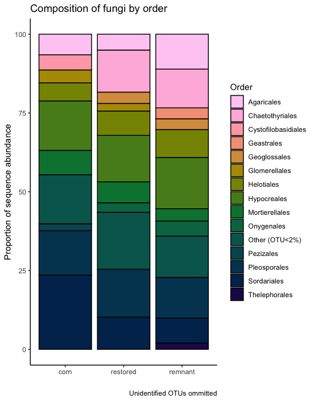
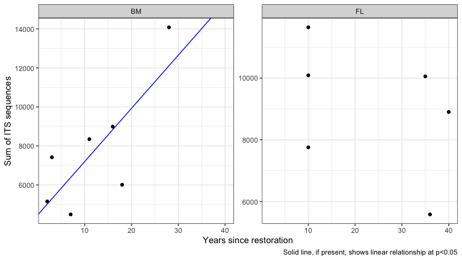
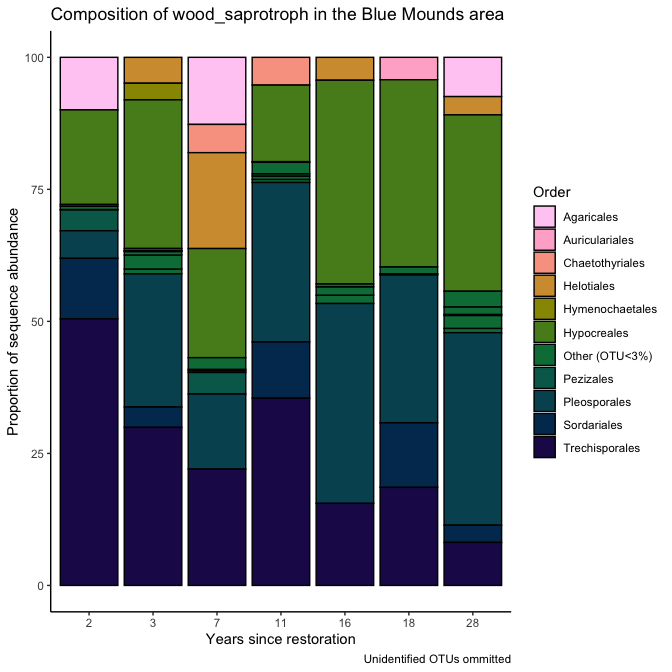
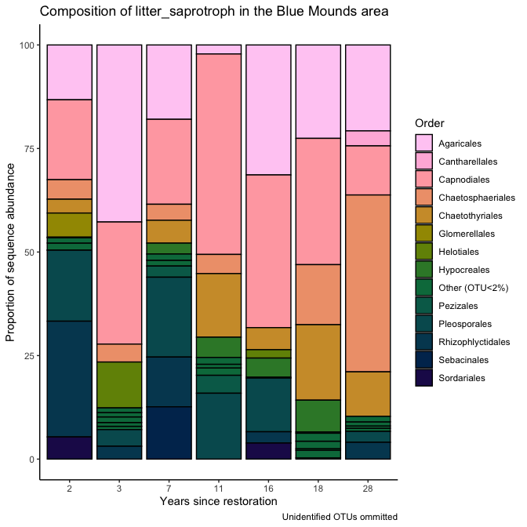
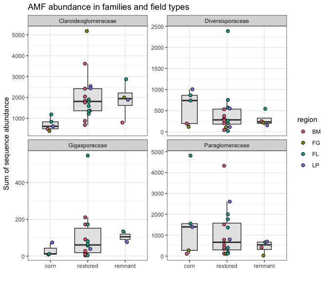
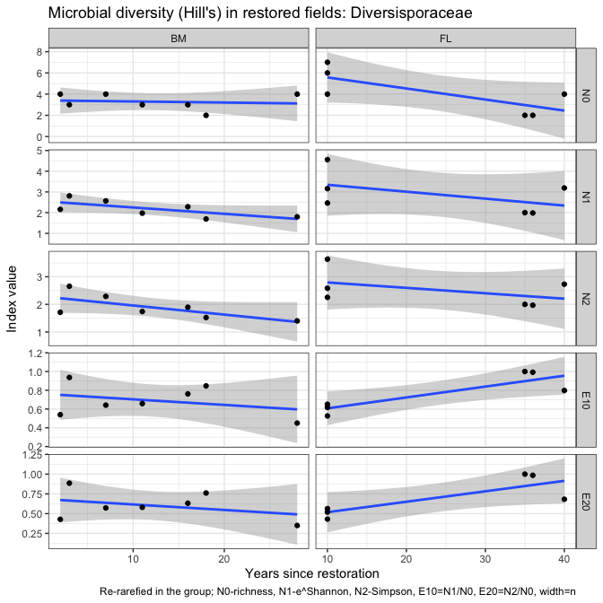
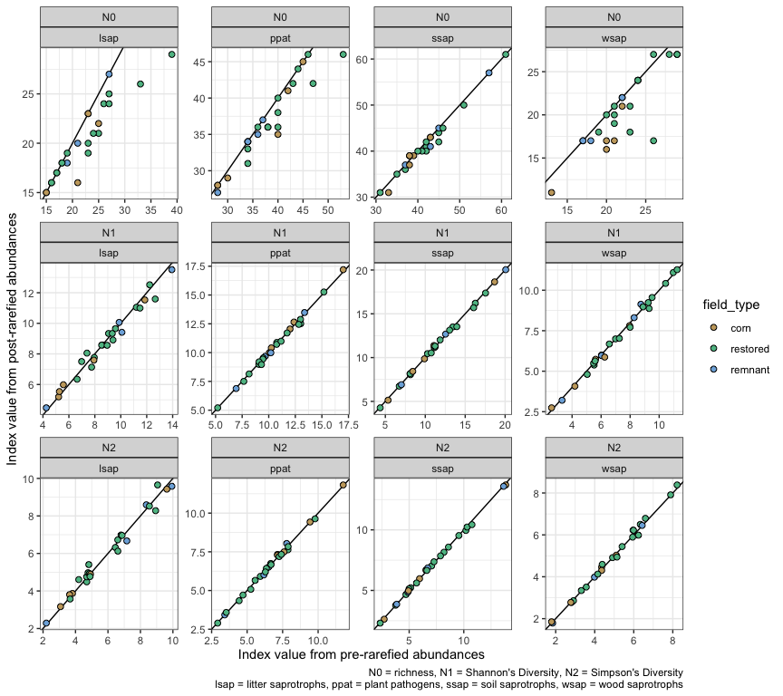

Microbial data: microbial guilds and taxonomy
================
Beau Larkin

Last updated: 11 March, 2023

- <a href="#description" id="toc-description">Description</a>
- <a href="#packages-and-libraries"
  id="toc-packages-and-libraries">Packages and libraries</a>
- <a href="#data" id="toc-data">Data</a>
  - <a href="#sites-species-tables"
    id="toc-sites-species-tables">Sites-species tables</a>
  - <a href="#species-metadata" id="toc-species-metadata">Species
    metadata</a>
  - <a href="#site-metadata-and-design"
    id="toc-site-metadata-and-design">Site metadata and design</a>
  - <a href="#joined-species-metadata-and-design-tables"
    id="toc-joined-species-metadata-and-design-tables">Joined species,
    metadata, and design tables</a>
- <a href="#functions" id="toc-functions">Functions</a>
  - <a href="#function-its-and-guilds"
    id="toc-function-its-and-guilds">Function: ITS and guilds</a>
  - <a href="#18s-based-data-amf" id="toc-18s-based-data-amf">18S-based data
    (AMF)</a>
  - <a href="#examine-change-over-time-in-guilds"
    id="toc-examine-change-over-time-in-guilds">Examine change over time in
    guilds</a>
  - <a href="#re-rarefy-in-guilds-or-groups"
    id="toc-re-rarefy-in-guilds-or-groups">Re-rarefy in guilds (or
    groups)</a>
  - <a href="#filter-to-guilds-or-taxonomic-groups"
    id="toc-filter-to-guilds-or-taxonomic-groups">Filter to guilds or
    taxonomic groups</a>
    - <a href="#calculate-hills-series-on-a-samples-species-matrix"
      id="toc-calculate-hills-series-on-a-samples-species-matrix">Calculate
      Hill’s series on a samples-species matrix</a>
    - <a href="#results-from-re-rarefied-data"
      id="toc-results-from-re-rarefied-data">Results from re-rarefied data</a>
  - <a href="#perform-indicator-species-analysis"
    id="toc-perform-indicator-species-analysis">Perform Indicator Species
    Analysis</a>
- <a href="#analysis-and-results" id="toc-analysis-and-results">Analysis
  and Results</a>
  - <a href="#its-sequences" id="toc-its-sequences">ITS sequences</a>
    - <a href="#composition-in-field-types"
      id="toc-composition-in-field-types">Composition in field types</a>
    - <a href="#soil-saprotrophs" id="toc-soil-saprotrophs">Soil
      saprotrophs</a>
    - <a href="#plant-pathogens" id="toc-plant-pathogens">Plant pathogens</a>
    - <a href="#wood-saprotrophs" id="toc-wood-saprotrophs">Wood
      saprotrophs</a>
    - <a href="#litter-saprotrophs" id="toc-litter-saprotrophs">Litter
      saprotrophs</a>
  - <a href="#amf" id="toc-amf">AMF</a>
    - <a href="#claroideoglomeraceae"
      id="toc-claroideoglomeraceae">Claroideoglomeraceae</a>
    - <a href="#paraglomeraceae" id="toc-paraglomeraceae">Paraglomeraceae</a>
    - <a href="#diversisporaceae"
      id="toc-diversisporaceae">Diversisporaceae</a>
    - <a href="#gigasporaceae" id="toc-gigasporaceae">Gigasporaceae</a>
- <a href="#conclusions-taxa-and-guilds"
  id="toc-conclusions-taxa-and-guilds">Conclusions: taxa and guilds</a>
- <a href="#appendix-rarefy-in-guilds"
  id="toc-appendix-rarefy-in-guilds">Appendix: Rarefy in guilds?</a>
  - <a href="#diversity-with-its-sequences"
    id="toc-diversity-with-its-sequences">Diversity with ITS sequences</a>

# Description

Sequence clusters identified in QIIME2 are annotated with taxonomic
information and metadata from [Fungal
traits](https://link.springer.com/article/10.1007/s13225-020-00466-2).
In this report, sequence abundances in taxonomic groups or fungal guilds
are compared across field types and with time since restoration.

The full sequence abundance tables were rarefied to make sequencing
depth equivalent across fields. This can result in lower-abundance OTUs
dropping to zero. Within guilds, loss of OTUs could change or bias
interpretations of richness, diversity, and composition. We tried using
raw sequence data and rarefying within guilds to address this problem,
but in each case the sequence depth was so small that additional OTUs
were lost and abundances were significantly lowered.

We may try a different approach which is described in [Semchenko et
al. 2018](https://www.science.org/doi/10.1126/sciadv.aau4578), but for
now, the analysis uses data from the entire rarefied tables for ITS and
18S sequences.

# Packages and libraries

``` r
packages_needed = c("tidyverse",
                    "knitr",
                    "conflicted",
                    "ggbeeswarm",
                    "colorspace",
                    "rsq",
                    "lme4",
                    "multcomp",
                    "indicspecies",
                    "GUniFrac",
                    "vegan")
packages_installed = packages_needed %in% rownames(installed.packages())
```

``` r
if (any(!packages_installed)) {
    install.packages(packages_needed[!packages_installed])
}
```

``` r
for (i in 1:length(packages_needed)) {
    library(packages_needed[i], character.only = T)
}
```

``` r
conflict_prefer("filter", "dplyr")
conflict_prefer("select", "dplyr")
```

# Data

## Sites-species tables

CSV files were produced in `process_data.R`

``` r
spe <- list(
    its_raw = read_csv(
        paste0(getwd(), "/clean_data/spe_ITS_raw.csv"),
        show_col_types = FALSE
    ),
    its_rfy = read_csv(
        paste0(getwd(), "/clean_data/spe_ITS_rfy.csv"),
        show_col_types = FALSE
    ),
    amf_raw = read_csv(
        paste0(getwd(), "/clean_data/spe_18S_raw.csv"),
        show_col_types = FALSE
    ),
    amf_rfy = read_csv(
        paste0(getwd(), "/clean_data/spe_18S_rfy.csv"),
        show_col_types = FALSE
    )
)
```

## Species metadata

Load taxonomy for all and guilds (`primary_lifestyle` in Fungal Traits)
for ITS OTUs.

``` r
meta <- list(
    its_raw = 
        read_csv(
            paste0(getwd(), "/clean_data/spe_ITS_raw_taxonomy.csv"),
            show_col_types = FALSE
        ),
    its_rfy = 
        read_csv(
            paste0(getwd(), "/clean_data/spe_ITS_rfy_taxonomy.csv"),
            show_col_types = FALSE
        ),
    amf_raw = 
        read_csv(
            paste0(getwd(), "/clean_data/spe_18S_raw_taxonomy.csv"),
            show_col_types = FALSE
        ),
    amf_rfy = 
        read_csv(
            paste0(getwd(), "/clean_data/spe_18S_rfy_taxonomy.csv"),
            show_col_types = FALSE
        )
)
```

## Site metadata and design

``` r
sites   <-
    read_csv(paste0(getwd(), "/clean_data/sites.csv"), show_col_types = FALSE) %>%
    mutate(
        field_type = factor(
            field_type,
            ordered = TRUE,
            levels = c("corn", "restored", "remnant")
        )) %>%
    select(-lat, -long, -yr_restore, -yr_rank) %>% 
    arrange(field_key)
```

## Joined species, metadata, and design tables

Functions streamline this process

``` r
join_spe_meta <-
    function(spe, meta) {
        spe %>%
            pivot_longer(starts_with("otu"),
                         names_to = "otu_num",
                         values_to = "seq_abund") %>%
            filter(seq_abund != 0) %>%
            left_join(meta, by = join_by(otu_num)) %>%
            left_join(sites, by = join_by(field_key))
    }
```

``` r
spe_meta <- list(
    its_raw = 
        join_spe_meta(spe$its_raw, meta$its_raw) %>%
        write_csv(paste0(getwd(), "/clean_data/speTaxa_ITS_raw.csv")),
    its_rfy = 
        join_spe_meta(spe$its_rfy, meta$its_rfy) %>%
        write_csv(paste0(getwd(), "/clean_data/speTaxa_ITS_rfy.csv")),
    amf_raw = 
        join_spe_meta(spe$amf_raw, meta$amf_raw) %>%
        write_csv(paste0(getwd(), "/clean_data/speTaxa_18S_raw.csv")),
    amf_rfy = 
        join_spe_meta(spe$amf_rfy, meta$amf_rfy) %>%
        write_csv(paste0( getwd(), "/clean_data/speTaxa_18S_rfy.csv" ))
)
```

# Functions

Functions streamline data processing, model fitting, and results output.
\### Function: ITS taxonomy This function simplifies and displays the
sequence distribution among taxa and across primary lifestyles. Use the
argument `other_threshold` to choose a small (e.g., 2, the default)
cutoff, below which orders are relabeled as “other”.

``` r
its_taxaGuild <- function(data, other_threshold=2) {
    # What is the distribution among site types at the class level?
    taxonomy_df <-
        data %>%
        group_by(phylum, order, field_type, field_name) %>%
        summarize(abund = sum(seq_abund), .groups = "drop") %>%
        group_by(phylum, order, field_type) %>%
        summarize(mean = mean(abund) %>% round(., 2),
                  .groups = "drop") %>%
        pivot_wider(
            names_from = field_type,
            values_from = mean,
            values_fill = 0
        ) %>%
        select(phylum, order, corn, restored, remnant) %>%
        arrange(-remnant)
    print(kable(
        taxonomy_df,
        format = "pandoc",
        caption = "Distribution of ITS OTUs in classes; mean sequence abundance by field type"
    ))
    # What is the distribution of `primary_lifestyles` among site types?
    guild_df <-
        data %>%
        group_by(primary_lifestyle, field_type, field_name) %>%
        summarize(abund = sum(seq_abund), .groups = "drop") %>%
        group_by(primary_lifestyle, field_type) %>%
        summarize(mean = round(mean(abund), 1), .groups = "drop") %>%
        pivot_wider(
            names_from = field_type,
            values_from = mean,
            values_fill = 0
        ) %>%
        select(primary_lifestyle, corn, restored, remnant) %>%
        arrange(-remnant)
    # Create table
    table <- kable(guild_df, format = "pandoc",
        caption = "Distribution of ITS OTUs by Fungal Trait 'primary_lifestyle'; mean sequence abundance by field type")
    # Plot the most abundant orders across field types
    plot_orders <- 
        data %>% 
        filter(order != is.na(order), order != "unidentified") %>% 
        group_by(field_type, order, field_key) %>% 
        summarize(seq_sum = sum(seq_abund), .groups = "drop_last") %>% 
        summarize(seq_avg = mean(seq_sum), .groups = "drop_last") %>% 
        mutate(seq_comp = (seq_avg / sum(seq_avg)) * 100,
               order = replace(order, which(seq_comp < 2), paste0("Other (OTU<", other_threshold, "%)"))) %>% 
        group_by(field_type, order) %>% 
        summarize(seq_comp = sum(seq_comp), .groups = "drop") %>% 
        ggplot(., aes(x = field_type, y = seq_comp)) +
        geom_col(aes(fill = order), color = "black") +
        labs(x = "", y = "Proportion of sequence abundance",
             title = "Composition of fungi by order") +
        scale_fill_discrete_sequential(name = "Order", palette = "Plasma") +
        theme_classic()
    # Plot the composition of primary lifestyles
    plot_guilds <- 
        data %>% 
        filter(primary_lifestyle != is.na(primary_lifestyle)) %>% 
        group_by(field_type, primary_lifestyle, field_key) %>% 
        summarize(seq_sum = sum(seq_abund), .groups = "drop_last") %>% 
        summarize(seq_avg = mean(seq_sum), .groups = "drop_last") %>% 
        mutate(seq_comp = (seq_avg / sum(seq_avg)) * 100,
               primary_lifestyle = replace(primary_lifestyle, which(seq_comp < 2), paste0("Other (OTU<", other_threshold, "%)"))) %>% 
        group_by(field_type, primary_lifestyle) %>% 
        summarize(seq_comp = sum(seq_comp), .groups = "drop") %>% 
        ggplot(., aes(x = field_type, y = seq_comp)) +
        geom_col(aes(fill = primary_lifestyle), color = "black") +
        labs(x = "", y = "Proportion of sequence abundance",
             title = "Composition of fungi by primary lifestyle") +
        scale_fill_discrete_sequential(name = "Primary lifestyle", palette = "Inferno") +
        theme_classic()
    
    print(list(table,
               plot_orders,
               plot_guilds))
    
}
```

### Function: ITS and guilds

Several primary lifestyles have been chosen from Fungal Traits for
further examination. These lifestyles were the largest by sequence
abundance and thought to be most informative given the habitat and
questions applied.

This function filters those groups and tests them among field types.
These tests aren’t technically valid due to pseudoreplication, but this
analysis can help us find trends worthy of further study.

``` r
its_test_taxaGuild <- function(data) {
    pl <- c("soil_saprotroph", "plant_pathogen", "ectomycorrhizal", "wood_saprotroph", "litter_saprotroph")
    df1 <- data.frame()
    for (i in 1:length(pl)) {
        cat("---------------------------------\n")
        print(pl[i])
        cat("---------------------------------\n")
        mod_data <- data %>%
            filter(primary_lifestyle == pl[i]) %>%
            group_by(field_type, region, field_name, yr_since, primary_lifestyle) %>%
            summarize(seq_sum = sum(seq_abund), .groups = "drop")
        print(kable(mod_data %>% arrange(-seq_sum), format = "pandoc"))
        cat("----------------------------------------------------\n\n")
        mmod <-
            lmer(seq_sum ~ field_type + (1 | region),
                 data = mod_data,
                 REML = FALSE)
        print(mmod)
        cat("----------------------------------------------------\n\n")
        mmod_null <-
            lmer(seq_sum ~ 1 + (1 | region),
                 data = mod_data,
                 REML = FALSE)
        print(mmod_null)
        cat("----------------------------------------------------\n\n")
        print(anova(mmod, mmod_null))
        cat("----------------------------------------------------\n\n")
        mod_tuk <-
            glht(mmod,
                 linfct = mcp(field_type = "Tukey"),
                 test = adjusted("holm"))
        print(summary(mod_tuk))
        print(cld(mod_tuk))
        cat("----------------------------------------------------\n\n")
        print(paste(
            "Years since restoration and",
            pl[i],
            "sequence abundance in Blue Mounds Area"
        ))
        mod_data2 <- mod_data %>%
            filter(region == "BM", field_type == "restored")
        print(summary(lm(seq_sum ~ yr_since,
                         data = mod_data2)))
        cat("\n\n\n")
        df1 <- rbind(df1, mod_data)
    }
    
    return(df1)
    
}
```

## 18S-based data (AMF)

This function simplifies and displays taxonomic information about the
AMF OTUs.

``` r
amf_tax <- function(data) {
    cat("---------------------------------\n")
    print(paste("AMF"))
    cat("---------------------------------\n")
    amf_df <-
        data %>%
        group_by(family, field_type, region, field_name, yr_since) %>%
        summarize(seq_sum = sum(seq_abund) %>% round(., 1),
                  .groups = "drop")
    amf_df_summary <-
        amf_df %>%
        group_by(family, field_type) %>%
        summarize(seq_avg = mean(seq_sum) %>% round(., 1),
                  .groups = "drop") %>%
        pivot_wider(
            names_from = field_type,
            values_from = seq_avg,
            names_sort = TRUE,
            values_fill = 0
        ) %>%
        arrange(-remnant)
    
    print(kable(amf_df_summary, format = "pandoc"))
    
    cat("\n---------------------------------\n")
    print("Compare abundances across field types with mixed model")
    cat("---------------------------------\n")
    test_families <-
        amf_df %>% 
        count(region, family, field_type) %>% 
        count(region, family) %>% 
        filter(n == 3) %>% 
        pull(family) %>% 
        unique()
    for (i in 1:length(test_families)) {
        cat("\n---------------------------------\n")
        print(test_families[i])
        cat("---------------------------------\n")
        mmod <-
            lmer(
                seq_sum ~ field_type + (1 | region),
                data = amf_df %>% filter(family == test_families[i]),
                REML = FALSE
            )
        print(mmod)
        cat("----------------------------------------------------\n\n")
        mmod_null <-
            lmer(
                seq_sum ~ 1 + (1 | region),
                data = amf_df %>% filter(family == test_families[i]),
                REML = FALSE
            )
        print(mmod_null)
        cat("----------------------------------------------------\n\n")
        print(anova(mmod, mmod_null))
        cat("----------------------------------------------------\n\n")
        mod_tuk <-
            glht(mmod,
                 linfct = mcp(field_type = "Tukey"),
                 test = adjusted("holm"))
        print(summary(mod_tuk))
        print(cld(mod_tuk))
        cat("\n")
    }
    cat("\n---------------------------------\n")
    print("Test abundances with years since restoration")
    cat("---------------------------------\n")
    all7 <-
        amf_df %>%
        filter(field_type == "restored", region == "BM") %>%
        count(family) %>%
        filter(n == 7) %>%
        pull(family)
    mod_data <-
        amf_df %>%
        filter(field_type == "restored", region == "BM", family %in% all7)
    for (i in 1:length(all7)) {
        print(all7[i])
        print(summary(lm(
            seq_sum ~ yr_since, data = mod_data %>% filter(family == all7[i])
        )))
    }
    return(amf_df)
}
```

## Examine change over time in guilds

Function `guiltime()` filters ITS data to a user-specified guild and
produces linear models and plots of change in sequence abundance over
time since restoration in Blue Mounds and Fermilab.

``` r
guiltime <- function(pl) {
    d <- spe_meta$its_rfy %>%
        filter(
            primary_lifestyle == pl,
            region %in% c("BM", "FL"),
            field_type == "restored"
        ) %>% 
        group_by(field_key, field_name, region, yr_since) %>% 
        summarize(seq_sum = sum(seq_abund), .groups = "drop")
    
    bm <- summary(
        lm(seq_sum ~ yr_since, data = d %>% filter(region == "BM"))
    )
    fl <- summary(
        lm(seq_sum ~ yr_since, data = d %>% filter(region == "FL"))
    )
    
    fits <- data.frame(
        rbind(BM = c(coef(bm)[1,1], coef(bm)[2,1], coef(bm)[2,4]),
              FL = c(coef(fl)[1,1], coef(fl)[2,1], coef(fl)[2,4]))) %>% 
        mutate(lty = case_when(X3 < 0.05 ~ "a", TRUE ~ NA_character_)) %>% 
        rownames_to_column(var = "region")
    plot <- 
        ggplot(d, aes(x = yr_since, y = seq_sum)) +
        facet_wrap(vars(region), scales = "free_y") +
        geom_point() +
        geom_abline(data = fits, aes(slope = X2, intercept = X1, linetype = lty), color = "blue") +
        labs(x = "Years since restoration", 
             y = "Sum of ITS sequences",
             caption = "Solid line, if present, shows linear relationship at p<0.05") +
        theme_bw() +
        theme(legend.position = "none")
    
    out <- list(
        bm_summary = bm,
        fl_summary = fl,
        plot = plot
    )
    
    print(out)
    
}
```

## Re-rarefy in guilds (or groups)

To examine richness and composition within subgroups of OTUs, the raw
sequence data should be re-rarefied within those groups. Otherwise,
especially with low-abundance groups, data and sites may have been lost
when the entire species matrix was rarefied. This function automates the
process.

Outputs are:

1.  Sequencing depth used for the subset of OTUs
2.  Number of OTUs excluded by rarefying
3.  The re-rarefied samples-species matrix
4.  The OTU list in long form, with abundances, species, and site
    metadata

``` r
rerare <- function(spe, meta, grp_var, grp, site) {
    # spe       = species matrix with raw abundances
    # meta      = species metadata matching the OTU list with raw abundances
    # grp_var   = variable name from `meta` desired for grouping and filtering
    #             the OTUs (e.g., `primary_lifestyle`, `family`)
    # grp       = string or factor level name of the group desired from `grp_var`
    # site      = site metadata to combine with sequence abundance long-form
    #             output table
    
    grp_var <- enquo(grp_var)
    
    data <- 
        spe %>% 
        column_to_rownames(var = "field_key") %>% 
        t() %>% 
        as.data.frame() %>% 
        rownames_to_column(var = "otu_num") %>% 
        as_tibble() %>% 
        left_join(meta, by = join_by(otu_num)) %>% 
        filter(!!grp_var == grp) %>% 
        column_to_rownames(var = "otu_num") %>% 
        select(-colnames(meta)[-1]) %>% 
        t() %>% 
        as.data.frame()
    
    depth <- min(rowSums(data))
    rfy <- Rarefy(data)
    zero_otu <- which(apply(rfy$otu.tab.rff, 2, sum) == 0)
    rrfd <- data.frame(rfy$otu.tab.rff[, -zero_otu]) %>%
        rownames_to_column(var = "field_key") %>%
        mutate(field_key = as.numeric(field_key)) %>% 
        arrange(field_key) %>% 
        as_tibble()
    
    rrfd_speTaxa <- 
        rrfd %>% 
        pivot_longer(cols = starts_with("otu"), 
                     names_to = "otu_num", 
                     values_to = "seq_abund") %>% 
        filter(seq_abund > 0) %>% 
        left_join(meta, by = join_by(otu_num)) %>% 
        left_join(site, by = join_by(field_key)) %>% 
        select(-otu_ID)
    
    return(list(
        seq_depth = depth,
        zero_otu_num = length(zero_otu),
        rrfd = rrfd,
        rrfd_speTaxa = rrfd_speTaxa
    ))
    
}
```

## Filter to guilds or taxonomic groups

To examine richness and composition within subgroups of OTUs, the
rarefied table must be transposed, filtered, and transposed back. The
function `filgu()` or “filter guilds” automates this process.

Outputs are:

1.  The resulting samples-species matrix
2.  Sequence abundances in long-form, with site and species metadata

Note that this function isn’t necessary. Everything produced here can be
done with the `spe_meta$..._rfy` tables. But I’m keeping this path going
for now in case we need to switch back to rarefying within groups again.

``` r
filgu <- function(spe, meta, grp_var, grp, site) {
    # spe       = species matrix with raw abundances
    # meta      = species metadata matching the OTU list with raw abundances
    # grp_var   = variable name from `meta` desired for grouping and filtering
    #             the OTUs (e.g., `primary_lifestyle`, `family`)
    # grp       = string or factor level name of the group desired from `grp_var`
    # site      = site metadata to combine with sequence abundance long-form
    #             output table
    
    grp_var <- enquo(grp_var)
    
    filspe <- 
        spe %>% 
        column_to_rownames(var = "field_key") %>% 
        t() %>% 
        as.data.frame() %>% 
        rownames_to_column(var = "otu_num") %>% 
        as_tibble() %>% 
        left_join(meta, by = join_by(otu_num)) %>% 
        filter(!!grp_var == grp) %>% 
        column_to_rownames(var = "otu_num") %>% 
        select(-colnames(meta)[-1]) %>% 
        t() %>% 
        as.data.frame() %>%
        rownames_to_column(var = "field_key") %>%
        mutate(field_key = as.numeric(field_key)) %>% 
        arrange(field_key) %>% 
        as_tibble()
    
    cs <- colSums(filspe %>% select(-field_key))
    rs <- rowSums(filspe %>% select(-field_key))
    
    hist(cs,
         breaks = length(cs),
         main = "Histogram of OTU sequence sums",
         xlab = "Number of sequences")
    
    hist(rs,
         breaks = length(rs),
         main = "Histogram of sequence abundance in samples",
         xlab = "Number of sequences")
    
    filspeTaxa <- 
        filspe %>% 
        pivot_longer(cols = starts_with("otu"), 
                     names_to = "otu_num", 
                     values_to = "seq_abund") %>% 
        filter(seq_abund > 0) %>% 
        left_join(meta, by = join_by(otu_num)) %>% 
        left_join(site, by = join_by(field_key)) %>% 
        select(-otu_ID)
    
    print(list(
        OTUs_n = length(cs),
        Sites_n = length(which(rs > 0))
    ))
    
    return(list(
        filspe = filspe,
        filspeTaxa = filspeTaxa
    ))
    
}
```

### Calculate Hill’s series on a samples-species matrix

The objects `$rrfd` from **rerare()** or `$filspe` from **filgu()** can
be passed to this function

``` r
calc_diversity <- function(spe) {
    spe_mat <- data.frame(spe, row.names = 1)
    
    N0  <- apply(spe_mat > 0, MARGIN = 1, FUN = sum)
    N1  <- exp(diversity(spe_mat))
    N2  <- diversity(spe_mat, "inv")
    E10 <- N1 / N0
    E20 <- N2 / N0
    
    return(
        data.frame(N0, N1, N2, E10, E20) %>%
            rownames_to_column(var = "field_key") %>%
            mutate(field_key = as.integer(field_key)) %>%
            left_join(sites, by = join_by(field_key)) %>%
            pivot_longer(
                cols = N0:E20,
                names_to = "hill_index",
                values_to = "value"
            ) %>%
            mutate(hill_index = factor(
                hill_index,
                ordered = TRUE,
                levels = c("N0", "N1", "N2", "E10", "E20")
            ))
    )
}
```

### Results from re-rarefied data

After re-rarefying into a guild (or taxonomic group), produce diversity
statistics and calculate percent composition; display results. For
plotting, it’s convenient to limit the number of taxonomic orders
displayed. Use the argument `other_threshold` to choose a small (e.g.,
2, the default) cutoff, below which orders are relabeled as “other”.

``` r
gudicom <- function(div, rrfd, grp_var, gene="its", other_threshold=2) {
    hillfield <-     
        ggplot(div, aes(x = field_type, y = value)) +
        facet_wrap(vars(hill_index), scales = "free_y") +
        geom_boxplot(varwidth = TRUE, fill = "gray90", outlier.shape = NA) +
        geom_beeswarm(aes(fill = region), shape = 21, size = 2, dodge.width = 0.2) +
        labs(x = "", y = "Index value", title = paste("Microbial diversity (Hill's):", grp_var),
             caption = "Re-rarefied in the group; N0-richness, N1-e^Shannon, N2-Simpson, E10=N1/N0, E20=N2/N0, width=n") +
        scale_fill_discrete_qualitative(palette = "Dark3") +
        theme_bw()
    hilltime <- 
        div %>% 
        filter(field_type == "restored", region %in% c("BM", "FL")) %>% 
        ggplot(aes(x = yr_since, y = value)) +
        facet_grid(rows = vars(hill_index), cols = vars(region), scales = "free") +
        geom_smooth(method = "lm") +
        geom_point() +
        labs(x = "Years since restoration", y = "Index value", title = paste("Microbial diversity (Hill's) in restored fields:", grp_var),
             caption = "Re-rarefied in the group; N0-richness, N1-e^Shannon, N2-Simpson, E10=N1/N0, E20=N2/N0, width=n") +
        theme_bw()
    if(gene == "its") {
        comp_ft <- 
            rrfd %>% 
            filter(order != is.na(order), order != "unidentified") %>% 
            group_by(field_type, order, field_key) %>% 
            summarize(seq_sum = sum(seq_abund), .groups = "drop_last") %>% 
            summarize(seq_avg = mean(seq_sum), .groups = "drop_last") %>% 
            mutate(seq_comp = (seq_avg / sum(seq_avg)) * 100,
                   order = replace(order, which(seq_comp < other_threshold), paste0("Other (OTU<", other_threshold, "%)"))) %>% 
            group_by(field_type, order) %>% 
            summarize(seq_comp = sum(seq_comp), .groups = "drop")
        comp_ft_plot <-
            ggplot(comp_ft, aes(x = field_type, y = seq_comp)) +
            geom_col(aes(fill = order), color = "black") +
            labs(x = "", y = "Proportion of sequence abundance",
                 title = paste("Composition of", grp_var)) +
            scale_fill_discrete_sequential(name = "Order", palette = "Plasma") +
            theme_classic()
        
        yr_fct <- 
            sites %>% 
            filter(field_type == "restored") %>% 
            select(field_key, yr_since) %>% 
            arrange(yr_since) %>% 
            mutate(yr_fct = factor(yr_since, ordered = TRUE))
        comp_yr <- 
            rrfd %>% 
            filter(order != is.na(order), 
                   order != "unidentified",
                   field_type == "restored",
                   region == "BM") %>% 
            group_by(field_key, order) %>% 
            summarize(seq_sum = sum(seq_abund), .groups = "drop_last") %>% 
            mutate(seq_comp = (seq_sum / sum(seq_sum)) * 100,
                   order = replace(order, which(seq_comp < other_threshold), paste0("Other (OTU<", other_threshold, "%)"))) %>% 
            left_join(yr_fct, by = join_by(field_key))
        comp_yr_plot <-
            ggplot(comp_yr, aes(x = yr_fct, y = seq_comp)) +
            geom_col(aes(fill = order), color = "black") +
            labs(x = "Years since restoration", y = "Proportion of sequence abundance",
                 title = paste("Composition of", grp_var, "in the Blue Mounds area")) +
            scale_fill_discrete_sequential(name = "Order", palette = "Plasma") +
            theme_classic()
        
        print(list(
            Hills_field_type = hillfield,
            Hills_yrs_since_restoration = hilltime,
            Composition_field_type = comp_ft_plot,
            Composition_yr_since = comp_yr_plot
        ))
        
        return(list(comp_ft, comp_yr))
        
    } else {
        print(list(
            Hills_field_type = hillfield,
            Hills_yrs_since_restoration = hilltime
        ))
    }
    
}
```

## Perform Indicator Species Analysis

Function `inspan()` takes a combined species and sites data frame and
wrangles it through the analysis to filter OTUs for indicators of field
types. The output is top candidate OTUs joined with species metadata for
further analysis.

``` r
inspan <- function(data, np, meta) {
    # data is the samples-species matrix joined with the sites data frame
    # the join aligns the grouping vector with field numbers
    # np is the desired number of permutations
    # meta is the appropriate species metadata table for the original data
    spe <- data.frame(
        data %>% select(field_key, starts_with("otu")),
        row.names = 1
    )
    grp = data$field_type
    mp <- multipatt(
        spe, 
        grp, 
        max.order = 1, 
        control = how(nperm = np))
    si <- mp$sign %>% 
        select(index, stat, p.value) %>% 
        mutate(field_type = case_when(index == 1 ~ "corn", 
                                      index == 2 ~ "restored", 
                                      index == 3 ~ "remnant")) %>% 
        filter(p.value < 0.05) %>% 
        rownames_to_column(var = "otu_num") %>%
        select(-index) %>% 
        as_tibble()
    A  <- mp$A %>% 
        as.data.frame() %>% 
        rownames_to_column(var = "otu_num") %>% 
        pivot_longer(cols = corn:remnant, 
                     names_to = "field_type", 
                     values_to = "A")
    B <- mp$B %>% 
        as.data.frame() %>% 
        rownames_to_column(var = "otu_num") %>% 
        pivot_longer(cols = corn:remnant, 
                     names_to = "field_type", 
                     values_to = "B")
    out <- 
        si %>% 
        left_join(A, by = join_by(otu_num, field_type)) %>% 
        left_join(B, by = join_by(otu_num, field_type)) %>% 
        left_join(meta %>% select(-otu_ID), by = join_by(otu_num)) %>% 
        select(otu_num, A, B, stat, p.value, 
               field_type, primary_lifestyle, everything()) %>% 
        arrange(field_type, -stat)
    
    return(out)
    
}
```

# Analysis and Results

## ITS sequences

Recall the number of OTUs recovered in each dataset. The effect of
rarefying did not change richness or diversity very much.

``` r
# Number of OTUs in raw and rarefied datasets
Map(function(x) ncol(x)-1, spe[1:2])
```

    ## $its_raw
    ## [1] 2795
    ## 
    ## $its_rfy
    ## [1] 2738

### Composition in field types

Function outputs are verbose, but details may be necessary later so they
are displayed here.

``` r
its_taxaGuild(spe_meta$its_rfy)
```

    ## 
    ## 
    ## Table: Distribution of ITS OTUs in classes; mean sequence abundance by field type
    ## 
    ## phylum                   order                                        corn   restored   remnant
    ## -----------------------  --------------------------------------  ---------  ---------  --------
    ## Ascomycota               Hypocreales                               7317.00    6212.50   6903.75
    ## Ascomycota               Chaetothyriales                            622.40    5572.94   5834.75
    ## Basidiomycota            Agaricales                                2781.00    2087.31   4979.25
    ## Ascomycota               Pleosporales                              6400.20    6405.75   4922.25
    ## Ascomycota               Sordariales                              10381.60    4300.12   3318.00
    ## Ascomycota               Helotiales                                2649.60    3268.31   3197.75
    ## Ascomycota               NA                                        1275.40    2364.12   2904.50
    ## NA                       NA                                        1231.00    1903.88   2325.50
    ## Ascomycota               Onygenales                                  70.20    1273.44   2075.00
    ## Mortierellomycota        Mortierellales                            3294.00    2565.69   1625.00
    ## Basidiomycota            Thelephorales                                2.00      26.00   1043.75
    ## Ascomycota               Geoglossales                                 5.00    1460.92    922.00
    ## Ascomycota               GS34                                         0.00      67.67    670.00
    ## Ascomycota               Glomerellales                             1739.20    1113.38    664.00
    ## Ascomycota               unidentified                                 0.00     829.67    612.25
    ## Basidiomycota            Cantharellales                             265.40     758.38    556.75
    ## Glomeromycota            Glomerales                                  82.80     411.06    419.75
    ## Ascomycota               Coniochaetales                             693.00     160.81    303.75
    ## Ascomycota               Sordariomycetes_ord_Incertae_sedis          38.20      50.62    230.00
    ## Ascomycota               Xylariales                                  63.80     289.69    171.50
    ## Basidiomycota            Russulales                                   4.00       4.50    171.00
    ## Ascomycota               Pezizales                                  927.60     310.69    170.00
    ## Basidiomycota            NA                                          74.60     546.88    169.25
    ## Ascomycota               Magnaporthales                              77.00     117.75    157.50
    ## Basidiomycota            Sebacinales                                 27.80     628.56    157.25
    ## Ascomycota               Capnodiales                                544.60     505.62    149.75
    ## Basidiomycota            Boletales                                    5.00       6.00    147.50
    ## Glomeromycota            NA                                           3.33     148.46    130.67
    ## Ascomycota               Minutisphaerales                             0.00      58.00    108.00
    ## Ascomycota               Chaetosphaeriales                          261.75     254.73    102.00
    ## Ascomycota               Branch06                                    11.50     134.43     87.00
    ## Mucoromycota             NA                                           0.00      23.50     85.50
    ## Ascomycota               Mytilinidales                                0.00       0.00     79.00
    ## Basidiomycota            Trichosporonales                           103.00      40.22     78.67
    ## Basidiomycota            Tremellales                                 14.50      91.50     76.25
    ## Basidiomycota            Auriculariales                             106.25     219.25     75.00
    ## Basidiomycota            Filobasidiales                             795.00     286.29     70.33
    ## Chytridiomycota          Spizellomycetales                          162.40      88.20     67.50
    ## Mucoromycota             Umbelopsidales                               0.00       1.00     65.00
    ## Ascomycota               Mytilinidiales                               0.00      12.33     64.00
    ## Ascomycota               Thelebolales                                89.75      35.69     63.75
    ## Basidiomycota            Hymenochaetales                             12.00     177.43     59.50
    ## Basidiomycota            Cystofilobasidiales                       2253.60      84.23     57.00
    ## Chytridiomycota          Rhizophlyctidales                          209.00     107.00     54.25
    ## Ascomycota               Dothideomycetes_ord_Incertae_sedis           0.00       0.00     49.00
    ## Ascomycota               Venturiales                                 31.67      73.38     45.67
    ## Basidiomycota            Ustilaginales                                0.00      83.50     45.33
    ## Ascomycota               Verrucariales                                0.00       0.00     43.00
    ## Ascomycota               Orbiliales                                  20.00      81.71     31.67
    ## Ascomycota               Tubeufiales                                 70.00     165.75     30.00
    ## Basidiomycota            Tremellodendropsidales                       8.00      27.92     30.00
    ## Basidiomycota            Polyporales                                 19.20      28.00     29.25
    ## Basidiomycota            Geminibasidiales                            33.00      79.75     28.50
    ## Basidiomycota            Atheliales                                   0.00     143.00     28.00
    ## Basidiomycota            Trechisporales                             123.00     362.50     24.33
    ## Ascomycota               Microascales                               105.60      72.91     24.00
    ## Ascomycota               Saccharomycetales                          257.00      39.40     24.00
    ## Ascomycota               Myrmecridiales                               0.00      68.75     21.50
    ## Basidiomycota            Erythrobasidiales                            0.00       4.40     20.00
    ## Chytridiomycota          Chytridiales                                 2.00      85.75     20.00
    ## Rozellomycota            GS11                                         0.00       0.00     20.00
    ## Basidiomycota            Phallales                                  211.00      41.25     18.33
    ## Ascomycota               GS32                                         0.00       0.00     18.00
    ## Basidiomycota            Leucosporidiales                            30.00      10.00     18.00
    ## Ascomycota               Diaporthales                               121.50      11.14     16.50
    ## Chytridiomycota          Rhizophydiales                              20.25      15.90     16.50
    ## Ascomycota               Savoryellales                               13.50      16.67     15.50
    ## Ascomycota               Eurotiales                                 108.40      37.00     14.00
    ## Ascomycota               Ostropales                                   0.00      53.50     14.00
    ## Glomeromycota            Archaeosporales                              3.00       8.75     13.00
    ## Ascomycota               Archaeorhizomycetales                        0.00      30.29     11.00
    ## Ascomycota               Acrospermales                                0.00       9.00      8.00
    ## Basidiomycota            Geastrales                                  53.00      49.83      8.00
    ## Chlorophyta              Chaetopeltidales                            10.50       5.80      8.00
    ## Basidiobolomycota        Basidiobolales                               8.00      16.00      7.00
    ## Mortierellomycota        NA                                           0.00       3.00      7.00
    ## Ascomycota               Rhytismatales                                0.00       3.00      6.00
    ## Ascomycota               Dothideales                                  0.00      29.00      5.50
    ## Basidiomycota            Agaricomycetes_ord_Incertae_sedis            0.00       0.00      5.00
    ## Basidiomycota            Microbotryomycetes_ord_Incertae_sedis        9.50      11.33      5.00
    ## Chlorophyta              NA                                           9.00       8.00      5.00
    ## Anthophyta               Poales                                       3.50       4.00      4.00
    ## Basidiomycota            unidentified                                12.00     118.50      4.00
    ## Ascomycota               Candelariales                                0.00       6.00      3.00
    ## Basidiomycota            Atractiellales                              12.50       0.00      3.00
    ## Glomeromycota            Diversisporales                              0.00      10.33      3.00
    ## Anthophyta               Asterales                                    0.00       4.00      0.00
    ## Anthophyta               Brassicales                                 10.00       3.00      0.00
    ## Anthophyta               Commelinales                                 4.00     220.00      0.00
    ## Anthophyta               Fabales                                      0.00      15.00      0.00
    ## Ascomycota               Boliniales                                  37.50      45.50      0.00
    ## Ascomycota               Botryosphaeriales                           17.50      19.60      0.00
    ## Ascomycota               Jahnulales                                  10.00       0.00      0.00
    ## Ascomycota               Pezizomycotina_ord_Incertae_sedis           26.00     497.00      0.00
    ## Ascomycota               Phacidiales                                  0.00       5.00      0.00
    ## Ascomycota               Phomatosporales                            643.00      10.33      0.00
    ## Ascomycota               Trichosphaeriales                            5.00      20.50      0.00
    ## Basidiomycota            Agaricostilbales                             2.00       0.00      0.00
    ## Basidiomycota            Corticiales                                  0.00      43.71      0.00
    ## Basidiomycota            Cystobasidiales                             35.00      10.67      0.00
    ## Basidiomycota            Entylomatales                                0.00      12.50      0.00
    ## Basidiomycota            Holtermanniales                              4.33      16.00      0.00
    ## Basidiomycota            Kriegeriales                                 1.00       4.00      0.00
    ## Basidiomycota            Platygloeales                                0.00      49.00      0.00
    ## Basidiomycota            Pucciniales                                  0.00       7.00      0.00
    ## Basidiomycota            Sporidiobolales                             43.00      14.25      0.00
    ## Basidiomycota            Tilletiales                                  0.00      15.75      0.00
    ## Basidiomycota            Urocystidales                               56.00       5.00      0.00
    ## Calcarisporiellomycota   Calcarisporiellales                          0.00       4.00      0.00
    ## Cercozoa                 unidentified                                 4.00       3.00      0.00
    ## Chlorophyta              Chaetophorales                               0.00      22.33      0.00
    ## Chlorophyta              Chlamydomonadales                            0.00       2.00      0.00
    ## Chlorophyta              Chlorellales                                 0.00       3.00      0.00
    ## Chlorophyta              Sphaeropleales                               0.00       5.00      0.00
    ## Chytridiomycota          unidentified                                 8.00       2.00      0.00
    ## Chytridiomycota          NA                                          15.00       7.00      0.00
    ## Glomeromycota            Paraglomerales                               0.00      16.33      0.00
    ## Glomeromycota            unidentified                                 2.00      19.40      0.00
    ## Haplosporidia            Haplosporidia_ord_Incertae_sedis             2.67      14.00      0.00
    ## Mucoromycota             GS22                                         0.00       4.00      0.00
    ## Mucoromycota             Mucorales                                    0.00       5.33      0.00
    ## [[1]]
    ## 
    ## 
    ## Table: Distribution of ITS OTUs by Fungal Trait 'primary_lifestyle'; mean sequence abundance by field type
    ## 
    ## primary_lifestyle            corn   restored   remnant
    ## -----------------------  --------  ---------  --------
    ## NA                        20211.6    24802.0   27191.8
    ## soil_saprotroph            7067.6     5724.4    6058.5
    ## plant_pathogen             7051.4     7165.9    5615.5
    ## ectomycorrhizal              15.0      145.8    1972.2
    ## litter_saprotroph          2068.0     1434.4    1122.0
    ## wood_saprotroph            2852.2     2280.5    1116.2
    ## dung_saprotroph            2726.6     1561.6     941.0
    ## animal_parasite             658.8     1084.8     653.8
    ## mycoparasite               1830.8      597.1     215.8
    ## unspecified_saprotroph      766.8      159.2     178.0
    ## arbuscular_mycorrhizal       54.4      184.6     160.5
    ## root_endophyte               14.0      332.1     139.0
    ## pollen_saprotroph           151.2       75.7      54.2
    ## nectar/tap_saprotroph        35.0       37.3      24.0
    ## lichen_parasite              16.0       53.0      23.5
    ## epiphyte                      0.0        5.0      22.0
    ## lichenized                    0.0      103.0      14.0
    ## unspecified_pathotroph        0.0       12.5      11.5
    ## foliar_endophyte              3.0       33.0       6.0
    ## algal_parasite                2.0        4.0       0.0
    ## 
    ## [[2]]



    ## 
    ## [[3]]


``` r
its_rfy_guilds <- its_test_taxaGuild(spe_meta$its_rfy)
```

    ## ---------------------------------
    ## [1] "soil_saprotroph"
    ## ---------------------------------
    ## 
    ## 
    ## field_type   region   field_name    yr_since  primary_lifestyle    seq_sum
    ## -----------  -------  -----------  ---------  ------------------  --------
    ## corn         FL       FLC2                 0  soil_saprotroph        11957
    ## restored     BM       KORP1               28  soil_saprotroph        10623
    ## remnant      LP       LPREM1              NA  soil_saprotroph        10325
    ## restored     FL       FLRSP1              10  soil_saprotroph         9534
    ## restored     FL       FLRP5               35  soil_saprotroph         8848
    ## corn         FL       FLC1                 0  soil_saprotroph         7840
    ## restored     BM       PHRP1               11  soil_saprotroph         7344
    ## corn         LP       LPC1                 0  soil_saprotroph         7217
    ## restored     FL       FLRSP3              10  soil_saprotroph         7093
    ## remnant      BM       MBREM1              NA  soil_saprotroph         6570
    ## restored     BM       BBRP1               16  soil_saprotroph         6020
    ## corn         BM       PHC1                 0  soil_saprotroph         5132
    ## restored     FL       FLRP1               40  soil_saprotroph         5079
    ## restored     FL       FLRSP2              10  soil_saprotroph         4845
    ## restored     FL       FLRP4               36  soil_saprotroph         4533
    ## restored     BM       MBRP1               18  soil_saprotroph         4463
    ## remnant      FG       FGREM1              NA  soil_saprotroph         4422
    ## restored     LP       LPRP1                4  soil_saprotroph         4210
    ## restored     BM       ERRP1                3  soil_saprotroph         4159
    ## restored     BM       MHRP2                2  soil_saprotroph         4078
    ## restored     LP       LPRP2                4  soil_saprotroph         3911
    ## restored     BM       MHRP1                7  soil_saprotroph         3791
    ## corn         FG       FGC1                 0  soil_saprotroph         3192
    ## restored     FG       FGRP1               15  soil_saprotroph         3060
    ## remnant      FL       FLREM1              NA  soil_saprotroph         2917
    ## ----------------------------------------------------
    ## 
    ## Linear mixed model fit by maximum likelihood  ['lmerMod']
    ## Formula: seq_sum ~ field_type + (1 | region)
    ##    Data: mod_data
    ##       AIC       BIC    logLik  deviance  df.resid 
    ##  471.6130  477.7073 -230.8065  461.6130        20 
    ## Random effects:
    ##  Groups   Name        Std.Dev.
    ##  region   (Intercept)    0    
    ##  Residual             2473    
    ## Number of obs: 25, groups:  region, 4
    ## Fixed Effects:
    ##  (Intercept)  field_type.L  field_type.Q  
    ##       6283.5        -713.5         684.7  
    ## optimizer (nloptwrap) convergence code: 0 (OK) ; 0 optimizer warnings; 1 lme4 warnings 
    ## ----------------------------------------------------
    ## 
    ## Linear mixed model fit by maximum likelihood  ['lmerMod']
    ## Formula: seq_sum ~ 1 + (1 | region)
    ##    Data: mod_data
    ##       AIC       BIC    logLik  deviance  df.resid 
    ##  468.7120  472.3687 -231.3560  462.7120        22 
    ## Random effects:
    ##  Groups   Name        Std.Dev.
    ##  region   (Intercept)    0    
    ##  Residual             2528    
    ## Number of obs: 25, groups:  region, 4
    ## Fixed Effects:
    ## (Intercept)  
    ##        6047  
    ## optimizer (nloptwrap) convergence code: 0 (OK) ; 0 optimizer warnings; 1 lme4 warnings 
    ## ----------------------------------------------------
    ## 
    ## Data: mod_data
    ## Models:
    ## mmod_null: seq_sum ~ 1 + (1 | region)
    ## mmod: seq_sum ~ field_type + (1 | region)
    ##           npar    AIC    BIC  logLik deviance  Chisq Df Pr(>Chisq)
    ## mmod_null    3 468.71 472.37 -231.36   462.71                     
    ## mmod         5 471.61 477.71 -230.81   461.61 1.0991  2     0.5772
    ## ----------------------------------------------------
    ## 
    ## 
    ##   Simultaneous Tests for General Linear Hypotheses
    ## 
    ## Multiple Comparisons of Means: Tukey Contrasts
    ## 
    ## 
    ## Fit: lmer(formula = seq_sum ~ field_type + (1 | region), data = mod_data, 
    ##     REML = FALSE)
    ## 
    ## Linear Hypotheses:
    ##                         Estimate Std. Error z value Pr(>|z|)
    ## restored - corn == 0     -1343.2     1267.2  -1.060    0.534
    ## remnant - corn == 0      -1009.1     1659.2  -0.608    0.813
    ## remnant - restored == 0    334.1     1382.6   0.242    0.968
    ## (Adjusted p values reported -- single-step method)
    ## 
    ##     corn restored  remnant 
    ##      "a"      "a"      "a" 
    ## ----------------------------------------------------
    ## 
    ## [1] "Years since restoration and soil_saprotroph sequence abundance in Blue Mounds Area"
    ## 
    ## Call:
    ## lm(formula = seq_sum ~ yr_since, data = mod_data2)
    ## 
    ## Residuals:
    ##       1       2       3       4       5       6       7 
    ##  -590.7   339.3  1436.1 -2577.0  -887.5   473.0  1806.8 
    ## 
    ## Coefficients:
    ##             Estimate Std. Error t value Pr(>|t|)  
    ## (Intercept)  3175.65    1074.28   2.956   0.0317 *
    ## yr_since      214.69      72.26   2.971   0.0311 *
    ## ---
    ## Signif. codes:  0 '***' 0.001 '**' 0.01 '*' 0.05 '.' 0.1 ' ' 1
    ## 
    ## Residual standard error: 1640 on 5 degrees of freedom
    ## Multiple R-squared:  0.6384, Adjusted R-squared:  0.566 
    ## F-statistic: 8.826 on 1 and 5 DF,  p-value: 0.03113
    ## 
    ## 
    ## 
    ## 
    ## ---------------------------------
    ## [1] "plant_pathogen"
    ## ---------------------------------
    ## 
    ## 
    ## field_type   region   field_name    yr_since  primary_lifestyle    seq_sum
    ## -----------  -------  -----------  ---------  ------------------  --------
    ## restored     BM       MHRP1                7  plant_pathogen         12277
    ## restored     BM       MHRP2                2  plant_pathogen         12270
    ## restored     LP       LPRP1                4  plant_pathogen         11624
    ## restored     BM       PHRP1               11  plant_pathogen         11292
    ## restored     FG       FGRP1               15  plant_pathogen         10676
    ## corn         LP       LPC1                 0  plant_pathogen         10372
    ## restored     BM       ERRP1                3  plant_pathogen         10005
    ## remnant      LP       LPREM1              NA  plant_pathogen          8066
    ## corn         FG       FGC1                 0  plant_pathogen          7625
    ## corn         FL       FLC2                 0  plant_pathogen          6702
    ## remnant      FG       FGREM1              NA  plant_pathogen          6294
    ## restored     BM       BBRP1               16  plant_pathogen          6215
    ## restored     LP       LPRP2                4  plant_pathogen          6058
    ## remnant      FL       FLREM1              NA  plant_pathogen          5732
    ## corn         FL       FLC1                 0  plant_pathogen          5447
    ## restored     FL       FLRP1               40  plant_pathogen          5389
    ## restored     FL       FLRSP2              10  plant_pathogen          5120
    ## corn         BM       PHC1                 0  plant_pathogen          5111
    ## restored     FL       FLRSP1              10  plant_pathogen          4934
    ## restored     BM       MBRP1               18  plant_pathogen          4453
    ## restored     FL       FLRP5               35  plant_pathogen          3896
    ## restored     FL       FLRP4               36  plant_pathogen          3808
    ## restored     BM       KORP1               28  plant_pathogen          3567
    ## restored     FL       FLRSP3              10  plant_pathogen          3070
    ## remnant      BM       MBREM1              NA  plant_pathogen          2370
    ## ----------------------------------------------------
    ## 
    ## Linear mixed model fit by maximum likelihood  ['lmerMod']
    ## Formula: seq_sum ~ field_type + (1 | region)
    ##    Data: mod_data
    ##       AIC       BIC    logLik  deviance  df.resid 
    ##  478.4842  484.5785 -234.2421  468.4842        20 
    ## Random effects:
    ##  Groups   Name        Std.Dev.
    ##  region   (Intercept) 1351    
    ##  Residual             2634    
    ## Number of obs: 25, groups:  region, 4
    ## Fixed Effects:
    ##  (Intercept)  field_type.L  field_type.Q  
    ##       6868.4       -1257.1        -891.6  
    ## ----------------------------------------------------
    ## 
    ## Linear mixed model fit by maximum likelihood  ['lmerMod']
    ## Formula: seq_sum ~ 1 + (1 | region)
    ##    Data: mod_data
    ##       AIC       BIC    logLik  deviance  df.resid 
    ##  476.1101  479.7667 -235.0551  470.1101        22 
    ## Random effects:
    ##  Groups   Name        Std.Dev.
    ##  region   (Intercept) 1162    
    ##  Residual             2769    
    ## Number of obs: 25, groups:  region, 4
    ## Fixed Effects:
    ## (Intercept)  
    ##        7139  
    ## ----------------------------------------------------
    ## 
    ## Data: mod_data
    ## Models:
    ## mmod_null: seq_sum ~ 1 + (1 | region)
    ## mmod: seq_sum ~ field_type + (1 | region)
    ##           npar    AIC    BIC  logLik deviance  Chisq Df Pr(>Chisq)
    ## mmod_null    3 476.11 479.77 -235.06   470.11                     
    ## mmod         5 478.48 484.58 -234.24   468.48 1.6259  2     0.4435
    ## ----------------------------------------------------
    ## 
    ## 
    ##   Simultaneous Tests for General Linear Hypotheses
    ## 
    ## Multiple Comparisons of Means: Tukey Contrasts
    ## 
    ## 
    ## Fit: lmer(formula = seq_sum ~ field_type + (1 | region), data = mod_data, 
    ##     REML = FALSE)
    ## 
    ## Linear Hypotheses:
    ##                         Estimate Std. Error z value Pr(>|z|)
    ## restored - corn == 0         203       1372   0.148    0.988
    ## remnant - corn == 0        -1778       1772  -1.003    0.571
    ## remnant - restored == 0    -1981       1501  -1.320    0.380
    ## (Adjusted p values reported -- single-step method)
    ## 
    ##     corn restored  remnant 
    ##      "a"      "a"      "a" 
    ## ----------------------------------------------------
    ## 
    ## [1] "Years since restoration and plant_pathogen sequence abundance in Blue Mounds Area"
    ## 
    ## Call:
    ## lm(formula = seq_sum ~ yr_since, data = mod_data2)
    ## 
    ## Residuals:
    ##        1        2        3        4        5        6        7 
    ##  -979.10 -1869.25   693.05 -2021.07  1842.80    35.74  2297.84 
    ## 
    ## Coefficients:
    ##             Estimate Std. Error t value Pr(>|t|)    
    ## (Intercept) 12954.29    1232.52  10.510 0.000135 ***
    ## yr_since     -360.01      82.91  -4.342 0.007413 ** 
    ## ---
    ## Signif. codes:  0 '***' 0.001 '**' 0.01 '*' 0.05 '.' 0.1 ' ' 1
    ## 
    ## Residual standard error: 1881 on 5 degrees of freedom
    ## Multiple R-squared:  0.7904, Adjusted R-squared:  0.7485 
    ## F-statistic: 18.86 on 1 and 5 DF,  p-value: 0.007413
    ## 
    ## 
    ## 
    ## 
    ## ---------------------------------
    ## [1] "ectomycorrhizal"
    ## ---------------------------------
    ## 
    ## 
    ## field_type   region   field_name    yr_since  primary_lifestyle    seq_sum
    ## -----------  -------  -----------  ---------  ------------------  --------
    ## remnant      FG       FGREM1              NA  ectomycorrhizal         3528
    ## remnant      FL       FLREM1              NA  ectomycorrhizal         2717
    ## remnant      BM       MBREM1              NA  ectomycorrhizal         1103
    ## restored     BM       MBRP1               18  ectomycorrhizal          556
    ## remnant      LP       LPREM1              NA  ectomycorrhizal          541
    ## restored     FL       FLRP1               40  ectomycorrhizal           17
    ## corn         LP       LPC1                 0  ectomycorrhizal           15
    ## restored     BM       MHRP2                2  ectomycorrhizal            6
    ## restored     FG       FGRP1               15  ectomycorrhizal            4
    ## ----------------------------------------------------
    ## 
    ## Linear mixed model fit by maximum likelihood  ['lmerMod']
    ## Formula: seq_sum ~ field_type + (1 | region)
    ##    Data: mod_data
    ##      AIC      BIC   logLik deviance df.resid 
    ## 156.2367 157.2228 -73.1183 146.2367        4 
    ## Random effects:
    ##  Groups   Name        Std.Dev.
    ##  region   (Intercept)   0.0   
    ##  Residual             816.7   
    ## Number of obs: 9, groups:  region, 4
    ## Fixed Effects:
    ##  (Intercept)  field_type.L  field_type.Q  
    ##        711.0        1384.0         692.3  
    ## optimizer (nloptwrap) convergence code: 0 (OK) ; 0 optimizer warnings; 1 lme4 warnings 
    ## ----------------------------------------------------
    ## 
    ## Linear mixed model fit by maximum likelihood  ['lmerMod']
    ## Formula: seq_sum ~ 1 + (1 | region)
    ##    Data: mod_data
    ##      AIC      BIC   logLik deviance df.resid 
    ## 159.6256 160.2173 -76.8128 153.6256        6 
    ## Random effects:
    ##  Groups   Name        Std.Dev.
    ##  region   (Intercept)    0    
    ##  Residual             1231    
    ## Number of obs: 9, groups:  region, 4
    ## Fixed Effects:
    ## (Intercept)  
    ##         943  
    ## optimizer (nloptwrap) convergence code: 0 (OK) ; 0 optimizer warnings; 1 lme4 warnings 
    ## ----------------------------------------------------
    ## 
    ## Data: mod_data
    ## Models:
    ## mmod_null: seq_sum ~ 1 + (1 | region)
    ## mmod: seq_sum ~ field_type + (1 | region)
    ##           npar    AIC    BIC  logLik deviance  Chisq Df Pr(>Chisq)  
    ## mmod_null    3 159.63 160.22 -76.813   153.63                       
    ## mmod         5 156.24 157.22 -73.118   146.24 7.3889  2    0.02486 *
    ## ---
    ## Signif. codes:  0 '***' 0.001 '**' 0.01 '*' 0.05 '.' 0.1 ' ' 1
    ## ----------------------------------------------------
    ## 
    ## 
    ##   Simultaneous Tests for General Linear Hypotheses
    ## 
    ## Multiple Comparisons of Means: Tukey Contrasts
    ## 
    ## 
    ## Fit: lmer(formula = seq_sum ~ field_type + (1 | region), data = mod_data, 
    ##     REML = FALSE)
    ## 
    ## Linear Hypotheses:
    ##                         Estimate Std. Error z value Pr(>|z|)   
    ## restored - corn == 0       130.7      913.1   0.143  0.98849   
    ## remnant - corn == 0       1957.2      913.1   2.143  0.07816 . 
    ## remnant - restored == 0   1826.5      577.5   3.163  0.00424 **
    ## ---
    ## Signif. codes:  0 '***' 0.001 '**' 0.01 '*' 0.05 '.' 0.1 ' ' 1
    ## (Adjusted p values reported -- single-step method)
    ## 
    ##     corn restored  remnant 
    ##     "ab"      "a"      "b" 
    ## ----------------------------------------------------
    ## 
    ## [1] "Years since restoration and ectomycorrhizal sequence abundance in Blue Mounds Area"
    ## 
    ## Call:
    ## lm(formula = seq_sum ~ yr_since, data = mod_data2)
    ## 
    ## Residuals:
    ## ALL 2 residuals are 0: no residual degrees of freedom!
    ## 
    ## Coefficients:
    ##             Estimate Std. Error t value Pr(>|t|)
    ## (Intercept)   -62.75        NaN     NaN      NaN
    ## yr_since       34.38        NaN     NaN      NaN
    ## 
    ## Residual standard error: NaN on 0 degrees of freedom
    ## Multiple R-squared:      1,  Adjusted R-squared:    NaN 
    ## F-statistic:   NaN on 1 and 0 DF,  p-value: NA
    ## 
    ## 
    ## 
    ## 
    ## ---------------------------------
    ## [1] "wood_saprotroph"
    ## ---------------------------------
    ## 
    ## 
    ## field_type   region   field_name    yr_since  primary_lifestyle    seq_sum
    ## -----------  -------  -----------  ---------  ------------------  --------
    ## restored     LP       LPRP2                4  wood_saprotroph         4678
    ## restored     FL       FLRSP2              10  wood_saprotroph         4013
    ## corn         LP       LPC1                 0  wood_saprotroph         3850
    ## restored     FG       FGRP1               15  wood_saprotroph         3754
    ## corn         FG       FGC1                 0  wood_saprotroph         3161
    ## corn         BM       PHC1                 0  wood_saprotroph         3062
    ## restored     BM       MHRP2                2  wood_saprotroph         2838
    ## corn         FL       FLC1                 0  wood_saprotroph         2819
    ## restored     BM       ERRP1                3  wood_saprotroph         2738
    ## restored     LP       LPRP1                4  wood_saprotroph         2449
    ## restored     BM       MHRP1                7  wood_saprotroph         2276
    ## restored     BM       PHRP1               11  wood_saprotroph         2251
    ## restored     FL       FLRP4               36  wood_saprotroph         2138
    ## remnant      FL       FLREM1              NA  wood_saprotroph         1944
    ## restored     FL       FLRSP1              10  wood_saprotroph         1914
    ## restored     BM       MBRP1               18  wood_saprotroph         1845
    ## restored     FL       FLRP5               35  wood_saprotroph         1514
    ## restored     FL       FLRP1               40  wood_saprotroph         1495
    ## corn         FL       FLC2                 0  wood_saprotroph         1369
    ## remnant      LP       LPREM1              NA  wood_saprotroph          965
    ## restored     FL       FLRSP3              10  wood_saprotroph          894
    ## remnant      BM       MBREM1              NA  wood_saprotroph          884
    ## restored     BM       KORP1               28  wood_saprotroph          879
    ## restored     BM       BBRP1               16  wood_saprotroph          812
    ## remnant      FG       FGREM1              NA  wood_saprotroph          672
    ## ----------------------------------------------------
    ## 
    ## Linear mixed model fit by maximum likelihood  ['lmerMod']
    ## Formula: seq_sum ~ field_type + (1 | region)
    ##    Data: mod_data
    ##       AIC       BIC    logLik  deviance  df.resid 
    ##  424.6099  430.7042 -207.3049  414.6099        20 
    ## Random effects:
    ##  Groups   Name        Std.Dev.
    ##  region   (Intercept) 181.1   
    ##  Residual             950.7   
    ## Number of obs: 25, groups:  region, 4
    ## Fixed Effects:
    ##  (Intercept)  field_type.L  field_type.Q  
    ##       2102.5       -1237.9        -271.7  
    ## ----------------------------------------------------
    ## 
    ## Linear mixed model fit by maximum likelihood  ['lmerMod']
    ## Formula: seq_sum ~ 1 + (1 | region)
    ##    Data: mod_data
    ##       AIC       BIC    logLik  deviance  df.resid 
    ##  427.1284  430.7850 -210.5642  421.1284        22 
    ## Random effects:
    ##  Groups   Name        Std.Dev.
    ##  region   (Intercept)    0    
    ##  Residual             1101    
    ## Number of obs: 25, groups:  region, 4
    ## Fixed Effects:
    ## (Intercept)  
    ##        2209  
    ## optimizer (nloptwrap) convergence code: 0 (OK) ; 0 optimizer warnings; 1 lme4 warnings 
    ## ----------------------------------------------------
    ## 
    ## Data: mod_data
    ## Models:
    ## mmod_null: seq_sum ~ 1 + (1 | region)
    ## mmod: seq_sum ~ field_type + (1 | region)
    ##           npar    AIC    BIC  logLik deviance  Chisq Df Pr(>Chisq)  
    ## mmod_null    3 427.13 430.78 -210.56   421.13                       
    ## mmod         5 424.61 430.70 -207.31   414.61 6.5185  2    0.03842 *
    ## ---
    ## Signif. codes:  0 '***' 0.001 '**' 0.01 '*' 0.05 '.' 0.1 ' ' 1
    ## ----------------------------------------------------
    ## 
    ## 
    ##   Simultaneous Tests for General Linear Hypotheses
    ## 
    ## Multiple Comparisons of Means: Tukey Contrasts
    ## 
    ## 
    ## Fit: lmer(formula = seq_sum ~ field_type + (1 | region), data = mod_data, 
    ##     REML = FALSE)
    ## 
    ## Linear Hypotheses:
    ##                         Estimate Std. Error z value Pr(>|z|)  
    ## restored - corn == 0      -542.6      489.3  -1.109   0.5037  
    ## remnant - corn == 0      -1750.7      638.3  -2.743   0.0165 *
    ## remnant - restored == 0  -1208.1      534.1  -2.262   0.0597 .
    ## ---
    ## Signif. codes:  0 '***' 0.001 '**' 0.01 '*' 0.05 '.' 0.1 ' ' 1
    ## (Adjusted p values reported -- single-step method)
    ## 
    ##     corn restored  remnant 
    ##      "a"     "ab"      "b" 
    ## ----------------------------------------------------
    ## 
    ## [1] "Years since restoration and wood_saprotroph sequence abundance in Blue Mounds Area"
    ## 
    ## Call:
    ## lm(formula = seq_sum ~ yr_since, data = mod_data2)
    ## 
    ## Residuals:
    ##       1       2       3       4       5       6       7 
    ## -835.12   75.35  169.29  354.12  -74.18   97.24  213.29 
    ## 
    ## Coefficients:
    ##             Estimate Std. Error t value Pr(>|t|)    
    ## (Intercept)  2897.00     280.67  10.322 0.000147 ***
    ## yr_since      -78.12      18.88  -4.138 0.009018 ** 
    ## ---
    ## Signif. codes:  0 '***' 0.001 '**' 0.01 '*' 0.05 '.' 0.1 ' ' 1
    ## 
    ## Residual standard error: 428.4 on 5 degrees of freedom
    ## Multiple R-squared:  0.774,  Adjusted R-squared:  0.7287 
    ## F-statistic: 17.12 on 1 and 5 DF,  p-value: 0.009018
    ## 
    ## 
    ## 
    ## 
    ## ---------------------------------
    ## [1] "litter_saprotroph"
    ## ---------------------------------
    ## 
    ## 
    ## field_type   region   field_name    yr_since  primary_lifestyle    seq_sum
    ## -----------  -------  -----------  ---------  ------------------  --------
    ## corn         FG       FGC1                 0  litter_saprotroph       4908
    ## restored     BM       ERRP1                3  litter_saprotroph       4813
    ## remnant      FL       FLREM1              NA  litter_saprotroph       2518
    ## corn         BM       PHC1                 0  litter_saprotroph       2368
    ## restored     BM       MBRP1               18  litter_saprotroph       2221
    ## restored     BM       BBRP1               16  litter_saprotroph       2076
    ## restored     LP       LPRP2                4  litter_saprotroph       2064
    ## restored     BM       MHRP1                7  litter_saprotroph       2047
    ## restored     LP       LPRP1                4  litter_saprotroph       1950
    ## restored     BM       MHRP2                2  litter_saprotroph       1715
    ## restored     FL       FLRSP2              10  litter_saprotroph       1557
    ## corn         FL       FLC1                 0  litter_saprotroph       1145
    ## restored     BM       PHRP1               11  litter_saprotroph       1109
    ## corn         FL       FLC2                 0  litter_saprotroph       1046
    ## corn         LP       LPC1                 0  litter_saprotroph        873
    ## restored     FL       FLRSP3              10  litter_saprotroph        850
    ## remnant      LP       LPREM1              NA  litter_saprotroph        831
    ## restored     BM       KORP1               28  litter_saprotroph        728
    ## remnant      FG       FGREM1              NA  litter_saprotroph        707
    ## remnant      BM       MBREM1              NA  litter_saprotroph        432
    ## restored     FL       FLRP5               35  litter_saprotroph        428
    ## restored     FL       FLRP4               36  litter_saprotroph        417
    ## restored     FG       FGRP1               15  litter_saprotroph        388
    ## restored     FL       FLRSP1              10  litter_saprotroph        387
    ## restored     FL       FLRP1               40  litter_saprotroph        200
    ## ----------------------------------------------------
    ## 
    ## Linear mixed model fit by maximum likelihood  ['lmerMod']
    ## Formula: seq_sum ~ field_type + (1 | region)
    ##    Data: mod_data
    ##       AIC       BIC    logLik  deviance  df.resid 
    ##  434.1495  440.2438 -212.0747  424.1495        20 
    ## Random effects:
    ##  Groups   Name        Std.Dev.
    ##  region   (Intercept)  252.5  
    ##  Residual             1145.1  
    ## Number of obs: 25, groups:  region, 4
    ## Fixed Effects:
    ##  (Intercept)  field_type.L  field_type.Q  
    ##       1555.3        -694.8         142.1  
    ## ----------------------------------------------------
    ## 
    ## Linear mixed model fit by maximum likelihood  ['lmerMod']
    ## Formula: seq_sum ~ 1 + (1 | region)
    ##    Data: mod_data
    ##       AIC       BIC    logLik  deviance  df.resid 
    ##  431.8921  435.5487 -212.9461  425.8921        22 
    ## Random effects:
    ##  Groups   Name        Std.Dev.
    ##  region   (Intercept)  170.1  
    ##  Residual             1199.3  
    ## Number of obs: 25, groups:  region, 4
    ## Fixed Effects:
    ## (Intercept)  
    ##        1516  
    ## ----------------------------------------------------
    ## 
    ## Data: mod_data
    ## Models:
    ## mmod_null: seq_sum ~ 1 + (1 | region)
    ## mmod: seq_sum ~ field_type + (1 | region)
    ##           npar    AIC    BIC  logLik deviance  Chisq Df Pr(>Chisq)
    ## mmod_null    3 431.89 435.55 -212.95   425.89                     
    ## mmod         5 434.15 440.24 -212.07   424.15 1.7426  2     0.4184
    ## ----------------------------------------------------
    ## 
    ## 
    ##   Simultaneous Tests for General Linear Hypotheses
    ## 
    ## Multiple Comparisons of Means: Tukey Contrasts
    ## 
    ## 
    ## Fit: lmer(formula = seq_sum ~ field_type + (1 | region), data = mod_data, 
    ##     REML = FALSE)
    ## 
    ## Linear Hypotheses:
    ##                         Estimate Std. Error z value Pr(>|z|)
    ## restored - corn == 0      -665.4      590.1  -1.128    0.492
    ## remnant - corn == 0       -982.7      769.1  -1.278    0.403
    ## remnant - restored == 0   -317.3      644.3  -0.492    0.873
    ## (Adjusted p values reported -- single-step method)
    ## 
    ##     corn restored  remnant 
    ##      "a"      "a"      "a" 
    ## ----------------------------------------------------
    ## 
    ## [1] "Years since restoration and litter_saprotroph sequence abundance in Blue Mounds Area"
    ## 
    ## Call:
    ## lm(formula = seq_sum ~ yr_since, data = mod_data2)
    ## 
    ## Residuals:
    ##       1       2       3       4       5       6       7 
    ##   279.1  1990.1  -121.8   582.0  -460.2 -1186.8 -1082.5 
    ## 
    ## Coefficients:
    ##             Estimate Std. Error t value Pr(>|t|)  
    ## (Intercept)  3059.64     785.33   3.896   0.0115 *
    ## yr_since      -78.92      52.83  -1.494   0.1954  
    ## ---
    ## Signif. codes:  0 '***' 0.001 '**' 0.01 '*' 0.05 '.' 0.1 ' ' 1
    ## 
    ## Residual standard error: 1199 on 5 degrees of freedom
    ## Multiple R-squared:  0.3086, Adjusted R-squared:  0.1704 
    ## F-statistic: 2.232 on 1 and 5 DF,  p-value: 0.1954

Model tests on `field_type` are technically invalid due to
pseudoreplication, but are included here to point out trends that we may
be able to present in some other valid way. Trends with restoration age
in Blue Mounds are clearly justified. Results are shown in descending
order based on sequence abundance in remnants:

- Soil saprotroph increases with years since
- Plant pathogens decrease with years since
- Ectomycorrhizal abundance is very low in corn/restored and with little
  replication; nothing can be said except that it’s relatively abundant
  in remnants.
- Wood saprotroph differs among field types (corn vs. remnant; restored
  intermediate) and decreases with years since
- Litter saprotroph is abundant everywhere, but differences over time or
  field type are weak.

#### ITS-based indicators

An indicator species analysis is warranted, identifying which species
correlate strongly with `field_type`. Performing this with all ITS data
may identify particular species to further examine, although it remains
a problem that we cannot distinguish field type from an individual field
due to pseudoreplication.

Following the indicator species analysis, richness and composition of
selected guilds is calculated. These calculations are done with data
re-rarefied into the guilds identified here, again to showcase
particular species which seem to drive differences among field types.
It’s also of value because this approach avoids the problem we have with
pseudoreplication.

With indicator species analysis performed using package
[indicspecies](http://sites.google.com/site/miqueldecaceres/), the index
values A and B show the specificity and fidelity components of the
IndVal combined index. The combined index value is noted as ‘stat’ in
the output table below.

``` r
its_inspan <- 
    spe$its_rfy %>% 
    left_join(sites, by = join_by(field_key)) %>% 
    inspan(., 1999, meta$its_rfy)
```

``` r
its_inspan %>%
    mutate(field_type = factor(
        field_type,
        ordered = TRUE,
        levels = c("corn", "restored", "remnant")
    )) %>%
    group_by(field_type) %>%
    summarize(
        n_otu = n(),
        stat_avg = mean(stat),
        stat_sd = sd(stat)
    ) %>% 
    kable(format = "pandoc", caption = "Indicator species stats of entire rarefied ITS table")
```

| field_type | n_otu |  stat_avg |   stat_sd |
|:-----------|------:|----------:|----------:|
| corn       |    87 | 0.8267043 | 0.1012284 |
| restored   |    12 | 0.8097547 | 0.0368090 |
| remnant    |    50 | 0.7456104 | 0.0816611 |

Indicator species stats of entire rarefied ITS table

Potential indicators were filtered to p.value\<0.05 before this summary
was produced. Cornfields are a restrictive habitat for soil microbes,
and that is reflected in the results here. More species have higher
specificity and fidelity to cornfields than the other field types. The
top ten indicators for each field type are printed here; the entire
table is available for further use.

``` r
its_inspan %>% 
    mutate(field_type = factor(
    field_type,
    ordered = TRUE,
    levels = c("corn", "restored", "remnant")
)) %>%
    group_by(field_type) %>% 
    slice_max(order_by = stat, n = 10) %>% 
    arrange(field_type, -stat) %>% 
    kable(format = "pandoc", caption = "Indicator species of ITS OTUs (top 10 per field type)")
```

| otu_num  |         A |      B |      stat | p.value | field_type | primary_lifestyle | phylum            | class              | order                              | family                             | genus            | species                 |
|:---------|----------:|-------:|----------:|--------:|:-----------|:------------------|:------------------|:-------------------|:-----------------------------------|:-----------------------------------|:-----------------|:------------------------|
| otu_537  | 1.0000000 | 1.0000 | 1.0000000 |  0.0005 | corn       | soil_saprotroph   | Basidiomycota     | Agaricomycetes     | Agaricales                         | Bolbitiaceae                       | Conocybe         | Conocybe_apala          |
| otu_204  | 0.9936869 | 1.0000 | 0.9968384 |  0.0005 | corn       | NA                | Mortierellomycota | Mortierellomycetes | Mortierellales                     | Mortierellaceae                    | NA               | NA                      |
| otu_172  | 0.9768260 | 1.0000 | 0.9883451 |  0.0005 | corn       | plant_pathogen    | Ascomycota        | Dothideomycetes    | Pleosporales                       | Corynesporascaceae                 | Corynespora      | Corynespora_cassiicola  |
| otu_188  | 0.9766403 | 1.0000 | 0.9882511 |  0.0005 | corn       | NA                | NA                | NA                 | NA                                 | NA                                 | NA               | NA                      |
| otu_9    | 0.9757795 | 1.0000 | 0.9878155 |  0.0015 | corn       | soil_saprotroph   | Basidiomycota     | Tremellomycetes    | Cystofilobasidiales                | Mrakiaceae                         | Tausonia         | Tausonia_pullulans      |
| otu_200  | 0.9681529 | 1.0000 | 0.9839476 |  0.0005 | corn       | plant_pathogen    | Ascomycota        | Dothideomycetes    | Pleosporales                       | Phaeosphaeriaceae                  | Ophiosphaerella  | unidentified            |
| otu_59   | 0.9611487 | 1.0000 | 0.9803819 |  0.0005 | corn       | soil_saprotroph   | Mortierellomycota | Mortierellomycetes | Mortierellales                     | Mortierellaceae                    | Mortierella      | NA                      |
| otu_694  | 0.9422633 | 1.0000 | 0.9707025 |  0.0005 | corn       | NA                | NA                | NA                 | NA                                 | NA                                 | NA               | NA                      |
| otu_553  | 0.9373434 | 1.0000 | 0.9681649 |  0.0030 | corn       | plant_pathogen    | Ascomycota        | Sordariomycetes    | Magnaporthales                     | Magnaporthaceae                    | Gaeumannomyces   | NA                      |
| otu_364  | 0.9343000 | 1.0000 | 0.9665919 |  0.0005 | corn       | NA                | Ascomycota        | Sordariomycetes    | Sordariales                        | Lasiosphaeriaceae                  | Cladorrhinum     | NA                      |
| otu_332  | 0.9212051 | 0.8125 | 0.8651469 |  0.0440 | restored   | plant_pathogen    | Ascomycota        | Sordariomycetes    | Glomerellales                      | Plectosphaerellaceae               | Plectosphaerella | NA                      |
| otu_177  | 0.9848053 | 0.7500 | 0.8594207 |  0.0155 | restored   | NA                | Ascomycota        | Dothideomycetes    | Pleosporales                       | NA                                 | NA               | NA                      |
| otu_461  | 0.8612717 | 0.8125 | 0.8365305 |  0.0220 | restored   | NA                | Ascomycota        | Dothideomycetes    | Pleosporales                       | Phaeosphaeriaceae                  | NA               | NA                      |
| otu_817  | 1.0000000 | 0.6875 | 0.8291562 |  0.0135 | restored   | NA                | Ascomycota        | NA                 | NA                                 | NA                                 | NA               | NA                      |
| otu_193  | 0.8299445 | 0.8125 | 0.8211760 |  0.0370 | restored   | NA                | Basidiomycota     | Agaricomycetes     | Sebacinales                        | unidentified                       | unidentified     | unidentified            |
| otu_35   | 0.7168294 | 0.9375 | 0.8197729 |  0.0415 | restored   | animal_parasite   | Ascomycota        | Sordariomycetes    | Hypocreales                        | Clavicipitaceae                    | Metarhizium      | NA                      |
| otu_107  | 0.8068182 | 0.8125 | 0.8096541 |  0.0210 | restored   | NA                | Ascomycota        | Dothideomycetes    | Pleosporales                       | NA                                 | NA               | NA                      |
| otu_114  | 0.6952921 | 0.9375 | 0.8073638 |  0.0030 | restored   | soil_saprotroph   | Mortierellomycota | Mortierellomycetes | Mortierellales                     | Mortierellaceae                    | Mortierella      | unidentified            |
| otu_127  | 1.0000000 | 0.6250 | 0.7905694 |  0.0490 | restored   | NA                | Ascomycota        | Dothideomycetes    | Pleosporales                       | Didymellaceae                      | NA               | NA                      |
| otu_33   | 0.5836154 | 1.0000 | 0.7639473 |  0.0425 | restored   | plant_pathogen    | Ascomycota        | Sordariomycetes    | Hypocreales                        | Nectriaceae                        | Fusarium         | NA                      |
| otu_772  | 0.9241147 | 1.0000 | 0.9613088 |  0.0020 | remnant    | NA                | Ascomycota        | Sordariomycetes    | NA                                 | NA                                 | NA               | NA                      |
| otu_629  | 0.9205479 | 1.0000 | 0.9594519 |  0.0015 | remnant    | NA                | Ascomycota        | Leotiomycetes      | Helotiales                         | Hyaloscyphaceae                    | Microscypha      | unidentified            |
| otu_159  | 0.8210689 | 1.0000 | 0.9061285 |  0.0035 | remnant    | NA                | Ascomycota        | Sordariomycetes    | Sordariomycetes_ord_Incertae_sedis | Sordariomycetes_fam_Incertae_sedis | Pleurophragmium  | unidentified            |
| otu_135  | 0.7752481 | 1.0000 | 0.8804817 |  0.0070 | remnant    | plant_pathogen    | Ascomycota        | Sordariomycetes    | Hypocreales                        | Nectriaceae                        | Ilyonectria      | NA                      |
| otu_854  | 1.0000000 | 0.7500 | 0.8660254 |  0.0035 | remnant    | NA                | Ascomycota        | NA                 | NA                                 | NA                                 | NA               | NA                      |
| otu_1740 | 1.0000000 | 0.7500 | 0.8660254 |  0.0025 | remnant    | NA                | Glomeromycota     | Glomeromycetes     | Glomerales                         | Glomeraceae                        | NA               | NA                      |
| otu_1098 | 0.9752883 | 0.7500 | 0.8552580 |  0.0060 | remnant    | NA                | NA                | NA                 | NA                                 | NA                                 | NA               | NA                      |
| otu_235  | 0.7272818 | 1.0000 | 0.8528082 |  0.0455 | remnant    | NA                | Ascomycota        | Leotiomycetes      | Helotiales                         | Hyaloscyphaceae                    | NA               | NA                      |
| otu_1468 | 0.9542356 | 0.7500 | 0.8459768 |  0.0045 | remnant    | NA                | Ascomycota        | Sordariomycetes    | NA                                 | NA                                 | NA               | NA                      |
| otu_140  | 0.9279372 | 0.7500 | 0.8342379 |  0.0365 | remnant    | soil_saprotroph   | Ascomycota        | Sordariomycetes    | Hypocreales                        | Stachybotryaceae                   | Striaticonidium  | Striaticonidium_cinctum |

Indicator species of ITS OTUs (top 10 per field type)

### Soil saprotrophs

#### Trends over time

``` r
guiltime("soil_saprotroph")
```

    ## $bm_summary
    ## 
    ## Call:
    ## lm(formula = seq_sum ~ yr_since, data = d %>% filter(region == 
    ##     "BM"))
    ## 
    ## Residuals:
    ##       1       2       3       4       5       6       7 
    ##  -590.7   339.3  1436.1 -2577.0  -887.5   473.0  1806.8 
    ## 
    ## Coefficients:
    ##             Estimate Std. Error t value Pr(>|t|)  
    ## (Intercept)  3175.65    1074.28   2.956   0.0317 *
    ## yr_since      214.69      72.26   2.971   0.0311 *
    ## ---
    ## Signif. codes:  0 '***' 0.001 '**' 0.01 '*' 0.05 '.' 0.1 ' ' 1
    ## 
    ## Residual standard error: 1640 on 5 degrees of freedom
    ## Multiple R-squared:  0.6384, Adjusted R-squared:  0.566 
    ## F-statistic: 8.826 on 1 and 5 DF,  p-value: 0.03113
    ## 
    ## 
    ## $fl_summary
    ## 
    ## Call:
    ## lm(formula = seq_sum ~ yr_since, data = d %>% filter(region == 
    ##     "FL"))
    ## 
    ## Residuals:
    ##       1       2       3       4       5       6 
    ##  -866.4 -1584.5  2687.5  2297.8 -2391.2  -143.2 
    ## 
    ## Coefficients:
    ##             Estimate Std. Error t value Pr(>|t|)  
    ## (Intercept)  7666.50    1891.13   4.054   0.0154 *
    ## yr_since      -43.03      69.67  -0.618   0.5703  
    ## ---
    ## Signif. codes:  0 '***' 0.001 '**' 0.01 '*' 0.05 '.' 0.1 ' ' 1
    ## 
    ## Residual standard error: 2319 on 4 degrees of freedom
    ## Multiple R-squared:  0.08706,    Adjusted R-squared:  -0.1412 
    ## F-statistic: 0.3814 on 1 and 4 DF,  p-value: 0.5703
    ## 
    ## 
    ## $plot



Sequence abundance of soil saprotrophs increases over time in the Blue
Mounds area ($R^2_{Adj}=0.56, p<0.05$), but this appears to be leveraged
by Karla Ott’s property, though. With all that big bluestem…maybe there
is more litter and soil carbon? It will be good to look at trends in
soil chemistry.

#### Diversity

``` r
ssap <- filgu(spe$its_rfy, meta$its_rfy, primary_lifestyle, "soil_saprotroph", sites)
```

<!-- --><!-- -->

    ## $OTUs_n
    ## [1] 246
    ## 
    ## $Sites_n
    ## [1] 25

Most OTUs contain few sequences, but several range from hundreds to
25,000 sequences. The 25 samples are all retained, and vary from 4000 to
14000 sequences. None are so small that results would be biased by poor
representation bias from being rarefied.

``` r
ssap_div <- calc_diversity(ssap$filspe)
```

Diversity measures are stored in this data frame for further use…

``` r
ssap_comp <- gudicom(ssap_div, ssap$filspeTaxa, "soil_saprotroph")
```

    ## $Hills_field_type


    ## 
    ## $Hills_yrs_since_restoration


    ## 
    ## $Composition_field_type


    ## 
    ## $Composition_yr_since


Richness increases from corn to remnant, but within-group variability is
high. Diversity indices look muddy. Diversity indices increase with
years since restoration, but the significance of this remains to be
seen.

Composition of soil saprotrophs by order can be modified somewhat by
choosing the threshold for lumping rare orders into an “other” category.
Leaving this at the default of \<2%, nine named orders are left.
*Agarics* increase strongly from corn to remnant; *Cystofilobasidiales*
and *Filobasidiales* aren’t found outside of cornfields. Generally,
cornfield composition looks different than the other two, but remnants
do appear somewhat intermediate. *Mortierellales* appear less in
remnants than corn or former corn fields.

*Agarics* generally decrease over time and *Geminibasidiales* increase.

Soil saprotrophs remain an interesting guild.

#### Indicators

``` r
ssap_inspan <- 
    ssap$filspe %>% 
    left_join(sites, by = join_by(field_key)) %>% 
    inspan(., 1999, meta$its_raw)
```

``` r
ssap_inspan %>%
    mutate(field_type = factor(
        field_type,
        ordered = TRUE,
        levels = c("corn", "restored", "remnant")
    )) %>%
    group_by(field_type) %>%
    summarize(
        n_otu = n(),
        stat_avg = mean(stat),
        stat_sd = sd(stat)
    ) %>% 
    kable(format = "pandoc", caption = "Indicator species stats: soil saprotrophs")
```

| field_type | n_otu |  stat_avg |   stat_sd |
|:-----------|------:|----------:|----------:|
| corn       |     7 | 0.8910707 | 0.1334923 |
| restored   |     1 | 0.8073638 |        NA |
| remnant    |     3 | 0.7343855 | 0.0893913 |

Indicator species stats: soil saprotrophs

We see the same trend as before, where more indicators are found in
cornfields, and their indicator stats are stronger.

``` r
ssap_inspan %>% 
    mutate(field_type = factor(
        field_type,
        ordered = TRUE,
        levels = c("corn", "restored", "remnant")
    )) %>%
    arrange(field_type, -stat) %>% 
    kable(format = "pandoc", caption = "Indicator species of soil saprotrophs")
```

| otu_num  |         A |      B |      stat | p.value | field_type | primary_lifestyle | phylum            | class              | order               | family           | genus              | species                 |
|:---------|----------:|-------:|----------:|--------:|:-----------|:------------------|:------------------|:-------------------|:--------------------|:-----------------|:-------------------|:------------------------|
| otu_537  | 1.0000000 | 1.0000 | 1.0000000 |  0.0010 | corn       | soil_saprotroph   | Basidiomycota     | Agaricomycetes     | Agaricales          | Bolbitiaceae     | Conocybe           | Conocybe_apala          |
| otu_9    | 0.9757795 | 1.0000 | 0.9878155 |  0.0015 | corn       | soil_saprotroph   | Basidiomycota     | Tremellomycetes    | Cystofilobasidiales | Mrakiaceae       | Tausonia           | Tausonia_pullulans      |
| otu_59   | 0.9611487 | 1.0000 | 0.9803819 |  0.0010 | corn       | soil_saprotroph   | Mortierellomycota | Mortierellomycetes | Mortierellales      | Mortierellaceae  | Mortierella        | NA                      |
| otu_134  | 0.9246343 | 1.0000 | 0.9615791 |  0.0020 | corn       | soil_saprotroph   | Mortierellomycota | Mortierellomycetes | Mortierellales      | Mortierellaceae  | Mortierella        | NA                      |
| otu_61   | 0.8955501 | 0.8000 | 0.8464278 |  0.0415 | corn       | soil_saprotroph   | Basidiomycota     | Agaricomycetes     | Phallales           | Phallaceae       | Phallus            | Phallus_rugulosus       |
| otu_41   | 0.6869677 | 1.0000 | 0.8288352 |  0.0080 | corn       | soil_saprotroph   | Mortierellomycota | Mortierellomycetes | Mortierellales      | Mortierellaceae  | Mortierella        | Mortierella_minutissima |
| otu_1341 | 1.0000000 | 0.4000 | 0.6324555 |  0.0480 | corn       | soil_saprotroph   | Basidiomycota     | Agaricomycetes     | Agaricales          | Entolomataceae   | Entoloma           | unidentified            |
| otu_114  | 0.6952921 | 0.9375 | 0.8073638 |  0.0045 | restored   | soil_saprotroph   | Mortierellomycota | Mortierellomycetes | Mortierellales      | Mortierellaceae  | Mortierella        | unidentified            |
| otu_140  | 0.9279372 | 0.7500 | 0.8342379 |  0.0305 | remnant    | soil_saprotroph   | Ascomycota        | Sordariomycetes    | Hypocreales         | Stachybotryaceae | Striaticonidium    | Striaticonidium_cinctum |
| otu_2138 | 1.0000000 | 0.5000 | 0.7071068 |  0.0240 | remnant    | soil_saprotroph   | Ascomycota        | Leotiomycetes      | Thelebolales        | Pseudeurotiaceae | Gymnostellatospora | NA                      |
| otu_1192 | 0.8759894 | 0.5000 | 0.6618117 |  0.0460 | remnant    | soil_saprotroph   | Basidiomycota     | Agaricomycetes     | Agaricales          | Clavariaceae     | Clavaria           | unidentified            |

Indicator species of soil saprotrophs

A later task will be to comb these tables for species with good stories…

### Plant pathogens

#### Trends over time

``` r
guiltime("plant_pathogen")
```

    ## $bm_summary
    ## 
    ## Call:
    ## lm(formula = seq_sum ~ yr_since, data = d %>% filter(region == 
    ##     "BM"))
    ## 
    ## Residuals:
    ##        1        2        3        4        5        6        7 
    ##  -979.10 -1869.25   693.05 -2021.07  1842.80    35.74  2297.84 
    ## 
    ## Coefficients:
    ##             Estimate Std. Error t value Pr(>|t|)    
    ## (Intercept) 12954.29    1232.52  10.510 0.000135 ***
    ## yr_since     -360.01      82.91  -4.342 0.007413 ** 
    ## ---
    ## Signif. codes:  0 '***' 0.001 '**' 0.01 '*' 0.05 '.' 0.1 ' ' 1
    ## 
    ## Residual standard error: 1881 on 5 degrees of freedom
    ## Multiple R-squared:  0.7904, Adjusted R-squared:  0.7485 
    ## F-statistic: 18.86 on 1 and 5 DF,  p-value: 0.007413
    ## 
    ## 
    ## $fl_summary
    ## 
    ## Call:
    ## lm(formula = seq_sum ~ yr_since, data = d %>% filter(region == 
    ##     "FL"))
    ## 
    ## Residuals:
    ##       1       2       3       4       5       6 
    ##   957.7  -608.3  -516.6   615.1   801.1 -1248.9 
    ## 
    ## Coefficients:
    ##             Estimate Std. Error t value Pr(>|t|)   
    ## (Intercept) 4281.473    829.210   5.163  0.00668 **
    ## yr_since       3.746     30.548   0.123  0.90832   
    ## ---
    ## Signif. codes:  0 '***' 0.001 '**' 0.01 '*' 0.05 '.' 0.1 ' ' 1
    ## 
    ## Residual standard error: 1017 on 4 degrees of freedom
    ## Multiple R-squared:  0.003745,   Adjusted R-squared:  -0.2453 
    ## F-statistic: 0.01504 on 1 and 4 DF,  p-value: 0.9083
    ## 
    ## 
    ## $plot


A strong decline in pathogens is seen in Blue Mounds’ restored fields
($R^2_{Adj}=0.75, p<0.01$), and although two distinct groups are
apparent, no single site displays undue leverage. It’s possible that a
signal like this will be found in soil chemistry or plant data and can
help explain what we are seeing here. Recall also that AMF were
previously found to increase along this same sequence…maybe that will
still hold up.

#### Diversity

``` r
ppat <- filgu(spe$its_rfy, meta$its_rfy, primary_lifestyle, "plant_pathogen", sites)
```

<!-- --><!-- -->

    ## $OTUs_n
    ## [1] 154
    ## 
    ## $Sites_n
    ## [1] 25

All samples are retained and contain 2000-12000 sequences, so none are
so limited as to bias results.

``` r
ppat_div <- calc_diversity(ppat$filspe)
```

``` r
ppat_comp <- gudicom(ppat_div, ppat$filspeTaxa, "plant_pathogen", other_threshold = 1)
```

    ## $Hills_field_type


    ## 
    ## $Hills_yrs_since_restoration


    ## 
    ## $Composition_field_type


    ## 
    ## $Composition_yr_since


Richness and diversity look flat or declining from corn to remnants and
evenness takes a hit in restored and remnant fields. It looks like we
have fewer pathogens, but more dominant individual taxa become
established. Pathogen diversity decreases with years since restoration
in Blue Mounds, but if the dumbbell plots can be believed, the opposite
appears true in Fermi.

Many pathogen orders are rare, so the argument `other_threshold` was
adjusted to show more diversity. Shifts don’t appear pronounced.
*Diaporthales* decreases in composition from corn to remnant while
*Hypocreales* pathogens increase. *Cantharellales* appear a small
component but are possibly “late successional” pathogens, possibly
associated with some native plant in a plant-soil feedback.

In the Blue Mounds area, trends in pathogen composition over time aren’t
obvious. Possibly *Glomerales* pathogens decrease over time and
*Pleosporales* increase.

#### Indicators

``` r
ppat_inspan <- 
    ppat$filspe %>% 
    left_join(sites, by = join_by(field_key)) %>% 
    inspan(., 1999, meta$its_raw)
```

``` r
ppat_inspan %>%
    mutate(field_type = factor(
        field_type,
        ordered = TRUE,
        levels = c("corn", "restored", "remnant")
    )) %>%
    group_by(field_type) %>%
    summarize(
        n_otu = n(),
        stat_avg = mean(stat),
        stat_sd = sd(stat)
    ) %>% 
    kable(format = "pandoc", caption = "Indicator species stats: plant pathogens")
```

| field_type | n_otu |  stat_avg |   stat_sd |
|:-----------|------:|----------:|----------:|
| corn       |    13 | 0.8541596 | 0.1094619 |
| restored   |     2 | 0.8145471 | 0.0715589 |
| remnant    |     5 | 0.7599334 | 0.0867589 |

Indicator species stats: plant pathogens

We see the same trend as before, where more indicators are found in
cornfields, and their indicator stats are stronger. Composition at the
level of taxonomic order isn’t telling the whole story.

Plant pathogen indicators are nearly all in *Ascomycota.*

``` r
ppat_inspan %>% 
    mutate(field_type = factor(
        field_type,
        ordered = TRUE,
        levels = c("corn", "restored", "remnant")
    )) %>%
    arrange(field_type, -stat) %>% 
    kable(format = "pandoc", caption = "Indicator species of plant pathogens")
```

| otu_num  |         A |      B |      stat | p.value | field_type | primary_lifestyle | phylum        | class             | order          | family               | genus            | species                     |
|:---------|----------:|-------:|----------:|--------:|:-----------|:------------------|:--------------|:------------------|:---------------|:---------------------|:-----------------|:----------------------------|
| otu_172  | 0.9768260 | 1.0000 | 0.9883451 |  0.0005 | corn       | plant_pathogen    | Ascomycota    | Dothideomycetes   | Pleosporales   | Corynesporascaceae   | Corynespora      | Corynespora_cassiicola      |
| otu_200  | 0.9681529 | 1.0000 | 0.9839476 |  0.0005 | corn       | plant_pathogen    | Ascomycota    | Dothideomycetes   | Pleosporales   | Phaeosphaeriaceae    | Ophiosphaerella  | unidentified                |
| otu_553  | 0.9373434 | 1.0000 | 0.9681649 |  0.0015 | corn       | plant_pathogen    | Ascomycota    | Sordariomycetes   | Magnaporthales | Magnaporthaceae      | Gaeumannomyces   | NA                          |
| otu_21   | 0.9101575 | 1.0000 | 0.9540217 |  0.0005 | corn       | plant_pathogen    | Ascomycota    | Dothideomycetes   | Pleosporales   | Phaeosphaeriaceae    | Setophoma        | Setophoma_terrestris        |
| otu_1841 | 1.0000000 | 0.8000 | 0.8944272 |  0.0005 | corn       | plant_pathogen    | Ascomycota    | Dothideomycetes   | Pleosporales   | Pleosporaceae        | Curvularia       | NA                          |
| otu_432  | 0.9916497 | 0.8000 | 0.8906850 |  0.0015 | corn       | plant_pathogen    | Ascomycota    | Sordariomycetes   | Glomerellales  | Glomerellaceae       | Colletotrichum   | NA                          |
| otu_13   | 0.7316977 | 1.0000 | 0.8553933 |  0.0090 | corn       | plant_pathogen    | Ascomycota    | Sordariomycetes   | Glomerellales  | Plectosphaerellaceae | Plectosphaerella | Plectosphaerella_cucumerina |
| otu_796  | 0.8934945 | 0.8000 | 0.8454559 |  0.0055 | corn       | plant_pathogen    | Ascomycota    | Dothideomycetes   | Capnodiales    | Mycosphaerellaceae   | Cercospora       | NA                          |
| otu_391  | 0.7074122 | 1.0000 | 0.8410780 |  0.0185 | corn       | plant_pathogen    | Ascomycota    | Dothideomycetes   | Pleosporales   | Torulaceae           | Dendryphion      | NA                          |
| otu_325  | 1.0000000 | 0.6000 | 0.7745967 |  0.0060 | corn       | plant_pathogen    | Ascomycota    | Sordariomycetes   | Diaporthales   | Diaporthaceae        | Diaporthe        | NA                          |
| otu_521  | 0.9302326 | 0.6000 | 0.7470874 |  0.0205 | corn       | plant_pathogen    | Ascomycota    | Sordariomycetes   | Glomerellales  | Plectosphaerellaceae | Lectera          | NA                          |
| otu_1013 | 0.8843188 | 0.6000 | 0.7284170 |  0.0370 | corn       | plant_pathogen    | Ascomycota    | Sordariomycetes   | Xylariales     | Microdochiaceae      | Microdochium     | Microdochium_colombiense    |
| otu_2242 | 1.0000000 | 0.4000 | 0.6324555 |  0.0450 | corn       | plant_pathogen    | Ascomycota    | Sordariomycetes   | Diaporthales   | Diaporthaceae        | Phaeocytostroma  | Phaeocytostroma_ambiguum    |
| otu_332  | 0.9212051 | 0.8125 | 0.8651469 |  0.0320 | restored   | plant_pathogen    | Ascomycota    | Sordariomycetes   | Glomerellales  | Plectosphaerellaceae | Plectosphaerella | NA                          |
| otu_33   | 0.5836154 | 1.0000 | 0.7639473 |  0.0400 | restored   | plant_pathogen    | Ascomycota    | Sordariomycetes   | Hypocreales    | Nectriaceae          | Fusarium         | NA                          |
| otu_135  | 0.7752481 | 1.0000 | 0.8804817 |  0.0050 | remnant    | plant_pathogen    | Ascomycota    | Sordariomycetes   | Hypocreales    | Nectriaceae          | Ilyonectria      | NA                          |
| otu_504  | 0.6775701 | 1.0000 | 0.8231465 |  0.0275 | remnant    | plant_pathogen    | Ascomycota    | Dothideomycetes   | Pleosporales   | Massarinaceae        | Stagonospora     | NA                          |
| otu_1716 | 1.0000000 | 0.5000 | 0.7071068 |  0.0135 | remnant    | plant_pathogen    | Ascomycota    | Sordariomycetes   | Hypocreales    | Nectriaceae          | Volutella        | NA                          |
| otu_942  | 0.9937888 | 0.5000 | 0.7049074 |  0.0220 | remnant    | plant_pathogen    | Ascomycota    | Dothideomycetes   | Pleosporales   | Pleosporaceae        | Curvularia       | NA                          |
| otu_319  | 0.6238532 | 0.7500 | 0.6840248 |  0.0355 | remnant    | plant_pathogen    | Basidiomycota | Ustilaginomycetes | Ustilaginales  | Ustilaginaceae       | Ustilago         | Ustilago_nunavutica         |

Indicator species of plant pathogens

### Wood saprotrophs

#### Trends over time

``` r
guiltime("wood_saprotroph") 
```

    ## $bm_summary
    ## 
    ## Call:
    ## lm(formula = seq_sum ~ yr_since, data = d %>% filter(region == 
    ##     "BM"))
    ## 
    ## Residuals:
    ##       1       2       3       4       5       6       7 
    ## -835.12   75.35  169.29  354.12  -74.18   97.24  213.29 
    ## 
    ## Coefficients:
    ##             Estimate Std. Error t value Pr(>|t|)    
    ## (Intercept)  2897.00     280.67  10.322 0.000147 ***
    ## yr_since      -78.12      18.88  -4.138 0.009018 ** 
    ## ---
    ## Signif. codes:  0 '***' 0.001 '**' 0.01 '*' 0.05 '.' 0.1 ' ' 1
    ## 
    ## Residual standard error: 428.4 on 5 degrees of freedom
    ## Multiple R-squared:  0.774,  Adjusted R-squared:  0.7287 
    ## F-statistic: 17.12 on 1 and 5 DF,  p-value: 0.009018
    ## 
    ## 
    ## $fl_summary
    ## 
    ## Call:
    ## lm(formula = seq_sum ~ yr_since, data = d %>% filter(region == 
    ##     "FL"))
    ## 
    ## Residuals:
    ##       1       2       3       4       5       6 
    ##  -152.8   406.1  -238.9  -364.4  1734.6 -1384.4 
    ## 
    ## Coefficients:
    ##             Estimate Std. Error t value Pr(>|t|)  
    ## (Intercept)  2488.64     939.22   2.650    0.057 .
    ## yr_since      -21.02      34.60  -0.608    0.576  
    ## ---
    ## Signif. codes:  0 '***' 0.001 '**' 0.01 '*' 0.05 '.' 0.1 ' ' 1
    ## 
    ## Residual standard error: 1151 on 4 degrees of freedom
    ## Multiple R-squared:  0.08447,    Adjusted R-squared:  -0.1444 
    ## F-statistic: 0.3691 on 1 and 4 DF,  p-value: 0.5763
    ## 
    ## 
    ## $plot


Interestingly a strong negative relationship over time since restoration
($R^2_{Adj}=0.72, p<0.01$) in sharp contrast to the increasing
relationship found with soil saprotrophs. Apparently many wood
saprotrophs live in cornfield soil…let’s see:

#### Diversity

``` r
wsap <- filgu(spe$its_rfy, meta$its_rfy, primary_lifestyle, "wood_saprotroph", sites)
```

<!-- --><!-- -->

    ## $OTUs_n
    ## [1] 121
    ## 
    ## $Sites_n
    ## [1] 25

Samples contain 800-4400 sequences. Sequence depth is low; these aren’t
abundant or numerous taxa. Only 123 OTUs comprise this group.

``` r
wsap_div <- calc_diversity(wsap$filspe)
```

``` r
wasp_comp <- gudicom(wsap_div, wsap$filspeTaxa, "wood_saprotroph", other_threshold = 3)
```

    ## $Hills_field_type


    ## 
    ## $Hills_yrs_since_restoration


    ## 
    ## $Composition_field_type


    ## 
    ## $Composition_yr_since



With diversity, not much jumps out.

Diversity appears high across fields and years compared with other
guilds. While *Agaric* soil saprotrophs increased strongly from corn to
remnants, they declined when characterized as wood saprotrophs.

Notable changes in composition are evident over time. *Tubeufiales*
declines with time since restoration; *Hypocreales* increases.

#### Indicators

``` r
wsap_inspan <- 
    wsap$filspe %>% 
    left_join(sites, by = join_by(field_key)) %>% 
    inspan(., 1999, meta$its_raw)
```

``` r
wsap_inspan %>%
    mutate(field_type = factor(
        field_type,
        ordered = TRUE,
        levels = c("corn", "restored", "remnant")
    )) %>%
    group_by(field_type) %>%
    summarize(
        n_otu = n(),
        stat_avg = mean(stat),
        stat_sd = sd(stat)
    ) %>% 
    kable(format = "pandoc", caption = "Indicator species stats: wood saprotrophs")
```

| field_type | n_otu |  stat_avg |   stat_sd |
|:-----------|------:|----------:|----------:|
| corn       |     4 | 0.8181052 | 0.0744277 |
| remnant    |     1 | 0.7002304 |        NA |

Indicator species stats: wood saprotrophs

Few species show specificity or fidelity. Corn fields have a few unusual
taxa, though. Less so with remnants, and none with restored fields.

``` r
wsap_inspan %>% 
    mutate(field_type = factor(
        field_type,
        ordered = TRUE,
        levels = c("corn", "restored", "remnant")
    )) %>%
    arrange(field_type, -stat) %>% 
    kable(format = "pandoc", caption = "Indicator species of wood saprotrophs")
```

| otu_num |         A |   B |      stat | p.value | field_type | primary_lifestyle | phylum        | class           | order           | family              | genus           | species                   |
|:--------|----------:|----:|----------:|--------:|:-----------|:------------------|:--------------|:----------------|:----------------|:--------------------|:----------------|:--------------------------|
| otu_11  | 0.7865887 | 1.0 | 0.8868984 |  0.0060 | corn       | wood_saprotroph   | Ascomycota    | Sordariomycetes | Sordariales     | Chaetomiaceae       | Humicola        | Humicola_grisea           |
| otu_589 | 0.9613325 | 0.8 | 0.8769641 |  0.0025 | corn       | wood_saprotroph   | Ascomycota    | Sordariomycetes | Hypocreales     | Stachybotryaceae    | Stachybotrys    | Stachybotrys_limonispora  |
| otu_20  | 0.5867341 | 1.0 | 0.7659857 |  0.0350 | corn       | wood_saprotroph   | Ascomycota    | Sordariomycetes | Hypocreales     | Bionectriaceae      | Clonostachys    | NA                        |
| otu_341 | 0.9190240 | 0.6 | 0.7425728 |  0.0160 | corn       | wood_saprotroph   | Basidiomycota | Agaricomycetes  | Agaricales      | Psathyrellaceae     | Psathyrella     | NA                        |
| otu_881 | 0.9806452 | 0.5 | 0.7002304 |  0.0235 | remnant    | wood_saprotroph   | Ascomycota    | Eurotiomycetes  | Chaetothyriales | Herpotrichiellaceae | Minimelanolocus | Minimelanolocus_asiaticus |

Indicator species of wood saprotrophs

### Litter saprotrophs

#### Trends over time

``` r
guiltime("litter_saprotroph") 
```

    ## $bm_summary
    ## 
    ## Call:
    ## lm(formula = seq_sum ~ yr_since, data = d %>% filter(region == 
    ##     "BM"))
    ## 
    ## Residuals:
    ##       1       2       3       4       5       6       7 
    ##   279.1  1990.1  -121.8   582.0  -460.2 -1186.8 -1082.5 
    ## 
    ## Coefficients:
    ##             Estimate Std. Error t value Pr(>|t|)  
    ## (Intercept)  3059.64     785.33   3.896   0.0115 *
    ## yr_since      -78.92      52.83  -1.494   0.1954  
    ## ---
    ## Signif. codes:  0 '***' 0.001 '**' 0.01 '*' 0.05 '.' 0.1 ' ' 1
    ## 
    ## Residual standard error: 1199 on 5 degrees of freedom
    ## Multiple R-squared:  0.3086, Adjusted R-squared:  0.1704 
    ## F-statistic: 2.232 on 1 and 5 DF,  p-value: 0.1954
    ## 
    ## 
    ## $fl_summary
    ## 
    ## Call:
    ## lm(formula = seq_sum ~ yr_since, data = d %>% filter(region == 
    ##     "FL"))
    ## 
    ## Residuals:
    ##       1       2       3       4       5       6 
    ##  -78.03   51.26   40.33 -548.85  621.15  -85.85 
    ## 
    ## Coefficients:
    ##             Estimate Std. Error t value Pr(>|t|)  
    ## (Intercept)  1155.13     342.38   3.374   0.0279 *
    ## yr_since      -21.93      12.61  -1.738   0.1571  
    ## ---
    ## Signif. codes:  0 '***' 0.001 '**' 0.01 '*' 0.05 '.' 0.1 ' ' 1
    ## 
    ## Residual standard error: 419.8 on 4 degrees of freedom
    ## Multiple R-squared:  0.4304, Adjusted R-squared:  0.288 
    ## F-statistic: 3.022 on 1 and 4 DF,  p-value: 0.1571
    ## 
    ## 
    ## $plot


#### Diversity

``` r
lsap <- filgu(spe$its_rfy, meta$its_rfy, primary_lifestyle, "litter_saprotroph", sites)
```

<!-- --><!-- -->

    ## $OTUs_n
    ## [1] 136
    ## 
    ## $Sites_n
    ## [1] 25

Slightly more numerous than the wood saprotrophs, but similarly not
abundant or numerous. Recall that when this group was rarefied in the
guild, sampling depth was 297, or an order of magnitude less than what
we have here. Several OTUs were lost.

``` r
lsap_div <- calc_diversity(lsap$filspe)
```

``` r
lsap_comp <- gudicom(lsap_div, lsap$filspeTaxa, "litter_saprotroph")
```

    ## $Hills_field_type


    ## 
    ## $Hills_yrs_since_restoration


    ## 
    ## $Composition_field_type


    ## 
    ## $Composition_yr_since



With no litter in cornfields, it’s perhaps not surprising to see
increasing trends across field types with this guild. Trends over time
aren’t convincing, except possibly in Fermi.

#### Indicators

``` r
lsap_inspan <- 
    lsap$filspe %>% 
    left_join(sites, by = join_by(field_key)) %>% 
    inspan(., 1999, meta$its_raw)
```

``` r
lsap_inspan %>%
    mutate(field_type = factor(
        field_type,
        ordered = TRUE,
        levels = c("corn", "restored", "remnant")
    )) %>%
    group_by(field_type) %>%
    summarize(
        n_otu = n(),
        stat_avg = mean(stat),
        stat_sd = sd(stat)
    ) %>% 
    kable(format = "pandoc", caption = "Indicator species stats: litter saprotrophs")
```

| field_type | n_otu |  stat_avg |   stat_sd |
|:-----------|------:|----------:|----------:|
| corn       |     3 | 0.8142404 | 0.0994795 |
| remnant    |     1 | 0.6764814 |        NA |

Indicator species stats: litter saprotrophs

``` r
lsap_inspan %>% 
    mutate(field_type = factor(
        field_type,
        ordered = TRUE,
        levels = c("corn", "restored", "remnant")
    )) %>%
    arrange(field_type, -stat) %>% 
    kable(format = "pandoc", caption = "Indicator species of litter saprotrophs")
```

| otu_num  |         A |   B |      stat | p.value | field_type | primary_lifestyle | phylum          | class                 | order             | family             | genus         | species                |
|:---------|----------:|----:|----------:|--------:|:-----------|:------------------|:----------------|:----------------------|:------------------|:-------------------|:--------------|:-----------------------|
| otu_126  | 0.8618963 | 1.0 | 0.9283837 |  0.0075 | corn       | litter_saprotroph | Ascomycota      | Sordariomycetes       | Sordariales       | Chaetomiaceae      | Chaetomium    | NA                     |
| otu_358  | 0.9838946 | 0.6 | 0.7683337 |  0.0255 | corn       | litter_saprotroph | Ascomycota      | Eurotiomycetes        | Chaetothyriales   | Cyphellophoraceae  | Cyphellophora | Cyphellophora_suttonii |
| otu_1009 | 0.9275362 | 0.6 | 0.7460038 |  0.0110 | corn       | litter_saprotroph | Ascomycota      | Pezizomycetes         | Pezizales         | Pyronemataceae     | Cheilymenia   | Cheilymenia_stercorea  |
| otu_1302 | 0.9152542 | 0.5 | 0.6764814 |  0.0355 | remnant    | litter_saprotroph | Chytridiomycota | Rhizophlyctidomycetes | Rhizophlyctidales | Rhizophlyctidaceae | Rhizophlyctis | unidentified           |

Indicator species of litter saprotrophs

## AMF

Recall the number of OTUs recovered in each dataset. The effect of
rarefying did not change richness or diversity very much.

``` r
Map(function(x) ncol(x)-1, spe[3:4])
```

    ## $amf_raw
    ## [1] 147
    ## 
    ## $amf_rfy
    ## [1] 142

Function output is verbose but retained as explained previously.

``` r
amf_summary <- amf_tax(spe_meta$amf_rfy)
```

    ## ---------------------------------
    ## [1] "AMF"
    ## ---------------------------------
    ## 
    ## 
    ## family                     corn   restored   remnant
    ## ---------------------  --------  ---------  --------
    ## Glomeraceae             13978.8    13164.1   14142.0
    ## Claroideoglomeraceae      467.4     1864.1    1699.0
    ## Paraglomeraceae          1578.2     1012.3     415.0
    ## Diversisporaceae          564.8      391.2     271.0
    ## Gigasporaceae              35.3      101.0     104.0
    ## Acaulosporaceae             3.0       23.7      48.5
    ## Archaeosporaceae            0.0      153.4      15.5
    ## 
    ## ---------------------------------
    ## [1] "Compare abundances across field types with mixed model"
    ## ---------------------------------
    ## 
    ## ---------------------------------
    ## [1] "Claroideoglomeraceae"
    ## ---------------------------------
    ## Linear mixed model fit by maximum likelihood  ['lmerMod']
    ## Formula: seq_sum ~ field_type + (1 | region)
    ##    Data: amf_df %>% filter(family == test_families[i])
    ##       AIC       BIC    logLik  deviance  df.resid 
    ##  419.8344  425.9288 -204.9172  409.8344        20 
    ## Random effects:
    ##  Groups   Name        Std.Dev.
    ##  region   (Intercept)   0.0   
    ##  Residual             878.1   
    ## Number of obs: 25, groups:  region, 4
    ## Fixed Effects:
    ##  (Intercept)  field_type.L  field_type.Q  
    ##       1343.5         870.9        -637.6  
    ## optimizer (nloptwrap) convergence code: 0 (OK) ; 0 optimizer warnings; 1 lme4 warnings 
    ## ----------------------------------------------------
    ## 
    ## Linear mixed model fit by maximum likelihood  ['lmerMod']
    ## Formula: seq_sum ~ 1 + (1 | region)
    ##    Data: amf_df %>% filter(family == test_families[i])
    ##       AIC       BIC    logLik  deviance  df.resid 
    ##  424.0748  427.7314 -209.0374  418.0748        22 
    ## Random effects:
    ##  Groups   Name        Std.Dev.
    ##  region   (Intercept)    0    
    ##  Residual             1035    
    ## Number of obs: 25, groups:  region, 4
    ## Fixed Effects:
    ## (Intercept)  
    ##        1558  
    ## optimizer (nloptwrap) convergence code: 0 (OK) ; 0 optimizer warnings; 1 lme4 warnings 
    ## ----------------------------------------------------
    ## 
    ## Data: amf_df %>% filter(family == test_families[i])
    ## Models:
    ## mmod_null: seq_sum ~ 1 + (1 | region)
    ## mmod: seq_sum ~ field_type + (1 | region)
    ##           npar    AIC    BIC  logLik deviance  Chisq Df Pr(>Chisq)  
    ## mmod_null    3 424.07 427.73 -209.04   418.07                       
    ## mmod         5 419.83 425.93 -204.92   409.83 8.2403  2    0.01624 *
    ## ---
    ## Signif. codes:  0 '***' 0.001 '**' 0.01 '*' 0.05 '.' 0.1 ' ' 1
    ## ----------------------------------------------------
    ## 
    ## 
    ##   Simultaneous Tests for General Linear Hypotheses
    ## 
    ## Multiple Comparisons of Means: Tukey Contrasts
    ## 
    ## 
    ## Fit: lmer(formula = seq_sum ~ field_type + (1 | region), data = amf_df %>% 
    ##     filter(family == test_families[i]), REML = FALSE)
    ## 
    ## Linear Hypotheses:
    ##                         Estimate Std. Error z value Pr(>|z|)   
    ## restored - corn == 0      1396.7      449.9   3.105  0.00525 **
    ## remnant - corn == 0       1231.6      589.0   2.091  0.08973 . 
    ## remnant - restored == 0   -165.1      490.9  -0.336  0.93852   
    ## ---
    ## Signif. codes:  0 '***' 0.001 '**' 0.01 '*' 0.05 '.' 0.1 ' ' 1
    ## (Adjusted p values reported -- single-step method)
    ## 
    ##     corn restored  remnant 
    ##      "a"      "b"     "ab" 
    ## 
    ## 
    ## ---------------------------------
    ## [1] "Diversisporaceae"
    ## ---------------------------------
    ## Linear mixed model fit by maximum likelihood  ['lmerMod']
    ## Formula: seq_sum ~ field_type + (1 | region)
    ##    Data: amf_df %>% filter(family == test_families[i])
    ##       AIC       BIC    logLik  deviance  df.resid 
    ##  380.9460  387.0404 -185.4730  370.9460        20 
    ## Random effects:
    ##  Groups   Name        Std.Dev.
    ##  region   (Intercept) 117.7   
    ##  Residual             389.5   
    ## Number of obs: 25, groups:  region, 4
    ## Fixed Effects:
    ##  (Intercept)  field_type.L  field_type.Q  
    ##       397.62       -192.16         22.68  
    ## ----------------------------------------------------
    ## 
    ## Linear mixed model fit by maximum likelihood  ['lmerMod']
    ## Formula: seq_sum ~ 1 + (1 | region)
    ##    Data: amf_df %>% filter(family == test_families[i])
    ##       AIC       BIC    logLik  deviance  df.resid 
    ##  378.0666  381.7232 -186.0333  372.0666        22 
    ## Random effects:
    ##  Groups   Name        Std.Dev.
    ##  region   (Intercept) 123.8   
    ##  Residual             397.7   
    ## Number of obs: 25, groups:  region, 4
    ## Fixed Effects:
    ## (Intercept)  
    ##       394.1  
    ## ----------------------------------------------------
    ## 
    ## Data: amf_df %>% filter(family == test_families[i])
    ## Models:
    ## mmod_null: seq_sum ~ 1 + (1 | region)
    ## mmod: seq_sum ~ field_type + (1 | region)
    ##           npar    AIC    BIC  logLik deviance  Chisq Df Pr(>Chisq)
    ## mmod_null    3 378.07 381.72 -186.03   372.07                     
    ## mmod         5 380.95 387.04 -185.47   370.95 1.1205  2     0.5711
    ## ----------------------------------------------------
    ## 
    ## 
    ##   Simultaneous Tests for General Linear Hypotheses
    ## 
    ## Multiple Comparisons of Means: Tukey Contrasts
    ## 
    ## 
    ## Fit: lmer(formula = seq_sum ~ field_type + (1 | region), data = amf_df %>% 
    ##     filter(family == test_families[i]), REML = FALSE)
    ## 
    ## Linear Hypotheses:
    ##                         Estimate Std. Error z value Pr(>|z|)
    ## restored - corn == 0      -163.7      201.4  -0.813    0.692
    ## remnant - corn == 0       -271.8      261.8  -1.038    0.548
    ## remnant - restored == 0   -108.1      220.0  -0.491    0.874
    ## (Adjusted p values reported -- single-step method)
    ## 
    ##     corn restored  remnant 
    ##      "a"      "a"      "a" 
    ## 
    ## 
    ## ---------------------------------
    ## [1] "Glomeraceae"
    ## ---------------------------------
    ## Linear mixed model fit by maximum likelihood  ['lmerMod']
    ## Formula: seq_sum ~ field_type + (1 | region)
    ##    Data: amf_df %>% filter(family == test_families[i])
    ##       AIC       BIC    logLik  deviance  df.resid 
    ##  451.7743  457.8687 -220.8871  441.7743        20 
    ## Random effects:
    ##  Groups   Name        Std.Dev.
    ##  region   (Intercept)    0    
    ##  Residual             1663    
    ## Number of obs: 25, groups:  region, 4
    ## Fixed Effects:
    ##  (Intercept)  field_type.L  field_type.Q  
    ##      13761.6         115.4         731.9  
    ## optimizer (nloptwrap) convergence code: 0 (OK) ; 0 optimizer warnings; 1 lme4 warnings 
    ## ----------------------------------------------------
    ## 
    ## Linear mixed model fit by maximum likelihood  ['lmerMod']
    ## Formula: seq_sum ~ 1 + (1 | region)
    ##    Data: amf_df %>% filter(family == test_families[i])
    ##       AIC       BIC    logLik  deviance  df.resid 
    ##  449.3820  453.0386 -221.6910  443.3820        22 
    ## Random effects:
    ##  Groups   Name        Std.Dev.
    ##  region   (Intercept)    0    
    ##  Residual             1718    
    ## Number of obs: 25, groups:  region, 4
    ## Fixed Effects:
    ## (Intercept)  
    ##       13483  
    ## optimizer (nloptwrap) convergence code: 0 (OK) ; 0 optimizer warnings; 1 lme4 warnings 
    ## ----------------------------------------------------
    ## 
    ## Data: amf_df %>% filter(family == test_families[i])
    ## Models:
    ## mmod_null: seq_sum ~ 1 + (1 | region)
    ## mmod: seq_sum ~ field_type + (1 | region)
    ##           npar    AIC    BIC  logLik deviance  Chisq Df Pr(>Chisq)
    ## mmod_null    3 449.38 453.04 -221.69   443.38                     
    ## mmod         5 451.77 457.87 -220.89   441.77 1.6077  2     0.4476
    ## ----------------------------------------------------
    ## 
    ## 
    ##   Simultaneous Tests for General Linear Hypotheses
    ## 
    ## Multiple Comparisons of Means: Tukey Contrasts
    ## 
    ## 
    ## Fit: lmer(formula = seq_sum ~ field_type + (1 | region), data = amf_df %>% 
    ##     filter(family == test_families[i]), REML = FALSE)
    ## 
    ## Linear Hypotheses:
    ##                         Estimate Std. Error z value Pr(>|z|)
    ## restored - corn == 0      -814.7      852.2  -0.956    0.600
    ## remnant - corn == 0        163.2     1115.8   0.146    0.988
    ## remnant - restored == 0    977.9      929.8   1.052    0.539
    ## (Adjusted p values reported -- single-step method)
    ## 
    ##     corn restored  remnant 
    ##      "a"      "a"      "a" 
    ## 
    ## 
    ## ---------------------------------
    ## [1] "Paraglomeraceae"
    ## ---------------------------------
    ## Linear mixed model fit by maximum likelihood  ['lmerMod']
    ## Formula: seq_sum ~ field_type + (1 | region)
    ##    Data: amf_df %>% filter(family == test_families[i])
    ##       AIC       BIC    logLik  deviance  df.resid 
    ##  432.3253  438.4197 -211.1627  422.3253        20 
    ## Random effects:
    ##  Groups   Name        Std.Dev.
    ##  region   (Intercept)    0    
    ##  Residual             1127    
    ## Number of obs: 25, groups:  region, 4
    ## Fixed Effects:
    ##  (Intercept)  field_type.L  field_type.Q  
    ##      1001.84       -822.51        -12.83  
    ## optimizer (nloptwrap) convergence code: 0 (OK) ; 0 optimizer warnings; 1 lme4 warnings 
    ## ----------------------------------------------------
    ## 
    ## Linear mixed model fit by maximum likelihood  ['lmerMod']
    ## Formula: seq_sum ~ 1 + (1 | region)
    ##    Data: amf_df %>% filter(family == test_families[i])
    ##       AIC       BIC    logLik  deviance  df.resid 
    ##  430.5959  434.2526 -212.2980  424.5959        22 
    ## Random effects:
    ##  Groups   Name        Std.Dev.
    ##  region   (Intercept)    0    
    ##  Residual             1180    
    ## Number of obs: 25, groups:  region, 4
    ## Fixed Effects:
    ## (Intercept)  
    ##        1030  
    ## optimizer (nloptwrap) convergence code: 0 (OK) ; 0 optimizer warnings; 1 lme4 warnings 
    ## ----------------------------------------------------
    ## 
    ## Data: amf_df %>% filter(family == test_families[i])
    ## Models:
    ## mmod_null: seq_sum ~ 1 + (1 | region)
    ## mmod: seq_sum ~ field_type + (1 | region)
    ##           npar    AIC    BIC  logLik deviance  Chisq Df Pr(>Chisq)
    ## mmod_null    3 430.60 434.25 -212.30   424.60                     
    ## mmod         5 432.33 438.42 -211.16   422.33 2.2706  2     0.3213
    ## ----------------------------------------------------
    ## 
    ## 
    ##   Simultaneous Tests for General Linear Hypotheses
    ## 
    ## Multiple Comparisons of Means: Tukey Contrasts
    ## 
    ## 
    ## Fit: lmer(formula = seq_sum ~ field_type + (1 | region), data = amf_df %>% 
    ##     filter(family == test_families[i]), REML = FALSE)
    ## 
    ## Linear Hypotheses:
    ##                         Estimate Std. Error z value Pr(>|z|)
    ## restored - corn == 0      -565.9      577.6  -0.980    0.585
    ## remnant - corn == 0      -1163.2      756.2  -1.538    0.269
    ## remnant - restored == 0   -597.3      630.2  -0.948    0.605
    ## (Adjusted p values reported -- single-step method)
    ## 
    ##     corn restored  remnant 
    ##      "a"      "a"      "a" 
    ## 
    ## 
    ## ---------------------------------
    ## [1] "Gigasporaceae"
    ## ---------------------------------
    ## Linear mixed model fit by maximum likelihood  ['lmerMod']
    ## Formula: seq_sum ~ field_type + (1 | region)
    ##    Data: amf_df %>% filter(family == test_families[i])
    ##       AIC       BIC    logLik  deviance  df.resid 
    ##  238.8394  243.5616 -114.4197  228.8394        14 
    ## Random effects:
    ##  Groups   Name        Std.Dev.
    ##  region   (Intercept)  0.0    
    ##  Residual             99.8    
    ## Number of obs: 19, groups:  region, 3
    ## Fixed Effects:
    ##  (Intercept)  field_type.L  field_type.Q  
    ##        80.11         48.55        -25.58  
    ## optimizer (nloptwrap) convergence code: 0 (OK) ; 0 optimizer warnings; 1 lme4 warnings 
    ## ----------------------------------------------------
    ## 
    ## Linear mixed model fit by maximum likelihood  ['lmerMod']
    ## Formula: seq_sum ~ 1 + (1 | region)
    ##    Data: amf_df %>% filter(family == test_families[i])
    ##       AIC       BIC    logLik  deviance  df.resid 
    ##  235.9162  238.7496 -114.9581  229.9162        16 
    ## Random effects:
    ##  Groups   Name        Std.Dev.
    ##  region   (Intercept)   0.0   
    ##  Residual             102.7   
    ## Number of obs: 19, groups:  region, 3
    ## Fixed Effects:
    ## (Intercept)  
    ##       90.95  
    ## optimizer (nloptwrap) convergence code: 0 (OK) ; 0 optimizer warnings; 1 lme4 warnings 
    ## ----------------------------------------------------
    ## 
    ## Data: amf_df %>% filter(family == test_families[i])
    ## Models:
    ## mmod_null: seq_sum ~ 1 + (1 | region)
    ## mmod: seq_sum ~ field_type + (1 | region)
    ##           npar    AIC    BIC  logLik deviance  Chisq Df Pr(>Chisq)
    ## mmod_null    3 235.92 238.75 -114.96   229.92                     
    ## mmod         5 238.84 243.56 -114.42   228.84 1.0768  2     0.5837
    ## ----------------------------------------------------
    ## 
    ## 
    ##   Simultaneous Tests for General Linear Hypotheses
    ## 
    ## Multiple Comparisons of Means: Tukey Contrasts
    ## 
    ## 
    ## Fit: lmer(formula = seq_sum ~ field_type + (1 | region), data = amf_df %>% 
    ##     filter(family == test_families[i]), REML = FALSE)
    ## 
    ## Linear Hypotheses:
    ##                         Estimate Std. Error z value Pr(>|z|)
    ## restored - corn == 0       65.67      63.49   1.034    0.547
    ## remnant - corn == 0        68.67      91.10   0.754    0.725
    ## remnant - restored == 0     3.00      75.44   0.040    0.999
    ## (Adjusted p values reported -- single-step method)
    ## 
    ##     corn restored  remnant 
    ##      "a"      "a"      "a" 
    ## 
    ## 
    ## ---------------------------------
    ## [1] "Test abundances with years since restoration"
    ## ---------------------------------
    ## [1] "Claroideoglomeraceae"
    ## 
    ## Call:
    ## lm(formula = seq_sum ~ yr_since, data = mod_data %>% filter(family == 
    ##     all7[i]))
    ## 
    ## Residuals:
    ##       1       2       3       4       5       6       7 
    ## -801.37  -48.35 -150.84  116.55 -631.51 -315.81 1831.33 
    ## 
    ## Coefficients:
    ##             Estimate Std. Error t value Pr(>|t|)  
    ## (Intercept)  2475.74     623.83   3.969   0.0107 *
    ## yr_since      -60.46      41.96  -1.441   0.2092  
    ## ---
    ## Signif. codes:  0 '***' 0.001 '**' 0.01 '*' 0.05 '.' 0.1 ' ' 1
    ## 
    ## Residual standard error: 952.2 on 5 degrees of freedom
    ## Multiple R-squared:  0.2934, Adjusted R-squared:  0.152 
    ## F-statistic: 2.076 on 1 and 5 DF,  p-value: 0.2092
    ## 
    ## [1] "Diversisporaceae"
    ## 
    ## Call:
    ## lm(formula = seq_sum ~ yr_since, data = mod_data %>% filter(family == 
    ##     all7[i]))
    ## 
    ## Residuals:
    ##       1       2       3       4       5       6       7 
    ##  -65.38 -158.63  -55.99  108.36   57.83   57.50   56.30 
    ## 
    ## Coefficients:
    ##             Estimate Std. Error t value Pr(>|t|)  
    ## (Intercept)  184.226     68.171   2.702   0.0427 *
    ## yr_since       6.134      4.586   1.338   0.2386  
    ## ---
    ## Signif. codes:  0 '***' 0.001 '**' 0.01 '*' 0.05 '.' 0.1 ' ' 1
    ## 
    ## Residual standard error: 104.1 on 5 degrees of freedom
    ## Multiple R-squared:  0.2636, Adjusted R-squared:  0.1163 
    ## F-statistic: 1.789 on 1 and 5 DF,  p-value: 0.2386
    ## 
    ## [1] "Gigasporaceae"
    ## 
    ## Call:
    ## lm(formula = seq_sum ~ yr_since, data = mod_data %>% filter(family == 
    ##     all7[i]))
    ## 
    ## Residuals:
    ##       1       2       3       4       5       6       7 
    ##  98.420   8.264 -11.052 -37.325 -34.226  12.637 -36.717 
    ## 
    ## Coefficients:
    ##             Estimate Std. Error t value Pr(>|t|)  
    ## (Intercept)  -22.382     34.605  -0.647   0.5463  
    ## yr_since       8.373      2.328   3.597   0.0156 *
    ## ---
    ## Signif. codes:  0 '***' 0.001 '**' 0.01 '*' 0.05 '.' 0.1 ' ' 1
    ## 
    ## Residual standard error: 52.82 on 5 degrees of freedom
    ## Multiple R-squared:  0.7212, Adjusted R-squared:  0.6655 
    ## F-statistic: 12.94 on 1 and 5 DF,  p-value: 0.0156
    ## 
    ## [1] "Glomeraceae"
    ## 
    ## Call:
    ## lm(formula = seq_sum ~ yr_since, data = mod_data %>% filter(family == 
    ##     all7[i]))
    ## 
    ## Residuals:
    ##        1        2        3        4        5        6        7 
    ##   313.62 -3301.42   -97.58   -11.92  1851.51  2092.34  -846.55 
    ## 
    ## Coefficients:
    ##             Estimate Std. Error t value Pr(>|t|)    
    ## (Intercept)  11870.1     1294.8   9.167 0.000259 ***
    ## yr_since       113.8       87.1   1.306 0.248361    
    ## ---
    ## Signif. codes:  0 '***' 0.001 '**' 0.01 '*' 0.05 '.' 0.1 ' ' 1
    ## 
    ## Residual standard error: 1976 on 5 degrees of freedom
    ## Multiple R-squared:  0.2544, Adjusted R-squared:  0.1053 
    ## F-statistic: 1.706 on 1 and 5 DF,  p-value: 0.2484
    ## 
    ## [1] "Paraglomeraceae"
    ## 
    ## Call:
    ## lm(formula = seq_sum ~ yr_since, data = mod_data %>% filter(family == 
    ##     all7[i]))
    ## 
    ## Residuals:
    ##       1       2       3       4       5       6       7 
    ##   551.3  2719.0   158.1  -134.7 -1038.1 -1455.5  -800.1 
    ## 
    ## Coefficients:
    ##             Estimate Std. Error t value Pr(>|t|)
    ## (Intercept)  1663.43     996.90   1.669    0.156
    ## yr_since      -46.48      67.06  -0.693    0.519
    ## 
    ## Residual standard error: 1522 on 5 degrees of freedom
    ## Multiple R-squared:  0.08767,    Adjusted R-squared:  -0.0948 
    ## F-statistic: 0.4805 on 1 and 5 DF,  p-value: 0.5191

Let’s look at abundances across field types in four families:

``` r
amf_summary %>% 
    filter(family %in% c("Claroideoglomeraceae", "Paraglomeraceae", "Diversisporaceae", "Gigasporaceae")) %>% 
    ggplot(aes(x = field_type, y = seq_sum)) +
    facet_wrap(vars(family), scales = "free_y") +
    geom_boxplot(varwidth = TRUE, fill = "gray90", outlier.shape = NA) +
    geom_beeswarm(aes(fill = region), shape = 21, size = 2, dodge.width = 0.2) +
    labs(x = "", y = "Sum of sequence abundance", title = "AMF abundance in families and field types") +
    scale_fill_discrete_qualitative(palette = "Dark3") +
    theme_bw()
```



Let’s also look at change over time in Fermi and Blue Mounds:

``` r
amf_summary %>% 
    filter(family %in% c("Claroideoglomeraceae", "Paraglomeraceae", "Diversisporaceae", "Gigasporaceae"),
           region %in% c("BM", "FL"),
           field_type == "restored") %>% 
    ggplot(aes(x = yr_since, y = seq_sum)) +
    facet_grid(rows = vars(family), cols = vars(region), scales = "free") +
    geom_smooth(method = "lm") +
    geom_point() +
    labs(x = "", y = "Sum of sequences abundances") +
    theme_bw()
```


And finally composition at the family level. *Glomeraceae* truly
dominates.

``` r
amf_summary %>% 
    group_by(field_type, family) %>% 
    summarize(seq_avg = mean(seq_sum), .groups = "drop_last") %>% 
    mutate(seq_comp = (seq_avg / sum(seq_avg)) * 100,
           order = replace(family, which(seq_comp < 0), "Other")) %>% 
    group_by(field_type, order) %>% 
    summarize(seq_comp = sum(seq_comp), .groups = "drop") %>% 
    ggplot(aes(x = field_type, y = seq_comp)) +
    geom_col(aes(fill = order), color = "black") +
    labs(x = "", y = "Proportion of sequence abundance",
         title = "Composition of AMF by order") +
    scale_fill_discrete_sequential(name = "Order", palette = "Plasma") +
    theme_classic()
```


From the mean sequence abundances in field types and trends over time,
the following families look interesting:

- *Claroideoglomeraceae:* low in corn; significantly by likelihood ratio
  test. Declines with time in BM, but this was not significant.
- *Paraglomeraceae:* highest in corn, declines through restoration and
  remnant, declines in BM and FL but likely not a significant trend
- *Diversisporaceae:* highest in corn, declines through restoration and
  remnant
- *Gigasporaceae:* low in corn, and also the only one with a significant
  change with years since restoration, and this only in Blue Mounds.
  Gigasporaceae increase over time ($R^2_{Adj}=0.66, p<0.05$). These are
  rare taxa though, and I’m not sure we can really say much about them.

In the next section, we will examine these families more closely.

### Claroideoglomeraceae

``` r
claroid <- filgu(spe$amf_rfy, meta$amf_rfy, family, "Claroideoglomeraceae", sites)
```

<!-- --><!-- -->

    ## $OTUs_n
    ## [1] 17
    ## 
    ## $Sites_n
    ## [1] 25

Out of 143 AMF OTUs, 17 map to this family. Most are low abundance
across sites, but all samples are retained and contain sufficient
sequences to draw meaningful conclusions.

``` r
claroid_div <- calc_diversity(claroid$filspe)
```

``` r
gudicom(claroid_div, claroid$filspeTaxa, "Claroideoglomeraceae", gene = "amf")
```


Little change over time, but alpha diversity in cornfields is low
compared with restored and remnant fields.

### Paraglomeraceae

``` r
para <- filgu(spe$amf_rfy, meta$amf_rfy, family, "Paraglomeraceae", sites)
```

<!-- --><!-- -->

    ## $OTUs_n
    ## [1] 6
    ## 
    ## $Sites_n
    ## [1] 25

Out of 143 AMF OTUs, only 6 map to this family. Most are low abundance
across sites, but all samples are retained. Any interpretation here is
likely to be dominated by a couple high-abundance OTUs, and a couple of
samples have close to zero detections. Is this real?

``` r
para_div <- calc_diversity(para$filspe)
```

``` r
gudicom(para_div, para$filspeTaxa, "Paraglomeraceae", gene = "amf")
```


Richness declines with time since restoration in the Blue Mounds, but
with few sequences and likely non-significant correlations, I don’t see
doing much more with this group.

### Diversisporaceae

``` r
diver <- filgu(spe$amf_rfy, meta$amf_rfy, family, "Diversisporaceae", sites)
```

<!-- --><!-- -->

    ## $OTUs_n
    ## [1] 8
    ## 
    ## $Sites_n
    ## [1] 25

Out of 143 AMF OTUs, only 8 map to this family. Most are low abundance
across sites, but all samples are retained. Any interpretation here is
likely to be dominated by a couple high-abundance OTUs, and a couple of
samples have close to zero detections. Is this real?

``` r
diver_div <- calc_diversity(diver$filspe)
```

``` r
gudicom(diver_div, diver$filspeTaxa, "Diversisporaceae", gene = "amf")
```



Richness declines with time since restoration in the Blue Mounds. Few
sequences and likely non-significant correlations, but these taxa
definitely don’t like cornfields.

### Gigasporaceae

``` r
giga <- filgu(spe$amf_rfy, meta$amf_rfy, family, "Gigasporaceae", sites)
```

<!-- --><!-- -->

    ## $OTUs_n
    ## [1] 4
    ## 
    ## $Sites_n
    ## [1] 19

Out of 143 AMF OTUs, only 4 map to this family. Most are low abundance
across sites, and only 19 samples contain these taxa. Any interpretation
here is likely to be dominated by a couple high-abundance OTUs, and a
couple of samples have close to zero detections. Is this real?

These OTUs all dropped with previous attempts to re-rarefy in the guild.
Perhaps that also supports that these are just too low abundance to work
more with.

``` r
giga_div <- calc_diversity(giga$filspe)
```

``` r
giga$filspeTaxa %>% 
    filter(field_type == "restored", region %in% c("BM", "FL")) %>% 
    group_by(region, field_type, field_key, yr_since) %>% 
    summarize(seq_sum = sum(seq_abund), .groups = "drop") %>% 
    ggplot(aes(x = yr_since, y = seq_sum)) +
    facet_wrap(vars(region), scales = "free") +
    geom_smooth(aes(linetype = region), method = "lm", se = FALSE) +
    geom_point() +
    scale_linetype_manual(values = c("solid", NA), guide = "none") +
    labs(x = "Years since restoration", y = "Sum of sequences", title = "Gigasporaceae") +
    theme_bw()
```


Pity that there are so few of these AMF. It’s a nice relationship. Maybe
there is a natural history angle here, like an interaction between
Gigasporaceae and plant pathogens, but it will be hard to argue that it
matters much given the low abundance observed.

# Conclusions: taxa and guilds

1.  Much work remains researching the natural history of taxa identified
    through indicator species analysis and changes in composition across
    field types.
2.  Cornfields are weird. They harbor more and stronger indicator
    species, differ obviously in composition, diversity, and richness.
    This is not a surprise, but it is obvious.
3.  Soil saprotrophs remain interesing.
    1.  Soil saprotrophs increase with years since restoration in the
        Blue Mounds.
    2.  Richness increases from corn to restored to remnant, and
        sequence abundance increases with restoration age in the Blue
        Mounds. *Agarics* increase strongly from corn to remnant;
        *Cystofilobasidiales* and *Filobasidiales* aren’t found outside
        of cornfields. Generally, cornfield composition looks different
        than the other two, but remnants do appear somewhat
        intermediate. *Mortierellales* appear less . in remnants than
        corn or former corn fields.
    3.  *Agarics* generally decrease over time and *Geminibasidiales*
        increase in composition at Blue Mounds
4.  A strong decline in pathogens is seen in Blue Mounds’ restored
    fields. Declines are noticeable in abundance, richness, Shannon’s,
    and Simpson’s diversity (although the latter three need tests for
    significance of correlations).
    1.  Changes in composition across field types are subtle but
        present, and would benefit from additional natural history work.
        Composition over time in Blue Mounds doesn’t change in obvious
        linear progressions.
5.  Wood saprotrophs decline across years in Blue Mounds in a trend that
    is nearly reciprocal to that seen with soil saprotrophs. Possibly a
    natural history angle there.
    1.  Diversity appears high across fields and years compared with
        other guilds. While *Agaric* soil saprotrophs increased strongly
        from corn to remnants, they declined when characterized as wood
        saprotrophs.
    2.  Notable changes in composition are evident over time.
        *Tubeufiales* declines with time since restoration;
        *Hypocreales* increases.
6.  AMF generate less interest, mostly because fewer species and smaller
    sequence abundances prevent development of nice relationships.
    1.  *Claroideoglomeraceae* is probably the strongest family, with
        substantial differences across field types in sequence
        abundance.
    2.  *Gigasporaceae* significantly increases across the Blue Mounds
        series, but sequence abundances and richness are so small in
        this family that further discussion may be inappropriate or
        irrelevant.

# Appendix: Rarefy in guilds?

One practice that’s becoming popular is to take the raw sequence
abundance data, filter it to a guild or taxonomic group, and then rarefy
in that group. I did that with these guilds and families, and the action
reduced sequence abundances greatly without affecting what we would
interpret from the data. This appendix shows some diagnostics on that
process.

## Diversity with ITS sequences

Let’s graphically compare diversity metrics between datasets.
*Pre-rarefied* data are rarefied as a full set (all samples and OTUs),
then filtered to subsets of guilds. *Post-rarefied* data are filtered to
subsets of guilds from raw ITS sequence abundances and then rarefied
within the subset.

First, post-rarefied datasets are produced for the guilds of interest in
this report. Then, the Hill’s series of diversity metrics are
calculated.

``` r
ssap_rrfd <- rerare(spe$its_raw, meta$its_raw, primary_lifestyle, "soil_saprotroph", sites)
ppat_rrfd <- rerare(spe$its_raw, meta$its_raw, primary_lifestyle, "plant_pathogen", sites)
wsap_rrfd <- rerare(spe$its_raw, meta$its_raw, primary_lifestyle, "wood_saprotroph", sites)
lsap_rrfd <- rerare(spe$its_raw, meta$its_raw, primary_lifestyle, "litter_saprotroph", sites)
```

The diversity metrics are bound to the pre-rarefied sets produced
earlier in this report. These data are wrangled to facilitate plotting.

``` r
rrfd_compare <- 
    bind_rows(
        list(
            ssap_postrare = calc_diversity(ssap_rrfd$rrfd),
            ppat_postrare = calc_diversity(ppat_rrfd$rrfd),
            wsap_postrare = calc_diversity(wsap_rrfd$rrfd),
            lsap_postrare = calc_diversity(lsap_rrfd$rrfd),
            ssap_prerare = ssap_div,
            ppat_prerare = ppat_div,
            wsap_prerare = wsap_div,
            lsap_prerare = lsap_div
        ),
        .id = "guild_rrfd_key"
    ) %>% separate_wider_delim(guild_rrfd_key, "_", names = c("guild", "rrfd_step")) %>% 
    pivot_wider(names_from = rrfd_step, values_from = value)
```

Results are plottted.

``` r
ggplot(rrfd_compare %>% filter(hill_index %in% c("N0", "N1", "N2")), aes(x = prerare, y = postrare)) +
    facet_wrap(vars(hill_index, guild), scales = "free", ncol = 4) +
    geom_abline(intercept = 0, slope = 1) +
    geom_point(aes(fill = field_type), size = 2, shape = 21) +
    labs(x = "Index value from pre-rarefied abundances", y = "Index value from post-rarefied abundances",
         caption = "N0 = richness, N1 = Shannon's Diversity, N2 = Simpson's Diversity\nlsap = litter saprotrophs, ppat = plant pathogens, ssap = soil saprotrophs, wsap = wood saprotrophs") +
    scale_fill_discrete_qualitative(palette = "Harmonic") +
    theme_bw()
```



``` r
# Dont do amf
# s axis sequence abundance, y axis richness
```
