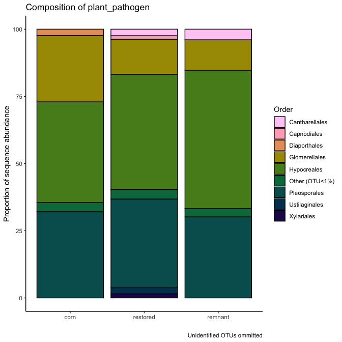
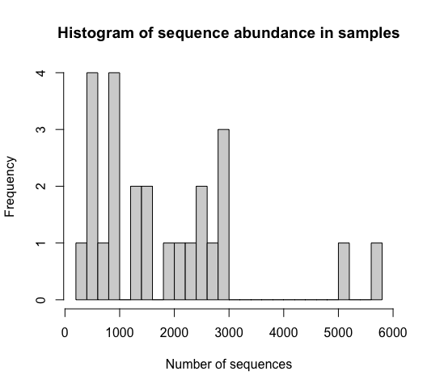
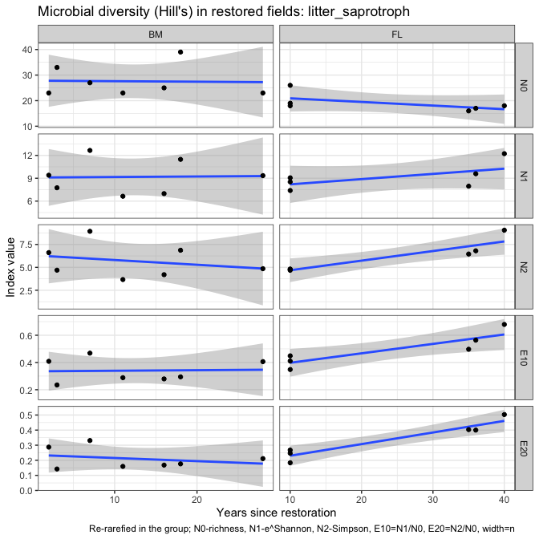
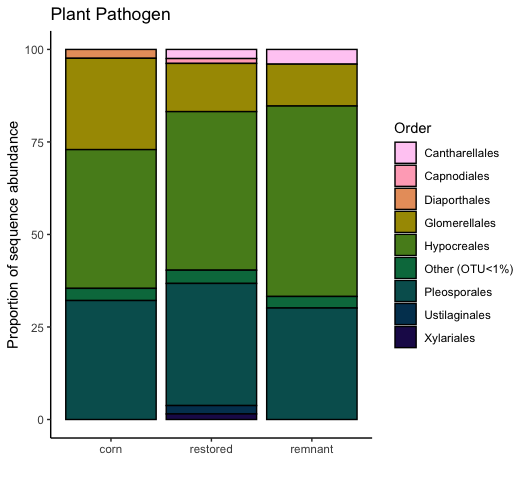

Microbial data: microbial guilds and taxonomy
================
Beau Larkin

Last updated: 02 January, 2024

- [Description](#description)
- [Packages and libraries](#packages-and-libraries)
- [Functions](#functions)
- [Data](#data)
  - [Sites-species tables](#sites-species-tables)
  - [Species metadata](#species-metadata)
  - [Site metadata and design](#site-metadata-and-design)
  - [Joined species, metadata, and design
    tables](#joined-species-metadata-and-design-tables)
  - [Plant traits data](#plant-traits-data)
  - [Plant species data](#plant-species-data)
- [Analysis and Results](#analysis-and-results)
  - [ITS sequences](#its-sequences)
    - [Unassigned taxa](#unassigned-taxa)
    - [Composition in field types](#composition-in-field-types)
    - [Soil saprotrophs](#soil-saprotrophs)
    - [Plant pathogens](#plant-pathogens)
    - [Wood saprotrophs](#wood-saprotrophs)
    - [Litter saprotrophs](#litter-saprotrophs)
    - [Plant functional groups and
      guilds](#plant-functional-groups-and-guilds)
  - [AMF](#amf)
    - [Claroideoglomeraceae](#claroideoglomeraceae)
    - [Paraglomeraceae](#paraglomeraceae)
    - [Diversisporaceae](#diversisporaceae)
    - [Gigasporaceae](#gigasporaceae)
    - [Plant functional groups and AMF
      families](#plant-functional-groups-and-amf-families)
- [Conclusions: taxa and guilds](#conclusions-taxa-and-guilds)
- [Appendix: Rarefy in guilds?](#appendix-rarefy-in-guilds)
  - [Diversity with ITS sequences](#diversity-with-its-sequences)
- [Appendix: Composition in regions](#appendix-composition-in-regions)
  - [Blue Mounds](#blue-mounds)
  - [Faville Grove](#faville-grove)
  - [Fermi](#fermi)
  - [Lake Petite](#lake-petite)
- [Appendix: Plots for final report](#appendix-plots-for-final-report)

# Description

Sequence clusters identified in QIIME2 are annotated with taxonomic
information and metadata from [Fungal
traits](https://link.springer.com/article/10.1007/s13225-020-00466-2).
In this report, sequence abundances in taxonomic groups or fungal guilds
are compared across field types and with time since restoration.

The full sequence abundance tables were rarefied to make sequencing
depth equivalent across fields. This can result in lower-abundance OTUs
dropping to zero. Within guilds, loss of OTUs could change or bias
interpretations of richness, diversity, and composition. We tried using
raw sequence data and rarefying within guilds to address this problem,
but in each case the sequence depth was so small that additional OTUs
were lost and abundances were significantly lowered.

We may try a different approach which is described in [Semchenko et
al. 2018](https://www.science.org/doi/10.1126/sciadv.aau4578), but for
now, the analysis uses data from the entire rarefied tables for ITS and
18S sequences.

# Packages and libraries

``` r
packages_needed = c("tidyverse",
                    "knitr",
                    "conflicted",
                    "ggbeeswarm",
                    "colorspace",
                    "rsq",
                    "lme4",
                    "multcomp",
                    "indicspecies",
                    "GUniFrac",
                    "vegan",
                    "GGally",
                    "car")
packages_installed = packages_needed %in% rownames(installed.packages())
```

``` r
if (any(!packages_installed)) {
    install.packages(packages_needed[!packages_installed])
}
```

``` r
for (i in 1:length(packages_needed)) {
    library(packages_needed[i], character.only = T)
}
```

``` r
conflict_prefer("filter", "dplyr")
conflict_prefer("select", "dplyr")
```

# Functions

Functions streamline data processing, model fitting, and results output.
Functions for this script are found in a [supplemental
script](supporting_files/microbial_guild_taxonomy_functions.R) and are
loaded here for convenience.

``` r
source("supporting_files/microbial_guild_taxonomy_functions.R")
```

# Data

## Sites-species tables

CSV files were produced in `process_data.R`

``` r
spe <- list(
    its_raw = read_csv(
        paste0(getwd(), "/clean_data/spe_ITS_raw.csv"),
        show_col_types = FALSE
    ),
    its_rfy = read_csv(
        paste0(getwd(), "/clean_data/spe_ITS_rfy.csv"),
        show_col_types = FALSE
    ),
    amf_raw = read_csv(
        paste0(getwd(), "/clean_data/spe_18S_raw.csv"),
        show_col_types = FALSE
    ),
    amf_rfy = read_csv(
        paste0(getwd(), "/clean_data/spe_18S_rfy.csv"),
        show_col_types = FALSE
    )
)
```

## Species metadata

Load taxonomy for all and guilds (called *primary lifestyle* in Fungal
Traits) for ITS OTUs. Replace NA values with “unidentified” to show
complete numbers of unidentified groups.

``` r
meta <- list(
    its = read_csv(
        paste0(getwd(), "/clean_data/spe_ITS_metadata.csv"),
        show_col_types = FALSE
    ),
    amf = read_csv(
        paste0(getwd(), "/clean_data/spe_18S_metadata.csv"),
        show_col_types = FALSE
    )
) %>% 
    map(. %>% mutate(across(everything(), ~ replace_na(., "unidentified"))))
```

## Site metadata and design

``` r
sites   <-
    read_csv(paste0(getwd(), "/clean_data/sites.csv"), show_col_types = FALSE) %>%
    mutate(
        field_type = factor(
            field_type,
            ordered = TRUE,
            levels = c("corn", "restored", "remnant")
        )) %>%
    select(-lat, -long, -yr_restore, -yr_rank) %>% 
    arrange(field_key)
```

## Joined species, metadata, and design tables

Functions streamline this process

``` r
join_spe_meta <-
    function(spe, meta) {
        spe %>%
            pivot_longer(starts_with("otu"),
                         names_to = "otu_num",
                         values_to = "seq_abund") %>%
            filter(seq_abund != 0) %>%
            left_join(meta, by = join_by(otu_num)) %>%
            left_join(sites, by = join_by(field_key))
    }
```

``` r
spe_meta <- list(
    its_raw = 
        join_spe_meta(spe$its_raw, meta$its) %>%
        write_csv(paste0(getwd(), "/clean_data/speTaxa_ITS_raw.csv")),
    its_rfy = 
        join_spe_meta(spe$its_rfy, meta$its) %>%
        write_csv(paste0(getwd(), "/clean_data/speTaxa_ITS_rfy.csv")),
    amf_raw = 
        join_spe_meta(spe$amf_raw, meta$amf) %>%
        write_csv(paste0(getwd(), "/clean_data/speTaxa_18S_raw.csv")),
    amf_rfy = 
        join_spe_meta(spe$amf_rfy, meta$amf) %>%
        write_csv(paste0( getwd(), "/clean_data/speTaxa_18S_rfy.csv" ))
)
```

## Plant traits data

Used for correlations with guild abundances

``` r
ptr_gld <- read_csv("microbial_guild_taxonomy_files/plant_traits_fungal_guilds.csv", show_col_types = FALSE) 
```

## Plant species data

Used for comparisons of plant diversity with guild abundances

``` r
pl_ab <- read_csv(paste0(getwd(), "/clean_data/spe_plant_abund.csv"), show_col_types = FALSE) %>% 
    rename(field_name = SITE) %>% select(-BARESOIL, -LITTER) %>% 
    left_join(sites %>% select(field_name, region, field_type), by = join_by(field_name)) %>% 
    select(field_name, region, field_type, everything())
```

# Analysis and Results

## ITS sequences

Recall the number of OTUs recovered in each dataset. The effect of
rarefying did not change richness or diversity very much.

``` r
# Number of OTUs in raw and rarefied datasets
Map(function(x) ncol(x)-1, spe[1:2])
```

    ## $its_raw
    ## [1] 2895
    ## 
    ## $its_rfy
    ## [1] 2889

### Unassigned taxa

Only 21.8 percent of the ITS sequences were assigned to species. In
terms of the analysis done here, its possibly more alarming that only 36
percent were assigned to primary lifestyles or guilds. This suggests
that when we see guilds concentrating in certain habitats, it’s possible
that the difference doesn’t exist. This is particularly possible because
we have one habitat, cornfields, which has probably been studied more
than the others.

``` r
meta$its %>% 
    select(-otu_num, -otu_ID) %>% 
    map(\(x) round(length(which(x == "unidentified")) / length(x) * 100, 1)) %>% 
    bind_rows() %>% 
    kable(format = "pandoc", caption = "Percent unidentified OTUs in each taxonomic group or guild")
```

| phylum | class | order | family | genus | species | primary_lifestyle |
|-------:|------:|------:|-------:|------:|--------:|------------------:|
|   12.2 |  18.4 |  23.8 |   39.4 |  53.9 |    78.2 |                64 |

Percent unidentified OTUs in each taxonomic group or guild

### Composition in field types

Function outputs are verbose, but details may be necessary later so they
are displayed here.

``` r
its_taxaGuild(spe_meta$its_rfy)
```

    ## 
    ## 
    ## Table: Distribution of ITS OTUs in classes; mean sequence abundance by field type
    ## 
    ## phylum                             order                                        corn   restored   remnant
    ## ---------------------------------  --------------------------------------  ---------  ---------  --------
    ## Ascomycota                         Hypocreales                               8997.40    7898.12   8456.75
    ## Ascomycota                         Pleosporales                              8084.40    8109.94   6731.25
    ## Ascomycota                         Chaetothyriales                            751.40    7126.06   6403.00
    ## Basidiomycota                      Agaricales                                3712.60    2724.81   5767.00
    ## Ascomycota                         Helotiales                                3314.00    4078.81   4633.75
    ## Ascomycota                         unidentified                              1588.40    3882.62   4428.50
    ## Ascomycota                         Sordariales                              13466.00    5470.56   4089.25
    ## unidentified                       unidentified                              1421.60    2447.25   3170.00
    ## Ascomycota                         Onygenales                                  78.60    1609.94   2514.25
    ## Mortierellomycota                  Mortierellales                            4405.40    3562.19   2048.25
    ## Basidiomycota                      Geastrales                                 901.00      55.33   1832.00
    ## Ascomycota                         Geoglossales                                 5.00    1926.00   1804.00
    ## Basidiomycota                      Thelephorales                                5.50      23.20   1049.25
    ## Ascomycota                         Glomerellales                             2317.20    1311.75    846.00
    ## Basidiomycota                      Cantharellales                             507.40     959.94    752.00
    ## Ascomycota                         GS34                                         0.00     111.00    500.50
    ## Glomeromycota                      Glomerales                                 111.00     548.88    491.00
    ## Ascomycota                         Xylariales                                  73.00     355.44    371.75
    ## Ascomycota                         Coniochaetales                             875.00     214.00    353.00
    ## Ascomycota                         Sordariomycetes_ord_Incertae_sedis          45.60     154.38    273.25
    ## Ascomycota                         Magnaporthales                             100.80     195.88    236.50
    ## Basidiomycota                      unidentified                               104.20     683.06    191.00
    ## Ascomycota                         Capnodiales                                677.00     660.81    190.75
    ## Ascomycota                         Pezizales                                 1207.40     429.94    189.25
    ## Basidiomycota                      Russulales                                   4.00       9.75    183.00
    ## Basidiomycota                      Sebacinales                                 30.60     792.06    173.00
    ## Glomeromycota                      unidentified                                 9.50     189.21    155.33
    ## Basidiomycota                      Boletales                                    4.50       7.00    153.00
    ## Ascomycota                         Chaetosphaeriales                          321.25     281.69    135.00
    ## Ascomycota                         Branch06                                    13.75     180.86    122.00
    ## Ascomycota                         Minutisphaerales                             0.00      59.00    117.00
    ## Ascomycota                         Thelebolales                               116.50      42.57    109.75
    ## Basidiomycota                      Auriculariales                             121.75     324.94    108.75
    ## Basidiomycota                      Tremellales                                 16.60     108.88    100.00
    ## Mucoromycota                       unidentified                                 0.00      17.00     92.50
    ## Ascomycota                         Mytilinidales                                0.00       0.00     80.00
    ## Chytridiomycota                    Spizellomycetales                          188.20     123.87     78.00
    ## Basidiomycota                      Trichosporonales                            62.50      38.18     77.75
    ## Chytridiomycota                    Rhizophlyctidales                          270.20     139.87     72.75
    ## Basidiomycota                      Cystofilobasidiales                       2775.60      92.64     71.00
    ## Basidiomycota                      Filobasidiales                            1116.00     365.93     70.33
    ## Mucoromycota                       Umbelopsidales                               0.00       2.00     69.00
    ## Basidiomycota                      Trechisporales                             153.80     510.19     68.00
    ## Ascomycota                         Venturiales                                 31.33      92.92     63.00
    ## Basidiomycota                      Ustilaginales                                3.00     138.00     54.33
    ## Basidiomycota                      Tremellodendropsidales                       9.00      48.00     46.00
    ## Ascomycota                         Mytilinidiales                               0.00      15.00     44.67
    ## Basidiomycota                      Hymenochaetales                             17.20     191.50     43.67
    ## Ascomycota                         Verrucariales                                0.00      60.00     43.00
    ## Ascomycota                         Orbiliales                                  19.33      90.86     42.00
    ## Basidiomycota                      Polyporales                                 20.20      32.47     36.25
    ## Ascomycota                         Tubeufiales                                 69.80     216.44     32.50
    ## Basidiomycota                      Geminibasidiales                            33.00      60.50     31.00
    ## Basidiomycota                      Atheliales                                   0.00     158.00     30.00
    ## Ascomycota                         Saccharomycetales                          279.00      43.75     27.33
    ## Chytridiomycota                    Chytridiales                                 0.00      93.50     24.00
    ## Ascomycota                         Microascales                               132.80      87.17     23.67
    ## Basidiomycota                      Phallales                                  237.25      42.33     23.33
    ## Rozellomycota                      GS11                                         0.00       2.00     23.00
    ## Ascomycota                         Myrmecridiales                               0.00      76.50     21.50
    ## Basidiomycota                      Erythrobasidiales                            0.00       4.80     21.00
    ## Ascomycota                         Diaporthales                               216.00      15.14     17.50
    ## Ascomycota                         GS32                                         0.00       0.00     17.00
    ## Ascomycota                         Ostropales                                   0.00      53.00     16.00
    ## Ascomycota                         Eurotiales                                 114.40      40.62     15.00
    ## Chytridiomycota                    Rhizophydiales                              31.33      23.90     14.50
    ## Basidiomycota                      Leucosporidiales                            38.67       8.86     13.50
    ## Ascomycota                         Savoryellales                               15.00      14.40     12.33
    ## Ascomycota                         Archaeorhizomycetales                        0.00      34.14     10.00
    ## Glomeromycota                      Archaeosporales                              3.00      13.33     10.00
    ## Ascomycota                         Acrospermales                                0.00       7.00      9.00
    ## Mortierellomycota                  unidentified                                 0.00       4.50      9.00
    ## Chlorophyta                        Chaetopeltidales                            13.00       7.60      8.50
    ## Basidiomycota                      Microbotryomycetes_ord_Incertae_sedis        8.50      19.17      7.00
    ## Ascomycota                         Rhytismatales                                0.00       2.00      6.00
    ## Basidiobolomycota                  Basidiobolales                               0.00      16.00      6.00
    ## Glomeromycota                      Diversisporales                              0.00       8.00      5.50
    ## Ascomycota                         Dothideales                                  0.00      32.44      5.00
    ## Chlorophyta                        unidentified                                 8.00       8.67      5.00
    ## Basidiomycota                      Agaricomycetes_ord_Incertae_sedis            0.00       0.00      4.00
    ## Basidiomycota                      Atractiellales                              13.50      10.00      3.00
    ## Mucoromycota                       GS22                                         0.00       2.00      3.00
    ## Ascomycota                         Candelariales                                0.00       4.00      2.00
    ## Mucoromycota                       Mucorales                                    0.00       5.83      1.50
    ## Entorrhizomycota                   Entorrhizales                                0.00       0.00      1.00
    ## Ichthyosporia_phy_Incertae_sedis   unidentified                                 0.00       0.00      1.00
    ## Anthophyta                         Asterales                                    0.00       3.00      0.00
    ## Anthophyta                         Brassicales                                 12.00       4.50      0.00
    ## Anthophyta                         Commelinales                                 3.00     227.00      0.00
    ## Anthophyta                         Fabales                                      0.00      11.33      0.00
    ## Anthophyta                         Poales                                       4.00       4.00      0.00
    ## Ascomycota                         Boliniales                                  41.67      51.50      0.00
    ## Ascomycota                         Botryosphaeriales                           19.25      20.33      0.00
    ## Ascomycota                         Jahnulales                                  12.00       0.00      0.00
    ## Ascomycota                         Lichenostigmatales                           0.00       3.00      0.00
    ## Ascomycota                         Microthyriales                               0.00      12.00      0.00
    ## Ascomycota                         Pezizomycotina_ord_Incertae_sedis           32.00     502.00      0.00
    ## Ascomycota                         Phacidiales                                  0.00       7.00      0.00
    ## Ascomycota                         Phomatosporales                            712.00      10.25      0.00
    ## Ascomycota                         Trichosphaeriales                            4.00      24.00      0.00
    ## Basidiomycota                      Agaricostilbales                             1.00       0.00      0.00
    ## Basidiomycota                      Corticiales                                  0.00      81.33      0.00
    ## Basidiomycota                      Cystobasidiales                             43.50      12.00      0.00
    ## Basidiomycota                      Entylomatales                                0.00      13.50      0.00
    ## Basidiomycota                      Holtermanniales                              4.25      13.67      0.00
    ## Basidiomycota                      Kriegeriales                                 3.00      12.00      0.00
    ## Basidiomycota                      Platygloeales                                0.00      79.40      0.00
    ## Basidiomycota                      Pucciniales                                  0.00       3.00      0.00
    ## Basidiomycota                      Sporidiobolales                             43.00       6.75      0.00
    ## Basidiomycota                      Tilletiales                                 11.00      24.00      0.00
    ## Basidiomycota                      Urocystidales                               74.00       5.50      0.00
    ## Calcarisporiellomycota             Calcarisporiellales                          0.00       3.00      0.00
    ## Cercozoa                           unidentified                                 4.00       3.00      0.00
    ## Chlorophyta                        Chaetophorales                               0.00      24.33      0.00
    ## Chlorophyta                        Chlorellales                                 0.00       6.00      0.00
    ## Chlorophyta                        Sphaeropleales                               0.00       5.00      0.00
    ## Chytridiomycota                    unidentified                                23.00      12.00      0.00
    ## Glomeromycota                      Paraglomerales                               5.00      12.60      0.00
    ## Haplosporidia                      Haplosporidia_ord_Incertae_sedis             3.00      10.00      0.00
    ## Monoblepharomycota                 Monoblepharidales                            2.00       0.00      0.00
    ## [[1]]
    ## 
    ## 
    ## Table: Distribution of ITS OTUs by Fungal Trait 'primary_lifestyle'; mean sequence abundance by field type
    ## 
    ## primary_lifestyle            corn   restored   remnant     total
    ## -----------------------  --------  ---------  --------  --------
    ## unidentified              25995.2    31579.8   34912.2   92487.2
    ## plant_pathogen             9226.2     9085.7    7181.5   25493.4
    ## soil_saprotroph            9144.6     7633.6    7796.2   24574.4
    ## wood_saprotroph            3700.0     2879.7    1773.8    8353.5
    ## dung_saprotroph            3436.0     1997.8    1115.2    6549.0
    ## litter_saprotroph          2517.8     1765.4    1296.0    5579.2
    ## mycoparasite               2156.6      724.5     345.0    3226.1
    ## animal_parasite             785.0     1341.9     846.5    2973.4
    ## ectomycorrhizal              11.0      153.0    2147.0    2311.0
    ## unspecified_saprotroph      921.2      209.2     204.5    1334.9
    ## root_endophyte               16.0      486.3     231.5     733.8
    ## arbuscular_mycorrhizal       78.8      245.5     180.8     505.1
    ## pollen_saprotroph           169.8      111.3      61.0     342.1
    ## lichenized                    0.0      102.0      16.0     118.0
    ## lichen_parasite              16.0       47.8      43.8     107.6
    ## nectar/tap_saprotroph        37.0       42.3      27.3     106.6
    ## foliar_endophyte              3.7       34.5       7.0      45.2
    ## epiphyte                      0.0        6.0      25.0      31.0
    ## unspecified_pathotroph        0.0       16.2      10.0      26.2
    ## algal_parasite                2.0        3.2       0.0       5.2
    ## 
    ## [[2]]


    ## 
    ## [[3]]


The top guilds are:

1.  Unidentified (not shown on column charts)
2.  plant pathogens
3.  soil saprotrophs
4.  wood saprotrophs
5.  dung saprotrophs
6.  litter saprotrophs

Compared with the sequence abundance in the NA group, plant pathogens
and soil saprotrophs are abundant enough to feel somewhat confident
about in terms of coverage.

``` r
its_rfy_guilds <- its_test_taxaGuild(spe_meta$its_rfy)
```

    ## ---------------------------------
    ## [1] "soil_saprotroph"
    ## ---------------------------------
    ## 
    ## 
    ## field_type   region   field_name    yr_since  primary_lifestyle    seq_sum
    ## -----------  -------  -----------  ---------  ------------------  --------
    ## corn         FL       FLC2                 0  soil_saprotroph        15660
    ## restored     BM       KORP1               28  soil_saprotroph        14147
    ## remnant      LP       LPREM1              NA  soil_saprotroph        12408
    ## restored     FL       FLRSP1              10  soil_saprotroph        11647
    ## corn         LP       LPC1                 0  soil_saprotroph        10281
    ## remnant      BM       MBREM1              NA  soil_saprotroph        10145
    ## restored     FL       FLRSP3              10  soil_saprotroph        10096
    ## restored     FL       FLRP5               35  soil_saprotroph        10043
    ## corn         FL       FLC1                 0  soil_saprotroph         9527
    ## restored     BM       BBRP1               16  soil_saprotroph         8987
    ## restored     FL       FLRP1               40  soil_saprotroph         8901
    ## restored     BM       PHRP1               11  soil_saprotroph         8382
    ## restored     FL       FLRSP2              10  soil_saprotroph         7641
    ## restored     BM       ERRP1                3  soil_saprotroph         7376
    ## restored     BM       MBRP1               18  soil_saprotroph         5986
    ## corn         BM       PHC1                 0  soil_saprotroph         5950
    ## restored     FL       FLRP4               36  soil_saprotroph         5562
    ## restored     LP       LPRP1                4  soil_saprotroph         5403
    ## restored     BM       MHRP2                2  soil_saprotroph         5090
    ## remnant      FG       FGREM1              NA  soil_saprotroph         4895
    ## restored     LP       LPRP2                4  soil_saprotroph         4490
    ## restored     BM       MHRP1                7  soil_saprotroph         4457
    ## corn         FG       FGC1                 0  soil_saprotroph         4305
    ## restored     FG       FGRP1               15  soil_saprotroph         3929
    ## remnant      FL       FLREM1              NA  soil_saprotroph         3737
    ## ----------------------------------------------------
    ## 
    ## Linear mixed model fit by maximum likelihood  ['lmerMod']
    ## Formula: seq_sum ~ field_type + (1 | region)
    ##    Data: mod_data
    ##       AIC       BIC    logLik  deviance  df.resid 
    ##  484.4735  490.5679 -237.2368  474.4735        20 
    ## Random effects:
    ##  Groups   Name        Std.Dev. 
    ##  region   (Intercept) 1.807e-06
    ##  Residual             3.199e+03
    ## Number of obs: 25, groups:  region, 4
    ## Fixed Effects:
    ##  (Intercept)  field_type.L  field_type.Q  
    ##       8191.5        -953.4         683.3  
    ## optimizer (nloptwrap) convergence code: 0 (OK) ; 0 optimizer warnings; 1 lme4 warnings 
    ## ----------------------------------------------------
    ## 
    ## Linear mixed model fit by maximum likelihood  ['lmerMod']
    ## Formula: seq_sum ~ 1 + (1 | region)
    ##    Data: mod_data
    ##       AIC       BIC    logLik  deviance  df.resid 
    ##  481.3218  484.9784 -237.6609  475.3218        22 
    ## Random effects:
    ##  Groups   Name        Std.Dev.
    ##  region   (Intercept)    0    
    ##  Residual             3254    
    ## Number of obs: 25, groups:  region, 4
    ## Fixed Effects:
    ## (Intercept)  
    ##        7962  
    ## optimizer (nloptwrap) convergence code: 0 (OK) ; 0 optimizer warnings; 1 lme4 warnings 
    ## ----------------------------------------------------
    ## 
    ## Data: mod_data
    ## Models:
    ## mmod_null: seq_sum ~ 1 + (1 | region)
    ## mmod: seq_sum ~ field_type + (1 | region)
    ##           npar    AIC    BIC  logLik deviance  Chisq Df Pr(>Chisq)
    ## mmod_null    3 481.32 484.98 -237.66   475.32                     
    ## mmod         5 484.47 490.57 -237.24   474.47 0.8483  2     0.6543
    ## ----------------------------------------------------
    ## 
    ## 
    ##   Simultaneous Tests for General Linear Hypotheses
    ## 
    ## Multiple Comparisons of Means: Tukey Contrasts
    ## 
    ## 
    ## Fit: lmer(formula = seq_sum ~ field_type + (1 | region), data = mod_data, 
    ##     REML = FALSE)
    ## 
    ## Linear Hypotheses:
    ##                         Estimate Std. Error z value Pr(>|z|)
    ## restored - corn == 0     -1511.0     1638.9  -0.922    0.622
    ## remnant - corn == 0      -1348.3     2145.8  -0.628    0.802
    ## remnant - restored == 0    162.7     1788.2   0.091    0.995
    ## (Adjusted p values reported -- single-step method)
    ## 
    ##     corn restored  remnant 
    ##      "a"      "a"      "a" 
    ## ----------------------------------------------------
    ## 
    ## [1] "Years since restoration and soil_saprotroph sequence abundance in Blue Mounds Area"
    ## 
    ## Call:
    ## lm(formula = seq_sum ~ yr_since, data = mod_data2)
    ## 
    ## Residuals:
    ##       1       2       3       4       5       6       7 
    ##   144.5  2131.3  1983.4 -3410.0 -1894.7   122.1   923.3 
    ## 
    ## Coefficients:
    ##             Estimate Std. Error t value Pr(>|t|)  
    ## (Intercept)  4414.39    1452.73   3.039   0.0288 *
    ## yr_since      276.76      97.72   2.832   0.0366 *
    ## ---
    ## Signif. codes:  0 '***' 0.001 '**' 0.01 '*' 0.05 '.' 0.1 ' ' 1
    ## 
    ## Residual standard error: 2217 on 5 degrees of freedom
    ## Multiple R-squared:  0.616,  Adjusted R-squared:  0.5392 
    ## F-statistic: 8.021 on 1 and 5 DF,  p-value: 0.03658
    ## 
    ## 
    ## 
    ## 
    ## ---------------------------------
    ## [1] "plant_pathogen"
    ## ---------------------------------
    ## 
    ## 
    ## field_type   region   field_name    yr_since  primary_lifestyle    seq_sum
    ## -----------  -------  -----------  ---------  ------------------  --------
    ## restored     BM       MHRP2                2  plant_pathogen         16144
    ## restored     BM       MHRP1                7  plant_pathogen         15475
    ## restored     LP       LPRP1                4  plant_pathogen         15150
    ## restored     BM       PHRP1               11  plant_pathogen         14453
    ## corn         LP       LPC1                 0  plant_pathogen         14056
    ## restored     FG       FGRP1               15  plant_pathogen         12283
    ## restored     BM       ERRP1                3  plant_pathogen         12253
    ## corn         FG       FGC1                 0  plant_pathogen          9773
    ## remnant      LP       LPREM1              NA  plant_pathogen          9538
    ## corn         FL       FLC2                 0  plant_pathogen          9080
    ## remnant      FG       FGREM1              NA  plant_pathogen          8425
    ## restored     BM       BBRP1               16  plant_pathogen          7654
    ## restored     LP       LPRP2                4  plant_pathogen          7631
    ## remnant      FL       FLREM1              NA  plant_pathogen          7623
    ## corn         FL       FLC1                 0  plant_pathogen          7400
    ## restored     FL       FLRP1               40  plant_pathogen          6714
    ## restored     FL       FLRSP2              10  plant_pathogen          6514
    ## restored     FL       FLRSP1              10  plant_pathogen          6155
    ## corn         BM       PHC1                 0  plant_pathogen          5822
    ## restored     BM       MBRP1               18  plant_pathogen          5265
    ## restored     BM       KORP1               28  plant_pathogen          5233
    ## restored     FL       FLRP5               35  plant_pathogen          4937
    ## restored     FL       FLRP4               36  plant_pathogen          4825
    ## restored     FL       FLRSP3              10  plant_pathogen          4685
    ## remnant      BM       MBREM1              NA  plant_pathogen          3140
    ## ----------------------------------------------------
    ## 
    ## Linear mixed model fit by maximum likelihood  ['lmerMod']
    ## Formula: seq_sum ~ field_type + (1 | region)
    ##    Data: mod_data
    ##       AIC       BIC    logLik  deviance  df.resid 
    ##  490.7266  496.8210 -240.3633  480.7266        20 
    ## Random effects:
    ##  Groups   Name        Std.Dev.
    ##  region   (Intercept) 1562    
    ##  Residual             3398    
    ## Number of obs: 25, groups:  region, 4
    ## Fixed Effects:
    ##  (Intercept)  field_type.L  field_type.Q  
    ##       8776.0       -1710.7        -942.7  
    ## ----------------------------------------------------
    ## 
    ## Linear mixed model fit by maximum likelihood  ['lmerMod']
    ## Formula: seq_sum ~ 1 + (1 | region)
    ##    Data: mod_data
    ##       AIC       BIC    logLik  deviance  df.resid 
    ##  488.2103  491.8669 -241.1051  482.2103        22 
    ## Random effects:
    ##  Groups   Name        Std.Dev.
    ##  region   (Intercept) 1331    
    ##  Residual             3557    
    ## Number of obs: 25, groups:  region, 4
    ## Fixed Effects:
    ## (Intercept)  
    ##        9068  
    ## ----------------------------------------------------
    ## 
    ## Data: mod_data
    ## Models:
    ## mmod_null: seq_sum ~ 1 + (1 | region)
    ## mmod: seq_sum ~ field_type + (1 | region)
    ##           npar    AIC    BIC  logLik deviance  Chisq Df Pr(>Chisq)
    ## mmod_null    3 488.21 491.87 -241.10   482.21                     
    ## mmod         5 490.73 496.82 -240.36   480.73 1.4837  2     0.4762
    ## ----------------------------------------------------
    ## 
    ## 
    ##   Simultaneous Tests for General Linear Hypotheses
    ## 
    ## Multiple Comparisons of Means: Tukey Contrasts
    ## 
    ## 
    ## Fit: lmer(formula = seq_sum ~ field_type + (1 | region), data = mod_data, 
    ##     REML = FALSE)
    ## 
    ## Linear Hypotheses:
    ##                         Estimate Std. Error z value Pr(>|z|)
    ## restored - corn == 0      -55.07    1766.76  -0.031    0.999
    ## remnant - corn == 0     -2419.35    2285.72  -1.058    0.536
    ## remnant - restored == 0 -2364.28    1932.90  -1.223    0.435
    ## (Adjusted p values reported -- single-step method)
    ## 
    ##     corn restored  remnant 
    ##      "a"      "a"      "a" 
    ## ----------------------------------------------------
    ## 
    ## [1] "Years since restoration and plant_pathogen sequence abundance in Blue Mounds Area"
    ## 
    ## Call:
    ## lm(formula = seq_sum ~ yr_since, data = mod_data2)
    ## 
    ## Residuals:
    ##       1       2       3       4       5       6       7 
    ## -1559.2 -2730.6  1346.4 -3060.4  2266.9   716.5  3020.4 
    ## 
    ## Coefficients:
    ##             Estimate Std. Error t value Pr(>|t|)    
    ## (Intercept)  16315.3     1754.1   9.301 0.000242 ***
    ## yr_since      -443.9      118.0  -3.762 0.013132 *  
    ## ---
    ## Signif. codes:  0 '***' 0.001 '**' 0.01 '*' 0.05 '.' 0.1 ' ' 1
    ## 
    ## Residual standard error: 2677 on 5 degrees of freedom
    ## Multiple R-squared:  0.7389, Adjusted R-squared:  0.6867 
    ## F-statistic: 14.15 on 1 and 5 DF,  p-value: 0.01313
    ## 
    ## 
    ## 
    ## 
    ## ---------------------------------
    ## [1] "ectomycorrhizal"
    ## ---------------------------------
    ## 
    ## 
    ## field_type   region   field_name    yr_since  primary_lifestyle    seq_sum
    ## -----------  -------  -----------  ---------  ------------------  --------
    ## remnant      FG       FGREM1              NA  ectomycorrhizal         3499
    ## remnant      FL       FLREM1              NA  ectomycorrhizal         3418
    ## remnant      BM       MBREM1              NA  ectomycorrhizal         1121
    ## restored     BM       MBRP1               18  ectomycorrhizal          585
    ## remnant      LP       LPREM1              NA  ectomycorrhizal          550
    ## restored     FL       FLRP1               40  ectomycorrhizal           15
    ## corn         LP       LPC1                 0  ectomycorrhizal           11
    ## restored     BM       MHRP2                2  ectomycorrhizal            7
    ## restored     FG       FGRP1               15  ectomycorrhizal            5
    ## ----------------------------------------------------
    ## 
    ## Linear mixed model fit by maximum likelihood  ['lmerMod']
    ## Formula: seq_sum ~ field_type + (1 | region)
    ##    Data: mod_data
    ##      AIC      BIC   logLik deviance df.resid 
    ## 157.9906 158.9767 -73.9953 147.9906        4 
    ## Random effects:
    ##  Groups   Name        Std.Dev.
    ##  region   (Intercept)   0.0   
    ##  Residual             900.3   
    ## Number of obs: 9, groups:  region, 4
    ## Fixed Effects:
    ##  (Intercept)  field_type.L  field_type.Q  
    ##        770.3        1510.4         756.1  
    ## optimizer (nloptwrap) convergence code: 0 (OK) ; 0 optimizer warnings; 1 lme4 warnings 
    ## ----------------------------------------------------
    ## 
    ## Linear mixed model fit by maximum likelihood  ['lmerMod']
    ## Formula: seq_sum ~ 1 + (1 | region)
    ##    Data: mod_data
    ##      AIC      BIC   logLik deviance df.resid 
    ## 161.2813 161.8730 -77.6407 155.2813        6 
    ## Random effects:
    ##  Groups   Name        Std.Dev.
    ##  region   (Intercept)    0    
    ##  Residual             1350    
    ## Number of obs: 9, groups:  region, 4
    ## Fixed Effects:
    ## (Intercept)  
    ##        1023  
    ## optimizer (nloptwrap) convergence code: 0 (OK) ; 0 optimizer warnings; 1 lme4 warnings 
    ## ----------------------------------------------------
    ## 
    ## Data: mod_data
    ## Models:
    ## mmod_null: seq_sum ~ 1 + (1 | region)
    ## mmod: seq_sum ~ field_type + (1 | region)
    ##           npar    AIC    BIC  logLik deviance  Chisq Df Pr(>Chisq)  
    ## mmod_null    3 161.28 161.87 -77.641   155.28                       
    ## mmod         5 157.99 158.98 -73.995   147.99 7.2907  2    0.02611 *
    ## ---
    ## Signif. codes:  0 '***' 0.001 '**' 0.01 '*' 0.05 '.' 0.1 ' ' 1
    ## ----------------------------------------------------
    ## 
    ## 
    ##   Simultaneous Tests for General Linear Hypotheses
    ## 
    ## Multiple Comparisons of Means: Tukey Contrasts
    ## 
    ## 
    ## Fit: lmer(formula = seq_sum ~ field_type + (1 | region), data = mod_data, 
    ##     REML = FALSE)
    ## 
    ## Linear Hypotheses:
    ##                         Estimate Std. Error z value Pr(>|z|)   
    ## restored - corn == 0       142.0     1006.6   0.141  0.98882   
    ## remnant - corn == 0       2136.0     1006.6   2.122  0.08211 . 
    ## remnant - restored == 0   1994.0      636.6   3.132  0.00469 **
    ## ---
    ## Signif. codes:  0 '***' 0.001 '**' 0.01 '*' 0.05 '.' 0.1 ' ' 1
    ## (Adjusted p values reported -- single-step method)
    ## 
    ##     corn restored  remnant 
    ##     "ab"      "a"      "b" 
    ## ----------------------------------------------------
    ## 
    ## [1] "Years since restoration and ectomycorrhizal sequence abundance in Blue Mounds Area"
    ## 
    ## Call:
    ## lm(formula = seq_sum ~ yr_since, data = mod_data2)
    ## 
    ## Residuals:
    ## ALL 2 residuals are 0: no residual degrees of freedom!
    ## 
    ## Coefficients:
    ##             Estimate Std. Error t value Pr(>|t|)
    ## (Intercept)   -65.25        NaN     NaN      NaN
    ## yr_since       36.12        NaN     NaN      NaN
    ## 
    ## Residual standard error: NaN on 0 degrees of freedom
    ## Multiple R-squared:      1,  Adjusted R-squared:    NaN 
    ## F-statistic:   NaN on 1 and 0 DF,  p-value: NA
    ## 
    ## 
    ## 
    ## 
    ## ---------------------------------
    ## [1] "wood_saprotroph"
    ## ---------------------------------
    ## 
    ## 
    ## field_type   region   field_name    yr_since  primary_lifestyle    seq_sum
    ## -----------  -------  -----------  ---------  ------------------  --------
    ## restored     LP       LPRP2                4  wood_saprotroph         5925
    ## corn         LP       LPC1                 0  wood_saprotroph         4613
    ## corn         FG       FGC1                 0  wood_saprotroph         4555
    ## restored     FL       FLRSP2              10  wood_saprotroph         4469
    ## restored     FG       FGRP1               15  wood_saprotroph         4341
    ## corn         FL       FLC1                 0  wood_saprotroph         4198
    ## restored     BM       PHRP1               11  wood_saprotroph         3885
    ## corn         BM       PHC1                 0  wood_saprotroph         3490
    ## restored     BM       MHRP2                2  wood_saprotroph         3268
    ## restored     LP       LPRP1                4  wood_saprotroph         3244
    ## restored     BM       ERRP1                3  wood_saprotroph         3164
    ## restored     BM       MHRP1                7  wood_saprotroph         2960
    ## remnant      FL       FLREM1              NA  wood_saprotroph         2849
    ## restored     FL       FLRP4               36  wood_saprotroph         2790
    ## restored     BM       MBRP1               18  wood_saprotroph         2600
    ## restored     FL       FLRSP1              10  wood_saprotroph         2290
    ## restored     FL       FLRP5               35  wood_saprotroph         2007
    ## restored     FL       FLRP1               40  wood_saprotroph         1771
    ## remnant      LP       LPREM1              NA  wood_saprotroph         1649
    ## corn         FL       FLC2                 0  wood_saprotroph         1644
    ## remnant      FG       FGREM1              NA  wood_saprotroph         1574
    ## restored     FL       FLRSP3              10  wood_saprotroph         1425
    ## remnant      BM       MBREM1              NA  wood_saprotroph         1023
    ## restored     BM       KORP1               28  wood_saprotroph          990
    ## restored     BM       BBRP1               16  wood_saprotroph          946
    ## ----------------------------------------------------
    ## 
    ## Linear mixed model fit by maximum likelihood  ['lmerMod']
    ## Formula: seq_sum ~ field_type + (1 | region)
    ##    Data: mod_data
    ##       AIC       BIC    logLik  deviance  df.resid 
    ##  434.5337  440.6281 -212.2669  424.5337        20 
    ## Random effects:
    ##  Groups   Name        Std.Dev.
    ##  region   (Intercept)  373.2  
    ##  Residual             1131.8  
    ## Number of obs: 25, groups:  region, 4
    ## Fixed Effects:
    ##  (Intercept)  field_type.L  field_type.Q  
    ##       2844.8       -1392.5        -211.6  
    ## ----------------------------------------------------
    ## 
    ## Linear mixed model fit by maximum likelihood  ['lmerMod']
    ## Formula: seq_sum ~ 1 + (1 | region)
    ##    Data: mod_data
    ##       AIC       BIC    logLik  deviance  df.resid 
    ##  436.0548  439.7114 -215.0274  430.0548        22 
    ## Random effects:
    ##  Groups   Name        Std.Dev.
    ##  region   (Intercept)    0    
    ##  Residual             1316    
    ## Number of obs: 25, groups:  region, 4
    ## Fixed Effects:
    ## (Intercept)  
    ##        2867  
    ## optimizer (nloptwrap) convergence code: 0 (OK) ; 0 optimizer warnings; 1 lme4 warnings 
    ## ----------------------------------------------------
    ## 
    ## Data: mod_data
    ## Models:
    ## mmod_null: seq_sum ~ 1 + (1 | region)
    ## mmod: seq_sum ~ field_type + (1 | region)
    ##           npar    AIC    BIC  logLik deviance  Chisq Df Pr(>Chisq)  
    ## mmod_null    3 436.05 439.71 -215.03   430.05                       
    ## mmod         5 434.53 440.63 -212.27   424.53 5.5211  2    0.06326 .
    ## ---
    ## Signif. codes:  0 '***' 0.001 '**' 0.01 '*' 0.05 '.' 0.1 ' ' 1
    ## ----------------------------------------------------
    ## 
    ## 
    ##   Simultaneous Tests for General Linear Hypotheses
    ## 
    ## Multiple Comparisons of Means: Tukey Contrasts
    ## 
    ## 
    ## Fit: lmer(formula = seq_sum ~ field_type + (1 | region), data = mod_data, 
    ##     REML = FALSE)
    ## 
    ## Linear Hypotheses:
    ##                         Estimate Std. Error z value Pr(>|z|)  
    ## restored - corn == 0      -725.5      585.9  -1.238   0.4258  
    ## remnant - corn == 0      -1969.4      760.8  -2.589   0.0256 *
    ## remnant - restored == 0  -1243.8      640.2  -1.943   0.1242  
    ## ---
    ## Signif. codes:  0 '***' 0.001 '**' 0.01 '*' 0.05 '.' 0.1 ' ' 1
    ## (Adjusted p values reported -- single-step method)
    ## 
    ##     corn restored  remnant 
    ##      "a"     "ab"      "b" 
    ## ----------------------------------------------------
    ## 
    ## [1] "Years since restoration and wood_saprotroph sequence abundance in Blue Mounds Area"
    ## 
    ## Call:
    ## lm(formula = seq_sum ~ yr_since, data = mod_data2)
    ## 
    ## Residuals:
    ##        1        2        3        4        5        6        7 
    ## -1245.39  -218.21  -102.18   591.81   -55.81  -205.82  1235.60 
    ## 
    ## Coefficients:
    ##             Estimate Std. Error t value Pr(>|t|)   
    ## (Intercept)  3657.02     550.61   6.642  0.00117 **
    ## yr_since      -91.60      37.04  -2.473  0.05631 . 
    ## ---
    ## Signif. codes:  0 '***' 0.001 '**' 0.01 '*' 0.05 '.' 0.1 ' ' 1
    ## 
    ## Residual standard error: 840.4 on 5 degrees of freedom
    ## Multiple R-squared:  0.5502, Adjusted R-squared:  0.4603 
    ## F-statistic: 6.117 on 1 and 5 DF,  p-value: 0.05631
    ## 
    ## 
    ## 
    ## 
    ## ---------------------------------
    ## [1] "litter_saprotroph"
    ## ---------------------------------
    ## 
    ## 
    ## field_type   region   field_name    yr_since  primary_lifestyle    seq_sum
    ## -----------  -------  -----------  ---------  ------------------  --------
    ## corn         FG       FGC1                 0  litter_saprotroph       5654
    ## restored     BM       ERRP1                3  litter_saprotroph       5100
    ## restored     LP       LPRP1                4  litter_saprotroph       2931
    ## restored     BM       MHRP1                7  litter_saprotroph       2902
    ## corn         BM       PHC1                 0  litter_saprotroph       2891
    ## remnant      FL       FLREM1              NA  litter_saprotroph       2679
    ## restored     LP       LPRP2                4  litter_saprotroph       2554
    ## restored     BM       BBRP1               16  litter_saprotroph       2422
    ## restored     BM       MBRP1               18  litter_saprotroph       2392
    ## restored     BM       MHRP2                2  litter_saprotroph       2179
    ## restored     FL       FLRSP2              10  litter_saprotroph       1903
    ## restored     BM       PHRP1               11  litter_saprotroph       1482
    ## corn         FL       FLC1                 0  litter_saprotroph       1436
    ## corn         FL       FLC2                 0  litter_saprotroph       1387
    ## corn         LP       LPC1                 0  litter_saprotroph       1221
    ## restored     FL       FLRSP3              10  litter_saprotroph        989
    ## remnant      FG       FGREM1              NA  litter_saprotroph        927
    ## restored     BM       KORP1               28  litter_saprotroph        908
    ## remnant      LP       LPREM1              NA  litter_saprotroph        906
    ## remnant      BM       MBREM1              NA  litter_saprotroph        672
    ## restored     FL       FLRP4               36  litter_saprotroph        578
    ## restored     FL       FLRP5               35  litter_saprotroph        544
    ## restored     FG       FGRP1               15  litter_saprotroph        540
    ## restored     FL       FLRSP1              10  litter_saprotroph        464
    ## restored     FL       FLRP1               40  litter_saprotroph        359
    ## ----------------------------------------------------
    ## 
    ## Linear mixed model fit by maximum likelihood  ['lmerMod']
    ## Formula: seq_sum ~ field_type + (1 | region)
    ##    Data: mod_data
    ##       AIC       BIC    logLik  deviance  df.resid 
    ##  438.6018  444.6962 -214.3009  428.6018        20 
    ## Random effects:
    ##  Groups   Name        Std.Dev.
    ##  region   (Intercept)  347.4  
    ##  Residual             1238.9  
    ## Number of obs: 25, groups:  region, 4
    ## Fixed Effects:
    ##  (Intercept)  field_type.L  field_type.Q  
    ##       1886.8        -908.4         126.2  
    ## ----------------------------------------------------
    ## 
    ## Linear mixed model fit by maximum likelihood  ['lmerMod']
    ## Formula: seq_sum ~ 1 + (1 | region)
    ##    Data: mod_data
    ##       AIC       BIC    logLik  deviance  df.resid 
    ##  436.9790  440.6356 -215.4895  430.9790        22 
    ## Random effects:
    ##  Groups   Name        Std.Dev.
    ##  region   (Intercept)  263.4  
    ##  Residual             1317.0  
    ## Number of obs: 25, groups:  region, 4
    ## Fixed Effects:
    ## (Intercept)  
    ##        1855  
    ## ----------------------------------------------------
    ## 
    ## Data: mod_data
    ## Models:
    ## mmod_null: seq_sum ~ 1 + (1 | region)
    ## mmod: seq_sum ~ field_type + (1 | region)
    ##           npar    AIC    BIC  logLik deviance  Chisq Df Pr(>Chisq)
    ## mmod_null    3 436.98 440.64 -215.49   430.98                     
    ## mmod         5 438.60 444.70 -214.30   428.60 2.3772  2     0.3047
    ## ----------------------------------------------------
    ## 
    ## 
    ##   Simultaneous Tests for General Linear Hypotheses
    ## 
    ## Multiple Comparisons of Means: Tukey Contrasts
    ## 
    ## 
    ## Fit: lmer(formula = seq_sum ~ field_type + (1 | region), data = mod_data, 
    ##     REML = FALSE)
    ## 
    ## Linear Hypotheses:
    ##                         Estimate Std. Error z value Pr(>|z|)
    ## restored - corn == 0      -796.8      640.0  -1.245    0.422
    ## remnant - corn == 0      -1284.6      832.5  -1.543    0.267
    ## remnant - restored == 0   -487.8      699.1  -0.698    0.762
    ## (Adjusted p values reported -- single-step method)
    ## 
    ##     corn restored  remnant 
    ##      "a"      "a"      "a" 
    ## ----------------------------------------------------
    ## 
    ## [1] "Years since restoration and litter_saprotroph sequence abundance in Blue Mounds Area"
    ## 
    ## Call:
    ## lm(formula = seq_sum ~ yr_since, data = mod_data2)
    ## 
    ## Residuals:
    ##        1        2        3        4        5        6        7 
    ##   295.01  1771.19  -109.61   449.91   -57.02 -1242.26 -1107.23 
    ## 
    ## Coefficients:
    ##             Estimate Std. Error t value Pr(>|t|)   
    ## (Intercept)  3606.16     730.21   4.939  0.00433 **
    ## yr_since      -92.45      49.12  -1.882  0.11855   
    ## ---
    ## Signif. codes:  0 '***' 0.001 '**' 0.01 '*' 0.05 '.' 0.1 ' ' 1
    ## 
    ## Residual standard error: 1115 on 5 degrees of freedom
    ## Multiple R-squared:  0.4147, Adjusted R-squared:  0.2976 
    ## F-statistic: 3.542 on 1 and 5 DF,  p-value: 0.1186

Model tests on `field_type` are shaky due to unbalance, but are included
here to point out trends that we may be able to present in some better
way. Trends with restoration age in Blue Mounds are clearly justified.
Results are shown in descending order based on sequence abundance in
remnants:

- Soil saprotroph increases with years since
- Plant pathogens decrease with years since
- Ectomycorrhizal abundance is very low in corn/restored and with little
  replication; nothing can be said except that it’s relatively abundant
  in remnants.
- Wood saprotroph differs among field types (corn vs. remnant; restored
  intermediate) and decreases with years since
- Litter saprotroph is abundant everywhere, but differences over time or
  field type are weak.

#### ITS-based indicators

An indicator species analysis is warranted, identifying which species
correlate strongly with `field_type`. Performing this with all ITS data
may identify particular species to further examine, although it remains
a weakness that we lack replication within blocks for `field_type` in
some regions.

Following the indicator species analysis, richness and composition of
selected guilds is calculated. These calculations are done with data
re-rarefied into the guilds identified here, again to showcase
particular species which seem to drive differences among field types.
It’s also of value because this approach avoids the problem we have with
pseudoreplication.

With indicator species analysis performed using package
[indicspecies](http://sites.google.com/site/miqueldecaceres/), the index
values A and B show the specificity and fidelity components of the
IndVal combined index. The combined index value is noted as ‘stat’ in
the output table below.

``` r
its_inspan <- 
    spe$its_rfy %>% 
    left_join(sites, by = join_by(field_key)) %>% 
    inspan(., 1999, meta$its)
```

``` r
its_inspan %>%
    mutate(field_type = factor(
        field_type,
        ordered = TRUE,
        levels = c("corn", "restored", "remnant")
    )) %>%
    group_by(field_type) %>%
    summarize(
        n_otu = n(),
        stat_avg = mean(stat),
        stat_sd = sd(stat)
    ) %>% 
    kable(format = "pandoc", caption = "Indicator species stats of entire rarefied ITS table")
```

| field_type | n_otu |  stat_avg |   stat_sd |
|:-----------|------:|----------:|----------:|
| corn       |   102 | 0.8276205 | 0.0916371 |
| restored   |    16 | 0.8003913 | 0.0447815 |
| remnant    |    61 | 0.7448494 | 0.0717315 |

Indicator species stats of entire rarefied ITS table

Potential indicators were filtered to p.value\<0.05 before this summary
was produced. Cornfields are a restrictive habitat for soil microbes,
and that is reflected in the results here. More species have higher
specificity and fidelity to cornfields than to the other field types.
The top ten indicators for each field type are printed here; the entire
table is available for further use.

``` r
its_inspan %>% 
    mutate(field_type = factor(
    field_type,
    ordered = TRUE,
    levels = c("corn", "restored", "remnant")
)) %>%
    group_by(field_type) %>% 
    slice_max(order_by = stat, n = 10) %>% 
    arrange(field_type, -stat) %>% 
    write_csv(., paste0(getwd(), "/microbial_guild_taxonomy_files/its_inspan.csv")) %>% 
    kable(format = "pandoc", caption = "Indicator species of ITS OTUs (top 10 per field type)")
```

| otu_num  |         A |      B |      stat | p.value | field_type | primary_lifestyle | phylum            | class              | order               | family                            | genus                   | species                 |
|:---------|----------:|-------:|----------:|--------:|:-----------|:------------------|:------------------|:-------------------|:--------------------|:----------------------------------|:------------------------|:------------------------|
| otu_537  | 1.0000000 | 1.0000 | 1.0000000 |  0.0005 | corn       | soil_saprotroph   | Basidiomycota     | Agaricomycetes     | Agaricales          | Bolbitiaceae                      | Conocybe                | Conocybe_apala          |
| otu_204  | 0.9905889 | 1.0000 | 0.9952833 |  0.0005 | corn       | unidentified      | Mortierellomycota | Mortierellomycetes | Mortierellales      | Mortierellaceae                   | unidentified            | unidentified            |
| otu_172  | 0.9818747 | 1.0000 | 0.9908959 |  0.0005 | corn       | plant_pathogen    | Ascomycota        | Dothideomycetes    | Pleosporales        | Corynesporascaceae                | Corynespora             | Corynespora_cassiicola  |
| otu_9    | 0.9704910 | 1.0000 | 0.9851350 |  0.0045 | corn       | soil_saprotroph   | Basidiomycota     | Tremellomycetes    | Cystofilobasidiales | Mrakiaceae                        | Tausonia                | Tausonia_pullulans      |
| otu_188  | 0.9636787 | 1.0000 | 0.9816714 |  0.0005 | corn       | unidentified      | unidentified      | unidentified       | unidentified        | unidentified                      | unidentified            | unidentified            |
| otu_694  | 0.9609610 | 1.0000 | 0.9802862 |  0.0005 | corn       | unidentified      | unidentified      | unidentified       | unidentified        | unidentified                      | unidentified            | unidentified            |
| otu_200  | 0.9604618 | 1.0000 | 0.9800315 |  0.0005 | corn       | plant_pathogen    | Ascomycota        | Dothideomycetes    | Pleosporales        | Phaeosphaeriaceae                 | Ophiosphaerella         | unidentified            |
| otu_59   | 0.9577210 | 1.0000 | 0.9786322 |  0.0005 | corn       | soil_saprotroph   | Mortierellomycota | Mortierellomycetes | Mortierellales      | Mortierellaceae                   | Mortierella             | unidentified            |
| otu_364  | 0.9194499 | 1.0000 | 0.9588795 |  0.0005 | corn       | unidentified      | Ascomycota        | Sordariomycetes    | Sordariales         | Lasiosphaeriaceae                 | Cladorrhinum            | unidentified            |
| otu_627  | 0.9146962 | 1.0000 | 0.9563975 |  0.0010 | corn       | unidentified      | unidentified      | unidentified       | unidentified        | unidentified                      | unidentified            | unidentified            |
| otu_461  | 0.8858859 | 0.8750 | 0.8804261 |  0.0070 | restored   | unidentified      | Ascomycota        | Dothideomycetes    | Pleosporales        | Phaeosphaeriaceae                 | unidentified            | unidentified            |
| otu_177  | 0.9697428 | 0.7500 | 0.8528230 |  0.0285 | restored   | unidentified      | Ascomycota        | Dothideomycetes    | Pleosporales        | unidentified                      | unidentified            | unidentified            |
| otu_229  | 0.8847032 | 0.8125 | 0.8478333 |  0.0245 | restored   | unidentified      | Ascomycota        | Dothideomycetes    | Tubeufiales         | Tubeufiaceae                      | unidentified            | unidentified            |
| otu_114  | 0.7523254 | 0.9375 | 0.8398244 |  0.0015 | restored   | soil_saprotroph   | Mortierellomycota | Mortierellomycetes | Mortierellales      | Mortierellaceae                   | Mortierella             | unidentified            |
| otu_35   | 0.7016520 | 1.0000 | 0.8376467 |  0.0180 | restored   | animal_parasite   | Ascomycota        | Sordariomycetes    | Hypocreales         | Clavicipitaceae                   | Metarhizium             | unidentified            |
| otu_32   | 0.6998811 | 1.0000 | 0.8365889 |  0.0395 | restored   | unidentified      | Ascomycota        | Sordariomycetes    | Sordariales         | Chaetomiaceae                     | unidentified            | unidentified            |
| otu_817  | 0.9569892 | 0.6875 | 0.8111289 |  0.0240 | restored   | unidentified      | Ascomycota        | unidentified       | unidentified        | unidentified                      | unidentified            | unidentified            |
| otu_318  | 0.8699934 | 0.7500 | 0.8077717 |  0.0450 | restored   | unidentified      | Ascomycota        | Dothideomycetes    | Tubeufiales         | unidentified                      | unidentified            | unidentified            |
| otu_194  | 0.9014462 | 0.6875 | 0.7872384 |  0.0365 | restored   | unidentified      | Ascomycota        | Leotiomycetes      | Helotiales          | unidentified                      | unidentified            | unidentified            |
| otu_218  | 0.7034523 | 0.8750 | 0.7845513 |  0.0455 | restored   | unidentified      | Basidiomycota     | Agaricomycetes     | Cantharellales      | Ceratobasidiaceae                 | unidentified            | unidentified            |
| otu_772  | 0.8375000 | 1.0000 | 0.9151503 |  0.0035 | remnant    | unidentified      | Ascomycota        | Sordariomycetes    | unidentified        | unidentified                      | unidentified            | unidentified            |
| otu_504  | 0.8276527 | 1.0000 | 0.9097542 |  0.0130 | remnant    | plant_pathogen    | Ascomycota        | Dothideomycetes    | Pleosporales        | Massarinaceae                     | Stagonospora            | unidentified            |
| otu_629  | 0.8231993 | 1.0000 | 0.9073033 |  0.0030 | remnant    | unidentified      | Ascomycota        | Leotiomycetes      | Helotiales          | Hyaloscyphaceae                   | Microscypha             | unidentified            |
| otu_135  | 0.7909313 | 1.0000 | 0.8893432 |  0.0060 | remnant    | plant_pathogen    | Ascomycota        | Sordariomycetes    | Hypocreales         | Nectriaceae                       | Ilyonectria             | unidentified            |
| otu_854  | 1.0000000 | 0.7500 | 0.8660254 |  0.0025 | remnant    | unidentified      | Ascomycota        | unidentified       | unidentified        | unidentified                      | unidentified            | unidentified            |
| otu_235  | 0.7393572 | 1.0000 | 0.8598588 |  0.0495 | remnant    | unidentified      | Ascomycota        | Leotiomycetes      | Helotiales          | Hyaloscyphaceae                   | unidentified            | unidentified            |
| otu_1740 | 0.9534884 | 0.7500 | 0.8456455 |  0.0030 | remnant    | unidentified      | Glomeromycota     | Glomeromycetes     | Glomerales          | Glomeraceae                       | unidentified            | unidentified            |
| otu_140  | 0.9243993 | 0.7500 | 0.8326461 |  0.0430 | remnant    | soil_saprotroph   | Ascomycota        | Sordariomycetes    | Hypocreales         | Stachybotryaceae                  | Striaticonidium         | Striaticonidium_cinctum |
| otu_785  | 0.9225473 | 0.7500 | 0.8318116 |  0.0140 | remnant    | unidentified      | Ascomycota        | Dothideomycetes    | Mytilinidiales      | Mytilinidiales_fam_Incertae_sedis | Halokirschsteiniothelia | unidentified            |
| otu_1195 | 0.9170732 | 0.7500 | 0.8293400 |  0.0100 | remnant    | unidentified      | unidentified      | unidentified       | unidentified        | unidentified                      | unidentified            | unidentified            |

Indicator species of ITS OTUs (top 10 per field type)

### Soil saprotrophs

#### Trends over time

``` r
guiltime("soil_saprotroph")
```

    ## $bm_summary
    ## 
    ## Call:
    ## lm(formula = seq_sum ~ yr_since, data = d %>% filter(region == 
    ##     "BM"))
    ## 
    ## Residuals:
    ##       1       2       3       4       5       6       7 
    ##   144.5  2131.3  1983.4 -3410.0 -1894.7   122.1   923.3 
    ## 
    ## Coefficients:
    ##             Estimate Std. Error t value Pr(>|t|)  
    ## (Intercept)  4414.39    1452.73   3.039   0.0288 *
    ## yr_since      276.76      97.72   2.832   0.0366 *
    ## ---
    ## Signif. codes:  0 '***' 0.001 '**' 0.01 '*' 0.05 '.' 0.1 ' ' 1
    ## 
    ## Residual standard error: 2217 on 5 degrees of freedom
    ## Multiple R-squared:  0.616,  Adjusted R-squared:  0.5392 
    ## F-statistic: 8.021 on 1 and 5 DF,  p-value: 0.03658
    ## 
    ## 
    ## $fl_summary
    ## 
    ## Call:
    ## lm(formula = seq_sum ~ yr_since, data = d %>% filter(region == 
    ##     "FL"))
    ## 
    ## Residuals:
    ##       1       2       3       4       5       6 
    ##   884.7 -2688.3  1734.2  1875.5 -2130.5   324.5 
    ## 
    ## Coefficients:
    ##             Estimate Std. Error t value Pr(>|t|)   
    ## (Intercept) 10356.61    1786.06   5.799   0.0044 **
    ## yr_since      -58.51      65.80  -0.889   0.4241   
    ## ---
    ## Signif. codes:  0 '***' 0.001 '**' 0.01 '*' 0.05 '.' 0.1 ' ' 1
    ## 
    ## Residual standard error: 2190 on 4 degrees of freedom
    ## Multiple R-squared:  0.165,  Adjusted R-squared:  -0.04369 
    ## F-statistic: 0.7907 on 1 and 4 DF,  p-value: 0.4241
    ## 
    ## 
    ## $plot


Sequence abundance of soil saprotrophs increases over time in the Blue
Mounds area ($R^2_{Adj}=0.56, p<0.05$), but this appears to be leveraged
by Karla Ott’s property, though. With all that big bluestem…maybe there
is more litter and soil carbon? It will be good to look at trends in
soil chemistry.

#### Diversity

``` r
ssap <- filgu(spe$its_rfy, meta$its, primary_lifestyle, "soil_saprotroph", sites)
```

<!-- --><!-- -->

    ## $OTUs_n
    ## [1] 260
    ## 
    ## $Sites_n
    ## [1] 25

Out of 2889 OTUs, 260 are in this group. Most OTUs contain few
sequences, but several range from hundreds to 25,000 sequences. The 25
samples are all retained, and vary from 4000 to 16000 sequences. None
are so small that results would be biased by poor representation bias
from being rarefied.

``` r
ssap_div <- calc_diversity(ssap$filspe)
```

Diversity measures are stored in this data frame for further use…

``` r
ssap_comp <- gudicom(ssap_div, ssap$filspeTaxa, "soil_saprotroph", other_threshold = 5)
```

    ## $Hills_field_type


    ## 
    ## $Hills_yrs_since_restoration


    ## 
    ## $Composition_field_type


    ## 
    ## $Composition_yr_since


Richness increases from corn to remnant, but within-group variability is
high. Diversity indices look muddy. Diversity indices increase with
years since restoration, but the significance of this remains to be
seen.

Composition of soil saprotrophs by order can be modified somewhat by
choosing the threshold for lumping rare orders into an “other” category.
Leaving this at the default of \<2%, nine named orders are left.
*Agarics* increase strongly from corn to remnant; *Cystofilobasidiales*
and *Filobasidiales* aren’t found outside of cornfields. Generally,
cornfield composition looks different than the other two, but remnants
do appear somewhat intermediate. *Mortierellales* appear less in
remnants than corn or former corn fields.

*Agarics* generally decrease over time and *Geoglossales* increase.

Soil saprotrophs remain an interesting guild.

#### Indicators

``` r
ssap_inspan <- 
    ssap$filspe %>% 
    left_join(sites, by = join_by(field_key)) %>% 
    inspan(., 1999, meta$its)
```

``` r
ssap_inspan %>%
    mutate(field_type = factor(
        field_type,
        ordered = TRUE,
        levels = c("corn", "restored", "remnant")
    )) %>%
    group_by(field_type) %>%
    summarize(
        n_otu = n(),
        stat_avg = mean(stat),
        stat_sd = sd(stat)
    ) %>% 
    kable(format = "pandoc", caption = "Indicator species stats: soil saprotrophs")
```

| field_type | n_otu |  stat_avg |   stat_sd |
|:-----------|------:|----------:|----------:|
| corn       |    11 | 0.8534546 | 0.1202306 |
| restored   |     1 | 0.8398244 |        NA |
| remnant    |     3 | 0.7883736 | 0.0704732 |

Indicator species stats: soil saprotrophs

We see the same trend as before, where more indicators are found in
cornfields, and their indicator stats are stronger.

``` r
ssap_inspan %>% 
    mutate(field_type = factor(
        field_type,
        ordered = TRUE,
        levels = c("corn", "restored", "remnant")
    )) %>%
    arrange(field_type, -stat) %>% 
    write_csv(., paste0(getwd(), "/microbial_guild_taxonomy_files/ssap_inspan.csv")) %>% 
    kable(format = "pandoc", caption = "Indicator species of soil saprotrophs")
```

| otu_num  |         A |      B |      stat | p.value | field_type | primary_lifestyle | phylum            | class              | order               | family           | genus              | species                  |
|:---------|----------:|-------:|----------:|--------:|:-----------|:------------------|:------------------|:-------------------|:--------------------|:-----------------|:-------------------|:-------------------------|
| otu_537  | 1.0000000 | 1.0000 | 1.0000000 |  0.0005 | corn       | soil_saprotroph   | Basidiomycota     | Agaricomycetes     | Agaricales          | Bolbitiaceae     | Conocybe           | Conocybe_apala           |
| otu_9    | 0.9704910 | 1.0000 | 0.9851350 |  0.0030 | corn       | soil_saprotroph   | Basidiomycota     | Tremellomycetes    | Cystofilobasidiales | Mrakiaceae       | Tausonia           | Tausonia_pullulans       |
| otu_59   | 0.9577210 | 1.0000 | 0.9786322 |  0.0005 | corn       | soil_saprotroph   | Mortierellomycota | Mortierellomycetes | Mortierellales      | Mortierellaceae  | Mortierella        | unidentified             |
| otu_134  | 0.9115696 | 1.0000 | 0.9547616 |  0.0005 | corn       | soil_saprotroph   | Mortierellomycota | Mortierellomycetes | Mortierellales      | Mortierellaceae  | Mortierella        | unidentified             |
| otu_89   | 0.9881834 | 0.8000 | 0.8891269 |  0.0075 | corn       | soil_saprotroph   | Mortierellomycota | Mortierellomycetes | Mortierellales      | Mortierellaceae  | Mortierella        | unidentified             |
| otu_61   | 0.9011811 | 0.8000 | 0.8490847 |  0.0405 | corn       | soil_saprotroph   | Basidiomycota     | Agaricomycetes     | Phallales           | Phallaceae       | Phallus            | Phallus_rugulosus        |
| otu_41   | 0.6686514 | 1.0000 | 0.8177111 |  0.0070 | corn       | soil_saprotroph   | Mortierellomycota | Mortierellomycetes | Mortierellales      | Mortierellaceae  | Mortierella        | Mortierella_minutissima  |
| otu_1053 | 0.7978437 | 0.8000 | 0.7989211 |  0.0110 | corn       | soil_saprotroph   | Mortierellomycota | Mortierellomycetes | Mortierellales      | Mortierellaceae  | Mortierella        | unidentified             |
| otu_346  | 0.7036618 | 0.8000 | 0.7502862 |  0.0325 | corn       | soil_saprotroph   | Ascomycota        | Pezizomycetes      | Pezizales           | Ascodesmidaceae  | Cephaliophora      | unidentified             |
| otu_534  | 0.8927637 | 0.6000 | 0.7318868 |  0.0230 | corn       | soil_saprotroph   | Ascomycota        | Pezizomycetes      | Pezizales           | Pyronemataceae   | Pseudaleuria       | unidentified             |
| otu_2812 | 1.0000000 | 0.4000 | 0.6324555 |  0.0440 | corn       | soil_saprotroph   | Basidiomycota     | Agaricomycetes     | Agaricales          | Entolomataceae   | Entoloma           | Entoloma_brunneosericeum |
| otu_114  | 0.7523254 | 0.9375 | 0.8398244 |  0.0005 | restored   | soil_saprotroph   | Mortierellomycota | Mortierellomycetes | Mortierellales      | Mortierellaceae  | Mortierella        | unidentified             |
| otu_140  | 0.9243993 | 0.7500 | 0.8326461 |  0.0445 | remnant    | soil_saprotroph   | Ascomycota        | Sordariomycetes    | Hypocreales         | Stachybotryaceae | Striaticonidium    | Striaticonidium_cinctum  |
| otu_372  | 0.6812325 | 1.0000 | 0.8253681 |  0.0260 | remnant    | soil_saprotroph   | Basidiomycota     | Agaricomycetes     | Agaricales          | Clavariaceae     | Clavaria           | unidentified             |
| otu_2138 | 1.0000000 | 0.5000 | 0.7071068 |  0.0215 | remnant    | soil_saprotroph   | Ascomycota        | Leotiomycetes      | Thelebolales        | Pseudeurotiaceae | Gymnostellatospora | unidentified             |

Indicator species of soil saprotrophs

A later task will be to comb these tables for species with good stories…

### Plant pathogens

#### Trends over time

``` r
guiltime("plant_pathogen")
```

    ## $bm_summary
    ## 
    ## Call:
    ## lm(formula = seq_sum ~ yr_since, data = d %>% filter(region == 
    ##     "BM"))
    ## 
    ## Residuals:
    ##       1       2       3       4       5       6       7 
    ## -1559.2 -2730.6  1346.4 -3060.4  2266.9   716.5  3020.4 
    ## 
    ## Coefficients:
    ##             Estimate Std. Error t value Pr(>|t|)    
    ## (Intercept)  16315.3     1754.1   9.301 0.000242 ***
    ## yr_since      -443.9      118.0  -3.762 0.013132 *  
    ## ---
    ## Signif. codes:  0 '***' 0.001 '**' 0.01 '*' 0.05 '.' 0.1 ' ' 1
    ## 
    ## Residual standard error: 2677 on 5 degrees of freedom
    ## Multiple R-squared:  0.7389, Adjusted R-squared:  0.6867 
    ## F-statistic: 14.15 on 1 and 5 DF,  p-value: 0.01313
    ## 
    ## 
    ## $fl_summary
    ## 
    ## Call:
    ## lm(formula = seq_sum ~ yr_since, data = d %>% filter(region == 
    ##     "FL"))
    ## 
    ## Residuals:
    ##       1       2       3       4       5       6 
    ##  1171.2  -741.0  -634.8   438.5   797.5 -1031.5 
    ## 
    ## Coefficients:
    ##             Estimate Std. Error t value Pr(>|t|)   
    ## (Intercept) 5774.347    837.392   6.896  0.00232 **
    ## yr_since      -5.788     30.849  -0.188  0.86031   
    ## ---
    ## Signif. codes:  0 '***' 0.001 '**' 0.01 '*' 0.05 '.' 0.1 ' ' 1
    ## 
    ## Residual standard error: 1027 on 4 degrees of freedom
    ## Multiple R-squared:  0.008723,   Adjusted R-squared:  -0.2391 
    ## F-statistic: 0.0352 on 1 and 4 DF,  p-value: 0.8603
    ## 
    ## 
    ## $plot


A strong decline in pathogens is seen in Blue Mounds’ restored fields
($R^2_{Adj}=0.75, p<0.01$), and although two distinct groups are
apparent, no single site displays undue leverage. It’s possible that a
signal like this will be found in soil chemistry or plant data and can
help explain what we are seeing here. Recall also that AMF were
previously found to increase along this same sequence…maybe that will
still hold up.

#### Diversity

``` r
ppat <- filgu(spe$its_rfy, meta$its, primary_lifestyle, "plant_pathogen", sites)
```

<!-- --><!-- -->

    ## $OTUs_n
    ## [1] 165
    ## 
    ## $Sites_n
    ## [1] 25

Out of 2889 OTUs, 159 are in this group. All samples are retained and
contain 3000-16000 sequences, so none are so limited as to bias results.

``` r
ppat_div <- calc_diversity(ppat$filspe)
```

``` r
ppat_comp <- gudicom(ppat_div, ppat$filspeTaxa, "plant_pathogen", other_threshold = 1)
```

    ## $Hills_field_type


    ## 
    ## $Hills_yrs_since_restoration


    ## 
    ## $Composition_field_type



    ## 
    ## $Composition_yr_since


Richness and diversity look flat or declining from corn to remnants and
evenness takes a hit in restored and remnant fields. It looks like we
have fewer pathogens, but more dominant individual taxa become
established. Pathogen diversity decreases with years since restoration
in Blue Mounds, but if the dumbbell plots can be believed, the opposite
appears true in Fermi.

Many pathogen orders are rare, so the argument `other_threshold` was
adjusted to show more diversity. Shifts don’t appear pronounced.
*Diaporthales* decreases in composition from corn to remnant while
*Hypocreales* pathogens increase. *Cantharellales* appear a small
component but are possibly “late successional” pathogens, possibly
associated with some native plant in a plant-soil feedback.

In the Blue Mounds area, trends in pathogen composition over time aren’t
obvious. Possibly *Glomerales* pathogens decrease over time and
*Pleosporales* increase.

#### Indicators

``` r
ppat_inspan <- 
    ppat$filspe %>% 
    left_join(sites, by = join_by(field_key)) %>% 
    inspan(., 1999, meta$its)
```

``` r
ppat_inspan %>%
    mutate(field_type = factor(
        field_type,
        ordered = TRUE,
        levels = c("corn", "restored", "remnant")
    )) %>%
    group_by(field_type) %>%
    summarize(
        n_otu = n(),
        stat_avg = mean(stat),
        stat_sd = sd(stat)
    ) %>% 
    kable(format = "pandoc", caption = "Indicator species stats: plant pathogens")
```

| field_type | n_otu |  stat_avg |   stat_sd |
|:-----------|------:|----------:|----------:|
| corn       |    15 | 0.8517837 | 0.0894579 |
| restored   |     2 | 0.7488899 | 0.0091650 |
| remnant    |     3 | 0.8348723 | 0.1124867 |

Indicator species stats: plant pathogens

We see the same trend as before, where more indicators are found in
cornfields, and their indicator stats are stronger. Composition at the
level of taxonomic order isn’t telling the whole story.

Plant pathogen indicators are nearly all in *Ascomycota.*

``` r
ppat_inspan %>% 
    mutate(field_type = factor(
        field_type,
        ordered = TRUE,
        levels = c("corn", "restored", "remnant")
    )) %>%
    arrange(field_type, -stat) %>% 
    write_csv(., paste0(getwd(), "/microbial_guild_taxonomy_files/ppat_inspan.csv")) %>% 
    kable(format = "pandoc", caption = "Indicator species of plant pathogens")
```

| otu_num  |         A |      B |      stat | p.value | field_type | primary_lifestyle | phylum     | class           | order           | family               | genus            | species                       |
|:---------|----------:|-------:|----------:|--------:|:-----------|:------------------|:-----------|:----------------|:----------------|:---------------------|:-----------------|:------------------------------|
| otu_172  | 0.9818747 | 1.0000 | 0.9908959 |  0.0005 | corn       | plant_pathogen    | Ascomycota | Dothideomycetes | Pleosporales    | Corynesporascaceae   | Corynespora      | Corynespora_cassiicola        |
| otu_200  | 0.9604618 | 1.0000 | 0.9800315 |  0.0005 | corn       | plant_pathogen    | Ascomycota | Dothideomycetes | Pleosporales    | Phaeosphaeriaceae    | Ophiosphaerella  | unidentified                  |
| otu_21   | 0.9100809 | 1.0000 | 0.9539816 |  0.0005 | corn       | plant_pathogen    | Ascomycota | Dothideomycetes | Pleosporales    | Phaeosphaeriaceae    | Setophoma        | Setophoma_terrestris          |
| otu_553  | 0.8956462 | 1.0000 | 0.9463858 |  0.0045 | corn       | plant_pathogen    | Ascomycota | Sordariomycetes | Magnaporthales  | Magnaporthaceae      | Gaeumannomyces   | unidentified                  |
| otu_1841 | 1.0000000 | 0.8000 | 0.8944272 |  0.0005 | corn       | plant_pathogen    | Ascomycota | Dothideomycetes | Pleosporales    | Pleosporaceae        | Curvularia       | unidentified                  |
| otu_432  | 0.9918586 | 0.8000 | 0.8907788 |  0.0030 | corn       | plant_pathogen    | Ascomycota | Sordariomycetes | Glomerellales   | Glomerellaceae       | Colletotrichum   | unidentified                  |
| otu_391  | 0.7447938 | 1.0000 | 0.8630144 |  0.0120 | corn       | plant_pathogen    | Ascomycota | Dothideomycetes | Pleosporales    | Torulaceae           | Dendryphion      | unidentified                  |
| otu_13   | 0.7420442 | 1.0000 | 0.8614199 |  0.0040 | corn       | plant_pathogen    | Ascomycota | Sordariomycetes | Glomerellales   | Plectosphaerellaceae | Plectosphaerella | Plectosphaerella_cucumerina   |
| otu_796  | 0.8825332 | 0.8000 | 0.8402539 |  0.0085 | corn       | plant_pathogen    | Ascomycota | Dothideomycetes | Capnodiales     | Mycosphaerellaceae   | Cercospora       | unidentified                  |
| otu_325  | 1.0000000 | 0.6000 | 0.7745967 |  0.0040 | corn       | plant_pathogen    | Ascomycota | Sordariomycetes | Diaporthales    | Diaporthaceae        | Diaporthe        | unidentified                  |
| otu_758  | 1.0000000 | 0.6000 | 0.7745967 |  0.0070 | corn       | plant_pathogen    | Ascomycota | Dothideomycetes | Pleosporales    | Dictyosporiaceae     | Pseudocoleophoma | Pseudocoleophoma_polygonicola |
| otu_1159 | 1.0000000 | 0.6000 | 0.7745967 |  0.0040 | corn       | plant_pathogen    | Ascomycota | Sordariomycetes | Glomerellales   | Plectosphaerellaceae | Plectosphaerella | unidentified                  |
| otu_521  | 0.9622313 | 0.6000 | 0.7598281 |  0.0190 | corn       | plant_pathogen    | Ascomycota | Sordariomycetes | Glomerellales   | Plectosphaerellaceae | Lectera          | unidentified                  |
| otu_1013 | 0.9037227 | 0.6000 | 0.7363651 |  0.0395 | corn       | plant_pathogen    | Ascomycota | Sordariomycetes | Xylariales      | Microdochiaceae      | Microdochium     | Microdochium_colombiense      |
| otu_797  | 0.6763540 | 0.8000 | 0.7355836 |  0.0410 | corn       | plant_pathogen    | Ascomycota | Eurotiomycetes  | Chaetothyriales | Herpotrichiellaceae  | Veronaea         | unidentified                  |
| otu_33   | 0.5705847 | 1.0000 | 0.7553706 |  0.0425 | restored   | plant_pathogen    | Ascomycota | Sordariomycetes | Hypocreales     | Nectriaceae          | Fusarium         | unidentified                  |
| otu_607  | 0.8017041 | 0.6875 | 0.7424093 |  0.0340 | restored   | plant_pathogen    | Ascomycota | Dothideomycetes | Pleosporales    | Didymosphaeriaceae   | Pseudopithomyces | unidentified                  |
| otu_504  | 0.8276527 | 1.0000 | 0.9097542 |  0.0155 | remnant    | plant_pathogen    | Ascomycota | Dothideomycetes | Pleosporales    | Massarinaceae        | Stagonospora     | unidentified                  |
| otu_135  | 0.7909313 | 1.0000 | 0.8893432 |  0.0030 | remnant    | plant_pathogen    | Ascomycota | Sordariomycetes | Hypocreales     | Nectriaceae          | Ilyonectria      | unidentified                  |
| otu_942  | 0.9955157 | 0.5000 | 0.7055196 |  0.0270 | remnant    | plant_pathogen    | Ascomycota | Dothideomycetes | Pleosporales    | Pleosporaceae        | Curvularia       | unidentified                  |

Indicator species of plant pathogens

### Wood saprotrophs

#### Trends over time

``` r
guiltime("wood_saprotroph") 
```

    ## $bm_summary
    ## 
    ## Call:
    ## lm(formula = seq_sum ~ yr_since, data = d %>% filter(region == 
    ##     "BM"))
    ## 
    ## Residuals:
    ##        1        2        3        4        5        6        7 
    ## -1245.39  -218.21  -102.18   591.81   -55.81  -205.82  1235.60 
    ## 
    ## Coefficients:
    ##             Estimate Std. Error t value Pr(>|t|)   
    ## (Intercept)  3657.02     550.61   6.642  0.00117 **
    ## yr_since      -91.60      37.04  -2.473  0.05631 . 
    ## ---
    ## Signif. codes:  0 '***' 0.001 '**' 0.01 '*' 0.05 '.' 0.1 ' ' 1
    ## 
    ## Residual standard error: 840.4 on 5 degrees of freedom
    ## Multiple R-squared:  0.5502, Adjusted R-squared:  0.4603 
    ## F-statistic: 6.117 on 1 and 5 DF,  p-value: 0.05631
    ## 
    ## 
    ## $fl_summary
    ## 
    ## Call:
    ## lm(formula = seq_sum ~ yr_since, data = d %>% filter(region == 
    ##     "FL"))
    ## 
    ## Residuals:
    ##       1       2       3       4       5       6 
    ##  -340.4   594.4  -209.7  -452.8  1726.2 -1317.8 
    ## 
    ## Coefficients:
    ##             Estimate Std. Error t value Pr(>|t|)  
    ## (Intercept)  2953.22     950.74   3.106    0.036 *
    ## yr_since      -21.04      35.03  -0.601    0.580  
    ## ---
    ## Signif. codes:  0 '***' 0.001 '**' 0.01 '*' 0.05 '.' 0.1 ' ' 1
    ## 
    ## Residual standard error: 1166 on 4 degrees of freedom
    ## Multiple R-squared:  0.08278,    Adjusted R-squared:  -0.1465 
    ## F-statistic: 0.361 on 1 and 4 DF,  p-value: 0.5803
    ## 
    ## 
    ## $plot


Interestingly a strong negative relationship over time since restoration
($R^2_{Adj}=0.72, p<0.01$) in sharp contrast to the increasing
relationship found with soil saprotrophs. Apparently many wood
saprotrophs live in cornfield soil…let’s see:

#### Diversity

``` r
wsap <- filgu(spe$its_rfy, meta$its, primary_lifestyle, "wood_saprotroph", sites)
```

<!-- --><!-- -->

    ## $OTUs_n
    ## [1] 125
    ## 
    ## $Sites_n
    ## [1] 25

Out of 2889 OTUs, 120 are in this group. Samples contain 800-4400
sequences. Sequence depth is low; these aren’t abundant or numerous
taxa. Only 123 OTUs comprise this group.

``` r
wsap_div <- calc_diversity(wsap$filspe)
```

``` r
wasp_comp <- gudicom(wsap_div, wsap$filspeTaxa, "wood_saprotroph", other_threshold = 3)
```

    ## $Hills_field_type


    ## 
    ## $Hills_yrs_since_restoration


    ## 
    ## $Composition_field_type


    ## 
    ## $Composition_yr_since


With diversity, not much jumps out.

Diversity appears high across fields and years compared with other
guilds. While *Agaric* soil saprotrophs increased strongly from corn to
remnants, they declined when characterized as wood saprotrophs.

Notable changes in composition are evident over time. *Tubeufiales*
declines with time since restoration; *Hypocreales* increases.
*Pleosporales* also appear to increase, but the colors are difficult to
discern. Remember to look at tabular data.

#### Indicators

``` r
wsap_inspan <- 
    wsap$filspe %>% 
    left_join(sites, by = join_by(field_key)) %>% 
    inspan(., 1999, meta$its)
```

``` r
wsap_inspan %>%
    mutate(field_type = factor(
        field_type,
        ordered = TRUE,
        levels = c("corn", "restored", "remnant")
    )) %>%
    group_by(field_type) %>%
    summarize(
        n_otu = n(),
        stat_avg = mean(stat),
        stat_sd = sd(stat)
    ) %>% 
    kable(format = "pandoc", caption = "Indicator species stats: wood saprotrophs")
```

| field_type | n_otu |  stat_avg |   stat_sd |
|:-----------|------:|----------:|----------:|
| corn       |     5 | 0.7835823 | 0.1043788 |
| restored   |     1 | 0.7500000 |        NA |
| remnant    |     2 | 0.6889069 | 0.0257385 |

Indicator species stats: wood saprotrophs

Few species show specificity or fidelity. Corn fields have a few unusual
taxa, though. Less so with remnants, and none with restored fields.

``` r
wsap_inspan %>% 
    mutate(field_type = factor(
        field_type,
        ordered = TRUE,
        levels = c("corn", "restored", "remnant")
    )) %>%
    arrange(field_type, -stat) %>% 
    kable(format = "pandoc", caption = "Indicator species of wood saprotrophs")
```

| otu_num  |         A |      B |      stat | p.value | field_type | primary_lifestyle | phylum        | class           | order           | family              | genus           | species                   |
|:---------|----------:|-------:|----------:|--------:|:-----------|:------------------|:--------------|:----------------|:----------------|:--------------------|:----------------|:--------------------------|
| otu_11   | 0.7944230 | 1.0000 | 0.8913041 |  0.0060 | corn       | wood_saprotroph   | Ascomycota    | Sordariomycetes | Sordariales     | Chaetomiaceae       | Humicola        | Humicola_grisea           |
| otu_589  | 0.9534451 | 0.8000 | 0.8733591 |  0.0050 | corn       | wood_saprotroph   | Ascomycota    | Sordariomycetes | Hypocreales     | Stachybotryaceae    | Stachybotrys    | Stachybotrys_limonispora  |
| otu_20   | 0.5794677 | 1.0000 | 0.7612278 |  0.0325 | corn       | wood_saprotroph   | Ascomycota    | Sordariomycetes | Hypocreales     | Bionectriaceae      | Clonostachys    | unidentified              |
| otu_341  | 0.9615653 | 0.6000 | 0.7595651 |  0.0120 | corn       | wood_saprotroph   | Basidiomycota | Agaricomycetes  | Agaricales      | Psathyrellaceae     | Psathyrella     | unidentified              |
| otu_1449 | 1.0000000 | 0.4000 | 0.6324555 |  0.0420 | corn       | wood_saprotroph   | Ascomycota    | Dothideomycetes | Tubeufiales     | Tubeufiaceae        | Helicosporium   | unidentified              |
| otu_130  | 1.0000000 | 0.5625 | 0.7500000 |  0.0490 | restored   | wood_saprotroph   | Basidiomycota | Agaricomycetes  | Trechisporales  | Hydnodontaceae      | Subulicystidium | unidentified              |
| otu_1978 | 1.0000000 | 0.5000 | 0.7071068 |  0.0205 | remnant    | wood_saprotroph   | Ascomycota    | Sordariomycetes | Savoryellales   | Savoryellaceae      | Savoryella      | Savoryella_paucispora     |
| otu_881  | 0.8996960 | 0.5000 | 0.6707071 |  0.0400 | remnant    | wood_saprotroph   | Ascomycota    | Eurotiomycetes  | Chaetothyriales | Herpotrichiellaceae | Minimelanolocus | Minimelanolocus_asiaticus |

Indicator species of wood saprotrophs

### Litter saprotrophs

#### Trends over time

``` r
guiltime("litter_saprotroph") 
```

    ## $bm_summary
    ## 
    ## Call:
    ## lm(formula = seq_sum ~ yr_since, data = d %>% filter(region == 
    ##     "BM"))
    ## 
    ## Residuals:
    ##        1        2        3        4        5        6        7 
    ##   295.01  1771.19  -109.61   449.91   -57.02 -1242.26 -1107.23 
    ## 
    ## Coefficients:
    ##             Estimate Std. Error t value Pr(>|t|)   
    ## (Intercept)  3606.16     730.21   4.939  0.00433 **
    ## yr_since      -92.45      49.12  -1.882  0.11855   
    ## ---
    ## Signif. codes:  0 '***' 0.001 '**' 0.01 '*' 0.05 '.' 0.1 ' ' 1
    ## 
    ## Residual standard error: 1115 on 5 degrees of freedom
    ## Multiple R-squared:  0.4147, Adjusted R-squared:  0.2976 
    ## F-statistic: 3.542 on 1 and 5 DF,  p-value: 0.1186
    ## 
    ## 
    ## $fl_summary
    ## 
    ## Call:
    ## lm(formula = seq_sum ~ yr_since, data = d %>% filter(region == 
    ##     "FL"))
    ## 
    ## Residuals:
    ##        1        2        3        4        5        6 
    ##  -61.275   64.175    6.788 -657.896  781.104 -132.896 
    ## 
    ## Coefficients:
    ##             Estimate Std. Error t value Pr(>|t|)  
    ## (Intercept)  1355.77     421.58   3.216   0.0324 *
    ## yr_since      -23.39      15.53  -1.506   0.2066  
    ## ---
    ## Signif. codes:  0 '***' 0.001 '**' 0.01 '*' 0.05 '.' 0.1 ' ' 1
    ## 
    ## Residual standard error: 516.8 on 4 degrees of freedom
    ## Multiple R-squared:  0.3618, Adjusted R-squared:  0.2023 
    ## F-statistic: 2.268 on 1 and 4 DF,  p-value: 0.2066
    ## 
    ## 
    ## $plot


#### Diversity

``` r
lsap <- filgu(spe$its_rfy, meta$its, primary_lifestyle, "litter_saprotroph", sites)
```

<!-- --><!-- -->

    ## $OTUs_n
    ## [1] 140
    ## 
    ## $Sites_n
    ## [1] 25

Out of 2889 OTUs, 139 are in this group. Slightly more numerous than the
wood saprotrophs, but similarly not abundant or numerous. Recall that
when this group was rarefied in the guild, sampling depth was 297, or an
order of magnitude less than what we have here. Several OTUs were lost.

``` r
lsap_div <- calc_diversity(lsap$filspe)
```

``` r
lsap_comp <- gudicom(lsap_div, lsap$filspeTaxa, "litter_saprotroph")
```

    ## $Hills_field_type


    ## 
    ## $Hills_yrs_since_restoration



    ## 
    ## $Composition_field_type


    ## 
    ## $Composition_yr_since


With no litter in cornfields, it’s perhaps not surprising to see
increasing trends across field types with this guild. Trends over time
aren’t convincing, except possibly in Fermi.

#### Indicators

``` r
lsap_inspan <- 
    lsap$filspe %>% 
    left_join(sites, by = join_by(field_key)) %>% 
    inspan(., 1999, meta$its)
```

``` r
lsap_inspan %>%
    mutate(field_type = factor(
        field_type,
        ordered = TRUE,
        levels = c("corn", "restored", "remnant")
    )) %>%
    group_by(field_type) %>%
    summarize(
        n_otu = n(),
        stat_avg = mean(stat),
        stat_sd = sd(stat)
    ) %>% 
    kable(format = "pandoc", caption = "Indicator species stats: litter saprotrophs")
```

| field_type | n_otu |  stat_avg |   stat_sd |
|:-----------|------:|----------:|----------:|
| corn       |     4 | 0.7707814 | 0.1183602 |
| remnant    |     2 | 0.7029195 | 0.0163386 |

Indicator species stats: litter saprotrophs

``` r
lsap_inspan %>% 
    mutate(field_type = factor(
        field_type,
        ordered = TRUE,
        levels = c("corn", "restored", "remnant")
    )) %>%
    arrange(field_type, -stat) %>% 
    kable(format = "pandoc", caption = "Indicator species of litter saprotrophs")
```

| otu_num  |         A |    B |      stat | p.value | field_type | primary_lifestyle | phylum          | class                 | order             | family             | genus         | species                   |
|:---------|----------:|-----:|----------:|--------:|:-----------|:------------------|:----------------|:----------------------|:------------------|:-------------------|:--------------|:--------------------------|
| otu_126  | 0.8495199 | 1.00 | 0.9216941 |  0.0100 | corn       | litter_saprotroph | Ascomycota      | Sordariomycetes       | Sordariales       | Chaetomiaceae      | Chaetomium    | unidentified              |
| otu_358  | 0.9854264 | 0.60 | 0.7689316 |  0.0135 | corn       | litter_saprotroph | Ascomycota      | Eurotiomycetes        | Chaetothyriales   | Cyphellophoraceae  | Cyphellophora | Cyphellophora_suttonii    |
| otu_1009 | 0.9627792 | 0.60 | 0.7600444 |  0.0120 | corn       | litter_saprotroph | Ascomycota      | Pezizomycetes         | Pezizales         | Pyronemataceae     | Cheilymenia   | Cheilymenia_stercorea     |
| otu_660  | 1.0000000 | 0.40 | 0.6324555 |  0.0485 | corn       | litter_saprotroph | Chytridiomycota | Rhizophlyctidomycetes | Rhizophlyctidales | Rhizophlyctidaceae | Rhizophlyctis | unidentified              |
| otu_326  | 0.6806283 | 0.75 | 0.7144727 |  0.0495 | remnant    | litter_saprotroph | Ascomycota      | Dothideomycetes       | Pleosporales      | Dictyosporiaceae   | Dictyosporium | Dictyosporium_heptasporum |
| otu_1302 | 0.9559748 | 0.50 | 0.6913663 |  0.0410 | remnant    | litter_saprotroph | Chytridiomycota | Rhizophlyctidomycetes | Rhizophlyctidales | Rhizophlyctidaceae | Rhizophlyctis | unidentified              |

Indicator species of litter saprotrophs

### Plant functional groups and guilds

Soil saprotrophs and pathogens are the most abundant guilds, and they
vary with years since restoration. Do they track plant traits? What are
the most important plant traits to look at? C4_grass, forb, and let’s
look at baresoil and litter because they track C4 grass pretty well.

``` r
ptr_gld %>% 
    filter(field_type == "restored", region == "BM") %>% 
    select(plant_pathogen, soil_saprotroph, C4_grass, forb, BARESOIL, LITTER) %>% 
    ggpairs()
```

<!-- -->

Litter relationship are driven entirely by Karla Ott’s property. Let’s
zoom in on just the guilds with C4_grasses and forbs. Let’s look at just
the relevant relationships: guilds with C4 grasses and forbs.

``` r
by_patho <- 
    ptr_gld %>% 
    filter(field_type == "restored", region == "BM") %>% 
    select(plant_pathogen, C4_grass, forb) %>% 
    pivot_longer(cols = C4_grass:forb, names_to = "fgrp", values_to = "pct_cvr") %>% 
    mutate(guild = "plant_pathogen")
spl_patho <- by_patho %>%  split(by_patho$fgrp)
mod_patho <- spl_patho %>% map(\(df) summary(lm(plant_pathogen ~ pct_cvr, data = df)))
```

``` r
mod_patho %>% map(\(x) x$coefficients)
```

    ## $C4_grass
    ##               Estimate Std. Error   t value     Pr(>|t|)
    ## (Intercept) 16209.6982 2320.33737  6.985923 0.0009252782
    ## pct_cvr      -247.4307   91.23366 -2.712055 0.0421726514
    ## 
    ## $forb
    ##             Estimate Std. Error  t value    Pr(>|t|)
    ## (Intercept) 256.6707 1915.53808 0.133994 0.898633665
    ## pct_cvr     181.9252   30.44463 5.975610 0.001880085

``` r
mod_patho %>% map(\(x) x$adj.r.squared)
```

    ## $C4_grass
    ## [1] 0.5143761
    ## 
    ## $forb
    ## [1] 0.8526085

``` r
by_sapro <- 
    ptr_gld %>% 
    filter(field_type == "restored", region == "BM") %>% 
    select(soil_saprotroph, C4_grass, forb) %>% 
    pivot_longer(cols = C4_grass:forb, names_to = "fgrp", values_to = "pct_cvr") %>% 
    mutate(guild = "soil_saprotroph")
spl_sapro <- by_sapro %>%  split(by_sapro$fgrp)
mod_sapro <- spl_sapro %>% map(\(df) summary(lm(soil_saprotroph ~ pct_cvr, data = df)))
```

``` r
mod_sapro %>% map(\(x) x$coefficients)
```

    ## $C4_grass
    ##              Estimate Std. Error  t value    Pr(>|t|)
    ## (Intercept) 3660.1679 1183.92038 3.091566 0.027111229
    ## pct_cvr      192.6677   46.55073 4.138877 0.009006866
    ## 
    ## $forb
    ##                Estimate Std. Error   t value    Pr(>|t|)
    ## (Intercept) 13435.62369 2559.96750  5.248357 0.003330744
    ## pct_cvr       -96.52708   40.68687 -2.372438 0.063759671

``` r
mod_sapro %>% map(\(x) x$adj.r.squared)
```

    ## $C4_grass
    ## [1] 0.7288785
    ## 
    ## $forb
    ## [1] 0.435478

``` r
bind_rows(
    by_patho %>% rename(seq_abund = plant_pathogen),
    by_sapro %>% rename(seq_abund = soil_saprotroph)
) %>% 
    mutate(sig = case_when(fgrp %in% "forb" & guild %in% "soil_saprotroph" ~ "2", .default = "1")) %>% 
    ggplot(aes(x = pct_cvr, y = seq_abund)) +
    facet_grid(cols = vars(fgrp), rows = vars(guild), scales = "free") +
    geom_smooth(aes(linetype = sig), color = "black", linewidth = 0.6, method = "lm", se = FALSE) +
    geom_point(fill = "#5CBD92", size = 3, shape = 21) +
    labs(x = "Percent cover", y = "Sequence abundance") +
    scale_linetype_manual(values = c("solid", "blank")) +
    theme_bw() +
    theme(legend.position = "none")
```


We see the strong relationships. Theory would predict that plant
diversity has something to do with this, particularly with pathogens, so
let’s have a look at that.

``` r
pldiv_gld_pfc <-
    pl_ab %>% 
    filter(region == "BM", field_type == "restored") %>% 
    rowwise() %>% 
    mutate(N0 = sum(c_across(-c(1:3)) > 0)) %>% 
    select(field_name, N0) %>% 
    left_join(ptr_gld, by = join_by(field_name)) %>% 
    select(field_name, region, C4_grass, forb, plant_pathogen, soil_saprotroph, N0)
#= pldiv_gld_pfc_plot
ggpairs(pldiv_gld_pfc, columns = 3:7)
```

<!-- -->

Plant species richness is negatively related to saprotrophs, but not to
pathogens. Since these variables are all related, let’s see which ones
are stronger against the redsiduals of the others.

``` r
mod_patho <- lm(plant_pathogen ~ N0 + C4_grass + forb, data = pldiv_gld_pfc)
summary(mod_patho)
```

    ## 
    ## Call:
    ## lm(formula = plant_pathogen ~ N0 + C4_grass + forb, data = pldiv_gld_pfc)
    ## 
    ## Residuals:
    ##       1       2       3       4       5       6       7 
    ## -1978.9   236.9  1230.4 -1365.3  2783.6  -758.2  -148.5 
    ## 
    ## Coefficients:
    ##             Estimate Std. Error t value Pr(>|t|)
    ## (Intercept)    24.14   12090.29   0.002    0.999
    ## N0            -25.29     103.92  -0.243    0.823
    ## C4_grass       15.74     190.43   0.083    0.939
    ## forb          196.05      91.48   2.143    0.121
    ## 
    ## Residual standard error: 2287 on 3 degrees of freedom
    ## Multiple R-squared:  0.8857, Adjusted R-squared:  0.7713 
    ## F-statistic: 7.747 on 3 and 3 DF,  p-value: 0.06333

No individual variable is significant with pathogens. Looking back at
the pairs plot, C4 grasses and forbs, as direct effects, are the most
valuable. The AV Plots, below, reveal that forbs have the strongest
relationship.

``` r
avPlots(mod_patho)
```

<!-- -->

``` r
mod_sapro <- lm(soil_saprotroph ~ N0 + C4_grass + forb, data = pldiv_gld_pfc)
summary(mod_sapro)
```

    ## 
    ## Call:
    ## lm(formula = soil_saprotroph ~ N0 + C4_grass + forb, data = pldiv_gld_pfc)
    ## 
    ## Residuals:
    ##         1         2         3         4         5         6         7 
    ## -110.1187  -91.8019   56.8405    0.4858   85.8749   -6.1392   64.8587 
    ## 
    ## Coefficients:
    ##              Estimate Std. Error t value Pr(>|t|)    
    ## (Intercept) 18303.237    574.208  31.876 6.79e-05 ***
    ## N0           -170.770      4.935 -34.601 5.31e-05 ***
    ## C4_grass      -17.209      9.044  -1.903 0.153210    
    ## forb          -65.935      4.344 -15.177 0.000621 ***
    ## ---
    ## Signif. codes:  0 '***' 0.001 '**' 0.01 '*' 0.05 '.' 0.1 ' ' 1
    ## 
    ## Residual standard error: 108.6 on 3 degrees of freedom
    ## Multiple R-squared:  0.9994, Adjusted R-squared:  0.9989 
    ## F-statistic:  1807 on 3 and 3 DF,  p-value: 2.207e-05

Plant species richness and forbs are heavily related to saprotrophs. As
richness increases, saprotrophs plummet. But this is likely still
mediated by C4 grasses (or forbs), despite how the numbers here work
out.

``` r
avPlots(mod_sapro)
```

<!-- -->

## AMF

Recall the number of OTUs recovered in each dataset. The effect of
rarefying did not change richness or diversity very much.

``` r
Map(function(x) ncol(x)-1, spe[3:4])
```

    ## $amf_raw
    ## [1] 146
    ## 
    ## $amf_rfy
    ## [1] 145

Function output is verbose but retained as explained previously.

``` r
amf_summary <- amf_tax(spe_meta$amf_rfy)
```

    ## ---------------------------------
    ## [1] "AMF"
    ## ---------------------------------
    ## 
    ## 
    ## family                     corn   restored   remnant
    ## ---------------------  --------  ---------  --------
    ## Glomeraceae             15066.0    14225.4   15265.8
    ## Claroideoglomeraceae      701.6     2050.4    1891.8
    ## Paraglomeraceae          1595.2     1081.7     428.8
    ## Diversisporaceae          588.2      433.5     287.2
    ## Gigasporaceae              39.0      109.2     104.5
    ## Acaulosporaceae             3.0       25.0      80.0
    ## Archaeosporaceae            0.0      134.1      18.0
    ## Ambisporaceae               0.0        0.0       1.0
    ## 
    ## ---------------------------------
    ## [1] "Compare abundances across field types with mixed model"
    ## ---------------------------------
    ## 
    ## ---------------------------------
    ## [1] "Claroideoglomeraceae"
    ## ---------------------------------
    ## Linear mixed model fit by maximum likelihood  ['lmerMod']
    ## Formula: seq_sum ~ field_type + (1 | region)
    ##    Data: amf_df %>% filter(family == test_families[i])
    ##       AIC       BIC    logLik  deviance  df.resid 
    ##  421.9722  428.0666 -205.9861  411.9722        20 
    ## Random effects:
    ##  Groups   Name        Std.Dev.
    ##  region   (Intercept)   0.0   
    ##  Residual             916.4   
    ## Number of obs: 25, groups:  region, 4
    ## Fixed Effects:
    ##  (Intercept)  field_type.L  field_type.Q  
    ##       1547.9         841.6        -615.4  
    ## optimizer (nloptwrap) convergence code: 0 (OK) ; 0 optimizer warnings; 1 lme4 warnings 
    ## ----------------------------------------------------
    ## 
    ## Linear mixed model fit by maximum likelihood  ['lmerMod']
    ## Formula: seq_sum ~ 1 + (1 | region)
    ##    Data: amf_df %>% filter(family == test_families[i])
    ##       AIC       BIC    logLik  deviance  df.resid 
    ##  425.1821  428.8388 -209.5911  419.1821        22 
    ## Random effects:
    ##  Groups   Name        Std.Dev.
    ##  region   (Intercept)    0    
    ##  Residual             1059    
    ## Number of obs: 25, groups:  region, 4
    ## Fixed Effects:
    ## (Intercept)  
    ##        1755  
    ## optimizer (nloptwrap) convergence code: 0 (OK) ; 0 optimizer warnings; 1 lme4 warnings 
    ## ----------------------------------------------------
    ## 
    ## Data: amf_df %>% filter(family == test_families[i])
    ## Models:
    ## mmod_null: seq_sum ~ 1 + (1 | region)
    ## mmod: seq_sum ~ field_type + (1 | region)
    ##           npar    AIC    BIC  logLik deviance  Chisq Df Pr(>Chisq)  
    ## mmod_null    3 425.18 428.84 -209.59   419.18                       
    ## mmod         5 421.97 428.07 -205.99   411.97 7.2099  2    0.02719 *
    ## ---
    ## Signif. codes:  0 '***' 0.001 '**' 0.01 '*' 0.05 '.' 0.1 ' ' 1
    ## ----------------------------------------------------
    ## 
    ## 
    ##   Simultaneous Tests for General Linear Hypotheses
    ## 
    ## Multiple Comparisons of Means: Tukey Contrasts
    ## 
    ## 
    ## Fit: lmer(formula = seq_sum ~ field_type + (1 | region), data = amf_df %>% 
    ##     filter(family == test_families[i]), REML = FALSE)
    ## 
    ## Linear Hypotheses:
    ##                         Estimate Std. Error z value Pr(>|z|)  
    ## restored - corn == 0      1348.8      469.5   2.873    0.011 *
    ## remnant - corn == 0       1190.1      614.8   1.936    0.126  
    ## remnant - restored == 0   -158.6      512.3  -0.310    0.948  
    ## ---
    ## Signif. codes:  0 '***' 0.001 '**' 0.01 '*' 0.05 '.' 0.1 ' ' 1
    ## (Adjusted p values reported -- single-step method)
    ## 
    ##     corn restored  remnant 
    ##      "a"      "b"     "ab" 
    ## 
    ## 
    ## ---------------------------------
    ## [1] "Diversisporaceae"
    ## ---------------------------------
    ## Linear mixed model fit by maximum likelihood  ['lmerMod']
    ## Formula: seq_sum ~ field_type + (1 | region)
    ##    Data: amf_df %>% filter(family == test_families[i])
    ##       AIC       BIC    logLik  deviance  df.resid 
    ##  386.7156  392.8100 -188.3578  376.7156        20 
    ## Random effects:
    ##  Groups   Name        Std.Dev.
    ##  region   (Intercept) 119.3   
    ##  Residual             439.6   
    ## Number of obs: 25, groups:  region, 4
    ## Fixed Effects:
    ##  (Intercept)  field_type.L  field_type.Q  
    ##      426.119      -198.182         3.105  
    ## ----------------------------------------------------
    ## 
    ## Linear mixed model fit by maximum likelihood  ['lmerMod']
    ## Formula: seq_sum ~ 1 + (1 | region)
    ##    Data: amf_df %>% filter(family == test_families[i])
    ##       AIC       BIC    logLik  deviance  df.resid 
    ##  383.6093  387.2660 -188.8047  377.6093        22 
    ## Random effects:
    ##  Groups   Name        Std.Dev.
    ##  region   (Intercept) 126.9   
    ##  Residual             446.5   
    ## Number of obs: 25, groups:  region, 4
    ## Fixed Effects:
    ## (Intercept)  
    ##       429.4  
    ## ----------------------------------------------------
    ## 
    ## Data: amf_df %>% filter(family == test_families[i])
    ## Models:
    ## mmod_null: seq_sum ~ 1 + (1 | region)
    ## mmod: seq_sum ~ field_type + (1 | region)
    ##           npar    AIC    BIC  logLik deviance  Chisq Df Pr(>Chisq)
    ## mmod_null    3 383.61 387.27 -188.81   377.61                     
    ## mmod         5 386.72 392.81 -188.36   376.72 0.8937  2     0.6396
    ## ----------------------------------------------------
    ## 
    ## 
    ##   Simultaneous Tests for General Linear Hypotheses
    ## 
    ## Multiple Comparisons of Means: Tukey Contrasts
    ## 
    ## 
    ## Fit: lmer(formula = seq_sum ~ field_type + (1 | region), data = amf_df %>% 
    ##     filter(family == test_families[i]), REML = FALSE)
    ## 
    ## Linear Hypotheses:
    ##                         Estimate Std. Error z value Pr(>|z|)
    ## restored - corn == 0      -143.9      227.0  -0.634    0.799
    ## remnant - corn == 0       -280.3      295.4  -0.949    0.605
    ## remnant - restored == 0   -136.3      248.0  -0.550    0.844
    ## (Adjusted p values reported -- single-step method)
    ## 
    ##     corn restored  remnant 
    ##      "a"      "a"      "a" 
    ## 
    ## 
    ## ---------------------------------
    ## [1] "Glomeraceae"
    ## ---------------------------------
    ## Linear mixed model fit by maximum likelihood  ['lmerMod']
    ## Formula: seq_sum ~ field_type + (1 | region)
    ##    Data: amf_df %>% filter(family == test_families[i])
    ##       AIC       BIC    logLik  deviance  df.resid 
    ##  454.3218  460.4161 -222.1609  444.3218        20 
    ## Random effects:
    ##  Groups   Name        Std.Dev.
    ##  region   (Intercept)    0    
    ##  Residual             1750    
    ## Number of obs: 25, groups:  region, 4
    ## Fixed Effects:
    ##  (Intercept)  field_type.L  field_type.Q  
    ##      14852.4         141.2         767.9  
    ## optimizer (nloptwrap) convergence code: 0 (OK) ; 0 optimizer warnings; 1 lme4 warnings 
    ## ----------------------------------------------------
    ## 
    ## Linear mixed model fit by maximum likelihood  ['lmerMod']
    ## Formula: seq_sum ~ 1 + (1 | region)
    ##    Data: amf_df %>% filter(family == test_families[i])
    ##       AIC       BIC    logLik  deviance  df.resid 
    ##  451.9226  455.5792 -222.9613  445.9226        22 
    ## Random effects:
    ##  Groups   Name        Std.Dev.
    ##  region   (Intercept)    0    
    ##  Residual             1807    
    ## Number of obs: 25, groups:  region, 4
    ## Fixed Effects:
    ## (Intercept)  
    ##       14560  
    ## optimizer (nloptwrap) convergence code: 0 (OK) ; 0 optimizer warnings; 1 lme4 warnings 
    ## ----------------------------------------------------
    ## 
    ## Data: amf_df %>% filter(family == test_families[i])
    ## Models:
    ## mmod_null: seq_sum ~ 1 + (1 | region)
    ## mmod: seq_sum ~ field_type + (1 | region)
    ##           npar    AIC    BIC  logLik deviance  Chisq Df Pr(>Chisq)
    ## mmod_null    3 451.92 455.58 -222.96   445.92                     
    ## mmod         5 454.32 460.42 -222.16   444.32 1.6008  2     0.4491
    ## ----------------------------------------------------
    ## 
    ## 
    ##   Simultaneous Tests for General Linear Hypotheses
    ## 
    ## Multiple Comparisons of Means: Tukey Contrasts
    ## 
    ## 
    ## Fit: lmer(formula = seq_sum ~ field_type + (1 | region), data = amf_df %>% 
    ##     filter(family == test_families[i]), REML = FALSE)
    ## 
    ## Linear Hypotheses:
    ##                         Estimate Std. Error z value Pr(>|z|)
    ## restored - corn == 0      -840.6      896.7  -0.937    0.612
    ## remnant - corn == 0        199.8     1174.1   0.170    0.984
    ## remnant - restored == 0   1040.4      978.4   1.063    0.532
    ## (Adjusted p values reported -- single-step method)
    ## 
    ##     corn restored  remnant 
    ##      "a"      "a"      "a" 
    ## 
    ## 
    ## ---------------------------------
    ## [1] "Paraglomeraceae"
    ## ---------------------------------
    ## Linear mixed model fit by maximum likelihood  ['lmerMod']
    ## Formula: seq_sum ~ field_type + (1 | region)
    ##    Data: amf_df %>% filter(family == test_families[i])
    ##       AIC       BIC    logLik  deviance  df.resid 
    ##  433.7121  439.8065 -211.8561  423.7121        20 
    ## Random effects:
    ##  Groups   Name        Std.Dev.
    ##  region   (Intercept)    0    
    ##  Residual             1159    
    ## Number of obs: 25, groups:  region, 4
    ## Fixed Effects:
    ##  (Intercept)  field_type.L  field_type.Q  
    ##      1035.21       -824.80        -56.92  
    ## optimizer (nloptwrap) convergence code: 0 (OK) ; 0 optimizer warnings; 1 lme4 warnings 
    ## ----------------------------------------------------
    ## 
    ## Linear mixed model fit by maximum likelihood  ['lmerMod']
    ## Formula: seq_sum ~ 1 + (1 | region)
    ##    Data: amf_df %>% filter(family == test_families[i])
    ##       AIC       BIC    logLik  deviance  df.resid 
    ##  431.8675  435.5242 -212.9338  425.8675        22 
    ## Random effects:
    ##  Groups   Name        Std.Dev.
    ##  region   (Intercept)    0    
    ##  Residual             1210    
    ## Number of obs: 25, groups:  region, 4
    ## Fixed Effects:
    ## (Intercept)  
    ##        1080  
    ## optimizer (nloptwrap) convergence code: 0 (OK) ; 0 optimizer warnings; 1 lme4 warnings 
    ## ----------------------------------------------------
    ## 
    ## Data: amf_df %>% filter(family == test_families[i])
    ## Models:
    ## mmod_null: seq_sum ~ 1 + (1 | region)
    ## mmod: seq_sum ~ field_type + (1 | region)
    ##           npar    AIC    BIC  logLik deviance  Chisq Df Pr(>Chisq)
    ## mmod_null    3 431.87 435.52 -212.93   425.87                     
    ## mmod         5 433.71 439.81 -211.86   423.71 2.1554  2     0.3404
    ## ----------------------------------------------------
    ## 
    ## 
    ##   Simultaneous Tests for General Linear Hypotheses
    ## 
    ## Multiple Comparisons of Means: Tukey Contrasts
    ## 
    ## 
    ## Fit: lmer(formula = seq_sum ~ field_type + (1 | region), data = amf_df %>% 
    ##     filter(family == test_families[i]), REML = FALSE)
    ## 
    ## Linear Hypotheses:
    ##                         Estimate Std. Error z value Pr(>|z|)
    ## restored - corn == 0      -513.5      593.8  -0.865    0.658
    ## remnant - corn == 0      -1166.5      777.5  -1.500    0.286
    ## remnant - restored == 0   -652.9      647.9  -1.008    0.567
    ## (Adjusted p values reported -- single-step method)
    ## 
    ##     corn restored  remnant 
    ##      "a"      "a"      "a" 
    ## 
    ## 
    ## ---------------------------------
    ## [1] "Gigasporaceae"
    ## ---------------------------------
    ## Linear mixed model fit by maximum likelihood  ['lmerMod']
    ## Formula: seq_sum ~ field_type + (1 | region)
    ##    Data: amf_df %>% filter(family == test_families[i])
    ##       AIC       BIC    logLik  deviance  df.resid 
    ##  244.2635  248.9857 -117.1317  234.2635        14 
    ## Random effects:
    ##  Groups   Name        Std.Dev.
    ##  region   (Intercept)   0.0   
    ##  Residual             115.1   
    ## Number of obs: 19, groups:  region, 3
    ## Fixed Effects:
    ##  (Intercept)  field_type.L  field_type.Q  
    ##        84.24         46.32        -30.59  
    ## optimizer (nloptwrap) convergence code: 0 (OK) ; 0 optimizer warnings; 1 lme4 warnings 
    ## ----------------------------------------------------
    ## 
    ## Linear mixed model fit by maximum likelihood  ['lmerMod']
    ## Formula: seq_sum ~ 1 + (1 | region)
    ##    Data: amf_df %>% filter(family == test_families[i])
    ##       AIC       BIC    logLik  deviance  df.resid 
    ##  241.1688  244.0021 -117.5844  235.1688        16 
    ## Random effects:
    ##  Groups   Name        Std.Dev.
    ##  region   (Intercept)   0.0   
    ##  Residual             117.9   
    ## Number of obs: 19, groups:  region, 3
    ## Fixed Effects:
    ## (Intercept)  
    ##       97.63  
    ## optimizer (nloptwrap) convergence code: 0 (OK) ; 0 optimizer warnings; 1 lme4 warnings 
    ## ----------------------------------------------------
    ## 
    ## Data: amf_df %>% filter(family == test_families[i])
    ## Models:
    ## mmod_null: seq_sum ~ 1 + (1 | region)
    ## mmod: seq_sum ~ field_type + (1 | region)
    ##           npar    AIC    BIC  logLik deviance  Chisq Df Pr(>Chisq)
    ## mmod_null    3 241.17 244.00 -117.58   235.17                     
    ## mmod         5 244.26 248.99 -117.13   234.26 0.9053  2     0.6359
    ## ----------------------------------------------------
    ## 
    ## 
    ##   Simultaneous Tests for General Linear Hypotheses
    ## 
    ## Multiple Comparisons of Means: Tukey Contrasts
    ## 
    ## 
    ## Fit: lmer(formula = seq_sum ~ field_type + (1 | region), data = amf_df %>% 
    ##     filter(family == test_families[i]), REML = FALSE)
    ## 
    ## Linear Hypotheses:
    ##                         Estimate Std. Error z value Pr(>|z|)
    ## restored - corn == 0      70.214     73.234   0.959    0.595
    ## remnant - corn == 0       65.500    105.081   0.623    0.803
    ## remnant - restored == 0   -4.714     87.015  -0.054    0.998
    ## (Adjusted p values reported -- single-step method)
    ## 
    ##     corn restored  remnant 
    ##      "a"      "a"      "a" 
    ## 
    ## 
    ## ---------------------------------
    ## [1] "Test abundances with years since restoration"
    ## ---------------------------------
    ## [1] "Claroideoglomeraceae"
    ## 
    ## Call:
    ## lm(formula = seq_sum ~ yr_since, data = mod_data %>% filter(family == 
    ##     all7[i]))
    ## 
    ## Residuals:
    ##       1       2       3       4       5       6       7 
    ## -776.63  -31.16 -250.61  305.37 -461.15 -434.67 1648.85 
    ## 
    ## Coefficients:
    ##             Estimate Std. Error t value Pr(>|t|)   
    ## (Intercept)  2653.67     577.18   4.598  0.00585 **
    ## yr_since      -62.50      38.83  -1.610  0.16835   
    ## ---
    ## Signif. codes:  0 '***' 0.001 '**' 0.01 '*' 0.05 '.' 0.1 ' ' 1
    ## 
    ## Residual standard error: 881 on 5 degrees of freedom
    ## Multiple R-squared:  0.3414, Adjusted R-squared:  0.2096 
    ## F-statistic: 2.592 on 1 and 5 DF,  p-value: 0.1683
    ## 
    ## [1] "Diversisporaceae"
    ## 
    ## Call:
    ## lm(formula = seq_sum ~ yr_since, data = mod_data %>% filter(family == 
    ##     all7[i]))
    ## 
    ## Residuals:
    ##       1       2       3       4       5       6       7 
    ## -111.19 -175.76  -99.13  202.82   25.26   53.73  104.28 
    ## 
    ## Coefficients:
    ##             Estimate Std. Error t value Pr(>|t|)
    ## (Intercept)  194.278     96.564   2.012    0.100
    ## yr_since       7.495      6.496   1.154    0.301
    ## 
    ## Residual standard error: 147.4 on 5 degrees of freedom
    ## Multiple R-squared:  0.2103, Adjusted R-squared:  0.05232 
    ## F-statistic: 1.331 on 1 and 5 DF,  p-value: 0.3007
    ## 
    ## [1] "Gigasporaceae"
    ## 
    ## Call:
    ## lm(formula = seq_sum ~ yr_since, data = mod_data %>% filter(family == 
    ##     all7[i]))
    ## 
    ## Residuals:
    ##       1       2       3       4       5       6       7 
    ## 102.795   9.635 -16.289 -31.719 -34.393   8.392 -38.421 
    ## 
    ## Coefficients:
    ##             Estimate Std. Error t value Pr(>|t|)  
    ## (Intercept)  -16.906     35.477  -0.477   0.6538  
    ## yr_since       7.757      2.386   3.250   0.0227 *
    ## ---
    ## Signif. codes:  0 '***' 0.001 '**' 0.01 '*' 0.05 '.' 0.1 ' ' 1
    ## 
    ## Residual standard error: 54.15 on 5 degrees of freedom
    ## Multiple R-squared:  0.6788, Adjusted R-squared:  0.6145 
    ## F-statistic: 10.57 on 1 and 5 DF,  p-value: 0.02268
    ## 
    ## [1] "Glomeraceae"
    ## 
    ## Call:
    ## lm(formula = seq_sum ~ yr_since, data = mod_data %>% filter(family == 
    ##     all7[i]))
    ## 
    ## Residuals:
    ##        1        2        3        4        5        6        7 
    ##   353.91 -3319.98    64.19  -344.87  1726.45  2233.42  -713.12 
    ## 
    ## Coefficients:
    ##             Estimate Std. Error t value Pr(>|t|)    
    ## (Intercept) 13009.80    1302.05   9.992 0.000172 ***
    ## yr_since      114.39      87.59   1.306 0.248382    
    ## ---
    ## Signif. codes:  0 '***' 0.001 '**' 0.01 '*' 0.05 '.' 0.1 ' ' 1
    ## 
    ## Residual standard error: 1987 on 5 degrees of freedom
    ## Multiple R-squared:  0.2544, Adjusted R-squared:  0.1053 
    ## F-statistic: 1.706 on 1 and 5 DF,  p-value: 0.2484
    ## 
    ## [1] "Paraglomeraceae"
    ## 
    ## Call:
    ## lm(formula = seq_sum ~ yr_since, data = mod_data %>% filter(family == 
    ##     all7[i]))
    ## 
    ## Residuals:
    ##        1        2        3        4        5        6        7 
    ##   526.87  2764.49   148.91   -91.46 -1061.16 -1482.85  -804.81 
    ## 
    ## Coefficients:
    ##             Estimate Std. Error t value Pr(>|t|)
    ## (Intercept)  1704.52    1011.73   1.685    0.153
    ## yr_since      -46.34      68.06  -0.681    0.526
    ## 
    ## Residual standard error: 1544 on 5 degrees of freedom
    ## Multiple R-squared:  0.08485,    Adjusted R-squared:  -0.09818 
    ## F-statistic: 0.4636 on 1 and 5 DF,  p-value: 0.5262

Let’s look at abundances across field types in four families:

``` r
amf_summary %>% 
    filter(family %in% c("Claroideoglomeraceae", "Paraglomeraceae", "Diversisporaceae", "Gigasporaceae")) %>% 
    ggplot(aes(x = field_type, y = seq_sum)) +
    facet_wrap(vars(family), scales = "free_y") +
    geom_boxplot(varwidth = TRUE, fill = "gray90", outlier.shape = NA) +
    geom_beeswarm(aes(fill = region), shape = 21, size = 2, dodge.width = 0.2) +
    labs(x = "", y = "Sum of sequence abundance", title = "AMF abundance in families and field types") +
    scale_fill_discrete_qualitative(palette = "Dark3") +
    theme_bw()
```


Let’s also look at change over time in Fermi and Blue Mounds:

``` r
amf_summary %>% 
    filter(family %in% c("Claroideoglomeraceae", "Paraglomeraceae", "Diversisporaceae", "Gigasporaceae"),
           region %in% c("BM", "FL"),
           field_type == "restored") %>% 
    ggplot(aes(x = yr_since, y = seq_sum)) +
    facet_grid(rows = vars(family), cols = vars(region), scales = "free") +
    geom_smooth(method = "lm") +
    geom_point() +
    labs(x = "", y = "Sum of sequences abundances") +
    theme_bw()
```


And finally composition at the family level. *Glomeraceae* truly
dominates.

``` r
amf_summary %>% 
    group_by(field_type, family) %>% 
    summarize(seq_avg = mean(seq_sum), .groups = "drop_last") %>% 
    mutate(seq_comp = (seq_avg / sum(seq_avg)) * 100,
           order = replace(family, which(seq_comp < 0), "Other")) %>% 
    group_by(field_type, order) %>% 
    summarize(seq_comp = sum(seq_comp), .groups = "drop") %>% 
    ggplot(aes(x = field_type, y = seq_comp)) +
    geom_col(aes(fill = order), color = "black") +
    labs(x = "", y = "Proportion of sequence abundance",
         title = "Composition of AMF by order") +
    scale_fill_discrete_sequential(name = "Order", palette = "Plasma") +
    theme_classic()
```


From the mean sequence abundances in field types and trends over time,
the following families look interesting:

- *Claroideoglomeraceae:* low in corn; significantly by likelihood ratio
  test. Declines with time in BM, but this was not significant.
- *Paraglomeraceae:* highest in corn, declines through restoration and
  remnant, declines in BM and FL but likely not a significant trend
- *Diversisporaceae:* highest in corn, declines through restoration and
  remnant
- *Gigasporaceae:* low in corn, and also the only one with a significant
  change with years since restoration, and this only in Blue Mounds.
  Gigasporaceae increase over time ($R^2_{Adj}=0.66, p<0.05$). These are
  rare taxa though, and I’m not sure we can really say much about them.

In the next section, we will examine these families more closely.

### Claroideoglomeraceae

``` r
claroid <- filgu(spe$amf_rfy, meta$amf, family, "Claroideoglomeraceae", sites)
```

<!-- --><!-- -->

    ## $OTUs_n
    ## [1] 17
    ## 
    ## $Sites_n
    ## [1] 25

Out of 144 AMF OTUs, 17 map to this family. Most are low abundance
across sites, but all samples are retained and contain sufficient
sequences to draw meaningful conclusions.

``` r
claroid_div <- calc_diversity(claroid$filspe)
```

``` r
gudicom(claroid_div, claroid$filspeTaxa, "Claroideoglomeraceae", gene = "amf")
```


Little change over time, but alpha diversity in cornfields is low
compared with restored and remnant fields.

### Paraglomeraceae

``` r
para <- filgu(spe$amf_rfy, meta$amf, family, "Paraglomeraceae", sites)
```

<!-- --><!-- -->

    ## $OTUs_n
    ## [1] 6
    ## 
    ## $Sites_n
    ## [1] 25

Out of 144 AMF OTUs, only 6 map to this family. Most are low abundance
across sites, but all samples are retained. Any interpretation here is
likely to be dominated by a couple high-abundance OTUs, and a couple of
samples have close to zero detections. Is this real?

``` r
para_div <- calc_diversity(para$filspe)
```

``` r
gudicom(para_div, para$filspeTaxa, "Paraglomeraceae", gene = "amf")
```


Richness declines with time since restoration in the Blue Mounds, but
with few sequences and likely non-significant correlations, I don’t see
doing much more with this group.

### Diversisporaceae

``` r
diver <- filgu(spe$amf_rfy, meta$amf, family, "Diversisporaceae", sites)
```

<!-- --><!-- -->

    ## $OTUs_n
    ## [1] 8
    ## 
    ## $Sites_n
    ## [1] 25

Out of 144 AMF OTUs, only 8 map to this family. Most are low abundance
across sites, but all samples are retained. Any interpretation here is
likely to be dominated by a couple high-abundance OTUs, and a couple of
samples have close to zero detections. Is this real?

``` r
diver_div <- calc_diversity(diver$filspe)
```

``` r
gudicom(diver_div, diver$filspeTaxa, "Diversisporaceae", gene = "amf")
```


Richness declines with time since restoration in the Blue Mounds. Few
sequences and likely non-significant correlations, but these taxa
definitely don’t like cornfields.

### Gigasporaceae

``` r
giga <- filgu(spe$amf_rfy, meta$amf, family, "Gigasporaceae", sites)
```

<!-- --><!-- -->

    ## $OTUs_n
    ## [1] 4
    ## 
    ## $Sites_n
    ## [1] 19

Out of 144 AMF OTUs, only 4 map to this family. Most are low abundance
across sites, and only 19 samples contain these taxa. Any interpretation
here is likely to be dominated by a couple high-abundance OTUs, and a
couple of samples have close to zero detections. Is this real?

These OTUs all dropped with previous attempts to re-rarefy in the guild.
Perhaps that also supports that these are just too low abundance to work
more with.

``` r
giga_div <- calc_diversity(giga$filspe)
```

``` r
giga$filspeTaxa %>% 
    filter(field_type == "restored", region == "BM") %>% 
    group_by(field_type, field_key, yr_since) %>% 
    summarize(seq_sum = sum(seq_abund), .groups = "drop") %>% 
    ggplot(aes(x = yr_since, y = seq_sum)) +
    geom_smooth(method = "lm", se = FALSE, color = "black", linewidth = 0.4) +
    geom_point(fill = "#5CBD92", shape = 21, size = 2.5) +
    labs(x = "Years since restoration", y = expression(italic(Gigasporaceae)~sequences~(sum))) +
    theme_bw()
```


Pity that there are so few of these AMF. It’s a nice relationship. Maybe
there is a natural history angle here, like an interaction between
Gigasporaceae and plant pathogens, but it will be hard to argue that it
matters much given the low abundance observed.

### Plant functional groups and AMF families

``` r
fgrp_amf <- 
    bind_rows(
        claroid$filspeTaxa,
        diver$filspeTaxa,
        giga$filspeTaxa,
        para$filspeTaxa,
    ) %>% 
    filter(region == "BM", field_type == "restored") %>% 
    group_by(field_name, family) %>% 
    summarize(seq_abund = sum(seq_abund), .groups = "drop") %>% 
    pivot_wider(names_from = family, values_from = seq_abund) %>% 
    left_join(ptr_gld %>% select(field_name, C4_grass, forb), by = join_by(field_name))
fgrp_amf %>% 
    ggpairs(columns = 2:7)
```

<!-- -->

Gigasporaceae is the only one with a relationship here

``` r
by_giga <- 
    fgrp_amf %>% 
    select(Gigasporaceae, C4_grass, forb) %>% 
    pivot_longer(cols = C4_grass:forb, names_to = "fgrp", values_to = "pct_cvr")
spl_giga <- by_giga %>% split(by_giga$fgrp)
mod_giga <- spl_giga %>% map(\(df) summary(lm(Gigasporaceae ~ pct_cvr, data = df)))
```

``` r
mod_giga %>% map(\(x) x$coefficients)
```

    ## $C4_grass
    ##               Estimate Std. Error   t value    Pr(>|t|)
    ## (Intercept) -32.931703  31.264508 -1.053325 0.340409138
    ## pct_cvr       5.160682   1.229293  4.198088 0.008505214
    ## 
    ## $forb
    ##               Estimate Std. Error   t value   Pr(>|t|)
    ## (Intercept) 239.670802 62.1326317  3.857406 0.01191128
    ## pct_cvr      -2.769051  0.9875057 -2.804087 0.03781091

``` r
mod_giga %>% map(\(x) x$adj.r.squared)
```

    ## $C4_grass
    ## [1] 0.7347942
    ## 
    ## $forb
    ## [1] 0.5335422

``` r
by_giga %>% 
    ggplot(aes(x = pct_cvr, y = Gigasporaceae)) +
    facet_grid(cols = vars(fgrp), scales = "free") +
    geom_smooth(color = "black", linewidth = 0.6, method = "lm", se = FALSE) +
    geom_point(fill = "#5CBD92", size = 3, shape = 21) +
    labs(x = "Percent cover", y = "Sequence abundance") +
    theme_bw()
```


# Conclusions: taxa and guilds

1.  Much work remains researching the natural history of taxa identified
    through indicator species analysis and changes in composition across
    field types.
2.  Cornfields are weird. They harbor more and stronger indicator
    species, differ obviously in composition, diversity, and richness.
    This is not a surprise, but it is obvious.
3.  Soil saprotrophs remain interesing.
    1.  Soil saprotrophs increase with years since restoration in the
        Blue Mounds.
    2.  Richness increases from corn to restored to remnant, and
        sequence abundance increases with restoration age in the Blue
        Mounds. *Agarics* increase strongly from corn to remnant;
        *Cystofilobasidiales* and *Filobasidiales* aren’t found outside
        of cornfields. Generally, cornfield composition looks different
        than the other two, but remnants do appear somewhat
        intermediate. *Mortierellales* appear less . in remnants than
        corn or former corn fields.
    3.  *Agarics* generally decrease over time and *Geminibasidiales*
        increase in composition at Blue Mounds
4.  A strong decline in pathogens is seen in Blue Mounds’ restored
    fields. Declines are noticeable in abundance, richness, Shannon’s,
    and Simpson’s diversity (although the latter three need tests for
    significance of correlations).
    1.  Changes in composition across field types are subtle but
        present, and would benefit from additional natural history work.
        Composition over time in Blue Mounds doesn’t change in obvious
        linear progressions.
5.  Wood saprotrophs decline across years in Blue Mounds in a trend that
    is nearly reciprocal to that seen with soil saprotrophs. Possibly a
    natural history angle there.
    1.  Diversity appears high across fields and years compared with
        other guilds. While *Agaric* soil saprotrophs increased strongly
        from corn to remnants, they declined when characterized as wood
        saprotrophs.
    2.  Notable changes in composition are evident over time.
        *Tubeufiales* declines with time since restoration;
        *Hypocreales* increases.
6.  AMF generate less interest, mostly because fewer species and smaller
    sequence abundances prevent development of nice relationships.
    1.  *Claroideoglomeraceae* is probably the strongest family, with
        substantial differences across field types in sequence
        abundance.
    2.  *Gigasporaceae* significantly increases across the Blue Mounds
        series, but sequence abundances and richness are so small in
        this family that further discussion may be inappropriate or
        irrelevant.

# Appendix: Rarefy in guilds?

One practice that’s becoming popular is to take the raw sequence
abundance data, filter it to a guild or taxonomic group, and then rarefy
in that group. I did that with these guilds and families, and the action
reduced sequence abundances greatly without affecting what we would
interpret from the data. This appendix shows some diagnostics on that
process.

## Diversity with ITS sequences

Let’s graphically compare diversity metrics between datasets.
*Pre-rarefied* data are rarefied as a full set (all samples and OTUs),
then filtered to subsets of guilds. *Post-rarefied* data are filtered to
subsets of guilds from raw ITS sequence abundances and then rarefied
within the subset.

First, post-rarefied datasets are produced for the guilds of interest in
this report. Then, the Hill’s series of diversity metrics are
calculated.

``` r
ssap_rrfd <- rerare(spe$its_raw, meta$its, primary_lifestyle, "soil_saprotroph", sites)
ppat_rrfd <- rerare(spe$its_raw, meta$its, primary_lifestyle, "plant_pathogen", sites)
wsap_rrfd <- rerare(spe$its_raw, meta$its, primary_lifestyle, "wood_saprotroph", sites)
lsap_rrfd <- rerare(spe$its_raw, meta$its, primary_lifestyle, "litter_saprotroph", sites)
```

The diversity metrics are bound to the pre-rarefied sets produced
earlier in this report. These data are wrangled to facilitate plotting.

``` r
rrfd_compare <- 
    bind_rows(
        list(
            ssap_postrare = calc_diversity(ssap_rrfd$rrfd),
            ppat_postrare = calc_diversity(ppat_rrfd$rrfd),
            wsap_postrare = calc_diversity(wsap_rrfd$rrfd),
            lsap_postrare = calc_diversity(lsap_rrfd$rrfd),
            ssap_prerare = ssap_div,
            ppat_prerare = ppat_div,
            wsap_prerare = wsap_div,
            lsap_prerare = lsap_div
        ),
        .id = "guild_rrfd_key"
    ) %>% separate_wider_delim(guild_rrfd_key, "_", names = c("guild", "rrfd_step")) %>% 
    pivot_wider(names_from = rrfd_step, values_from = value)
```

Results are plottted.

``` r
ggplot(rrfd_compare %>% filter(hill_index %in% c("N0", "N1", "N2")), aes(x = prerare, y = postrare)) +
    facet_wrap(vars(hill_index, guild), scales = "free", ncol = 4) +
    geom_abline(intercept = 0, slope = 1) +
    geom_point(aes(fill = field_type), size = 2, shape = 21) +
    labs(x = "Index value from pre-rarefied abundances", y = "Index value from post-rarefied abundances",
         caption = "N0 = richness, N1 = Shannon's Diversity, N2 = Simpson's Diversity\nlsap = litter saprotrophs, ppat = plant pathogens, ssap = soil saprotrophs, wsap = wood saprotrophs") +
    scale_fill_discrete_qualitative(palette = "Harmonic") +
    theme_bw()
```


Repeating this with AMF is unnecessary…

# Appendix: Composition in regions

## Blue Mounds

``` r
its_taxaGuild(spe_meta$its_rfy %>% filter(region == "BM"), other_threshold = 5)
```

    ## 
    ## 
    ## Table: Distribution of ITS OTUs in classes; mean sequence abundance by field type
    ## 
    ## phylum                   order                                     corn   restored   remnant
    ## -----------------------  --------------------------------------  ------  ---------  --------
    ## Ascomycota               Chaetothyriales                           1015    5048.86     14402
    ## Basidiomycota            Agaricales                                8951    3214.43      6633
    ## Ascomycota               Geoglossales                                 6    3598.50      5212
    ## Ascomycota               Pleosporales                             11765    9407.29      4996
    ## unidentified             unidentified                               972    2777.86      4937
    ## Ascomycota               Helotiales                                1873    4416.86      4013
    ## Ascomycota               Hypocreales                               3989    8613.71      3747
    ## Ascomycota               unidentified                              1811    2910.29      3370
    ## Ascomycota               Sordariales                              15163    4614.43      2541
    ## Basidiomycota            Thelephorales                                0      13.00      1660
    ## Mortierellomycota        Mortierellales                            3762    3194.57      1485
    ## Ascomycota               GS34                                         0     103.00       806
    ## Ascomycota               Onygenales                                  54    1154.86       798
    ## Basidiomycota            Russulales                                   0       8.00       540
    ## Basidiomycota            Tremellales                                  5     188.71       218
    ## Ascomycota               Capnodiales                                319     903.29       213
    ## Basidiomycota            unidentified                                42    1268.71       212
    ## Ascomycota               Minutisphaerales                             0       0.00       210
    ## Ascomycota               Chaetosphaeriales                          300     291.00       177
    ## Ascomycota               Thelebolales                               170      46.00       175
    ## Mucoromycota             unidentified                                 0      24.00       163
    ## Basidiomycota            Boletales                                    0       7.00       158
    ## Ascomycota               Pezizales                                  481     313.14       149
    ## Basidiomycota            Sebacinales                                 12     762.00       102
    ## Chytridiomycota          Spizellomycetales                           24      60.14        94
    ## Basidiomycota            Cantharellales                             669    1245.86        90
    ## Ascomycota               Mytilinidales                                0       0.00        80
    ## Basidiomycota            Trechisporales                             568     777.71        73
    ## Basidiomycota            Filobasidiales                              45     124.67        70
    ## Mucoromycota             Umbelopsidales                               0       2.00        69
    ## Ascomycota               Magnaporthales                              24     156.71        68
    ## Basidiomycota            Trichosporonales                           122      29.83        67
    ## Ascomycota               Xylariales                                 194     485.57        63
    ## Glomeromycota            Glomerales                                  38     570.14        61
    ## Ascomycota               Glomerellales                             1327    1300.57        49
    ## Basidiomycota            Geminibasidiales                             0      71.40        47
    ## Ascomycota               Tubeufiales                                196     141.43        46
    ## Ascomycota               Coniochaetales                             589     221.00        44
    ## Ascomycota               Verrucariales                                0      60.00        43
    ## Ascomycota               Microascales                               261     103.00        40
    ## Basidiomycota            Polyporales                                 10      31.43        38
    ## Ascomycota               Diaporthales                                85      14.00        33
    ## Basidiomycota            Auriculariales                              12     238.43        33
    ## Rozellomycota            GS11                                         0       2.00        23
    ## Ascomycota               GS32                                         0       0.00        17
    ## Ascomycota               Ostropales                                   0      53.00        16
    ## Ascomycota               Sordariomycetes_ord_Incertae_sedis          16     215.86        16
    ## Ascomycota               Orbiliales                                   3      94.20        11
    ## Basidiomycota            Atheliales                                   0       5.00        10
    ## Basidiomycota            Erythrobasidiales                            0       2.50        10
    ## Basidiomycota            Hymenochaetales                              5      46.00        10
    ## Ascomycota               Eurotiales                                  44      26.57         9
    ## Basidiomycota            Geastrales                                 901      14.33         7
    ## Ascomycota               Myrmecridiales                               0      16.00         5
    ## Basidiomycota            Leucosporidiales                            14       7.67         4
    ## Mucoromycota             GS22                                         0       2.00         3
    ## Basidiomycota            Ustilaginales                                0       0.00         2
    ## Chytridiomycota          Rhizophlyctidales                          286     212.67         2
    ## Anthophyta               Brassicales                                  0       6.00         0
    ## Anthophyta               Fabales                                      0      15.00         0
    ## Anthophyta               Poales                                       0       3.00         0
    ## Ascomycota               Archaeorhizomycetales                        0      40.00         0
    ## Ascomycota               Botryosphaeriales                            1      23.80         0
    ## Ascomycota               Branch06                                    17     273.80         0
    ## Ascomycota               Candelariales                                0       4.00         0
    ## Ascomycota               Dothideales                                  0      38.50         0
    ## Ascomycota               Microthyriales                               0       1.00         0
    ## Ascomycota               Pezizomycotina_ord_Incertae_sedis           43       0.00         0
    ## Ascomycota               Phacidiales                                  0      11.00         0
    ## Ascomycota               Phomatosporales                            712       9.33         0
    ## Ascomycota               Saccharomycetales                          113       5.67         0
    ## Ascomycota               Savoryellales                                0      14.00         0
    ## Ascomycota               Trichosphaeriales                            0       6.25         0
    ## Ascomycota               Venturiales                                  0     177.20         0
    ## Basidiobolomycota        Basidiobolales                               0      41.00         0
    ## Basidiomycota            Atractiellales                               5       0.00         0
    ## Basidiomycota            Corticiales                                  0     144.33         0
    ## Basidiomycota            Cystobasidiales                             39      16.00         0
    ## Basidiomycota            Cystofilobasidiales                        222      55.33         0
    ## Basidiomycota            Entylomatales                                0      22.00         0
    ## Basidiomycota            Holtermanniales                              4      13.67         0
    ## Basidiomycota            Microbotryomycetes_ord_Incertae_sedis        2       0.00         0
    ## Basidiomycota            Phallales                                  875      24.40         0
    ## Basidiomycota            Platygloeales                                0     155.00         0
    ## Basidiomycota            Pucciniales                                  0       5.00         0
    ## Basidiomycota            Sporidiobolales                              0       6.75         0
    ## Basidiomycota            Tremellodendropsidales                       0      75.83         0
    ## Basidiomycota            Urocystidales                                0       6.00         0
    ## Calcarisporiellomycota   Calcarisporiellales                          0       3.00         0
    ## Cercozoa                 unidentified                                 0       3.00         0
    ## Chlorophyta              Chaetopeltidales                             7       8.25         0
    ## Chlorophyta              Chaetophorales                               0      20.50         0
    ## Chlorophyta              Chlorellales                                 0       6.00         0
    ## Chytridiomycota          Chytridiales                                 0     122.00         0
    ## Chytridiomycota          Rhizophydiales                               0      18.00         0
    ## Chytridiomycota          unidentified                                 0      12.00         0
    ## Glomeromycota            Archaeosporales                              0      15.00         0
    ## Glomeromycota            Diversisporales                              0       9.67         0
    ## Glomeromycota            Paraglomerales                               0      45.00         0
    ## Glomeromycota            unidentified                                 4     199.00         0
    ## Haplosporidia            Haplosporidia_ord_Incertae_sedis             1       0.00         0
    ## Monoblepharomycota       Monoblepharidales                            2       0.00         0
    ## Mortierellomycota        unidentified                                 0       3.00         0
    ## Mucoromycota             Mucorales                                    0       7.33         0
    ## [[1]]
    ## 
    ## 
    ## Table: Distribution of ITS OTUs by Fungal Trait 'primary_lifestyle'; mean sequence abundance by field type
    ## 
    ## primary_lifestyle          corn   restored   remnant     total
    ## -----------------------  ------  ---------  --------  --------
    ## unidentified              29621    29212.0     40207   99040.0
    ## soil_saprotroph            5950     7775.0     10145   23870.0
    ## plant_pathogen             5822    10925.3      3140   19887.3
    ## dung_saprotroph            8695     1991.1       736   11422.1
    ## wood_saprotroph            3490     2544.7      1023    7057.7
    ## litter_saprotroph          2891     2483.6       672    6046.6
    ## animal_parasite             764     1548.9       340    2652.9
    ## mycoparasite                663      752.9       355    1770.9
    ## ectomycorrhizal               0      296.0      1121    1417.0
    ## unspecified_saprotroph      215      175.4        77     467.4
    ## root_endophyte                0      342.7       117     459.7
    ## arbuscular_mycorrhizal       28      266.1        14     308.1
    ## pollen_saprotroph            17       28.0        94     139.0
    ## lichen_parasite              14       15.4       106     135.4
    ## lichenized                    0      102.0        16     118.0
    ## foliar_endophyte              0       55.0         7      62.0
    ## unspecified_pathotroph        0       19.0         0      19.0
    ## epiphyte                      0        6.0         0       6.0
    ## nectar/tap_saprotroph         0        5.7         0       5.7
    ## algal_parasite                0        2.0         0       2.0
    ## 
    ## [[2]]


    ## 
    ## [[3]]


Soil saprotrophs increase from corn to remnant. Pathogens spike in
restored fields. Dung saprotrophs disappear from corn to remnant; likely
because these species are adapted to labile/high nutrient environments.
Litter and wood saprotrophs decrease from corn to remnant…this seems
odd.

## Faville Grove

``` r
its_taxaGuild(spe_meta$its_rfy %>% filter(region == "FG"), other_threshold = 5)
```

    ## 
    ## 
    ## Table: Distribution of ITS OTUs in classes; mean sequence abundance by field type
    ## 
    ## phylum              order                                     corn   restored   remnant
    ## ------------------  --------------------------------------  ------  ---------  --------
    ## Ascomycota          Pleosporales                              7605      19508     10413
    ## Ascomycota          Hypocreales                              11474       7925      8261
    ## Ascomycota          Helotiales                                1999       5394      6196
    ## Basidiomycota       Agaricales                                4215        846      5230
    ## unidentified        unidentified                              2076       3806      4854
    ## Ascomycota          unidentified                              2476       3486      4736
    ## Ascomycota          Sordariales                              15327       6209      4432
    ## Ascomycota          Onygenales                                  24        596      3524
    ## Basidiomycota       Thelephorales                                8          0      2032
    ## Mortierellomycota   Mortierellales                            2783       1206      1060
    ## Ascomycota          Chaetothyriales                            805        623      1059
    ## Ascomycota          Xylariales                                  76        167       912
    ## Ascomycota          Geoglossales                                 0          7       805
    ## Glomeromycota       Glomerales                                  90       1048       798
    ## Basidiomycota       Cantharellales                            1038        222       727
    ## Ascomycota          Coniochaetales                             374         75       392
    ## Ascomycota          Magnaporthales                             177       1506       365
    ## Ascomycota          Capnodiales                               1328        107       282
    ## Basidiomycota       unidentified                               252         64       261
    ## Glomeromycota       unidentified                                 0        157       250
    ## Basidiomycota       Auriculariales                             345        297       189
    ## Ascomycota          Pezizales                                  392       1548       171
    ## Ascomycota          Sordariomycetes_ord_Incertae_sedis          27        515       134
    ## Basidiomycota       Sebacinales                                 46        241       129
    ## Ascomycota          Venturiales                                 27         43       124
    ## Ascomycota          Branch06                                    12        259       122
    ## Ascomycota          Mytilinidiales                               0          0       120
    ## Basidiomycota       Polyporales                                 24         62        91
    ## Ascomycota          Glomerellales                             3416        839        86
    ## Basidiomycota       Cystofilobasidiales                         47         81        82
    ## Basidiomycota       Atheliales                                   0          0        50
    ## Chytridiomycota     Spizellomycetales                          509         57        50
    ## Basidiomycota       Tremellales                                  3         16        44
    ## Chytridiomycota     Rhizophlyctidales                          427         27        36
    ## Ascomycota          Saccharomycetales                            0        133        34
    ## Ascomycota          Minutisphaerales                             0          0        24
    ## Basidiomycota       Trichosporonales                             0          0        18
    ## Ascomycota          Savoryellales                                0          0        13
    ## Ascomycota          Archaeorhizomycetales                        0          0        10
    ## Chytridiomycota     Chytridiales                                 0          0        10
    ## Ascomycota          Eurotiales                                   6          6         8
    ## Glomeromycota       Diversisporales                              0          0         8
    ## Ascomycota          Rhytismatales                                0          0         6
    ## Basidiomycota       Phallales                                    0          0         6
    ## Chlorophyta         Chaetopeltidales                             4         13         5
    ## Chlorophyta         unidentified                                 0          0         5
    ## Ascomycota          Thelebolales                                57         47         4
    ## Ascomycota          Diaporthales                               441          0         2
    ## Anthophyta          Commelinales                                 3          0         0
    ## Anthophyta          Fabales                                      0          4         0
    ## Anthophyta          Poales                                       5          0         0
    ## Ascomycota          Boliniales                                   0        100         0
    ## Ascomycota          Botryosphaeriales                            8          0         0
    ## Ascomycota          Chaetosphaeriales                            0          2         0
    ## Ascomycota          Jahnulales                                  12          0         0
    ## Ascomycota          Microascales                                66         92         0
    ## Ascomycota          Orbiliales                                   0         27         0
    ## Ascomycota          Trichosphaeriales                            4         98         0
    ## Ascomycota          Tubeufiales                                  4         25         0
    ## Basidiobolomycota   Basidiobolales                               0          4         0
    ## Basidiomycota       Agaricostilbales                             1          0         0
    ## Basidiomycota       Atractiellales                               9          0         0
    ## Basidiomycota       Boletales                                    5          0         0
    ## Basidiomycota       Cystobasidiales                             48          0         0
    ## Basidiomycota       Hymenochaetales                              2          0         0
    ## Basidiomycota       Kriegeriales                                 3         12         0
    ## Basidiomycota       Microbotryomycetes_ord_Incertae_sedis        0         13         0
    ## Basidiomycota       Platygloeales                                0         13         0
    ## Basidiomycota       Pucciniales                                  0          1         0
    ## Basidiomycota       Trechisporales                              34        638         0
    ## Basidiomycota       Tremellodendropsidales                       9          0         0
    ## Basidiomycota       Urocystidales                                0          3         0
    ## Chytridiomycota     Rhizophydiales                              47          0         0
    ## Glomeromycota       Paraglomerales                               0          2         0
    ## [[1]]
    ## 
    ## 
    ## Table: Distribution of ITS OTUs by Fungal Trait 'primary_lifestyle'; mean sequence abundance by field type
    ## 
    ## primary_lifestyle          corn   restored   remnant   total
    ## -----------------------  ------  ---------  --------  ------
    ## unidentified              29741      29520     36390   95651
    ## plant_pathogen             9773      12283      8425   30481
    ## soil_saprotroph            4305       3929      4895   13129
    ## wood_saprotroph            4555       4341      1574   10470
    ## litter_saprotroph          5654        540       927    7121
    ## dung_saprotroph             385       2891       633    3909
    ## mycoparasite               2512        878       124    3514
    ## ectomycorrhizal               0          5      3499    3504
    ## animal_parasite             604       1232       797    2633
    ## root_endophyte               20       2058       306    2384
    ## pollen_saprotroph           459         57        21     537
    ## arbuscular_mycorrhizal       37        230       245     512
    ## unspecified_saprotroph      123         54       274     451
    ## nectar/tap_saprotroph         0        130        34     164
    ## lichen_parasite               0          0        26      26
    ## unspecified_pathotroph        0         22         0      22
    ## foliar_endophyte              2          0         0       2
    ## 
    ## [[2]]


    ## 
    ## [[3]]


Weak trends are apparent. From corn to remnant, soil saprotrophs
increase and pathogens maybe spike again in restored.

## Fermi

``` r
its_taxaGuild(spe_meta$its_rfy %>% filter(region == "FL"), other_threshold = 5)
```

    ## 
    ## 
    ## Table: Distribution of ITS OTUs in classes; mean sequence abundance by field type
    ## 
    ## phylum                             order                                       corn   restored   remnant
    ## ---------------------------------  --------------------------------------  --------  ---------  --------
    ## Ascomycota                         Pleosporales                              7474.0    5227.00      7769
    ## Ascomycota                         Hypocreales                               8778.5    5960.67      7758
    ## Ascomycota                         unidentified                              1302.0    5288.00      7313
    ## Basidiomycota                      Agaricales                                2216.5    2974.83      5721
    ## Ascomycota                         Onygenales                                 134.5    2784.83      5490
    ## Ascomycota                         Sordariales                              12826.5    5188.00      5106
    ## Ascomycota                         Helotiales                                4393.5    3332.50      4247
    ## Ascomycota                         Chaetothyriales                            564.5   12608.67      3361
    ## Mortierellomycota                  Mortierellales                            5138.0    4936.83      1934
    ## Basidiomycota                      Cantharellales                             296.0     700.83      1734
    ## unidentified                       unidentified                              1216.0    2054.83      1229
    ## Ascomycota                         Glomerellales                             1405.5     968.17      1188
    ## Glomeromycota                      Glomerales                                  93.5     200.33       812
    ## Ascomycota                         Sordariomycetes_ord_Incertae_sedis          64.0      45.50       476
    ## Basidiomycota                      Thelephorales                                3.0      31.17       463
    ## Ascomycota                         Magnaporthales                             140.0      74.17       448
    ## Basidiomycota                      Sebacinales                                 22.0     238.50       380
    ## Ascomycota                         Coniochaetales                            1460.0      82.00       336
    ## Ascomycota                         Pezizales                                 1362.0     353.50       296
    ## Ascomycota                         Xylariales                                  21.0     301.33       213
    ## Basidiomycota                      unidentified                                68.5     303.67       196
    ## Ascomycota                         Branch06                                    15.0     116.83       181
    ## Ascomycota                         Geoglossales                                 4.5    1451.17       154
    ## Basidiomycota                      Auriculariales                              30.0     368.33       136
    ## Ascomycota                         Chaetosphaeriales                          199.0     127.00       132
    ## Basidiomycota                      Trechisporales                              11.5     272.00       115
    ## Ascomycota                         Capnodiales                                641.5     338.17        92
    ## Basidiomycota                      Hymenochaetales                             18.0     394.50        82
    ## Basidiomycota                      Filobasidiales                             348.0     180.17        80
    ## Basidiomycota                      Trichosporonales                             3.0      58.50        61
    ## Chytridiomycota                    Spizellomycetales                          132.0     154.80        60
    ## Basidiomycota                      Phallales                                   29.0       3.50        58
    ## Basidiomycota                      Ustilaginales                                0.0       4.00        58
    ## Glomeromycota                      unidentified                                11.5      25.67        57
    ## Basidiomycota                      Cystofilobasidiales                       6431.0      19.00        52
    ## Ascomycota                         Venturiales                                 17.0      45.50        51
    ## Basidiomycota                      Tremellales                                 30.5      48.00        47
    ## Chytridiomycota                    Rhizophlyctidales                          208.5      63.50        42
    ## Ascomycota                         Eurotiales                                 201.5      26.50        38
    ## Chytridiomycota                    Chytridiales                                 0.0       8.00        38
    ## Ascomycota                         Saccharomycetales                          498.5      57.83        35
    ## Ascomycota                         Orbiliales                                  37.0     118.17        32
    ## Ascomycota                         Microascales                                25.5      27.75        27
    ## Ascomycota                         Thelebolales                                64.0      41.80        12
    ## Ascomycota                         Savoryellales                                6.0      15.00        11
    ## Ascomycota                         Mytilinidiales                               0.0      15.00         9
    ## Basidiomycota                      Polyporales                                 13.5      39.20         9
    ## Mortierellomycota                  unidentified                                 0.0       6.00         9
    ## Ascomycota                         Dothideales                                  0.0       3.00         5
    ## Basidiomycota                      Agaricomycetes_ord_Incertae_sedis            0.0       0.00         4
    ## Chytridiomycota                    Rhizophydiales                              14.0      15.40         4
    ## Basidiomycota                      Russulales                                   0.0       2.00         3
    ## Ascomycota                         Candelariales                                0.0       0.00         2
    ## Mucoromycota                       Mucorales                                    0.0       2.50         2
    ## Basidiomycota                      Microbotryomycetes_ord_Incertae_sedis       13.0       5.33         1
    ## Ichthyosporia_phy_Incertae_sedis   unidentified                                 0.0       0.00         1
    ## Anthophyta                         Brassicales                                 12.0       3.00         0
    ## Anthophyta                         Commelinales                                 0.0     227.00         0
    ## Anthophyta                         Poales                                       0.0       5.00         0
    ## Ascomycota                         Acrospermales                                0.0       3.00         0
    ## Ascomycota                         Archaeorhizomycetales                        0.0      33.17         0
    ## Ascomycota                         Boliniales                                  43.0      26.00         0
    ## Ascomycota                         Botryosphaeriales                           20.0       3.00         0
    ## Ascomycota                         Diaporthales                                79.0      16.67         0
    ## Ascomycota                         GS34                                         0.0     115.00         0
    ## Ascomycota                         Microthyriales                               0.0      23.00         0
    ## Ascomycota                         Minutisphaerales                             0.0      59.00         0
    ## Ascomycota                         Myrmecridiales                               0.0     115.00         0
    ## Ascomycota                         Rhytismatales                                0.0       2.00         0
    ## Ascomycota                         Trichosphaeriales                            0.0      23.50         0
    ## Ascomycota                         Tubeufiales                                 51.5     191.00         0
    ## Basidiomycota                      Atractiellales                               6.0      10.00         0
    ## Basidiomycota                      Corticiales                                  0.0      18.33         0
    ## Basidiomycota                      Entylomatales                                0.0       7.00         0
    ## Basidiomycota                      Erythrobasidiales                            0.0       8.50         0
    ## Basidiomycota                      Geastrales                                   0.0      96.33         0
    ## Basidiomycota                      Geminibasidiales                             2.0       0.00         0
    ## Basidiomycota                      Holtermanniales                              4.0       0.00         0
    ## Basidiomycota                      Leucosporidiales                            51.0       9.75         0
    ## Basidiomycota                      Sporidiobolales                             43.0       0.00         0
    ## Basidiomycota                      Tilletiales                                 11.0      24.00         0
    ## Basidiomycota                      Tremellodendropsidales                       0.0      29.60         0
    ## Basidiomycota                      Urocystidales                               74.0       0.00         0
    ## Chlorophyta                        Chaetopeltidales                             3.0       6.75         0
    ## Chlorophyta                        Chaetophorales                               0.0      32.00         0
    ## Chlorophyta                        Sphaeropleales                               0.0       5.00         0
    ## Chlorophyta                        unidentified                                 8.0       8.67         0
    ## Glomeromycota                      Archaeosporales                              0.0       9.00         0
    ## Glomeromycota                      Diversisporales                              0.0       5.50         0
    ## Glomeromycota                      Paraglomerales                               5.0       3.00         0
    ## Haplosporidia                      Haplosporidia_ord_Incertae_sedis             2.0       0.00         0
    ## [[1]]
    ## 
    ## 
    ## Table: Distribution of ITS OTUs by Fungal Trait 'primary_lifestyle'; mean sequence abundance by field type
    ## 
    ## primary_lifestyle            corn   restored   remnant     total
    ## -----------------------  --------  ---------  --------  --------
    ## unidentified              24526.5    36841.2     33237   94604.7
    ## soil_saprotroph           12593.5     8981.7      3737   25312.2
    ## plant_pathogen             8240.0     5638.3      7623   21501.3
    ## wood_saprotroph            2921.0     2458.7      2849    8228.7
    ## dung_saprotroph            2769.0     1550.5      1794    6113.5
    ## litter_saprotroph          1411.5      806.2      2679    4896.7
    ## mycoparasite               2925.0      347.0       289    3561.0
    ## ectomycorrhizal               0.0       15.0      3418    3433.0
    ## animal_parasite             645.0     1086.0      1498    3229.0
    ## unspecified_saprotroph     1884.5      120.3       256    2260.8
    ## root_endophyte               26.0       70.7       452     548.7
    ## arbuscular_mycorrhizal       76.5       72.0       263     411.5
    ## pollen_saprotroph           122.5      154.8         2     279.3
    ## nectar/tap_saprotroph        37.0       51.8        35     123.8
    ## lichen_parasite               8.0       12.5        28      48.5
    ## unspecified_pathotroph        0.0       12.0        10      22.0
    ## algal_parasite                0.0        3.7         0       3.7
    ## foliar_endophyte              2.0        0.0         0       2.0
    ## 
    ## [[2]]


    ## 
    ## [[3]]


Soil saprotrophs decrease in this case, which is interesting. The
remnant fields aroud Fermi weren’t a carbon-rich as the restored fields,
maybe.

## Lake Petite

``` r
its_taxaGuild(spe_meta$its_rfy %>% filter(region == "LP"), other_threshold = 5)
```

    ## 
    ## 
    ## Table: Distribution of ITS OTUs in classes; mean sequence abundance by field type
    ## 
    ## phylum              order                                     corn   restored   remnant
    ## ------------------  --------------------------------------  ------  ---------  --------
    ## Ascomycota          Hypocreales                              11967    11192.5     14061
    ## Ascomycota          Chaetothyriales                            808     1200.0      6790
    ## Basidiomycota       Agaricales                                 964     1200.5      5484
    ## Ascomycota          Sordariales                              11187     8945.5      4278
    ## Ascomycota          Helotiales                                3911     4477.0      4079
    ## Ascomycota          Pleosporales                              6104     6519.0      3747
    ## Mortierellomycota   Mortierellales                            5206     1903.0      3714
    ## Basidiomycota       Geastrales                                   0        0.0      3657
    ## Ascomycota          unidentified                              1051     3268.0      2295
    ## Ascomycota          Glomerellales                             4032     2618.0      2061
    ## unidentified        unidentified                              1628     1788.0      1660
    ## Ascomycota          Geoglossales                                 5        4.0      1045
    ## Ascomycota          Coniochaetales                             492      655.0       640
    ## Ascomycota          Sordariomycetes_ord_Incertae_sedis          57       85.5       467
    ## Basidiomycota       Cantharellales                             238     1105.5       457
    ## Ascomycota          Xylariales                                  53      156.5       299
    ## Glomeromycota       Glomerales                                 240     1270.5       293
    ## Ascomycota          Thelebolales                               175       32.0       248
    ## Ascomycota          Onygenales                                  46      185.0       245
    ## Chytridiomycota     Rhizophlyctidales                          221      207.0       211
    ## Ascomycota          GS34                                         0        0.0       195
    ## Ascomycota          Capnodiales                                455     1057.0       176
    ## Basidiomycota       Trichosporonales                             0        7.0       165
    ## Glomeromycota       unidentified                                11      671.5       159
    ## Basidiomycota       Boletales                                    4        0.0       148
    ## Ascomycota          Pezizales                                 2440      509.0       141
    ## Chytridiomycota     Spizellomycetales                          144      303.0       108
    ## Basidiomycota       Ustilaginales                                3      205.0       103
    ## Ascomycota          Chaetosphaeriales                          587      853.0        96
    ## Basidiomycota       unidentified                                90       81.0        95
    ## Basidiomycota       Tremellales                                 14       58.5        91
    ## Ascomycota          Orbiliales                                  18       32.5        83
    ## Basidiomycota       Sebacinales                                 51     2833.5        81
    ## Basidiomycota       Cystofilobasidiales                        747      394.5        79
    ## Basidiomycota       Auriculariales                             100      511.5        77
    ## Ascomycota          Magnaporthales                              23       43.0        65
    ## Ascomycota          Branch06                                    11      101.5        63
    ## Basidiomycota       Filobasidiales                            3723     1647.0        61
    ## Basidiomycota       Tremellodendropsidales                       0       10.5        46
    ## Basidiomycota       Thelephorales                                0        6.0        42
    ## Basidiomycota       Hymenochaetales                             43       19.0        39
    ## Ascomycota          Myrmecridiales                               0        5.0        38
    ## Basidiomycota       Erythrobasidiales                            0        2.0        32
    ## Chytridiomycota     Rhizophydiales                              33       54.0        25
    ## Basidiomycota       Leucosporidiales                             0        0.0        23
    ## Mucoromycota        unidentified                                 0        3.0        22
    ## Ascomycota          Tubeufiales                                 46      651.0        19
    ## Basidiomycota       Trechisporales                             144      224.5        16
    ## Basidiomycota       Geminibasidiales                            64        6.0        15
    ## Ascomycota          Venturiales                                 50        6.0        14
    ## Ascomycota          Saccharomycetales                            6       14.0        13
    ## Ascomycota          Savoryellales                               24       14.0        13
    ## Basidiomycota       Microbotryomycetes_ord_Incertae_sedis        6       43.0        13
    ## Chlorophyta         Chaetopeltidales                            38        3.0        12
    ## Glomeromycota       Archaeosporales                              3       16.0        10
    ## Ascomycota          Acrospermales                                0       11.0         9
    ## Basidiomycota       Polyporales                                 40        4.5         7
    ## Basidiobolomycota   Basidiobolales                               0        3.0         6
    ## Basidiomycota       Phallales                                   16      126.0         6
    ## Basidiomycota       Russulales                                   4       14.5         6
    ## Ascomycota          Dothideales                                  0       29.0         5
    ## Ascomycota          Eurotiales                                 119      149.5         5
    ## Ascomycota          Mytilinidiales                               0        0.0         5
    ## Ascomycota          Microascales                               286      164.0         4
    ## Basidiomycota       Atractiellales                              34        0.0         3
    ## Glomeromycota       Diversisporales                              0        0.0         3
    ## Entorrhizomycota    Entorrhizales                                0        0.0         1
    ## Mucoromycota        Mucorales                                    0        8.0         1
    ## Anthophyta          Asterales                                    0        3.0         0
    ## Anthophyta          Poales                                       3        0.0         0
    ## Ascomycota          Boliniales                                  39       40.0         0
    ## Ascomycota          Botryosphaeriales                           48        0.0         0
    ## Ascomycota          Diaporthales                               259        0.0         0
    ## Ascomycota          Lichenostigmatales                           0        3.0         0
    ## Ascomycota          Pezizomycotina_ord_Incertae_sedis           21      502.0         0
    ## Ascomycota          Phacidiales                                  0        3.0         0
    ## Ascomycota          Phomatosporales                              0       13.0         0
    ## Basidiomycota       Atheliales                                   0      311.0         0
    ## Basidiomycota       Cystobasidiales                              0        4.0         0
    ## Basidiomycota       Entylomatales                                0        3.0         0
    ## Basidiomycota       Holtermanniales                              5        0.0         0
    ## Basidiomycota       Platygloeales                                0       37.0         0
    ## Cercozoa            unidentified                                 4        0.0         0
    ## Chytridiomycota     unidentified                                23        0.0         0
    ## Glomeromycota       Paraglomerales                               0        6.5         0
    ## Haplosporidia       Haplosporidia_ord_Incertae_sedis             6       10.0         0
    ## [[1]]
    ## 
    ## 
    ## Table: Distribution of ITS OTUs by Fungal Trait 'primary_lifestyle'; mean sequence abundance by field type
    ## 
    ## primary_lifestyle          corn   restored   remnant     total
    ## -----------------------  ------  ---------  --------  --------
    ## unidentified              21561    25112.5     29815   76488.5
    ## plant_pathogen            14056    11390.5      9538   34984.5
    ## soil_saprotroph           10281     4946.5     12408   27635.5
    ## wood_saprotroph            4613     4584.5      1649   10846.5
    ## dung_saprotroph            2562     2916.5      1298    6776.5
    ## litter_saprotroph          1221     2742.5       906    4869.5
    ## mycoparasite               1758     1681.0       612    4051.0
    ## animal_parasite            1267     1440.0       751    3458.0
    ## root_endophyte                2     1450.0        51    1503.0
    ## unspecified_saprotroph      499      672.0       211    1382.0
    ## arbuscular_mycorrhizal      176      701.5       201    1078.5
    ## pollen_saprotroph           128      321.0       127     576.0
    ## ectomycorrhizal              11        0.0       550     561.0
    ## lichen_parasite              26      199.5        15     240.5
    ## epiphyte                      0        0.0        25      25.0
    ## foliar_endophyte              7       14.0         0      21.0
    ## nectar/tap_saprotroph         0        7.0        13      20.0
    ## algal_parasite                2        3.0         0       5.0
    ## 
    ## [[2]]


    ## 
    ## [[3]]


Soil saprotrophs highest in remnants, but lowest in restored. Pathogens
flat. Again, wood and litter saprotrophs lowest in remnant, although
also missing from corn in this case.

# Appendix: Plots for final report

``` r
ggplot(ssap_comp$comp_ft, aes(x = field_type, y = seq_comp)) +
    geom_col(aes(fill = order), color = "black") +
    labs(x = "", y = "Proportion of sequence abundance", title = "Soil Saprotroph") +
    scale_fill_discrete_sequential(name = "Order", palette = "Batlow") +
    theme_classic()
```

<!-- -->

``` r
ggplot(ppat_comp$comp_ft, aes(x = field_type, y = seq_comp)) +
    geom_col(aes(fill = order), color = "black") +
    labs(x = "", y = "Proportion of sequence abundance", title = "Plant Pathogen") +
    scale_fill_discrete_sequential(name = "Order", palette = "Batlow") +
    theme_classic()
```

<!-- -->

``` r
spe_meta$its_rfy %>% 
    filter(primary_lifestyle %in% c("plant_pathogen", "soil_saprotroph"),
           region == "BM", field_type == "restored") %>% 
    mutate(pl_labs = case_match(primary_lifestyle, "plant_pathogen" ~ "Plant Pathogens", "soil_saprotroph" ~ "Soil Saprotrophs")) %>% 
    group_by(primary_lifestyle, pl_labs, field_name, yr_since) %>% 
    summarize(sum_seq = sum(seq_abund), .groups = "drop") %>% 
    ggplot(aes(x = yr_since, y = sum_seq)) +
    facet_wrap(vars(pl_labs), scales = "free_y") +
    geom_smooth(method = "lm", se = FALSE, color = "black", linewidth = 0.4) +
    geom_point(fill = "#5CBD92", shape = 21, size = 2.5) +
    labs(x = "Years since restoration", y = "Sum of ITS sequences") +
    theme_bw()
```

    ## `geom_smooth()` using formula = 'y ~ x'

<!-- -->
