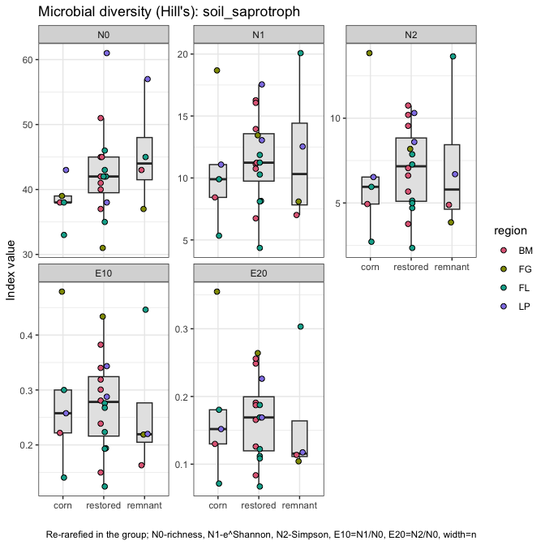
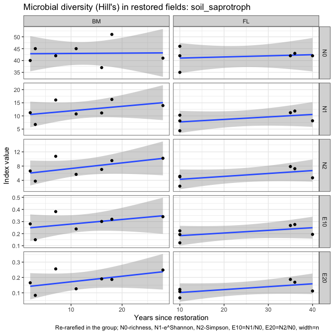

Microbial data: microbial guilds and taxonomy
================
Beau Larkin

Last updated: 10 September, 2024

- [Description](#description)
- [Packages and libraries](#packages-and-libraries)
- [Functions](#functions)
- [Data](#data)
  - [Sites-species tables](#sites-species-tables)
  - [Species metadata](#species-metadata)
  - [Site metadata and design](#site-metadata-and-design)
  - [Joined species, metadata, and design
    tables](#joined-species-metadata-and-design-tables)
  - [Plant traits data](#plant-traits-data)
  - [Plant species data](#plant-species-data)
- [Analysis and Results](#analysis-and-results)
  - [ITS sequences](#its-sequences)
    - [Unassigned taxa](#unassigned-taxa)
    - [Composition in field types](#composition-in-field-types)
    - [Soil saprotrophs](#soil-saprotrophs)
    - [Plant pathogens](#plant-pathogens)
    - [Wood saprotrophs](#wood-saprotrophs)
    - [Litter saprotrophs](#litter-saprotrophs)
    - [Plant functional groups and
      guilds](#plant-functional-groups-and-guilds)
  - [AMF](#amf)
    - [Claroideoglomeraceae](#claroideoglomeraceae)
    - [Paraglomeraceae](#paraglomeraceae)
    - [Diversisporaceae](#diversisporaceae)
    - [Gigasporaceae](#gigasporaceae)
    - [Plant functional groups and AMF
      families](#plant-functional-groups-and-amf-families)
- [Conclusions: taxa and guilds](#conclusions-taxa-and-guilds)
- [Appendix: Rarefy in guilds?](#appendix-rarefy-in-guilds)
  - [Diversity with ITS sequences](#diversity-with-its-sequences)
- [Appendix: Composition in regions](#appendix-composition-in-regions)
  - [Blue Mounds](#blue-mounds)
  - [Faville Grove](#faville-grove)
  - [Fermi](#fermi)
  - [Lake Petite](#lake-petite)
- [Appendix: Plots for final report](#appendix-plots-for-final-report)

# Description

Sequence clusters identified in QIIME2 are annotated with taxonomic
information and metadata from [Fungal
traits](https://link.springer.com/article/10.1007/s13225-020-00466-2).
In this report, sequence abundances in taxonomic groups or fungal guilds
are compared across field types and with time since restoration.

The full sequence abundance tables were rarefied to make sequencing
depth equivalent across fields. This can result in lower-abundance OTUs
dropping to zero. Within guilds, loss of OTUs could change or bias
interpretations of richness, diversity, and composition. We tried using
raw sequence data and rarefying within guilds to address this problem,
but in each case the sequence depth was so small that additional OTUs
were lost and abundances were significantly lowered.

We may try a different approach which is described in [Semchenko et
al. 2018](https://www.science.org/doi/10.1126/sciadv.aau4578), but for
now, the analysis uses data from the entire rarefied tables for ITS and
18S sequences.

# Packages and libraries

First, deal with the trouble caused by package Matrix. Calls to package
dependencies and installation should not be run unless package Matrix
gets overwritten somehow. Installing lme4 from source will require R to
be restarted.

``` r
# tools::package_dependencies("Matrix", which = "LinkingTo", reverse = TRUE)[[1L]]
# install.packages("lme4", type = "source")
library("lme4")
```

    ## Loading required package: Matrix

Other packages

``` r
packages_needed = c("tidyverse",
                    "knitr",
                    "conflicted",
                    "ggbeeswarm",
                    "colorspace",
                    "rsq",
                    "multcomp",
                    "indicspecies",
                    "GUniFrac",
                    "vegan",
                    "GGally",
                    "car")
packages_installed = packages_needed %in% rownames(installed.packages())
```

``` r
if (any(!packages_installed)) {
    install.packages(packages_needed[!packages_installed])
}
```

``` r
for (i in 1:length(packages_needed)) {
    library(packages_needed[i], character.only = T)
}
```

``` r
conflict_prefer("filter", "dplyr")
conflict_prefer("select", "dplyr")
```

# Functions

Functions streamline data processing, model fitting, and results output.
Functions for this script are found in a [supplemental
script](supporting_files/microbial_guild_taxonomy_functions.R) and are
loaded here for convenience.

``` r
source("supporting_files/microbial_guild_taxonomy_functions.R")
```

# Data

## Sites-species tables

CSV files were produced in `process_data.R`

``` r
spe <- list(
    its_raw = read_csv(
        paste0(getwd(), "/clean_data/spe_ITS_raw.csv"),
        show_col_types = FALSE
    ),
    its_rfy = read_csv(
        paste0(getwd(), "/clean_data/spe_ITS_rfy.csv"),
        show_col_types = FALSE
    ),
    amf_raw = read_csv(
        paste0(getwd(), "/clean_data/spe_18S_raw.csv"),
        show_col_types = FALSE
    ),
    amf_rfy = read_csv(
        paste0(getwd(), "/clean_data/spe_18S_rfy.csv"),
        show_col_types = FALSE
    )
)
```

## Species metadata

Load taxonomy for all and guilds (called *primary lifestyle* in Fungal
Traits) for ITS OTUs. Replace NA values with “unidentified” to show
complete numbers of unidentified groups.

``` r
meta <- list(
    its = read_csv(
        paste0(getwd(), "/clean_data/spe_ITS_metadata.csv"),
        show_col_types = FALSE
    ),
    amf = read_csv(
        paste0(getwd(), "/clean_data/spe_18S_metadata.csv"),
        show_col_types = FALSE
    )
) %>% 
    map(. %>% mutate(across(everything(), ~ replace_na(., "unidentified"))))
```

## Site metadata and design

``` r
sites   <-
    read_csv(paste0(getwd(), "/clean_data/sites.csv"), show_col_types = FALSE) %>%
    mutate(
        field_type = factor(
            field_type,
            ordered = TRUE,
            levels = c("corn", "restored", "remnant")
        )) %>%
    select(-lat, -long, -yr_restore, -yr_rank) %>% 
    arrange(field_key)
```

## Joined species, metadata, and design tables

Functions streamline this process

``` r
join_spe_meta <-
    function(spe, meta) {
        spe %>%
            pivot_longer(starts_with("otu"),
                         names_to = "otu_num",
                         values_to = "seq_abund") %>%
            filter(seq_abund != 0) %>%
            left_join(meta, by = join_by(otu_num)) %>%
            left_join(sites, by = join_by(field_key))
    }
```

``` r
spe_meta <- list(
    its_raw = 
        join_spe_meta(spe$its_raw, meta$its) %>%
        write_csv(paste0(getwd(), "/clean_data/speTaxa_ITS_raw.csv")),
    its_rfy = 
        join_spe_meta(spe$its_rfy, meta$its) %>%
        write_csv(paste0(getwd(), "/clean_data/speTaxa_ITS_rfy.csv")),
    amf_raw = 
        join_spe_meta(spe$amf_raw, meta$amf) %>%
        write_csv(paste0(getwd(), "/clean_data/speTaxa_18S_raw.csv")),
    amf_rfy = 
        join_spe_meta(spe$amf_rfy, meta$amf) %>%
        write_csv(paste0( getwd(), "/clean_data/speTaxa_18S_rfy.csv" ))
)
```

## Plant traits data

Used for correlations with guild abundances

``` r
ptr_gld <- read_csv("microbial_guild_taxonomy_files/plant_traits_fungal_guilds.csv", show_col_types = FALSE) 
```

## Plant species data

Used for comparisons of plant diversity with guild abundances

``` r
pl_ab <- read_csv(paste0(getwd(), "/clean_data/spe_plant_abund.csv"), show_col_types = FALSE) %>% 
    rename(field_name = SITE) %>% select(-BARESOIL, -LITTER) %>% 
    left_join(sites %>% select(field_name, region, field_type), by = join_by(field_name)) %>% 
    select(field_name, region, field_type, everything())
```

# Analysis and Results

## ITS sequences

Recall the number of OTUs recovered in each dataset. The effect of
rarefying did not change richness or diversity very much.

``` r
# Number of OTUs in raw and rarefied datasets
Map(function(x) ncol(x)-1, spe[1:2])
```

    ## $its_raw
    ## [1] 2889
    ## 
    ## $its_rfy
    ## [1] 2885

### Unassigned taxa

Only 21.8 percent of the ITS sequences were assigned to species. In
terms of the analysis done here, its possibly more alarming that only 36
percent were assigned to primary lifestyles or guilds. This suggests
that when we see guilds concentrating in certain habitats, it’s possible
that the difference doesn’t exist. This is particularly possible because
we have one habitat, cornfields, which has probably been studied more
than the others.

``` r
meta$its %>% 
    select(-otu_num, -otu_ID) %>% 
    map(\(x) round(length(which(x == "unidentified")) / length(x) * 100, 1)) %>% 
    bind_rows() %>% 
    kable(format = "pandoc", caption = "Percent unidentified OTUs in each taxonomic group or guild")
```

| phylum | class | order | family | genus | species | primary_lifestyle |
|-------:|------:|------:|-------:|------:|--------:|------------------:|
|   12.2 |  18.4 |  23.8 |   39.4 |  53.9 |    78.2 |                64 |

Percent unidentified OTUs in each taxonomic group or guild

### Composition in field types

Function outputs are verbose, but details may be necessary later so they
are displayed here.

``` r
its_taxaGuild(spe_meta$its_rfy)
```

    ## 
    ## 
    ## Table: Distribution of ITS OTUs in classes; mean sequence abundance by field type
    ## 
    ## phylum                   order                                        corn   restored   remnant
    ## -----------------------  --------------------------------------  ---------  ---------  --------
    ## Ascomycota               Hypocreales                               8983.60    7907.81   8470.00
    ## Ascomycota               Pleosporales                              8069.60    8115.06   6847.25
    ## Ascomycota               Chaetothyriales                            760.00    7128.31   6503.50
    ## Basidiomycota            Agaricales                                3726.80    2726.25   5881.75
    ## Ascomycota               Helotiales                                3322.40    4070.88   4456.00
    ## Ascomycota               unidentified                              1578.40    3900.00   4400.50
    ## Ascomycota               Sordariales                              13462.80    5478.12   4051.50
    ## unidentified             unidentified                              1417.80    2437.00   3141.00
    ## Ascomycota               Onygenales                                  80.60    1611.38   2653.25
    ## Mortierellomycota        Mortierellales                            4414.60    3557.44   2167.75
    ## Basidiomycota            Geastrales                                 918.00      55.67   1807.50
    ## Ascomycota               Geoglossales                                 4.25    1915.25   1805.50
    ## Basidiomycota            Thelephorales                                4.50      23.90    930.75
    ## Ascomycota               Glomerellales                             2320.20    1302.25    718.75
    ## Basidiomycota            Cantharellales                             511.00     962.56    661.50
    ## Ascomycota               GS34                                         0.00     113.00    487.00
    ## Glomeromycota            Glomerales                                 108.00     543.06    468.25
    ## Ascomycota               Xylariales                                  72.00     359.44    379.50
    ## Ascomycota               Coniochaetales                             881.60     214.50    352.25
    ## Ascomycota               Sordariomycetes_ord_Incertae_sedis          48.00     156.44    300.00
    ## Basidiomycota            Russulales                                   3.00       7.75    271.50
    ## Ascomycota               Magnaporthales                             101.00     197.00    262.00
    ## Ascomycota               Pezizales                                 1218.60     431.69    226.00
    ## Basidiomycota            unidentified                               104.40     685.12    192.50
    ## Ascomycota               Capnodiales                                673.80     660.38    189.50
    ## Basidiomycota            Boletales                                    5.00       7.00    150.00
    ## Glomeromycota            unidentified                                 9.25     188.29    140.00
    ## Ascomycota               Chaetosphaeriales                          317.50     283.69    139.33
    ## Ascomycota               Branch06                                    15.50     177.57    135.00
    ## Basidiomycota            Sebacinales                                 30.00     788.50    131.75
    ## Ascomycota               Minutisphaerales                             0.00      56.00    116.50
    ## Basidiomycota            Auriculariales                             122.50     324.44    111.25
    ## Ascomycota               Thelebolales                               115.75      43.57    109.00
    ## Basidiomycota            Tremellales                                 16.60     109.31    104.75
    ## Mucoromycota             unidentified                                 0.00      17.33     92.00
    ## Chytridiomycota          Spizellomycetales                          174.80     125.60     82.50
    ## Basidiomycota            Cystofilobasidiales                       2783.40      94.07     79.50
    ## Ascomycota               Mytilinidales                                0.00       0.00     79.00
    ## Basidiomycota            Trichosporonales                            64.50      37.09     75.25
    ## Ascomycota               Venturiales                                 31.67      92.15     72.67
    ## Basidiomycota            Trechisporales                             147.40     507.00     72.67
    ## Chytridiomycota          Rhizophlyctidales                          268.60     137.33     68.50
    ## Mucoromycota             Umbelopsidales                               0.00       2.00     59.00
    ## Basidiomycota            Phallales                                  239.75      43.78     50.67
    ## Basidiomycota            Filobasidiales                            1112.25     360.36     50.00
    ## Basidiomycota            Tremellodendropsidales                       8.00      48.54     47.00
    ## Basidiomycota            Hymenochaetales                             16.60     192.86     46.67
    ## Ascomycota               Orbiliales                                  17.00      87.57     46.33
    ## Ascomycota               Verrucariales                                0.00      62.00     46.00
    ## Ascomycota               Mytilinidiales                               0.00      15.67     44.33
    ## Ascomycota               Tubeufiales                                 69.40     215.94     36.50
    ## Basidiomycota            Ustilaginales                                3.00     141.67     35.67
    ## Basidiomycota            Polyporales                                 19.80      31.27     35.25
    ## Basidiomycota            Geminibasidiales                            65.00      59.67     33.50
    ## Ascomycota               Saccharomycetales                          273.25      43.75     29.00
    ## Basidiomycota            Atheliales                                   0.00     152.50     29.00
    ## Chytridiomycota          Chytridiales                                 0.00      92.50     26.00
    ## Basidiomycota            Erythrobasidiales                            0.00       5.00     22.00
    ## Ascomycota               Myrmecridiales                               0.00      77.00     20.50
    ## Ascomycota               GS32                                         0.00       0.00     20.00
    ## Ascomycota               Microascales                               132.80      86.00     17.67
    ## Ascomycota               Ostropales                                   0.00      48.00     16.00
    ## Chytridiomycota          Rhizophydiales                              26.25      24.50     16.00
    ## Rozellomycota            GS11                                         0.00       4.00     15.50
    ## Ascomycota               Trichosphaeriales                            5.00      25.27     15.00
    ## Basidiomycota            Leucosporidiales                            37.67       9.43     14.00
    ## Ascomycota               Diaporthales                               213.00      15.14     13.00
    ## Ascomycota               Savoryellales                               13.50      14.40     12.33
    ## Glomeromycota            Archaeosporales                              3.00      13.00     11.00
    ## Ascomycota               Eurotiales                                 113.20      40.62     10.25
    ## Ascomycota               Acrospermales                                0.00       6.00     10.00
    ## Ascomycota               Archaeorhizomycetales                        0.00      34.71     10.00
    ## Mortierellomycota        unidentified                                 0.00       4.50     10.00
    ## Basidiobolomycota        Basidiobolales                               0.00      15.67      7.00
    ## Chlorophyta              Chaetopeltidales                            13.00       7.30      7.00
    ## Ascomycota               Rhytismatales                                0.00       3.00      6.00
    ## Basidiomycota            Microbotryomycetes_ord_Incertae_sedis       10.00      18.33      6.00
    ## Glomeromycota            Diversisporales                              0.00       7.00      5.50
    ## Ascomycota               Dothideales                                  0.00      31.56      5.00
    ## Chlorophyta              unidentified                                 8.00       9.67      5.00
    ## Ascomycota               Candelariales                                0.00       6.00      3.00
    ## Basidiomycota            Atractiellales                              16.50      11.00      3.00
    ## Mucoromycota             GS22                                         0.00       3.00      2.00
    ## Entorrhizomycota         Entorrhizales                                0.00       0.00      1.00
    ## Mucoromycota             Mucorales                                    0.00       5.83      1.00
    ## Anthophyta               Asterales                                    0.00       6.00      0.00
    ## Anthophyta               Brassicales                                 10.00       4.50      0.00
    ## Anthophyta               Commelinales                                 3.00     236.00      0.00
    ## Anthophyta               Fabales                                      0.00      11.33      0.00
    ## Anthophyta               Poales                                       4.50       3.00      0.00
    ## Ascomycota               Boliniales                                  42.67      52.00      0.00
    ## Ascomycota               Botryosphaeriales                           21.00      20.50      0.00
    ## Ascomycota               Jahnulales                                  10.00       0.00      0.00
    ## Ascomycota               Lichenostigmatales                           0.00       3.00      0.00
    ## Ascomycota               Microthyriales                               0.00      13.00      0.00
    ## Ascomycota               Pezizomycotina_ord_Incertae_sedis           32.00     517.00      0.00
    ## Ascomycota               Phacidiales                                  0.00       5.50      0.00
    ## Ascomycota               Phomatosporales                            700.00      10.00      0.00
    ## Basidiomycota            Agaricostilbales                             2.00       1.00      0.00
    ## Basidiomycota            Corticiales                                  0.00      70.57      0.00
    ## Basidiomycota            Cystobasidiales                             42.50      12.00      0.00
    ## Basidiomycota            Entylomatales                                0.00      10.80      0.00
    ## Basidiomycota            Holtermanniales                              5.00      15.00      0.00
    ## Basidiomycota            Kriegeriales                                 3.00      11.00      0.00
    ## Basidiomycota            Platygloeales                                0.00      81.20      0.00
    ## Basidiomycota            Pucciniales                                  0.00       5.00      0.00
    ## Basidiomycota            Sporidiobolales                             49.00       6.75      0.00
    ## Basidiomycota            Tilletiales                                 11.00      25.00      0.00
    ## Basidiomycota            Urocystidales                               84.00       5.83      0.00
    ## Calcarisporiellomycota   Calcarisporiellales                          0.00       5.00      0.00
    ## Cercozoa                 unidentified                                 4.00       3.00      0.00
    ## Chlorophyta              Chaetophorales                               0.00      25.33      0.00
    ## Chlorophyta              Chlorellales                                 0.00       6.00      0.00
    ## Chlorophyta              Sphaeropleales                               0.00       5.00      0.00
    ## Chytridiomycota          unidentified                                25.00       8.00      0.00
    ## Glomeromycota            Paraglomerales                               4.00      12.60      0.00
    ## Haplosporidia            Haplosporidia_ord_Incertae_sedis             3.33      11.00      0.00
    ## Monoblepharomycota       Monoblepharidales                            1.00       0.00      0.00
    ## [[1]]
    ## 
    ## 
    ## Table: Distribution of ITS OTUs by Fungal Trait 'primary_lifestyle'; mean sequence abundance by field type
    ## 
    ## primary_lifestyle            corn   restored   remnant     total
    ## -----------------------  --------  ---------  --------  --------
    ## unidentified              26007.4    31591.7   34871.2   92470.3
    ## plant_pathogen             9199.0     9096.4    6967.0   25262.4
    ## soil_saprotroph            9163.0     7628.2    7976.5   24767.7
    ## wood_saprotroph            3690.2     2874.1    1834.0    8398.3
    ## dung_saprotroph            3444.0     1991.9    1047.5    6483.4
    ## litter_saprotroph          2502.8     1765.9    1261.0    5529.7
    ## mycoparasite               2167.2      725.8     346.8    3239.8
    ## animal_parasite             791.6     1338.2     887.0    3016.8
    ## ectomycorrhizal              11.0      150.2    2196.0    2357.2
    ## unspecified_saprotroph      933.2      211.2     208.2    1352.6
    ## root_endophyte               17.0      482.8     248.0     747.8
    ## arbuscular_mycorrhizal       74.8      243.9     188.0     506.7
    ## pollen_saprotroph           157.4      113.4      63.8     334.6
    ## lichenized                    0.0       92.0      16.0     108.0
    ## nectar/tap_saprotroph        36.0       42.0      29.0     107.0
    ## lichen_parasite              16.0       46.4      39.0     101.4
    ## foliar_endophyte              4.3       33.0       6.0      43.3
    ## epiphyte                      0.0        8.0      24.0      32.0
    ## unspecified_pathotroph        0.0       14.8      11.0      25.8
    ## algal_parasite                2.0        3.8       0.0       5.8
    ## 
    ## [[2]]


    ## 
    ## [[3]]


The top guilds are:

1.  Unidentified (not shown on column charts)
2.  plant pathogens
3.  soil saprotrophs
4.  wood saprotrophs
5.  dung saprotrophs
6.  litter saprotrophs

Compared with the sequence abundance in the NA group, plant pathogens
and soil saprotrophs are abundant enough to feel somewhat confident
about in terms of coverage.

``` r
its_rfy_guilds <- its_test_taxaGuild(spe_meta$its_rfy)
```

    ## ---------------------------------
    ## [1] "soil_saprotroph"
    ## ---------------------------------
    ## 
    ## 
    ## field_type   region   field_name    yr_since  primary_lifestyle    seq_sum
    ## -----------  -------  -----------  ---------  ------------------  --------
    ## corn         FL       FLC2                 0  soil_saprotroph        15618
    ## restored     BM       KORP1               28  soil_saprotroph        14109
    ## remnant      LP       LPREM1              NA  soil_saprotroph        12358
    ## restored     FL       FLRSP1              10  soil_saprotroph        11640
    ## corn         LP       LPC1                 0  soil_saprotroph        10259
    ## remnant      BM       MBREM1              NA  soil_saprotroph        10113
    ## restored     FL       FLRP5               35  soil_saprotroph        10103
    ## restored     FL       FLRSP3              10  soil_saprotroph        10068
    ## corn         FL       FLC1                 0  soil_saprotroph         9596
    ## restored     BM       BBRP1               16  soil_saprotroph         8987
    ## restored     FL       FLRP1               40  soil_saprotroph         8789
    ## restored     BM       PHRP1               11  soil_saprotroph         8390
    ## restored     FL       FLRSP2              10  soil_saprotroph         7678
    ## restored     BM       ERRP1                3  soil_saprotroph         7290
    ## corn         BM       PHC1                 0  soil_saprotroph         6025
    ## restored     BM       MBRP1               18  soil_saprotroph         5891
    ## restored     FL       FLRP4               36  soil_saprotroph         5546
    ## restored     LP       LPRP1                4  soil_saprotroph         5401
    ## restored     BM       MHRP2                2  soil_saprotroph         5211
    ## remnant      FG       FGREM1              NA  soil_saprotroph         4865
    ## remnant      FL       FLREM1              NA  soil_saprotroph         4570
    ## restored     BM       MHRP1                7  soil_saprotroph         4531
    ## restored     LP       LPRP2                4  soil_saprotroph         4471
    ## corn         FG       FGC1                 0  soil_saprotroph         4317
    ## restored     FG       FGRP1               15  soil_saprotroph         3947
    ## ----------------------------------------------------
    ## 
    ## Linear mixed model fit by maximum likelihood  ['lmerMod']
    ## Formula: seq_sum ~ field_type + (1 | region)
    ##    Data: mod_data
    ##       AIC       BIC    logLik  deviance  df.resid 
    ##  483.5205  489.6149 -236.7602  473.5205        20 
    ## Random effects:
    ##  Groups   Name        Std.Dev.
    ##  region   (Intercept)  727.8  
    ##  Residual             3065.2  
    ## Number of obs: 25, groups:  region, 4
    ## Fixed Effects:
    ##  (Intercept)  field_type.L  field_type.Q  
    ##       8168.0        -771.6         867.3  
    ## ----------------------------------------------------
    ## 
    ## Linear mixed model fit by maximum likelihood  ['lmerMod']
    ## Formula: seq_sum ~ 1 + (1 | region)
    ##    Data: mod_data
    ##       AIC       BIC    logLik  deviance  df.resid 
    ##  480.4669  484.1235 -237.2334  474.4669        22 
    ## Random effects:
    ##  Groups   Name        Std.Dev.
    ##  region   (Intercept)   97.44 
    ##  Residual             3196.90 
    ## Number of obs: 25, groups:  region, 4
    ## Fixed Effects:
    ## (Intercept)  
    ##        7989  
    ## ----------------------------------------------------
    ## 
    ## Data: mod_data
    ## Models:
    ## mmod_null: seq_sum ~ 1 + (1 | region)
    ## mmod: seq_sum ~ field_type + (1 | region)
    ##           npar    AIC    BIC  logLik deviance  Chisq Df Pr(>Chisq)
    ## mmod_null    3 480.47 484.12 -237.23   474.47                     
    ## mmod         5 483.52 489.61 -236.76   473.52 0.9464  2      0.623
    ## ----------------------------------------------------
    ## 
    ## 
    ##   Simultaneous Tests for General Linear Hypotheses
    ## 
    ## Multiple Comparisons of Means: Tukey Contrasts
    ## 
    ## 
    ## Fit: lmer(formula = seq_sum ~ field_type + (1 | region), data = mod_data, 
    ##     REML = FALSE)
    ## 
    ## Linear Hypotheses:
    ##                         Estimate Std. Error z value Pr(>|z|)
    ## restored - corn == 0     -1607.9     1580.7  -1.017    0.561
    ## remnant - corn == 0      -1091.2     2058.9  -0.530    0.855
    ## remnant - restored == 0    516.6     1726.0   0.299    0.951
    ## (Adjusted p values reported -- single-step method)
    ## 
    ##     corn restored  remnant 
    ##      "a"      "a"      "a" 
    ## ----------------------------------------------------
    ## 
    ## [1] "Years since restoration and soil_saprotroph sequence abundance in Blue Mounds Area"
    ## 
    ## Call:
    ## lm(formula = seq_sum ~ yr_since, data = mod_data2)
    ## 
    ## Residuals:
    ##       1       2       3       4       5       6       7 
    ##   161.7  2012.3  2009.0 -3480.1 -1838.3   206.2   929.2 
    ## 
    ## Coefficients:
    ##             Estimate Std. Error t value Pr(>|t|)  
    ## (Intercept)  4459.03    1450.50   3.074   0.0277 *
    ## yr_since      272.89      97.57   2.797   0.0381 *
    ## ---
    ## Signif. codes:  0 '***' 0.001 '**' 0.01 '*' 0.05 '.' 0.1 ' ' 1
    ## 
    ## Residual standard error: 2214 on 5 degrees of freedom
    ## Multiple R-squared:  0.6101, Adjusted R-squared:  0.5321 
    ## F-statistic: 7.822 on 1 and 5 DF,  p-value: 0.03814
    ## 
    ## 
    ## 
    ## 
    ## ---------------------------------
    ## [1] "plant_pathogen"
    ## ---------------------------------
    ## 
    ## 
    ## field_type   region   field_name    yr_since  primary_lifestyle    seq_sum
    ## -----------  -------  -----------  ---------  ------------------  --------
    ## restored     BM       MHRP2                2  plant_pathogen         16199
    ## restored     BM       MHRP1                7  plant_pathogen         15457
    ## restored     LP       LPRP1                4  plant_pathogen         15109
    ## restored     BM       PHRP1               11  plant_pathogen         14485
    ## corn         LP       LPC1                 0  plant_pathogen         14008
    ## restored     BM       ERRP1                3  plant_pathogen         12260
    ## restored     FG       FGRP1               15  plant_pathogen         12251
    ## corn         FG       FGC1                 0  plant_pathogen          9743
    ## remnant      LP       LPREM1              NA  plant_pathogen          9513
    ## corn         FL       FLC2                 0  plant_pathogen          9073
    ## remnant      FG       FGREM1              NA  plant_pathogen          8438
    ## restored     LP       LPRP2                4  plant_pathogen          7677
    ## restored     BM       BBRP1               16  plant_pathogen          7654
    ## corn         FL       FLC1                 0  plant_pathogen          7381
    ## restored     FL       FLRP1               40  plant_pathogen          6754
    ## remnant      FL       FLREM1              NA  plant_pathogen          6741
    ## restored     FL       FLRSP2              10  plant_pathogen          6485
    ## restored     FL       FLRSP1              10  plant_pathogen          6123
    ## corn         BM       PHC1                 0  plant_pathogen          5790
    ## restored     BM       MBRP1               18  plant_pathogen          5316
    ## restored     BM       KORP1               28  plant_pathogen          5219
    ## restored     FL       FLRP5               35  plant_pathogen          5014
    ## restored     FL       FLRP4               36  plant_pathogen          4824
    ## restored     FL       FLRSP3              10  plant_pathogen          4716
    ## remnant      BM       MBREM1              NA  plant_pathogen          3176
    ## ----------------------------------------------------
    ## 
    ## Linear mixed model fit by maximum likelihood  ['lmerMod']
    ## Formula: seq_sum ~ field_type + (1 | region)
    ##    Data: mod_data
    ##       AIC       BIC    logLik  deviance  df.resid 
    ##  490.3089  496.4033 -240.1545  480.3089        20 
    ## Random effects:
    ##  Groups   Name        Std.Dev.
    ##  region   (Intercept) 1642    
    ##  Residual             3351    
    ## Number of obs: 25, groups:  region, 4
    ## Fixed Effects:
    ##  (Intercept)  field_type.L  field_type.Q  
    ##         8723         -1865         -1071  
    ## ----------------------------------------------------
    ## 
    ## Linear mixed model fit by maximum likelihood  ['lmerMod']
    ## Formula: seq_sum ~ 1 + (1 | region)
    ##    Data: mod_data
    ##       AIC       BIC    logLik  deviance  df.resid 
    ##  488.1544  491.8110 -241.0772  482.1544        22 
    ## Random effects:
    ##  Groups   Name        Std.Dev.
    ##  region   (Intercept) 1388    
    ##  Residual             3541    
    ## Number of obs: 25, groups:  region, 4
    ## Fixed Effects:
    ## (Intercept)  
    ##        9051  
    ## ----------------------------------------------------
    ## 
    ## Data: mod_data
    ## Models:
    ## mmod_null: seq_sum ~ 1 + (1 | region)
    ## mmod: seq_sum ~ field_type + (1 | region)
    ##           npar    AIC    BIC  logLik deviance  Chisq Df Pr(>Chisq)
    ## mmod_null    3 488.15 491.81 -241.08   482.15                     
    ## mmod         5 490.31 496.40 -240.15   480.31 1.8455  2     0.3974
    ## ----------------------------------------------------
    ## 
    ## 
    ##   Simultaneous Tests for General Linear Hypotheses
    ## 
    ## Multiple Comparisons of Means: Tukey Contrasts
    ## 
    ## 
    ## Fit: lmer(formula = seq_sum ~ field_type + (1 | region), data = mod_data, 
    ##     REML = FALSE)
    ## 
    ## Linear Hypotheses:
    ##                          Estimate Std. Error z value Pr(>|z|)
    ## restored - corn == 0       -7.054   1743.661  -0.004    1.000
    ## remnant - corn == 0     -2636.851   2254.172  -1.170    0.467
    ## remnant - restored == 0 -2629.797   1908.137  -1.378    0.348
    ## (Adjusted p values reported -- single-step method)
    ## 
    ##     corn restored  remnant 
    ##      "a"      "a"      "a" 
    ## ----------------------------------------------------
    ## 
    ## [1] "Years since restoration and plant_pathogen sequence abundance in Blue Mounds Area"
    ## 
    ## Call:
    ## lm(formula = seq_sum ~ yr_since, data = mod_data2)
    ## 
    ## Residuals:
    ##       1       2       3       4       5       6       7 
    ## -1571.6 -2748.5  1331.4 -3020.0  2227.9   745.7  3035.2 
    ## 
    ## Coefficients:
    ##             Estimate Std. Error t value Pr(>|t|)    
    ## (Intercept)  16343.0     1749.4   9.342 0.000237 ***
    ## yr_since      -444.8      117.7  -3.780 0.012889 *  
    ## ---
    ## Signif. codes:  0 '***' 0.001 '**' 0.01 '*' 0.05 '.' 0.1 ' ' 1
    ## 
    ## Residual standard error: 2670 on 5 degrees of freedom
    ## Multiple R-squared:  0.7408, Adjusted R-squared:  0.6889 
    ## F-statistic: 14.29 on 1 and 5 DF,  p-value: 0.01289
    ## 
    ## 
    ## 
    ## 
    ## ---------------------------------
    ## [1] "ectomycorrhizal"
    ## ---------------------------------
    ## 
    ## 
    ## field_type   region   field_name    yr_since  primary_lifestyle    seq_sum
    ## -----------  -------  -----------  ---------  ------------------  --------
    ## remnant      FL       FLREM1              NA  ectomycorrhizal         3615
    ## remnant      FG       FGREM1              NA  ectomycorrhizal         3498
    ## remnant      BM       MBREM1              NA  ectomycorrhizal         1118
    ## restored     BM       MBRP1               18  ectomycorrhizal          574
    ## remnant      LP       LPREM1              NA  ectomycorrhizal          553
    ## restored     FL       FLRP1               40  ectomycorrhizal           14
    ## corn         LP       LPC1                 0  ectomycorrhizal           11
    ## restored     BM       MHRP2                2  ectomycorrhizal            7
    ## restored     FG       FGRP1               15  ectomycorrhizal            6
    ## ----------------------------------------------------
    ## 
    ## Linear mixed model fit by maximum likelihood  ['lmerMod']
    ## Formula: seq_sum ~ field_type + (1 | region)
    ##    Data: mod_data
    ##      AIC      BIC   logLik deviance df.resid 
    ## 158.6038 159.5900 -74.3019 148.6038        4 
    ## Random effects:
    ##  Groups   Name        Std.Dev.
    ##  region   (Intercept)   0.0   
    ##  Residual             931.5   
    ## Number of obs: 9, groups:  region, 4
    ## Fixed Effects:
    ##  (Intercept)  field_type.L  field_type.Q  
    ##        785.8        1545.0         778.3  
    ## optimizer (nloptwrap) convergence code: 0 (OK) ; 0 optimizer warnings; 1 lme4 warnings 
    ## ----------------------------------------------------
    ## 
    ## Linear mixed model fit by maximum likelihood  ['lmerMod']
    ## Formula: seq_sum ~ 1 + (1 | region)
    ##    Data: mod_data
    ##      AIC      BIC   logLik deviance df.resid 
    ## 161.8036 162.3952 -77.9018 155.8036        6 
    ## Random effects:
    ##  Groups   Name        Std.Dev.
    ##  region   (Intercept)    0    
    ##  Residual             1390    
    ## Number of obs: 9, groups:  region, 4
    ## Fixed Effects:
    ## (Intercept)  
    ##        1044  
    ## optimizer (nloptwrap) convergence code: 0 (OK) ; 0 optimizer warnings; 1 lme4 warnings 
    ## ----------------------------------------------------
    ## 
    ## Data: mod_data
    ## Models:
    ## mmod_null: seq_sum ~ 1 + (1 | region)
    ## mmod: seq_sum ~ field_type + (1 | region)
    ##           npar   AIC    BIC  logLik deviance  Chisq Df Pr(>Chisq)  
    ## mmod_null    3 161.8 162.40 -77.902    155.8                       
    ## mmod         5 158.6 159.59 -74.302    148.6 7.1997  2    0.02733 *
    ## ---
    ## Signif. codes:  0 '***' 0.001 '**' 0.01 '*' 0.05 '.' 0.1 ' ' 1
    ## ----------------------------------------------------
    ## 
    ## 
    ##   Simultaneous Tests for General Linear Hypotheses
    ## 
    ## Multiple Comparisons of Means: Tukey Contrasts
    ## 
    ## 
    ## Fit: lmer(formula = seq_sum ~ field_type + (1 | region), data = mod_data, 
    ##     REML = FALSE)
    ## 
    ## Linear Hypotheses:
    ##                         Estimate Std. Error z value Pr(>|z|)   
    ## restored - corn == 0       139.2     1041.5   0.134  0.98995   
    ## remnant - corn == 0       2185.0     1041.5   2.098  0.08686 . 
    ## remnant - restored == 0   2045.8      658.7   3.106  0.00517 **
    ## ---
    ## Signif. codes:  0 '***' 0.001 '**' 0.01 '*' 0.05 '.' 0.1 ' ' 1
    ## (Adjusted p values reported -- single-step method)
    ## 
    ##     corn restored  remnant 
    ##     "ab"      "a"      "b" 
    ## ----------------------------------------------------
    ## 
    ## [1] "Years since restoration and ectomycorrhizal sequence abundance in Blue Mounds Area"
    ## 
    ## Call:
    ## lm(formula = seq_sum ~ yr_since, data = mod_data2)
    ## 
    ## Residuals:
    ## ALL 2 residuals are 0: no residual degrees of freedom!
    ## 
    ## Coefficients:
    ##             Estimate Std. Error t value Pr(>|t|)
    ## (Intercept)   -63.88        NaN     NaN      NaN
    ## yr_since       35.44        NaN     NaN      NaN
    ## 
    ## Residual standard error: NaN on 0 degrees of freedom
    ## Multiple R-squared:      1,  Adjusted R-squared:    NaN 
    ## F-statistic:   NaN on 1 and 0 DF,  p-value: NA
    ## 
    ## 
    ## 
    ## 
    ## ---------------------------------
    ## [1] "wood_saprotroph"
    ## ---------------------------------
    ## 
    ## 
    ## field_type   region   field_name    yr_since  primary_lifestyle    seq_sum
    ## -----------  -------  -----------  ---------  ------------------  --------
    ## restored     LP       LPRP2                4  wood_saprotroph         5870
    ## corn         LP       LPC1                 0  wood_saprotroph         4671
    ## corn         FG       FGC1                 0  wood_saprotroph         4572
    ## restored     FL       FLRSP2              10  wood_saprotroph         4464
    ## restored     FG       FGRP1               15  wood_saprotroph         4312
    ## corn         FL       FLC1                 0  wood_saprotroph         4085
    ## restored     BM       PHRP1               11  wood_saprotroph         3930
    ## corn         BM       PHC1                 0  wood_saprotroph         3455
    ## restored     BM       MHRP2                2  wood_saprotroph         3245
    ## restored     LP       LPRP1                4  wood_saprotroph         3209
    ## restored     BM       ERRP1                3  wood_saprotroph         3195
    ## remnant      FL       FLREM1              NA  wood_saprotroph         3147
    ## restored     BM       MHRP1                7  wood_saprotroph         2924
    ## restored     FL       FLRP4               36  wood_saprotroph         2746
    ## restored     BM       MBRP1               18  wood_saprotroph         2621
    ## restored     FL       FLRSP1              10  wood_saprotroph         2300
    ## restored     FL       FLRP5               35  wood_saprotroph         2024
    ## restored     FL       FLRP1               40  wood_saprotroph         1775
    ## corn         FL       FLC2                 0  wood_saprotroph         1668
    ## remnant      LP       LPREM1              NA  wood_saprotroph         1604
    ## remnant      FG       FGREM1              NA  wood_saprotroph         1563
    ## restored     FL       FLRSP3              10  wood_saprotroph         1427
    ## remnant      BM       MBREM1              NA  wood_saprotroph         1022
    ## restored     BM       KORP1               28  wood_saprotroph          997
    ## restored     BM       BBRP1               16  wood_saprotroph          946
    ## ----------------------------------------------------
    ## 
    ## Linear mixed model fit by maximum likelihood  ['lmerMod']
    ## Formula: seq_sum ~ field_type + (1 | region)
    ##    Data: mod_data
    ##       AIC       BIC    logLik  deviance  df.resid 
    ##  434.8302  440.9246 -212.4151  424.8302        20 
    ## Random effects:
    ##  Groups   Name        Std.Dev.
    ##  region   (Intercept)  311    
    ##  Residual             1151    
    ## Number of obs: 25, groups:  region, 4
    ## Fixed Effects:
    ##  (Intercept)  field_type.L  field_type.Q  
    ##       2843.5       -1334.3        -161.6  
    ## ----------------------------------------------------
    ## 
    ## Linear mixed model fit by maximum likelihood  ['lmerMod']
    ## Formula: seq_sum ~ 1 + (1 | region)
    ##    Data: mod_data
    ##       AIC       BIC    logLik  deviance  df.resid 
    ##  435.8483  439.5049 -214.9242  429.8483        22 
    ## Random effects:
    ##  Groups   Name        Std.Dev.
    ##  region   (Intercept)    0    
    ##  Residual             1310    
    ## Number of obs: 25, groups:  region, 4
    ## Fixed Effects:
    ## (Intercept)  
    ##        2871  
    ## optimizer (nloptwrap) convergence code: 0 (OK) ; 0 optimizer warnings; 1 lme4 warnings 
    ## ----------------------------------------------------
    ## 
    ## Data: mod_data
    ## Models:
    ## mmod_null: seq_sum ~ 1 + (1 | region)
    ## mmod: seq_sum ~ field_type + (1 | region)
    ##           npar    AIC    BIC  logLik deviance  Chisq Df Pr(>Chisq)  
    ## mmod_null    3 435.85 439.50 -214.92   429.85                       
    ## mmod         5 434.83 440.92 -212.41   424.83 5.0181  2    0.08135 .
    ## ---
    ## Signif. codes:  0 '***' 0.001 '**' 0.01 '*' 0.05 '.' 0.1 ' ' 1
    ## ----------------------------------------------------
    ## 
    ## 
    ##   Simultaneous Tests for General Linear Hypotheses
    ## 
    ## Multiple Comparisons of Means: Tukey Contrasts
    ## 
    ## 
    ## Fit: lmer(formula = seq_sum ~ field_type + (1 | region), data = mod_data, 
    ##     REML = FALSE)
    ## 
    ## Linear Hypotheses:
    ##                         Estimate Std. Error z value Pr(>|z|)  
    ## restored - corn == 0      -745.5      594.4  -1.254   0.4165  
    ## remnant - corn == 0      -1887.0      773.3  -2.440   0.0382 *
    ## remnant - restored == 0  -1141.5      649.2  -1.758   0.1805  
    ## ---
    ## Signif. codes:  0 '***' 0.001 '**' 0.01 '*' 0.05 '.' 0.1 ' ' 1
    ## (Adjusted p values reported -- single-step method)
    ## 
    ##     corn restored  remnant 
    ##      "a"     "ab"      "b" 
    ## ----------------------------------------------------
    ## 
    ## [1] "Years since restoration and wood_saprotroph sequence abundance in Blue Mounds Area"
    ## 
    ## Call:
    ## lm(formula = seq_sum ~ yr_since, data = mod_data2)
    ## 
    ## Residuals:
    ##        1        2        3        4        5        6        7 
    ## -1254.20  -188.00  -111.38   602.77   -95.06  -228.99  1274.87 
    ## 
    ## Coefficients:
    ##             Estimate Std. Error t value Pr(>|t|)   
    ## (Intercept)  3655.96     561.37   6.513  0.00128 **
    ## yr_since      -90.98      37.76  -2.409  0.06091 . 
    ## ---
    ## Signif. codes:  0 '***' 0.001 '**' 0.01 '*' 0.05 '.' 0.1 ' ' 1
    ## 
    ## Residual standard error: 856.8 on 5 degrees of freedom
    ## Multiple R-squared:  0.5373, Adjusted R-squared:  0.4447 
    ## F-statistic: 5.805 on 1 and 5 DF,  p-value: 0.06091
    ## 
    ## 
    ## 
    ## 
    ## ---------------------------------
    ## [1] "litter_saprotroph"
    ## ---------------------------------
    ## 
    ## 
    ## field_type   region   field_name    yr_since  primary_lifestyle    seq_sum
    ## -----------  -------  -----------  ---------  ------------------  --------
    ## corn         FG       FGC1                 0  litter_saprotroph       5688
    ## restored     BM       ERRP1                3  litter_saprotroph       5125
    ## restored     LP       LPRP1                4  litter_saprotroph       2961
    ## restored     BM       MHRP1                7  litter_saprotroph       2865
    ## corn         BM       PHC1                 0  litter_saprotroph       2862
    ## restored     LP       LPRP2                4  litter_saprotroph       2570
    ## remnant      FL       FLREM1              NA  litter_saprotroph       2449
    ## restored     BM       BBRP1               16  litter_saprotroph       2422
    ## restored     BM       MBRP1               18  litter_saprotroph       2390
    ## restored     BM       MHRP2                2  litter_saprotroph       2196
    ## restored     FL       FLRSP2              10  litter_saprotroph       1885
    ## restored     BM       PHRP1               11  litter_saprotroph       1471
    ## corn         FL       FLC1                 0  litter_saprotroph       1378
    ## corn         FL       FLC2                 0  litter_saprotroph       1356
    ## corn         LP       LPC1                 0  litter_saprotroph       1230
    ## restored     FL       FLRSP3              10  litter_saprotroph        997
    ## remnant      LP       LPREM1              NA  litter_saprotroph        969
    ## remnant      FG       FGREM1              NA  litter_saprotroph        931
    ## restored     BM       KORP1               28  litter_saprotroph        908
    ## remnant      BM       MBREM1              NA  litter_saprotroph        695
    ## restored     FL       FLRP4               36  litter_saprotroph        574
    ## restored     FG       FGRP1               15  litter_saprotroph        546
    ## restored     FL       FLRP5               35  litter_saprotroph        539
    ## restored     FL       FLRSP1              10  litter_saprotroph        469
    ## restored     FL       FLRP1               40  litter_saprotroph        336
    ## ----------------------------------------------------
    ## 
    ## Linear mixed model fit by maximum likelihood  ['lmerMod']
    ## Formula: seq_sum ~ field_type + (1 | region)
    ##    Data: mod_data
    ##       AIC       BIC    logLik  deviance  df.resid 
    ##  438.4093  444.5037 -214.2046  428.4093        20 
    ## Random effects:
    ##  Groups   Name        Std.Dev.
    ##  region   (Intercept)  378    
    ##  Residual             1228    
    ## Number of obs: 25, groups:  region, 4
    ## Fixed Effects:
    ##  (Intercept)  field_type.L  field_type.Q  
    ##       1876.4        -930.0         103.4  
    ## ----------------------------------------------------
    ## 
    ## Linear mixed model fit by maximum likelihood  ['lmerMod']
    ## Formula: seq_sum ~ 1 + (1 | region)
    ##    Data: mod_data
    ##       AIC       BIC    logLik  deviance  df.resid 
    ##  436.8932  440.5498 -215.4466  430.8932        22 
    ## Random effects:
    ##  Groups   Name        Std.Dev.
    ##  region   (Intercept)  299.6  
    ##  Residual             1308.6  
    ## Number of obs: 25, groups:  region, 4
    ## Fixed Effects:
    ## (Intercept)  
    ##        1853  
    ## ----------------------------------------------------
    ## 
    ## Data: mod_data
    ## Models:
    ## mmod_null: seq_sum ~ 1 + (1 | region)
    ## mmod: seq_sum ~ field_type + (1 | region)
    ##           npar    AIC    BIC  logLik deviance  Chisq Df Pr(>Chisq)
    ## mmod_null    3 436.89 440.55 -215.45   430.89                     
    ## mmod         5 438.41 444.50 -214.21   428.41 2.4839  2     0.2888
    ## ----------------------------------------------------
    ## 
    ## 
    ##   Simultaneous Tests for General Linear Hypotheses
    ## 
    ## Multiple Comparisons of Means: Tukey Contrasts
    ## 
    ## 
    ## Fit: lmer(formula = seq_sum ~ field_type + (1 | region), data = mod_data, 
    ##     REML = FALSE)
    ## 
    ## Linear Hypotheses:
    ##                         Estimate Std. Error z value Pr(>|z|)
    ## restored - corn == 0      -784.2      635.1  -1.235    0.428
    ## remnant - corn == 0      -1315.3      825.3  -1.594    0.244
    ## remnant - restored == 0   -531.0      693.9  -0.765    0.721
    ## (Adjusted p values reported -- single-step method)
    ## 
    ##     corn restored  remnant 
    ##      "a"      "a"      "a" 
    ## ----------------------------------------------------
    ## 
    ## [1] "Years since restoration and litter_saprotroph sequence abundance in Blue Mounds Area"
    ## 
    ## Call:
    ## lm(formula = seq_sum ~ yr_since, data = mod_data2)
    ## 
    ## Residuals:
    ##        1        2        3        4        5        6        7 
    ##   297.73  1793.60  -102.00   451.44   -94.97 -1228.25 -1117.55 
    ## 
    ## Coefficients:
    ##             Estimate Std. Error t value Pr(>|t|)   
    ## (Intercept)  3609.96     734.63   4.914  0.00442 **
    ## yr_since      -92.86      49.42  -1.879  0.11902   
    ## ---
    ## Signif. codes:  0 '***' 0.001 '**' 0.01 '*' 0.05 '.' 0.1 ' ' 1
    ## 
    ## Residual standard error: 1121 on 5 degrees of freedom
    ## Multiple R-squared:  0.4139, Adjusted R-squared:  0.2967 
    ## F-statistic: 3.531 on 1 and 5 DF,  p-value: 0.119

Model tests on `field_type` are shaky due to unbalance, but are included
here to point out trends that we may be able to present in some better
way. Trends with restoration age in Blue Mounds are clearly justified.
Results are shown in descending order based on sequence abundance in
remnants:

- Soil saprotroph increases with years since
- Plant pathogens decrease with years since
- Ectomycorrhizal abundance is very low in corn/restored and with little
  replication; nothing can be said except that it’s relatively abundant
  in remnants.
- Wood saprotroph differs among field types (corn vs. remnant; restored
  intermediate) and decreases with years since
- Litter saprotroph is abundant everywhere, but differences over time or
  field type are weak.

#### ITS-based indicators

An indicator species analysis is warranted, identifying which species
correlate strongly with `field_type`. Performing this with all ITS data
may identify particular species to further examine, although it remains
a weakness that we lack replication within blocks for `field_type` in
some regions.

Following the indicator species analysis, richness and composition of
selected guilds is calculated. These calculations are done with data
re-rarefied into the guilds identified here, again to showcase
particular species which seem to drive differences among field types.
It’s also of value because this approach avoids the problem we have with
pseudoreplication.

With indicator species analysis performed using package
[indicspecies](http://sites.google.com/site/miqueldecaceres/), the index
values A and B show the specificity and fidelity components of the
IndVal combined index. The combined index value is noted as ‘stat’ in
the output table below.

``` r
its_inspan <- 
    spe$its_rfy %>% 
    left_join(sites, by = join_by(field_key)) %>% 
    inspan(., 1999, meta$its)
```

``` r
its_inspan %>%
    mutate(field_type = factor(
        field_type,
        ordered = TRUE,
        levels = c("corn", "restored", "remnant")
    )) %>%
    group_by(field_type) %>%
    summarize(
        n_otu = n(),
        stat_avg = mean(stat),
        stat_sd = sd(stat)
    ) %>% 
    kable(format = "pandoc", caption = "Indicator species stats of entire rarefied ITS table")
```

| field_type | n_otu |  stat_avg |   stat_sd |
|:-----------|------:|----------:|----------:|
| corn       |   102 | 0.8262682 | 0.0946821 |
| restored   |    17 | 0.8016453 | 0.0366269 |
| remnant    |    60 | 0.7463291 | 0.0732273 |

Indicator species stats of entire rarefied ITS table

Potential indicators were filtered to p.value\<0.05 before this summary
was produced. Cornfields are a restrictive habitat for soil microbes,
and that is reflected in the results here. More species have higher
specificity and fidelity to cornfields than to the other field types.
The top ten indicators for each field type are printed here; the entire
table is available for further use.

``` r
its_inspan %>% 
    mutate(field_type = factor(
    field_type,
    ordered = TRUE,
    levels = c("corn", "restored", "remnant")
)) %>%
    group_by(field_type) %>% 
    slice_max(order_by = stat, n = 10) %>% 
    arrange(field_type, -stat) %>% 
    write_csv(., paste0(getwd(), "/microbial_guild_taxonomy_files/its_inspan.csv")) %>% 
    kable(format = "pandoc", caption = "Indicator species of ITS OTUs (top 10 per field type)")
```

| otu_num  |         A |      B |      stat | p.value | field_type | primary_lifestyle | phylum            | class              | order               | family             | genus           | species                 |
|:---------|----------:|-------:|----------:|--------:|:-----------|:------------------|:------------------|:-------------------|:--------------------|:-------------------|:----------------|:------------------------|
| otu_537  | 1.0000000 | 1.0000 | 1.0000000 |  0.0005 | corn       | soil_saprotroph   | Basidiomycota     | Agaricomycetes     | Agaricales          | Bolbitiaceae       | Conocybe        | Conocybe_apala          |
| otu_204  | 0.9904912 | 1.0000 | 0.9952342 |  0.0005 | corn       | unidentified      | Mortierellomycota | Mortierellomycetes | Mortierellales      | Mortierellaceae    | unidentified    | unidentified            |
| otu_172  | 0.9816733 | 1.0000 | 0.9907943 |  0.0005 | corn       | plant_pathogen    | Ascomycota        | Dothideomycetes    | Pleosporales        | Corynesporascaceae | Corynespora     | Corynespora_cassiicola  |
| otu_9    | 0.9729171 | 1.0000 | 0.9863656 |  0.0025 | corn       | soil_saprotroph   | Basidiomycota     | Tremellomycetes    | Cystofilobasidiales | Mrakiaceae         | Tausonia        | Tausonia_pullulans      |
| otu_59   | 0.9637155 | 1.0000 | 0.9816901 |  0.0005 | corn       | soil_saprotroph   | Mortierellomycota | Mortierellomycetes | Mortierellales      | Mortierellaceae    | Mortierella     | unidentified            |
| otu_188  | 0.9634827 | 1.0000 | 0.9815716 |  0.0005 | corn       | unidentified      | unidentified      | unidentified       | unidentified        | unidentified       | unidentified    | unidentified            |
| otu_200  | 0.9590302 | 1.0000 | 0.9793009 |  0.0005 | corn       | plant_pathogen    | Ascomycota        | Dothideomycetes    | Pleosporales        | Phaeosphaeriaceae  | Ophiosphaerella | unidentified            |
| otu_694  | 0.9566517 | 1.0000 | 0.9780857 |  0.0005 | corn       | unidentified      | unidentified      | unidentified       | unidentified        | unidentified       | unidentified    | unidentified            |
| otu_21   | 0.9202058 | 1.0000 | 0.9592736 |  0.0010 | corn       | plant_pathogen    | Ascomycota        | Dothideomycetes    | Pleosporales        | Phaeosphaeriaceae  | Setophoma       | Setophoma_terrestris    |
| otu_364  | 0.9190042 | 1.0000 | 0.9586470 |  0.0005 | corn       | unidentified      | Ascomycota        | Sordariomycetes    | Sordariales         | Lasiosphaeriaceae  | Cladorrhinum    | unidentified            |
| otu_461  | 0.8431743 | 0.8750 | 0.8589398 |  0.0130 | restored   | unidentified      | Ascomycota        | Dothideomycetes    | Pleosporales        | Phaeosphaeriaceae  | unidentified    | unidentified            |
| otu_179  | 0.8910798 | 0.8125 | 0.8508833 |  0.0280 | restored   | plant_pathogen    | Basidiomycota     | Agaricomycetes     | Cantharellales      | Ceratobasidiaceae  | Rhizoctonia     | Rhizoctonia_fusispora   |
| otu_229  | 0.8673755 | 0.8125 | 0.8394895 |  0.0305 | restored   | unidentified      | Ascomycota        | Dothideomycetes    | Tubeufiales         | Tubeufiaceae       | unidentified    | unidentified            |
| otu_35   | 0.7007526 | 1.0000 | 0.8371097 |  0.0240 | restored   | animal_parasite   | Ascomycota        | Sordariomycetes    | Hypocreales         | Clavicipitaceae    | Metarhizium     | unidentified            |
| otu_177  | 0.9339080 | 0.7500 | 0.8369176 |  0.0280 | restored   | unidentified      | Ascomycota        | Dothideomycetes    | Pleosporales        | unidentified       | unidentified    | unidentified            |
| otu_267  | 1.0000000 | 0.6875 | 0.8291562 |  0.0290 | restored   | litter_saprotroph | Basidiomycota     | Agaricomycetes     | Sebacinales         | Sebacinaceae       | Efibulobasidium | unidentified            |
| otu_32   | 0.6621711 | 1.0000 | 0.8137390 |  0.0495 | restored   | unidentified      | Ascomycota        | Sordariomycetes    | Sordariales         | Chaetomiaceae      | unidentified    | unidentified            |
| otu_817  | 0.9547170 | 0.6875 | 0.8101654 |  0.0295 | restored   | unidentified      | Ascomycota        | unidentified       | unidentified        | unidentified       | unidentified    | unidentified            |
| otu_318  | 0.8673469 | 0.7500 | 0.8065421 |  0.0460 | restored   | unidentified      | Ascomycota        | Dothideomycetes    | Tubeufiales         | unidentified       | unidentified    | unidentified            |
| otu_114  | 0.6673274 | 0.9375 | 0.7909611 |  0.0105 | restored   | soil_saprotroph   | Mortierellomycota | Mortierellomycetes | Mortierellales      | Mortierellaceae    | Mortierella     | unidentified            |
| otu_772  | 0.8617363 | 1.0000 | 0.9282975 |  0.0040 | remnant    | unidentified      | Ascomycota        | Sordariomycetes    | unidentified        | unidentified       | unidentified    | unidentified            |
| otu_504  | 0.8325817 | 1.0000 | 0.9124591 |  0.0130 | remnant    | plant_pathogen    | Ascomycota        | Dothideomycetes    | Pleosporales        | Massarinaceae      | Stagonospora    | unidentified            |
| otu_629  | 0.8262911 | 1.0000 | 0.9090055 |  0.0025 | remnant    | unidentified      | Ascomycota        | Leotiomycetes      | Helotiales          | Hyaloscyphaceae    | Microscypha     | unidentified            |
| otu_135  | 0.7932082 | 1.0000 | 0.8906224 |  0.0015 | remnant    | plant_pathogen    | Ascomycota        | Sordariomycetes    | Hypocreales         | Nectriaceae        | Ilyonectria     | unidentified            |
| otu_854  | 1.0000000 | 0.7500 | 0.8660254 |  0.0020 | remnant    | unidentified      | Ascomycota        | unidentified       | unidentified        | unidentified       | unidentified    | unidentified            |
| otu_235  | 0.7485389 | 1.0000 | 0.8651814 |  0.0390 | remnant    | unidentified      | Ascomycota        | Leotiomycetes      | Helotiales          | Hyaloscyphaceae    | unidentified    | unidentified            |
| otu_1740 | 0.9371429 | 0.7500 | 0.8383658 |  0.0045 | remnant    | unidentified      | Glomeromycota     | Glomeromycetes     | Glomerales          | Glomeraceae        | unidentified    | unidentified            |
| otu_1195 | 0.9275362 | 0.7500 | 0.8340577 |  0.0105 | remnant    | unidentified      | unidentified      | unidentified       | unidentified        | unidentified       | unidentified    | unidentified            |
| otu_140  | 0.9242764 | 0.7500 | 0.8325907 |  0.0455 | remnant    | soil_saprotroph   | Ascomycota        | Sordariomycetes    | Hypocreales         | Stachybotryaceae   | Striaticonidium | Striaticonidium_cinctum |
| otu_372  | 0.6902606 | 1.0000 | 0.8308193 |  0.0290 | remnant    | soil_saprotroph   | Basidiomycota     | Agaricomycetes     | Agaricales          | Clavariaceae       | Clavaria        | unidentified            |

Indicator species of ITS OTUs (top 10 per field type)

### Soil saprotrophs

#### Trends over time

``` r
guiltime("soil_saprotroph")
```

    ## $bm_summary
    ## 
    ## Call:
    ## lm(formula = seq_sum ~ yr_since, data = d %>% filter(region == 
    ##     "BM"))
    ## 
    ## Residuals:
    ##       1       2       3       4       5       6       7 
    ##   161.7  2012.3  2009.0 -3480.1 -1838.3   206.2   929.2 
    ## 
    ## Coefficients:
    ##             Estimate Std. Error t value Pr(>|t|)  
    ## (Intercept)  4459.03    1450.50   3.074   0.0277 *
    ## yr_since      272.89      97.57   2.797   0.0381 *
    ## ---
    ## Signif. codes:  0 '***' 0.001 '**' 0.01 '*' 0.05 '.' 0.1 ' ' 1
    ## 
    ## Residual standard error: 2214 on 5 degrees of freedom
    ## Multiple R-squared:  0.6101, Adjusted R-squared:  0.5321 
    ## F-statistic: 7.822 on 1 and 5 DF,  p-value: 0.03814
    ## 
    ## 
    ## $fl_summary
    ## 
    ## Call:
    ## lm(formula = seq_sum ~ yr_since, data = d %>% filter(region == 
    ##     "FL"))
    ## 
    ## Residuals:
    ##       1       2       3       4       5       6 
    ##   804.4 -2677.7  1819.6  1862.6 -2099.4   290.6 
    ## 
    ## Coefficients:
    ##             Estimate Std. Error t value Pr(>|t|)   
    ## (Intercept) 10375.00    1781.86   5.823  0.00433 **
    ## yr_since      -59.76      65.64  -0.910  0.41413   
    ## ---
    ## Signif. codes:  0 '***' 0.001 '**' 0.01 '*' 0.05 '.' 0.1 ' ' 1
    ## 
    ## Residual standard error: 2185 on 4 degrees of freedom
    ## Multiple R-squared:  0.1716, Adjusted R-squared:  -0.03546 
    ## F-statistic: 0.8288 on 1 and 4 DF,  p-value: 0.4141
    ## 
    ## 
    ## $plot


Sequence abundance of soil saprotrophs increases over time in the Blue
Mounds area ($R^2_{Adj}=0.56, p<0.05$), but this appears to be leveraged
by Karla Ott’s property, though. With all that big bluestem…maybe there
is more litter and soil carbon? It will be good to look at trends in
soil chemistry.

#### Diversity

``` r
ssap <- filgu(spe$its_rfy, meta$its, primary_lifestyle, "soil_saprotroph", sites)
```

<!-- --><!-- -->

    ## $OTUs_n
    ## [1] 260
    ## 
    ## $Sites_n
    ## [1] 25

Out of 2889 OTUs, 260 are in this group. Most OTUs contain few
sequences, but several range from hundreds to 25,000 sequences. The 25
samples are all retained, and vary from 4000 to 16000 sequences. None
are so small that results would be biased by poor representation bias
from being rarefied.

``` r
ssap_div <- calc_diversity(ssap$filspe)
```

Diversity measures are stored in this data frame for further use…

``` r
ssap_comp <- gudicom(ssap_div, ssap$filspeTaxa, "soil_saprotroph", other_threshold = 5)
```

    ## $Hills_field_type



    ## 
    ## $Hills_yrs_since_restoration



    ## 
    ## $Composition_field_type


    ## 
    ## $Composition_yr_since


Richness increases from corn to remnant, but within-group variability is
high. Diversity indices look muddy. Diversity indices increase with
years since restoration, but the significance of this remains to be
seen.

Composition of soil saprotrophs by order can be modified somewhat by
choosing the threshold for lumping rare orders into an “other” category.
Leaving this at the default of \<2%, nine named orders are left.
*Agarics* increase strongly from corn to remnant; *Cystofilobasidiales*
and *Filobasidiales* aren’t found outside of cornfields. Generally,
cornfield composition looks different than the other two, but remnants
do appear somewhat intermediate. *Mortierellales* appear less in
remnants than corn or former corn fields.

*Agarics* generally decrease over time and *Geoglossales* increase.

Soil saprotrophs remain an interesting guild.

#### Indicators

``` r
ssap_inspan <- 
    ssap$filspe %>% 
    left_join(sites, by = join_by(field_key)) %>% 
    inspan(., 1999, meta$its)
```

``` r
ssap_inspan %>%
    mutate(field_type = factor(
        field_type,
        ordered = TRUE,
        levels = c("corn", "restored", "remnant")
    )) %>%
    group_by(field_type) %>%
    summarize(
        n_otu = n(),
        stat_avg = mean(stat),
        stat_sd = sd(stat)
    ) %>% 
    kable(format = "pandoc", caption = "Indicator species stats: soil saprotrophs")
```

| field_type | n_otu |  stat_avg |   stat_sd |
|:-----------|------:|----------:|----------:|
| corn       |    10 | 0.8752506 | 0.1013151 |
| restored   |     1 | 0.7909611 |        NA |
| remnant    |     3 | 0.7901722 | 0.0719423 |

Indicator species stats: soil saprotrophs

We see the same trend as before, where more indicators are found in
cornfields, and their indicator stats are stronger.

``` r
ssap_inspan %>% 
    mutate(field_type = factor(
        field_type,
        ordered = TRUE,
        levels = c("corn", "restored", "remnant")
    )) %>%
    arrange(field_type, -stat) %>% 
    write_csv(., paste0(getwd(), "/microbial_guild_taxonomy_files/ssap_inspan.csv")) %>% 
    kable(format = "pandoc", caption = "Indicator species of soil saprotrophs")
```

| otu_num  |         A |      B |      stat | p.value | field_type | primary_lifestyle | phylum            | class              | order               | family           | genus              | species                 |
|:---------|----------:|-------:|----------:|--------:|:-----------|:------------------|:------------------|:-------------------|:--------------------|:-----------------|:-------------------|:------------------------|
| otu_537  | 1.0000000 | 1.0000 | 1.0000000 |  0.0005 | corn       | soil_saprotroph   | Basidiomycota     | Agaricomycetes     | Agaricales          | Bolbitiaceae     | Conocybe           | Conocybe_apala          |
| otu_9    | 0.9729171 | 1.0000 | 0.9863656 |  0.0035 | corn       | soil_saprotroph   | Basidiomycota     | Tremellomycetes    | Cystofilobasidiales | Mrakiaceae       | Tausonia           | Tausonia_pullulans      |
| otu_59   | 0.9637155 | 1.0000 | 0.9816901 |  0.0005 | corn       | soil_saprotroph   | Mortierellomycota | Mortierellomycetes | Mortierellales      | Mortierellaceae  | Mortierella        | unidentified            |
| otu_134  | 0.9095799 | 1.0000 | 0.9537190 |  0.0025 | corn       | soil_saprotroph   | Mortierellomycota | Mortierellomycetes | Mortierellales      | Mortierellaceae  | Mortierella        | unidentified            |
| otu_89   | 0.9882438 | 0.8000 | 0.8891541 |  0.0075 | corn       | soil_saprotroph   | Mortierellomycota | Mortierellomycetes | Mortierellales      | Mortierellaceae  | Mortierella        | unidentified            |
| otu_61   | 0.9058386 | 0.8000 | 0.8512760 |  0.0285 | corn       | soil_saprotroph   | Basidiomycota     | Agaricomycetes     | Phallales           | Phallaceae       | Phallus            | Phallus_rugulosus       |
| otu_41   | 0.6682923 | 1.0000 | 0.8174915 |  0.0075 | corn       | soil_saprotroph   | Mortierellomycota | Mortierellomycetes | Mortierellales      | Mortierellaceae  | Mortierella        | Mortierella_minutissima |
| otu_1053 | 0.7708264 | 0.8000 | 0.7852777 |  0.0165 | corn       | soil_saprotroph   | Mortierellomycota | Mortierellomycetes | Mortierellales      | Mortierellaceae  | Mortierella        | unidentified            |
| otu_346  | 0.7107290 | 0.8000 | 0.7540446 |  0.0380 | corn       | soil_saprotroph   | Ascomycota        | Pezizomycetes      | Pezizales           | Ascodesmidaceae  | Cephaliophora      | unidentified            |
| otu_534  | 0.8966725 | 0.6000 | 0.7334872 |  0.0240 | corn       | soil_saprotroph   | Ascomycota        | Pezizomycetes      | Pezizales           | Pyronemataceae   | Pseudaleuria       | unidentified            |
| otu_114  | 0.6673274 | 0.9375 | 0.7909611 |  0.0050 | restored   | soil_saprotroph   | Mortierellomycota | Mortierellomycetes | Mortierellales      | Mortierellaceae  | Mortierella        | unidentified            |
| otu_140  | 0.9242764 | 0.7500 | 0.8325907 |  0.0465 | remnant    | soil_saprotroph   | Ascomycota        | Sordariomycetes    | Hypocreales         | Stachybotryaceae | Striaticonidium    | Striaticonidium_cinctum |
| otu_372  | 0.6902606 | 1.0000 | 0.8308193 |  0.0245 | remnant    | soil_saprotroph   | Basidiomycota     | Agaricomycetes     | Agaricales          | Clavariaceae     | Clavaria           | unidentified            |
| otu_2138 | 1.0000000 | 0.5000 | 0.7071068 |  0.0205 | remnant    | soil_saprotroph   | Ascomycota        | Leotiomycetes      | Thelebolales        | Pseudeurotiaceae | Gymnostellatospora | unidentified            |

Indicator species of soil saprotrophs

A later task will be to comb these tables for species with good stories…

### Plant pathogens

#### Trends over time

``` r
guiltime("plant_pathogen")
```

    ## $bm_summary
    ## 
    ## Call:
    ## lm(formula = seq_sum ~ yr_since, data = d %>% filter(region == 
    ##     "BM"))
    ## 
    ## Residuals:
    ##       1       2       3       4       5       6       7 
    ## -1571.6 -2748.5  1331.4 -3020.0  2227.9   745.7  3035.2 
    ## 
    ## Coefficients:
    ##             Estimate Std. Error t value Pr(>|t|)    
    ## (Intercept)  16343.0     1749.4   9.342 0.000237 ***
    ## yr_since      -444.8      117.7  -3.780 0.012889 *  
    ## ---
    ## Signif. codes:  0 '***' 0.001 '**' 0.01 '*' 0.05 '.' 0.1 ' ' 1
    ## 
    ## Residual standard error: 2670 on 5 degrees of freedom
    ## Multiple R-squared:  0.7408, Adjusted R-squared:  0.6889 
    ## F-statistic: 14.29 on 1 and 5 DF,  p-value: 0.01289
    ## 
    ## 
    ## $fl_summary
    ## 
    ## Call:
    ## lm(formula = seq_sum ~ yr_since, data = d %>% filter(region == 
    ##     "FL"))
    ## 
    ## Residuals:
    ##      1      2      3      4      5      6 
    ## 1168.0 -778.2 -592.2  415.8  777.8 -991.2 
    ## 
    ## Coefficients:
    ##             Estimate Std. Error t value Pr(>|t|)   
    ## (Intercept) 5747.558    823.864   6.976  0.00222 **
    ## yr_since      -4.038     30.351  -0.133  0.90059   
    ## ---
    ## Signif. codes:  0 '***' 0.001 '**' 0.01 '*' 0.05 '.' 0.1 ' ' 1
    ## 
    ## Residual standard error: 1010 on 4 degrees of freedom
    ## Multiple R-squared:  0.004406,   Adjusted R-squared:  -0.2445 
    ## F-statistic: 0.0177 on 1 and 4 DF,  p-value: 0.9006
    ## 
    ## 
    ## $plot


A strong decline in pathogens is seen in Blue Mounds’ restored fields
($R^2_{Adj}=0.75, p<0.01$), and although two distinct groups are
apparent, no single site displays undue leverage. It’s possible that a
signal like this will be found in soil chemistry or plant data and can
help explain what we are seeing here. Recall also that AMF were
previously found to increase along this same sequence…maybe that will
still hold up.

#### Diversity

``` r
ppat <- filgu(spe$its_rfy, meta$its, primary_lifestyle, "plant_pathogen", sites)
```

<!-- --><!-- -->

    ## $OTUs_n
    ## [1] 166
    ## 
    ## $Sites_n
    ## [1] 25

Out of 2889 OTUs, 159 are in this group. All samples are retained and
contain 3000-16000 sequences, so none are so limited as to bias results.

``` r
ppat_div <- calc_diversity(ppat$filspe)
```

``` r
ppat_comp <- gudicom(ppat_div, ppat$filspeTaxa, "plant_pathogen", other_threshold = 1)
```

    ## $Hills_field_type


    ## 
    ## $Hills_yrs_since_restoration


    ## 
    ## $Composition_field_type


    ## 
    ## $Composition_yr_since


Richness and diversity look flat or declining from corn to remnants and
evenness takes a hit in restored and remnant fields. It looks like we
have fewer pathogens, but more dominant individual taxa become
established. Pathogen diversity decreases with years since restoration
in Blue Mounds, but if the dumbbell plots can be believed, the opposite
appears true in Fermi.

Many pathogen orders are rare, so the argument `other_threshold` was
adjusted to show more diversity. Shifts don’t appear pronounced.
*Diaporthales* decreases in composition from corn to remnant while
*Hypocreales* pathogens increase. *Cantharellales* appear a small
component but are possibly “late successional” pathogens, possibly
associated with some native plant in a plant-soil feedback.

In the Blue Mounds area, trends in pathogen composition over time aren’t
obvious. Possibly *Glomerales* pathogens decrease over time and
*Pleosporales* increase.

#### Indicators

``` r
ppat_inspan <- 
    ppat$filspe %>% 
    left_join(sites, by = join_by(field_key)) %>% 
    inspan(., 1999, meta$its)
```

``` r
ppat_inspan %>%
    mutate(field_type = factor(
        field_type,
        ordered = TRUE,
        levels = c("corn", "restored", "remnant")
    )) %>%
    group_by(field_type) %>%
    summarize(
        n_otu = n(),
        stat_avg = mean(stat),
        stat_sd = sd(stat)
    ) %>% 
    kable(format = "pandoc", caption = "Indicator species stats: plant pathogens")
```

| field_type | n_otu |  stat_avg |   stat_sd |
|:-----------|------:|----------:|----------:|
| corn       |    15 | 0.8523164 | 0.0905337 |
| restored   |     3 | 0.7862083 | 0.0560551 |
| remnant    |     4 | 0.7958380 | 0.1229716 |

Indicator species stats: plant pathogens

We see the same trend as before, where more indicators are found in
cornfields, and their indicator stats are stronger. Composition at the
level of taxonomic order isn’t telling the whole story.

Plant pathogen indicators are nearly all in *Ascomycota.*

``` r
ppat_inspan %>% 
    mutate(field_type = factor(
        field_type,
        ordered = TRUE,
        levels = c("corn", "restored", "remnant")
    )) %>%
    arrange(field_type, -stat) %>% 
    write_csv(., paste0(getwd(), "/microbial_guild_taxonomy_files/ppat_inspan.csv")) %>% 
    kable(format = "pandoc", caption = "Indicator species of plant pathogens")
```

| otu_num  |         A |      B |      stat | p.value | field_type | primary_lifestyle | phylum        | class           | order           | family               | genus            | species                       |
|:---------|----------:|-------:|----------:|--------:|:-----------|:------------------|:--------------|:----------------|:----------------|:---------------------|:-----------------|:------------------------------|
| otu_172  | 0.9816733 | 1.0000 | 0.9907943 |  0.0005 | corn       | plant_pathogen    | Ascomycota    | Dothideomycetes | Pleosporales    | Corynesporascaceae   | Corynespora      | Corynespora_cassiicola        |
| otu_200  | 0.9590302 | 1.0000 | 0.9793009 |  0.0005 | corn       | plant_pathogen    | Ascomycota    | Dothideomycetes | Pleosporales    | Phaeosphaeriaceae    | Ophiosphaerella  | unidentified                  |
| otu_21   | 0.9202058 | 1.0000 | 0.9592736 |  0.0005 | corn       | plant_pathogen    | Ascomycota    | Dothideomycetes | Pleosporales    | Phaeosphaeriaceae    | Setophoma        | Setophoma_terrestris          |
| otu_553  | 0.8950276 | 1.0000 | 0.9460590 |  0.0045 | corn       | plant_pathogen    | Ascomycota    | Sordariomycetes | Magnaporthales  | Magnaporthaceae      | Gaeumannomyces   | unidentified                  |
| otu_1841 | 1.0000000 | 0.8000 | 0.8944272 |  0.0010 | corn       | plant_pathogen    | Ascomycota    | Dothideomycetes | Pleosporales    | Pleosporaceae        | Curvularia       | unidentified                  |
| otu_432  | 0.9907919 | 0.8000 | 0.8902997 |  0.0030 | corn       | plant_pathogen    | Ascomycota    | Sordariomycetes | Glomerellales   | Glomerellaceae       | Colletotrichum   | unidentified                  |
| otu_391  | 0.7536733 | 1.0000 | 0.8681436 |  0.0175 | corn       | plant_pathogen    | Ascomycota    | Dothideomycetes | Pleosporales    | Torulaceae           | Dendryphion      | unidentified                  |
| otu_13   | 0.7507560 | 1.0000 | 0.8664618 |  0.0065 | corn       | plant_pathogen    | Ascomycota    | Sordariomycetes | Glomerellales   | Plectosphaerellaceae | Plectosphaerella | Plectosphaerella_cucumerina   |
| otu_796  | 0.8838410 | 0.8000 | 0.8408762 |  0.0090 | corn       | plant_pathogen    | Ascomycota    | Dothideomycetes | Capnodiales     | Mycosphaerellaceae   | Cercospora       | unidentified                  |
| otu_325  | 1.0000000 | 0.6000 | 0.7745967 |  0.0065 | corn       | plant_pathogen    | Ascomycota    | Sordariomycetes | Diaporthales    | Diaporthaceae        | Diaporthe        | unidentified                  |
| otu_758  | 1.0000000 | 0.6000 | 0.7745967 |  0.0060 | corn       | plant_pathogen    | Ascomycota    | Dothideomycetes | Pleosporales    | Dictyosporiaceae     | Pseudocoleophoma | Pseudocoleophoma_polygonicola |
| otu_1159 | 1.0000000 | 0.6000 | 0.7745967 |  0.0065 | corn       | plant_pathogen    | Ascomycota    | Sordariomycetes | Glomerellales   | Plectosphaerellaceae | Plectosphaerella | unidentified                  |
| otu_521  | 0.9640096 | 0.6000 | 0.7605299 |  0.0245 | corn       | plant_pathogen    | Ascomycota    | Sordariomycetes | Glomerellales   | Plectosphaerellaceae | Lectera          | unidentified                  |
| otu_797  | 0.6844320 | 0.8000 | 0.7399632 |  0.0325 | corn       | plant_pathogen    | Ascomycota    | Eurotiomycetes  | Chaetothyriales | Herpotrichiellaceae  | Veronaea         | unidentified                  |
| otu_1013 | 0.8756219 | 0.6000 | 0.7248263 |  0.0445 | corn       | plant_pathogen    | Ascomycota    | Sordariomycetes | Xylariales      | Microdochiaceae      | Microdochium     | Microdochium_colombiense      |
| otu_179  | 0.8910798 | 0.8125 | 0.8508833 |  0.0270 | restored   | plant_pathogen    | Basidiomycota | Agaricomycetes  | Cantharellales  | Ceratobasidiaceae    | Rhizoctonia      | Rhizoctonia_fusispora         |
| otu_607  | 0.8315789 | 0.6875 | 0.7561154 |  0.0275 | restored   | plant_pathogen    | Ascomycota    | Dothideomycetes | Pleosporales    | Didymosphaeriaceae   | Pseudopithomyces | unidentified                  |
| otu_33   | 0.5649419 | 1.0000 | 0.7516262 |  0.0425 | restored   | plant_pathogen    | Ascomycota    | Sordariomycetes | Hypocreales     | Nectriaceae          | Fusarium         | unidentified                  |
| otu_504  | 0.8325817 | 1.0000 | 0.9124591 |  0.0115 | remnant    | plant_pathogen    | Ascomycota    | Dothideomycetes | Pleosporales    | Massarinaceae        | Stagonospora     | unidentified                  |
| otu_135  | 0.7932082 | 1.0000 | 0.8906224 |  0.0030 | remnant    | plant_pathogen    | Ascomycota    | Sordariomycetes | Hypocreales     | Nectriaceae          | Ilyonectria      | unidentified                  |
| otu_942  | 0.9937370 | 0.5000 | 0.7048890 |  0.0225 | remnant    | plant_pathogen    | Ascomycota    | Dothideomycetes | Pleosporales    | Pleosporaceae        | Curvularia       | unidentified                  |
| otu_2354 | 0.9122807 | 0.5000 | 0.6753816 |  0.0315 | remnant    | plant_pathogen    | Ascomycota    | Sordariomycetes | Xylariales      | Diatrypaceae         | Monosporascus    | Monosporascus_eutypoides      |

Indicator species of plant pathogens

### Wood saprotrophs

#### Trends over time

``` r
guiltime("wood_saprotroph") 
```

    ## $bm_summary
    ## 
    ## Call:
    ## lm(formula = seq_sum ~ yr_since, data = d %>% filter(region == 
    ##     "BM"))
    ## 
    ## Residuals:
    ##        1        2        3        4        5        6        7 
    ## -1254.20  -188.00  -111.38   602.77   -95.06  -228.99  1274.87 
    ## 
    ## Coefficients:
    ##             Estimate Std. Error t value Pr(>|t|)   
    ## (Intercept)  3655.96     561.37   6.513  0.00128 **
    ## yr_since      -90.98      37.76  -2.409  0.06091 . 
    ## ---
    ## Signif. codes:  0 '***' 0.001 '**' 0.01 '*' 0.05 '.' 0.1 ' ' 1
    ## 
    ## Residual standard error: 856.8 on 5 degrees of freedom
    ## Multiple R-squared:  0.5373, Adjusted R-squared:  0.4447 
    ## F-statistic: 5.805 on 1 and 5 DF,  p-value: 0.06091
    ## 
    ## 
    ## $fl_summary
    ## 
    ## Call:
    ## lm(formula = seq_sum ~ yr_since, data = d %>% filter(region == 
    ##     "FL"))
    ## 
    ## Residuals:
    ##       1       2       3       4       5       6 
    ##  -328.1   557.4  -186.0  -444.8  1719.2 -1317.8 
    ## 
    ## Coefficients:
    ##             Estimate Std. Error t value Pr(>|t|)  
    ## (Intercept)  2958.68     942.70   3.139   0.0349 *
    ## yr_since      -21.39      34.73  -0.616   0.5713  
    ## ---
    ## Signif. codes:  0 '***' 0.001 '**' 0.01 '*' 0.05 '.' 0.1 ' ' 1
    ## 
    ## Residual standard error: 1156 on 4 degrees of freedom
    ## Multiple R-squared:  0.08663,    Adjusted R-squared:  -0.1417 
    ## F-statistic: 0.3794 on 1 and 4 DF,  p-value: 0.5713
    ## 
    ## 
    ## $plot


Interestingly a strong negative relationship over time since restoration
($R^2_{Adj}=0.72, p<0.01$) in sharp contrast to the increasing
relationship found with soil saprotrophs. Apparently many wood
saprotrophs live in cornfield soil…let’s see:

#### Diversity

``` r
wsap <- filgu(spe$its_rfy, meta$its, primary_lifestyle, "wood_saprotroph", sites)
```

<!-- --><!-- -->

    ## $OTUs_n
    ## [1] 126
    ## 
    ## $Sites_n
    ## [1] 25

Out of 2889 OTUs, 120 are in this group. Samples contain 800-4400
sequences. Sequence depth is low; these aren’t abundant or numerous
taxa. Only 123 OTUs comprise this group.

``` r
wsap_div <- calc_diversity(wsap$filspe)
```

``` r
wasp_comp <- gudicom(wsap_div, wsap$filspeTaxa, "wood_saprotroph", other_threshold = 3)
```

    ## $Hills_field_type


    ## 
    ## $Hills_yrs_since_restoration


    ## 
    ## $Composition_field_type


    ## 
    ## $Composition_yr_since


With diversity, not much jumps out.

Diversity appears high across fields and years compared with other
guilds. While *Agaric* soil saprotrophs increased strongly from corn to
remnants, they declined when characterized as wood saprotrophs.

Notable changes in composition are evident over time. *Tubeufiales*
declines with time since restoration; *Hypocreales* increases.
*Pleosporales* also appear to increase, but the colors are difficult to
discern. Remember to look at tabular data.

#### Indicators

``` r
wsap_inspan <- 
    wsap$filspe %>% 
    left_join(sites, by = join_by(field_key)) %>% 
    inspan(., 1999, meta$its)
```

``` r
wsap_inspan %>%
    mutate(field_type = factor(
        field_type,
        ordered = TRUE,
        levels = c("corn", "restored", "remnant")
    )) %>%
    group_by(field_type) %>%
    summarize(
        n_otu = n(),
        stat_avg = mean(stat),
        stat_sd = sd(stat)
    ) %>% 
    kable(format = "pandoc", caption = "Indicator species stats: wood saprotrophs")
```

| field_type | n_otu |  stat_avg |   stat_sd |
|:-----------|------:|----------:|----------:|
| corn       |     4 | 0.8245759 | 0.0689698 |
| restored   |     1 | 0.7500000 |        NA |
| remnant    |     2 | 0.6887082 | 0.0260195 |

Indicator species stats: wood saprotrophs

Few species show specificity or fidelity. Corn fields have a few unusual
taxa, though. Less so with remnants, and none with restored fields.

``` r
wsap_inspan %>% 
    mutate(field_type = factor(
        field_type,
        ordered = TRUE,
        levels = c("corn", "restored", "remnant")
    )) %>%
    arrange(field_type, -stat) %>% 
    kable(format = "pandoc", caption = "Indicator species of wood saprotrophs")
```

| otu_num  |         A |      B |      stat | p.value | field_type | primary_lifestyle | phylum        | class           | order           | family              | genus           | species                   |
|:---------|----------:|-------:|----------:|--------:|:-----------|:------------------|:--------------|:----------------|:----------------|:--------------------|:----------------|:--------------------------|
| otu_11   | 0.7962093 | 1.0000 | 0.8923056 |  0.0065 | corn       | wood_saprotroph   | Ascomycota    | Sordariomycetes | Sordariales     | Chaetomiaceae       | Humicola        | Humicola_grisea           |
| otu_589  | 0.9581872 | 0.8000 | 0.8755283 |  0.0040 | corn       | wood_saprotroph   | Ascomycota    | Sordariomycetes | Hypocreales     | Stachybotryaceae    | Stachybotrys    | Stachybotrys_limonispora  |
| otu_20   | 0.5928148 | 1.0000 | 0.7699447 |  0.0270 | corn       | wood_saprotroph   | Ascomycota    | Sordariomycetes | Hypocreales     | Bionectriaceae      | Clonostachys    | unidentified              |
| otu_341  | 0.9639976 | 0.6000 | 0.7605252 |  0.0150 | corn       | wood_saprotroph   | Basidiomycota | Agaricomycetes  | Agaricales      | Psathyrellaceae     | Psathyrella     | unidentified              |
| otu_130  | 1.0000000 | 0.5625 | 0.7500000 |  0.0370 | restored   | wood_saprotroph   | Basidiomycota | Agaricomycetes  | Trechisporales  | Hydnodontaceae      | Subulicystidium | unidentified              |
| otu_1978 | 1.0000000 | 0.5000 | 0.7071068 |  0.0170 | remnant    | wood_saprotroph   | Ascomycota    | Sordariomycetes | Savoryellales   | Savoryellaceae      | Savoryella      | Savoryella_paucispora     |
| otu_881  | 0.8986301 | 0.5000 | 0.6703097 |  0.0315 | remnant    | wood_saprotroph   | Ascomycota    | Eurotiomycetes  | Chaetothyriales | Herpotrichiellaceae | Minimelanolocus | Minimelanolocus_asiaticus |

Indicator species of wood saprotrophs

### Litter saprotrophs

#### Trends over time

``` r
guiltime("litter_saprotroph") 
```

    ## $bm_summary
    ## 
    ## Call:
    ## lm(formula = seq_sum ~ yr_since, data = d %>% filter(region == 
    ##     "BM"))
    ## 
    ## Residuals:
    ##        1        2        3        4        5        6        7 
    ##   297.73  1793.60  -102.00   451.44   -94.97 -1228.25 -1117.55 
    ## 
    ## Coefficients:
    ##             Estimate Std. Error t value Pr(>|t|)   
    ## (Intercept)  3609.96     734.63   4.914  0.00442 **
    ## yr_since      -92.86      49.42  -1.879  0.11902   
    ## ---
    ## Signif. codes:  0 '***' 0.001 '**' 0.01 '*' 0.05 '.' 0.1 ' ' 1
    ## 
    ## Residual standard error: 1121 on 5 degrees of freedom
    ## Multiple R-squared:  0.4139, Adjusted R-squared:  0.2967 
    ## F-statistic: 3.531 on 1 and 5 DF,  p-value: 0.119
    ## 
    ## 
    ## $fl_summary
    ## 
    ## Call:
    ## lm(formula = seq_sum ~ yr_since, data = d %>% filter(region == 
    ##     "FL"))
    ## 
    ## Residuals:
    ##       1       2       3       4       5       6 
    ##  -71.86   71.08   12.31 -651.84  764.16 -123.84 
    ## 
    ## Coefficients:
    ##             Estimate Std. Error t value Pr(>|t|)  
    ## (Intercept)  1358.50     414.82   3.275   0.0306 *
    ## yr_since      -23.77      15.28  -1.555   0.1949  
    ## ---
    ## Signif. codes:  0 '***' 0.001 '**' 0.01 '*' 0.05 '.' 0.1 ' ' 1
    ## 
    ## Residual standard error: 508.6 on 4 degrees of freedom
    ## Multiple R-squared:  0.3768, Adjusted R-squared:  0.221 
    ## F-statistic: 2.419 on 1 and 4 DF,  p-value: 0.1949
    ## 
    ## 
    ## $plot


#### Diversity

``` r
lsap <- filgu(spe$its_rfy, meta$its, primary_lifestyle, "litter_saprotroph", sites)
```

<!-- --><!-- -->

    ## $OTUs_n
    ## [1] 140
    ## 
    ## $Sites_n
    ## [1] 25

Out of 2889 OTUs, 139 are in this group. Slightly more numerous than the
wood saprotrophs, but similarly not abundant or numerous. Recall that
when this group was rarefied in the guild, sampling depth was 297, or an
order of magnitude less than what we have here. Several OTUs were lost.

``` r
lsap_div <- calc_diversity(lsap$filspe)
```

``` r
lsap_comp <- gudicom(lsap_div, lsap$filspeTaxa, "litter_saprotroph")
```

    ## $Hills_field_type


    ## 
    ## $Hills_yrs_since_restoration


    ## 
    ## $Composition_field_type


    ## 
    ## $Composition_yr_since


With no litter in cornfields, it’s perhaps not surprising to see
increasing trends across field types with this guild. Trends over time
aren’t convincing, except possibly in Fermi.

#### Indicators

``` r
lsap_inspan <- 
    lsap$filspe %>% 
    left_join(sites, by = join_by(field_key)) %>% 
    inspan(., 1999, meta$its)
```

``` r
lsap_inspan %>%
    mutate(field_type = factor(
        field_type,
        ordered = TRUE,
        levels = c("corn", "restored", "remnant")
    )) %>%
    group_by(field_type) %>%
    summarize(
        n_otu = n(),
        stat_avg = mean(stat),
        stat_sd = sd(stat)
    ) %>% 
    kable(format = "pandoc", caption = "Indicator species stats: litter saprotrophs")
```

| field_type | n_otu |  stat_avg |   stat_sd |
|:-----------|------:|----------:|----------:|
| corn       |     3 | 0.8172432 | 0.0912297 |
| restored   |     1 | 0.8291562 |        NA |
| remnant    |     1 | 0.6892024 |        NA |

Indicator species stats: litter saprotrophs

``` r
lsap_inspan %>% 
    mutate(field_type = factor(
        field_type,
        ordered = TRUE,
        levels = c("corn", "restored", "remnant")
    )) %>%
    arrange(field_type, -stat) %>% 
    kable(format = "pandoc", caption = "Indicator species of litter saprotrophs")
```

| otu_num  |         A |      B |      stat | p.value | field_type | primary_lifestyle | phylum          | class                 | order             | family             | genus           | species                |
|:---------|----------:|-------:|----------:|--------:|:-----------|:------------------|:----------------|:----------------------|:------------------|:-------------------|:----------------|:-----------------------|
| otu_126  | 0.8509491 | 1.0000 | 0.9224690 |  0.0120 | corn       | litter_saprotroph | Ascomycota      | Sordariomycetes       | Sordariales       | Chaetomiaceae      | Chaetomium      | unidentified           |
| otu_358  | 0.9854227 | 0.6000 | 0.7689302 |  0.0180 | corn       | litter_saprotroph | Ascomycota      | Eurotiomycetes        | Chaetothyriales   | Cyphellophoraceae  | Cyphellophora   | Cyphellophora_suttonii |
| otu_1009 | 0.9635036 | 0.6000 | 0.7603303 |  0.0100 | corn       | litter_saprotroph | Ascomycota      | Pezizomycetes         | Pezizales         | Pyronemataceae     | Cheilymenia     | Cheilymenia_stercorea  |
| otu_267  | 1.0000000 | 0.6875 | 0.8291562 |  0.0325 | restored   | litter_saprotroph | Basidiomycota   | Agaricomycetes        | Sebacinales       | Sebacinaceae       | Efibulobasidium | unidentified           |
| otu_1302 | 0.9500000 | 0.5000 | 0.6892024 |  0.0350 | remnant    | litter_saprotroph | Chytridiomycota | Rhizophlyctidomycetes | Rhizophlyctidales | Rhizophlyctidaceae | Rhizophlyctis   | unidentified           |

Indicator species of litter saprotrophs

### Plant functional groups and guilds

Soil saprotrophs and pathogens are the most abundant guilds, and they
vary with years since restoration. Do they track plant traits? What are
the most important plant traits to look at? C4_grass, forb, and let’s
look at baresoil and litter because they track C4 grass pretty well.

``` r
ptr_gld %>% 
    filter(field_type == "restored", region == "BM") %>% 
    select(plant_pathogen, soil_saprotroph, C4_grass, forb, BARESOIL, LITTER) %>% 
    ggpairs()
```

<!-- -->

Litter relationship are driven entirely by Karla Ott’s property. Let’s
zoom in on just the guilds with C4_grasses and forbs. Let’s look at just
the relevant relationships: guilds with C4 grasses and forbs.

``` r
by_patho <- 
    ptr_gld %>% 
    filter(field_type == "restored", region == "BM") %>% 
    select(field_name, plant_pathogen, C4_grass, forb) %>% 
    pivot_longer(cols = C4_grass:forb, names_to = "fgrp", values_to = "pct_cvr") %>% 
    left_join(sites %>% select(field_name, yr_since), by = join_by(field_name)) %>% 
    mutate(guild = "plant_pathogen")
spl_patho <- by_patho %>%  split(by_patho$fgrp)
mod_patho <- spl_patho %>% map(\(df) summary(lm(plant_pathogen ~ pct_cvr, data = df)))
```

``` r
mod_patho %>% map(\(x) x$coefficients)
```

    ## $C4_grass
    ##               Estimate Std. Error   t value     Pr(>|t|)
    ## (Intercept) 16209.6982 2320.33737  6.985923 0.0009252782
    ## pct_cvr      -247.4307   91.23366 -2.712055 0.0421726514
    ## 
    ## $forb
    ##             Estimate Std. Error  t value    Pr(>|t|)
    ## (Intercept) 256.6707 1915.53808 0.133994 0.898633665
    ## pct_cvr     181.9252   30.44463 5.975610 0.001880085

``` r
mod_patho %>% map(\(x) x$adj.r.squared)
```

    ## $C4_grass
    ## [1] 0.5143761
    ## 
    ## $forb
    ## [1] 0.8526085

Saprotrophs

``` r
by_sapro <- 
    ptr_gld %>% 
    filter(field_type == "restored", region == "BM") %>% 
    select(field_name, soil_saprotroph, C4_grass, forb) %>% 
    pivot_longer(cols = C4_grass:forb, names_to = "fgrp", values_to = "pct_cvr") %>% 
    left_join(sites %>% select(field_name, yr_since), by = join_by(field_name)) %>% 
    mutate(guild = "soil_saprotroph")
spl_sapro <- by_sapro %>%  split(by_sapro$fgrp)
mod_sapro <- spl_sapro %>% map(\(df) summary(lm(soil_saprotroph ~ pct_cvr, data = df)))
```

``` r
mod_sapro %>% map(\(x) x$coefficients)
```

    ## $C4_grass
    ##              Estimate Std. Error  t value    Pr(>|t|)
    ## (Intercept) 3660.1679 1183.92038 3.091566 0.027111229
    ## pct_cvr      192.6677   46.55073 4.138877 0.009006866
    ## 
    ## $forb
    ##                Estimate Std. Error   t value    Pr(>|t|)
    ## (Intercept) 13435.62369 2559.96750  5.248357 0.003330744
    ## pct_cvr       -96.52708   40.68687 -2.372438 0.063759671

``` r
mod_sapro %>% map(\(x) x$adj.r.squared)
```

    ## $C4_grass
    ## [1] 0.7288785
    ## 
    ## $forb
    ## [1] 0.435478

``` r
(fgrp_guild_corr_plot <-
        bind_rows(
            by_patho %>% rename(seq_abund = plant_pathogen),
            by_sapro %>% rename(seq_abund = soil_saprotroph)
        ) %>% 
    mutate(sig = case_when(fgrp %in% "forb" & guild %in% "soil_saprotroph" ~ "2", .default = "1")) %>% 
    ggplot(aes(x = pct_cvr, y = seq_abund)) +
    facet_grid(cols = vars(fgrp), rows = vars(guild), scales = "free") +
    geom_smooth(aes(linetype = sig), color = "black", linewidth = 0.6, method = "lm", se = FALSE) +
    # geom_point(fill = "#5CBD92", size = 3, shape = 21) +
    geom_point(aes(fill = yr_since), size = 3, shape = 21) +
    labs(x = "Percent cover", y = "Sequence abundance") +
    scale_linetype_manual(values = c("solid", "blank"), guide = "none") +
    scale_fill_continuous_sequential(name = "Years since\nrestoration", palette = "Greens") +
    theme_bw())
```


We see the strong relationships. Theory would predict that plant
diversity has something to do with this, particularly with pathogens, so
let’s have a look at that. Years since restoration appears to be a
strong confounding element, so we will also check that out.

``` r
pldiv_gld_pfc <-
    pl_ab %>% 
    filter(region == "BM", field_type == "restored") %>% 
    rowwise() %>% 
    mutate(N0 = sum(c_across(-c(1:3)) > 0)) %>% 
    select(field_name, N0) %>% 
    left_join(ptr_gld, by = join_by(field_name)) %>% 
    left_join(sites %>% select(field_name, yr_since), by = join_by(field_name)) %>% 
    select(field_name, region, yr_since, C4_grass, forb, plant_pathogen, soil_saprotroph, N0)
```

``` r
ggpairs(pldiv_gld_pfc, columns = 3:8)
```

<!-- -->

Plant species richness is negatively related to saprotrophs, but not to
pathogens. Since these variables are all related, let’s see which ones
are stronger against the residuals of the others.

``` r
mod_div_patho <- lm(plant_pathogen ~ N0 + C4_grass + forb, data = pldiv_gld_pfc)
summary(mod_div_patho)
```

    ## 
    ## Call:
    ## lm(formula = plant_pathogen ~ N0 + C4_grass + forb, data = pldiv_gld_pfc)
    ## 
    ## Residuals:
    ##       1       2       3       4       5       6       7 
    ## -1978.9   236.9  1230.4 -1365.3  2783.6  -758.2  -148.5 
    ## 
    ## Coefficients:
    ##             Estimate Std. Error t value Pr(>|t|)
    ## (Intercept)    24.14   12090.29   0.002    0.999
    ## N0            -25.29     103.92  -0.243    0.823
    ## C4_grass       15.74     190.43   0.083    0.939
    ## forb          196.05      91.48   2.143    0.121
    ## 
    ## Residual standard error: 2287 on 3 degrees of freedom
    ## Multiple R-squared:  0.8857, Adjusted R-squared:  0.7713 
    ## F-statistic: 7.747 on 3 and 3 DF,  p-value: 0.06333

No individual variable is significant with pathogens. Looking back at
the pairs plot, C4 grasses and forbs, as direct effects, are the most
valuable. The AV Plots, below, reveal that forbs have the strongest
relationship.

``` r
avPlots(mod_div_patho)
```

<!-- -->

``` r
mod_div_sapro <- lm(soil_saprotroph ~ N0 + C4_grass + forb, data = pldiv_gld_pfc)
summary(mod_div_sapro)
```

    ## 
    ## Call:
    ## lm(formula = soil_saprotroph ~ N0 + C4_grass + forb, data = pldiv_gld_pfc)
    ## 
    ## Residuals:
    ##         1         2         3         4         5         6         7 
    ## -110.1187  -91.8019   56.8405    0.4858   85.8749   -6.1392   64.8587 
    ## 
    ## Coefficients:
    ##              Estimate Std. Error t value Pr(>|t|)    
    ## (Intercept) 18303.237    574.208  31.876 6.79e-05 ***
    ## N0           -170.770      4.935 -34.601 5.31e-05 ***
    ## C4_grass      -17.209      9.044  -1.903 0.153210    
    ## forb          -65.935      4.344 -15.177 0.000621 ***
    ## ---
    ## Signif. codes:  0 '***' 0.001 '**' 0.01 '*' 0.05 '.' 0.1 ' ' 1
    ## 
    ## Residual standard error: 108.6 on 3 degrees of freedom
    ## Multiple R-squared:  0.9994, Adjusted R-squared:  0.9989 
    ## F-statistic:  1807 on 3 and 3 DF,  p-value: 2.207e-05

Plant species richness and forbs are heavily related to saprotrophs. As
richness increases, saprotrophs plummet. But this is likely still
mediated by C4 grasses (or forbs), despite how the numbers here work
out.

``` r
avPlots(mod_div_sapro)
```

<!-- -->

Plant richness and forb cover are better predictors of saprotrophs than
C4 grasses are.

#### Years since restoration in multiple regression

It was perhaps hasty to test plant species richness before isolating the
effect of years since restoration. Let’s do that here.

``` r
mod_time_patho <- lm(plant_pathogen ~ yr_since + C4_grass + forb, data = pldiv_gld_pfc)
summary(mod_time_patho)
```

    ## 
    ## Call:
    ## lm(formula = plant_pathogen ~ yr_since + C4_grass + forb, data = pldiv_gld_pfc)
    ## 
    ## Residuals:
    ##        1        2        3        4        5        6        7 
    ## -2323.65   -70.66  1572.56 -1344.51  2407.35  -373.38   132.29 
    ## 
    ## Coefficients:
    ##             Estimate Std. Error t value Pr(>|t|)
    ## (Intercept)  -908.43    8881.40  -0.102    0.925
    ## yr_since      -79.96     300.81  -0.266    0.808
    ## C4_grass       72.04     148.60   0.485    0.661
    ## forb          192.12      97.61   1.968    0.144
    ## 
    ## Residual standard error: 2283 on 3 degrees of freedom
    ## Multiple R-squared:  0.8861, Adjusted R-squared:  0.7722 
    ## F-statistic: 7.779 on 3 and 3 DF,  p-value: 0.06298

``` r
avPlots(mod_time_patho)
```

<!-- -->

No individual variable is significant with pathogens. These variables
are so highly collinear that they negate each other in the model.
Statistically speaking, this model is overfitted with predictors that
cancel each other out. Let’s still compare their individual strengths
with AV plots.

None of these fits are good, but years since restoration is the weakest
signal in explaining total model residuals. I also ran this without
yr_since in the model mod_time_patho, and in the AVplots it was clear
that after years since restoration was partialled out from C4 grasses,
they no longer had any explanatory power over pathogen abundance. **The
take home message is that forb cover is the strongest predictor of
pathogens,** but there’s little statistical support for that statement.

``` r
mod_time_sapro <- lm(soil_saprotroph ~ yr_since + C4_grass + forb, data = pldiv_gld_pfc)
summary(mod_time_sapro)
```

    ## 
    ## Call:
    ## lm(formula = soil_saprotroph ~ yr_since + C4_grass + forb, data = pldiv_gld_pfc)
    ## 
    ## Residuals:
    ##       1       2       3       4       5       6       7 
    ## -1570.6  1236.9  1749.2 -1166.2 -1960.1  1296.1   414.6 
    ## 
    ## Coefficients:
    ##             Estimate Std. Error t value Pr(>|t|)
    ## (Intercept)  1476.70    8436.64   0.175    0.872
    ## yr_since       30.67     285.74   0.107    0.921
    ## C4_grass      210.40     141.16   1.490    0.233
    ## forb           24.42      92.72   0.263    0.809
    ## 
    ## Residual standard error: 2169 on 3 degrees of freedom
    ## Multiple R-squared:  0.7796, Adjusted R-squared:  0.5592 
    ## F-statistic: 3.537 on 3 and 3 DF,  p-value: 0.1636

``` r
avPlots(mod_time_sapro)
```

<!-- -->

Again, these variables tend to cancel each other out and each have a
slightly different rank order of sites. **C4 grass cover is the
strongest predictor of saprotrophs,** but again, support is weak in a
multiple linear regression.

## AMF

Recall the number of OTUs recovered in each dataset. The effect of
rarefying did not change richness or diversity very much.

``` r
Map(function(x) ncol(x)-1, spe[3:4])
```

    ## $amf_raw
    ## [1] 146
    ## 
    ## $amf_rfy
    ## [1] 145

Function output is verbose but retained as explained previously.

``` r
amf_summary <- amf_tax(spe_meta$amf_rfy)
```

    ## ---------------------------------
    ## [1] "AMF"
    ## ---------------------------------
    ## 
    ## 
    ## family                     corn   restored   remnant
    ## ---------------------  --------  ---------  --------
    ## Glomeraceae             15037.0    14225.4   15258.8
    ## Claroideoglomeraceae      707.2     2060.8    1876.0
    ## Paraglomeraceae          1631.4     1070.2     440.2
    ## Diversisporaceae          578.6      434.8     301.2
    ## Gigasporaceae              33.3      110.7     106.5
    ## Acaulosporaceae             4.0       23.3      75.0
    ## Archaeosporaceae            0.0      132.2      15.5
    ## Ambisporaceae               0.0        0.0       1.0
    ## 
    ## ---------------------------------
    ## [1] "Compare abundances across field types with mixed model"
    ## ---------------------------------
    ## 
    ## ---------------------------------
    ## [1] "Claroideoglomeraceae"
    ## ---------------------------------
    ## Linear mixed model fit by maximum likelihood  ['lmerMod']
    ## Formula: seq_sum ~ field_type + (1 | region)
    ##    Data: amf_df %>% filter(family == test_families[i])
    ##       AIC       BIC    logLik  deviance  df.resid 
    ##  422.5122  428.6066 -206.2561  412.5122        20 
    ## Random effects:
    ##  Groups   Name        Std.Dev.
    ##  region   (Intercept)   0.0   
    ##  Residual             926.4   
    ## Number of obs: 25, groups:  region, 4
    ## Fixed Effects:
    ##  (Intercept)  field_type.L  field_type.Q  
    ##       1548.0         826.5        -628.1  
    ## optimizer (nloptwrap) convergence code: 0 (OK) ; 0 optimizer warnings; 1 lme4 warnings 
    ## ----------------------------------------------------
    ## 
    ## Linear mixed model fit by maximum likelihood  ['lmerMod']
    ## Formula: seq_sum ~ 1 + (1 | region)
    ##    Data: amf_df %>% filter(family == test_families[i])
    ##       AIC       BIC    logLik  deviance  df.resid 
    ##  425.6095  429.2661 -209.8048  419.6095        22 
    ## Random effects:
    ##  Groups   Name        Std.Dev.
    ##  region   (Intercept)    0    
    ##  Residual             1068    
    ## Number of obs: 25, groups:  region, 4
    ## Fixed Effects:
    ## (Intercept)  
    ##        1761  
    ## optimizer (nloptwrap) convergence code: 0 (OK) ; 0 optimizer warnings; 1 lme4 warnings 
    ## ----------------------------------------------------
    ## 
    ## Data: amf_df %>% filter(family == test_families[i])
    ## Models:
    ## mmod_null: seq_sum ~ 1 + (1 | region)
    ## mmod: seq_sum ~ field_type + (1 | region)
    ##           npar    AIC    BIC  logLik deviance  Chisq Df Pr(>Chisq)  
    ## mmod_null    3 425.61 429.27 -209.81   419.61                       
    ## mmod         5 422.51 428.61 -206.26   412.51 7.0973  2    0.02876 *
    ## ---
    ## Signif. codes:  0 '***' 0.001 '**' 0.01 '*' 0.05 '.' 0.1 ' ' 1
    ## ----------------------------------------------------
    ## 
    ## 
    ##   Simultaneous Tests for General Linear Hypotheses
    ## 
    ## Multiple Comparisons of Means: Tukey Contrasts
    ## 
    ## 
    ## Fit: lmer(formula = seq_sum ~ field_type + (1 | region), data = amf_df %>% 
    ##     filter(family == test_families[i]), REML = FALSE)
    ## 
    ## Linear Hypotheses:
    ##                         Estimate Std. Error z value Pr(>|z|)  
    ## restored - corn == 0      1353.6      474.6   2.852   0.0118 *
    ## remnant - corn == 0       1168.8      621.4   1.881   0.1414  
    ## remnant - restored == 0   -184.8      517.9  -0.357   0.9311  
    ## ---
    ## Signif. codes:  0 '***' 0.001 '**' 0.01 '*' 0.05 '.' 0.1 ' ' 1
    ## (Adjusted p values reported -- single-step method)
    ## 
    ##     corn restored  remnant 
    ##      "a"      "b"     "ab" 
    ## 
    ## 
    ## ---------------------------------
    ## [1] "Diversisporaceae"
    ## ---------------------------------
    ## Linear mixed model fit by maximum likelihood  ['lmerMod']
    ## Formula: seq_sum ~ field_type + (1 | region)
    ##    Data: amf_df %>% filter(family == test_families[i])
    ##       AIC       BIC    logLik  deviance  df.resid 
    ##  386.9640  393.0583 -188.4820  376.9640        20 
    ## Random effects:
    ##  Groups   Name        Std.Dev.
    ##  region   (Intercept) 116.8   
    ##  Residual             442.4   
    ## Number of obs: 25, groups:  region, 4
    ## Fixed Effects:
    ##  (Intercept)  field_type.L  field_type.Q  
    ##      428.071      -181.885         4.387  
    ## ----------------------------------------------------
    ## 
    ## Linear mixed model fit by maximum likelihood  ['lmerMod']
    ## Formula: seq_sum ~ 1 + (1 | region)
    ##    Data: amf_df %>% filter(family == test_families[i])
    ##       AIC       BIC    logLik  deviance  df.resid 
    ##  383.7112  387.3678 -188.8556  377.7112        22 
    ## Random effects:
    ##  Groups   Name        Std.Dev.
    ##  region   (Intercept) 124.2   
    ##  Residual             448.0   
    ## Number of obs: 25, groups:  region, 4
    ## Fixed Effects:
    ## (Intercept)  
    ##       430.4  
    ## ----------------------------------------------------
    ## 
    ## Data: amf_df %>% filter(family == test_families[i])
    ## Models:
    ## mmod_null: seq_sum ~ 1 + (1 | region)
    ## mmod: seq_sum ~ field_type + (1 | region)
    ##           npar    AIC    BIC  logLik deviance  Chisq Df Pr(>Chisq)
    ## mmod_null    3 383.71 387.37 -188.86   377.71                     
    ## mmod         5 386.96 393.06 -188.48   376.96 0.7472  2     0.6882
    ## ----------------------------------------------------
    ## 
    ## 
    ##   Simultaneous Tests for General Linear Hypotheses
    ## 
    ## Multiple Comparisons of Means: Tukey Contrasts
    ## 
    ## 
    ## Fit: lmer(formula = seq_sum ~ field_type + (1 | region), data = amf_df %>% 
    ##     filter(family == test_families[i]), REML = FALSE)
    ## 
    ## Linear Hypotheses:
    ##                         Estimate Std. Error z value Pr(>|z|)
    ## restored - corn == 0      -134.0      228.4  -0.587    0.825
    ## remnant - corn == 0       -257.2      297.2  -0.865    0.658
    ## remnant - restored == 0   -123.2      249.4  -0.494    0.872
    ## (Adjusted p values reported -- single-step method)
    ## 
    ##     corn restored  remnant 
    ##      "a"      "a"      "a" 
    ## 
    ## 
    ## ---------------------------------
    ## [1] "Glomeraceae"
    ## ---------------------------------
    ## Linear mixed model fit by maximum likelihood  ['lmerMod']
    ## Formula: seq_sum ~ field_type + (1 | region)
    ##    Data: amf_df %>% filter(family == test_families[i])
    ##       AIC       BIC    logLik  deviance  df.resid 
    ##  454.6942  460.7886 -222.3471  444.6942        20 
    ## Random effects:
    ##  Groups   Name        Std.Dev.
    ##  region   (Intercept)    0    
    ##  Residual             1763    
    ## Number of obs: 25, groups:  region, 4
    ## Fixed Effects:
    ##  (Intercept)  field_type.L  field_type.Q  
    ##      14840.4         156.8         753.2  
    ## optimizer (nloptwrap) convergence code: 0 (OK) ; 0 optimizer warnings; 1 lme4 warnings 
    ## ----------------------------------------------------
    ## 
    ## Linear mixed model fit by maximum likelihood  ['lmerMod']
    ## Formula: seq_sum ~ 1 + (1 | region)
    ##    Data: amf_df %>% filter(family == test_families[i])
    ##       AIC       BIC    logLik  deviance  df.resid 
    ##  452.2167  455.8733 -223.1084  446.2167        22 
    ## Random effects:
    ##  Groups   Name        Std.Dev.
    ##  region   (Intercept)    0    
    ##  Residual             1818    
    ## Number of obs: 25, groups:  region, 4
    ## Fixed Effects:
    ## (Intercept)  
    ##       14553  
    ## optimizer (nloptwrap) convergence code: 0 (OK) ; 0 optimizer warnings; 1 lme4 warnings 
    ## ----------------------------------------------------
    ## 
    ## Data: amf_df %>% filter(family == test_families[i])
    ## Models:
    ## mmod_null: seq_sum ~ 1 + (1 | region)
    ## mmod: seq_sum ~ field_type + (1 | region)
    ##           npar    AIC    BIC  logLik deviance  Chisq Df Pr(>Chisq)
    ## mmod_null    3 452.22 455.87 -223.11   446.22                     
    ## mmod         5 454.69 460.79 -222.35   444.69 1.5225  2     0.4671
    ## ----------------------------------------------------
    ## 
    ## 
    ##   Simultaneous Tests for General Linear Hypotheses
    ## 
    ## Multiple Comparisons of Means: Tukey Contrasts
    ## 
    ## 
    ## Fit: lmer(formula = seq_sum ~ field_type + (1 | region), data = amf_df %>% 
    ##     filter(family == test_families[i]), REML = FALSE)
    ## 
    ## Linear Hypotheses:
    ##                         Estimate Std. Error z value Pr(>|z|)
    ## restored - corn == 0      -811.6      903.4  -0.898    0.637
    ## remnant - corn == 0        221.8     1182.9   0.187    0.980
    ## remnant - restored == 0   1033.4      985.7   1.048    0.541
    ## (Adjusted p values reported -- single-step method)
    ## 
    ##     corn restored  remnant 
    ##      "a"      "a"      "a" 
    ## 
    ## 
    ## ---------------------------------
    ## [1] "Paraglomeraceae"
    ## ---------------------------------
    ## Linear mixed model fit by maximum likelihood  ['lmerMod']
    ## Formula: seq_sum ~ field_type + (1 | region)
    ##    Data: amf_df %>% filter(family == test_families[i])
    ##       AIC       BIC    logLik  deviance  df.resid 
    ##  433.9028  439.9972 -211.9514  423.9028        20 
    ## Random effects:
    ##  Groups   Name        Std.Dev.
    ##  region   (Intercept)    0    
    ##  Residual             1163    
    ## Number of obs: 25, groups:  region, 4
    ## Fixed Effects:
    ##  (Intercept)  field_type.L  field_type.Q  
    ##      1047.28       -842.27        -28.06  
    ## optimizer (nloptwrap) convergence code: 0 (OK) ; 0 optimizer warnings; 1 lme4 warnings 
    ## ----------------------------------------------------
    ## 
    ## Linear mixed model fit by maximum likelihood  ['lmerMod']
    ## Formula: seq_sum ~ 1 + (1 | region)
    ##    Data: amf_df %>% filter(family == test_families[i])
    ##       AIC       BIC    logLik  deviance  df.resid 
    ##  432.1339  435.7906 -213.0670  426.1339        22 
    ## Random effects:
    ##  Groups   Name        Std.Dev.
    ##  region   (Intercept)    0    
    ##  Residual             1217    
    ## Number of obs: 25, groups:  region, 4
    ## Fixed Effects:
    ## (Intercept)  
    ##        1082  
    ## optimizer (nloptwrap) convergence code: 0 (OK) ; 0 optimizer warnings; 1 lme4 warnings 
    ## ----------------------------------------------------
    ## 
    ## Data: amf_df %>% filter(family == test_families[i])
    ## Models:
    ## mmod_null: seq_sum ~ 1 + (1 | region)
    ## mmod: seq_sum ~ field_type + (1 | region)
    ##           npar    AIC    BIC  logLik deviance  Chisq Df Pr(>Chisq)
    ## mmod_null    3 432.13 435.79 -213.07   426.13                     
    ## mmod         5 433.90 440.00 -211.95   423.90 2.2311  2     0.3277
    ## ----------------------------------------------------
    ## 
    ## 
    ##   Simultaneous Tests for General Linear Hypotheses
    ## 
    ## Multiple Comparisons of Means: Tukey Contrasts
    ## 
    ## 
    ## Fit: lmer(formula = seq_sum ~ field_type + (1 | region), data = amf_df %>% 
    ##     filter(family == test_families[i]), REML = FALSE)
    ## 
    ## Linear Hypotheses:
    ##                         Estimate Std. Error z value Pr(>|z|)
    ## restored - corn == 0      -561.2      596.1  -0.942    0.609
    ## remnant - corn == 0      -1191.2      780.4  -1.526    0.274
    ## remnant - restored == 0   -629.9      650.4  -0.969    0.592
    ## (Adjusted p values reported -- single-step method)
    ## 
    ##     corn restored  remnant 
    ##      "a"      "a"      "a" 
    ## 
    ## 
    ## ---------------------------------
    ## [1] "Gigasporaceae"
    ## ---------------------------------
    ## Linear mixed model fit by maximum likelihood  ['lmerMod']
    ## Formula: seq_sum ~ field_type + (1 | region)
    ##    Data: amf_df %>% filter(family == test_families[i])
    ##       AIC       BIC    logLik  deviance  df.resid 
    ##  244.4290  249.1512 -117.2145  234.4290        14 
    ## Random effects:
    ##  Groups   Name        Std.Dev.
    ##  region   (Intercept)   0.0   
    ##  Residual             115.6   
    ## Number of obs: 19, groups:  region, 3
    ## Fixed Effects:
    ##  (Intercept)  field_type.L  field_type.Q  
    ##        83.52         51.74        -33.31  
    ## optimizer (nloptwrap) convergence code: 0 (OK) ; 0 optimizer warnings; 1 lme4 warnings 
    ## ----------------------------------------------------
    ## 
    ## Linear mixed model fit by maximum likelihood  ['lmerMod']
    ## Formula: seq_sum ~ 1 + (1 | region)
    ##    Data: amf_df %>% filter(family == test_families[i])
    ##       AIC       BIC    logLik  deviance  df.resid 
    ##  241.5160  244.3494 -117.7580  235.5160        16 
    ## Random effects:
    ##  Groups   Name        Std.Dev.
    ##  region   (Intercept)   0     
    ##  Residual             119     
    ## Number of obs: 19, groups:  region, 3
    ## Fixed Effects:
    ## (Intercept)  
    ##       98.05  
    ## optimizer (nloptwrap) convergence code: 0 (OK) ; 0 optimizer warnings; 1 lme4 warnings 
    ## ----------------------------------------------------
    ## 
    ## Data: amf_df %>% filter(family == test_families[i])
    ## Models:
    ## mmod_null: seq_sum ~ 1 + (1 | region)
    ## mmod: seq_sum ~ field_type + (1 | region)
    ##           npar    AIC    BIC  logLik deviance Chisq Df Pr(>Chisq)
    ## mmod_null    3 241.52 244.35 -117.76   235.52                    
    ## mmod         5 244.43 249.15 -117.22   234.43 1.087  2     0.5807
    ## ----------------------------------------------------
    ## 
    ## 
    ##   Simultaneous Tests for General Linear Hypotheses
    ## 
    ## Multiple Comparisons of Means: Tukey Contrasts
    ## 
    ## 
    ## Fit: lmer(formula = seq_sum ~ field_type + (1 | region), data = amf_df %>% 
    ##     filter(family == test_families[i]), REML = FALSE)
    ## 
    ## Linear Hypotheses:
    ##                         Estimate Std. Error z value Pr(>|z|)
    ## restored - corn == 0      77.381     73.554   1.052    0.536
    ## remnant - corn == 0       73.167    105.540   0.693    0.762
    ## remnant - restored == 0   -4.214     87.395  -0.048    0.999
    ## (Adjusted p values reported -- single-step method)
    ## 
    ##     corn restored  remnant 
    ##      "a"      "a"      "a" 
    ## 
    ## 
    ## ---------------------------------
    ## [1] "Test abundances with years since restoration"
    ## ---------------------------------
    ## [1] "Claroideoglomeraceae"
    ## 
    ## Call:
    ## lm(formula = seq_sum ~ yr_since, data = mod_data %>% filter(family == 
    ##     all7[i]))
    ## 
    ## Residuals:
    ##       1       2       3       4       5       6       7 
    ## -786.01   10.28 -248.81  287.03 -468.66 -484.24 1690.41 
    ## 
    ## Coefficients:
    ##             Estimate Std. Error t value Pr(>|t|)   
    ## (Intercept)  2672.27     591.38   4.519  0.00629 **
    ## yr_since      -62.52      39.78  -1.572  0.17686   
    ## ---
    ## Signif. codes:  0 '***' 0.001 '**' 0.01 '*' 0.05 '.' 0.1 ' ' 1
    ## 
    ## Residual standard error: 902.6 on 5 degrees of freedom
    ## Multiple R-squared:  0.3306, Adjusted R-squared:  0.1968 
    ## F-statistic:  2.47 on 1 and 5 DF,  p-value: 0.1769
    ## 
    ## [1] "Diversisporaceae"
    ## 
    ## Call:
    ## lm(formula = seq_sum ~ yr_since, data = mod_data %>% filter(family == 
    ##     all7[i]))
    ## 
    ## Residuals:
    ##       1       2       3       4       5       6       7 
    ## -108.62 -180.87  -95.54  192.73   44.82   49.96   97.52 
    ## 
    ## Coefficients:
    ##             Estimate Std. Error t value Pr(>|t|)  
    ## (Intercept)  198.392     94.851   2.092   0.0907 .
    ## yr_since       7.827      6.380   1.227   0.2746  
    ## ---
    ## Signif. codes:  0 '***' 0.001 '**' 0.01 '*' 0.05 '.' 0.1 ' ' 1
    ## 
    ## Residual standard error: 144.8 on 5 degrees of freedom
    ## Multiple R-squared:  0.2313, Adjusted R-squared:  0.07759 
    ## F-statistic: 1.505 on 1 and 5 DF,  p-value: 0.2746
    ## 
    ## [1] "Gigasporaceae"
    ## 
    ## Call:
    ## lm(formula = seq_sum ~ yr_since, data = mod_data %>% filter(family == 
    ##     all7[i]))
    ## 
    ## Residuals:
    ##       1       2       3       4       5       6       7 
    ##  97.569   7.875  -9.329 -38.248 -34.758  15.283 -38.391 
    ## 
    ## Coefficients:
    ##             Estimate Std. Error t value Pr(>|t|)  
    ## (Intercept)  -22.099     34.726  -0.636   0.5525  
    ## yr_since       8.408      2.336   3.599   0.0156 *
    ## ---
    ## Signif. codes:  0 '***' 0.001 '**' 0.01 '*' 0.05 '.' 0.1 ' ' 1
    ## 
    ## Residual standard error: 53 on 5 degrees of freedom
    ## Multiple R-squared:  0.7215, Adjusted R-squared:  0.6659 
    ## F-statistic: 12.96 on 1 and 5 DF,  p-value: 0.01555
    ## 
    ## [1] "Glomeraceae"
    ## 
    ## Call:
    ## lm(formula = seq_sum ~ yr_since, data = mod_data %>% filter(family == 
    ##     all7[i]))
    ## 
    ## Residuals:
    ##        1        2        3        4        5        6        7 
    ##   353.19 -3320.96    66.32  -315.79  1714.08  2266.03  -762.87 
    ## 
    ## Coefficients:
    ##             Estimate Std. Error t value Pr(>|t|)    
    ## (Intercept) 13024.00    1307.47   9.961 0.000174 ***
    ## yr_since      111.99      87.95   1.273 0.258889    
    ## ---
    ## Signif. codes:  0 '***' 0.001 '**' 0.01 '*' 0.05 '.' 0.1 ' ' 1
    ## 
    ## Residual standard error: 1996 on 5 degrees of freedom
    ## Multiple R-squared:  0.2449, Adjusted R-squared:  0.09384 
    ## F-statistic: 1.621 on 1 and 5 DF,  p-value: 0.2589
    ## 
    ## [1] "Paraglomeraceae"
    ## 
    ## Call:
    ## lm(formula = seq_sum ~ yr_since, data = mod_data %>% filter(family == 
    ##     all7[i]))
    ## 
    ## Residuals:
    ##        1        2        3        4        5        6        7 
    ##   536.12  2737.39   137.48   -87.16 -1054.16 -1474.98  -794.70 
    ## 
    ## Coefficients:
    ##             Estimate Std. Error t value Pr(>|t|)
    ## (Intercept)  1682.70    1003.31   1.677    0.154
    ## yr_since      -45.36      67.49  -0.672    0.531
    ## 
    ## Residual standard error: 1531 on 5 degrees of freedom
    ## Multiple R-squared:  0.08287,    Adjusted R-squared:  -0.1006 
    ## F-statistic: 0.4518 on 1 and 5 DF,  p-value: 0.5313

Let’s look at abundances across field types in four families:

``` r
amf_summary %>% 
    filter(family %in% c("Claroideoglomeraceae", "Paraglomeraceae", "Diversisporaceae", "Gigasporaceae")) %>% 
    ggplot(aes(x = field_type, y = seq_sum)) +
    facet_wrap(vars(family), scales = "free_y") +
    geom_boxplot(varwidth = TRUE, fill = "gray90", outlier.shape = NA) +
    geom_beeswarm(aes(fill = region), shape = 21, size = 2, dodge.width = 0.2) +
    labs(x = "", y = "Sum of sequence abundance", title = "AMF abundance in families and field types") +
    scale_fill_discrete_qualitative(palette = "Dark3") +
    theme_bw()
```


Let’s also look at change over time in Fermi and Blue Mounds:

``` r
amf_summary %>% 
    filter(family %in% c("Claroideoglomeraceae", "Paraglomeraceae", "Diversisporaceae", "Gigasporaceae"),
           region %in% c("BM", "FL"),
           field_type == "restored") %>% 
    ggplot(aes(x = yr_since, y = seq_sum)) +
    facet_grid(rows = vars(family), cols = vars(region), scales = "free") +
    geom_smooth(method = "lm") +
    geom_point() +
    labs(x = "", y = "Sum of sequences abundances") +
    theme_bw()
```


And finally composition at the family level. *Glomeraceae* truly
dominates.

``` r
amf_summary %>% 
    group_by(field_type, family) %>% 
    summarize(seq_avg = mean(seq_sum), .groups = "drop_last") %>% 
    mutate(seq_comp = (seq_avg / sum(seq_avg)) * 100,
           order = replace(family, which(seq_comp < 0), "Other")) %>% 
    group_by(field_type, order) %>% 
    summarize(seq_comp = sum(seq_comp), .groups = "drop") %>% 
    ggplot(aes(x = field_type, y = seq_comp)) +
    geom_col(aes(fill = order), color = "black") +
    labs(x = "", y = "Proportion of sequence abundance",
         title = "Composition of AMF by order") +
    scale_fill_discrete_sequential(name = "Order", palette = "Plasma") +
    theme_classic()
```


From the mean sequence abundances in field types and trends over time,
the following families look interesting:

- *Claroideoglomeraceae:* low in corn; significantly by likelihood ratio
  test. Declines with time in BM, but this was not significant.
- *Paraglomeraceae:* highest in corn, declines through restoration and
  remnant, declines in BM and FL but likely not a significant trend
- *Diversisporaceae:* highest in corn, declines through restoration and
  remnant
- *Gigasporaceae:* low in corn, and also the only one with a significant
  change with years since restoration, and this only in Blue Mounds.
  Gigasporaceae increase over time ($R^2_{Adj}=0.66, p<0.05$). These are
  rare taxa though, and I’m not sure we can really say much about them.

In the next section, we will examine these families more closely.

### Claroideoglomeraceae

``` r
claroid <- filgu(spe$amf_rfy, meta$amf, family, "Claroideoglomeraceae", sites)
```

<!-- --><!-- -->

    ## $OTUs_n
    ## [1] 17
    ## 
    ## $Sites_n
    ## [1] 25

Out of 144 AMF OTUs, 17 map to this family. Most are low abundance
across sites, but all samples are retained and contain sufficient
sequences to draw meaningful conclusions.

``` r
claroid_div <- calc_diversity(claroid$filspe)
```

``` r
gudicom(claroid_div, claroid$filspeTaxa, "Claroideoglomeraceae", gene = "amf")
```


Little change over time, but alpha diversity in cornfields is low
compared with restored and remnant fields.

### Paraglomeraceae

``` r
para <- filgu(spe$amf_rfy, meta$amf, family, "Paraglomeraceae", sites)
```

<!-- --><!-- -->

    ## $OTUs_n
    ## [1] 6
    ## 
    ## $Sites_n
    ## [1] 25

Out of 144 AMF OTUs, only 6 map to this family. Most are low abundance
across sites, but all samples are retained. Any interpretation here is
likely to be dominated by a couple high-abundance OTUs, and a couple of
samples have close to zero detections. Is this real?

``` r
para_div <- calc_diversity(para$filspe)
```

``` r
gudicom(para_div, para$filspeTaxa, "Paraglomeraceae", gene = "amf")
```


Richness declines with time since restoration in the Blue Mounds, but
with few sequences and likely non-significant correlations, I don’t see
doing much more with this group.

### Diversisporaceae

``` r
diver <- filgu(spe$amf_rfy, meta$amf, family, "Diversisporaceae", sites)
```

<!-- --><!-- -->

    ## $OTUs_n
    ## [1] 8
    ## 
    ## $Sites_n
    ## [1] 25

Out of 144 AMF OTUs, only 8 map to this family. Most are low abundance
across sites, but all samples are retained. Any interpretation here is
likely to be dominated by a couple high-abundance OTUs, and a couple of
samples have close to zero detections. Is this real?

``` r
diver_div <- calc_diversity(diver$filspe)
```

``` r
gudicom(diver_div, diver$filspeTaxa, "Diversisporaceae", gene = "amf")
```


Richness declines with time since restoration in the Blue Mounds. Few
sequences and likely non-significant correlations, but these taxa
definitely don’t like cornfields.

### Gigasporaceae

``` r
giga <- filgu(spe$amf_rfy, meta$amf, family, "Gigasporaceae", sites)
```

<!-- --><!-- -->

    ## $OTUs_n
    ## [1] 4
    ## 
    ## $Sites_n
    ## [1] 19

Out of 144 AMF OTUs, only 4 map to this family. Most are low abundance
across sites, and only 19 samples contain these taxa. Any interpretation
here is likely to be dominated by a couple high-abundance OTUs, and a
couple of samples have close to zero detections. Is this real?

These OTUs all dropped with previous attempts to re-rarefy in the guild.
Perhaps that also supports that these are just too low abundance to work
more with.

``` r
giga_div <- calc_diversity(giga$filspe)
```

``` r
giga$filspeTaxa %>% 
    filter(field_type == "restored", region == "BM") %>% 
    group_by(field_type, field_key, yr_since) %>% 
    summarize(seq_sum = sum(seq_abund), .groups = "drop") %>% 
    ggplot(aes(x = yr_since, y = seq_sum)) +
    geom_smooth(method = "lm", se = FALSE, color = "black", linewidth = 0.4) +
    geom_point(fill = "#5CBD92", shape = 21, size = 2.5) +
    labs(x = "Years since restoration", y = expression(italic(Gigasporaceae)~sequences~(sum))) +
    theme_bw()
```


Pity that there are so few of these AMF. It’s a nice relationship. Maybe
there is a natural history angle here, like an interaction between
Gigasporaceae and plant pathogens, but it will be hard to argue that it
matters much given the low abundance observed.

### Plant functional groups and AMF families

``` r
fgrp_amf <- 
    bind_rows(
        claroid$filspeTaxa,
        diver$filspeTaxa,
        giga$filspeTaxa,
        para$filspeTaxa,
    ) %>% 
    filter(region == "BM", field_type == "restored") %>% 
    group_by(field_name, family) %>% 
    summarize(seq_abund = sum(seq_abund), .groups = "drop") %>% 
    pivot_wider(names_from = family, values_from = seq_abund) %>% 
    left_join(ptr_gld %>% select(field_name, C4_grass, forb), by = join_by(field_name))
fgrp_amf %>% 
    ggpairs(columns = 2:7)
```

<!-- -->

Gigasporaceae is the only one with a relationship here

``` r
by_giga <- 
    fgrp_amf %>% 
    select(Gigasporaceae, C4_grass, forb) %>% 
    pivot_longer(cols = C4_grass:forb, names_to = "fgrp", values_to = "pct_cvr")
spl_giga <- by_giga %>% split(by_giga$fgrp)
mod_giga <- spl_giga %>% map(\(df) summary(lm(Gigasporaceae ~ pct_cvr, data = df)))
```

``` r
mod_giga %>% map(\(x) x$coefficients)
```

    ## $C4_grass
    ##               Estimate Std. Error   t value    Pr(>|t|)
    ## (Intercept) -37.641002  31.040569 -1.212639 0.279431875
    ## pct_cvr       5.508274   1.220488  4.513172 0.006322428
    ## 
    ## $forb
    ##              Estimate Std. Error   t value   Pr(>|t|)
    ## (Intercept) 253.91888  63.351167  4.008117 0.01024062
    ## pct_cvr      -2.96573   1.006873 -2.945487 0.03205235

``` r
mod_giga %>% map(\(x) x$adj.r.squared)
```

    ## $C4_grass
    ## [1] 0.7634883
    ## 
    ## $forb
    ## [1] 0.5612718

``` r
by_giga %>% 
    ggplot(aes(x = pct_cvr, y = Gigasporaceae)) +
    facet_grid(cols = vars(fgrp), scales = "free") +
    geom_smooth(color = "black", linewidth = 0.6, method = "lm", se = FALSE) +
    geom_point(fill = "#5CBD92", size = 3, shape = 21) +
    labs(x = "Percent cover", y = "Sequence abundance") +
    theme_bw()
```


# Conclusions: taxa and guilds

1.  Much work remains researching the natural history of taxa identified
    through indicator species analysis and changes in composition across
    field types.
2.  Cornfields are weird. They harbor more and stronger indicator
    species, differ obviously in composition, diversity, and richness.
    This is not a surprise, but it is obvious.
3.  Soil saprotrophs remain interesing.
    1.  Soil saprotrophs increase with years since restoration in the
        Blue Mounds.
    2.  Richness increases from corn to restored to remnant, and
        sequence abundance increases with restoration age in the Blue
        Mounds. *Agarics* increase strongly from corn to remnant;
        *Cystofilobasidiales* and *Filobasidiales* aren’t found outside
        of cornfields. Generally, cornfield composition looks different
        than the other two, but remnants do appear somewhat
        intermediate. *Mortierellales* appear less . in remnants than
        corn or former corn fields.
    3.  *Agarics* generally decrease over time and *Geminibasidiales*
        increase in composition at Blue Mounds
4.  A strong decline in pathogens is seen in Blue Mounds’ restored
    fields. Declines are noticeable in abundance, richness, Shannon’s,
    and Simpson’s diversity (although the latter three need tests for
    significance of correlations).
    1.  Changes in composition across field types are subtle but
        present, and would benefit from additional natural history work.
        Composition over time in Blue Mounds doesn’t change in obvious
        linear progressions.
5.  Wood saprotrophs decline across years in Blue Mounds in a trend that
    is nearly reciprocal to that seen with soil saprotrophs. Possibly a
    natural history angle there.
    1.  Diversity appears high across fields and years compared with
        other guilds. While *Agaric* soil saprotrophs increased strongly
        from corn to remnants, they declined when characterized as wood
        saprotrophs.
    2.  Notable changes in composition are evident over time.
        *Tubeufiales* declines with time since restoration;
        *Hypocreales* increases.
6.  AMF generate less interest, mostly because fewer species and smaller
    sequence abundances prevent development of nice relationships.
    1.  *Claroideoglomeraceae* is probably the strongest family, with
        substantial differences across field types in sequence
        abundance.
    2.  *Gigasporaceae* significantly increases across the Blue Mounds
        series, but sequence abundances and richness are so small in
        this family that further discussion may be inappropriate or
        irrelevant.

# Appendix: Rarefy in guilds?

One practice that’s becoming popular is to take the raw sequence
abundance data, filter it to a guild or taxonomic group, and then rarefy
in that group. I did that with these guilds and families, and the action
reduced sequence abundances greatly without affecting what we would
interpret from the data. This appendix shows some diagnostics on that
process.

## Diversity with ITS sequences

Let’s graphically compare diversity metrics between datasets.
*Pre-rarefied* data are rarefied as a full set (all samples and OTUs),
then filtered to subsets of guilds. *Post-rarefied* data are filtered to
subsets of guilds from raw ITS sequence abundances and then rarefied
within the subset.

First, post-rarefied datasets are produced for the guilds of interest in
this report. Then, the Hill’s series of diversity metrics are
calculated.

``` r
ssap_rrfd <- rerare(spe$its_raw, meta$its, primary_lifestyle, "soil_saprotroph", sites)
ppat_rrfd <- rerare(spe$its_raw, meta$its, primary_lifestyle, "plant_pathogen", sites)
wsap_rrfd <- rerare(spe$its_raw, meta$its, primary_lifestyle, "wood_saprotroph", sites)
lsap_rrfd <- rerare(spe$its_raw, meta$its, primary_lifestyle, "litter_saprotroph", sites)
```

The diversity metrics are bound to the pre-rarefied sets produced
earlier in this report. These data are wrangled to facilitate plotting.

``` r
rrfd_compare <- 
    bind_rows(
        list(
            ssap_postrare = calc_diversity(ssap_rrfd$rrfd),
            ppat_postrare = calc_diversity(ppat_rrfd$rrfd),
            wsap_postrare = calc_diversity(wsap_rrfd$rrfd),
            lsap_postrare = calc_diversity(lsap_rrfd$rrfd),
            ssap_prerare = ssap_div,
            ppat_prerare = ppat_div,
            wsap_prerare = wsap_div,
            lsap_prerare = lsap_div
        ),
        .id = "guild_rrfd_key"
    ) %>% separate_wider_delim(guild_rrfd_key, "_", names = c("guild", "rrfd_step")) %>% 
    pivot_wider(names_from = rrfd_step, values_from = value)
```

Results are plottted.

``` r
ggplot(rrfd_compare %>% filter(hill_index %in% c("N0", "N1", "N2")), aes(x = prerare, y = postrare)) +
    facet_wrap(vars(hill_index, guild), scales = "free", ncol = 4) +
    geom_abline(intercept = 0, slope = 1) +
    geom_point(aes(fill = field_type), size = 2, shape = 21) +
    labs(x = "Index value from pre-rarefied abundances", y = "Index value from post-rarefied abundances",
         caption = "N0 = richness, N1 = Shannon's Diversity, N2 = Simpson's Diversity\nlsap = litter saprotrophs, ppat = plant pathogens, ssap = soil saprotrophs, wsap = wood saprotrophs") +
    scale_fill_discrete_qualitative(palette = "Harmonic") +
    theme_bw()
```


Repeating this with AMF is unnecessary…

# Appendix: Composition in regions

## Blue Mounds

``` r
its_taxaGuild(spe_meta$its_rfy %>% filter(region == "BM"), other_threshold = 5)
```

    ## 
    ## 
    ## Table: Distribution of ITS OTUs in classes; mean sequence abundance by field type
    ## 
    ## phylum                   order                                     corn   restored   remnant
    ## -----------------------  --------------------------------------  ------  ---------  --------
    ## Ascomycota               Chaetothyriales                           1043    5073.86     14498
    ## Basidiomycota            Agaricales                                8969    3216.86      6631
    ## Ascomycota               Geoglossales                                 4    3589.25      5210
    ## Ascomycota               Pleosporales                             11678    9405.29      5038
    ## unidentified             unidentified                               977    2760.86      4954
    ## Ascomycota               Helotiales                                1853    4407.29      3946
    ## Ascomycota               Hypocreales                               3981    8632.00      3753
    ## Ascomycota               unidentified                              1816    2928.14      3336
    ## Ascomycota               Sordariales                              15162    4615.57      2546
    ## Basidiomycota            Thelephorales                                0      13.67      1631
    ## Mortierellomycota        Mortierellales                            3791    3190.00      1487
    ## Ascomycota               Onygenales                                  53    1160.29       814
    ## Ascomycota               GS34                                         0     108.00       783
    ## Basidiomycota            Russulales                                   0       5.00       536
    ## Basidiomycota            Tremellales                                  7     190.00       221
    ## Ascomycota               Capnodiales                                336     899.43       218
    ## Ascomycota               Minutisphaerales                             0       0.00       208
    ## Basidiomycota            unidentified                                39    1273.00       201
    ## Ascomycota               Chaetosphaeriales                          302     288.86       171
    ## Mucoromycota             unidentified                                 0      24.50       166
    ## Ascomycota               Thelebolales                               178      46.50       165
    ## Basidiomycota            Boletales                                    0       7.00       156
    ## Ascomycota               Pezizales                                  494     315.71       149
    ## Basidiomycota            Sebacinales                                 11     753.14       114
    ## Chytridiomycota          Spizellomycetales                           21      58.14        95
    ## Basidiomycota            Cantharellales                             646    1251.57        87
    ## Ascomycota               Mytilinidales                                0       0.00        79
    ## Ascomycota               Magnaporthales                              24     156.29        72
    ## Basidiomycota            Trechisporales                             541     776.14        71
    ## Ascomycota               Xylariales                                 188     493.71        68
    ## Basidiomycota            Filobasidiales                              42     120.33        68
    ## Basidiomycota            Trichosporonales                           127      28.33        64
    ## Glomeromycota            Glomerales                                  38     562.71        62
    ## Mucoromycota             Umbelopsidales                               0       2.00        59
    ## Ascomycota               Glomerellales                             1367    1294.29        51
    ## Basidiomycota            Geminibasidiales                             0      70.60        48
    ## Ascomycota               Verrucariales                                0      62.00        46
    ## Ascomycota               Tubeufiales                                191     140.57        44
    ## Ascomycota               Coniochaetales                             584     221.86        42
    ## Ascomycota               Microascales                               260     101.60        42
    ## Basidiomycota            Polyporales                                 11      30.29        39
    ## Basidiomycota            Auriculariales                              12     240.29        31
    ## Ascomycota               Diaporthales                                83      14.75        25
    ## Rozellomycota            GS11                                         0       4.00        22
    ## Ascomycota               GS32                                         0       0.00        20
    ## Ascomycota               Ostropales                                   0      48.00        16
    ## Ascomycota               Sordariomycetes_ord_Incertae_sedis          17     213.29        14
    ## Ascomycota               Orbiliales                                   2      88.60        11
    ## Basidiomycota            Atheliales                                   0       5.00        11
    ## Basidiomycota            Hymenochaetales                              8      45.33        11
    ## Ascomycota               Eurotiales                                  48      25.86         9
    ## Basidiomycota            Erythrobasidiales                            0       2.00         9
    ## Basidiomycota            Geastrales                                 918      15.33         6
    ## Ascomycota               Myrmecridiales                               0      16.50         5
    ## Basidiomycota            Leucosporidiales                            13       7.67         5
    ## Basidiomycota            Ustilaginales                                0       0.00         2
    ## Chytridiomycota          Rhizophlyctidales                          264     209.33         2
    ## Mucoromycota             GS22                                         0       3.00         2
    ## Anthophyta               Brassicales                                  0       6.00         0
    ## Anthophyta               Fabales                                      0      14.50         0
    ## Anthophyta               Poales                                       0       2.00         0
    ## Ascomycota               Archaeorhizomycetales                        0      40.00         0
    ## Ascomycota               Botryosphaeriales                            2      23.80         0
    ## Ascomycota               Branch06                                    20     268.80         0
    ## Ascomycota               Candelariales                                0       6.00         0
    ## Ascomycota               Dothideales                                  0      37.33         0
    ## Ascomycota               Microthyriales                               0       1.00         0
    ## Ascomycota               Pezizomycotina_ord_Incertae_sedis           45       0.00         0
    ## Ascomycota               Phacidiales                                  0       7.00         0
    ## Ascomycota               Phomatosporales                            700       9.00         0
    ## Ascomycota               Saccharomycetales                          124       6.67         0
    ## Ascomycota               Savoryellales                                0      13.50         0
    ## Ascomycota               Trichosphaeriales                            0       6.50         0
    ## Ascomycota               Venturiales                                  0     174.60         0
    ## Basidiobolomycota        Basidiobolales                               0      41.00         0
    ## Basidiomycota            Agaricostilbales                             0       1.00         0
    ## Basidiomycota            Atractiellales                               7       0.00         0
    ## Basidiomycota            Corticiales                                  0     143.33         0
    ## Basidiomycota            Cystobasidiales                             39      16.50         0
    ## Basidiomycota            Cystofilobasidiales                        224      54.67         0
    ## Basidiomycota            Entylomatales                                0      21.50         0
    ## Basidiomycota            Holtermanniales                              2      15.00         0
    ## Basidiomycota            Kriegeriales                                 2       0.00         0
    ## Basidiomycota            Microbotryomycetes_ord_Incertae_sedis        1       0.00         0
    ## Basidiomycota            Phallales                                  894      25.80         0
    ## Basidiomycota            Platygloeales                                0     157.50         0
    ## Basidiomycota            Pucciniales                                  0       8.00         0
    ## Basidiomycota            Sporidiobolales                              0       6.75         0
    ## Basidiomycota            Tremellodendropsidales                       0      76.00         0
    ## Basidiomycota            Urocystidales                                0       6.20         0
    ## Calcarisporiellomycota   Calcarisporiellales                          0       5.00         0
    ## Cercozoa                 unidentified                                 0       3.00         0
    ## Chlorophyta              Chaetopeltidales                             4       7.25         0
    ## Chlorophyta              Chaetophorales                               0      22.00         0
    ## Chlorophyta              Chlorellales                                 0       6.00         0
    ## Chytridiomycota          Chytridiales                                 0     120.67         0
    ## Chytridiomycota          Rhizophydiales                               0      20.33         0
    ## Chytridiomycota          unidentified                                 0       8.00         0
    ## Glomeromycota            Archaeosporales                              0      16.00         0
    ## Glomeromycota            Diversisporales                              0       8.00         0
    ## Glomeromycota            Paraglomerales                               0      47.00         0
    ## Glomeromycota            unidentified                                 4     197.40         0
    ## Haplosporidia            Haplosporidia_ord_Incertae_sedis             2       0.00         0
    ## Monoblepharomycota       Monoblepharidales                            1       0.00         0
    ## Mortierellomycota        unidentified                                 0       3.00         0
    ## Mucoromycota             Mucorales                                    0       7.67         0
    ## [[1]]
    ## 
    ## 
    ## Table: Distribution of ITS OTUs by Fungal Trait 'primary_lifestyle'; mean sequence abundance by field type
    ## 
    ## primary_lifestyle          corn   restored   remnant     total
    ## -----------------------  ------  ---------  --------  --------
    ## unidentified              29666    29212.6     40171   99049.6
    ## soil_saprotroph            6025     7772.7     10113   23910.7
    ## plant_pathogen             5790    10941.4      3176   19907.4
    ## dung_saprotroph            8636     1996.7       736   11368.7
    ## wood_saprotroph            3455     2551.1      1022    7028.1
    ## litter_saprotroph          2862     2482.4       695    6039.4
    ## animal_parasite             788     1537.1       345    2670.1
    ## mycoparasite                680      753.9       351    1784.9
    ## ectomycorrhizal               0      290.5      1118    1408.5
    ## unspecified_saprotroph      214      177.3        78     469.3
    ## root_endophyte                0      337.0       122     459.0
    ## arbuscular_mycorrhizal       26      260.1        15     301.1
    ## lichen_parasite              14       13.4       111     138.4
    ## pollen_saprotroph            14       27.1        95     136.1
    ## lichenized                    0       92.0        16     108.0
    ## foliar_endophyte              0       54.0         6      60.0
    ## unspecified_pathotroph        0       19.0         0      19.0
    ## epiphyte                      0        8.0         0       8.0
    ## nectar/tap_saprotroph         0        6.7         0       6.7
    ## algal_parasite                0        2.0         0       2.0
    ## 
    ## [[2]]


    ## 
    ## [[3]]


Soil saprotrophs increase from corn to remnant. Pathogens spike in
restored fields. Dung saprotrophs disappear from corn to remnant; likely
because these species are adapted to labile/high nutrient environments.
Litter and wood saprotrophs decrease from corn to remnant…this seems
odd.

## Faville Grove

``` r
its_taxaGuild(spe_meta$its_rfy %>% filter(region == "FG"), other_threshold = 5)
```

    ## 
    ## 
    ## Table: Distribution of ITS OTUs in classes; mean sequence abundance by field type
    ## 
    ## phylum              order                                     corn   restored   remnant
    ## ------------------  --------------------------------------  ------  ---------  --------
    ## Ascomycota          Pleosporales                              7581      19394     10403
    ## Ascomycota          Hypocreales                              11470       7901      8262
    ## Ascomycota          Helotiales                                2022       5412      6190
    ## Basidiomycota       Agaricales                                4209        845      5211
    ## unidentified        unidentified                              2065       3868      4852
    ## Ascomycota          unidentified                              2406       3499      4732
    ## Ascomycota          Sordariales                              15402       6254      4449
    ## Ascomycota          Onygenales                                  24        597      3537
    ## Basidiomycota       Thelephorales                                7          0      2030
    ## Ascomycota          Chaetothyriales                            811        632      1073
    ## Mortierellomycota   Mortierellales                            2797       1198      1061
    ## Ascomycota          Xylariales                                  75        156       913
    ## Glomeromycota       Glomerales                                  85       1026       804
    ## Ascomycota          Geoglossales                                 0          9       794
    ## Basidiomycota       Cantharellales                            1056        228       736
    ## Ascomycota          Coniochaetales                             372         85       389
    ## Ascomycota          Magnaporthales                             170       1527       364
    ## Ascomycota          Capnodiales                               1315        101       277
    ## Basidiomycota       unidentified                               254         67       266
    ## Glomeromycota       unidentified                                 0        152       240
    ## Basidiomycota       Auriculariales                             348        285       188
    ## Ascomycota          Pezizales                                  395       1569       178
    ## Ascomycota          Sordariomycetes_ord_Incertae_sedis          25        521       130
    ## Ascomycota          Venturiales                                 27         45       129
    ## Basidiomycota       Sebacinales                                 45        254       129
    ## Ascomycota          Branch06                                    11        251       123
    ## Ascomycota          Mytilinidiales                               0          0       119
    ## Basidiomycota       Polyporales                                 27         60        95
    ## Ascomycota          Glomerellales                             3418        824        91
    ## Basidiomycota       Cystofilobasidiales                         44         86        79
    ## Basidiomycota       Atheliales                                   0          0        47
    ## Chytridiomycota     Spizellomycetales                          507         59        47
    ## Basidiomycota       Tremellales                                  3         14        44
    ## Chytridiomycota     Rhizophlyctidales                          429         26        36
    ## Ascomycota          Saccharomycetales                            0        127        34
    ## Ascomycota          Minutisphaerales                             0          0        25
    ## Basidiomycota       Trichosporonales                             0          0        20
    ## Ascomycota          Savoryellales                                0          0        12
    ## Ascomycota          Archaeorhizomycetales                        0          0        10
    ## Chytridiomycota     Chytridiales                                 0          0        10
    ## Ascomycota          Eurotiales                                   7          7         8
    ## Glomeromycota       Diversisporales                              0          0         8
    ## Ascomycota          Rhytismatales                                0          0         6
    ## Basidiomycota       Phallales                                    0          0         6
    ## Chlorophyta         unidentified                                 0          0         5
    ## Ascomycota          Thelebolales                                53         44         4
    ## Chlorophyta         Chaetopeltidales                             5         11         3
    ## Ascomycota          Diaporthales                               437          0         1
    ## Anthophyta          Commelinales                                 3          0         0
    ## Anthophyta          Fabales                                      0          5         0
    ## Anthophyta          Poales                                       5          0         0
    ## Ascomycota          Boliniales                                   0        102         0
    ## Ascomycota          Botryosphaeriales                            8          0         0
    ## Ascomycota          Chaetosphaeriales                            0          4         0
    ## Ascomycota          Jahnulales                                  10          0         0
    ## Ascomycota          Microascales                                71         96         0
    ## Ascomycota          Orbiliales                                   0         24         0
    ## Ascomycota          Trichosphaeriales                            5        103         0
    ## Ascomycota          Tubeufiales                                  6         24         0
    ## Basidiobolomycota   Basidiobolales                               0          4         0
    ## Basidiomycota       Agaricostilbales                             2          0         0
    ## Basidiomycota       Atractiellales                              10          0         0
    ## Basidiomycota       Boletales                                    7          0         0
    ## Basidiomycota       Cystobasidiales                             46          0         0
    ## Basidiomycota       Hymenochaetales                              2          0         0
    ## Basidiomycota       Kriegeriales                                 4         11         0
    ## Basidiomycota       Microbotryomycetes_ord_Incertae_sedis        0         12         0
    ## Basidiomycota       Platygloeales                                0         14         0
    ## Basidiomycota       Pucciniales                                  0          2         0
    ## Basidiomycota       Trechisporales                              34        628         0
    ## Basidiomycota       Tremellodendropsidales                       8          0         0
    ## Basidiomycota       Urocystidales                                0          4         0
    ## Chytridiomycota     Rhizophydiales                              47          0         0
    ## Glomeromycota       Paraglomerales                               0          3         0
    ## [[1]]
    ## 
    ## 
    ## Table: Distribution of ITS OTUs by Fungal Trait 'primary_lifestyle'; mean sequence abundance by field type
    ## 
    ## primary_lifestyle          corn   restored   remnant   total
    ## -----------------------  ------  ---------  --------  ------
    ## unidentified              29709      29539     36436   95684
    ## plant_pathogen             9743      12251      8438   30432
    ## soil_saprotroph            4317       3947      4865   13129
    ## wood_saprotroph            4572       4312      1563   10447
    ## litter_saprotroph          5688        546       931    7165
    ## dung_saprotroph             386       2897       621    3904
    ## ectomycorrhizal               0          6      3498    3504
    ## mycoparasite               2517        870       117    3504
    ## animal_parasite             599       1241       805    2645
    ## root_endophyte               20       2083       296    2399
    ## pollen_saprotroph           451         59        19     529
    ## arbuscular_mycorrhizal       36        226       247     509
    ## unspecified_saprotroph      128         53       270     451
    ## nectar/tap_saprotroph         0        123        34     157
    ## lichen_parasite               0          0        30      30
    ## unspecified_pathotroph        0         17         0      17
    ## foliar_endophyte              4          0         0       4
    ## 
    ## [[2]]


    ## 
    ## [[3]]


Weak trends are apparent. From corn to remnant, soil saprotrophs
increase and pathogens maybe spike again in restored.

## Fermi

``` r
its_taxaGuild(spe_meta$its_rfy %>% filter(region == "FL"), other_threshold = 5)
```

    ## 
    ## 
    ## Table: Distribution of ITS OTUs in classes; mean sequence abundance by field type
    ## 
    ## phylum              order                                       corn   restored   remnant
    ## ------------------  --------------------------------------  --------  ---------  --------
    ## Ascomycota          Pleosporales                              7472.0    5251.67      8221
    ## Ascomycota          Hypocreales                               8751.5    5978.17      7891
    ## Ascomycota          unidentified                              1305.5    5305.67      7227
    ## Basidiomycota       Agaricales                                2251.0    2974.00      6226
    ## Ascomycota          Onygenales                                 136.0    2781.17      6006
    ## Ascomycota          Sordariales                              12767.0    5177.33      4943
    ## Ascomycota          Chaetothyriales                            571.0   12586.67      3598
    ## Ascomycota          Helotiales                                4412.5    3328.33      3565
    ## Mortierellomycota   Mortierellales                            5129.5    4929.00      2418
    ## Basidiomycota       Cantharellales                             306.5     698.33      1364
    ## unidentified        unidentified                              1216.5    2047.00      1082
    ## Glomeromycota       Glomerales                                  91.5     196.17       726
    ## Ascomycota          Glomerellales                             1416.5     962.83       603
    ## Ascomycota          Sordariomycetes_ord_Incertae_sedis          69.0      51.00       592
    ## Ascomycota          Magnaporthales                             143.5      72.50       551
    ## Ascomycota          Pezizales                                 1382.0     351.33       429
    ## Ascomycota          Coniochaetales                            1481.0      83.00       360
    ## Ascomycota          Xylariales                                  22.0     306.33       239
    ## Ascomycota          Branch06                                    15.0     116.00       218
    ## Basidiomycota       Sebacinales                                 22.0     240.83       207
    ## Basidiomycota       unidentified                                66.5     302.67       203
    ## Ascomycota          Geoglossales                                 4.0    1435.67       177
    ## Basidiomycota       Auriculariales                              29.0     374.00       152
    ## Ascomycota          Chaetosphaeriales                          187.5     126.33       147
    ## Basidiomycota       Phallales                                   25.5       2.00       140
    ## Basidiomycota       Trechisporales                              12.0     271.83       130
    ## Basidiomycota       Hymenochaetales                             17.5     397.50        87
    ## Ascomycota          Capnodiales                                629.5     338.67        81
    ## Ascomycota          Venturiales                                 14.0      46.17        74
    ## Chytridiomycota     Spizellomycetales                          115.0     155.40        73
    ## Basidiomycota       Tremellales                                 29.0      47.50        67
    ## Basidiomycota       Trichosporonales                             2.0      58.25        60
    ## Ascomycota          Orbiliales                                  28.0     115.67        42
    ## Chytridiomycota     Chytridiales                                 0.0       8.00        42
    ## Ascomycota          Saccharomycetales                          481.5      58.33        39
    ## Glomeromycota       unidentified                                11.0      25.83        27
    ## Basidiomycota       Filobasidiales                             351.0     176.67        20
    ## Ascomycota          Eurotiales                                 198.0      28.33        17
    ## Basidiomycota       Thelephorales                                2.0      32.17        17
    ## Ascomycota          Thelebolales                                66.0      43.80        15
    ## Ascomycota          Trichosphaeriales                            0.0      24.83        15
    ## Chytridiomycota     Rhizophlyctidales                          210.5      61.67        14
    ## Ascomycota          Savoryellales                                6.0      18.00        13
    ## Mortierellomycota   unidentified                                 0.0       6.00        10
    ## Ascomycota          Mytilinidiales                               0.0      15.67         9
    ## Rozellomycota       GS11                                         0.0       0.00         9
    ## Basidiomycota       Ustilaginales                                0.0       5.00         8
    ## Ascomycota          Microascales                                27.5      28.50         5
    ## Ascomycota          Candelariales                                0.0       0.00         3
    ## Basidiomycota       Polyporales                                 13.0      37.00         3
    ## Chytridiomycota     Rhizophydiales                              10.0      16.20         3
    ## Basidiomycota       Microbotryomycetes_ord_Incertae_sedis       15.5       4.67         2
    ## Anthophyta          Brassicales                                 10.0       3.00         0
    ## Anthophyta          Commelinales                                 0.0     236.00         0
    ## Anthophyta          Poales                                       0.0       4.00         0
    ## Ascomycota          Acrospermales                                0.0       2.00         0
    ## Ascomycota          Archaeorhizomycetales                        0.0      33.83         0
    ## Ascomycota          Boliniales                                  43.5      27.00         0
    ## Ascomycota          Botryosphaeriales                           21.0       4.00         0
    ## Ascomycota          Diaporthales                                83.0      15.67         0
    ## Ascomycota          Dothideales                                  0.0       2.00         0
    ## Ascomycota          GS34                                         0.0     115.50         0
    ## Ascomycota          Microthyriales                               0.0      25.00         0
    ## Ascomycota          Minutisphaerales                             0.0      56.00         0
    ## Ascomycota          Myrmecridiales                               0.0     115.20         0
    ## Ascomycota          Rhytismatales                                0.0       3.00         0
    ## Ascomycota          Tubeufiales                                 52.5     195.33         0
    ## Basidiomycota       Atractiellales                               7.0      11.00         0
    ## Basidiomycota       Corticiales                                  0.0      19.33         0
    ## Basidiomycota       Cystofilobasidiales                       6445.0      19.20         0
    ## Basidiomycota       Entylomatales                                0.0       4.00         0
    ## Basidiomycota       Erythrobasidiales                            0.0       8.50         0
    ## Basidiomycota       Geastrales                                   0.0      96.00         0
    ## Basidiomycota       Holtermanniales                              6.0       0.00         0
    ## Basidiomycota       Leucosporidiales                            50.0      10.75         0
    ## Basidiomycota       Russulales                                   0.0       2.00         0
    ## Basidiomycota       Sporidiobolales                             49.0       0.00         0
    ## Basidiomycota       Tilletiales                                 11.0      25.00         0
    ## Basidiomycota       Tremellodendropsidales                       0.0      30.00         0
    ## Basidiomycota       Urocystidales                               84.0       0.00         0
    ## Chlorophyta         Chaetopeltidales                             3.0       7.75         0
    ## Chlorophyta         Chaetophorales                               0.0      32.00         0
    ## Chlorophyta         Sphaeropleales                               0.0       5.00         0
    ## Chlorophyta         unidentified                                 8.0       9.67         0
    ## Glomeromycota       Archaeosporales                              0.0       5.00         0
    ## Glomeromycota       Diversisporales                              0.0       5.50         0
    ## Glomeromycota       Paraglomerales                               4.0       2.00         0
    ## Haplosporidia       Haplosporidia_ord_Incertae_sedis             2.0       0.00         0
    ## Mucoromycota        Mucorales                                    0.0       2.50         0
    ## [[1]]
    ## 
    ## 
    ## Table: Distribution of ITS OTUs by Fungal Trait 'primary_lifestyle'; mean sequence abundance by field type
    ## 
    ## primary_lifestyle            corn   restored   remnant     total
    ## -----------------------  --------  ---------  --------  --------
    ## unidentified              24526.0    36856.5     32984   94366.5
    ## soil_saprotroph           12607.0     8970.7      4570   26147.7
    ## plant_pathogen             8227.0     5652.7      6741   20620.7
    ## wood_saprotroph            2876.5     2456.0      3147    8479.5
    ## dung_saprotroph            2813.5     1541.0      1553    5907.5
    ## litter_saprotroph          1367.0      800.0      2449    4616.0
    ## ectomycorrhizal               0.0       14.0      3615    3629.0
    ## mycoparasite               2947.0      344.2       314    3605.2
    ## animal_parasite             653.0     1085.3      1649    3387.3
    ## unspecified_saprotroph     1915.5      124.2       273    2312.7
    ## root_endophyte               28.0       69.7       521     618.7
    ## arbuscular_mycorrhizal       74.0       72.0       297     443.0
    ## pollen_saprotroph           107.5      154.6         3     265.1
    ## nectar/tap_saprotroph        36.0       52.0        39     127.0
    ## lichen_parasite               9.0       13.0         4      26.0
    ## unspecified_pathotroph        0.0       11.5        11      22.5
    ## algal_parasite                0.0        4.3         0       4.3
    ## foliar_endophyte              3.0        0.0         0       3.0
    ## 
    ## [[2]]


    ## 
    ## [[3]]


Soil saprotrophs decrease in this case, which is interesting. The
remnant fields aroud Fermi weren’t a carbon-rich as the restored fields,
maybe.

## Lake Petite

``` r
its_taxaGuild(spe_meta$its_rfy %>% filter(region == "LP"), other_threshold = 5)
```

    ## 
    ## 
    ## Table: Distribution of ITS OTUs in classes; mean sequence abundance by field type
    ## 
    ## phylum              order                                     corn   restored   remnant
    ## ------------------  --------------------------------------  ------  ---------  --------
    ## Ascomycota          Hypocreales                              11964    11165.5     13974
    ## Ascomycota          Chaetothyriales                            804     1192.0      6845
    ## Basidiomycota       Agaricales                                 954     1206.5      5459
    ## Ascomycota          Sordariales                              11216     9011.5      4268
    ## Ascomycota          Helotiales                                3912     4450.5      4123
    ## Ascomycota          Pleosporales                              6145     6550.0      3727
    ## Mortierellomycota   Mortierellales                            5226     1908.5      3705
    ## Basidiomycota       Geastrales                                   0        0.0      3609
    ## Ascomycota          unidentified                              1059     3285.0      2307
    ## Ascomycota          Glomerellales                             3983     2587.5      2130
    ## unidentified        unidentified                              1614     1758.0      1676
    ## Ascomycota          Geoglossales                                 5        3.0      1041
    ## Ascomycota          Coniochaetales                             490      648.0       618
    ## Ascomycota          Sordariomycetes_ord_Incertae_sedis          60       91.5       464
    ## Basidiomycota       Cantharellales                             240     1111.0       459
    ## Ascomycota          Xylariales                                  53      150.5       298
    ## Glomeromycota       Glomerales                                 234     1273.5       281
    ## Ascomycota          Onygenales                                  54      188.0       256
    ## Ascomycota          Thelebolales                               166       34.0       252
    ## Chytridiomycota     Rhizophlyctidales                          229      204.0       222
    ## Ascomycota          GS34                                         0        0.0       191
    ## Ascomycota          Capnodiales                                459     1068.5       182
    ## Basidiomycota       Trichosporonales                             0        5.0       157
    ## Glomeromycota       unidentified                                11      671.0       153
    ## Ascomycota          Pezizales                                 2440      510.0       148
    ## Basidiomycota       Boletales                                    3        0.0       144
    ## Chytridiomycota     Spizellomycetales                          116      320.5       115
    ## Ascomycota          Chaetosphaeriales                          593      877.5       100
    ## Basidiomycota       unidentified                                96       84.0       100
    ## Basidiomycota       Ustilaginales                                3      210.0        97
    ## Basidiomycota       Tremellales                                 15       60.0        87
    ## Ascomycota          Orbiliales                                  21       32.5        86
    ## Basidiomycota       Cystofilobasidiales                        759      403.5        80
    ## Basidiomycota       Sebacinales                                 50     2822.5        77
    ## Basidiomycota       Auriculariales                             101      490.0        74
    ## Ascomycota          Branch06                                    16       97.5        64
    ## Basidiomycota       Filobasidiales                            3705     1631.5        62
    ## Ascomycota          Magnaporthales                              24       48.0        61
    ## Basidiomycota       Tremellodendropsidales                       0       12.5        47
    ## Basidiomycota       Thelephorales                                0        5.0        45
    ## Basidiomycota       Hymenochaetales                             38       21.5        42
    ## Ascomycota          Myrmecridiales                               0        7.0        36
    ## Basidiomycota       Erythrobasidiales                            0        4.0        35
    ## Ascomycota          Tubeufiales                                 45      637.5        29
    ## Chytridiomycota     Rhizophydiales                              38       51.5        29
    ## Basidiomycota       Leucosporidiales                             0        0.0        23
    ## Basidiomycota       Geminibasidiales                            65        5.0        19
    ## Mucoromycota        unidentified                                 0        3.0        18
    ## Basidiomycota       Trechisporales                             138      210.0        17
    ## Ascomycota          Venturiales                                 54        3.0        15
    ## Ascomycota          Saccharomycetales                            6       14.0        14
    ## Ascomycota          Savoryellales                               21        9.0        12
    ## Chlorophyta         Chaetopeltidales                            40        2.0        11
    ## Glomeromycota       Archaeosporales                              3       18.0        11
    ## Ascomycota          Acrospermales                                0       10.0        10
    ## Basidiomycota       Microbotryomycetes_ord_Incertae_sedis        8       42.0        10
    ## Ascomycota          Eurotiales                                 115      146.0         7
    ## Basidiobolomycota   Basidiobolales                               0        2.0         7
    ## Basidiomycota       Russulales                                   3       12.0         7
    ## Ascomycota          Microascales                               278      157.0         6
    ## Basidiomycota       Phallales                                   14      130.5         6
    ## Ascomycota          Dothideales                                  0       29.0         5
    ## Ascomycota          Mytilinidiales                               0        0.0         5
    ## Basidiomycota       Polyporales                                 35        6.0         4
    ## Basidiomycota       Atractiellales                              42        0.0         3
    ## Glomeromycota       Diversisporales                              0        0.0         3
    ## Entorrhizomycota    Entorrhizales                                0        0.0         1
    ## Mucoromycota        Mucorales                                    0        7.0         1
    ## Anthophyta          Asterales                                    0        6.0         0
    ## Anthophyta          Poales                                       4        0.0         0
    ## Ascomycota          Boliniales                                  41       39.5         0
    ## Ascomycota          Botryosphaeriales                           53        0.0         0
    ## Ascomycota          Diaporthales                               249        0.0         0
    ## Ascomycota          Lichenostigmatales                           0        3.0         0
    ## Ascomycota          Pezizomycotina_ord_Incertae_sedis           19      517.0         0
    ## Ascomycota          Phacidiales                                  0        4.0         0
    ## Ascomycota          Phomatosporales                              0       13.0         0
    ## Basidiomycota       Atheliales                                   0      300.0         0
    ## Basidiomycota       Corticiales                                  0        6.0         0
    ## Basidiomycota       Cystobasidiales                              0        3.0         0
    ## Basidiomycota       Entylomatales                                0        3.0         0
    ## Basidiomycota       Holtermanniales                              6        0.0         0
    ## Basidiomycota       Platygloeales                                0       38.5         0
    ## Cercozoa            unidentified                                 4        0.0         0
    ## Chytridiomycota     unidentified                                25        0.0         0
    ## Glomeromycota       Paraglomerales                               0        5.5         0
    ## Haplosporidia       Haplosporidia_ord_Incertae_sedis             6       11.0         0
    ## [[1]]
    ## 
    ## 
    ## Table: Distribution of ITS OTUs by Fungal Trait 'primary_lifestyle'; mean sequence abundance by field type
    ## 
    ## primary_lifestyle          corn   restored   remnant     total
    ## -----------------------  ------  ---------  --------  --------
    ## unidentified              21610    25150.5     29894   76654.5
    ## plant_pathogen            14008    11393.0      9513   34914.0
    ## soil_saprotroph           10259     4936.0     12358   27553.0
    ## wood_saprotroph            4671     4539.5      1604   10814.5
    ## dung_saprotroph            2571     2875.5      1280    6726.5
    ## litter_saprotroph          1230     2765.5       969    4964.5
    ## mycoparasite               1745     1700.0       605    4050.0
    ## animal_parasite            1265     1449.0       749    3463.0
    ## root_endophyte                3     1432.5        53    1488.5
    ## unspecified_saprotroph      493      670.0       212    1375.0
    ## arbuscular_mycorrhizal      164      712.0       193    1069.0
    ## pollen_saprotroph           107      339.5       138     584.5
    ## ectomycorrhizal              11        0.0       553     564.0
    ## lichen_parasite              25      195.5        11     231.5
    ## epiphyte                      0        0.0        24      24.0
    ## nectar/tap_saprotroph         0        7.0        14      21.0
    ## foliar_endophyte              6       12.0         0      18.0
    ## algal_parasite                2        4.0         0       6.0
    ## 
    ## [[2]]


    ## 
    ## [[3]]


Soil saprotrophs highest in remnants, but lowest in restored. Pathogens
flat. Again, wood and litter saprotrophs lowest in remnant, although
also missing from corn in this case.

# Appendix: Plots for final report

``` r
ggplot(ssap_comp$comp_ft, aes(x = field_type, y = seq_comp)) +
    geom_col(aes(fill = order), color = "black") +
    labs(x = "", y = "Proportion of sequence abundance", title = "Soil Saprotroph") +
    scale_fill_discrete_sequential(name = "Order", palette = "Batlow") +
    theme_classic()
```

<!-- -->

``` r
ggplot(ppat_comp$comp_ft, aes(x = field_type, y = seq_comp)) +
    geom_col(aes(fill = order), color = "black") +
    labs(x = "", y = "Proportion of sequence abundance", title = "Plant Pathogen") +
    scale_fill_discrete_sequential(name = "Order", palette = "Batlow") +
    theme_classic()
```

<!-- -->

``` r
spe_meta$its_rfy %>% 
    filter(primary_lifestyle %in% c("plant_pathogen", "soil_saprotroph"),
           region == "BM", field_type == "restored") %>% 
    mutate(pl_labs = case_match(primary_lifestyle, "plant_pathogen" ~ "Plant Pathogens", "soil_saprotroph" ~ "Soil Saprotrophs")) %>% 
    group_by(primary_lifestyle, pl_labs, field_name, yr_since) %>% 
    summarize(sum_seq = sum(seq_abund), .groups = "drop") %>% 
    ggplot(aes(x = yr_since, y = sum_seq)) +
    facet_wrap(vars(pl_labs), scales = "free_y") +
    geom_smooth(method = "lm", se = FALSE, color = "black", linewidth = 0.4) +
    geom_point(fill = "#5CBD92", shape = 21, size = 2.5) +
    labs(x = "Years since restoration", y = "Sum of ITS sequences") +
    theme_bw()
```

    ## `geom_smooth()` using formula = 'y ~ x'

<!-- -->

Comparisons of PFG, guilds, and time. See section **Plant Functional
Groups and Guilds** above. Pathogen model results

``` r
mod_patho %>% map(\(x) x$coefficients)
```

    ## $C4_grass
    ##               Estimate Std. Error   t value     Pr(>|t|)
    ## (Intercept) 16209.6982 2320.33737  6.985923 0.0009252782
    ## pct_cvr      -247.4307   91.23366 -2.712055 0.0421726514
    ## 
    ## $forb
    ##             Estimate Std. Error  t value    Pr(>|t|)
    ## (Intercept) 256.6707 1915.53808 0.133994 0.898633665
    ## pct_cvr     181.9252   30.44463 5.975610 0.001880085

``` r
mod_patho %>% map(\(x) x$adj.r.squared)
```

    ## $C4_grass
    ## [1] 0.5143761
    ## 
    ## $forb
    ## [1] 0.8526085

Saprotroph model results

``` r
mod_sapro %>% map(\(x) x$coefficients)
```

    ## $C4_grass
    ##              Estimate Std. Error  t value    Pr(>|t|)
    ## (Intercept) 3660.1679 1183.92038 3.091566 0.027111229
    ## pct_cvr      192.6677   46.55073 4.138877 0.009006866
    ## 
    ## $forb
    ##                Estimate Std. Error   t value    Pr(>|t|)
    ## (Intercept) 13435.62369 2559.96750  5.248357 0.003330744
    ## pct_cvr       -96.52708   40.68687 -2.372438 0.063759671

``` r
mod_sapro %>% map(\(x) x$adj.r.squared)
```

    ## $C4_grass
    ## [1] 0.7288785
    ## 
    ## $forb
    ## [1] 0.435478

Combined plot

``` r
fgrp_guild_corr_plot
```

    ## `geom_smooth()` using formula = 'y ~ x'

<!-- -->

Models Pathogens and plant richness

``` r
mod_div_patho <- lm(plant_pathogen ~ N0 + C4_grass + forb, data = pldiv_gld_pfc)
summary(mod_div_patho)
```

    ## 
    ## Call:
    ## lm(formula = plant_pathogen ~ N0 + C4_grass + forb, data = pldiv_gld_pfc)
    ## 
    ## Residuals:
    ##       1       2       3       4       5       6       7 
    ## -1978.9   236.9  1230.4 -1365.3  2783.6  -758.2  -148.5 
    ## 
    ## Coefficients:
    ##             Estimate Std. Error t value Pr(>|t|)
    ## (Intercept)    24.14   12090.29   0.002    0.999
    ## N0            -25.29     103.92  -0.243    0.823
    ## C4_grass       15.74     190.43   0.083    0.939
    ## forb          196.05      91.48   2.143    0.121
    ## 
    ## Residual standard error: 2287 on 3 degrees of freedom
    ## Multiple R-squared:  0.8857, Adjusted R-squared:  0.7713 
    ## F-statistic: 7.747 on 3 and 3 DF,  p-value: 0.06333

``` r
avPlots(mod_div_patho)
```

<!-- -->

Saprotrophs and plant richness

``` r
mod_div_sapro <- lm(soil_saprotroph ~ N0 + C4_grass + forb, data = pldiv_gld_pfc)
summary(mod_div_sapro)
```

    ## 
    ## Call:
    ## lm(formula = soil_saprotroph ~ N0 + C4_grass + forb, data = pldiv_gld_pfc)
    ## 
    ## Residuals:
    ##         1         2         3         4         5         6         7 
    ## -110.1187  -91.8019   56.8405    0.4858   85.8749   -6.1392   64.8587 
    ## 
    ## Coefficients:
    ##              Estimate Std. Error t value Pr(>|t|)    
    ## (Intercept) 18303.237    574.208  31.876 6.79e-05 ***
    ## N0           -170.770      4.935 -34.601 5.31e-05 ***
    ## C4_grass      -17.209      9.044  -1.903 0.153210    
    ## forb          -65.935      4.344 -15.177 0.000621 ***
    ## ---
    ## Signif. codes:  0 '***' 0.001 '**' 0.01 '*' 0.05 '.' 0.1 ' ' 1
    ## 
    ## Residual standard error: 108.6 on 3 degrees of freedom
    ## Multiple R-squared:  0.9994, Adjusted R-squared:  0.9989 
    ## F-statistic:  1807 on 3 and 3 DF,  p-value: 2.207e-05

``` r
avPlots(mod_div_sapro)
```

<!-- -->

Pathogens and time

``` r
mod_time_patho <- lm(plant_pathogen ~ yr_since + C4_grass + forb, data = pldiv_gld_pfc)
summary(mod_time_patho)
```

    ## 
    ## Call:
    ## lm(formula = plant_pathogen ~ yr_since + C4_grass + forb, data = pldiv_gld_pfc)
    ## 
    ## Residuals:
    ##        1        2        3        4        5        6        7 
    ## -2323.65   -70.66  1572.56 -1344.51  2407.35  -373.38   132.29 
    ## 
    ## Coefficients:
    ##             Estimate Std. Error t value Pr(>|t|)
    ## (Intercept)  -908.43    8881.40  -0.102    0.925
    ## yr_since      -79.96     300.81  -0.266    0.808
    ## C4_grass       72.04     148.60   0.485    0.661
    ## forb          192.12      97.61   1.968    0.144
    ## 
    ## Residual standard error: 2283 on 3 degrees of freedom
    ## Multiple R-squared:  0.8861, Adjusted R-squared:  0.7722 
    ## F-statistic: 7.779 on 3 and 3 DF,  p-value: 0.06298

``` r
avPlots(mod_time_patho)
```

<!-- -->

Saprotrophs and time

``` r
mod_time_sapro <- lm(soil_saprotroph ~ yr_since + C4_grass + forb, data = pldiv_gld_pfc)
summary(mod_time_sapro)
```

    ## 
    ## Call:
    ## lm(formula = soil_saprotroph ~ yr_since + C4_grass + forb, data = pldiv_gld_pfc)
    ## 
    ## Residuals:
    ##       1       2       3       4       5       6       7 
    ## -1570.6  1236.9  1749.2 -1166.2 -1960.1  1296.1   414.6 
    ## 
    ## Coefficients:
    ##             Estimate Std. Error t value Pr(>|t|)
    ## (Intercept)  1476.70    8436.64   0.175    0.872
    ## yr_since       30.67     285.74   0.107    0.921
    ## C4_grass      210.40     141.16   1.490    0.233
    ## forb           24.42      92.72   0.263    0.809
    ## 
    ## Residual standard error: 2169 on 3 degrees of freedom
    ## Multiple R-squared:  0.7796, Adjusted R-squared:  0.5592 
    ## F-statistic: 3.537 on 3 and 3 DF,  p-value: 0.1636

``` r
avPlots(mod_time_sapro)
```

<!-- -->
