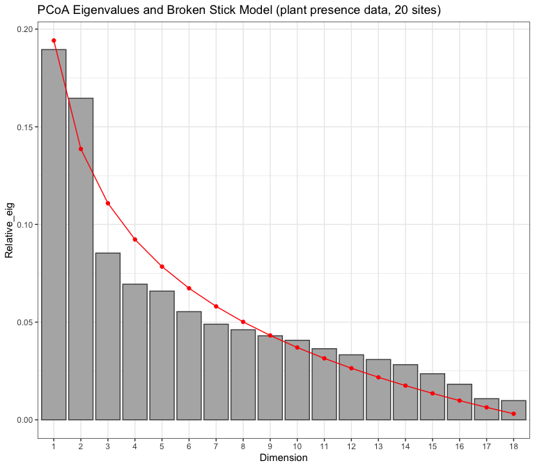
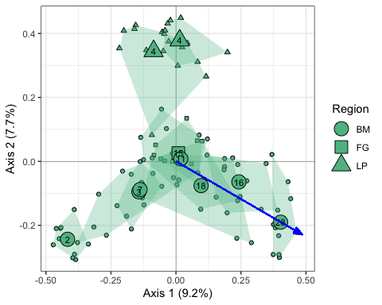
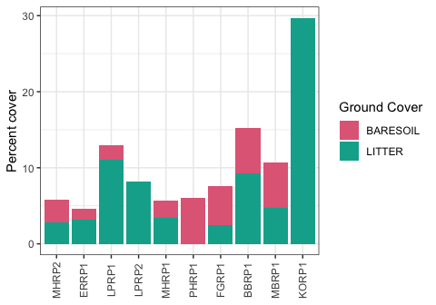

Plant data: communities and traits
================
Beau Larkin

Last updated: 15 December, 2023

- [Description](#description)
- [Packages and libraries](#packages-and-libraries)
- [Functions](#functions)
  - [Cleanplot PCA](#cleanplot-pca)
  - [PCoA](#pcoa)
- [Data](#data)
  - [Metadata from sites, as in
    previous](#metadata-from-sites-as-in-previous)
  - [Plant communities, subsample
    data](#plant-communities-subsample-data)
  - [Plant communities data](#plant-communities-data)
  - [Distance matrices](#distance-matrices)
  - [Data wrangling: traits data](#data-wrangling-traits-data)
    - [Abundance data (16 sites)](#abundance-data-16-sites)
    - [Presence data (20 sites)](#presence-data-20-sites)
- [Results](#results)
  - [Traits: sites with abundance
    data](#traits-sites-with-abundance-data)
  - [Traits: sites with presence data](#traits-sites-with-presence-data)
  - [Plant Communities](#plant-communities)
    - [Sites with presence data](#sites-with-presence-data)
    - [Restoration sites](#restoration-sites)
  - [Plant traits](#plant-traits)

# Description

Plant data comprises two data sets. Mike Healy did quadrat surveys at
all sites except Fermi, recording plant abundance. At Fermi, we only
have relevé data with presence/absence. These data were provided by Mike
Miller. Wisconsin sites were surveyed in Aug-Sept 2016. Fermi sites were
surveyed in summer 2017

Plant metadata includes taxonomy and life history traits, and should
cover both plant data sets. With the abundance-data sites, trait data
are reported in percent cover. In the presence-data sites, traits are in
counts of species with that trait per field.

This script produces basic visualization and diagnostic views of the
plant data. Two traits matrices are output, one for sites with abundance
data (16 sites), and one for sites with presence data only (20 sites).

Plant data may be used in matrix form for ordination, etc. Abundance and
presence/absence matrices are available. The data may also be transposed
and summarized as abundance in taxonomic or life history classes. This
makes sense for the abundance data, but maybe makes less sense with the
presence/absence data because the summary would really be richness, not
abundance.

Plants data were obtained in the [TRY Plant Trait
Database](https://www.try-db.org/TryWeb/Home.php) ([Kattge et
al. 2010](https://besjournals.onlinelibrary.wiley.com/doi/10.1111/j.2041-210X.2010.00067.x),
[Kattge et
al. 2011](https://onlinelibrary.wiley.com/doi/10.1111/j.1365-2486.2011.02451.x))
in 2016.

# Packages and libraries

``` r
packages_needed = c("GGally", "tidyverse", "vegan", "colorspace", "ape")
packages_installed = packages_needed %in% rownames(installed.packages())
```

``` r
if (any(!packages_installed)) {
    install.packages(packages_needed[!packages_installed])
}
```

``` r
for (i in 1:length(packages_needed)) {
    library(packages_needed[i], character.only = T)
}
```

# Functions

## Cleanplot PCA

Cleanplot PCA produces informative visualizations of PCA ordinations
[(Borcard et
al. 2018)](http://link.springer.com/10.1007/978-3-319-71404-2)

``` r
source(paste0(getwd(), "/supporting_files/cleanplot_pca.txt"))
```

## PCoA

``` r
pcoa_fun <- function(s, d, env=sites, corr="none", df_name, nperm=1999) {
    set.seed <- 397
    # Multivariate analysis
    p <- pcoa(d, correction = corr)
    p_vals <- data.frame(p$values) %>% 
        rownames_to_column(var = "Dim") %>% 
        mutate(Dim = as.integer(Dim))
    p_vec <- data.frame(p$vectors)
    # Wrangle site data
    env_w <- env %>% filter(field_name %in% s$field_name)
    # Permutation tests (PERMANOVA)
    h <- with(env_w, 
              how(within = Within(type="none"), 
                  plots  = Plots(strata=field_name, type="free"),
                  blocks = region,
                  nperm  = nperm))
    p_permtest <- adonis2(d ~ field_type, data = env_w, permutations = h)
    # Diagnostic plots
    if(corr == "none" | ncol(p_vals) == 6) {
        p_bstick <- ggplot(p_vals, aes(x = factor(Dim), y = Relative_eig)) + 
            geom_col(fill = "gray70", color = "gray30") + 
            geom_line(aes(x = Dim, y = Broken_stick), color = "red") +
            geom_point(aes(x = Dim, y = Broken_stick), color = "red") +
            labs(x = "Dimension", 
                 title = paste0("PCoA Eigenvalues and Broken Stick Model (", df_name, ")")) +
            theme_bw()
        p_ncomp <- with(p_vals, which(Relative_eig < Broken_stick)[1]-1)
        eig <- round(p_vals$Relative_eig[1:2] * 100, 1)
    } else {
        p_bstick <- ggplot(p_vals, aes(x = factor(Dim), y = Rel_corr_eig)) + 
            geom_col(fill = "gray70", color = "gray30") + 
            geom_line(aes(x = Dim, y = Broken_stick), color = "red") +
            geom_point(aes(x = Dim, y = Broken_stick), color = "red") +
            labs(x = "Dimension", 
                 title = paste0("PCoA Eigenvalues and Broken Stick Model (", df_name, ")")) +
            theme_bw()
        p_ncomp <- with(p_vals, which(Rel_corr_eig < Broken_stick)[1]-1)
        eig <- round(p_vals$Rel_corr_eig[1:2] * 100, 1)
    }
    ncomp <- if(p_ncomp <= 2) {2} else {p_ncomp}
    # Ordination plot
    scores <-
        p_vec[, 1:ncomp] %>%
        rownames_to_column(var = "field_name") %>%
        left_join(sites, by = "field_name")
    # Output data
    output <- list(dataset                        = df_name,
                   components_exceed_broken_stick = p_ncomp,
                   correction_note                = p$note,
                   values                         = p_vals[1:(ncomp+1), ], 
                   eigenvalues                    = eig,
                   site_vectors                   = scores,
                   broken_stick_plot              = p_bstick,
                   permanova                      = p_permtest)
    return(output)
}
```

``` r
pcoa_samps_fun <- function(s, m, bi=FALSE, env, corr="none", df_name, nperm=1999) {
    set.seed <- 438
    # Create distance object, check for zero columns
    s_df <- s %>% 
        mutate(field_sample = paste(field_name, sample, sep = "_")) %>% 
        select(field_sample, everything(), -field_name, -sample, -region, -field_type) %>% 
        data.frame(row.names = 1)
    s_nz <- s_df[, which(apply(s_df, 2, sum) > 0)]
    d <- vegdist(s_nz, method = m, binary = bi)
    # Multivariate analysis
    p <- pcoa(d, correction = corr)
    p_vals <- data.frame(p$values) %>% 
        rownames_to_column(var = "Dim") %>% 
        mutate(Dim = as.integer(Dim))
    p_vec <- data.frame(p$vectors)
    # Wrangle site data
    env_w <- data.frame(field_sample = rownames(s_nz)) %>% 
        separate_wider_delim(field_sample, delim = "_", names = c("field_name", "sample"), cols_remove = FALSE) %>% 
        left_join(env, by = join_by(field_name)) %>% 
        column_to_rownames(var = "field_sample")
    # Permutation tests (PERMANOVA)
    # Fields as replicate strata with subsamples
    # Regions as blocks
    h <- with(env_w, 
              how(within = Within(type="free"), 
                  blocks = region,
                  nperm  = nperm))
    p_permtest <- adonis2(
        d ~ field_name,
        data = env_w,
        permutations = h)
    # Diagnostic plots
    if(corr == "none" | ncol(p_vals) == 6) {
        p_bstick <- ggplot(p_vals, aes(x = factor(Dim), y = Relative_eig)) + 
            geom_col(fill = "gray70", color = "gray30") + 
            geom_line(aes(x = Dim, y = Broken_stick), color = "red") +
            geom_point(aes(x = Dim, y = Broken_stick), color = "red") +
            labs(x = "Dimension", 
                 title = paste0("PCoA Eigenvalues and Broken Stick Model (", df_name, ")")) +
            theme_bw()
        p_ncomp <- with(p_vals, which(Relative_eig < Broken_stick)[1]-1)
        eig <- round(p_vals$Relative_eig[1:2] * 100, 1)
    } else {
        p_bstick <- ggplot(p_vals, aes(x = factor(Dim), y = Rel_corr_eig)) + 
            geom_col(fill = "gray70", color = "gray30") + 
            geom_line(aes(x = Dim, y = Broken_stick), color = "red") +
            geom_point(aes(x = Dim, y = Broken_stick), color = "red") +
            labs(x = "Dimension", 
                 title = paste0("PCoA Eigenvalues and Broken Stick Model (", df_name, ")")) +
            theme_bw()
        p_ncomp <- with(p_vals, which(Rel_corr_eig < Broken_stick)[1]-1)
        eig <- round(p_vals$Rel_corr_eig[1:2] * 100, 1)
    }
    ncomp <- if(p_ncomp <= 2) {2} else {p_ncomp}
    fit <- NULL
    fit_sc <- NULL
    if(m == "bray") {
        # Permutation test (ENVFIT)
        # Fields as strata
        h = with(env_w, 
                 how(within = Within(type="none"), 
                     plots = Plots(strata=field_key, type="free"), 
                     nperm = nperm))
        fit <- envfit(p_vec ~ as.numeric(yr_since), env_w, permutations = h, choices = c(1:ncomp))
        fit_sc <- scores(fit, c("vectors"))
    }
    # Ordination plot
    scores <-
        p_vec[, 1:ncomp] %>%
        rownames_to_column(var = "field_sample") %>%
        separate_wider_delim(field_sample, delim = "_", names = c("field_name", "sample"), cols_remove = TRUE) %>% 
        left_join(env, by = join_by(field_name))
    # Output data
    output <- list(dataset           = df_name,
                   important_comp    = p_ncomp,
                   correction        = p$note,
                   values            = p_vals[1:(ncomp+1), ], 
                   eigenvalues       = eig,
                   site_vectors      = scores,
                   broken_stick_plot = p_bstick,
                   permanova         = p_permtest,
                   vector_fit        = fit,
                   vector_fit_scores = fit_sc)
    return(output)
}
```

# Data

## Metadata from sites, as in previous

``` r
sites <-
    read_csv(paste0(getwd(), "/clean_data/sites.csv"), show_col_types = FALSE) %>%
    mutate(
        field_type = factor(
            field_type,
            ordered = TRUE,
            levels = c("corn", "restored", "remnant")),
        yr_since = replace(yr_since, which(field_type == "remnant"), "+"),
        yr_since = replace(yr_since, which(field_type == "corn"), "-")) %>%
    select(-lat, -long, -yr_restore, -yr_rank) %>% 
    arrange(field_key)
```

``` r
sites_noc <- sites %>% 
    filter(field_type != "corn")
```

## Plant communities, subsample data

Raw field data can be used to compare among replicates (fields).
Long-form data must be wrangled into matrices and then converted to
distance objects.

``` r
plant_field_data <- read_csv(paste0(getwd(), "/plant_field_data/plant_cover.csv"), show_col_types = FALSE) %>% 
    select(-SITE, -TYPE, -FIELDNUM) %>% 
    rename(field_name = FIELDID, sample = PLOT, field_sample = PLOTID, code = PLANTCODE, cover_pct = PCTCVR, presence = PRESENCE) %>% 
    filter(field_name %in% sites$field_name) %>% 
    left_join(sites %>% select(field_name, region, field_type, field_key), by = join_by(field_name)) %>% 
    arrange(field_key, sample, code) %>% 
    select(region, field_type, field_name, sample, field_sample, code, cover_pct, presence)
```

``` r
plant_abiotic <- plant_field_data %>% 
    filter(code %in% c("BARESOIL", "LITTER")) %>% 
    write_csv(paste0(getwd(), "/clean_data/plant_abiotic.csv"))
```

``` r
plant_abund_samples <- plant_field_data %>% 
    filter(!(code %in% c("BARESOIL", "LITTER")),
           region != "FL") %>% 
    select(region, field_type, field_name, sample, code, cover_pct) %>% 
    arrange(code) %>% 
    pivot_wider(names_from = code, values_from = cover_pct, values_fill = 0) %>% 
    arrange(field_name, sample) %>% 
    write_csv(paste0(getwd(), "/clean_data/plant_abund_samples.csv"))
```

## Plant communities data

- Metadata, taxonomy and traits
- Abundance data, surveyed in 2016, sites limited to Wisconsin only
- Abundance data at the level of field samples (to compare among fields)
- Presence data, from Fermi in 2015, all other sites converted to
  presence data, does not include Fermi switchgrass or corn fields.

``` r
plant <- list(
    meta    = read_csv(paste0(getwd(), "/clean_data/spe_plant_meta.csv"), show_col_types = FALSE) %>% 
        rename_with(tolower),
    ab      = read_csv(paste0(getwd(), "/clean_data/spe_plant_abund.csv"), show_col_types = FALSE) %>% 
        rename(field_name = SITE) %>% select(-BARESOIL, -LITTER),
    ab_samp = read_csv(paste0(getwd(), "/clean_data/plant_abund_samples.csv"), show_col_types = FALSE),
    pr      = read_csv(paste0(getwd(), "/clean_data/spe_plant_presence.csv"), show_col_types = FALSE) %>% 
        rename(field_name = SITE) %>% select(-BARESOIL, -LITTER)
)
```

## Distance matrices

Distance matrices are needed for ordinations of the plant data.
Bray-Curtis distance is used for abundance data, the Jaccard similarity
is used for binary data.

``` r
distab = list(
    p_ab = vegdist(data.frame(plant$ab, row.names = 1), method = "bray"),
    p_pr = vegdist(data.frame(plant$pr, row.names = 1), method = "jac", binary = TRUE)
)
```

## Data wrangling: traits data

### Abundance data (16 sites)

The alignment of plant codes among files must be confirmed. Show any
mismatched codes.

``` r
which(!(colnames(plant$ab[, -1]) %in% plant$meta$code))
```

    ## integer(0)

``` r
which(!(colnames(plant$pr[, -1]) %in% plant$meta$code))
```

    ## integer(0)

The codes are aligned. Factor levels in metadata must be cleaned up and
simplified.

``` r
recode_group <- c(`annual/biennial` = "biennial", `annual/perennial` = "perennial", `C4-grass` = "C4_grass", `C3-grass` = "C3_grass")
filter_group <- c("bare", "litter", "unknown", "fern", "moss", "sedge", "Unknown", "shrub", "tree", "C3/C4", "rush")
```

Plant traits are summarized among the set of sites with plant abundance
data

``` r
p_ab_trait <-     
    plant$ab %>% 
    pivot_longer(-field_name, names_to = "code", values_to = "pct_cvr") %>% 
    filter(pct_cvr > 0) %>% 
    left_join(plant$meta %>% select(-(genus:name), -lifeform, -family), by = "code") %>% 
    pivot_longer(lifehist:category, names_to = "variable", values_to = "group", values_drop_na = TRUE) %>% 
    mutate(group = recode(group, !!!recode_group)) %>% 
    group_by(field_name, variable, group) %>% 
    summarize(pct_cvr = sum(pct_cvr), .groups = "drop") %>% 
    filter(!(group %in% filter_group)) %>% 
    select(-variable) %>% 
    arrange(group) %>%
    pivot_wider(names_from = group, values_from = pct_cvr, values_fill = 0) %>% 
    select(field_name, annual, biennial, perennial, native, nonnative, C3_grass, C4_grass, forb, legume, shrubTree)
```

### Presence data (20 sites)

These data are problematic because they are essentially counts of
traits, and these counts aren’t related to cover.

``` r
p_pr_trait <- 
    plant$pr %>% 
    pivot_longer(-field_name, names_to = "code", values_to = "count") %>% 
    filter(count > 0) %>% 
    left_join(plant$meta %>% select(-(genus:name), -lifeform, -family), by = "code") %>% 
    pivot_longer(lifehist:category, names_to = "variable", values_to = "group", values_drop_na = TRUE) %>% 
    mutate(group = recode(group, !!!recode_group)) %>% 
    group_by(field_name, variable, group) %>% 
    summarize(count = sum(count), .groups = "drop") %>% 
    filter(!(group %in% filter_group)) %>% 
    select(-variable) %>% 
    arrange(group) %>%
    pivot_wider(names_from = group, values_from = count, values_fill = 0) %>% 
    select(field_name, annual, biennial, perennial, native, nonnative, C3_grass, C4_grass, forb, legume, shrubTree)
```

# Results

## Traits: sites with abundance data

Run a PCA on chord-transformed traits data from sites with abundance
data, perform typical basic diagnostics. This should be done without
corn fields because they exert too strong a difference on everything
else.

``` r
p_ab_trait_ch <- decostand(
    data.frame(
        p_ab_trait %>% 
            filter(field_name %in% sites_noc$field_name), 
        row.names = 1), "normalize")
p_ab_trait_pca <- rda(p_ab_trait_ch)
p_ab_trait_pca %>% summary(., display = NULL)
```

    ## 
    ## Call:
    ## rda(X = p_ab_trait_ch) 
    ## 
    ## Partitioning of variance:
    ##               Inertia Proportion
    ## Total         0.07381          1
    ## Unconstrained 0.07381          1
    ## 
    ## Eigenvalues, and their contribution to the variance 
    ## 
    ## Importance of components:
    ##                           PC1     PC2      PC3      PC4      PC5       PC6
    ## Eigenvalue            0.04172 0.01537 0.008637 0.005015 0.001408 0.0008968
    ## Proportion Explained  0.56521 0.20826 0.117010 0.067942 0.019081 0.0121501
    ## Cumulative Proportion 0.56521 0.77347 0.890479 0.958420 0.977501 0.9896511
    ##                             PC7       PC8       PC9      PC10
    ## Eigenvalue            0.0004438 0.0001811 0.0001265 1.243e-05
    ## Proportion Explained  0.0060131 0.0024530 0.0017144 1.684e-04
    ## Cumulative Proportion 0.9956642 0.9981172 0.9998316 1.000e+00
    ## 
    ## Scaling 2 for species and site scores
    ## * Species are scaled proportional to eigenvalues
    ## * Sites are unscaled: weighted dispersion equal on all dimensions
    ## * General scaling constant of scores:

``` r
screeplot(p_ab_trait_pca, bstick = TRUE)
```


``` r
cleanplot.pca(p_ab_trait_pca)
```


Axis 1 & 2 explain 77% of the variation, and both eigenvalues exceed the
broken stick model. Traits forb, perennial, annual, nonnative, and C4
grass exceed the unit circle, suggesting a strong correlation with site
differences. Traits appear collinear, explore which ones produce high
VIF.

``` r
sort(diag(solve(cor(data.frame(p_ab_trait, row.names = 1)))), decreasing = TRUE) 
```

    ##   perennial      annual      native   nonnative    C4_grass        forb 
    ## 1091.599068 1070.069928  752.469656  655.604119  113.993616   93.683065 
    ##    biennial   shrubTree      legume    C3_grass 
    ##   49.116860    7.197170    4.623733    4.462052

Many are very high. Traits levels need not be mutually exclusive, but it
appears here that they are. Native opposes nonnative abundance,
perennial opposes annual, and forb opposes C4 grass. The last case may
be driven by Karla Ott’s field, but in other cases. What happens to VIF
when one of these opposing factor levels are removed?

``` r
sort(diag(solve(cor(data.frame(p_ab_trait, row.names = 1) %>% select(-annual, -nonnative, -C4_grass)))), decreasing = TRUE)
```

    ##    native perennial      forb  biennial shrubTree    legume  C3_grass 
    ##  9.315159  6.395496  5.055116  2.039153  1.801386  1.757270  1.412914

It’s clear that some are correlated and there is good reason to remove
them. It’s useful here because even after these are removed, they
suggest their opposite factor level. This will help inform forward
selection later. Export the traits matrix for sites with abundance data:

``` r
write_csv(p_ab_trait, paste0(getwd(), "/clean_data/plant_trait_abund.csv"))
```

## Traits: sites with presence data

Run a PCA on chord-transformed traits data from sites with abundance
data, perform typical basic diagnostics.

``` r
p_pr_trait_ch <- decostand(data.frame(p_pr_trait %>% filter(field_name %in% sites_noc$field_name), row.names = 1), "normalize")
p_pr_trait_pca <- rda(p_pr_trait_ch)
p_pr_trait_pca %>% summary(., display = NULL)
```

    ## 
    ## Call:
    ## rda(X = p_pr_trait_ch) 
    ## 
    ## Partitioning of variance:
    ##               Inertia Proportion
    ## Total         0.02141          1
    ## Unconstrained 0.02141          1
    ## 
    ## Eigenvalues, and their contribution to the variance 
    ## 
    ## Importance of components:
    ##                           PC1      PC2      PC3      PC4       PC5       PC6
    ## Eigenvalue            0.01349 0.003402 0.002393 0.001243 0.0003813 0.0002555
    ## Proportion Explained  0.63016 0.158910 0.111772 0.058062 0.0178111 0.0119346
    ## Cumulative Proportion 0.63016 0.789070 0.900842 0.958904 0.9767150 0.9886496
    ##                             PC7       PC8       PC9      PC10
    ## Eigenvalue            0.0001259 6.532e-05 0.0000496 2.145e-06
    ## Proportion Explained  0.0058828 3.051e-03 0.0023166 1.002e-04
    ## Cumulative Proportion 0.9945323 9.976e-01 0.9998998 1.000e+00
    ## 
    ## Scaling 2 for species and site scores
    ## * Species are scaled proportional to eigenvalues
    ## * Sites are unscaled: weighted dispersion equal on all dimensions
    ## * General scaling constant of scores:

``` r
screeplot(p_pr_trait_pca, bstick = TRUE)
```


``` r
cleanplot.pca(p_pr_trait_pca)
```


Axis 1 & 2 explain 79% of the variation. The axis 1 eigenvalue is the
only one which exceeds a broken stick model. Traits forb, biennial,
perennial, native, and nonnative exceed the unit circle, suggesting a
strong correlation with site differences. Traits appear collinear,
explore which ones produce high VIF.

``` r
sort(diag(solve(cor(data.frame(p_pr_trait, row.names = 1)))), decreasing = TRUE) 
```

    ##    perennial       native         forb    nonnative     biennial       annual 
    ## 12225.829278  9552.497610   760.415589   111.667352    82.714461    43.158554 
    ##     C3_grass       legume     C4_grass    shrubTree 
    ##    10.752644     9.665848     8.332982     7.784560

Many are very high, and lie in opposition by factor levels as in the
abundance data, but possibly a little less strong in terms of pure
linear correlation. Biennial probably describes forbs, and can easily be
discarded. It also looks like most perennials are also native?

``` r
sort(diag(solve(cor(data.frame(p_pr_trait, row.names = 1) %>% select(-nonnative, -biennial, -native)))), decreasing = TRUE)
```

    ##  perennial       forb   C4_grass     annual     legume  shrubTree   C3_grass 
    ## 185.188816 138.977387   6.865699   4.597058   3.778917   2.424485   2.070412

It’s clear that some are correlated and there is good reason to remove
them. It’s useful here because even after these are removed, they
suggest their opposite factor level. This will help inform forward
selection later. Export the traits matrix for sites with abundance data:

``` r
write_csv(p_pr_trait, paste0(getwd(), "/clean_data/plant_trait_presence.csv"))
```

## Plant Communities

In restored fields, plant communities don’t reflect natural community
assembly. Still, it’s useful to examine an ordination of sites to
develop an understanding of how they differ. Plant traits data are
probably more useful to looking at development of plant communities over
time after restoration. Traits may be filtered more than species, and
species’ occurrence may not be uniform across sites, though a species’
realized niche may include sites where it is not found. \### Sites with
abundance data An ordiation is run on plant abundance data using
`pcoa_fun()`.

``` r
(pcoa_ab <- pcoa_fun(plant$ab, distab$p_ab, corr="lingoes", df_name = "plant abundance data, 16 sites"))
```

    ## $dataset
    ## [1] "plant abundance data, 16 sites"
    ## 
    ## $components_exceed_broken_stick
    ## [1] 1
    ## 
    ## $correction_note
    ## [1] "There were no negative eigenvalues. No correction was applied"
    ## 
    ## $values
    ##   Dim Eigenvalues Relative_eig Broken_stick Cumul_eig Cumul_br_stick
    ## 1   1   1.7320423    0.3113302    0.2212153 0.3113302      0.2212153
    ## 2   2   0.7325178    0.1316682    0.1545486 0.4429985      0.3757639
    ## 3   3   0.5966216    0.1072412    0.1212153 0.5502397      0.4969791
    ## 
    ## $eigenvalues
    ## [1] 31.1 13.2
    ## 
    ## $site_vectors
    ##    field_name      Axis.1       Axis.2 field_key region field_type yr_since
    ## 1       BBRP1  0.23650957 -0.180933687         1     BM   restored       16
    ## 2       ERRP1  0.06719015  0.404444681         2     BM   restored        3
    ## 3        FGC1 -0.67526027 -0.032855670         3     FG       corn        -
    ## 4      FGREM1  0.09688139 -0.015610006         4     FG    remnant        +
    ## 5       FGRP1  0.16814620 -0.182802203         5     FG   restored       15
    ## 6       KORP1  0.15310611 -0.278694035        15     BM   restored       28
    ## 7        LPC1 -0.67686895 -0.033309016        16     LP       corn        -
    ## 8      LPREM1  0.15287122  0.076202238        17     LP    remnant        +
    ## 9       LPRP1  0.18222097  0.203400078        18     LP   restored        4
    ## 10      LPRP2  0.21480720  0.026832174        19     LP   restored        4
    ## 11     MBREM1  0.15888147 -0.348688085        20     BM    remnant        +
    ## 12      MBRP1  0.17054532 -0.223163361        21     BM   restored       18
    ## 13      MHRP1  0.19084072  0.006210016        22     BM   restored        7
    ## 14      MHRP2  0.04448505  0.391640592        23     BM   restored        2
    ## 15       PHC1 -0.68013789 -0.033685776        24     BM       corn        -
    ## 16      PHRP1  0.19578172  0.221012060        25     BM   restored       11
    ## 
    ## $broken_stick_plot

<!-- -->

    ## 
    ## $permanova
    ## Permutation test for adonis under reduced model
    ## Terms added sequentially (first to last)
    ## Blocks:  region 
    ## Plots: field_name, plot permutation: free
    ## Permutation: none
    ## Number of permutations: 1999
    ## 
    ## adonis2(formula = d ~ field_type, data = env_w, permutations = h)
    ##            Df SumOfSqs      R2      F Pr(>F)   
    ## field_type  2   2.0343 0.36566 3.7469  0.005 **
    ## Residual   13   3.5290 0.63434                 
    ## Total      15   5.5634 1.00000                 
    ## ---
    ## Signif. codes:  0 '***' 0.001 '**' 0.01 '*' 0.05 '.' 0.1 ' ' 1

Axis 1 explains 31.1% of the variation and is the only eigenvalue that
exceeds a broken stick model. The most substantial variation here will
be on the first axis. Axis 2 explains 13.2% of the variation and was not
very close to the broken stick value. Testing the design factor
*field_type* (with *region* treated as a block using arguments to
`how()` revealed a significant clustering $(R^2=0.37,~p=0.005)$. Let’s
view a plot of these results.

``` r
ggplot(pcoa_ab$site_vectors, aes(x = Axis.1, y = Axis.2)) +
    geom_point(aes(fill = field_type, shape = region), size = 10) +
    geom_text(aes(label = yr_since)) +
    scale_fill_discrete_qualitative(name = "Field Type", palette = "harmonic") +
    scale_shape_manual(name = "Region", values = c(21, 22, 23, 24)) +
    labs(
        x = paste0("Axis 1 (", pcoa_ab$eig[1], "%)"),
        y = paste0("Axis 2 (", pcoa_ab$eig[2], "%)"),
        title = paste0(
            "PCoA Ordination of field-averaged species data (",
            pcoa_ab$dataset,
            ")"
        ),
        caption = "Text indicates years since restoration, with corn (-) and remnants (+) never restored."
    ) +
    theme_bw() +
    guides(fill = guide_legend(override.aes = list(shape = 21)))
```


### Sites with presence data

An ordiation is run on plant presence data using `pcoa_fun()`. The
dataset includes 20 sites. This analysis isn’t appropriate because the
blocks are unbalanced (no cornfield data from Fermi), but it still shows
differences with plant data.

``` r
(pcoa_pr <- pcoa_fun(plant$pr, distab$p_pr, corr="none", df_name = "plant presence data, 20 sites"))
```

    ## $dataset
    ## [1] "plant presence data, 20 sites"
    ## 
    ## $components_exceed_broken_stick
    ## [1] 0
    ## 
    ## $correction_note
    ## [1] "There were no negative eigenvalues. No correction was applied"
    ## 
    ## $values
    ##   Dim Eigenvalues Relative_eig Broken_stick Cumul_eig Cumul_br_stick
    ## 1   1   1.4033118   0.18951647    0.1941727 0.1895165      0.1941727
    ## 2   2   1.2187101   0.16458611    0.1386171 0.3541026      0.3327898
    ## 3   3   0.6319999   0.08535122    0.1108393 0.4394538      0.4436291
    ## 
    ## $eigenvalues
    ## [1] 19.0 16.5
    ## 
    ## $site_vectors
    ##    field_name      Axis.1      Axis.2 field_key region field_type yr_since
    ## 1       BBRP1  0.09914813  0.23070445         1     BM   restored       16
    ## 2       ERRP1  0.02543020  0.23019146         2     BM   restored        3
    ## 3        FGC1 -0.49280623 -0.04507213         3     FG       corn        -
    ## 4      FGREM1  0.05743020 -0.05493783         4     FG    remnant        +
    ## 5       FGRP1  0.08530486  0.10097376         5     FG   restored       15
    ## 6      FLREM1  0.17868215 -0.47102241         8     FL    remnant        +
    ## 7       FLRP1  0.19947396 -0.47248148         9     FL   restored       40
    ## 8       FLRP4  0.19663457 -0.47940645        10     FL   restored       36
    ## 9       FLRP5  0.19660213 -0.33674973        11     FL   restored       35
    ## 10      KORP1  0.01745581  0.17785876        15     BM   restored       28
    ## 11       LPC1 -0.67153048 -0.10514976        16     LP       corn        -
    ## 12     LPREM1  0.08993967  0.23963995        17     LP    remnant        +
    ## 13      LPRP1  0.12573673  0.23752522        18     LP   restored        4
    ## 14      LPRP2  0.15502939  0.18536991        19     LP   restored        4
    ## 15     MBREM1  0.05354148  0.05377379        20     BM    remnant        +
    ## 16      MBRP1  0.11704021  0.09828439        21     BM   restored       18
    ## 17      MHRP1  0.05301141  0.20426174        22     BM   restored        7
    ## 18      MHRP2  0.04992560  0.10980649        23     BM   restored        2
    ## 19       PHC1 -0.67153048 -0.10514976        24     BM       corn        -
    ## 20      PHRP1  0.13548068  0.20157962        25     BM   restored       11
    ## 
    ## $broken_stick_plot

<!-- -->

    ## 
    ## $permanova
    ## Permutation test for adonis under reduced model
    ## Terms added sequentially (first to last)
    ## Blocks:  region 
    ## Plots: field_name, plot permutation: free
    ## Permutation: none
    ## Number of permutations: 1999
    ## 
    ## adonis2(formula = d ~ field_type, data = env_w, permutations = h)
    ##            Df SumOfSqs      R2      F Pr(>F)    
    ## field_type  2   1.6996 0.22953 2.5322  0.001 ***
    ## Residual   17   5.7051 0.77047                  
    ## Total      19   7.4047 1.00000                  
    ## ---
    ## Signif. codes:  0 '***' 0.001 '**' 0.01 '*' 0.05 '.' 0.1 ' ' 1

Axis 1 explains 19% of the variation and axis 2 explains 13.2% of the
variation. These two eigenvalues exceed the broken stick value. stick
value. Testing the design factor *field_type* (with *region* treated as
a block using arguments to `how()` revealed a significant clustering
$(R^2=0.23,~p=0.001)$. Let’s view a plot of these results.

``` r
ggplot(pcoa_pr$site_vectors, aes(x = Axis.1, y = Axis.2)) +
    geom_point(aes(fill = field_type, shape = region), size = 10) +
    geom_text(aes(label = yr_since)) +
    scale_fill_discrete_qualitative(name = "Field Type", palette = "harmonic") +
    scale_shape_manual(name = "Region", values = c(21, 22, 23, 24)) +
    labs(
        x = paste0("Axis 1 (", pcoa_pr$eig[1], "%)"),
        y = paste0("Axis 2 (", pcoa_pr$eig[2], "%)"),
        title = paste0(
            "PCoA Ordination of field-averaged species data (",
            pcoa_pr$dataset,
            ")"
        ),
        caption = "Text indicates years since restoration, with corn (-) and remnants (+) never restored."
    ) +
    theme_bw() +
    guides(fill = guide_legend(override.aes = list(shape = 21)))
```


The regional signal is most obvious here.

### Restoration sites

#### Wisconsin regions

Plant communities in restoration fields are artificial. It’s important
to know how much they differ among fields and if differences are related
to years since restoration. We will look at the Wisconsin regions first
and permute within regions.

``` r
(pcoa_ab_samps_wi <- 
    pcoa_samps_fun(s = plant$ab_samp %>% filter(field_type == "restored", region != "FL"),
               m = "bray",
               env = sites %>% filter(field_type == "restored", region != "FL"),
               corr = "lingoes",
               df_name = "Plant abundance data, subsamples, Wisconsin regions",
               nperm = 1999))
```

    ## $dataset
    ## [1] "Plant abundance data, subsamples, Wisconsin regions"
    ## 
    ## $important_comp
    ## [1] 8
    ## 
    ## $correction
    ## [1] "Lingoes correction applied to negative eigenvalues: D' = -0.5*D^2 - 0.239375760962913 , except diagonal elements"
    ## 
    ## $values
    ##   Dim Eigenvalues Corr_eig Rel_corr_eig Broken_stick Cum_corr_eig Cum_br_stick
    ## 1   1    5.459222 5.698598   0.09182343   0.05272731   0.09182343   0.05272731
    ## 2   2    4.515201 4.754577   0.07661211   0.04252323   0.16843554   0.09525054
    ## 3   3    3.861102 4.100478   0.06607239   0.03742119   0.23450793   0.13267173
    ## 4   4    2.832896 3.072272   0.04950455   0.03401983   0.28401248   0.16669156
    ## 5   5    2.429150 2.668525   0.04299886   0.03146881   0.32701134   0.19816037
    ## 6   6    2.002904 2.242280   0.03613062   0.02942799   0.36314196   0.22758836
    ## 7   7    1.581212 1.820588   0.02933575   0.02772731   0.39247771   0.25531567
    ## 8   8    1.471967 1.711343   0.02757545   0.02626959   0.42005315   0.28158525
    ## 9   9    1.259275 1.498651   0.02414827   0.02499408   0.44420143   0.30657933
    ## 
    ## $eigenvalues
    ## [1] 9.2 7.7
    ## 
    ## $site_vectors
    ## # A tibble: 100 × 14
    ##    field_name sample Axis.1   Axis.2   Axis.3  Axis.4   Axis.5   Axis.6  Axis.7
    ##    <chr>      <chr>   <dbl>    <dbl>    <dbl>   <dbl>    <dbl>    <dbl>   <dbl>
    ##  1 BBRP1      1       0.187 -0.0166   0.0448  -0.218  -0.135    0.177   -0.0987
    ##  2 BBRP1      2       0.197 -0.161   -0.0776  -0.158  -0.182   -0.00690  0.110 
    ##  3 BBRP1      3       0.238 -0.00996  0.303   -0.170  -0.0680   0.00147 -0.189 
    ##  4 BBRP1      4       0.273 -0.0608   0.0985  -0.0400 -0.182    0.0263   0.110 
    ##  5 BBRP1      5       0.328 -0.150   -0.00837  0.0690 -0.00365 -0.0246   0.241 
    ##  6 BBRP1      6       0.187  0.00870 -0.0965  -0.232   0.0262   0.347   -0.0262
    ##  7 BBRP1      7       0.391 -0.153    0.199   -0.0722 -0.166    0.0299  -0.0251
    ##  8 BBRP1      8       0.155 -0.112   -0.0401  -0.235  -0.268   -0.00982  0.0622
    ##  9 BBRP1      9       0.347 -0.00687  0.256   -0.0694 -0.148    0.0362  -0.0699
    ## 10 BBRP1      10      0.120  0.0196   0.391   -0.236  -0.0491   0.00926  0.0880
    ## # ℹ 90 more rows
    ## # ℹ 5 more variables: Axis.8 <dbl>, field_key <dbl>, region <chr>,
    ## #   field_type <ord>, yr_since <chr>
    ## 
    ## $broken_stick_plot

<!-- -->

    ## 
    ## $permanova
    ## Permutation test for adonis under reduced model
    ## Terms added sequentially (first to last)
    ## Blocks:  region 
    ## Permutation: free
    ## Number of permutations: 1999
    ## 
    ## adonis2(formula = d ~ field_name, data = env_w, permutations = h)
    ##            Df SumOfSqs      R2      F Pr(>F)    
    ## field_name  9   18.181 0.47394 9.0092  5e-04 ***
    ## Residual   90   20.181 0.52606                  
    ## Total      99   38.362 1.00000                  
    ## ---
    ## Signif. codes:  0 '***' 0.001 '**' 0.01 '*' 0.05 '.' 0.1 ' ' 1
    ## 
    ## $vector_fit
    ## 
    ## ***VECTORS
    ## 
    ##                         Axis.1    Axis.2    Axis.3    Axis.4    Axis.5
    ## as.numeric(yr_since)  0.845160 -0.398380  0.116942  0.180121  0.144907
    ##                         Axis.6    Axis.7    Axis.8     r2 Pr(>r)  
    ## as.numeric(yr_since) -0.011507  0.241990 -0.034590 0.7822 0.0315 *
    ## ---
    ## Signif. codes:  0 '***' 0.001 '**' 0.01 '*' 0.05 '.' 0.1 ' ' 1
    ## Plots: field_key, plot permutation: free
    ## Permutation: none
    ## Number of permutations: 1999
    ## 
    ## 
    ## 
    ## $vector_fit_scores
    ##                         Axis.1     Axis.2    Axis.3    Axis.4    Axis.5
    ## as.numeric(yr_since) 0.7474902 -0.3523422 0.1034281 0.1593059 0.1281619
    ##                           Axis.6    Axis.7      Axis.8
    ## as.numeric(yr_since) -0.01017729 0.2140255 -0.03059261

Let’s view an ordination plot with hulls around subsamples.

``` r
centroid_ab_samps_wi <- aggregate(cbind(Axis.1, Axis.2) ~ field_name, data = pcoa_ab_samps_wi$site_vectors, mean) %>% 
    left_join(sites, by = join_by(field_name))
hull_ab_samps_wi <- pcoa_ab_samps_wi$site_vectors %>% 
    group_by(field_name) %>% 
    slice(chull(Axis.1, Axis.2))
```

``` r
ggplot(pcoa_ab_samps_wi$site_vectors, aes(x = Axis.1, y = Axis.2)) +
    geom_vline(xintercept = 0, linewidth = 0.1) +
    geom_hline(yintercept = 0, linewidth = 0.1) +
    geom_point(aes(shape = region), fill = "#5CBD92") +
    geom_polygon(data = hull_ab_samps_wi, aes(group = field_name), fill = "#5CBD92", alpha = 0.3) +
    geom_point(data = centroid_ab_samps_wi, aes(shape = region), fill = "#5CBD92", size = 6) +
    geom_text(data = centroid_ab_samps_wi, aes(label = yr_since), size = 3) +
    geom_segment(aes(x = 0, 
                     y = 0, 
                     xend = pcoa_ab_samps_wi$vector_fit_scores[1] * 0.65, 
                     yend = pcoa_ab_samps_wi$vector_fit_scores[2] * 0.65),
                 color = "blue", 
                 arrow = arrow(angle = 20, length = unit(3, "mm"), type = "closed")) +
    labs(
        x = paste0("Axis 1 (", pcoa_ab_samps_wi$eigenvalues[1], "%)"),
        y = paste0("Axis 2 (", pcoa_ab_samps_wi$eigenvalues[2], "%)")) +
    scale_shape_manual(name = "Region", values = c(21, 22, 24)) +
    theme_bw()
```



The permutation test reveals that subsamples cluster to fields based on
plant communities, and that years since restoration is significantly
related community difference. This shows that plant communities and time
since restoration are potentially confounded as explanatory variables of
soil microbial communities.

Years since restoration is clearly related to plant communities. Let’s
look at how composition in functional groups changes and see if patterns
exist.

``` r
p_ab_trait_tidy <- 
    p_ab_trait %>% 
    pivot_longer(-field_name, names_to = "trait", values_to = "cvr") %>% 
    mutate(category = case_match(trait, 
                                 c("annual", "biennial", "perennial") ~ "Life History", 
                                 c("native", "nonnative") ~ "Native Status", 
                                 .default = "Functional Group")
           ) %>% 
    left_join(sites %>% select(-field_key), by = join_by(field_name)) %>% 
    filter(field_type == "restored") %>% 
    mutate(yr_since = as.numeric(yr_since), 
           trait = factor(trait, ordered = TRUE, 
                          levels = c("C3_grass", "C4_grass", "forb", "legume", "shrubTree", "annual", "biennial", "perennial", "native", "nonnative")))
```

``` r
ggplot(p_ab_trait_tidy, aes(x = fct_reorder(field_name, yr_since), y = cvr)) +
    facet_wrap(vars(category)) +
    geom_col(aes(fill = trait)) +
    labs(y = "Percent cover") +
    scale_fill_manual(name = "Trait", values = c(sequential_hcl(5, "Batlow"), qualitative_hcl(3, "Dark3"), "gray30", "gray70")) +
    theme_bw() +
    theme(axis.text.x = element_text(angle = 90, vjust = 0.5), axis.title.x = element_blank())
```


``` r
plant_abiotic %>% 
    group_by(region, field_type, field_name, code) %>% 
    summarize(cover_avg = mean(cover_pct), .groups = "drop") %>% 
    left_join(sites %>% select(field_name, yr_since), by = join_by(field_name)) %>% 
    filter(field_type == "restored") %>% 
    mutate(yr_since = as.numeric(yr_since)) %>% 
    ggplot(aes(x = fct_reorder(field_name, yr_since), y = cover_avg)) +
    geom_col(aes(fill = code)) +
    labs(y = "Percent cover") +
    scale_fill_discrete_qualitative(name = "Ground Cover", palette = "Dark3") +
    theme_bw() +
    theme(axis.text.x = element_text(angle = 90, vjust = 0.5), axis.title.x = element_blank())
```



#### Blue Mounds fields

``` r
(pcoa_ab_samps_bm <- 
    pcoa_samps_fun(s = plant$ab_samp %>% filter(field_type == "restored", region == "BM"),
               m = "bray",
               env = sites %>% filter(field_type == "restored", region == "BM"),
               corr = "lingoes",
               df_name = "Plant abundance data, subsamples, Blue Mounds",
               nperm = 1999))
```

    ## $dataset
    ## [1] "Plant abundance data, subsamples, Blue Mounds"
    ## 
    ## $important_comp
    ## [1] 7
    ## 
    ## $correction
    ## [1] "Lingoes correction applied to negative eigenvalues: D' = -0.5*D^2 - 0.184127742713576 , except diagonal elements"
    ## 
    ## $values
    ##   Dim Eigenvalues Corr_eig Rel_corr_eig Broken_stick Cum_corr_eig Cum_br_stick
    ## 1   1   5.2316916 5.415819   0.13935824   0.07064792    0.1393582   0.07064792
    ## 2   2   3.3127760 3.496904   0.08998128   0.05594203    0.2293395   0.12658995
    ## 3   3   2.6259617 2.810089   0.07230838   0.04858909    0.3016479   0.17517904
    ## 4   4   2.0339894 2.218117   0.05707593   0.04368713    0.3587238   0.21886617
    ## 5   5   1.7019743 1.886102   0.04853261   0.04001066    0.4072564   0.25887684
    ## 6   6   1.3647727 1.548900   0.03985584   0.03706948    0.4471123   0.29594632
    ## 7   7   1.2217989 1.405927   0.03617688   0.03461850    0.4832892   0.33056482
    ## 8   8   0.9013046 1.085432   0.02793002   0.03251766    0.5112192   0.36308249
    ## 
    ## $eigenvalues
    ## [1] 13.9  9.0
    ## 
    ## $site_vectors
    ## # A tibble: 70 × 13
    ##    field_name sample Axis.1  Axis.2  Axis.3  Axis.4   Axis.5   Axis.6  Axis.7
    ##    <chr>      <chr>   <dbl>   <dbl>   <dbl>   <dbl>    <dbl>    <dbl>   <dbl>
    ##  1 BBRP1      1      0.162  -0.0452  0.180  -0.224   0.0301  -0.179    0.103 
    ##  2 BBRP1      2      0.174  -0.0953  0.0103 -0.178  -0.149    0.0856   0.160 
    ##  3 BBRP1      3      0.207   0.161   0.238  -0.104  -0.0732  -0.271   -0.0335
    ##  4 BBRP1      4      0.256   0.0949  0.0659 -0.182  -0.0782   0.0928   0.148 
    ##  5 BBRP1      5      0.322   0.0807 -0.0479 -0.0146  0.00858  0.201    0.0896
    ##  6 BBRP1      6      0.173  -0.177   0.144  -0.198   0.217   -0.161    0.108 
    ##  7 BBRP1      7      0.359   0.189   0.0936 -0.166  -0.0902  -0.0611   0.141 
    ##  8 BBRP1      8      0.132  -0.128   0.0605 -0.286  -0.216    0.0216   0.0675
    ##  9 BBRP1      9      0.318   0.206   0.177  -0.157  -0.0801  -0.107    0.168 
    ## 10 BBRP1      10     0.0910  0.234   0.428  -0.108  -0.0464  -0.00441  0.163 
    ## # ℹ 60 more rows
    ## # ℹ 4 more variables: field_key <dbl>, region <chr>, field_type <ord>,
    ## #   yr_since <chr>
    ## 
    ## $broken_stick_plot

<!-- -->

    ## 
    ## $permanova
    ## Permutation test for adonis under reduced model
    ## Terms added sequentially (first to last)
    ## Blocks:  region 
    ## Permutation: free
    ## Number of permutations: 1999
    ## 
    ## adonis2(formula = d ~ field_name, data = env_w, permutations = h)
    ##            Df SumOfSqs      R2      F Pr(>F)    
    ## field_name  6   12.309 0.47055 9.3318  5e-04 ***
    ## Residual   63   13.849 0.52945                  
    ## Total      69   26.158 1.00000                  
    ## ---
    ## Signif. codes:  0 '***' 0.001 '**' 0.01 '*' 0.05 '.' 0.1 ' ' 1
    ## 
    ## $vector_fit
    ## 
    ## ***VECTORS
    ## 
    ##                         Axis.1    Axis.2    Axis.3    Axis.4    Axis.5
    ## as.numeric(yr_since)  0.838630  0.272579 -0.188770 -0.027578 -0.013142
    ##                         Axis.6    Axis.7     r2 Pr(>r)  
    ## as.numeric(yr_since)  0.175546 -0.393730 0.8619 0.0115 *
    ## ---
    ## Signif. codes:  0 '***' 0.001 '**' 0.01 '*' 0.05 '.' 0.1 ' ' 1
    ## Plots: field_key, plot permutation: free
    ## Permutation: none
    ## Number of permutations: 5039
    ## 
    ## 
    ## 
    ## $vector_fit_scores
    ##                         Axis.1    Axis.2     Axis.3     Axis.4     Axis.5
    ## as.numeric(yr_since) 0.7785519 0.2530535 -0.1752481 -0.0256027 -0.0122005
    ##                        Axis.6     Axis.7
    ## as.numeric(yr_since) 0.162971 -0.3655278

Let’s view an ordination plot with hulls around subsamples.

``` r
centroid_ab_samps_bm <- aggregate(cbind(Axis.1, Axis.2) ~ field_name, data = pcoa_ab_samps_bm$site_vectors, mean) %>% 
    left_join(sites, by = join_by(field_name))
hull_ab_samps_bm <- pcoa_ab_samps_bm$site_vectors %>% 
    group_by(field_name) %>% 
    slice(chull(Axis.1, Axis.2))
```

``` r
ggplot(pcoa_ab_samps_bm$site_vectors, aes(x = Axis.1, y = Axis.2)) +
    geom_point(fill = "#DB9D85", shape = 21) +
    geom_polygon(data = hull_ab_samps_bm, aes(group = field_name), fill = "#DB9D85", alpha = 0.3) +
    geom_point(data = centroid_ab_samps_bm, fill = "#DB9D85", shape = 21, size = 8) +
    geom_text(data = centroid_ab_samps_bm, aes(label = yr_since)) +
    geom_segment(aes(x = 0, 
                     y = 0, 
                     xend = pcoa_ab_samps_bm$vector_fit_scores[1] * 0.65, 
                     yend = pcoa_ab_samps_bm$vector_fit_scores[2] * 0.65),
                 color = "blue", 
                 arrow = arrow(length = unit(3, "mm"))) +
    labs(
        x = paste0("Axis 1 (", pcoa_ab_samps_bm$eigenvalues[1], "%)"),
        y = paste0("Axis 2 (", pcoa_ab_samps_bm$eigenvalues[2], "%)")) +
    theme_bw()
```


The Blue Mounds area is our most defensible chronosequence. But even
here, the permutation test reveals that subsamples cluster to fields
based on plant communities, and that years since restoration is
significantly related community difference. This shows that plant
communities and time since restoration are potentially confounded as
explanatory variables of soil microbial communities.

## Plant traits

The inverse relationship of forbs and C4 grasses over time is a common
feature of tallgrass prairie restoration. In this case, some of that
could be happening naturally, but we also know that the oldest field was
planted heavily with bluestem.

We saw above that plant community change correlated with years since
restoration, and it’s a strong relationship with the shift from forbs to
C4 grasses over time, for restored sites in Wisconsin:

``` r
p_ab_trait %>% 
    left_join(sites, by = join_by(field_name)) %>% 
    filter(region != "FL", field_type == "restored") %>% 
    mutate(yr_since = as.numeric(yr_since)) %>% 
    select(yr_since, C4_grass, forb) %>% 
    ggpairs(title = "Trait correlations with time in Wisconsin restored fields") +
    theme_bw()
```


And it’s even stronger in just the Blue Mounds:

``` r
p_ab_trait %>% 
    left_join(sites, by = join_by(field_name)) %>% 
    filter(region == "BM", field_type == "restored") %>% 
    mutate(yr_since = as.numeric(yr_since)) %>% 
    select(yr_since, C4_grass, forb) %>% 
    ggpairs(title = "Trait correlations with time in Blue Mounds restored fields") +
    theme_bw()
```


