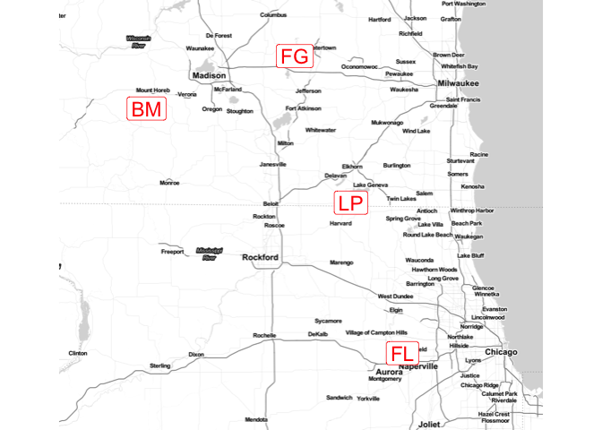
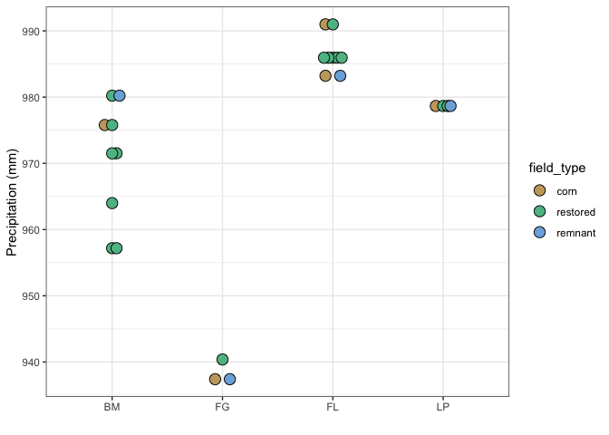

Site locations, metadata, and climate
================
Beau Larkin

Last updated: 03 February, 2023

- <a href="#description" id="toc-description">Description</a>
- <a href="#package-and-library-installation"
  id="toc-package-and-library-installation">Package and library
  installation</a>
- <a href="#data-and-etl" id="toc-data-and-etl">Data and ETL</a>
  - <a href="#sites" id="toc-sites">Sites</a>
  - <a href="#climate-data" id="toc-climate-data">Climate data</a>
    - <a href="#normals" id="toc-normals">Normals</a>
- <a href="#results" id="toc-results">Results</a>
  - <a href="#site-types" id="toc-site-types">Site types</a>
  - <a href="#regional-map" id="toc-regional-map">Regional map</a>
  - <a href="#regional-areas" id="toc-regional-areas">Regional areas</a>
  - <a href="#precipitation-normals"
    id="toc-precipitation-normals">Precipitation normals</a>

# Description

Site locations, maps, and metadata are produced here. Climate data
(precipitation) are downloaded and processed here.

- Precipitation data was downloaded from
  [PRISM](https://prism.oregonstate.edu/) on 2022-01-06 following this
  [tutorial](https://rpubs.com/collnell/get_prism).
- Raw (downloaded) data is stored locally; site level data was processed
  into .csv files and included in this repository.
- Precipitation data are 30-year normals from 1991-2020

Note that in this script, messages and verbose outputs are often
suppressed for brevity.

# Package and library installation

``` r
packages_needed = c(
    "tidyverse",
    "colorspace",
    "ggmap",
    "raster",
    "sp",
    "prism",
    "conflicted",
    "ggbeeswarm",
    "knitr"
)
packages_installed = packages_needed %in% rownames(installed.packages())
```

``` r
if (any(!packages_installed)) {
    install.packages(packages_needed[!packages_installed])
}
```

``` r
for (i in 1:length(packages_needed)) {
    library(packages_needed[i], character.only = T)
}
```

``` r
{
    conflict_prefer("filter", "dplyr")
    conflict_prefer("select", "dplyr")
    conflict_prefer("extract", "raster")
}
```

# Data and ETL

## Sites

Field type “oldfield” is not considered because they were only available
in one region.

``` r
sites <-
    read_csv(paste0(getwd(), "/clean_data/site.csv"), show_col_types = FALSE) %>%
    filter(site_type != "oldfield") %>%
    glimpse()
```

    ## Rows: 25
    ## Columns: 9
    ## $ site_key   <dbl> 1, 2, 3, 4, 5, 6, 7, 8, 9, 10, 11, 12, 13, 14, 15, 16, 17, …
    ## $ site_name  <chr> "BBRP1", "ERRP1", "FGC1", "FGREM1", "FGRP1", "FLC1", "FLC2"…
    ## $ region     <chr> "BM", "BM", "FG", "FG", "FG", "FL", "FL", "FL", "FL", "FL",…
    ## $ lat        <dbl> 43.09989, 43.06588, 43.16087, 43.16172, 43.14381, 41.85941,…
    ## $ long       <dbl> -89.72517, -89.80358, -88.89045, -88.88973, -88.88175, -88.…
    ## $ site_type  <chr> "restored", "restored", "corn", "remnant", "restored", "cor…
    ## $ yr_restore <dbl> 2000, 2013, NA, NA, 2001, NA, NA, NA, 1976, 1980, 1981, 200…
    ## $ yr_since   <dbl> 16, 3, 0, NA, 15, 0, 0, NA, 40, 36, 35, 10, 10, 10, 28, 0, …
    ## $ yr_rank    <dbl> 9, 3, 1, 16, 8, 1, 1, 16, 14, 13, 12, 6, 6, 6, 11, 1, 16, 4…

## Climate data

Climate data was accessed and downloaded on 2022-01-06. The following
script does not need to be run again and is commented out to prevent
errors and overwrites. Raw downloaded data are stored locally, summary
files were written to the working directory and included in this
repository.

### Normals

Download archive rasters

``` r
# prism_set_dl_dir("~/Desktop/prism_temp")
# get_prism_normals(type = "ppt", resolution = "4km", annual = TRUE, keepZip = FALSE)
# prism_archive_ls()
# RS <- pd_stack(prism_archive_ls())
# proj4string(RS) <- CRS("+proj=longlat +ellps=WGS84 +no_defs")
# sites_spdf <-
#     SpatialPointsDataFrame(
#         coords = sites[, c("long", "lat")],
#         data = sites,
#         proj4string = CRS("+proj=longlat +ellps=WGS84 +no_defs")
#     )
```

Extract locations from archive rasters

``` r
# sites_ppt <- raster::extract(RS, sites_spdf, fun = mean, na.rm = TRUE, sp = TRUE)@data %>%
#     rename(ppt_mm = PRISM_ppt_30yr_normal_4kmM3_annual_bil)
```

Create data table `site_precip_normal.csv`

``` r
# write_csv(sites_ppt %>% select(site_key, ppt_mm), paste0(getwd(), "/clean_data/site_precip_normal.csv"))
```

# Results

## Site types

How many sites are in each field type?

``` r
kable(table(sites$region, sites$site_type),
      format = "pandoc",
      caption = "Field types by region: BM = Blue Mounds, FG = Faville Grove, FL = Fermilab, LP = Lake Petite")
```

|     | corn | remnant | restored |
|-----|-----:|--------:|---------:|
| BM  |    1 |       1 |        7 |
| FG  |    1 |       1 |        1 |
| FL  |    2 |       1 |        6 |
| LP  |    1 |       1 |        2 |

Field types by region: BM = Blue Mounds, FG = Faville Grove, FL =
Fermilab, LP = Lake Petite

## Regional map

``` r
map <- ggmap(get_stamenmap(
    bbox = c(
        left = -90.3,
        bottom = 41.5,
        right = -87.4,
        top = 43.4
    ),
    zoom = 9,
    maptype = c("toner-lite"),
    color = c("color")
))
```

``` r
map +
    geom_label(
        data = sites %>% group_by(region) %>% summarize(
            long_cen = mean(long),
            lat_cen = mean(lat),
            .groups = "drop"
        ),
        aes(x = long_cen, y = lat_cen, label = region),
        color = "red",
        size = 6
    ) +
    theme_void()
```

<!-- -->

The map labels show centroids for each region: BM = Blue Mounds, FG =
Faville Grove, FL = Fermilab, LP = Lake Petite. Map tiles by Stamen
Design, under CC BY 3.0. Data by OpenStreetMap, under ODbL.

## Regional areas

The area of convex hulls around field in each region is shown in the
table below:

``` r
kable(data.frame(
    region = c("BM", "FG", "FL", "LP"),
    area_ha = c("39,500", "12", "330", "14")
),
format = "pandoc")
```

| region | area_ha |
|:-------|:--------|
| BM     | 39,500  |
| FG     | 12      |
| FL     | 330     |
| LP     | 14      |

## Precipitation normals

30-year normals in 4km grid cells around each field are displayed in the
table below. Some fields occupy the same 4km grid cell.

``` r
sites_ppt <-
    read_csv(paste0(getwd(), "/clean_data/site_precip_normal.csv"),
             show_col_types = FALSE) %>%
    left_join(sites, by = "site_key")
```

``` r
kable(
    sites_ppt %>% 
        select(region, site_name, site_type, ppt_mm) %>% 
        mutate(ppt_mm = round(ppt_mm, 0)) %>% 
        arrange(region, site_type),
    format = "pandoc"
)
```

| region | site_name | site_type | ppt_mm |
|:-------|:----------|:----------|-------:|
| BM     | PHC1      | corn      |    976 |
| BM     | MBREM1    | remnant   |    980 |
| BM     | BBRP1     | restored  |    972 |
| BM     | ERRP1     | restored  |    964 |
| BM     | KORP1     | restored  |    972 |
| BM     | MBRP1     | restored  |    980 |
| BM     | MHRP1     | restored  |    957 |
| BM     | MHRP2     | restored  |    957 |
| BM     | PHRP1     | restored  |    976 |
| FG     | FGC1      | corn      |    937 |
| FG     | FGREM1    | remnant   |    937 |
| FG     | FGRP1     | restored  |    940 |
| FL     | FLC1      | corn      |    983 |
| FL     | FLC2      | corn      |    991 |
| FL     | FLREM1    | remnant   |    983 |
| FL     | FLRP1     | restored  |    986 |
| FL     | FLRP4     | restored  |    986 |
| FL     | FLRP5     | restored  |    986 |
| FL     | FLRSP1    | restored  |    986 |
| FL     | FLRSP2    | restored  |    991 |
| FL     | FLRSP3    | restored  |    986 |
| LP     | LPC1      | corn      |    979 |
| LP     | LPREM1    | remnant   |    979 |
| LP     | LPRP1     | restored  |    979 |
| LP     | LPRP2     | restored  |    979 |

See 30-year precipitation normals plotted by region and field type in
the figure below:

``` r
ggplot(sites_ppt, aes(x = region, y = ppt_mm)) +
    geom_beeswarm(
        aes(fill = factor(
            site_type,
            ordered = TRUE,
            levels = c("corn", "restored", "remnant")
        )),
        dodge.width = 0.2,
        shape = 21,
        size = 4
    ) +
    labs(x = "", y = "Precipitation (mm)") +
    scale_fill_discrete_qualitative(name = "site_type", palette = "Harmonic") +
    theme_bw()
```

<!-- -->
