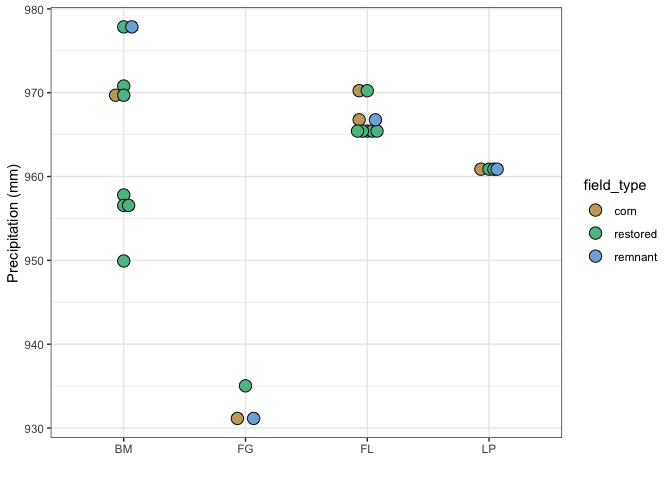

Site locations, metadata, and climate
================
Beau Larkin

Last updated: 02 February, 2023

- <a href="#description" id="toc-description">Description</a>
- <a href="#package-and-library-installation"
  id="toc-package-and-library-installation">Package and library
  installation</a>
- <a href="#data-etl" id="toc-data-etl">Data, ETL</a>
  - <a href="#sites" id="toc-sites">Sites</a>
  - <a href="#climate-data" id="toc-climate-data">Climate data</a>
    - <a href="#normals" id="toc-normals">Normals</a>
    - <a href="#monthly-climate-data" id="toc-monthly-climate-data">Monthly
      climate data</a>
- <a href="#results" id="toc-results">Results</a>
  - <a href="#site-types" id="toc-site-types">Site types</a>
  - <a href="#site-map" id="toc-site-map">Site map</a>
  - <a href="#precipitation-normals"
    id="toc-precipitation-normals">Precipitation normals</a>

# Description

Site locations, maps, and metadata are produced here. Other raster data,
like climate data, are also be processed here. Precipitation data was
downloaded from [PRISM](https://prism.oregonstate.edu/) on 2022-01-06
following this [tutorial](https://rpubs.com/collnell/get_prism). - Raw
(downloaded) data is stored locally; site level data was processed into
.csv files and included in this repository. - 30-year normal from
1991-2020 was attempted. - Also monthly data from 2007-2016 were
downloaded and converted into BIOCLIM variables.

Note that in this script, messages and verbose outputs are often
suppressed for brevity.

# Package and library installation

``` r
packages_needed = c(
    "tidyverse",
    "colorspace",
    "ggmap",
    "lubridate",
    "devtools",
    "raster",
    "sp",
    "prism",
    "conflicted",
    "ggbeeswarm",
    "knitr",
    "dismo",
    "vegan"
)
```

``` r
packages_installed = packages_needed %in% rownames(installed.packages())
```

``` r
if (any(! packages_installed))
    install.packages(packages_needed[! packages_installed])
for (i in 1:length(packages_needed)) {
    library(packages_needed[i], character.only = T)
} 
```

``` r
{
conflict_prefer("filter", "dplyr")
conflict_prefer("select", "dplyr")
conflict_prefer("extract", "raster")
}
# Cleanplot PCA (Borcard et al.)
source("/Users/blarkin/Library/CloudStorage/Egnyte-mpgcloud/Private/blarkin/ΩMiscellaneous/R_global/Cleanplot_pca.txt")
```

# Data, ETL

## Sites

Field type “oldfield” is not considered because they were only available
in one region.

``` r
sites <- read_csv(paste0(getwd(), "/clean_data/site.csv"), show_col_types = FALSE) %>% 
    filter(site_type != "oldfield") %>% 
    glimpse()
```

    ## Rows: 25
    ## Columns: 9
    ## $ site_key   <dbl> 1, 2, 3, 4, 5, 6, 7, 8, 9, 10, 11, 12, 13, 14, 15, 16, 17, …
    ## $ site_name  <chr> "BBRP1", "ERRP1", "FGC1", "FGREM1", "FGRP1", "FLC1", "FLC2"…
    ## $ region     <chr> "BM", "BM", "FG", "FG", "FG", "FL", "FL", "FL", "FL", "FL",…
    ## $ lat        <dbl> 43.09989, 43.06588, 43.16087, 43.16172, 43.14381, 41.85941,…
    ## $ long       <dbl> -89.72517, -89.80358, -88.89045, -88.88973, -88.88175, -88.…
    ## $ site_type  <chr> "restored", "restored", "corn", "remnant", "restored", "cor…
    ## $ yr_restore <dbl> 2000, 2013, NA, NA, 2001, NA, NA, NA, 1976, 1980, 1981, 200…
    ## $ yr_since   <dbl> 16, 3, 0, NA, 15, 0, 0, NA, 40, 36, 35, 10, 10, 10, 28, 0, …
    ## $ yr_rank    <dbl> 9, 3, 1, 16, 8, 1, 1, 16, 14, 13, 12, 6, 6, 6, 11, 1, 16, 4…

## Climate data

Climate data was accessed and downloaded on 2022-01-06. The following
script does not need to be run again and is commented out. Raw
downloaded data are stored locally, summary files are written to the
working directory and included in this repository.

### Normals

``` r
# prism_set_dl_dir(paste0(getwd(), "/prism_rasters/normals/ppt"))
# get_prism_normals(type = 'ppt', resolution = '4km', annual = TRUE, keepZip = FALSE)
# prism_archive_ls()
# RS <- pd_stack(prism_archive_ls())
# proj4string(RS) <- CRS("+proj=longlat +ellps=WGS84 +no_defs")
# sites_spdf <-
#     SpatialPointsDataFrame(
#         coords = sites[, c("long", "lat")],
#         data = sites,
#         proj4string = CRS("+proj=longlat +ellps=WGS84 +no_defs")
#     )
# sites_ppt <- raster::extract(RS, sites_spdf, fun = mean, na.rm = TRUE, sp = TRUE)@data %>% 
#     rename(ppt_mm = PRISM_ppt_30yr_normal_4kmM3_annual_bil)
# write_csv(sites_ppt %>% select(site_key, ppt_mm), paste0(getwd(), "/clean_data/site_precip_normal.csv"))
```

### Monthly climate data

The following script was run once each for ppt, tmin, and tmax

``` r
# prism_set_dl_dir(paste0(getwd(), "/prism_rasters/monthly/tmax"))
# get_prism_monthlys(type = "tmax", years = 2007:2016, mon = 1:12, keepZip = FALSE)
# prism_archive_ls()
# RS <- pd_stack(prism_archive_ls())
# proj4string(RS) <- CRS("+proj=longlat +ellps=WGS84 +no_defs")
# sites_spdf <-
#     SpatialPointsDataFrame(
#         coords = sites[, c("long", "lat")],
#         data = sites,
#         proj4string = CRS("+proj=longlat +ellps=WGS84 +no_defs")
#     )
# sites_tmax_month <- raster::extract(RS, sites_spdf, fun = mean, na.rm = TRUE, sp = TRUE)@data
# sites_ppt_month[, c(2,10,11)]
# sites_tmin_month[, c(2,10,11)]
# sites_tmax_month[, c(2,10,11)]
```

Transform extracted data to facilitate later analysis

``` r
# wrangle_clim <- function(data, value) {
#     data %>% 
#         select(site_name, starts_with("PRISM")) %>% 
#         pivot_longer(starts_with("PRISM"), names_to = "var", values_to = value) %>% 
#         separate(var, c(NA, NA, NA, NA, "date_str", NA), sep = "_")
# }
# ppt_month <- wrangle_clim(sites_ppt_month, "ppt_mm")
# tmin_month <- wrangle_clim(sites_tmin_month, "tmin_C")
# tmax_month <- wrangle_clim(sites_tmax_month, "tmax_C")
# tgr_clim <- 
#     ppt_month %>% 
#     left_join(tmin_month) %>% 
#     left_join(tmax_month) %>% 
#     mutate(date = ym(date_str), year = year(date), month = month(date)) %>% 
#     select(site_name, year, month, ppt_mm, tmin_C, tmax_C) %>% 
#     glimpse()
# write_csv(tgr_clim, paste0(getwd(), "/clean_data/clim.csv"))
# yrs <- unique(tgr_clim$year)
# sites <- unique(tgr_clim$site_name)
# tgr_bioclim <- vector("list", length(yrs))
# names(tgr_bioclim) <- yrs
# for(i in 1:length(yrs)) {
#     data <- 
#         tgr_clim %>% 
#         filter(year == yrs[i])
#     site_list <- split(data, data$site_name)
#     tgr_bioclim[[i]] <- 
#         bind_rows(lapply(site_list, function(x){data.frame(biovars(x$ppt_mm, x$tmin_C, x$tmax_C))}), .id = "site")
# }
# bind_rows(tgr_bioclim, .id = "year") %>% 
#     pivot_longer(starts_with("bio"), names_to = "biovar", values_to = "value") %>% 
#     group_by(site, biovar) %>% 
#     summarize(mean = mean(value)) %>% 
#     pivot_wider(names_from = "biovar", values_from = mean) %>% 
#     write_csv(paste0(getwd(), "/clean_data/bioclim.csv"))
```

# Results

## Site types

How many sites are in each field type?

``` r
kable(table(sites$region, sites$site_type), format = "pandoc", caption = "Field types by region:\nBM = Blue Mounds, FG = Faville Grove,\nFL = Fermilab, LP = Lake Petite")
```

|     | corn | remnant | restored |
|-----|-----:|--------:|---------:|
| BM  |    1 |       1 |        7 |
| FG  |    1 |       1 |        1 |
| FL  |    2 |       1 |        6 |
| LP  |    1 |       1 |        2 |

Field types by region: BM = Blue Mounds, FG = Faville Grove, FL =
Fermilab, LP = Lake Petite

## Site map

``` r
map <- ggmap(
    get_stamenmap(
        bbox = c(
            left = -90.3,
            bottom = 41.5,
            right = -87.4,
            top = 43.4
        ),
        zoom = 9,
        maptype = c("toner-lite"),
        color = c("color")
    )
)
```

``` r
map +
    geom_polygon(
        data = sites %>% group_by(region) %>% slice(chull(long, lat)),
        aes(x = long, y = lat, group = region),
        fill = "red", alpha = 0.5, color = "red"
    ) +
    geom_label(
        data = sites %>% group_by(region) %>% summarize(long_cen = mean(long), lat_cen = mean(lat), .groups = "drop"),
        aes(x = long_cen, y = lat_cen, label = region),
        color = "red", size = 6
    ) +
    theme_void()
```

<!-- -->

## Precipitation normals

``` r
sites_ppt <- read_csv(paste0(getwd(), "/clean_data/site_precip_normal.csv"), show_col_types = FALSE) %>% 
    left_join(sites, by = "site_key")
```

``` r
ggplot(sites_ppt, aes(x = region, y = ppt_mm)) +
    geom_beeswarm(aes(fill = factor(site_type, ordered = TRUE, levels = c("corn", "restored", "remnant"))), dodge.width = 0.2, shape = 21, size = 4) +
    labs(x = "", y = "Precipitation (mm)") +
    scale_fill_discrete_qualitative(name = "site_type", palette = "Harmonic") +
    theme_bw()
```

<!-- -->

Bioclim variables from 2007-2016

``` r
bioclim <- read_csv(paste0(getwd(), "/clean_data/bioclim.csv"), show_col_types = FALSE)
bioclim_pca <- rda(data.frame(bioclim, row.names = 1), scale = TRUE)
summary(bioclim_pca, display = NULL)
```

    ## 
    ## Call:
    ## rda(X = data.frame(bioclim, row.names = 1), scale = TRUE) 
    ## 
    ## Partitioning of correlations:
    ##               Inertia Proportion
    ## Total              19          1
    ## Unconstrained      19          1
    ## 
    ## Eigenvalues, and their contribution to the correlations 
    ## 
    ## Importance of components:
    ##                           PC1    PC2    PC3     PC4     PC5      PC6      PC7
    ## Eigenvalue            12.9933 2.9965 1.9505 0.58975 0.27690 0.132481 0.042217
    ## Proportion Explained   0.6839 0.1577 0.1027 0.03104 0.01457 0.006973 0.002222
    ## Cumulative Proportion  0.6839 0.8416 0.9442 0.97526 0.98984 0.996810 0.999032
    ##                             PC8       PC9     PC10      PC11
    ## Eigenvalue            0.0111418 0.0030573 0.002756 1.445e-03
    ## Proportion Explained  0.0005864 0.0001609 0.000145 7.607e-05
    ## Cumulative Proportion 0.9996180 0.9997789 0.999924 1.000e+00
    ## 
    ## Scaling 2 for species and site scores
    ## * Species are scaled proportional to eigenvalues
    ## * Sites are unscaled: weighted dispersion equal on all dimensions
    ## * General scaling constant of scores:

``` r
screeplot(bioclim_pca, bstick = TRUE)
```

<!-- -->

``` r
cleanplot.pca(bioclim_pca)
```

<!-- --><!-- -->

Component loadings (correlations)

``` r
data.frame(scores(bioclim_pca, choices = c(1,2), display = "species", scaling = 0)) %>% arrange(PC1)
```

<div data-pagedtable="false">

<script data-pagedtable-source type="application/json">
{"columns":[{"label":[""],"name":["_rn_"],"type":[""],"align":["left"]},{"label":["PC1"],"name":[1],"type":["dbl"],"align":["right"]},{"label":["PC2"],"name":[2],"type":["dbl"],"align":["right"]}],"data":[{"1":"-0.26562346","2":"-0.1013160420","_rn_":"bio7"},{"1":"-0.26379542","2":"0.0580266988","_rn_":"bio18"},{"1":"-0.26341484","2":"-0.1658799965","_rn_":"bio4"},{"1":"-0.25671686","2":"-0.1419915642","_rn_":"bio15"},{"1":"-0.23350119","2":"-0.2413178456","_rn_":"bio16"},{"1":"-0.22837779","2":"-0.2964973437","_rn_":"bio13"},{"1":"-0.22382980","2":"0.0976833556","_rn_":"bio2"},{"1":"0.03746544","2":"-0.1585918043","_rn_":"bio12"},{"1":"0.05041531","2":"0.3771502070","_rn_":"bio3"},{"1":"0.09391185","2":"-0.5261000580","_rn_":"bio5"},{"1":"0.16977801","2":"-0.4522331074","_rn_":"bio10"},{"1":"0.22609470","2":"0.0004933565","_rn_":"bio8"},{"1":"0.23850420","2":"0.1485166059","_rn_":"bio9"},{"1":"0.24688020","2":"-0.2556461759","_rn_":"bio1"},{"1":"0.25893106","2":"0.1022694249","_rn_":"bio17"},{"1":"0.26773973","2":"-0.1408736404","_rn_":"bio11"},{"1":"0.26865641","2":"-0.0449247909","_rn_":"bio14"},{"1":"0.26878017","2":"-0.1204142534","_rn_":"bio6"},{"1":"0.27220405","2":"0.0088789375","_rn_":"bio19"}],"options":{"columns":{"min":{},"max":[10]},"rows":{"min":[10],"max":[10]},"pages":{}}}
  </script>

</div>

Site scores

``` r
data.frame(scores(bioclim_pca, choices = c(1,2), display = "sites", scaling = 1)) %>% 
    rownames_to_column() %>% 
    rename(site_name = rowname) %>% 
    write_csv(paste0(getwd(), "/clean_data/clim_axes.csv"))
```
