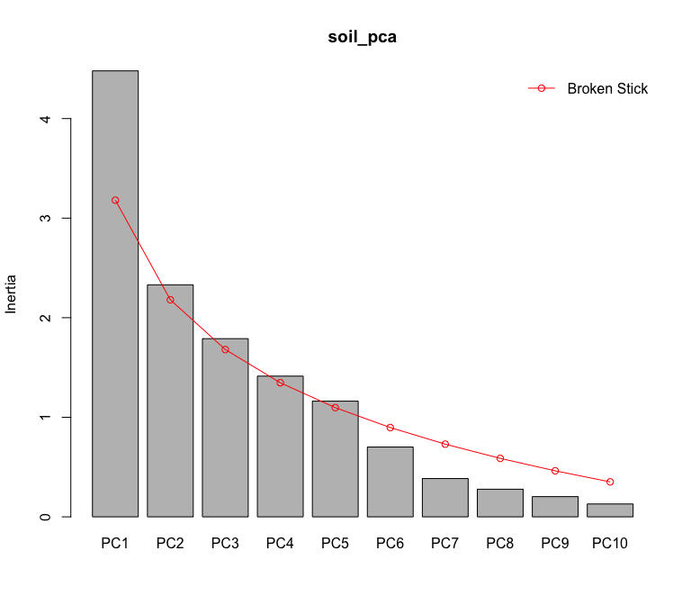
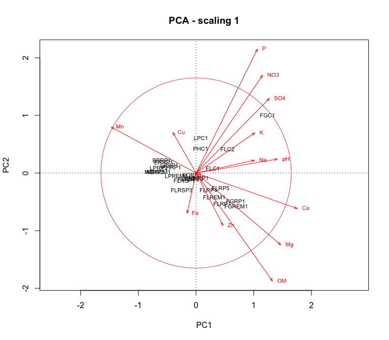
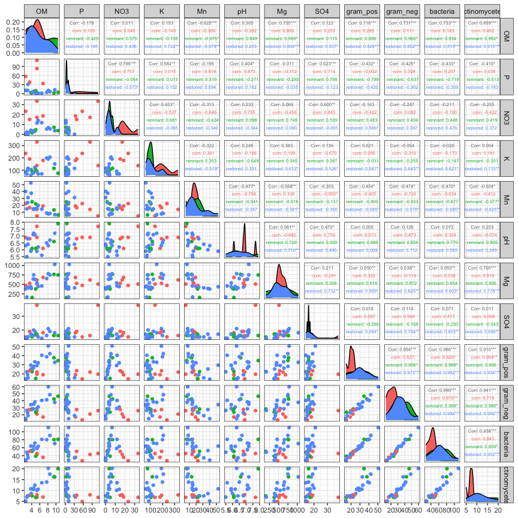
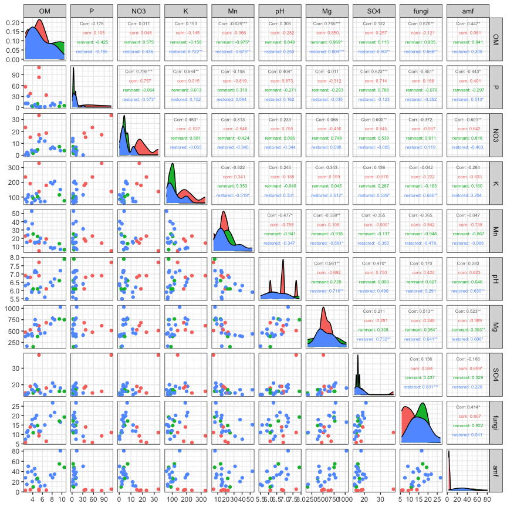

Soil abiotic properties
================
Beau Larkin

Last updated: 17 September, 2024

- [Description](#description)
- [Packages and libraries](#packages-and-libraries)
- [Functions](#functions)
- [Data](#data)
- [Results](#results)
  - [PCA ordination](#pca-ordination)
  - [Variance inflation and
    collinearity](#variance-inflation-and-collinearity)
  - [Compare nutrients and microbial
    biomass](#compare-nutrients-and-microbial-biomass)
    - [Bacterial biomass correlations](#bacterial-biomass-correlations)
    - [Fungal biomass correlations](#fungal-biomass-correlations)

# Description

Soil nutrients were analyzed by [Ward Laboratories,
Inc.](https://www.wardlab.com/services/soil-health-analysis/), analysis
methods available in local files or at the link included here. Soil
organic matter is in percent determined by the loss-on-ignition method.
Soil pH is in a log scale as is typical, and all the other minerals are
in parts per million. This may need to be converted to $mg*kg^{-1}$ or a
similar ratio.

This script provides a quick overview of the soil abiotic property data
and produces products (e.g., ordination axis values) for use in
downstream analysis.

# Packages and libraries

``` r
packages_needed = c("tidyverse", "vegan", "GGally")
packages_installed = packages_needed %in% rownames(installed.packages())
```

``` r
if (any(!packages_installed)) {
    install.packages(packages_needed[!packages_installed])
}
```

``` r
for (i in 1:length(packages_needed)) {
    library(packages_needed[i], character.only = T)
}
```

# Functions

Cleanplot PCA produces informative visualizations of PCA ordinations
[(Borcard et
al. 2018)](http://link.springer.com/10.1007/978-3-319-71404-2)

``` r
source(paste0(getwd(), "/supporting_files/cleanplot_pca.txt"))
```

# Data

``` r
sites <-
    read_csv(paste0(getwd(), "/clean_data/sites.csv"), show_col_types = FALSE) %>%
    mutate(
        field_type = factor(
            field_type,
            ordered = TRUE,
            levels = c("corn", "restored", "remnant")),
        yr_since = replace(yr_since, which(field_type == "remnant"), "+"),
        yr_since = replace(yr_since, which(field_type == "corn"), "-")) %>%
    select(-lat, -long, -yr_restore, -yr_rank) %>% 
    arrange(field_key)
# Remove soil data from sites in old fields (rows 26, 27)
soil <- read_csv(paste0(getwd(), "/clean_data/soil.csv"), show_col_types = FALSE)[-c(26:27), ]
```

Fatty acid data is used here to show constrasts with soil properties.

``` r
fa <- read_csv(paste0(getwd(), "/clean_data/plfa.csv"), show_col_types = FALSE)
```

# Results

## PCA ordination

``` r
soil_z <- decostand(data.frame(soil[, -1], row.names = 1), "standardize")
soil_pca <- rda(soil_z)
soil_pca$CA$u %>% 
    as.data.frame() %>% 
    rownames_to_column(var = "field_name") %>% 
    write_csv(., "soil_properties_files/soil_pca.csv")
soil_pca %>% summary(., display = NULL)
```

    ## 
    ## Call:
    ## rda(X = soil_z) 
    ## 
    ## Partitioning of variance:
    ##               Inertia Proportion
    ## Total              13          1
    ## Unconstrained      13          1
    ## 
    ## Eigenvalues, and their contribution to the variance 
    ## 
    ## Importance of components:
    ##                          PC1    PC2    PC3    PC4     PC5     PC6     PC7
    ## Eigenvalue            4.4790 2.3301 1.7896 1.4132 1.16188 0.70120 0.38467
    ## Proportion Explained  0.3445 0.1792 0.1377 0.1087 0.08938 0.05394 0.02959
    ## Cumulative Proportion 0.3445 0.5238 0.6614 0.7701 0.85952 0.91346 0.94305
    ##                           PC8     PC9     PC10     PC11    PC12     PC13
    ## Eigenvalue            0.27747 0.20308 0.129286 0.069183 0.04186 0.019432
    ## Proportion Explained  0.02134 0.01562 0.009945 0.005322 0.00322 0.001495
    ## Cumulative Proportion 0.96440 0.98002 0.989963 0.995285 0.99851 1.000000

Axes 1 and 2 explain 52% of the variation in sites. Not bad. Axes 1
through 5 account for 86%.

``` r
screeplot(soil_pca, bstick = TRUE)
```



Eigenvalues from the first five axes exceed the broken stick model.

``` r
cleanplot.pca(soil_pca)
```



Abiotic properties that exceed the unit circle (Scaling 1 plot) exert
more influence on the ordination of sites. These are
$P,~NO_3,~SO_4,~Ca,~Mg,$ and $OM$. $Mn$ and $pH$ are close enough to
warrant further investigation.

Sites sort in somewhat predictable ways (Scaling 2 plot). Cornfields are
associated with phosphorus, nitrate, and sulfate. Many, but not all,
remnants are associates with soil organic matter. Blue Mounds fields are
associated with manganese, but since manganese isn’t a very strong
element in this ordination, these fields may also be very low in soild
organic matter, magnesium, or calcium.

## Variance inflation and collinearity

Using these abiotic properties in models or forward selection procedures
later will require that we know about their collinearity. Let’s test
that here.

``` r
sort(diag(solve(cor(data.frame(soil[, -1], row.names = 1)))), decreasing = TRUE)
```

    ##        OM         P        Ca       NO3         K        Mn        pH        Na 
    ## 26.691234 16.835301 16.660895  8.406986  7.189305  6.200678  6.144903  5.470299 
    ##        Mg        Fe       SO4        Cu        Zn 
    ##  5.445119  5.252802  4.574149  2.006058  1.993519

Variance inflation factors greater than 10 are evidence of collinearity
[(Borcard et
al. 20180)](http://link.springer.com/10.1007/978-3-319-71404-2). Soil
organic matter, phosphorus, and calcium show VIF greater than 10. Later,
when constrained ordinations are done, forward selection will likely
prevent the inclusion of collinear variables. But which ones to choose?
Soil organic matter is important to this story, but other soil
properties may be less so. Removing calcium drops the VIF for all
properties to near or below 10. Removing calcium may be warranted.

``` r
sort(diag(solve(cor(data.frame(soil[, -1], row.names = 1) %>% select(-Ca)))), decreasing = TRUE)
```

    ##         P        OM       NO3        Mn         K        pH        Mg        Na 
    ## 11.511246  9.800941  8.355535  5.965700  5.801322  5.571081  5.368703  5.226920 
    ##        Fe       SO4        Cu        Zn 
    ##  5.130920  4.574088  1.968208  1.918143

## Compare nutrients and microbial biomass

Pairs panels help to quickly identify strong pairwise correlations. The
first figure shows bacterial groups, the second shows fungal groups.
Based on the identification of VIF above, we’ll remove Ca for now to
simplify the pairs panels a little. We will also only include variables
that exceed or were close to the unit circle in `cleanplot.pca()` above.

### Bacterial biomass correlations

Bacteria aren’t a focus of this work, but let’s have a look at these
data anyway.

``` r
soil %>% 
    left_join(fa %>% select(field_key, gram_pos, gram_neg, bacteria, actinomycetes), by = "field_key") %>% 
    left_join(sites %>% select(field_key, field_type), by = "field_key") %>% 
    select(starts_with("field"), OM, P, NO3, K, Mn, pH, Mg, SO4, gram_pos, gram_neg, bacteria, actinomycetes) %>% 
    ggpairs(columns = 4:ncol(.), 
            aes(color = as.character(field_type)), 
            upper = list(continuous = wrap("cor", size = 2))) +
    theme_bw()
```



- Soil organic matter strongly correlates with bacterial biomass in
  restored fields. With corn and remnant fields, the correlation likely
  is based more on regional differences in SOM.
- Bacterial biomass increase as potassium increases with a moderate
  correlation in restored fields.
- Bacterial biomass decreases with increasing manganese, moderate
  correlation but messier.
- Bacterial biomass increases with magnesium, moderate to strong
  correlations.
- Bacterial biomass increases with sulfate, moderate correlations.

It remains to be seen how these data may be interpreted. It’s possible
that these correlations will highlight particular groups and add some
material for the discussion.

### Fungal biomass correlations

The following panels examine correlations between soil abiotic
properties, fungal, and amf biomass.

``` r
soil %>% 
    left_join(fa %>% select(field_key, fungi, amf), by = "field_key") %>% 
    left_join(sites %>% select(field_key, field_type), by = "field_key") %>% 
    select(starts_with("field"), OM, P, NO3, K, Mn, pH, Mg, SO4, fungi, amf) %>% 
    ggpairs(columns = 4:ncol(.), 
            aes(color = as.character(field_type)), 
            upper = list(continuous = wrap("cor", size = 2))) +
    theme_bw()
```



- AMF biomass isn’t particularly responsive to soil abiotic properties.
  There’s one big field with high AMF biomass.
- Fungal biomass increases with SOM in restored and remnant fields. It
  should. SOM appears higher in a couple of cornfields than I thought it
  would.
- Fungal biomass increases with potassium, magnesium, and sulfate in
  restored fields.

Fungal biomass increases with SOM and some nutrients. Do these nutrients
vary over time or with regions? The correlations look continuous, with
no apparent regional breaks, but it can’t be known from these pairs
plots.
