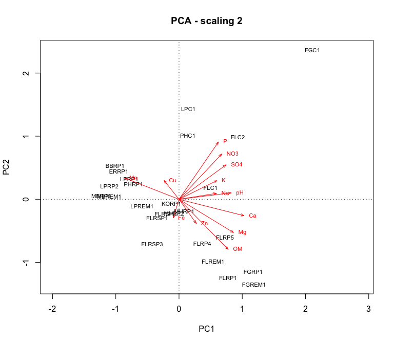

Soil Abiotic Properties
================
Beau Larkin

Last updated: 19 October, 2023

- [Description](#description)
- [Packages and libraries](#packages-and-libraries)
- [Functions](#functions)
- [Data](#data)
- [Results](#results)
  - [PCA ordination](#pca-ordination)

# Description

Soil nutrients were analyzed by [Ward Laboratories,
Inc.](https://www.wardlab.com/services/soil-health-analysis/), analysis
methods available in local files or at the link included here. Soil
organic matter is in percent determined by the loss-on-ignition method.
Soil pH is in a log scale as is typical, and all the other minerals are
in parts per million. This may need to be converted to $mg*kg^{-1}$ or a
similar ratio.

This script provides a quick overview of the soil abiotic property data
and produces products (e.g., ordination axis values) for use in
downstream analysis.

# Packages and libraries

``` r
packages_needed = c("tidyverse", "vegan", "GGally")
packages_installed = packages_needed %in% rownames(installed.packages())
```

``` r
if (any(!packages_installed)) {
    install.packages(packages_needed[!packages_installed])
}
```

``` r
for (i in 1:length(packages_needed)) {
    library(packages_needed[i], character.only = T)
}
```

# Functions

Cleanplot PCA produces informative visualizations of PCA ordinations
[(Borcard et
al. 2018)](http://link.springer.com/10.1007/978-3-319-71404-2)

``` r
source(paste0(getwd(), "/supporting_files/cleanplot_pca.txt"))
```

# Data

``` r
sites <-
    read_csv(paste0(getwd(), "/clean_data/sites.csv"), show_col_types = FALSE) %>%
    mutate(
        field_type = factor(
            field_type,
            ordered = TRUE,
            levels = c("corn", "restored", "remnant")),
        yr_since = replace(yr_since, which(field_type == "remnant"), "+"),
        yr_since = replace(yr_since, which(field_type == "corn"), "-")) %>%
    select(-lat, -long, -yr_restore, -yr_rank) %>% 
    arrange(field_key)
# Remove soil data from sites in old fields (rows 26, 27)
soil <- read_csv(paste0(getwd(), "/clean_data/soil.csv"), show_col_types = FALSE)[-c(26:27), ]
```

# Results

## PCA ordination

``` r
soil_z <- decostand(data.frame(soil[, -1], row.names = 1), "standardize")
soil_pca <- rda(soil_z)
soil_pca %>% summary(., display = NULL)
```

    ## 
    ## Call:
    ## rda(X = soil_z) 
    ## 
    ## Partitioning of variance:
    ##               Inertia Proportion
    ## Total              13          1
    ## Unconstrained      13          1
    ## 
    ## Eigenvalues, and their contribution to the variance 
    ## 
    ## Importance of components:
    ##                          PC1    PC2    PC3    PC4     PC5     PC6     PC7
    ## Eigenvalue            4.4790 2.3301 1.7896 1.4132 1.16188 0.70120 0.38467
    ## Proportion Explained  0.3445 0.1792 0.1377 0.1087 0.08938 0.05394 0.02959
    ## Cumulative Proportion 0.3445 0.5238 0.6614 0.7701 0.85952 0.91346 0.94305
    ##                           PC8     PC9     PC10     PC11    PC12     PC13
    ## Eigenvalue            0.27747 0.20308 0.129286 0.069183 0.04186 0.019432
    ## Proportion Explained  0.02134 0.01562 0.009945 0.005322 0.00322 0.001495
    ## Cumulative Proportion 0.96440 0.98002 0.989963 0.995285 0.99851 1.000000
    ## 
    ## Scaling 2 for species and site scores
    ## * Species are scaled proportional to eigenvalues
    ## * Sites are unscaled: weighted dispersion equal on all dimensions
    ## * General scaling constant of scores:

``` r
screeplot(soil_pca, bstick = TRUE)
```


Eigenvalues from the first five axes exceed the broken stick model.

``` r
cleanplot.pca(soil_pca)
```



Abiotic properties that exceed the unit circle (Scaling 1 plot) exert
more influence on the ordination of sites. These are
$P,~NO_3,~SO_4,~Ca,~Mg,$ and $OM$. $Mn$ and $pH$ are close enough to
warrant further investigation.

Sites sort in somewhat predictable ways (Scaling 2 plot). Cornfields are
associated with phosphorus, nitrate, and sulfate. Many, but not all,
remnants are associates with soil organic matter. Blue Mounds fields are
associated with manganese, but since manganese isn’t a very strong
element in this ordination, these fields may also be very low in soild
organic matter, magnesium, or calcium.
