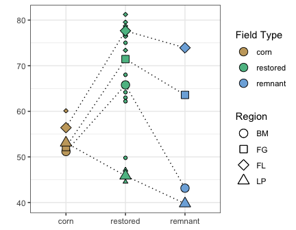

Soil: water stable aggregates
================
Beau Larkin

Last updated: 19 October, 2023

- [Description](#description)
- [Packages and libraries](#packages-and-libraries)
- [Data](#data)
- [Results](#results)

# Description

Water stable aggregates were determined. WSA is a functional attribute
of soil created by fungi. WSA could be added to the soil chemical
analysis data table. WSA isn’t precisely a soil chemical feature (these
are based more on parent material and weathering, while WSA are based on
fungal activity), but they are related. Whether to join them or not
probably depends on the test desired. The first thing to do there is
just see if WSAs vary in any meaningful way that could help other
analyses.

I don’t know who obtained these data or how it was done. Need to follow
up.

# Packages and libraries

``` r
packages_needed = c("GGally", "rsq", "lme4", "multcomp", "tidyverse", "ggbeeswarm", "knitr", "conflicted", "colorspace")
packages_installed = packages_needed %in% rownames(installed.packages())
```

``` r
if (any(!packages_installed)) {
    install.packages(packages_needed[!packages_installed])
}
```

``` r
for (i in 1:length(packages_needed)) {
    library(packages_needed[i], character.only = T)
}
conflicts_prefer(dplyr::select)
```

# Data

``` r
sites <-
    read_csv(paste0(getwd(), "/clean_data/sites.csv"), show_col_types = FALSE) %>%
    mutate(
        field_type = factor(
            field_type,
            ordered = TRUE,
            levels = c("corn", "restored", "remnant")),
        yr_since = replace(yr_since, which(field_type == "remnant"), "+"),
        yr_since = replace(yr_since, which(field_type == "corn"), "-")) %>%
    select(-lat, -long, -yr_restore, -yr_rank) %>% 
    arrange(field_key)
```

``` r
# Remove rows from old field sites (26 and 27)
wsa <- read_csv(paste0(getwd(), "/clean_data/wsa.csv"), show_col_types = FALSE)[-c(26:27), ] %>% 
    left_join(sites, by = "field_key")
```

# Results

Let’s first visualize the data across regions and field types

``` r
ggplot(wsa %>% group_by(field_type, region) %>% summarize(wsa_avg = mean(wsa), .groups = "drop"),
       aes(x = field_type, y = wsa_avg, group = region)) +
    geom_point(data = wsa, aes(x = field_type, y = wsa, fill = region), shape = 21) +
    geom_line(linetype = "dotted") +
    geom_point(aes(fill = region), shape = 21, size = 5) +
    scale_fill_discrete_qualitative(name = "Region", palette = "Dark2") +
    labs(x = "", y = "Water stable aggregates (%)", 
         caption = "Large points show regional means. Small points show values from individual fields.") +
    theme_bw()
```



A minor interaction appears, with WSA in restored fields being higher in
all regions except Lake Petite. Let’s try a mixed model with region as a
random effect and test the difference in WSAs across field types.

``` r
wsa_mod <- lmer(wsa ~ field_type + (1 | region), data = wsa)
wsa_mod_null <- lmer(wsa ~ 1 + (1 | region), data = wsa)
wsa_mod_tuk <- glht(wsa_mod, linfct = mcp(field_type = "Tukey"), test = adjusted("holm"))
```

Model summaries: display results of fitted model, null model, and the
maximum likelihood ratio test of the null vs. tested model to assess
significance of field type.

``` r
summary(wsa_mod)
```

    ## Linear mixed model fit by REML ['lmerMod']
    ## Formula: wsa ~ field_type + (1 | region)
    ##    Data: wsa
    ## 
    ## REML criterion at convergence: 167.2
    ## 
    ## Scaled residuals: 
    ##      Min       1Q   Median       3Q      Max 
    ## -1.86513 -0.43684  0.01758  0.42210  1.71191 
    ## 
    ## Random effects:
    ##  Groups   Name        Variance Std.Dev.
    ##  region   (Intercept) 96.69    9.833   
    ##  Residual             63.40    7.963   
    ## Number of obs: 25, groups:  region, 4
    ## 
    ## Fixed effects:
    ##              Estimate Std. Error t value
    ## (Intercept)    57.800      5.294  10.918
    ## field_type.L    2.282      3.793   0.602
    ## field_type.Q  -10.553      2.841  -3.715
    ## 
    ## Correlation of Fixed Effects:
    ##             (Intr) fld_.L
    ## field_typ.L 0.030        
    ## field_typ.Q 0.162  0.096

``` r
wsa_nht <- anova(wsa_mod, wsa_mod_null)
```

    ## refitting model(s) with ML (instead of REML)

``` r
wsa_nht
```

<div data-pagedtable="false">

<script data-pagedtable-source type="application/json">
{"columns":[{"label":[""],"name":["_rn_"],"type":[""],"align":["left"]},{"label":["npar"],"name":[1],"type":["dbl"],"align":["right"]},{"label":["AIC"],"name":[2],"type":["dbl"],"align":["right"]},{"label":["BIC"],"name":[3],"type":["dbl"],"align":["right"]},{"label":["logLik"],"name":[4],"type":["dbl"],"align":["right"]},{"label":["deviance"],"name":[5],"type":["dbl"],"align":["right"]},{"label":["Chisq"],"name":[6],"type":["dbl"],"align":["right"]},{"label":["Df"],"name":[7],"type":["dbl"],"align":["right"]},{"label":["Pr(>Chisq)"],"name":[8],"type":["dbl"],"align":["right"]}],"data":[{"1":"3","2":"198.7187","3":"202.3753","4":"-96.35935","5":"192.7187","6":"NA","7":"NA","8":"NA","_rn_":"wsa_mod_null"},{"1":"5","2":"190.4850","3":"196.5794","4":"-90.24252","5":"180.4850","6":"12.23367","7":"2","8":"0.002205427","_rn_":"wsa_mod"}],"options":{"columns":{"min":{},"max":[10]},"rows":{"min":[10],"max":[10]},"pages":{}}}
  </script>

</div>

``` r
summary(wsa_mod_tuk)
```

    ## 
    ##   Simultaneous Tests for General Linear Hypotheses
    ## 
    ## Multiple Comparisons of Means: Tukey Contrasts
    ## 
    ## 
    ## Fit: lmer(formula = wsa ~ field_type + (1 | region), data = wsa)
    ## 
    ## Linear Hypotheses:
    ##                         Estimate Std. Error z value Pr(>|z|)   
    ## restored - corn == 0      14.538      4.183   3.475   0.0014 **
    ## remnant - corn == 0        3.227      5.365   0.602   0.8172   
    ## remnant - restored == 0  -11.311      4.593  -2.462   0.0360 * 
    ## ---
    ## Signif. codes:  0 '***' 0.001 '**' 0.01 '*' 0.05 '.' 0.1 ' ' 1
    ## (Adjusted p values reported -- single-step method)

``` r
cld(wsa_mod_tuk)
```

    ##     corn restored  remnant 
    ##      "a"      "b"      "a"

``` r
wsa %>% 
    group_by(field_type) %>% 
    summarize(wsa_avg = round(mean(wsa), 1), .groups = "drop") %>% 
    mutate(sig = c("a", "b", "a")) %>% 
    kable(format = "pandoc")
```

| field_type | wsa_avg | sig |
|:-----------|--------:|:----|
| corn       |    53.9 | a   |
| restored   |    68.1 | b   |
| remnant    |    55.1 | a   |

Percent water stable aggregates in restored fields was 14.2% higher than
in corn fields and 13% higher than in remnant fields based on a maximum
likelihood ratio test ($\chi^2(2)=12.23,~p<0.05$) Plot the result

``` r
sig_letters <- data.frame(
    lab = c("a", "b", "a"),
    xpos = c(1,2,3),
    ypos = rep(85,3)
)
```

``` r
ggplot(wsa, 
       aes(x = field_type, y = wsa)) +
    geom_boxplot(fill = "gray90", varwidth = FALSE, outlier.shape = NA) +
    geom_beeswarm(aes(fill = region), shape = 21, size = 2, dodge.width = 0.2) +
    geom_text(data = sig_letters, aes(x = xpos, y = ypos, label = lab)) +
    labs(x = "", y = "Water stable aggregates (%)",
         caption = "Linear mixed models with region as random effect.\nLetters show differences based on Tukey's post hoc with Holm correction at p<0.05") +
    scale_fill_discrete_qualitative(name = "Region", palette = "Dark2") +
    theme_bw()
```


``` r
# Within restored, look for signal with years since
```
