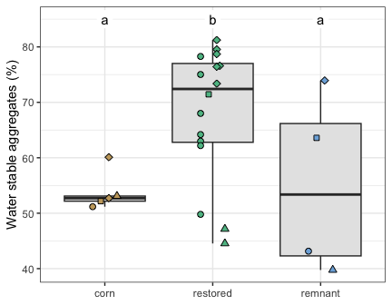

Soil: water stable aggregates
================
Beau Larkin

Last updated: 12 December, 2023

- [Description](#description)
- [Packages and libraries](#packages-and-libraries)
- [Data](#data)
- [Results](#results)
  - [WSA in field types and regions](#wsa-in-field-types-and-regions)
  - [WSA over time in restored
    fields](#wsa-over-time-in-restored-fields)

# Description

Water stable aggregates were determined. WSA is a functional attribute
of soil created by fungi. WSA could be added to the soil chemical
analysis data table. WSA isn’t precisely a soil chemical feature (these
are based more on parent material and weathering, while WSA are based on
fungal activity), but they are related. Whether to join them or not
probably depends on the test desired. The first thing to do there is
just see if WSAs vary in any meaningful way that could help other
analyses.

I don’t know who obtained these data or how it was done. Need to follow
up.

# Packages and libraries

``` r
packages_needed = c("GGally", "rsq", "lme4", "multcomp", "tidyverse", "ggbeeswarm", "knitr", "conflicted", "colorspace")
packages_installed = packages_needed %in% rownames(installed.packages())
```

``` r
if (any(!packages_installed)) {
    install.packages(packages_needed[!packages_installed])
}
```

``` r
for (i in 1:length(packages_needed)) {
    library(packages_needed[i], character.only = T)
}
```

``` r
conflicts_prefer(dplyr::select)
```

    ## [conflicted] Will prefer dplyr::select over any other package.

``` r
conflicts_prefer(dplyr::filter)
```

    ## [conflicted] Will prefer dplyr::filter over any other package.

# Data

``` r
sites <-
    read_csv(paste0(getwd(), "/clean_data/sites.csv"), show_col_types = FALSE) %>%
    mutate(
        field_type = factor(
            field_type,
            ordered = TRUE,
            levels = c("corn", "restored", "remnant")),
        yr_since = replace(yr_since, which(field_type == "remnant"), "+"),
        yr_since = replace(yr_since, which(field_type == "corn"), "-")) %>%
    select(-lat, -long, -yr_restore, -yr_rank) %>% 
    arrange(field_key)
```

``` r
# Remove rows from old field sites (26 and 27)
wsa <- read_csv(paste0(getwd(), "/clean_data/wsa.csv"), show_col_types = FALSE)[-c(26:27), ] %>% 
    left_join(sites, by = "field_key")
```

# Results

## WSA in field types and regions

Let’s first visualize the data across regions and field types

``` r
ggplot(wsa %>% group_by(field_type, region) %>% summarize(wsa_avg = mean(wsa), .groups = "drop"),
       aes(x = field_type, y = wsa_avg, group = region)) +
    geom_point(data = wsa, aes(x = field_type, y = wsa, shape = region, fill = field_type)) +
    geom_line(linetype = "dotted") +
    geom_point(aes(shape = region, fill = field_type), size = 4) +
    scale_fill_discrete_qualitative(name = "Field Type", palette = "Harmonic") +
    scale_shape_manual(name = "Region", values = c(21, 22, 23, 24)) +
    labs(y = "") +
    theme_bw() +
    theme(axis.title.x = element_blank()) +
    guides(fill = guide_legend(override.aes = list(shape = 21)),
           shape = guide_legend(override.aes = list(size = 4)))
```


A minor interaction appears, with WSA in restored fields being higher in
all regions except Lake Petite. Let’s try a mixed model with region as a
random effect and test the difference in WSAs across field types.

``` r
wsa_mod <- lmer(wsa ~ field_type + (1 | region), data = wsa)
wsa_mod_null <- lmer(wsa ~ 1 + (1 | region), data = wsa)
wsa_mod_tuk <- glht(wsa_mod, linfct = mcp(field_type = "Tukey"), test = adjusted("holm"))
```

Model summaries: display results of fitted model, null model, and the
likelihood ratio test of the null vs. tested model to assess
significance of field type.

``` r
summary(wsa_mod)
```

    ## Linear mixed model fit by REML ['lmerMod']
    ## Formula: wsa ~ field_type + (1 | region)
    ##    Data: wsa
    ## 
    ## REML criterion at convergence: 167.2
    ## 
    ## Scaled residuals: 
    ##      Min       1Q   Median       3Q      Max 
    ## -1.86513 -0.43684  0.01758  0.42210  1.71191 
    ## 
    ## Random effects:
    ##  Groups   Name        Variance Std.Dev.
    ##  region   (Intercept) 96.69    9.833   
    ##  Residual             63.40    7.963   
    ## Number of obs: 25, groups:  region, 4
    ## 
    ## Fixed effects:
    ##              Estimate Std. Error t value
    ## (Intercept)    57.800      5.294  10.918
    ## field_type.L    2.282      3.793   0.602
    ## field_type.Q  -10.553      2.841  -3.715
    ## 
    ## Correlation of Fixed Effects:
    ##             (Intr) fld_.L
    ## field_typ.L 0.030        
    ## field_typ.Q 0.162  0.096

``` r
print(anova(wsa_mod, wsa_mod_null, REML = FALSE))
```

    ## Data: wsa
    ## Models:
    ## wsa_mod_null: wsa ~ 1 + (1 | region)
    ## wsa_mod: wsa ~ field_type + (1 | region)
    ##              npar    AIC    BIC  logLik deviance  Chisq Df Pr(>Chisq)   
    ## wsa_mod_null    3 198.72 202.38 -96.359   192.72                        
    ## wsa_mod         5 190.49 196.58 -90.243   180.49 12.234  2   0.002205 **
    ## ---
    ## Signif. codes:  0 '***' 0.001 '**' 0.01 '*' 0.05 '.' 0.1 ' ' 1

``` r
summary(wsa_mod_tuk)
```

    ## 
    ##   Simultaneous Tests for General Linear Hypotheses
    ## 
    ## Multiple Comparisons of Means: Tukey Contrasts
    ## 
    ## 
    ## Fit: lmer(formula = wsa ~ field_type + (1 | region), data = wsa)
    ## 
    ## Linear Hypotheses:
    ##                         Estimate Std. Error z value Pr(>|z|)   
    ## restored - corn == 0      14.538      4.183   3.475   0.0014 **
    ## remnant - corn == 0        3.227      5.365   0.602   0.8172   
    ## remnant - restored == 0  -11.311      4.593  -2.462   0.0361 * 
    ## ---
    ## Signif. codes:  0 '***' 0.001 '**' 0.01 '*' 0.05 '.' 0.1 ' ' 1
    ## (Adjusted p values reported -- single-step method)

``` r
cld(wsa_mod_tuk)
```

    ##     corn restored  remnant 
    ##      "a"      "b"      "a"

``` r
wsa %>% 
    group_by(field_type) %>% 
    summarize(wsa_avg = round(mean(wsa), 1), .groups = "drop") %>% 
    mutate(sig = c("a", "b", "a")) %>% 
    kable(format = "pandoc")
```

| field_type | wsa_avg | sig |
|:-----------|--------:|:----|
| corn       |    53.9 | a   |
| restored   |    68.1 | b   |
| remnant    |    55.1 | a   |

Percent water stable aggregates differed by field type based on a
likelihood ratio test ($\chi^2(2)=12.23,~p<0.05$). In restored fields,
water stable aggregates were 14.2% higher than in corn fields and 13%
higher than in remnant fields based on Tukey’s post hoc test ($p<0.05$).
Let’s view a boxplot of the result.

``` r
sig_letters <- data.frame(
    lab = c("a", "b", "a"),
    xpos = c(1,2,3),
    ypos = rep(85,3)
)
```

``` r
ggplot(wsa, 
       aes(x = field_type, y = wsa)) +
    geom_boxplot(fill = "gray90", varwidth = FALSE, outlier.shape = NA) +
    geom_beeswarm(aes(shape = region, fill = field_type), size = 2, dodge.width = 0.3) +
    geom_label(data = sig_letters, aes(x = xpos, y = ypos, label = lab), label.size = NA) +
    labs(y = "Water stable aggregates (%)") +
    scale_fill_discrete_qualitative(name = "Field Type", palette = "Harmonic") +
    scale_shape_manual(name = "Region", values = c(21, 22, 23, 24)) +
    theme_bw() +
    theme(axis.title.x = element_blank(), legend.position = "none") 
```



In the figure above, Linear mixed models with region as random effect.
Letters show differences based on Tukey’s post hoc with Holm correction
at p\<0.05

## WSA over time in restored fields

Percent WSA varies greatly across restored fields. Can some of this
variation be explained by how long it’s been since the field was
restored? This comparison can only be justified in the Blue Mounds area.

``` r
wsa_bm_resto <- 
    wsa %>% 
    filter(field_type == "restored", region == "BM") %>% 
    mutate(yr_since = as.numeric(yr_since))
wsa_bm_resto_lm <- 
    lm(wsa ~ yr_since, data = wsa_bm_resto)
summary(wsa_bm_resto_lm)
```

    ## 
    ## Call:
    ## lm(formula = wsa ~ yr_since, data = wsa_bm_resto)
    ## 
    ## Residuals:
    ##       1       2       3       4       5       6       7 
    ##  -3.079  -2.905  11.311 -16.425  -1.210   9.999   2.309 
    ## 
    ## Coefficients:
    ##             Estimate Std. Error t value Pr(>|t|)    
    ## (Intercept) 64.87484    6.69682   9.687 0.000199 ***
    ## yr_since     0.07465    0.45048   0.166 0.874868    
    ## ---
    ## Signif. codes:  0 '***' 0.001 '**' 0.01 '*' 0.05 '.' 0.1 ' ' 1
    ## 
    ## Residual standard error: 10.22 on 5 degrees of freedom
    ## Multiple R-squared:  0.005463,   Adjusted R-squared:  -0.1934 
    ## F-statistic: 0.02746 on 1 and 5 DF,  p-value: 0.8749

WSA doesn’t change based on time in the Blue Mounds restored fields.
