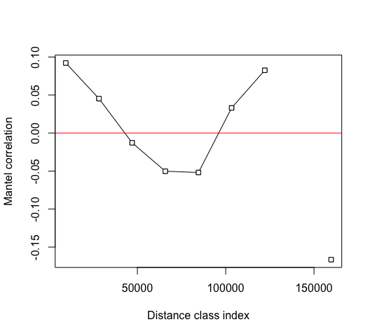

Testing for autocorrelation among sites
================
Beau Larkin

Last updated: 09 March, 2023

- <a href="#description" id="toc-description">Description</a>
- <a href="#packages-and-libraries"
  id="toc-packages-and-libraries">Packages and libraries</a>
- <a href="#data" id="toc-data">Data</a>
- <a href="#results" id="toc-results">Results</a>
  - <a href="#test-1-all-regions" id="toc-test-1-all-regions">Test 1: All
    Regions</a>
  - <a href="#test-2-blue-mounds-region"
    id="toc-test-2-blue-mounds-region">Test 2: Blue Mounds Region</a>
    - <a href="#autocorrelation-with-species-data"
      id="toc-autocorrelation-with-species-data">Autocorrelation with species
      data</a>
    - <a href="#autocorrelation-with-soil-chemical-data"
      id="toc-autocorrelation-with-soil-chemical-data">Autocorrelation with
      soil chemical data</a>

# Description

The fields sampled in this project lie in different soil types, some at
great distances from each other and some adjacent. Before attempting to
characterize the sites as a chronosequence, or comparing results in
corn, restored, and remnant sites, we must learn how important spatial
autocorrelation is in these data.

As an initial test, the microbial abundances determined from the ITS
gene and clustered into 97% similar OTUs and averaged by fields will be
used.

Depending on the results of this test, other tests may be performed. It
must be confirmed whether Mantel tests are still appropriate for this
kind of inference.

Spearman’s Rho is used to test significance of correlations. The Sturges
equation is used to determine the number of distance classes.

# Packages and libraries

``` r
packages_needed = c("tidyverse",
                    "vegan",
                    "geosphere")
packages_installed = packages_needed %in% rownames(installed.packages())
```

``` r
if (any(!packages_installed)) {
    install.packages(packages_needed[!packages_installed])
}
```

``` r
for (i in 1:length(packages_needed)) {
    library(packages_needed[i], character.only = T)
}
```

# Data

Species abundance data and geographic locations must be loaded. ITS
sequence data clustered into 97% OTUs are requested first. Soil
properties may also be used.

ITS-based species data

``` r
spe <-
    data.frame(read_csv(
        paste0(getwd(), "/clean_data/spe_ITS_rfy.csv"),
        show_col_types = FALSE
    ),
    row.names = 1)
```

Site metadata and locations dataframe

``` r
sites <-
    read_csv(paste0(getwd(), "/clean_data/sites.csv"), show_col_types = FALSE) %>%
    mutate(field_type = factor(
        field_type,
        ordered = TRUE,
        levels = c("corn", "restored", "remnant")
    ))
locs <-
    data.frame(sites %>% select(field_key, long, lat),
               row.names = 1)
```

Soil chemical properties, filtered to the Blue Mounds area and restored
fields only

``` r
soil <-
    data.frame(
        read_csv(paste0(getwd(), "/clean_data/soil.csv"), show_col_types = FALSE) %>%
            left_join(sites %>% select(field_key, region, field_type), by = join_by(field_key)) %>%
            filter(region == "BM", field_type == "restored"),
        row.names = 1
    ) %>%
    select(-field_name,-region,-field_type)
bm_resto <- rownames(soil)
```

Filter species and location data to the subset in Blue Mounds restored
fields only. Also remove species that are zero abundance in these
samples.

``` r
spe_bm <- spe[bm_resto, -c(which(apply(spe[bm_resto, ], 2, sum) == 0))]
locs_bm <- locs[bm_resto, ]
```

Create distance matrices:

- Percent difference for the microbial species abundance data
- Shortest ellipsoid distance for the location coordinates using
  [`distGeo()`](https://www.rdocumentation.org/packages/geosphere/versions/1.5-18/topics/distGeo)
- Euclidean distance on column standardized soil chemical variable data
  (standardized to mean=0 and unit variance)

``` r
dist_spe <- vegdist(spe, method = "bray")
dist_spe_bm  <- vegdist(spe_bm, method = "bray")
```

``` r
dist_geo <- as.dist(distm(locs, fun = distGeo))
dist_geo_bm <- as.dist(distm(locs_bm, fun = distGeo))
```

``` r
dist_soil <- dist(decostand(soil, "standardize"))
```

# Results

## Test 1: All Regions

Test 1 is with ITS and OTU parameters on the species data from all
regions and fields.

``` r
man_1 <-
    mantel(
        dist_spe,
        dist_geo,
        method = "spearman",
        permutations = 9999,
        na.rm = TRUE
    )
```

    ## 
    ## Mantel statistic based on Spearman's rank correlation rho 
    ## 
    ## Call:
    ## mantel(xdis = dist_spe, ydis = dist_geo, method = "spearman",      permutations = 9999, na.rm = TRUE) 
    ## 
    ## Mantel statistic r: 0.1091 
    ##       Significance: 0.0385 
    ## 
    ## Upper quantiles of permutations (null model):
    ##    90%    95%  97.5%    99% 
    ## 0.0690 0.0989 0.1258 0.1586 
    ## Permutation: free
    ## Number of permutations: 9999

``` r
man_1_cor <-
    mantel.correlog(
        dist_spe,
        dist_geo,
        n.class = 0,
        cutoff = FALSE,
        r.type = "spearman",
        nperm = 9999,
        mult = "holm"
    )
print(man_1_cor)
```

    ## 
    ## Mantel Correlogram Analysis
    ## 
    ## Call:
    ##  
    ## mantel.correlog(D.eco = dist_spe, D.geo = dist_geo, n.class = 0,      cutoff = FALSE, r.type = "spearman", nperm = 9999, mult = "holm") 
    ## 
    ##         class.index      n.dist  Mantel.cor Pr(Mantel) Pr(corrected)
    ## D.cl.1   9.4645e+03  1.2000e+02  7.4142e-02     0.1271        0.1271
    ## D.cl.2   2.8242e+04  3.6000e+01  4.9108e-02     0.2739        0.2739
    ## D.cl.3   4.7019e+04  4.0000e+00  1.4190e-03     0.5022        0.5478
    ## D.cl.4   6.5796e+04  2.6000e+01 -4.3385e-02     0.2757        0.8217
    ## D.cl.5   8.4574e+04  1.1200e+02 -4.1687e-02     0.2974        1.0000
    ## D.cl.6   1.0335e+05  3.6000e+01  5.5267e-02     0.2044        1.0000
    ## D.cl.7   1.2213e+05  4.8000e+01  9.5341e-02     0.1147        0.8029
    ## D.cl.8   1.4091e+05  0.0000e+00          NA         NA            NA
    ## D.cl.9   1.5968e+05  9.0000e+01 -1.4218e-01     0.0397        0.3176
    ## D.cl.10  1.7846e+05  1.2600e+02 -2.4712e-02     0.3858            NA

``` r
plot(man_1_cor)
```



Global test fails to reject the null of autocorrelation, but barely. The
correlation was weak (R=0.11) but marginally significant (p\<0.05). At
smaller scales (\< 5 km), correlation is apparent (not shown). This is
because only replicate plots (e.g., switchgrass fields at Fermi or
multiple restored fields at Lake Petite) fall within that distance bin,
so similarity is expected.

In the correlogram, no significant correlations are found.

I think we need to be cautious with an expectation that these sites can
be compared generally, but maybe we can do it. It may be easier, more
conservative, and appropriate to consider just the Blue Mounds sites for
comparisons over time. Even Blue Mounds will be difficult to justify as
a true chronosequence, but as a case study it could add a worthwhile
dimension to the project without reaching too far.

It may also be important to test for autocorrelation using soil data.
Let’s do that in the next section, with only the Blue Mounds sites.

## Test 2: Blue Mounds Region

Actually two tests: location compared with species or soil chemical data
to test for autocorrelation within the restored Blue Mounds fields.

### Autocorrelation with species data

``` r
man_2 <-
    mantel(
        dist_spe_bm,
        dist_geo_bm,
        method = "spearman",
        na.rm = TRUE
    )
```

    ## 
    ## Mantel statistic based on Spearman's rank correlation rho 
    ## 
    ## Call:
    ## mantel(xdis = dist_spe_bm, ydis = dist_geo_bm, method = "spearman",      na.rm = TRUE) 
    ## 
    ## Mantel statistic r: -0.3779 
    ##       Significance: 0.962 
    ## 
    ## Upper quantiles of permutations (null model):
    ##   90%   95% 97.5%   99% 
    ## 0.309 0.424 0.514 0.663 
    ## Permutation: free
    ## Number of permutations: 5039

Only 5039 permutations are possible due to the small number of sites
(n=7). The global test shows a non-significant negative correlation. No
correlogram test is warranted.

### Autocorrelation with soil chemical data

``` r
man_3 <-
    mantel(
        dist_soil,
        dist_geo_bm,
        method = "spearman",
        na.rm = TRUE
    )
```

``` r
man_3
```

    ## 
    ## Mantel statistic based on Spearman's rank correlation rho 
    ## 
    ## Call:
    ## mantel(xdis = dist_soil, ydis = dist_geo_bm, method = "spearman",      na.rm = TRUE) 
    ## 
    ## Mantel statistic r: 0.1052 
    ##       Significance: 0.337 
    ## 
    ## Upper quantiles of permutations (null model):
    ##   90%   95% 97.5%   99% 
    ## 0.287 0.377 0.473 0.553 
    ## Permutation: free
    ## Number of permutations: 5039

Only 5039 permutations are possible due to the small number of sites
(n=7). The global test shows a non-significant negative correlation. No
correlogram test is warranted.
