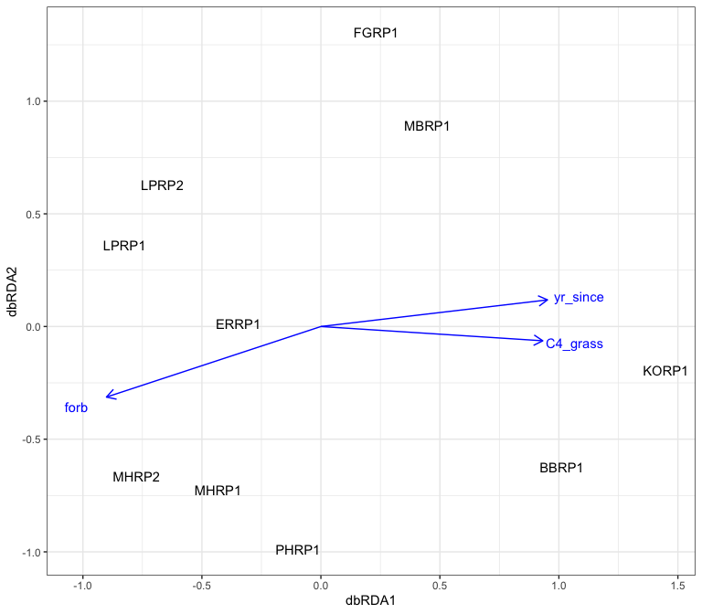
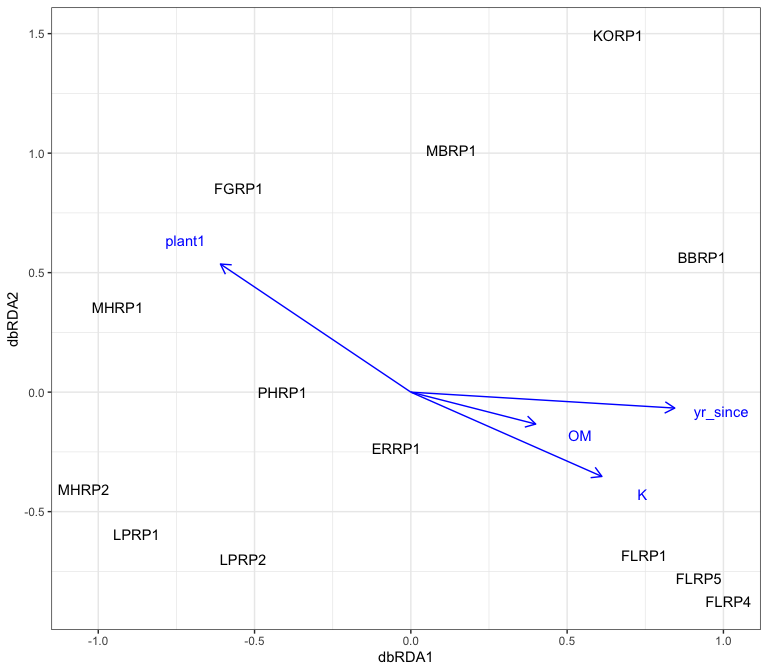
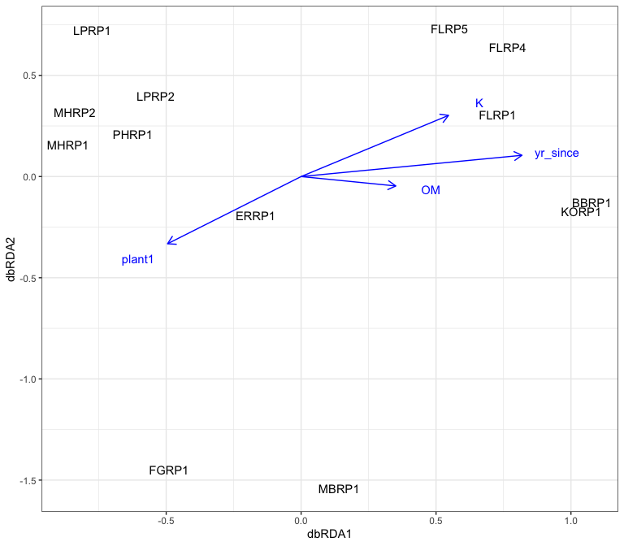

Constrained and summary analysis
================
Beau Larkin

Last updated: 09 November, 2023

- [Description](#description)
- [Packages and libraries](#packages-and-libraries)
- [Functions](#functions)
  - [PCoA axes](#pcoa-axes)
  - [Constrained analyses](#constrained-analyses)
  - [Plot results](#plot-results)
- [Data](#data)
  - [Site metadata and experimental
    design](#site-metadata-and-experimental-design)
  - [Plant data](#plant-data)
    - [Traits](#traits)
    - [Plant communities](#plant-communities)
  - [Environmental data](#environmental-data)
  - [Microbial data](#microbial-data)
    - [Fungal communities](#fungal-communities)
    - [Species metadata](#species-metadata)
  - [Response data](#response-data)
    - [Fungal biomass](#fungal-biomass)
    - [Water stable aggregates](#water-stable-aggregates)
- [Analysis and Results](#analysis-and-results)
  - [Plant community axes](#plant-community-axes)
  - [Microbial communities with explanatory and
    covariables](#microbial-communities-with-explanatory-and-covariables)
    - [General fungal community (ITS sequence
      abundance)](#general-fungal-community-its-sequence-abundance)
    - [AMF community (18S sequence
      abundance)](#amf-community-18s-sequence-abundance)
  - [Response correlations](#response-correlations)

# Description

This script will combine and summarize the many single datasets
presented so far. Several multivariate analyses will be considered.
Symmetrical analyses will attempt to discern the relative contributions
of plant and soil data on site ordination. Asymmetric constrained
analyses will attempt to determine the most significant contributors of
fungal community difference.

Other data, like microbial biomass and soil water stable aggregates may
also be considered.

All explanatory data are provided as field-based averages. Using them to
constrain microbial community data will require alignment with
field-based summary data and cannot use subsamples of microbial data.

Note that the plant data are not available for all sites, leading to
some complication in the analysis. See further notes below.

# Packages and libraries

``` r
packages_needed = c("tidyverse", "vegan", "conflicted", "knitr", "GGally", "ape", "ade4", "GGally")
packages_installed = packages_needed %in% rownames(installed.packages())
```

``` r
if (any(!packages_installed)) {
    install.packages(packages_needed[!packages_installed])
}
```

``` r
for (i in 1:length(packages_needed)) {
    library(packages_needed[i], character.only = T)
}
```

``` r
conflict_prefer("filter", "dplyr")
conflict_prefer("select", "dplyr")
```

# Functions

## PCoA axes

Produce community axes for use in constrained analyses later.

``` r
pcoa_fun <- function(s, ft=c("restored"), rg, method="bray", binary=FALSE, corr="none") {
    d <- vegdist(
        data.frame(
            s %>% 
                filter(field_type %in% ft, region %in% rg) %>% 
                select(-field_type, -region) %>% 
                select(field_name, where(~ is.numeric(.) && sum(.) > 0)),
            row.names = 1),
        method = method,
        binary = binary)
    p <- pcoa(d, correction = corr)
    p_vals <- data.frame(p$values) %>% 
        rownames_to_column(var = "Dim") %>% 
        mutate(Dim = as.integer(Dim))
    p_vec <- data.frame(p$vectors)
    if(corr == "none" | ncol(p_vals) == 6) {
        p_ncomp <- with(p_vals, which(Relative_eig < Broken_stick)[1]-1)
    } else {
        p_ncomp <- with(p_vals, which(Rel_corr_eig < Broken_stick)[1]-1)
    }
    ncomp <- if(p_ncomp <= 2) {2} else {p_ncomp}
    # Ordination plot
    scores <- p_vec[, 1:2]
    # Output data
    output <- list(correction_note = p$note,
                   values          = p_vals[1:(ncomp+1), ],
                   site_vectors    = scores)
    return(output)
}
```

## Constrained analyses

This function performs a db-RDA on microbial data with soil/site
covariables and forward selects on plant communities, agricultural
nutrients, and soil carbon.

``` r
dbrda_fun <- function(s, pspe_pcoa="none", ft, rg) {
    fspe_bray <- vegdist(
        data.frame(
            s %>% 
                filter(field_type %in% ft, region %in% rg) %>% 
                select(-field_type, -region) %>% 
                select(field_name, where(~ is.numeric(.) && sum(.) > 0)),
            row.names = 1),
        method = "bray")
    if(is.data.frame(pspe_pcoa) == TRUE) {
        pspe_ax <- pspe_pcoa %>% 
            rownames_to_column("field_name") %>% 
            rename(plant1 = Axis.1, plant2 = Axis.2)
    }
    ptr_norm <- decostand(
        data.frame(
            ptr %>% 
                filter(field_type %in% ft, region %in% rg) %>% 
                select(-field_type, -region),
            row.names = 1),
        "normalize") %>% 
        rownames_to_column("field_name")
    soil_cov_z <- decostand(
        data.frame(
            soil %>% 
                filter(field_type %in% ft, region %in% rg) %>% 
                select(-field_type, -region, -OM, -NO3, -P, -K),
            row.names = 1),
        "standardize")
    soil_cov_sc <- data.frame(scores(rda(soil_cov_z), display = "sites")) %>% 
        rename(soil1 = PC1, soil2 = PC2) %>% 
        rownames_to_column("field_name")
    soil_expl_z <- decostand(
        data.frame(
            soil %>% 
                filter(field_type %in% ft, region %in% rg) %>% 
                select(field_name, OM, NO3, P, K, -field_type, -region),
            row.names = 1),
        "standardize") %>% 
        rownames_to_column("field_name")
    yr_z <- decostand(
        data.frame(
            sites %>% 
                filter(field_type %in% ft, region %in% rg) %>% 
                select(field_name, yr_since),
            row.names = 1),
        "standardize") %>% 
        rownames_to_column("field_name")
    # Create explanatory data frame and covariables matrix
    env <- if(is.data.frame(pspe_pcoa) == FALSE) {
        soil_cov_sc %>% 
            left_join(ptr_norm, by = join_by(field_name)) %>% 
            left_join(soil_expl_z, by = join_by(field_name)) %>% 
            left_join(yr_z, by = join_by(field_name)) %>% 
            column_to_rownames("field_name") %>% 
            drop_na()
    } else {
        soil_cov_sc %>% 
            left_join(pspe_ax, by = join_by(field_name)) %>% 
            left_join(soil_expl_z, by = join_by(field_name)) %>% 
            left_join(yr_z, by = join_by(field_name)) %>% 
            column_to_rownames("field_name") %>% 
            drop_na()
    }
    covars <- as.matrix(env[, 1:2])
    expl <- env[, 3:ncol(env)]
    # Forward select on explanatory data with covariables
    mod_null <- dbrda(fspe_bray ~ 1 + Condition(covars), data = expl, sqrt.dist = TRUE)
    mod_full <- dbrda(fspe_bray ~ . + Condition(covars), data = expl, sqrt.dist = TRUE)
    mod_step <- ordistep(mod_null, 
                         scope = formula(mod_full), 
                         direction = "forward", 
                         permutations = how(nperm = 1999), 
                         trace = FALSE)
    mod_glax <- anova(mod_step, permutations = how(nperm = 1999))
    mod_inax <- anova(mod_step, by = "axis", permutations = how(nperm = 1999))
    # Produce plot data including borderline vars if possible
    mod_scor <- if(is.data.frame(pspe_pcoa) == FALSE) {
        scores(
            dbrda(fspe_bray ~ yr_since + forb + C4_grass + Condition(covars), data = expl, sqrt.dist = TRUE),
            choices = c(1,2),
            display = c("bp", "sites"), tidy = FALSE
        )
    } else {
        scores(
            dbrda(fspe_bray ~ yr_since + K + plant1 + OM + Condition(covars), data = expl, sqrt.dist = TRUE),
            choices = c(1,2),
            display = c("bp", "sites"), tidy = FALSE
        )
    }
    return(list(
        plot_data = mod_scor,
        select_mod = mod_step,
        global_axis_test = mod_glax,
        individual_axis_test = mod_inax
    ))
} 
```

## Plot results

``` r
plot_dbrda <- function(site_sc, site_bp) {
    site_df <- site_sc %>% 
        data.frame() %>% 
        rownames_to_column(var = "field_name") %>% 
        left_join(sites, by = join_by(field_name))
    bp_df <- site_bp %>% 
        data.frame() %>% 
        rownames_to_column(var = "envvar") %>% 
        mutate(
            origin = 0,
            m = dbRDA2 / dbRDA1, 
            d = sqrt(dbRDA1^2 + dbRDA2^2), 
            dadd = sqrt((max(dbRDA1)-min(dbRDA2))^2 + (max(dbRDA2)-min(dbRDA2))^2)*0.1,
            labx = ((d+dadd)*cos(atan(m)))*(dbRDA1/abs(dbRDA1)), 
            laby = ((d+dadd)*sin(atan(m)))*(dbRDA1/abs(dbRDA1)))
    ggplot(site_df, aes(x = dbRDA1, y = dbRDA2)) +
        geom_text(aes(label = field_name)) +
        geom_segment(data = bp_df, 
                     aes(x = origin, xend = dbRDA1, y = origin, yend = dbRDA2), 
                     arrow = arrow(length = unit(3, "mm")),
                     color = "blue") +
        geom_text(data = bp_df, 
                  aes(x = labx, y = laby, label = envvar),
                  color = "blue") +
        theme_bw()
}
```

# Data

## Site metadata and experimental design

``` r
sites <-
    read_csv(paste0(getwd(), "/clean_data/sites.csv"), show_col_types = FALSE) %>%
    mutate(
        field_type = factor(
            field_type,
            ordered = TRUE,
            levels = c("corn", "restored", "remnant"))) %>%
    select(-lat, -long, -yr_restore, -yr_rank) %>% 
    arrange(field_key)
```

## Plant data

### Traits

Plant abundance data was only available at 16 sites (none at Fermi).
These were translated into percent cover of traits in `plant.R`. Site
metadata are joined to allow custom filtering of sites later.

``` r
ptr <- read_csv(paste0(getwd(), "/clean_data/plant_trait_abund.csv"), show_col_types = FALSE) %>% 
    left_join(sites %>% select(starts_with("field"), region), by = join_by("field_name")) %>% 
    select(field_name, field_type, region, everything(), -field_key)
```

Plant releve data was available from four Fermi sites, but survey data
aren’t correctable between Fermi and other sites. Also, translating
counts of species to counts of traits isn’t appropriate. Trait data
isn’t included for the plant presence dataset.

### Plant communities

Both abundance and presence data are used. Plant site-species matrices
use field names for rows, site metadata will be joined.

``` r
pspe <- list(
    ab = read_csv(paste0(getwd(), "/clean_data/spe_plant_abund.csv"), show_col_types = FALSE),
    pr = read_csv(paste0(getwd(), "/clean_data/spe_plant_presence.csv"), show_col_types = FALSE)
) %>% map(function(x) x %>% 
              rename(field_name = SITE) %>% 
              left_join(sites %>% select(starts_with("field"), region), by = join_by("field_name")) %>% 
              select(field_name, field_type, region, everything(), -field_key))
```

## Environmental data

Use precipitation as proxy for soil moisture

``` r
rain = read_csv(paste0(getwd(), "/clean_data/site_precip_normal.csv"), show_col_types = FALSE)
```

Create subsets of soil environmental data to align with plant abundance
or presence sites

``` r
soil <- read_csv(paste0(getwd(), "/clean_data/soil.csv"), show_col_types = FALSE) %>% 
    left_join(rain, by = join_by("field_key")) %>% 
    filter(field_key %in% sites$field_key) %>% 
    left_join(sites %>% select(starts_with("field"), region), by = join_by("field_name", "field_key")) %>% 
    select(field_name, field_type, region, everything(), -field_key)
```

## Microbial data

### Fungal communities

Fungal species matrices must have field names instead of field keys to
align all datasets. Create subsets of fungal species matrices to align
with plant abundance or presence sites Sites-species tables contain
rarefied sequence abundances. This list includes composition summarized
in fields.

- Fermi switchgrass prairies are removed because they have no plant data
  associated.
- CSV files were produced in [process_data.R](process_data.md)

``` r
fspe <- list(
    its = read_csv(paste0(getwd(), "/clean_data/spe_ITS_rfy.csv"), show_col_types = FALSE),
    amf = read_csv(paste0(getwd(), "/clean_data/spe_18S_rfy.csv"), show_col_types = FALSE)
) %>% map(function(x) x %>% 
              left_join(sites %>% select(starts_with("field"), region), by = join_by("field_key")) %>% 
              filter(!(field_name %in% c("FLRSP1", "FLRSP2", "FLRSP3"))) %>% 
              select(field_name, field_type, region, everything(), -field_key))
```

### Species metadata

The OTUs and sequence abundances in these files matches the rarefied
data in `spe$` above. CSV files were produced in the [microbial
diversity script](microbial_diversity.md).

``` r
fspe_meta <- list(
    its = read_csv(paste0(getwd(), "/clean_data/speTaxa_ITS_rfy.csv"), show_col_types = FALSE),
    amf =  read_csv(paste0(getwd(), "/clean_data/speTaxa_18S_rfy.csv"), show_col_types = FALSE)
)
```

## Response data

### Fungal biomass

``` r
fb <- read_csv(paste0(getwd(), "/clean_data/plfa.csv"), show_col_types = FALSE) %>% 
    left_join(sites %>% select(starts_with("field"), region), by = join_by("field_key", "field_name")) %>% 
    select(field_name, field_type, region, everything(), -field_key, -starts_with("fa_"))
```

### Water stable aggregates

``` r
# Remove rows from old field sites (26 and 27)
wsa <- read_csv(paste0(getwd(), "/clean_data/wsa.csv"), show_col_types = FALSE)[-c(26:27), ] %>% 
    left_join(sites, by = "field_key")
```

# Analysis and Results

A great number of symmetric and asymmetric comparative and constrained
analyses have been attempted with these data. The best and simplest is a
partial db-RDA, executed with the custom function `dbrda_fun()`. The
strategy is to use most of the soil abiotic data and precipitation as
covariables to remove site-dependent affects on the microbial community.
These covariables are numerous, so they are simplified by being
normalized and then transformed into two PCA axes. Then, variables of
experimental interest are forward selected. These are the variables that
we expect to change as a result of the restoration, or affect the
microbial community directly. Agricultural nutrients, soil organic
matter, and plant community/traits data are in this group.

As before, the plant data aren’t consistent across all regions, so the
analysis is adjusted accordingly as described below. Restricting this
analysis to Blue Mounds only is probably the most defensible approach,
but with the covariables, other regions can be included too. It’s also
possible that a precise approach of the permutation scheme (with `how()`
from package `permute`) would properly handle the design of blocks and
replicates used here.

## Plant community axes

In this analysis, both plant community and traits data can be used. To
analyze all regions, community data based on presence/absence is the
only possibility. Let’s use `pcoa_fun()` to produce community axes for
the abundance and presence/absence plant data.

``` r
(pspe_pcoa_ab <- pcoa_fun(pspe$ab, rg = c("BM", "FG", "LP")))
```

    ## $correction_note
    ## [1] "There were no negative eigenvalues. No correction was applied"
    ## 
    ## $values
    ##   Dim Eigenvalues Relative_eig Broken_stick Cumul_eig Cumul_br_stick
    ## 1   1   0.6185814    0.2317320    0.3143298 0.2317320      0.3143298
    ## 2   2   0.5066828    0.1898127    0.2032187 0.4215447      0.5175485
    ## 3   3   0.4485128    0.1680212    0.1476631 0.5895659      0.6652116
    ## 
    ## $site_vectors
    ##            Axis.1      Axis.2
    ## BBRP1  0.18696712 -0.05719659
    ## ERRP1 -0.42120632  0.07701724
    ## FGRP1  0.22768657 -0.23830561
    ## KORP1  0.25705084 -0.02418826
    ## LPRP1  0.07534780  0.39879804
    ## LPRP2  0.17161860  0.26606275
    ## MBRP1  0.15075088 -0.18310740
    ## MHRP1 -0.02686684 -0.27809252
    ## MHRP2 -0.44609709 -0.20258732
    ## PHRP1 -0.17525156  0.24159967

``` r
(pspe_pcoa_pr <- pcoa_fun(pspe$pr, rg = c("BM", "FG", "LP", "FL"), method = "jaccard", binary = TRUE))
```

    ## $correction_note
    ## [1] "There were no negative eigenvalues. No correction was applied"
    ## 
    ## $values
    ##   Dim Eigenvalues Relative_eig Broken_stick Cumul_eig Cumul_br_stick
    ## 1   1   0.9879052    0.2421821    0.2586009 0.2421821      0.2586009
    ## 2   2   0.5728272    0.1404269    0.1752676 0.3826090      0.4338684
    ## 3   3   0.4443108    0.1089215    0.1336009 0.4915305      0.5674693
    ## 
    ## $site_vectors
    ##            Axis.1       Axis.2
    ## BBRP1  0.21067579  0.087434428
    ## ERRP1  0.22272287 -0.260905872
    ## FGRP1  0.09141325  0.044743613
    ## FLRP1 -0.52791888 -0.028042798
    ## FLRP4 -0.52644384 -0.007428271
    ## FLRP5 -0.42831294  0.043201635
    ## KORP1  0.16233582  0.339613190
    ## LPRP1  0.19555559  0.224978538
    ## LPRP2  0.10602315  0.266489743
    ## MBRP1  0.06484968 -0.137320443
    ## MHRP1  0.19700860 -0.295295743
    ## MHRP2  0.10057182 -0.374191665
    ## PHRP1  0.13151908  0.096723644

## Microbial communities with explanatory and covariables

Partial db-RDA

### General fungal community (ITS sequence abundance)

#### Blue Mounds with plant traits data

``` r
dbrda_fun(s = fspe$its, pspe_pcoa = "none", ft = c("restored"), rg = c("BM"))[c(3,4,2)]
```

    ## $global_axis_test
    ## No constrained component
    ## 
    ## Model: dbrda(formula = fspe_bray ~ 1 + Condition(covars), data = expl, sqrt.dist = TRUE)
    ##          Df SumOfSqs  F Pr(>F)
    ## Model     0   0.0000  0       
    ## Residual  6   1.4097          
    ## 
    ## $individual_axis_test
    ## No constrained component
    ## 
    ## Model: dbrda(formula = fspe_bray ~ 1 + Condition(covars), data = expl, sqrt.dist = TRUE)
    ##          Df SumOfSqs  F Pr(>F)
    ## Model     0   0.0000  0       
    ## Residual  6   1.4097          
    ## 
    ## $select_mod
    ## Call: dbrda(formula = fspe_bray ~ 1 + Condition(covars), data = expl,
    ## sqrt.dist = TRUE)
    ## 
    ##               Inertia Proportion Rank
    ## Total          2.1525     1.0000     
    ## Conditional    0.7428     0.3451    2
    ## Unconstrained  1.4097     0.6549    4
    ## Inertia is Bray distance 
    ## 
    ## Eigenvalues for unconstrained axes:
    ##   MDS1   MDS2   MDS3   MDS4 
    ## 0.4834 0.3679 0.3135 0.2449

No explanatory variables were selected

#### Wisconsin sites with plant traits

``` r
(dbrda_wi_tr_its <- dbrda_fun(s = fspe$its, pspe_pcoa = "none", ft = c("restored"), rg = c("BM", "LP", "FG")))[c(3,4,2)]
```

    ## $global_axis_test
    ## Permutation test for dbrda under reduced model
    ## Permutation: free
    ## Number of permutations: 1999
    ## 
    ## Model: dbrda(formula = fspe_bray ~ Condition(covars) + yr_since, data = expl, sqrt.dist = TRUE)
    ##          Df SumOfSqs      F Pr(>F)  
    ## Model     1  0.54709 1.7407  0.013 *
    ## Residual  6  1.88570                
    ## ---
    ## Signif. codes:  0 '***' 0.001 '**' 0.01 '*' 0.05 '.' 0.1 ' ' 1
    ## 
    ## $individual_axis_test
    ## Permutation test for dbrda under reduced model
    ## Forward tests for axes
    ## Permutation: free
    ## Number of permutations: 1999
    ## 
    ## Model: dbrda(formula = fspe_bray ~ Condition(covars) + yr_since, data = expl, sqrt.dist = TRUE)
    ##          Df SumOfSqs      F Pr(>F)  
    ## dbRDA1    1  0.54709 1.7407 0.0215 *
    ## Residual  6  1.88570                
    ## ---
    ## Signif. codes:  0 '***' 0.001 '**' 0.01 '*' 0.05 '.' 0.1 ' ' 1
    ## 
    ## $select_mod
    ## Call: dbrda(formula = fspe_bray ~ Condition(covars) + yr_since, data =
    ## expl, sqrt.dist = TRUE)
    ## 
    ##               Inertia Proportion Rank
    ## Total          3.1931     1.0000     
    ## Conditional    0.7603     0.2381    2
    ## Constrained    0.5471     0.1713    1
    ## Unconstrained  1.8857     0.5906    6
    ## Inertia is Bray distance 
    ## 
    ## Eigenvalues for constrained axes:
    ## dbRDA1 
    ## 0.5471 
    ## 
    ## Eigenvalues for unconstrained axes:
    ##   MDS1   MDS2   MDS3   MDS4   MDS5   MDS6 
    ## 0.3879 0.3720 0.3467 0.3007 0.2557 0.2227

Global and individual axis tests were significant. Years since
restoration was selected, and it explains 17% of the variation. Forb and
C4 grass are runners-up but appear highly correlated with years (not
shown). Let’s view a plot and include forb and C4 grass for
visualization purposes:

``` r
plot_dbrda(site_sc = dbrda_wi_tr_its$plot_data$sites, site_bp = dbrda_wi_tr_its$plot_data$biplot)
```



#### Wisconsin sites with plant community axes

``` r
dbrda_fun(s = fspe$its, pspe_pcoa = pspe_pcoa_ab$site_vectors, ft = c("restored"), rg = c("BM", "LP", "FG"))[c(3,4,2)]
```

    ## $global_axis_test
    ## Permutation test for dbrda under reduced model
    ## Permutation: free
    ## Number of permutations: 1999
    ## 
    ## Model: dbrda(formula = fspe_bray ~ Condition(covars) + yr_since, data = expl, sqrt.dist = TRUE)
    ##          Df SumOfSqs      F Pr(>F)  
    ## Model     1  0.54709 1.7407 0.0135 *
    ## Residual  6  1.88570                
    ## ---
    ## Signif. codes:  0 '***' 0.001 '**' 0.01 '*' 0.05 '.' 0.1 ' ' 1
    ## 
    ## $individual_axis_test
    ## Permutation test for dbrda under reduced model
    ## Forward tests for axes
    ## Permutation: free
    ## Number of permutations: 1999
    ## 
    ## Model: dbrda(formula = fspe_bray ~ Condition(covars) + yr_since, data = expl, sqrt.dist = TRUE)
    ##          Df SumOfSqs      F Pr(>F)  
    ## dbRDA1    1  0.54709 1.7407  0.012 *
    ## Residual  6  1.88570                
    ## ---
    ## Signif. codes:  0 '***' 0.001 '**' 0.01 '*' 0.05 '.' 0.1 ' ' 1
    ## 
    ## $select_mod
    ## Call: dbrda(formula = fspe_bray ~ Condition(covars) + yr_since, data =
    ## expl, sqrt.dist = TRUE)
    ## 
    ##               Inertia Proportion Rank
    ## Total          3.1931     1.0000     
    ## Conditional    0.7603     0.2381    2
    ## Constrained    0.5471     0.1713    1
    ## Unconstrained  1.8857     0.5906    6
    ## Inertia is Bray distance 
    ## 
    ## Eigenvalues for constrained axes:
    ## dbRDA1 
    ## 0.5471 
    ## 
    ## Eigenvalues for unconstrained axes:
    ##   MDS1   MDS2   MDS3   MDS4   MDS5   MDS6 
    ## 0.3879 0.3720 0.3467 0.3007 0.2557 0.2227

Global and individual axis tests were significant. Years since
restoration was selected, and it explains 17% of the variation. Since
the plant community axes failed to contribute explanatory power, the
result of the test is identical to the previous one.

#### All regions with plant community axes

``` r
(dbrda_all_pr_its <- dbrda_fun(s = fspe$its, pspe_pcoa = pspe_pcoa_pr$site_vectors, ft = c("restored"), rg = c("BM", "LP", "FG", "FL")))[c(3,4,2)]
```

    ## $global_axis_test
    ## Permutation test for dbrda under reduced model
    ## Permutation: free
    ## Number of permutations: 1999
    ## 
    ## Model: dbrda(formula = fspe_bray ~ Condition(covars) + yr_since, data = expl, sqrt.dist = TRUE)
    ##          Df SumOfSqs      F Pr(>F)   
    ## Model     1  0.70182 2.2329 0.0015 **
    ## Residual  9  2.82875                 
    ## ---
    ## Signif. codes:  0 '***' 0.001 '**' 0.01 '*' 0.05 '.' 0.1 ' ' 1
    ## 
    ## $individual_axis_test
    ## Permutation test for dbrda under reduced model
    ## Forward tests for axes
    ## Permutation: free
    ## Number of permutations: 1999
    ## 
    ## Model: dbrda(formula = fspe_bray ~ Condition(covars) + yr_since, data = expl, sqrt.dist = TRUE)
    ##          Df SumOfSqs      F Pr(>F)   
    ## dbRDA1    1  0.70182 2.2329 0.0015 **
    ## Residual  9  2.82875                 
    ## ---
    ## Signif. codes:  0 '***' 0.001 '**' 0.01 '*' 0.05 '.' 0.1 ' ' 1
    ## 
    ## $select_mod
    ## Call: dbrda(formula = fspe_bray ~ Condition(covars) + yr_since, data =
    ## expl, sqrt.dist = TRUE)
    ## 
    ##               Inertia Proportion Rank
    ## Total          4.3402     1.0000     
    ## Conditional    0.8097     0.1865    2
    ## Constrained    0.7018     0.1617    1
    ## Unconstrained  2.8287     0.6518    9
    ## Inertia is Bray distance 
    ## 
    ## Eigenvalues for constrained axes:
    ## dbRDA1 
    ## 0.7018 
    ## 
    ## Eigenvalues for unconstrained axes:
    ##   MDS1   MDS2   MDS3   MDS4   MDS5   MDS6   MDS7   MDS8   MDS9 
    ## 0.4454 0.3874 0.3615 0.3437 0.3056 0.2642 0.2530 0.2474 0.2205

Global and individual axes are significant and strong. Years since
restoration was selected and it explains 16% of the variation here.
Potassium and plant axis 1 were runners up. It’s nice to see that the
addition of a very different plant community didn’t make much of a
difference, and that the conditional variation was 18%. I expected more
with how different Fermi soils are. Let’s view a plot and add SOM, plant
axis 1, and potassium for visualization purposes.

``` r
plot_dbrda(site_sc = dbrda_all_pr_its$plot_data$sites, site_bp = dbrda_all_pr_its$plot_data$biplot)
```



### AMF community (18S sequence abundance)

#### Blue Mounds with plant traits data

``` r
dbrda_fun(s = fspe$amf, pspe_pcoa = "none", ft = c("restored"), rg = c("BM"))[c(3,4,2)]
```

    ## $global_axis_test
    ## No constrained component
    ## 
    ## Model: dbrda(formula = fspe_bray ~ 1 + Condition(covars), data = expl, sqrt.dist = TRUE)
    ##          Df SumOfSqs  F Pr(>F)
    ## Model     0   0.0000  0       
    ## Residual  6   1.1147          
    ## 
    ## $individual_axis_test
    ## No constrained component
    ## 
    ## Model: dbrda(formula = fspe_bray ~ 1 + Condition(covars), data = expl, sqrt.dist = TRUE)
    ##          Df SumOfSqs  F Pr(>F)
    ## Model     0   0.0000  0       
    ## Residual  6   1.1147          
    ## 
    ## $select_mod
    ## Call: dbrda(formula = fspe_bray ~ 1 + Condition(covars), data = expl,
    ## sqrt.dist = TRUE)
    ## 
    ##               Inertia Proportion Rank
    ## Total          1.6947     1.0000     
    ## Conditional    0.5800     0.3422    2
    ## Unconstrained  1.1147     0.6578    4
    ## Inertia is Bray distance 
    ## 
    ## Eigenvalues for unconstrained axes:
    ##   MDS1   MDS2   MDS3   MDS4 
    ## 0.5249 0.2560 0.1919 0.1418

No explanatory variables were selected. Blue Mounds has too few sites
for the number of conditional and explanatory variables used, perhaps.

#### Wisconsin sites with plant traits data

``` r
(dbrda_wi_tr_amf <- dbrda_fun(s = fspe$amf, pspe_pcoa = "none", ft = c("restored"), rg = c("BM", "LP", "FG")))[c(3,4,2)]
```

    ## $global_axis_test
    ## Permutation test for dbrda under reduced model
    ## Permutation: free
    ## Number of permutations: 1999
    ## 
    ## Model: dbrda(formula = fspe_bray ~ Condition(covars) + yr_since, data = expl, sqrt.dist = TRUE)
    ##          Df SumOfSqs      F Pr(>F)   
    ## Model     1  0.57408 2.7216  0.006 **
    ## Residual  6  1.26562                 
    ## ---
    ## Signif. codes:  0 '***' 0.001 '**' 0.01 '*' 0.05 '.' 0.1 ' ' 1
    ## 
    ## $individual_axis_test
    ## Permutation test for dbrda under reduced model
    ## Forward tests for axes
    ## Permutation: free
    ## Number of permutations: 1999
    ## 
    ## Model: dbrda(formula = fspe_bray ~ Condition(covars) + yr_since, data = expl, sqrt.dist = TRUE)
    ##          Df SumOfSqs      F Pr(>F)   
    ## dbRDA1    1  0.57408 2.7216 0.0065 **
    ## Residual  6  1.26562                 
    ## ---
    ## Signif. codes:  0 '***' 0.001 '**' 0.01 '*' 0.05 '.' 0.1 ' ' 1
    ## 
    ## $select_mod
    ## Call: dbrda(formula = fspe_bray ~ Condition(covars) + yr_since, data =
    ## expl, sqrt.dist = TRUE)
    ## 
    ##               Inertia Proportion Rank
    ## Total          2.4975     1.0000     
    ## Conditional    0.6578     0.2634    2
    ## Constrained    0.5741     0.2299    1
    ## Unconstrained  1.2656     0.5068    6
    ## Inertia is Bray distance 
    ## 
    ## Eigenvalues for constrained axes:
    ## dbRDA1 
    ## 0.5741 
    ## 
    ## Eigenvalues for unconstrained axes:
    ##    MDS1    MDS2    MDS3    MDS4    MDS5    MDS6 
    ## 0.30700 0.27775 0.21350 0.18386 0.15709 0.12642

Global and single constrained axes are significant in site rank at
p\<0.01. Years since restoration was the selected explanatory variable,
explanaing 23% of the variation in communities. Forb and C4 grass were
runners up and appear highly correlated with years since restoration.
Let’s view a plot and include forb and C4 grass for visualization
purposes:

``` r
plot_dbrda(site_sc = dbrda_wi_tr_amf$plot_data$sites, site_bp = dbrda_wi_tr_amf$plot_data$biplot)
```


#### Wisconsin sites with plant community axes

``` r
dbrda_fun(s = fspe$amf, pspe_pcoa = pspe_pcoa_ab$site_vectors, ft = c("restored"), rg = c("BM", "LP", "FG"))[c(3,4,2)]
```

    ## $global_axis_test
    ## Permutation test for dbrda under reduced model
    ## Permutation: free
    ## Number of permutations: 1999
    ## 
    ## Model: dbrda(formula = fspe_bray ~ Condition(covars) + yr_since, data = expl, sqrt.dist = TRUE)
    ##          Df SumOfSqs      F Pr(>F)   
    ## Model     1  0.57408 2.7216  0.004 **
    ## Residual  6  1.26562                 
    ## ---
    ## Signif. codes:  0 '***' 0.001 '**' 0.01 '*' 0.05 '.' 0.1 ' ' 1
    ## 
    ## $individual_axis_test
    ## Permutation test for dbrda under reduced model
    ## Forward tests for axes
    ## Permutation: free
    ## Number of permutations: 1999
    ## 
    ## Model: dbrda(formula = fspe_bray ~ Condition(covars) + yr_since, data = expl, sqrt.dist = TRUE)
    ##          Df SumOfSqs      F Pr(>F)   
    ## dbRDA1    1  0.57408 2.7216  0.008 **
    ## Residual  6  1.26562                 
    ## ---
    ## Signif. codes:  0 '***' 0.001 '**' 0.01 '*' 0.05 '.' 0.1 ' ' 1
    ## 
    ## $select_mod
    ## Call: dbrda(formula = fspe_bray ~ Condition(covars) + yr_since, data =
    ## expl, sqrt.dist = TRUE)
    ## 
    ##               Inertia Proportion Rank
    ## Total          2.4975     1.0000     
    ## Conditional    0.6578     0.2634    2
    ## Constrained    0.5741     0.2299    1
    ## Unconstrained  1.2656     0.5068    6
    ## Inertia is Bray distance 
    ## 
    ## Eigenvalues for constrained axes:
    ## dbRDA1 
    ## 0.5741 
    ## 
    ## Eigenvalues for unconstrained axes:
    ##    MDS1    MDS2    MDS3    MDS4    MDS5    MDS6 
    ## 0.30700 0.27775 0.21350 0.18386 0.15709 0.12642

Global and individual axis tests were significant, years since
restoration was selected with the same strength as the previous test.

#### All regions with plant community axes

``` r
(dbrda_all_pr_amf <- dbrda_fun(s = fspe$amf, pspe_pcoa = pspe_pcoa_pr$site_vectors, ft = c("restored"), rg = c("BM", "LP", "FG", "FL")))[c(3,4,2)]
```

    ## $global_axis_test
    ## Permutation test for dbrda under reduced model
    ## Permutation: free
    ## Number of permutations: 1999
    ## 
    ## Model: dbrda(formula = fspe_bray ~ Condition(covars) + yr_since, data = expl, sqrt.dist = TRUE)
    ##          Df SumOfSqs      F Pr(>F)   
    ## Model     1  0.69717 3.3004  0.002 **
    ## Residual  9  1.90112                 
    ## ---
    ## Signif. codes:  0 '***' 0.001 '**' 0.01 '*' 0.05 '.' 0.1 ' ' 1
    ## 
    ## $individual_axis_test
    ## Permutation test for dbrda under reduced model
    ## Forward tests for axes
    ## Permutation: free
    ## Number of permutations: 1999
    ## 
    ## Model: dbrda(formula = fspe_bray ~ Condition(covars) + yr_since, data = expl, sqrt.dist = TRUE)
    ##          Df SumOfSqs      F Pr(>F)   
    ## dbRDA1    1  0.69717 3.3004  0.004 **
    ## Residual  9  1.90112                 
    ## ---
    ## Signif. codes:  0 '***' 0.001 '**' 0.01 '*' 0.05 '.' 0.1 ' ' 1
    ## 
    ## $select_mod
    ## Call: dbrda(formula = fspe_bray ~ Condition(covars) + yr_since, data =
    ## expl, sqrt.dist = TRUE)
    ## 
    ##               Inertia Proportion Rank
    ## Total          3.2964     1.0000     
    ## Conditional    0.6981     0.2118    2
    ## Constrained    0.6972     0.2115    1
    ## Unconstrained  1.9011     0.5767    9
    ## Inertia is Bray distance 
    ## 
    ## Eigenvalues for constrained axes:
    ## dbRDA1 
    ## 0.6972 
    ## 
    ## Eigenvalues for unconstrained axes:
    ##   MDS1   MDS2   MDS3   MDS4   MDS5   MDS6   MDS7   MDS8   MDS9 
    ## 0.3631 0.2896 0.2725 0.2190 0.1762 0.1648 0.1573 0.1366 0.1221

Global and single constrained axes are significant in site rank. Years
since restoration explained 21% of the variation and potassium was a
runner up. Let’s view a plot and add SOM, plant axis 1, and potassium
for visualization purposes.

``` r
plot_dbrda(site_sc = dbrda_all_pr_amf$plot_data$sites, site_bp = dbrda_all_pr_amf$plot_data$biplot)
```



Microbial communities align with years since restoration across regions
and types (general fungi and amf).

## Response correlations

Fungal communities varied with years since restoration, C4 grass, and
forbs. How do these predictors affect microbial biomass and function?

``` r
func_vars <- 
    sites %>% 
    left_join(ptr %>% select(field_name, C4_grass, forb), by = join_by(field_name)) %>% 
    left_join(fb %>% select(field_name, fungi, amf), by = join_by(field_name)) %>% 
    left_join(wsa %>% select(field_name, wsa), by = join_by(field_name)) %>% 
    rename(C4_grass_pct = C4_grass, forb_pct = forb, mass_fungi = fungi, mass_amf = amf) %>% 
    select(-field_key)
```

Plant traits data are only available in Wisconsin; try these first.

``` r
ggpairs(
    data = func_vars %>% filter(field_type == "restored", region != "FL"),
    columns = 4:9
) +
    theme_bw()
```


In all restored sites, response correlations are still possible without
plant traits.

``` r
ggpairs(
    data = func_vars %>% filter(field_type == "restored") %>% 
        select(-C4_grass_pct, -forb_pct),
    columns = 4:7
) +
    theme_bw()
```


In both cases, we see obvious relationships that would be difficult to
handle in a statistically robust way due to limited reps in regions.

Next, look for trends in guild and taxonomy data.
