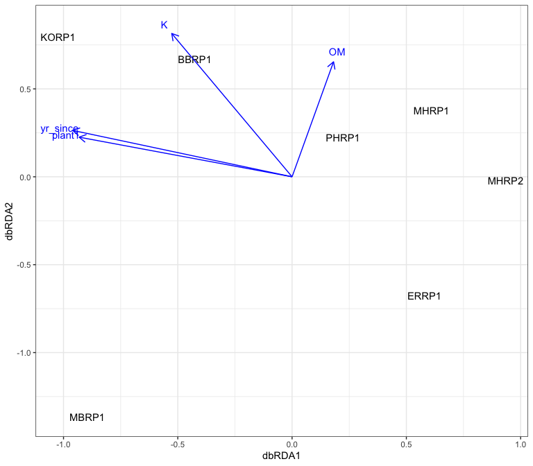
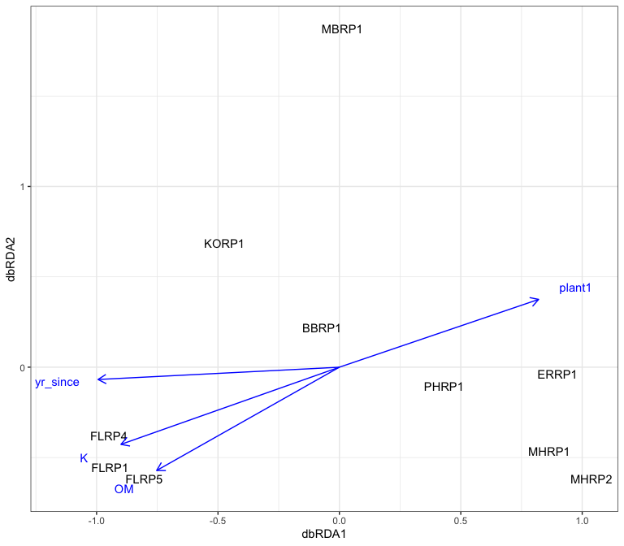
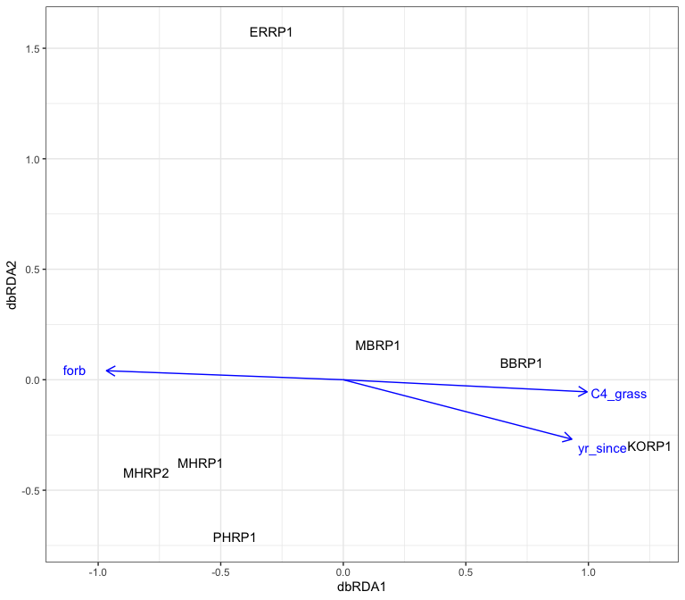
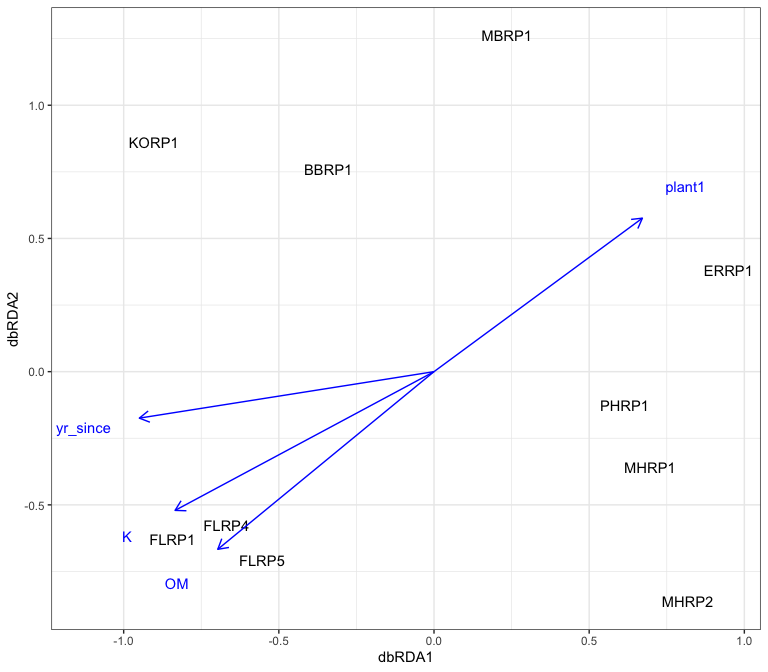
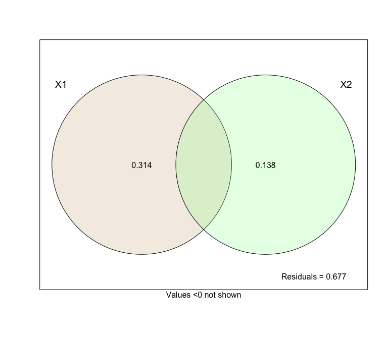

Constrained and summary analysis
================
Beau Larkin

Last updated: 11 September, 2024

- [Description](#description)
- [Packages and libraries](#packages-and-libraries)
- [Functions](#functions)
- [Data](#data)
  - [Site metadata and experimental
    design](#site-metadata-and-experimental-design)
  - [Plant data](#plant-data)
    - [Traits](#traits)
    - [Plant communities](#plant-communities)
  - [Environmental data](#environmental-data)
  - [Microbial data](#microbial-data)
    - [Fungal communities](#fungal-communities)
    - [Species metadata](#species-metadata)
  - [Response data](#response-data)
    - [Fungal biomass](#fungal-biomass)
    - [Water stable aggregates](#water-stable-aggregates)
- [Analysis and Results](#analysis-and-results)
  - [Plant community axes](#plant-community-axes)
  - [Microbial communities with
    constraints](#microbial-communities-with-constraints)
    - [Fungal community (ITS sequence
      abundance)](#fungal-community-its-sequence-abundance)
    - [AMF community (18S sequence
      abundance)](#amf-community-18s-sequence-abundance)
  - [Effects of soil and plants](#effects-of-soil-and-plants)
    - [Soil fungi variation
      partitioning](#soil-fungi-variation-partitioning)
    - [AMF variation partitioning](#amf-variation-partitioning)
  - [Response correlations](#response-correlations)

# Description

This script presents a constrained analysis on restored sites in the
Blue Mounds area. Lack of replication prevents constraints from being
significants across regions, although this was tried previously (not
shown).

# Packages and libraries

``` r
packages_needed = c("tidyverse", "vegan", "conflicted", "knitr", "GGally", "ape", "ade4", "GGally")
packages_installed = packages_needed %in% rownames(installed.packages())
```

``` r
if (any(!packages_installed)) {
    install.packages(packages_needed[!packages_installed])
}
```

``` r
for (i in 1:length(packages_needed)) {
    library(packages_needed[i], character.only = T)
}
```

``` r
conflict_prefer("filter", "dplyr")
conflict_prefer("select", "dplyr")
```

# Functions

Reference the sidecar file `tgr_constrained_functions.R`.

``` r
source("supporting_files/tgr_constrained_functions.R")
```

# Data

## Site metadata and experimental design

``` r
sites <-
    read_csv(paste0(getwd(), "/clean_data/sites.csv"), show_col_types = FALSE) %>%
    mutate(
        field_type = factor(
            field_type,
            ordered = TRUE,
            levels = c("corn", "restored", "remnant"))) %>%
    select(-lat, -long, -yr_restore, -yr_rank) %>% 
    arrange(field_key)
```

## Plant data

### Traits

Plant abundance data was only available at 16 sites (none at Fermi).
These were translated into percent cover of traits in `plant.R`. Site
metadata are joined to allow custom filtering of sites later.

``` r
ptr <- read_csv(paste0(getwd(), "/clean_data/plant_trait_abund.csv"), show_col_types = FALSE) %>% 
    left_join(sites %>% select(starts_with("field"), region), by = join_by("field_name")) %>% 
    left_join(read_csv(paste0(getwd(), "/clean_data/spe_plant_abund.csv"), show_col_types = FALSE) %>% 
                  rename(field_name = SITE) %>% select(field_name, BARESOIL, LITTER), by = join_by(field_name)) %>% 
    select(field_name, field_type, region, everything(), -field_key)
```

Plant releve data was available from four Fermi sites, but survey data
aren’t correctable between Fermi and other sites. Also, translating
counts of species to counts of traits isn’t appropriate. Trait data
isn’t included for the plant presence dataset.

### Plant communities

Both abundance and presence data are provided. Plant site-species
matrices use field names for rows, site metadata will be joined.

``` r
pspe <- list(
    ab = read_csv(paste0(getwd(), "/clean_data/spe_plant_abund.csv"), show_col_types = FALSE),
    pr = read_csv(paste0(getwd(), "/clean_data/spe_plant_presence.csv"), show_col_types = FALSE)
) %>% map(function(x) x %>% 
              rename(field_name = SITE) %>% 
              left_join(sites %>% select(starts_with("field"), region), by = join_by("field_name")) %>% 
              select(field_name, field_type, region, everything(), -field_key, -BARESOIL, -LITTER))
```

## Environmental data

Use precipitation as proxy for soil moisture

``` r
rain = read_csv(paste0(getwd(), "/clean_data/site_precip_normal.csv"), show_col_types = FALSE)
```

Create subsets of soil environmental data to align with plant abundance
or presence sites

``` r
soil <- read_csv(paste0(getwd(), "/clean_data/soil.csv"), show_col_types = FALSE) %>% 
    left_join(rain, by = join_by("field_key")) %>% 
    filter(field_key %in% sites$field_key) %>% 
    left_join(sites %>% select(starts_with("field"), region), by = join_by("field_name", "field_key")) %>% 
    select(field_name, field_type, region, everything(), -field_key)
```

## Microbial data

### Fungal communities

Fungal species matrices must have field names instead of field keys to
align all datasets. Create subsets of fungal species matrices to align
with plant abundance or presence sites Sites-species tables contain
rarefied sequence abundances. This list includes composition summarized
in fields.

- Fermi switchgrass prairies are removed because they have no plant data
  associated.
- CSV files were produced in [process_data.R](process_data.md)

``` r
fspe <- list(
    its = read_csv(paste0(getwd(), "/clean_data/spe_ITS_rfy.csv"), show_col_types = FALSE),
    amf = read_csv(paste0(getwd(), "/clean_data/spe_18S_rfy.csv"), show_col_types = FALSE)
) %>% map(function(x) x %>% 
              left_join(sites %>% select(starts_with("field"), region), by = join_by("field_key")) %>% 
              filter(!(field_name %in% c("FLRSP1", "FLRSP2", "FLRSP3"))) %>% 
              select(field_name, field_type, region, everything(), -field_key))
```

### Species metadata

The OTUs and sequence abundances in these files matches the rarefied
data in `spe$` above. CSV files were produced in the [microbial
diversity script](microbial_diversity.md).

``` r
fspe_meta <- list(
    its = read_csv(paste0(getwd(), "/clean_data/speTaxa_ITS_rfy.csv"), show_col_types = FALSE),
    amf =  read_csv(paste0(getwd(), "/clean_data/speTaxa_18S_rfy.csv"), show_col_types = FALSE)
)
```

## Response data

### Fungal biomass

``` r
fb <- read_csv(paste0(getwd(), "/clean_data/plfa.csv"), show_col_types = FALSE) %>% 
    left_join(sites %>% select(starts_with("field"), region), by = join_by("field_key", "field_name")) %>% 
    select(field_name, field_type, region, everything(), -field_key, -starts_with("fa_"))
```

### Water stable aggregates

``` r
# Remove rows from old field sites (26 and 27)
wsa <- read_csv(paste0(getwd(), "/clean_data/wsa.csv"), show_col_types = FALSE)[-c(26:27), ] %>% 
    left_join(sites, by = "field_key")
```

# Analysis and Results

A great number of symmetric and asymmetric comparative and constrained
analyses have been attempted with these data. The best and simplest is a
db-RDA, executed with the custom function `dbrda_fun()`. The strategy is
to forward select variables of experimental interest. These are the
variables that we expect to change as a result of the restoration, or
affect the microbial community directly. Agricultural nutrients, soil
organic matter, and plant community/traits data are in this group.

## Plant community axes

In this analysis, both plant community and traits data can be used.
Let’s use `pcoa_fun()` to produce community axes for the abundance-based
plant data.

``` r
(pspe_pcoa_ab <- pcoa_fun(pspe$ab))
```

    ## $correction_note
    ## [1] "There were no negative eigenvalues. No correction was applied"
    ## 
    ## $values
    ##   Dim Eigenvalues Relative_eig Broken_stick Cumul_eig Cumul_br_stick
    ## 1   1   0.6022539    0.3234304    0.4083333 0.3234304      0.4083333
    ## 2   2   0.4289183    0.2303434    0.2416667 0.5537738      0.6500000
    ## 3   3   0.2918463    0.1567312    0.1583333 0.7105050      0.8083333
    ## 
    ## $site_vectors
    ##            Axis.1      Axis.2
    ## BBRP1  0.24288202  0.01543959
    ## ERRP1 -0.33945285 -0.35931617
    ## KORP1  0.37258531 -0.13560302
    ## MBRP1  0.25532600  0.20704710
    ## MHRP1 -0.01760312  0.27115642
    ## MHRP2 -0.47105312  0.28768205
    ## PHRP1 -0.04268423 -0.28640596

## Microbial communities with constraints

db-RDA in function `dbrda-fun()`

### Fungal community (ITS sequence abundance)

#### Blue Mounds with plant traits data

``` r
(dbrda_bm_tr_its <- dbrda_fun(s = fspe$its, pspe_pcoa = "none"))[c(3, 4, 5, 2)]
```

    ## $R2
    ## $R2$r.squared
    ## [1] 0.22
    ## 
    ## $R2$adj.r.squared
    ## [1] 0.07
    ## 
    ## 
    ## $global_axis_test
    ## Permutation test for dbrda under reduced model
    ## Permutation: free
    ## Number of permutations: 5039
    ## 
    ## Model: dbrda(formula = fspe_dist ~ C4_grass, data = env, sqrt.dist = TRUE)
    ##          Df SumOfSqs      F Pr(>F)    
    ## Model     1  0.48277 1.4465  5e-04 ***
    ## Residual  5  1.66877                  
    ## ---
    ## Signif. codes:  0 '***' 0.001 '**' 0.01 '*' 0.05 '.' 0.1 ' ' 1
    ## 
    ## $individual_axis_test
    ## Permutation test for dbrda under reduced model
    ## Forward tests for axes
    ## Permutation: free
    ## Number of permutations: 5039
    ## 
    ## Model: dbrda(formula = fspe_dist ~ C4_grass, data = env, sqrt.dist = TRUE)
    ##          Df SumOfSqs      F Pr(>F)    
    ## dbRDA1    1  0.48277 1.4465  5e-04 ***
    ## Residual  5  1.66877                  
    ## ---
    ## Signif. codes:  0 '***' 0.001 '**' 0.01 '*' 0.05 '.' 0.1 ' ' 1
    ## 
    ## $select_mod
    ## Call: dbrda(formula = fspe_dist ~ C4_grass, data = env, sqrt.dist = TRUE)
    ## 
    ## -- Model Summary --
    ## 
    ##               Inertia Proportion Rank
    ## Total          2.1515     1.0000     
    ## Constrained    0.4828     0.2244    1
    ## Unconstrained  1.6688     0.7756    5
    ## 
    ## Inertia is Bray distance
    ## 
    ## -- Eigenvalues --
    ## 
    ## Eigenvalues for constrained axes:
    ## dbRDA1 
    ## 0.4828 
    ## 
    ## Eigenvalues for unconstrained axes:
    ##   MDS1   MDS2   MDS3   MDS4   MDS5 
    ## 0.4336 0.3655 0.3283 0.2960 0.2454

The number of sites limits the permutation design, but forb was
selected. We know that this variable is inversely related to C4 grass
and years since restoration.

``` r
plot_dbrda(site_sc = dbrda_bm_tr_its$plot_data$sites,
           site_bp = dbrda_bm_tr_its$plot_data$biplot)
```


``` r
write_csv(as_tibble(dbrda_bm_tr_its$plot_data$sites, rownames = "field_name"), "tgr_constrained_files/bm_tr_its_sitelocs.csv")
write_csv(as_tibble(dbrda_bm_tr_its$plot_data$biplot, rownames = "envvar"), "tgr_constrained_files/bm_tr_its_bp.csv")
```

#### Blue Mounds with plant community data

``` r
(dbrda_bm_ab_its <- dbrda_fun(s = fspe$its, pspe_pcoa = pspe_pcoa_ab$site_vectors))[c(3, 4, 5, 2)]
```

    ## $R2
    ## $R2$r.squared
    ## [1] 0.23
    ## 
    ## $R2$adj.r.squared
    ## [1] 0.08
    ## 
    ## 
    ## $global_axis_test
    ## Permutation test for dbrda under reduced model
    ## Permutation: free
    ## Number of permutations: 5039
    ## 
    ## Model: dbrda(formula = fspe_dist ~ yr_since, data = env, sqrt.dist = TRUE)
    ##          Df SumOfSqs      F Pr(>F)   
    ## Model     1  0.49758 1.5042  0.005 **
    ## Residual  5  1.65396                 
    ## ---
    ## Signif. codes:  0 '***' 0.001 '**' 0.01 '*' 0.05 '.' 0.1 ' ' 1
    ## 
    ## $individual_axis_test
    ## Permutation test for dbrda under reduced model
    ## Forward tests for axes
    ## Permutation: free
    ## Number of permutations: 5039
    ## 
    ## Model: dbrda(formula = fspe_dist ~ yr_since, data = env, sqrt.dist = TRUE)
    ##          Df SumOfSqs      F Pr(>F)   
    ## dbRDA1    1  0.49758 1.5042  0.003 **
    ## Residual  5  1.65396                 
    ## ---
    ## Signif. codes:  0 '***' 0.001 '**' 0.01 '*' 0.05 '.' 0.1 ' ' 1
    ## 
    ## $select_mod
    ## Call: dbrda(formula = fspe_dist ~ yr_since, data = env, sqrt.dist = TRUE)
    ## 
    ## -- Model Summary --
    ## 
    ##               Inertia Proportion Rank
    ## Total          2.1515     1.0000     
    ## Constrained    0.4976     0.2313    1
    ## Unconstrained  1.6540     0.7687    5
    ## 
    ## Inertia is Bray distance
    ## 
    ## -- Eigenvalues --
    ## 
    ## Eigenvalues for constrained axes:
    ## dbRDA1 
    ## 0.4976 
    ## 
    ## Eigenvalues for unconstrained axes:
    ##   MDS1   MDS2   MDS3   MDS4   MDS5 
    ## 0.4107 0.3684 0.3291 0.3063 0.2395

The number of sites limits the permutation design, but years since was
selected.

``` r
plot_dbrda(site_sc = dbrda_bm_ab_its$plot_data$sites,
           site_bp = dbrda_bm_ab_its$plot_data$biplot)
```



``` r
write_csv(as_tibble(dbrda_bm_ab_its$plot_data$sites, rownames = "field_name"), "tgr_constrained_files/bm_ab_its_sitelocs.csv")
write_csv(as_tibble(dbrda_bm_ab_its$plot_data$biplot, rownames = "envvar"), "tgr_constrained_files/bm_ab_its_bp.csv")
```

#### Blue Mounds and Fermi with plant community data

``` r
(dbrda_bmf_pr_its <- dbrda_fun(s = fspe$its, pspe_pcoa = pcoa_fun(pspe$pr, rg = c("BM", "FL"), method = "jaccard")$site_vectors, rg = c("BM", "FL")))[c(3, 4, 5, 2)]
```

    ## $R2
    ## $R2$r.squared
    ## [1] 0.15
    ## 
    ## $R2$adj.r.squared
    ## [1] 0.06
    ## 
    ## 
    ## $global_axis_test
    ## Permutation test for dbrda under reduced model
    ## Blocks:  with(regions, region) 
    ## Permutation: free
    ## Number of permutations: 1999
    ## 
    ## Model: dbrda(formula = fspe_dist ~ Condition(regions$region) + yr_since, data = env, sqrt.dist = TRUE)
    ##          Df SumOfSqs    F Pr(>F)   
    ## Model     1  0.49073 1.57 0.0055 **
    ## Residual  7  2.18794               
    ## ---
    ## Signif. codes:  0 '***' 0.001 '**' 0.01 '*' 0.05 '.' 0.1 ' ' 1
    ## 
    ## $individual_axis_test
    ## Permutation test for dbrda under reduced model
    ## Forward tests for axes
    ## Blocks:  with(regions, region) 
    ## Permutation: free
    ## Number of permutations: 1999
    ## 
    ## Model: dbrda(formula = fspe_dist ~ Condition(regions$region) + yr_since, data = env, sqrt.dist = TRUE)
    ##          Df SumOfSqs    F Pr(>F)   
    ## dbRDA1    1  0.49073 1.57 0.0085 **
    ## Residual  7  2.18794               
    ## ---
    ## Signif. codes:  0 '***' 0.001 '**' 0.01 '*' 0.05 '.' 0.1 ' ' 1
    ## 
    ## $select_mod
    ## Call: dbrda(formula = fspe_dist ~ Condition(regions$region) + yr_since,
    ## data = env, sqrt.dist = TRUE)
    ## 
    ## -- Model Summary --
    ## 
    ##               Inertia Proportion Rank
    ## Total          3.2442     1.0000     
    ## Conditional    0.5655     0.1743    1
    ## Constrained    0.4907     0.1513    1
    ## Unconstrained  2.1879     0.6744    7
    ## 
    ## Inertia is Bray distance
    ## 
    ## -- Eigenvalues --
    ## 
    ## Eigenvalues for constrained axes:
    ## dbRDA1 
    ## 0.4907 
    ## 
    ## Eigenvalues for unconstrained axes:
    ##   MDS1   MDS2   MDS3   MDS4   MDS5   MDS6   MDS7 
    ## 0.4153 0.3692 0.3341 0.3155 0.2680 0.2465 0.2393

Years since still holds, but I’m not convinced that this is correct.
With only three sites in Fermi?

``` r
plot_dbrda(site_sc = dbrda_bmf_pr_its$plot_data$sites,
           site_bp = dbrda_bmf_pr_its$plot_data$biplot)
```



``` r
write_csv(as_tibble(dbrda_bmf_pr_its$plot_data$sites, rownames = "field_name"), "tgr_constrained_files/bmf_pr_its_sitelocs.csv")
write_csv(as_tibble(dbrda_bmf_pr_its$plot_data$biplot, rownames = "envvar"), "tgr_constrained_files/bmf_pr_its_bp.csv")
```

### AMF community (18S sequence abundance)

#### Blue Mounds with plant traits data

``` r
(dbrda_bm_tr_amf <- dbrda_fun(s = fspe$amf, pspe_pcoa = "none"))[c(3, 4, 5, 2)]
```

    ## $R2
    ## $R2$r.squared
    ## [1] 0.29
    ## 
    ## $R2$adj.r.squared
    ## [1] 0.15
    ## 
    ## 
    ## $global_axis_test
    ## Permutation test for dbrda under reduced model
    ## Permutation: free
    ## Number of permutations: 5039
    ## 
    ## Model: dbrda(formula = fspe_dist ~ C4_grass, data = env, sqrt.dist = TRUE)
    ##          Df SumOfSqs      F Pr(>F)    
    ## Model     1  0.49392 2.0522  0.001 ***
    ## Residual  5  1.20337                  
    ## ---
    ## Signif. codes:  0 '***' 0.001 '**' 0.01 '*' 0.05 '.' 0.1 ' ' 1
    ## 
    ## $individual_axis_test
    ## Permutation test for dbrda under reduced model
    ## Forward tests for axes
    ## Permutation: free
    ## Number of permutations: 5039
    ## 
    ## Model: dbrda(formula = fspe_dist ~ C4_grass, data = env, sqrt.dist = TRUE)
    ##          Df SumOfSqs      F Pr(>F)    
    ## dbRDA1    1  0.49392 2.0522  0.001 ***
    ## Residual  5  1.20337                  
    ## ---
    ## Signif. codes:  0 '***' 0.001 '**' 0.01 '*' 0.05 '.' 0.1 ' ' 1
    ## 
    ## $select_mod
    ## Call: dbrda(formula = fspe_dist ~ C4_grass, data = env, sqrt.dist = TRUE)
    ## 
    ## -- Model Summary --
    ## 
    ##               Inertia Proportion Rank
    ## Total          1.6973     1.0000     
    ## Constrained    0.4939     0.2910    1
    ## Unconstrained  1.2034     0.7090    5
    ## 
    ## Inertia is Bray distance
    ## 
    ## -- Eigenvalues --
    ## 
    ## Eigenvalues for constrained axes:
    ## dbRDA1 
    ## 0.4939 
    ## 
    ## Eigenvalues for unconstrained axes:
    ##   MDS1   MDS2   MDS3   MDS4   MDS5 
    ## 0.3695 0.2944 0.2272 0.1852 0.1271

The number of sites limits the permutation design, but C4 grass was
selected.

``` r
plot_dbrda(site_sc = dbrda_bm_tr_amf$plot_data$sites,
           site_bp = dbrda_bm_tr_amf$plot_data$biplot)
```



``` r
write_csv(as_tibble(dbrda_bm_tr_amf$plot_data$sites, rownames = "field_name"), "tgr_constrained_files/bm_tr_amf_sitelocs.csv")
write_csv(as_tibble(dbrda_bm_tr_amf$plot_data$biplot, rownames = "envvar"), "tgr_constrained_files/bm_tr_amf_bp.csv")
```

#### Blue Mounds with plant community data

``` r
(dbrda_bm_ab_amf <- dbrda_fun(s = fspe$amf, pspe_pcoa = pspe_pcoa_ab$site_vectors))[c(3, 4, 5, 2)]
```

    ## $R2
    ## $R2$r.squared
    ## [1] 0.28
    ## 
    ## $R2$adj.r.squared
    ## [1] 0.13
    ## 
    ## 
    ## $global_axis_test
    ## Permutation test for dbrda under reduced model
    ## Permutation: free
    ## Number of permutations: 5039
    ## 
    ## Model: dbrda(formula = fspe_dist ~ yr_since, data = env, sqrt.dist = TRUE)
    ##          Df SumOfSqs      F Pr(>F)   
    ## Model     1   0.4669 1.8974   0.01 **
    ## Residual  5   1.2304                 
    ## ---
    ## Signif. codes:  0 '***' 0.001 '**' 0.01 '*' 0.05 '.' 0.1 ' ' 1
    ## 
    ## $individual_axis_test
    ## Permutation test for dbrda under reduced model
    ## Forward tests for axes
    ## Permutation: free
    ## Number of permutations: 5039
    ## 
    ## Model: dbrda(formula = fspe_dist ~ yr_since, data = env, sqrt.dist = TRUE)
    ##          Df SumOfSqs      F Pr(>F)  
    ## dbRDA1    1   0.4669 1.8974 0.0125 *
    ## Residual  5   1.2304                
    ## ---
    ## Signif. codes:  0 '***' 0.001 '**' 0.01 '*' 0.05 '.' 0.1 ' ' 1
    ## 
    ## $select_mod
    ## Call: dbrda(formula = fspe_dist ~ yr_since, data = env, sqrt.dist = TRUE)
    ## 
    ## -- Model Summary --
    ## 
    ##               Inertia Proportion Rank
    ## Total          1.6973     1.0000     
    ## Constrained    0.4669     0.2751    1
    ## Unconstrained  1.2304     0.7249    5
    ## 
    ## Inertia is Bray distance
    ## 
    ## -- Eigenvalues --
    ## 
    ## Eigenvalues for constrained axes:
    ## dbRDA1 
    ## 0.4669 
    ## 
    ## Eigenvalues for unconstrained axes:
    ##   MDS1   MDS2   MDS3   MDS4   MDS5 
    ## 0.3953 0.2811 0.2535 0.1815 0.1189

The number of sites limits the permutation design, but years since was
selected.

``` r
plot_dbrda(site_sc = dbrda_bm_ab_amf$plot_data$sites,
           site_bp = dbrda_bm_ab_amf$plot_data$biplot)
```


``` r
write_csv(as_tibble(dbrda_bm_ab_amf$plot_data$sites, rownames = "field_name"), "tgr_constrained_files/bm_ab_amf_sitelocs.csv")
write_csv(as_tibble(dbrda_bm_ab_amf$plot_data$biplot, rownames = "envvar"), "tgr_constrained_files/bm_ab_amf_bp.csv")
```

#### Blue Mounds and Fermi with plant community data

``` r
(dbrda_bmf_pr_amf <- dbrda_fun(s = fspe$amf, pspe_pcoa = pcoa_fun(pspe$pr, rg = c("BM", "FL"), method = "jaccard")$site_vectors, rg = c("BM", "FL")))[c(3, 4, 5, 2)]
```

    ## $R2
    ## $R2$r.squared
    ## [1] 0.19
    ## 
    ## $R2$adj.r.squared
    ## [1] 0.12
    ## 
    ## 
    ## $global_axis_test
    ## Permutation test for dbrda under reduced model
    ## Blocks:  with(regions, region) 
    ## Permutation: free
    ## Number of permutations: 1999
    ## 
    ## Model: dbrda(formula = fspe_dist ~ Condition(regions$region) + yr_since, data = env, sqrt.dist = TRUE)
    ##          Df SumOfSqs      F Pr(>F)   
    ## Model     1  0.46848 2.1516   0.01 **
    ## Residual  7  1.52411                 
    ## ---
    ## Signif. codes:  0 '***' 0.001 '**' 0.01 '*' 0.05 '.' 0.1 ' ' 1
    ## 
    ## $individual_axis_test
    ## Permutation test for dbrda under reduced model
    ## Forward tests for axes
    ## Blocks:  with(regions, region) 
    ## Permutation: free
    ## Number of permutations: 1999
    ## 
    ## Model: dbrda(formula = fspe_dist ~ Condition(regions$region) + yr_since, data = env, sqrt.dist = TRUE)
    ##          Df SumOfSqs      F Pr(>F)   
    ## dbRDA1    1  0.46848 2.1516   0.01 **
    ## Residual  7  1.52411                 
    ## ---
    ## Signif. codes:  0 '***' 0.001 '**' 0.01 '*' 0.05 '.' 0.1 ' ' 1
    ## 
    ## $select_mod
    ## Call: dbrda(formula = fspe_dist ~ Condition(regions$region) + yr_since,
    ## data = env, sqrt.dist = TRUE)
    ## 
    ## -- Model Summary --
    ## 
    ##               Inertia Proportion Rank
    ## Total          2.4154     1.0000     
    ## Conditional    0.4228     0.1751    1
    ## Constrained    0.4685     0.1940    1
    ## Unconstrained  1.5241     0.6310    7
    ## 
    ## Inertia is Bray distance
    ## 
    ## -- Eigenvalues --
    ## 
    ## Eigenvalues for constrained axes:
    ## dbRDA1 
    ## 0.4685 
    ## 
    ## Eigenvalues for unconstrained axes:
    ##   MDS1   MDS2   MDS3   MDS4   MDS5   MDS6   MDS7 
    ## 0.3986 0.2819 0.2543 0.1878 0.1649 0.1202 0.1165

Years since still holds, but I’m not convinced that this is correct.
With only three sites in Fermi?

``` r
plot_dbrda(site_sc = dbrda_bmf_pr_amf$plot_data$sites,
           site_bp = dbrda_bmf_pr_amf$plot_data$biplot)
```



``` r
write_csv(as_tibble(dbrda_bmf_pr_amf$plot_data$sites, rownames = "field_name"), "tgr_constrained_files/bmf_pr_amf_sitelocs.csv")
write_csv(as_tibble(dbrda_bmf_pr_amf$plot_data$biplot, rownames = "envvar"), "tgr_constrained_files/bmf_pr_amf_bp.csv")
```

Microbial communities align with years since restoration across regions
and types (general fungi and amf).

## Effects of soil and plants

We know that restored plant communities differ among fields, and that
those differences change in a systematic way over time. Within our
chronosequence sites at Blue Mounds, what is the relative effect of soil
and plant data on soil microbes?

Variation partitioning will be used. Since forward selection failed to
find a parsimonious number of important explanatory variables, we’ll
just use the entire plant and soil datasets here to look for the
relative contribution of these weak effects.

With so many explanatory axes, the analysis failed with raw data, so
explanatory data will first be transformed into PCoA axes.

### Soil fungi variation partitioning

``` r
soil_pcoa <- pcoa_fun(soil, method = "euclidean", corr = "lingoes")
vpdat_its <- list(
    Y = fspe$its %>% filter(region == "BM", field_type == "restored") %>% 
        select(-field_type, -region) %>% 
        data.frame(., row.names = 1),
    X1 = pspe_pcoa_ab$site_vectors,
    X2 = soil_pcoa$site_vectors
)
vpdat_its_zcols <- vpdat_its %>% map(\(df) which(apply(df, 2, sum) == 0))
```

``` r
(vp_its <- varpart(vpdat_its$Y %>% select(-vpdat_its_zcols$Y), vpdat_its$X1, vpdat_its$X2))
```

    ## 
    ## Partition of variance in RDA 
    ## 
    ## Call: varpart(Y = vpdat_its$Y %>% select(-vpdat_its_zcols$Y), X =
    ## vpdat_its$X1, vpdat_its$X2)
    ## 
    ## Explanatory tables:
    ## X1:  vpdat_its$X1
    ## X2:  vpdat_its$X2 
    ## 
    ## No. of explanatory tables: 2 
    ## Total variation (SS): 265361819 
    ##             Variance: 44226970 
    ## No. of observations: 7 
    ## 
    ## Partition table:
    ##                      Df R.squared Adj.R.squared Testable
    ## [a+c] = X1            2   0.39263       0.08894     TRUE
    ## [b+c] = X2            2   0.39540       0.09310     TRUE
    ## [a+b+c] = X1+X2       4   0.77553       0.32658     TRUE
    ## Individual fractions                                    
    ## [a] = X1|X2           2                 0.23348     TRUE
    ## [b] = X2|X1           2                 0.23764     TRUE
    ## [c]                   0                -0.14454    FALSE
    ## [d] = Residuals                         0.67342    FALSE
    ## ---
    ## Use function 'rda' to test significance of fractions of interest

``` r
plot(vp_its, digits = 2, bg = c("tan", "palegreen"))
```


Testing significance of A and B fractions with `rda()`

``` r
anova(rda(vpdat_its$Y %>% select(-vpdat_its_zcols$Y) ~ Axis.1 + Axis.2 + Condition(as.matrix(vpdat_its$X2)), data = vpdat_its$X1))
```

    ## Set of permutations < 'minperm'. Generating entire set.

<div data-pagedtable="false">

<script data-pagedtable-source type="application/json">
{"columns":[{"label":[""],"name":["_rn_"],"type":[""],"align":["left"]},{"label":["Df"],"name":[1],"type":["dbl"],"align":["right"]},{"label":["Variance"],"name":[2],"type":["dbl"],"align":["right"]},{"label":["F"],"name":[3],"type":["dbl"],"align":["right"]},{"label":["Pr(>F)"],"name":[4],"type":["dbl"],"align":["right"]}],"data":[{"1":"2","2":"16811950","3":"1.693423","4":"0.157","_rn_":"Model"},{"1":"2","2":"9927791","3":"NA","4":"NA","_rn_":"Residual"}],"options":{"columns":{"min":{},"max":[10]},"rows":{"min":[10],"max":[10]},"pages":{}}}
  </script>

</div>

Plant data not significant

``` r
anova(rda(vpdat_its$Y %>% select(-vpdat_its_zcols$Y) ~ Axis.1 + Axis.2 + Condition(as.matrix(vpdat_its$X1)), data = vpdat_its$X2))
```

    ## Set of permutations < 'minperm'. Generating entire set.

<div data-pagedtable="false">

<script data-pagedtable-source type="application/json">
{"columns":[{"label":[""],"name":["_rn_"],"type":[""],"align":["left"]},{"label":["Df"],"name":[1],"type":["dbl"],"align":["right"]},{"label":["Variance"],"name":[2],"type":["dbl"],"align":["right"]},{"label":["F"],"name":[3],"type":["dbl"],"align":["right"]},{"label":["Pr(>F)"],"name":[4],"type":["dbl"],"align":["right"]}],"data":[{"1":"2","2":"16934398","3":"1.705757","4":"0.13","_rn_":"Model"},{"1":"2","2":"9927791","3":"NA","4":"NA","_rn_":"Residual"}],"options":{"columns":{"min":{},"max":[10]},"rows":{"min":[10],"max":[10]},"pages":{}}}
  </script>

</div>

Soil data not significant

With other axes accounted for, plant or soil axes explain ~23% of the
ITS fungal community variation in Blue Mounds. Neither is significant.

### AMF variation partitioning

``` r
vpdat_amf <- list(
    Y = fspe$amf %>% filter(region == "BM", field_type == "restored") %>% 
        select(-field_type, -region) %>% 
        data.frame(., row.names = 1),
    X1 = pspe_pcoa_ab$site_vectors,
    X2 = soil_pcoa$site_vectors
)
vpdat_amf_zcols <- vpdat_amf %>% map(\(df) which(apply(df, 2, sum) == 0))
```

``` r
(vp_amf <- varpart(vpdat_amf$Y %>% select(-vpdat_amf_zcols$Y), vpdat_amf$X1, vpdat_amf$X2))
```

    ## 
    ## Partition of variance in RDA 
    ## 
    ## Call: varpart(Y = vpdat_amf$Y %>% select(-vpdat_amf_zcols$Y), X =
    ## vpdat_amf$X1, vpdat_amf$X2)
    ## 
    ## Explanatory tables:
    ## X1:  vpdat_amf$X1
    ## X2:  vpdat_amf$X2 
    ## 
    ## No. of explanatory tables: 2 
    ## Total variation (SS): 83605391 
    ##             Variance: 13934232 
    ## No. of observations: 7 
    ## 
    ## Partition table:
    ##                      Df R.squared Adj.R.squared Testable
    ## [a+c] = X1            2   0.45695       0.18543     TRUE
    ## [b+c] = X2            2   0.33956       0.00934     TRUE
    ## [a+b+c] = X1+X2       4   0.77448       0.32344     TRUE
    ## Individual fractions                                    
    ## [a] = X1|X2           2                 0.31410     TRUE
    ## [b] = X2|X1           2                 0.13801     TRUE
    ## [c]                   0                -0.12867    FALSE
    ## [d] = Residuals                         0.67656    FALSE
    ## ---
    ## Use function 'rda' to test significance of fractions of interest

``` r
plot(vp_amf, digits = 2, bg = c("tan", "palegreen"))
```



Testing significance of A and B fractions with `rda()`

``` r
anova(rda(vpdat_amf$Y %>% select(-vpdat_amf_zcols$Y) ~ Axis.1 + Axis.2 + Condition(as.matrix(vpdat_amf$X2)), data = vpdat_amf$X1))
```

    ## Set of permutations < 'minperm'. Generating entire set.

<div data-pagedtable="false">

<script data-pagedtable-source type="application/json">
{"columns":[{"label":[""],"name":["_rn_"],"type":[""],"align":["left"]},{"label":["Df"],"name":[1],"type":["dbl"],"align":["right"]},{"label":["Variance"],"name":[2],"type":["dbl"],"align":["right"]},{"label":["F"],"name":[3],"type":["dbl"],"align":["right"]},{"label":["Pr(>F)"],"name":[4],"type":["dbl"],"align":["right"]}],"data":[{"1":"2","2":"6060293","3":"1.928522","4":"0.175","_rn_":"Model"},{"1":"2","2":"3142454","3":"NA","4":"NA","_rn_":"Residual"}],"options":{"columns":{"min":{},"max":[10]},"rows":{"min":[10],"max":[10]},"pages":{}}}
  </script>

</div>

Plant data not significant

``` r
anova(rda(vpdat_amf$Y %>% select(-vpdat_amf_zcols$Y) ~ Axis.1 + Axis.2 + Condition(as.matrix(vpdat_amf$X1)), data = vpdat_amf$X2))
```

    ## Set of permutations < 'minperm'. Generating entire set.

<div data-pagedtable="false">

<script data-pagedtable-source type="application/json">
{"columns":[{"label":[""],"name":["_rn_"],"type":[""],"align":["left"]},{"label":["Df"],"name":[1],"type":["dbl"],"align":["right"]},{"label":["Variance"],"name":[2],"type":["dbl"],"align":["right"]},{"label":["F"],"name":[3],"type":["dbl"],"align":["right"]},{"label":["Pr(>F)"],"name":[4],"type":["dbl"],"align":["right"]}],"data":[{"1":"2","2":"4424483","3":"1.407971","4":"0.291","_rn_":"Model"},{"1":"2","2":"3142454","3":"NA","4":"NA","_rn_":"Residual"}],"options":{"columns":{"min":{},"max":[10]},"rows":{"min":[10],"max":[10]},"pages":{}}}
  </script>

</div>

Soil data not significant

With soil axes accounted for, plant axes explain 31% of the ITS fungal
community variation in Blue Mounds. The unique explanation made by soil
variables is about half as much. Neither is significant.

## Response correlations

Fungal communities varied with years since restoration, C4 grass, and
forbs. How do these predictors affect microbial biomass and function?

``` r
func_vars <-
    sites %>%
    left_join(ptr %>% select(field_name, C4_grass, forb), by = join_by(field_name)) %>%
    left_join(fb %>% select(field_name, fungi, amf), by = join_by(field_name)) %>%
    left_join(wsa %>% select(field_name, wsa), by = join_by(field_name)) %>%
    rename(
        C4_grass_pct = C4_grass,
        forb_pct = forb,
        mass_fungi = fungi,
        mass_amf = amf
    ) %>%
    select(-field_key)
```

Plant traits data are only available in Wisconsin; try these first.

``` r
ggpairs(
    data = func_vars %>% filter(field_type == "restored", region != "FL"),
    columns = 4:9
) +
    theme_bw()
```


In all restored sites, response correlations are still possible without
plant traits.

``` r
ggpairs(
    data = func_vars %>% filter(field_type == "restored") %>% 
        select(-C4_grass_pct, -forb_pct),
    columns = 4:7
) +
    theme_bw()
```


Intercorrelations among responses are obvious and not very useful. Years
since restoration correlates positively with fungal biomass, and with
sites from Fermi included, this relationship is fairly strong. Fermi
sites, with abundant SOM, are probably influencing this result more than
years are, though.

**What if we correlate the constrained axes with responses?** This might
help a little by reordering sites based on time since restoration *and*
community differences, reducing the leverage of sites from Fermi. Let’s
arrange the first axes from each dbRDA and join them with response data.

``` r
axis_corr <- 
    list(
        bm_tr_its = dbrda_bm_tr_its$plot_data$sites,
        bm_ab_its = dbrda_bm_ab_its$plot_data$sites,
        bm_tr_amf = dbrda_bm_tr_amf$plot_data$sites,
        bm_ab_amf = dbrda_bm_ab_amf$plot_data$sites
    ) %>% 
    map( ~ .x %>%
             data.frame() %>% 
             rownames_to_column(var = "field_name") %>% 
             left_join(sites %>% select(field_name, yr_since), by = join_by(field_name)) %>% 
             left_join(fb %>% select(field_name, fungi, amf), by = join_by(field_name)) %>% 
             left_join(wsa %>% select(field_name, wsa), by = join_by(field_name)) %>% 
             rename(mass_fungi = fungi, mass_amf = amf) %>% 
             select(-dbRDA2)
    )
```

``` r
axis_corr_plot <-
    axis_corr %>%
    map( ~ .x %>%
            ggpairs(columns = 2:6) +
            theme_bw())
```

Pairs panels were investigated (not shown), and nothing new shows up.
