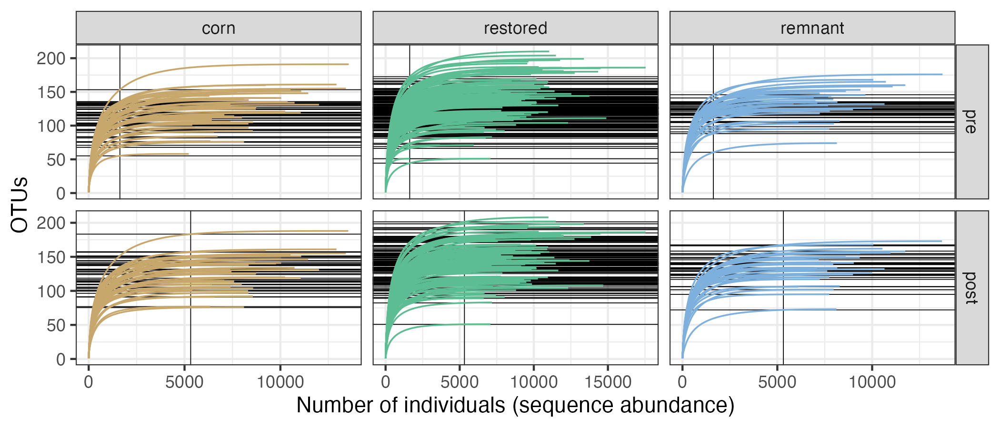
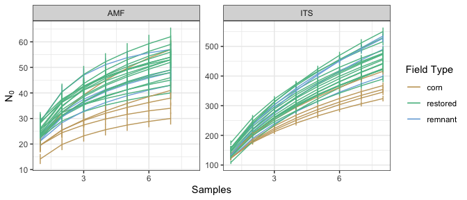
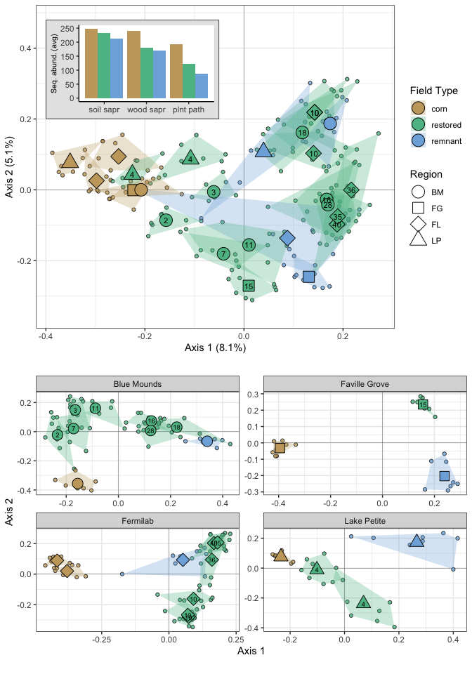
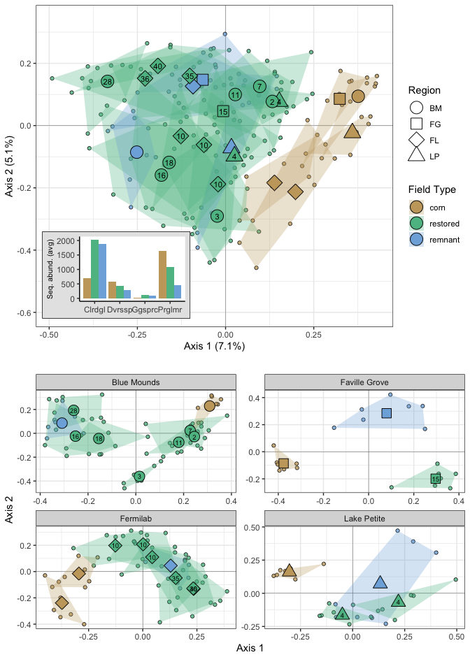
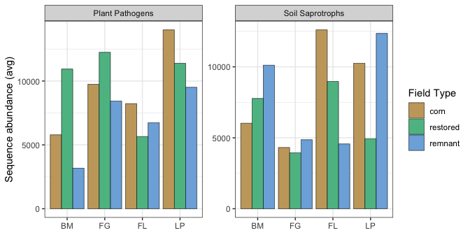

```{r setup, include=FALSE}
knitr::opts_chunk$set(echo = FALSE, tidy = TRUE, message = FALSE, warning = FALSE, fig.align = 'center')
```

```{r libraries}
packages_needed = c("tidyverse",
                    "png",
                    "knitr",
                    "conflicted",
                    "formatR")
packages_installed = packages_needed %in% rownames(installed.packages())
if (any(!packages_installed)) {
    install.packages(packages_needed[!packages_installed])
    }
for (i in 1:length(packages_needed)) {
    library(packages_needed[i], character.only = T)
}
conflict_prefer("filter", "dplyr")
conflict_prefer("select", "dplyr")
```

```{r data}
# Data that must be explicitly loaded for the summary. Most files will be accessed from the working directory. 
sites <- read_csv(paste0(getwd(), "/clean_data/sites.csv"), show_col_types = FALSE) %>%
    mutate(field_type = factor(field_type,ordered = TRUE, levels = c("corn", "restored", "remnant")),
           yr_since = replace(yr_since, which(field_type %in% c("remnant", "corn")), NA)) %>%
    select(-lat, -long, -yr_restore, -yr_rank) %>% 
    arrange(field_key)
```

# Introduction

The tallgrass prairie biome in North America is nearly extinct, creating a tremendous desire for restoration of this critical habitat. In the upper Midwest, interested landowners have attempted to convert previous agricultural fields (corn or soybeans, usually) to something that looks like prairie for decades. The consequences of this practice for soil biota are largely unknown. Agricultural practices filter fungal and bacterial communities for species that can tolerate extreme nutrient loads, frequent tillage, and poor plant diversity. When agricultural practices cease, and native perennial plants are introduced, soil biotic communities are again filtered by the new regime and rapidly change. What is the endpoint of these new communities? Do they begin to resemble communities in remnant prairie (the reference condition), or do they form novel communities, indicating a change of state in the system due to disturbance associated with agriculture? Are these communities' fates similar across distant regions, or is each context dependent?

# Description

The goal is to present results and discuss whether a path forward with these data exists. If so, we will determine the strategy that presents the best story, organization, and interpretation of these results. 

# Methods

## Sites

We visited fields in southern Wisconsin and at Fermilab, just west of Chicago, Illinois. Site descriptions and photos are available in this [field note](https://mpgcloud.egnyte.com/dl/39NPws0Z5l). The survey followed an unbalanced complete block design. Corn, restored, and remnant fields are compared, with at least one of each field type in each block. I have called blocks "regions". We collected samples and data from four regions (Fig \@ref(fig:site-map), left).  

```{r site-map,out.width="40%",fig.show="hold",fig.cap="(Left) Labels show centroids of regions used for this work. BM = Blue Mounds, FG = Faville Grove, FL = Fermilab, LP = Lake Petite. (Right) Labels show individual fields in the Blue Mounds region."}
include_graphics(c("site_locations_files/figure-gfm/site_map-1.png", "site_locations_files/figure-gfm/site_map_bm-1.png"))
```

## Design

The design is unbalanced because there are more restored fields than corn or remnant (table \@ref(tab:design-table)), and the count of restored fields differs among regions. In all but one case, only single corn and remnant fields were available in each region. This means that we only have replication to separate field types when using the entire block design.

```{r design-table}
kable(table(sites$region, sites$field_type),
      format = "pandoc",
      caption = "Count of fields by type and region:\nBM = Blue Mounds, FG = Faville Grove,\nFL = Fermilab, LP = Lake Petite")
```

A feature of our design is that restored fields vary in time since restoration, setting up the potential for a chronosequence in addition to the contrasts among corn, restored, or remnant fields. The rules for establishing a chronosequence are strict. We cannot call fields from all regions a chronosequence. The Blue Mounds region, which has seven restored fields in a relatively small geographic area, is our only opportunity to take advantage different field ages (Fig \@ref(fig:site-map), right), but we will likely have to call this a "pseudochronosequence" and avoid some inferences. Supporting our case in the Blue Mounds, mantel tests (not shown) failed to find correlations between soil variables and pairwise distance, giving us a little confidence that we're avoiding systemic bias. 

## Soil Fungal Communities

We collected soil cores from 10 haphazardly-selected locations in each field. Genomic DNA was extracted, and the lab and bioinformatics pipeline delivered community data from ITS or 18S regions clustered as 97% similar OTUs or 99% similar SVs. In preliminary work, inferences made with SVs were weaker but not qualitatively different. I continued with OTUs only.  

Originally, I had planned to average the sequence abundance per OTU in each field. In part, I did this for stastistical design reasons. Since fields are replicates, the samples in fields aren't independent. Also, explanatory and response data exist as one data point per field, meaning that they should not be expanded to apply singly to each sample. Finally, I didn't have the tools to account for this design in permutation tests. With available tools, I could only choose one "nesting" factor, but to include samples, I'd have to account for regions and fields as blocking elements when testing the design element of field type. Luckily, I've recently found a new tool, the function `how()` from package `permute`, that allows for more complicated permutation designs. I decided to proceed along parallel analysis paths: one with sample-level data, and one with field-level data.

Creating the sample-level data took some work. A few samples had failed to amplify, leaving some fields represented with 9 samples instead of 10. This unbalance, which is normally not a problem, became unacceptable for a couple of reasons. First, the permutations I had planned using function `how()` require balance at the plot (i.e., field) level. Also, some samples contained very few sequences compared with the others. Rarefying the entire dataset to these tiny depths would result in the loss of many admittedly low-abundance OTUs. To acheive a balanced count of samples per field and retain a higher rarefaction threshold, I used an iterative process to remove samples with few sequences, choosing a rarefaction cutoff near the plateau of OTU recovery at depth (Fig \@ref(fig:its-rcurve)). This ended up being 8 samples for ITS and 7 for 18S datasets. These sample sequence values were then rarefied and used as-is for sample-level data, or, when analyzing at the field level, sample sequence values were summed and rarefied. The resulting data files recovered many more OTUs, but didn't change any major interpretation of the data. The situation with 18S data is similar, but at a much lower total sequencing depth (not shown). 

```{r its-rcurve,out.width="100%",fig.cap="Individual-based rarefaction of ITS OTUs in subsamples when nine subsamples per field are retained (pre, top row) or when eight subsamples are retained (post, bottom row). Vertical lines show the minimum sequencing depth available across samples; this is the depth to which the entire set would be rarefied. Horizontal lines show the number of OTUs that would be recovered from each sample at that rarefaction depth."}

```

Species (OTU) accumulation was performed on field-level sums of sequences. Most fields were undersampled (Fig \@ref(fig:accum)), particularly remnant and restored fields (ITS) and corn and remnant fields (18S). 

```{r accum,out.width="100%",fig.cap="Species accumulations for rarefied sums of field sequences for ITS and 18S datasets. Species accumulation by the exact method; standard deviation (vertical lines) conditioned by the empirical dataset."}

```

## Plant data

Plant community data resulted from two independent surveys. In the Wisconsin regions, haphazard transects were established and 10 meter frames placed, with percent cover estimated for all species, resulting in a dataset with plant composition. Functional traits and natural history information for these plant species was compiled from multiple sources. Plant species were grouped according to traits and natural history, resulting in another dataset with plant abundance in functional groups. In Fermilab, plant surveys were only done in fields 1, 4, and 5 (none of the "switchgrass" fields), and relevé methods were used. This resulted in presence/absence data only. It doesn't make sense to think of the presence/absence of functional groups because they are nearly all present in all fields, so when fields from Fermilab are used in analyses, only plant community data are available. More information about the plant data, including preliminary analysis, is available in this [report](https://mpgcloud.egnyte.com/dl/MwvwVxhLZ6).

## Soil data

In the field, soil was pooled from 10 haphazardly-selected locations, mixed, and sampled once for soil chemical analysis. Soil data includes abiotic macro and micronutrients, organic carbon, and properties like pH. Average precipitation was determined for each field using PRISM climate data and is included with the soil data for constrained analyses. More information is available [here](https://mpgcloud.egnyte.com/dl/MwvwVxhLZ6).

## Design/site data

- Field type: corn, restored, remnant
- Field age: years since restoration (NA for corn and remnant)
- Region: blocks

## Response data
Also taken from the pooled soil in each field, one sample was taken for analysis of Water Stable Aggregates (I don't know who did this),
and one for quantification of microbial biomass. 

## Data sources, summary

- Fungal genomic data, ITS and 18S, OTU clusters
- Plant community data, composition in Wisconsin and presence/absence in Fermi
- Plant traits and natural history
   - Native status, photosystem, functional guild, lifecycle...
- Soil properties
- Fungal biomass (PLFA, NLFA)
- Water stable aggregates
- Site metadata and design

# Results

## Fungal communities

Fungal communities in cornfields stand apart from remnants and restored fields restored fields (Fig \@ref(fig:its-samps-pcoa)). As the age of restored fields increases, their distance from corn grows, and remnants lie in an intermediate position among restored fields. The high dimensionality here keeps the explanatory power of axes 1 & 2 low. Clusters based on field type were significant based on a permanova (with regions as blocks and subsamples held constant within fields, the replicate, table \@ref(tab:its-pcoa-permanova)). However, a pairwise post-hoc permutation failed to separate remnant fields from any other type (table \@ref(tab:its-pcoa-pairwise)). This is due partially to a low number of replicates, and it's also a problem with dispersion. The remnants are as distant from each other as they are from corn. I also attempted this using field-level data (not shown), and the p values were somewhat improved, but remnants still failed to separate from corn or restored fields.

```{r its-samps-pcoa,out.width="80%",fig.cap="The top panel is a PCoA ordination of samples in fields, ITS dataset. Small circular icons show locations of samples and hulls enclose fields. Each field is represented with a large icon on the field centroid, where icon shapes identify the field region and color identifies the field type. Text on the restored field icons shows years since restoration. The inset column chart displays average sequence abundance across all fields for the three most abundant fungal guilds. The lower four panels show independent db-PCoAs for each region."}
#+ fig:its_samps_unified_fig-1,echo=FALSE,fig.align='center',out.width="100%",fig.cap="ITS-based fungal communities, most abundant guilds inset."

```

```{r its-pcoa-permanova}
read_delim("microbial_communities_files/pcoa_its_samps_permanova.txt", show_col_types = FALSE) %>% 
kable(format = "pandoc", caption = "Permutation test under reduced model. Blocks: region, samples not permuted (not independent), number of permutations: 1999")
```

```{r its-pcoa-pairwise}
read_delim("microbial_communities_files/pcoa_its_samps_pairwise.txt", show_col_types = FALSE) %>% 
kable(format = "pandoc", caption = "Pairwise tests under reduced model. Blocks: region, samples not permuted (not independent), number of permutations: 1999, p values corrected after multiple tests using the Benjamini & Hochberg correction.")
```

AMF communities (18S data) showed qualitatively similar patterns to the ITS results (Fig \@ref(fig:amf-samps-pcoa)), but with weaker support (tables \@ref(tab:amf-pcoa-permanova) & \@ref(tab:amf-pcoa-pairwise)). 

```{r amf-samps-pcoa,out.width="80%",fig.cap="The top panel is a PCoA ordination of samples in fields, 18S dataset. Small circular icons show locations of samples and hulls enclose fields. Each field is represented with a large icon on the field centroid, where icon shapes identify the field region and color identifies the field type. Text on the restored field icons shows years since restoration. The inset column chart displays average sequence abundance across all fields for the most variable taxa (Claroideoglomeraceae, Diversisporaceae, Gigasporaceae, and Paraglomeraceae) The lower four panels show independent db-PCoAs for each region."}

```

```{r amf-pcoa-permanova}
read_delim("microbial_communities_files/pcoa_amf_samps_permanova.txt", show_col_types = FALSE) %>% 
kable(format = "pandoc", caption = "Permutation test under reduced model. Blocks: region, samples not permuted (not independent), number of permutations: 1999")
```

```{r amf-pcoa-pairwise}
read_delim("microbial_communities_files/pcoa_amf_samps_pairwise.txt", show_col_types = FALSE) %>% 
kable(format = "pandoc", caption = "Pairwise tests under reduced model. Blocks: region, samples not permuted (not independent), number of permutations: 1999, p values corrected after multiple tests using the Benjamini & Hochberg correction.")
```

## Fungal diversity

```{r its-div,out.width="80%",fig.cap="Counts of ITS OTUs are shown for richness and Shannon's and Simpson's diversity in all field types. Differences in means among field types were tested with mixed-effects linear models where region was coded as a random effect. Post-hoc comparisions are Tukey contrasts and letters show significant differences at p<0.05."}
include_graphics("microbial_diversity_files/figure-gfm/div_its_box-1.png")
```

Species richness, Shannon's, and Simpson's diversity are lowest in cornfields, and the trend is an increase in all indices through restored and remnant fields (Fig \@ref(fig:its-div)). These differences are significant for Richness and Shannon's diversity, with cornfields being significnatly lower than either remnants or restored fields, which were not significantly different. Index values were more variable for restored fields than for other field types, which insults prerequisite needs for equal variance among groups. 

Trends in diversity were similar in Blue Mounds, Faville Grove, and Fermilab, but at Lake Petite, Shannon's and Simpson's diversity indices were much higher than in cornfields or remnants (not shown), indicating that a sizeable percentage of OTUs were in relatively equal abundance there compared with other sites. This may partially be because the restored fields at Lake Petite are both young and haven't had time to develop the long tail of rarer species which characterizes most older habitats and tends to lower Shannon's and Simpson's index values. 

```{r amf-div,out.width="80%",fig.cap="Counts of AMF OTUs are shown for richness and Shannon's and Simpson's diversity in all field types. Differences in means among field types were tested with mixed-effects linear models where region was coded as a random effect. Post-hoc comparisions are Tukey contrasts and letters show significant differences at p<0.05."}
include_graphics("microbial_diversity_files/figure-gfm/div_amf_box-1.png")
```

With AMF, trends in diversity largely matched those of soil fungi in general. Species richness showed a mild interaction, where it was highest in restored fields for Blue Mounds and Faville Grove, and in remnants for Fermilab and Lake Petite. Shannon's and Simpson's indices increased from corn through restored and remnant fields for all regions. 

For both soil fungi and AMF, diversity indices were significantly lower for corn but not between restored and remnant fields, suggesting a similarity between the latter. 

## Fungal guilds

```{r guild-abund}
read_csv("microbial_guild_taxonomy_files/guilds.csv", show_col_types = FALSE) %>% 
kable(caption = "Average sequence abundances per field in each field type are shown for the top six guilds. A linear mixed model was used to separate means in field types and letters indicate significant differences based on Tukey's post-hoc test of that model at p<0.05.", format = "pandoc")
```

Pathogen and saprotroph guilds are the most numerous in this dataset (table \@ref(tab:guild-abund)). Compared with the sequence abundance in the unidentified group, plant pathogens and soil saprotrophs are abundant enough to feel somewhat confident about in terms of coverage. I would have predicted soil saprotrophs to be lowest in cornfields (which have the least organic material), increasing in restored fields, and highest in remnants. With pathogens, I would have predicted the highest abundance in cornfields (due to the plant monoculture and high nutrients), lowest in restored fields (many plant species and less time for specialists to accumulate), and intermediate in remnants (high plant diversity and the presence of antagonistic fungi, but perennial plants in place to be attacked for decades). Instead, we found that the abundance of most guilds is highest in cornfields, intermediate in restored fields, and lowest in remnants.  

```{r ssap-ppat-comp,out.width="40%",fig.show="hold",fig.cap="Composition of soil saprotroph (left) and plant pathogen (right) orders are shown across field types. Unidentified taxa were not included, and low abundance OTUs were filtered, see legends for the cutoff percentage."}
include_graphics(c("microbial_guild_taxonomy_files/figure-gfm/ppat_comp_plot-1.png", "microbial_guild_taxonomy_files/figure-gfm/ssap_comp_plot-1.png"))
```

At the level of taxonomic order, composition of soil saprotrophs in corn fields looks different from restored and remnant fields (Fig \@ref(fig:ssap-ppat-comp), left). Among well-represented orders, Agarics increase from corn to remnant, Cystofilobasidiales are prevalent only in corn, and Filobasidiales, often human pathogens, decline from corn to remnant. Geoglossales, which are associated with woodlands, moss, grasslands, probably don't like tillage or lack of substrate in cornfields and aren't found there. The order Hypocreales only occurs in restored and remnant fields. OTUs identified as Mortierellales are abundant in corn and restored fields, less so in remnants, with different OTUs associated with different field types. The contrast among field types with plant pathogens isn't obvious (Fig \@ref(fig:ssap-ppat-comp), right). The orders Glomerales, Hypocreales, and Pleosporales were the most abundant.

### Trends in regions

Within regions, trends in abundance were also apparent for soil saprotrophs and plant pathogens, but these trends weren't consistent among regions (Fig \@ref(fig:guilds-regions)). The abundance of soil saprotrophs in restored fields falls between corn and remnant fields in Blue Mounds and Fermilab, indicating that restored fields become more like remnants, but these trends are in opposite directions. In Lake Petite, the abundance of soil saprotrophs is much lower than in corn or remnant fields, indicating little resemblance to either. In Faville Grove, soil saprotroph abundance is similar in all field types. Pathogen abundance is similarly inconsistent. In Blue Mounds and Faville Grove, pathogens spike in remnants and are lowest in remnants. At Fermilab, pathogens are instead lowest in restored fields. In Lake Petite, pathogens are highest in cornfields (which I would have predicted across the board), and decline from restored to remnant fields. 

```{r guilds-regions,out.width="80%",fig.cap="Soil saprotroph and pathogen guilds across field types, regional trends. Values are average sequence abundance in fields. No symbols of variance are shown because corn and remnant fields have only one replicate in most regions."}

```

### Trends over time

```{r guild-time,out.width="80%",fig.cap="Icons show sums of ITS sequences in each restored field from the Blue Mounds region. Plant pathogen abundance decines with years since restoration (left, $R^2_{Adj}=0.75,~p=0.013$). Soil saprotroph abundance increases with years since restoration (right, $R^2_{Adj}=0.54,~p=0.037$), although leverage of the most extreme value is apparent."}
include_graphics("microbial_guild_taxonomy_files/figure-gfm/ssap_ppat_bm_trends-1.png")
```

Contrary to predictions, plant pathogens show a strong decline from young to old restorations in the Blue Mounds region (Fig \@ref(fig:guild-time), left). Pathogen abundance reaches a low of 5,233 sequences in the 28 year old field, which is lower than we found in the cornfield (5,822), though not as low as we found in the remnant (3,104). Aligned with predictions, soil saprotrophs increased with time in Blue Mounds' restored fields (Fig \@ref(fig:guild-time), right). Again, this increase is trending in the right direction, away from the cornfield's abundance of 5,950, reaching a high of 14,147 in the 28 year old field, which exceeds the remnant's abundance of 10,145. 

### Indicator species

OTUs from saprotroph and pathogen guilds were also heavily represented in an analysis to find indicator species for each field type. Note that the indicator species analysis is flawed because of the unbalanced number of fields for each field type. It's easier for a species to be detected in five cornfields than in sixteen restored fields, for example. I'd argue that as a basic filter to find interesting species, this analysis is acceptable if we don't try to call these species "indicators" of a particular habitat. 

### Natural history

I filtered indicator species to those which were identified to at least the genus level. Saprotrophs associated with cornfields tended to be disturbance-tolerant extremophiles, in particular, tolerating very cold environments. Some are known to produce suites of extracellular enzymes, exploting various nutrient sources (*Tausonia pullulans*) and making recalcitrant nutrients available to plants (*Mortierella minutissima*, which is used as an agricultural inoculant). *Pseudaleuria sp.* was also associated with cornfields. Species in this genus are suspected to increase crop yields and protect plants from disease. The only saprotroph associated with restored fields was another species in the genus *Mortierella*. Remnants hosted few indicator species. OTUs identified as *Gymnostellatospora sp.* and *Striaticonidium cinctum* appear to have little natural history information. An OTU in the genus *Clavaria* is a coral fungus, associated with woodland, savanna, or old-field habitats worldwide. 

Not surprisingly, most pathogenic taxa associated with cornfields are known agricultural pathogens, including *Corynespora cassiicola*, *Curvularia sp.*, *Plectosphaerella cucumerina*, and *Setophoma terrestris*. *Microdochium colombiense*, a snow mold of rye and other cereal grains, is also an extreme cold tolerant species. In restored fields, an indicator pathogen was a *Pseudopithomyces sp.*, which is often found in anthropogenic environments and is a known wheat pathogen.

Natural history details about indicator fungi could make this paper more compelling, but the best value for such an analysis here is to show whether restored fields look more like cornfields, more like remnants, or more like something else entirely. But only 36% of these OTUs were assigned to a guild and 46% were assigned to a genus. It's likely that many saprotrophs and pathogens exist in these data that are opaque to our analysis. We'd have to assume that these unassigned taxa are distributed equally across field types, but this assumption is likely invalid because agricultural systems have received much more attention. Recovery of crop-associated fungi in restored fields probably reflects this bias as much as it shows a similarity with cornfield fungi. With few taxa identified in remnant fields, there's not much to compare with restored fields. Finally, very abundant OTUs tended to be commonly distributed, but all of these indicator OTUs occur in low abundance. Are they relevant to ecological processes in these fields? It's hard to say.

If natural history details are included, I think the most important case studies will come from these taxa: 

1. Mortierella
    - Cornfields mostly, lots known about them, they have interesting physiology
1. Stagnospora
    - Aligns restored and remnant
1. Pseudopithomyces
    - Aligns corn and restored
1. Clavaria
    - Aligns restored and remnant
1. Microscypha/DSE
    - proposed mycorrhizae, in all remnants and 4 restored

## AMF taxa

```{r family-abund}
read_csv("microbial_guild_taxonomy_files/families.csv", show_col_types = FALSE) %>% 
kable(caption = "Average 18S sequence abundances per field in each field type are shown for the top five families. A linear mixed model was used to separate means in field types and letters indicate significant differences based on Tukey's post-hoc test of that model at p<0.05.", format = "pandoc")
```

Within the 18S dataset (AMF), taxa in the *Glomeraceae* are most abundant (\@ref(tab:family-abund)). As far as I know, these tend to be generalist taxa and are widespread. In this case, they do not differ in abundance among field types. Abundances fall off quickly for other taxa, with *Claroideoglomeraceae* and *Paraglomeraceae* an order of magnitude lower than the *Glomeraceae*, and *Gigasporaceae* abundance only 0.5% as much[^1]. Differences among corn and restored fields are significant for the *Claroideoglomeraceae*, where they are lowest in corn and highest in restored fields (\@ref(tab:family-abund)). The abundance of these taxa in remnants doesn't separate due to large within-group variance, but the mean for remnants is closer to restored fields. Despite their small overall abundance, taxa in the *Gigasporaceae* showed a strong, increasing relationship with years since restoration in the Blue Mounds' restored fields (\@ref(fig:gigatime)). 

[^1]: Ylva, I'm hoping that you can help me with the natural history and interpreting how abundant these taxa must be to matter in this system.

```{r gigatime,out.width="50%",fig.cap="Icons show sums of 18S sequences in each restored field from the Blue Mounds region. The abundance of taxa in the \\textit{Gigasporaceae} increase with years since restoration ($R^2_{Adj}=0.61,~p=0.023$)."}
include_graphics("microbial_guild_taxonomy_files/figure-gfm/giga_seq_abund_years-1.png")
```

## Environmental constraints on fungal communities

We want to know how environmental/explanatory variables like soil chemistry, precipitation, and plant communities affect change in soil microbes among sites. But which sites? Constraining variables would undoubtedly find that soil nutrients explained differences between corn and restored or remnant fields, but this is hardly an interesting result. More worthwhile would be to constrain on restored fields and test whether years since restoration aligns fields in a relatively linear manner. Discovering if other explanatory variables constrain the data in a similar direction to years since restoration would be a wonderful outcome, because we'd learn what it is in the soil abiotic environment that's correlated with microbial community change.

Since the Blue Mounds restored fields are the most amenable to chronosequence methodology, I started there. With only seven fields, the available number of permutations was low, and with axes defined by very weak effects already, no significant constraining variables were found. Although reviewers may object, I decided that the only way forward was to use restored fields from other regions, breaking the rules of chronosequence analysis. Since the regions' soils and other environmental characteristics are so different, I parsed some out as covariables in a partial db-RDA (covariables: pH, SO4, Zn, Fe, Mn, Cu, Ca, Mg, Na, precipitation). I retained the soil nutrients N, P, and K as test variables because they were undoubtedly applied to cornfields and would decrease rapidly after agricultural practice ceased. I kept soil organic matter (OM) as a test variable too because it should be low in cornfields and increase after tillage ceases and mycotrophic, perennial plant species establish. I also included plant traits or plant community axes as test variables. Finally, I used years since restoration (yr_since) as a test variable. For the analysis, I first ran forward selection on regions in Wisconsin only because that's where we have plant composition data. Then, I ran forward selection with explanatory variables on all regions, using plant presence/absence axes only[^2].

[^2]: The switchgrass fields at Fermilab could not be included because no plant data exists for these fileds.

## Constrained analysis

### Wisconsin regions, plant traits data

The soil data used as covariables in this analysis explained 24% of the variation among sites. Explanatory variables were weaker at 17% and 59% of the variation remains unexplained by these data. Years since restoration was the only variable that significantly correlated with turnover in soil fungal communities, and the relationship was weak ($R^2_{Adj}=0.09,~p=0.018$). The abundance of C4 grasses increased, and the abundance of forbs decreased, with years since restoration. Because these variables were highly collinear with years since restoration, they were eliminated in forward selection, but they likely help explain a change over time that's associated with fungal community turnover (Fig \@ref(fig:dbRDA-wi)). 

```{r dbRDA-wi,fig.width=5,fig.height=4,fig.cap="Results of a distance-based redundancy analysis of soil fungal community composition in restored fields in Wisconsin regions. Icons represent the constrained locations of fields. Solid blue arrows show the direction and strength of associations between communities and explanatory variables. Dotted blue arrows show correlations with strong, but non-significant explanatory variables. Axis 1 is significant based on 1999 permutations at p=0.011."}
wi_sc <- read_csv("tgr_constrained_files/wi_tr_its_sitelocs.csv", show_col_types = FALSE) %>% 
        left_join(sites, by = join_by(field_name))
wi_bp <- read_csv("tgr_constrained_files/wi_tr_its_bp.csv", show_col_types = FALSE) %>% 
        mutate(
            origin = 0,
            m = dbRDA2 / dbRDA1, 
            d = sqrt(dbRDA1^2 + dbRDA2^2), 
            dadd = sqrt((max(dbRDA1)-min(dbRDA2))^2 + (max(dbRDA2)-min(dbRDA2))^2)*0.1,
            labx = ((d+dadd)*cos(atan(m)))*(dbRDA1/abs(dbRDA1)), 
            laby = ((d+dadd)*sin(atan(m)))*(dbRDA1/abs(dbRDA1)))
ggplot(wi_sc, aes(x = dbRDA1, y = dbRDA2)) + 
    geom_vline(xintercept = 0, linewidth = 0.1) +
    geom_hline(yintercept = 0, linewidth = 0.1) +
    geom_segment(data = wi_bp, 
                 aes(x = origin, xend = dbRDA1, y = origin, yend = dbRDA2), 
                 arrow = arrow(angle = 20, length = unit(3, "mm"), type = "closed"),
                 color = "blue", linetype = c(1,3,3)) +
    geom_point(aes(shape = region), fill = "#5CBD92", size = 3) +
    geom_text(data = wi_bp, 
              aes(x = labx, y = laby, label = envvar),
              nudge_x = c(0.2, 0, 0.2),
              color = "blue") +
    scale_shape_manual(name = "Region", values = c(21, 22, 24)) +
    labs(x = "dbRDA axis 1 (17%)", y = "MDS axis 1 (23%)", ) +
    theme_bw()

```


### All regions, plant presence/absence data

Adding restored fields from Fermilab to the analysis changes little of the result. The soil data used as covariables explained 19% of the variation among sites. Explanatory variables were weaker at 16% and 65% of the variation remains unexplained by these data.  Years since restoration was the only significant explanatory variable ($R^2_{Adj}=0.11,~p=0.001$). Again, a few variables were collinear with years since restoration and were eliminated during forward selection. These variables reflect the addition of fields from Fermilab more than they help explain change over time in restored fields. Vectors for soil organic matter and potassium point towards Fermilab fields, which are richer and have a very different natural history (wet meadows). The alignment of plant PCoA axis 1 in opposition to Fermilab fields reflects that plant communities used in restoration were very different there (Fig \@ref(fig:dbRDA-all)).   

```{r dbRDA-all,fig.width=5,fig.height=4,fig.cap="Results of a distance-based redundancy analysis of soil fungal community composition in restored fields from all regions. Icons represent the constrained locations of fields. Solid blue arrows show the direction and strength of associations between communities and explanatory variables. Dotted blue arrows show correlations with strong, but non-significant explanatory variables. Axis 1 is significant based on 1999 permutations at p=0.008."}
all_sc <- read_csv("tgr_constrained_files/all_its_sitelocs.csv", show_col_types = FALSE) %>% 
        left_join(sites, by = join_by(field_name))
all_bp <- read_csv("tgr_constrained_files/all_its_bp.csv", show_col_types = FALSE) %>% 
        mutate(
            origin = 0,
            m = dbRDA2 / dbRDA1, 
            d = sqrt(dbRDA1^2 + dbRDA2^2), 
            dadd = sqrt((max(dbRDA1)-min(dbRDA2))^2 + (max(dbRDA2)-min(dbRDA2))^2)*0.1,
            labx = ((d+dadd)*cos(atan(m)))*(dbRDA1/abs(dbRDA1)), 
            laby = ((d+dadd)*sin(atan(m)))*(dbRDA1/abs(dbRDA1)))
ggplot(all_sc, aes(x = dbRDA1, y = dbRDA2)) + 
    geom_vline(xintercept = 0, linewidth = 0.1) +
    geom_hline(yintercept = 0, linewidth = 0.1) +
    geom_segment(data = all_bp, 
                 aes(x = origin, xend = dbRDA1, y = origin, yend = dbRDA2), 
                 arrow = arrow(angle = 20, length = unit(3, "mm"), type = "closed"),
                 color = "blue", linetype = c(1,3,3,3)) +
    geom_point(aes(shape = region), fill = "#5CBD92", size = 3) +
    geom_text(data = all_bp, 
              aes(x = labx, y = laby, label = envvar),
              nudge_x = c(0.1,0,0,0),
              color = "blue") +
    scale_shape_manual(name = "Region", values = c(21, 22, 23, 24)) +
    lims(x = c(-1,1.2)) +
    labs(x = "dbRDA axis 1 (16%)", y = "MDS axis 1 (29%)", ) +
    theme_bw()
```

### AMF

Strangely, the results are nearly identical with AMF communities. Years since restoration was the only significant constraining variable, but relationships were weak. Supporting, but non-significant, explanatory variables were the same.

## Response variables

We measured water stable aggregates (wsa) and fungal biomass. I think of these as responses to restoration. With the planting of diverse, perennial plant communities, it follows that fungal diversity and particularly the abundance of AMF would increase. My prediction was that cornfields would have the lowest percent wsa, and that these values would increase through restorations, approaching the highest values in remnants. I didn't know what to think about fungal biomass. The bonanza of nutrients in cornfields could support high biomass, despite the low diversity that we detected. This comes down to whether the diversity-productivity relationship has any value in this case. 

Water stable aggregates were highly variable in restored[^3] and remnant fields, but they were highest on average in restorations (Fig \@ref(fig:wsa), left). In Lake Petite, wsa was highest in cornfields, lower in restorations, and lowest in the remnant, but in all other regions, cornfields were lowest, restorations were highest, and remnants were intermediate (Fig \@ref(fig:wsa), right). There was no relationship with years since restoration for wsa. Wsa were not related to any of the constrained axes shown previously either.

[^3]: Phil, it's noteworthy that fields in Lake Petite had very low wsa and soil organic matter, even lower than many cornfields. Surprisingly, wsa was even lower in the remnant, suggesting that we have poor soil conditions across the board in the hard, poor soil of Lake Petite. Maybe this will improve with time, but it's possible that some amendments would help, like liquid carbon applications. 

```{r wsa,out.width="40%",fig.show="hold",fig.cap="(Left) Boxplots show distributions and quartiles of percent water stable aggregates. Icons show field values. A linear mixed model was used to separate means in field types and letters indicate significant differences based on Tukey's post-hoc test of that model at p<0.05. (Right) Trends in each region are shown, with small icons representing individual fields and large icons representing regional means for each field type."}
include_graphics(c("soil_wsa_files/figure-gfm/wsa_regions_fieldtypes_fig-1.png", "soil_wsa_files/figure-gfm/wsa_visual_fig-1.png"))
```

Biomass of AMF and soil fungi showed a qualitatively similar pattern with wsa. Values were highest in restored fields, lowest in cornfields, and intermediate in remnants. In the Blue Mounds region, biomass of AMF is highest in recently restored fields, and it falls over time, approaching the relatively low value found in the remnant. 

```{r fa,out.height="180px",fig.show="hold",fig.cap="(Left panels) Boxplots show distributions and quartiles of AMF and soil fungal biomass. Icons show field values. (Right panel) Icons show values of AMF biomass regressed against years since restoration. Icons show field values from restored fields in the Blue Mounds region. $R^2_{Adj}=0.52,~p=0.041$."}
include_graphics(c("microbial_biomass_files/figure-gfm/fa_boxplot-1.png", "microbial_biomass_files/figure-gfm/fa_amf_yrs-1.png"))
```


# Discussion


planting strategies confound
guilds overrepresented in ag
remnants aren't high quality


