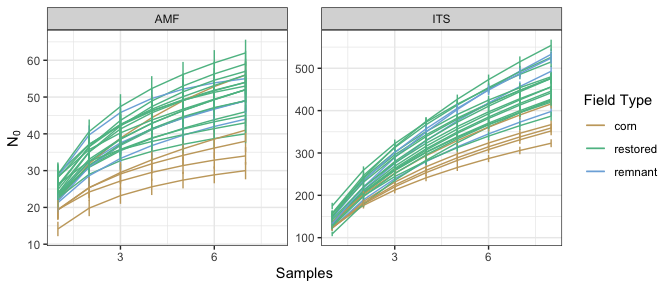
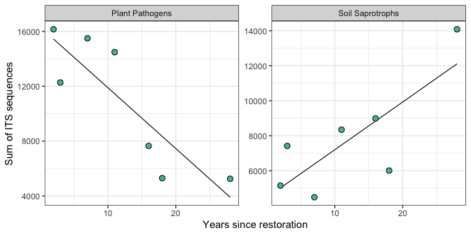
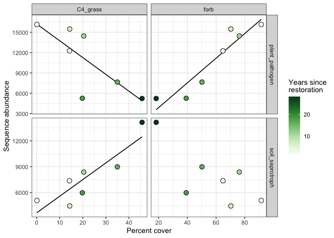

```{r setup, include=FALSE}
knitr::opts_chunk$set(echo = FALSE, tidy = TRUE, message = FALSE, warning = FALSE, fig.align = 'center')
```

```{r libraries}
packages_needed = c("tidyverse",
                    "png",
                    "knitr",
                    "conflicted",
                    "formatR",
                    "car",
                    "GGally")
packages_installed = packages_needed %in% rownames(installed.packages())
if (any(!packages_installed)) {
    install.packages(packages_needed[!packages_installed])
    }
for (i in 1:length(packages_needed)) {
    library(packages_needed[i], character.only = T)
}
conflict_prefer("filter", "dplyr")
conflict_prefer("select", "dplyr")
```

```{r data}
# Data that must be explicitly loaded for the summary. Most files will be accessed from the working directory. 
sites <- read_csv(paste0(getwd(), "/clean_data/sites.csv"), show_col_types = FALSE) %>%
    mutate(field_type = factor(field_type,ordered = TRUE, levels = c("corn", "restored", "remnant")),
           yr_since = replace(yr_since, which(field_type %in% c("remnant", "corn")), NA)) %>%
    select(-lat, -long, -yr_restore, -yr_rank) %>% 
    arrange(field_key)
```

# Introduction

The tallgrass prairie biome in North America is nearly extinct, prompting a significant interest in its restoration. In the upper Midwest, landowners have been converting former agricultural fields, mainly corn or soybeans, into prairie-like landscapes for several decades. However, the impact of this conversion on soil biota remains largely unknown. Before restoration, agricultural practices had shaped fungal and bacterial communities, favoring species resilient to high nutrient loads, frequent tillage, and low plant diversity. With the cessation of agriculture and the introduction of native perennial plants, the soil biotic communities undergo rapid changes, guided by the new conditions. The crucial question is whether these new communities eventually resemble those in remnant prairies (the reference condition), or if they form unique communities, indicating a system state change due to the agricultural legacy. Additionally, understanding whether these community outcomes are context-dependent or consistent across distant regions is essential.

# Description

The goal is to present results and discuss whether a path forward with these data exists. If so, we will determine the strategy that presents the best story, organization, and interpretation of these results.

# Methods

## Sites

We visited fields in southern Wisconsin and at Fermilab, just west of Chicago, Illinois. Site descriptions and photos are available in this [field note](https://mpgcloud.egnyte.com/dl/39NPws0Z5l). The survey followed an unbalanced complete block design. Corn, restored, and remnant fields are compared, with at least one of each field type in each block. I have called blocks "regions". We collected samples and data from four regions (Fig \@ref(fig:site-map), left).  

```{r site-map,out.width="40%",fig.show="hold",fig.cap="(Left) Labels show centroids of regions used for this work. BM = Blue Mounds, FG = Faville Grove, FL = Fermilab, LP = Lake Petite. (Right) Labels show individual fields in the Blue Mounds region."}
include_graphics(c("site_locations_files/figure-gfm/site_map-1.png", "site_locations_files/figure-gfm/site_map_bm-1.png"))
```

## Design

The design is unbalanced due to a higher number of restored fields compared to corn or remnant fields (see Table \@ref(tab:design-table)). The count of restored fields also varies across regions, and all regions but one have a single corn and remnant field. Consequently, field types cannot be statistically differentiated within regions. This can only be done using the full block design.

```{r design-table}
kable(table(sites$region, sites$field_type),
      format = "pandoc",
      caption = "Count of fields by type and region:\nBM = Blue Mounds, FG = Faville Grove,\nFL = Fermilab, LP = Lake Petite")
```

A feature of our design is that restored fields exhibit variation in time since restoration, potentially forming a chronosequence alongside the contrasts among field types. The rules for establishing a chronosequence are strict, limiting our ability to label fields from all regions as such. In the Blue Mounds region, where seven restored fields exist in close proximity (see Fig \@ref(fig:site-map), right), we can capitalize on differing field ages, though we may categorize this as a "pseudochronosequence", necessitating caution in certain inferences. Supporting this designation in the Blue Mounds, mantel tests (not shown) found no correlations between soil variables and pairwise distance, providing some confidence in avoiding systematic bias.

## Soil Fungal Communities

We collected soil cores from 10 randomly selected locations in each field. Genomic DNA extraction, along with the lab and bioinformatics pipeline, provided community data from ITS or 18S regions, clustered as 97% similar operational taxonomic units (OTUs) or 99% similar sequence variants (SVs). Preliminary work indicated slightly weaker inferences with SVs but no qualitative differences. I proceeded with OTUs exclusively.

Originally, I had intended to average sequence abundance per OTU in each field because fields are replicates in this design, and samples from fields aren't independent. Further, the explanatory and response data are represented as one data point per field, restricting expansion to individual samples. Recently, I found new tool — the `how()` function from the `permute` package — that accounts for non-independent samples and blocks in the permutation design. I proceeded along parallel analysis paths: one with sample-level data and one with field-level data.

Creating sample-level data required addressing failed amplifications in a few samples, resulting in some fields having 9 instead of 10 samples. This imbalance, normally not an issue, became problematic for planned permutations using the `how()` function. It requires balance at the field level. Additionally, some samples contained very few sequences. To achieve a balanced sample count per field and maintain a higher rarefaction threshold, I used an iterative process. I sequentially removed samples with few sequences, using a rarefaction cutoff near the plateau of OTU recovery at depth (see Fig \@ref(fig:its-rcurve)) as a cut-off point. This resulted in 8 samples for ITS and 7 for 18S datasets. The sample sequence values were then rarefied and used as-is for sample-level data or, at the field level, summed and rarefied. The resulting data files recovered more OTUs without altering major data interpretations. 

```{r its-rcurve,out.width="100%",fig.cap="Individual-based rarefaction of ITS OTUs in subsamples when nine subsamples per field are retained (pre, top row) or when eight subsamples are retained (post, bottom row). Vertical lines show the minimum sequencing depth available across samples; this is the depth to which the entire set would be rarefied. Horizontal lines show the number of OTUs that would be recovered from each sample at that rarefaction depth."}
include_graphics("microbial_diagnostics_post_files/its_rarecurve_compare.png")
```

Species (OTU) accumulation was performed on field-level sums of sequences. Most fields were undersampled (Fig \@ref(fig:accum)), particularly remnant and restored fields (ITS) and corn and remnant fields (18S). 

```{r accum,out.width="100%",fig.cap="Species accumulations for rarefied sums of field sequences for ITS and 18S datasets. Species accumulation by the exact method; standard deviation (vertical lines) conditioned by the empirical dataset."}

```

## Plant data

Plant community data resulted from two independent surveys. In the Wisconsin regions, haphazard transects were established and 10 meter frames placed, with percent cover estimated for all species. Thus, the Wisconsin regions have plant composition data. Functional traits and natural history information for these plant species was compiled from multiple sources. Plant species were grouped according to traits and natural history, resulting in another dataset with plant abundance in functional groups. In Fermilab, plant surveys were only done in fields 1, 4, and 5 (none of the "switchgrass" fields), and relevé methods were used. This resulted in presence/absence data only. It doesn't make sense to think of the presence/absence of functional groups because they are nearly all present in all fields, so when fields from Fermilab are used in analyses, only plant community data are available. More information about the plant data, including preliminary analysis, is available in this [report](https://mpgcloud.egnyte.com/dl/MwvwVxhLZ6).

## Soil data

In the field, soil was pooled from 10 haphazardly-selected locations, mixed, and sampled once for soil chemical analysis. Soil data includes abiotic macro and micronutrients, organic carbon, and properties like pH. Average precipitation was determined for each field using PRISM climate data and is included with the soil data for constrained analyses. More information is available [here](https://mpgcloud.egnyte.com/dl/MwvwVxhLZ6).

## Response data
Also taken from the pooled soil in each field, one sample was taken for analysis of Water Stable Aggregates (wsa)[^1], and one for quantification of microbial biomass. 

[^1]: Ylva, I'm not sure who quantified wsa for us on this...

## Design/site data

- Field type: corn, restored, remnant
- Field age: years since restoration (NA for corn and remnant)
- Region: blocks

## Data sources, summary

- Fungal genomic data, ITS and 18S, OTU clusters
- Plant community data, composition in Wisconsin and presence/absence in Fermi
- Plant traits and natural history
   - Native status, photosystem, functional guild, lifecycle...
- Soil properties
- Fungal biomass (PLFA, NLFA)
- Water stable aggregates
- Site metadata and design

# Results

## Fungal communities

Fungal communities in cornfields are distinct from remnants and restored fields (Fig \@ref(fig:its-samps-pcoa)). As the age of restored fields increases, their communities become more distant from cornfields, with remnants occupying an intermediate position. High dimensionality limits the explanatory power of axes 1 & 2 and isn't concerning. Clusters based on field type were statistically significant in a permanova (with regions as blocks and subsamples held constant within fields, Table \@ref(tab:its-pcoa-permanova)). Nevertheless, a pairwise post-hoc permutation failed to distinguish remnant fields from any other type (Table \@ref(tab:its-pcoa-pairwise)). This is partly due to a low number of replicates and high within-group dispersion, where remnant fields are as distant from each other as they are from corn. Attempting the same analysis with field-level data (not shown) yielded somewhat improved p-values, but remnants still did not separate from corn or restored fields. Similar patterns were observed in AMF communities (see Fig \@ref(fig:amf-samps-pcoa)), but with weaker support (Tables \@ref(tab:amf-pcoa-permanova) & \@ref(tab:amf-pcoa-pairwise)).

\  

```{r its-samps-pcoa,out.width="80%",fig.cap="The top panel is a PCoA ordination of samples in fields, ITS dataset. Small circular icons show locations of samples and hulls enclose fields. Each field is represented with a large icon on the field centroid, where icon shapes identify the field region and color identifies the field type. Text on the restored field icons shows years since restoration. The inset column chart displays average sequence abundance across all fields for the three most abundant fungal guilds. The lower four panels show independent db-PCoAs for each region."}
#+ fig:its_samps_unified_fig-1,echo=FALSE,fig.align='center',out.width="100%",fig.cap="ITS-based fungal communities, most abundant guilds inset."
include_graphics("microbial_communities_files/figure-gfm/its_samps_unified_fig-1.png")
```


```{r its-pcoa-permanova}
read_delim("microbial_communities_files/pcoa_its_samps_permanova.txt", show_col_types = FALSE) %>% 
    mutate(across(2:4, \(x) round(x, 3)), across(5, \(x) format(round(x, 4), scientific = FALSE))) %>% 
    kable(format = "pandoc", caption = "Permutation test under reduced model for PCoA of soil fungi. Blocks: region, samples not permuted (not independent), number of permutations: 1999")
```


```{r its-pcoa-pairwise}
read_delim("microbial_communities_files/pcoa_its_samps_pairwise.txt", show_col_types = FALSE) %>% 
kable(format = "pandoc", caption = "Pairwise tests under reduced model for PCoA of soil fungi. Blocks: region, samples not permuted (not independent), number of permutations: 1999, p values corrected after multiple tests using the Benjamini & Hochberg correction.")
```


```{r amf-samps-pcoa,out.width="80%",fig.cap="The top panel is a PCoA ordination of samples in fields, 18S dataset. Small circular icons show locations of samples and hulls enclose fields. Each field is represented with a large icon on the field centroid, where icon shapes identify the field region and color identifies the field type. Text on the restored field icons shows years since restoration. The inset column chart displays average sequence abundance across all fields for the most variable taxa (Claroideoglomeraceae, Diversisporaceae, Gigasporaceae, and Paraglomeraceae) The lower four panels show independent db-PCoAs for each region."}
include_graphics("microbial_communities_files/figure-gfm/amf_samps_unified_fig-1.png")
```

\  

```{r amf-pcoa-permanova}
read_delim("microbial_communities_files/pcoa_amf_samps_permanova.txt", show_col_types = FALSE) %>% 
kable(format = "pandoc", caption = "Permutation test under reduced model for PCoA of AMF. Blocks: region, samples not permuted (not independent), number of permutations: 1999")
```


```{r amf-pcoa-pairwise}
read_delim("microbial_communities_files/pcoa_amf_samps_pairwise.txt", show_col_types = FALSE) %>% 
kable(format = "pandoc", caption = "Pairwise tests under reduced model for PCoA of AMF. Blocks: region, samples not permuted (not independent), number of permutations: 1999, p values corrected after multiple tests using the Benjamini & Hochberg correction.")
```

\newpage

## Fungal diversity

```{r its-div,out.width="80%",fig.cap="Counts of ITS OTUs are shown for richness and Shannon's and Simpson's diversity in all field types. Differences in means among field types were tested with mixed-effects linear models where region was coded as a random effect. Post-hoc comparisions are Tukey contrasts and letters show significant differences at p<0.05."}
include_graphics("microbial_diversity_files/figure-gfm/div_its_box-1.png")
```

Species richness, Shannon's, and Simpson's diversity are lowest in cornfields, and these indices increase through restored and remnant fields (Fig \@ref(fig:its-div)). Differences are significant for Richness and Shannon's diversity, with cornfields being lower than either remnants or restored fields. Index values were more variable for restored fields than for other field types, which isn't surprising giving the unbalanced design and insults prerequisite needs for equal variance among groups. 

Trends in diversity were similar in Blue Mounds, Faville Grove, and Fermilab, but at Lake Petite, Shannon's and Simpson's diversity indices were much higher in restored fields than in cornfields or remnants (not shown), indicating that a sizeable percentage of OTUs were in relatively equal abundance there compared with other sites. This may partially be because the restored fields at Lake Petite are both young and haven't had time to develop the long tail of rarer species which characterizes most older habitats and tends to lower Shannon's and Simpson's index values. 

```{r amf-div,out.width="80%",fig.cap="Counts of AMF OTUs are shown for richness and Shannon's and Simpson's diversity in all field types. Differences in means among field types were tested with mixed-effects linear models where region was coded as a random effect. Post-hoc comparisions are Tukey contrasts and letters show significant differences at p<0.05."}
include_graphics("microbial_diversity_files/figure-gfm/div_amf_box-1.png")
```

With AMF, trends in diversity largely matched those of soil fungi. Species richness showed a mild interaction, where it was highest in restored fields for Blue Mounds and Faville Grove, and in remnants for Fermilab and Lake Petite. Shannon's and Simpson's indices increased from corn through restored and remnant fields for all regions. 

For both soil fungi and AMF, diversity indices were significantly lower for corn but not between restored and remnant fields, suggesting a similarity between the latter. 

## Fungal guilds

Pathogen and saprotroph guilds[^2] are the most numerous in this dataset (table \@ref(tab:guild-abund)). Compared with the sequence abundance in the unidentified group, plant pathogens and soil saprotrophs are abundant enough to feel somewhat confident about in terms of coverage. I would have predicted soil saprotrophs to be lowest in cornfields (which have the least organic material), increasing in restored fields, and highest in remnants. With pathogens, I would have predicted the highest abundance in cornfields (due to the plant monoculture and high nutrients), lowest in restored fields (many plant species and less time for specialists to accumulate), and intermediate in remnants (high plant diversity and the presence of antagonistic fungi, but perennial plants in place to be attacked for decades). Instead, we found that the abundance of most guilds is highest in cornfields, intermediate in restored fields, and lowest in remnants.  

\  

[^2]: I'm using the term "guilds" throughout because I think it's most easily understandable, but specifically I'm using the newer database, which calls these groups _primary lifestyles_.

```{r guild-abund}
read_csv("microbial_guild_taxonomy_files/guilds.csv", show_col_types = FALSE) %>% 
kable(caption = "Average sequence abundances per field in each field type are shown for the top six guilds. A linear mixed model was used to separate means in field types and letters indicate significant differences based on Tukey's post-hoc test of that model at p<0.05.", format = "pandoc")
```

\newpage

```{r ssap-ppat-comp,out.width="40%",fig.show="hold",fig.cap="Composition of soil saprotroph (left) and plant pathogen (right) orders are shown across field types. Unidentified taxa were not included, and low abundance OTUs were filtered, see legends for the cutoff percentage."}
include_graphics(c("microbial_guild_taxonomy_files/figure-gfm/ppat_comp_plot-1.png", "microbial_guild_taxonomy_files/figure-gfm/ssap_comp_plot-1.png"))
```

At the level of taxonomic order, composition of soil saprotrophs in corn fields looks different from restored and remnant fields (Fig \@ref(fig:ssap-ppat-comp), left). Among well-represented orders, Agarics increase from corn to remnant, Cystofilobasidiales are prevalent only in corn, and Filobasidiales, which include human pathogens, decline from corn to remnant. Geoglossales, which are associated with woodlands, moss, and grasslands, probably don't like conditions in cornfields and aren't found there. The order Hypocreales only occurs in restored and remnant fields. OTUs identified as Mortierellales are abundant in corn and restored fields, less so in remnants, with different OTUs associated with different field types. The contrast among field types with plant pathogens isn't obvious (Fig \@ref(fig:ssap-ppat-comp), right). Pathogen orders Glomerales, Hypocreales, and Pleosporales were the most abundant.

### Trends in regions

Regionally, trends in abundance were evident for plant pathogens and soil saprotrophs, although these trends varied across regions (see Fig \@ref(fig:guilds-regions)). In Blue Mounds and Faville Grove, pathogen abundance peaks in restored fields and is lowest in remnants. Conversely, at Fermilab, pathogens are lowest in restored fields. In Lake Petite, pathogens are highest in cornfields and decrease from restored to remnant fields. Trends with soil saprotrophs are similarly inconsistent. Their abundance in restored fields at Blue Mounds and Fermilab falls between corn and remnant fields, suggesting a shift towards remnant characteristics. However, these trends are in opposite directions. In Lake Petite, soil saprotroph abundance is notably low in restored fields, indicating little resemblance to corn or remnant fields. In Faville Grove, soil saprotroph abundance is comparable across all field types.

```{r guilds-regions,out.width="80%",fig.cap="Soil saprotroph and pathogen guilds across field types, regional trends. Values are average sequence abundance in fields. No symbols of variance are shown because corn and remnant fields have only one replicate in most regions."}
include_graphics("microbial_communities_files/figure-gfm/its_guilds_regions_fig-1.png")
```

### Trends over time

```{r guild-time,out.width="80%",fig.cap="Icons show sums of ITS sequences in each restored field from the Blue Mounds region. Plant pathogen abundance decines with years since restoration (left, $R^2_{Adj}=0.75,~p=0.013$). Soil saprotroph abundance increases with years since restoration (right, $R^2_{Adj}=0.54,~p=0.037$), although leverage of the most extreme value is apparent."}

```

Contrary to predictions, plant pathogens show a strong decline from young to old restorations in the Blue Mounds region (Fig \@ref(fig:guild-time), left). Pathogen abundance reaches a low of 5,233 sequences in the 28 year old field, which is lower than we found in the cornfield (5,822), though not as low as we found in the remnant (3,104). Aligned with predictions, soil saprotrophs increased with time in Blue Mounds' restored fields (Fig \@ref(fig:guild-time), right). Again, this increase is trending in the right direction, away from the cornfield's abundance of 5,950, reaching a high of 14,147 in the 28 year old field, which exceeds the remnant's abundance of 10,145. 

### Indicator species

OTUs from saprotroph and pathogen guilds were also heavily represented in an analysis to find indicator species for each field type. Note that the indicator species analysis is flawed because of the unbalanced number of fields for each field type. It's easier for a species to be detected across five cornfields than across sixteen restored fields. I'd argue that as a basic filter to find interesting species, this analysis is acceptable if we don't try to call these species "indicators" of a particular habitat. 

### Natural history

I filtered indicator species to those identified at least to the genus level. Cornfield-associated saprotrophs tended to be extremophiles tolerant of disturbance and cold environments. Some, like *Tausonia pullulans*, produce various extracellular enzymes, exploiting different nutrient sources, while *Mortierella minutissima* is known as an agricultural inoculant, making recalcitrant nutrients available to plants. *Pseudaleuria sp.*, associated with cornfields, is suspected to enhance crop yields and protect plants from disease. Restored fields showed association with another *Mortierella* species. Remnants hosted few indicator species, with *Gymnostellatospora sp.* and *Striaticonidium cinctum* lacking much natural history information, and a *Clavaria* genus OTU known as a coral fungus associated with woodland, savanna, or old-field habitats globally.

Most pathogenic indicators in cornfields are known agricultural pathogens, including *Corynespora cassiicola*, *Curvularia sp.*, *Plectosphaerella cucumerina*, and *Setophoma terrestris*. *Microdochium colombiense*, a snow mold of rye and other cereal grains, is another cold-tolerant species. In restored fields, an indicator pathogen was *Pseudopithomyces sp.*, often found in anthropogenic environments and known as a wheat pathogen.

Although natural history details about indicator fungi could enhance our paper's appeal, the primary value lies in assessing whether restored fields resemble cornfields, remnants, or represent something entirely different. However, only 36% of these OTUs were assigned to a guild, and 46% were assigned to a genus, suggesting that many saprotrophs and pathogens may be opaque to our analysis, and that their true abundances aren't reflected in what we see now. Further, comparing abundances in guilds assumes that database coverage of species is similar among our field types, but this assumption is likely invalid due to biased attention favoring agricultural soils. The recovery of numerous crop-associated fungi in restored fields likely reflects this bias as much as it indicates similarity with cornfield fungi. With fewer taxa identified in remnant fields, there's limited comparison with restored fields. Finally, though very abundant OTUs tend to be commonly distributed, the indicator OTUs occur in relatively low abundance, raising questions about their relevance to ecological processes in these fields.

If natural history details are included, I think the most important case studies will come from these taxa: 

1. Mortierella
    - Cornfields mostly, lots known about them, they have interesting physiology
1. Stagnospora
    - Aligns restored and remnant
1. Pseudopithomyces
    - Aligns corn and restored
1. Clavaria
    - Aligns restored and remnant
1. Microscypha/DSE
    - proposed mycorrhizae, in all remnants and 4 restored

## AMF taxa

Within the 18S dataset (AMF), taxa in the *Glomeraceae* are most abundant (table \@ref(tab:family-abund)). As far as I know, these tend to be generalist taxa and are widespread. In this case, they do not differ in abundance among field types. Abundances fall off quickly for other taxa, with *Claroideoglomeraceae* and *Paraglomeraceae* an order of magnitude lower than the *Glomeraceae*, and *Gigasporaceae* abundance only 0.5% as much[^3]. Differences among corn and restored fields are significant for the *Claroideoglomeraceae*, where they are lowest in corn and highest in restored fields (table \@ref(tab:family-abund)). The abundance of these taxa in remnants doesn't separate due to large within-group variance, but the mean for remnants is closer to restored fields. Despite their small overall abundance, taxa in the *Gigasporaceae* showed a strong, increasing relationship with years since restoration in the Blue Mounds' restored fields (Fig \@ref(fig:gigatime)). 

\  

[^3]: Ylva, I'm hoping that you can help me with the natural history and interpreting how abundant these taxa must be to matter in this system.

```{r family-abund}
read_csv("microbial_guild_taxonomy_files/families.csv", show_col_types = FALSE) %>% 
kable(caption = "Average 18S sequence abundances per field in each field type are shown for the top five families. A linear mixed model was used to separate means in field types and letters indicate significant differences based on Tukey's post-hoc test of that model at p<0.05.", format = "pandoc")
```


```{r gigatime,out.width="50%",fig.cap="Icons show sums of 18S sequences in each restored field from the Blue Mounds region. The abundance of taxa in the \\textit{Gigasporaceae} increase with years since restoration ($R^2_{Adj}=0.61,~p=0.023$)."}
include_graphics("microbial_guild_taxonomy_files/figure-gfm/giga_seq_abund_years-1.png")
```

## Environmental constraints on fungal communities

We want to understand how environmental/explanatory variables, such as soil chemistry, precipitation, and plant communities, influence changes in soil microbes among fields. However, choosing which fields to focus on is critical. Constraining variables could reveal that soil nutrients explain differences between corn and restored or remnant fields, but this result may lack novelty. A more insightful approach would be to constrain the analysis on restored fields and investigate whether years since restoration aligns fields in a relatively linear manner. Discovering if other explanatory variables correlate with years since restoration would provide valuable insights potential drivers of microbial community change.

Initial attempts used soil covariables as site controls in a partial db-RDA while N, P, K, OM, plant composition data, and years since restoration were tested. Due to inadequate replication within regions in Wisconsin, this test failed, and it also failed within Blue Mounds, likely due to a combination of low replication and a large amount of variation explained by covariables. 

\ 

Returning to our chronosequence in Blue Mounds, all soil variables, plant composition data, and years since restoration were included in a simple forward selection process in db-RDA. 

Finally, a similar analysis was attempted with Blue Mounds and Fermilab regions because these are the only two with enough replication to possibly test years since restoration and account for the blocked design. Plant community data was restricted to presence/absence in this case[^4].

[^4]: No plant data were available from the Fermilab switchgrass plots. Besides reducing replication, this also confounds age with regions because the Fermilab restored prairies are so old. 

### Soil fungi

Years since restoration was the only variable that significantly correlated with turnover in soil fungal communities, and the relationship was weak ($R^2_{Adj}=0.08,~p=0.005$). The abundance of C4 grasses increased, and the abundance of forbs decreased, with years since restoration. Because these variables were highly collinear with years since restoration, they were eliminated in forward selection, but they likely help explain a change over time that's associated with fungal community turnover (Fig \@ref(fig:dbRDA-bm)). 

The analysis which included Fermilab and Blue Mounds did return significant, but very weak, results. Given all the problems with justifying this analysis, I'm not going to show it here.

```{r dbRDA-bm,fig.width=4.5,fig.height=3.5,fig.cap="Results of a distance-based redundancy analysis of soil fungal community composition in Blue Mounds restored fields. Icons represent the constrained locations of fields. Solid blue arrows show the direction and strength of associations between communities and explanatory variables. Dotted blue arrows show correlations with strong, but non-significant explanatory variables. Axis 1 is significant based on 5039 permutations at p<0.001."}
bm_sc <- read_csv("tgr_constrained_files/bm_ab_its_sitelocs.csv", show_col_types = FALSE) %>% 
        left_join(sites, by = join_by(field_name))
bm_bp <- read_csv("tgr_constrained_files/bm_ab_its_bp.csv", show_col_types = FALSE) %>% 
        mutate(
            origin = 0,
            m = dbRDA2 / dbRDA1, 
            d = sqrt(dbRDA1^2 + dbRDA2^2), 
            dadd = sqrt((max(dbRDA1)-min(dbRDA2))^2 + (max(dbRDA2)-min(dbRDA2))^2)*0.1,
            labx = ((d+dadd)*cos(atan(m)))*(dbRDA1/abs(dbRDA1)), 
            laby = ((d+dadd)*sin(atan(m)))*(dbRDA1/abs(dbRDA1)))
ggplot(bm_sc, aes(x = dbRDA1, y = dbRDA2)) + 
    geom_vline(xintercept = 0, linewidth = 0.1) +
    geom_hline(yintercept = 0, linewidth = 0.1) +
    geom_segment(data = bm_bp, 
                 aes(x = origin, xend = dbRDA1, y = origin, yend = dbRDA2), 
                 arrow = arrow(angle = 20, length = unit(3, "mm"), type = "closed"),
                 color = "blue", linetype = c(1,3,3,3)) +
    geom_point(shape = 21, fill = "#5CBD92", size = 3) +
    geom_text(data = bm_bp, 
              aes(x = labx, y = laby, label = envvar),
              nudge_y = c(-0.08, 0.15, 0, 0),
              nudge_x = c(0.2, 0.1, 0, 0),
              color = "blue") +
    labs(x = "dbRDA axis 1 (23%)", y = "MDS axis 1 (32%)", ) +
    theme_bw()

```

### AMF

Strangely, the results are nearly identical and a bit stronger with AMF communities ($R^2_{Adj}=0.13,~p=0.011$). Years since restoration was the only significant constraining variable, but relationships were weak. Supporting, but non-significant, explanatory variables were similar.

\newpage

## Response variables

We measured water stable aggregates (wsa) and fungal biomass. I think of these as responses to restoration. With the planting of diverse, perennial plant communities, it follows that fungal diversity and particularly the abundance of AMF would increase. My prediction was that cornfields would have the lowest percent wsa, and that these values would increase through restorations, approaching the highest values in remnants. I didn't know what to think about fungal biomass. The bonanza of nutrients in cornfields could support high biomass, despite the low diversity that we detected. This comes down to whether the diversity-productivity relationship has any value in this case. Diversity of soil fungi was much higher in restored and remnant fields, but were all these species busy filling niches and creating a bounty of biomass?

```{r wsa,out.width="40%",fig.show="hold",fig.cap="(Left) Boxplots show distributions and quartiles of percent water stable aggregates. Icons show field values. A linear mixed model was used to separate means in field types and letters indicate significant differences based on Tukey's post-hoc test of that model at p<0.05. (Right) Trends in each region are shown, with small icons representing individual fields and large icons representing regional means for each field type."}
include_graphics(c("soil_wsa_files/figure-gfm/wsa_regions_fieldtypes_fig-1.png", "soil_wsa_files/figure-gfm/wsa_visual_fig-1.png"))
```

Water stable aggregates were highly variable in restored[^5] and remnant fields, but they were highest on average in restorations (Fig \@ref(fig:wsa), left). In Lake Petite, wsa was highest in cornfields, lower in restorations, and lowest in the remnant, but in all other regions, cornfields were lowest, restorations were highest, and remnants were intermediate (Fig \@ref(fig:wsa), right). There was no relationship with years since restoration for wsa. Wsa were not related to any of the constrained axes shown previously either.

[^5]: Phil, it's noteworthy that fields in Lake Petite had very low wsa and soil organic matter, even lower than many cornfields. Surprisingly, wsa was even lower in the remnant, suggesting that we have poor soil conditions across the board in the hard, poor soil of Lake Petite. Maybe this will improve with time, but it's possible that some amendments would help, like liquid carbon applications. 

\newpage

\  

Biomass of AMF and soil fungi showed a qualitatively similar pattern with wsa. Values were highest in restored fields, lowest in cornfields, and intermediate in remnants (Fig \@ref(fig:fa), left panels, no mixed model was run). In the Blue Mounds region, biomass of AMF is highest in recently restored fields, and it falls over time, approaching the relatively low value found in the remnant (Fig \@ref(fig:fa), right panel). 

```{r fa,out.height="180px",fig.show="hold",fig.cap="(Left panels) Boxplots show distributions and quartiles of AMF and soil fungal biomass. Icons show field values. (Right panel) Icons show values of AMF biomass regressed against years since restoration. Icons show field values from restored fields in the Blue Mounds region. $R^2_{Adj}=0.52,~p=0.041$."}
include_graphics(c("microbial_biomass_files/figure-gfm/fa_boxplot-1.png", "microbial_biomass_files/figure-gfm/fa_amf_yrs-1.png"))
```

# Discussion

Soil fungal communities in cornfields markedly differ from those in restored or prairie remnant fields, an expected finding that's consistent with the cessation of agricultural management. The primary objective was to discern whether communities in restored fields become more like remnant communities over time or develop into something entirely new, as observed in bacterial communities in the literature. However, our findings reveal generally weak effects and inconclusive results. Although communities in restored fields do change, with years since restoration emerging as the strongest correlating variable, it remains challenging to determine if they become more akin to remnants. Examining soil fungi, restorations appear to diverge from remnant communities as they age (Fig \@ref(fig:its-samps-pcoa)), while restored and remnant communities seem indistinguishable for AMF (Fig \@ref(fig:amf-samps-pcoa)). With limited replication, detecting these differences becomes even more challenging.

Richness and diversity indices align restored fields with remnants for both soil fungi and AMF (Figs \@ref(fig:its-div) and \@ref(fig:amf-div)), suggesting that cornfields pose challenges for fungi, filtering for species tolerant of extreme environments. Numerous extremophile taxa as indicators of cornfields support this interpretation. 

Examining soil fungi in guilds (Fig \@ref(fig:guilds-regions)), cornfields exhibit higher OTUs in nearly every guild, with little clarity to differentiate restored from remnant fields. However, drawing conclusions from these data may be challenging. The agricultural industry acknowledges the significance of the soil microbiome for production, if only in monitoring pathogens. Concerns arise about potential inflation of metadata from agricultural species in trait and guild databases. Given that 54% of OTUs remain unassigned at the genus level, this leaves room for the possibility that trends observed in guilds among field types could be null or even reversed. Analyzing AMF in families (table \@ref(tab:family-abund)) reveals weak differences among field types, but at least with AMF, we mitigate the unknown bias of trait databases.

```{r plant-yr,out.width="60%",fig.cap="PCoA of plant data from restored fields in Wisconsin regions. Small icons represent samples and hulls enclose fields. Large icons show locations of field centroids, where shapes identify regions. Text on the large icons shows years since restoration. The blue arrow shows the fitted vector of years since restoration, which is significantly associated with the ordination at $p=0.029$ based on 1999 permutations."}
include_graphics("plant_files/figure-gfm/pcoa_ab_samps_wi_fig-1.png")
```

\  

The observation that years since restoration stands out as the most influential explanatory variable for community change in restored fields is intriguing. This suggests that the dynamics governing community change post-restoration might exhibit general patterns across different regions. However, a significant challenge arises with our compromised chronosequence. Upon revisiting ordinations based on plant communities, it became evident that years since restoration also strongly correlates with plant communities (Fig \@ref(fig:plant-yr)), showing strong collinearity with forbs and C4 grasses. 

```{r plant-fg,out.width="90%",fig.cap="Columns show composition of plant percent cover in functional trait (left), life history (center), and native status (right) groups. Only data from fields in Wisconsin is shown. Field names on the x axis are ordered by years since restortation, youngest to oldest from left to right."}

```
The complication arises from the fact that this shift in plant communities is not entirely natural. Historical restoration practices predominantly involved planting grasses, and we know that this was the case at the oldest restored site in the Blue Mounds. The current trend in restoration leans toward the near-exclusive planting of forbs because C4 grasses are seen as too competitive. Forb-heavy seeding was indeed done on the youngest field in the Blue Mounds. This prompts the question: Is the observed change in soil microbial communities a result of a natural process over time or simply a consequence of the chosen suite of plant species? The likely answer lies in a combination of both factors. C4 grasses are documented to naturally increase in restored fields over time, yet the issue lies in the challenge of disentangling these confounding explanations without a clear means to do so. It's encouraging that, other then the oldest and youngest fields, plant functional group composition is relatively consistent across years (Fig \@ref(fig:plant-fg)). 

```{r plant-abio,out.width="50%",fig.cap="Columns show composition of ground cover. Only data from fields in Wisconsin is shown. Field names on the x axis are ordered by years since restortation, youngest to oldest from left to right."}
include_graphics("plant_files/figure-gfm/plant_abio-1.png")
```

The oldest restored field has much higher proportional cover of C4 grasses, but much lower total cover. That's a consequence of having too much *Andropogon gerardii* because this grass produces a tremendous amount of litter (Fig \@ref(fig:plant-abio)). Baresoil seems to increase through the chronosequence, which would be consistent with increasingly developed competition belowground. 

## Correlations with plant functional groups

As we saw in the constrained analysis, cover of C4 grasses and forbs was collinear with years since restoration. Phil noticed that these plant functional groups might directly correlate with pathogens and saprotrophs as we saw in the results earlier. In the Blue Mounds, we do see that pathogens decline with C4 grasses ($R^2_{Adj}=0.51,~p=0.042$) and increase with forbs ($R^2_{Adj}=0.85,~p=0.002$), and that saprotrophs increase wtih C4 grasses ($R^2_{Adj}=0.73,~p=0.009$). With AMF, the abundance of *Gigasporaceae* increased with C4 grass cover ($R^2_{Adj}=0.73,~p=0.009$) and declined with forb cover ($R^2_{Adj}=0.53,~p=0.038$), but this result isn't shown here because these AMF were relatively rare.

```{r fgrp-gld,out.width="60%",fig.cap="Points show summed sequence abundance in pathogen and saprotroph guilds as they respond to C4 grass and forb cover in restored fields from the Blue Mounds region. Solid lines, when present, show significnt correlations. See text for statistics."}

```

\  

Since heavy planting of C4 grasses limits plant community richness, we'd expect to see more pathogens with increased C4 grass cover because pathogens and plant species richness are thought to be inversely related. That isn't what we see. Increased saprotroph abundance with C4 grasses makes sense, though, because of the increase in litter (Fig \@ref(fig:plant-abio)). So what's the relationship between plant species richness, plant functional groups, and guilds? A simple approach with regressions and added-variable plots will help. 

C4 grasses' strongest direct correlation is with saprotrophs. Forbs are more tightly correlated with pathogens. Plant species richness (NO, Fig \@ref(fig:pfc-div-gld)) is most related to saprotrophs. These variables are entangled, so we create a multiple linear regression where C4 grasses, forbs, and plant species richness predict fungal sequence abundance, and then regress each predictor against the model residuals. 

```{r}
ptr_gld <- read_csv("microbial_guild_taxonomy_files/plant_traits_fungal_guilds.csv", show_col_types = FALSE) 
pl_ab <- read_csv(paste0(getwd(), "/clean_data/spe_plant_abund.csv"), show_col_types = FALSE) %>% 
    rename(field_name = SITE) %>% select(-BARESOIL, -LITTER) %>% 
    left_join(sites %>% select(field_name, region, field_type), by = join_by(field_name)) %>% 
    select(field_name, region, field_type, everything())
pldiv_gld_pfc <-
    pl_ab %>% 
    filter(region == "BM", field_type == "restored") %>% 
    rowwise() %>% 
    mutate(N0 = sum(c_across(-c(1:3)) > 0)) %>% 
    select(field_name, N0) %>% 
    left_join(ptr_gld, by = join_by(field_name)) %>% 
    select(field_name, region, C4_grass, forb, plant_pathogen, soil_saprotroph, N0)
```

```{r pfc-div-gld,fig.width=7,fig.height=5,fig.cap="Pairs panels show correlations between plant species richness (N0), C4 grass or forb percent cover, and pathogen or saprotroph sequence abundance. The upper right panels show Pearson's R with stars indicating significance with . < 0.10, * < 0.05, and ** < 0.01."}
ggpairs(pldiv_gld_pfc, columns = 3:7)
```

```{r avplots,out.width="70%",fig.show="hold",fig.cap="(Top) Controlled relationships between plant species richness (N0), C4 grass cover, or forb cover, and the residuals of a multiple linear regression predicting pathogen sequence abundance. (Bottom) Controlled relationships between plant species richness (N0), C4 grass cover, or forb cover, and the residuals of a multiple linear regression predicting saprotroph sequence abundance."}
mod_div_patho <- lm(plant_pathogen ~ N0 + C4_grass + forb, data = pldiv_gld_pfc)
summary(mod_div_patho)
avPlots(mod_div_patho)
mod_div_sapro <- lm(soil_saprotroph ~ N0 + C4_grass + forb, data = pldiv_gld_pfc)
summary(mod_div_sapro)
avPlots(mod_div_sapro)
```

With pathogens, forbs seem to matter more than plant species richness or C4 grass cover (Fig \@ref(fig:avplots), left). This is surprising since we tend to think of C4 grasses as the keystone species of tallgrass prairie. With saprotrophs, no single variables stand out, but C4 grasses are again less important (see model output and Fig \@ref(fig:avplots), right). In this case, theory would suggest that plant species richness is less supported as an explanation for saprotroph abundance. C4 grasses should produce saprotrophs because their root and litter production is tremendous. 

In any case, what we have here is a little evidence that the current fad in tallgrass prairie restoration, which is to sow forbs at the expense of C4 grasses, is creating soil with lots of pathogens and fewer saprotrophs. Maybe the applied value here is to suggest that C4 grasses aren't as bad as some think. Maybe there's a way to get more C4 grasses, fewer pathogens, and higher fungal biomass with more attention to the plant species mix and possibly soil carbon amendments. 

## A concluding remark

Finally, why are conditions in remnants even or worse than cornfields? We expected remnants to provide compelling reference conditions. Instead, remnants were often on slopes or within railroad rights-of-way where they escaped the plow, but had been grazed and neglected, small fragments with substantial cover of exotics or woodland invasion due to lack of fire. The Faville Grove remnant was the only example of a true reference condition, in my opinion. The Blue Mounds remnant is ok other than it's a bit invaded with woody species. But the remnants at Fermilab and Lake Petite were substandard. 

I'll leave this there. It's been a tremendous effort to deal with these data, and I think I've developed some nifty tools for analysis. Right now, I don't see what the story is here, but I'm hoping that you do. 

